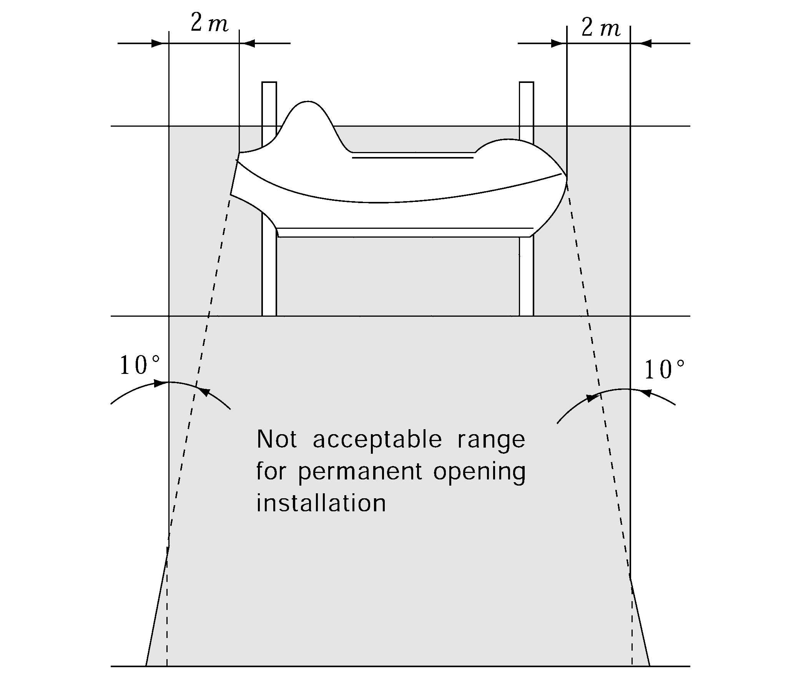
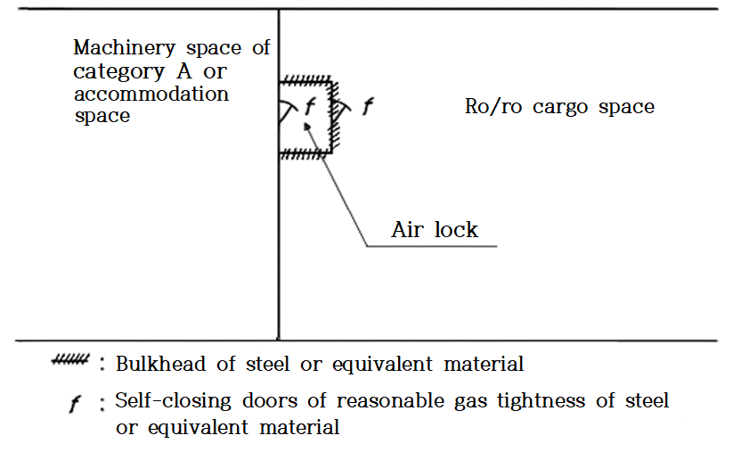

# PART 8 Fire Protection and Fire Extinction

> RULES FOR CLASSIFICATION OF STEEL SHIPS / RA-08-E / 2025 / EN / Guidance

## CHAPTER 13 PROTECTION OF VEHICLE, SPECIAL CATEGORY AND RO-RO SPACES

### Section 1 General Requirements

#### 102. Basic principles for passenger ships

In applying **102. 1** of the Rules, the "Total overall clear height for vehicles" is the sum of distances between deck and web frames of the decks forming one horizontal zone. **【See Rule】**

### Section 2 Precaution against ignition of flammable vapours in closed vehicle spaces closed ro-ro spaces and special category spaces

#### 201. Ventilation systems

- **1.** In applying **201. 2** (4) of the Rules, “the guidelines developed by IMO“ means **MSC.1/Circ.1515 Appendix 1**.*(2018)* **【See Rule】**
- **2.** In applying **201. 3** of the Rules, the requirements to indicate any loss of ventilation capacity is considered complied with by an alarm on the bridge, initiated by fall-out of starter relay of fan motor. **【See Rule】**
- **3.** In applying **201. 4** (1) of the Rules, rapid shutdown of ventilation system is to be provided with dampers which can be isolated by a single action or closing appliances capable of isolation at equivalent closing speed. And ro-ro spaces capable of being sealed are to be capable of being sealed from a location outside of such cargo spaces, if they are protected with a fixed gas fire-extinguishing system. Access routes to the controls for closure of the ventilation system "permit a rapid shutdown" and adequately "take into account the weather and sea conditions" if the routes: **【See Rule】**
  - **(1)** are at least 600 mm clear width;
  - **(2)** are provided with a single handrail or wire rope lifeline not less than 10 mm in diameter, supported by stanchions not more than 10 m apart in way of any route which involves traversing a deck exposed to weather; and
  - **(3)** are fitted with appropriate means of access (such as ladders or steps) to the closing devices of ventilators located in high positions.
  - **(4)** Alternatively, remote closing and position indicator arrangements from the bridge or a fire control station for those ventilator closures is acceptable.
- **4.** In applying **201. 5** of the Rules, "permanent openings" are to be arranged at the outside of the areas within the survival craft length plus 2 $\mathrm{m}$ from its ends in vertical direction on the shell plating under conditions of trim of up to 10 degrees and heel of list of up to 20 degrees. (Refer to **Fig 8.13.1** of the Guidance). **【See Rule】**
  
  **Fig 8.13.1 Not acceptable range for permanent opening installation**

#### 202. Electrical equipment and wiring (2022) 【See Rule】

- **1.** In applying **202. 1** and **203.** of the Rules, the electrical equipment “shall be of a type suitable for use in explosive petrol and air mixtures”, “shall be of a type approved for use in explosive petrol and air mixtures” means to be realized by requiring certified safe equipment suitable for use in **Zone 1** areas as defined in **IEC 60079-10-1:2015** (Gas Group IIA and Temperature Class T3) (Refer to **IEC 60079-14:2013** for types of protection suitable for use in **Zone 1** areas), and ventilation fan of non-sparking type is to be provided and complied with the requirements specified in **Ch 3, 104.** of the Rules. The windlass and opening for chain lockers are to be regarded as sources of ignition.
- **2.** In applying **202. 2** of the Rules, "electrical equipment of a type so enclosed and protected as to prevent the escape of sparks" means to be realized by requiring an enclosure of at least IP55, or apparatus suitable for use in **Zone 2** areas as defined in **IEC 60079-10-1:2015**. Refer to **IEC 60079-14:2013** for types of protection suitable for use in **Zone 2 areas**.

#### 203. Electrical equipment and wiring in exhaust ventilation ducts 【See Rule】

In applying **203.** of the Rules, air ventilation of ro-ro spaces is to be of the exhaust type. However, in the following cases, the ventilation may be of the suction type:

- **1.** In case where there are no openings except to exposed spaces.
- **2.** In case where machinery spaces of category A or accommodation spaces contiguous thereto are provided, and an air-locked corridor is available when access opening for the spaces is provided (see **Fig 8.13.2** of the Guidance).
- **3.** In case where spaces other than those shown in (2) above are adjoining with the spaces and access opening thereto is provided, self-closing door of reasonable gas-tightness is to be provided. However, where the hatch is inevitably installed, this hatch is to be gas-tightness and is to be accompanied by a warning such as "the hatch is to be closed at all times". *(2017)*
  
  **Fig 8.13.2 Air lock** ***(2017)***

### Section 3 Detection and alarm

#### 301. Fixed fire detection and fire alarm systems 【See Rule】

This requirement need not apply to weather decks used for carriage of vehicles with fuel in their tanks.

### Section 5 Fire-extinction

#### 501. Fixed fire-extinguishing systems

- **1.** In applying **501. 1** (3) and **2** of the Rules, a fixed water-based fire fighting system complying with the provisions of the Fire Safety System Code is to be of a type approved and requirements of design and installation complying with MSC.1/Circ.1430 of the recommendation adapted by the IMO. The fire and component tests previously conducted in accordance with MSC.1/Circ.1272 are to be remained valid for the approval of new systems. **【See Rule】**
- **2.** In applying **501. 4** (1) of the Rules, (A), (B), (C) are to be applied above the bulkhead deck and (D) is to be applied below the bulkhead deck. **【See Rule】**
- **3.** In applying **301.** and **501.** of the Rules, the regulations for a fixed fire extinguishing system, fire detection, foam applicators and portable extinguishers need not apply to weather decks used for the carriage of vehicle with fuel in their tanks.

#### 502. Portable fire extinguishers

In applying **502. 2** of the Rules, cargo holds loaded with vehicles with fuel in their tanks which are stowed in open or closed containers need not to be provided with portable fire extinguishers, water-fog applicators and foam applicator units. **【See Rule】** 
