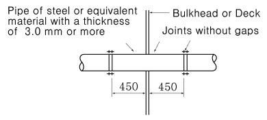
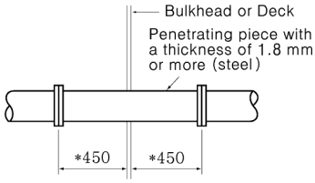
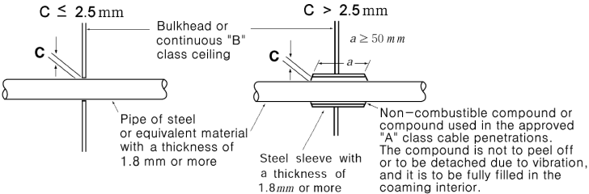
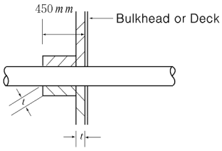
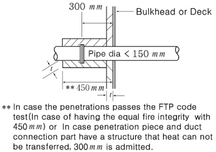
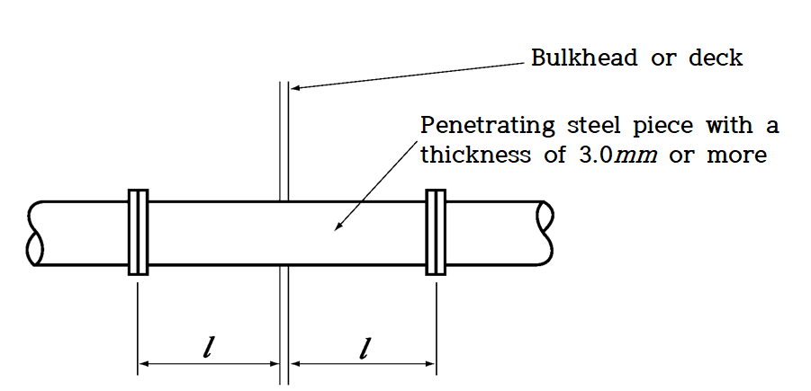
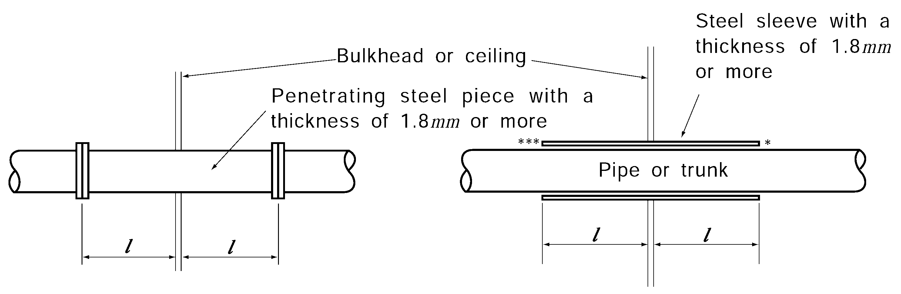

# PART 8 Fire Protection and Fire Extinction

> RULES FOR CLASSIFICATION OF STEEL SHIPS / RA-08-E / 2025 / EN / Guidance

## Annex 8-2 Penetrations through Divisions

### 1. Penetrations of Pipes or Trunks

#### 1.1 Penetrations through “A” and “B” class divisions (steel or equivalent material) (2020)

| Division | Details of penetrations |   |
| --- | --- | --- |
| "A" class division |  |   |
| "B" class division |  |   |
| "B" class division |  |   |
| "B" class division | "B" class division bulkhead or deck: "B" class panel or steel |   |
| Prevention of heat transmission *(2019)* |  | Applicable only to the penetration of "B" class divisions with a pipe diameter of less than 150 mm |
| Prevention of heat transmission *(2019)* |   |  |

#### 1.2 Pipes and trunks made of materials readily rendered ineffective by heat (PVC, FRP, aluminium alloy, lead, etc)

| Division | Details of penetrations |
| --- | --- |
| "A" class division |  The thickness of penetrating pieces may be that of the carbon steel pipes for ordinary piping of national standard according to their nominal diameter. |
| "B" class division |  Pipes or trunks with nominal diameter of 30 mm or less need not comply with this requirement. |
| NOTES: 1. $l$ is the distance from the divisions to the end of sleeve or joint which is to be 450 mm or more, but in case of where in "B" class division, $l$ is to be not less than 300 mm for pipe diameters of less than 150 mm. However, the shorter length may be permitted when the equivalent fire integrity is obtained by a standard fire test for division with a shorter steel sleeve or penetrating piece. 2. The steel penetrating piece or steel sleeve provided on the pipe or trunk on the side of the open end in case where the open end is located within $l$ from the divisions, may be up to the open end. 3. Thermal insulation is to be applied to 150 mm or more of the length on one side of the penetrating pieces or steel sleeves according to the fire integrity of the divisions. The steel penetrating piece or steel sleeve provided on the pipe or trunk on the side of the open end in case where the open end is located within 50 mm from the divisions, may be up to the open end. 4. The pipe is to be connected to the ends of the sleeve by flanges or couplings; or the clearance (with mark ***) between the sleeve and the pipe is not to exceed 2.5 mm; or any clearance between pipe and sleeve is to be made tight by means of non-combustible or other suitable material. 5. Uninsulated metallic pipes penetrating "A-0" or "B-0" class divisions are to be of a suitable material, the melting temperature of which exceeds 950 ℃ for "A-0" and 850 ℃ for "B-0" class divisions. 6. For penetrations in "A" or "B" class divisions, a fire-tested penetration device other than that mentioned above, suitable for the fire resistance of the division pierced and the type of pipe used, may be accepted (reference is made to IMO Res. A.753 (18) and the Fire Test Procedures Code.). |   |
