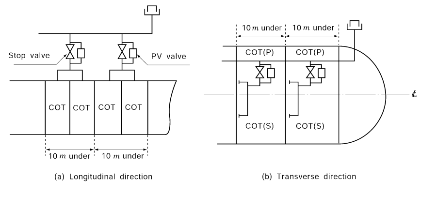

# PART 8 Fire Protection and Fire Extinction

> RULES FOR CLASSIFICATION OF STEEL SHIPS / RA-08-E / 2025 / EN / Guidance

## Annex 8-3 Special Requirements for Ships which are not engaged in international voyage or Ships of less than 500 gross tonnage (Fire-fighting system of ships which are subject to Ships Safety Law of the Korean Government, but not SOLAS, shall follow the relevant requirements)

### 1. For ships of less than 500 gross tonnage or not engaged in international voyage and for restricted service, such ships may be also loosened as follows.

#### (1) Machinery spaces are to be complied with the following requirements,

- **(A)** Means are to be provided in machinery spaces, capable of effectively ventilating to ensure prevention of accumulation of flammable vapours under normal service condition and releasing smoke in the event of fire.
- **(B)** The number of skylights, doors, ventilators, openings in funnels to permit exhaust ventilation and other openings to machinery spaces is to be reduced to a minimum consistent with the needs of ventilation.
- **(C)** The openings given in (B) above are to be provided with the closing arrangement which is capable of being operated from a place outside machinery spaces in the event of fire.
- **(D)** In addition to the requirements given in (A), (B) and (C) above, the periodically unattended machinery spaces are to be provided with the fire protection arrangement as considered appropriately in consideration of the risk of fire where deemed necessary by the Society.

#### (2) For unmanned barges not propelled by mechanical means, the requirements specified in para 1 (1) above need not to apply. For manned barges provided with machinery spaces, the requirements specified in para 1 (1) above are, in principle, to apply. However, the extent and degree of application of the requirements may be modified to a reasonable extent depending on the construction, purpose, etc. of the barges.

#### (3) Where ship is not engaged in international voyage or Ships of less than 500 gross tonnage, the machinery system may be dispensed with as follows:

- **(A)** Where the capacity of fuel oil tank (including fuel valve cooling oil tank, light oil tank, fuel oil additive tank) or lubricating oil tank is not more than 1 $\mathrm{m} ^{3}$, it is to be omitted for the valves or cocks having remote closing means.
- **(B)** In case of passenger ships, it is to be omitted for the requirement of oil level gauges given in **Ch 2, 102. 3** (5) (B) (a) of the Rules.
- **(C)** In application to **Ch 2, 102. 5** (2) of the Rules, the requirements specified in **Ch 2, 102. 5** (2) of the Rules may not be applied except for the following.
  - **(a)** Internal combustion engines having a cylinder bore exceeding 150 mm
  - **(b)** Internal combustion engines having a cylinder bore not exceeding 150 mm and corresponding to the following.
  - **(i)** Where provided for UMA ships and used for main engines or driving generators
    - **(ii)** Where provided for FRP ships with costal service(passenger ship only) and used for main engines having total output of 375 kW or over.
- **(D)** It is to be omitted for the requirement of means of isolating fuel supply and spill piping given in **Ch 2, 102. 5** (5) of the Rules.
- **(E)** In application to **Ch 2, 102. 3** (5) (B) of the Rules, where the glass level gauges comply with the following, tanks having 1 m or less in its full capacity may be provided with round glass level gauges. For small oil tanks other than fuel oil tanks, level gauges made of synthetic resin instead of glass may be used.
  - **(a)** Those are to be approved by the Society or to comply with "$KS$ $V$ 7222 (Glass Level Gauges with Self-closing Valve for Vessels)".
  - **(b)** Where connection pipe of glass level gauge is located under overflow pipe, valve or cock is to be provided on upper part of level gauge.
  - **(c)** Those are to be provided with $K$ or $L$ type protection according to$KS$ $V$7222.
- **(F)** The oil-level gauge installation requirement specified in **Ch 2, 102. 3** (5) (A) (a) of the Rules may be omitted for fuel oil tanks located in the double bottom of ships other than passenger ships. *(2024)*

### 2. For passenger ships, such ships may be also loosened as follows.

#### (1) Fire pumps, etc may be loosened as follows.

- **(A)** Where passenger ships not engaged in international voyage and for restricted service are provided with two fire pumps, the total capacity of fire pumps is not less than two thirds of the quantity required to be dealt with by each of the independent bilge pumps and capable of delivering for fire-fighting purposes such quantity. But, the total capacity of fire pumps need not to exceed 180 $\mathrm{m} ^{3} /h$.
- **(B)** Where passenger ships of less than 1,000 gross tonnage, not engaged in international voyage and for restricted service, one independent fire pump driven by power may be provided. In this cases, passenger ships of less than 100 gross tonnage may be provided with a portable power-driven pump instead of such fire pump.
- **(C)** Where one fire pump is provided by the requirements of (B) above, the total capacity of a fire pump is not less than two thirds of the quantity required to be dealt with by each of the independent bilge pumps and capable of delivering for fire-fighting purposes such quantity. The minimum pressures of all hydrants are to be maintained at 0.3 MPa.
- **(D)** Where passenger ships not engaged in international voyage and for restricted service, the requirements specified in **Ch 8, 101. 2** (1) (A) and (b) of the Rules may be omitted.
- **(E)** Where passenger ships of less than 500 gross tonnage, the requirements for isolating valve specified in **Ch 8, 101. 4** (1) of the Rules may be omitted.
- **(F)** Where passenger ships not engaged in international voyage and for restricted service, the requirements specified in **Ch 8, 101. 5** (2) (B) of the Rules may be omitted.
- **(G)** Where passenger ships not engaged in international voyage and for restricted service, the requirements for "in interior locations in passenger ships carrying more than 36 passengers fire hoses shall be connected to the hydrants at all times." specified in **Ch 8, 103. 1** of the Rules may be omitted.
- **(H)** Where passenger ships not engaged in international voyage and for restricted service, the requirements for water fog applicators specified in **Ch 8, 405.,**, **902. 2.** (2) and **Ch 13, 502. 2.** (1) of the Rules may be omitted.

#### (2) In application of Ch 8, 203. of the Rules, spare fire-extinguishing medium of capacity or weight that can be charged portable fire extinguishers may be provided not less than that obtained by multiplying the number of following table by the number of portable fire extinguishers in accordance with the requirements of this Guidance. In this cases, fire-extinguishing medium that has been charged in portable fire extinguishers provided exceeding the number in accordance with the requirements of this Guidance may be deemed spare charges.

|   |   |
| --- | --- |
| Description | Arrangement ratio |
| Where passenger ships of not less than 1,000 gross tonnage, not engaged in international voyage and for restricted service | 50 % |
| Where passenger ships of 100 gross tonnage and over but less than 1,000 gross tonnage, not engaged in international voyage and for restricted service | 25 % |
| Where passenger ships of less than 100 gross tonnage, not engaged in international voyage and for restricted service | 10 % |

#### (3) A fixed fire detection and fire alarm system may be loosened as follows.

- **(A)** Where passenger ships not engaged in international voyage and for restricted service, the requirements specified in **Ch 5, 101. 4** and **801.** of the Rules may be omitted.
- **(B)** Where passenger ships carrying not more than 36 passengers, not engaged in international voyage and for restricted service, an automatic sprinkler, fire detection and fire alarm system specified in **Ch 5, 303.** of the Rules may be omitted.
- **(C)** Where passenger ships not engaged in international voyage and for restricted service, fire detection and fire alarm system specified in **Ch 5, 304.** and **401.** of the Rules may be omitted.
- **(D)** Where passenger ships of less than 1,000 gross tonnage and carrying more than 36 passengers, not engaged in international voyage and for restricted service, an automatic sprinkler, fire detection and fire alarm system specified in **Ch 5, 302.** and **Ch 8, 501. 1** of the Rules may be omitted.
- **(E)** Where passenger ships not engaged in international voyage and for restricted service, the fixed fire detection and fire alarm system specified in **Ch 5, 201. 2** (2) and **3** of the Rules may be omitted. Spaces having little or no fire risk such as voids, public toilets, carbon dioxide rooms and similar spaces need not be fitted with a fixed fire detection and alarm system.
- **(F)** Where passenger ships not engaged in international voyage and for restricted service, the fixed fire detection and fire alarm system are to be provided at machinery spaces of fibre reinforced plastics ships (hereinafter to as "FRP ships") and having main engines(if the sum of rated power of internal combustion engine is 1,500 kW and over) that employ remote control.
- **(G)** Where passenger ships carrying not more than 36 passengers and not engaged in international voyage and for restricted service, or Where passenger ships of less than 1,000 gross tonnage and carrying more than 36 passengers, not engaged in international voyage and for restricted service, manually operated call points specified in **Ch 5, 501.** of the Rules may be omitted.
- **(H)** Where passenger ships not engaged in international voyage and for restricted service, a special alarm specified in **Ch 5, 701. 4** of the Rules may be omitted.
- **(I)** Where passenger ships not engaged in international voyage and for restricted service, the fixed fire detection and fire alarm system are not capable of individually identifying the compartments.

#### (4) Fire-extinguishing systems in accommodation, service spaces and control stations may be loosened as follows.

- **(A)** Where passenger ships of less than 1,000 gross tonnage, not engaged in international voyage and for restricted service, the requirements specified in **Ch 8, 504.** of the Rules may be omitted.
- **(B)** Where passenger ships not engaged in international voyage and for restricted service, the requirements for exhaust ducts from galley ranges and main laundries specified in **Ch 7, 605.** of the Rules may be omitted.
- **(C)** Where passenger ships of less than 1,000 gross tonnage, not engaged in international voyage and for restricted service, minimum two in each space, so located that there are at least one portable fire extinguisher within 15 m walking distance from any point. In this cases, One of the portable fire-extinguishers intended for use in any space are to be stowed near the entrance to that space.

#### (5) Fire-extinguishing arrangements in machinery spaces may be loosened as follows.

- **(A)** Where passenger ships of less than 1,000 gross tonnage, not engaged in international voyage and for restricted service, machinery space containing oil fuel units (except oil-fired boilers) need not to be fitted with the fixed fire-extinguishing system specified in **Ch 8, 401. 1** of the Rules.
- **(B)** Where passenger ships not engaged in international voyage and for restricted service, additional fire-extinguishing arrangements specified in **Ch 8, 401. 2** of the Rules may be omitted. In this cases, Each firing space in each boiler room and each space in which a part of the oil fuel installation is to be provided with at least one portable fire-extinguisher.
- **(C)** Where passenger ships not engaged in international voyage and for restricted service, portable foam applicator unit in machinery space containing internal combustion machinery may be omitted.
- **(D)** Where passenger ships not engaged in international voyage and for restricted service, oil-fired boilers are to be provided with one of the portable foam-type fire extinguishers having a total capacity of not less than 45 liters or carbon dioxide fire extinguishers having a total capacity of not less than 16 kg or dry powder extinguishers having a total capacity of not less than 23 kg.
- **(E)** Where passenger ships not engaged in international voyage and for restricted service, workshops forming part of machinery spaces and other machinery spaces(auxiliary spaces, electrical equipment spaces, auto-telephone exchange rooms, air conditioning spaces and other similar spaces) specified in **Table 8.8.3** of the Guidance need not to be fitted with portable fire-extinguishers.
- **(F)** Despite of the requirement of (E) above, each space containing hydraulic devices having total output of 3 kW and over or each space containing hydraulic oil tanks are to be provided with at least one portable fire extinguisher. Where any one of following is fulfilled, portable fire extinguishers may be omitted.
  - **(a)** hydraulic oil tank having total capacity of 100 liters and less
  - **(b)** hydraulic oil with a flashpoint of not less than 200 ℃
- **(G)** Where passenger ships not engaged in international voyage and for restricted service, spaces containing internal combustion engines need not to be fitted with fixed fire extinguishing systems specified in **Ch 8, 401. 1** of the Rules. Where any one of following is fulfilled, fixed fire extinguishing systems are to be provided.
  - **(a)** Where passenger ships with the vehicle area are provided main engines having total capacity of 750 kW and over.
  - **(b)** Where FRP ship's engine room is unattended and is provided main engines having total capacity of 1,500 kW and over.
- **(H)** Where passenger ships of less than 300 gross tonnage, not engaged in international voyage and for restricted service, portable fire extinguishers instead of foam-type fire extinguishers of 45 liters capacity specified in **Ch 8, 402. 2** (2) of the Rules in spaces containing internal combustion engines may be provided in accordance with following table.

  |   |   |   |
  | --- | --- | --- |
  | Description |   | minimum number of extinguishers |
  | ships of less than 50 gross tonnage |   | Quantity : one portable fire extinguisher Location : entrance of engine room |
  | ships of 50 gross tonnage and over but less than 300 | Where main engines or auxiliary engines having total capacity of less than 750 kW | Quantity : two portable fire extinguisher Location : easily accessible location |
  | ships of 50 gross tonnage and over but less than 300 | Where main engines or auxiliary engines having total capacity of not less than 750 kW | Quantity : three portable fire extinguisher Location : easily accessible location |
- **(I)** Where passenger ships not engaged in international voyage and for restricted service, fixed local application fire-fighting system specified in **Ch 8, 406.** of the Rules may be omitted.

#### (6) Fire-extinguishing arrangements in cargo spaces may be loosened as follows.

- **(A)** Where passenger ships not engaged in international voyage and for restricted service, fixed fire extinguishing system of cargo spaces specified in **Ch 8, 601. 1** and **2** of the Rules may be omitted.

#### (7) Fire-fighter's outfit may be loosened as follows.

- **(A)** Where passenger ships not engaged in international voyage and for restricted service, fire-fighter's outfit may be omitted. But, ships in which motor vehicles with fuel in their tanks for their own propulsion are to be complied as follow:
  - **(a)** Where passenger ships with enclosed vehicle spaces: 2
  - **(b)** Where passenger ships of not less than 100 gross tonnage and with opened vehicle spaces: 1
  - **(c)** Where passenger ships of less than 100 gross tonnage and with opened vehicle spaces: one axe and one lifeline
- **(B)** Where FRP passenger ships of 30 gross tonnage and over but less than 100, not engaged in international voyage and for restricted service, are provided additionally one breathing apparatus.
- **(C)** Where passenger ships not engaged in international voyage and for restricted service, emergency escape breathing devices may be omitted. In this cases, passenger ships of not less than 1,600 gross tonnage are provided with at least three emergency escape breathing devices (including one spare) in accommodation and at least two emergency escape breathing devices in machinery spaces.

#### (8) Where passenger ships of less than 500 gross tonnage, international shore connections may be omitted.

#### (9) Where passenger ships not engaged in international voyage and for restricted service, periodically unattended machinery space are to be provided as follows.

- **(A)** Automatic fire extinguishing system in accordance with FSS Code or fixed fire extinguishing system specified in **Ch 8, 301. 1** of the Rules, fixed fire detection and fire alarm systems specified in **Ch 5, 202.** of the Rules are to be provided. Where steel ships, it can be replaced by providing fixed fire detection systems, fixed fire alarm systems and at least two portable dry-powder fire extinguishers (ABC-class) or at least two portable carbon-dioxide fire extinguishers at each entrance of machinery spaces.
- **(B)** Following fire extinguishing arrangements are to be provided. Minimum two in each spaces, so located that there are at least one portable fire extinguisher specified in (b) within 10 m walking distance from any point.
  - **(a)** One of the portable foam-type fire extinguishers having a total capacity of not less than 45 liters or carbon dioxide fire extinguishers having a total capacity of not less than 16 kg or dry powder extinguishers having a total capacity of not less than 23 kg.
  - **(b)** At least two portable fire extinguishers
- **(C)** Where any one of following is fulfilled despite of the requirement of (A) above, machinery space containing internal combustion engines are to be provided with fixed fire extinguishing system specified in **Ch 8, 301. 1** of the Rules.
  - **(a)** Where passenger ships with the vehicle area are provided main engines having total capacity of 750 kW or over.
  - **(b)** Where FRP passenger ship's engine room is unattended and is provided main engines having total capacity of 1,500 kW or over.

#### (10) Where passenger ships not engaged in international voyage and for restricted service, fire-fighting appliances of the helideck specified in Ch 11, 401. of the Rules may be omitted.

#### (11) Fire-extinguishing arrangements in vehicle and ro-ro spaces may be loosened as follows.

- **(A)** Where passenger ships not engaged in international voyage and for restricted service, enclosed vehicle spaces may omit water fog applicators specified in **Ch 13, 502. 2** (1) of the Rules.
- **(B)** In application of **Ch 13, 301.** of the Rules, fixed fire detection and fire alarm systems on weather decks may be omitted.

### 3. For cargo ships, such ships may be also loosened as follows.

#### (1) Fire pumps, etc may be loosened as follows.

- **(A)** Where cargo ships of less than 300 gross tonnage, not engaged in international voyage and for restricted service, fire pumps specified in **Ch 8, 102. 2** (2) of the Rules may be omitted.
- **(B)** Where cargo ships of not less than 300 gross tonnage, not engaged in international voyage and for restricted service or where cargo ships of 300 gross tonnage and over but less than 500 gross tonnage, one independent fire pump driven by power specified in **Ch 8, 102. 2** (2) of the Rules may be provided.
- **(C)** Where cargo ships not engaged in international voyage and for restricted service or where cargo ships of less than 500 gross tonnage, are to be provided two fire pumps, the total capacity of fire pumps is not less than two thirds of the quantity required to be dealt with by each of the independent bilge pumps and capable of delivering for fire-fighting purposes such quantity. But the total required capacity of the fire pumps need not to exceed 180 $\mathrm{m} ^{3} /h$.
- **(D)** Where one fire pump is provided by the requirements of (B) above, the total capacity of a fire pump is not less than two thirds of the quantity required to be dealt with by each of the independent bilge pumps and capable of delivering for fire-fighting purposes such quantity. The minimum pressures of all hydrants are to be maintained at 0.24 MPa.
- **(E)** Where cargo ships not engaged in international voyage and for restricted service or where cargo ships of less than 500 gross tonnage, the requirements for emergency fire pump may be omitted.
- **(F)** Where cargo ships of not less than 300 gross tonnage, not engaged in international voyage and for restricted service or where cargo ships of 300 gross tonnage and over but less than 500 gross tonnage, the number and position of hydrants are to be such that at least one jet of water by a single length of hose. In this cases, it may reach any part of the ship normally accessible to the passengers or crew while the ships is being navigated and any part of any cargo space when empty.
- **(G)** Where cargo ships of less than 300 gross tonnage, the requirements for the number and position of hydrants specified in **Ch 8, 101. 5** of the Rules may be omitted.
- **(H)** Where cargo ships of less than 1,000 gross tonnage or where cargo ships not engaged in international voyage and for restricted service, spare fire hoses and nozzles specified in **Ch 8, 103. 2** (3) of the Rules may be omitted.
- **(I)** Where cargo ships of less than 300 gross tonnage, the requirements specified in **Ch 8, 103. 2.** (3) may be omitted.
- **(J)** Where cargo ships not engaged in international voyage and for restricted service or where cargo ships of less than 500 gross tonnage, the requirements for isolating valves specified in **Ch 8, 101. 4** (1) of the Rules may be omitted.

#### (2) In application of Ch 8, 203. of the Rules, spare fire-extinguishing medium of capacity or weight that can be charged portable fire extinguishers may be provided not less than that obtained by multiplying the number of following table by the number of portable fire extinguishers in accordance with the requirements of this Guidance. In this cases, fire-extinguishing medium that has been charged in portable fire extinguishers provided exceeding the number in accordance with the requirements of this Guidance may be deemed spare charges.

|   |   |
| --- | --- |
| Description | Arrangement ratio |
| Where cargo ships not engaged in international voyage and for restricted service or where cargo ships of less than 500 gross tonnage | 10 % |

#### (3) A fixed fire detection and fire alarm system may be loosened as follows.

- **(A)** Where cargo ships not engaged in international voyage and for restricted service or where cargo ships of less than 500 gross tonnage, fixed fire detection and fire alarm systems specified in **Ch 5, 201. 2** (2) and **3** of the Rules may be omitted. Spaces having little or no fire risk such as voids, public toilets, carbon dioxide rooms and similar spaces need not be fitted with a fixed fire detection and alarm system.
- **(B)** Where cargo ships not engaged in international voyage and for restricted service or where cargo ships of less than 500 gross tonnage, manually operated call points specified in **Ch 5, 501.** of the Rules may be omitted.
- **(C)** Where cargo ships not engaged in international voyage and for restricted service or where cargo ships of less than 500 gross tonnage, n automatic sprinkler, fire detection and fire alarm systems specified in **Ch 5, 305.** of the Rules may be omitted.

#### (4) Fire-extinguishing systems in accommodation, service spaces and control stations may be loosened as follows.

- **(A)** Where cargo ships not engaged in international voyage and for restricted service or where cargo ships of less than 500 gross tonnage, the requirements specified in **Ch 8, 504.** of the Rules may be omitted.
- **(B)** Where cargo ships not engaged in international voyage and for restricted service or where cargo ships of less than 500 gross tonnage, the requirements for exhaust ducts from galley ranges and main laundries specified in **Ch 7, 605.** of the Rules may be omitted.
- **(C)** In application of **Ch 8, 202.** of the Rules, at least four portable fire extinguishers for ships of 500 gross tonnage and over but less than 1,000 gross tonnage, at least three portable fire extinguishers for ships of 100 gross tonnage and over but less than 500 gross tonnage, at least two portable fire extinguishers for ships of 50 gross tonnage and over but less than 100 gross tonnage, and at least one portable fire extinguisher for ships of less than 50 gross tonnage, are to be provided in accommodation and service spaces as appropriate.

#### (5) Fire-extinguishing arrangements in machinery spaces may be loosened as follows.

- **(A)** Where cargo ships of less than 1,000 gross tonnage, not engaged in international voyage and for restricted service or where cargo ships of less than 500 gross tonnage, machinery space containing oil fuel units (except oil-fired boilers) need not to be fitted with the fixed fire-extinguishing system specified in **Ch 8, 401.** of the Rules.
- **(B)** Where cargo ships of less than 500 gross tonnage, the fixed low-expansion foam fire-extinguishing systems as the fixed fire-extinguishing systems may be provided.
- **(C)** Where cargo ships not engaged in international voyage and for restricted service or where cargo ships of less than 500 gross tonnage, additional fire-extinguishing arrangements specified in **Ch 8, 401. 2** of the Rules may be omitted. In this cases, Each firing space in each boiler room and each space in which a part of the oil fuel installation is to be provided with at least one portable fire-extinguisher.
- **(D)** Where cargo ships of less than 500 gross tonnage, spaces containing internal combustion engines need not to be fitted with the fixed fire extinguishing system specified in **Ch 8, 402. 1** of the Rules. However, in ships of less than 500 gross tonnage and having cargo spaces intended for the carriage of motor vehicles with fuel in their tanks for their ownpropulsion (except ships registered with the notation "S"), this requirement is not to apply for places containing internal combustion engines (only those of their total output of not less than 750 kW for main propulsion).
- **(E)** Where cargo ships not engaged in international voyage and for restricted service or where cargo ships of less than 500 gross tonnage, portable foam applicator unit in machinery space containing internal combustion machinery may be omitted.
- **(F)** Where cargo ships or less than 1,000 gross tonnage, not engaged in international voyage and for restricted service or where cargo ships of less than 500 gross tonnage, machinery spaces containing internal combustion engines need not to be fitted with the portable foam-type fire extinguishers having a total capacity of not less than 45 liters specified in **Ch 8, 402. 2** (2) of the Rules.
- **(G)** Where cargo ships not engaged in international voyage and for restricted service or where cargo ships of less than 500 gross tonnage, workshops forming part of machinery spaces and other machinery spaces(auxiliary spaces, electrical equipment spaces, auto-telephone exchange rooms, air conditioning spaces and other similar spaces) specified in **Table 8.8.3** of the Guidance need not to be fitted with portable fire-extinguishers.
- **(H)** Despite of the requirement of (G) above, each space containing hydraulic devices having total output of 3 kW or over or each space containing hydraulic oil tanks are to be provided with at least one portable fire extinguisher. Where any one of following is fulfilled, portable fire extinguishers may be omitted.
  - **(a)** hydraulic oil tank having total capacity of 100 liters or less
  - **(b)** hydraulic oil with a flashpoint of not less than 200℃

#### (6) Fire-extinguishing arrangements in cargo spaces may be loosened as follows.

- **(A)** Where cargo ships of less than 2,000 gross tonnage (except tankers), cargo spaces need not to be fitted with fixed fire extinguishing systems specified in **Ch 8, 601. 3** of the Rules. But, this requirement is not to apply to vehicle and ro-ro spaces.

#### (7) Fire-fighter's outfit may be loosened as follows.

- **(A)** Where cargo ships not engaged in international voyage and for restricted service or where cargo ships of less than 500 gross tonnage, fire-fighter's outfit may be omitted. But, ships in which motor vehicles with fuel in their tanks for their own propulsion are to be complied as follow:
  - **(a)** Where cargo ships with enclosed vehicle spaces : 2
  - **(b)** Where cargo ships of not less than 100 gross tonnage and with opened vehicle spaces : 1
  - **(c)** Where cargo ships of less than 100 gross tonnage and with opened vehicle spaces : one axe and one lifeline
- **(B)** Where cargo ships not engaged in international voyage and for restricted service or where cargo ships of less than 500 gross tonnage, emergency escape breathing devices may be omitted.

#### (8) Where cargo ships not engaged in international voyage and for restricted service or where cargo ships of less than 500 gross tonnage, international shore connections may be omitted.

#### (9) Where cargo ships not engaged in international voyage and for restricted service or where cargo ships of less than 500 gross tonnage, periodically unattended machinery space may be loosened as follows.

- **(A)** The fixed fire detection and fire alarm system specified in **Ch 5, 201. 1** of the Rules may be omitted.
- **(B)** Fire extinguishing system are to be provided as follows.
  - **(a)** Automatic fire extinguishing system in accordance with FSS Code or fixed fire extinguishing system specified in **Ch 8, 301. 1** of the Rules, fixed fire detection and fire alarm systems specified in **Ch 5, 202.** of the Rules are to be provided. Where steel ships, it can be replaced by providing fixed fire detection systems, fixed fire alarm systems and at least two portable dry-powder fire extinguishers (ABC-class) or at least two portable carbon-dioxide fire extinguishers at each entrance of machinery spaces.
  - **(b)** Following fire extinguishing arrangements are to be provided. Minimum two in each spaces, so located that there are at least one portable fire extinguisher specified in (ii) within 10 m walking distance from any point.
  - **(i)** One of the portable foam-type fire extinguishers having a total capacity of not less than 45 liters or carbon dioxide fire extinguishers having a total capacity of not less than 16 kg or dry powder extinguishers having a total capacity of not less than 23 kg.
    - **(ii)** At least two portable fire extinguishers
  - **(c)** Where any one of following is fulfilled despite of the requirement of (A) above, machinery space containing internal combustion engines are to be provided with fixed fire extinguishing system specified in **Ch 8, 301. 1** of the Rules.
  - **(i)** Where cargo ships with the vehicle area are provided main engines having total capacity of 750 kW or over.
    - **(ii)** Where FRP cargo ship's engine room is unattended and is provided main engines having total capacity of 1,500 kW or over.
- **(C)** The requirements specified in **Ch 8, 101. 2** (2) of the Rules may be omitted.

#### (10) Fire-extinguishing arrangements for tankers may be loosened as follows.

- **(A)** Where tankers of less than 500 gross tonnage, pump room need not to be provided with the fixed fire extinguishing system specified in **Ch 8, 801.** of the Rules.
- **(B)** Where tankers of less than 500 gross tonnage, deck foam system specified in **Ch 8, 701.** of the Rules may be omitted.

#### (11) Where cargo ships not engaged in international voyage and for restricted service or where cargo ships of less than 500 gross tonnage, fire-fighting appliances of the helideck specified in Ch 11, 401. of the Rules may be omitted.

#### (12) The cargo ships (cargo ferries, etc.) provided with spaces to carry motor vehicles with fuel in their tanks for their own propulsion (hereinafter referred as "car spaces"), are to comply with the Guidance Pt 7, Annex 7-3 10 (2).

#### (13) In applying Ch 2, 403. 2 (2) of the Rules, the alleviation provision for isolation requirement of cargo oil tank for tankers of less than 500 ton gross tonnage as follows ;

Where the arrangements are the plural cargo oil tank and each cargo oil tank of less than 10 $\mathrm{mm}$ length, these plural cargo oil tank may be regarded as one cargo oil tank.(See **Fig Annex 8-3**)

**Fig. Annex 8-3 Isolation of cargo oil tank for tankers of less than 500 ton gross tonnage**

#### (14) In application of Ch 9, 503. 2 of the Rules, where oil tankers not engaged in international voyage and for restricted service, a secondary means for over-pressure or under-pressure protection may be omitted.

#### (15) Fire-extinguishing arrangements in vehicle and ro-ro spaces may be loosened as follows.

- **(A)** Where cargo ships not engaged in international voyage and for restricted service or where cargo ships of less than 500 gross tonnage, the requirements specified in **Ch 13, 502. 2** of the Rules may be omitted.
- **(B)** Where cargo ships not engaged in international voyage, for restricted service and for carrying non-combustible cargoes exclusively in vehicle and ro-ro spaces, fixed fire extinguishing systems specified in **Ch 13, 501.** of the Rules may be omitted.
- **(C)** Where cargo ships not engaged in international voyage and for restricted service or where cargo ships of less than 500 gross tonnage, vehicle and ro-ro spaces are capable of being sealed from a location outside of the cargo spaces need not to be provided with fixed fire extinguishing systems specified in **Ch 13, 501.** of the Rules.
- **(D)** Where cargo ships not engaged in international voyage and for restricted service, enclosed vehicle and ro-ro spaces need not to be provided with portable combustible gas detecting instruments specified in **Ch 13, 201. 2** (2) of the Rules.
- **(E)** Where cargo ships not engaged in international voyage and for restricted service or where cargo ships of less than 500 gross tonnage, vehicle and ro-ro spaces are to be provided with the fixed fire detection and fire alarm systems specified in **Ch 13, 301.** of the Rules. If an efficient fire patrol system are to be maintained by a continuous fire watch at all times during the voyage, the fixed fire detection and fire alarm systems may be omitted.
