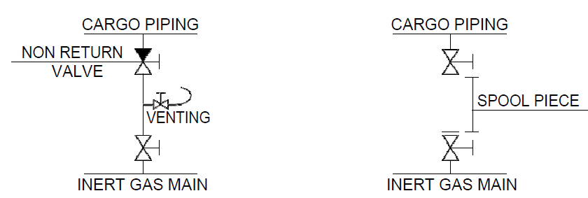

# PART 8 Fire Protection and Fire Extinction

> RULES FOR CLASSIFICATION OF STEEL SHIPS / RA-08-E / 2025 / EN / Guidance

## Annex 8-5 Inert Gas Systems

### 1. Definitions

#### (1) Cargo tanks means those cargo tanks, including slop tanks, which carry cargoes, or cargo residues, having a flash point not exceeding 60 ℃.

#### (2) Inert gas system includes inert gas systems using flue gas, inert gas generators, and nitrogen generators and meas the inert gas plant and inert gas distribution together with means for preventing back flow of cargo gases to machinery spaces, fixed and portable measuring instruments and control devices.

#### (3) Gas-safe space is a space in which the entry of gases would produce hazards with regard to flammability or toxicity.

#### (4) Gas-free is a condition in a tank where the content of hydrocarbon or other flammable vapour is less than 1% of the lower flammable limit(LFL), the oxygen content is at least 21%, and no toxic gases are present.

### 2. General requirements

#### (1) The system shall be capable of inerting empty cargo tanks and maintaining the atmosphere in any part of the tank with an oxygen content not exceeding 8% by volume and at a positive pressure in port and at sea except when it is necessary for such a tank to be gas-free;

#### (2) The system shall be capable of eliminating the need for air to enter a tank during normal operations except when it is necessary for such a tank to be gas-free;

#### (3) The system shall be capable of purging empty cargo tanks of hydrocarbon or other flammable vapours, so that subsequent gas-freeing operations will at no time create a flammable atmosphere within the tank;

#### (4) The system shall be capable of delivering inert gas to the cargo tanks at a rate of at least 125% of the maximum rate of discharge capacity of the ship expressed as a volume. For chemical tankers and chemical/product tankers, the Society may accept inert gas systems having a lower delivery capacity provided that the maximum rate of discharge of cargoes from cargo tanks being protected by the system is restricted to not more than 80 % of the inert gas capacity; and

#### (5) The system shall be capable of delivering inert gas with an oxygen content of not more than 5% by volume to the cargo tanks at any required rate of flow.

#### (6) Materials used in inert gas systems shall be suitable for their intended purpose. In particular, those components which may be subjected to corrosive action of the gases and/or liquids are to be either constructed of corrosion-resistant material or lined with rubber, glass fibre epoxy resin or other equivalent coating material.

#### (7) The inert gas supply may be:

- **(A)** treated flue gas from main or auxiliary boilers, or
- **(B)** gas from an oil or gas-fired gas generator, or
- **(C)** gas from nitrogen generators.
  Inert gas system using stored carbon dioxide will not be permitted unless the Society is satisfied that there is no risk of ignition from generation of static electricity by the system itself.

#### (8) Safety measures

- **(A)** The inert gas system shall be so designed that the maximum pressure which it can exert on any cargo tank will not exceed the test pressure of any cargo tank.
- **(B)** Automatic shutdown of the inert gas system and its components parts shall be arranged on predetermined limits being reached, taking into account the provisions of (11), **3** (7) and **4** (5). The automatic shut-down of the inert gas system and its components shall involve the following: *(2019)*
  - **(a)** Shut-down of fans and closing of regulating valve for the following:
  - **(i)** High water level in scrubber (not applicable for N2)
    - **(ii)** Low pressure/flow to scrubber (not applicable for N2)
    - **(iii)** High-high temperature of inert gas supply
  - **(b)** Closing of regulating valve in the event of:
  - **(i)** High oxygen content (in excess of 5% by volume)
    - **(ii)** Failure of blowers/fans or N2 compressors
  - **(c)** Activation of double-block and bleed arrangement upon (for ships with double block and bleed replacing water seal):
  - **(i)** Loss of inert gas supply
    - **(ii)** Loss of power
- **(C)** Suitable shutoff arrangements shall be provided on the discharge outlet of each generator plant.
- **(D)** The system shall be designed to ensure that if the oxygen content exceeds 5% by volume, the inert gas shall be automatically vented to atmosphere.
- **(E)** Arrangements shall be provided to enable the functioning of the inert gas plant to be stabilized before commencing cargo discharge. If blowers are to be used for gas-freeing, their air inlets shall be provided with blanking arrangements.
- **(F)** Where a double block and bleed valve is installed, the system shall ensure upon of loss of power, the block valves are automatically closed and the bleed valve is automatically open.

#### (9) Non-return devices

- **(A)** At least two non-return devices shall be fitted in order to prevent the return of vapour and liquid to the inert gas plant, or to any gas-safe spaces.
- **(B)** The first non-return device shall be a deck seal of the wet, semi-wet, or dry type or a double-block and bleed arrangement. Two shut-off valves in series with a venting valve in between, may be accepted provided:
  - **(a)** the operation of the valve is automatically executed. Signal(s) for opening/closing is (are) to be taken from the process directly, e.g. inert gas flow or differential pressure; and
  - **(b)** alarm for faulty operation of the valves is provided, e.g. the operation status of "blower stop" and "supply valve(s) open" is an alarm condition.
- **(C)** The second non-return device shall be a non-return valve or equivalent capable of preventing the return of vapours and liquids and fitted between the deck water seal (or equivalent device) and the first connection from the inert gas main to a cargo tank. It shall be provided with positive means of closure. As an alternative to positive means of closure, an additional valve having such means of closure may be provided between the non-return valve and the first connection to the cargo tanks to isolate the deck water seal, or equivalent device, from the inert gas main to the cargo tanks.
- **(D)** A water seal, if fitted, shall be capable of being supplied by two separate pumps, each of which shall be capable of maintaining an adequate supply at all times. The audible and visual alarm on the low level of water in the water seal shall operate at all times.
- **(E)** The arrangement of the water seal, or equivalent devices, and its associated fittings shall be such that it will prevent backflow of vapours and liquids and will ensure the proper functioning of the seal under operating conditions.
- **(F)** Provision shall be made to ensure that the water seal is protected against freezing, in such a way that the integrity of seal is not impaired by overheating.
- **(G)** A water loop or other approved arrangement shall also be fitted to each associated water supply and drain pipe and each venting or pressure-sensing pipe leading to gas-safe spaces. Means shall be provided to prevent such loops from being emptied by vacuum.
- **(H)** Any water seal, or equivalent device, and loop arrangements shall be capable of preventing return of vapours and liquids to an inert gas plant at a pressure equal to the test pressure of the cargo tanks.
- **(I)** The non-return devices shall be located in the cargo area on deck.

#### (10) Inert gas lines

- **(A)** The inert gas main may be divided into two or more branches forward of the non-return devices required by (9).
- **(B)** The inert gas supply main shall be fitted with branch piping leading to each cargo tank. Branch piping for inert gas shall be fitted with either stop valves or equivalent means of control for isolating each tank. Where stop valves are fitted, they shall be provided with locking arrangements, which shall be under the control of a responsible ship's officer. The control system operated shall provide unambiguous information of the operational status of such valves to at least the control panel required in (11). Unambiguous information regarding the operational status of stop valves in branch piping leading from the inert gas main to cargo tanks means position indicators providing open/intermediate/closed status information in the control panel required in (11). Limit switches are to be used to positively indicate both open and closed position. Intermediate position status is to be indicated when the valve is in neither open nor closed position. *(2019)*
- **(C)** Each cargo tank not being inerted shall be capable of being separated from the inert gas main by:
  - **(a)** removing spool-pieces, valves or other pipe sections, and blanking the pipe ends; or
  - **(b)** arrangement of two spectacle flanges in series with provisions for detecting leakage into the pipe between the two spectacle flanges
  - **(c)** equivalent arrangements to the satisfaction of the Administration, providing at least the same level of protection. *(2021)*
- **(D)** Means shall be provided to protect cargo tanks against the effect of overpressure or vacuum caused by thermal variations when the cargo tanks are isolated from the inert gas mains.
- **(E)** Piping systems shall be so designed as to prevent the accumulation of cargo or water in the pipelines under all normal conditions.
- **(F)** Arrangements shall be provided to enable the inert gas main to be connected to an external supply of inert gas. The arrangements shall consist of a 250 $\mathrm{mm}$ nominal pipe size bolted flange, isolated from the inert gas main by a valve and located forward of the non-return valve. The design of the flange should conform to the appropriate class in the standards adopted for the design of other external connections in the ship's cargo piping system.
- **(G)** If a connection is fitted between the inert gas supply main and the cargo piping system, arrangements shall be made to ensure an effective isolation having regard to the large pressure difference which may exist between the systems. This shall consist of two shutoff valves with an arrangement to vent the space between the valves in a safe manner or an arrangement consisting of a spool-piece with associated blanks. (see **Fig Annex 8-5**)
- **(H)** The valve separating the inert gas supply main from the cargo main and which is on the cargo main side shall be a non-return valve with a positive means of closure. As a guide, the effective isolation required by this regulation may be achieved by the two arrangements shown in the following sketches attached **Fig Annex 8-5.2.**
  
  **Fig. Annex 8-5.2**
- **(I)** Inert gas piping systems shall not pass through accommodation, service and control station spaces.
- **(J)** In combination carriers, the arrangement to isolate the slop tanks containing oil or oil residues from other tanks shall consist of blank flanges which will remain in position at all times when cargoes other than oil are being carried except as provided for in the relevant section of the Guidelines on Inert Gas Systems (MSC/Circ.353 and MSC/Circ.387).
- **(K)** Piping of inert gas system shall have electrical continuity over their entire lengths including couplings and flanges (except shore connections) and be so designed as to minimize the risk of ignition from the generation of static electricity by itself. *(2019)*

#### (11) Indicators and alarms

- **(A)** The operation status of the inert gas system shall be indicated in a control panel. The operational status of the inert gas system is to be based on indication that inert gas is being supplied downstream of the gas regulating valve and on the pressure or flow of the inert gas mains downstream of the non-return devices. However, the operational status of the IG system is not to be considered to require additional indicators and alarms other than those specified in the **2** (11) and **3** (7) or **4** (9), as appropriate. *(2019)*
- **(B)** Instrumentation shall be fitted for continuously indicating and permanently recording, when inert gas is being supplied:
  - **(a)** the pressure of the inert gas supply mains forward of the non-return devices; and
  - **(b)** the oxygen content of the inert gas.
- **(C)** The indicating and recording devices shall be placed in the cargo control room where provided. But where no cargo control room is provided, they shall be placed in a position easily accessible to the officer in charge of cargo operations.
- **(D)** In addition, meters shall be fitted:
  - **(a)** in the navigating bridge to indicate at all times the pressure referred to in (11) (B) (a) and the pressure in the slop tanks of combination carriers, whenever those tanks are isolated from the inert gas supply main; and
  - **(b)** in the machinery control room or in the machinery space to indicate the oxygen content referred to in (11) (B) (b).
- **(E)** Audible and visual alarms
  - **(a)** Audible and visual alarms shall be provided, based on the system designed, to indicate:
  - **(i)** oxygen content in excess of 5% by volume;
    - **(ii)** failure of the power supply to the indicating devices as referred to in (11) (B);
    - **(iii)** gas pressure less than 100 mm water gauge. The alarm arrangement shall be such as to ensure that the pressure in slop tanks in combination carriers can be monitored at all times;
    - **(iv)** high-gas pressure; and
  - **(v)** failure of the power supply to the automatic control system.
  - **(b)** The alarms required in (11) (E) (a) (i), (11) (E) (a) (iii) and (11) (E) (a) (v) shall be fitted in the machinery space and cargo control room, where provided, but in each case in such a position that they are immediately received by responsible members of the crew.
  - **(c)** An audible alarm system independent of that required in (11) (E) (a) (iii) or automatic shutdown of cargo pumps shall be provided to operate on predetermined limits of low pressure in the inert gas main being reached. The term “independent alarm system” means that a second pressure sensor, independent of the sensor serving the alarms for low pressure, high pressure and pressure indication/recorder is to be provided. Notwithstanding the above, a common programmable logic controller (PLC) is, however, accepted for the alarms in the control system. The independent sensor is not required if the system is arranged for the shutdown of cargo pumps. If a system for shutdown of cargo pumps is arranged, an automatic system shutting down all cargo pumps is to be provided. The shutdown is to be alarmed at the control station. The shutdown shall not prevent the operation of ballast pumps or pumps used for bilge drainage of a cargo pump room. *(2019)*
  - **(d)** Two oxygen sensors shall be positioned at appropriate locations in the space or spaces containing the inert gas system. If the oxygen level falls below 19%, these sensors shall trigger alarms, which shall be both visible and audible inside and outside the space or spaces and shall be placed in such a position that they are immediately received by responsible members of the crew.

#### (12) Instruction manuals

Detailed instruction manuals shall be provided on board, covering the operations, safety and maintenance requirements and occupational health hazards relevant to the inert gas system and its application to the cargo tank system. The manuals shall include guidance on procedures to be followed in the event of a fault or failure of the inert gas system.(**MSC/Circ.353** and **MSC/Circ.387**)

### 3. Requirements for flue gas and inert gas generator systems

#### (1) Inert gas generator

- **(A)** Two fuel oil pumps shall be fitted to the inert gas generator. Suitable fuel in sufficient quantity shall be provided for the inert gas generators.
- **(B)** The inert gas generators shall be located outside the cargo tank area. Spaces containing in ert gas generators shall have no direct access to accommodation service or control station spaces, but may be located in machinery spaces. If they are not located in machinery spaces, such a compartment shall be separated by a gastight steel bulkhead and/or deck from accommodation, service and control station spaces. Adequate positive pressure type mechanical ventilation shall be provided for such a compartment.

#### (2) Gas regulating valves

- **(A)** A gas regulating valve shall be fitted in the inert gas main. This valve shall be automatically controlled to close, as required in **2** (8) (B). It shall also be capable of automatically regulating the flow of inert gas to the cargo tanks unless means are provided to automatically control the inert gas flow rate.
- **(B)** The gas regulating valve shall be located at the forward bulkhead of the forward most gas-safe space through which the inert gas main passes.

#### (3) Cooling and scrubbing arrangement

- **(A)** Means shall be fitted which will effectively cool the volume of gas specified in paragraphs **2** (1) to **2** (5) and remove solids and sulphur combustion products. The cooling water arrangements shall be such that an adequate supply of water will always be available without interfering with any essential services on the ship. Provision shall also be made for an alternative supply of cooling water.
- **(B)** Filters or equivalent devices shall be fitted to minimize the amount of water carried over to the inert gas blowers.

#### (4) Blower

- **(A)** At least two blowers shall be fitted and be capable of delivering to the cargo tanks at least the volume of gas required by paragraphs **2** (1) to **2** (5). For systems with gas generators the Society may permit only one blower if that system is capable of delivering the total volume of gas required by paragraphs **2** (1) to **2** (5) to the protected cargo tanks, provided that sufficient spares for the blower and its prime mover are carried on board to enable any failure of the blower and its prime mover to be rectified by the ship's crew. The spare parts for blower and its prime mover means generally important component, and it is contained comprising a motor, starter and complete rotating element, including bearings of each type. The additional component may be required according to manufacture’s recommendation and type of blower except above this. *(2017)*
- **(B)** Where inert gas generators are served by positive displacement blowers, a pressure relief device shall be provided to prevent excess pressure being developed on the discharge side of the blower.
- **(C)** When two blowers are provided, the total required capacity of the inert gas system shall be divided evenly between the two and in no case is one blower to have a capacity less than 1/3 of the total required.

#### (5) For systems using flue gas, flue gas isolating valves shall be fitted in the inert gas mains between the boiler uptakes and the flue gas scrubber. These valves shall be provided with indicators to show whether they are open or shut, and precautions shall be taken to maintain them gastight and keep the seatings clear of soot. Arrangements shall be made to ensure that boiler soot blowers cannot be operated when the corresponding flue gas valve is open.

#### (6) Prevention of flue gas leakage

- **(A)** Special consideration shall be given to the design and location of scrubber and blowers with relevant piping and fittings in order to prevent flue gas leakages into enclosed spaces.
- **(B)** To permit safe maintenance, an additional water seal or other effective means of preventing flue gas leakage shall be fitted between the flue gas isolating valves and scrubber or incorporated in the gas entry to the scrubber.

#### (7) Indicators and alarms

- **(A)** In addition to the requirements in paragraph **2** (1) to **2** (5), means shall be provided for continuously indicating the temperature of the inert gas at the discharge side of the system, whenever it is operating.
- **(B)** In addition to the requirements of **2** (11) (E), audible and visual alarms shall be provided to indicate:
  - **(a)** insufficient fuel oil supply to the oil-fired inert gas generator;
  - **(b)** failure of the power supply to the generator;
  - **(c)** low water pressure or low water flow rate to the cooling and scrubbing arrangement;
  - **(d)** high water level in the cooling and scrubbing arrangement;
  - **(e)** high gas temperature;
  - **(f)** failure of the inert gas blowers; and
  - **(g)** low water level in the water seal.

### 4. Requirements for nitrogen generator systems

#### (1) The system shall be provided with one or more compressors to generate enough positive pressure to be capable of delivering the total volume of gas required by paragraph 2 (1) to 2 (5).

#### (2) A feed air treatment system is to be fitted to remove free water, particles and traces of oil from the compressed air, and to preserve the specification temperature.

#### (3) The following requirements are specific only to the gas generator system and apply where inert gas is produced by separating air into its component gases by passing compressed air through a bundle of hollow fibres, semi-permeable membranes or absorber materials.

#### (4) A nitrogen generator is to consist of a feed air treatment system and any number of membrane or absorber modules in parallel necessary to meet 2 (4).

#### (5) The air compressor and nitrogen generator may be installed in the engine-room or in a separate compartment. A separate compartment and any installed equipment shall be treated as an "Other machinery space" with respect to fire protection. Where a separate compartment is provided for the nitrogen generator, the compartment shall be fitted with an independent mechanical extraction ventilation system providing 6 air changes per hour. The compartment is to have no direct access to accommodation spaces, service spaces and control stations.

#### (6) The nitrogen generator is to be capable of delivering high purity nitrogen with O_2 content not exceeding 5 % by volume. The system is to be fitted with automatic means to discharge "off-spec" gas to the atmosphere during start-up and abnormal operation.

#### (7) Where two compressors are provided, the total required capacity of the system is preferably to be divided equally between the two compressors, and in no case is one compressor to have a capacity less than 1/3 of the total capacity required. Only one air compressor may be accepted provided that sufficient spares for the air compressor and its prime mover are carried on board to enable their failure to be rectified by the ship's crew.

#### (8) Where a nitrogen receiver or a buffer tank is installed, it may be installed in a dedicated compartment, in a separate compartment containing the air compressor and the generator, in the engine room, or in the cargo area. Where the nitrogen receiver or a buffer tank is installed in an enclosed space, the access shall be arranged only from the open deck and the access door shall open outwards. Adequate, independent mechanical ventilation, of the extraction type, shall be provided for such a compartment.

#### (9) Indicators and alarms

- **(A)** In addition to the requirements in **2** (11) (B), instrumentation is to be provided for continuously indicating the temperature and pressure of air at the suction side of the nitrogen generator.
- **(B)** In addition to the requirements in **2** (11) (E), audible and visual alarms shall be provided to include:
  - **(a)** failure of the electric heater, if fitted;
  - **(b)** low feed-air pressure or flow from the compressor;
  - **(c)** high-air temperature; and
  - **(d)** high condensate level at automatic drain of water separator.

#### (10) The oxygen-enriched air from the nitrogen generator and the nitrogen-product enriched gas from the protective devices of the nitrogen receiver are to be discharged to a following safe location on the open deck.

- **(A)** Oxygen-enriched air from the nitrogen generator:
  - **(a)** outside of hazardous area;
  - **(b)** not within 3m of areas traversed by personnel; and
  - **(c)** not within 6m of air intakes for machinery (engines and boilers) and all ventilation inlets.
- **(B)** Nitrogen-product enriched gas from the protective devices of the nitrogen receiver:
  - **(a)** not within 3m of areas traversed by personnel; and
  - **(b)** not within 6m of air intakes for machinery (engines and boilers) and all ventilation inlet/outlet.

#### (11) In order to permit maintenance, means of isolation is to be fitted between the generator and the receiver.

### 5. Nitrogen/Inert gas systems fitted for purposes other than inerting required by Ch.2 405. of the Rules.

#### (1) This section applies to systems fitted on oil tankers, gas tankers or chemical tankers to which Ch.2 405. of rules do not apply.

#### (2) 2 (8)(B) and 2 (8)(C), (B), (D) and 2 (11) (B), 2 (11) (C), 2 (11) (E) (a) (i), 2 (11) (E) (a) (ii), 2 (11) (E) (d) and 4 (1), (2), (5), (8) and (9) (A) & (B) as applicable apply to the systems.

#### (3) In case where nitrogen generator system is installed, the requirements of 4 apply except paragraphs (3), (4) and (7) of 4.

#### (4) Materials used in inert gas systems are to be suitable for their intended purpose in accordance with the Rules of the Classification Society.

#### (5) All the equipment is to be installed on board and tested under working conditions to the satisfaction of the Surveyor.

#### (6) The two non-return devices are to be fitted in the inert gas main. The non-return devices are to comply with 2 (9) (B) and (C). however, where the connections to the cargo tanks, to the hold spaces or to cargo piping are not permanent, the non-return devices required by 2 (9) (A) may be substituted by two non-return valves.

### 6. In case where glass-fibre reinforced plastic pipes are used for the drainage piping from the scrubber and blower fan casing, the following requirements are to be complied with:

#### (1) The materials, design requirements, piping arrangements, connections of pipes, markings, tests and inspections are to be as specified in Pt 5, Annex 5-6 of the Guidance.

#### (2) In case where glass-fibre reinforced plastic pipes are provided inside the machinery space, the following requirements are to be complied with:

- **(A)** A valve operable from both inside and outside the machinery space either by pneumatic or hydraulic pressure led through steel piping is to be provided on a distance piece fitted to the shell plating. This valve is to be of automatic closing type in case of failure of the operating system.
- **(B)** The valve specified in (A) above is to be provided with an indicator showing the opening/closing condition.
- **(C)** The valve specified in (A) above is to be closed at all time when the inert gas system is not in operation as well as in the event of a fire in the machinery space.
- **(D)** For the valve specified in (A) above, a short piece of steel pipe or spool piece is to be fitted. Further, a swing type non-return valve is to be attached to the piece. The piece is to be provided with a drain pipe of an inside diameter of approximately 12.5 $\mathrm{mm}$ and a drain valve.
- **(E)** On the inboard side of the non-return valve specified in (D) above, a short piece of steel pipe or spool piece provided with a drain pipe with an inside diameter of approximately 12.5 $\mathrm{mm}$ and a drain valve is to be fitted.
- **(F)** The distance piece and valve specified in (A) above, and short piece of steel pipe or spool piece and swing type non-return valve specified in (D) and (E) above are to be of corrosion resisting materials or are to be protected internally by rubber, glass fibers, epoxy resins or equivalent coating materials.
- **(G)** Means for stopping the scrubber pump is to be provided outside the machinery space.

### 7. Installation inspection of inert gas system shall be complied with the following requirements:

#### (1) After installation inboard, inert gas system is to be tested at the working condition in accordance with Table Annex 8-5 as to airtight test and operation test, control device, safety system and warning device.

#### (2) The airtight test pressure for pipes and joints in the inert gas supply line is, in principle, to be 0.024 _s2. Note, however, that in case where the set pressure of the pressure/vacuum valve is 0.024 _s2 or more, the test pressure is to be the set pressure of the pressure/vacuum valve.

#### (3) It is to be verified through the use of inert gas or fresh air that the capacity of the inert gas blower is equal to or greater than 1.25 times the maximum design discharge capacity of the ship. In case where fresh air is used in the test, such fresh air is to be taken in from the area in the proximity of the flue gas isolating valve. However, when a ship including its inert gas system is of the same design as a ship which has already tested, this test may be omitted.

**Table Annex 8-5 effectiveness test item**

| Item | Audible and visual alarm | Safety device | Note |
| --- | --- | --- | --- |
| (1) Supplied water pressure of scrubber and discharge drop | ○ | Inert gas control valve closing Inert gas blower stop | - |
| (2) A rising of the water level in the scrubber | ○ | Inert gas control valve closing Inert gas blower stop Stop of cooling water supply pump for scrubber | - |
| (3) Inert gas high temperature of an outlet of inert gas blower | ○ | Inert gas control valve closing Inert gas blower stop | - |
| (4) An obstacle of inert gas blower | ○ | Inert gas control valve closing | - |
| (5) Oxygen content of inert gas blower outlet in excess of 8 % by volume | ○ | - | Closing passively to non-return device in addition to improvement of gas quality and water seal Alarm is to be given to machinery room and cargo control room |
| (6) Failure of the power supply to the automatic control system for the inert gas regulation valve | ○ | - | Alarm is to be given to machinery room and cargo control room |
| (7) Failure of the power the pressure of the inert gas supply mains aftward of the non-return device | ○ | - | Alarm is to be given to machinery room and cargo control room |
| (8) Failure of the power supply to the oxygen content of the inert gas blower outlet | ○ | - | Alarm is to be given to machinery room and cargo control room |
| (9) Low water level in the water seal | ○ | - | - |
| (10) Gas pressure less than 100 $\mathrm{mm}$ water gause forward of non-return device | ○ | - | Alarm to machinery room and cargo control room |
| (11) Overpressure in inert gas supply main forward of non-return device | ○ | - | - |
| (12) Supply stop of inert gas | ○ | - | Low water level alarm is to be operated in the water seal Watertight is to be formed in the water seal |
| (13) Predetermined limits of low pressure in the inert gas mains being reached | ○ | - | Automation stop of cargo oil pump should be avaliable |
| (14) The automatic control system for the inert gas regulation valve | - | - | Provided where the automatic control system for the inert gas blower are not be provided |
| (15) Indicating device, recording device, measuring device | - | - | Operation and effectiveness test are to be accomplished |
