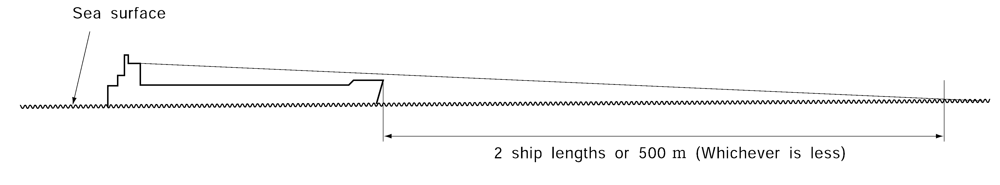
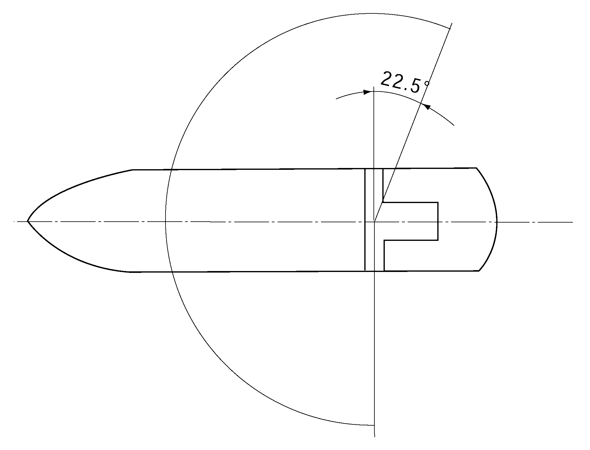
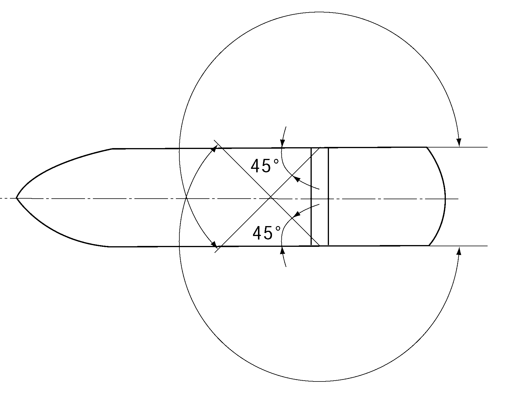
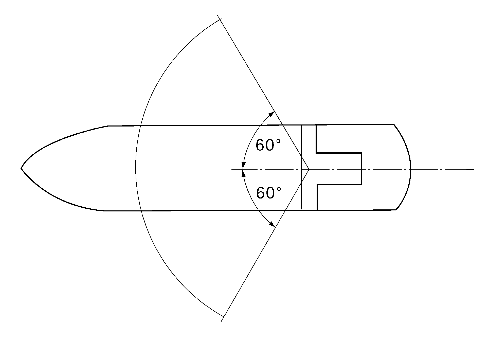
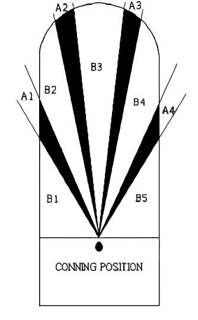

# PART 9 Additional Installations

> RULES FOR CLASSIFICATION OF STEEL SHIPS / RA-09-E / 2025 / EN / Rules

## CHAPTER 5 NAVIGATION BRIDGE SYSTEMS

### Section 1 General

#### 101. General

- **1.** **Scope**
  The requirements in this Chapter apply to bridge layouts and bridge working environments, navigational equipment and accident prevention systems (hereinafter collectively referred to as "navigation bridge systems") of ships classed with the Society and intended to be registered.
- **2.** **Equivalency**
  Navigation bridge systems which do not fully comply with the requirements of this Chapter may be accepted provided that they are deemed by the Society to be equivalent to those specified in this Chapter.
- **3.** **Navigation bridge systems with novel design features**
  For navigation bridge systems with novel design features, the Society may apply the requirements of this Chapter so far as practicable and other requirements as considered appropriate by the Society.
- **4.** **Modification of requirements**
  The Society may modify parts of the requirements specified in this Chapter taking the national requirements of the ship's flag state, kind of the ship and intended service areas of the ship into consideration.
- **5.** **Installations Characters**
  - **(1)** NBS : the ship of which bridge layout and bridge working environment and navigational equipment comply with the requirements of **Sec 3** and **Sec 4.**
  - **(2)** NBS1 : the ship of which bridge layout and bridge working environment, navigational equipment and accident prevention systems comply with the requirements of **Sec 3** to **Sec 5.**
  - **(3)** NBS2 : the ship of which bridge layout and bridge working environment, navigational equipment, accident prevention systems and bridge work assist systems comply with the requirements of **Sec 3** to **Sec 6.**
- **6.** **Definitions**
  Terms used in this Chapter are defined as follows:

### Section 2 Surveys of Navigation Bridge Systems

#### 201. General

- **1.** **Kinds of surveys**
  Navigation bridge systems, which are registered or intended to be registered to the Society, are to be subjected to the following surveys:
- **2.** **Time of classification survey and intervals of survey assigned to maintain classification**
  - **(1)** Classification Survey is to be carried out when the application for classification is made.
  - **(2)** Survey Assigned to Maintain Classification is to be carried out at the periodical survey.

#### 202. Classification Survey

- **1.** **Drawings and data**
  - **(1)** For the classification survey of navigation bridge systems of a NBS ships, three copies of the following drawings and data are to be submitted for the approval by the Society.
    - **(A)** General arrangement of the bridge (showing the main conning position, other conning positions, workstations, locations of control consoles and panels, and passage ways)
    - **(B)** Particulars of the navigational equipment specified in **Sec 4, 402. 2.**
    - **(C)** Electrical wiring diagrams for the navigational equipment specified in **Sec 4, 402.**
    - **(D)** Schemes of on board tests and sea trials including methods of tests and test facilities provided
    - **(E)** Other drawings and data deemed necessary by the Society **【See Guidance】**
  - **(2)** For the classification survey of navigation bridge systems of a NBS1 ships, three copies of the following drawings and data are to be submitted for the approval by the Society.
    - **(A)** The drawings and data specified in the preceding (1).
    - **(B)** Particulars of the accident prevention systems specified in **Sec 5, 502.**
    - **(C)** Electrical wiring diagrams for the accident prevention systems specified in **Sec 5, 502.**
  - **(3)** For the classification survey of navigation bridge systems of a NBS2 ships, three copies of the following drawings and data are to be submitted for the approval by the Society.
    - **(A)** The drawings and data specified in the preceding (2).
    - **(B)** Particulars of the bridge work assist systems specified in **Sec 6, 602.**
    - **(C)** Electrical wiring diagrams for the bridge work assist systems specified in **Sec 6, 602.**
    - **(D)** Detail arrangement of the centralized bridge workstation specified in **Sec 6, 601. 3.**(dimensions of control consoles, panel arrangement, etc., are to be shown)
- **2.** **Shop tests**
  The equipments listed below are to be approved by the Society. However, the equipment approved by the Government of State in which the ship is registered or to be registered, other Contracting Governments of the International Convention for The Safety of Life at Sea or the parties approved by the Governments mentioned above may be accepted provided that it is deemed appropriate by the Society.
- **3.** **Tests after installation on board**
  - **(1)** Bridge layouts and bridge working environments, navigational equipment, and accident prevention systems are to be, after installation on board, tested and inspected in accordance with the scheme of on board tests approved by the Society to verify that they are constructed, installed and functioning properly under the normal working conditions, as far as practicable. A part of the verification may be carried out during sea trials.
  - **(2)** The following particulars are to be verified at the tests after installation on board.
    The bridge layouts and bridge working environments are adequate to enable the navigator to perform navigational duties and other functions allocated to the bridge as well as to maintain a proper lookout from workstations on the bridge.
    Each repeater compass is installed parallel with a centre line of the ship.
    A measuring error is within a permissible range.
    The steering pumps are smoothly switched over.
    The bridge navigational watch alarm system is to initiate alarms that are able to be verified in the bridge and other places if the setting interval has elapsed.
    The alarm and warning transfer system automatically transfers an alarm and warning which requires the navigator response and which is not acknowledged on the bridge within 30 seconds to the master, to the selected back-up navigator and to the public rooms. The alarm of the bridge navigational watch alarm system is also transferred.
    The information display and alarm system deemed necessary for navigation and maneuvering are functioning properly.
    A chart, ship's position, planned route, radar and ARPA information are added to the display.
    Audible and visual alarms for a malfunction of the bridge information systems, ECDIS and auto tracking system are given.
    - **(A)** Bridge layouts and bridge working environments
    - **(B)** Navigational equipment
      - **(a)** Gyro compass repeaters
      - **(b)** Echo sounding systems
      - **(c)** Steering pump selective control switches
      - **(d)** Electrical power supply
      - **(i)** When the main source of electrical power to the local distribution board for the navigational equipment is off, the audible and visual alarm is initiated, and the electrical power supply to the board is automatically switched over to the emergency source.
        - **(ii)** All primary functions of the navigational equipment are readily reinstated after 45 seconds interruption of the electrical power supply.
    - **(C)** Accident prevention systems (NBS1 ships and NBS2 ships)
      - **(a)** Bridge navigational watch alarm system
      - **(b)** Alarm and warning transfer system
      - **(c)** System monitor
      - **(i)** The indicator lamps in the master room showing the bridge navigational watch alarm system, and the alarm and warning transfer system are functioning properly.
        - **(ii)** The audible and visual alarms are initiated on the bridge and in the master room when the bridge navigational watch alarm system, and the alarm and warning transfer system are malfunctioning.
      - **(d)** Electrical power supply
      - **(i)** When the main source of electrical power to the local distribution board for the accident prevention systems is off, the audible and visual alarm is given, and the electrical power supply to the board is automatically switched over to the emergency source.
        - **(ii)** All primary functions of the accident prevention systems are readily reinstated after 45 seconds interruption of the electrical power supply.
    - **(D)** Bridge work assist systems(NBS2 ships)
      - **(a)** Bridge information systems
      - **(b)** ECDIS
      - **(c)** System monitor
      - **(d)** Electrical power supply
      - **(i)** When the main source of electrical power to the local distribution board for the bridge work assist systems is off, the audible and visual alarm is given, and the electrical power supply to the board is automatically switched over to the emergency source.
        - **(ii)** All primary functions of the bridge work assist systems are readily reinstated after 45 seconds interruption of the electrical power supply.
- **4.** **Sea trials**
  - **(1)** Bridge layouts and bridge working environments, navigational equipment, and accident prevention systems are to be tested and inspected in accordance with the scheme of sea trials approved by the Society to verify that they are constructed, installed and functioning properly.
  - **(2)** The following are to be verified during the sea trials.
    Among the tests of the navigational equipment verification of the prewarning required by **Ch 5, 501. 4** (1) (for NBS1 ships and NBS2 ships only) and the following are to be included.
    The water depth is recorded while the ship is maneuvering.
    The fog signals are generated properly.
    The system is in accordance with **3** (2) (C) (a) and (b).
    - **(A)** Bridge layouts and bridge working environments
      - **(a)** The bridge layouts and bridge working environments are adequate to enable the navigator to perform navigational duties and other functions allocated to the bridge as well as to maintain a proper lookout from workstations on the bridge under all navigating conditions day and night.
      - **(b)** The vibration level and the noise level satisfy the requirements of **Sec 3, 302. 2** and **3.**
    - **(B)** Navigational equipment
      - **(a)** An automatic radar plotting aids (ARPA)
      - **(i)** Targets are acquired, and the course and speed information for acquired targets are displayed by both true and relative vectors.
        - **(ii)** The bearing and range of the acquired target are displayed.
        - **(iii)** The CPA and TCPA are displayed.
        - **(iv)** An audible and visual alarm is initiated when any acquired target approaches close to a range or transits a zone chosen by the navigator.
      - **(b)** Radars
      - **(i)** The bearing and range of at least two objects(one of them is to be an object on shore) which appear forward of the beam are displayed.
        - **(ii)** A measured error of the installed radar is not greater than the original error of the radar.
      - **(c)** Automatic steering systems
      - **(i)** The heading direction of the ship is automatically maintained at the preset course.
        - **(ii)** It is indicated that the rudder reaches a preset limit of angle. *(2018)*
        - **(iii)** An audible and visual alarm is initiated when the heading direction of the ship deviates beyond a preset amount of course deviation.
      - **(d)** Speed log systems
      - **(i)** The indicated speed is to be compared with the result of the speed trial.
        - **(ii)** The speed and distance are indicated during the speed trial.
      - **(e)** Echo sounding systems
      - **(f)** Whistle control systems
      - **(g)** Internal communication systems
      - **(i)** The internal communication system functions properly in the event of main electrical power failure.
        - **(ii)** The bridge has priority over the communication system.
    - **(C)** Accident prevention systems (NBS1 ships and NBS2 ships)
    - **(D)** Bridge work assist systems (NBS2 ships)
      - **(a)** The system is in accordance with **3** (2) (D) (a) and (b).
      - **(b)** Auto tracking system
      - **(i)** The auto tracking system performs automatic steering of the ship along a planned route on an electronic chart.
        - **(ii)** Automatic course change occurs after acknowledgement by the navigator.
        - **(iii)** When there is no acknowledgement by the navigator at a waypoint, the course is maintained and the audible and visual alarm is given.
        - **(iv)** Change-over to manual steering mode is possible.

#### 203. Survey Assigned to Maintain Classification

- **1.** **Special survey**
  - **(1)** At each Special Survey for navigation bridge systems of NBS ships, the following tests and examination are to be carried out.
    - **(A)** General examination of the systems
    - **(B)** Function tests of navigational equipment specified in **Sec 4, 402. 2** (1) to (5), (7) to (11) and (13) to (16).
    - **(C)** Verification on the capability of navigational equipment to readily reinstate after 45 seconds interruption of the electrical power supply.
  - **(2)** At each Special Survey for navigation bridge systems of NBS1 ships, the following tests and examination are to be carried out.
    - **(A)** The tests and examination specified in the preceding (1)**.**
    - **(B)** Function tests of accident prevention systems specified in **Sec 5, 502.**
    - **(C)** Verification on the capability of accident prevention systems to readily reinstate after 45 seconds interruption of the electrical power supply.
  - **(3)** At each Special Survey for navigation bridge systems of NBS2 ship, the following tests and examination are to be carried out;
    - **(A)** The tests and examination specified in the preceding (2)**.**
    - **(B)** Function tests of bridge work assist systems specified in **Sec 6, 602.**
    - **(C)** Verification on the capability of bridge work assist systems to readily reinstate after 45 seconds interruption of the electrical power supply.
- **2.** **Annual survey**
  - **(1)** At each Annul Survey for navigation bridge systems of NBS ships, the following tests and examination are to be carried out.
    - **(A)** General examination of the systems
    - **(B)** Function tests of the following equipment
      - **(a)** Automatic radar plotting aids (ARPA)
      - **(b)** Electronic position-fixing systems
      - **(c)** Radars
      - **(d)** VHF radio telephone installations
      - **(e)** Internal communication systems
      - **(f)** Other equipment deemed necessary by the Society **【See Guidance】**
  - **(2)** At each Annual Survey for navigation bridge systems of NBS1 ships, the following tests and examination are to be carried out.
    - **(A)** The tests and examination specified in the preceding (1).
    - **(B)** Function tests of the following equipment
      - **(a)** Bridge navigational watch alarm systems
      - **(b)** Alarm and warning transfer systems
  - **(3)** At each Annual Survey for navigation bridge systems of NBS2 ships, the following tests and examination are to be carried out.
    - **(A)** The tests and examination specified in the preceding (2).
    - **(B)** Function tests of the following equipment
      - **(a)** Bridge information systems
      - **(b)** Electronic Chart Display Information System (ECDIS)
      - **(c)** Auto tracking system

### Section 3 Bridge Layouts and Bridge Working Environments

#### 301. General

- **1.** **Scope**
  The requirements in this Section apply to bridge layouts and bridge working environments for NBS ships, NBS1 ships and NBS2 ships.
- **2.** **General**
  - **(1)** The bridge configuration, the arrangements of consoles, equipment location and the bridge working environments are to enable the navigator to perform navigational duties and other functions allocated to the bridge as well as to maintain a proper lookout from workstations on the bridge.
  - **(2)** Navigating and maneuvering workstations are to be so arranged to enable efficient operation under normal operating conditions. All relevant instrumentation and controls are to be easily visible, audible and accessible from the workstation.
  - **(3)** For the purpose of performing duties related to navigation and maneuvering, the field of vision from a navigating and maneuvering workstation and a conning position is to be such as to enable observation of all objects which may affect safety of the ship.
  - **(4)** The navigator is, as far as practicable, to be able to approach close to at least one bridge front window in order to watch the area immediately in front of the bridge superstructure from the wheelhouse.
  - **(5)** The bridge is, as far as practicable, to be placed above all other decked structures, not including funnels, which are on or above the freeboard deck.
  - **(6)** The navigation bridge visibility of the ship is to be as follows.
    
    **Fig 9.5.1 Forward view**
    The height of the lower edge of front windows above the deck is to be kept as low as possible, and is not to, as far as practicable, be more than 1000 $\mathrm{mm}$.
    
    **Fig 9.5.2 360° Field of vision**
    
    **Fig 9.5.3 Navigating and maneuvering workstation and conning position** 
    **Fig 9.5.4 Monitoring workstation**
    
    **Fig 9.5.5 Bridge wing workstation** 
    **Fig 9.5.6 Helmsman's workstation**

    |  | * horizontal field of vision ∠(A1+A2+A3+A4+B1+B2+B3+B4+B5)= 180° * each individual blind sector ∠(A2,A3) ≤5° (over an arc from dead ahead to 10° on each side) ∠(A1,A4) ≤10° * total arc of blind sectors ∠(A1+A2+A3+A4) ≤20° * clear sectors between two blind sectors ∠B2,B3,B4 ≥5° |
    | --- | --- |
    - **(A)** The view of the sea surface from the conning position is not to be obscured by more than two ship lengths or 500 $\mathrm{m}$, whichever is less, forward of the bow to 10#eqnID-719_s1on either side irrespective of the ship's draught, trim and deck cargo(e.g. containers). (See **Fig 9.5.1**)
    - **(B)** The height of the lower edge of the front windows is to allow a forward view over the bow for person in a sitting position at the workstation.
    - **(C)** It is to be possible to observe all objects necessary for navigation, such as ships and lighthouses, in any direction from inside the wheelhouse.
      - **(a)** There is to be a field of view around the vessel of 360° obtained by an observer moving within the confines of the wheelhouse. (See **Fig 9.5.2**)
      - **(b)** An alternative equivalent means may be acceptable such as cameras covering any obstructed views or blind sectors. *(2024)*
    - **(D)** At the navigating and maneuvering workstation and at the conning position, the navigator's field of view is to be sufficient to enable him to comply with the International Regulations for Preventing Collisions at Sea (COLREG 72).
      - **(a)** The horizontal field of vision from the navigating and maneuvering workstation and from the conning position is to extend at least over an arc from 22.5${}^{\circ}$ abaft the beam on one side, through forward, to 22.5${}^{\circ}$ abaft beam on the other side. (See **Fig 9.5.3**)
      - **(b)** From a monitoring workstation, the field of vision is to extend at least over an arc from 9${}^{\circ}$ on the port bow, through forward, to 22.5${}^{\circ}$ abaft the beam on starboard. (See **Fig 9.5.4**)
      - **(c)** The field of vision from a workstation on the bridge wing is to extend over an arc from at least 45${}^{\circ}$ on the opposite bow through dead ahead and then aft to 180${}^{\circ}$ from dead ahead. (See **Fig 9.5.5**)
    - **(E)** The helmsman's field of vision is to be sufficiently wide to enable him to carry out his functions safely.
      - **(a)** The helmsman's field of vision from the workstation for manual steering is to extend over an arc from dead ahead to at least 60${}^{\circ}$ on each side. (See **Fig 9.5.6**)
      - **(b)** The workstation is not to be placed immediately abaft the front windows in order to obtain the required field of vision.
    - **(F)** Blind sectors caused by cargo, cargo gear and other obstructions are to be as few and as small as possible, and not in any way influence a safe look-out from the navigating and maneuvering workstation and from the conning position. (See **Fig 9.5.7**)
      - **(a)** The total arc of blind sectors caused by cargo, cargo gear and other obstructions outside of the wheelhouse forward of the beam which obstructs the view of the sea surface as seen from the navigating and maneuvering workstation and from the conning position is not to exceed 20${}^{\circ}$. Each individual blind sector is not to exceed 10${}^{\circ}$.
      - **(b)** Over an arc from dead ahead to 10${}^{\circ}$ on each side, each individual blind sector is not to exceed 5${}^{\circ}$. The clear sector between two blind sectors is not to be less than 5${}^{\circ}$.
    - **(G)** The ship's side is always to be visible from the bridge wing especially where tugs or pilot boats come alongside and where the ship touches the jetty.
      - **(a)** Bridge wings are to be provided out to the maximum beam of the ship. The view over the ship's side is not to be obstructed.

#### 302. Bridge Working Environments

- **1.** **General**
  - **(1)** Through the various stages of the design of a ship, care is to be taken to ensure a good working environment for bridge personnel.
  - **(2)** A ceiling and walls inside the wheelhouse are to be designed not to interfere with reading of the indication of instruments.
  - **(3)** Toilet facilities are to be provided on or adjacent to the bridge.
- **2.** **Vibration**
  The vibration level on the bridge is not to be uncomfortable to bridge personnel.
- **3.** **Noise**
  The noise level on the bridge is not to interfere with verbal communication, mask audible alarms or be uncomfortable to bridge personnel.
- **4.** **External sound signals**
  External sound signals such as fog signals that are audible on the bridge wings are also to be audible inside the wheelhouse.
- **5.** **Lighting**
  - **(1)** The lighting required on the bridge is to be designed so as not to impair the night vision of the navigator.
  - **(2)** The lighting used in areas and at items of equipment requiring illumination whilst the ship is navigating is to be such that night vision adaptation is not impaired, e.g. red lighting. Such lighting is to be arranged so that it can not be mistaken for a navigation light by another ship. It is to be noted that red lighting is not to be fitted over chart tables so that possible confusion in colour discrimination is avoided.
- **6.** **Air conditioning system** ***(2017)***
  The wheelhouse spaces are to be provided with an air conditioning system. Setting of temperature in the bridge is to be readily available to the navigator.
- **7.** **Bridge personnel safety**
  - **(1)** There are to be no sharp edges or protuberances on surfaces of the equipment and the instruments installed on the bridge which could cause injury to bridge personnel.
  - **(2)** Sufficient hand-rails or equivalent thereto are to be fitted inside of the wheelhouse or around equipment in the wheelhouse for safety in bad weather.
  - **(3)** Adequate means are to be made for anti-slip of the bridge floor whether it be dry or wet condition.
  - **(4)** Doors to the bridge wings are to be easy to open and close. Means are to be provided to hold the doors open at any position.
  - **(5)** Where provision for seating for the navigator is made in the wheelhouse, means for securing are to be provided having regard to storm conditions.

### Section 4 Navigational Equipment

#### 401. General

- **1.** **Scope**
  The requirements in this Section apply to navigational equipment for NBS ships, NBS1 ships and NBS2 ships.
- **2.** **General**
  - **(1)** Navigational equipment is to be capable of continuous operation under the conditions of various sea states, vibration, humidity, temperature and electromagnetic interferences likely to be experienced in the ship which it is installed.
  - **(2)** Where computerized equipment is interconnected through a computer network, failure of the network is not to prevent individual equipment from performing their individual functions.
- **3.** **Electrical power supply**
  - **(1)** Local distribution boards are to be arranged on the navigation bridge or adjacent to the navigation bridge for all items of electrically operated navigational equipment. These boards are to be supplied by two exclusive circuits, one fed from the main source of electrical power and one fed from the emergency source of electrical power, and these circuits are to be separated throughout their length as widely as practicable. Each item of navigational equipment is to be individually connected to the distribution board. These boards may also be used for accident prevention systems specified in **Ch 5.** *(2018)*
  - **(2)** The power supplies to the distribution boards are to be arranged with automatic changeover facilities between the two sources.
  - **(3)** Failure of the main electrical power supply to the distribution board is to initiate an audible and visual alarm on the navigation bridge. *(2018)*
  - **(4)** Following a loss of electrical power supply which has lasted for 45 seconds or less, all primary functions of the navigational equipment are to be readily reinstated.

#### 402. Navigational Equipment

- **1.** **General**
  - **(1)** The instrumentation and controls at the navigating and maneuvering workstation are to be arranged to enable the navigator to;
    - **(A)** determine and plot the ship's position, course, track and speed,
    - **(B)** analyse the traffic situation,
    - **(C)** decide on collision avoidance manoeuvres,
    - **(D)** alter course,
    - **(E)** change speed,
    - **(F)** effect internal communication and external communication using a VHF radio telephone installation related navigation and maneuvering,
    - **(G)** give sound signals,
    - **(H)** hear sound signals,
    - **(I)** monitor navigational data such as course, speed, track, propeller revolutions (pitch), rudder angle, depth of water.
    - **(J)** record navigational data.
  - **(2)** Navigational equipment is to be arranged to avoid inadvertent operation.
  - **(3)** Navigational equipment is to be designed to permit easy and correct reading by day and by night.
  - **(4)** Each navigational equipment is to be placed with its face normal to the navigator's line of sight, or to the mean value if the navigator's line of sight varies through an angle.
  - **(5)** Navigational equipment is to be designed and fitted to minimize glare or reflection or being obscured by strong light.
- **2.** **Navigational equipment**
  Navigational equipment listed below are to be provided on the bridge.
  - **(1)** An automatic radar plotting aid (ARPA) independent or built into the radar equipment which complies with the following.
    - **(A)** A warning is to be given to the navigator at a time which is adjustable in the range of 6 to 30 minutes, having regard to the time to danger.
    - **(B)** True motion and relative motion modes are to be provided.
    - **(C)** Daylight visible display is to be provided.
    - **(D)** Capability of automatic acquisition and tracking of 20 radar targets or more is to be provided.
    - **(E)** Guard zone system, featuring adjustable parameters, notable warning and alarm set for closest point of approach (CPA) and for time to closest point of approach (TCPA) are to be provided.
    - **(F)** Simulator function showing the likely effects of a course or speed change in relation with tracked targets is to be provided.
    - **(G)** Incorporated self-checking properties are to be provided.
  - **(2)** An electronic position-fixing system appropriate to the intended service areas
  - **(3)** Two independent radars. One of them is to operate within X-band.
  - **(4)** Gyro compass repeaters and a calibration facility
  - **(5)** An automatic steering system which complies with the following.
    - **(A)** An off-course alarm addressed to the navigator derived from a system independent from the automatic steering system is to be provided.
    - **(B)** An overriding control device is to be provided at the navigating and maneuvering workstation.
  - **(6)** A speed log system
  - **(7)** An echo sounding system
  - **(8)** A control device of the wheelhouse air conditioning system
  - **(9)** A NAVTEX receiver and an EGC receiver depending upon the intended service areas
  - **(10)** Control switches and indicators of signaling lights such as navigation lights
  - **(11)** Steering pump selector control switches
  - **(12)** A whistle control system
  - **(13)** A window wipe and wash control device
  - **(14)** Control devices for the lighting of main workstation consoles
  - **(15)** An internal communication system which complies with the following.
    - **(A)** At all times, even in the event of failure of the main electrical power supply, the navigator is to have access to facilities enabling two way communication with another qualified officer.
    - **(B)** The bridge is to have priority over the communication system.
  - **(16)** A VHF radio telephone installation which is immediately available at the conning positions.
  - **(17)** A main propulsion machinery remote control system which complies with the Rules for Automatic and Remote Control Systems
- **3.** **Illumination and individual lighting of equipment**
  - **(1)** The indicator lights and the illumination of all equipment are to be designed and fitted to avoid unnecessary glare or reflection or the equipment being obscured by strong light.
  - **(2)** To avoid unnecessary light sources in the front area of the bridge, only equipment necessary for the safe navigation and maneuvering of the ship is to be located in the area.
  - **(3)** Warning and alarm indicators are to be designed to show no light in normal conditions or in safe situations. Means are to be provided to test the lamps.
  - **(4)** All illumination and lighting of equipment are to be adjustable down to zero, except the lighting of warning and alarm indicators and the control of the dimmers which are to be remain readable.
  - **(5)** Each equipment is to be fitted with an individual light adjustment. In addition, groups of equipment normally working together may be equipped with common light adjustment.

### Section 5 Accident Prevention Systems

#### 501. General

- **1.** **Scope**
  The requirements in this Section apply to systems to prevent accidents caused by the navigator's unfitness (hereinafter referred to as "accident prevention systems") for ships intended for one-man bridge operation in ocean areas under normal operating conditions.
- **2.** **General**
  - **(1)** Accidents prevention systems are to be capable of continuous operation under the conditions of various sea states, vibration, humidity, temperature and electromagnetic interferences likely to be experienced in the ship which they are installed.
  - **(2)** Where computerized equipment is interconnected through a computer network, failure of the network is not to prevent individual equipment from performing their individual functions.
- **3.** **External sound signals**
  To enable the navigator inside the wheelhouse to hear external sound signals such as fog signals that are audible on the bridge wings with the doors to the bridge wings closed, a transmitting device is to be provided to reproduce such signals inside the wheelhouse.
- **4.** **Navigational equipment**
  - **(1)** Navigational equipment specified in **Sec 4, 402. 2** is to give an alarm when;
    - **(A)** The ship approaches a way-point.
    - **(B)** The ship's position is deviated from a planned route.
    - **(C)** The water depth beneath the ship is less than a predetermined value.
  - **(2)** The systems or controls under **Sec 4, 402. 2** (1) to (5) and (11) to (17) are to be arranged so that the navigator has easy access to them and is able to maintain a proper lookout from the bridge.
- **5.** **Electrical power supply**
  - **(1)** Local distribution boards are to be arranged on the navigation bridge or adjacent to the navigation bridge for all items of electrically operated accident prevention systems. These boards are to be supplied by two exclusive circuits, one fed from the main source of electrical power and one fed from the emergency source of electrical power, and these circuits are to be separated throughout their length as widely as practicable. Each item of accident prevention systems is to be individually connected to the distribution board. These boards may also be used for navigational equipment specified in **Sec 4**. *(2018)*
  - **(2)** The power supplies to the distribution boards are to be arranged with automatic changeover facilities between the two sources.
  - **(3)** Failure of the main electrical power supply to the distribution board is to initiate an audible and visual alarm on the navigation bridge. *(2018)*
  - **(4)** Following a loss of electrical power supply which has lasted for 45 *seconds* or less, all primary functions of the accident prevention systems are to be readily reinstated.

#### 502. Accident Prevention Systems

- **1.** **General**
  - **(1)** Indicator lamps are to be provided in the ship master's room which indicate the bridge navigational watch alarm system specified in **Sec 5, 502. 2** and the alarm and warning transfer system specified in **Sec 5, 502. 3** are functioning properly.
  - **(2)** Audible and visual alarms for a malfunction of the bridge navigational watch alarm system specified in **Sec 5, 502. 2** and the alarm and warning transfer system specified in **Sec 5, 502. 3** are to be provided on the bridge and in the ship master's room.
- **2.** **Bridge Navigational Watch Alarm System**
  A bridge navigational watch alarm system which complies with the following is to be provided.
  - **(1)** The bridge navigational watch alarm system is to be a vigilance system to verify periodically that the alert navigator is present on the bridge.
  - **(2)** The bridge navigational watch alarm system is not to cause undue interference with the performance of bridge functions.
  - **(3)** The bridge navigational watch alarm system is to be so designed and arranged that it could not be operated in an unauthorized manner.
  - **(4)** The bridge navigational watch alarm system is to be adjustable of its verification period up to 12 minutes intervals and constructed, fitted and arranged so that only the ship master has access to the component for setting the appropriate intervals.
  - **(5)** The bridge navigational watch alarm system is to initiate alarms that are able to be verified in the bridge and other places if the setting interval has elapsed. **【See Guidance】**
  - **(6)** The bridge navigational watch alarm system is to provide for the acknowledgement by the navigator at the navigating and maneuvering workstation and other appropriate locations on the bridge from where a proper lookout may be kept.
  - **(7)** The bridge navigational watch alarm system is to be connected to the alarm and warning transfer system specified in **Sec 5, 502. 3.**
- **3.** **Alarm and warning transfer system 【See Guidance】**
  An alarm and warning transfer system which complies with the following is to be provided.
  - **(1)** Acknowledgement of alarms and warnings that require the navigator response is to only be possible from the bridge.
  - **(2)** Any alarm and warning that requires the navigator response is to be automatically transferred to the ship master, to the selected back-up navigator and to the public rooms if not acknowledged on the bridge within 30 seconds. **【See Guidance】**
  - **(3)** The alarm and warning transfer is to be operated through a fixed installation.
  - **(4)** Provision which initiates a call-alarm clearly audible in the spaces specified in (2) is to be provided on the bridge for the operation of the navigator. The fixed installation required under (3) may serve the purpose.

### Section 6 Bridge Work Assist Systems

#### 601. General

- **1.** **Scope**
  The requirements in this Section apply to systems to assist navigator's works for one-man bridge operation under normal operating conditions (hereinafter referred to as "bridge work assist systems").
- **2.** **General**
  - **(1)** Bridge work assist systems are to be capable of continuous operation under the conditions of various sea states, vibration, humidity, temperature and electro-magnetic interference likely to be experienced in the ship which they are installed.
  - **(2)** Where computerized equipment is interconnected through a computer network, failure of the network is not to prevent individual functions.
- **3.** **Centralized bridge workstation**
  - **(1)** The centralized bridge workstation is to be arranged to enable a navigator to perform navigating and maneuvering works specified in **Sec 4, 402. 1** (1) and also two or more navigators to do those works together.
  - **(2)** The systems or controls under **Sec 4, 402. 2** (1), (5), (11) to (17), **Sec 6, 602. 2** and **3** are to be arranged centrally to enable the navigator to operate them easily at the centralized bridge workstation.
- **4.** **Electrical power supply**
  - **(1)** Local distribution boards are to be arranged on the navigation bridge or adjacent to the navigation bridge for all items of electrically operated bridge working assist systems. These boards are to be supplied by two exclusive circuits, one fed from main source of electrical power, and these circuits are to be separated throughout their length as widely as practicable. Each item of bridge working assist systems is to be individually connected to the distribution board. These boards may also be used for navigational equipment and accident prevention systems specified in **Sec 4** and **Sec 5.** *(2018)*
  - **(2)** The power supplies to the distribution boards are to be arranged with automatic changeover facilities between the two sources.
  - **(3)** Failure of the main electrical power supply to the distribution board is to initiate an audible and visual alarm on the navigation bridge. *(2018)*
  - **(4)** Following a loss of electrical power supply which has lasted for 45 seconds or less, all primary functions of the bridge work assist systems are to be readily reinstated.

#### 602. Bridge Work Assist Systems

- **1.** **General**
  - **(1)** Audible and visual alarms for a malfunction of the bridge information systems specified in **Sec 6, 602. 2**, ECDIS specified in **Sec 6, 602. 3** and the auto-trucking system specified in **Sec 6, 602. 4** are to be provided on the bridge and in the master's room.
  - **(2)** Electronic charts deemed appropriate by the Society are to be used for the ECDIS.
    **【See Guidance】**
- **2.** **Bridge information system**
  Bridge information system which complies with the followings is to be provided.
  Information of the preceding (A) (a) to (k).
  Information of the preceding (A) (a) to (e), (g), (h), (k) and (l).
- **3.** **Electronic chart display and information system (ECDIS)**
  An ECDIS, including associated back-up arrangements, which complies with the following is to be provided.
- **4.** **Auto tracking system**
  An auto tracking system which complies with the following is to be provided.
