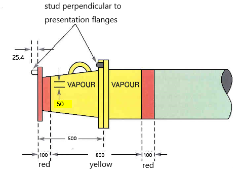

# PART 9 Additional Installations

> RULES FOR CLASSIFICATION OF STEEL SHIPS / RA-09-E / 2025 / EN / Rules

## CHAPTER 9 CARGO VAPOUR EMISSION CONTROL SYSTEMS

### Section 1 General

#### 101. Application

- **1.** At the request of the owner, the requirements in this Chapter apply to cargo vapour emission control systems installed on the tankers classed with or intended to be registered under the Society for the purpose of control of vapour emission from cargo tanks. "Tankers" referred in this Chapter are oil tankers and chemical tanks.
- **2.** The requirements in this Chapter are based on the technical requirements of **IMO MSC/Circ. 585** and **USCG CFR 46 Part 39** and the Rules apply to be registered the class notation in accordance with **Pt 1, Ch 1, Sec 2**. *(2020)*

#### 102. Definitions

Terms used in this Chapter are defined as follows:

- **1.** **Vapour collection system** means an arrangement of piping and hoses used to collect vapour emitted from a tanker's cargo tanks and transport the vapour to a vapour processing unit.
- **2.** **Vapour processing unit** means the components of a vapour control system that recovers, destroys, or disperses vapour collected from a tanker.
- **3.** **Vapour emission control system** means an arrangement of piping and hoses used to control vapour emissions collected from a tanker, and includes the vapour collection system and the vapour processing unit.
- **4.** **Service ship** means a ship, which in a lightering operation transports products between another ship and a facility or vice versa.

#### 103. Class notations

Ships which comply with this Chapter may be assigned with the following notations at the request of the owner.

- **1.** VEC1: Ships in which cargo vapour emission control systems is installed in accordance with **Sec 2**
- **2.** VEC2: Ships in which cargo vapour emission control systems is installed in accordance with **Sec 3**
- **3.** VECL: Ships engaged in the transportation of cargoes between a facility and another ship and vice versa, and in which vapour balancing systems are installed in accordance with **Sec 4**

### Section 2 Requirements for VEC1 Notation

#### 201. Vapour piping systems

- **1.** Each tanker is to have vapour collection piping which is permanently installed, with a tanker vapour connection located as close as practical to the loading manifold. In lieu of permanent piping, chemical tankers are permitted to have a permanent vapour connection at each cargo tank for connection to a vapour hose which is to be kept as short as practicable, and in no case longer than 3 $\mathrm{m}$.
- **2.** If a tanker simultaneously collects vapours from cargoes which react in a hazardous manner with other cargoes, it is to keep these incompatible vapours separate throughout the entire vapour collection system.
- **3.** A means is to be provided to eliminate liquid condensate which may collect in the system, such as draining and collecting liquid from each low point in the line.
- **4.** Vapour collection piping is to be electrically bonded to the hull and is to be electrically continuous.
- **5.** When inert gas distribution piping is used for vapour collection piping, means to isolate the inert gas supply from the vapour collection system is to be provided. The inert gas main isolation valve required by **Pt 8, Annex 8-5, 2** (9) (C) may be used to satisfy this requirement.
- **6.** The vapour collection system is not to interfere with the proper operation of the cargo tank venting system.

#### 202. Vapour line connections

- **1.** An isolation valve capable of manual operation is to be provided at each tanker vapour connection. The operating position of this valve is to be readily determined visually.
- **2.** The end of each vapour collection pipe or vapour collection hose is to be readily identifiable to prevent misconnection. The last 1.0 $\mathrm{m}$ of vapour piping inboard of the vapour connection flange is to be painted red/yellow/red with the red bands 0.1 $\mathrm{m}$ wide, and the yellow band 0.8 $\mathrm{m}$ wide. The yellow band is to be labeled with “"VAPOUR”" in black letters at least 50 $\mathrm{mm}$ high. (Refer to **Fig 9.9.1**.**)**
  
  **Fig 9.9.1 Identification of vapour manifold**
- **3.** In order to prevent the possible misconnection of the vapour manifold to a shoreside terminal liquid loading line, each tanker vapour connection flange is to conform to **OCIMF Recommendations for Oil Tanker Manifolds and Associated Equipment**. This provision is applicable regardless of the size of the ship.
- **4.** Hoses, carried onboard for vapour connection, are to meet the following:
  - **(1)** be suitable for the service;
  - **(2)** have maximum allowable working pressure of at least 0.034 $\mathrm{MPa}$ and design burst pressure of at least five times its maximum allowable working pressure.
  - **(3)** have maximum allowable vacuum of at least 0.014 $\mathrm{MPa}$ below atmospheric;
  - **(4)** be electrically continuous and
  - **(5)** have an extra hole of 16 $\mathrm{mm}$ in each flange corresponding to a stud fitted at vapour line connections flange.

#### 203. Cargo Gauging Systems

- **1.** Each cargo tank of a tanker that is connected to a vapour collection system is to be equipped with a cargo gauging device which:
  - **(1)** provides a closed gauging arrangement that does not require opening the tank to the atmosphere during cargo transfer;
  - **(2)** allows the operator to determine the liquid level in the tank for the full range of liquid levels in the tank;
  - **(3)** indicates at cargo control station the liquid level in the tank; and
  - **(4)** if portable, is installed on the tank during the entire transfer operation.

#### 204. Overfill control system (2020)

- **1.** Each cargo tank is to be equipped with an overfill control system. The overfill control system is to:
  - **(1)** be independent of the cargo gauging system;
  - **(2)** come into operation when the normal tank loading procedures fail to stop the tank liquid level exceeding the normal full condition. The overfill alarm is to be activated early enough to allow the person in charge of transfer operations to stop the cargo transfer before the tank overflow;
  - **(3)** give a visual and audible tank overfill alarm to the ship's operator;
  - **(4)** provide an agreed signal for sequential shutdown of onshore pumps or valves or both and of the ship's valves. The signal as well as the pump and valve shutdown may be dependent on operator's intervention. The use of shipboard automatic closing valves is to be permitted only when specific approval has been obtained from the Society;
  - **(5)** have alarms fitted in the cargo control station, where provided, but in each case in such a position that they are immediately received by responsible members of the crew;
  - **(6)** alarm in the event of loss of power to the alarm system or failure of the electrical circuitry to the tank level sensor; and
  - **(7)** be able to be checked at the tank for proper operation prior to each transfer or contain an electronic self-testing feature which monitors the condition of the alarm circuitry and sensor.
  - **(8)** The overfill alarms are to be identified with the labels "TANK OVERFILL ALARM" respectively, in black letters at least 50 $\mathrm{mm}$ high on a white background.

#### 205. Vapour overpressure and vacuum protection

- **1.** Each cargo tank is to have a controlled pressure venting system which is designed on the basis of the maximum designed loading rate multiplied by a factor of at least 1.25 in order to prevent the pressure in the tank from exceeding the design pressure.
- **2.** Each cargo tank is to have a controlled vacuum venting system which is capable of preventing a vacuum in the cargo tank vapour space, whether generated by withdrawal of cargo or vapour at maximum rates, that exceeds the maximum design vacuum for the tank.
- **3.** Venting systems are to be type approved.
- **4.** Each tanker equipped with a vapour collection system that is common to two or more tanks is to be fitted with a pressure sensing device that senses the pressure in the main vapour collection line for those tanks, and which:
  - **(1)** has a high pressure alarm that alarms at a pressure of not more than the lowest pressure relief valve setting in the cargo tank venting system; and
  - **(2)** has a low pressure alarm that alarms at a pressure of not less than atmospheric pressure for an inerted tanker, or the lowest vacuum relief valve setting in the cargo tank venting system for a non-inerted tanker.

#### 206. Operational procedures

- **1.** **Cargo transfer rate**
  - **(1)** The rate of cargo transfer is not to exceed the maximum allowable transfer rate as determined by the lesser of the following:
    - **(A)** the venting capacity of the pressure relief valves in the cargo tank venting system divided by a factor of at least 1.25;
    - **(B)** the vacuum relieving capacity of the vacuum relief valves in the cargo tank venting system; and
    - **(C)** The rate based on pressure drop calculations for a given pressure at the facility vapour connection, such that the pressure in any cargo tank connected to the vapour collection system does not exceed 80 % of the opening set pressure of any pressure relief valve in the cargo tank venting system.
  - **(2)** In application of (1) (C), when calculating pressure drop, the following is to be used:
    $VGR=1+0.25 \frac{P _{v}}{0.0862}$
    $\rho _{va} =(SG _{v} \cdot V _{v} +V _{a} )10.9 \cdot P _{p/v}$ ($\mathrm{kg}/m ^{3}$)
    $V _{v} = \frac{P _{v}}{P _{p/v}}$, $V _{a} = \frac{P _{p/v} -P _{v}}{P _{p/v}}$
    $VGR$ : vapour growth rate(dimensionless); to be as calculated above or 1.25, whichever is larger
    $P _{v}$ : saturated vapour pressure at 46.1 ℃ ($\mathrm{MPa}$, absolute)
    $P _{p/v}$ : cargo tank PV valve pressure setting at 46.1 ℃ ($\mathrm{MPa}$, absolute)
    $\rho _{va}$ : vapour-air mixture density at 46.1 ℃ ($\mathrm{kg}/m ^{3}$)
    $SG _{v}$ : specific gravity of cargo vapour (dimensionless)
    $V _{v}$ : partial volume of vapour at 46.1 ℃ (dimensionless)
    $V _{a}$ : partial volume of air at 46.1 ℃ (dimensionless)
  - **(3)** Where the capacities of a pressure/vacuum valve are obtained by testing with air only, the following equations may be used to correct the capacities for cargo oil vapour.
    $Q _{A} =Q _{L} ․VGR ․C$ ($\mathrm{m} ^{3} /h$)
    $C= \sqrt {\frac{\rho _{va}}{\rho _{a}}}$
    $Q _{A}$ : required air equivalent volumetric flow rate ($\mathrm{m} ^{3} /h$)
    $Q _{L}$ : cargo transfer rate ($\mathrm{m} ^{3} /h$)
    $C$ : density correction factor (dimensionless)
    $\rho _{va}$ : vapour-air mixture density at 46.1 ℃ ($\mathrm{kg}/m ^{3}$)
    $\rho _{a}$ : air density at 46.1 ℃ ($\mathrm{kg}/m ^{3}$)
- **2.** A cargo tank is not to be filled higher than the level at which the overflow alarm required by **204.** is set.
- **3.** A cargo tank is not to be opened to the atmosphere for gauging or sampling while the tanker is connected to a vapour emission control system unless:
  - **(1)** loading to the tank is stopped;
  - **(2)** the tank is isolated from any other tank which is in the process of being loaded; and
  - **(3)** precautions are taken to reduce any pressure in the cargo tank vapour space and prevent an electrostatic spark from occurring.
- **4.** If the tanker is equipped with an inert gas system the isolation valve required by **201. 5** is to remain closed during vapour transfer.
- **5.** Unless equipped with an automatic self-test and circuit monitoring feature, each tank overflow control system alarm required by **204. 1** (7), on a cargo tank being loaded, is to be tested at the tank for proper operation prior to the start of cargo transfer.

#### 207. Instruction Manual

- **1.** An instruction manual including principles and procedures of operation of the vapour emission control system is to be prepared and provided on board
- **2.** The instruction manual is also to include:
  - **(1)** piping diagram of vapour collection piping;
  - **(2)** the maximum allowable transfer rate;
  - **(3)** the maximum pressure drop in the vapour collection system for various transfer rates;
  - **(4)** the relief settings of each pressure and vacuum relief valve;
  - **(5)** pre-transfer procedures; and
  - **(6)** procedures to be followed in the event of a fault during vapour collection operations.

### Section 3 Requirements for VEC2 Notation

#### 301. General

- **1.** In addition to the requirements of **Sec 2**, the requirements of **302.** and **303.** are to be complied with.

#### 302. High level alarm system (2020)

- **1.** Each cargo tank of a tanker is to be equipped with an high level alram which:
  - **(1)** is to be independent of the overfill alarm system;
  - **(2)** is to be identified with the labels "HIGH LEVEL ALARM" in black letters at least 50 $\mathrm{mm}$ high on a white background;
  - **(3)** is to be set at no less than that corresponding to 95 % of tank capacity. The high level alarm is to come into operation before overfill alarm;
  - **(4)** is to be provide a visual and audible tank high level alarms so that ship’s operator can recognize at the cargo control station and cargo deck area on the ship. *(2023)*
  - **(5)** is to alarm in the event of loss of power to the alarm system or failure of the electrical circuitry to the tank level sensor; and
  - **(6)** is to be able to be checked at the tank for proper operation prior to each transfer or contain an electronic self-testing feature which monitors the condition of the alarm circuitry and sensor.

#### 303. Vapour overpressure and vacuum protection

- **1.** The pressure relief setting is not to cause the valve to open at a pressure of less than 7 $\mathrm{kPa}$.
- **2.** The vacuum relief setting is not to open at less than 3.5 $\mathrm{kPa}$ below atmospheric pressure.
- **3.** Relief capacities of PV valves are to be tested in accordance with **Para 1.5.1.3** of **API Standard 2000**.
- **4.** The PV valve is to have a mechanical means to check its proper operation and to ensure that it will not remain in the open position.
- **5.** In lieu of requirements of **205. 4**, vapour collection system is to be fitted with a pressure sensing device that senses the pressure in the main vapour collection line, which:
  - **(1)** has a pressure indicator located at the cargo control station;
  - **(2)** has a high pressure and a low pressure alarm that:
    - **(A)** is audible and visible at the cargo control station;
    - **(B)** alarms at a high pressure of not more than 90 % of the lowest pressure relief valve setting in the cargo tank venting system;
    - **(C)** alarms at a low pressure of not less than 1 $\mathrm{kPa}$ for an inerted tanker, or the lowest vacuum relief valve setting in the cargo tank venting system for a non-inerted tanker.

### Section 4 Requirements for VECL Notation

#### 401. General

- **1.** Requirements in this Section apply to ships engaged in the transportation of cargoes between a facility and another ship and vice versa(hereinafter referred to as "service ship").
- **2.** In addition to the requirements of **Sec 3**, the requirements of **402.** are to be complied with.

#### 402. Design and equipment

- **1.** If the cargo tanks on a ship discharging cargo and a ship receiving cargo are inerted, the service ship is to:
  - **(1)** have a means to inert the vapour transfer hose prior to transferring cargo vapour;
  - **(2)** have an oxygen analyser with a sensor or sampling connection fitted within 3 $\mathrm{m}$ of the ship vapour connection which:
    - **(A)** activates an audible and visible alarm at the cargo control station when the oxygen content in the vapour collection system exceeds 8 % by volume;
    - **(B)** has an oxygen concentration indicator located at the cargo control station;
    - **(C)** has a connection for injecting a span gas of known concentration for calibration and testing of the oxygen analyser.
- **2.** If the cargo tanks on a ship discharging cargo are not inerted, the vapour collection line on the service ship is to be fitted with an approved detonation flame arrester located within 3 $\mathrm{m}$ of the ship vapour connection.
- **3.** An electrical insulating flange or one length of non-conductive hose is to be provided between the ship vapour connection on the ship.

### Section 5 Surveys

#### 501. General

- **1.** **Kinds of surveys**
  Cargo vapour emission control systems, which are registered or intended to be registered to the Society, are to be subjected to the following surveys:
  - **(1)** Survey for classification of the cargo vapour emission control systems (hereinafter referred to as "Classification Survey")
  - **(2)** Survey for maintaining classification of the cargo vapour emission control systems (hereinafter referred to as "Survey Assigned to Maintain Classification"), which are:
    - **(A)** Annual Survey
    - **(B)** Special Survey
    - **(C)** Occasional Survey
- **2.** **Time of classification survey and intervals of survey assigned to maintain classification**
  - **(1)** Classification Survey is to be carried out when the application for classification is made.
  - **(2)** Survey Assigned to Maintain Classification is to be carried out at the periodical survey.

#### 502. Classification Survey

- **1.** **Drawings and data**
  For the cargo vapour emission control systems intended to undergo a Classification Survey during construction, the following plans and information in triplicate are to be submitted to the Society before the work is commenced.
  - **(1)** Cargo vapour piping diagram
  - **(2)** Wiring diagram and detail construction of cargo tank gauging systems, overfill control systems, pressure control systems and oxygen concentration indicator(if fitted)
  - **(3)** Calculations associated with maximum allowable cargo transfer rate and PV valve capacity
  - **(4)** Calculations for overfill settings.
  - **(5)** Instruction manual for cargo vapour emission control systems in accordance with **207.**
- **2.** **Tests and inspections**
  Cargo vapour emission control systems are to be tested and inspected in accordance with applicable requirements in **Pt 5**, **Ch 6** and **Pt 7**, **Ch 6**.

#### 503. Survey Assigned to Maintain Classification

- **1.** **Annual survey**
  - **(1)** For ships assigned with notation VEC1 and VEC2, the following items are to be surveyed.
    - **(A)** External examination of all cargo vapour piping systems
    - **(B)** Confirmation of the proper operation of the vapour manifold isolating valve
    - **(C)** Confirmation of the condition of the stud fitted at the vapour connection flanges
    - **(D)** Confirmation that any hoses used for the conveyance of vapour are in accordance with 202. **4**
    - **(E)** Where inert gas distribution piping is used for vapour collection, confirmation of the continuing effectiveness of the inert gas main isolating valve
    - **(F)** Correct operation of the closed cargo gauging system for each tank which is connected to the vapour collection system.
    - **(G)** Examination of the cargo tank venting system and flame screens
    - **(H)** Verification of the satisfactory operation of the followings:
      - **(a)** High vapour pressure in main vapour collection line
      - **(b)** Low vapour pressure in main vapour collection line
      - **(c)** Cargo tank overfill
      - **(d)** Cargo tank high level (not applicable for notation VEC1)
      - **(e)** Loss of power to alarm system
      - **(f)** Automatic shutdown system (where fitted)
    - **(I)** Examination of the permanent records to verify the operation and maintenance of the system
  - **(2)** For ships assigned with notation VECL, the following items are to be surveyed in addition to above (1).
    - **(A)** Confirmation that the detonation flame arrester (where fitted) is in satisfactory condition.
    - **(B)** Confirmation that a means of electrical insulation is provided for the vapour manifold connection.
    - **(C)** Confirmation of the accuracy of the fixed oxygen analyzer by means of a calibration gas.
    - **(D)** General examination of any devices (such as compressors or blowers) used to increase the vapour flow rate.
- **2.** **Special survey**
  - **(1)** For ships assigned with notation VEC1 and VEC2, the following items are to be surveyed in addition to annual survey items required by **503. 1** (1).
    - **(A)** Examination of all valves for cargo vapour emission control systems are to be examined.
    - **(B)** Examination of the closed gauging system
    - **(C)** Examination of the independent cargo tank overfill alarms
    - **(D)** Testing vapour collection system hoses for electrical continuity or non-conductivity
    - **(E)** Examination of deck seals where inert gas distribution piping is used for vapour collection
  - **(2)** For ships assigned with notation VECL, annual survey items required by **503. 1** (2) and items required by (1) above are to be surveyed. 
