# PART 9 Additional Installations

> RULES FOR CLASSIFICATION OF STEEL SHIPS / RA-09-E / 2025 / EN / Rules

## CHAPTER 10 BALLAST WATER MANAGEMENT

### Section 1 General

#### 101. Application

- **1.** The requirements in this Chapter apply to ballast water management complying with the **International Convention for the Control and Management of Ship’s Ballast Water and Sediments**(hereinafter referred to the Convention), of the ships classed with or intended to be registered under the Society.
- **2.** "Guidelines" are referred to in this Chapter are the Guidelines referred to in the Convention.

#### 102. Definitions

Terms used in this Chapter are defined as follows:

- **1.** **Ballast Water Management** means several processes, either singularly or in combination, to avoid the uptake or discharge of harmful aquatic organism and pathogens within ballast water and sediments through treatment or exchange of ballast water.
- **2.** **Ballast water management plan** means the plan for the handling or treating of ballast water onboard a ship to minimize the transfer of harmful organisms or pathogens in the ship’s ballast water and sediment.
- **3.** **Convention** means the International Convention for the Control and Management of Ship’s Ballast Water and Sediments.
- **4.** **Ballast water exchange** means a process involving the replacement of water in a ballast tank using the following methods or other exchange methodologies recommended or required by Organization.
  - **(1)** **Sequential method** means a process by which a ballast tank intended for the carriage of water ballast is first emptied and then refilled with replacement ballast water to achieve at least a 95 % volumetric exchange.
  - **(2)** **Flow-through method** means a process by which replacement ballast water is pumped into a ballast tank intended for the carriage of water ballast, allowing water to flow through overflow or other arrangements. At least 3 times the tank volume is to be pumped through the tank.
  - **(3)** **Dilution method** means a process by which replacement ballast water is filled through the top of the ballast tank intended for the carriage of water ballast with simultaneous discharge from the bottom at the same flow rate and maintaining a constant level in the tank throughout the ballast exchange operation. At least 3 times the tank volume is to be pumped through the tank.
- **5.** **Ballast water management system** means any system which processes ballast water such that it meets or exceeds the Ballast Water Performance Standard in Regulation D-2 in the Convention. The BWMS includes ballast water treatment equipment, all associated, and sampling facilities. The categorization of BWMS technologies is given in **Table 9.10.1** Applicability of the requirements for each BWMS technology is in accordance with **Table 9.10.2** *(2022)*
- **6.** **Ballast water treatment equipment** means a mechanical, physical, chemical, or biological process, either singularly or in combination, that removes, renders harmless, or avoids the uptake or discharge of harmful aquatic organisms and pathogens within ballast water and sediments. Ballast water treatment equipment may operate at the uptake or discharge of ballast water, during the voyage, or at a combination of these events.
- **7.** **Ballast Water Management Room** is any space containing equipment belonging to the Ballast Water Management System. A space containing remote controls for the BWMS or a space dedicated to the storage of liquid or solid chemicals for BWMS need not be considered as a BWMR for the purposes of this Rules. *(2022)*
- **8.** **Organization** means the International Maritime Organization (IMO).
- **9.** **Tanker** means a tanker defined by **Pt 8, Ch 1, 103. 48**.

#### 103. Class notations

Ships which comply with this Chapter may be assigned with the one or a combination of following notations.

- **1.** BWE: Ships in which the ballast water exchange system is installed in accordance with **Sec 2** for ballast water management
- **2.** BWT: Ships in which the ballast water management system is installed in accordance with **Sec 3** for ballast water management
  **Table 9.10.1 Categorization of BWMS technologies** ***(2022)***

  | **BWMS’s Technology category (3) →** **(Refer to Annex 9-4)** |   |   | **1** | **2** | **3a** | **3b** | **3c** | **4** | **5** | **6** | **7a** | **7b** | **8** |
  | --- | --- | --- | --- | --- | --- | --- | --- | --- | --- | --- | --- | --- | --- |
  | **Characteristics↓** |   |   | In-line UV or UV + Advanced Oxidation Technology (AOT) or UV + TiO2 or UV + Plasma | In-line Flocculation | In-line membrane separation and de-oxygenation (injection of N2 from a N2 Generator) | In-line de-oxygenation (injection of Inert Gas from Inert Gas Generator) | In-tank de-oxygenation with Inert Gas Generator | In-line full flow electrolysis | In-line side stream electrolysis(2) | In-line (stored) chemical injection | In-line side-stream ozone injection without gas/liquid separation tank and without Discharge treatment tank | In-line side-stream ozone injection with gas/liquid separation tank and Discharge water treatment tank | In-tank pasteurization and de-oxygenation with N2 generator |
  | **Des-infection when ballasting** | Making use of active substance |   |   | X |   |   | **In-tank technology: No treatment when ballasting or de-ballasting** | X | X | X | X | X | **In-tank technology: No treatment when ballasting or de-ballasting** |
  | **Des-infection when ballasting** | Full flow of ballast water is passing through the BWMS |   | X | X | X | X | **In-tank technology: No treatment when ballasting or de-ballasting** | X |   |   |   | X | **In-tank technology: No treatment when ballasting or de-ballasting** |
  | **Des-infection when ballasting** | Only a small part of ballast water is passing through the BWMS to generate the active substance |   |   |   |   |   | **In-tank technology: No treatment when ballasting or de-ballasting** |   | X |   |   |   | **In-tank technology: No treatment when ballasting or de-ballasting** |
  | **After-treatment when de-ballasting** | Full flow of ballast water is passing through the BWMS |   | X |   |   |   | **In-tank technology: No treatment when ballasting or de-ballasting** |   |   |   |   | X | **In-tank technology: No treatment when ballasting or de-ballasting** |
  | **After-treatment when de-ballasting** | Injection of neutralizer |   |   |   |   |   | **In-tank technology: No treatment when ballasting or de-ballasting** | X | X | X | X | X | **In-tank technology: No treatment when ballasting or de-ballasting** |
  | **After-treatment when de-ballasting** | Not required by the Type Approval Certificate issued by the Administration |   |   | X | X |   | **In-tank technology: No treatment when ballasting or de-ballasting** |   |   |   |   |   | **In-tank technology: No treatment when ballasting or de-ballasting** |
  | **Examples of dangerous gas as defined in Sec 3 301. 2. (2)** |   |   |   | **(1)** | O_2 N_2 | CO_2 CO |   | H_2 Cl_2 | H_2 Cl_2 | **(1)** | O_2 O_3 N_2 |   | O_2 N_2 |
  |   |   | Notes: (1) To be investigated on a case by case basis based on the result of the IMO (GESAMP) MEPC report for Basic and Final approval in accordance with the G9 Guideline. (2) In-line side stream electrolysis may also be applied in-tank in circulation mode (no treatment when ballasting or de-ballasting) (3) Taking into consideration future developments of BWMS technologies, some additional technologies may be considered in this Table 1 by identifying their characteristics in the same manner as for the above BWMS cat.1, 2, 3a, 3b, 3c, 4, 5, 6, 7a, 7b and 8. |   |   |   |   |   |   |   |   |   |   |   |

  **Table 9.10.2 Applicability of the requirements for each BWMS technology** ***(2022)***

  | **BWMS’s Technology category →** **(Refer to Annex 9-4)** |   | **1** | **2** | **3a** | **3b** | **3c** | **4** | **5** | **6** | **7a** | **7b** | **8** |
  | --- | --- | --- | --- | --- | --- | --- | --- | --- | --- | --- | --- | --- |
  | **Characteristics↓** |   | In-line UV or UV + Advanced Oxidation Technology (AOT) or UV + TiO2 or UV + Plasma | In-line Flocculation | In-line membrane separation and de-oxygenation (injection of N2 from a N2 Generator) | In-line de-oxygenation (injection of Inert Gas from Inert Gas Generator) | In-tank de-oxygenation with Inert Gas Generator | In-line full flow electrolysis | In-line side stream electrolysis | In-line (stored) chemical injection | In-line side-stream ozone injection without gas/liquid separation tank and without Discharge treatment tank | In-line side-stream ozone injection with gas/liquid separation tank and Discharge water treatment tank | In-tank pasteurization and de-oxygenation with N2 generator |
  | **301. 1 and 2** |   | X | X | X | X | X | X | X | X | X | X | X |
  | **302. 1 and 2 (1) (2)** |   | X | X | X | X | X | X | X | X | X | X | X |
  | **302. 2 (3) (4) and 3 (6) (7)** |   |   |   | X | X | X |   |   |   |   |   | X |
  | **302. 3 (1) to (5)** |   | X | X | X | X | X | X | X | X | X | X | X |
  | **302. 4** |   |   |   | X | X | X |   |   |   |   |   | X |
  | **302. 4 (2)** |   |   |   |   | X |   |   |   |   |   | X |   |
  | **302. 4 (3)** |   | X | X | X | X | X | X | X | X | X | X | X |
  | **303. 1 (1) (A)** |   |   |   |   | X | X |   |   |   | X | X |   |
  | **303. 1 (1) (B)** |   |   |   |   |   |   | X | X | X |   |   |   |
  | **303. 1 (2)** |   | X | X | X | X |   | X | X | X | X | X |   |
  | **303. 1 (3)** |   | X | X | X | X | X | X | X | X | X | X | X |
  | **303. 1 (4) (5)** |   | X | X | X | X |   | X | X | X | X | X |   |
  | **304. 1 (1)** |   |   | X | X |   |   | X | X | X | X | X | X |
  | **304. 1 (2)** |   |   |   | X | X | X |   |   |   | X | X | X |
  | **304. 1 (3)** |   |   |   |   |   |   |   |   |   | X | X |   |
  | **304. 1 (4)** |   |   |   |   |   |   | X | X | X | X | X |   |
  | **304. 1 (5)** |   |   |   |   |   |   | X | X | X |   |   |   |
  | **304. 1 (6)** |   |   |   | X | X | X |   |   |   | X | X | X |
  | **304. 2 (1) to (5)** |   |   | X | X | X | X | X | X | X | X | X | X |
  | **304. 2 (6)** |   |   |   | X |   |   | X | X | X | X | X | X |
  | **304. 2 (7)** |   |   |   | X |   |   |   |   |   | X | X | X |
  | **304. 2 (8)** |   |   |   | X |   |   | X | X | X | X | X | X |
  | **304. 3** |   |   | X |   |   |   | X | X | X | X | X |   |
  | **304. 4** |   |   |   |   |   |   | X | X | X | X | X |   |

### Section 2 Ballast Water Exchange Systems

#### 201. General

- **1.** **Application**
  - **(1)** Requirements of this Section are to be applied to ships where ballast water exchange at sea is accepted as a ballast water management process.
  - **(2)** Ballast water exchange systems are to comply with Ballast Water Exchange Standard (D-1) of the Convention.
  - **(3)** Ships in which ballast water exchange systems are installed in accordance with this Section will be assigned an BWE notation.
  - **(4)** In addition to requirements in this Chapter, applicable requirements in **Pt 5, Ch 6, Sec 4** are to be complied with.

#### 202. Ballast water exchange systems

- **1.** **Valve arrangement**
  - **(1)** Every ballast tank and hold intended for the carriage of water ballast is to be provided with isolating valves for filling and emptying purposes.
  - **(2)** The isolating valves specified in above (1) are to be arranged so that they remain closed at all times except when ballasting, deballasting or ballast exchange operations are being carried out.
- **2.** **Sea chests and shipside openings intended for ballast water exchange**
  The relative positions of ballast water intake and discharge openings are to be such as to preclude as far as practicable the possibility of contamination of replacement ballast water by water which is being pumped out.
- **3.** **System arrangement**
  - **(1)** The design of ballast water systems is to allow for ballast water exchange operations with the minimum number of operational procedures.
  - **(2)** The internal arrangements of ballast tanks as well as ballast water piping inlet and outlet arrangements are to allow for complete ballast water exchange and the clearing of any sediments. (Refer to **Guideline G12, Guidelines on Design and Construction to Facilitate Sediment Control on Ships (IMO Res. MEPC.150(55))**.)
  - **(3)** The design of sea suction line strainers is to be such as to permit cleaning of strainers without interrupting ballast water exchange procedures.
- **4.** **Special provisions depending on the method of ballast water exchange**
  - **(1)** Sequential method
    - **(A)** The capacity of each pump is to be capable of providing ballast water exchange of the largest dedicated ballast water tank or group of tanks that are undergoing simultaneous exchange(whichever is the greater volume), as per the approved Ballast Water Management Plan.
    - **(B)** Ballast water exchange of cargo holds used for the carriage of water ballast will require an extended period of time over that specified in above (A) and is normally to be completed within twenty four hours by one pump.
  - **(2)** Flow-through method
    - **(A)** The design of water ballast exit arrangements are to be such that the tank or hold is not subject to a pressure greater than that for which it has been designed.
  - **(3)** Dilution method
    - **(A)** Where the dilution method is accepted, arrangements are to be made to automatically maintain the ballast water level in the tanks at a constant level. These arrangements are to include the provision of a manual emergency stop for any operating ballast pump, in case of valve malfunction or incorrect control actions.
    - **(B)** High and low water level alarms are to be provided where maintaining a constant level in a tank is essential to the safety of the ship during ballast water exchange.

#### 203. Surveys

- **1.** **General**
  - **(1)** Kinds of surveys
    Ballast water exchange systems, which are registered or intended to be registered to the Society, are to be subjected to the following surveys:
    - **(A)** Survey for classification of the ballast water exchange systems (hereinafter referred to as "Classification Survey")
    - **(B)** Survey for maintaining classification of the ballast water exchange systems (hereinafter referred to as "Survey Assigned to Maintain Classification"), which are:
      - **(a)** Annual Survey
      - **(b)** Special Survey
      - **(c)** Occasional Survey
  - **(2)** Time of classification survey and intervals of survey assigned to maintain classification
    - **(A)** Classification Survey is to be carried out when the application for classification is made.
    - **(B)** Survey Assigned to Maintain Classification is to be carried out at the periodical survey.
- **2.** **Classification Survey**
  - **(1)** Drawings and data
    For the Ballast water exchange systems intended to undergo a Classification Survey during construction, the following plans and information in triplicate are to be submitted to the Society before the work is commenced.
    - **(A)** Arrangement of the ballast tanks and pumps
    - **(B)** Capacity of the ballast tanks and pumps
    - **(C)** Ballast piping diagram including vents and overflows, valve arrangement and controls, and level gauge in the ballast tanks
    - **(D)** Calculations demonstrating the adequacy of the vents and overflows to prevent overpressurization or under-pressurization of the ballast tanks
    - **(E)** The location of ballast water and sediment sampling openings
    - **(F)** Ballast water management plan
    - **(G)** Trim & stability booklet and loading manual
  - **(2)** Tests and inspections
    Piping systems and control systems of ballast water exchange systems are to be tested and inspected in accordance with applicable requirements in **Pt 5** and **Pt 6**.
- **3.** **Survey Assigned to Maintain Classification**
  - **(1)** Annual survey
    - **(A)** External examination of structure, equipment, controls and piping systems
    - **(B)** Review of the ballast water exchange records and the ballast water exchange plan
    - **(C)** Verification of the operation of alarms and safety devices
  - **(2)** Special survey
    - **(A)** Annual survey items required by above (1)
    - **(B)** Examination of valves, seals, pumps, control panels, vents, air pipes and monitoring sensors.

### Section 3 Ballast Water Management Systems

#### 301. General

- **1.** **Application**
  - **(1)** Requirements of this Section are to be applied to ships where ballast water management systems are accepted as a ballast water management process.
  - **(2)** Ballast water management systems are to comply with Ballast Water Performance Standard (D-2) of the Convention.
  - **(3)** The ballast water management system is to be type-approved by Flag Administration and the Society as followings. *(2021)*
    - **(A)** BWMS to be installed on or after 28th October 2020 is to be approved by Res. MEPC.300(72) (BWMS Code) or Res. MEPC.279(70) (2016 G8)
    - **(B)** BWMS to be installed before 28th October 2020 is to be approved by Res. MEPC.300(72) (BWMS Code), Res. MEPC.279(70) (2016 G8) or **Res. MEPC.174(58)(G8)**
    - **(C)** The word "installed" means the contractual date of delivery of the ballast water management system to the ship. In the absence of such a date, the word "installed" means the actual date of delivery of the ballast water management system to the ship. In addition, in the International Ballast Water Management Certificate, the installation date described above in relation to the installation of the ballast water treatment system and the date of commissioning thereafter may be existed.
  - **(4)** Ships in which ballast water management systems are installed in accordance with this Section will be assigned an BWT notation.
  - **(5)** In addition to requirements in this Chapter, applicable requirements in **Pt 5, Ch 6, Sec 4** are to be complied with.
- **2.** **Definitions**
  - **(1)** **Hazardous area** is defined in IEC 60092-502:1999 and means an area in which an explosive gas atmosphere is or may be expected to be present, in quantities such as to require special precautions for the construction, installation and use of electrical apparatus. The classification of hazardous area is to be in accordance with **Pt 6, Ch 1, 101. 4** (1). When a gas atmosphere is present, the following hazards may also be present: toxicity, asphyxiation, corrosivity and reactivity. *(2022)*
  - **(2)** **Dangerous gas** means any gas which may develop an atmosphere being hazardous to the crew and/or the ship due to flammability, explosivity, toxicity, asphyxiation, corrosivity or reactivity and for which due consideration of the hazards is required, e.g. hydrogen(H2), hydrocarbongas, oxygen(O_2), carbon dioxide(CO_2), carbon monoxide(CO), ozone(O_3), chlorine(Cl_2) and chlorine dioxide(ClO_2), etc. *(2022)*
  - **(3)** **Dangerous liquid** means any liquid that is identified as hazardous in the Material Safety Data Sheet or other documentation relating to this liquid.
  - **(4)** **Non-hazardous area** means an area which is not a hazardous area as defined in above (3). *(2022)*
  - **(5)** **Cargo area is** defined as follows. *(2022)*
    - **(A)** For tankers, **Pt 8, Sec 1, 103. 6**
    - **(B)** For chemical tankers, **Pt 7, Sec 6, 106. 6**
    - **(C)** For gas carriers, **Pt 7, Sec 5, 105. 6**
    - **(D)** For offshore support vessels, Paragraph 1.3.1 of the IMO Resolution A.673(16) as amended by Resolution MSC.236(82) or Paragraph 1.2.7 of the IMO Resolution A.1122(30), as applicable.

#### 302. Ballast water management systems

- **1.** **General**
  - **(1)** The Ballast water management systems (BWMS) is to be operated in accordance with the requirements specified in the Type Approval Certificate(TAC) issued by the Flag Administraion. BWMS should be operated within its Treatment Rated Capacity (TRC) as per the TAC. This may require limiting of ship’s ballast pump flow rates.
    The arrangement of the bypasses or overrides of the BWMS is to be consistent with the approved Operation Maintenance and Safety Manual by the Flag Administration’s Type Approval.
    In case the maximum capacity of the ballast pump(s) exceeds the maximum treatment rated Capacity (TRC) of the BWMS specified in the TAC issued by the Flag Administration, there should be a limitation on the BWMP giving a maximum allowable flow rate for operating the ballast pump(s) that shall not exceed the maximum TRC of the BWMS. *(2022)*
  - **(2)** Where the ballast pump has a capacity exceeding the treatment rated capacity of an BWMS, an appropriate flow control arrangement is to be provided for the ballast pumps and operational manual for flow control arrangement is to be specified in the ballast water management plan.
  - **(3)** BWMS should be subject to design review by the Classification Society to verify the compliance of the BWMS’s manufacturer package with the Classification Rules. Manufacturers of the BWMS may apply for this design review at the type approval process.
    In general, monitoring functions of BWMS belongs to system category I under the application of the **Table 6.2.2** in **Pt 6 Ch 2**. However, in case a by-pass valve is integrated in the valve remote control system, the by-pass valve belongs to the system category II Ballast transfer remote control system.
    The BWMS’s components which required in **Pt 5** and **Pt 6** are required to be inspected and certified by the Classification Society at the manufactory (Society Certificate (SC) as defined in UR M72) including pressure vessels, piping class I or II, filters, switchboards, etc. *(2022)*
  - **(4)** In addition to requirements in this Chapter, applicable requirements in **Pt 5, Ch 6, Sec 4** are to be complied with. *(2022)*
- **2.** **Piping systems**
  - **(1)** The material and design of BWMS piping systems are to comply with **Pt 5, Ch 6, Sec 1**.
  - **(2)** BWMS is to be arranged such that the ballast water flows to the farthest ballast tank at maximum capacity specified in the ballast water management plan.
  - **(3)** Where a vacuum or overpressure may occur in the ballast piping or in the ballast tanks due to the height difference or injection of inert gas or nitrogen(N_2), a suitable protection device is to be provided, i.e. P/V valves, P/V breakers, P/V breather valves, or pressure safety relief valve or high/low pressure alarms). The pressure and vacuum settings of the protection device should not exceed the design pressure of the ballast piping (BWMS categories 3a and 3b) or ballast tank (BWMS categories 3a, 3b and 3c), as relevant. *(2022)*
  - **(4)** For BWMS categories 3a, 3b and 3c, the inert gas or nitrogen product enriched air from the inert gas system and from the protection devices installed on the ballast tanks (i.e. P/V valves, P/V breakers or P/V breather valves) are to be discharged to a safe location on the open deck. *(2022)* **【See Guidance】**
- **3.** **Electrical equipment and control systems**
  - **(1)** Electrical equipment and control systems are to comply with **Pt 6** unless otherwise specially provided in each Paragraph.
  - **(2)** Arrangements of electrical equipment installed in hazardous are to comply with **Pt 6, Ch 1, Sec 9**.
  - **(3)** Local instrumentation of the BWMS is to be fitted so as to enable to check the followings:
    - **(A)** Ballast pump operational status;
    - **(B)** BWMS operational status; and
    - **(C)** Remote control valve, where fitted, position indication
  - **(4)** The BWMS is to be provided with by-pass or override arrangement to effectively isolate it from any essential ship system to which it is connected. For new installation or retrofit to existing ships, under normal operating conditions of ballasting and de-ballasting given in the Ballast Water Management Plan (BWMP) the adequacy of the generating plant capacity installed on the vessel is to be demonstrated by an electrical load analysis.
    For retrofit installation to exiting ships, a revised electrical load analysis with preferential trips of non-essential services can be accepted. *(2022)*
  - **(5)** Electric and electronic components are not to be installed in a hazardous area unless they are of certified safe type for use in the area. Cable penetrations of decks and bulkheads are to be sealed when a pressure difference between the areas is to be maintained. *(2022)*
  - **(6)** When the concerned ballast tanks are hazardous areas, an extension of hazardous area is to be considered at the outlet of the protection devices: with reference to IEC 60092-502:1999 §4.2.2.9 the areas on open deck, or semi-enclosed spaces on open deck, within 1.5 m of their outlets are to be categorized hazardous zone 1 and with reference to IEC 60092-502:1999 §4.2.3.1, an additional 1.5 m surrounding the 1.5 m hazardous zone 1 is to be categorized hazardous zone 2. Any source of ignition such as anchor windlass or opening into chain locker should be located outside the hazardous areas. *(2022)*
  - **(7)** Where products covered by IEC 60092-502:1999 are stored on-board or generated during operation of the BWMS, the requirements of this standard shall be followed in order to: *(2022)*
    - Define hazardous areas and acceptable electrical equipment
    - Design ventilation systems.
- **4.** **Inert Gas Systems** ***(2022)***
  - **(1)** Inert gas systems installed for de-oxygenation BWMS (categories 3a, 3b, 3c and 8) are to be designed in accordance with the following requirements:
    - **(A)** Requirements in **Annex 8-5, Pt 8**;
      - **(a)** **1** (2) (3)
      - **(b)** **2** (6) (7) (8)(A)~(C)(F) (11)(A)~(E) except (E)(a)(iii) and ©
      - **(c)** **3** (1)(B) (2) (4)(B) (5)~(7) except (7)(B)(a)
      - **(d)** **4** (5) (8) (9)
      - **(e)** For inert gas systems installed for in-tank de-oxygenation BWMS (category 8): **2** (9) (10) except (10)(F)(G)(J)
    - **(B)** In general, when applying requirements in **Annex 8-5, Pt 8** to inert-gas based BWMS, the following modifications are to be considered:
      - **(a)** The terms "cargo tank" and "cargo piping" are to be replaced by "ballast water tank" or "ballast water piping" as relevant.
      - **(b)** The term "cargo control room" is to be replaced by "BWMS control station" as relevant
      - **(c)** Requirements for slop tanks on combination carriers are to be disregarded
      - **(d)** When applying **2** (11) (E) (a) (i) in **Annex 8-5, Pt 8**, the acceptable oxygen content is to be specified by the manufacturer, 5% oxygen content need not necessarily be applied.
    - **(C)** In addition to the requirements in (A) and (B), the following requirements comply with;
      - **(a)** Plans in diagrammatic form are to be submitted for appraisal and should include the following:
      - **(i)** details and arrangement of the inert gas generating plant including all control and monitoring devices;
        - **(ii)** arrangement of the piping system for distribution of the inert gas.
      - **(b)** Subsequent surveys are to be carried out at the intervals required by the Classification Society Rules.
      - **(c)** Requirements in **Annex 8-5, Pt 8**;
      - **(i)** **4** (3) (4) (10) (11)
        - **(ii)** **5** (4) (5) (6) (In applying **5** (6), the terms “cargo tanks” and “cargo piping” are to be understood as “ballast tanks” and “ballast piping” respectively. For de-oxygenation BWMS (categories 3a, 3b, 3c and 8), the requirements in (A) & (B) prevail.)
  - **(2)** When cavitation is the BWMS treatment process (for example by use of pressure vacuum reactor working in combination with a vertical ballast water drop line) or part of the BWMS treatment process (for example by use of “smart pipe” or “special pipe” in BWMS category 7b or by use of “venturi pipe” in BWMS technology 3b) or by use other means, the design and the wall thickness or grade of materials or inside coating or surface treatment of the part of the piping where the cavitation is taking place is to be specifically considered.
  - **(3)** When it is required to have an automatic shutdown of the BWMS for safety reasons, this must be initiated by a safety system independent of the BWM control system.

#### 303. Additional requirements for tankers (2022)

- **1.** The following requirements are to be applied for tankers.
  - **(1)** Hazardous area classification is to be in accordance with **IEC 60092-502:1999** with due consideration of IACS UI SC274.
    - **(A)** BWMS using ozone generators (categories 7a and 7b) and de-oxygenation BWMS using inert gas generator by treated flue gas from main or auxiliary boilers or gas from an oil or gas-fired gas generator (categories 3b and 3c) are to be located outside the cargo area in accordance with **3** (1) (B) in **Annex 8-5, Pt 8**. **【See Guidance】**
    - **(B)** In-line full flow electrolysis BWMS (category 4), in-line side-stream electrolysis BWMS (category 5) and in-line injection BWMS using chemical which is stored onboard (category 6) can be located inside the hazardous areas with due consideration of the requirement of **302. 3** (5) but should not be located inside the cargo pump room unless it is demonstrated by the BWMS manufacturer that the additional hazards that could be expected from dangerous liquids and dangerous gases stored or evolved from the BWMS (for example H2 generation): **【See Guidance】**
      - **(a)** do not lead to an upgrade of the hazardous area categorization of the cargo pump room
      - **(b)** are not reactive with the cargo vapours expected to be present in the cargo pump room,
      - **(c)** are not reactive with the fire-extinguishing medium provided inside the cargo pump room
      - **(d)** are not impacting the performance of the existing fire-fighting systems provided inside the cargo pump room
      - **(f)** are not introducing additional hazards inside the cargo pump room such as toxicity hazards that would not have been prior addressed by suitable counter measures.
  - **(2)** In general, two independent BWMS should be required i.e. one for ballast tanks located within the cargo area and the other one for ballast tanks located outside cargo area. Specific arrangements where only one single In-line BWMS (categories 1, 2, 3a, 3b, 4, 5, 6, 7a and 7b) could be accepted are given in **table 9.10.3. 【See Guidance】**
  - **(3)** Isolation between ballast piping serving the ballast tanks inside and outside of the cargo area is to be in accordance with the following requirements:
    **【See Guidance】**
    The means of the appropriate isolation is to be one of the following;

    | 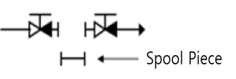 | 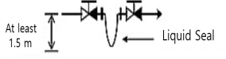 | 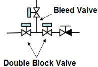 |
    | --- | --- | --- |
    | **Fig 9.10.2(a)** | **Fig 9.10.2(b)** | **Fig 9.10.2(c)** |
    - **(A)** Interconnection in between the ballast piping serving the ballast tanks located within the cargo area and the ballast piping serving the ballast tanks located outside the cargo area may be accepted if appropriate isolation arrangement is provided in accordance with **305.** is applied.
      - **(a)** Two(2) non-return valves with positive means of closing in series with a spool piece (refer **Fig 9.10.2(a)**),(also mentioned “means of dis-connection” in **305.**) **【See Guidance】**
      - **(b)** Two(2) non-return valves with positive means of closing in in series with a liquid seal at least 1.5 $\mathrm{m}$ in depth (refer **Fig 9.10.2(b)**) **【See Guidance】**
      - **(c)** Automatic double block and bleed valves and a non-return valve with positive means of closing. (refer **Fig 9.10.2(c)**) **【See Guidance】**
    - **(B)** The above-mentioned means of appropriate isolation is to be provided on the open deck in the cargo area. **【See Guidance】**
  - **(4)** Sampling lines which are connected to the ballast water piping system serving the tanks in the cargo area and provided for the purpose for any BWMS: ballast water sampling required by the G2 Guideline of the BWM Convention (2004) or BWMS technologies categories 4, 5, 6, 7a and 7b: total residual oxidant (TRO) analysis in closed loop system are not to be led into a non-hazardous enclosed space outside the cargo area.
  - **(5)** In spite of (4), the sampling lines may lead into a non-hazardous enclosed space outside the cargo area provided the following requirements are fulfilled:
    **【See Guidance】**
    
    **Fig 9.10.3**
    - **(A)** The sampling facility (for BWMS monitoring/control) is to be located within a gas tight enclosure (hereinafter, referred to as a ‘cabinet’), and the following (a) through (d) are to be complied.
      - **(a)** In the cabinet, a stop valve is to be installed on each sampling line.
      - **(b)** Gas detection equipment is to be installed in the cabinet and the valves specified in (a) above are to be automatically closed upon activation of the gas detection equipment.
      - **(c)** Audible and visual alarm signals are to be activated both locally and at the BWMS control station when the concentration of explosive gases reaches a pre-set value, which should not be higher than 30% of the lower flammable limit (LFL). Upon an activation of the alarm, all electrical power to the cabinet is to be automatically disconnected.
      - **(d)** The cabinet is to be vented to a safe location in non-hazardous area on open deck and the vent is to be fitted with a flame arrester.
    - **(B)** The standard internal diameter of sampling pipes is to be the minimum necessary in order to achieve the functional requirements of the sampling system.
    - **(C)** The cabinet is to be installed as close as possible to the bulkhead facing the cargo area, and the sampling lines located outside the cargo area are to be routed on their shortest ways.
    - **(D)** Stop valves are to be located in the non-hazardous enclosed space outside the cargo area, in both the suction and return lines close to the penetrations through the bulkhead facing the cargo area. A warning plate stating "Keep valve closed when not performing measurements" is to be posted near the valves. Furthermore, in order to prevent backflow, a water seal or equivalent arrangement is to be installed on the hazardous area side of the return pipe.
    - **(E)** A stop valve is to be installed on the cargo area for each sampling line (i.e. both the suction and return lines).
    - **(F)** The samples which are extracted from the ballast water piping system serving the tanks within the cargo area are not to be discharged to a tank located outside the cargo area and not to discharge to a piping line supplying the spaces located outside the cargo area. (refer **Fig 9.10.3**)

#### 304. Special requirements for BWMS categories 2, 3a, 3b, 3c, 4, 5, 6, 7a, 7b and 8 generating dangerous gas or dealing with dangerous liquids. (2022)

- **1.** Where the operating principle of the BWMS involves the generation of a dangerous gas, the following requirements are to be satisfied:
  - **(1)** Gas detection equipment is to be fitted in the spaces where dangerous gas could be present, and an audible and visual alarm is to be activated both locally and at the BWMS control station in the event of leakage.
    The gas detectors should be located as close as possible to the BWMS components where the dangerous gas may accumulate.
    For flammable gases and explosive atmosphere including but not limited to H_2, the construction, testing and performance of the gas detection devices is to be in accordance with IEC 60079-29-1:2016, IEC 60079-29-2:2015, IEC 60079-29-3:2014 and/or IEC 60079-29-4:2009, as applicable.
    Where other hazards are considered like toxicity, asphyxiation, corrosive and reactivity hazards, a recognized standard acceptable to the Society is to be selected with due consideration of the specific gases to be detected and due consideration of the performance of the detection device with regards to the specific atmosphere where it is used.
  - **(2)** In spaces where inert gas generator systems are fitted (BWMS categories 3b and 3c) or nitrogen generators are fitted (BWMS categories 3a and 8), at least two oxygen sensors shall be positioned at appropriate locations (as required by Pt 8 Annex 8-5 2 (11) (E) (d)) to alarm when the oxygen level falls below 19%.
    - **(A)** The alarms shall be both audible and visual and shall be activated:
      - **(a)** inside the space
      - **(b)** at the entry into the space
      - **(c)** inside the BWMS control station
    - **(B)** For BWMS categories 7a and 7b, at least two oxygen sensors shall be positioned at appropriate locations in the following spaces:
      - **(a)** spaces where ozone generators are fitted
      - **(b)** spaces where ozone destructors are fitted
      - **(c)** spaces where ozone piping is routed
    - **(C)** to alarm when the oxygen level raises above 23 %. The alarms shall be both audible and visual and shall be activated at the following locations:
      - **(a)** inside the space
      - **(b)** at the entry into the space
      - **(c)** inside the BWMS control station
    - **(D)** Automatic shut-down of the BWMS is to be arranged when the oxygen level raises above 25%. Audible and visual alarms independent from those specified in the preceding paragraph are to be activated prior to this shut-down.
  - **(3)** For BWMS categories 7a and 7b, at least one ozone sensor shall be provided at the vicinity of the discharge outlet to the open deck from the ozone destructors addressed in safe location to alarm when the ozone concentration level raises above 0.1 ppm. The alarms shall be both audible and visual and shall be activated in the BWMS control room. **【See Guidance】**
    - **(A)** In addition, at least two ozone sensors shall be positioned at appropriate location in the following spaces:
      - **(a)** spaces where ozone generators are fitted
      - **(b)** spaces where ozone destructors are fitted
      - **(c)** spaces where ozone piping is routed
    - **(B)** to alarm when the ozone concentration level raises above 0.1 ppm. The alarms shall be both audible and visual and shall be activated at the following locations:
      - **(a)** inside the space
      - **(b)** at the entry into the space
      - **(c)** inside the BWMS control station
    - **(C)** Automatic shut-down of the BWMS is to be arranged when the ozone concentration measured from one of the two sensors inside the space raises above 0.2 ppm.
  - **(4)** Inside double walled spaces or pipe ducts constructed for the purpose of **304. 6** (1) of the Guidance, sensors are to be provided for the detection of H2 leakages (BWMS categories 4, 5 and 6 when relevant) or O_2 leakages (BWMS categories 7a and 7b) or O_3 leakages (BWMS categories 7a and 7b). The sensors are to activate an alarm at the high level settings and automatic shut-down of the BWMS at the high-high level settings described in above 1 (1) to (3)
    **【See Guidance】**
  - **(5)** For in-line full flow electrolysis BWMS (category 4), in-line side-stream electrolysis BWMS (category 5) and in-line injection BWMS using chemical which is stored onboard (category 6): the hydrogen de-gas arrangement (when provided) is to be provided with redundant ventilation fans and redundant monitoring of the ventilation system.
    In addition the ventilation fan shall be certified explosion proof and have spark arrestor to avoid ignition sources to enter the ventilation systems whereas remaining H_2 gas may be present in dangerous concentrations.
    Audible and visual alarms and automatic shut-down of the BWMS are to be arranged for respectively high and high-high levels of H_2 concentration. The open end of the hydrogen by-product enriched gas relieving device is to be led to a safe location on open deck.
    **【See Guidance】**
  - **(6)** The open end of inert gas or nitrogen gas enriched air (BWMS categories 3a, 3b, 3c and 8) or oxygen-enriched air (BWMS categories 3a, 7a, 7b and 8) are to be led to a safe location on open deck. **【See Guidance】**
- **2.** Where the piping is conveying active substances, by-products or neutralizers that are containing dangerous gas or dangerous liquids as defined respectively in **301. 2** (2) and (3), the following requirements are to be satisfied: **【See Guidance】**
  - **(1)** Irrespective of design pressure and temperature, the piping is to be either of Class I (without special safeguard) or Class II (with special safeguard) as required by **table 5.6.1** in **Pt 5 Ch 6**. The selected materials, the testing of the material, the welding, the non-destructive tests of the welding, the type of connections, the hydrostatic tests and the pressure tests after assembly on-board are to be as required in Pt 5 Ch 6. Mechanical joints, where allowed, are to be selected in accordance with **table 5.6.11** in **Pt 5 Ch 6**. **【See Guidance】**
  - **(2)** The length of pipe and the number of connections are to be minimised.
  - **(3)** Inside double walled space or pipe ducts constructed as the special safeguard for the purpose of **304. 6** (1) of the Guidance are to be equipped with mechanical exhaust ventilation leading to a safe location on open deck. **【See Guidance】**
  - **(4)** The routing of the piping system is to be kept away from any source of heating, ignition and any other source that could react hazardously with the dangerous gas or liquid conveyed inside. The pipes are to be suitably supported and protected from mechanical damage.
  - **(5)** Pipes carrying acids are to be arranged so as to avoid any projection on crew in case of a leakage.
  - **(6)** H_2 by-product enriched air vent pipes (BWMS categories 4, 5 and 6) or O_2 enriched air vent pipes (BWMS categories 3a, 7a, 7b and 8) or O_3 piping (BWMS categories 7a and 7b) shall not be routed through accommodation spaces, services spaces and control stations.
  - **(7)** O2 enriched air vent pipes (BWMS categories 3a, 7a, 7b and 8) shall not be routed through hazardous areas unless it is arranged inside double walled pipes or pipe ducts constructed as the special safeguard for the purpose of **304. 6** (1) of the Guidance and provided with suitable gas detection as described in **1** (4) and mechanical exhaust ventilation as described in **2** (3).
  - **(8)** The routing of H_2 by-product enriched air vent pipes (BWMS categories 4, 5 and 6) or O_2 enriched air vent pipes (BWMS categories 3a, 7a, 7b and 8) is to be as short and as straight as possible. When necessary, horizontal portions may be arranged with a minimum slope in accordance with the manufacturer’s recommendation.
- **3.** For BWMS using chemical substances or dangerous gas which are stored on-board for either storage or preparation of the active substances (BWMS categories 2 and 6), storage or preparation of the neutralizers (BWMS categories 4, 5, 6, 7a and 7b) or recycling the wastes produced by the BWMS (BWMS category 2).
  - **(1)** procedures are to be in accordance with the Material Safety Data Sheet and BWM.2/Circ.20 “Guidance to ensure safe handling and storage of chemicals and preparations used to treat ballast water and the development of safety procedures for risks to the ship and crew resulting from the treatment process”, and the following measures are to be taken as appropriate:
    Further to the safety and/or pollution assessment of the concerned chemical substances, consideration should be provided for segregation of the drains from such spill trays (or secondary containment system) or piping systems from engine room bilge system or from cargo pump room bilge system, as applicable. When necessary, arrangement should be provided within the spill trays (or within the secondary containment system) for the detection of dangerous liquid or dangerous gas as defined respectively in in **301. 2** (2) and (3).
    **【See Guidance】**
    - **(A)** The materials, inside coating used for the chemical storage tanks, piping and fittings are to be resistant to such chemicals substances.
    - **(B)** Chemical substances (even if they are not defined as dangerous liquid in the sense of **301. 2** (3) and gas storage tanks are to be designed, constructed, tested, inspected, certified and maintained in accordance with:
      - **(a)** for independent tanks permanently fixed onboard containing dangerous liquids (eg. sulfuric acid H_2SO_4) or dangerous gas (eg. oxygen O_2): the Classification Rules as applicable to pressure vessels
      - **(b)** for independent tanks permanently fixed onboard not containing dangerous liquid and not containing dangerous gas : the Classification Rules or other industry standard recognized by the Classification Society (eg. sodium sulphite, sodium biosulphite or sodium thiosulfphate neutralizers)
      - **(c)** for portable tanks: the IMDG Code or other industry standard recognized by the Classification Society.
    - **(C)** When the chemical substances are stored inside integral tanks, the ship's shell plating shall not form any boundary of the tank.
    - **(D)** Dangerous liquids and dangerous gas storage tank air pipes are to be led to a safe location on open deck. **【See Guidance】**
    - **(E)** An operation manual containing chemical injection procedures, alarm systems, measures in case of emergency, etc. is to be kept onboard.
    - **(F)** Dangerous liquid storage tanks and their associated components like pumps and filters, are to be provided with spill trays or secondary containment system of sufficient volume to contain potential leakages from tank openings, gauge glasses, pumps, filters and piping fittings.
- **4.** A risk assessment is to be conducted in a generic manner during the design review mentioned in **302. 1** (3) and submitted to the Classification Society for approval for the BWMS category 4(in all cases), category 5 (in all cases), category 6 (when one of the MSDS indicates that the chemical substance stored on-board is either flammable, toxic, corrosive or reactive), category 7a and 7b (in all cases). **【See Guidance】**
  - **(1)** The recommended risk assessment techniques for BWMS and other guidances are listed below but not limited to:
    - **(A)** FMEA, FMECA, HAZID, HAZOP, etc.
    - **(B)** ISO 31010. Risk Assessment Techniques
    - **(C)** IACS Recommendation Rec. 146
    - **(D)** Rules of the Classification Society for risk assessment techniques
  - **(2)** The risk assessment should ensure that the package supplied by the BWMS’s manufacturer is intrinsically safe and/or provides mitigation measures to the hazards created by the BWMS which have been identified during the design review mentioned in **302. 1** (3) but that need to be implemented during the installation on-board.

#### 305. Installation of one single BWMS on tankers (2022)

This table does not cover In-tank technologies categories 3c and 8.
**Table 9.10.3 In-line BWMS’s technlogies categorization**

| **BWMS’s Technology category →** |   | **1** | **2** | **3a** | **3b** | **4** | **5** | **6** | **7a** | **7b** |
| --- | --- | --- | --- | --- | --- | --- | --- | --- | --- | --- |
| **Characteristics↓** |   | In-line UV or UV + Advanced Oxidation Technology (AOT) or UV + TiO2 or UV + Plasma | In-line Flocculation | In-line membrane separation and de-oxygenation (injection of N2 from a N2 Generator) | In-line de-oxygenation (injection of Inert Gas from Inert Gas Generator) | In-line full flow electrolysis | In-line side stream electrolysis (3) | In-line (stored) chemical injection | In-line side-stream ozone injection without gas/liquid separation tank and without Discharge treatment tank | In-line side-stream ozone injection with gas/liquid separation tank and Discharge water treatment tank |
| **Des-infection when ballasting** | Making use of active substance |   | X |   |   | X | X | X | X | X |
| **Des-infection when ballasting** | Full flow of ballast water is passing through the BWMS | X | X | X | X | X |   |   |   | X |
| **Des-infection when ballasting** | Only a small part of ballast water is passing through the BWMS to generate the active substance |   |   |   |   |   | X |   |   |   |
| **After-treatment when de-ballasting** | Full flow of ballast water is passing through the BWMS | X |   |   |   |   |   |   |   | X |
| **After-treatment when de-ballasting** | Injection of neutralizer |   |   |   |   | X | X | X | X | X |
| **After-treatment when de-ballasting** | Not required by the Type Approval Certificate issued by the Administration |   | X | X |   |   |   |   |   |   |
| **Examples of dangerous gas as defined in Sec 3, 301. 2. (2)** |   |   | (1) | O_2 N_2 | CO_2 CO | H_2 Cl_2 | H_2 Cl_2 | (1) | O_2 O_3 N_2 |   |
| **After-treatment when de-ballasting** | BWMS is located in the outside the cargo area | Not Acceptable | Case 1.2 (2) | Case 1.3a (2) | Case 1.3b | Case 1.4(2) | Case 1.5 | Case 1.6 | Case 1.7a | Case 1.7b (2) |
| Notes: (1) To be investigated on a case by case basis based on the result of the IMO (GESAMP) MEPC report for Basic and Final approval in accordance with the G9 Guideline. (2) Only ≪ Means of dis-connection ≫ as described in **Fig 9.10.2(a)** are to be applied. (3) In-line side stream electrolysis may also be applied in-tank in circulation mode (no treatment when ballasting or deballasting) |   |   |   |   |   |   |   |   |   |   |

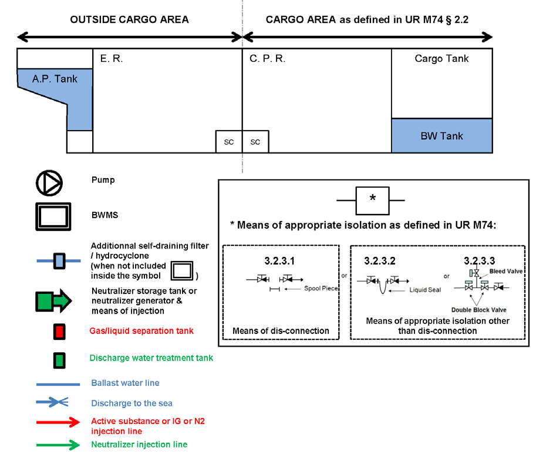
**Fig 9.10.4 Example for arrangements**
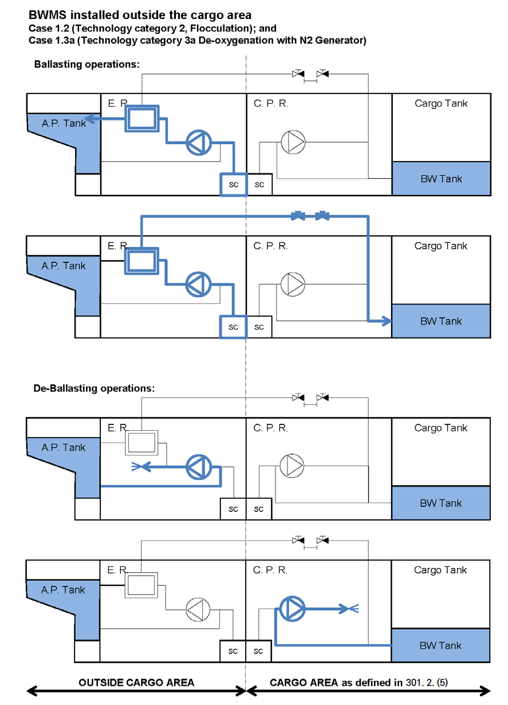
**Fig 9.10.5**
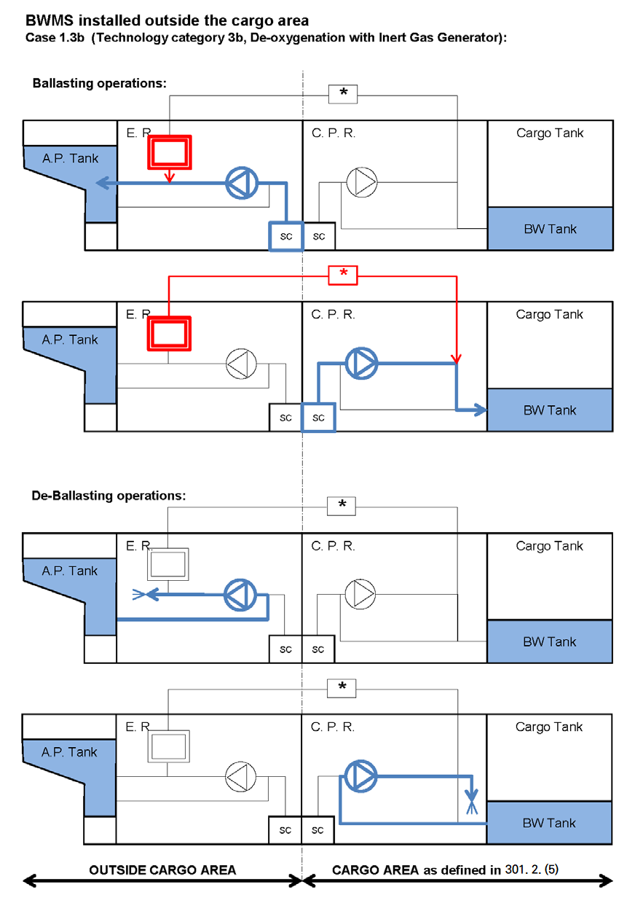
**Fig 9.10.6**
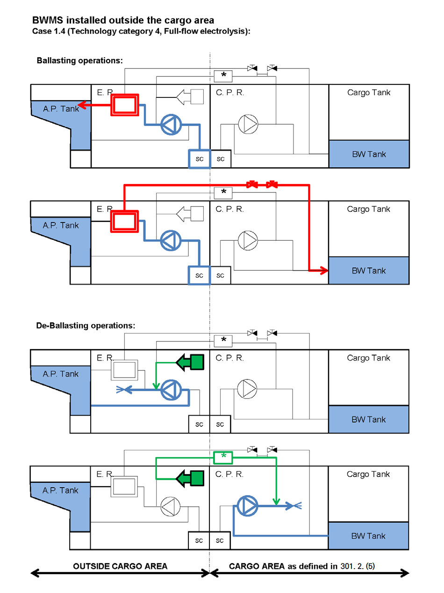
**Fig 9.10.7**
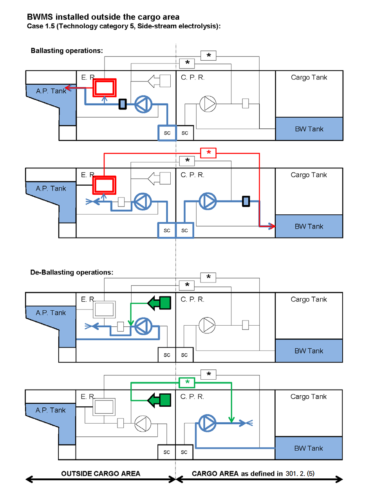
**Fig 9.10.8**
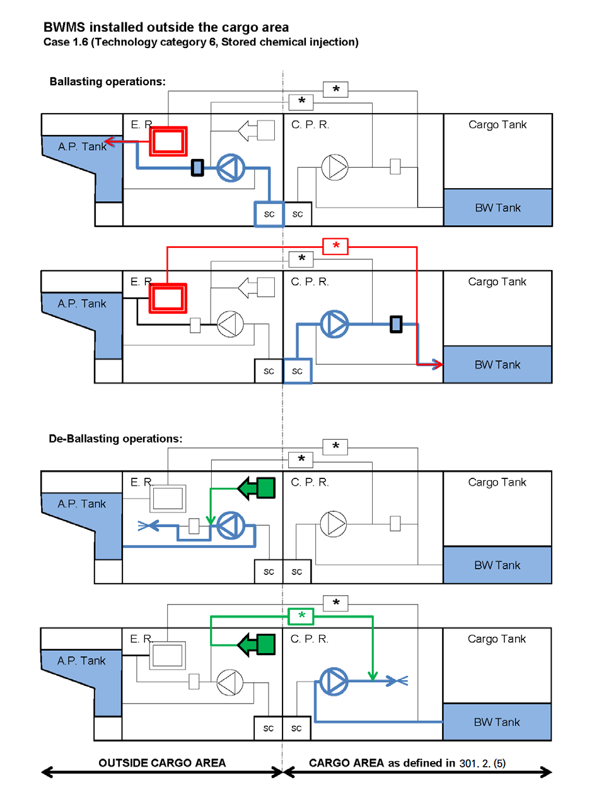
**Fig 9.10.9**
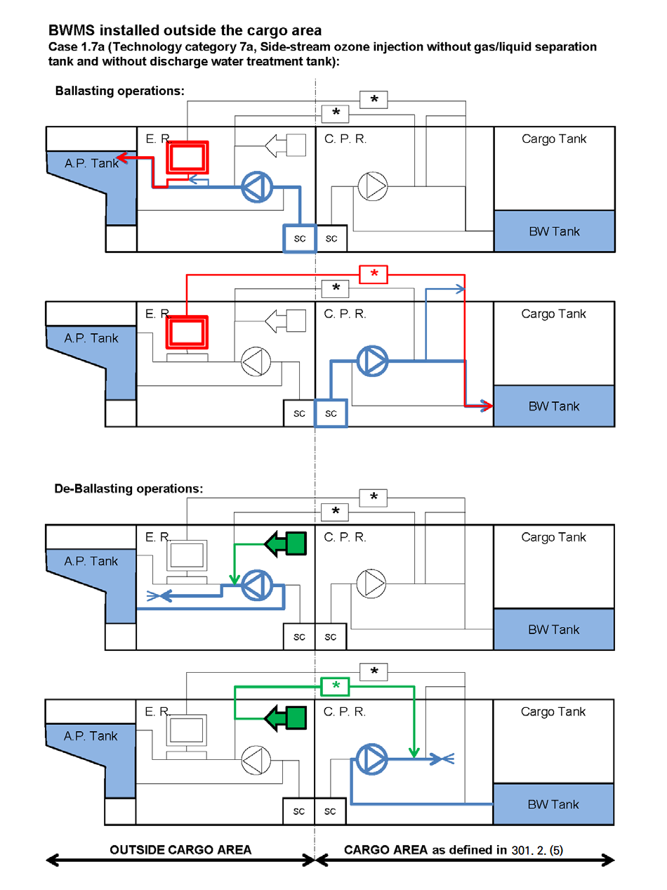
**Fig 9.10.10**
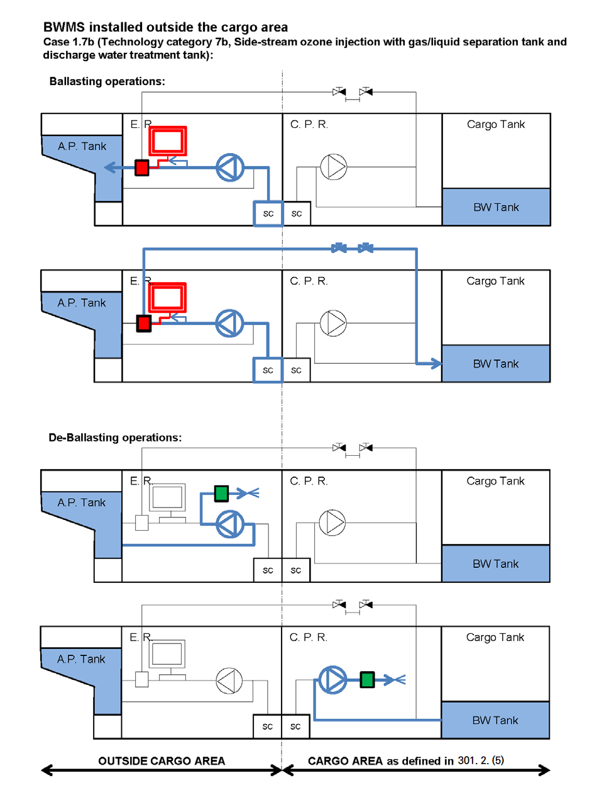
**Fig 9.10.11**

#### 306. Surveys

- **1.** **General** ***(2018)***
  - **(1)** Kinds and intervals of surveys are to comply with **203. 1**.
  - **(2)** Tests and inspections on type approved products are to comply with **306. 4.**
- **2.** **Classification Survey** ***(2021)***
  - **(1)** Drawings and data
    For the BWMS intended to newly install or register to this Society, the following plans and information in triplicate are to be submitted to the Society before the work is commenced.
    - **(A)** General specification of the BWMS
    - **(B)** Ballast piping diagram
    - **(C)** The location of ballast water openings
    - **(D)** Electrical schematic drawing
    - **(E)** Drawing of tanks containing liquid chemicals including air pipes, sounding and drain systems from drip trays (when fitted)
    - **(F)** Arrangement of detection system associated with toxic or flammable gases
    - **(G)** operation and maintenance manual
  - **(2)** Tests and inspections
    - **(A)** Piping systems and control systems of BWMS are to be tested and inspected in accordance with applicable requirements in **Pt 5** and **Pt 6**.
    - **(B)** It is to confirmed that the documentation required in IMO Res. MEPC.279(70) or Res. MEPC.300(72), Paragraph 8.2 is on board. In cases where BWMS has been approved in accordance with Res. MEPC 174(58), it is to confirmed that the documentation required in **G8 Guidelines**(IMO Res. MEPC.174(58)), Paragraph 8.1 is on board.
    - **(C)** Items required in IMO Res. MEPC.279(70) or Res. MEPC.300(72), Paragraph 8.3 are to be verified. In cases where BWMS has been approved in accordance with Res. MEPC 174(58), items required in **G8 Guidelines**(IMO Res. MEPC.174(58)), Paragraph 8.2 are to be verified.
    - **(D)** After installation of the BWMS, a function test is to be carried out to at the onboard test or sea trial.
- **3.** **Survey Assigned to Maintain Classification**
  - **(1)** Annual survey
    - **(A)** External examination of structure, equipment, controls and piping systems
    - **(B)** Review of the ballast water exchange records and the ballast water exchange plan
    - **(C)** Verification of the operation of alarms and safety devices
  - **(1)** Special survey
    - **(A)** Annual survey items required by above (1)
    - **(B)** Examination of valves, seals, pumps, control panels, vents, air pipes and monitoring sensor.
- **4.** **Tests and inspections on type approved products** ***(2018)***
  - **(1)** General
    The type approved ballast water management system is to be verified that the structure is suitable and completion tests is to be carried out. The detailed test is to be in accordance with **Ch 3, Sec 35** of the **Guidance for approval of manufacturing process and type approval, etc.**.
  - **(2)** Completion tests
    - **(A)** External examination
    - **(B)** Functional test (Requirement regarding alarm and system shutdown) *(2023)*
    - **(C)** Insulation resistance tests and high voltage tests (to be applied to electric devices, electronic devices and so on)
    - **(D)** Pressure tests (to be applied to hydraulic devices, pneumatic devices and so on)
    - **(E)** Other tests considered necessary by the Society

### Section 4 Installation of BWMS on-board ships (2022)

#### 401. General

- **1.** **Application**
  - **(1)** This Unified Requirement details fire safety measures, in addition to that required by Pt 8 of the Rules, related to the installation of Ballast Water Management Systems onboard any ship. And this Section is to be read in conjunction with **Sec 3**.
  - **(2)** The requirements of this Section apply for BWMS technologies as listed in **Table 9.10.1**. BWMS with alternative technologies are to be specially considered by the Classification Society.
- **2.** **Definitions**
  - **(1)** **Airlock** is a space enclosed by gastight steel bulkheads with two gastight doors spaced not more than 2.5 m apart. The doors shall be self-closing without any holding back arrangements. Air locks shall have mechanical ventilation and shall not be used for other purposes. An audible and visual alarm system to give a warning on both sides of the air lock shall be provided to indicate if more than one door is moved from the closed position. The air lock space shall be monitored for dangerous gas as defined in **301. 2** (2).
  - **(2)** BWMS storing, introducing or generating chemicals.
    In general, BWMS storing, introducing or generating chemicals refer to In-line flocculation (cat.2 as per **Table 9.10.1**), Chemical injection (cat.6 as per **Table 9.10.1**) and BWM technologies using neutralizers injection (cat.4, 5, 6 and 7 as per **Table 9.10.1**).
    BWMS that do not store, introduce or generate toxic or flammable chemicals may be specially considered as detailed in **Table 9.10.4** below.
    **Table 9.10.4 Requirements that may be reduced for BWMS storing, introducing or generating chemicals depending on the chemicals.**

    | Requirement | Conditions to be met before reducing the requirement |
    | --- | --- |
    | **402. 3** (4) | The stored chemicals are neither toxic nor flammable |
    | **403. 1** (1) | No dangerous gas as defined in 301. 2. (2) will be generated by the BWMS |
    | **403. 2** (1) | The BWMS does not use any flammable or toxic chemical substances |
    | **406. 1** (1) | No toxic chemical is stored and no toxic gas will be generated by the BWMS |
    | **407. 1** **407. 3** **407. 6** | No toxic chemical is used or will be generated by the BWMS |
    | (1) The IMO reports issued during the basic and final approval procedures of the BWMS that make use of active substances (G9 Guidelines) and ‘’safety hazard’’ as listed in **Pt 7, Sec 17, Ch 6** of the Rules (Ch.17 of IMO IBC code) are to be considered for this purpose. (2) Chemicals include additives for BWMS. |   |

#### 402. Fire categorization

- **1.** **General**
  BWMR shall be classified as follows for the purpose of applying the requirements of **Pt 8** of the Rules
  - **(1)** BWMR containing oil-fired inert gas generators (i.e. BWMS cat.3b and 3c as per **Table 9.10.1**) shall be treated as machinery spaces of category A
  - **(2)** Other BWMR shall be considered as other machinery spaces and shall be categorized, depending on the ship type (10) or (11) according to **Pt 8, Ch 7 102. 3** (2) (A) ⑩ or ⑪ of the Rules (SOLAS II-2/9.2.2.3) or **Pt 8, Ch 7 102. 4** and **103. 3** and **104. 2** (2) (B) ⑦ of the Rules.
- **2.** **BWMS located in the cargo area of tankers**
  Notwithstanding the above 1, where a BWMS is located in the cargo area of a tanker as allowed by **Sec 3,** the BWMR shall be categorized as (8), a cargo pump-room, according to **Pt 8, Ch 7 104. 2** (2) (B) ⑧ for determining the extent of fire protection to be provided.
- **3.** **Storage of chemicals**
  - **(1)** Spaces where the storage of liquid or solid chemicals for BWMS is intended shall be categorized as store-rooms for the purpose of applying the requirements of **Pt 8** of the Rules.
    - **(A)** On passenger ships carrying more than 36 passengers:
      - **(a)** “Other spaces in which flammable liquids are stowed” as defined in **Pt 8, Ch 7, 102. 3.** (B) ⑭, if flammable products are stored
      - **(b)** “Store-rooms, workshops, pantries, etc.” as defined in **Pt 8, Ch 7, 102. 3** (B) ⑬.
    - **(B)** On other ships:
      - **(a)** “Cargo pump-rooms” as defined in **Pt 8, Ch 7, 104. 2.** (2) (B) ⑧ if located in the cargo area of a tanker
      - **(b)** “Service spaces (low risk)” as defined in **Pt 8, Ch 7, 104. 2.** (4) ⑤, **103. 3.** (2) (B) ⑤ and **104. 2.** (2) (B) ⑤ if the surface area is less than 4m2 and if no flammable products are stored
      - **(c)** “Service spaces (high risk)” as defined in **Pt 8, Ch 7, 102. 4.** ⑨, **103. 3.** (2) (B) ⑨ and **104. 2.** (2) (B) ⑨. It is understood that only chemical injection (cat.6 as per **Table 9.10.1**), in-line flocculation (cat.2 as per **Table 9.10.1**) and technologies using neutralizer injection (cat.4, 5, 6 and 7 as per **Table 9.10.1**) will require chemical or additive storage.
  - **(2)** Where the storage of chemicals is foreseen in the same room as the ballast water management machinery, this room shall be considered both as a store-room and as a machinery space in line with (1).
  - **(3)** When the chemical substances are stored inside integral tanks, the ship's shell plating shall not form any boundary of the tank.
  - **(4)** Tanks containing chemicals shall be segregated from accommodation, service spaces, control stations, machinery spaces not related to the BWMS and from drinking water and stores for human consumption by means of a cofferdam, void space, cargo pump-room, empty tank, oil fuel storage tank, BWMR or other similar space. On-deck stowage of permanently attached deck tanks or installation of independent tanks in otherwise empty hold spaces should be considered as satisfying this provision.

#### 403. BWMR location and boundaries

- **1.** **General**
  - **(1)** BWMR containing equipment for BWMS of the following types shall be equipped with tested gastight and self-closing doors without any holding back arrangements. But doors leading to the open deck need however not to be self-closing.
    - **(A)** BWMS storing, introducing or generating chemical substances
    - **(B)** De-oxygenation based on inert gas generator
    - **(C)** Electrolysis
    - **(D)** Ozone injection
- **2.** **BWMS using chemical substances**
  - **(1)** For BWMS storing, introducing or generating chemicals, the BWMR and chemical substance storage rooms are not to be located in the accommodation area. Any ventilation exhaust or other openings from these rooms shall be located not less than 3m from entrances, air inlets and openings to accommodation spaces. This requirement need not apply in case the BWMS is located in the engine room.
- **3.** **Ozone-based BWMS**
  - **(1)** Ozone-based BWMS – i.e. cat.7a and 7b - shall be located in dedicated compartment, separated from any other space by gastight boundaries. Access to the BWMR from any other enclosed space shall be through airlock only, except if the only access to that space is from the open deck.
    Access to the ozone based BWMR may be provided through the engine room only provided:
    - **(A)** Access from the engine room to the BWMR is through airlock and,
    - **(B)** An alarm repeater is provided in the BWMR, which will repeat any alarm activated in the engine room.
  - **(2)** A sign shall be affixed on the door providing personnel with a warning that ozone may be present and with the necessary instructions to be followed before entering the room

#### 404. Fire fighting

- **1.** **Fixed fire-extinguishing system**
  - **(1)** Where fitted, fixed fire extinguishing systems shall comply with the relevant provisions of the Fire Safety Systems Code
  - **(2)** Ozone-based BWMS
    BWMR containing equipment related to ozone-based BWMS shall be provided with a fixed fire extinguishing system suitable for category A machinery spaces and capable of manual release.
  - **(3)** Where a fixed fire-extinguishing system is provided in the BWMR, it should be compatible with the BWMS and the chemical products that are used, produced or stored in the BWMR. Specific attention shall be paid to potential chemical reactions between the fire extinguishing medium and chemical products used for water treatment.
    Especially, water-based fire-extinguishing systems should be avoided in case of sulfuric acid storage.
  - **(4)** Foam fixed fire-extinguishing system
    For all kinds of BWMS, in case a foam fire extinguishing system is installed in the BWMR, its efficiency shall not be impaired by chemicals used by the BWMS where relevant.
  - **(5)** Where a fixed fire-extinguishing system is installed in the BWMR, automatic shutdown of the BWMS upon release of the fixed fire extinguishing system shall be arranged. Any need for cooldown necessary for safe shutdown to be considered in the shutdown sequence.
  - **(6)** Where BWMS that includes air or O2 storage is located in a room covered by a fixed gas fire-extinguishing system, air or O2 storage shall be taken into account for the gas capacity calculation, unless the discharge pipe from safety valves for air or O2 storage are led directly to outside the room.
- **2.** **Portable fire-fighting equipment**
  - **(1)** There shall be at least one portable fire extinguisher that complies with the provisions of the Fire Safety Systems Code and suitable for electrical fires in the BWMR containing UV-type BWMS.

#### 405. Fire prevention

- **1.** **Equipment protection**
  - **(1)** Overcurrent or overvoltage protection is to be installed to protect UV type BWMS.
  - **(2)** Electrolysis reactors are to be provided with at least with two independent means of monitoring operation. The monitoring system shall initiate audible and visual alarms and automatic shutdown of the BWMS in the event that an anomaly is detected. Requirements for shutdown arrangement are clarified in **302. 4** (3).
    If a pressure relief valve is also provided, the vent of this valve is to be led to a safe location on the open deck, as clarified in **Sec 3**. The valve should be positioned to optimally remove gas from the electrolysis reactor.
- **2.** **Fire detection**
  - **(1)** A fixed fire detection and fire alarm system complying with the provisions of the Fire Safety Systems Code shall be installed in spaces containing an inert gas generator or an ozone generator.
  - **(2)** A section of fire detectors which covers a control station, a service space or an accommodation space is not to include a BWMR containing equipment related to ozone based BWMS.

#### 406. Ventilation

- **1.** **Ventilation arrangement**
  - **(1)** The ventilation systems for BWMR containing BWMS of the following types shall be independent of the ventilation systems serving any other spaces:
    - **(A)** BWMS storing, introducing or generating chemical substances.
    - **(B)** De-oxygenation, including pasteurization and de-oxygenation (cat.3 and cat.8 as per **Table 9.10.1**)
    - **(C)** Electrolysis
    - **(D)** Ozone injection
  - **(2)** The ventilation exhaust for BWMR containing a nitrogen generator shall be located in the lower part of the room in order to efficiently evacuate dangerous gases – as defined in **301. 2** (2) - heavier than air.
  - **(3)** The ventilation exhaust for BWMR containing electrolysis systems shall be located so as to be able to efficiently evacuate dangerous gases – as defined in **301. 2** (2) - that could be generated during the electrolysis process. Due regard shall be paid to the expected quantity and density of such gases when designing the ventilation exhaust.
  - **(4)** The following requirements apply to ventilation ducts serving BWMR for ozone-based BWMS:
    - **(A)** The part of the ducts located outside of the BWMR shall be made of steel having a thickness of at least 3 mm for ducts with a free cross-sectional area of less than 0.075 m2, at least 4 mm for ducts with a free cross-sectional area of between 0.075 m2 and 0.45 m2, and at least 5 mm for ducts with a free cross-sectional area of over 0.45 m2; and
    - **(B)** The ducts shall be suitably supported and stiffened
    - **(C)** The outside openings of the ducts shall be fitted with protective screens of not more than 13 mm square mesh.
  - **(5)** The ventilation system for BWMR containing ozone-based BWMS or ventilation system for hydrogen de gas arrangement as required by **304. 1** (5) shall be interlocked with the BWMS such that:
    - **(A)** In case of loss of ventilation (primary and secondary), a visual and audible alarm shall be triggered both inside and outside the BWMR and at a place where a responsible member of the crew is on duty. If the ventilation is not restored after a pre-set time, BWMS shall then be automatically shut down. Any need for cooldown necessary for safe shutdown is to be considered in the shutdown sequence.
    - **(B)** It shall not be possible to start the BWMS without the ventilation running
  - **(6)** ventilation systems serving BWMR and containing or conveying a dangerous gas, relevant requirements in **304.** are to be satisfied.
- **2.** **Ventilation rate**
  - **(1)** An adequate power ventilation system shall be provided in enclosed BWMR.
  - **(2)** The ventilation capacity shall be at least 30 air changes per hour where explosive or toxic gases may be generated during operation of the BWMS. The IMO reports issued during the basic and final approval procedures of the BWMS that make use of active substances (G9 Guidelines) and ‘’safety hazard’’ as listed in **Pt 7, Ch 6, Sec 17.** (Ch.17 of IBC code) are to be used as references for identifying those cases.
  - **(3)** The ventilation capacity may be reduced as follows (More stringent ventilation capacity requirements may arise from other regulations e.g. IBC Code requirements for spaces located in the cargo area):
    - **(A)** Flocculation-type BWMS 6 air changes per hour
    - **(B)** De-oxygenation, incl. pasteurization and de-oxygenation (cat.3 and cat.8 as per **Table 9.10.1**) 6 air changes per hour
    - **(C)** Full flow electrolysis 6 air changes per hour
    - **(D)** Side-stream electrolysis 20 air changes per hour
    - **(E)** Ozone injection 20 air changes per hour
    - **(F)** Chemical injection 6 air changes per hour

#### 407. Personal equipment

- **1.** Suitable protection equipment shall be available onboard for the protection of the crew members who are engaged in the servicing, maintenance and repair of BWMS storing, introducing or generating chemicals, as recommended by the product manufacturers. The protection equipment shall consist of large aprons, special gloves with long sleeves, suitable footwear, coveralls of chemical-resistant materials, and tight fitting goggles or face shields or both. The protective clothing and equipment shall cover all skin so that no part of the body is unprotected. This protection equipment is to be provided separately without taking into account equipment required by other mandatory requirements.
- **2.** Work clothes and protective equipment shall be kept in easily accessible places and in special lockers. Such equipment shall not be kept within accommodation spaces, with the exception of new, unused equipment and equipment which has not been used since undergoing a thorough cleaning process. Notwithstanding the above, storage rooms for such equipment within accommodation spaces if adequately segregated from living spaces such as cabins, passageways, dining rooms, bathrooms, etc.
- **3.** When a BWMS storing, introducing or generating chemicals is installed on board, suitably marked decontamination showers and an eyewash shall be available in a convenient location in close proximately to the BWMS and the chemical store room(s).
- **4.** An emergency escape breathing apparatus (EEBD) is to be provided in the BWMR. This emergency escape breathing apparatus may be one of the EEBDs provided in accordance with the requirements of **Pt 8 Ch 10** of the Rules. An EEBD need not be required for BWMS of cat.1 as per **Table 9.10.1**.
- **5.** A personal ozone detector, calibrated as per the manufacturer’s specifications, shall be provided for each person engaged in the servicing, maintenance and repair of BWMS utilizing ozone.
- **6.** A two-way portable radiotelephone apparatus dedicated for the BWMS service, maintenance and repair shall be provided, in addition to those required by SOLAS for fire-fighting purposes. This two-way radiotelephone apparatus is to be properly identified in order to avoid mix-up with the apparatus intended for fire-fighting operations. Where the BWMS may release explosive gases, this two-way radiotelephone apparatus shall be of a certified safe type suitable for use in zone 1 hazardous areas, as defined in IEC Publication 60079. Where the BWMS stores, utilizes or introduces chemicals, the apparatus shall undergo deep cleaning or de-contamination after use.
  A two-way portable radiotelephone apparatus need not be required for BWMS of cat.1 as per **Table 9.10.1**. 
