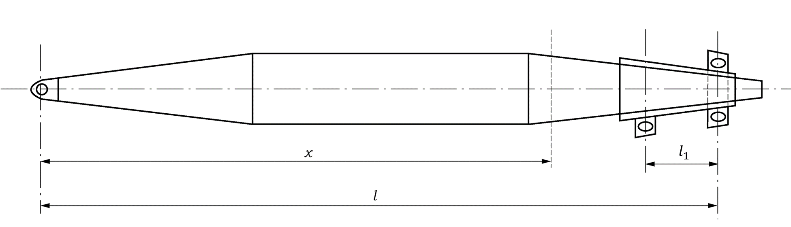
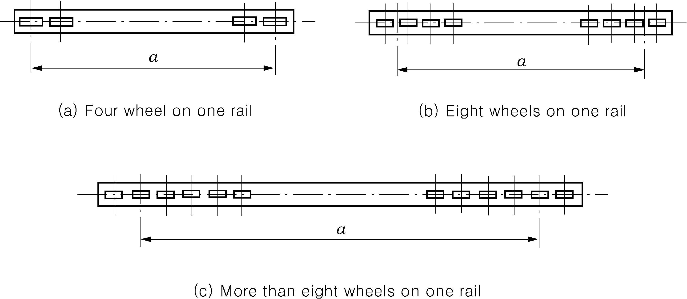
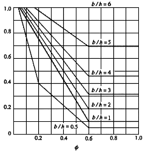
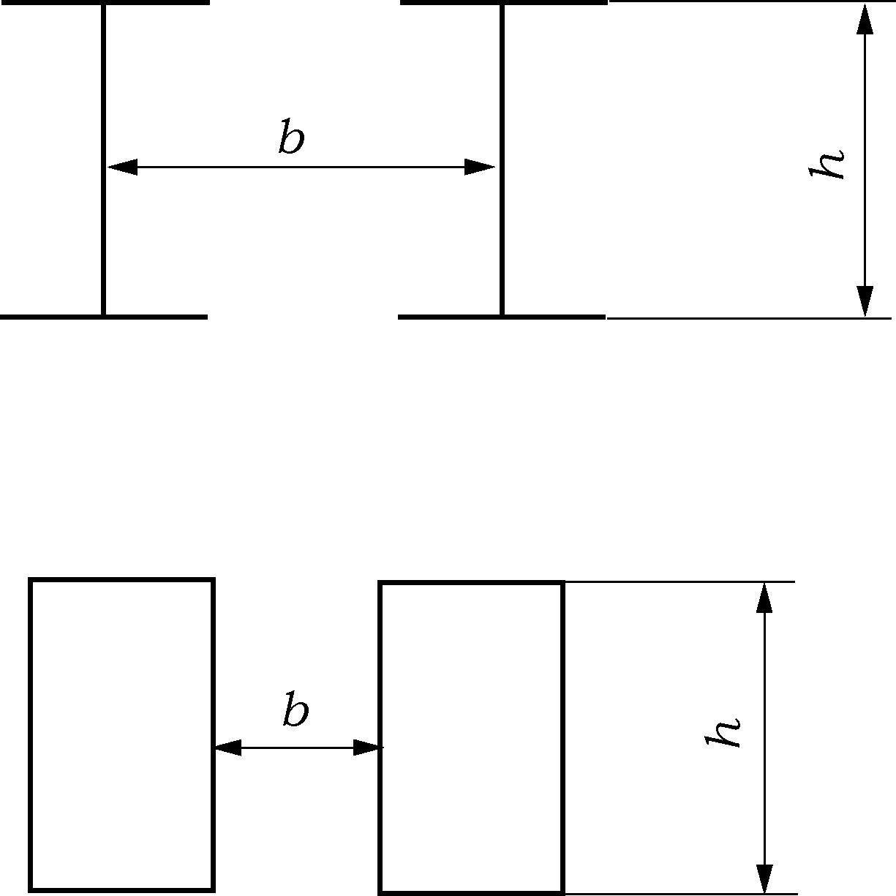
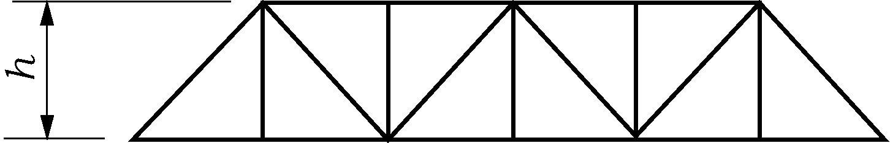

# PART 9 Additional Installations

> RULES FOR CLASSIFICATION OF STEEL SHIPS / RA-09-E / 2025 / EN / Guidance

## CHAPTER 2 CARGO HANDLING APPLIANCES

### Section 1 General

#### 101. General

- **1.** **Application 【See Rule】** ***(2025)***
  - **(1)** In application to **101. 1** (1) of the Rules, if the flag state specifies the type of cargo handling equipment and the safe working load limit separately, the registration of equipment not specified as subject to registration may be exempted under this rule.
  - **(2)** In application to **101. 1** (1) of the Rules, cargo handling equipment not subject to SOLAS II-1/3-13 refers to the following:
    - **(A)** Lifting appliances on ships certified as MODUs. Ships certified as MODUs are those subject to the MODU Code and which carry a MODU Code Certificate on board issued by the Administration or a recognized organization. The carriage of this certificate includes authorized electronic versions available on board.
    - **(B)** Lifting appliances used on offshore construction ships, such as pipe/cable laying/repair or offshore installation vessels, including ships for decommissioning work, which comply with standards acceptable to the Administration.
    - **(C)** Integrated mechanical equipment for opening and closing hold hatch covers.
    - **(D)** Life-saving appliances complying with the LSA Code.
  - **(3)** In application to **101. 1** (1) and (2) of the Rules, cargo handling appliances of ships flying Korean flag means that come under either of the followings:
    - **(A)** The cargo handling appliances, except cargo ramps, of safe working load not less than 1 ton which are installed in ships subject to the requirements of *Korean Ship Safety Act*.
    - **(B)** The cargo handling appliances of safe working load not less than 1 ton which are installed in ships(not less than 300 tons gross tonnage) subject to the requirements of *Fishing Vessels Act.*
    - **(C)** The cargo handling appliances installed in the ships other than those specified from (A) to (B) above, for which the assignment of the safe working load, etc. is requested.
- **2.** **Equivalency 【See Rule】**
  In addition to **101. 2** of the Rules, any existing lifting appliances and loose gear designed and manufactured not in accordance with the requirements of the Rules may be deemed by the Society to comply with the Rules, provided that they have passed the tests and inspection required by the Society. The expression “tests and inspection required by the Society” means the Design Examination specified in **203. 1** of the Rules and the Work Examination specified in **203. 2** of the Rules. However, the Society may dispense with part of the plan investigation and examination for the machinery and gear which passed the plan investigation and examination of official or third-party organizations considered appropriate by the Society and which were certified by them. *(2025)*

#### 102. Definitions (2025)

- **1.** The derricks that come under the requirements of the Rules include those illustrated in **Fig 9.2.1. 【See Rule】**
   
  - **(1)** Swinging derrick system (2) Union-purchase derrick system
     
  - **(3)** One topping derrick crane system (4) Tow topping derrick crane system
    **Fig 9.2.1 Derrick Systems**
- **2.** In application to **102. 10** of the Rules, the "other restrictive conditions deemed by the Society" means the restrictive conditions for safe working according to the characteristics of applicable cargo handing appliances. **【See Rule】**

#### 103. Arrangement, Construction, Materials and Welding

- **1.** **General Construction 【See Rule】** ***(2025)***
  - **(1)** The lifting appliances which are to comply with the additional requirements considered appropriate by the Society in applying the Rules as specified in **103. 2** (1) of the Rules include the following (A) through (D):
    - **(A)** Lifting appliance installed on mobile offshore units
    - **(B)** Lifting appliance installed on workboats
    - **(C)** Hoisting and stowing equipment for submersibles and diving
    - **(D)** Other equipment to which the Society deems necessary to pay special attention
  - **(2)** "The requirements specially made up by the Society" specified in **103. 2** (2) of the Rules include the following requirements (A) through (D):
    $5.0K+1.0$ ($\mathrm{mm}$)
    where:
    $K= \sigma _{yM} / \sigma _{yH}$
    $\sigma _{yM}$ : Specified value of yield stress of mild steel
    $\sigma _{yH}$ : Specified value of yield stress of high tensile steel
    $5hK$ ($\mathrm{cm}$)
    where :
    $h$ : As specified in **305. 2** of the Rules
    $K$ : As specified in (a) above
    $5.0K+1.0$ ($\mathrm{mm}$)
    where:
    $K$ : As specified in (a) above
    Weather part : $5.0K+1.0$ ($\mathrm{mm}$)
    Enclosed part : $5.0K$ ($\mathrm{mm}$)
    where:
    $K$ : As specified in (a) above
    - **(A)** Where steel materials of various strengths are used in the structural members, due considerations are to be given to the stress caused in the material of lower strength adjoining that of higher strength.
    - **(B)** For the members in which high tensile steels are used, special attention is to be paid to the structural details so that significant stress concentration may not take place.
    - **(C)** Where high tensile steels are extensively used in the structural members, careful considerations are required. In such cases, a thorough study with regard to ensuring buckling strength and the results of the study are to be submitted to the Society.
    - **(D)** Dimensions of the members are to comply with the following requirements (a) through (e):
      - **(a)** The minimum thickness of post specified in **303. 3** of the Rules may be obtained from the following formula:
      - **(b)** The minimum outside diameter of post at the base specified in **305. 2** of the Rules may be as obtained from the following formula:
      - **(c)** The value of the coefficient $C _{2}$ specified in **Table 9.2.8** and **305. 3** (1) (A) of the Rules may be substituted by the value of $C _{2}$ multiplied by the coefficient $K$ specified in (a) above.
      - **(d)** The minimum thickness of the structural members specified in **403. 6** of the Rules may be substituted by the value obtained from the following formula:
      - **(e)** The minimum thickness of the structural members specified in **803. 4** of the Rules may be substituted by the value obtained from the following formula:
- **2.** **Materials 【See Rule】** ***(2025)***
  - **(1)** "Cases considered appropriate by the Society" mentioned in **103. 4** (1) of the Rules are the following cases (A) to (C):
    - **(A)** Where $B$ grade of more than 25 $\mathrm{mm}$ in thickness are used in the following members (a) to (c) of the structural members of cranes:
      - **(a)** Flange for mounting slewing ring (bearing) of jib crane
      - **(b)** Housing base of jib crane
      - **(c)** Members constituting movable parts of gantry crane, etc. with increased plate thickness to ensure stiffness. However, requirements specified in **Table 9.2.1** of the Rules may be applied according to the magnitude of working stresses
    - **(B)** Where steel pipes conforming to the following requirements (a) through (d) are used to manufacture the structural members such as derrick booms, derrick posts, crane jibs, crane posts and other similar members:
      - **(a)** The steel pipes are to be of 20 $\mathrm{mm}$ or less in thickness.
      - **(b)** The steel pipes are to be of Grade 1 or 2 of steel pipes for pressure piping specified in **Pt 2** of the Rules, or the equivalent thereto.
      - **(c)** Steel pipes to be welded are to be of 0.23 *%* or less in carbon contents.
    - **(C)** Where rolled steel material and steel pipes, not exceeding 12.5 $\mathrm{mm}$ in thickness, complying with the standards recognized to be appropriate by the Society are used in the structural members of lifting appliances which are not employed in cargo handling services, excluding those used for cargo hoses. The materials of the structural members welded directly to the hull structure, however, are to comply with the requirements in **103. 4** (1) of the Rules or (B) (a) to (c) above.
  - **(2)** The classification of the steel materials used in the structural members, travelling girders, tracks, etc., of lifting appliance regularly used in especially cold zones or refrigerated hold chambers is to comply with **Table 9.2.1** according to design temperatures.
  - **(3)** Forged or cast steel parts used in the following structural members (A) through (F) may be of the materials conforming to International Standards(ISO), National Standards(KS) or equivalent standards.
    - **(A)** Topping bracket of derrick system
    - **(B)** Gooseneck bracket and gooseneck pin of derrick system
    - **(C)** Derrick heel lugs and head fitting of derrick boom
    - **(D)** Heel bracket of jib crane
    - **(E)** Heel fitting of crane jib
    - **(F)** Bracket and pin for movable parts of gantry crane, cargo lift and cargo ramps
  - **(4)** In **103. 4** (4) of the Rules, the "considered appropriate by the Society" menas the case as considered by International Standard(ISO), National Standard(KS) or equivalent standards.
  - **(5)** In **103. 4** (6) of the Rules, the "any standards recongnized by the Society to be of equivalent qualities" means the International Standard(ISO), National Standard(KS) or equivalent standards.

    **Table 9.2.1 Classification of Steel Materials Exposed to Low Temperature** ***(2019)***

    | Design temperature $T$ (℃) | Material thickness $t$ ($\mathrm{mm}$) |   |   |   |   |
    | --- | --- | --- | --- | --- | --- |
    | Design temperature $T$ (℃) | $t \leq 10$ | $10 \prec t \leq 20$ | $20 \prec t \leq 25$ | $25 \prec t \leq 40$ | $40 \prec t$ |
    | $-10 \leq T$ | *A/AH* |   | *B/AH* | *D/DH* | *E/EH* |
    | $-20 \leq T \prec -10$ | *B/AH* | *D/DH* | *E/EH* |   |   |
    | $-30 \leq T \prec -20$ | *E/EH* |   |   | *RL235A* | *RL235B* |
    | $-40 \leq T \prec -30$ | *RL235A* |   | *RL235B* |   | * |
    | $-50 \leq T \prec -40$ | *RL235B* |   | * |   |   |
    | (NOTES) 1. Steel grades for the construction capable of relieving thermal stress will be specially considered by the Society. 2. The Society may require materials having higher notch toughness according to the material thickness and construction if the design temperature is below -50℃ or working stress of the material exposed to low temperatures exceeds 60% of the yield point. 3. Steel grades for the members corresponding to classification asterisked * will be specially considered by the Society. 4. Symbols used in this Table are same as those in **Table 9.2.1** of the Rules. |   |   |   |   |   |
- **3.** **Welding 【See Rule】** ***(2025)***
  In application to **103. 5** of the Rules, the following are to be applied.
  - **(1)** Welding of derrick posts is to comply with the following requirements (A) through (H):
    
    **Fig 9.2.2 Welding for Portal and Post**
    - **(A)** Welding of post is to be both side welding as far as practicable.
    - **(B)** Welding of post to deck is to be of double grooved at the foot of post. If inside work of the post is difficult due to small diameter or any other reasons, penetration welding with the backing metal for single groove may be permitted.
    - **(C)** As for the welding of side plates to upper and lower plates constituting portal, the fillet size, at the portal ends and at the portions where topping brackets, eyes, etc. are fitted are to be of *F*1 weld specified in **Pt 3, Table 3.1.11** of the Rules.
    - **(D)** Welding for portal and post are to be both side welding as far as practicable. If the angle($\alpha$) shown in **Fig 9.2.2** is small, the ends of portal are to intersect orthogonally with the post surface by providing knuckle to carry out fillet welding as completely as practicable.
    - **(E)** Topping brackets and gooseneck brackets are to be fitted by penetrating the post or mounting the base. If the plate thickness of the post or the mounting base exceeds 12.5 $\mathrm{mm}$, the welding is to be penetration welding with grooves.
    - **(F)** The joint of derrick boom for circumferential is to be both side welding and back welding after removing defects of face run by back chipping. However, penetration welding with backing metal may be permitted limiting to such an unavoidable case as partial replacement for repair. In this case, the welded joint concerned is to be verified by suitable non-destructive inspection carried out along the whole length of weld line that it is free from injurious defects.
    - **(G)** The backing metal used for the joint derrick boom for longitudinal joint is to be jointless along the whole length with smooth surface.
    - **(H)** The requirements in (B), (E) and (F) above may be modified for the derricks not used in cargo handling service in consideration of the safe working load and the type of construction.
  - **(2)** Welding for cranes is to comply with the following requirements (A) to (E):
    - **(A)** The requirements in (1) (F) and (G) above are to be applied to the butt welding and longitudinal seam welding of jib by constructing the words "derrick boom" as "jib".
    - **(B)** Where welding from both sides (including fillet weld) is difficult for the welded joints other than butt welding and longitudinal seam welding of the jib, penetration bead welding or welding with backing strip is to be carried out.
    - **(C)** As for the welding of crane post, the requirements in (1) (A) and (B) above are to be applied.
    - **(D)** The following parts are, as a rule, to be fixed by full penetration type welding.
      - **(a)** Fixing part of crane post and post flange for slewing ring
      - **(b)** Fixing part of bracket for sheave to jib top
      - **(c)** Fixing part of bracket for sheave to crane house
      - **(d)** Fixing part of base bracket of jib
      - **(e)** Fixing part of crane house well and turning table
    - **(E)** The fillet weld applied to the primary structural members is, as a rule, to be *F*1 weld specified in **Pt 3, Table 3.1.11** of the Rules, or equivalent thereto.
  - **(3)** Welding for cargo lifts and cargo ramps is to comply with the following requirements (A) to (C):
    - **(A)** The fillet weld applied to the primary structural members is to comply with the requirements in (2) (E) above.
    - **(B)** Welding for non-slip bar, etc. fitted directly to the primary structural members is to be carried out in such a way that it may not give any injurious effect on the members.
    - **(C)** The method of welding for stoppers, their braces and similar fittings used in stowing the machinery are to be selected or carried out in such a way that they do not give any adverse effect on the structural members or hull structures.
  - **(4)** Welding for the structural members of cargo gear used regularly in especially cold zones or refrigerated hold chambers is to be carried out in such a way that it may not give any adverse effect on prevention of occurrence of low temperature brittle fracture in consideration of the structure, working stress, etc.
  - **(5)** When cast steel or forged steel parts are connected to steel plates by butt welding or lap welding, the details of welded joints are to comply with the requirements specified in **Pt 2, Ch 2, Sec 3** of the Rules.
  - **(6)** Non-destructive inspection for welded joints of structural members of lifting appliances is to comply with the following requirements (A) through (C):
    - **(A)** The following places (a) to (c) are to be subjected to radiographic test or ultrasonic test:
      - **(a)** Places specified in (1) (F) above
      - **(b)** For structural members of cranes, places specially considered by the Society according to their structure and method of construction as well as the places specified in (2) (A) above
      - **(c)** Places being suspicious in integrity of welded joints
    - **(B)** When the Society deems necessary, the following places corresponding to (a) to (d) are to be subjected to the magnetic particle test or dye penetrant test:
      - **(a)** Welded joint of rolled steel plate to cast or forged steel
      - **(b)** Trace of removing hanging pieces, jigs, etc. welded temporarily to the structural members
      - **(c)** Weld of cargo fitting
      - **(d)** Fillet welds of structural members being suspicious in integrity
    - **(C)** Method of non-destructive test specified in (A) and (B) above and judging criteria of defects are to be in accordance with the discretion of the Society according to the construction of the places concerned.

### Section 2 Surveys

#### 201. General

- **1.** **Application 【See Rule】** ***(2025)***
  In application to **201. 1** of the Rules, the following are to be applied.
  - **(1)** Posts for derricks and cranes, and supports for cargo lifts and cargo ramps fixed directly to the hull structure, are to be subjected to the tests and examinations specified in **Pt 1** of the Rules for the Survey and Construction of Steel Ships in addition to this chapter.
  - **(2)** Where cargo lifts and cargo ramps constitute part of the hull structure, they are to be subjected to the tests and examinations in compliance with the requirements in **Pt 1** of the Rules, according to the type and arrangement of hull structure.
  - **(3)** In application to **201. 1** (4) of the Rules, the Load Tests specified in **202.** of the Rules may be omitted, provided that the lifting appliance complies with the condition in either of the following (A) or (B).
    - **(A)** For heavy derrick systems: they are not frequently used and the Load Tests will be carried out before use.
    - **(B)** For union-purchase derrick systems: they passed the Load Tests as a swinging derrick system and eye plates of preventer stays are in good order.
  - **(4)** In application to **201. 1** (3) of the Rules, the term "where deemed necessary" means the case as specified in **Pt 1, Ch 1, 801. 1** of the Guidance.
- **2.** **Preparation and Attendance for Tests and Surveys**
  In application to **201. 2** (3) of the Rules, "The Surveyor considers that the safety for execution of the tests and examinations is not ensured" means that the safety measure of prevention for downfall is not taken during high-position survey, etc. *(2025)* **【See Rule】**

#### 202. Surveys of Cargo Handling Appliances

In application to **202. 2** (4) (D) of the Rules, the term "other cases when considered necessary by the Society" means the case where the occasional survey was recommended or carried out at the owner's request. *(2025)***【See Rule】**

#### 203. Registration Surveys

- **1.** **Registration survey during Construction** ***(2025)***
  - **(1)** Drawings and Other Documents to be Submitted **【See Rule】**
    In application to **203. 1** (1) of the Rules, the following are to be applied.(A) Notwithstanding the requirements in **203. 1** (1) of the Rules, where whole cargo handling appliances or any components thereof are manufactured on the basis of the drawings and documents already approved at the same works, submission of the drawings and documents other than the following documents (a) and (b) may be dispensed with.
    Submission of drawings may be dispensed with. However, name of manufacturer, type and principal particulars are to be described in the approval drawings of winches or travelling machines employed.
    Principal particulars, drawings of structural details and strength calculation sheet are to be submitted in one set for reference.
    Where the machinery is installed in ships under the classification of the Society for the first time, the requirements in (b) above are to be applied even when the output is less than 375 $\mathrm{kW}$.
    (ⅰ) Masts, posts, guy posts, shrouds, stays(including attached rigging screws), derrick booms, and arrangement of cargo fittings fitted to hull structure, etc.
    (ⅱ) Breadth of ship and outreach
    (ⅲ) Positions and name of cargo blocks and arrangement of running ropes(for lifting and slewing)
    (ⅳ) Positions, types and capacities of winches
    (ⅴ) Self-weight of lifting beams, grabs, lifting magnets, spreaders, etc.
    (ⅰ) Construction, dimensions and materials of masts, posts, guy posts and derrick booms
    (ⅱ) Dimensions and materials of shrouds and stays
    (ⅲ) Dimensions and materials of gooseneck brackets, topping brackets, eye plates at upper and lower ends of preventer stays and other cargo fittings
    - **(B)** Submission of drawings of hydraulic motors, hydraulic pumps, steam cylinders, pneumatic motors, or internal combustion engines for driving various winches and travelling machines used in cargo handling appliances is to be in accordance with the following requirements (a) to (c) according to the output:
      - **(a)** Where the output is less than 375 $\mathrm{kW}$:
      - **(b)** Where the output is 375 $\mathrm{kW}$ or more:
      - **(c)** Others:
    - **(C)** The general arrangement plan and structural drawings of derricks are to include at least the following items (a) and (b):
      - **(a)** General arrangement plan
      - **(b)** Structural drawings
  - **(2)** Examinations for Workmanship **【See Rule】**
    In application to **203. 2** of the Rules, the followings are to be applied.
    (ⅰ) Where the output is less than 375 $\mathrm{kW}$, shop tests may be replaced with the tests conducted by the manufacturer. In this case the Society may require submission of the test results, if it deems necessary.
    (ⅱ) Where the output is 375 $\mathrm{kW}$ or more, for tests except performance verification tests and open-up examinations, if manufacturers carry out internal tests and submit test reports, the presence of the Surveyor may be omitted. The hydraulic(water or oil) test is to be carried out at a pressure of 1.5 times the design pressure. (2017)
    (ⅲ) Notwithstanding the requirements (ⅰ) and (ⅱ) where the driving machines are installed on the class ship of the Society for the first time, the hydraulic test, performance verification test, and open-up examination are all to be carried out in the presence of the Surveyor.
    Hydraulic pumps are to be dealt with in similar ways to (a) (ⅰ) to (ⅲ) above depending on the outputs of the driving motors.
    These are to be dealt with in similar ways to (a) (ⅰ) to (ⅲ) above depending on each output. The hydraulic tests for the steam cylinders are to be carried out at a pressure of 1.5 times the design steam pressure and those for the valves directly connected to the cylinder are to be carried out at a pressure of 2 times the design steam pressure.
    These are to comply with the requirements specified in **Pt 6** of the Rules and to pass the tests and examinations specified in **Pt 6** of the Rules thereof.
    (ⅰ) Visual examinations and checking of the construction:
    It is to be ascertained that no practically injurious defects exist in materials and workmanship and each movable part moves smoothly.
    (ⅱ) No-load test:
    The winch is to be operated with no load at the maximum speed for 30 minutes(15 minutes for each normal and reverse rotation) and be ascertained that the performance and each structural part is in good order.
    (ⅲ) Load tests:
    The winch is to hoist and lower the rated load for a period of 30 minutes continuously. (Pause of 20 seconds may be inserted between each hoisting and lowering operation, and effective lift is desirable to be 10 $\mathrm{m}$ or more.) During this operation, the temperature rise of the bearings, the hoisting speeds, the lowering speeds and the input power are to be measured and ascertained that they are in good order.
    (ⅳ) Braking tests:
    During hoisting and lowering the rated load for the winch, return the control handle to the neutral position and check the slip of the load to be 1.5 $\mathrm{m}$ or less. Manual releasing test of the brake is also to be carried out and ascertained to be in good order.
    (ⅴ) Speed control tests
    (ⅵ) Emergency assurance tests:
    The emergency assurance devices provided in the winches is to be ascertained of the performance by cutting off power supply during lowering the rated load.
    (ⅶ) Overload tests:
    The winch is to hoist and lower a load weighing 125 % of the rated load several times. The winch is to be stopped at least three times during lowering the load and ascertained to be in good order.
    (ⅷ) Adjustment of the over-pressure preventive device:
    The adjusted pressure is to be checked as necessary.
    (ⅸ) Open-up examinations
    The Society may require an open-up examination of the part where abnormality is found.
    (ⅹ) Other tests deemed necessary by the Surveyor.
    - **(A)** Tests and examinations for driving machines, etc. for cargo gear and cargo ramps are to be in accordance with the following requirements (a) to (d):
      - **(a)** Hydraulic motors and regulating valves attached thereto:
      - **(b)** Hydraulic pumps:
      - **(c)** Steam cylinders, pneumatic motors and internal combustion engines:
      - **(d)** Driving motors for winches or hydraulic pumps and their control equipment:
    - **(B)** Winches which are used for the lifting appliances (except those specified in (C) below) are to be subjected to the tests and examinations mentioned in the following (a) and (b) at the shop tests after completion of assembly, including installation of driving machines, etc. In this case, one winch selected from those of the same type manufactured at the same time and to be installed on the same ship is to be tested in the presence of the Surveyor, and if the results are satisfactory, tests and examinations for other winches may be substituted by confirmation of the test results issued by the manufacturer.
      - **(a)** Electro-hydraulic winches
      - **(b)** The shop test for steam winches, electric winches, and winches driven by internal combustion engines are also to be carried out in accordance with the requirements specified in (a) above for electro-hydraulic winches (except (a) (ⅷ) above).
    - **(C)** Winches that are used for cranes, special derricks, cargo lifts or cargo ramps and are integrated in their moving bodies are, as a rule, to be handled in accordance with the requirements in (B) above. However, in cases where deemed impracticable by taking into account the construction or arrangement of the winch, part or all of the tests and examinations specified in (B) above may be permitted to be carried out at the time of the Load Tests specified in **204. 2** of the Rules.
  - **(3)** In application to **203. 1** (3) (가) (b) of the **Rules**, the term ‘When considered necessary by the Surveyor’ means the cases as specified in **Pt.1 Ch.1, 801. 2** of the **Guidance.** (2020)

#### 204. Periodical Surveys (2025)

- **1.** **Annual Surveys 【See Rule】**
  - **(1)** In application to **204. 1** (1) of the Rules, at Annual Surveys, the structural members and loose gear in which corrosion, abrasion, or other defects specified in the following are found are, as a rule, to be repaired or renewed:
    Structural members in which amount of wear and tear reaches 10 *%* of the original dimensions. However, this may not be applied where steel plates having enough margin to the thickness required by the Rules is used.
    Structural members where clearance between pin or similar fitting and its mating hole increases up to 10 *%* of the original diameter of the pin. However, for gooseneck pin the limit of clearance between the cross bolt and the bracket hole is to be 5 *%* of the original diameter of the cross bolt.
    For loose gear except wire ropes, those corresponding to any of the followings:
    Wire ropes corresponding to any of the followings:
    - **(A)** Structural members(plate members and cargo fittings other than pin construction):
    - **(B)** Cargo fittings of pin construction:
    - **(C)** Loose gear(except wire ropes)
      - **(a)** Those in which injurious deformation occurred
      - **(b)** Those in which injurious deformation occurred
      - **(c)** Those in which amount of abrasion or corrosion reaches 10 *%* or more of the original dimensions
      - **(d)** Blocks whose sheaves do not rotate smoothly
    - **(D)** Wire ropes
      - **(a)** Those in which 5 *%* or more of total number of independent wires(except filler wires) were broken within a length of 10 times the diameter of wire rope
      - **(b)** Those in which reduction in diameter of the wire rope reaches 7 *%* or more of the diameter
      - **(c)** Those in which kink or other injurious deformation occurred
      - **(d)** Those in which significant corrosion occurred at the surface of independent wires or inside the wire rope
      - **(e)** Those deemed necessary by the Surveyor
  - **(2)** In application to **204. 1** (1), (2), (3), (4), (5), and (6) (A) of the Rules, the "where considered necessary by the Surveyor" means the case as specified in **Pt 1, Ch 1, 801. 1** of the Guidance. **【See Rule】**
- **2.** **Load Tests 【See Rule】**
  In application to **204. 2** of the Rules, the following are to be applied.
  - **(1)** Load Tests for cranes which are newly constructed, as a rule, are to be carried out after having been assembled at the shops, as well as after having been installed on board the ships. If the results of the shop tests are satisfactory for one crane selected from those of the same type manufactured at the same time and to be installed on the same ship, those for other cranes my be substituted by confirmation of the test results issued by the manufacturer. If it is considered by the Surveyor that the Load Tests are impractical at the manufacturer's shop, the Load Tests at the shop may be dispensed with subject to carrying out the Load Tests on board.
  - **(2)** For lifting appliance exclusively using grabs, lifting beams, magnets, spreaders, and other similar loose gear (hereinafter referred to as "cargo holding gear"), the test load and safe working load may be dealt with in either case of the following (A) or (B) in accordance with the application:
    Test load = $\alpha$ × {(maximum cargo mass) + (mass of cargo holding gear)}
    Safe working load = (maximum cargo mass) + (mass of cargo holding gear)
    where:
    $\alpha$ : a factor obtained from the test load specified in **Table 9.2.2** of the Rules divided by the safe working load. However, for the safe working load not less than 20 $\mathrm{t}$ but less than 50 $\mathrm{t}$, the test load is to be the safe working load plus 5 $\mathrm{t}$.
    Test load = $\alpha$ × (maximum cargo mass)
    Safe working load = maximum cargo mass
    where:
    $\alpha$ : As specified in (A) above
    - **(A)** Where the mass of loose gears is included in the safe working load:
    - **(B)** Where the mass of loose gear is not included in the safe working load and the maximum cargo mass only is assigned as the safe working load, the lifting appliance whose safe working load is assigned by this procedure is to satisfy the following conditions:
      - **(a)** The load tests are to be carried out employing the loose gear used in the lifting appliance concerned or other loose gear having same construction and mass.
      - **(b)** The loose gear used on board the ship is to be the same gear as used in the load test or gear having the same construction and mass.
  - **(3)** Load Tests for lifting appliances which are used for solely conventional cargo handling by cargo hook are, as a rule, to be handled in accordance with the procedure specified in (2) (B) above.
  - **(4)** Details of Load Tests and operation tests for lifting appliances are to comply with the following requirements (A) to (E), in addition to those specified in the Rules.
    Where assignment of additional safe working load specified in **902. 2** (A) of the Rules is made, the Load Test for the additional safe working load may be dispensed with. In this case the relationship between the safe working load, etc. and additional safe working load, etc. is to satisfy the following formula:
    $B=W \frac{\cos \alpha}{\cos \beta}$
    where:
    $W$ : Safe working load ($\mathrm{t}$)
    $\alpha$ : Allowable minimum angle (*degree*)
    $B$ : Additional safe working load ($\mathrm{t}$)
    $\beta$ : Additional allowable angle (*degree*)
    - **(A)** Derricks
    - **(B)** Jib cranes
      - **(a)** Where assignment of additional safe working load specified in **902. 2** (B) of the Rules is made, the Load Test for the additional safe working load must not be dispensed with.
      - **(b)** For cranes with constant safe working load regardless of slewing radius, slewing tests are to be carried out at the maximum radius with test load based on the safe working load suspended on it and luffing operation to the minimum radius or the smallest possible radius is to be carried out and slewing test at that radius is also to be carried out as far as practicable.
      - **(c)** For cranes whose safe working load changes depending on the slewing radius, slewing tests are to be carried out at both the maximum and minimum slewing radius after hoisting the test loads corresponding to each radius.
      - **(d)** For cranes capable of doing all three of hoisting, slewing and luffing operations or any two out of these three operations simultaneously, these combined operations prescribed in the design specifications are to be verified that they are in satisfactory condition with the test loads corresponding to the limited radius suspended on it.
    - **(C)** Gantry cranes and other track-mounted cranes
      - **(a)** The crane is to run on the track within the traveling limits with the safe working load suspended on it. In this case, the hull structure supporting the traveling track is also to be confirmed that it is free from defects.
      - **(b)** Where traveling trolley is employed, it is to run the whole traveling range through with the safe working load suspended on it.
      - **(c)** Where sponson girder of stowing type for traveling trolley is employed, stretching and stowing operations of the girder are to be ascertained that they are in good order.
    - **(D)** In case of hydraulic cranes where limitations of pressure make it impossible to lift a test load 25 percent in excess of the safe working load, it will be sufficient to lift the greatest possible load, but in general this should not be less than 10 percent in excess of the safe working load.
    - **(E)** "The method considered appropriate by the Society" in **204. 2** (4) (B) of the Rules means the following requirements at least.
      - **(a)** Accuracy of the load weighing machine is to be within the range of ± 2.5 *%*.
      - **(b)** Load applying position is to be selected in such a way that the stress generated in the structural members be the most severe within the approved operating range.
      - **(c)** The load is to be sustained for a period of 5 minutes or more being sufficient to ensure the load indicator remains constant.

### Section 3 Derrick Systems

#### 302. Design Loads

- **1.** **Load Considerations 【See Rule】**
  In application to **302. 1** of the Rules, where strength of derrick systems is to be calculated directly, external forces exerting on top of boom are to include tension in topping lifts, tension in guy ropes, tension in cargo falls(which is caused by the weight of cargo), tension in cargo relief, half of self-weight of boom, and additional loads including self-weight of cargo blocks, hooks, ropes, etc. However, the additional loads may be as given in **Table 9.2.2.**
- **2.** **Loads due to Ship Inclination 【See Rule】**
  In application to **302. 3** of the Rules, the followings are to be applied.
  - **(1)** Where an angle of heel less than that specified in the Rules is used for the design of structural members, data concerning ship inclination in service condition in at least the following conditions (A) through (C) are to be submitted to the Society. Longitudinal strength of hull and stability in these conditions are to be separately examined.
    - **(A)** Ship light condition
    - **(B)** On going condition in service of cargo loading
    - **(C)** Immediately before fully loaded condition
  - **(2)** In ships conducting ballast adjustment to keep angle of heel within that specified in **302. 3** of the Rules in working condition, data concerning the following (A) through (C) are to be submitted to the Society. All these date are to be entered in the Instruction Manual to Cargo Handling Machinery and Gear referred to in **905. 2** of the Rules.

    **Table 9.2.2 Additional Loads**

    | Safe working load $W$ ($\mathrm{t}$) | Additional Loads ($\mathrm{t}$) |
    | --- | --- |
    | $W \leq 2$ $2 \prec W \leq 15$ $15 \prec W \leq 50$ $50 \prec W$ | $0.283W$ $0.4 \sqrt {W}$ $0.1W$ As considered appropriate by the Society |
    - **(A)** Specifications of equipment for ballast adjustment
    - **(B)** Method and procedure of ballast adjustment
    - **(C)** Trouble-shooting of equipment for ballast adjustment

#### 303. Construction of Derrick Posts

In **303. 6** (1) of the Rules, the "any other method approved as appropriate by the Society" means other method to be supported with strength verified by direct strength calculation method. **【See Rule】**

#### 306. Simplified Calculation Methods for Derrick Booms

- **1.** **1**. In **306. 2, Table 9.2.10, 9.2.11** and **306. 3, Table 9.2.14** of the Rules, the "value as considered appropriate by the Society" means the accepted value in accordance with **Pt 1, Ch 1, 105.** of the Guidance. **【See Rule】**
- **2.** **2**. In application to **306. 2** (2) of the Rules, the "any other standards recongnized by the Society to be equivalent" means the International Standard(ISO), National Standard(KS) or equivalent standards. **【See Rule】**

### Section 4 Cranes

#### 402. Design Loads

- **1.** **1**. In **402. 1** (K), **9** (2) (I) and (5) (E) of the Rules, the "other loads considered necessary by the Society" means the loads act on structure part of crane by snow, ice and changing temperature, etc. **【See Rule】**
- **2.** **2**. In application to **40 5**, **Table 9.2.16** of the Rules, the "value as considered appropriate by the Society" are specified in **Ch 3 Sec 1 103. 1 of the Rules for the Towing Survey of Barges and Tugboats**. **【See Rule】**
- **3.** **Load due to Ship Inclination 【See Rule】**
  In application to **402. 7** of the Rules, in calculating loads due to ship inclination to be taken into consideration in the design of cranes, requirements in **302. 3** (1) and (2) specified for derrick systems may be also applied to cranes.
- **4.** **Load Combinations 【See Rule】**
  In application to **402. 9** of the Rules, wind loading need not be taken into account for lifting appliances mentioned in the following (A) and (B): *(2025)*

#### 403. Strength and Construction

- **1.** **General 【 See Rule】**
  In application to **403. 1** of the Rules, the followings are to be applied and in **403. 1** (3) of the Rules, the "when considered necessary by the Society" means the case as specific cranes except cranes specified in **Table 9.2.15**.
  - **(1)** As for slewing ring of the crane, drawings and data given in the following (A) through (E) are to be submitted to the Society. However, for those having operational experiences aboard ships under the classification of the Society, the requirements may be reduced to only those specified in (B).
    - **(A)** Those giving structural details and materials of slewing ring
    - **(B)** Allowable values of vertical load, radial load, and overturning moment acting on the slewing ring *(2025)*
    - **(C)** Installation criteria of slewing ring
    - **(D)** Strength calculation sheet
    - **(E)** Data on operating experience and quality control during period of manufacture.
  - **(2)** In construction of jib crane house, such portions subjected to concentrated load as fixing parts of brackets for sheaves and wire rope stoppers are to be effectively reinforced.
- **2.** **Fixed Posts 【See Rule】**
  In application to **403. 8** of the Rules, the followings are to be applied.
  - **(1)** Where the fixing flange of slewing ring of jib crane at the upper part of post is reinforced by brackets, the brackets are at least to be fitted at every two fixing bolts for the slewing ring.
  - **(2)** The method of reinforcement specified in (1) above is to be applied also to gantry cranes and other special cranes having slewing ring.

#### 404. Special Requirements for Track-mounted Cranes

- **1.** **Stability 【See Rule】**
  In application to **404. 1** of the Rules, Tracks for track-mounted cranes are to comply with the following requirements (A) through (C):

### Section 5 Cargo Fittings

#### 502. Cargo Fittings

- **1.** **1**. In **502. 1** (3), **2** (2) and **3** of the Rules, the "any other standards recognized by the Society" means the International Standard(ISO), National Standard(KS) or equivalent standards. **【See Rule】**
- **2.** **2**. In **50 Table 9.2.21, 9.2.22** and **Table 9.2.25** of the Rules, the "value as considered appropriate by the Society" means the accepted value in accordance with **Pt 1, Ch 1, 105.** of the Guidance. **【See Rule】**

### Section 6 Loose Gear

#### 602. Cargo Blocks【See Rule】

- **1.** In application to **602. 1** of the Rules, pitch circle diameters of equalizer sheaves and sheaves of overload sensing devices are to be not less than 11 times and 6 times the diameters of wire ropes to be used, respectively. *(2025)*
- **2.** Sheaves, main parts of which are fabricated by welding steel plates, are to be verified prior to application that they have sufficient structural strength by the tests and inspections specified in the following (1) through (6): *(2025)*
  - **(1)** Welding procedure test(The test items are in accordance with the requirements specified in **Pt 2, Ch 2, Sec 4** of the Rules. They are, however, increased or decreased according to the type of joint.)
  - **(2)** Structural strength test(Local and/or total strength)
  - **(3)** Fatigue test(Test is to be carried out by rotating the sheave at least $10 ^{6}$ turns under the most severe load condition of the block.)
  - **(4)** Load Test
  - **(5)** Verifying test for special process of manufacture such as quenching
  - **(6)** Verification test for process of manufacture conforming to manufacturing standard(No occurrence of defects such as distortion is to be verified.)

#### 603. Ropes

- **1.** **Wire Ropes 【See Rule】**
  - **(1)** In application to **603. 1** of the Rules, terminal treatments of ropes are to comply with the following (A) through (F), as a standard: *(2025)*
    - **(A)** A loop splice should have at least three tucks with a whole strand of rope, followed by two tucks with half the wires cut out of each strand.
    - **(B)** All tucks other than the first should be against the lay of the rope. If another form of splice is used, it should be as efficient as that described in (A) above.
    - **(C)** A splice in which all the tucks are with the lay of the rope should not be used in the construction of a sling or in any part of a cargo handling appliance where the rope is apt to twist about its axis.
    - **(D)** If a loop is made or a thimble secured to a wire rope by means of a compressed metal ferrule, the ferrule should be made to a manufacturer’s standard conforming to the following (a) through (e):
      - **(a)** The material used for the manufacture of the ferrule should be suitable, particularly to withstand plastic deformation without any sign of cracking.
      - **(b)** The correct size(both in diameter and length) of ferrule should be used for the diameter of the rope.
      - **(c)** The end of the rope that looped back should pass completely through the ferrule.
      - **(d)** The correct dies should be used for the size of the ferrule.
      - **(e)** The correct closing or compression pressure should be applied to the dies.
    - **(E)** Where zinc or other alloy is cast in socket to hold the end of rope, work is to be done in accordance with the manufacturer’s criteria conforming to the following requirements (a) through (d):
      - **(a)** Rope length necessary to make alloy casting is to be ensured.
      - **(b)** Oil and dirt adhering to independent wires are to be completely removed and proper clean surfaces are to be ensured by treatment before casting work.
      - **(c)** Casting temperature suitable to the characteristics of the alloy is to be properly maintained.
      - **(d)** Socket is to be preheated before casting of alloy.
    - **(F)** The terminal fitting of any wire rope should be capable of withstanding the following loads (a) or (b).
      - **(a)** Not less than 95 *%* of the minimum breaking load of the rope in the case of a rope of a diameter of 50 $\mathrm{mm}$ or less
      - **(b)** Not less than 90 *%* of the minimum breaking load of the rope in the case of a rope of a diameter above 50 $\mathrm{mm}$
  - **(2)** In **603. 1** (B), **2** (A) of the Rules, the "the standards as deemed appropriate by the Society" and "the recognized standards" means the International Standard(ISO), National Standard(KS) or equivalent standards.

### Section 7 Machinery, Electrical Installations and Control Engineering Systems

#### 701. General

- **1.** **Application 【See Rule】**
  In application to **701. 1** of the Rules, "They may be suitably modified" specified in the requirement of winches used for cargo ramps means that the requirements specified in **702. 2** (1) (A), (B), (E), (F), **704. 2** (3) and **704. 3** (1) of the Rules are not applied.

#### 702. Machinery

- **1.** **Hoisting Machinery 【See Rule】**
  In application to **702. 2** of the Rules, the following are to be applied.
  - **(1)** Winches are to be designed such that the safety factor of the structural parts based on the ultimate tensile strength of the material, is not less than the value given as follows according to
    the safe working load of the lifting appliance incorporating the winches concerned: (2025)
    5 : for safe working load is 10 $\mathrm{t}$ or less
    4 : for safe working load exceeds 10 $\mathrm{t}$
  - **(2)** Winches which may have to continue stalling condition for a given period with load applied to winch drums are to be provided with devices capable of preventing positively rotation of the drum by means of such mechanism as ratchet in addition to the braking devices specified in **702. 2** (1) (D) of the Rules. In general, winches having mechanism shown in the following (A) and (B) correspond to these winches:
    - **(A)** Topping drum(or guy drum) of a winch, which drives its cargo hoist drum and topping drum(or guy drum) by a same driving unit through clutch
    - **(B)** Drum of a topping winch or guy winch, which is used as the end stopper of wire rope holding the boom at its working position
  - **(3)** "The rope at its end is to be secured to the drum" specified in **702. 2** (2) of the Rules means a force to sustain a load being double the drum load on condition that the wire rope is wound on the drum by four full turns.

#### 703. Power Supply

- **1.** **General 【See Rule】**
  In application to **703. 1** of the Rules, among cables used in power circuit of 600 $\mathrm{V}$ or less for electric equipment for movable lifting appliances, rubber flexible cords used in portions requiring flexibility and bending strength are to be those conforming to the International Standards(IEC), National Standards(KS), or equivalent standards. *(2025)*

#### 704. Control Engineering Systems

- **1.** **Safety System 【See Rule】**
  In application to **704. 3** of the Rules, the followings are to be applied.
  - **(1)** It recommended that derrick systems are to be provided with limit switches to prevent over winding up, slewing and over luffing.
  - **(2)** Cranes are to be provided with safety devices specified in the following (A) through (D):
    - **(A)** Overload preventive device and overload alarm. Cranes not serving cargo handling may dispense with these devices.
    - **(B)** Limit switches to prevent over winding up, over slewing over luffing
    - **(C)** Where trolley or crab travels on horizontal jib or luffing jib and safe working load varies depending on the load and radial position of trolley or crab, radial load indicator clearly visible to the operator indicating the following items (a) and (b):
      - **(a)** Safe working load of crane corresponding to the radial position of hook or other hoisting gear fitted to the hoist rope
      - **(b)** Limit value for luffing motion of jib or longitudinal motion of trolley/crab. This, however, does not apply to the case where rated load diagram is posted in the operator cab.
    - **(D)** For cranes having travelling equipment on the body or hoisting device, overrun preventive device on the travelling tracks. In addition, it is recommended that overspeed preventive device be provided.
  - **(3)** Cargo lifts are to be provided with the safety devices given in the following (A) through (C) as far as practicable:
    - **(A)** Overload alarm
    - **(B)** Automatic cutout device for power supply to the driving equipment when hoisting rope or chain slacks
    - **(C)** Interlock device capable of functioning the following (a) and (b) where locking bars are used in stowing device of the lift
      - **(a)** Power is not to be supplied to the lift unless all locking bars are pulled out.
      - **(b)** For hydraulic lifts, locking bars can not be pulled out until oil pressure reaches a pressure sufficient to sustain the lift.
  - **(4)** The emergency stopping device specified in **704. 2** (4) of the Rules is to operate independently of other control devices.
  - **(5)** Cargo ramps are to be provided with the safety devices specified in the following (A) and (B):
    - **(A)** An alarm device generating alarm before inclination of the ship reaches the value determined in accordance with the requirements in **802. 1** (1)
    - **(B)** For ramps slewing or travelling with cargo loaded, safety devices determined by the requirements in (1) to (3) above depending on the operating system

### Section 8 Cargo Lifts and Cargo Ramps

#### 802. Design Loads

- **1.** **Other Loads 【See Rule】**
  In **802. 1** (G), **6** (2) (E), (4) (F), (5) (E) of the Rules, the "other loads considered necessary by the Society" means the loads act on structure part of cargo lifts and cargo ramps by snow, ice and changing temperature, etc.
- **2.** **Loads due to Ship Inclination 【See Rule】**
  In application to **802. 4** of the Rules, the followings are to be applied.
  - **(1)** The load due to ship inclination is, as a rule, to comply with the requirements in **402. 7** of the Rules. The Society, however, may permit to apply value of ship inclination offered, if the data on ship inclination in service conditions are submitted to and deemed appropriate by the Society.
  - **(2)** Cargo ramps are not, as a rule, to be designed to be capable of operating at a slope of exceeding 1/10.

#### 803. Strength and Construction

- **1.** **Deflection Criteria 【See Rule】**
  In application to **803. 5** of the Rules, concerning deflections of the cargo lifts and cargo ramps, the Society may permit application of values larger than those specified in **803. 5** of the Rules if it considers no obstruction exists in strength and operation of the equipment judging from the operating experience, results of model tests, etc.
  Annex 9-2 Personnel Lifting Appliances *(2017)*

#### 101. General

- **1.** **Application** ***(2025)***
  - **(1)** Cranes registered in accordance with the **Pt 9, Ch 2** of the Rules(hereinafter referred to as the Rules) that are used for personnel lifting are to comply with the requirements specified in this annex in addition to the requirements of the Rules.
  - **(2)** The means of embarkation and disembarkation required by the SOLAS convention are not to be substituted by personnel lifting appliances in accordance with this annex.

#### 102. Surveys

- **1.** **Registration Surveys**
  - **(1)** Drawings and Other Documents to be Submitted
    lifting)
    (ⅲ) Arrangement of signalmen in cases where the object of lifting is not visible from the crane control position
    - **(A)** Approval drawing
      - **(a)** Equipment added for personnel lifting
    - **(B)** Reference document
      - **(a)** Operation manual for personnel lifting
      - **(b)** In case of personnel lifting appliances specified in **101. 4** (4) of the **Rules**, failure analysis of the lifting system and all associated equipment (e.g. Qualitative Failure Analysis (QFA) or FMEA and related reports) *(2025)*
    - **(C)** The operation manual specified in (B) (a) is to contain the following (a) to (c).
      - **(a)** Restrictions on personnel lifting appliance operations, which are to contain at least the following: *(2025)*
      - **(i)** Wind velocity, wave height, and visibility
        - **(ii)** The maximum angle and slewing radius of cranes (horizontal and vertical distance to the object of
        - **(iii)** Safe working loads and hoisting, lowering, and swinging speeds
        - **(iv)** Embarkation areas of equipment used to lift personnel such as baskets
      - **(b)** Items regarding persons engaged in personnel lifting appliance operations, which are to contain at least the following: *(2025)*
      - **(i)** Roles of the operational master
        - **(ii)** Qualification of the crane operator
        - **(iv)** Means to ensure the safety of persons in the basket and engaged in the operation
      - **(v)** Communications between the operational master and persons involved
        - **(vi)** Means to address the emergency situations such as rescue means in the case of crane malfunctions
        - **(vii)** Inspection and testing items prior to personnel lifting appliance operations
      - **(c)** Items to be checked prior to use of the basket, which are to contain at least the following: *(2025)*
      - **(i)** Specifications of the basket such as its own weight, SWL and capacity
        - **(ii)** Maintenance records
        - **(iii)** Certifications issued by an official body or a third-party body
    - **(D)** Failure analysis specified in (B) (b) is to include the following items (a) and (b). Where a single failure results in failure of more than one component in a system (common cause failure), all resulting failures, as well as any further failures directly caused by the initial failure, are to be considered together. *(2025)*
      - **(a)** The effects of failure on all equipment and systems due to a single failure, fire in any space, or flooding of any watertight compartment that could impact the availability of the transfer arrangements.
      - **(b)** Solutions to ensure the availability of the personnel lifting appliances and the safety of all persons involved in the event of such failures identified in (a) above.
  - **(2)** Registration Surveys *(2025)*
    - **(A)** Personnel lifting appliances are to be examined and ascertained to be in good order by the following tests and surveys:
      - **(a)** Operation tests of the equipment added for personnel lifting
      - **(b)** Other tests considered necessary by the Society
    - **(B)** Appliances specified in **106.** on board the ship and markings specified in **107.** are to be examined.
- **2.** **Annual Surveys** ***(2025)***
  At annual surveys, personnel lifting appliances are to be examined and ascertained to be in good order by the following tests and surveys, in addition to the requirements in **204. 1** (2) of the Rules.

#### 103. Cranes

- **1.** **Safe Working Load**
  The safe working load of the cranes in personnel transfers is to be less than 50 % of the safe working load specified in **102.** of the **Rules**. The total weight of the basket (sum of its own weight and capacity load) is not to be more than this load. *(2025)*
- **2.** **Operational limitation**
  Except for emergency operations, the operational limitations for lifting of personnel are to be as follows: *(2025)*
- **3.** **Arrangement and Construction** ***(2025)***
  For cargo handling appliances registered with this Society, when requesting registration surveys as personnel lifting appliances specified in **101. 4** (4) of the **Rules**, compliance with the requirements of **103. 1** (5) and (6) of the **Rules** and **103. 1** (1) of the **Guidance** is to be confirmed.

#### 104. Loose gear

- **1.** **General**
  The safety factor of any loose gear is to be 10 and more on the basis of the breaking strength against the safe working load specified in **103.**
- **2.** **Wire Ropes**
  In addition to the requirements specified in **603. 1** of the **Rules**, wire ropes are to be of an anti-rotation type. *(2025)*

#### 105. Machinery, electrical installations and control engineering systems

- **1.** **General**
  The machinery, electrical installations and control engineering systems used in the personnel lifting appliances are to be arranged to prevent accidental falls of the basket and are to be able to lower the basket in the case of a power supply malfunction. *(2025)*
- **2.** **Brakes**
  - **(1)** Hoisting and luffing winches shall be equipped with two mechanically and functionally independent brakes.
  - **(2)** Means shall be provided for separate testing of each brake.
  - **(3)** Mechanical brakes shall fulfil the requirements for brakes as given in **702. 2** of the **Rules** based on SWL for the actual load cases. SWL will be replaced by rated capacity for personnel handling, provided the brake is used in personnel handling mode only. *(2025)*
  - **(4)** Where cylinders are used for luffing, folding or telescopic, they shall be provided with a hydraulic shutoff valve. Alternatively each motion shall have two independent cylinders where each cylinder is capable of holding the rated capacity for lifting of persons.
- **3.** **Mode selection for lifting of persons**
  The control station is to be equipped with a manual switch for selection between cargo and personnel lifting modes. When the mode for personnel lift is selected, the following functions shall be maintained:

#### 106. Other appliances

- **1.** **Communication devices**
  Appropriate communication devices are to be provided to the operational master, the crane operator, the signalmen, and persons in the basket.
- **2.** **Wind gauge**
  Wind gauge is to be provided to ensure that the operational master can be informed of the wind velocity.
- **3.** **Basket**
  Where the basket is to be approved, it is to comply with **EN 14502-1** or equivalent standard.
- **4.** **Lighting** ***(2025)***
  For personnel lifting appliances specified in **101. 4** (4) of the **Guidance**, lighting that can be supplied by the emergency power source is to be provided to illuminate the personnel transfer arrangements, the water below the transfer arrangements and the passage specified in **103. 1** (5) of the **Rules**,

#### 107. Certification, marking and documentation

- **1.** **Marking of Safe Working Load, etc.**
  - **(1)** Marking for Cranes
    Annex 9-3 Offshore Crane *(2025)*
    - **(A)** At the location specified in **903. 1** of the Rules, the safe working load, the maximum slewing radius, and other restrictive conditions of personnel transfers are to be marked. *(2025)*
    - **(B)** At the locations of the crane control position and embarkation area, a notice indicating the safe working load, the maximum slewing radius, maximum wind velocity, maximum wave height, minimum visibility, and other restrictive conditions for personnel transfers is to be provided.
    - **(C)** All personnel lifting appliances are tol be permanently marked to allow for the identification of each appliance for the purposes of survey, inspection, and record-keeping. Records of use and maintenance are to be kept on board the ship. *(2025)*

#### 101. General

- **1.** **Application**
  - **(1)** Cranes registered under **Pt 9**, **Ch 2** of the **Rules for the Classification of Steel Ships** (hereinafter referred to as the “Rules”) are to also meet the specific requirements set forth in this annex in addition to the requirement of the Rules.
  - **(2)** Where the Rules and this annex specify different requirement for the same matter, the principle is to apply the more stringent requirement.
  - **(3)** Offshore cranes that are approved and inspected by the Society in accordance with international standards, national standards, or equivalent standards may be deemed compliant with the Rules.

#### 102. Surveys

- **1.** **Load Test**
  - **(1)** For offshore cranes where the impact load factor as stipulated in **103. 2** exceeds 1.33, the test load of load test for the lifting appliances and loose gear is to be calculated by multiplying the test load specified in **204. 2** (b) of the Rules by the impact load factor divided by 1.33.

#### 103. Cranes

- **1.** **General**
  In addition to the requirements of **Sec 4** of the Rules, the requirements of this section are to also satisfied.
- **2.** **Impact Loads**
  - **(1)** The impact loads for offshore cranes is to include effects due to normal lifting impacts, dynamic effects, and the relative movement between the crane and the cargo.
  - **(2)** The impact load is to be the product of the lifting load and the impact load factor. For offshore cranes intended for use in open sea conditions with significant wave heights of 0.6 m or more, the impact load factor is to be determined in accordance with (3) or (4) below, provided that the impact load factor is to be at least 1.15 for on-board lifting and at least 1.30 for off-board lifting.
  - **(3)** The impact load factor varies depending on the designed operating sea state and can be calculated using the following formula:
    $1+ \frac{V _{R}}{g} \sqrt {\frac{K}{SWL}}$
    where
    $K$ : the crane stiffness ($\mathrm{kN}/m$)
    $SWL$ : the safe working load (t)
    $g$ : the gravity acceleration 9.81 $\mathrm{m}/s ^{2}$
    $V _{R}$ : the relative velocity of the cargo and the hook at the time of pick-up ($\mathrm{m}/s$)
    $V _{R} =\max(0.5V _{H} ,V _{H,\min} )+ \sqrt {V _{D}^{2} +V _{C}^{2}}$
    where
    $V _{H}$ : the maximum steady hoisting velocity for the SWL to be lifted ($\mathrm{m}/s$)
    $V _{D}$ : the vertical velocity of the cargo supporting deck ($\mathrm{m}/s$). However, if project-specific data is available and submitted for the Society’s approval, such values may be utilized.
    $V _{D} =0$ : for bottom fixed structure
    $V _{D} =4.0 H _{s} /(H _{s} +7.0)$ : for steel barge
    $V _{D} =6.0 H _{s} /(H _{s} +8.0)$ : for supply vessel
    $V _{C}$ : the vertical velocity of the crane boom tip due to the movement of the crane base ($\mathrm{m}/s$). However, if project-specific data is available and submitted for the Society’s approval, such values may be utilized.
    $V _{C} = 0.50 H _{s}$
    $V _{H,\min}$ : the minimum hoisting velocity to avoid re-contact of the lifted cargo with the supporting deck ($\mathrm{m}/s$)
    $V _{H,\min} =K _{H} \sqrt {V _{D}^{2} +V _{C}^{2}}$
    where
    $K _{H}$ : velocity factor according to the the reeving method for lifting the cargo
    $K _{H}$=0.50 : for single fall reeving
    $K _{H}$=0.28 : for multiple fall reeving
    ((B) The calculation of crane stiffness is to take into account all elements from the hook to the pedestal support structure, and the wire ropes are to consider the elastic modulus and related area as recommended by the manufacturer.
    - **(A)** When lifting a load, the relative velocity ($V _{R}$) of the cargo and the hook can be obtained by the following equation depending on the significant wave height ($H _{s}$).
  - **(4)** If the calculation method of the impact load factor specified in (3) is no used, the motion behavior of the offshore facility, offshore crane, and supporting vessel is to be analyzed and calculated.
    - **(A)** The calculation of impact loads is to include:
      - **(a)** Vertical motion of the support vessel
      - **(b)** Horizontal motion of the support vessel
      - **(c)** Load-bearing structure of the crane
      - **(d)** Motion behavior of offshore facility
    - **(B)** The effects of shock absorbing devices, motion commentators, or similar devices may additionally be considered, and means to provide the operating status of such devices to the crane operator is to be established.
  - **(5)** The cranes utilizing grabs are to include an additional safety margin of 25% on the impact load factor calculated according to (3) or (4).
  - **(6)** Offlead and sidelead loads due to radial displacement of cargo on the deck of the vessel at the crane tip are to be specifically considered, and the designer is to specify these. Offlead and sidelead loads are calculated by multiplying the dynamic load by the impact load factor.
    $2.5+1.5H _{s}$
    $0.5(2.5+1.5H _{s} )$
    - **(A)** The radial displacement of cargo on the deck of the vessel at the crane boom tip for the calculation of offlead load according to the significant wave height ($H _{s}$) can be calculated using the following formula:
    - **(B)** The radial displacement of load on the deck of the vessel at the crane boom tip for the calculation of sidelead load according to the significant wave height ($H _{s}$) can be calculated using the following formula:

#### 104. Loose gear

- **1.** **General**
  In addition to the requirements of **Sec 6** of the Rules, the requirements of this section are to also satisfied.
- **2.** **Safety Factor of Wire**
  - **(1)** For offshore cranes where the impact load factor exceeding 1.33 as specified in **103. 2**, the safety factor for wire ropes is to be calculated by multiplying the safety factor specified in **Sec 6** of the Rules by the value of the impact load factor divided by 1.33.
  - **(2)** The breaking strength of the loose gear is to be greater than the product of the safety factor calculated in (1) and the safe working load.

#### 105. Machinery, Electrical Installations and Control Engineering Systems

- **1.** **General**
  In addition to the requirements of **Sec 7** of the Rules, the requirements of this section are to also satisfied.
- **2.** **Hoisting Machinery**
  The hoisting velocity is to be sufficiently high to prevent re-contact between the load and the deck during lifting operations. The hoisting velocity is to generally be at least the minimum hoisting velocity ($V _{H,\min}$) specified in 103. 3 (1) (a).
- **3.** **Safety System**
  To protect the offshore cranes from overload and excessive moment, Automatic Overload Protection System(AOPS) and Manual Overload Protection System(MOPS) are to be provided. Alternative design may be specially considered and require approval from the Society.

#### 106. Other appliances

- **1.** **Communication devices**
  Appropriate communication devices are to be provided to the operational master, the crane operator and the signalmen.
- **2.** **Wind gauge**
  Wind gauge is to be provided to ensure that the operational master can be informed of the wind velocity.

#### 107. Certification, marking and documentation

- **1.** **Marking of Safe Working Load, etc.**
  - **(1)** Marking for Cranes
    - **(A)** At the location specified in **Ch 2, 903. 1** of the Rules, the maximum significant wave height, the safe working load, the maximum slewing radius, and other restrictive conditions are to be marked.
    - **(B)** If the safe working load of the crane varies with significant wave height and/or working radius, a comparative load chart showing the relationship between significant wave height, slewing radius, and safe working load is to be provided at the locations of the crane control position. 
