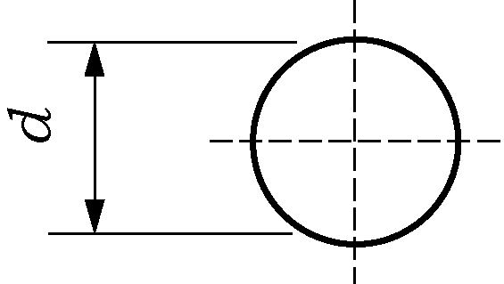
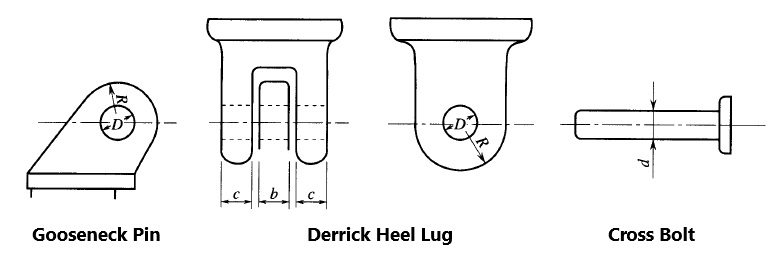
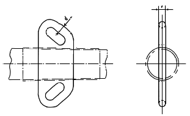
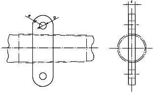

# PART 9 Additional Installations

> RULES FOR CLASSIFICATION OF STEEL SHIPS / RA-09-E / 2025 / EN / Guidance

## CHAPTER 3 AUTOMATIC AND REMOTE CONTROL SYSTEMS

### Section 2 Surveys of Automatic and Remote Control Systems

#### 201. General

- **1.** **Preparation for surveys and others** ***(2020)*** **【See Rule】**
  In application to **201. 3** (1) of the Rules, the term "a standard deemed appropriate by the Society" means the acceptance in accordance with **Pt 1, Ch 1, 104.** of the Rules.

#### 202. Classification surveys

- **1.** **Drawings and data 【See Rule】**
  The following drawings and data are to be submitted as those for the specific automation equipment specified in **202. 1** (3) (D) of the Rules.
  - **(1)** Remote-controlled ballasting/deballasting arrangements
    - **(A)** Schematic diagrams for ballasting/deballasting piping systems(with arrangements of ballast tanks, valves, pumps and sea chests, and including the exclusive heel adjusting pipe lines)
    - **(B)** Arrangements of instruments on remote monitoring and alarm panels for ballasting/deballasting and remote control panels for pumps and valves
    - **(C)** Schematic diagrams of tank liquid level remote monitoring systems
    - **(D)** Schematic diagrams of valve operating and remote control systems for valves
  - **(2)** Automatic steering systems
    The drawings for approval concerning the automatic steering systems are to include, at least, the following items:
    - **(A)** Constitution of systems for steering
    - **(B)** Block diagrams of alarms and indicators
    - **(C)** Arrangements of instruments on steering stand, alarm panels, etc.
    - **(D)** Explanatory notes on the functions of the systems
  - **(3)** Remote-controlled handling systems for liquid cargo in bulk
    - **(A)** Schematic diagrams of liquid cargo piping systems(with arrangements of cargo tanks, valves, and pumps, and tank capacities)
    - **(B)** Arrangement plans of equipment in the cargo-handling centralized cargo control room (station)
    - **(C)** Arrangements of instruments on remote monitoring and alarm panels, and remote control panels for pumps, valves, etc., installed in the cargo-handling centralized cargo control room (station)
    - **(D)** Schematic diagrams of tank liquid level remote monitoring systems
    - **(E)** Schematic diagrams of valve operating and remote control systems
  - **(4)** Power-driven opening/closing arrangements
    - **(A)** Arrangement plans of the systems, including their control positions
    - **(B)** Schematic diagrams of power source
    - **(C)** schematic diagrams of control source(only in case where separately provided from the power source)
    - **(D)** Detailed drawings for indicators or alarms, etc. to ensure the safety in opening/closing operations, if provided.
  - **(5)** Automatic recording devices for operating condition of main engine
    - **(A)** Service instructions for automatic recording devices of operating condition(with notations on constitution of systems, intervals of regular recordings, and details of recording functions including those for regular recording, alarm recording and arbitrary recording)
  - **(6)** Remote-controlled mooring arrangements
    - **(A)** Arrangement plans of mooring systems(with location of remote control stands and arrangements of mooring lines)
    - **(B)** Schematic diagrams of power source for mooring systems
  - **(7)** Air-conditioning arrangements for control stations
    - **(A)** Service instructions for air-conditioning arrangements for control stations
    - **(B)** Layout of the alarm panel
    - **(C)** Electrical diagrams of air-conditioning arrangements
  - **(8)** Remote-controlled fuel oil filling arrangements
    - **(A)** Schematic diagrams of fuel oil filling piping system(with arrangements of tanks, valves, and pumps, and tank capacities)
    - **(B)** Schematic diagrams of remote monitoring and alarm systems of the liquid level in tanks
    - **(C)** Schematic diagrams of valve operating and remote control systems
    - **(D)** Arrangement of instruments on remote monitoring and alarm panels and remote valve control panels
  - **(9)** Centralized monitoring devices for refrigerating containers
    - **(A)** Arrangements of instruments on monitoring panels
    - **(B)** Electrical diagrams of monitoring panels
    - **(C)** Lists of monitoring and alarming items
  - **(10)** Cargo hose handling winches
    - **(A)** General arrangements and layout drawings of cargo hose handling winches
    - **(B)** Schematic diagrams of power source
    - **(C)** Schematic diagrams of control source(only in case where separately provided from the power source)
  - **(11)** Automatic washing arrangements
    - **(A)** General arrangements and layout drawings of washing arrangements
    - **(B)** Schematic diagrams of washing water piping systems
    - **(C)** Schematic diagrams of power source for washing arrangements and control systems
  - **(12)** Remote-controlled mooring arrangements at ship-sides
    - **(A)** Layout of mooring arrangements(including layout of remote control stand and mooring rope)
    - **(B)** Schematic diagrams of power source for mooring arrangements
  - **(13)** Power-operated pilot ladder winding appliances
    - **(A)** General arrangements and Layout drawings of winding appliances
    - **(B)** Schematic diagrams of power source
    - **(C)** Schematic diagrams of control source(only in case where the control source is provided separately from the power source)
  - **(14)** Centralized monitoring systems for machinery
    - **(A)** Arrangements of instruments on monitoring panels
    - **(B)** Lists of monitoring and alarming items
  - **(15)** Centralized control systems for machinery
    - **(A)** Arrangements of instruments on control panels
    - **(B)** Lists of monitoring, alarm and control items
  - **(16)** Bridge wing control devices for main engine remote control and remote steering systems
    - **(A)** General arrangements and layout drawings of bridge wing control devices for main engine remote control and remote steering systems
    - **(B)** Schematic diagrams of power source
    - **(C)** System diagram of control source(only in case of source independent of main power source)
  - **(17)** High level alarm for cargo hold bilge
    - **(A)** Diagram and general arrangement of alarm system
    - **(B)** Layout of the alarm panel
  - **(18)** Independent remote-controlled mooring arrangements
    - **(A)** Layout of mooring arrangements(including layout of remote control stand and mooring rope)
    - **(B)** Schematic diagrams of power source for mooring arrangements
    - **(C)** Schematic diagrams of remote control systems for mooring arrangements
  - **(19)** Emergency towing rope winches
    - **(A)** General arrangements and layout drawings of emergency towing rope winches
    - **(B)** Schematic diagrams of power source
    - **(C)** Schematic diagrams of control source(only in case where separately provided from the power source)

#### 203. Shop tests

- **1.** **Type approval 【See Rule】**
  - **(1)** In application to **203. 1** of the Rules, "automatic equipments" to be type-approved are, in principle, as follows:
    - **(A)** Alarm and monitoring systems
    - **(B)** Control systems for, main engine, generators, boilers and essential auxiliary machinery, etc.
    - **(C)** Computer-based systems
    - **(D)** Fire detection systems
    - **(E)** Gas detection systems
    - **(F)** Electronic governor systems
    - **(G)** Speed and shaft horsepower sensing equipment
    - **(H)** Controller
    - **(I)** Flow, level, limit, pressure, temperature switches
    - **(J)** Oil mist detectors
    - **(K)** UPS
    - **(L)** Electrical and electronic indicators
    - **(M)** Electric power converters for electric propulsion unit
    - **(N)** Optical sensors and optical application device applied to the above (A) ∼ (M)
    - **(O)** Those considered necessary by the Society
  - **(2)** "Test methods approved by the Society" specified in **203. 1** of the Rules means the requirements specified in **Ch 3, Sec 23** of the **Guidance for Approval of Manufacturing Process and Type Approval, Etc.**
- **2.** **Shop tests of automatic systems** ***(2020)*** **【See Rule】**
  In application to **203. 2** (1) (E) of the Rules, the term "Other tests considered necessary by the Society" means the acceptance in accordance with **Pt 1, Ch 1, 104.** of the Rules.

#### 204. On-board tests 【See Rule】

#### 205. Sea trials for the centralized monitoring and control systems for main propulsion and essential auxiliary machinery

- **1.** **Main propulsion machinery and controllable pitch propellers 【See Rule】**
  As for the test procedures specified in **205. 1** of the Rules to test the main engine or controllable pitch propellers by bridge control devices, those according to **206.** are to be considered as the standard practice.

#### 206. Sea trials for the operating systems for periodically unattended machinery spaces (2017) 【See Rule】

**Fig 9.3.1 Trial Procedures for Diesel Ships** ***(2021)***
**Fig 9.3.2 Trial Procedures for Steam Turbines Ships** #underline{***(2021)***}
[Remarks]

- **1.** ⊖signifies putting over the rudder to hard port or bard starboard while proceeding at dead slow ahead.
- **2.**  signifies to operate as quick as practicable. However, where crash astern is performed and admitted by the Surveyor in a separate way(by shipyard's practice standard, etc), it (□) may be dispensed.
- **3.**  signifies to cut off the power supply(electric, pneumatic or hydraulic) for the remote control systems and to confirm that the preset speed and direction of the propeller thrust for main propulsion machinery or controllable pitch propellers will be maintained and any abnormal condition will not take place, and the Society needs to confirm if the change-over from this condition to ECR is possible.
- **4.**  signifies to stop the main propulsion machinery by the emergency stop button.
- **5.** ⊙signifies to raise the output of main propulsion machinery to that of the normal service condition.
- **6.** △signifies to raise the ship's speed to that of the normal service condition.
- **7.** ×signifies to stop the rotating of the main shaft.

#### 208. Classification maintenance surveys

- **1.** **Annual surveys 【See Rule】**
  In application to **208. 1** (3) of the Rules, the term "Where considered necessary by the Surveyor" means that it is determined that not exhibit the required performance.

### Section 3 Centralized Monitoring and Control Systems for Main Propulsion and Essential Auxiliary Machinery (2025)

#### 302. System design

- **1.** **Computer-based systems 【See Rule】**
  In application to **302. 7** of the Rules, examples of computer-based systems are shown in **Pt 6, Ch 2, Table 6.2.2** of the Rules. Where independent effective backup or other means of averting danger is provided, the system category Ⅲ may be downgraded to category Ⅱ.

#### 303. Prevention of flooding and fire safety measures

- **1.** **Prevention of flooding 【See Rule】**
  In application to **303. 1** (4) of the Rules, "a bilge injection system" is to be in accordance with the following.
  - **(1)** "a bilge injection system" means the emergency bilge suction specified in **Pt 5, Ch 6, 403. 6** of the Rules.
  - **(2)** The requirements in **303. 1** (4) of the Rules are not applicable to valves serving an emergency bilge system provided (A) to (C). Here, a normally closed non-return valve with positive means of closing is considered to satisfy both (A) and (B) below :
    - **(A)** The emergency bilge suction valve is to be normally maintained in a closed position,
    - **(B)** A non-return device is to be installed in the emergency bilge piping, and
    - **(C)** The emergency bilge suction piping is to be located inboard of a shipside valve that is fitted with the control arrangements required by **303. 1** (4) of the Rules.
- **2.** **Fire Safety Measures 【See Rule】**
  - **(1)** For the prevention of fires, the requirements specified below are to be complied with, in addition to those specified in **303. 2** of the Rules.
    - **(A)** Joints for Class I piping used in fuel oil pipelines and lubricating oil pipe lines are to be of welded joints as far as practicable.
    - **(B)** Flexible pipes used in fuel oil pipelines and lubricating oil pipe lines are to be of the approved type and to be protected by adequate means, considering their use, pressure and arrangement.
    - **(C)** In case where either electric or steam heater is installed in fuel oil systems or lubricating oil systems, at least high temperature alarm or low flow alarm is to be provided in addition to the temperature controller, except when the maximum temperature of the heated oil can not be reached to the flash point.

#### 306. Automatic and remote control of boilers

- **1.** **General** ***(2020)*** **【See Rule】**
  In application to **306. 1** (3) of the Rules, the term "deemed appropriate by the Society" means the acceptance in accordance with **Pt 1, Ch 1, 104.** of the Rules.

### Section 5 Specific Automatic Equipment

#### 502. Class 1 specific automation equipment

- **1.** In application to **502.** of the Rules, the wording "equipment considered acceptably by the Society may be omitted in consideration of the purpose of the ship, the method of cargo handling and so on" means those shown below : **【See Rule】**
  - **(1)** Items which may be omitted according to the purpose of the ship
    - **(A)** In case of oil tankers, ships carrying liquefied gases in bulk and ships carrying dangerous chemicals in bulk; Power-operated opening/closing appliances specified in **502. 4** of the Rules
    - **(B)** In case of ships other than above (A); Remote-controlled handling systems for liquid cargo in bulk specified in **502. 3** of the Rules
  - **(2)** Items which may be omitted according to the method of cargo handling
    In case of ships where no ballasting/deballasting is necessary during cargo handling (Roll-on/Roll-off ships, etc.);
    Remote-controlled ballasting/deballasting arrangements specified in **502. 1** of the Rules
  - **(3)** Other items which may be omitted based on the acceptance of the Society
    In case less than 3 mooring ropes are required in each of fore and aft of the vessel according to the equipment number in **Pt 4, Ch 8, table 4.8.1** of the Rules, the remote-controlled mooring arrangements may control only that number of ropes, if it can be operated without failure.
- **2.** **Remote-controlled ballasting/deballasting arrangements 【See Rule】**
  The wording "control devices necessary for ballasting/deballasting" specified in **502. 1** (1) (B) of the Rules means the control valves fitted on the piping system to enable the ballasting/deballasting.
- **3.** **Automatic steering system** ***(2020)*** **【See Rule】**
  In application to **502. 2** (11) of the Rules, the term "Any other items considered necessary by the Society" means the acceptance in accordance with **Pt 1, Ch 1, 104.** of the Rules.
- **4.** **Remote-controlled Handling System for Liquid Cargo in Bulk 【See Rule】**
  The wording "control devices necessary for cargo loading and unloading of cargos" specified in **502. 3** (3) (B) of the Rules means the control valves fitted on the piping system to enable the cargo loading and unloading.
- **5.** **Power-driven operated opening/closing appliances 【See Rule】**
  In application to **502. 4** of the Rules, power operated opening/closing appliances are in accordance with the followings:
  - **(1)** An indicator showing opening/closing condition is to be provided at the operating position, in case where no visual verification is available.
  - **(2)** An audible alarm or a yellow rotating warning light is to be provided to ensure the safety at the time of opening/closing operation, in case where no visual verification is available at the operating position.
- **6.** **Automatic recording devices for main engine 【See Rule】**
  In application to **502. 5** of the Rules, automatic recording devices are in accordance with the followings:
  - **(1)** The automatic recording devices are to have a function of taking records once four hours (corresponding to one watch).
  - **(2)** The running conditions of main propulsion machinery are to include, at least, the following items:
    - **(A)** Lubricating oil pressure at main bearing inlet
    - **(B)** Cooling water temperature at each cylinder outlet.
    - **(C)** Steam pressure of main boiler
    - **(D)** Exhaust gas temperature at each cylinder outlet
    - **(E)** Revolutions per minute of main propulsion machinery or propeller shaft
- **7.** **Remote-controlled mooring arrangements 【See Rule】**
  The wording "to be capable of effectively controlling" specified in **502. 6** (1) of the Rules means that speed controls (including starting/stopping controls) in both paying out and heaving in the mooring line are available.

#### 503. Class 2 specific automation equipment

- **1.** In application to **503.** of the Rules, the wording equipment considered acceptable by the Society may be omitted in consideration of the purpose of the ship, the method of cargo handling, etc. means those as shown below: **【See Rule】**
  - **(1)** Items which may be omitted according to the purpose of the ship
    - **(A)** Oil tankers, ships carrying liquefied gases in bulk and ships carrying dangerous chemicals in bulk;
      - **(a)** Power-driven opening/closing appliances specified in **502. 4** of the Rules
      - **(b)** Centralized monitoring devices for refrigerating containers specified in **503. 2** of the Rules
    - **(B)** Container carriers;
      - **(a)** Remote-controlled handling systems for liquid cargo in bulk specified in **502. 3** of the Rules
      - **(b)** Emergency towing rope winches specified in **503. 7** of the Rules
      - **(c)** Cargo hose handling winches specified in **503. 3** of the Rules
    - **(C)** Ships other than (A) and (B) above;
      - **(a)** Those specified in (B) above
      - **(b)** Centralized monitoring devices for refrigerating containers specified in **503. 2** of the Rules
  - **(2)** Items which may be omitted according to the method of cargo handling
    Ships where no ballasting/deballasting is necessary during cargo handling;
    Remote-controlled ballasting/deballasting arrangements specified in **502. 1** of the Rules
  - **(3)** Other items which may be omitted based on the acceptance of the Society
    In case less than 3 mooring ropes are required in each of fore and aft of the vessel according to the equipment number in **Pt 4, Ch 8, table 4.8.1** of the Rules, the remote-controlled mooring arrangements at ship-side may control only that number of ropes, if it can be operated without failure.
- **2.** **Remote-controlled fuel oil filling arrangements 【See Rule】**
  In application to **503. 1** of the Rules, the wording "cases considered acceptable by the Society in consideration of layout of tanks and valve, etc. for fuel oil filling arrangement" means that all valves required operating for fuel oil filling are located in one place and that maximum 4 fuel oil storage tanks are provided.
- **3.** **Cargo hose handling winches 【See Rule】**
  In application to **503. 3** of the Rules, the wording "winch is to be easily operated" means those operable by one person.
- **4.** **Automatic deck washing arrangements 【See Rule】**
  In application to **503. 4** (2) of the Rules, the wording "to have enough strength against its working pressure" means to be tested by 1.5 times the design pressure for hydraulic test.

#### 504. Class 3 specific automation equipment

- **1.** In application to **504.** of the Rules, "equipment considered acceptably by the Society may be omitted in consideration of the purpose of the ship, the method of cargo handling, and so on" means those specified below: **【See Rule】**
  - **(1)** Items which may be omitted according to the purpose of the ship
    - **(A)** Oil tankers, ships carrying liquefied gases in bulk and ships carrying dangerous chemicals in bulk;
      - **(a)** Power-driven opening/closing device specified in **502. 4** of the Rules
      - **(b)** Centralized monitoring devices for refrigerating containers specified in **503. 2** of the Rules
      - **(c)** Automatic deck washing arrangements specified in **503. 4** of the Rules
    - **(B)** Container carriers;
      - **(a)** Remote-controlled handling systems for liquid cargo in bulk specified in **502. 3** of the Rules
      - **(b)** Emergency towing rope winches specified in **503. 7** of the Rules
      - **(c)** Cargo hose handling winches specified in **503. 3** of the Rules
      - **(d)** Automatic deck washing arrangements specified in **503. 4** of the Rules
    - **(C)** In case of ore carriers or coal carriers in bulk;
      - **(a)** Remote-controlled handling systems for liquid cargo in bulk specified in **502. 3** of the Rules
      - **(b)** Centralized monitoring devices for refrigerating containers specified in **503. 2** of the Rules
      - **(c)** Emergency towing rope winches specified in **503. 7** of the Rules
      - **(d)** Cargo hose handling winches specified in **503. 3** of the Rules
    - **(D)** Ship other than (A) to (C) above;
      - **(a)** Those specified in (C) above
      - **(b)** Automatic deck washing arrangements specified in **503. 4** of the Rules
  - **(2)** Items which may be omitted according to the method of cargo handling
    Ships where no ballasting/deballasting is necessary during cargo handling;
    Remote-controlled ballasting/deballasting arrangements specified in **502. 1** of the Rules
  - **(3)** Other items which may be omitted based on the acceptance of the Society
    In case less than 3 mooring ropes are required in each of fore and aft of the vessel according to the equipment number in **Pt 4, Ch 8, table 4.8.1** of the Rules, the remote-controlled mooring arrangements at ship-side may control only that number of ropes, if it can be operated without failure.
- **2.** **Centralized monitoring systems for machinery** The centralized monitoring systems for machinery specified in **504. 1** of the Rules is to have the following functions. However, for those provided on the navigation bridge by other requirements of the Rules, these functions may be dispensed with. **【See Rule】**
  - **(1)** Monitoring of alarms for the abnormal conditions on the items given in **Table 9.3.1** through **Table 9.3.5** of the Guidance.
  - **(2)** Indications of the items given in **Table 9.3.1** through **Table 9.3.5** of the Guidance. But when two or more items to be indicated are delivered from a same pump or heat exchanger, indication for only one item may be accepted.

    **Table 9.3.1 Indications and Alarm Items for Diesel Engine**

    | Item |   | For main propulsion machinery | For generator engine |
    | --- | --- | --- | --- |
    | Temperature | Cylinder cooling water Piston cooling water (oil) Lubricating oil (main) Fuel oil Exhaust gas Scavenging air | Each cylinder outlet Each cylinder outlet Inlet Inlet Each cylinder outlet Air cooler outlet | - - - - Each inlet of turbocharger or each cylinder outlet - |
    | Pressure | Cylinder cooling water Piston cooling water (oil) Fuel oil valve cooling water (oil) Lubricating oil (main) Fuel oil Cooling seawater | Inlet Inlet Inlet Inlet Inlet Pump outlet | - - - - - - |

    **Table 9.3.2 Indications and Alarm Items for Steam Turbine**

    | Item |   | For main Propulsion machinery | For generator engine |
    | --- | --- | --- | --- |
    | Temperature | Lubricating oil | Inlet and each bearing outlet | - |
    | Pressure | Lubricating oil Exhaust steam | Inlet Condenser | - - |

    **Table 9.3.3 Indications and Alarm Items for Shafting**

    | Item |   | For main Propulsion machinery | For generator engine |
    | --- | --- | --- | --- |
    | Temperature | Reduction gear lubricating oil | Inlet | - |
    | Pressure | Reduction gear lubricating oil | Inlet | - |

    **Table 9.3.4 Indications and Alarm Items for Boiler and Thermal Oil Installations**

    | Item |   | Main boiler | Essential auxiliary boiler | Thermal oil installations |
    | --- | --- | --- | --- | --- |
    | Temperature | Fuel oil Exhaust gas Superheated steam, thermal oil | Inlet Outlet Outlet | - - - | - - Outlet |
    | Pressure | Fuel oil Steam | Inlet Outlet | - Outlet | - - |

    **Table 9.3.5 Indications and Alarm Items for Other Machinery**

    | Item | Points of indication |
    | --- | --- |
    | Items deemed necessary by the Society according to the construction and purpose of the machinery installations concerned. | Points required by the Society |
- **3.** **Centralized control systems for machinery 【See Rule】**
  - **(1)** "to be capable of effectively controlling" specified in **504. 2** of the Rules means to be capable of controlling as follows.
    - **(A)** For control of main propulsion diesel engines
      - **(a)** Starting/stopping of the auxiliary blowers (However, in case where the auxiliary blowers are provided with automatic starting/stopping system, they may be omitted)
      - **(b)** Starting/stopping of the fuel oil supply pumps
      - **(c)** Starting/stopping fuel oil booster pumps
      - **(d)** Starting/stopping of the main lubricating oil pump
      - **(e)** Starting/stopping of the crosshead lubricating oil pumps
      - **(f)** Starting/stopping of the piston cooling water (oil) pumps
      - **(g)** Starting/stopping of the cylinder cooling water pumps
      - **(h)** Starting/stopping of the cooling sea water pumps
    - **(B)** For control of main propulsion steam turbine
      - **(a)** Main boiler control (But, except starting at the cold condition of the main boiler)
      - **(i)** Starting/stopping of the feed water pumps
        - **(ii)** Starting/stopping of the fuel oil pumps
        - **(iii)** Starting/stopping of the blowers
        - **(iv)** Oil burning assembly control
      - **(b)** Pump control for steam turbine
      - **(i)** Starting/stopping of the lubricating oil pumps
        - **(ii)** Starting/stopping of the cooling water pumps
        - **(iii)** Starting/stopping of the control hydraulic oil pumps
      - **(c)** Starting/stopping of the soot blower for economizer
    - **(C)** For control of diesel engines driving generators
      - **(a)** Starting/stopping of the diesel engines
      - **(b)** Control of the fuel oil change-over devices
      - **(c)** Starting/stopping of the cooling sea water pumps
      - **(d)** Selection of the automatic starting engine in **503. 3** (1) (B) of the Rules
    - **(D)** For control of steam turbines driving generators
      - **(a)** Starting/stopping of the water circulating pumps
      - **(b)** Change-over of the steam supply between exhaust gas economizers and boilers in case where the steam turbine generators are usually driven by the steam from exhaust gas economizers and are used at anchoring.
    - **(E)** For control of essential auxiliary boilers
      - **(a)** Starting/stopping of the soot blowers for exhaust gas economizers in case where the steam turbine generators are driven by the steam from exhaust gas economizers
      - **(b)** Starting/stopping of the boiler water circulating pumps
    - **(F)** For control of other machinery which are necessary
      - **(a)** Operating of automatic synchronous making devices and automatic load sharing devices
      - **(b)** Operating of automatic load shifting devices and load tripping devices
- **4.** **Independent remote-controlled mooring arrangements 【See Rule】**
  In application to **504. 5** of the Rules, independent remote-controlled mooring arrangements are in accordance with the followings:
  - **(1)** "To be capable of controlling each drum of mooring winches independently" of the Rules means those of an arrangement having one winch to which an exclusive drum is belonging or an arrangement capable of remote-controlling the clutches and brakes.
  - **(2)** In case where minimum 5 drums are provided at the bow or stern of a ship, it may be acceptable to control 5 drums independently at the bow or stern. 
