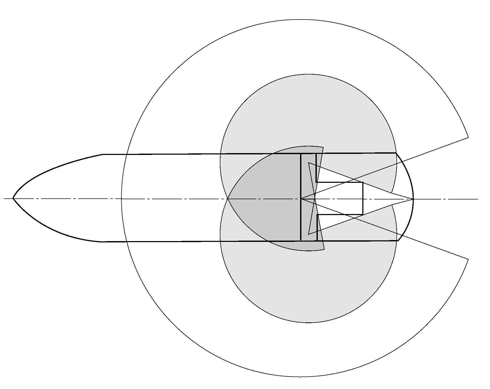
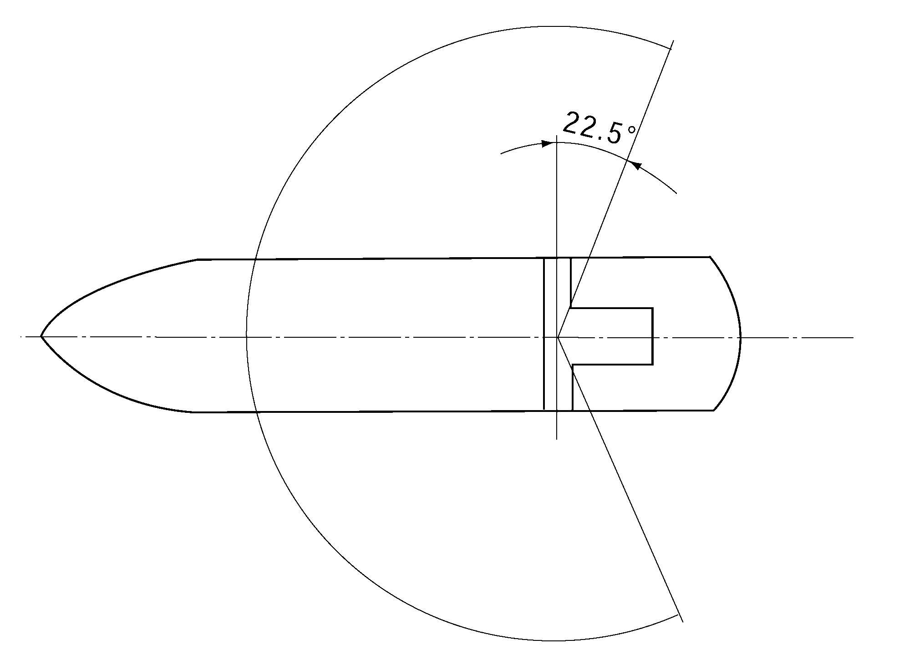

# PART 9 Additional Installations

> RULES FOR CLASSIFICATION OF STEEL SHIPS / RA-09-E / 2025 / EN / Guidance

## CHAPTER 7 DIVING SYSTEMS (2020)

### Section 1 Classification

#### 101. General

- **1.** In applying **101. 1** (1) of the Rules, the main equipment which form diving systems are as follows. **【See Rule】**

  | Equipment | Saturation Diving (SAT) | Bounce Diving (BOU) | Surface Diving (SUR) |
  | --- | --- | --- | --- |
  | Diving bell (closed) | ○ | Choose either diving bell or wet bell | X |
  | Diving bell (closed) | ○ | Choose either diving bell or wet bell | Choose either wet bell or diving stage |
  | Wet bell | X | Choose either diving bell or wet bell | Choose either wet bell or diving stage |
  | Diving stage | X | X | Choose either wet bell or diving stage |
  | Umbilical cable | ○ | ○ | ○ |
  | diving control system | ○ | ○ | ○ |
  | Launch and recovery system | ○ | ○ | ○ |
  | Deck decompression chamber | ○ | ○ | ○ |
  | Life support control system | ○ |   |   |
  | Life support system - breathing gas storage, mixture and distribution - CO2 scrubber - Breathing gas reclaim system - Environmental Control Unit - Divers hot water unit - Sanitary installations | ○ ○ ○(if fitted) ○ ○ ○ | ○ ○ X ○(if fitted) ○(if fitted) X | ○ ○ X ○(if fitted) ○(if fitted) X |
  | Hyperbaric evacuation system | ○ |   |   |
  | Launch and recovery system of hyperbaric evacuation system | ○ |   |   |

### Section 2 Surveys 【See Rule】

#### 201. General

- **1.** **Application**
  The requirements apply to periodical surveys for the equipment in **Ch 7, 101. 1**.
- **2.** Followings are to be examined during periodical surveys.
  - **(1)** diving operations log
  - **(2)** valve shut-off checklists
  - **(3)** operational procedures
  - **(4)** emergency procedures
  - **(5)** dive log, duly signed off
  - **(6)** data sheet for diving system
  - **(7)** layout drawing for diving system
  - **(8)** PMS records
- **3.** **Survey planning document**
  - **(1)** Survey planning document shall be part of the documentation on board for the lifetime of the Diving System. The Survey Planning Document shall be written by the owners representatives in accordance with the principles laid out in this section, but shall be suited to their particular diving system. For transferable diving systems, the Survey Planning Document shall specify scopes for surveys when the system is installed and for surveys when the system is in storage (laidup).
  - **(2)** The Survey Planning Document shall be written in English, or translated into English, and approved by the Society prior to the survey taking place. Checklists shall be included as attachments. It shall have the following information printed on the front page:
    - **(A)** "DSV survey planning document"
    - **(B)** name of support vessel or installation given in the classification register
    - **(C)** Id. number given in the classification register
    - **(D)** IMO number (for statutory surveys)
    - **(E)** name of company
    - **(F)** revision number and date.
  - **(3)** Checklists shall be made available for the surveyor to fill out and endorse at each survey. The checklists shall include the following information at the top of each page:
    - **(A)** name of support vessel or installation given in the classification register
    - **(B)** Id. number given in the classification register
    - **(C)** name of company
    - **(D)** scope of survey (annual, intermediate, renewal or otherwise)
    - **(E)** in columns: survey item, condition, action, comment
    - **(F)** place, date, surveyor, signature, and stamp.

#### 202. Survey items

- **1.** **Diving bell**
  - **(1)** Testing of the gas cylinders
  - **(2)** Testing of the piping system
  - **(3)** Testing of the ballast release system, if any
  - **(4)** Testing of the emergency systems
  - **(5)** Testing of the location and communication systems
  - **(6)** Testing of the diving bell heating system
  - **(7)** Testing of the electrical installations
  - **(8)** Visual examination of the batteries packs and their watertight seals, if any
  - **(9)** Visual examination of the connectors of the piping lines
  - **(10)** Visual examination of the BIBS, if any
  - **(11)** Visual examination of the anodes, if any
  - **(12)** Visual examination of the structure framework
  - **(13)** Visual examination of the seals on mating faces
- **2.** **Wet bell/Diving stage**
  - **(1)** Testing of the gas cylinders
  - **(2)** Testing of the piping system
  - **(3)** Testing of the ballast release system, if any
  - **(4)** Testing of the emergency systems
  - **(5)** Testing of the electrical installations
  - **(6)** Visual examination of the batteries packs and their watertight seals, if any
  - **(7)** Visual examination of the connectors of the piping lines
  - **(8)** Visual examination of the BIBS, if any
  - **(9)** Visual examination of the anodes, if any
  - **(10)** Visual examination of the structure framework
- **3.** **Deck decompression chamber**
  - **(1)** Testing of the PVHO in accordance with **4**
  - **(2)** Testing of the piping system
  - **(3)** Testing of the sanitary systems
  - **(4)** Testing of the fire safety systems
  - **(5)** Testing of the gas regeneration system (CO2 removal)
  - **(6)** Testing of the environmental control unit
  - **(7)** Testing of the breathing gas reclaim system, if any
  - **(8)** Testing of the instrumentation
  - **(9)** Testing of the communication system
  - **(10)** Testing of the electrical installations
- **4.** **PVHO**
  - **(1)** Visual examination of the signs of corrosion on the shell of the PVHO and particularly the bottom part inside and outside
  - **(2)** Visual examination of the shell penetrators
  - **(3)** Visual examination of the supporting structure
  - **(4)** Visual examination of the markings
  - **(5)** Visual examination of the insulation, if any
  - **(6)** Visual examination of the doors, hatches and their locking mechanisms
  - **(7)** Visual examination of the medical lock
  - **(8)** Visual examination of the associated piping and fittings
  - **(9)** Visual examination of the connecting flanges between chambers
  - **(10)** Visual examination of the seals on mating faces which are to be cleaned, undamaged and covered lightly in silicone grease.
  - **(11)** Gas leak test at maximum working pressure
  - **(12)** Hydraulic pressure test at 1.5 times the Maximum Allowable Working Pressure. On a cases-by-case basis and when deemed acceptable by the Society, alternative to in-service hydraulic testing may be granted (e.g. pressure testing with acoustic emission monitoring).
  - **(13)** Testing of the viewports in accordance with ASME PVHO
- **5.** **E lectrical installations**
  - **(1)** Confirmation that no modifications have been performed on electrical installations and that they are found in satisfactory condition.
- **6.** **Launch and recovery system**
  - **(1)** Wire lubrication
  - **(2)** If fitted, heave compensation system is to be function tested.
- **7.** **Hyperbaric evacuation system**
  - **(1)** For hyperbaric evacuation, reference is made to contingency plan defined in IMO Res.692(17).

#### 203. Periodical Survey

| Equipment | Survey item | Annual Survey | Intermediate Survey | Special Survey |
| --- | --- | --- | --- | --- |
| Gas analyzers | ∘Inspection and functional test of pump, Validity of tube (if disposal type tube fitted, had pump is to be included.) ∘Visual inspection and functional test ∘Calibration test to agreed specifications | ○ ○ ○ |   |   |
| Diving bells (main framework, lowering device) | ∘Visual inspection for damage and corrosion of main framework and lowering device) ∘Load test at 1.5 times safety working load 1.5. Non-destructive test of the lifting point or pad eye before and after the load test | ○ ○ |   |   |
| Built-in breathing system (BIBS) | ∘ Visual inspection and functional test (if fitted, communication equipment is to be included) ∘Inspection and test in accordance with the manufacturer’s criteria (in case of underwater unit) | ○ ○ |   |   |
| Communication and Video | ∘ Inspection and functional test ∘ Test of battery (where practicable) | ○ ○ |   |   |
| Compressors, boosters and filters | ∘ Visual inspection and functional test (safety devices are to be included except PRV) ∘ Test of flow rate and delivery pressure ∘ Gas purity test (where practicable) | ○ ○ ○ |   |   |
| Pressure vessels | ∘Visual inspection (external) | ○ |   |   |
| Pressure vessels | ∘ Visual inspection for details of outside and inside ∘ Gas leak test at maximum working pressure ∘ Pressure test at 1.5 times maximum allowable working pressure. (if necessary, non-destructive test is to be carried out) |   | ○ ○ |   |
| Pressure vessels | ∘ Pressure test at 1.5 times maximum allowable working pressure |   |   | ○ |
| Pressure vessels | The frequency and pressure of pressure tests may be in accordance with the flag administration’s domestic laws. |   |   |   |
| Electrical equipment | ∘ Visual inspection ∘ Functional test of equipment (including protectors) ∘ Electrical continuity and insulation resistance test | ○ ○ |   |   |
| Emergency locating device of diving bell | ∘ Inspection of symptoms of damage or deterioration ∘ Functional test including battery condition check | ○ ○ |   |   |
| Environmental control unit | ∘ Visual inspection and functional test | ○ |   |   |
| Fixed fire-fighting system | ∘ Visual inspection of nozzles, valves, piping and fittings ∘ Functional test or simulation test using air or gas ∘ Functional test of automatic detection /automatic operation system (if fitted) | ○ ○ ○ |   |   |
| Portable fire-fighting system | ∘ Visual inspection(external) and test that the indicating device is within the acceptable range | ○ |   |   |
| Divers breathing gas reclaim system and gas blender | ∘Visual inspection and functional test (safety devices are to be included except PRV) ∘ Disinfection Check of gas bag | ○ ○ |   |   |
| Depth gauge | ∘ ± 0.25 % accuracy of full scale reading ∘ Visual inspection and functional test | ○ ○ |   |   |
| Divers’ heating units | ∘ Visual inspection and functional test ∘ Insulation resistance test when electricity is supplied | ○ ○ |   |   |
| Divers’ heating units | ∘ Overpressure test |   |   | ○ |
| Launch and recovery system | ∘ Visual inspection of symptoms of damage or deterioration ∘ Static load test at 1.5 times safety working load(SWL) for each brake system ∘ Functional test of heave compensation systems (if fitted) ∘ Functional test of secondary recovery system ∘Dynamic load test at 1.25 times safety working load(SWL) (to be performed NDT after test if necessary) | ○ ○ ○ ○ ○ |   |   |
| hydraulic power system | ∘Visual inspection and functional test for essential components of the tensioning device ∘ Functional test and check flow rate of intercooler/heater(if fitted) ∘Hydraulic fluid and oil analysis (replace hydraulic fluid and oil, if necessary) | ○ ○ ○ |   |   |
| Piping and fittings | ∘ Visual inspection ∘ Internal cleanliness verification | ○ ○ |   |   |
| Piping and fittings | ∘ Gas leak test at maximum working pressure |   | ○ |   |
| Oxygen piping | ∘ Visual inspection | ○ |   |   |
| Oxygen piping | ∘ Gas leak test at maximum working pressure |   | ○ |   |
| Pressure relief valve | ∘ Visual inspection | ○ |   |   |
| Pressure relief valve | ∘Functional test at setting pressure and gas leak test at maximum working pressure |   | ○ |   |
| Pressure relief valve | ∘ Bursting disk is to be replaced every ten(10) years. |   |   |   |
| PVHO | ∘ Visual inspection | ○ |   |   |
| PVHO | ∘ Visual inspection for details of outside and inside ∘ Gas leak test at maximum working pressure |   | ○ ○ |   |
| PVHO | ∘ Internal pressure test |   |   | ○ |
| Viewport | ∘ Visual inspection | ○ |   |   |
| Viewport | ∘ Gas leak test including viewport |   | ○ |   |
| Viewport | ∘ Pressure test |   |   | ○ |
| Viewport | ∘ Viewport is to be replaced every ten(10) years. |   |   |   |
| Sanitary equipment | ∘ Visual inspection and functional test | ○ |   |   |
| Umbilical cable | ∘ Visual inspection and functional test | ○ |   |   |
| Umbilical cable | ∘ Gas leak test at maximum working pressure |   | ○ |   |
| Wire rope | ∘ Visual inspection ∘ Cut the wire rope of appropriate length and perform the destruction test of the wire rope -If it is lower than MBL value at the time of initial production, the result falls 10% below the base value adopted following the test carried out when the rope was first put into service, it is to be discarded. ∘ Static load test at 1.5 times maximum safety load after end termination details | ○ ○ ○ |   |   |
| Diving bell ballast | ∘ Visual inspection for all framework ∘ Static load test at 1.5 times ballast weight ∘ Non-destructive test for main components ∘ Functional test for ballast release system ∘ Positive buoyancy test of diving bell | ○ ○ ○ ○ ○ |   |   |
| Diving bell ballast | ∘ Ballast release test |   |   | ○ |
| Hyperbaric Rescue Unit and launch system | ∘ Visual inspection ∘ Functional test including emergency launch system | ○ ○ |   |   |
| Hyperbaric Rescue Unit and launch system | ∘ Replace the wire for launch system (except stainless steel wire) |   |   | ○ |
| Hyperbaric Rescue Unit | ∘ Visual inspection and functional test ∘ Visual inspection of towing line | ○ ○ |   |   |
| Umbilical cable winch | ∘ Functional test | ○ |   |   |
| Umbilical cable winch | ∘ Pressure test at 1.25 times maximum allowable pressure of the swivel |   |   | ○ |
| Diving bell | ∘ Visual Inspection and functional test | ○ |   |   |
| Diving bell | ∘ Weighing in air and in water |   |   | ○ |
| Diving bell | ∘ Testing of the PVHO |   |   |   |
| Commissioning | ∘Commissioning at rated maximum depth |   |   | ○ |

### Section 3 Testing

#### 301. General

- **1.** In application to **301. 1** (4) of the Rules, "in accordance with separately provided" means **Guidance for Approval of Manufacturing Process and Type Approval, Etc.** and recognized standard which deemed appropriate by the Society. **【See Rule】**

#### 302. Tests at the manufacturers works

- **1.** In application to **302. 1** of the Rules, the penetrators are to be tested as specified below. **【See Rule】**
  - **(1)** Test process of compression chamber wall penetrations and underwater plug connections is as follow:
    
    **Fig 9.7.1 Test pressure/time curve**
    This test may be performed alternatively under air or helium pressure. If compressed air is used, the test pressure must be equal twice the design pressure; if helium is used, 1.5 times.
    In all pressure and tightness tests on compression chamber wall penetrations, the pressure must in each case be applied from the pressure side of the wall penetration.
    This test is performed at the rated frequency and is to be tried out for 1 minute in each case between all the conductors mutually and between the conductors and the casing. The test is performed in the disconnected state. The connection side of the compression chamber wall penetration may be fully wired for the high voltage test. The sealing of the connector shells and the like is permitted where this is stipulated by the manufacturer in the relevant data sheet. The test voltage for plug connections rated at more than 500 V is to be agreed with the Society.
    The minimum value of the insulation resistance between the conductors mutually and between the conductors and the casing shall be 5 $\mathrm{M} \Omega$. The insulation resistance is to be measured with an instrument using 500 V DC. With wet plug connections, the minimum insulation resistance is also to be measured after the connection has been made once in salt water.
    - **(A)** Hydraulic pressure test, in which the test pressure must equal twice the design pressure. The test is to be conducted in accordance with the test pressure/time curve shown in **Fig 9.7.1** the changes in pressure being applied as quickly as possible
    - **(B)** Gas tightness test with shorn, open cable ends.
    - **(C)** High voltage test at an AC voltage of 1000 V plus twice the rated voltage.
    - **(D)** Measurement of insulation resistance
    - **(E)** Visual check against manufacturer's documentation.
  - **(2)** All electrical penetrations in compression chamber walls and all plug connections are to be sub-possible. Subjected to individual inspection by the manufacturer. A Works Test Certificate is to be issued by the manufacturer in respect of this inspection.
  - **(3)** The necessary test conditions applicable to plug connections in medium voltage systems are to be agreed with the Society in each case.

#### 310. On-board test and Commissioning

- **1.** In application to **310. 3** (1) of the Rules, "in accordance with the discretion of this Society" are those defined in **101. 2** of the Rules. **【See Rule】**

### Section 5 PVHO

#### 503. Piping system

- **1.** In application to **503. 1** (2) of the Rules, where non-return valve is installed, non-return valve is to be installed inside the PVHO and shut-off valve is to be external. **【See Rule】**

### Section 6 Deck Decompression Chambers and divers transfer system

#### 603. Closed Diving Bell

- **1.** In application to **603. 1** (10) of the Rules, means independent from surface supplies are to be provided to maintain the diver's body temperature and reduce CO2 for a minimum period of 24 hours in an emergency. This will normally be by means of survival bags and emergency individual scrubbers. **【See Rule】**

#### 605. Rescue chambers (transportable)

- **1.** In application to **605. 4** (2) of the Rules, setting values of safety valves are as follows. **【See Rule】**

  |   | Minimum pressure | Maximum pressure |
  | --- | --- | --- |
  | Response pressure | Maximum Allowable Working Pressure (MAWP) | Maximum Allowable Working Pressure (MAWP) * 1.1 |
  | Maximum opening pressure (Maximum Supply) | - | Maximum Allowable Working Pressure (MAWP) * 1.1 |
  | Closing pressure | ≥Working Pressure (generally MAWP/1.1) | - |

### Section 7 Life Support System

#### 703. Breathing gas storage

- **1.** In application to **703. 2** of the Rules, the quantities of breathing gas and pure oxygen to carry on-board is to be assessed for each diving campaign and justified by a risk analysis. Minimum requirements are provided by IMCA D050. **【See Rule】**

### Section 10 Launch and Recovery System 【See Rule】

#### 1002. General design requirements

The dynamic load of launch and recovery system of diving bell are as follows.

- **1.** **General**
  The estimated dynamic loads during the operation of cursors and diving bells, which are connected to stationary support vessel at designed sea condition and propelling support vessel heading in the main direction of incoming waves, are given in clause **3** and **4.**
  The specified methods for calculation of hydrodynamic forces are limited to the cases in which the vertical motions of the suspended bell may be taken equal to the corresponding motions of the support vessel. The conditions permitting such assumptions are specified in Clause **3**, 3.1, (2). Other methods deemed appropriate by the Society.
- **2.** **Definitions**
  - **(1)** Parameters applied for calculation of the forces.
    $m$ : mass of bell in air corresponding to its working weight including trapped water (kg).
    $\rho$ : mass density of seawater
    $V$ : volume of displaced water ($\mathrm{m} ^{3}$).
    $A$ : cross sectional area of bell with appendices projected on a horizontal plane ($\mathrm{m} ^{2}$).
    $C _{m}$ : coefficient for added mass (water). (For typical diving bells with appendages such as gas containers, bumper structure etc. the coefficient may be taken as $C _{m}$ = 1.0). Above water $C _{m}$ = 0.
    $C _{d}$ : drag coefficient. (For typical diving bells with appendages the coefficient may be taken as $C _{d}$ = 1.5).
    $a$ : maximum expected vertical acceleration of the bell ($\mathrm{m}/s ^{ 2}$).
    $a_{ r}$ : maximum expected vertical relative acceleration between bell and water particles ($\mathrm{m}/s ^{ 2}$).
    $v$ : maximum expected vertical velocity of the bell (m/s).
    $v_{ r}$ : maximum expected vertical relative velocity between bell and water particles (m/s).
    $f_w$ : reduction factor for the wave action on the bell, depending on the submerged depth $z$ of the bell, given by:
    $f _{w} =e ^{\left( -0.32 \frac{z}{h _{s}} \right)}$
    $z$ : submerged depth of the bell (m) when larger than $h _{s}$.
    $h _{s}$ : significant wave height (m).
    significant wave height : When selecting the third of the number of waves with the highest wave height, the significant wave height is calculated as the mean of the selection.
    $e$ = 2.72
    $f _{a}$ and $f _{v}$ : reduction factors due to wave action under the heading "Motions of ship shaped support vessels".
    $k$ : stiffness of the handling system (N/m).
    $C _{B}$ : block coefficient of vessel.
    $R _{P}$ : horizontal distance from centre of mass (i.e. bell) to the axis of rotation, which may be taken at 0.45 L from the after perpendicular of the vessel (m).
    $A _{w}$ : cross sectional area of moon pool.
    $s _{r}$ : maximum expected relative amplitude (+/-) of motion between sea surface and support vessel in way of moon pool (m).
    $g$ : acceleration of gravity
    $d$ : draught of vessel at bottom of opening for moon- pool for $d$ > $h _{s}$ (m)
  - **(2)** Parameters applied for correction of units in empirical formulae:
    h1 = 1 $\mathrm{m} ^{-1}$
    L1 = 1 $\mathrm{m} ^{-1}$
    u1 = 1 m/s
    u2 = 1 m
- **3.** **Loads on Negative(-) Buoyant Bell**
  - **(1)** Loads on bell clear of support vessel
    $F _{n} =± \sqrt {F _{aW} ^{2} +F _{V} ^{2}}$ (N)
    $F _{n} =± \sqrt {F _{a} ^{2} +F _{W} ^{2} +F _{V} ^{2}}$ (N)
    $F _{aW}$ : force due to the combined acceleration of bell and water particles, given by:
    $F _{aW} = \left( m- \rho V \right) a+ \rho V \left( 1+C _{m} \right) f _{a} a _{r}$ (N)
    $F _{v}$ : force due to the relative velocity between bell and water particles, given by:
    $F _{v} = 0.5 \rho AC _{d} \left( f _{v} v _{r} \right) ^{2}$ (N)
    $F _{a}$ : force due to acceleration of bell, given by:
    $F _{a} = \left( m+C _{m} \rho V \right) a$ (N)
    $F _{w}$ : force due to acceleration of water particles in the deepest wave, given by:
    $F _{w} = 0.4 \left( 1+C _{m} \right) f _{w} \rho Vg$ (N)
    The parameters and principles applied for calculation of the forces are given in (B) of the Rules.
    The vertical motions of the bell may be taken equal to those of the support vessel when the natural oscillating period of the handling system is less than 3 seconds, as given by:
    $2 \pi \sqrt {\frac{m+ \rho VC _{m}}{k}} < 3$
    For calculation of the forces from the formulae given in 3.1 (1) of the Rules, the launching or retrieval velocities are to be added to $v$ and $v _{r}$.
    The estimation method for $a$ and $a _{r}$ as well as $V$ and $V _{r}$ given in the following may be used for vessels with length between perpendiculars L (m) in the range:
    50 < L < 150
    operating in sea-states with significant wave heights $h _{s}$ (m) of magnitude: : 2 < $h _{s}$ < 8
    The heave acceleration az of the support vessel is given by the smaller of:
    $a _{z} = \frac{\left( 5h _{1} h _{s} -0.02h _{1} h _{s} L _{1} L+1 \right) \times g}{100}$ ($\mathrm{m}/s ^{2}$)
    or $a _{z}$ as obtained from the Rules. The pitch acceleration $a _{p}$ of the support vessel is given by:
    $a _{p} = \frac{3.5}{C _{B}} \times \frac{R _{p}}{L} \times a _{z}$ ($\mathrm{m}/s ^{2}$)
    The combined vertical acceleration from heave, pitch and roll is given by:
    $a = \sqrt {\left( ra _{z} \right) ^{2} +a _{p} ^{2}}$ ($\mathrm{m}/s ^{2}$)
    $r$ : coefficient of roll
    : 1.0 at centreline of vessel
    : 1.2 at sides of vessel
    The relative acceleration ar between vessel and water particles at surface is given by:
    $a _{r} = \left( 0.15q \sqrt {h _{1} \times h _{s}} \right) \times g$ ($\mathrm{m}/s ^{2}$)
    $q$ : coefficient for position of bell.
    : 1.3 at stern.
    : 1.1 at sides amidship.
    : 1.0 at vessel's centreline amidship.
    The vertical velocity of the vessel may be taken as:
    $v = \left( 14-4.5 \frac{R _{p}}{L} \right) \frac{a \times u _{1}}{g}$ ($\mathrm{m}/s ^{2}$)
    The relative vertical velocity between vessel and water particles at surface is given by:
    $v _{r} = \left( 0.04 \times L _{1} \times L+6 \right) \frac{a _{r} \times u _{1}}{g}$ ($\mathrm{m}/s ^{2}$)
    $f _{a}$ = reduction factor for vertical relative acceleration of bell due to wave action, given by:
    $f _{a} = \frac{a+ \left( a _{r} -a \right) f _{w}}{a _{r}}$
    $f _{v}$ = reduction factor for vertical relative velocity of bell, given by:
    $f _{v} = \frac{v+ \left( v _{r} -v \right) f _{w}}{v _{r}}$
    - **(A)** In a free flow field the maximum vertical hydrodynamic load Fn acting on a negative buoyant bell in the design sea-state may be taken as the smaller of the values obtained from the two following formulae:
    - **(B)** Motions of ship shaped support vessels
  - **(2)** Hydrodynamic Loads on bell in moon pool
    $f _{m} = 1+1.9 \left( A/A _{w} \right) 2.25$
    $f _{d} = \frac{1-0.5A/A _{w}}{\left( 1-A/A _{w} \right) ^{2}}$
    The factors $f _{m}$ and $f _{d}$ obtained from the above apply to moon pools of constant cross section and for the ratio $A/A _{w}$ < 0.8. The relative accelerations $a _{r}$ and velocities $v _{r}$ refer to the flow field above the bell.
    When $A/A _{w}$ approaches 1, the hydrodynamic load on the bell approaches the dynamic part of the bottom pressure, and may be taken as:
    $F _{m} = ±As _{r} \rho ge ^{\left( -0.32 \frac{d}{h _{s}} \right)}$ (N)
    For a moon pool at the centreline of the support vessel $s _{r}$ may be taken as:
    $s _{r} = \left( 0.064L+1.6u _{2} \right) \frac{a _{r}}{g}$
    - **(A)** In the flow field of a moon pool (narrow well) the maximum vertical hydrodynamic load $F _{m}$ acting on a negative buoyant bell may be taken as derived from Clause (1), when $C _{m}$ and $C _{d}$ are substituted by $f _{m} \cdot C _{m}$ and $f _{d} \cdot C _{d}$ respectively, where:
  - **(3)** Impulse Loads
    $F _{i} = v _{i} \sqrt {k \left( m+ \rho VC _{m} \right)}$ (N)
    $v _{i}$ : impulse velocity (m/s) obtained from Clause **3**, 3.3, (2) or Clause **3**, 3.3, (3)
    The impulse velocity $v _{i}$ during start and stop may be taken as the maximum normal transportation velocity.
    Slack hoisting rope may be expected when
    #eqnID-2067_s2
    When $F _{n}$ obtained from 3.1 is mainly wave induced and a snatch load is of short duration relative to the wave period i.e. when the natural oscillating period of the handling system is less than 3 seconds as given in 3.1, (2), then the impact velocity $v _{i}$ may be taken as:
    $v _{i} = v _{1} +v _{2} C _{i}$
    $v _{i}$ = free fall velocity (m/s) in calm water
    $v _{1} = \sqrt {\frac{2 \left( m- \rho V \right) g}{\rho AC _{d}}}$
    $v _{2}$ = $v _{r} f _{v}$ as obtained from 3.1, (2) for tight hoisting ropes
    $C _{i}$ = probability coefficient obtained from the table below

    | $\frac{v _{1}}{v _{2}}$ | $C _{i}$ |
    | --- | --- |
    | $\frac{v _{1}}{v _{2}}$ ≤ 0.2 | 1 |
    | 0.2 < $\frac{v _{1}}{v _{2}}$ < 0.7 | $\cos \left( \pi \frac{v _{1}}{v _{2}} -0.2 \pi \right)$ |
    | $\frac{v _{1}}{v _{2}}$≥ 0.7 | 0 |
    - **(A)** Impulse loads $F _{i}$ caused by sudden velocity changes in the handling system by start, stop and snatch loads in hoisting ropes may be taken as :
    - **(B)** Impulse velocity
    - **(C)** Slack
- **4.** **Loads on a Positive(+) Buoyant Bell**
  - **(1)** Impulse loads
    $F _{i} = v _{i} \sqrt {k \left( m+ \rho V _{e} 0.6C _{m} \right)}$ (M)
    $V _{e}$ = volume of displaced water of the floating bell
    $v _{i}$ = impulse velocity obtained from Clause (B)
    $V _{i} = V _{r} +V _{hoist}$
    $V _{r}$ : from **3** (1) (B) (m/s)
    $V _{hoist}$ : normal transportation speed.
    - **(A)** Impulse loads $F _{i}$ caused by sudden velocity changes in the handling system by start, stop and snatch loads in hoisting ropes may be taken as follows:
    - **(B)** Impulse velocity is taken to be as follows:
- **5.** **Design loads**
  - **(1)** Maximum load
    In water : $P = \left( m- \rho V \right) g+F$
    $F$ : where F is the larger of $F _{n}$ and $F _{i}$ obtained from 3.1, 3.2 and 3.3.
    In air : $P = mg+ \sqrt {\left( ma \right) ^{2} +F _{i} ^{2}}$

    | $\frac{P}{mg}$ | Design load |
    | --- | --- |
    | $\frac{P}{mg}$ ≤ 2 | $P$ |
    | 2 < $\frac{P}{mg}$ < 3 | $\left( 1.5-0.25 \frac{P}{mg} \right) P$ |
    | $\frac{P}{mg}$ ≥ 3 | 0.75 $P$ |
    - **(A)** The maximum load $P$ in the vertical direction may be taken as follows:
    - **(B)** The design load in the vertical direction may be obtained from the following table.

### Section 11 Hyperbaric Rescue Unit

#### 1103. General design requirements

- **1.** In application to **1103. 2** (2) of the Rules, marking follows as figure below. **【See Rule】** 
  
  **fig. 9.7.2**
