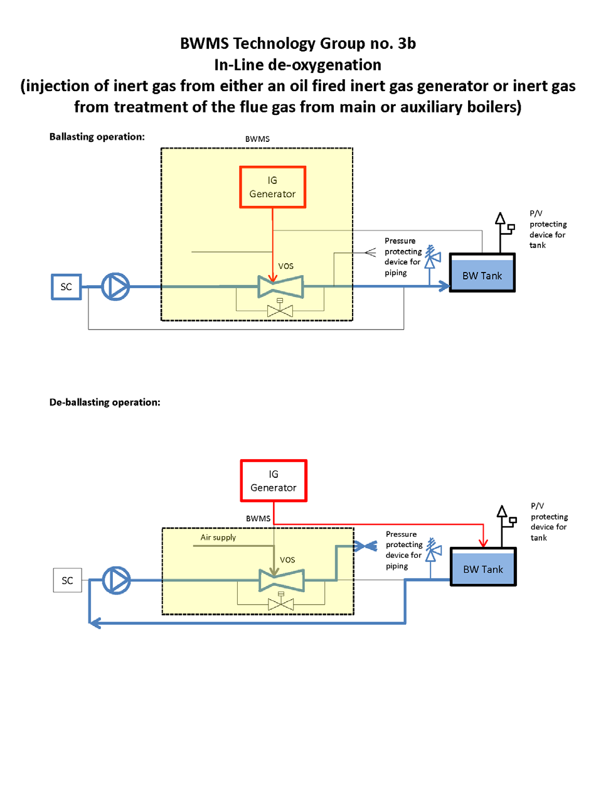

# PART 9 Additional Installations

> RULES FOR CLASSIFICATION OF STEEL SHIPS / RA-09-E / 2025 / EN / Guidance

## CHAPTER 10 BALLAST WATER MANAGEMENT

### Section 3 Ballast Water Management Systems

#### 302. Ballast water management systems (2022) 【See Rule】

- **1.** Safe location defined in **302. 2** (4) of the Rules as follows
  - **(1)** inert gas or nitrogen product enriched air from
    - in-line (categories 3a and 3b) and in-tank (categories 3c and 8) de-oxygenation BWMS: the protection devices installed on the ballast tanks, nitrogen or inert gas generators, nitrogen buffer tank (if any); or
    - in-line ozone injection BWMS (categories 7a and 7b): the oxygen generator;
    safe locations on the open deck are:
    - not within 3 m of areas traversed by personnel; and
    - not within 6 m of air intakes for machinery (engines and boilers) and all ventilation inlets/outlets.
  - **(2)** oxygen-enriched air from:
    - in-line and in-tank de-oxygenation BWMS (categories 3a and 8): the nitrogen generator; or
    - in-line ozone injection BWMS (categories 7a and 7b): the protection devices or vents from oxygen generator, compressed oxygen vessel, the ozone generator and ozone destructor devices;
    safe locations on the open deck are:
    - outside of hazardous area;
    - not within 3 m of any source of ignition and from deck machinery, which may include anchor windlass and chain locker openings, and equipment which may constitute an ignition hazard;
    - not within 3 m of areas traversed by personnel; and
    - not within 6 m of air intakes for machinery (engines and boilers) and all ventilation inlets.

#### 303. Additional requirements for tankers (2022) 【See Rule】

- **1.** **303. 1.** (1) (A) of the Rules requirements does not apply to inert gas generators for which **Pt 8, Annex 8-5, 4 and 5** apply.
- **2.** In application to **303. 1** (1) (B) of the Rules, the followings are to be considered.
  - **(1)** In-line full flow electrolysis BWMS (category 4) could be accepted in cargo compressor rooms of liquefied gas carriers and inside cargo pump rooms of oil tankers or chemical tankers if that cargo pump room is located above the cargo tank deck.
  - **(2)** For submerged cargo pumps, the room containing the hydraulic power unit or electric motors is not to be considered as the “cargo pump room”.
  - **(3)** Ballast pump rooms and other pump rooms not containing the cargo pumps are not to be considered as the “cargo pump room”.
- **3.** In application to **303. 1** (2) of the Rules, when the Fore Peak Tank is ballasted with the piping system serving the other ballast tanks within the cargo area in accordance with **Pt 7 Ch 1 Sec 1, 1003. 3**, the ballast water of the Fore Peak tank is to be processed by the BWMS processing the ballast water of the other ballast tanks within the cargo area.
- **4.** In application to **303. 1** (3) (A) of the Rules, the followings are to be considered.
  - **(1)** The means of appropriate isolation is necessary for the interconnection specified in said Paragraph regardless of the diameter of the piping.
  - **(2)** Refer to **305.** of the Rules, appropriate isolation is necessary for the interconnection specified in said Paragraph in the case of the active substance piping such as N2 gas piping, inert gas piping, neutralizer piping, fresh water piping for filter cleaning, compressed air piping for remaining water purge and sea water piping for adjusting the salinity etc. At the discretion of the Classification Society and for active substance piping and neutralizer piping (both up to 2 inches) only, alternative isolation arrangements, provided preferably on the open deck, offering enhanced safety and gastightness may be considered for penetration of the bulkhead separating the non-hazardous machinery space from a hazardous area (such as the cargo pump room) at as high an elevation in the machinery space as possible, preferably, just below the main deck. The arrangements are to provide suitable protection (refer to the FIg 9.10.2(d)) measures in addressing the pollution hazards and safety concerns due to the potential migration of hydrocarbon or flammable or toxic liquids or vapours from the hazardous areas. *(2025)*
    
    **Fig 9.10.2(d)**
  - **(3)** The means of appropriate isolation described in (1) for the interconnection specified in said Paragraph need not be applied to the sampling lines described in **303. 1** (4) and (5) of the Rules.
- **5.** In application to **303. 1** (3) (A) (a) of the Rules, as an alternative to positive means of closure, an additional valve having such means of closure may be provided between the non-return valve and the spool piece.
- **6.** In application to **303. 1** (3) (A) (b) of the Rules, As an alternative to positive means of closure, an additional valve having such means of closure may be provided between the non-return valve and the liquid seal. For ships operating in cold weather conditions, freeze protection should be provided in the water seal. A portable heating system can be accepted for this purpose.
- **7.** In application to **303. 1** (3) (A) (c) of the Rules, As an alternative to positive means of closure, an additional valve having such means of closure may be provided after the non-return valve.
- **8.** In application to **303. 1** (3) (B) of the Rules, When the Fore Peak Tank is ballasted with the piping system serving the other ballast tanks within the cargo area in accordance with **Pt 7 Ch 1 Sec 1, 1003. 3**, the means of appropriate isolation described in **303. 1** (3) (A) and (B) of the Rules.
- **9.** In application to **303. 1** (5) (A) (c) of the Rules, when the electrical equipment is of a certified safety type, the automatic disconnection of power supply is not required.

#### 304. Special requirements for BWMS categories 2, 3a, 3b, 3c, 4, 5, 6, 7a, 7b and 8 generating dangerous gas or dealing with dangerous liquids. (2022) 【See Rule】

- **1.** Safe location defined in **304. 1** (3) of the Rules as follows
  - **(1)** For in-line ozone injection BWMS (categories 7a and 7b), vent outlet from O3 destructor device (ODS) can be considered as oxygen-enriched air provided that:
    - the ODS are duplicated; and
    - the manufacturer justified that the quantity of consumable (activated carbon) used by the ODS is sufficient for the considered life cycle of the BWMS; and
    - ozone detection is arranged in the vicinity of the discharge outlet from the vent outlet of the ODS to alarm the crew in case the ODS is not working.
  - **(2)** If one of the (1) is not fulfilled, the safe location from ODS on open deck are:
    - outside of hazardous area;
    - not within 3 m of any source of ignition;
    - not within 6 m of areas traversed by personnel; and
    - not within 6 m of air intakes for machinery (engines and boilers) and all ventilation inlets.
- **2.** In application to **304. 1** (4) of the Rules, as an alternative to the sensor for the gas detection, monitored under-pressurization inside the double walled spaces or pipe ducts could be provided with an automatic alarm and shut-down of the BWMS in case of loss of the under-pressurization. The monitoring can be achieved either by monitoring the pressure inside the double walled spaces or pipe ducts or by monitoring the exhaust fan.
- **3.** Safe location defined in **304. 1** (5) of the Rules as follows
  - **(1)** hydrogen by-product enriched gas from:
    - in-line full flow electrolysis BWMS (category 4), in-line side-stream electrolysis BWMS (category 5) and in-line injection BWMS using chemical which is stored onboard (category 6): the hydrogen de-gas arrangement (when provided);
    safe locations on the open deck are:
    - not within 5 m of any source of ignition and from deck machinery, which may include anchor windlass and chain locker openings, and equipment which may constitute an ignition hazard;
    - not within 3 m of areas traversed by personnel; and
    - not within 5 m of air intakes from non-hazardous enclosed spaces.
  - **(2)** The areas on open deck, or semi-enclosed spaces on open deck, within 3 m of the outlets are to be categorized hazardous zone 1 plus an additional 1,5 m surrounding the 3 m hazardous zone 1 is to be categorized hazardous zone 2.
  - **(3)** Electrical apparatus located in the above hazardous areas zone 1 and zone 2 is to be suitable for at least IIC T1.
- **4.** **4**. In application to **30 1** (6) and **304. 3** (1) (D) of the Rules, safe location means **302. 1**.
- **5.** **5**. In application to **304. 2** of the Rules, the followings are to be considered.
  - **(1)** This requirement is applicable to the injection lines conveying the dangerous gas or dangerous liquids but not applicable to the ballast water lines where the dangerous gas or dangerous liquids are diluted.
  - **(2)** The IMO reports issued during the basic and final approval procedures of the BWMS that make use of active substances (G9 Guideline) could be used for assessing the hazards that could be expected from the media conveyed by the BWMS piping.
- **6.** **6**. In application to **304. 2** (1) of the Rules, the followings are to be considered.
  - **(1)** For piping class II with special safeguards conveying dangerous gas like hydrogen (H2), oxygen (O2) or ozone (O3), the special safeguards are to be either double walled pipes or pipe duct.
  - **(2)** For piping class II with special safeguards conveying dangerous liquids, other special safeguards could be considered like shielding, screening, etc.
  - **(3)** Plastic pipes may be accepted after due assessment of the dangerous gas or dangerous liquids conveyed inside. When plastic pipes are accepted, the requirements of **Pt 5, Annex 5-6** apply.
- **7.** **7**. In application to **304. 2** (3) of the Rules, safe location means **1.** and **3**.
- **8.** **8**. In application to **304. 3** (1) (F) of the Rules, The IMO reports issued during the basic and final approval procedures of the BWMS that make use of active substances (G9 Guideline) could be used for this assessment.
- **9.** **9**. In application to **304. 4** of the Rules, The IMO reports issued during the basic and final approval procedures of the BWMS that make use of active substances (G9 Guideline) could be used as a reference for this assessment.

### Section 4 Installation of BWMS on-board ships

#### 406. Ventilation (2023)

- **1.** In case **406. 2** (3) **of the Rules** is applied to the engine room, the ventilation rate may be appropriately reduced if it is recognized that sufficient ventilation is achieved through methods such as the arrangement of ducts in the engine room.

#### 407. Personal equipment (2023)

- **1.** In applying **406. 4 of the Rules**, SOLAS and flag State requirements may be considered.
  Annex 9-4 BWMS Technologies categorization (Informative) *(2022)*
  
  **Fig 1**
  
  **Fig 2**
  
  **Fig 3**
  
  **Fig 4**
  
  **Fig 5**
  
  **Fig 6**
  
  **Fig 7**
  
  **Fig 8**
  
  **Fig 9**
  
  **Fig 10**
  
  **Fig 11**
  

  | **Rules for the Classification of Steel Ships** **Guidance Relating to the Rules for the Classification** **of Steel Ships** |
  | --- |
  | **PART 9 ADDITIONAL INSTALLATIONS** Published by **KR** 36, Myeongji ocean city 9-ro, Gangseo-gu, BUSAN, KOREA TEL : +82 70 8799 7114 FAX : +82 70 8799 8999 Website : http://www.krs.co.kr |
  |   |

  | CopyrightⒸ 2025, KR Reproduction of this Rules and Guidance in whole or in parts is prohibited without permission of the publisher. |
  | --- |
