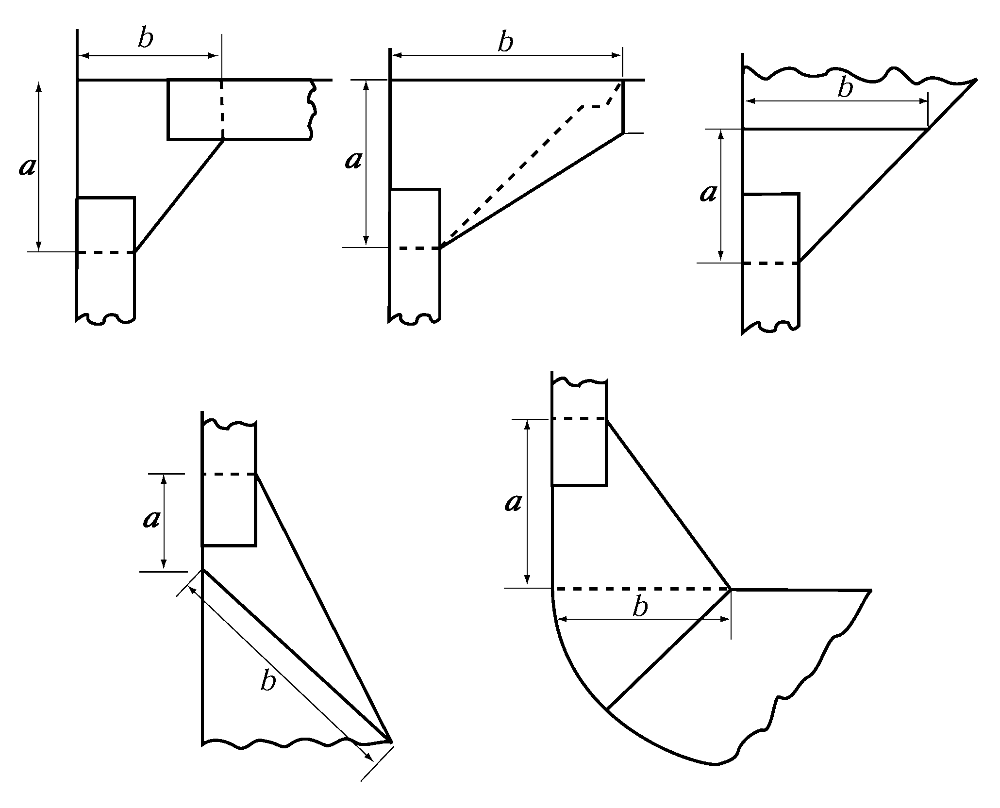

# PART 10 Hull Structure and Equipment of Small Steel Ships

> RULES FOR CLASSIFICATION OF STEEL SHIPS / RA-10-E / 2025 / EN / Rules

## CHAPTER 1 GENERAL

### Section 1 Definitions

#### 101. Application 【See Guidance】

The definitions of term which appear in this Rule are to be as specified in this Section, unless otherwise specified elsewhere, and the definitions of terms not specified in this Rule are to be as specified **Pt 3** and **Pt 4.**

#### 102. Rule Length (2020) 【See Guidance】

The rule length ($L$) is the distance in *metres* measured on the waterline at the scantling draught from the fore side of stem to the after side of rudder post in case of a ship with rudder post, or to the axis of rudder stock in case of a ship without rudder post or stern post. $L$ is not to be less than 96 % and need not be greater than 97 % of the extreme length on the waterline at the scantling draught. In ships without rudder stock (e.g. ships fitted with azimuth thrusters), $L$ is to be taken equal to 97% of the extreme length on the waterline at the scantling draught. In ships with unusual stern and bow arrangement the rule length, $L$ will be specially considered.

#### 103. Length for freeboard

The length of ship for freeboard ($L _{f}$) is 96 % of the length in *metres* measured from the fore side of stem to the aft side of aft end shell plate on the waterline at 85 % of the least moulded depth measured from the top of keel, or the length in *metres* measured from the fore side of stem to the axis of rudder stock on that waterlines, whichever is the greater. However, where the stem contour is concave above the waterline at 85 % of the least moulded depth, the forward terminal of this length is to be taken at the vertical projection to this waterline of the aftermost point of the stem contour. For ships without a rudder stock, the length of ship for freeboard is 96 % of the length measured from the fore side of stem to the aft side of aft end shell plate on the waterline at 85 % of the least moulded depth measured from the top of keel. The waterline on which this length is measured is taken to be parallel to the load line defined in **108.**

#### 104. Breadth (2020) 【See Guidance】

The breadth of ship ($B$) is the horizontal distance in *metres* from the outside of frame to the outside of frame measured amidships at the scantling draught, $d_s$.

#### 105. Depth 【See Guidance】

The depth of ship ($D$) is the vertical distance in *metres* at the middle of $L$ measured from the top of keel to the top of the freeboard deck beam at side. Where watertight bulkheads extend to a deck above the freeboard deck and are to be registered as effective to that deck, $D$ is the vertical distance to that bulkhead deck.

#### 106. Midship

The midship part of ship is the part for 0.4 $L$ amidships unless otherwise specified.

#### 107. Fore and aft end

The fore and aft end part means the part covering 0.1 $L$ from the fore and aft end of the ship.

#### 108. Load line

The load line is the waterline corresponding to the designed summer load draught in case of a ship which is required to be marked with load lines and the waterline corresponding to the designed maximum draught in case of a ship which is not required to be marked with load lines.

#### 109. Load draught

The load draught ($d$) is the vertical distance in *metres* from the top of keel to the load line measured at the middle of $L _{f}$ in case of a ship which is required to be marked with load lines and at the middle of $L$ in case of a ship which is not required to be marked with load lines.

#### 110. Full load displacement

The full load displacement (*D*) is the displacement (including shell platings and appendages, etc.) in tons corresponding to the summer load line.

#### 111. Block coefficient (2020)

The block coefficient ($C_b$) is the moulded coefficient corresponding to waterline at the scantling draught, $d_s$, based on rule length, $L$ and moulded breadth, $B$.
$C_b = \frac{"Moulded displacement" [m^3 ]" at scantling draught" d_s}{L \times B \times d_s}$.

#### 112. Strength deck

The strength deck at a part of ship’s length is the uppermost deck at that part to which the shell plates extend. However, in way of superstructures, except sunken superstructures, not exceeding 0.15 $L$ in length, the strength deck is the deck just below the superstructure deck. The deck just below the superstructure deck may be taken as the strength deck even in way of the superstructure exceeding 0.15 $L$ in length at the option of the designer.

#### 113. Freeboard deck

- **1.** The freeboard deck is normally the uppermost continuous deck. However, in cases where openings without permanent closing means exist on the exposed part of the uppermost continuous deck or where openings without permanent watertight closing means exist on the side of the ship below that deck, the freeboard deck is the continuous deck below that deck.
- **2.** For ships having a discontinuous freeboard deck (e.g. a stepped freeboard deck), the freeboard deck is to be determined as follows.
  - **(1)** Where a recess in the freeboard deck extends to both sides of the ship and is in excess of 1 m in length, the lowest line of the exposed deck and the continuation of that line parallel to the upper part of the deck is taken as the freeboard deck.
  - **(2)** Where a recess in the freeboard deck does not extend to the sides of the ship or is not in excess of 1 m in length, the upper part of the deck is taken as the freeboard deck.
  - **(3)** Recesses not extending from side to side in a deck below the exposed deck, designated as the freeboard deck, may be disregarded, provided all openings in the weather deck are fitted with weathertight closing appliances.
- **3.** Where a ship has multiple decks, an actual deck lower than one that complies with the freeboard deck defined above in **1** or **2** can be deemed the freeboard deck. However, this lower deck is to be continuous in a fore and aft direction at least between the machinery space and peak bulkheads and continuous athwartships.
  - **(1)** When this lower deck is stepped, the lowest line of the deck and the continuation of that line parallel to the upper part of the deck is taken as the freeboard deck.
  - **(2)** When a lower deck is designated as the freeboard deck, such deck as a minimum shall consist of suitably framed stringers at the ship sides and transversely at each watertight bulkhead which extends to the upper deck, within cargo spaces.

#### 114. Fore end and Aft end

The fore end is the start point of forward side, where measuring the length of ship $L$ in **102.,** and aft end is the end point of afterward side of $L$.

#### 115. Scantlig draught (2020)

Scantling draught, $d_s$ at which the strength requirements for the scantlings of the ship are met and represents the full load condition. The scantling draught is to be not less than that corresponding to the assigned freeboard.

### Section 2 General

#### 201. Application

- **1.** The requirements in this Part, unless otherwise specified elsewhere, are framed for ships of normal form and proportions of less than 90 m in length to be classed for unrestricted service. The requirements not specified in this Part are generally to comply with those in **Pt 3** and **Pt 4.**
- **2.** Hull construction, equipment and scantlings of ships to be classed for restricted service may be appropriately modified according to the condition of service. **【See Guidance】**
- **3.** In the application of relevant provisions in this Rule to ships which are not required to be marked with load line, $L _{f}$ is to be read as $L$ and $B _{f}$ as $B$.

#### 202. Exception in application 【See Guidance】

In ships of which length is less than 24 m or in ships to which requirements in this Rule for some special reason are not directly applicable, hull construction, equipment, arrangement and scantlings are to be at the discretion of the Society, notwithstanding the provisions in **201.**

#### 203. Ships of unusual form or proportion, or intended for carriage of special cargoes 【See Guidance】

In ships of unusual form or proportion, or intended for carriage of special cargoes, the requirements concerning hull construction, equipment, arrangement and scantlings will be decided individually basing upon the general principle of this Rule, notwithstanding the requirements in this Rule.

#### 204. Equivalency

The equivalence of alternative and novel features which deviate from or are not directly applicable to the Rules is to be in accordance with **Pt 1, Ch 1 105.** of Rules for the Classification of Steel Ships. *(2021)*

#### 205. Passenger ships

Hull construction, equipment, arrangement and scantlings of passenger ships are to be specially considered with respect to the design features in addition to the requirements in **201.** to **203.**

#### 206. Stability of ship

The requirements in this Rule are framed for ships having appropriate stability in all conceivable conditions. The Society emphasizes that the special attention be paid to the stability by the builders in design and construction stage and by the masters while in service.

#### 207. Carriage of oil or other flammable liquid substances

- **1.** The requirements for construction and arrangement for carriage of fuel oils specified in this Rule are to be applied to the case intended to carry fuel oils having a flashpoint of 60°C or above at a closed cup test.
- **2.** The construction and arrangement for carriage of fuel oils having a flashpoint 60°C or below at a closed cup test, are to be in accordance with the requirements provided in Part, and to comply with the requirements in **Pt 8, Ch 2, 401.** in addition.
- **3.** The construction and arrangement of deep oil tanks intended to carry cargo oils are to be correspondingly in accordance with the requirements in **Ch 23** and **Ch 24.**

#### 208. Equipment 【See Guidance】

Masts, riggings, cargo handling appliances, anchoring and mooring arrangements, and other than those specified in this Rule are to be suitably arranged according to their uses and are to satisfy the tests as may be required by the Surveyor.

#### 209. Fittings for examination

Ladders, steps or other facilities, by which internal examination can be performed safely, are to be provided in fore and after peak tanks, deep tanks, cofferdams and enclosed compartments which are similar to the above-mentioned tanks, except those exclusively used for fuel oil or lubricating oil.

### Section 3 Materials, Welding and Construction

#### 301. Materials 【See Guidance】

- **1.** The materials used for hull construction and equipment are to be those complying with the requirements in **Pt 2, Ch 1,** unless otherwise specified.
- **2.** Where high tensile steels are used, the construction and scantlings are to be in accordance with the discretion of the Society, unless otherwise specified.
- **3.** Where materials other than those specified in this rule are used, the use of such materials and corresponding scantlings are to be specially approved by the Society.
- **4.** Materials used for the hull construction of ships classed for smooth water service are to be in accordance with the discretion of the Society. 【See Guidance】
- **5.** Application of steels
  - **(1)** The steels used for hull structures are to be of the grades provided in **Pt 2, Ch 1** in accordance with the requirements given in **Table 10.1.1** and **Table 10.1.3.** In applying these requirements, *B*, *D* or *E* may be substituted for *A*; *D* or *E* for *B*; *E* for *D*; *DH* 32 or *EH* 32 for *AH* 32; *EH* 32 for *DH* 32; *DH* 36 or *EH* 36 for *AH* 36; and *EH* 36 for *DH* 36; *DH* 40 or *EH* 40 for *AH* 40; and *EH* 40 for *DH* 40, respectively.
  - **(2)** For strength members not mentioned in **Table 10.1.1,** grades *A*, *AH* 32, *AH* 36 and *AH* 40 may generally be used. The steel grade is to correspond to the as-built plate thickness and material class.
  - **(3)** The grades of steel to be used in the hull construction are to be clearly indicated on the hull structural plans.

    | Structural member category | Material classes |
    | --- | --- |
    | ○ SECONDARY : A1 Longitudinal bulkhead strakes, other than those belonging to the Primary category A2 Deck plating exposed to weather, other than that belonging to the Primary or Special category A3 Side plating | - Within 0.4 $L$ amidships : I - Outside 0.4 $L$ amidships : A/AH |
    | ○ PRIMARY : B1 Bottom plating including keel plate B2 Strength deck plating, excluding that belonging to the Special category B3 Continuous longitudinal plating of strength members above strength deck, excluding hatch coamings B4 Uppermost strake in longitudinal bulkhead B5 Vertical strake (hatch side girder) and uppermost sloped strake in top wing tank B6 Longitudinal hatch coamings of length greater than 0.15$L$ | - Within 0.4 $L$ amidships : II - Outside 0.4 $L$ amidships : A/AH |
    | ○ SPECIAL : C1 Sheer strake at strength deck(1) C2 Stringer plate in strength deck(1) C3 Deck strake at longitudinal bulkhead, excluding deck plating in way of inner-skin bulkhead of double-hull ships(1) | - Within 0.4 $L$ amidships : III - Outside 0.4 $L$ amidships : II - Outside 0.6 $L$ amidships : I |
    | C4 Strength deck plating at outboard corners of cargo hatch openings (bulk carriers, ore carriers, combination carriers and other ships with similar hatch opening configurations) | - Within 0.6 $L$ amidships : III - Outside 0.6 $L$ amidships : II |
    | C5 Bilge strake in ships with double bottom over the full breadth and length less than 150 m(1) | - Within 0.6 $L$ amidships : II - Outside 0.6 $L$ amidships : I |
    | C6 Bilge strake in other ships(1) | - Within 0.4 $L$ amidships : III - Outside 0.4 $L$ amidships : II - Outside 0.6 $L$ amidships : I |
    | (NOTES) (1) Single strakes required to be class III within 0.4 $L$ amidships are to have breadths not less than $5L + 800$(mm), need not be greater than 1800 mm, unless limited by the geometry of the ship's design. (2) The symbols in the table mean the grades of steel as follows : AH : AH 32, AH 36 and AH 40 DH : DH 32, DH 36 and DH 40 EH : EH 32, EH 36 and EH 40 |   |

    | Structural member category | Material grade |
    | --- | --- |
    | Shell strakes in way of ice strengthening area for plates | B/AH |

    | Class Thickness(mm) | I |   | II |   | III |   |
    | --- | --- | --- | --- | --- | --- | --- |
    | Class Thickness(mm) | MS | HT | MS | HT | MS | HT |
    | $t \leq 15$ $15 A A AH AH A A AH AH A B AH AH |   |   |   |   |   |   |
    | \(20 < t \leq 25$ \(25 A A AH AH B D AH DH D D DH DH |   |   |   |   |   |   |
    | \(30 \(35 B B AH AH D D DH DH E E EH EH |   |   |   |   |   |   |
    | \(40 D DH E EH E EH |   |   |   |   |   |   |
    | (NOTES) The symbols in the table mean the grades of steel as follows: AH : AH 32, AH 36 and AH 40 MS : Mild steels DH : DH 32, DH 36 and DH 40 HT : High tensile steels EH : EH 32, EH 36 and EH 40 |   |   |   |   |   |   |

#### 302. Scantlings

- **1.** Unless otherwise specially specified, the section modulus of members required by this Rule are those including the steel plates with the effective breadth of 0.1 $l$ on either side of the members. However, the breadth of 0.1 $l$ is not to exceed one-half of the spacing of member. $l$ is the length specified in the relevant Chapter.
- **2.** Where flat bars, bulb plates, inverted angles or flanged plates are welded to form beams, frames or stiffeners for which section moduli are specified, they are to be of suitable depth and thickness in proportion to the section modulus specified in this Part.
- **3.** The inside radius of flanged plates is not to be less thant twice but not more than three times the thickness of steel plates.
- **4.** As for the face plates composing girders and transverses, the thickness is not to be less than that of web plates and the full width is not to be less than that obtained from the following formula:
  $b=2.7 \sqrt {d _{0 } l}$(mm)
  where:
  $d _{0}$ = depth of girders and transverses specified in the relevant Chapter (mm)
  $l$ = distance between supports of girders and transverses specified in the relevant Chapter (m). Where, however, effective tripping brackets are provided, they may be taken as supports.

#### 303. Welding

Welding to be used in hull construction and important equipment is to be in accordance with the requirements in **Pt 2, Ch 2.**

#### 304. Connection of ends of stiffeners, girders and frames

- **1.** Where the ends of girders are connected to the bulkheads, tank tops, etc., the end connections of all girders are to be balanced by effective supporting members on the opposite sides of bulkheads, tank tops, etc.
- **2.** Length of the frame-side arm of bracket, connected to the frames or stiffeners of the bulkhead or deep tanks, etc., is not to be less than one-eighth of $l$ specified in the relevant Chapter, unless otherwise specially specified.

#### 305. Brackets

- **1.** Secondary members, such as longitudinals, beams, frames and stiffeners forming part of the hull structure, are generally to be connected at their ends with $t _{b}$ not to be less than that obtained from the following formula. Where it is desired to adopt bracketless connections, the proposed arrangements will be individually considered.
  $t _{b} =C _{1} \sqrt {Z} +4.5$(mm)
  where :
  $Z$ = section modulus (cm^3) specified in the following (a) through (c) :
  $C _{1}$ = coefficient given in followings
  $C _{1}$ = 0.27, where a flange is not fitted
  $C _{1}$ = 0.23, where a flange is fitted
- **2.** Where a flange is fitted, its breadth $w _{f}$ is not to be less than that obtained from following formula. Where the length of larger arm exceeds 800 mm, the free edges of brackets are to be stiffened by flange or other means, except where tripping brackets or the like are provided.
  $w _{f} = \frac{Z}{33} +45$(mm) $\)
  where :
  \(Z$ = as specified in **Par 1**
- **3.** The lengths of bracket arms measured from shown in **Fig 10.1.1** are not to be less than those obtained from the following formulae. The lengths of bracket arms of tank side and hopper side are to be increased by 20 % greater than those required.
  
  **Fig 10.1.1 Measurement of** #eqnID-71 **and** #eqnID-72 **for arms**
  $a+b \geq 2.0 l$ $a and b \geq 0.8 l$
  where :
  $l$ = as given by the following formula, but in no case is to be taken as less than twice the web depth of the stiffener on which the bracket scantlings are to be based.
  $l=180 \sqrt {\frac{Z}{14+ \sqrt {Z}}} -90$(mm)
  where : $Z$ = as specified in **Par 1**

#### 306. Modification of _s1

Where brackets of not less thickness than that of the girder plates, the value of $l$ specified in **Ch 9, Ch 11, Ch 12, Ch 14** and **Ch 15** may be modified in accordance with the following:

**Fig 10.1.2 Modification of** #eqnID-82

#### 307. Corrosion protection coating

- **1.** All sea water ballast spaces having boundaries formed by the hull envelop are to have an effective corrosion protection coating in accordance with the manufacturer's requirements.
- **2.** Corrosion protection coating for dedicated sea water ballast tanks in all types of Ships, double-side skin space of bulk carriers and cargo oil tanks of crude oil tankers are to be in accordance with the requirements in the **Guidance Pt 3, Ch 1, 801.**

#### 308. Plating

Where plates with different thicknesses are joined, the change in the as-built plate thickness is not to exceed 50% of larger plate thickness in the load carrying direction. This also applies to the strengthening by local inserts, e.g. insert plates in double bottom girders, floors and inner bottom. 
