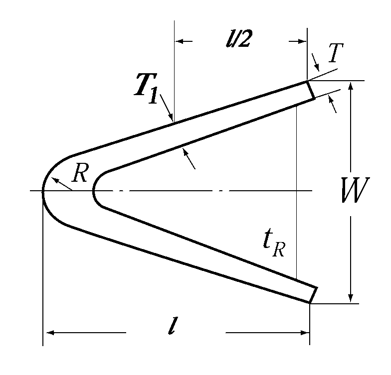
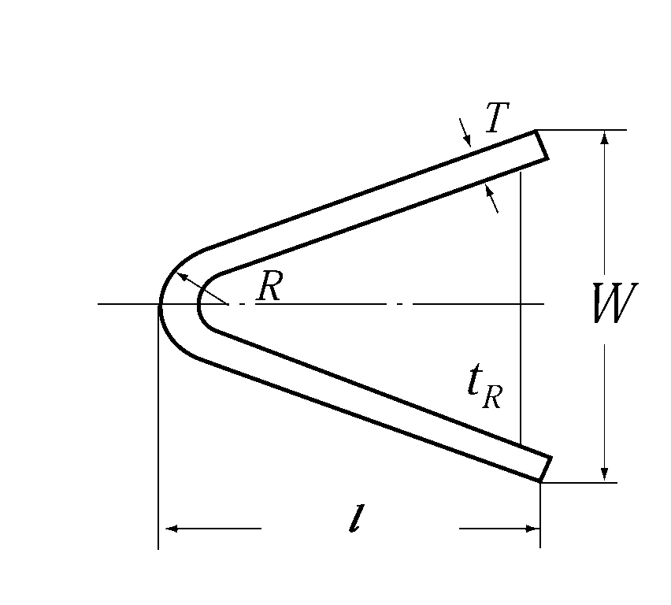
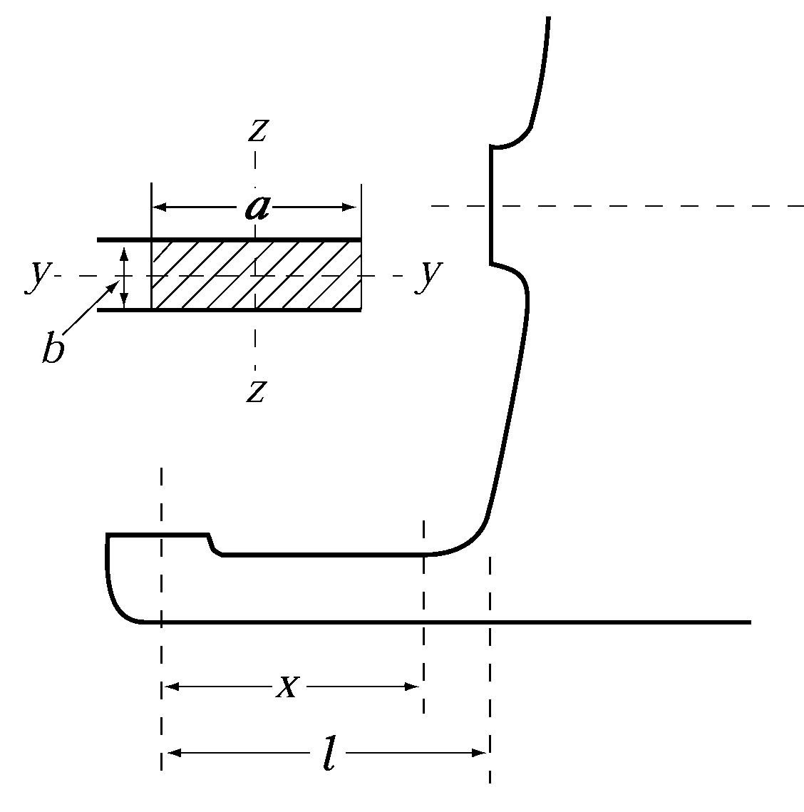

# PART 10 Hull Structure and Equipment of Small Steel Ships

> RULES FOR CLASSIFICATION OF STEEL SHIPS / RA-10-E / 2025 / EN / Rules

## CHAPTER 2 STEMS AND STERN FRAMES

### Section 1 Stems

#### 101. Plate stems 【See Guidance】

- **1.** The thickness of steel plate stems at the load waterline is not to be less than that obtained from the following formula. However, above and below the load waterline, the thickness may be gradually tapered toward the stem head and the keel. And at the upper end of stem, it may be equal to the thickness of the side shell plating (at the fore end part) of the ship, and at the lower end of stem, it may be equal to the thickness of plate keel.
  $t= 0.1L+3.0$(mm)
- **2.** Horizontal ribs are to be provided on the stem plates at an interval preferably not exceeding 1 m, and where the radius of curvature at the fore end of stem is large, proper reinforcement is to be made by providing with a centre line stiffener or by other means.

### Section 2 Stern Frames

#### 201. Application

The requirements in this Section apply only to stern frames without rudder post.

#### 202. Propeller posts 【See Guidance】

- **1.** Propeller posts of cast steel stern frames and those of plate stern frames are to be of shape suitable for the stream line at the after part of hull, and the scantlings are to be equivalent to the standards given by the formulae and figures in **Table 10.2.1.** Below the propeller boss, the breadth and thickness of propeller post are to be gradually increased in order to provide with strength and stiffness in proportion to those of the shoe pieces.
- **2.** The thickness of boss of propeller post is not to be less than that obtained from the following formula:
  $t=0.23d _{p} +30$(mm)
  where :
  $d _{p}$ = diameter (mm) of propeller shaft specified in **Pt 5, Ch 3, 204.**
- **3.** The propeller posts of cast steel stern frames and those of plate stern frames are to be provided with ribs at a suitable interval. Where the radius of curvature is large, a centre line stiffener is to be provided.
- **4.** In ships with relatively high speed for their length and in ships exclusively engaging in towing purposes, the scantlings of various parts of propeller posts are to be suitably increased.

  | Cast steel | Steel plate |
  | --- | --- |
  | $W=30 \sqrt {L}$ $l=40 \sqrt {L}$ (mm) $T= \frac{3 \sqrt {L}}{\sqrt {K ^{(1)}}}$ (mm) $T _{1} = \frac{3.7 \sqrt {L}}{\sqrt {K ^{(1)}}}$ (mm) $t _{R} =0.6T$ (mm) $R _{\min} =40$ (mm) | $W=37 \sqrt {L}$ $l=53 \sqrt {L}$ (mm) $T= \frac{2.4 \sqrt {L}}{\sqrt {K ^{(2)}}}$ (mm) $t _{R} =0.55T$ (mm) $R _{\min} =40$ (mm) |
  |  |  |
  | (NOTES) (1) Material factor $K$ for the Propeller post of cast steel is to be as Pt 4, Ch 1, Table 4.1.1. (2) Material factor $K$ for the Propeller post of steel plate is to be as Pt 4, Ch 1, Table 4.1.2. |   |

#### 203. Shoe pieces 【See Guidance】

- **1.** The scantlings of each cross-section of the shoe piece is to be determined by the following formulae (1) to (4), considering the bending moment and shear force acting on the shoe piece when the rudder force specified in **Pt 4, Ch 1, 201.** is applied to the rudder.
  - **(1)** The section modulus $Z _{Z}$ around the vertical Z-axis is not to be less than obtained from the following formula:
    $Z _{z} = \frac{MK _{sp}}{80}$(cm^3)
    where:
    $M$ = bending moment at the section considered, which is obtained from the following formula (Nㆍm)
    $M=Bx$ (Nㆍm)
    $M _{\max} = Bl$ (Nㆍm)
    where :
    $B$ = supporting force in the pintle bearing (N), as given in **Pt 4, Ch 1, 102.**
    $x$ = distance from the mid-point of the pintle bearing to the section considered (m) (See **Fig. 10.2.1**)
    $l$ = distance from the mid-point of the pintle bearing to the fixed point of the shoe piece (m) (See **Fig 10.2.1**)
    $K _{sp}$ = material factor for the shoe piece as given in **Pt 4, Ch 1, 103.**
    
    **Fig 10.2.1 Shoe piece**
  - **(2)** The section modulus $Z _{y}$ around the transverse Y-axis is not to be less than obtained from the following formula:
    $Z _{y} =0.5 Z _{z }$(cm^3)
    where :
    $Z _{z}$ = as specified in (1)
  - **(3)** The total sectional area $A _{s}$ of the members in the Y-direction is not to be less than obtained from the following formula:
    $A _{s} = \frac{BK _{sp}}{48}$(mm^2)
    where :
    $B$ and $K _{sp}$ = as specified in (1)
  - **(4)** At no section within length $l$ the equivalent stress $\sigma _{e}$ is to exceed 115 /$K _{sp}$ (N/mm^2).
    The equivalent stress $\sigma _{e}$ is to be obtained from the following formula:
    $\sigma _{e} = \sqrt {\sigma _{b} ^{2} +3 \tau ^{2}}$(N/mm^2)
    where :
    $\sigma _{b}$ = the bending stress acting on the shoe piece, are to be obtained from the following formula (N/mm^2).
    $\sigma _{b} = \frac{M}{Z _{z} (x)}$(N/mm^2)
    $\tau$ = the shear stress acting on the shoe piece, are to be obtained from the following formula (N/mm^2).
    $\tau = \frac{B}{A _{s} (x)}$(N/mm^2)
    where :
    $Z _{z} (x)$= the actual section modulus around the Z-direction at the section considered (cm^3)
    $A _{s} (x)$ = the actual sectional area around the Y-direction at the section considered (mm^2)
    $M$ and $B$ = as specified in (1)
- **2.** The thickness of steel plates forming the main part of shoe piece of steel plate stern frame is not to be less than that of steel plates forming the main part of propeller post. Ribs are to be arranged in the shoe piece below the propeller post, under brackets and at other suitable positions.

#### 204. Heel pieces 【See Guidance】

Heel piece of stern frame is to be of length at least three times the frame space at that part and is to be strongly connected to the keel.

#### 205. Attachment of stern frame to floor plates

Stern frame is to be sufficiently extended upward immediately in front of the rudder stock, and is to be strongly connected to the transom floor of thickness not less than that obtained from the following formula. The transom floor is to be reinforced at the top of extended portion of the stern frame in order to avoid abrupt change of rigidity.
$t=0.035L + 9.0$(mm)

#### 206. Gudgeons (2019)

- **1.** The depth of gudgeon is not to be less than the length of the pintle bearing.
- **2.** The thickness of the gudgeon is not to be less than 0.25 $d _{po}$. For ships specified in **Pt 4, Ch 1, 104.,** the thickness of the gudgeon is to be appropriately increased.
  where:
  $d _{po}$ = Actual diameter of the pintle measured at the outer surface of the sleeve(mm). 
