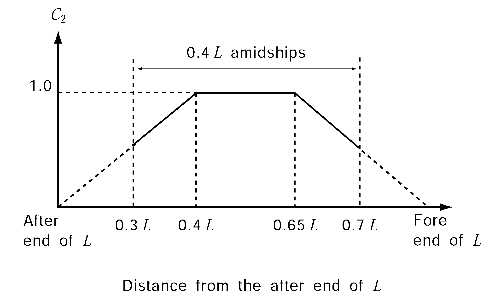

# PART 10 Hull Structure and Equipment of Small Steel Ships

> RULES FOR CLASSIFICATION OF STEEL SHIPS / RA-10-E / 2025 / EN / Rules

## CHAPTER 3 LONGITUDINAL STRENGTH

### Section 1 General

#### 101. Special case in application 【See Guidance】

In case there are items for which direct application of the requirements in this Chapter is deemed unreasonable, these items are to be in accordance with the discretion of the Society.

#### 102. Continuity of strength

Longitudinal members are to be so arranged as to maintain the continuity of strength.

#### 103. Loading manual 【See Guidance】

As specified in **Pt 3, Ch 3, 103.**

#### 104. Longitudinal strength loading instrument 【See Guidance】

As specified in **Pt 3, Ch 3, 103.**

### Section 2 Bending Strength

#### 201. Bending strength at amidships

- **1.** The section modulus of the transverse sections of the hull, at the midship part is not to be less than the value of $Z _{ 1}$ obtained from the formula given in **Table 10.3.1.** However, application of the requirement may be dispensed with to ships not exceeding 65 m in length at the discretion of the Society.
- **2.** Notwithstanding the requirements of the preceding paragraph, the section modulus of the transverse section of hull at the midship part is not to be less than the value of $Z _{\min}$ obtained from the formula given in **Table 10.3.1.**
- **3.** Moment of inertia of the transverse section of hull at the middle point of $L$ is not to be less than the value of $I _{\min}$ obtained from the formula given in **Table 10.3.1** and the calculation method for moment of inertia of the actual transverse section is to be correspondingly in accordance with the requirements in **203.**
- **4.** Scantlings of all continuous longitudinal members of hull girder based on the section modulus requirement in **Par 2** and **Par 3** are to be maintained within 0.4 $L$ amidships. However, in special cases, based on consideration of type of ship, hull form and loading conditions, the scantlings may be gradually reduced towards the ends of the 0.4 $L$ part.

#### 202. Bending strength at sections other than amidships

The bending strength of hull at sections other than 0.4 $L$ amidships is to be determined according to the requirements of **Ch 5, Sec 2.**

| Item | Requirement |   |
| --- | --- | --- |
| Section modulus | $Z _{1} = \frac{(M _{s} +M _{w} )}{\sigma} \times 10 ^{3}$ (cm^3) |   |
| Minimum section modulus | $Z _{\min} =C _{1} L ^{2} B(C _{b} +0.7)K$ (cm^3) |   |
| Minimum moment of inertia | $I _{\min} =3C _{1} L ^{3} B(C _{b} +0.7)$ (cm^4) |   |
| $M _{s}$ = maximum longitudinal bending moments in still water (kN⋅m) for sagging and hogging, respectively, which are calculated at the transverse section under consideration along the length of hull for all conceivable loading conditions by a method of calculation deemed appropriate by the Society **【See Guidance】** $M _{w}$ = wave induced longitudinal bending moment (kN⋅m) at the transverse section under consideration along the length of hull, which is to be obtained from the following table Condition ; $M _{w}$ (kN⋅m) $M _{s}$ ; Hogging ; $0.19C _{1} C _{2} L ^{2} BC _{b}$ Sagging ; $0.11C _{1} C _{2} L ^{2} B(C _{b} +0.7)$ Condition $M _{w}$ (kN⋅m) $M _{s}$ Hogging $0.19C _{1} C _{2} L ^{2} BC _{b}$ Sagging $0.11C _{1} C _{2} L ^{2} B(C _{b} +0.7)$ $\sigma$ = allowable bending stress obtained from the following formula $\sigma$ = 175/$K$ (N/mm^2) $K$ = material factor given by the following table Steel grades ; $K$ A, B, D and E ; 1.0 AH 32, DH 32 and EH 32 ; 0.78 AH 36, DH 36 and EH 36 ; 0.72 AH 40, DH 40 and EH 40 ; 0.68 Steel grades $K$ A, B, D and E 1.0 AH 32, DH 32 and EH 32 0.78 AH 36, DH 36 and EH 36 0.72 AH 40, DH 40 and EH 40 0.68 $C _{1}$ = coefficient given by the following formula $C _{1} =0.03L _{1} +5$ $L _{1}$ = length of ship (m) specified in Ch 1, 102., or 0.97 times the length of ship (m) on the load line, whichever is the smaller $C _{2}$ = distribution factor specified along the length of $L$ at positions where the transverse section of the hull is under consideration, as given in **Fig 10.3.1.**  **Fig 10.3.1 Distribution factor of bending moment** #eqnID-164 **Fig 10.3.1 Distribution factor of bending moment** $boldC _{2}$ $C _{b}$ = block coefficient, however, to be taken as 0.6, where it is less than 0.6 |   |   |
| Condition |   | $M _{w}$ (kN⋅m) |
| $M _{s}$ | Hogging | $0.19C _{1} C _{2} L ^{2} BC _{b}$ |
| $M _{s}$ | Sagging | $0.11C _{1} C _{2} L ^{2} B(C _{b} +0.7)$ |
| Steel grades | $K$ |   |
| A, B, D and E | 1.0 |   |
| AH 32, DH 32 and EH 32 | 0.78 |   |
| AH 36, DH 36 and EH 36 | 0.72 |   |
| AH 40, DH 40 and EH 40 | 0.68 |   |

#### 203. Calculation of hull section modulus 【See Guidance】

As for calculation of the hull section modulus, the following (1) through (6) are to be applied:
$Y \left( 0.9+0.2 \frac{X}{B} \right)$
where:
$X$ = horizontal distance from the top of continuous strength member to the centre line of the ship (m)
$Y$ = vertical distance from the neutral axis to the top of continuous strength member (m)
$X$ and $Y$ are to be measured to the point giving the largest value of the above formula.

### Section 3 Buckling Strength

#### 301. Compressive buckling strength

The requirements in this Section apply to the strength deck plating and bottom shell plating, etc. subject to large compressive stresses due to longitudinal bending, and only compressive stress is to be considered among the requirements in **Pt 3, Ch 3, Sec 4.** 
