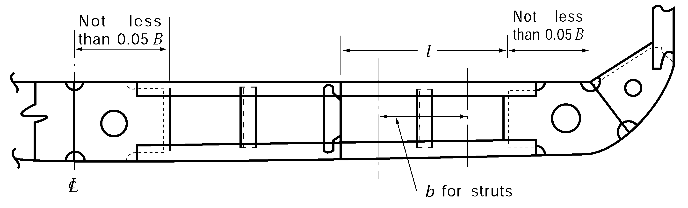

# PART 10 Hull Structure and Equipment of Small Steel Ships

> RULES FOR CLASSIFICATION OF STEEL SHIPS / RA-10-E / 2025 / EN / Rules

## CHAPTER 7 DOUBLE BOTTOMS

### Section 1 General

#### 101. Application 【See Guidance】

- **1.** Passenger ships engaged on international voyages and cargo ships(except tankers) of not less than 500 tons gross tonnage engaged on international voyages, in principle, are to be provided with watertight double bottoms extending from the collision bulkhead to the after peak bulkhead. *(2018)*
- **2.** Where a double bottom is required to be fitted, the inner bottom is to be continued out to the ship's sides in such a manner as to protect the bottom to the turn of the bilge. And the inner bottom is not to be lower at any part than a plan parallel with the keel line and which is located not less than a vertical distance $h$ measured from the keel line, as calculated by the formula: *(2018)*
  $h = B'/20$
  $B '$: the greatest moulded breadth in meters of the ship at or below the deepest subdivision draught.
  However, in no case is the value of $h$ to be less than 760 mm, and need not be taken as more than 2,000 mm.
- **3.** Where, for the structural configuration, hull form, purpose etc., it is desired to omit double bottom partially or wholly subject to the approval by the Society. *(2018)*
- **4.** A double bottom may be omitted in way of watertight tanks, including dry tanks of moderate size subject to the approval by the Society. *(2018)*
- **5.** The requirements in this Chapter may be suitably modified, where partial double bottoms are provided and where special arrangements such as longitudinal bulkheads or inner skins are made to reduce the unsupported breadth of double bottoms.
- **6.** Where the longitudinal system of framing is transformed into the transverse system, or the depth of double bottom changes suddenly, special care is to be taken for the continuity of strength by means of additional intercostal girders or floors.
- **7.** Bottom structure of holds is to be subjected to special consideration when the hold is intended to carry heavy cargoes or where cargo loads can not be treated as evenly distributed loads.

#### 102. Manholes and lightening holes

- **1.** Manholes and lightening holes are to be provided in all non-watertight members to ensure accessibility and ventilation, except in way of widely spaced pillars and where such openings are not permitted by this rule.
- **2.** The number of manholes in tank tops is to be kept to the minimum compatible with securing free ventilation and ready access to all parts of the double bottom. Care is to be taken for locating the manholes to avoid the possibility of inter connection of main subdivision compartments through the double bottom so far as practicable.
- **3.** Covers of manholes specified in **Par 2** are to be of steel, and where no ceiling is provided in the cargo holds, the covers and their fittings are to be effectively protected against damages by cargoes.
- **4.** Air and drainage holes are to be provided in all non-watertight members of the double bottom structure.
- **5.** The proposed locations and sizes of manholes and lightening holes are to be indicated in the plans submitted for approval.

#### 103. Drainage

- **1.** The bilge well in suitable size is to be provided for draining water which may gather on the double bottom.
- **2.** Small wells constructed in the double bottom in connection with drainage arrangements of holds, etc., shall not extend downward more than necessary. A well extending to the outer bottom is, however, permitted at the after end of the shaft tunnel.
- **3.** Other wells (e.g., for lubricating oil under main engines) may be permitted by the Society if satisfied that the arrangements give protection equivalent to that afforded by a double bottom complying with this Chapter. *(2018)*
- **4.** For wells specified in **Par 2.** and **3.** above, except those at the ends of shaft tunnels, the vertical distance from the bottom of such a well to a plane coinciding with the keel line is not to be less than h/2 or 500 mm, whichever is greater, Where, however, the vertical distance do not meet the requirement, the concerned parts are to be in accordance with the requirements in **Pt 3, Ch 7, 101. 3.** above.

#### 104. Cofferdams

- **1.** The following dedicated tanks are to be separated from adjacent tanks of other uses by cofferdams. However, these cofferdams may be omitted provided that the common boundaries of lubricating oil and fuel oil tank have full penetration welds.
  - **(1)** Fuel oil
  - **(2)** Lubrication oil
  - **(3)** Vegetable oil
  - **(4)** Fresh water
- **2.** The cofferdams specified in **Par 1** are to be provided with the air pipes to comply with the requirements in **Pt 5, Ch 6, 201.** and with the manholes of adequate size which are well accessible.

#### 105. Watertight girders and floors

The thickness of watertight girders and floors, and the scantlings of stiffeners attached to them are to comply with the relevant requirements for girders and floors, as well as the requirements in **Ch 15, 202.** and **203.**

#### 106. Minimum thickness

No member of the double bottom structure is to be less than 6 mm in thickness.

#### 107. Ceilings

- **1.** In ships with double bottoms, close ceilings are to be laid from the margin plate to the upper turn of bilge so arranged as to be readily removable for inspection of the limbers.
- **2.** Ceilings are to be laid on the inner bottoms under hatchways, unless the requirements in **601.** or **Pt 7, Ch 3, 204. 2** of the Rules are applied.
- **3.** Ceilings on the top of double bottom are to be laid on battens not less than 13 mm in thickness. The top plating of tanks, where ceiled directly, is to be covered with good tar put on hot and well sprinkled with cement powder, or with other equally effective coatings.
- **4.** The thickness of ceilings is to be as follows.

  | $L$ | Thickness of ceiling(mm) |
  | --- | --- |
  | $L < 61$m | 50 |
  | 61 m$\leq L \leq$ 76 m | 57 |
  | $L > 76$m | 63 |

### Section 2 Centre Girders

#### 201. Arrangement and construction

- **1.** Centre girders are to extend as far forward and afterward as practicable.
- **2.** Centre girder plates are to be continuous for 0.5$L$ amidships.
- **3.** Where double bottoms are used for carriage of fuel oil or fresh water, the centre girders are to be watertight.
- **4.** The requirements in **Par 3** may be suitably modified, in narrow tanks at the end parts of the ship or where other watertight longitudinal divisions are provided at about 0.25 $B$ from the centre line or where deemed appropriate by the Society.

#### 202. Lightening holes

- **1.** Lightening holes may be provided on centre girders in every frame space outside 0.75 $L$ amidships.
- **2.** Lightening holes may be provided on centre girders in alternate frame spaces for 0.75 $L$ amidships, provided that the depth of holes does not exceed one-third of the depth of centre girder.

#### 203. Depth

The depth of centre girders is not to be less than $B/16$ unless specially approved by the Society, but in no case is it to be less than 760 mm.

#### 204. Thickness

The thickness of centre girder plates is not to be less than that obtained from the following formula:
$t=0.05L+5$(mm)

#### 205. Brackets

- **1.** Where longitudinal framing system is adopted in the double bottom, transverse brackets are to be provided between the solid floors with a spacing not more than about 1.75 m connecting the centre girder plates to the bottom shell plating as well as the adjacent bottom longitudinals. Where the spacing of these brackets exceeds 1.25 m, additional stiffeners are to be provided for the centre girder plates.
- **2.** The thickness of the brackets specified in **Par 1** is not to be less than that obtained from the following formula. However, it need not be greater than that of the solid floors at the same location.
  $t=0.6 \sqrt {L} +1.5$(mm)
- **3.** The strength of stiffeners specified in **Par 1** is not to be less than that of a flat bar having the same thickness as that of girder plates and having the depth not less than 0.08 *d*_0, where *d*_o is the depth of centre girder (mm).

### Section 3 Side Girders

#### 301. Arrangement

- **1.** Side girders in 0.5 $L$ amidships are to be so arranged that the distance from the centre girder to the first side girder, between girders, or from the outermost girder to the side shell plating does not exceed approximately 4.6 m and to extend as far forward and afterwards as practicable.
- **2.** In the strengthened bottom forward specified in **902.** of ships, side girders and half-height girders are to be provided as required in **903.**
- **3.** Adequate strengthening is to be made under main engines and thrust seatings by means of additional full or half-height girders.

#### 302. Thickness

The thickness of side girder plates is not to be less than that obtained from the following formula and in engine room it is to be increased by 1.5 mm.
$t=0.65 \sqrt {L} +1.5$(mm)

#### 303. Thickness of half-height girders

The thickness of half-height girders is not to be less than obtained from the formula specified in **302.**

#### 304. Scantlings of vertical stiffeners and struts

- **1.** Vertical stiffeners are to be provided to side girders at every open floor, or at a suitable distance if the double bottom is framed longitudinally, and vertical struts are to be provided on half-height girders at every open floor.
- **2.** The strength of vertical stiffeners required by **Par 1** is not to be less than that of a flat bar having the same thickness as that of the girder plates and having the depth not less than 0.08 $d _{0}$ (mm), where $d _{0}$ is the height of side girder (mm).
- **3.** The sectional area of vertical struts required by **Par 1** is not to be less than obtained from the formula in **503.** with necessary modification.

#### 305. Lightening holes

Within 10 % of the length of a hold from its end bulkheads, the diameter of lightening holes in the side girder is not to exceed one-third of the depth of girders. This requirement may, however, be modified in a short hold and outside 0.75 $L$ amidships and where suitable compensation is made to the girder plate.

### Section 4 Solid Floors

#### 401. Arrangements

- **1.** Solid floors are to be provided at a spacing not exceeding about 3.5 m.
- **2.** In addition to complying with the requirements in **Par 1,** solid floors are to be provided at the following locations:
  - **(1)** At every frame in the main engine room. Solid floors may, however, be provided at alternate frames outside the engine seatings, if the double bottom is framed longitudinally.
  - **(2)** Under thrust seatings and boiler bearers
  - **(3)** Under transverse bulkheads
  - **(4)** At the location specified in **903.,** between the collision bulkhead and the after end of the strengthened bottom forward specified in **902.**
- **3.** Watertight floors are to be so arranged that the subdivision of the double bottom generally corresponds to that of the ship.

#### 402. Thickness

The thickness of solid floors is not to be less than that obtained from the following formulae and in the engine room the thickness is to be increased by 1.5 mm.
In ships with transverse framing : $t=0.6 \sqrt {L} +1.5$(mm)
In ships with longitudinal framing : $t=0.7 \sqrt {L} +1.5$(mm)

#### 403. Vertical stiffeners

- **1.** Vertical stiffeners are to be provided on the solid floors at a suitable spacing in case of the double bottom framed transversely, and at every longitudinal in case of the double bottom framed longitudinally.
- **2.** The vertical stiffeners prescribed in **Par 1** is to be a flat bar having the same thickness as that of the floor plate and the depth not less than 0.08 $d _{0}$ or the equivalent, where $d _{0}$ is the depth of the floor at the point under consideration (mm).

#### 404. Lightening holes

Within 0.1$B$ from side shell plating, the diameter of lightening holes provided in the solid floors in the middle half length of a hold is not to exceed about one-fifth of the depth of floors. This requirement may, however, be suitably modified at the end parts of ship and in exceptionally short holds and where the solid floors are suitably compensated for.

### Section 5 Bottom Longitudinals

#### 501. Spacing

The standard spacing of longitudinals is obtained from the following formula :
$S=2L+550$(mm)

#### 502. Scantlings 【See Guidance】

- **1.** The section modulus of bottom longitudinals is not to be less than that obtained from the following formula and in no case is it to be less than 30 cm^3.
  $Z _{b} =CShl ^{2}$(cm^3)
  where:
  $l$ = spacing of solid floors (m)
  $S$ = spacing of longitudinals (m)
  $h$ = vertical distance from the longitudinals to a point of $d+0.026 L$ above the top of keel (m)
  $C$ = coefficient given in **Table 10.7.1**

  | Case |   | $C$ |
  | --- | --- | --- |
  | In case where no strut specified in **503.** is provided midway between floors |   | 8.6 |
  | In case where a strut specified in **503.** deep tanks is provided midway between floors | Where holds are deep tanks | 6.2 |
  | In case where a strut specified in **503.** deep tanks is provided midway between floors | Elsewhere | 4.1 |
- **2.** The section modulus of inner bottom longitudinals is not to be less than obtained from the formula in **Par 1** with $C$ equal to 0.85 times the value specified for bottom longitudinals in the same location. Where vertical struts are not provided to the longitudinals under deep tanks, the section modulus of inner bottom longitudinals is to be as specified in **Ch 15, 203.**

#### 503. Vertical struts

- **1.** Vertical struts are to be rolled sections other than flat bars or bulb plates and to be well overlapped with the webs of bottom and inner bottom longitudinals.
- **2.** The sectional area of the vertical struts is not to be less than that obtained from the following formula:
  $A=2.2S bh$(cm^2)
  where:
  $S$ = spacing of longitudinals (m)
  $b$ = breadth of the area supported by the strut (m) (See **Fig 10.7.1**)
  $h$ = as specified in **502. 1**
  
  **Fig 10.7.1 Open Floors**

### Section 6 Inner Bottom Plating and Margin Plates

#### 601. Thickness of inner bottom plating 【See Guidance】

The thickness of inner bottom plating is not to be less than that obtained from the following formula and the thickness is to be increased by 2 mm in main engine room and under hatchway, if no ceiling is provided:
$t=3.8S \sqrt {d} +1.5$(mm)
where:
$S$ = spacing of inner bottom longitudinals for longitudinally framed inner bottom plating, or spacing of floor plates for transversely framed inner bottom plating (m)

#### 602. Ships handling cargoes regularly by mechanical appliances such as grabs

In ships which regularly handle cargoes by grabs or similar mechanical appliances, the thickness of inner bottom plating is to be increased by 2 mm above that specified in **601.,** unless ceiling is provided.

#### 603. Arrangements of margin plates

It is recommended that the margin plates are to be of sufficient height to protect the bottom up to the turn of bilge and for forward 0.2 $L$ from the stem the margin plates are to extend to the ship's sides horizontally as far as practicable.

#### 604. Thickness of margin plates

The thickness of margin plates is to be increased by 1.5 mm above that obtained from the formula in **601.**

#### 605. Breadth of margin plates

Margin plates are to be of adequate breadth and to extend well inside from the line of toes of tank side brackets.

#### 606. Brackets

- **1.** Where the double bottom is framed longitudinally, brackets are to be transversely provided at every hold frame extending from the margin plate to the adjacent bottom and inner bottom longitudinals.
- **2.** The thickness of brackets specified in **Par 1** is not to be less than that obtained from the formula in **205. 2.**

### Section 7 Hold Frame Brackets

#### 701. Tank side brackets

- **1.** The thickness of brackets connecting hold frames to margin plates is to be increased by 1.5 mm above that obtained from the formula in **205. 2.**
- **2.** The free edges of brackets are to be stiffened.
- **3.** Where the shape of ship requires exceptionally long brackets, additional stiffness is to be provided by fitting angles longitudinally across the top of flanges, or by other suitable means.

### Section 8 Open Floors

#### 801. Arrangements

Where the double bottom is framed transversely, open floors are to be provided at every hold frame between solid floors in accordance with the requirements in this Section.

#### 802. Scantlings of frames and reverse frames

- **1.** The section modulus of frames is not to be less than that obtained from the following formula and in no case is it to be less than 30 cm^3.
  $Z _{b} =C S h l ^{2}$(cm^3)
  where:
  $l$ = distance between the brackets attached to the centre girder and the margin plate (m). Where side girders are provided, $l$ is the greatest distance between the vertical stiffeners on side girders and the brackets. (See **Fig 10.7.1**)
  $S$ = spacing of frames (m)
  $h$ = $d + 0.026 L$(m)
  $C$ = coefficient given in **Table 10.7.2**

  | Case |   | $C$ |
  | --- | --- | --- |
  | In case where no vertical strut specified in 803. is provided |   | 6.0 |
  | In case where vertical struts specified in 803. are provided | Under deep tanks | 4.4 |
  | In case where vertical struts specified in 803. are provided | Elsewhere | 2.9 |
- **2.** The section modulus of reverse frames is not to be less than that obtained from the formula in **Par 1** with $C$ equal to 0.85 times the value specified for frames at the same location. Where no vertical strut is provided to the open floors under deep tanks, $C$ is to be the value as specified in **Ch 15, 203.**

#### 803. Vertical struts

- **1.** Vertical struts are to be rolled sections other than flat bars and bulb plates and to be well overlapped with the webs of frames and reverse frames.
- **2.** The sectional area of vertical struts is not to be less than that specified in **503.** with necessary modifications.

#### 804. Brackets

- **1.** Frames and reverse frames are to be connected to the centre girder and margin plates by brackets of not less thickness than obtained from the formula in **205. 2.**
- **2.** The breadth of brackets specified in **Par 1** is not to be less than 0.05 $B$ and the brackets are to be well overlapped with frames and reverse frames. The free edges of brackets are to be properly stiffened.

### Section 9 Construction of Strengthened Bottom Forward

#### 901. Application 【See Guidance】

- **1.** The requirements in this Section are framed for ships having the minimum bow draught not more than 0.037 $L$ at the ballast condition.
- **2.** Notwithstanding the requirement in **Par 1,** in ships of which $C _{b}$ is less than 0.7 and $V$ /$\sqrt {L}$(kt/m) is 1.4 and over, the area of strengthened bottom forward of ship is to be in accordance with the discretion of the Society.

#### 902. Strengthened bottom forward 【See Guidance】

- **1.** The strengthened bottom forward is the part of the ship's bottom up to a height of 0.05 $d _{F}$ ($d _{F}$ : Bow draught at the ballast condition) from the top of keel at forward from the position specified in **Table 10.7.3.**
- **2.** Notwithstanding the requirement of **Par 1,** in case of the ships of which $C _{b}$ are especially small, the ships of which the draft in the ballast condition are especially small, and so on, the extent of the strengthened bottom forward is to be extended up to the satisfaction of the Society.

  | $V/ \sqrt {L} (=a)$ | Position (from Fore Perpendicular) |
  | --- | --- |
  | a≤1.1 | 0.15 L |
  | 1.1＜a≤1.25 | 0.175 L |
  | 1.25＜a≤1.4 | 0.2 L |
  | 1.4＜a≤1.5 | 0.225 L |
  | 1.5＜a≤1.6 | 0.25 L |
  | 1.6＜a≤1.7 | 0.275 L |
  | 1.7＜a | 0.3 L |

#### 903. Construction

- **1.** Between the collision bulkhead and 0.05 $L$ abaft the after end of strengthened bottom forward, full or half height girders are to be provided in accordance with **Table 10.7.4.** Where transverse framing is adopted between the collision bulkhead and 0.025 $L$ abaft the after end of strengthened bottom forward, half height girders or longitudinals shell stiffeners are to be provided between the side girders.
- **2.** Between the collision bulkhead and the after end of strengthened bottom forward, solid floors are to be provided in accordance with **Table 10.7.4.**

  | Members Double bottom Side |   | Side girders | Half-height girders or longitudinals shell stiffeners | Solid floors |
  | --- | --- | --- | --- | --- |
  | Transverse framing | Transverse framing | To be provided at intervals within 2.5 m | To be provided between side girders | To be provided at every frame |
  | Transverse framing | Longitudinal framing | To be provided at intervals within 2.5 m | To be provided between side girders | To be provided at intervals within 2.5 m |
  | Longitudinal framing | Transverse framing | To be provided at intervals within 2.5 m | - | To be provided at alternate frames |
  | Longitudinal framing | Longitudinal framing | To be provided at intervals within 2.5 m | - | To be provided at intervals within 2.5 m |
- **3.** The solid floors are to be strengthened by fitting vertical stiffeners in way of half-height girders or longitudinal shell stiffeners except where the shell stiffeners are spaced considerably close and the solid floors are adequately strengthened, the vertical stiffeners may be provided on alternate shell stiffeners.
- **4.** Solid floors and side girders are to be adequately stiffened for those ships, of which the minimum bow draught is not less than 0.025 $L$ but not more than 0.037 $L$, where the construction and arrangement of the strengthened bottom forward are not in accordance with the requirements in **Par 1** and **Par 2.**

#### 904. Scantlings of longitudinal shell stiffeners or bottom longitudinals

The section modulus of longitudinal shell stiffeners or bottom longitudinals in way of the strengthened bottom forward are to be in accordance with **Pt 3, Ch 7, 804.** 
