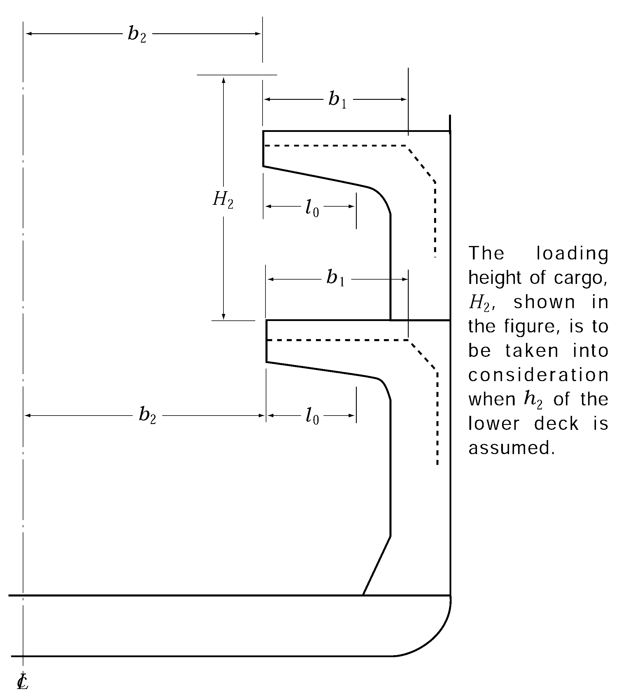

# PART 10 Hull Structure and Equipment of Small Steel Ships

> RULES FOR CLASSIFICATION OF STEEL SHIPS / RA-10-E / 2025 / EN / Rules

## CHAPTER 9 CANTILEVER BEAM CONSTRUCTION

### Section 1 Cantilever Beams

#### 101. Construction and scantlings

Cantilever beams are to comply with the requirements in (1) to (7):
$Z=7.1 S l _{0} \left( \frac{1}{2} b _{1} h _{1} +b _{2} h _{2} \right)$(cm^3)
where:
$S$ = cantilever beam spacing (m)
$l _{0}$ = horizontal distance from the inboard end of cantilever beams to the toe of end brackets (m)
$b _{1}$ = horizontal distance from the inboard end of cantilever beams to the toe of end brackets of beam or transverse deck girder at side (m). Where, however, the deck is framed longitudinally and no deck transverse is provided between the cantilever beams, $b _{1}$ is to be taken as $l _{0}$.
$b _{2}$ = a half of the breadth of hatch opening in the deck supported by the cantilever beams (m)
$h _{1}$ = deck load stipulated in **Ch 10, Sec 2** for the deck transverses supported by the cantilever beams (kN/m^2)
$h _{2}$ = load on hatch covers of the deck supported by the cantilever beams which is not to be less than obtained from the following (a) to (c), depending on the type of the deck (kN/m^2)
$t _{1} =9.5 \frac{S \left( \frac{1}{2} b _{1} h _{1} +b _{2} h _{2} \right)}{d _{c}} +1.5$(mm)
$t _{2} =0.0075d _{c} +0.46t _{1} +0.5$(mm)
where:
$S, b _{1} , b _{2} , h _{1}$ and $h _{2}$ = as stipulated in (3). Where, however, the deck is framed longitudinally and no deck transverse is provided between the cantilever beams, a horizontal distance in *metre* from the inboard end of cantilever beams to the section under consideration is to be substituted for $b _{1}$/2 in the formula for $t _{1}$.
$d _{c}$ = depth of the cantilever beams at the section under consideration (mm), However, in the calculation of $t _{1}$, the depth of slots for deck longitudinals, if any, is to be deducted from the depth of cantilever beams. Where the webs are provided with horizontal stiffeners, the divided web depth may be used for $d _{c}$ in the formula for $t _{2}$.

**Fig 10.9.1 Measurement of** #eqnID-388**, etc.**

### Section 2 Web Frames

#### 201. Construction and scantlings

Web frames supporting cantilever beams are to comply with the requirements in (1) to (7):
$Z=7.1S l _{1} \left( \frac{1}{2} b _{1} h _{1} + b _{2} h _{2} \right)$(cm^3)
where:
$S$ = web frame spacing (m)
$l _{1}$ = horizontal distance from the end of supported cantilever beams to the inside of web frames (m)
$b _{1} , b _{2} , h _{1}$ and $h _{2}$ = as stipulated in **101.** (3) for the supported cantilever beams. Where, however, the deck is framed longitudinally and no deck transverse is provided between the cantilever beams, $l _{1}$ is to be substituted for $b _{1}$.
$Z=7.1 C _{1} S l _{1} \left( \frac{1}{2} b _{1} h _{1} + b _{2} h _{2} \right)$(cm^3)
where:
$S, l _{1} , b _{1} , b _{2} , h _{1}$ and $h _{2}$ = as stipulated in (2)
$C _{1}$ = coefficient obtained from the following formula:
$C _{1} =0.5 \left( \frac{\frac{1}{2} b _{1} ^{'} h _{1} ^{'} +b _{2} ^{'} h _{2} ^{'}}{\frac{1}{2} b _{1} h _{1} + b _{2} h _{2}} \right) + 0.15$
$b _{1} ^{' } , b _{2} ^{' } , h _{1} ^{' }$ and $h _{2} ^{'}$ = $b _{1} , b _{2} , h _{1}$ and $h _{2}$ respectively stipulated in (2) in respect of cantilever beams to be provided below the web frames concerned.
$t _{1} =9.5 \frac{C _{2} S \left( \frac{1}{2} b _{1} h _{1} +b _{2} h _{2} \right)}{d _{w}} \cdot \frac{l _{1}}{l} +1.5$(mm)
$t _{2} =0.0075d _{w} +0.46t _{1} +0.5$ (mm)
where:
$S, b _{1} , b _{2} , h _{1} , h _{2}$ and $l _{1}$ = as stipulated in (2)
$d _{w}$ = the smallest depth of web frames (mm). However, in the calculation of $t _{1}$, the depth of slots for side longitudinals, if any, is to be deducted from the web depth. Where the depth of webs is divided by vertical stiffeners, in the calculation of $t _{2}$, the divided depth may be used for $d _{w}$.
$l$ = length of web frames including the length of connections at the both ends (m)
$C _{2}$ = coefficient given in **Table 10.9.1,** where, however, $C _{1}$ is as specified in (3)

| Location |   | $C _{2}$ |
| --- | --- | --- |
| For hold web frames | Where web frame in association with cantilever beam supporting the deck above is provided at the top of them | 0.9 |
| For hold web frames | Elsewhere | 1.5 |
| For tween deck web frames |   | $C _{1}$ + 0.6 |

Where tween deck web frame together with cantilever beam is provided above:
$\alpha =9.81 \left\{ \frac{0.05hl ^{2} +0.09 h _{u} l _{u} ^{2}}{1.4 \left( \frac{1}{2} b _{1} h _{1} +b _{2} h _{2} \right) l _{1}} \right\} +0.6$
Elsewhere: $\alpha =1.0$
where:
$l$ = length of hold web frames including the length of end connections (m)
$l _{u}$ = length of tween deck web frames provided directly above, including the length of end connections (m)
$h$ = vertical distance from the middle of $l$ to a point of $d+0.038 L$ above the top of keel (m)
$h _{u}$ = vertical distance from the middle of $l _{u}$ to a point to which $h$ is to be measured (m). However, in case where the point is below the middle of $l _{u}$, $h _{u}$ is to be taken as zero.
$b _{1} , b _{2} , h _{1} , h _{2}$ and $l _{1}$ = as given by (2)
$\beta =30 \frac{Shl}{d _{w}}$(mm)
where:
$S$ = web frame spacing (m)
$h$, $l$ = as stipulated in (a) above
$d _{w}$ = as stipulated in (4)

### Section 3 Connection of Cantilever Beams to Web Frames

#### 301. Connections 【See Guidance】

Cantilever beams and their supporting web frames are be effectively connected by brackets to meet the requirements in (1) to (4).
