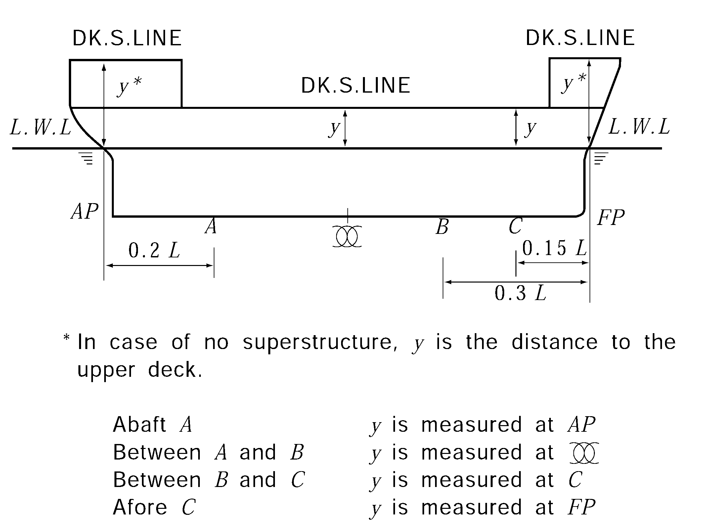

# PART 10 Hull Structure and Equipment of Small Steel Ships

> RULES FOR CLASSIFICATION OF STEEL SHIPS / RA-10-E / 2025 / EN / Rules

## CHAPTER 10 BEAMS

### Section 1 General

#### 101. Standard camber

The standard camber of weather decks is 0.02 $B$ at midship.

#### 102. Connections of ends of beams 【See Guidance】

- **1.** Longitudinal beams are to be continuous or to be connected with brackets at their ends in such a manner as to effectively develop the sectional area and to have sufficient strength to bending and tension.
- **2.** Transverse beams are to be connected to frames by brackets.
- **3.** Transverse beams provided at positions where frames are omitted in tween decks or superstructures, are to be connected to the side plating by brackets.
- **4.** Transverse beams on boat decks, promenade decks, etc. may be connected by clips at their ends.

#### 103. Continuity of strength

In parts where longitudinal beams are transformed to transverse beams, special care is to be taken to keep the continuity of strength.

### Section 2 Deck Load

#### 201. Value of _s1 【See Guidance】

- **1.** Deck load $h$ (kN/m^2) for decks intended to carry ordinary cargoes or stores is to be in accordance with the following (1) through (3):
  - **(1)** $h$ is to be equivalent to the standards given by 7 times the tween deck height at side of the space (m), or 7 times the height from the deck concerned to the upper edge of hatch coaming of the above deck (m). However, $h$ may be specified as the maximum design cargo weight per unit area of deck (kN/m^2). In this case, the value of $h$ is to be determined by considering the loading height of cargo.
  - **(2)** Where timber and/or other cargoes are intended to be carried on the weather deck, $h$ is to be the maximum design cargo weight per unit area of deck (kN/m^2), or the value specified in **Par 2,** whichever is the greater.
  - **(3)** Where cargoes are suspended from the deck beams or deck machinery is installed, $h$ is to be suitably increased.
- **2.** Deck load $h$ (kN/m^2) for the weather deck is to be as specified in the following (1) to (4):
  - **(1)** For the freeboard decks, superstructure deck and top of deckhouses on the freeboard deck, $h$ is not to be less than that obtained from the following formula:
    $h=a(0.067 bL-y)$(kN/m^2)
    where:
    $a$, $b$ = as given by **Table 10.10.1** according to the position of decks. However, where $C _{b}$ is less than 0.7, value of $b$ will be specially considered.
    $y$ = vertical distance from the load line to the weather deck at side (m), and $y$ is to be measured at fore end for deck forward of 0.15 $L$ abaft the fore end; at 0.15 $L$ abaft the fore end for deck between 0.3 $L$ and 0.15 $L$ abaft the fore end; at midship for deck between 0.3 $L$ abaft the fore end and 0.2 $L$ afore the aft end; and at aft end for deck afterward of 0.2 $L$ afore the aft end. (See **Fig 10.10.1**)
    
    **Fig 10.10.1 Position of measuring** #eqnID-463
  - **(2)** $h$ for deck given in Column II in **Table 10.10.2** need not exceed that in Column I.
  - **(3)** Notwithstanding the provision in (1) and (2), $h$ is not to be less than that obtained from the formulae given by **Table 10.10.2,** but to be taken as 12.8 where $h$ is less than 12.8.
  - **(4)** Value of $h$ is to be in accordance with the discretion of the Society, where the ship has an unusual large freeboard. **【See Guidance】**

    | Column | Position of Deck | a |   |   |   | b |
    | --- | --- | --- | --- | --- | --- | --- |
    | Column | Position of Deck | Deck plating | Beams | Pillars | Deck girders | b |
    | I | Forward of 0.15 L abaft the fore end | 14.7 | 9.80 | 4.90 | 7.35 | 1.42 |
    | II | Between 0.15 L and 0.3 L abaft the fore end | 11.8 | 7.85 | 3.90 | 5.90 | 1.20 |
    | III | Between 0.3 L abaft the fore end and 0.2 L afore the aft end | 6.90 | 4.60 | 2.25 | 2.25(1), 3.45(2) | 1.00 |
    | IV | Afterward of 0. 2L afore the aft end | 9.80 | 6.60 | 3.25 | 4.90 | 1.15 |
    | (NOTES) (1) In case of longitudinal deck girders outside the line of hatchway opening of the strength deck in midship part of ship (2) In case of deck girders other than (1) |   |   |   |   |   |   |

    | Column | Position of Deck | $h$ | $C$ |   |   |
    | --- | --- | --- | --- | --- | --- |
    | Column | Position of Deck | $h$ | Beams | Pillars, Longitudinal and transverse deck girders | Deck Plating |
    | I and II | Forward of 0.3 L abaft the fore end | $C \sqrt {L+50}$ | 2.85 | 1.37 | 4.20 |
    | III | Between 0.3 L abaft the fore end and 0.2 L afore the aft end | $C \sqrt {L+50}$ | 1.37 | 1.18 | 2.05 |
    | IV | Afterward of 0.2 L afore the aft end | $C \sqrt {L}$ | 1.95 | 1.47 | 2.95 |
    | Second tier superstructure deck above the freeboard deck |   | $C \sqrt {L}$ | 1.28 | 0.69 | 1.95 |
- **3.** Deck loads $h$($\mathrm{kN}/m ^{2}$) on non-exposed decks and platforms are to be defined by the designer without being less than 3.0 ($\mathrm{kN}/m ^{2}$) for accommodation decks and 10.0 ($\mathrm{kN}/m ^{2}$) for other decks and platforms.

### Section 3 Longitudinal Beams

#### 301. Spacing

The standard spacing of the longitudinal beams is obtained from the following formula:
$S=2L+550$(mm)

#### 302. Proportion

- **1.** Longitudinal beams are to be supported by deck transverses of appropriate spacing. In midship part of the strength deck, the slenderness ratio of deck longitudinals is not to exceed 60. This requirement may, however, be suitably modified where longitudinal beams are given a sufficient strength to prevent buckling.
- **2.** Flat bars used for longitudinals are not to be of depth thickness ratio exceeding 15.

#### 303. section modulus 【See Guidance】

- **1.** The section modulus of longitudinal beams outside the line of openings of the strength deck for the midship part is not to be less than that obtained from the following formula:
  $Z=1.14 S h l ^{2 }$(cm^3)
  where:
  $S$ = spacing of longitudinal beams (m)
  $h$ = deck load specified in **Sec 2** (kN/m^2)
  $l$ = horizontal distance between bulkhead and deck transverse or between deck transverses (m)
- **2.** The section modulus of longitudinal beams outside the line of openings of the strength deck at 0.1 $L$ of fore end and after end of ship is not to be less than that obtained following formula:
  $Z=0.43 S h l ^{2 }$(cm^3)
  where:
  $S, h, l$ = as specified in **Par 1**
- **3.** The section modulus of longitudinal beams outside the line of openings of the strength deck for the parts forward and afterward midship part of ship may be gradually reduced section modulus by **Par 1.** In no case, however, is the section modulus to be less than obtained from **Par 2** at 0.1 $L$ of fore end and after end of ship.
- **4.** The section modulus of longitudinal beams for the parts other than stipulated in **Pars 1** and **2** is not to be less than obtained from the formula in **Par 2.**

#### 304. Deck transverses

In single deck ships, the deck transverses are to be provided in line with the solid floors in double bottom, and in two deck ships, the transverses are also to be provided in line with the solid floors in double bottoms as far as practicable.

### Section 4 Transverse Beams

#### 401. Arrangements

Transverse beams are to be provided on every frame.

#### 402. Proportion 【See Guidance】

It is preferable that the length depth ratio of transverse beams be 30 or less at the strength deck, and 40 or less at effective decks (the decks below the strength deck which are considered as strength members in the longitudinal strength of hull) and superstructure decks as far as practicable.

#### 403. Section modulus

The section modulus of transverse beams is not to be less than that obtained from the following formula:
$Z=0.43 S h l ^{2}$(cm^3)
where:
$S$ = spacing of transverse beams (m)
$h$ = deck load specified in **Sec 2** (kN/m^2)
$l$ = horizontal distance from the inner edge of beam brackets to the longitudinal deck girder, or between the longitudinal deck girders (m)

### Section 5 Beams on Bulkhead Recesses and Others

#### 501. Section modulus

The section modulus of beams at deck forming the top of bulkhead recesses, tunnels and tunnel recesses is not to be less than that obtained from the formula in **Ch 14, 207.**

### Section 6 Beams on the Top of Deep Tanks

#### 601. Section modulus

The section modulus of beams at deck forming the top of deep tanks is to be in accordance with this Chapter, and not to be less than that obtained from the formula in **Ch 15, 203.,** taking the top of deck beams as the lower end of $h$ and beams as stiffeners.

### Section 7 Deck Beams Supporting Specially Heavy Loads

#### 701. Reinforcement of deck beams

The deck beams supporting specially heavy loads or arranged at the ends of superstructures or deckhouses, in way of masts, windlasses and auxiliary machinery, etc. are to be properly reinforced by increasing the scantlings of beams, or by the additional deck girders or pillars.

### Section 8 Beams on Deck Carrying Unusual Cargoes

#### 801. Section modulus of beams

The section modulus of beams on deck subject to cargo loads which can not be treated as evenly distributed loads is to be determined taking account of load distribution for particular cargoes. 
