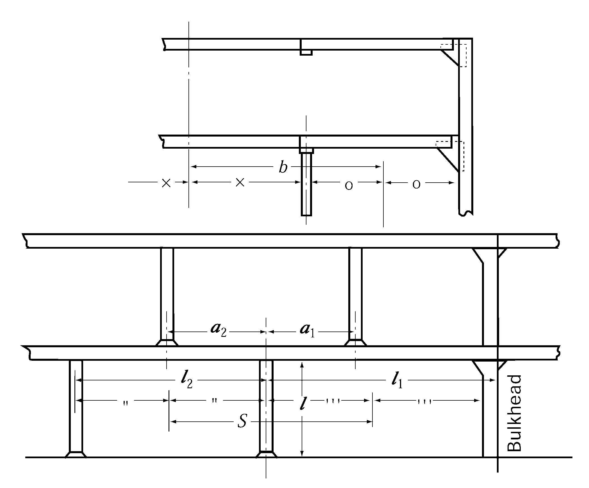

# PART 10 Hull Structure and Equipment of Small Steel Ships

> RULES FOR CLASSIFICATION OF STEEL SHIPS / RA-10-E / 2025 / EN / Rules

## CHAPTER 12 PILLARS

### Section 1 General

#### 101. Pillars in tween decks

Pillars in tween decks are to be arranged directly above those under the deck, or effective means are to be provided for transmitting their loads to the supports below.

#### 102. Pillars in holds 【See Guidance】

Pillars in holds are to be provided in line with the keelsons or double bottom girders or as close thereto as practicable, and the structure under pillars is to be of ample strength to provide effective distribution of the load.

#### 103. End connection of pillars

The head and heel of pillars are to be secured by thick doubling plates and brackets as necessary. Where the pillars which may be subjected to tensile loads such as under bulkhead recesses, tunnel tops or deep tank tops, the head and heel of pillars are to be efficiently secured to withstand the tensile loads.

#### 104. Reinforcements

Where the pillars are connected to the deck plating, the top of shaft tunnels, or the frames, these structures are to be efficiently strengthened.

### Section 2 Scantling of Pillars

#### 201. Sectional area 【See Guidance】

- **1.** The sectional area of pillars is not to be less than that obtained from the following formula:
  $A= \frac{0.223W}{2.72- \frac{l}{k _{0}}}$(cm^2)
  where:
  $l$ = distance from the top of inner bottom, deck or other structures on which the pillars are based to the underside of beam or girder supported by the pillars (m). (See **Fig 10.12.1**)
  $k _{0}$ = minimum radius of gyration of the section of pillars (cm)
  $W$ = deck load (kN) supported by the pillar obtained from the following formula:
  $W=kw _{0} + S b h$(kN)
  where:
  $S$ = distance between the mid-points of two adjacent spans of girders supported by the pillars or the bulkhead stiffeners or bulkhead girders (m) (See **Fig 10.12.1**)
  $b$ = mean distance between the mid-points of two adjacent spans of beams supported by the pillars or the frames (m) (See **Fig 10.12.1**)
  $h$ = deck load specified in **Ch 10, Sec 2** for the deck supported (kN/m^2)
  $w _{0}$ = deck load supported by the upper tween deck pillar (kN)
  $k$ = as obtained from the following formula according to the ratio of the horizontal distance $a _{i}$ (m) from the pillar to the tween deck pillar above to the distance $l _{i }$(m) from the pillar to the pillar or bulkhead (See **Fig 10.12.1**)
  $k=2 \left( \frac{a _{i}}{l _{j}} \right) ^{3} - 3 \left( \frac{a _{i}}{l _{j}} \right) ^{2} + 1$
  
  **Fig 10.12.1 Measurement of** #eqnID-552 **etc.**
- **2.** Where there are two or more tween deck pillars provided on the deck girder supported by a line of lower pillars, the lower pillar is to be of the scantlings required by **Par 1,** taking $kw _{0}$ for each tween deck pillar provided on two adjacent spans supported by the lower pillars.
- **3.** Where tween deck pillars are shifted from the lower pillars in athwartship direction, the scantlings of lower pillars are to be determined in accordance with the principle in **Par 1** and **Par 2.**
- **4.** Where a deck carrying cargoes whose loads can not be treated as evenly distributed loads, deck load supported by pillar is to be determined taking account of load distribution for particular cargoes. Where cargo loads can be treated as concentrated loads acting on specific points, the provisions of **Par 1** and **Par 2** above may be applied so that such concentrated loads are treated as deck loads supported by the upper tween deck pillar ($w _{o }$).

#### 202. Thickness

- **1.** The plate thickness of tubular pillars is not to be less than that obtained from the following formula. This requirement may, however, be suitably modified for the pillars provided in accommodation spaces.
  $t=0.022d _{p } +3.6$(mm)
  where:
  $d _{p}$ = outside diameter of the tubular pillar (mm)
- **2.** The thickness of web and flange plates of built-up pillars is to be sufficient for the prevention of local buckling.

#### 203. Outside diameter of round pillars

The outside diameter of solid round pillars and tubular pillars is not to be less than 50 mm.

#### 204. Pillars provided in deep tank

- **1.** Pillars provided in deep tank are not to be tubular pillars.
- **2.** The sectional area of pillars is not to be less than that specified in **201.** or obtained from the following formula, whichever is the greater.
  $a=1.09 S b h$(cm^3)
  where:
  $S$, $b$ = as specified in **201.**
  $h$ = 0.7 times the vertical distance from the top of deep tank to the point of 2 $m$ above the top of over flow pipe (m)

#### 205. Longitudinal bulkheads and others provided in lieu of pillars

The transverse bulkheads supporting longitudinal deck girders and the longitudinal bulkheads provided in lieu of pillars are to be stiffened in such a manner as to provide supports not less effective than required for pillars.

#### 206. Casings provided in lieu of pillars

The casings provided in lieu of pillars are to be of sufficient scantlings to withstand the deck load and side pressure. 
