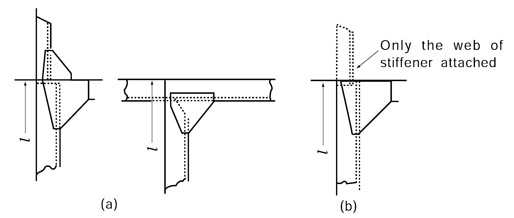

# PART 10 Hull Structure and Equipment of Small Steel Ships

> RULES FOR CLASSIFICATION OF STEEL SHIPS / RA-10-E / 2025 / EN / Rules

## CHAPTER 14 WATERTIGHT BULKHEADS

### Section 1 Arrangement

#### 101. Collision bulkheads 【See Guidance】

- **1.** All ships except where the larger distance is accepted by the Society due to special structural reasons are to have a collision bulkhead at the position between 0.05 $L_f$ and 0.05 $L_f$ + 3 m, but at position between 0.05 $L_f$ and 0.13 $L_f$ for the ships are engaged in great coastal services and whose tonnages are less than 500 ton, the ships are engaged in under coastal services and fishing vessels, measured from the forward end of the length for freeboard. However, where any part of the ship below the waterline at 85 % of the least moulded depth extends forward beyond the forward terminal of the length for freeboard, the above-mentioned distance is to be measured from following points whichever gives the smaller measurement:
- **2.** The bulkhead may have steps or recesses within the limits specified in the above **Par 1.**
- **3.** Arrangement of collision bulkhead in a ship provided with bow door is to be at the discretion of the Society. However, where a slopping ramp forms a part of the collision bulkhead above the freeboard deck, the part of the ramp which is more than 2.3 m above the freeboard deck may extend forward of the limit specified in the above **Par 1.** In this case, the ramp is to be weathertight over its complete length.

#### 102. After peak bulkheads

- **1.** All ships are to have an after peak bulkhead situated at a suitable position.
- **2.** The stern tube is to be enclosed in a watertight compartment by the after peak bulkhead or other suitable arrangements.

#### 103. Machinery space bulkheads

- **1.** A watertight bulkhead is to be provided at each end of the machinery space.
- **2.** Where the machinery space is arranged in aft end of ship, the after side bulkhead of machinery space among the bulkheads in **Par 1** may be regarded as an aft peak bulkhead of ship.

#### 104. Hold bulkheads 【See Guidance】

- **1.** Cargo ships, of the ordinary type and of 67 m or above in length are to have hold bulkheads in addition to the bulkheads specified in **101.** to **103.** at a reasonable interval so that the total number of the watertight bulkheads may not be less than that given by **Table 10.14.1.**

  | Length of ships (m) | Total number of bulkheads |   |
  | --- | --- | --- |
  | Length of ships (m) | Ships with machinery space at aft end of ship | Ships with machinery space other than at aft end of ship |
  | 67 ≤ $L$ ＜ 87 | 4 | 4 |
  | 87 ≤ $L$＜ 90 | 4 | 5 |
- **2.** The arrangement of bulkheads may not apply the requirement in **Par 1** subject to the approval by the Society.

#### 105. Height of watertight bulkheads

The watertight bulkheads required in **101.** to **104.** are to extend to the freeboard deck with the following exceptions:

#### 106. Construction

- **1.** Where the watertight bulkheads required in **101.** to **105.** are not extended up to the strength deck, deep webs or partial bulkheads situated immediately or nearly above the main watertight bulkheads are to be provided so as to maintain the transverse strength and stiffness of the hull.
- **2.** Where the length of a hold exceeds 30 m, suitable means are to be provided so as to maintain the transverse strength and stiffness of the hull.

#### 107. Chain lockers 【See Guidance】

- **1.** Spurling pipes and cable lockers are to be watertight up to the weather deck. Bulkheads between separate cable lockers, or which form a common boundary of cable lockers need not however be watertight.
- **2.** Where means of access is provided, it is to be closed by a substantial cover and secured by closely spaced bolts.
- **3.** Where a means of access to spurling pipes or cable lockers is located below the weather deck, the access cover and its securing arrangements are to be in accordance with recognized standards(e.g. ISO 5894 etc.) or equivalent for watertight manhole covers. Butterfly nuts and/or hinged bolts are prohibited as the securing mechanism for the access cover.
- **4.** Spurling pipes through which anchor cables are led are to be provided with permanently attached closing appliances to minimize water ingress.

### Section 2 Construction

#### 201. Thickness

The thickness of bulkhead plating is not to be less than that obtained from the following formula:
$t=3.2S \sqrt {h} + 1.5$(mm)
where:
$S$ = spacing of stiffeners (m)
$h$ = vertical distance from the lower edge of plate to the bulkhead deck at centre (m), but in no case is it to be less than 3.4 m

#### 202. Increase of thickness

- **1.** The thickness of lowest strake of plating is not to be less than obtained from the above formula given in **201.** plus 1 mm.
- **2.** The lowest strake of bulkhead plating is to extend at least 610 mm above the top of inner bottom plating in way of double bottom or 915 mm above the top of keel in way of single bottom. Where the double bottom is provided only on one side of the bulkhead, the extension of the lowest strake is to be of the greater value among the two cases above.
- **3.** The bulkhead platings in way of bilge wells are to be at least 2.5 mm thicker than given by **201.**
- **4.** The bulkhead plating is to be doubled or increased in thickness in way of stern tube opening, notwithstanding the requirements in **201.**

#### 203. Stiffeners 【See Guidance】

The section modulus of bulkhead stiffeners is not to be less than that obtained from the following formula:
$Z=C S h l ^{2}$(cm^3)
where :
$l$ = span measured between the adjacent supports of stiffeners including the length of connection (m). Where girders are provided, it is the distance from the heel of end connection to the first girder or the distance between the girders.
$S$ = spacing of stiffeners (m)
$h$ = vertical distance measured from the midpoint of $l$ for vertical stiffeners, and from the midpoint of distance between the adjacent stiffeners for horizontal stiffeners, to the top of bulkhead deck at the centre line of ship (m). Where the vertical distance is less than 6.0 m, $h$ is to be taken as 1.2 m greater than 0.8 times the vertical distance.
$C$ = coefficient given in **Table 10.14.2** according to the type of end connection.

| Vertical Stiffener | Upper end Lower end | Lug-connection of supported by horizontal girders | Connection |   | End of stiffener unattached |
| --- | --- | --- | --- | --- | --- |
| Vertical Stiffener | Upper end Lower end | Lug-connection of supported by horizontal girders | Type A | Type B | End of stiffener unattached |
| Vertical Stiffener | Lug-connection or supported by horizontal girders | 2.80 | 2.80 | 3.22 | 3.78 |
| Vertical Stiffener | Bracketed | 2.24 | 2.24 | 2.52 | 2.80 |
| Vertical Stiffener | Only the web of stiffener attached at end | 3.22 | 3.22 | 3.78 | 4.48 |
| Vertical Stiffener | End of stiffener unattached | 3.78 | 3.78 | 4.48 | 5.60 |
| Horizontal Stiffener | One end The other end | Lug-connection, bracketed or supported by vertical girders |   |   | End of stiffener unattached |
| Horizontal Stiffener | Lug-connection bracketed or supported by vertical girders | 2.80 |   |   | 3.78 |
| Horizontal Stiffener | End of stiffener unattached | 3.78 |   |   | 5.60 |
| (NOTES) 1. "Lug-connection" is such a connection as both web and face bar of stiffener are effectively attached to the bulkhead plating, decks or inner bottoms which are strengthened by effective supporting members on the opposite side of plating. 2. "Connection-Type A" of vertical stiffeners is a connection by bracket to the longitudinal members or to the adjacent members, in line with the stiffeners, of the same or larger sections. (See **Fig 10.14.1 (a)**) 3. "Connection-Type B"of vertical stiffeners is a connection by bracket to the transverse members such as beams, or other connections equivalent to the connections mentioned above. (See **Fig 10.14.1 (b)**) |   |   |   |   |   |

**Fig 10.14.1 Types of end connection**

#### 204. Collision bulkheads

For collision bulkheads, the plate thickness and section modulus of stiffeners are not to be less than those specified in **201.** and **203.** taking $h$ as 1.25 times the specified height.

#### 205. Girders

- **1.** The section modulus of girders supporting bulkhead stiffeners (hereinafter referred to as girder) is not to be less than that obtained from the following formula:
  $Z=4.75 S h l ^{2}$(cm^3)
  where:
  $S$ = breadth of the area supported by the girder (m)
  $h$ = vertical distance measured from the midpoint of $l$ for vertical girders, and from the mid-point of $S$ for horizontal girders, to the top of bulkhead deck at the centre line of ship (m). Where the vertical distance is less than 6.0 m, $h$ is to be taken as 1.2 m greater than 0.8 times the vertical distance.
  $l$ = span measured between the adjacent supports of girders (m)
- **2.** The moment of inertia of girders is not to be less than obtained from the following formula. In no case is the depth of girders to be less than 2.5 times the depth of slots for stiffeners.
  $I = 10 hl ^{4}$(cm^4)
  where:
  $h$, $l$ = as specified in **Par 1**
- **3.** The thickness of web plates is not to be less than that obtained from the following formula;
  $t=0.01S _{1} + 1.5$(mm)
  where:
  $S _{1}$ = spacing of web stiffeners or depth of girders, whichever is the smaller (mm)
- **4.** Tripping brackets are to be provided at an interval of about 3 m and where the breadth of face plates exceeds 180 mm on either side of the girder, these brackets are to be so arranged as to support the face plates.

#### 206. Strengthening of bulkhead plating, deck plating, etc.

Platings of bulkheads, decks, inner bottoms, etc. are to be, if necessary, strengthened at the location of the end brackets of stiffeners and the end of girders.

#### 207. Bulkhead recesses

- **1.** In way of bulkhead recesses, beams are to be provided at every frame and under the upper bulkhead in accordance with the requirements in **Ch 10, 403.** and **Ch 14, 203.** taking the beam spacing as the stiffener spacing, Where the lower end of upper bulkhead is specially strengthened, the beam under the upper bulkhead may be dispensed with.
- **2.** The thickness of deck plating in way of bulkhead recesses is to be at least 1 mm greater than that given by **201.,** regarding the deck plating as bulkhead plating and the beams as stiffeners respectively. In no case is the thickness to be less than that required for deck plating in that location.
- **3.** The thickness of pillars supporting bulkhead recesses is to be determined taking account of the water pressure which might be applied on the upper surface of recesses, and their end connections are to be sufficient to withstand the water pressure which might be applied on the under surface.

#### 208. Construction of bulkheads in way of watertight doors

Where stiffeners are cut or the spacing of stiffeners is increased in order to provide the watertight door in the bulkhead, the opening is to be suitably framed and strengthened as to maintain the full strength of the bulkhead. In no case are the door frames to be considered as stiffeners.

### Section 3 Watertight Doors (2020)

#### 301. General

- **1.** As specified in **Pt 3, Ch 14, 401.** of the Rules.

#### 302. Type of watertight doors 【See Guidance】

- **1.** As specified in **Pt 3, Ch 14, 402.** of the Rules.

#### 303. Strength and watertightness 【See Guidance】

- **1.** As specified in **Pt 3, Ch 14, 403.** of the Rules.

#### 304. Control 【See Guidance】

- **1.** As specified in **Pt 3, Ch 14, 404.** of the Rules.

#### 305. Indication 【See Guidance】

- **1.** As specified in **Pt 3, Ch 14, 405.** of the Rules.

#### 306. Alarms 【See Guidance】

- **1.** As specified in **Pt 3, Ch 14, 406.** of the Rules.

#### 307. Source of power 【See Guidance】

- **1.** As specified in **Pt 3, Ch 14, 407.** of the Rules.

#### 308. Notices

- **1.** As specified in **Pt 3, Ch 14, 408.** of the Rules.

#### 309. Sliding doors 【See Guidance】

- **1.** As specified in **Pt 3, Ch 14, 409.** of the Rules.

#### 310. Hinged and rolling doors

- **1.** As specified in **Pt 3, Ch 14, 410.** of the Rules.

#### 311. Testing 【See Guidance】

- **1.** As specified in **Pt 3, Ch 14, 412.** of the Rules. 
