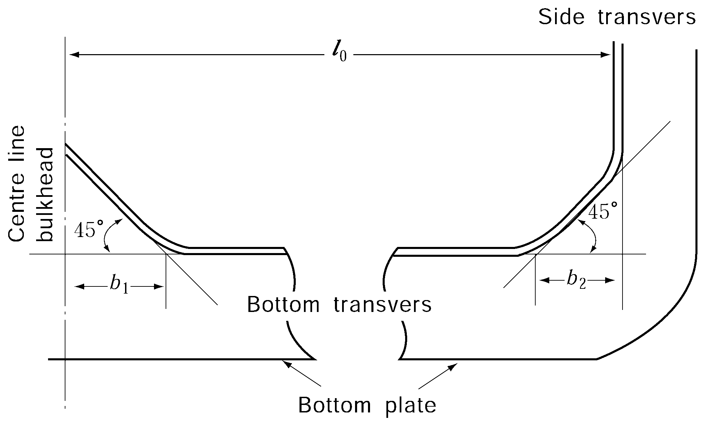
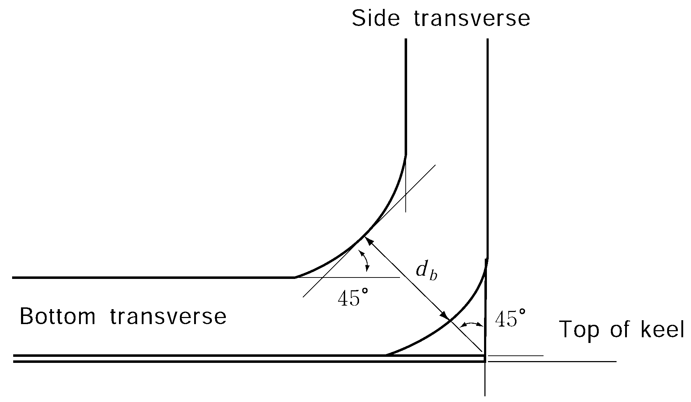

# PART 10 Hull Structure and Equipment of Small Steel Ships

> RULES FOR CLASSIFICATION OF STEEL SHIPS / RA-10-E / 2025 / EN / Rules

## CHAPTER 23 OIL TANKERS

### Section 1 General

#### 101. Application

- **1.** The construction and equipment of ships intended to be registered and classed as "tanker" are to be in accordance with the requirements in this Chapter, where "tanker" means a ship intended to carry crude oil, petroleum products having the vapour pressure (absolute pressure) less than 0.28 MPa at 37.8°C or other similar liquid cargoes in bulk.
- **2.** Except where specifically required in this Chapter, the general requirements for steel ships are to be applied.
- **3.** The requirements in this Chapter are framed for tankers with machinery aft, having one or more rows of longitudinal bulkheads, single decks, single bottoms and longitudinal framing.
- **4.** In tankers intended to carry liquid cargoes other than crude oil and petroleum products, having the vapour pressure (absolute pressure) less than 0.28 MPa at 37.8°C and having no hazard as poisonous, corrosive, etc. and moreover less inflammability than that of crude oil and petroleum products, the structural arrangements and scantlings are to be to the satisfaction of the Society, having regard to the properties of the cargoes to be carried. 【See Guidance】
- **5.** Notwithstanding the each requirement, the application of below requirements may be exempted in accordance with the requirement of flag state.
  - **(1)** **103. 5**
  - **(2)** **107.**
  - **(3)** **204.**

#### 102. Arrangement of bulkheads 【See Guidance】

In cargo oil tanks, longitudinal and transverse oiltight bulkheads and wash bulkheads are to be arranged suitably.

#### 103. Cofferdams 【See Guidance】

- **1.** Cofferdams of airtight construction and of sufficient width as required for ready access are to be provided at the forward and after ends of cargo oil spaces and between cargo oil spaces and accommodation spaces. In tankers intended to carry oils having a flashpoint exceeding 60°C, however, the preceding requirements may be modified.
- **2.** The cofferdams described in the preceding paragraph may be used as pump rooms.
- **3.** Ullage plugs, sighting ports and tank cleaning openings are not to be arranged in enclosed spaces.
- **4.** Fuel oil or ballast water tanks may be concurrently used as the cofferdams to be provided between cargo oil tanks and fuel oil or ballast water tanks, subject to the approval by the Society.
- **5.** Location and separation of spaces in tankers of 500 tons gross and above carrying oils having a flashpoint not exceeding 60°C are to be in accordance with the requirements in **Pt 8, Ch 2, Sec 4.**

#### 104. Airtight bulkheads 【See Guidance】

Airtight bulkheads are to be provided for the isolation of all cargo oil pumps and pipings from spaces containing stoves, boilers, propelling machinery, electric installations other than those of explosion-proof type specified in **Pt 6, Ch 1, Sec 9** or machinery space where source of ignition is normally present. In tankers carrying oils having a flashpoint exceeding 60°C, however, the preceding requirements may be modified.

#### 105. Ventilation

- **1.** Efficient ventilation is to be provided in spaces adjacent to cargo oil tanks. Air holes are to be cut in every part of the structure where there might be a chance of gases being "pocketed".
- **2.** Efficient means are to be provided for cleaning oil tanks and pump rooms of dangerous vapours by means of mechanical ventilation or by steam.
- **3.** Ventilation systems of mechanical extraction type are to be provided for the cargo oil pump room specified in **Par 2.** The outlets of exhaust ducts are to be led to the safe position above the open deck and to be fitted with wire mesh screens with mesh of suitable size. This ventilation systems are to be capable of circulating sufficient air to give at least 20 air changes per hour for the total volume of the pump room to prevent accumulation of cargo vapours. The ventilation fan is to be of non-sparking construction. Also the ducts are to be arranged, to permit ventilation from the vicinity of the pump room bilge, above the transverse floor plate or bottom longitudinals. An emergency intake located nearly 2 m above the pump room lower grating is to be arranged to the ducts, and this emergency intake is to have a damper which is capable of being opened or closed from the weather deck and lower grating level.
- **4.** In tankers carrying oils having a flashpoint above 60°C, the capacity of ventilation in the pump rooms specified in **Par 3** may be modified.
- **5.** The requirements in **Par 3** are applied to the ventilation fans and wire mesh screen for the spaces adjacent to the cargo oil tank specified in **Par 1**.

#### 106. Openings for ventilation

Ventilation inlets and outlets are to be arranged so as to minimize the possibilities of vapours of cargoes being admitted to an enclosed space containing a source of ignition, or collecting in the vicinity of deck machinery and equipment which may constitute an ignition hazard. Especially, openings of ventilation for machinery spaces are to be situated as far afterwards apart from the cargo spaces as practicable.

#### 107. Openings of superstructure and deckhouse

The arrangement of openings on the boundaries of superstructure and deckhouse are to be such as to minimize the possibility of accumulation of vapours of cargoes. Due consideration in this regard is to be given when the ship is equipped to load or unload at the stern. Side scuttles to the poop front or other similar walls are to be of fixed type. Such openings of tankers of 500 gross tons and above carrying oils having a flash point not exceeding 60°C are to be in accordance with the requirements in **Pt 8, Ch 2, 402.**

#### 108. Thickness of structural members in cargo oil spaces 【See Guidance】

The thickness of structural members in cargo oil spaces is to be in accordance with the following:
$t= 0.015d _{0} + 2.5$(mm)
where:
$d _{0}$ = depth of web plates (mm)
$t=0.5 \sqrt {L} + 2.5$(mm)

### Section 2 Hatchways, Gangways and Freeing Arrangements

#### 201. Ships having unusually large freeboard 【See Guidance】

Relaxation from the requirements specified hereunder will be considered to ships having an extraordinarily large freeboard.

#### 202. Hatchways to cargo oil tanks (2018)

- **1.** The thickness of coaming plates is not to be less than 10 mm. Where the length and coaming height of a hatchway exceed 1.25 m and 760 mm respectively, vertical stiffeners are to be provided to the side or end coamings and the upper edge of coamings is to be suitably stiffened.
- **2.** Hatchway covers are to be of steel or other approved materials. The construction of steel hatchway covers is to comply with the following requirements. The construction of hatchway covers of materials other than steel is to be in accordance with the discretion of the Society. **【See Guidance】**
  - **(1)** The thickness of cover plates is not to be less than 12 mm. In ships not more than 60 m in length, however, the requirement may be modified.
  - **(2)** Where the area of a hatchway exceeds 1 m^2 but does not exceed 2.5 m^2, cover plates are to be stiffened by flat bars of 100 mm in depth spaced not more than 610 mm apart. Where, however, the cover plates are 15 mm or more in thickness, the stiffeners may be dispensed with.
  - **(3)** Where the area of a hatchway exceeds 2.5 m^2, cover plates are to be stiffened by flat bars of 125 mm in depth spaced not more than 610 mm apart.
  - **(4)** The covers are to be secured by fastenings spaced not more than 457 mm apart in circular hatchways or 380 mm apart and not more than 230 mm from the corners in rectangular hatchways.

#### 203. Hatchways to spaces other than cargo area (2021)

In exposed positions on the freeboard and forecastle decks or on the top of expansion trunks, hatchways serving spaces other than cargo oil tanks, ballast tank, fuel oil tank and other tanks are to be provided with steel weathertight covers having scantlings complying with the requirements in **Ch 19.**

#### 204. Permanent gangway and passage

- **1.** A fore and aft permanent gangway complying with the requirements of **Pt 4, Ch 4, 503.** is to be provided at the level of the superstructure deck between the midship bridge or deck house and the poop or aft deck house, or equivalent means of access is to be provided to carry out the purpose of the gangway, such as passage below deck. Elsewhere and in ships without midship bridge or deck house, arrangements to the satisfaction of the Society are to be provided to safeguard the crew in reaching all parts used in the necessary work of the ship. 【See Guidance】
- **2.** Safe and satisfactory access from the gangway level is to be available between crew accommodations and machinery space or between separated crew accommodations spaces.

#### 205. Freeing arrangements 【See Guidance】

- **1.** Ships with bulwarks are to have open rails fitted for at least a half of the length of the exposed part of the freeboard deck or to have other effective freeing arrangements. The upper edge of sheer strake is to be kept as low as practicable.
- **2.** Where superstructures are connected by trunks, open rails are to be provided for the whole length of the exposed parts of the freeboard deck.

### Section 3 Longitudinal Frames and Beams in Cargo Oil Spaces

#### 301. General

Longitudinal frames and beams provided in permanent ballast water tanks and such spaces that cargo oil is loaded including void spaces and pump rooms are to be in accordance with the requirements stated hereunder.

#### 302. Scantlings

- **1.** The section modulus of bottom longitudinals and side longitudinals including bilge frames is not to be less than that obtained from the formulae given in **Table 10.23.1.**

  | Positions | Section modulus (cm^3) |   |   |
  | --- | --- | --- | --- |
  | Positions | Bottom longitudinals | Side longitudinals including bilge frames |   |
  | Midship part and between a point 0.15 L from the fore end and the collision bulkhead | $Z=10S h l ^{2}$ | $Z=9.3 S h l 2\# Z \min = 3.2 \sqrt {L} S l 2$ | However, this value need not exceed the requirements for the bottom longitudinals and it may be suitably modified for side longitudinals within 0.25 $D$ from a point of 0.5 $D$ above the top of keel. |
  | Forward and afterward end parts |   | $Z = 7.9 S h l 2\# Z \min = 2.72 \sqrt {L} S l 2$ | However, this value need not exceed the requirements for the bottom longitudinals and it may be suitably modified for side longitudinals within 0.25 $D$ from a point of 0.5 $D$ above the top of keel. |
  | $l$ = spacing of bottom transverses (m) $S$ = spacing of bottom longitudinals (m) $h$ = distance from the longitudinal under consideration to the point of $h'$ above the top of keel (m) $h'$ = as specified in the following table $h'$ (m) Bottom longitudinals ; $h' = d+0.026 L$ Side longitudinals including bilge frames ; $h' = d + 0.044L - 0.54$ $h'$ (m) Bottom longitudinals $h' = d+0.026 L$ Side longitudinals including bilge frames $h' = d + 0.044L - 0.54$ |   |   |   |
  |   | $h'$ (m) |   |   |
  | Bottom longitudinals | $h' = d+0.026 L$ |   |   |
  | Side longitudinals including bilge frames | $h' = d + 0.044L - 0.54$ |   |   |
- **2.** The section modulus of longitudinal beams is not to be less than 1.1 times that obtained from the formula in **Ch 10, 303.**
- **3.** Notwithstanding the provisions in **Par 1** and **Par 2,** the section modulus of longitudinal frames and beams is not to be less than obtained assuming them as stiffeners on deep tank bulkhead and taking the distance from the longitudinal frames or longitudinal beams to the top of hatchways as $h$.
- **4.** Longitudinal beams and side longitudinals attached to the sheer strake are to be of such dimensions as slenderness ratio not exceeding 60 at the midship part as far as practicable.
- **5.** As for flat bars used for longitudinal beams and frames, the ratio of depth to thickness is not to exceed 15.
- **6.** The extreme width of face plates of longitudinal beams and frames is not to be less than that obtained from the following formula:
  $b=2.2 \sqrt {d _{0} l}$(mm)
  where:
  $d _{0}$ = depth of web of longitudinal beams or frames (mm)
  $l$ = spacing of transverses (m)

#### 303. Attachment

Longitudinal frames and beams are to be continuous or to be attached at their ends in such a manner as to effectively develop the sectional area and the resistance to bending.

### Section 4 Girders and Transverses in Cargo Oil Spaces

#### 401. General

- **1.** The requirements specified hereunder are framed for structures consisting of two to five transverses arranged at approximately equal intervals between transverse bulkheads or between the transverse bulkhead and the wash bulkhead.
- **2.** Girders or transverses in the same plane are to be so arranged that abrupt change in the strength and rigidity is avoided; they are to have brackets of sufficient scantlings and with properly rounded corners at their ends.
- **3.** The depth of girders or transverses is not to be less than 2.5 times that of slots for frames, beams and stiffeners.
- **4.** As for the face plates composing girders, the thickness is not to be less than that of web plates and the width of the face plates is not to be less than that obtained from the following formula:
  $b=2.7 \sqrt {d _{0} l}$(mm)
  where:
  $d _{0}$ = depth of girder (mm). In case where it is a balanced girder, $d _{0}$ is the depth from the surface of plate to the face plate (mm)
  $l$ = distance between supports of girder (m). Where, however, effective tripping brackets are provided, they may be taken as supports.
- **5.** The requirements in this Section are also to be applied to pump rooms, ballast water tanks or void spaces in the midship part as far as practicable.

#### 402. Transverses in cargo oil spaces

- **1.** The depth and section modulus of bottom transverses are not to be less than those obtained from the following formulae respectively:
  Depth : $d=160l _{0 }$(mm)
  Section modulus : $Z= 9.7 k ^{2} (d+0.026L) S l _{0} ^{2}$(cm^3)
  where:
  $l _{0}$ = overall length of transverses (m), which is equal to the distance from the inner surface of face plates of side transverses to the inner surface of face plates of vertical webs on the centre line bulkhead (See **Fig 10.23.1**)
  $S$ = spacing of transverses (m)
  $k$ = correction factor due to bracket given by the following formula : $k = 1- \frac{0.65(b _{1} +b _{2} )}{l _{0}}$
  $b _{1}$, $b _{2}$ = arm length of brackets at both ends of transverses (m) (See **Fig 10.23.1**)
  
  **Fig 10.23.1 Measurement of** #eqnID-777 **and** #eqnID-778
- **2.** The depth and section modulus of side transverses are not to be less than those obtained from the following formulae respectively.
  Depth : $d=150 l _{0 }$(mm)
  Section modulus : $Z=8.7 k ^{2} S h l _{0} ^{2}$(cm^3)
  where:
  $l _{0}$ = overall length of side transverses (m), which is equal to the distance between the inner surfaces of face plates of bottom transverses and deck transverses
  $S$ = spacing of transverses (m)
  $h$ = distance from the mid-point of $l _{0}$ to the point of $h=d+0.044L - 0.54$ above the top of keel (m)
  $k$ = correspondingly as specified in **Par 1**
- **3.** The section modulus of transverses at bilge is not to be less than that obtained from the following formula. However, in calculating the section modulus of transverses, the neutral axis of section is to be assumed as to situate at the mid-point of the depth of transverses. (See **Fig 10.23.2**).
  $Z=7.8S h l _{0} ^{2}$(cm^3)
  where:
  $S$, $h$, $l _{0}$ = as specified in **Par 2** respectively
  
  **Fig 10.23.2 Measurement of** #eqnID-791
- **4.** The depth and section modulus of deck transverses are not to be less than those obtained from the following formulae respectively:
  Depth of transverses : $d=100l _{0}$(mm)
  Section modulus of transverses : $Z=1.82k ^{2} \sqrt {L} S l _{0} ^{2}$(cm^3)
  where:
  $l _{0}$ = overall length of deck transverse (m), which is equal to the distance between the inner surface of face plate of side transverses and the centre line bulkhead
  $S$ = spacing of transverses (m)
  $k$ = as specified in **Par 1**
- **5.** As for vertical webs provided on the centre line bulkhead, the requirements in **Par 2** for side transverses are to be correspondingly applied, but the depth and section modulus are not to be less than obtained from the formulae with each coefficient multiplied by 0.8 respectively.

### Section 5 Trunks

#### 501. Construction and scantlings

- **1.** In ships with trunks, deck transverses extending from side to side of the ship across the trunk are to be provided as far as practicable In this case, the depth of deck transverses regarded as being supported by trunks may be 0.03 $B$.
- **2.** Trunks are to be provided with stiffening transverses in line with the deck transverses. The section modulus of stiffening transverses is not to be less than that obtained from the following formula:
  $Z = 1.4 \sqrt {L} S l ^{2}$(cm^3)
  where:
  $l$ = half breadth of trunks (m)
  $S$ = spacing of transverses (m)
- **3.** The thickness of trunk top and side plating is not to be less than that obtained from the following formula:
  $t = 6.5S + 2.0$(mm)
  where:
  $S$ = spacing of longitudinal stiffeners (m)
- **4.** The section modulus of longitudinal stiffeners provided on trunks is not to be less than that obtained from the following formula:
  $Z = 2 \sqrt {L} S l ^{2}$(cm^3)
  where:
  $l$ = spacing of transverses (m)
  $S$ = spacing of longitudinal stiffeners (m)
- **5.** Both ends of trunk are to be sufficiently stiffened for the continuity of strength.

### Section 6 Bulkheads in Cargo Oil Space

#### 601. Thickness of bulkhead plating

- **1.** The thickness of bulkhead plating is not to be less than obtained from the formula in **Ch 15** for deep tank bulkhead plating, using h measured from the lower edge of plating to the top of hatches (m) or 0.3$\sqrt {L}$(m), whichever is the greater.
- **2.** The breadth of the uppermost and lowest strakes of longitudinal bulkhead plating is not to be less than 0.1 $D$ and the thickness of these is not to be less than that obtained from the following formulae:
  For the lowest strakes : $t = 1.1S \sqrt {L} +2.5$(mm)
  For the uppermost strakes : $t=0.8S \sqrt {L} +2.5$(mm)
  where:
  $S$ = spacing of stiffeners (m)

#### 602. Stiffeners

- **1.** The section modulus of stiffeners is not to be less than that obtained from the formula in **Ch 15** for deep tank bulkhead stiffeners, using $h$ measured from the midpoint of $l$ in case of vertical stiffeners or from the centre of the width of plating supported by the stiffener in case of horizontal stiffeners to the top of hatches (m) or 0.3 (m), whichever is the greater.
- **2.** Horizontal stiffeners provided on upper and lower parts of longitudinal bulkhead plating are to be of increased scantlings above those specified in the preceding paragraph.
- **3.** The full width of face plates of horizontal stiffeners on longitudinal bulkhead is not to be less than required in **302. 6.**

#### 603. Additional strengthening of bulkhead in large tanks

Additional strengthening of bulkhead in large tanks is to be as required by the Society. **【See Guidance】**

#### 604. Wash bulkheads

- **1.** Stiffeners and girders are to be of adequate strength in conformity with the size and opening ratio of tanks.
- **2.** The thickness of bulkhead plating is not to be less than that required by **108.** (4) or obtained from the following formula, whichever is the greater. The thickness of the lowest strake of transverse wash bulkheads is to be properly increased.
  $t=0.3S \sqrt {L+150} +2.5$(mm)
  where:
  $S$ = spacing of stiffeners (m)
- **3.** It is recommended that a special consideration be given to the thickness of wash bulkhead plating to prevent the plating from shear buckling. 
