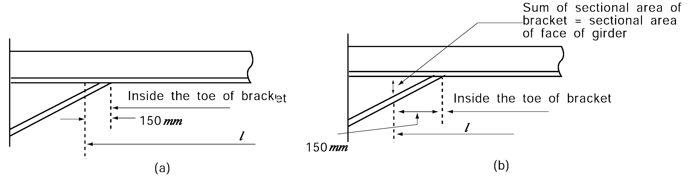

# PART 10 Hull Structure and Equipment of Small Steel Ships

> RULES FOR CLASSIFICATION OF STEEL SHIPS / RA-10-E / 2025 / EN / Guidance

## CHAPTER 2 STEMS AND STERN FRAMES

### Section 1 Stems

#### 101. Plate stems 【See Rule】

As specified in **Pt 3, Ch 2, 101.** of the Guidance.

### Section 2 Stern Frames

#### 202. Propeller posts 【See Rule】

- **1.** The welding of cast steel stern frames are to be in accordance with the **Pt 3, Ch 2, 202.** of the Guidance.
- **2.** The connection of cast steel boss and plate parts of built-up stern frame is to be in accordance with the **Pt 3, Ch 2, 203.** of the Guidance.

#### 203. Shoe pieces 【See Rule】

As specified in **Pt 3, Ch 2, 205.** of the Guidance.

#### 204. Heel pieces 【See Rule】

As specified in **Pt 3, Ch 2, 206.** of the Guidance. 
