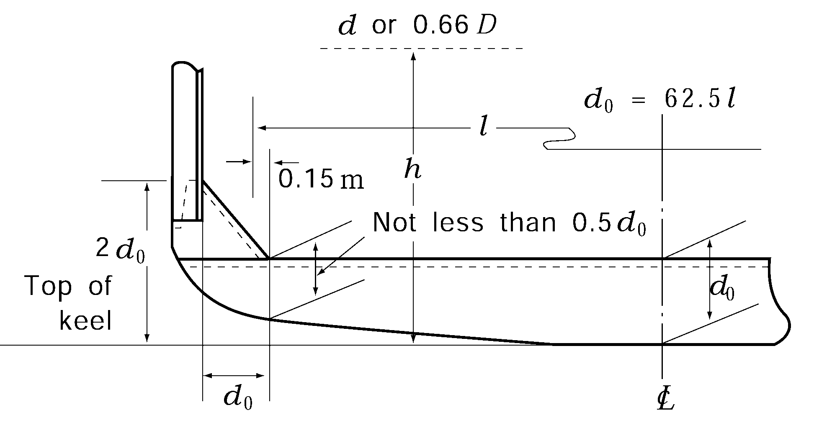

# PART 10 Hull Structure and Equipment of Small Steel Ships

> RULES FOR CLASSIFICATION OF STEEL SHIPS / RA-10-E / 2025 / EN / Guidance

## CHAPTER 11 DECK GIRDERS

### Section 1 General

#### 103. Construction 【See Rule】

As specified in **Pt 3, Ch 11, 103.** of the Guidance.

#### 104. End connection 【See Rule】

As specified in **Pt 3, Ch 11, 104.** of the Guidance.

### Section 2 Longitudinal Deck Girders

#### 201. Section modulus 【See Rule】

As specified in **Pt 3, Ch 11, 201.** of the Rules. 
