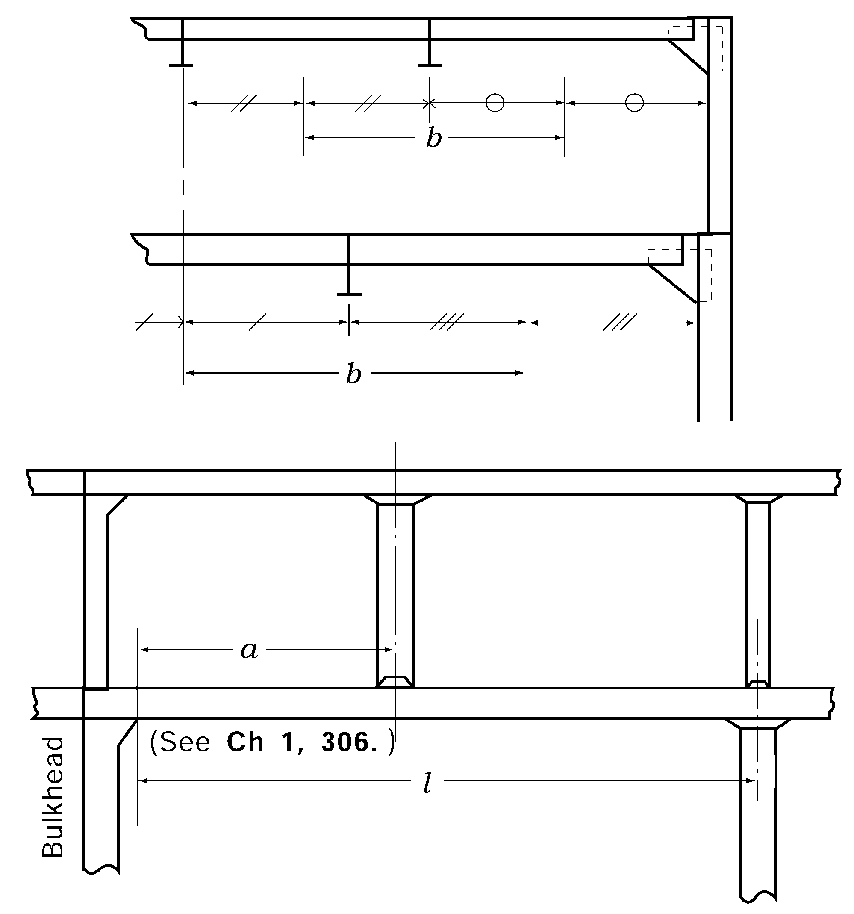

# PART 10 Hull Structure and Equipment of Small Steel Ships

> RULES FOR CLASSIFICATION OF STEEL SHIPS / RA-10-E / 2025 / EN / Guidance

## CHAPTER 19 HATCHWAYS AND OTHER DECK OPENINGS

### Section 1 General

#### 101. Application 【See Rule】

- **1.** Hatchways and other deck openings are to comply with **Pt 4, Ch 2** of the Guidance.
- **2.** For the ships classed for restricted service area, as specified in **Ch 1, 201.** of the Guidance. 
