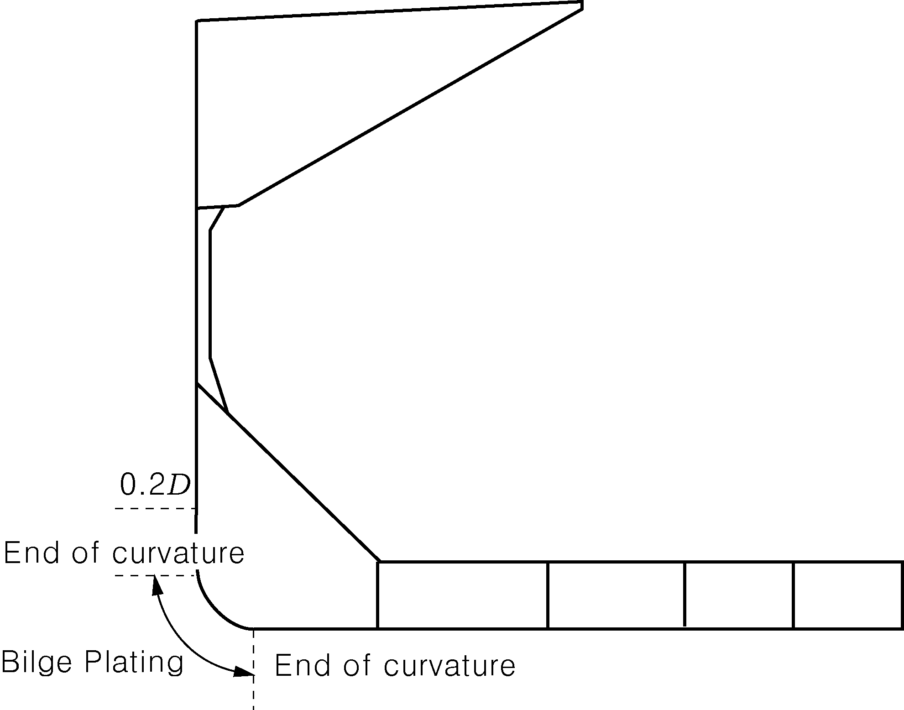
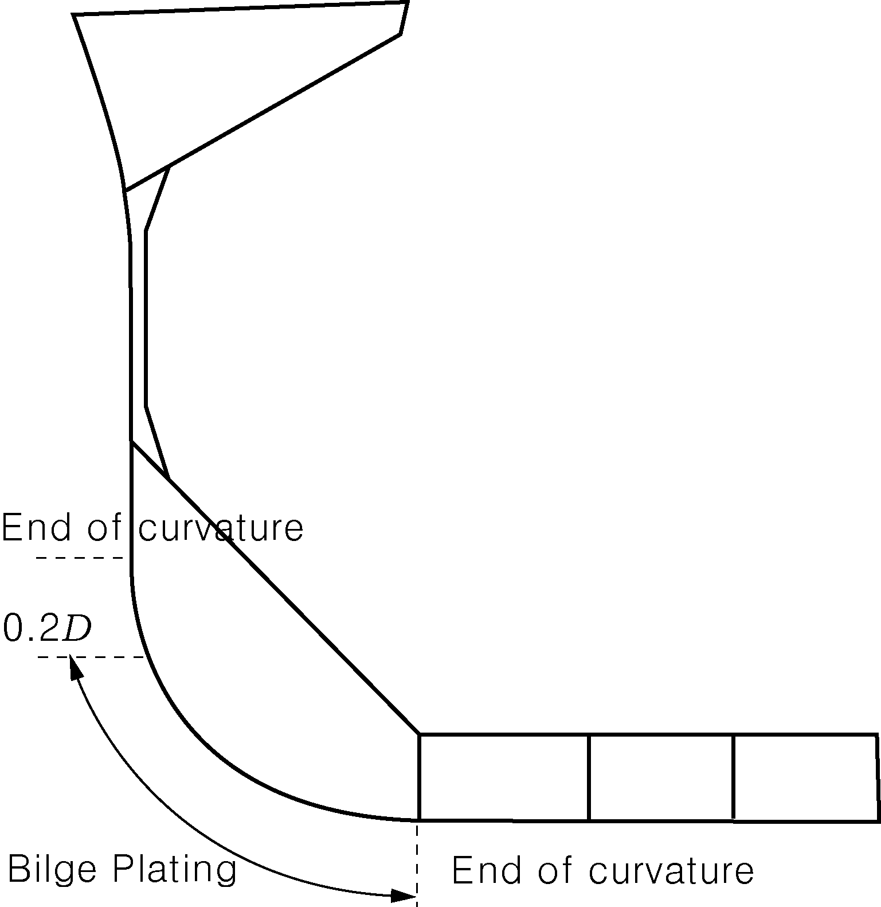

# PART 11 Common Structural Rules for Bulk Carriers

> RULES FOR CLASSIFICATION OF STEEL SHIPS / RA-11-E / 2025 / EN / Rules

## Chapter 1 General Principles

### Section 1 - APPLICATION

#### 1. General

- **1.1** Structural requirements
  - **1.1.1** These Rules apply to ships classed with the Society and contracted for construction on or after 1 April 2006.
    Note: The "contracted for construction" means the date on which the contract to build the ship is signed between the prospective owner and the shipbuilder. For further details regarding the date of "contracted for construction", refer to IACS Procedural Requirement (PR) No.29.
  - **1.1.2** These Rules apply to the hull structures of single side skin and double side skin bulk carriers with unrestricted worldwide navigation, having length *L* of 90 m or above.
    With bulk carrier is intended sea going self-propelled ships which are constructed generally with single deck, double bottom, hopper side tanks and topside tanks and with single or double side skin construction in cargo length area and intended primarily to carry dry cargoes in bulk, excluding ore and combination carriers.
    Hybrid bulk carriers, where at least one cargo hold is constructed with hopper tank and topside tank, are covered by the present Rules. The structural strength of members in holds constructed without hopper tank and/or topside tank is to comply with the strength criteria defined in the Rules.
  - **1.1.3** The present Rules contain the IACS requirements for hull scantlings, arrangements, welding, structural details, materials and equipment applicable to all types of bulk carriers having the following characteristics:
    • *L* < 350 m
    • *L* / *B* > 5
    • *B* / *D* < 2.5
    • *C_B* ≥ 0.6
  - **1.1.4** The Rule requirements apply to welded hull structures made of steel having characteristics complying with requirements in Ch 3, Sec 1. The requirements apply also to welded steel ships in which parts of the hull, such as superstructures or small hatch covers, are built in material other than steel, complying with requirements in Ch 3, Sec 1.
  - **1.1.5** Ships whose hull materials are different than those given in [1.1.4] and ships with novel features or unusual hull design are to be individually considered by the Society, on the basis of the principles and criteria adopted in the present Rules.
  - **1.1.6** The scantling draught considered when applying the present Rules is to be not less than that corresponding to the assigned freeboard.
  - **1.1.7** Where scantlings are obtained from direct calculation procedures which are different from those specified in Ch 7, adequate supporting documentation is to be submitted to the Society, as detailed in Sec 2.
- **1.2** Limits of application to lifting appliances
  - **1.2.1** The fixed parts of lifting appliances, considered as an integral part of the hull, are the structures permanently connected by welding to the ship’s hull (for instance crane pedestals, masts, king posts, derrick heel seatings, etc., excluding cranes, derrick booms, ropes, rigging accessories, and, generally, any dismountable parts), only for that part directly interacting with the hull structure. The shrouds of masts embedded in the ship’s structure are considered as fixed parts.
  - **1.2.2** The fixed parts of lifting appliances and their connections to the ship’s structure may be covered by the Society’s Rules for lifting appliances, and / or by the certification (especially the issuance of the Cargo Gear Register) of lifting appliances when required.
  - **1.2.3** The design of the structure supporting fixed lifting appliances and the structure that might be called to support a mobile appliance should be designed taking into account the additional loads that will be imposed on them by the operation of the appliance as declared by the shipbuilder or its sub-contractors.
- **1.3** Limits of application to welding procedures
  - **1.3.1** The requirements of the present Rules apply also for the preparation, execution and inspection of welded connections in hull structures. They are to be complemented by the general requirements relevant to fabrication by welding and qualification of welding procedures given by the Society when deemed appropriate by the Society.

#### 2. Rule application

- **2.1** Ship parts
  - **2.1.1** General
    For the purpose of application of the present Rules, the ship is considered as divided into the following three parts:
    • fore part
    • central part
    • aft part.
  - **2.1.2** Fore part
    The fore part includes the structures located forward of the collision bulkhead, i.e.:
    • the fore peak structures
    • the stem.
    In addition, it includes:
    • the reinforcements of the flat bottom forward area
    • the reinforcements of the bow flare area.
  - **2.1.3** Central part
    The central part includes the structures located between the collision bulkhead and the after peak bulkhead. Where the flat bottom forward area or the bow flare area extend aft of the collision bulkhead, they are considered as belonging to the fore part.
  - **2.1.4** Aft part
    The aft part includes the structures located aft of the after peak bulkhead.
- **2.2** Rules applicable to various ship parts
  - **2.2.1** The various chapters and sections are to be applied for the scantling of ship parts according to Table 1.

    | Part | Applicable Chapters and Sections |   |
    | --- | --- | --- |
    | Part | General | Specific |
    | Fore part | Ch 1 Ch 2 Ch 3 Ch 4 Ch 5 Ch 9(1), excluding: Ch 9, Sec 1 Ch 9, Sec 2 Ch 11 | Ch 9, Sec 1 |
    | Central part | Ch 1 Ch 2 Ch 3 Ch 4 Ch 5 Ch 9(1), excluding: Ch 9, Sec 1 Ch 9, Sec 2 Ch 11 | Ch 6 Ch 7 Ch 8 |
    | Aft part | Ch 1 Ch 2 Ch 3 Ch 4 Ch 5 Ch 9(1), excluding: Ch 9, Sec 1 Ch 9, Sec 2 Ch 11 | Ch 9, Sec 2 |
    | (1) See also [2.3]. |   |   |
- **2.3** Rules applicable to other ship items
  - **2.3.1** The various Chapters and Sections are to be applied for the scantling of other ship items according to Table 2.

    | Item | Applicable Chapters and Sections |
    | --- | --- |
    | Machinery spaces | Ch 9, Sec 3 |
    | Superstructures and deckhouses | Ch 9, Sec 4 |
    | Hatch covers | Ch 9, Sec 5 |
    | Hull and superstructure openings | Ch 9, Sec 6 |
    | Rudders | Ch 10, Sec 1 |
    | Bulwarks and guard rails | Ch 10, Sec 2 |
    | Equipment | Ch 10, Sec 3 |

#### 3. Class Notations

- **3.1** Additional service features BC-A, BC-B and BC-C
  - **3.1.1** The following requirements apply to ships, as defined in [1.1.2], having length *L* of 150 m or above.
  - **3.1.2** Bulk carriers are to be assigned one of the following additional service features:
    - **a)** BC-A : for bulk carriers designed to carry dry bulk cargoes of cargo density 1.0 $\mathrm{t}/m ^{3}$ and above with specified holds empty at maximum draught in addition to BC-B conditions.
    - **b)** BC-B : for bulk carriers designed to carry dry bulk cargoes of cargo density of 1.0 $\mathrm{t}/m ^{3}$ and above with all cargo holds loaded in addition to BC-C conditions.
    - **c)** BC-C : for bulk carriers designed to carry dry bulk cargoes of cargo density less than 1.0 $\mathrm{t}/m ^{3}$.
  - **3.1.3** The following additional service features are to be provided giving further detailed description of limitations to be observed during operation as a consequence of the design loading condition applied during the design in the following cases:
    • {maximum cargo density (in $\mathrm{t}/m ^{3}$)} for additional service features BC-A and BC-B if the maximum cargo density is less than 3.0 $\mathrm{t}/m ^{3}$(see also Ch 4, Sec 7, [2.1]).
    • {no MP} for all additional service features when the ship has not been designed for loading and unloading in multiple ports in accordance with the conditions specified in Ch 4, Sec 7, [3.3].
    • {allowed combination of specified empty holds} for additional service feature BC-A(see also Ch 4, Sec 7, [2.1]).
- **3.2** Additional class notation GRAB [X]
  - **3.2.1** Application
    The additional class notation GRAB [X] is mandatory for ships having one of the additional service features BC-A or BC-B, according to [3.1.2]. For these ships the requirements for the GRAB [X] notation given in Ch 12, Sec 1 are to be complied with for an unladen grab weight X equal to or greater than 20 tons.
    For all other ships the additional class notation GRAB [X] is voluntary.
- **3.3** Class notation CSR
  - **3.3.1** Application
    In addition to the class notations granted by the assigning Society and to the service features and additional class notations defined hereabove, ships fully complying with the present Rules will be assigned the notation CSR.

### Section 2 - VERIFICATION OF COMPLIANCE

#### 1. General

- **1.1** New buildings
  - **1.1.1** For new buildings, the plans and documents submitted for approval, as indicated in [2], are to comply with the applicable requirements in Ch 1 to Ch 12 of the present Rules, taking account of the relevant criteria, as the additional service features and classification notation assigned to the ship or the ship length.
  - **1.1.2** When a ship is surveyed by the Society during construction, the Society:
    • approves the plans and documentation submitted as required by the Rules
    • proceeds with the appraisal of the design of materials and equipment used in the construction of the ship and their inspection at works
    • carries out surveys or obtains appropriate evidence to satisfy itself that the scantlings and construction meet the rule requirements in relation to the approved drawings
    • attends tests and trials provided for in the Rules
    • assigns the construction mark.
  - **1.1.3** The Society defines in specific Rules which materials and equipment used for the construction of ships built under survey are, as a rule, subject to appraisal of their design and to inspection at works, and according to which particulars.
  - **1.1.4** As part of his interventions during the ship's construction, the Surveyor will:
    • conduct an overall examination of the parts of the ship covered by the Rules
    • examine the construction methods and procedures when required by the Rules
    • check selected items covered by the rule requirements
    • attend tests and trials where applicable and deemed necessary.
- **1.2** Ships in service
  - **1.2.1** For ships in service, the requirements in Ch 13 of the present Rules are to be complied with.

#### 2. Documentation to be submitted

- **2.1** Ships surveyed by the Society during the construction
  - **2.1.1** Plans and documents to be submitted for approval
    The plans and documents to be submitted to the Society for approval are listed in Table 1. In addition, the Society may request for approval or information, other plans and documents deemed necessary for the review of the design.
    Structural plans are to show details of connections of the various parts and are to specify the design materials, including, in general, their manufacturing processes, welding procedures and heat treatments. See also Ch 11, Sec 2, [1.4].
  - **2.1.2** Plans and documents to be submitted for information
    In addition to those in [2.1.1], the following plans and documents are to be submitted to the Society for information:
    • general arrangement
    • capacity plan, indicating the volume and position of the centre of gravity of all compartments and tanks
    • lines plan
    • hydrostatic curves
    • lightweight distribution
    • docking plan.
    In addition, when direct calculation analyses are carried out by the Designer according to the rule requirements, they are to be submitted to the Society (see [3]).
- **2.2** Ships for which the Society acts on behalf of the relevant Administration
  - **2.2.1** Plans and documents to be submitted for approval
    The plans required by the National Regulations concerned are to be submitted to the Society for approval, in addition to those in [2.1].

    | Plan or document | Containing also in formation on |
    | --- | --- |
    | Midship section Transverse sections Shell expansion Decks and profiles Double bottom Pillar arrangements Framing plan Deep tank and ballast tank bulkheads, wash bulkheads | Class characteristics Main dimensions Minimum ballast draught Frame spacing Contractual service speed Density of cargoes Design loads on decks and double bottom Steel grades Corrosion protection Openings in decks and shell and relevant compensations Boundaries of flat areas in bottom and sides Details of structural reinforcements and/or discontinuities Bilge keel with details of connections to hull structures |
    | Watertight subdivision bulkheads Watertight tunnels | Openings and their closing appliances, if any |
    | Fore part structure |   |
    | Aft part structure |   |
    | Machinery space structures Foundations of propulsion machinery and boilers | Type, power and rpm of propulsion machinery Mass and centre of gravity of machinery and boilers |
    | Superstructures and deckhouses Machinery space casing | Extension and mechanical properties of the aluminium alloy used (where applicable) |
    | Hatch covers and hatch coamings | Design loads on hatch covers Sealing and securing arrangements, type and position of locking bolts Distance of hatch covers from the summer load waterline and from the fore end |
    | Transverse thruster, if any, general arrangement, tunnel structure, connections of thruster with tunnel and hull structures |   |
    | Bulwarks and freeing ports | Arrangement and dimensions of bulwarks and freeing ports on the freeboard deck and superstructure deck |
    | Windows and side scuttles, arrangements and details |   |
    | Scuppers and sanitary discharges |   |
    | Rudder and rudder horn(1) | Maximum ahead service speed |
    | Sternframe or sternpost, sterntube Propeller shaft boss and brackets(1) |   |
    | Plan of watertight doors and scheme of relevant manoeuvring devices | Manoeuvring devices Electrical diagrams of power control and position indication circuits |
    | Plan of outer doors and hatchways |   |
    | Derricks and cargo gear Cargo lift structures | Design loads (forces and moments) Connections to the hull structures |
    | Sea chests, stabiliser recesses, etc. |   |
    | Hawse pipes |   |
    | Plan of manholes |   |
    | Plan of access to and escape from spaces |   |
    | Plan of ventilation | Use of spaces and location and height of air vent outlets of various compartments |
    | Plan of tank testing | Testing procedures for the various compartments Height of pipes for testing |
    | Loading manual and loading instruments | Loading conditions as defined in Ch 4, Sec 7 (see also Ch 4, Sec 8) |
    | Equipment number calculation | Geometrical elements for calculation List of equipment Construction and breaking load of steel wires Material, construction, breaking load and relevant elongation of synthetic ropes |
    | (1) Where other steering or propulsion systems are adopted (e.g. steering nozzles or azimuth propulsion systems), the plans showing the relevant arrangement and structural scantlings are to be submitted. For azimuth propulsion systems, see Ch 10, Sec 1, [11]. |   |

#### 3. Computer programs

- **3.1** General
  - **3.1.1** In order to increase the flexibility in the structural design direct calculations with computer programs are acceptable (see Ch 7). The aim of such analyses is to assess the structure compliance with the rule requirements.
- **3.2** General programs
  - **3.2.1** The choice of computer programs according to currently available technology is free. The programs are to be able to manage the model and load cases as required in Ch 7 and/or Ch 8. The programs may be checked by the Society through comparative calculations with predefined test examples. A generally valid approval for a computer program is, however, not given by the Society.
  - **3.2.2** Direct calculations may be used in the following fields:
    • global strength
    • longitudinal strength
    • beams and grillages
    • detailed strength.
  - **3.2.3** For such calculation the computer model, the boundary condition and load cases are to be agreed upon with the Society.
    The calculation documents are to be submitted including input and output. During the examination it may prove necessary that the Society performs independent comparative calculations.

### Section 3 - FUNCTIONAL REQUIREMENTS

#### 1. General

- **1.1** Application
  - **1.1.1** This section defines the set of requirements relevant to the functions of the ship structures to be complied with during design and construction, to meet the following objectives.
- **1.2** Design life
  - **1.2.1** The ship is to remain safe and environment-friendly, if properly operated and maintained, for her expected design life, which, unless otherwise specifically stated, is assumed to be equal to 25 years. The actual ship life may be longer or shorter than the design life, depending on the actual conditions and maintenance of the ship, taking into account aging effects, in particular fatigue, coating deterioration, corrosion, wear and tear.
- **1.3** Environmental conditions
  - **1.3.1** The ship’s structural design is to be based on the assumption of trading in the North Atlantic environment for the entire design life. Hence the respective wave conditions, i.e. the statistical wave scatter takes into account the basic principle for structural strength layout.
- **1.4** Structural safety
  - **1.4.1** The ship is to be designed and constructed, and subsequently operated and maintained by its builders and operators, to minimise the risk for the safety of life at sea and the pollution of the marine environment as the consequence of the total loss of the ship due to structural collapse and subsequent flooding, loss of watertight integrity.
- **1.5** Structural accessibility
  - **1.5.1** The ship is to be designed and constructed to provide adequate means of access to all spaces and internal structures to enable overall and close-up inspections and thickness measurements.
- **1.6** Quality of construction
  - **1.6.1** As an objective, ships are to be built in accordance with controlled quality production standards using approved materials as necessary.

#### 2. Definition of functional requirements

- **2.1** General
  - **2.1.1** The functional requirements relevant to the ship structure are indicated in [2.2] to [2.6].
  - **2.2.1** Ships are to be designed to withstand, in the intact condition, the environmental conditions during the design life, for the appropriate loading conditions. Structural strength is to be determined against buckling and yielding. Ultimate strength calculations have to include ultimate hull girder capacity and ultimate strength of plates and stiffeners.
  - **2.2.2** Ships are to be designed to have sufficient reserve strength to withstand the wave and internal loads in damaged conditions that are reasonably foreseeable, e.g. collision, grounding or flooding scenarios. Residual strength calculations are to take into account the ultimate reserve capacity of the hull girder, considering permanent deformation and post-buckling behaviour.
  - **2.2.3** Ships are to be assessed according to the expected design fatigue life for representative structural details.
- **2.3** Coating
  - **2.3.1** Coating, where required, is to be selected as a function of the declared use of the ship spaces, e.g. holds, tanks, cofferdams, etc., materials and application of other corrosion prevention systems, e.g. cathodic protection or other alternative means. The protective coating systems, applied and maintained in accordance with manufacturer’s specifications concerning steel preparation, coating selection, application and maintenance, are to comply with the SOLAS requirements, the flag administration requirements and the Owner specifications.
- **2.4** Corrosion addition
  - **2.4.1** The corrosion addition to be added to the net scantling required by structural strength calculations is to be adequate for the operating life. The corrosion addition is to be assigned in accordance with the use and exposure of internal and external structure to corrosive agents, such as water, cargo or corrosive atmosphere, in addition to the corrosion prevention systems, e.g. coating, cathodic protection or by alternative means.
- **2.5** Means of access
  - **2.5.1** Ship structures subject to overall and close-up inspection and thickness measurements are to be provided with means capable of ensuring safe access to the structures. The means of access are to be described in a Ship Structure Access Manual for bulk carriers of 20,000 gross tonnage and over. Reference is made to SOLAS, Chapter II-1, Regulation 3-6.
- **2.6** Construction quality procedures
  - **2.6.1** Specifications for material manufacturing, assembling, joining and welding procedures, steel surface preparation and coating are to be included in the ship construction quality procedures.

#### 3. Other regulations

- **3.1** International regulations
  - **3.1.1** Attention of designers, shipbuilders and shipowners of ships covered by these Rules is drawn on the following :
    Ships are designed, constructed and operated in a complex regulatory framework prescribed internationally by IMO and implemented by flag states or by classification societies on their behalf. Statutory requirements set the standard for statutory aspects of ships such as life saving, subdivisions, stability, fire protection, etc.
    These requirements influence the operational and cargo carrying arrangements of the ship and therefore may affect its structural design.
    The main international instruments normally to be applied with regard to the strength of bulk carriers are:
    • International Convention for Safety of Life at Sea (SOLAS)
    • International Convention on Load Lines
- **3.2** National regulations
  - **3.2.1** Attention is drawn on the applicable national flag state regulations.
    Compliance with these regulations of national administrations is not conditional for class assignment.

#### 4. Workmanship

- **4.1** Requirements to be complied with by the manufacturer
  - **4.1.1** The manufacturing plant is to be provided with suitable equipment and facilities to enable proper handling of the materials, manufacturing processes, structural components, etc.
    The manufacturing plant is to have at its disposal sufficiently qualified personnel. The Society is to be advised of the names and areas of responsibility of the supervisory and control personnel in charge of the project.
- **4.2** Quality control
  - **4.2.1** As far as required and expedient, the manufacturer's personnel has to examine all structural components both during manufacture and on completion, to ensure that they are complete, that the dimensions are correct and that workmanship is satisfactory and meets the standard of good shipbuilding practice.
    Upon inspection and corrections by the manufacturing plant, the structural components are to be shown to the surveyor of the Society for inspection, in suitable sections, normally in unpainted condition and enabling proper access for inspection.
    The Surveyor may reject components that have not been adequately checked by the plant and may demand their re-submission upon successful completion of such checks and corrections by the plant.

#### 5. Structural Details

- **5.1** Details in manufacturing documents
  - **5.1.1** Significant details concerning quality and functional ability of the component concerned are to be entered in the manufacturing documents (workshop drawings, etc.). This includes not only scantlings but *‑* where relevant *-* such items as surface conditions (e.g. finishing of flame cut edges and weld seams), and special methods of manufacture involved as well as inspection and acceptance requirements and where relevant permissible tolerances. So far as for this aim a standard is used (works or national standard etc.) it is to be submitted to the Society. For weld joint details, see Ch 11, Sec 2.
    If, due to missing or insufficient details in the manufacturing documents, the quality or functional ability of the component is doubtful, the Society may require appropriate improvements to be submitted by the manufacturer. This includes the provision of supplementary or additional parts (for example reinforcements) even if these were not required at the time of plan approval.

### Section 4 - SYMBOLS AND DEFINITIONS

#### 1. Primary symbols and units

- **1.1**
  - **1.1.1** Unless otherwise specified, the general symbols and their units used in the present Rules are those defined in Table 1.
    Table 1: Primary symbols

    | Symbol | Meaning | Units |
    | --- | --- | --- |
    | *A* | Area | $\mathrm{m}^{ 2}$ |
    | *A* | Sectional area of ordinary stiffeners and primary members | $\mathrm{cm} ^{2}$ |
    | *B* | Moulded breadth of ship (see [2]) | m |
    | *C* | Coefficient | - |
    | *D* | Depth of ship (see [2]) | m |
    | *E* | Young’s modulus | $\mathrm{N}/mm ^{2}$ |
    | *F* | Force and concentrated loads | kN |
    | *I* | Hull girder inertia | $\mathrm{m} ^{4}$ |
    | *I* | Inertia of ordinary stiffeners and primary members | $\mathrm{cm} ^{4}$ |
    | *L* | Length of ship (see [2]) | m |
    | *M* | Bending moment | kN.m |
    | *Q* | Shear force | kN |
    | *S* | Spacing of primary supporting members |   |
    | *T* | Draught of ship (see [2]) | m |
    | *V* | Ship’s speed | knot |
    | *Z* | Hull girder section modulus | $\mathrm{m} ^{3}$ |
    | *a* | Acceleration | $\mathrm{m}/s ^{2}$ |
    | *b* | Width of attached plating | m |
    | *b* | Width of face plate of ordinary stiffeners and primary members | mm |
    | *g* | Gravity acceleration (see [2]) | $\mathrm{m}/s ^{2}$ |
    | *h* | Height | m |
    | *h* | Web height of ordinary stiffeners and primary members | mm |
    | *k* | Material factor (see [2]) | - |
    | $\ell$ | Length / Span of ordinary stiffeners and primary supporting members | m |
    | *m* | Mass | t |
    | *n* | Number of items | - |
    | *p* | Pressure | $\mathrm{kN}/m ^{ 2}$ |
    | *r* | Radius | mm |
    | *r* | Radius of curvature of plating or bilge radius | m |
    | *s* | Spacing of ordinary stiffeners | m |
    | *t* | Thickness | mm |
    | *w* | Section modulus of ordinary stiffeners and primary supporting members | $\mathrm{cm} ^{3}$ |
    | *x* | X coordinate along longitudinal axis (see [4]) | m |
    | *y* | Y coordinate along transverse axis (see [4]) | m |
    | *z* | Z coordinate along vertical axis (see [4]) | m |
    | $\gamma$ | Safety factor | - |
    | $\delta$ | Deflection / Displacement | mm |
    | $\theta$ | Angle | deg |
    | $\xi$ | Weibull shape parameter | - |
    | $\rho$ | Density | $\mathrm{t}/m ^{3}$ |
    | $\sigma$ | Bending stress | $\mathrm{N}/mm ^{2}$ |
    | $\tau$ | Shear stress | $\mathrm{N}/mm ^{2}$ |

#### 2. Symbols

- **2.1** Ship’s main data
  - **2.1.1** *L* : Rule length, in m, defined in [3.1]
    *L_LL* : Freeboard length, in m, defined in [3.2]
    *L_BP* : Length between perpendiculars, in m, is the length of the ship measured between perpendiculars taken at the extremities of the deepest subdivision load line, i.e. of the waterline which corresponds to the greatest draught permitted by the subdivision requirements which are applicable
    *FP_LL* : Forward freeboard perpendicular. The forward freeboard perpendicular is to be taken at the forward end of the length *L_LL* and is to coincide with the foreside of the stem on the waterline on which the length *L_LL* is measured
    *AP_LL* : After freeboard perpendicular. The after freeboard perpendicular is to be taken at the aft end of the length *L_LL*.
    *B* : Moulded breadth, in m, defined in [3.4]
    *D* : Depth, in m, defined in [3.5]
    *T* : Moulded draught, in m, defined in [3.6]
    *T_S* : Scantling draught, in m, taken equal to the maximum draught (see also Ch 1, Sec 1, [1.1.6])
    *T_B* : Minimum ballast draught at midship, in m, in normal ballast condition as defined in Ch 4, Sec 7, [2.2.1]
    *T_LC* : Midship draught, in m, in the considered loading condition
    *D* : Moulded displacement, in tonnes, at draught *T*, in sea water (density *r* = 1.025 $\mathrm{t}/m ^{3}$)
    *C_B* : Total block coefficient
    $C _{B} = \frac{\Delta }{1.025LBT}$
    *V* : Maximum ahead service speed, in knots, means the greatest speed which the ship is designed to maintain in service at her deepest seagoing draught at the maximum propeller RPM and corresponding engine MCR (Maximum Continuous Rating).
    *x, y, z* : *X*, *Y* and *Z* co-ordinates, in m, of the calculation point with respect to the reference co-ordinate system.
- **2.2** Materials
  - **2.2.1** *E* : Young’s modulus, in N/mm^2,tobetakenequalto:
    $E =2.06 \times 10 ^{5} \mathrm{N}/mm ^{2}$, for steels in general
    $E =1.95 \times 10 ^{5} \mathrm{N}/mm ^{2}$, for stainless steels
    $E =7.0 \times 10 ^{4} \mathrm{N}/mm ^{2}$, for aluminium alloys
    *R_eH* : Minimum yield stress, in $\mathrm{N}/mm ^{2}$,of the material
    *k* : Material factor, defined in Ch 3, Sec 1, [2.2]
    *ν* : Poisson’s ratio. Unless otherwise specified, a value of 0.3 is to be taken into account,
    *R_m* : Ultimate minimum tensile strength, in $\mathrm{N}/mm ^{2}$,of the material
    *R_Y* : Nominal yield stress, in $\mathrm{N}/mm ^{2}$, of the material, to be taken equal to $\frac{235}{k it} \mathrm{N}/mm ^{2}$, unless otherwise specified.
- **2.3** Loads
  - **2.3.1** *g* : Gravity acceleration, taken equal to 9.81 $\mathrm{m}/s ^{2}$
    *r* : Sea water density, taken equal to 1.025 $\mathrm{t}/m ^{3}$
    *r_L* : Density, in $\mathrm{t}/m ^{3}$, of the liquid carried
    *r_C* : Density, in $\mathrm{t}/m ^{3}$, of the dry bulk cargo carried
    *C* : Wave parameter, taken equal to:
    $C = 10.75- \left( \frac{300-L}{100} \right) ^{1.5}$ for 90 ≤ *L* < 300 m
    $C = 10.75$ for 300 ≤ *L* < 350 m
    *h* : Height, in m, of a tank, to be taken as the vertical distance from the bottom to the top of the tank, excluding any small hatchways
    *z_TOP* : Vertical distance, in m, of the highest point of the tank from the baseline. For ballast holds, *z_TOP* is the vertical distance, in m, of the top of the hatch coaming from the baseline
    l*_H* : Length, in m, of the compartment
    *M_SW* : Design still water bending moment, in kN.m, at the hull transverse section considered:
    *M_SW* = *M_SW*_,*_H* in hogging conditions
    *M_SW* = *M_SW*_,*_S* in sagging conditions
    *M_WV* : Vertical wave bending moment, in kN.m, at the hull transverse section considered:
    *M_WV* = *M_WV*_,*_H* in hogging conditions
    *M_WV* = *M_WV*_,*_S* in sagging conditions
    *M_WH* : Horizontal wave bending moment, in kN.m, at the hull transverse section considered,
    *Q_SW* : Design still water shear force, in kN, at the hull transverse section considered
    *Q_WV* : Vertical wave shear force, in kN, at the hull transverse section considered
    *p_S* : Still water pressure, in $\mathrm{kN}/m ^{ 2}$
    *p_W* : Wave pressure or dynamic pressures, in $\mathrm{kN}/m ^{ 2}$
    *p_SF, p_WF* : Still water and wave pressure, in $\mathrm{kN}/m ^{ 2}$, in flooded conditions
    *s_X* : Hull girder normal stress, in $\mathrm{N}/mm ^{2}$
    *a_X, a_Y, a_Z* : Accelerations, in $\mathrm{m}/s ^{2}$, along *X*, *Y* and *Z* directions, respectively
    *T_R* : Roll period, in s
    *q* : Roll single amplitude, in deg
    *T_P* : Pitch period, in s
    *F* : Single pitch amplitude, in deg
    *k_r* : Roll radius of gyration, in m
    *GM* : Metacentric height, in m
    *l* : Wave length, in m
- **2.4** Scantlings
  - **2.4.1** Hull girder scantlings
    *I_Y* : Moment of inertia, in $\mathrm{m} ^{4}$, of the hull transverse section about its horizontal neutral axis
    *I_Z* : Moment of inertia, in $\mathrm{m} ^{4}$, of the hull transverse section about its vertical neutral axis
    *Z_AB, Z_AD* : Section moduli, in $\mathrm{m} ^{3}$, at bottom and deck, respectively
    *N* : Vertical distance, in m, from the base line to the horizontal neutral axis of the hull transverse section
  - **2.4.2** Local scantlings
    *s* : Spacing, in m, of ordinary stiffeners, measured at mid-span along the chord
    *S* : Spacing, in m, of primary supporting members, measured at mid-span along the chord
    $\ell$ : Span, in m, of ordinary stiffener or primary supporting member, as the case may be, measured along the chord
    $\ell _{b}$ : Length, in m, of brackets
    *t_C* : Corrosion addition, in mm
    *h_w* : Web height, in mm, of ordinary stiffener or primary supporting member, as the case may be
    *t_w* : Net web thickness, in mm, of ordinary stiffener or primary supporting member, as the case may be
    *b_f* : Face plate width, in mm, of ordinary stiffener or primary supporting member, as the case may be
    *t_f* : Net face plate thickness, in mm, of ordinary stiffener or primary supporting member, as the case may be
    *t_p* : Net thickness, in mm, of the plating attached to an ordinary stiffener or a primary supporting member, as the case may be
    *b_p* : Width, in m, of the plating attached to the stiffener or the primary supporting member, for the yielding check
    *A_s* : Net sectional area, in $\mathrm{cm} ^{2}$, of the stiffener or the primary supporting member, with attached plating of width *s*
    *A_sh* : Net shear sectional area, in $\mathrm{cm} ^{2}$, of the stiffener or the primary supporting member
    *I* : Net moment of inertia, in $\mathrm{cm} ^{4}$, of ordinary stiffener or primary supporting member, as the case may be, without attached plating, around its neutral axis parallel to the plating
    *I_p* : Net polar moment of inertia, in $\mathrm{cm} ^{4}$, of ordinary stiffener or primary supporting member, as the case may be, about its connection to plating
    *I_w* : Net sectional moment of inertia, in $\mathrm{cm} ^{6}$, of ordinary stiffener or primary supporting member, as the case may be, about its connection to plating
    *I_S* : Net moment of inertia, in $\mathrm{cm} ^{4}$, of the stiffener or the primary supporting member, with attached shell plating of width *s*, about its neutral axis parallel to the plating
    *Z* : Net section modulus, in $\mathrm{cm} ^{3}$, of an ordinary stiffener or a primary supporting member, as the case may be, with attached plating of width *b_p*

#### 3. Definitions

- **3.1** Rule length
  - **3.1.1** The rule length *L* is the distance, in m, measured on the summer load waterline, from the forward side of the stem to the after side of the rudder post, or to the centre of the rudder stock where there is no rudder post. *L* is to be not less than 96 % and need not exceed 97 % of the extreme length on the summer load waterline.
  - **3.1.2** In ships without rudder stock (e.g. ships fitted with azimuth thrusters), the rule length *L* is to be taken equal to 97 % of the extreme length on the summer load waterline.
  - **3.1.3** In ships with unusual stem or stern arrangements, the rule length *L* is considered on a case by case basis.
- **3.2** Freeboard length
  - **3.2.1** *Ref. ILLC, as amended (Resolution MSC.143(77) Reg. 3(1,a))*
    *The freeboard length* $L _{LL}$ *is the distance, in m, on the waterline at 85 % of the least moulded depth from the top of the keel, measured from the forward side of the stem to the centre of the rudder stock.* $L _{LL}$ *is to be not less than 96 % of the extreme length on the same waterline.*
  - **3.2.2** *Ref. ILLC, as amended (Resolution MSC.143(77) Reg. 3(1,c))*
    *Where the stem contour is concave above the water-line at 85 % of the least moulded depth, both the forward end of the extreme length and the forward side of the stem are to be taken at the vertical projection to that waterline of the aftermost point of the stem contour (above that waterline) (see* *Fig 1).*
    
    Fig 1: Concave stem contour
- **3.3** Ends of rule length *L*andmidship
  - **3.3.1** Fore end
    The fore end (FE) of the rule length *L*, see Fig 2, is the perpendicular to the summer load waterline at the forward side of the stem.
    
    Fig 2: Ends and midship
    The aft end (AE) of the rule length *L*, see Fig 2, is the perpendicular to the waterline at a distance *L* aft of the fore end.
  - **3.3.2** Midship
    The midship is the perpendicular to the waterline at a distance 0.5 *L* aft of the fore end.
  - **3.3.3** Midship part
    The midship part of a ship is the part extending 0.4 *L* amidships, unless other wise specified.
- **3.4** Moulded breadth
  - **3.4.1** The moulded breadth *B* is the greatest moulded breadth, in m, measured amidships below the weather deck.
- **3.5** Depth (The least moulded depth)
  - **3.5.1** The depth *D* is the distance, in m, measured vertically on the midship transverse section, from the moulded base line to the top of the deck beam at side on the upper-most continuous deck.
- **3.6** Moulded draught
  - **3.6.1** The moulded draught *T* is the distance, in m, measured vertically on the midship transverse section, from the moulded base line to the summer load line.
- **3.7** Lightweight
  - **3.7.1** The lightweight is the displacement, in t, without cargo, fuel, lubricating oil, ballast water, fresh water and feed water, consumable stores and passengers and crew and their effects.
- **3.8** Deadweight
  - **3.8.1** The deadweight is the difference, in t, between the displacement, at the summer draught in sea water of density $\rho = 1.025 \mathrm{t}/m ^{3}$, and the lightweight.
- **3.9** Freeboard deck
  - **3.9.1** *Ref. ILLC, as amended (Resolution MSC. 143(77) Reg. 3(9))*
    *The freeboard deck is defined in Regulation 3 of the International Load Line Convention, as amended.*
- **3.10** Bulkhead deck

#### 3.10.1

*Ref. SOLAS Reg.II-1/2.5*
*The bulkhead deck is the uppermost deck to which the transverse watertight bulkheads, except both peak bulkheads, extend and are made effective.*

- **3.11** Strength deck

#### 3.11.1

The strength deck at a part of ship’s length is the uppermost continuous deck at that part to which the shell plates extend.

- **3.12** Superstructure

#### 3.12.1

General
*Ref. ILLC. As amended (Resolution MSC.143(77) Reg. 3(10,a))*
*A superstructure is a decked structure on the free-board deck, extending from side to side of the ship or with the side plating not being inboard of the shell plating more than 0.04 B.*

#### 3.12.2

Enclosed and open superstructure
A superstructure may be:
• enclosed, where:
(1) it is enclosed by front, side and aft bulkheads complying with the requirements of Ch 9, Sec 4
(2) all front, side and aft openings are fitted with efficient weathertight means of closing
• open, where it is not enclosed.

- **3.13** Forecastle

#### 3.13.1

*Ref. ILLC, as amended (Resolution MSC.143(77) Reg. 3(10,g))*
*A forecastle is a superstructure which extends from the forward perpendicular aft to a point which is forward of the after perpendicular. The forecastle may originate from a point forward of the forward perpendicular.*

- **3.14** Raised quarterdeck

#### 3.14.1

*Ref. ILLC, as amended (Resolution MSC.143(77) Reg. 3(10,i))*
*A raised quarterdeck is a superstructure which extends forward from the after perpendicular, generally has a height less than a normal superstructure, and has an intact front bulkhead (sidescuttles of the non-opening type fitted with efficient deadlights and bolted man hole covers)(see* *Fig 3). Where the forward bulkhead is not intact due to doors and access openings, the superstructure is then to be considered as a poop.*

Fig 3: Raised quarter deck

- **3.15** Deckhouse

#### 3.15.1

A deckhouse is a decked structure other than a superstructure, located on the freeboard deck or above.

- **3.16** Trunk

#### 3.16.1

A trunk is a decked structure similar to a deckhouse, but not provided with a lower deck.

- **3.17** Wash bulkhead

#### 3.17.1

A wash bulkhead is a perforated or partial bulkhead in a tank.

- **3.18** Standard height of superstructure

#### 3.18.1

*Ref. ILLC, as amended (Resolution MSC.143(77) Reg. 33)*
*The standard height of superstructure is defined in* *Table 2.*

| Freeboard length $L_{ LL}$, in m | Standard height $h_{ S}$ , in m |   |
| --- | --- | --- |
| Freeboard length $L_{ LL}$, in m | Raised quarter deck | All other superstructures |
| 90 < $L_{ LL}$ < 125 | 0.3 + 0.012 $L_{ LL}$ | 1.05 + 0.01 $L_{ LL}$ |
| $L_{ LL}$ ≥ 125 | 1.80 | 2.30 |

- **3.19** Type A and Type B ships

#### 3.19.1

Type A ship
*Ref. ILLC, as amended (Resolution MSC.143(77) Reg. 27.1)*
*A Type A ship is one which:*
*• is designed to carry only liquid cargoes in bulk;*
*• has a high integrity of the exposed deck with only small access openings to cargo compartments, closed by watertight gasketed covers of steel or equivalent material*
*• has low permeability of loaded cargo compartments.*
*A Type A ship is to be assigned a freeboard following the requirements reported in the International Load Line Convention 1966, as amended.*

#### 3.19.2

Type B ship
*Ref. ILLC, as amended (Resolution MSC.143(77) Reg. 27.5)*
*All ships which do not come within the provisions regarding Type A ships stated in* *[3.19.1]* *are to be considered as Type B ships.*
*A Type B ship is to be assigned a freeboard following the requirements reported in the International Load Line Convention 1966, as amended.*

#### 3.19.3

Type B-60 ship
*Ref. ILLC, as amended (Resolution MSC.143(77) Reg. 27.9)*
*A Type B-60 ship is any Type B ship of over 100 metres in length which, according to applicable requirements of in the International Load Line Convention 1966, as amended, is assigned with a value of tabular freeboard which can be reduced up to 60 per cent of the difference between the “B” and “A” tabular values for the appropriate ship lengths.*

#### 3.19.4

Type B-100 ship
*Ref. ILLC, as amended (Resolution MSC.143(77) Reg. 27.10)*
*A Type B-100 ship is any Type B ship of over 100 metres in length which, according to applicable requirements of in the International Load Line Convention 1966, as amended, is assigned with a value of tabular freeboard which can be reduced up to 100 per cent of the difference between the “B” and “A” tabular values for the appropriate ship lengths.*

- **3.20** Positions 1 and 2

#### 3.20.1

Position 1
*Ref. ILLC, as amended (Resolution MSC.143(77) Reg. 13)*
*Position 1 includes:*
*• exposed freeboard and raised quarter decks,*
*• exposed superstructure decks situated forward of 0.25* $L_{ LL}$ *from the perpendicular, at the forward side of the stem, to the waterline at 85 % of the least moulded depth measured from the top of the keel.*

#### 3.20.2

Position 2
*Ref. ILLC, as amended (Resolution MSC.143(77) Reg. 13)*
*Position 2 includes:*
*• exposed superstructure decks situated aft of 0.25* $L_{ LL}$ *from the perpendicular, at the forward side of the stem, to the waterline at 85 % of the least moulded depth measured from the top of the keel and located at least one standard height of superstructure above the freeboard deck,*
*• exposed superstructure decks situated forward of 0.25* $L_{ LL}$ *from the perpendicular, at the forward side of the stem, to the waterline at 85 % of the least moulded depth measured from the top of the keel and located at least two standard heights of superstructure above the freeboard deck.*

- **3.21** Single Side Skin and Double Side Skin construction

#### 3.21.1

Single side skin construction
A hold of single side skin construction is bounded by the side shell between the inner bottom plating or the hopper tank plating when fitted, and the deck plating or the topside tank plating when fitted.

#### 3.21.2

Double side skin construction
A hold of double side skin construction is bounded by a double side skin, including hopper tank and topside tank when fitted.

- **3.22** Bilge

#### 3.22.1

Bilge plating
The bilge plating is the curved plating between the bottom shell and side shell. It is to be taken as follows:
• within the cylindrical part of the ship (see **Fig.4**): from the start of the curvature at the lower turn of bilge on the bottom to the end of the curvature at the upper turn of the bilge,
• outside the cylindrical part of the ship (see **Fig.5**):From the start of the curvature at the lower turn of the bilge on the bottom to the lesser of:
• a point on the side shell located 0.2D above the baseline/local centreline elevation.
• the end of the curvature at the upper turn of the bilge.

Fig 4: Vertical extent of bilge plating within the cylindrical part of the hull

Fig 5: Vertical extent of bilge plating outside the cylindrical part of the hull

#### 4. Reference co-ordinate system

- **4.1**
  - **4.1.1** The ship’s geometry, motions, accelerations and loads are defined with respect to the following right-hand co-ordinate system (see Fig 6):
    • Origin: at the intersection among the longitudinal plane of symmetry of ship, the aft end of *L* and the baseline
    • X axis: longitudinal axis, positive forwards
    • Y axis: transverse axis, positive towards portside
    • Z axis: vertical axis, positive upwards.
    
    Fig 6: Reference co-ordinate system
  - **4.1.2** Positive rotations are oriented in anti-clockwise direction about the X, Y and Z axes. 
