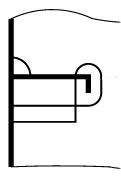

# PART 11 Common Structural Rules for Bulk Carriers

> RULES FOR CLASSIFICATION OF STEEL SHIPS / RA-11-E / 2025 / EN / Rules

## Chapter 3 Structural Design Principles

### Section 1 - MATERIAL

#### 1. General

- **1.1** Standard of material
  - **1.1.1** The requirements in this Section are intended for ships of welded construction using steels having characteristics complying with the Society Rules for Materials.
  - **1.1.2** Materials with different characteristics may be accepted, provided their specification (manufacture, chemical composition, mechanical properties, welding, etc.) is submitted to the Society for approval.
- **1.2** Testing of materials
  - **1.2.1** Materials are to be tested in compliance with the applicable requirements of Society Rules for Materials.
- **1.3** Manufacturing processes
  - **1.3.1** The requirements of this Section presume that welding and other cold or hot manufacturing processes are carried out in compliance with current sound working practice defined in IACS UR W and the applicable requirements of Society Rules for Materials. In particular:
    • parent material and welding processes are to be within the limits stated for the specified type of material for which they are intended
    • specific preheating may be required before welding
    • welding or other cold or hot manufacturing processes may need to be followed by an adequate heat treatment.

#### 2. Hull structural steel

- **2.1** General
  - **2.1.1** Table 1 gives the mechanical characteristics of steels currently used in the construction of ships.

    | Steel grades for plates with $t$ ≤ 100 mm | Minimum yield stress $R_{ eH}$, in $\mathrm{N}/mm ^{ 2}$ | Ultimate tensile strength $R _{m}$, in $\mathrm{N}/mm ^{ 2}$ |
    | --- | --- | --- |
    | A-B-D-E | 235 | 400 – 520 |
    | AH32-DH32-EH32-FH32 | 315 | 440 – 570 |
    | AH36-DH36-EH36-FH36 | 355 | 490 – 630 |
    | AH40-DH40-EH40-FH40 | 390 | 510 – 660 |
  - **2.1.2** Where higher strength steels are to be used for hull construction, the drawings showing the scope and locations of the used place together with the type and scantlings are to be submitted for the approval of the Society.
  - **2.1.3** Higher strength steels other than those indicated in Table 1 are considered by the Society on a case by case basis.
  - **2.1.4** When steels with a minimum guaranteed yield stress $R_{ eH}$ other than 235 $\mathrm{N}/mm ^{2}$ are used on a ship, hull scantlings are to be determined by taking into account the matrial factor $k$ defined in [2.2].
  - **2.1.5** It is required to keep on board a plan indicating the steel types and grades adopted for the hull structures. Where steels other than those indicated in Table 1 are used, their mechanical and chemical properties, as well as any workmanship requirements or recommendations, are to be available on board together with the above plan.
- **2.2** Material factor $k$
  - **2.2.1** Unless otherwise specified, the material factor *k* of normal and higher strength steel for scantling purposes is to be taken as defined in Table 2, as a function of the minimum yield stress *R_eH*.
    For intermediate values of $R_{ eH}$, $k$ may be obtained by linear interpolation.
    Steels with a yield stress greater than 390 $\mathrm{N}/mm ^{2}$ are considered by the Society on a case by case basis.

    | Minimum yield stress $R_{ eH}$ , in $\mathrm{N}/mm ^{ 2}$ | $k$ |
    | --- | --- |
    | 235 | 1.0 |
    | 315 | 0.78 |
    | 355 | 0.72 |
    | 390 | 0.68 |
- **2.3** Grades of steel
  - **2.3.1** Steel materials in the various strength members are not to be of lower grade than those corresponding to classes I, II and III, as given in Table 3 for the material classes and grades given in Table 4-1, while additional requirements for ships with length (*L*) exceeding 150 m and 250 m, BC-A and BC-B ships are given in Table 4-2 to Table 4-4.
    For strength members not mentioned in Table 4-1 to Table 4-4, grade A/AH may be used.

    | Class | I |   | II |   | III |   |
    | --- | --- | --- | --- | --- | --- | --- |
    | As-built thickness (mm) | NSS | HSS | NSS | HSS | NSS | HSS |
    | $t$ ≤ 15 | A | AH | A | AH | A | AH |
    | 15 < $t$ ≤ 20 | A | AH | A | AH | B | AH |
    | 20 < $t$ ≤ 25 | A | AH | B | AH | D | DH |
    | 25 < $t$ ≤ 30 | A | AH | D | DH | D | DH |
    | 30 < $t$ ≤ 35 | B | AH | D | DH | E | EH |
    | 35 < $t$ ≤ 40 | B | AH | D | DH | E | EH |
    | 40 < $t$ ≤ 50 | D | DH | E | EH | E | EH |
    | Notes NSS : Normal strength steel, HSS : Higher strength steel |   |   |   |   |   |   |

    Table 4 : (void)

    **SECONDARY:**

    | A1 | Longitudinal bulkhead strakes, other than that belonging to the Primary category | - Class I within 0.4 *L* amidships - Grade A/AH outside 0.4 *L* amidships |
    | --- | --- | --- |
    | A2 | Deck plating exposed to weather, other than that belonging to the Primary or Special category | - Class I within 0.4 *L* amidships - Grade A/AH outside 0.4 *L* amidships |
    | A3 | Side plating | - Class I within 0.4 *L* amidships - Grade A/AH outside 0.4 *L* amidships |
    | PRIMARY: |   |   |
    | B1 | Bottom plating, including keel plate | - Class II within 0.4 *L* amidships - Grade A/AH outside 0.4 *L* amidships |
    | B2 | Strength deck plating, excluding that belonging to the Special category | - Class II within 0.4 *L* amidships - Grade A/AH outside 0.4 *L* amidships |
    | B3 | Continuous longitudinal members above strength deck, excluding hatch coamings. | - Class II within 0.4 *L* amidships - Grade A/AH outside 0.4 *L* amidships |
    | B4 | Uppermost strake in longitudinal bulkhead | - Class II within 0.4 *L* amidships - Grade A/AH outside 0.4 *L* amidships |
    | B5 | Vertical strake (hatch side girder) and uppermost sloped strake in top wing tank | - Class II within 0.4 *L* amidships - Grade A/AH outside 0.4 *L* amidships |
    | SPECIAL: |   |   |
    | C1 | Sheer strake at strength deck (1) | - Class III within 0.4 *L* amidships - Class II outside 0.4 *L* amidships - Class I outside 0.6 *L* amidships |
    | C2 | Stringer plate in strength deck (1) | - Class III within 0.4 *L* amidships - Class II outside 0.4 *L* amidships - Class I outside 0.6 *L* amidships |
    | C3 | Deck strake at longitudinal bulkhead, excluding deck plating in way of inner-skin bulkhead of double-hull ships (1) | - Class III within 0.4 *L* amidships - Class II outside 0.4 *L* amidships - Class I outside 0.6 *L* amidships |
    | C5 | Strength deck plating at corners of cargo hatch openings | - Class III within 0.6 *L* amidships - Class II within rest of cargo region |
    | C6 | Bilge strake in ships with double bottom over the full breadth and length less than 150 m (1) | - Class II within 0.6 *L* amidships - Class I outside 0.6 *L* amidships |
    | C7 | Bilge strake in other ships (1) | - Class III within 0.4 *L* amidships - Class II outside 0.4 *L* amidships - Class I outside 0.6 *L* amidships |
    | C8 | Longitudinal hatch coamings of length greater than 0.15L | - Class III within 0.4 *L* amidships - Class II outside 0.4 *L* amidships - Class I outside 0.6 *L* amidships - Not to be less than Grade D/DH |
    | C9 | End brackets and deck house transition of longitudinal cargo hatch coamings (2) | - Class III within 0.4 *L* amidships - Class II outside 0.4 *L* amidships - Class I outside 0.6 *L* amidships - Not to be less than Grade D/DH |
    | (1) Single strakes required to be of Class III within 0.4 *L* amidships are to have breadths not less than 800+5 *L* (mm), and need not be greater than 1800 (mm), unless limited by the geometry of the ship’s design. (2) Applicable to bulk carriers having the longitudinal hatch coaming of length greater than 0.15 *L*. |   |   |

    | Structural member category | Material Grade |
    | --- | --- |
    | Longitudinal strength members of strength deck plating | Grade B/AH within 0.4 *L* amidships |
    | Continuous longitudinal strength members above strength deck | Grade B/AH within 0.4 *L* amidships |
    | Single side strakes for ships without inner continuous longitudinal bulkheads between bottom and the strength deck | Grade B/AH within cargo region |

    | Structural member category | Material Grade |
    | --- | --- |
    | Shear strake at strength deck(1) | Grade E/EH within 0.4 *L* amidships |
    | Stringer plate in strength deck(1) | Grade E/EH within 0.4 *L* amidships |
    | Bilge strake (1) | Grade D/DH within 0.4 *L* amidships |
    | (1) Single strakes required to be of Class III within 0.4 *L* amidships are to have breadths not less than 800+5 *L* (mm), and need not be greatert han 1800 (mm), unless limited by the geometry of the ship’s design |   |

    | Structural member category | Material Grade |
    | --- | --- |
    | Lower bracket of ordinary side frame(1),(2) | Grade D/DH |
    | Side shell strakes included totally or partially between the two points located to 0.125 *l* above and below the intersection of side shell and bilge hopper sloping plate or inner bottom plate(2) | Grade D/DH |
    | (1) The term “lower bracket” means webs of lower brackets and webs of the lower part of side frames up to the point 0.125 *l* above the intersection of side shell and bilge hopper sloping plate or inner bottom plate. (2) The span of the side frame, *l*, is defined as the distance between the supporting structure (See Ch 3, Sec 6, Fig 19) |   |
  - **2.3.2** Plating materials for stern frames, rudders, rudder horns and shaft brackets are in general not to be of lower grades than corresponding to class II. For rudder and rudder body plates subjected to stress concentrations (e.g. in way of lower support of semi-spade rudders or at upper part of spade rudders) class III is to be applied.
  - **2.3.3** Bedplates of seats for propulsion and auxiliary engines inserted in the inner bottom within 0.6 *L* amidships are to be of class I. In other cases, the steel is to be at least of grade A/AH.
  - **2.3.4** (void)
  - **2.3.5** The steel grade is to correspond to the as-built thickness.
  - **2.3.6** Steel grades of plates or sections of as-built thickness greater than the limiting thicknesses in Table 3 are considered by the Society on a case by case basis.
  - **2.3.7** In specific cases, such as [2.3.8], with regard to stress distribution along the hull girder, the classes required within 0.4 *L* amidships may be extended beyond that zone, on a case by case basis.
  - **2.3.8** The material classes required for the strength deck plating, the sheerstrake and the upper strake of longitudinal bulkheads within 0.4 *L* amidships are to be maintained for an adequate length across the poop front and at the ends of the bridge, where fitted.
  - **2.3.9** Rolled products used for welded attachments of length greater than 0.1 5 *L* on outside of hull plating, such as gutter bars, are to be of the same grade as that used for the hull plating in way.

#### 2.3.10

In the case of full penetration welded joints located in positions where high local stresses may occur perpendicular to the continuous plating, the Society may, on a case by case basis, require the use of rolled products having adequate ductility properties in the through thickness direction, such as to prevent the risk of lamellar tearing (Z type steel).

#### 2.3.11

(void)

- **2.4** Structures exposed to low air temperature
  - **2.4.1** The application of steels for ships designed to operate in area with low air temperatures is to comply with [2.4.2] to [2.4.6].
  - **2.4.2** For ships intended to operate in areas with low air temperatures (below and including –20 °C), e.g. regular service during winter seasons to Arctic or Antarctic waters, the materials in exposed structures are to be selected based on the design temperature *t_D*, to be taken as defined in [2.4.3].
  - **2.4.3** The design temperature *t_D* is to be taken as the lowest mean daily average air temperature in the area of operation, where:
    Mean : Statistical mean over observation period (at least 20 years).
    Average : Average during one day and night.
    Lowest : Lowest during year.
    Fig 1 illustrates the temperature definition for Arctic waters.
    For seasonally restricted service the lowest value within the period of operation applies.
    
    Fig 1: Commonly used definitions of temperatures
  - **2.4.4** Materials in the various strength members above the lowest ballast water line (BWL) exposed to air are not to be of lower grades than those corresponding to classes I, II and III as given in Table 5 depending on the categories of structural members (SECONDARY, PRIMARY and SPECIAL).
    For non-exposed structures and structures below the lowest ballast water line, see [2.3]
  - **2.4.5** The material grade requirements for hull members of each class depending on thickness and design temperature are defined in Table 6, Table 7 and Table 8. For design temperatures *t_D* < -55 °C, materials are to be specially considered by the Society.
  - **2.4.6** Single strakes required to be of class III or of grade E/EH and FH are to have breadths not less than the values, in m, given by the following formula, but need not to be greater than 1.8 m:
    *b* = 0.005 *L* + 0.8

    | Structural member category | Material class |   |
    | --- | --- | --- |
    | Structural member category | Within 0.4 *L* amidship | Outside 0.4 *L* amidship |
    | SECONDARY |   |   |
    | Deck plating exposed to weather, in general | I | I |
    | Side plating above BWL | I | I |
    | Transverse bulkheads above BWL | I | I |
    | PRIMARY |   |   |
    | Strength deck plating(1) | II | I |
    | Continuous longitudinal members above strength deck, excluding longitudinal hatch coamings | II | I |
    | Longitudinal bulkhead above BWL | II | I |
    | Top wing tank bulkhead above BWL | II | I |
    | SPECIAL |   |   |
    | Sheer strake at strength deck(2) | III | II |
    | Stringer plate in strength deck(2) | III | II |
    | Deck strake at longitudinal bulkhead(3) | III | II |
    | Continuous longitudinal hatch coamings(4) | III | II |
    | Notes: (1) Plating at corners of large hatch openings to be specially considered. Class III or grade E/EH to be applied in positions where high local stresses may occur. (2) Not to be less than grade E/EH within 0.4 *L* amidships in ships with length exceeding 250 m. (3) In ships with a breadth exceeding 70 m at least three deck strakes to be class III. (4) Not to be less than grade D/DH. |   |   |

    | As-built thickness (mm) | -20 / -25 °C |   | -26 / -35 °C |   | -36 / -45 °C |   | -45 / -55 °C |   |
    | --- | --- | --- | --- | --- | --- | --- | --- | --- |
    | As-built thickness (mm) | NSS | HSS | NSS | HSS | NSS | HSS | NSS | HSS |
    | $t$ ≤ 10 | A | AH | B | AH | D | DH | D | DH |
    | 10 < $t$ ≤ 15 | B | AH | D | DH | D | DH | D | DH |
    | 15 < $t$ ≤ 20 | B | AH | D | DH | D | DH | E | EH |
    | 20 < $t$ ≤ 25 | D | DH | D | DH | D | DH | E | EH |
    | 25 < $t$ ≤ 30 | D | DH | D | DH | E | EH | E | EH |
    | 30 < $t$ ≤ 35 | D | DH | D | DH | E | EH | E | EH |
    | 35 < $t$ ≤ 45 | D | DH | E | EH | E | EH | - | FH |
    | 45 < $t$ ≤ 50 | E | EH | E | EH | - | FH | - | FH |
    | Note: ”NSS” and “HSS” mean, respectively “Normal Strength Steel” and “Higher Strength Steel” |   |   |   |   |   |   |   |   |

    | As-built thickness (mm) | -20 / -25 °C |   | -26 / -35 °C |   | -36 / -45 °C |   | -45 / -55 °C |   |
    | --- | --- | --- | --- | --- | --- | --- | --- | --- |
    | As-built thickness (mm) | NSS | HSS | NSS | HSS | NSS | HSS | NSS | HSS |
    | $t$ ≤ 10 | B | AH | D | DH | D | DH | E | EH |
    | 10 < $t$ ≤ 20 | D | DH | D | DH | E | EH | E | EH |
    | 20 < $t$ ≤ 30 | D | DH | E | EH | E | EH | - | FH |
    | 30 < $t$ ≤ 40 | E | EH | E | EH | - | FH | - | FH |
    | 40 < $t$ ≤ 45 | E | EH | - | FH | - | FH | - | - |
    | 45 < $t$ ≤ 50 | E | EH | - | FH | - | FH | - | - |
    | Note: ”NSS” and “HSS” mean, respectively “Normal Strength Steel” and “Higher Strength Steel” |   |   |   |   |   |   |   |   |

    | As-built thickness (mm) | -20 / -25 °C |   | -26 / -35 °C |   | -36 / -45 °C |   | -45 / -55 °C |   |
    | --- | --- | --- | --- | --- | --- | --- | --- | --- |
    | As-built thickness (mm) | NSS | HSS | NSS | HSS | NSS | HSS | NSS | HSS |
    | $t$ ≤ 10 | D | DH | D | DH | E | EH | E | EH |
    | 10 < $t$ ≤ 20 | D | DH | E | EH | E | EH | - | FH |
    | 20 < $t$ ≤ 25 | E | EH | E | EH | - | FH | - | FH |
    | 25 < $t$ ≤ 30 | E | EH | E | EH | - | FH | - | FH |
    | 30 < $t$ ≤ 40 | E | EH | - | FH | - | FH | - | - |
    | 40 < $t$ ≤ 45 | E | EH | - | FH | - | FH | - | - |
    | 45 < $t$ ≤ 50 | - | FH | - | FH | - | - | - | - |
    | Note: ”NSS” and “HSS” mean, respectively “Normal Strength Steel” and “Higher Strength Steel” |   |   |   |   |   |   |   |   |

#### 3. Steels for forging and casting

- **3.1** General
  - **3.1.1** Mechanical and chemical properties of steels for forging and casting to be used for structural members are to comply with the applicable requirements of the Society Rules for Materials.
  - **3.1.2** Steels of structural members intended to be welded are to have mechanical and chemical properties deemed appropriate for this purpose by the Society on a case by case basis.
  - **3.1.3** The steels used are to be tested in accordance with the applicable requirements of the Society Rules for Materials.
- **3.2** Steels for forging
  - **3.2.1** Rolled bars may be accepted in lieu of forged products, after consideration by the Society on a case by case basis.
    In such case, compliance with the applicable requirements of the Society Rules for Materials, relevant to the quality and testing of rolled parts accepted in lieu of forged parts, may be required.
- **3.3** Steels for casting
  - **3.3.1** Cast parts intended for stems, sternframes, rudders, parts of steering gear and deck machinery in general may be made of C and C-Mn weldable steels, having specified minimum tensile strength $R_m$ = 400 $\mathrm{N}/mm ^{2}$ or 440 $\mathrm{N}/mm ^{2}$, in accordance with the applicable requirements of the Society Rules for Materials.
  - **3.3.2** The welding of cast parts to main plating contributing to hull strength members is considered by the Society on a case by case basis.
    The Society may require additional properties and tests for such casting, in particular impact properties which are appropriate to those of the steel plating on which the cast parts are to be welded and non-destructive examinations.
  - **3.3.3** Heavily stressed cast parts of steering gear, particularly those intended to form a welded assembly and tillers or rotors mounted without key, are to be subjected to surface and volumetric non-destructive examination to check their internal structure.

#### 4. Aluminium alloy structures

- **4.1** General
  - **4.1.1** The characteristics of aluminium alloys are to comply with the requirements of the Society Rules for Materials. Series 5000 aluminium-magnesium alloys or series 6000 aluminium-magnesium-silicon alloys are to be used.
  - **4.1.2** In the case of structures subjected to low service temperatures or intended for other specific applications, the alloys to be employed are to be agreed by the Society.
  - **4.1.3** Unless otherwise agreed, the Young’s modulus for aluminium alloys is equal to 70,000 $\mathrm{N}/mm ^{2}$ and the Poisson’s ratio equal to 0.33.
- **4.2** Extruded plating
  - **4.2.1** Extrusions with built-in plating and stiffeners, referred to as extruded plating, may be used.
  - **4.2.2** In general, the application is limited to decks, bulkheads, superstructures and deckhouses. Other uses may be permitted by the Society on a case by case basis.
  - **4.2.3** Extruded plating is to be oriented so that the stiffeners are parallel to the direction of main stresses.
  - **4.2.4** Connections between extruded plating and primary members are to be given special attention.
- **4.3** Mechanical properties of weld joints
  - **4.3.1** Welding heat input lowers locally the mechanical strength of aluminium alloys hardened by work hardening (series 5000 other than condition O or H111) or by heat treatment (series 6000).
  - **4.3.2** The as-welded properties of aluminium alloys of series 5000 are in general those of condition O or H111. Higher mechanical characteristics may be taken into account, provided they are duly justified.
  - **4.3.3** The as-welded properties of aluminium alloys of series 6000 are to be agreed by the Society.
- **4.4** Material factor $k$
  - **4.4.1** The material factor $k$ for aluminium alloys is to be obtained from the following formula:
    $k= \frac{235}{R _{\lim} ^{' }}$
    where:
    $R _{\lim} ^{'}$ : Minimum guaranteed yield stress of the parent metal in welded condition $R _{p0.2} ^{'}$, in $\mathrm{N}/mm ^{2}$, but not to be taken greater than 70 % of the minimum guaranteed tensile strength of the parent metal in welded condition $R _{m} ^{'}$, in $\mathrm{N}/mm ^{2}$
    $R _{p0.2} ^{' } = \eta _{1} R _{p0.2}$
    $R _{m} ^{' } = \eta _{2} R _{m}$
    $R _{p0.2}$ : Minimum guaranteed yield stress, in $\mathrm{N}/mm ^{2}$, of the parent metal in delivery condition
    $R _{m}$ : Minimum guaranteed tensile strength, in $\mathrm{N}/mm ^{2}$, of the parent metal in delivery condition
    $\eta _{1} , \eta _{2}$ : Specified in Table 9.
  - **4.4.2** In the case of welding of two different aluminium alloys, the material factor $k$ to be considered for the scantlings is the greater material factor of the aluminium alloys of the assembly.

    | Aluminium alloy | $\eta _{1}$ | $\eta _{2}$ |
    | --- | --- | --- |
    | Alloys without work-hardening treatment (series 5000 in annealed condition O or annealed flattened condition H111) | 1 | 1 |
    | Alloys hardened by work hardening (series 5000 other than condition O or H111) | $R _{p0.2} ^{'}$/$R _{p0.2}$ | $R _{m} ^{'}$/$R _{m}$ |
    | Alloys hardened by heat treatment (series 6000) (1) | $R _{p0.2} ^{'}$/$R _{p0.2}$ | 0.6 |
    | Notes: (1) : When no information is available, coefficient $\eta _{1}$ is to be taken equal to the metallurgical efficiency coefficient $\beta$ defined in Table 10 $R _{p0.2} ^{'}$ : Minimum guaranteed yield stress, in N/mm^2, of material in welded condition $R _{m} ^{'}$ : Minimum guaranteed tensile strength, in N/mm^2, of material in welded condition |   |   |

    | Aluminium alloy | Temper condition | Gross thickness, in mm | $\beta$ |
    | --- | --- | --- | --- |
    | 6005 A (Open sections) | T5 or T6 | $t$ ≤ 6 | 0.45 |
    | 6005 A (Open sections) | T5 or T6 | $t$ > 6 | 0.40 |
    | 6005 A (Closed sections) | T5 or T6 | All | 0.50 |
    | 6061 (Sections) | T6 | All | 0.53 |
    | 6082 (Sections) | T6 | All | 0.45 |

#### 5. Other materials and products

- **5.1** General
  - **5.1.1** Other materials and products such as parts made of iron castings, where allowed, products made of copper and copper alloys, rivets, anchors, chain cables, cranes, masts, derrick posts, derricks, accessories and wire ropes are to comply with the applicable requirements of the Society Rules for Materials.
  - **5.1.2** The use of plastics or other special materials not covered by these Rules is to be considered by the Society on a case by case basis. In such cases, the requirements for the acceptance of the materials concerned are to be agreed by the Society.
  - **5.1.3** Materials used in welding processes are to comply with the applicable requirements of the Society Rules for Materials.
- **5.2** Iron cast parts
  - **5.2.1** As a rule, the use of grey iron, malleable iron or spheroidal graphite iron cast parts with combined ferritic/perlitic structure is allowed only to manufacture low stressed elements of secondary importance.
  - **5.2.2** Ordinary iron cast parts may not be used for windows or sidescuttles; the use of high grade iron cast parts of a suitable type will be considered by the Society on a case by case basis.

### Section 2 - NET SCANTLING APPROACH

Symbols
*t_as_built* : As-built Thickness: the actual thickness, in mm, provided at the newbuilding stage, including *t_voluntary_addition*, if any.
*t_C* : Corrosion Addition Thickness: as defined in Ch 3, Sec 3, in mm.
*t_gross_offered* : Gross Thickness Offered: the actual gross (full) thickness, in mm, provided at the newbuilding stage, excluding *t_voluntary_addition*, the owner’s extra margin for corrosion wastage, if any.
*t_gross_required* : Gross Thickness Required: the gross (full) thickness, in mm, obtained by adding *t_C* to the Net Thickness Required.
*t_net_offered* : Net Thickness Offered: the net thickness, in mm, obtained by subtracting *t_C* from the Gross Thickness Offered
*t_net_required* : Net Thickness Required: the net thickness, in mm, as required by the Rules that satisfy all the structural strength requirements, rounded to the closest half millimetre.
*t_voluntary_addition* : Thickness for Voluntary Addition: the thickness, in mm, voluntarily added as the owner's extra margin for corrosion wastage in addition to *t_C.*

#### 1. General philosophy

- **1.1**
  - **1.1.1** Net Scantling Approach is to clearly specify the “net scantling” that is to be maintained right from the newbuilding stage throughout the ship’s design life to satisfy the structural strength requirements. This approach clearly separates the net thickness from the thickness added for corrosion that is likely to occur during the ship-in-operation phase.

#### 2. Application criteria

- **2.1** General
  - **2.1.1** The scantlings obtained by applying the criteria specified in this Rule are net scantlings as specified in [3.1] to [3.3]; i.e. those which provide the strength characteristics required to sustain the loads, excluding any addition for corrosion and voluntarily added thickness such as the owner’s extra margin, if any. The following gross offered scantlings are exceptions; i.e. they already include additions for corrosion but without voluntarily added values such as the owner’s extra margin:
    • scantlings of superstructures and deckhouses, according to Ch 9, Sec 4
    • scantlings of rudder structures, according to Ch 10, Sec 1
    • scantlings of massive pieces made of steel forgings, steel castings.
  - **2.1.2** The required strength characteristics are:
    • thickness, for plating including that which constitutes primary supporting members
    • section modulus, shear area, moments of inertia and local thickness for ordinary stiffeners and, as the case may be, primary supporting members
    • section modulus, moments of inertia and first moment for the hull girder.
  - **2.1.3** The ship is to be built at least with the gross scantlings obtained by adding the corrosion additions, specified in Ch 3, Sec 3 to the net scantlings. The thickness for voluntary addition is to be added as an extra.

#### 3. Net scantling approach

- **3.1** Net scantling definition
  - **3.1.1** Required thickness
    The gross thickness required, *t_gross_required*, is not less than the gross thickness which is obtained by adding the corrosion addition *t_C* as defined in Ch 3, Sec 3 to net thickness required, as follows:
    
  - **3.1.2** Offered thickness
    The gross thickness offered, *t_gross_offered*, is the gross thickness provided at the newbuilding stage, which is obtained by deducting the thickness for voluntary addition from the as-built thickness, as follows:
    
  - **3.1.3** Net thickness for plate
    Net thickness offered, *t_net_offered*, is obtained by subtracting *t_C* from the gross thickness offered, as follows:
    
  - **3.1.4** Net section modulus for stiffener
    The net transverse section scantling is to be obtained by deducting *t_C* from the gross thickness offered of the elements which constitute the stiffener profile as shown in Fig 1.
    For bulb profiles, an equivalent angle profile, as specified in Ch 3, Sec 6, [4.1.1], may be considered.
    The net strength characteristics are to be calculated for the net transverse section.
    In assessing the net strength characteristics of stiffeners reflecting the hull girder stress and stress due to local bending of the local structure such as double bottom structure, the section modulus of hull girder or rigidity of structure is obtained by deducting 0.5 *t_C* from the gross thickness offered of the related elements.
    Shadow area is corrosion addition.
    For attached plate, the half of the considered corrosion addition specified in 3.2 is deducted from both sides of the attached plate.
    
    Fig 1: Net scantling of stiffener
- **3.2** Considered net scantling
  - **3.2.1** Yielding check of the hull girder
    The net thickness of structural members to be considered for the yielding check of the hull girder, according to Ch 5, Sec 1, is to be obtained by deducting 0.5 *t_C* from the gross thickness offered.
  - **3.2.2** Global stress such as stress due to hull girder bending moment and shear force
    The net thickness of structural members to be considered for stress due to hull girder bending moment and shear force according to Ch 5, Sec 1, is to be obtained by deducting 0.5 *t_C* from the gross thickness offered.
  - **3.2.3** Buckling check of the hull girder
    The net thickness of structural members to be considered for the buckling check, according to Ch 6, Sec 3, is to be obtained by deducting *t_C* from the gross thickness offered.
  - **3.2.4** Ultimate strength check of the hull girder
    The net thickness of structural members to be considered for the ultimate strength check of the hull girder, according to Ch 5, Sec 2, is to be obtained by deducting 0.5 *t_C* from the gross thickness offered.
  - **3.2.5** Direct strength analysis
    The net thickness of plating which constitutes primary supporting members to be checked stresses according to Ch 7 is to be obtained by deducting 0.5 *t_C* from the gross thickness offered.
    The net thickness of plating members to be considered for the buckling check according to Ch 6, Sec 3, using the stresses obtained from direct strength analysis, is to be obtained by deducting *t_C* from the gross thickness offered.
  - **3.2.6** Fatigue check
    The net thickness of structural members to be checked for fatigue according to Ch 8 is to be obtained by deducting 0.5 *t_C* from the gross thickness offered.
  - **3.2.7** Check of primary supporting members for ships less than 150 m in length *L*
    The net thickness of plating which constitutes primary supporting members for ships less than 150 m in length *L*, to be checked according to Ch 6, Sec 4, [2], is to be obtained by deducting *t_c* from the gross thickness.
- **3.3** Available information on structural drawings
  - **3.3.1** The structural drawings are to indicate for each structural element the gross scantling and the renewal thickness as specified in Ch 13, Sec 2.
    If thickness for voluntary addition is included in the as-built thicknesses, this is to be clearly mentioned and identified on the drawings.

### Section 3 - CORROSION ADDITIONS

Symbols
*t_C* : Total corrosion addition, in mm, defined in [1.2]
*t_C1*, *t_C2* : Corrosion addition, in mm, on one side of the considered structural member, defined in Table 1
*t_reserve* : Reserve thickness, in mm, defined in Ch 13, Sec 2 and taken equal to:

#### 1. Corrosion additions

- **1.1** General
  - **1.1.1** The values of the corrosion additions specified in this section are to be applied in relation with the relevant protective coatings required by Sec 5.
    For materials different from carbon steel, special consideration is to be given to the corrosion addition.
- **1.2** Corrosion addition determination
  - **1.2.1** Corrosion additions for steel
    The corrosion addition for each of the two sides of a structural member, *t_C*_1 or *t_C*_2, is specified in Table 1. The total corrosion addition *t_C*, in mm, for both sides of the structural member is obtained by the following formula:
    
    For an internal member within a given compartment, the total corrosion addition *t_C* is obtained from the following formula:
    
    where tC1 is the value specified in Table 1 for one side exposure to that compartment.
    When a structural member is affected by more than one value of corrosion addition (e.g. a plate in a dry bulk cargo hold extending above the lower zone), the scantling criteria are generally to be applied considering the severest value of corrosion addition applicable to the member.
    The corrosion addition of a longitudinal stiffener is determined according to the coordinate of the connection of the stiffener to the attached plating.
    In addition, the total corrosion addition t_C is not to be taken less than 2 mm, except for web and face plate of ordinary stiffeners.
  - **1.2.2** Corrosion additions for aluminium alloys
    For structural members made of aluminium alloys, the corrosion addition *t_C* is to be taken equal to 0.

    | Compartment Type | Structural member |   |   | Corrosion addition, *t_C1* or *t_C2* in mm |   |
    | --- | --- | --- | --- | --- | --- |
    | Compartment Type | Structural member |   |   | BC-A or BC-B ships with *L* ≥ 150 m | Other |
    | Ballast water tank(2) | Face plate of primary members |   | Within 3 m below the top of tank(3) | 2.0 |   |
    | Ballast water tank(2) | Face plate of primary members |   | Elsewhere | 1.5 |   |
    | Ballast water tank(2) | Other members |   | Within 3 m below the top of tank(3) | 1.7 |   |
    | Ballast water tank(2) | Other members |   | Elsewhere | 1.2 |   |
    | Dry bulk cargo hold(1) | Transverse bulkhead |   | Upper part(4) | 2.4 | 1.0 |
    | Dry bulk cargo hold(1) | Transverse bulkhead |   | Lower stool: sloping plate, vertical plate and top plate | 5.2 | 2.6 |
    | Dry bulk cargo hold(1) | Transverse bulkhead |   | Other parts | 3.0 | 1.5 |
    | Dry bulk cargo hold(1) | Other members |   | Upper part(4) | 1.8 | 1.0 |
    | Dry bulk cargo hold(1) | Other members |   | Webs and flanges of the upper end brackets of side frames of single side bulk carriers | 1.8 | 1.0 |
    | Dry bulk cargo hold(1) | Other members |   | Webs and flanges of lower brackets of side frames of single side bulk carriers | 2.2 | 1.2 |
    | Dry bulk cargo hold(1) | Other members |   | Other parts | 2.0 | 1.2 |
    | Dry bulk cargo hold(1) | Sloped plating of hopper tank, inner bottom plating |   | Continuous wooden ceiling | 2.0 | 1.2 |
    | Dry bulk cargo hold(1) | Sloped plating of hopper tank, inner bottom plating |   | No continuous wooden ceiling | 3.7 | 2.4 |
    | Exposed to atmosphere | Horizontal member and weather deck(5) |   |   | 1.7 |   |
    | Exposed to atmosphere | Non horizontal member |   |   | 1.0 |   |
    | Exposed to sea water(7) |   |   |   | 1.0 |   |
    | Fuel oil tanks and lubricating oil tanks(2) |   |   |   | 0.7 |   |
    | Fresh water tanks |   |   |   | 0.7 |   |
    | Void spaces(6) |   | Spaces not normally accessed, e.g. access only through bolted manholes openings, pipe tunnels, etc. |   | 0.7 |   |
    | Dry spaces |   | Internal of deck houses, machinery spaces, stores spaces, pump rooms, steering spaces, etc. |   | 0.5 |   |
    | Other compartments than above |   |   |   | 0.5 |   |
    | Notes (1) Dry bulk cargo hold includes holds, intended for the carriage of dry bulk cargoes, which may carry water ballast. (2) The corrosion addition of a plating between water ballast and heated fuel oil tanks is to be increased by 0.7 mm. (3) This is only applicable to ballast tanks with weather deck as the tank top. (4) Upper part of the cargo holds corresponds to an area above the connection between the top side and the inner hull or side shell. If there is no top side, the upper part corresponds to the upper one third of the car go hold height. (5) Horizontal member means a member making an angle up to 20° as regard as a horizontal line. (6) The corrosion addition on the outer shell plating in way of pipe tunnel is to be considered as water ballast tank. (7) Outer side shell between normal ballast draught and scantling draught is to be increased by 0.5 mm. |   |   |   |   |   |

### Section 4 - LIMIT STATES

#### 1. General

- **1.1** General principle
  - **1.1.1** The structural strength assessments indicated in Table 1 are covered by the requirements of the present Rules.

    |   |   | Yielding check | Buckling check | Ultimate strength check | Fatigue check |
    | --- | --- | --- | --- | --- | --- |
    | Local Structures | Ordinary stiffeners | √ | √ | √(1) | √(2) |
    | Local Structures | Plating subjected to lateral pressure | √ | √ | √(3) | ─ |
    | Primary supporting members |   | √ | √ | √ | √(2) |
    | Hull girder |   | √ | √(4) | √ | ─ |
    | Note: √ indicates that the structural assessment is to be carried out. (1) The ultimate strength check of stiffeners is included in the buckling check of stiffeners. (2) The fatigue check of stiffeners and primary supporting members is the fatigue check of connection details of these members. (3) The ultimate strength check of plating is included in the yielding check formula of plating. (4) The buckling check of stiffeners and plating taking part in hull girder strength is performed against stress due to hull girder bending moment and hull girder shear force. |   |   |   |   |   |
  - **1.1.2** Strength of hull structures in flooded condition is to be assessed.
- **1.2** Limit states
  - **1.2.1** Serviceability limit state
    Serviceability limit state, which concerns the normal use, includes:
    • local damage which may reduce the working life of the structure or affect the efficiency or appearance of structural members
    • unacceptable deformations which affect the efficient use and appearance of structural members or the functioning of equipment.
  - **1.2.2** Ultimate limit state
    Ultimate limit state, which corresponds to the maximum load-carrying capacity, or in some cases, the maximum applicable strain or deformation, includes:
    • attainment of the maximum resistance capacity of sections, members or connections by rupture or excessive deformations
    • instability of the whole structure or part of it.
  - **1.2.3** Fatigue limit state
    Fatigue limit state relate to the possibility of failure due to cyclic loads.
  - **1.2.4** Accidental limit state
    Accidental limit state considers the flooding of any one cargo hold without progression of the flooding to the other compartments and includes:
    • the maximum load-carrying capacity of hull girder
    • the maximum load-carrying capacity of double bottom structure
    • the maximum load-carrying capacity of bulkhead structure
    Accidental single failure of one structural member of any one cargo hold is considered in the assessment of the ultimate strength of the entire stiffened panel.

#### 2. Strength criteria

- **2.1** Serviceability limit states
  - **2.1.1** Hull girder
    For the yielding check of the hull girder, the stress corresponds to a load at $10 ^{-8}$ probability level.
  - **2.1.2** Plating
    For the yielding check and buckling check of platings constituting a primary supporting member, the stress corresponds to a load at $10 ^{-8}$ probability level.
  - **2.1.3** Ordinary stiffener
    For the yielding check of an ordinary stiffener, the stress corresponds to a load at $10 ^{-8}$ probability level.
- **2.2** Ultimate limit states
  - **2.2.1** Hull girder
    The ultimate strength of the hull girder is to withstand the maximum vertical longitudinal bending moment obtained by multiplying the partial safety factor and the vertical longitudinal bending moment at $10 ^{-8}$ probability level.
  - **2.2.2** Plating
    The ultimate strength of the plating between ordinary stiffeners and primary supporting members is to withstand the load at $10 ^{-8}$ probability level.
  - **2.2.3** Ordinary stiffener
    The ultimate strength of the ordinary stiffener is to withstand the load at $10 ^{-8}$ probability level.
- **2.3** Fatigue limit state
  - **2.3.1** Structural details
    The fatigue life of representative structural details such as connections of ordinary stiffeners and primary supporting members is obtained from reference pressures at $10 ^{-4}$.
- **2.4** Accidental limit state
  - **2.4.1** Hull girder
    Longitudinal strength of hull girder in cargo hold flooded condition is to be assessed in accordance with Ch 5, Sec 2.
  - **2.4.2** Double bottom structure
    Double bottom structure in cargo hold flooded condition is to be assessed in accordance with Ch 6, Sec 4.
  - **2.4.3** Bulkhead structure
    Bulkhead structure in cargo hold flooded condition is to be assessed in accordance with Ch 6, Sec 1, Sec 2 and Sec 3.

#### 3. Strength check against impact loads

- **3.1** General
  - **3.1.1** Structural response against impact loads such as forward bottom slamming, bow flare slamming and grab falling depends on the loaded area, magnitude of loads and structural grillage.
  - **3.1.2** The ultimate strength of structural members that constitute the grillage, i.e. platings between ordinary stiffeners and primary supporting members and ordinary stiffeners with attached plating, is to withstand the maximum impact loads acting on them.

### Section 5 - CORROSION PROTECTION

#### 1. General

- **1.1** Structures to be protected
  - **1.1.1** All seawater ballast tanks, cargo holds and ballast holds are to have a corrosion protective system fitted in accordance with [1.2], [1.3] and [1.4] respectively.
  - **1.1.2** Void double side skin spaces in cargo length area for vessels having a length ($L _{LL}$) of not less than 150 m are to be coated in accordance with [1.2].
  - **1.1.3** Corrosion protective coating is not required for internal surfaces of spaces intended for the carriage of fuel oil.
  - **1.1.4** Narrow spaces are generally to be filled by an efficient protective product, particularly at the ends of the ship where inspections and maintenance are not easily practicable due to their inaccessibility.
- **1.2** Protection of seawater ballast tanks and void double side skin spaces
  - **1.2.1** All dedicated seawater ballast tanks anywhere on the ship (excluding ballast hold) for vessels having a length (*L*) of not less than 90 m and void double side skin spaces in the cargo length area for vessels having a length ($L _{LL}$) of not less than 150 m are to have an efficient corrosion prevention system, such as hard protective coatings or equivalent, applied in accordance with the manufacturer’s recommendation.
    The coatings are to be of a light colour, i.e. a colour easily distinguishable from rust which facilitates inspection.
    Where appropriate, sacrificial anodes, fitted in accordance with [2], may also be used.
  - **1.2.2** For ships contracted for construction on or after 8 December 2006, the date of IMO adoption of the amended SOLAS regulation II-1/3-2, by which an IMO “Performance standard for protective coatings for ballast tanks and void spaces” will be made mandatory, the coatings of internal spaces subject to the amended SOLAS regulation are to satisfy the requirements of the IMO performance standard.
    For ships contracted for construction on or after 1 July 2012, the IMO performance standard is to be applied as interpreted by IACS UI SC 223 and UI SC 227. In applying IACS UI SC 223, “Administration” is to be read to be the “Classification Society”.
    Consistent with IMO Resolution A.798(19) and IACS UI SC 122, the selection of the coating system, including coating selection, specification, and inspection plan, are to be agreed between the shipbuilder, coating system supplier and the owner, in consultation with the Society, prior to commencement of construction. The specification for the coating system for these spaces is to be documented and this documentation is to be verified by the Society and is to be in full compliance with the coating performance standard.
- **1.3** Protection of cargo hold spaces
  - **1.3.1** Coating
    It is the responsibility of the shipbuilder and of the owner to choose coatings suitable for the intended cargoes, in particular for the compatibility with the cargo.
  - **1.3.2** Application
    All internal and external surfaces of hatch coamings and hatch covers, and all internal surfaces of cargo holds (side and transverse bulkheads), excluding the inner bottom area and part of the hopper tank sloping plate and lower stool sloping plate, are to have an efficient protective coating, of an epoxy type or equivalent, applied in accordance with the manufacturer’s recommendation.
    The side and transverse bulkhead areas to be coated are specified in [1.3.3] and [1.3.4] respectively.
  - **1.3.3** Side areas to be coated
    The areas to be coated are the internal surfaces of:
    • the inner side plating
    • the internal surfaces of the topside tank sloping plates
    • the internal surfaces of the hopper tank sloping plates for a distance of 300 mm below the frame end bracket for holds of single side skin construction, or below the hopper tank upper end for holds of double side skin construction.
    These areas are shown in Fig 1.
    
    Fig 1: Side areas to be coated
  - **1.3.4** Transverse bulkhead areas to be coated
    The areas of transverse bulkheads to be coated are all the areas located above an horizontal level located at a distance of 300 mm below the frame end bracket for holds of single side skin construction, or below the hopper tank upper end for holds of double side skin construction.
- **1.4** Protection of ballast hold spaces
  - **1.4.1** Application
    All internal and external surfaces of hatch coamings and hatch covers, and all internal surfaces of ballast holds are to have an effective protective coating, of an epoxy type or equivalent, applied in accordance with the manufacturer’s recommendation.

#### 2. Sacrificial anodes

- **2.1** General
  - **2.1.1** Anodes are to have steel cores and are to be fitted sufficiently rigid by the anode support designed so that they retain the anode even when it is wasted.
    The steel inserts are to be attached to the structure by means of a continuous weld. Alternatively, they may be attached to separate supports by bolting, provided a minimum of two bolts with lock nuts are used. However, other mechanical means of clamping may be accepted.
  - **2.1.2** The supports at each end of an anode may not be attached to separate items which are likely to move independently.
  - **2.1.3** Where anode inserts or supports are welded to the structure, the welds are to be smoothly.

#### 3. Protection of inner bottom by ceiling

- **3.1** General
  - **3.1.1** Ceiling on the inner bottom, if any, is to comply with [3.2] and [3.3].
- **3.2** Arrangement
  - **3.2.1** Planks forming ceiling over the bilges and on the inner bottom are to be easily removable to permit access for maintenance.
  - **3.2.2** Where the double bottom is intended to carry fuel oil, ceiling on the inner bottom is to be separated from the plating by means of battens 30 mm high, in order to facilitate the drainage of oil leakages to the bilges.
  - **3.2.3** Where the double bottom is intended to carry water, ceiling on the inner bottom may lie next to the plating, provided a suitable protective composition is applied beforehand.
  - **3.2.4** The shipyard is to take care that the attachment of ceiling does not affect the tightness of the inner bottom.
- **3.3** Scantlings
  - **3.3.1** The thickness of ceiling boards, when made of pine, is to be not less than 60 mm. Under cargo hatchways, the thickness of ceiling is to be increased by 15 mm.
    Where the floor spacing is large, the thicknesses may be considered by the Society on a case by case basis.

### Section 6 - STRUCTURAL ARRANGEMENT PRINCIPLES

Symbols
For symbols not defined in this Section, refer to the list defined in Ch 1, Sec 4.
*b_h* : Breadth, in m, of cargo hatch opening
*_b* : Length, in m, of the free edge of the end bracket

#### 1. Application

If not specified otherwise, the requirements of this section apply to the hull structure except superstructures and deckhouses. For areas outside the cargo holds area, supplementary requirements are to be found in Ch. 9 Sec 1 to Ch. 9 Sec 3.

#### 2. General principles

- **2.1** Definition
  - **2.1.1** Primary frame spacing
    Primary frame spacing, in m, is defined as the distance between the primary supporting members.
  - **2.1.2** Secondary frame spacing
    Secondary frame spacing, in m, is defined as the distance between ordinary stiffeners.
- **2.2** Structural continuity
  - **2.2.1** General
    The reduction in scantling from the midship part to the end parts is to be effected as gradually as practicable.
    Attention is to be paid to the structural continuity in way of changes in the framing system, at the connections of primary supporting members or ordinary stiffeners and in way of the ends of the fore and aft parts and machinery space and in way of the ends of superstructures.
  - **2.2.2** Longitudinal members
    Longitudinal members are to be so arranged as to maintain the continuity of strength.
    Longitudinal members contributing to the hull girder longitudinal strength are to extend continuously for a sufficient distance towards the end of ship.
    In particular, the continuity of the longitudinal bulkheads, including vertical and horizontal primary supporting members, extended over the cargo hold area is to be ensured beyond the cargo hold area. Scarfing brackets are a possible means.
  - **2.2.3** Primary supporting members
    Primary supporting members are to be arranged in such a way that they ensure adequate continuity of strength.
    Abrupt changes in height or cross section are to be avoided.
  - **2.2.4** Ordinary stiffeners
    Ordinary stiffeners contributing to the hull girder longitudinal strength are generally to be continuous when crossing primary supporting members.
  - **2.2.5** Platings
    A change in plating thickness in as-built is not to exceed 50 % of thicker plate thickness for load carrying direction. The butt weld preparation is to be in accordance with the requirements of Ch 11, Sec 2, [2.2].
  - **2.2.6** Stress concentrations
    Where stress concentration may occur in way of structural discontinuity, sufficient consideration is to be paid to reduce the stress concentration and adequate compensation and reinforcements are to be provided.
    Openings are to be avoided, as far as practicable, in way of highly stressed areas.
    Where openings are arranged, the shape of openings is to be such that the stress concentration remains within acceptable limits.
    Openings are to be well rounded with smooth edges.
    Weld joints are to be properly shifted from places where the stress may highly concentrate.
- **2.3** Connections with higher tensile steel
  - **2.3.1** Connections with higher tensile steel
    Where steels of different strengths are mixed in a hull structure, due consideration is to be given to the stress in the lower tensile steel adjacent to higher tensile steel.
    Where stiffeners of lower tensile steel are supported by primary supporting members of higher tensile steel, due consideration is to be given to the stiffness of primary supporting members and scantlings to avoid excessive stress in the stiffeners due to the deformation of primary supporting members.
    Where higher tensile steel is used at deck structures and bottom structure, longitudinal members not contributing to the hull girder longitudinal strength and welded to the strength deck or bottom plating and bilge strake, such as longitudinal hatch coamings, gutter bars, strengthening of deck openings, bilge keel, etc., are to be made of the same higher tensile steel. The same requirement is generally applicable for non continuous longitudinal stiffeners welded on the web of a primary member contributing to the hull girder longitudinal strength as hatch coamings, stringers and girders.

#### 3. Plating

- **3.1** Structural continuity of plating
  - **3.1.1** Insert plate
    Where a local increase in plating thickness is generally to be achieved to through insert plates, an insert plate is to be made of the materials of a quality (yield & grade) at least equal to that of the plates on which they are welded.

#### 4. Ordinary stiffener

- **4.1** Profile of stiffeners
  - **4.1.1** Stiffener profile with a bulb section
    The properties of bulb profile sections are to be determined by exact calculations. If it is not possible, a bulb section may be taken as equivalent to a built-up section. The dimensions of the equivalent angle section are to be obtained, in mm, from the following formulae.
    
    
    
    where:
    ,  : Height and net thickness of a bulb section, in mm, as shown in Fig 1.
    $\alpha$ : Coefficient equal to:
     for 
     for 
    
    Fig 1: Dimensions of stiffeners
- **4.2** Span of ordinary stiffeners
  - **4.2.1** Ordinary stiffener
    The span l of ordinary stiffeners is to be measured as shown in Fig 2 For curved stiffeners, the span is measured along the chord.
    
    Fig 2: Span of ordinary stiffeners
    
    Fig 3: Span of ordinary stiffeners within a double hull
  - **4.2.2** Ordinary stiffener within a double hull
    The span l of ordinary stiffeners fitted inside a double hull, i.e. when the web of the primary supporting members is connected with the inner hull and the outer shell acting as its flanges, is to be measured as shown in Fig 3.
  - **4.2.3** Ordinary stiffeners supported by struts
    The arrangement of ordinary stiffeners supported by struts is not allowed for ships over 120 m in length.
    The span l of ordinary stiffeners supported by one strut fitted at mid distance of the primary supporting members is to be taken as 0.7 l_2.
    In case where two struts are fitted between primary supporting members, the span l of ordinary stiffeners is to be taken as the greater of 1.4 l_1 and 0.7 l_2.
    l_1 and l_2 are the spans defined in Figs 4 and 5.
    
    Fig 4: Span of ordinary stiffeners with one strut
    
    Fig 5: Span of ordinary stiffeners with two struts
- **4.3** Attached plating
  - **4.3.1** Effective breadth for yielding check
    The effective width *b_p* of the attached plating to be considered in the actual net section modulus for the yielding check of ordinary stiffeners is to be obtained, in m, from the following formulae:
    • where the plating extends on both sides of the ordinary stiffener:
    , or
    
    whichever is lesser.
    • where the plating extends on one side of the ordinary stiffener (i.e. ordinary stiffeners bounding openings):
    
    
    whichever is lesser.
  - **4.3.2** Effective width for buckling check
    The effective width of the attached plating of ordinary stiffeners for checking the buckling of ordinary stiffeners is defined in Ch 6, Sec 3, [5].
- **4.4** Geometric property of ordinary stiffeners
  - **4.4.1** General
    Geometric properties of stiffeners such as moment of inertia, section modulus, shear sectional area, slenderness ratio of web plating, etc., are to be calculated based on the net thickness as defined in Ch 3, Sec 2.
  - **4.4.2** Stiffener not perpendicular to the attached plating
    The actual stiffener’s net section modulus is to be calculated about an axis parallel to the attached plating.
    Where the stiffener is not perpendicular to the attached plating, the actual net section modulus can be obtained, in $\mathrm{cm} ^{3}$, from the following formula:
    
    where:
    *w_0* : Actual net section modulus, in $\mathrm{cm} ^{3}$, of the stiffener assumed to be perpendicular to the attached plating
    ** : Angle, in degrees, between the stiffener web and the attached plating, as shown in Fig 6, but not to be taken less than 50.
    The correction is to be applied when *α* is between 50 and 75 degrees.
    
    Fig 6: Angle between stiffener web and attached plating
    Where the angle between the web plate of stiffener and the attached plating is less than 50 degrees, tripping bracket is to be fitted at suitable spacing. If the angle between the web plate of an unsymmetrical stiffener and the attached plating is less than 50 degrees, the face plate of the stiffener is to be fitted on the side of open bevel, as shown in Fig 7.
    
    Fig 7: Orientation of stiffener when the angle is less than 50 degrees
- **4.5** End connections of ordinary stiffeners
  - **4.5.1** General
    Where ordinary stiffeners are to be continuous through primary supporting members, they are to be properly connected to the web plating so as to ensure proper transmission of loads. Some sample connections are shown in Fig 8 to Fig 11.
    
    Fig 8: (a) Connection without collar plate and
    
    Fig 9: Connection with collar plate
    
    Fig 10: Connection with one large collar plate
    
    Fig 11: Connection with two large collar plates
    - **(b)** Connection with stiffener at side of longitudinal
  - **4.5.2** Structural continuity of stiffeners
    Where ordinary stiffeners are cut at primary supporting members, brackets are to be fitted to ensure structural continuity. In this case, the net section modulus and net sectional area of the brackets are to be not less than those of the ordinary stiffener.
    The minimum net thickness of brackets is to be not less than that required for web plate of ordinary stiffeners.
    The brackets are to be flanged or stiffened by a welded face plate where:$_{ ^{ } }$
    • the net thickness of the bracket, in mm, is less than 15 $\ell _{b}$, where $\ell _{b}$ is the length, in m, of the free edge of the end bracket or brackets; or
    • the longer arm of the bracket is greater than 800 mm.
    The net sectional area, in $\mathrm{cm} ^{2}$, of the flanged edge or faceplate is to be at least equal to 10 $\ell _{b}$.
  - **4.5.3** End connections
    End connection of stiffeners is to be sufficiently supported by the primary supporting members. Generally, a stiffener or a bracket to support the ordinary stiffener is to be provided.
    Where slots for penetration of stiffeners are reinforced with collars, they are to be of the same materials as the primary supporting members.
    Brackets or stiffeners to support the ordinary stiffeners are to be of sufficient sectional area and moment of inertia with respect to structural continuity, and are to have appropriate shape with respect to fatigue strength. If brackets or stiffeners to support the ordinary stiffeners are not fitted, or special slot configurations considering the fatigue strength are provided, fatigue strength assessment for slots are required by the Society.

#### 5. Primary supporting members

- **5.1** General
  - **5.1.1** Primary supporting members are to be arranged in such a way that they ensure adequate continuity of strength. Abrupt changes in height or in cross-section are to be avoided.
  - **5.1.2** Where arrangements of primary supporting members are ensured adequate based on the results of FE analysis, fatigue assessment and ultimate strength assessment, primary supporting members are to be arranged in accordance with the result of such assessment.
  - **5.2.1** Webs of primary supporting members are to be stiffened where the height, in mm, is greater than 100t, where t is the net web thickness, in mm, of the primary supporting member.
    In general, the web stiffeners of primary supporting members are to be spaced not more than 110 t.
    The net thickness of web stiffeners and brackets, in mm, are not to be less than the value obtained from the following formula:
    $t=3+0.015L _{2}$
    where, $L _{2}$ : Rule length *L*, but to be taken not greater than 300 m.
    Additional stiffeners are to be fitted in way of end brackets, at the connection with cross ties, etc. of transverse primary supporting members where shearing stress and/or compressive stress is expected to be high. These parts are not to have holes. Cut outs for penetration of ordinary stiffeners in these parts are to be reinforced with collar plates.
    Depth of stiffener of flat bar type is in general to be more than 1/12 of stiffener length. A smaller depth of stiffener may be accepted based on calculations showing compliance with Ch 6 Sec 2 [2.3.1], Ch 6 Sec 2 [4] and Ch 6 Sec 3 [4].
  - **5.2.2** Tripping brackets (see Fig 12) welded to the face plate are generally to be fitted:
    • at every fourth spacing of ordinary stiffeners, without exceeding 4 m.
    • at the toe of end brackets
    • at rounded face plates
    • in way of concentrated loads
    • near the change of section.
    Where the width of the symmetrical face plate is greater than 400 mm, backing brackets are to be fitted in way of the tripping brackets.
    Where the face plate of the primary supporting member exceeds 180 mm on either side of the web, tripping bracket is to support the face plate as well.
    
    Fig 12: Primary supproting member: web stiffener in way of ordinary stiffener
  - **5.2.3** The width of face plate of the primary supporting member except ring shape such as transverse ring in bilge hopper tanks and top side tank is to be not less than one tenth of the depth of the web, where tripping brackets are spaced as specified in [5.2.2].
  - **5.2.4** The arm length of tripping brackets is to be not less than the greater of the following values, in m:
    
    $d = 0.85 \sqrt {\frac{s _{t}}{t}}$
    where:
    *b* : Height, in m, of tripping brackets, shown in Fig 12
    *s_t* : Spacing, in m, of tripping brackets
    *t* : Net thickness, in mm, of tripping brackets.
  - **5.2.5** Tripping brackets with a net thickness, in mm, less than 10 $\ell _{b}$ are to be flanged or stiffened by a welded face plate.
    The net sectional area, in $\mathrm{cm} ^{2}$, of the flanged edge or the face plate is to be not less than 7 $\ell _{b}$, where $\ell _{b}$ is the length, in m, of the free edge of the bracket.
    Where the height or breadth of tripping brackets is greater than 3 m, an additional stiffener is to be fitted parallel to the bracket free edge.
- **5.3** Span of primary supporting members
  - **5.3.1** Definitions
    The span $\ell$, in m, of a primary supporting member without end bracket is to be taken as the length of the member between supports.
    The span $\ell$, in m, of a primary supporting member with end brackets is taken between points where the depth of the bracket is equal to half the depth of the primary supporting member as shown in Fig 13(a).
    However, in case of curved brackets where the face plate of the member is continuous along the face of the bracket, as shown in Fig 13(b), the span is taken between points where the depth of the bracket is equal to one quarter the depth of the primary supporting member.
    
    Fig 13 : Span of primary support member
- **5.4** Effective breadth of primary supporting member
  - **5.4.1** General
    The effective breadth $b _{p}$ of the attached plating of a primary supporting member to be considered in the actual net section modulus for the yielding check is to be determined according to [4.3.1].
- **5.5** Geometric properties
  - **5.5.1** General
    Geometric properties of primary supporting members such as moment of inertia, section modulus, shear sectional area, slenderness ratio of web plating, etc., are to be calculated based on the net thickness as specified in Ch 3, Sec 2.
- **5.6** Bracketed end connection
  - **5.6.1** General
    Where the ends of the primary supporting members are connected to bulkheads, inner bottom, etc., the end connections of all primary supporting members are to be balanced by effective supporting members on the opposite side of bulkheads, inner bottoms, etc..
    Tripping brackets are to be provided on the web plate of the primary supporting members at the inner edge of end brackets and connection parts of the other primary supporting members and also at the proper intervals to support the primary supporting members effectively.
  - **5.6.2** Dimensions of brackets
    Arm length of bracket is generally not to be less than one-eighth of span length of the primary member, unless otherwise specified. Arm lengths of brackets at both ends are to be equal, as far as practicable.
    The height of end brackets is to be not less than that of the primary supporting member. The net thickness of the end bracket web is not to be less than that of the web plate of the primary supporting member.
    The scantlings of end brackets are to be such that the section modulus of the primary supporting member with end brackets is not less than that of the primary supporting member at mid-span point.
    The width, in mm, of the face plate of end brackets is to be not less than 50 ($\ell _{b}$+1).
    Moreover, the net thickness of the face plate is to be not less than that of the bracket web.
    Stiffening of end brackets is to be designed such that it provides adequate buckling web stability.
    The following prescriptions are to be applied:
    • where the length $\ell _{b}$ is greater than 1.5 m, the web of the bracket is to be stiffened
    • the net sectional area, in $\mathrm{cm} ^{2}$, of web stiffeners is to be not less than 16.5 $\ell$, where $\ell$ is the span, in m, of the stiffener
    • tripping flat bars are to be fitted to prevent lateral buckling of web stiffeners. Where the width of the symmetrical face plate is greater than 400 mm, additional backing brackets are to be fitted.
    
    Fig 14: Dimension of brackets
- **5.7** Cut-outs and holes
  - **5.7.1** Cut-outs for the passage of ordinary stiffeners are to be as small as possible and well rounded with smooth edges.
    The depth of cut-outs is to be not greater than 50 % of the depth of the primary supporting member.
  - **5.7.2** Where openings such as lightening holes are cut in primary supporting members, they are to be equidistant from the face plate and corners of cut-outs and, in general, their height is to be not greater than 20 % of the web height.
    Where lightening holes with free edges are provided, the dimensions and locations of lightening holes are generally to be as shown in Fig 15.
    
    Fig 15: Location and dimensions of lightening holes
    Where lightening holes are cut in the brackets, the distance from the circumference of the hole to the free flange of brackets is not to be less than the diameter of the lightening hole.
  - **5.7.3** Openings are not be fitted in way of toes of end brackets.
  - **5.7.4** At the mid-part within 0.5 times of the span of primary supporting members, the length of openings is to be not greater than the distance between adjacent openings.
    At the ends of the span, the length of openings is to be not greater than 25 % of the distance between adjacent openings.
  - **5.7.5** In the case of large openings in the web of primary supporting members (e.g. where a pipe tunnel is fitted in the double bottom), the secondary stresses in primary supporting members are to be considered for the reinforcement of the openings.
    This may be carried out by assigning an equivalent net shear sectional area to the primary supporting member obtained, in $\mathrm{cm} ^{2}$, according from the following formula:
    
    where (see Fig 16):
    *I_1*, *I_2* : Net moments of inertia, in $\mathrm{cm} ^{4}$, of deep webs(1) and (2), respectively, with attached plating around their neutral axes parallel to the plating
    *A_sh1*, *A_sh2*: Net shear sectional areas, in $\mathrm{cm} ^{2}$, of deep webs(1) and (2), respectively, taking account of the web height reduction by the depth of the cut out for the passage of the ordinary stiffeners, if any
    l : Span, in cm, of deep webs (1) and (2).
    
    Fig 16: Large openings in the web of primary supporting members

#### 6. Double bottom

- **6.1** General
  - **6.1.1** Extent of double bottom
    *Ref. SOLAS Ch. II-1, Part B-2, Reg. 9*
    *A double bottom is to be fitted extending from the collision bulkhead to the afterpeak bulkhead.*
  - **6.1.2** Framing system
    For ships greater than 120 m in length, the bottom, the double bottom and the sloped bulkheads of hopper tanks are to be of longitudinal system of frame arrangement at least within the cargo hold area. The spacing of the floors and bottom girders is not only governed by frame spaces but requirement in absolute value, in metres, is also indicated in [6.3.3] and [6.4.1].
  - **6.1.3** Height of double bottom
    Where a double bottom is required to be fitted the inner bottom shall be continued transversely in such a manner as to protect the bottom to the turn of the bilge.
    Such protection will be deemed satisfactory if the inner bottom is not lower at any part than a plane parallel with the keel line and which is located not less than a vertical distance h measured from the keel line, as calculated by the formula:
    h = B/20
    However, in no case is the value of h to be less than 760 mm, and need not be taken as more than 2,000 mm.
    Where the height of the double bottom varies, the variation is generally to be made gradually and over an adequate length; the knuckles of inner bottom plating are to be located in way of plate floors.
    Where this is impossible, suitable longitudinal structures such as partial girders, longitudinal brackets etc., fitted across the knuckle are to be arranged.
  - **6.1.4** Dimensions of double bottom
    The breadth of double bottom is taken as shown in Fig 17.
    
    Fig 17: Breadth of double bottom
  - **6.1.5** Docking
    The bottom is to have sufficient strength to withstand the loads resulting from the dry-docking of the ship.
    Where docking brackets are provided between solid floors and connecting the centreline girder to the bottom shell plating, the docking brackets are to be connected to the adjacent bottom longitudinals.
  - **6.1.6** Continuity of strength
    Where the framing system changes from longitudinal to transverse, special attention is to be paid to the continuity of strength by means of additional girders or floors. Where this variation occurs within 0.6 *L* amidships, the inner bottom is generally to be maintained continuous by means of inclined plating.
    Bottom and inner bottom longitudinal ordinary stiffeners are generally to be continuous through the floors.
    The actual net thickness and the yield stress of the lower strake of the sloped bulkhead of hopper tanks, if any, are not to be less than these ones of the inner bottom with which the connection is made.
  - **6.1.7** Reinforcement
    The bottom is to be locally stiffened where concentrated loads are envisaged such as under the main engine and thrust seat.
    Girders and floors are to be fitted under each line of pillars, toes of end brackets of bulkhead stiffeners and slant plate of lower stool of bulkhead. In case girders and floors are not fitted, suitable reinforcement is to be provided by means of additional primary supporting members or supporting brackets.
    When solid ballast is fitted, it is to be securely positioned. If necessary, intermediate floors may be required for this purpose.
  - **6.1.8** Manholes and lightening holes
    Manholes and lightening holes are to be provided in floors and girders to ensure accessibility and ventilation as a rule.
    The number of manholes in tank tops is to be kept to the minimum compatible with securing free ventilation and ready access to all parts of the double bottom.
    Manholes may not be cut in the girders and floors below the heels of pillars.
  - **6.1.9** Air holes and drain holes
    Air and drain holes are to be provided in floors and girders.
    Air holes are to be cut as near to the inner bottom and draining holes as near to the bottom shell as practicable.
    Air holes and drain holes are to be designed to aid full ballast water and sediment removal to allow for effective ballast water exchange.

#### 6.1.10

Drainage of tank top
Effective arrangements are to be provided for draining water from the tank top. Where wells are provided for the drainage, such wells are not to extend for more than one-half depth of the height of double bottom

#### 6.1.11

Striking plate
Striking plates of adequate thickness or other equivalent arrangements are to be provided under sounding pipes to prevent the sounding rod from damaging the bottom plating.

#### 6.1.12

Duct keel
Where a duct keel is arranged, the centre girder may be replaced by two girders generally spaced, no more than 3 m apart.
The structures in way of the floors are to ensure sufficient continuity of the latter.

- **6.2** Keel
  - **6.2.1** The width of the keel is to be not less than the value obtained, in m, from the following formula:
    
- **6.3** Girders
  - **6.3.1** Centre girder
    The centre girder is to extend within the cargo hold area and is to extend forward and aft as far as practicable, and structural continuity thereof to be continuous within the full length of the ship.
    Where double bottom compartments are used for the carriage of fuel oil, fresh water or ballast water, the centre girder is to be watertight, except for the case such as narrow tanks at the end parts or when other watertight girders are provided within 0.25 *B* from the centreline, etc.
  - **6.3.2** Side girders
    The side girders are to extend within the parallel part of cargo hold area and are to extend forward and aft of cargo hold area as far as practicable.
  - **6.3.3** Spacing
    The spacing of adjacent girders is generally to be not greater than 4.6 m or 5 times the spacing of bottom or inner bottom ordinary stiffeners, whichever is the smaller. Greater spacing may be accepted depending on the result of the analysis carried out according to Ch 7.
- **6.4** Floors
  - **6.4.1** Spacing
    The spacing of floors is generally to be not greater than 3.5 m or 4 frame spaces as specified by the designer, whichever is the smaller. Greater spacing may be accepted depending on the result of the analysis carried out according to Ch 7.
  - **6.4.2** Floors in way of transverse bulkheads
    Where transverse bulkhead is provided with lower stool, solid floors are to be fitted in line with both sides of lower stool. Where transverse bulkhead is not provided with lower stool, solid floors are to be fitted in line with both flanges of the vertically corrugated transverse bulkhead or in line of plane transverse bulkhead.
  - **6.4.3** Web stiffeners
    Floors are to be provided with web stiffeners in way of longitudinal ordinary stiffeners. Where the web stiffeners are not provided, fatigue strength assessment for the cut out and connection of longitudinal stiffener is to be carried out.
- **6.5** Bilge strake and bilge keel
  - **6.5.1** Bilge strake
    Where some of the longitudinal stiffeners at the bilge part are omitted, longitudinal stiffeners are to be provided as near to the turns of bilge as practicable.
  - **6.5.2** Bilge keel
    Bilge keels are not be welded directly to the shell plating. An intermediate flat is required on the shell plating. The ends of the bilge keel are to be sniped as shown in Fig 18 or rounded with large radius. The ends are to be located in way of transverse bilge stiffeners inside the shell plating and the ends of intermediate flat are not to be located at the block joints.
    The bilge keel and the intermediate flat are to be made of steel with the same yield stress as the one of the bilge strake. The bilge keel with a length greater than 0.15 *L* is to be made with the same grade of steel as the one of bilge strake.
    The net thickness of the intermediate flat is to be equal to that of the bilge strake. However, this thickness may generally not be greater than 15 mm.
    Scallops in the bilge keels are to be avoided.
    
    Fig 18: Example of bilge keel arrangement

#### 7. Double Side structure in cargo hold area

- **7.1** Application
  - **7.1.1** The requirement of this article applies to longitudinally or transversely framed side structure.
    The transversely framed side structures are built with transverse frames possibly supported by horizontal side girders.
    The longitudinally framed side structures are built with longitudinal ordinary stiffeners supported by vertical primary supporting members.
    The side within the hopper and topside tanks is, in general, to be longitudinally framed. It may be transversely framed when this is accepted for the double bottom and the deck according to [6.1.2] and [9.1.1], respectively.
- **7.2** Design principles
  - **7.2.1** Where the double side space is void, the structural members bounding this space are to be structurally designed as a water ballast tank according to Ch 6. In such case the corresponding air pipe is considered as extending 0.76 m above the freeboard deck at side.
    For corrosion addition, the space is still considered as void space.
- **7.3** Structural arrangement
  - **7.3.1** General
    Double side structures are to be thoroughly stiffened by providing web frames and side stringers within the double hull.
    Continuity of the inner side structures, including stringers, is to be ensured within and beyond the cargo area. Scarfing brackets are a possible means.
  - **7.3.2** Primary supporting member spacing
    For transverse framing system, the spacing of transverse side primary supporting members is, in general, to be not greater than 3 frame spaces.
    Greater spacing may be accepted depending on the results of the analysis carried out according to Ch 7 for the primary supporting members in the cargo holds.
    The vertical distance between horizontal primary members of the double side is not to exceed 6 m, unless the appropriate structural members complying with the requirements for safe access are provided.
  - **7.3.3** Primary supporting member fitting
    Transverse side primary supporting members are to be fitted in line with web frames in topside and hopper tanks. However where it is not practicable for top side web frames, large brackets are to be fitted in the topside space in line with double side web frames
    Transverse bulkheads in double side space are to be arranged in line with the cargo hold transverse bulkheads.
    Vertical primary supporting members are to be fitted in way of hatch end beams.
    Unless otherwise specified, horizontal side girders are to be fitted aft of the collision bulkhead up to 0.2 *L* aft of the fore end, in line with fore peak girders.
  - **7.3.4** Transverse ordinary stiffeners
    The transverse ordinary stiffeners of the shell and the inner side are to be continuous or fitted with bracket end connections within the height of the double side. The transverse ordinary stiffeners are to be effectively connected to stringers. At their upper and lower ends, opposing shell and inner side transverse ordinary stiffeners and supporting stringer plates are to be connected by brackets.
  - **7.3.5** Longitudinal ordinary stiffeners
    The longitudinal side shell and inner side ordinary stiffeners, where fitted, are to be continuous within the length of the parallel part of cargo hold area and are to be fitted with brackets in way of transverse bulkheads aligned with cargo hold bulkheads. They are to be effectively connected to transverse web frames of the double side structure. For the side longitudinal and ordinary stiffeners of inner skin out of parallel part of cargo hold area, special attention is to be paid for a structural continuity.
  - **7.3.6** Sheer strake
    The width of the sheer strake is to be not less than the value obtained, in m, from the following formula:
    
    The sheer strake may be either welded to the stringer plate or rounded.
    If the shear strake is rounded, its radius, in mm, is to be not less than 17 $t _{s}$, where $t _{s}$ is the net thickness, in mm, of the sheer strake.
    The fillet weld at the connection of the welded sheer strake and deck plate may be either full penetration or deep penetration weld.
    The upper edge of the welded sheer strake is to be rounded smooth and free of notches. Fixtures such as bulwarks, eye plates are not to be directly welded on the upper edge of sheer strake, except in fore and aft parts.
    Longitudinal seam welds of rounded sheer strake are to be located outside the bent area at a distance not less than 5 times the maximum net thicknesses of the sheer strake.
    The transition from a rounded sheer strake to an angled sheer strake associated with the arrangement of superstructures at the ends of the ship is to be carefully designed so as to avoid any discontinuities.
  - **7.3.7** Plating connection
    At the locations where the inner hull plating and the inner bottom plating are connected, attention is to be paid to the structural arrangement so as not to cause stress concentration.
    Knuckles of the inner side are to be adequately stiffened by ordinary stiffeners or equivalent means, fitted in line with the knuckle.
    The connections of hopper tank plating with inner hull and with inner bottom are to be supported by a primary supporting member.
- **7.4** Longitudinally framed double side
  - **7.4.1** General
    Adequate continuity of strength is to be ensured in way of breaks or changes in the width of the double side.
- **7.5** Transversely framed double side
  - **7.5.1** General
    Transverse frames of side and inner side may be connected by means of struts. Struts are generally to be connected to transverse frames by means of vertical brackets.

#### 8. Single side structure in cargo hold area

- **8.1** Application
  - **8.1.1** This article applies to the single side structure with transverse framing.
    If single side structure is supported by transverse or longitudinal primary supporting members, the requirements in [7] above apply to these primary supporting members as regarded to ones in double side skin.
- **8.2** General arrangement
  - **8.2.1** Side frames are to be arranged at every frame space.
    If air pipes are passing through the cargo hold, they are to be protected by appropriate measures to avoid a mechanical damage.
- **8.3** Side frames
  - **8.3.1** General
    Frames are to be built-up symmetrical sections with integral upper and lower brackets and are to be arranged with soft toes.
    The side frame flange is to be curved (not knuckled) at the connection with the end brackets. The radius of curvature is not to be less than *r*,in mm, given by:
    
    where:
    *t_C* : Corrosion addition, in mm, specified in Ch 3, Sec 3
    *b_f* and *t_f* : Flange width and net thickness of the curved flange, in mm. The end of the flange is to be sniped.
    In ships less than 190 m in length, mild steel frames may be asymmetric and fitted with separate brackets. The face plate or flange of the bracket is to be sniped at both ends. Brackets are to be arranged with soft toes.
    The dimensions of side frames are defined in Fig 19.
    
    Fig 19: Dimensions of side frames
- **8.4** Upper and lower brackets
  - **8.4.1** The face plates or flange of the brackets is to be sniped at both ends.
    Brackets are to be arranged with soft toes.
    The as-built thickness of the brackets is to be not less than the as-built thickness of the side frame webs to which they are connected.
  - **8.4.2** The dimensions (in particular the height and length) of the lower brackets and upper brackets are to be not less than those shown in Fig 20.
    
    Fig 20: Dimensions of lower and upper brackets
- **8.5** Tripping brackets
  - **8.5.1** In way of the foremost hold and in the holds of BC-A ships, side frames of asymmetrical section are to be fitted with tripping brackets at every two frames, as shown in Fig 21.
    The as-built thickness of the tripping brackets is to be not less than the as-built thickness of the side frame webs to which they are connected.
    Double continuous welding is to be adopted for the connections of tripping brackets with side shell frames and plating.
    
    Fig 21: Tripping brackets to be fitted in way of foremost hold
- **8.6** Support structure
  - **8.6.1** Structural continuity with the lower and upper end connections of side frames is to be ensured within hopper and topside tanks by connecting brackets as shown in Fig 22. The brackets are to be stiffened against buckling according to [5.6.2].
    
    Fig 22: Example of support structure for lower end

#### 9. Deck structure

- **9.1** Application
  - **9.1.1** The deck outside the line of hatches and the topside tank sloping plates are to be longitudinally framed. Within the line of hatches, other arrangement than longitudinal framing may be considered provided that adequate structural continuity is ensured.
- **9.2** Application
  - **9.2.1** The spacing of web frames in topside tanks is generally to be not greater than 6 frame spaces.
    Greater spacing may be accepted by the Society, on a case-by-case basis, depending on the results of the analysis carried out according to Ch 7.
  - **9.2.2** The deck supporting structure is to be made of ordinary stiffeners longitudinally or transversely arranged, supported by primary supporting members.
  - **9.2.3** Deck between hatches
    Inside the line of openings, a transversely framed structure is to be generally adopted for the cross deck structures. Hatch end beams and cross deck beams are to be adequately supported by girders and extended outward to the second longitudinal from the hatch side girders towards the deck side. Where this is impracticable, intercostal stiffeners are to be fitted between the hatch side girder and the second longitudinal. If the extension of beams outward to the second longitudinal is not achievable, structural checks of the structure are to be performed in compliance with the requirements in Ch.7 or by means deemed appropriate by the Society. Smooth connection of the strength deck at side with the deck between hatches is to be ensured by a plate of intermediate thickness.
  - **9.2.4** Topside tank structures
    Topside tank structures are to extend as far as possible within the machinery space and are to be adequately tapered.
    Where a double side primary supporting member is fitted outside the plane of the topside tank web frame, a large bracket is to be fitted in line with.
  - **9.2.5** Stringer plate
    The width of the stringer plate is to be not less than the value obtained, in m, from the following formula:
    
    Rounded stringer plate, where adopted, are to have a radius complying with the requirements in [7.3.6].
  - **9.2.6** Adequate continuity of strength by providing proper overlapping of structures and adequate scarphing members is to be ensured in way of:
    • stepped strength deck
    • changes in the framing system
  - **9.2.7** Deck supporting structures under deck machinery, cranes, king post and equipment such as towing equipment, mooring equipment, etc., are to be adequately stiffened.
  - **9.2.8** Pillars or other supporting structures are to be generally fitted under heavy concentrated loads.
  - **9.2.9** A suitable stiffening arrangement is considered in way of the ends and corners of deckhouses and partial superstructures.

#### 9.2.10

Connection of hatch end beams with deck structures
The connection of hatch end beams with deck structures is to be properly ensured by fitting inside the topside tanks additional web frames or brackets.

#### 9.2.11

Construction of deck plating
Hatchways or other openings on decks are to have rounded corners, and compensation is to be suitably provided.

- **9.3** Longitudinally framed deck
  - **9.3.1** General
    Deck longitudinals within the parallel part of cargo hold area except within the line of hatch openings are to be continuous in way of deck transverses and transverse bulkheads. For the deck longitudinals out of parallel part of cargo hold area, other arrangements may be considered, provided adequate continuity of longitudinal strength is ensured.
    Connections at ends of longitudinal stiffeners are to ensure a sufficient strength to bending and shear.
- **9.4** Transversely framed deck
  - **9.4.1** General
    Where the deck structure is transversely framed, deck beams or deck transverse stiffeners are to be fitted at each frame.
    Transverse beams or deck transverse stiffeners are to be connected to side structure or frames by brackets.
- **9.5** Hatch supporting structures
  - **9.5.1** Hatch side girders and hatch end beams of reinforced scantlings are to be fitted in way of cargo hold openings.
  - **9.5.2** The connection of hatch end beams to web frames is to be ensured. Hatch end beams are to be aligned with transverse web frames in topside tanks.
  - **9.5.3** Clear of openings, adequate continuity of strength of longitudinal hatch coamings is to be ensured by under deck girders.
    At hatchway corners, deck girders or their extension parts provided under deck in line with hatch coamings and hatch end beams are to be effectively connected so as to maintain the continuity in strength.
  - **9.5.4** For ships with holds designed for loading/discharging by grabs and having the additional class notation GRAB[X], wire rope grooving in way of cargo holds openings is to be prevented by fitting suitable protection such as half-round bar on the hatch side girders (i.e. upper portion of top side tank plates)/hatch end beams in cargo hold and upper portion of hatch coamings.
- **9.6** Openings in the strength deck
  - **9.6.1** General
    Openings in the strength deck are to be kept to a minimum and spaced as far as practicable from one another and from the breaks of effective superstructures. Openings are to be cut as far as practicable from hatchway corners, hatch side coamings and side shell platings.
  - **9.6.2** Small opening location
    Openings are generally to be cut outside the limits as shown in Fig 23 in dashed area, defined by:
    • the bent area of a rounded sheer strake, if any, or the side shell
    • *e* = 0.25(*B*-*b*) from the edge of opening
    • *c* = 0.07$\ell$ + 0.1*b* or 0.25*b*, whichever is greater
    where:
    *b* : Width, in m, of the hatchway considered, measured in the transverse direction. (see Fig 23)
     : Width, in m, in way of the corner considered, of the cross deck strip between two consecutive hatchways, measured in the longitudinal direction. (see Fig 23).
    
    Fig 23: Position of openings in strength deck
    
    Fig 24: Elliptical and circular openings in strength deck
    Moreover the transverse distance between these limits and openings or between openings together is not to be less than the followings:
    • Transverse distance between the above limits and openings or between hatchways and openings as shown in Fig 23:
    $\mathrm{g} _{2} it = 2a _{2}$ for circular openings
    $\mathrm{g} _{1} it = a _{1}$ for elliptical openings
    • Transverse distance between openings as shown in Fig 24:
    $2(a _{1} +a _{2} )$ for circular openings
    $1.5(a _{1} +a _{2} )$ for elliptical openings
    where
    $a_1$ : Transverse dimension of elliptical openings, or diameter of circular openings, as the case may be
    $a _{2}$ : Transverse dimension of elliptical openings, or diameter of circular openings, as the case may be
    $a _{3}$ : Longitudinal dimension of elliptical openings, or diameter of circular openings, as the case may be
    • Longitudinal distance between openings is not to be less than the followings:
    $(a _{1} +a _{3} )$ for circular openings
    $0.75(a _{1} +a _{3} )$ for elliptical openings and for an elliptical opening in line with a circular one.
    If the opening arrangements do not comply with these requirements, the longitudinal strength assessment in accordance with Ch 5 is to be carried out by subtracting such opening areas.
  - **9.6.3** Corner of hatchways
    For hatchways located within the cargo area, insert plates, whose thickness is to be determined according to the formula given after, are generally to be fitted in way of corners where the plating cut-out has a circular profile.
    The radius of circular corners is to be not less than 5 % of the hatch width, where a continuous longitudinal deck girder is fitted below the hatch coaming.
    Corner radius, in the case of the arrangement of two or more hatchways athwartship, is considered by the Society on a case by case basis.
    For hatchways located within the cargo area, insert plates are, in general, not required in way of corners where the plating cut-out has an elliptical or parabolic profile and the half axes of elliptical openings, or the half lengths of the parabolic arch, are not less than:
    • 1/20 of the hatchway width or 600 mm, whichever is the lesser, in the transverse direction
    • twice the transverse dimension, in the fore and aft direction.
    Where insert plates are required, their net thickness is to be obtained, in mm, from the following formula:
    $t_INS = (0.8 + 0.4 b/l)t$
    without being taken less than t or greater than 1.6t
    where:
     : Width, in m, in way of the corner considered, of the cross deck strip between two consecutive hatchways, measured in the longitudinal direction (see Fig 23)
    *b* : Width, in m, of the hatchway considered, measured in the transverse direction (see Fig 23)
    *t* : Actual net thickness, in mm, of the deck at the side of the hatchways.
    For the extreme corners of end hatchways, the thickness of insert plates is to be 60 % greater than the actual thickness of the adjacent deck plating. A lower thickness may be accepted by the Society on the basis of calculations showing that stresses at hatch corners are lower than permissible values.
    Where insert plates are required, the arrangement is shown in Fig 25, in which *d*_1, *d*_2, *d*_3 and *d*_4 are to be greater than the ordinary stiffener spacing.
    For hatchways located outside the cargo area, a reduction in the thickness of the insert plates in way of corners may be considered by the Society on a case by case basis.
    For ships having length *L* of 150 m or above, the corner radius, the thickness and the extent of insert plate may be determined by the results of a direct strengt hassessment according to Ch 7, Sec 2 and Sec 3, including buckling check and fatigue strength assessment of hatch corners according to Ch 8, Sec 5.
    
    Fig 25: Hatch corner insert plate

#### 10. Bulkhead structure

- **10.1** Application

#### 10.1.1

The requirements of this article apply to longitudinal and transverse bulkhead structures which may be plane or corrugated.

#### 10.1.2

Plane bulkheads
Plane bulkheads may be horizontally or vertically stiffened.
Horizontally framed bulkheads are made of horizontal ordinary stiffeners supported by vertical primary supporting members.
Vertically framed bulkheads are made of vertical ordinary stiffeners which may be supported by horizontal girders.

- **10.2** General

#### 10.2.1

The web height of vertical primary supporting members of bulkheads may be gradually tapered from bottom to deck.

#### 10.2.2

The net thickness of the after peak bulkhead plating in way of the stern tube is to be increased by at least 60 % of other part of after peak bulkhead plating

- **10.3** Plane bulkheads

#### 10.3.1

General
Where a bulkhead does not extend up to the uppermost continuous deck, suitable strengthening is to be provided in the extension of the bulkhead.
Bulkheads are to be stiffened in way of the deck girders.
The bulkhead stiffener webs of hopper and topside tank watertight bulkheads are required to be aligned with the webs of longitudinal stiffeners of sloping plates of inner hull.
A primary supporting member is to be provided in way of any vertical knuckle in longitudinal bulkheads. The distance between the knuckle and the primary supporting member is to be taken not greater than 70 mm. When the knuckle is not vertical, it is to be adequately stiffened by ordinary stiffeners or equivalent means, fitted in line with the knuckle.
Plate floors are to be fitted in the double bottom in line with the plate transverse bulkhead.

#### 10.3.2

End connection of ordinary stiffeners
The crossing of ordinary stiffeners through a watertight bulkhead is to be watertight.
In general, end connections of ordinary stiffeners are to be bracketed. If bracketed end connections cannot be applied due to hull lines, etc., they are to be terminated on transverse headers between adjacent longitudinal or if not possible, sniped ends may be accepted, provided the scantling of ordinary stiffeners and corresponding plating are modified accordingly.

#### 10.3.3

Sniped end of ordinary stiffener
Sniped ends are not allowed on bulkheads subject to hydrostatic pressure. Where sniped ordinary stiffeners are fitted, the snipe angle is not to be greater than 30 degrees, and their ends are to be extended as far as practicable to the boundary of the bulkhead.

#### 10.3.4

Bracketed ordinary stiffeners
Where bracketed ordinary stiffeners are fitted, the arm lengths of end brackets of ordinary stiffeners, as shown in Figs 26 and 27, are to be not less than the following values, in mm:
• for arm length a:
• brackets of horizontal stiffeners and bottom bracket of vertical stiffeners:
$a = 100 \ell$
• upper bracket of vertical stiffeners:
$a = 80 \ell$
• for arm length b,thegreaterof
$b = 80 \left\{ \left( w+20 \right) /t \right\} ^{0.5}$ and
$b = \alpha ps \ell /t$
where:
$\ell$ : Span, in m, of the stiffener measured between supports
*w* : Net section modulus, in $\mathrm{cm} ^{3}$, of the stiffener
*t* : Net thickness, in mm, of the bracket
*p* : Design pressure, in $\mathrm{kN}/m ^{ 2}$, calculated at mid-span
$\alpha$ : Coefficient equal to:
$\alpha$ = 4.9 for tank bulkheads
$\alpha$ = 3.6 for watertight bulkheads.
The connection between the stiffener and the bracket is to be such that the net section modulus of the connection is not less than that of the stiffener.

Fig 26: Bracket at upper end of ordinary stiffener on plane bulkhead 
Fig 27: Bracket at lower end of ordinary stiffener on plane bulkhead

- **10.4** Corrugated bulkheads

#### 10.4.1

General
For ships of 190 m of length *L* and above, the transverse vertically corrugated watertight bulkheads are to be fitted with a lower stool, and generally with an upper stool below deck. For ships less than 190 m in length *L*, corrugations may extend from inner bottom to deck provided the global strength of hull structures are satisfactorily proved for ships having ship length *L* of 150 m and above by DSA as required by Ch 7 of the Rules

#### 10.4.2

Construction
The main dimensions *a*, *R*, *c*, *d*, *t*, *j* and $s _{C}$ of corrugated bulkheads are defined in Fig 28.
The bending radius is not to be less than the following values, in mm:

where :
*t* : As-built thickness, in mm, of the corrugated plate.
The corrugation angle *j* shown in Fig 28 is to be not less than 55°.
When welds in a direction parallel to the bend axis are provided in the zone of the bend, the welding procedures are to be submitted to the Society for approval.

Fig 28: Dimensions of a corrugated bulkhead

#### 10.4.3

Actual section modulus of corrugations
The net section modulus of a corrugation may be obtained, in $\mathrm{cm} ^{3}$, from the following formula:

where:
*t_f*, *t_w* : Net thickness of the plating of the corrugation, in mm, shown in Fig 28
*d*, *a*, *c* : Dimensions of the corrugation, in mm, shown in Fig 28.
Where the web continuity is not ensured at ends of the bulkhead, the net section modulus of a corrugation is to be obtained, in $\mathrm{cm} ^{3}$, from the following formula:

#### 10.4.4

Span of corrugations
The span l*_C* of the corrugations is to be taken as the distance shown in Fig 29.
For the definition of l*_C*, the internal end of the upper stool is not to be taken more than a distance from the deck at the centre line equal to:
• 3 times the depth of corrugation, in general
• 2 times the depth of corrugation, for rectangular stool

Fig 29: Span of the corrugations

#### 10.4.5

Structural arrangements
The strength continuity of corrugated bulkheads is to be ensured at the ends of corrugations.
Where corrugated bulkheads are cut in way of primary supporting members, attention is to be paid to ensure correct alignment of corrugations on each side of the primary member.
Where vertically corrugated transverse bulkheads or longitudinal bulkheads are welded on the inner bottom plate, floors or girders are to be fitted in way of flanges of corrugations, respectively.
In general, the first vertical corrugation connected to the boundary structures is to have a width not smaller than typical width of corrugation flange.

#### 10.4.6

Bulkhead stools
Plate diaphragms or web frames are to be fitted in bottom stools in way of the double bottom longitudinal girders or plate floors, as the case may be.
Brackets or deep webs are to be fitted to connect the upper stool to the deck transverse or hatch end beams, as the case may be.

#### 10.4.7

Lower stool
The lower stool, when fitted, is to have a height in general not less than 3 times the depth of the corrugations. The ends of stool side ordinary stiffeners, when fitted in a vertical plane, are to be attached to brackets at the upper and lower ends of the stool.
The distance *d* from the edge of the stool top plate to the surface of the corrugation flange is to be in accordance with Fig 30.
The stool bottom is to be installed in line with double bottom floors or girders as the case may be, and is to have a width not less than 2.5 times the mean depth of the corrugation.
The stool is to be fitted with diaphragms in line with the longitudinal double bottom girders or floors as the case may be, for effective support of the corrugated bulkhead. Scallops in the brackets and diaphragms in way of the connections to the stool top plate are to be avoided.
Where corrugations are cut at the lower stool, corrugated bulkhead plating is to be connected to the stool top plate by full penetration welds. The stool side plating is to be connected to the stool top plate and the inner bottom plating by either full penetration or deep penetration welds. The supporting floors are to be connected to the inner bottom by either full penetration or deep penetration weld.

Fig 30: Permitted distance, *d*, from the edge of the stool top plate to the surface of the corrugation flange

#### 10.4.8

Upper stool
The upper stool, when fitted, is to have a height in general between two and three times the depth of corrugations. Rectangular stools are to have a height in general equal to twice the depth of corrugations, measured from the deck level and at the hatch side girder.
The upper stool of transverse bulkhead is to be properly supported by deck girders or deep brackets between the adjacent hatch end beams.
The width of the upper stool bottom plate is generally to be the same as that of the lower stool top plate. The stool top of non-rectangular stools is to have a width not less than twice the depth of corrugations.
The ends of stool side ordinary stiffeners when fitted in a vertical plane, are to be attached to brackets at the upper and lower end of the stool.
The stool is to be fitted with diaphragms in line with and effectively attached to longitudinal deck girders extending to the hatch end coaming girders or transverse deck primary supporting members as the case may be, for effective support of the corrugated bulkhead.
Scallops in the brackets and diaphragms in way of the connection to the stool bottom plate are to be avoided.

#### 10.4.9

Alignment
At deck, if no upper stool is fitted, two transverse or longitudinal reinforced beams as the case may be, are to be fitted in line with the corrugation flanges.
At bottom, if no lower stool is fitted, the corrugation flanges are to be in line with the supporting floors or girders.
The weld of corrugations and floors or girders to the inner bottom plating are to be full penetration ones.
The cut-outs for connections of the inner bottom longitudinals to double bottom floors are to be closed by collar plates. The supporting floors or girders are to be connected to each other by suitably designed shear plates.
Stool side plating is to be aligned with the corrugation flanges. Lower stool side vertical stiffeners and their brackets in the stool are to be aligned with the inner bottom structures as longitudinals or similar, to provide appropriate load transmission between these stiffening members.
Lower stool side plating is not to be knuckled anywhere between the inner bottom plating and the stool top plate.

#### 10.4.10

Effective width of the compression flange
The effective width of the corrugation flange in compression to be considered for the strength check of the bulkhead is to be obtained, in m, from the following formula:

where:
*C_E* : Coefficient to be taken equal to:
 for ** > 1.25
 for **  1.25
** : Coefficient to be taken equal to:

*a* : Width, in m, of the corrugation flange (see Fig 28)
*t_f* : Net flange thickness, in mm.

#### 10.4.11

Effective shedder plates
Effective shedder plates are those which:
• are not knuckled
• are welded to the corrugations and the lower stool top plate according to Ch 11
• are fitted with a minimum slope of 45°, their lower edge being in line with the lower stool side plating
• have thickness not less than 75 % of that required for the corrugation flanges
• have material properties not less than those required for the flanges.

#### 10.4.12

Effective gusset plates
Effective gusset plates are those which:
• are in combination with shedder plates having thickness, material properties and welded connections as requested for shedder plates in [10.4.11],
• have a height not less than half of the flange width,
• are fitted in line with the lower stool side plating,
• are welded to the lower stool top plate, corrugations and shedder plates according to Ch 11,
• have thickness and material properties not less than those required for the flanges.

#### 10.4.13

(void)
Fig 31: (void)
Fig 32: (void)
Fig 33: (void)
Fig 34: (void)
Fig 35: (void)

#### 10.4.14

(void)

#### 10.4.15

(void)

- **10.5** Non-tight bulkheads

#### 10.5.1

Non-tight bulkheads not acting as pillars
Non-tight bulkheads not acting as pillars are to be provided with bulkhead stiffeners with a maximum spacing equal to:
• 0.9 m, for transverse bulkheads
• two frame spacings, with a maximum of 1.5 m, for longitudinal bulkheads.
The net thickness of bulkhead stiffener, in mm, is not to be less than the value obtained from the following formula:
$t=3+0.015L _{2}$
where,
$L _{2}$ : Rule length *L*, but to be taken not greater than 300 m.
The depth of bulkhead stiffener of flat bar type is in general not to be less than 1/12 of stiffener length. A smaller depth of stiffener may be accepted based on calculations showing compliance with Ch 6 Sec 2 [2.3.1], Ch 6 Sec 2 [4] and Ch 6 Sec 3 [4].
Non-tight bulkheads acting as pillars are to be provided with bulkhead stiffeners with a maximum spacing equal to:
• two frame spacings, when the frame spacing does not exceed 0.75 m,
• one frame spacing, when the frame spacing is greater than 0.75 m.
Each vertical stiffener, in association with a width of plating equal to 35 times the plating net thickness or 1/12 of stiffener length, whichever is the smaller, is to comply with the applicable requirements in Ch 6, Sec 2, for the load being supported.
In the case of non-tight bulkheads supporting longitudinally framed decks, vertical girders are to be provided in way of deck transverse.

- **10.6** Watertight bulkheads of trunks and tunnels

#### 10.6.1

*Ref. SOLAS Ch. II-1, Part B-2, Reg. 16-1*
*Watertight trunks, tunnels, duct keels and ventilators are to be of the same strength as watertight bulkheads at corresponding levels. The means used for making them watertight, and the arrangements adopted for closing openings in them, are to be to the satisfaction of the Society.*

#### 11. Pillars

- **11.1** General

#### 11.1.1

Pillars are to be fitted, as far as practicable, in the same vertical line. If not possible, effective means are to be provided for transmitting their loads to the supports below.

#### 11.1.2

Pillars are to be provided in line with the double bottom girder or as close thereto as practicable, and the structure above and under the pillars is to be of sufficient strength to provide effective distribution of the load. Where pillars connected to the inner bottom are not located in way of the intersection of floors and girders, partial floors or girders or equivalent structures suitable to support the pillars are to be arranged.

#### 11.1.3

Pillars provided in tanks are to be of solid or open section type. Pillars located in spaces intended for products which may produce explosive gases are to be of open section type.

#### 11.1.4

Connections
Heads and heels of pillars are to be secured by thick doubling plates and brackets as necessary. Where the pillars are likely to be subjected to tensile loads such as those in tanks, the head and heel of pillars are to be efficiently secured to withstand the tensile loads and the doubling plates replaced by insert plate.
In general, the net thickness of doubling plates is to be not less than 1.5 times the net thickness of the pillar.
Pillars are to be attached at their heads and heels by continuous welding. 
