# PART 11 Common Structural Rules for Bulk Carriers

> RULES FOR CLASSIFICATION OF STEEL SHIPS / RA-11-E / 2025 / EN / Rules

## Chapter 6 Hull Scantlings

### Section 1 - PLATING

Symbols
For symbols not defined in this Section, refer to Ch 1, Sec 4.
*I_Y* : Net moment of inertia, in $\mathrm{m} ^{4}$, of the hull transverse section about its horizontal neutral axis, to be calculated according to Ch 5, Sec 1, [1.5], on gross offered thickness reduced by 0.5 *t_C* for all structural members
*I_Z* : Net moment of inertia, in $\mathrm{m} ^{4}$, of the hull transverse section about its vertical neutral axis, to be calculated according to Ch 5, Sec 1, [1.5], on gross offered thickness reduced by 0.5 *t_C* for all structural members
*N* : Z co-ordinate with respect to the reference co-ordinate system defined in Ch 1, Sec 4, [4], in m, of the centre of gravity of the hull net transverse section, defined in Ch 5, Sec 1, [1.2], considering gross offered thickness reduced by 0.5 *t_C* for all structural members
*t* : Net thickness, in mm, of a plate panel.
*p_S*, *p_W* : Still water and wave pressure, in $\mathrm{kN}/m ^{ 2}$, in intact conditions, defined in [3.1.2]
*p_F* : Pressure, in $\mathrm{kN}/m ^{ 2}$, in flooded conditions, defined in [3.1.3]
*p_T* : Pressure, in $\mathrm{kN}/m ^{ 2}$, in testing conditions, defined in [3.1.4]
$\sigma _{X}$ : Normal stress, in $\mathrm{kN}/m ^{ 2}$, defined in [3.1.5]
$\ell$ : Length, in m, of the longer side of the elementary plate panel, measured along the chord
*s* : Length, in m, of the shorter side of the elementary plate panel, measured along the chord at mid-span of $\ell$
*c_a* : Coefficient of aspect ratio of the plate panel, equal to:
, to be taken not greater than 1.0
*c_r* : Coefficient of curvature of the panel, equal to:
, to be taken not less than 0.4
*r* : Radius of curvature, in m.

#### 1. General

- **1.1** Application
  - **1.1.1** The requirements of this Section apply for the strength check of plating subjected to lateral pressure and, for plating contributing to the longitudinal strength, to in-plane hull girder normal stress.
    In addition, the buckling check of platings and stiffened panels is to be carried out according to Ch 6, Sec 3.
- **1.2** Net thicknesses
  - **1.2.1** As specified in Ch 3, Sec 2, all thicknesses referred to in this Section are net, i.e. they do not include any corrosion addition.
    The gross thicknesses are obtained as specified in Ch 3, Sec 2, [3].
  - **1.2.2** The net thickness, in mm, of each plating is given by the greatest of the net thicknesses calculated for each load calculation point, as defined in [1.5.1], representative of the considered plating (see Table 1). The geometry to be considered is that of the elementary plate panel related to the load calculation point.
- **1.3** Pressure combination
  - **1.3.1** Elements of the outer shell
    The still water and wave lateral pressures are to be calculated considering independently the following cases:
    • the still water and wave external sea pressures
    • the still water and wave internal pressure considering the compartment adjacent to the outer shell as being loaded. If the compartment adjacent to the outer shell is intended to carry liquids, this still water and wave internal pressures are to be reduced from the corresponding still water and wave external sea pressures.
  - **1.3.2** Elements other than those of the outer shell
    The still water and wave lateral pressures to be considered as acting on an element which separates two adjacent compartments are those obtained considering the two compartments individually loaded.
- **1.4** Elementary plate panel
  - **1.4.1** The elementary plate panel (EPP) is the smallest unstiffened part of plating between stiffeners.
- **1.5** Load calculation point
  - **1.5.1** Unless otherwise specified, lateral pressure and hull girder stresses are to be calculated:
    • for longitudinal framing, at the lower edge of the elementary plate panel (see Table 1) or, in the case of horizontal plating, at the point of minimum y-value among those of the elementary plate panel considered, as the case may be
    • for transverse framing, at the lower edge of the elementary plate panel or at the lower edge of the strake (see Table 1) or, in the case of horizontal plating, at the point of minimum y-value among those of the elementary plate panel considered, as the case may be.

    | Longitudinally stiffened plating | Transversely stiffened plating |
    | --- | --- |
    |  |  |

#### 2. General requirements

- **2.1** Corrugated bulkhead
  - **2.1.1** Unless otherwise specified, the net plating thickness of a corrugated bulkhead is to be not less than that obtained for a plate panel with *s* equal to the greater of *a* and *c*, where *a* and *c* are defined in Fig 1.
    
    Fig 1: Corrugated bulkhead
- **2.2** Minimum net thicknesses
  - **2.2.1** The net thickness of plating is to be not less than the values given in Table 2.
    In addition, in the cargo area, the net thickness of side shell plating, from the normal ballast draught to 0.25 *T_S* (minimum 2.2 m) above *T_S*, is to be not less than the value obtained, in mm, from the following formula:
    $t=28(s+0.7) \frac{(BT _{s} ) ^{0.25}}{\sqrt {R _{eH}}}$

    | Plating | Minimum net thickness, in mm |
    | --- | --- |
    | Keel | 7.5 + 0.03*L* |
    | Bottom, inner bottom | 5.5 + 0.03*L* |
    | Weather strength deck and trunk deck, if any | 4.5 + 0.02*L* |
    | Side shell, bilge | 0.85*L*^1/2 |
    | Inner side, hopper sloping plate and topside sloping plate | 0.7*L*^1/2 |
    | Transverse and longitudinal watertight bulkheads | 0.6*L*^1/2 |
    | Wash bulkheads | 6.5 |
    | Accommodation deck | 5.0 |
- **2.3** Bilge plating
  - **2.3.1** The net thickness of the longitudinally framed bilge plating, in mm, is to be not less than the value obtained from [3.2].
  - **2.3.2** The net thickness of the transversely framed bilge plating, in mm, is to be not less than the value obtained from the following formula:
    
    where :
    *R* : Bilge radius, in m
    *s_b* : Spacing of floors or transverse bilge brackets, in m.
  - **2.3.3** The net thickness of the bilge plating is to be not less than the actual net thicknesses of the adjacent 2 m width bottom or side plating, whichever is the greater.
- **2.4** Keel plating
  - **2.4.1** The net thickness of the keel plating is to be not less than the actual net thicknesses of the adjacent 2 m width bottom plating.
- **2.5** Sheerstrake
  - **2.5.1** Welded sheerstrake
    The net thickness of a welded sheerstrake is to be not less than the actual net thicknesses of the adjacent 2 m width side plating, taking into account higher strength steel corrections if needed.
  - **2.5.2** Rounded sheerstrake
    The net thickness of a rounded sheerstrake is to be not less than the actual net thickness of the adjacent deck plating.
  - **2.5.3** Net thickness of the sheerstrake in way of breaks of effective superstructures
    The net thickness of the sheerstrake is to be increased in way of breaks of effective superstructures occurring within 0.5 *L* amidships, over a length of about one sixth of the ship’s breadth on each side of the superstructure end.
    This increase in net thickness is not to be less than 40 % of the net thickness of sheerstrake, but need not exceed 4.5 mm.
    Where the breaks of superstructures occur outside 0.5 *L* amidships, the increase in net thickness may be reduced to 30 %, but need not exceed 2.5 mm.
  - **2.5.4** Net thickness of the sheerstrake in way of breaks of non-effective superstructures
    The net thickness of the sheerstrake is to be increased in way of breaks of non-effective superstructures occurring within 0.6 *L* amidships, over a length of about one sixth of the ship’s breadth on each side of the superstructure end.
    This increase in net thickness is to be equal to 15 %, but need not exceed 4.5 mm.
- **2.6** Stringer plate
  - **2.6.1** General
    The net thickness of the stringer plate is to be not less than the actual net thickness of the adjacent deck plating.
  - **2.6.2** Net thickness of the stringer plate in way of breaks of long superstructures
    The net thickness of the stringer plate is to be increased in way of breaks of long superstructures occurring within 0.5 *L* amidships, over a length of about one sixth of the ship’s breadth on each side of the superstructure end.
    This increase in net thickness is not to be less than 40 % of the net thickness of stringer plate, but need not exceed 4.5 mm.
    Where the breaks of superstructures occur outside 0.5 *L* amidships, the increase in net thickness may be reduced to 30 %, but need not exceed 2.5 mm.
  - **2.6.3** Net thickness of the stringer plate in way of breaks of short superstructures
    The net thickness of the stringer plate is to be increased in way of breaks of short superstructures occurring within 0.6 *L* amidships, over a length of about one sixth of the ship breadth on each side of the superstructure end.
    This increase in net thickness is to be equal to 15 %, but need not exceed 4.5 mm.
- **2.7** Inner bottom loaded by steel coils on a wooden support
  - **2.7.1** General
    The net thickness of inner bottom, bilge hopper sloping plate and inner hull for ships intended to carry steel coils is to comply with [2.7.2] to [2.7.4].
    The provision is determined by assuming Fig 2 as the standard means of securing steel coils.
    
    Fig 2: Inner bottom loaded by steel coils
  - **2.7.1** bis1 Accelerations
    In order to calculate the accelerations, the following coordinates are to be used for the centre of gravity.
    *x_G-sc* = 0.75 $\ell _{H}$ forward of aft bulkhead, where the hold of which the mid position is located forward from 0.45 L from A.E.
    *x_G-sc* = 0.75 $\ell _{H}$ afterward of fore bulkhead, where the hold of which the mid position is located afterward from 0.45 L from A.E.
    
    
    where:
    $\varepsilon$ : 1.0 when a port side structural member is considered, or -1.0 when a starboard side structural member is considered.
    *B_h* : breadth in m, at the mid of the hold, of the cargo hold at the level of connection of bilge hopper plate with side shell or inner hull
    *d_sc* : diameter of steel coils, in m
    *h_DB* : height of inner bottom, in m
    $\ell _{H}$ : Cargo hold length, in m
    Vertical acceleration *a_Z*, in $\mathrm{m}/s ^{2}$, are to be calculated by the formulae defined in Ch 4, Sec 2, [3.2] and tangential acceleration *a_R* due to roll, in m/s², is to be calculated by the following formula.
    
    where:
    $\theta$, *T_R* and *R*: as defined in Ch 4, Sec 2, [3.2].
  - **2.7.2** Inner bottom plating
    The net thickness of plating of longitudinally framed inner bottom is to be not less than the value obtained, in mm, from the following formula:
    
    where:
    *K_1* : Coefficient taken equal to:
    
    $a _{Z}$ : Vertical acceleration, in $\mathrm{m}/s ^{2}$, defined in [2.7.1 bis1]
    $\Phi$ : Single pitch amplitude, in deg, defined in Ch 4, Sec 2, [2.2]
    $\theta$ : Single roll amplitude, in deg, defined in Ch 4, Sec 2, [2.1]
    *C_ZP* *,C_ZR* : Load combination factor defined in Ch 4, Sec 4, [2.2]
    *F* : Force, in kg, taken equal to: for $n _{2}$ ≤ 10 and $n _{3}$ ≤ 5
     for $n _{2}$ > 10 or $n _{3}$ > 5
     : Coefficient defined in Table 6
    *K_S* : Coefficient taken equal to:*K_S* = 1.4 when steel coils are lined up in one tier with a key coil*K_S* = 1.0 in other cases
    *W* : Mass of one steel coil, in kg
    $n _{1}$ : Number of tiers of steel coils
    $n _{2}$ : Number of load points per elementary plate panel (See Figs 3 and 4)
    When $n _{3}$ ≤ 5, $n _{2}$ can be obtained from Table 3 according to the values of $n _{3}$ and $\ell / \ell _{s}$
    $n _{3}$ : Number of dunnages supporting one steel coil
    $\ell _{S}$ : Length of a steel coil, in m
    *K_2* : Coefficient taken equal to:
    
    $\ell '$ : Distance, in m, between outermost load points per elementary plate panel in ship length (See Figs 3 and 4). When $n _{2}$ ≤ 10 and $n _{3}$ ≤ 5, $\ell '$ can be obtained from Table 4 according to the values of $\ell$, $\ell _{S}$, $n _{2}$ and $n _{3}$. When $n _{2}$ > 10 or $n _{3}$ > 5, $\ell '$ is to be taken equal to $\ell$.
  - **2.7.3** Bilge hopper sloping plate and inner hull plate
    The net thickness of plating of longitudinally framed bilge hopper sloping plate and inner hull is to be not less than the value obtained, in mm, from the following formula:
    
    where:
    *K_1* : Coefficient defined in [2.7.2]
    $\theta _{h}$ : Angle, in deg, between inner bottom plate and bilge hopper sloping plate or inner hull plate
    
    $a _{R}$ : tangential acceleration defined in [2.7.1 bis1].
    $a _{sway}$ : Transverse acceleration due to sway, in $\mathrm{m}/s ^{2}$, defined in Ch 4, Sec 2, [2.4]
    $C _{XG}$, $C _{YS}$, $C _{YR}$, $C _{YG}$ : Load combination factors defined in Ch 4, Sec 4, [2.2]
    *y_G_sc* : Centre of gravity in transverse direction, in m, defined in [2.7.1 bis1]
    *R* : Coefficient defined in Ch 4, Sec 2, [3.2.1]
    *F'* : Force, in kg, taken equal to: for $n _{2}$ ≤ 10 and $n _{3}$ ≤ 5
     for $n _{2}$ > 10 or $n _{3}$ > 5
     : Coefficient defined in Tab 6
    *W*, $n _{2}$, $n _{3}$, $\Phi$ and $\theta$: As defined in [2.7.2]
    *C_k* : Coefficient taken equal to:*C_k* = 3.2 when steel coils are lined up two or more tier, or when steel coils are lined up one tier and key coil is located second or third from bilge hopper sloping plate or inner hull plate*C_k* = 2.0 for other cases
    
    Fig 3: Loading condition of steel coils (example of $n _{2}$= 4, $n _{3}$= 3)
    
    Fig 4: Loading condition of steel coils (Example of $n _{2}$= 3, $n _{3}$= 3)
  - **2.7.4** (void)

    | $n _{2}$ | $n _{3}$ = 2 | $n _{3}$ = 3 | $n _{3}$ = 4 | $n _{3}$ = 5 |
    | --- | --- | --- | --- | --- |
    | 1 |  |  |  |  |
    | 2 |  |  |  |  |
    | 3 |  |  |  |  |
    | 4 |  |  |  |  |
    | 5 |  |  |  |  |
    | 6 |  |  |  |  |
    | 7 |  |  |  |  |
    | 8 |  |  |  |  |
    | 9 |  |  |  |  |
    | 10 |  |  |  |  |

    | $n _{2}$ | $n _{3}$ |   |   |   |
    | --- | --- | --- | --- | --- |
    | $n _{2}$ | 2 | 3 | 4 | 5 |
    | 1 | Actual breadth of dunnage |   |   |   |
    | 2 | 0.5 $\ell _{S}$ | 0.33 $\ell _{S}$ | 0.25 $\ell _{S}$ | 0.2 $\ell _{S}$ |
    | 3 | 1.2 $\ell _{S}$ | 0.67 $\ell _{S}$ | 0.50 $\ell _{S}$ | 0.4 $\ell _{S}$ |
    | 4 | 1.7 $\ell _{S}$ | 1.20 $\ell _{S}$ | 0.75 $\ell _{S}$ | 0.6 $\ell _{S}$ |
    | 5 | 2.4 $\ell _{S}$ | 1.53 $\ell _{S}$ | 1.20 $\ell _{S}$ | 0.8 $\ell _{S}$ |
    | 6 | 2.9 $\ell _{S}$ | 1.87 $\ell _{S}$ | 1.45 $\ell _{S}$ | 1.2 $\ell _{S}$ |
    | 7 | 3.6 $\ell _{S}$ | 2.40 $\ell _{S}$ | 1.70 $\ell _{S}$ | 1.4 $\ell _{S}$ |
    | 8 | 4.1 $\ell _{S}$ | 2.73 $\ell _{S}$ | 1.95 $\ell _{S}$ | 1.6 $\ell _{S}$ |
    | 9 | 4.8 $\ell _{S}$ | 3.07 $\ell _{S}$ | 2.40 $\ell _{S}$ | 1.8 $\ell _{S}$ |
    | 10 | 5.3 $\ell _{S}$ | 3.60 $\ell _{S}$ | 2.65 $\ell _{S}$ | 2.0 $\ell _{S}$ |

#### 3. Strength check of plating subjected to lateral pressure

- **3.1** Load model
  - **3.1.1** General
    The still water and wave lateral pressures induced by the sea and the various types of cargoes and ballast in intact conditions are to be considered, depending on the location of the plating under consideration and the type of the compartments adjacent to it.
    The plating which constitutes the boundary of compartments not intended to carry liquid (excluding bottom and side shell plating) is to be subjected to lateral pressure in flooded conditions.
    The wave lateral pressures and hull girder loads are to be calculated, for the probability level of $10 ^{-8}$, in the mutually exclusive load cases H1, H2, F1, F2, R1, R2, P1 and P2, as defined in Ch 4, Sec 4.
  - **3.1.2** Lateral pressure in intact conditions
    The lateral pressure in intact conditions is constituted by still water pressure and wave pressure.
    Still water pressure *p_S* includes:
    • the hydrostatic pressure, defined in Ch 4, Sec 5, [1]
    • the still water internal pressure, defined in Ch 4, Sec 6 for the various types of cargoes and for ballast.
    Wave pressure *p_W* includes for each load case H1, H2, F1, F2, R1, R2, P1 and P2:
    • the hydrodynamic pressure, defined in Ch 4, Sec 5, [1]
    • the inertial pressure, defined in Ch 4, Sec 6 for the various types of cargoes and for ballast.
  - **3.1.3** Lateral pressure in flooded conditions
    The lateral pressure in flooded conditions pF is defined in Ch 4, Sec 6, [3.2.1].
  - **3.1.4** Lateral pressure in testing conditions
    The lateral pressure *p_T* in testing conditions is taken equal to:
    • *p_T* = *p_ST* - *p_S* for bottom shell plating and side shell plating
    • *p_T* = *p_ST* otherwise,
    where:
    *p_ST* : Testing pressure defined in Ch 4, Sec 6, [4]
    *p_S* : Pressure taken equal to:
    • if the testing is carried out afloat: hydrostatic pressure defined in Ch 4, Sec 5, [1] for the draught *T_1*, defined by the Designer, at which the testing is carried out. If *T_1* is not defined, the testing is considered as being not carried out afloat
    • if the testing is not carried out afloat: *p_S* = 0
  - **3.1.5** Normal stresses
    The normal stress to be considered for the strength check of plating contributing to the hull girder longitudinal strength is the maximum value of $\sigma _{X}$ between sagging and hogging conditions, when applicable, obtained, in $\mathrm{N}/mm ^{2}$, from the following formula:
    
    where:
    *M_SW* : Permissible still water bending moments, in kN.m, in hogging or sagging as the case may be
    *M_WV* : Vertical wave bending moment, in kN.m, in hogging or sagging as the case may be, as defined in Ch 4, Sec 3
    *M_WH* : Horizontal wave bending moment, in kN.m, as defined in Ch 4, Sec 3
    *C_SW* : Combination factor for each load case H1, H2, F1, F2, R1, R2, P1 and P2 and defined in Table 5
    *C_WV*, *C_WH* : Combination factors defined in Ch 4, Sec 4, [2.2] for each load case H1, H2, F1, F2, R1, R2, P1 and P2 and given in Table 5.

    | LC | Hogging |   |   | Sagging |   |   |
    | --- | --- | --- | --- | --- | --- | --- |
    |   | *C_SW* | *C_WV* | *C_WH* | *C_SW* | *C_WV* | *C_WH.* |
    | H1 | - |   |   | -1 | -1 | 0 |
    | H2 | 1 | 1 | 0 | - |   |   |
    | F1 | - |   |   | -1 | -1 | 0 |
    | F2 | 1 | 1 | 0 | - |   |   |
    | R1 | 1 | 0 |  | -1 | 0 |  |
    | R2 | 1 | 0 |  | -1 | 0 |  |
    | P1 | 1 |  | 0 | -1 |  | 0 |
    | P2 | 1 |  | 0 | -1 |  | 0 |
- **3.2** Plating thickness
  - **3.2.1** Intact conditions
    The net thickness of laterally loaded plate panels is to be not less than the value obtained, in mm, from the following formula:
    
    where:
    $\lambda _{P}$ : Coefficient defined in Table 6

    | Plating |   | Coefficient $\lambda _{P}$ |
    | --- | --- | --- |
    | Contributing to the hull girder longitudinal strength | Longitudinally framed plating | , without being taken greater than 0.9 |
    | Contributing to the hull girder longitudinal strength | Transversely framed plating | , without being taken greater than 0.9 |
    | Not contributing to the hull girder longitudinal strength |   | 0.9 |
  - **3.2.2** Net thickness under flooded conditions excluding corrugations of transverse vertically corrugated bulkhead separating cargo holds
    The plating which constitutes the boundary of compartments not intended to carry liquids (excluding bottom plating and side shell plating), and excluding corrugations of transverse vertically corrugated bulkhead separating cargo holds is to be checked in flooded conditions. To this end, its net thickness is to be not less than the value obtained, in mm, from the following formula:
    
    where:
    $\lambda _{P}$ : Coefficient defined in Table 6, determined by considering $\alpha _{X}$ in flooded condition
    $\alpha$ : Coefficient taken equal to:$\alpha$ = 0.95 for the plating of collision bulkhead$\alpha$ = 1.15 for the plating of other watertight boundaries of compartments.
  - **3.2.3** Net thickness of corrugation of transverse vertically corrugated watertight bulkheads separating cargo holds for flooded conditions
    The net plate thickness *t*, in mm, of transverse vertically corrugated watertight bulkheads separating cargo holds is to be not less than that obtained from the following formula:
    
    *p* : pressure $p _{F}$ or resultant pressure $p$, in $\mathrm{kN}/m ^{2}$, as defined in Ch 4, Sec 6 [3.3.6] and [3.3.7], respectively
    *s* : plate width, in m, to be taken equal to the width of the corrugation flange or web, whichever is greater
    For built-up corrugation bulkheads, when the thicknesses of the flange and web are different:
    • the net thickness of the narrower plating is to be not less than that obtained, in mm, from the following formula:
    
    *s* : plate width, in m, of the narrower plating.
    • the net thickness of the wider plating is not to be less than the greater of those obtained, in mm, from the following formulae:
    
    
    where:
    *t_NP* : Actual net thickness of the narrower plating, in mm, to be not taken greater than:
    
    *s* : plate width, in m, to be taken equal to the width of the corrugation flange or web, whichever is greater.
    The net thickness of the lower part of corrugations is to be maintained for a distance from the inner bottom (if no lower stool is fitted) or the top of the lower stool not less than 0.15 $\ell _C$, where $\ell _C$ is the span of the corrugations, in m, to be obtained according to Ch 3, Sec 6, [10.4.4]. The net thickness is also to comply with the requirements in [3.2.1], Sec 2, [3.6.1 & 3.6.2], and Sec 3, [6].
    The net thickness of the middle part of corrugations is to be maintained for a distance from the deck (if no upper stool is fitted) or the bottom of the upper stool not greater than 0.3 $\ell _C$. The net thickness is also to comply with the requirements in [3.2.1] and Sec 2, [3.6.1 & 3.6.2].
    
    Fig 5: Parts of Corrugation
  - **3.2.3** bis1 Net thickness of lower stool and upper stool
    The net thickness and material of the stool top plate of lower stool are to be not less those for the corrugated bulkhead plating above required by [3.2.3].
    The net thickness and material of the upper portion of vertical or sloping stool side plating of lower stool within the depth equal to the corrugation flange width from the stool top are to be not less than the flange plate at the lower end of the corrugation required by [3.2.3], as applicable, whichever is the greater.
    The net thickness and material of the stool bottom plate of upper stool are to be the same as those of the bulkhead plating required by [3.2.3], as applicable, whichever is the greater.
    The net thickness of the lower portion of stool side plating is to not be less than 80 % of the upper part of the bulkhead plating required by [3.2.3], as applicable, whichever is the greater, where the same material is used.
    The net thickness of lower stool and upper stool are to be not less than those required by [3.2.1], [3.2.2] and [3.2.4].
  - **3.2.3** bis 2 Net thickness of supporting floors of corrugated bulkhead
    The net thickness and material of the supporting floors and pipe tunnel beams of corrugated bulkhead, when no stool is fitted, are to be not less than those of the corrugation flanges required by [3.2.3].
    When a lower stool is fitted, the net thickness of supporting floors are to be not less than that of the stool side plating required by the first sentence of [3.2.2].
  - **3.2.4** Testing Conditions
    The plating of compartments or structures as defined in Ch 4, Sec 6, [4] is to be checked in testing conditions. To this end, its net thickness is to be not less than the value obtained, in mm, from the following formula:
    

### Section 2 - ORDINARY STIFFENERS

Symbols
For symbols not defined in this Section, refer to Ch 1, Sec 4.
*L_2* : Rule length *L*, but to be taken not greater than 300 m
*I_Y* : Net moment of inertia, in $\mathrm{m} ^{4}$, of the hull transverse section about its horizontal neutral axis, to be calculated according to Ch 5, Sec 1, [1.5], on gross offered thickness reduced by 0.5 *t_C* for all structural members
*I_Z* : Net moment of inertia, in $\mathrm{m} ^{4}$, of the hull transverse section about its vertical neutral axis, to be calculated according to Ch 5, Sec 1, [1.5], on gross offered thickness reduced by 0.5 *t_C* for all structural members
*N* : Z co-ordinate with respect to the reference co-ordinate system defined in Ch 1, Sec 4, [4], in m, of the centre of gravity of the hull net transverse section defined in Ch 5, Sec 1, [1.2], considering gross offered thickness reduced by 0.5 *t_C* for all structural members
*p_S*, *p_W* : Still water and wave pressure, in $\mathrm{kN}/m ^{ 2}$, in intact conditions, defined in [3.1.2]
*p_F* : Pressure, in $\mathrm{kN}/m ^{ 2}$, in flooded conditions, defined in [3.1.3]
*p_T* : Pressure, in $\mathrm{kN}/m ^{ 2}$, in testing conditions, defined in [3.1.4]
$\sigma _{X}$ : Normal stress, in $\mathrm{N}/mm ^{2}$, defined in [3.1.5]
*s* : Spacing, in m, of ordinary stiffeners, measured at mid-span along the chord
$\ell$ : Span, in m, of ordinary stiffeners, measured along the chord between the supporting members, see Ch 3, Sec 6, [4.2]
*h_w* : Web height, in mm
*t_w* : Net web thickness, in mm
*b_f* : Face plate width, in mm
*t_f* : Net face plate thickness, in mm
*b_p* : Width, in m, of the plating attached to the stiffener, for the yielding check, defined in Ch 3, Sec 6, [4.3]
*w* : Net section modulus, in $\mathrm{cm} ^{3}$, of the stiffener, with an attached plating of width *b_p*, to be calculated as specified in Ch 3, Sec 6, [4.4]
*A_sh* : Net shear sectional area, in $\mathrm{cm} ^{2}$, of the stiffener, to be calculated as specified in Ch 3, Sec 6, [4.4]
*m* : Coefficient taken equal to:*m* = 10 for vertical stiffeners*m* = 12 for other stiffeners
 : Allowable shear stress, in $\mathrm{N}/mm ^{2}$, taken equal to:

#### 1. General

- **1.1** Application
  - **1.1.1** The requirements of this Section apply for the yielding check of ordinary stiffeners subjected to lateral pressure and, for ordinary stiffeners contributing to the hull girder longitudinal strength, to hull girder normal stresses.
    The yielding check is also to be carried out for ordinary stiffeners subjected to specific loads, such as concentrated loads.
    In addition, the buckling check of ordinary stiffeners is to be carried out according to Ch 6, Sec 3.
- **1.2** Net scantlings
  - **1.2.1** As specified in Ch 3, Sec 2, all scantlings referred to in this Section are net, i.e. they do not include any corrosion addition.
    The gross scantlings are obtained as specified in Ch 3, Sec 2, [3].
- **1.3** Pressure combination
  - **1.3.1** Elements of the outer shell
    The still water and wave lateral pressures are to be calculated considering independently the following cases:
    • the still water and wave external sea pressures
    • the still water and wave internal pressure considering the compartment adjacent to the outer shell as being loaded. If the compartment adjacent to the outer shell is intended to carry liquids, this still water and wave internal pressures are to be reduced from the corresponding still water and wave external sea pressures.
  - **1.3.2** Elements other than those of the outer shell
    The still water and wave lateral pressures to be considered as acting on an element which separates two adjacent compartments are those obtained considering the two compartments individually loaded.
- **1.4** Load calculation point
  - **1.4.1** Horizontal stiffeners
    Unless otherwise specified, lateral pressure and hull girder stress, if any, are to be calculated at mid-span of the ordinary stiffener considered.
  - **1.4.2** Vertical stiffeners
    The lateral pressure *p* is to be calculated as the maximum between the value obtained at mid-span and the value obtained from the following formula:
    • , when the upper end of the vertical stiffener is below the lowest zero pressure level
    • , when the upper end of the vertical stiffener is at or above the lowest zero pressure level (see Fig 1)
    where:
    $\ell _{1}$ : Distance, in m, between the lower end of vertical stiffener and the lowest zero pressure level
    *p_U*, *p_L* : Lateral pressures at the upper and lower end of the vertical stiffener span $\ell$, respectively.
    
    Fig 1: Definition of pressure for vertical stiffeners

#### 2. General requirements

- **2.1** (void)
  - **2.1.1** (void)
    Fig 2: (void)
- **2.2** Net thickness of web of ordinary stiffeners
  - **2.2.1** Minimum net thickness of webs of ordinary stiffeners other than side frames of single side bulk carriers
    The net thickness of the web of ordinary stiffeners, in mm, is to be not less than the greater of:
    • *t* = 3.0 + 0.015 *L_2*
    • 40 % of the net required thickness of the attached plating, to be determined according to Ch 6, Sec 1.
  - **2.2.2** Minimum net thickness of side frames of single side bulk carriers
    The net thickness of side frame webs within the cargo area, in mm, is to be not less than the value obtained from the following formula:
    *t_MIN* = 0.75 $\alpha$(7 + 0.03*L*)
    where:
    $\alpha$ : Coefficient taken equal to:$\alpha$ = 1.15 for the frame webs in way of the foremost hold$\alpha$ = 1.00 for the frame webs in way of other holds.
  - **2.2.3** Maximum net thickness of web of ordinary stiffener
    The net thickness of the web of ordinary stiffeners, in mm, is to be less than 2 times the net offered thickness of the attached plating.
- **2.3** Net dimensions of ordinary stiffeners
  - **2.3.1** Flat bar
    The net dimensions of a flat bar ordinary stiffener (see Fig 3) are to comply with the following requirement:
    
    
    Fig 3: Net dimensions of a flat bar
  - **2.3.2** T-section
    The net dimensions of a T-section ordinary stiffener (see Fig 4) are to comply with the following requirements:
    
    
    
    
    Fig 4: Net dimensions of a T-section
  - **2.3.3** Angle
    The net dimensions of an angle ordinary stiffener (see Fig 5) are to comply with the following requirements:
    
    
    
    
    Fig 5: Net dimensions of an angle
- **2.4** Struts connecting ordinary stiffeners
  - **2.4.1** The net sectional area *A_SR*, in $\mathrm{cm} ^{2}$, and the net moment of inertia *I_SR* about the main axes, in $\mathrm{cm} ^{4}$, of struts connecting ordinary stiffeners are to be not less than the values obtained from the following formulae:
    
    
    where:
    *p_SR* : Pressure to be taken equal to the greater of the values obtained, in $\mathrm{kN}/m ^{ 2}$, from the following formulae:
    *p_SR1* : External pressure in way of the strut, in $\mathrm{kN}/m ^{ 2}$, acting on one side, outside the compartment in which the strut is located
    *p_SR2* : External pressure in way of the strut, in $\mathrm{kN}/m ^{ 2}$, acting on the opposite side, outside the compartment in which the strut is located
    *p_SR3* : Internal pressure at mid-span of the strut, in $\mathrm{kN}/m ^{ 2}$, in the compartment in which the strut is located
    $\ell$ : Span, in m, of ordinary stiffeners connected by the strut (see Ch 3, Sec 6, [4.2.3])
    $\ell _{SR}$ : Length, in m, of the strut
    *A_ASR* : Actual net sectional area, in $\mathrm{cm} ^{2}$, of the strut.
- **2.5** Ordinary stiffeners of inner bottom loaded by steel coils on a wooden support
  - **2.5.1** General
    The requirements of this sub-article apply to the ordinary stiffeners located on inner bottom plate, bilge hopper sloping plate and inner hull plate when loaded by steel coils on a wooden support (dunnage), as indicated in Fig 2 of Ch 6, Sec 1.
  - **2.5.2** Ordinary stiffeners located on inner bottom plating
    The net section modulus *w*, in $\mathrm{cm} ^{3}$, and the net shear sectional area *A_sh*, in $\mathrm{cm} ^{2}$, of single span ordinary stiffeners located on inner bottom plating are to be not less than the values obtained from the following formulae:
    
    
    where:
    *K_3* : Coefficient defined in Table 1. When $n _{2}$ is greater than 10, *K_3* is to be taken equal to $2\ell /3$
    *a_Z* : Vertical acceleration, in $\mathrm{m}/s ^{2}$, defined in Ch 6, Sec 1, [2.7.1 bis1]
    $\Phi$ : Single pitch amplitude, in deg, defined in Ch 4, Sec 2, [2.2]
    $\theta$ : Single roll amplitude, in deg, defined in Ch 4, Sec 2, [2.1]
    *C_ZP*, *C_ZR* : Load combination factor defined in Ch 4, Sec 4, [2.2]
    *F* : Force, in kg, defined in Ch 6, Sec 1, [2.7.2]
    $\lambda_S$ : Coefficient defined in Table 3
    $\phi$ : Angle, in deg, defined in [3.2.3].
  - **2.5.3** Ordinary stiffeners located on bilge hopper sloping plate or inner hull plate
    The net section modulus *w*, in $\mathrm{cm} ^{3}$, and the net shear sectional area *A_sh*, in $\mathrm{cm} ^{2}$, of single span ordinary stiffeners located on bilge hopper sloping plate and inner hull plate are to be not less than the values obtained from the following formulae:
    
    
    where:
    *K_3* : Coefficient defined in Table 1. When $n _{2}$ > 10, *K_3* is taken equal to $2\ell /3$.
    $\theta$ : Angle, in deg, between inner bottom plate and bilge hopper sloping plate or inner hull plate
    *a_hopper* : Acceleration, in $\mathrm{m}/s ^{2}$, defined in Ch 6, Sec 1, [2.7.4]
    *F'* : Force, in kg, defined in Ch 6, Sec 1, [2.7.3]
    $\lambda_S$ : Coefficient defined in Table 3
    $\phi$ : Angle, in deg, defined in [3.2.3]
    $\ell '$ : Distance, in m, between outermost load points per elementary plate panel in ship length

    | $n _{2}$ | 1 | 2 | 3 | 4 | 5 | 6 | 7 | 8 | 9 | 10 |
    | --- | --- | --- | --- | --- | --- | --- | --- | --- | --- | --- |
    | *K_3* |  |  |  |  |  |  |  |  |  |  |
  - **2.5.4** (void)
- **2.6** Deck ordinary stiffeners in way of launching appliances used for survival craft or rescue boat
  - **2.6.1** The scantlings of deck ordinary stiffeners are to be determined by direct calculations.
  - **2.6.2** The loads exerted by launching appliance are to correspond to the Safe Working Load of the launching appliance.
  - **2.6.3** The combined stress, in $\mathrm{N}/mm ^{2}$, is not to exceed the smaller of:
     and 
    where *R_m* is the ultimate tensile strength of the stiffener material, in $\mathrm{N}/mm ^{2}$.

#### 3. Yielding check

- **3.1** Load model
  - **3.1.1** General
    The still water and wave lateral loads induced by the sea and the various types of cargoes and ballast in intact conditions are to be considered, depending on the location of the ordinary stiffener under consideration and the type of the compartments adjacent to it.
    Ordinary stiffeners located on plating which constitutes the boundary of compartments not intended to carry liquids (excluding those on bottom and side shell plating) are to be subjected to the lateral pressure in flooded conditions.
    The wave lateral loads and hull girder loads are to be calculated, for the probability level of $10 ^{-8}$, in the mutually exclusive load cases H1, H2, F1, F2, R1, R2, P1 and P2, as defined in Ch 4, Sec 4.
  - **3.1.2** Lateral pressure in intact conditions
    The lateral pressure in intact conditions is constituted by still water pressure and wave pressure.
    Still water pressure *p_S* includes:
    • the hydrostatic pressure, defined in Ch 4, Sec 5, [1]
    • the still water internal pressure, defined in Ch 4, Sec 6 for the various types of cargoes and for ballast.
    Wave pressure *p_W* includes for each load case H1, H2, F1, F2, R1, R2, P1 and P2:
    • the hydrodynamic pressure, defined in Ch 4, Sec 5, [1]
    • the inertial pressure, defined in Ch 4, Sec 6 for the various types of cargoes and for ballast.
  - **3.1.3** Lateral pressure in flooded conditions
    The lateral pressure in flooded conditions *p_F* is defined in Ch 4, Sec 6, [3.2.1].
  - **3.1.4** Lateral pressure in testing conditions
    The lateral pressure *p_T* in testing conditions is taken equal to:
    • *p_T* = *p_ST* - *p_S* for bottom shell plating and side shell plating
    • *p_T* = *p_ST* otherwise,
    where:
    *p_ST* : Testing pressure defined in Ch 4, Sec 6, [4]
    *p_S* : Pressure taken equal to:
    • if the testing is carried out afloat: hydrostatic pressure defined in Ch 4, Sec 5, [1] for the draught *T_1*, defined by the Designer, at which the testing is carried out. If *T_1* is not defined, the testing is considered as being not carried out afloat
    • if the testing is not carried out afloat: *p_S* = 0
  - **3.1.5** Normal stresses
    The normal stress to be considered for the strength check of ordinary stiffeners contributing to the hull girder longitudinal strength is the maximum value of $\sigma _{X}$ between sagging and hogging conditions, when applicable, obtained, in $\mathrm{N}/mm ^{2}$, from the following formula:
    
    where:
    *M_SW* : Permissible still water bending moments, in kN.m, in hogging or sagging as the case may be
    *M_WV* : Vertical wave bending moment, in kN.m, in hogging or sagging as the case may be, as defined in Ch 4, Sec 3
    *M_WH* : Horizontal wave bending moment, in kN.m, as defined in Ch 4, Sec 3
    *C_SW* : Combination factor for each load case H1, H2, F1, F2, R1, R2, P1 and P2 and defined in Table 2
    *C_WV*, *C_WH*: Combination factors defined in Ch 4, Sec 4, [2.2] for each load case H1, H2, F1, F2, R1, R2, P1 and P2 and given in Table 2.

    | LC | Hogging |   |   |   |   | Sagging |   |   |
    | --- | --- | --- | --- | --- | --- | --- | --- | --- |
    |   | *C_SW* |   | *C_WV* |   | *C_WH* | *C_SW* | *C_WV* | *C_WH* |
    | H1 | Not Applicable |   |   |   |   | -1 | -1 | 0 |
    | H2 | 1 | 1 |   | 0 |   | Not Applicable |   |   |
    | F1 | Not Applicable |   |   |   |   | -1 | -1 | 0 |
    | F2 | 1 | 1 |   | 0 |   | Not Applicable |   |   |
    | R1 | 1 | 0 |   |  |   | -1 | 0 |  |
    | R2 | 1 | 0 |   |  |   | -1 | 0 |  |
    | P1 | 1 |  |   | 0 |   | -1 |  | 0 |
    | P2 | 1 |  |   | 0 |   | -1 |  | 0 |
- **3.2** Strength criteria for single span ordinary stiffeners other than side frames of single side bulk carriers
  - **3.2.1** Boundary conditions
    The requirements of this sub-article apply to ordinary stiffeners considered as clamped at both ends.
    For other boundary conditions, the yielding check is to be considered on a case by case basis.
  - **3.2.2** Groups of equal ordinary stiffeners
    Where a group of equal ordinary stiffeners is fitted, it is acceptable that the minimum net section modulus in [3.2.3] to [3.2.7] is calculated as the average of the values required for all the stiffeners of the same group, but this average is to be taken not less than 90 % of the maximum required value.
    The same applies for the minimum net shear sectional area.
  - **3.2.3** Net section modulus and net shear sectional area of single span ordinary stiffeners under intact conditions
    The net section modulus *w*, in $\mathrm{cm} ^{3}$, and the net shear sectional area *A_sh*, in $\mathrm{cm} ^{2}$, of single span ordinary stiffeners subjected to lateral pressure are to be not less than the values obtained from the following formulae:
    
    
    where:
    $\lambda _{S}$ : Coefficient defined in Table 3.
    $\phi$ : Angle, in deg, between the stiffener web and the shell plate, measured at the middle of the stiffener span; the correction is to be applied when $\phi$ is less than 75 deg.

    | Ordinary stiffener | Coefficient $\lambda _{S}$ |
    | --- | --- |
    | Longitudinal stiffener ccontributing to the hull girder longitudinal strength | , without being taken greater than 0.9 |
    | Other stiffeners | 0.9 |
  - **3.2.4** Net section modulus of corrugated bulkhead of ballast hold for ships having a length *L* less than 150 m
    The net section modulus *w*, in $\mathrm{cm} ^{3}$, of corrugated bulkhead of ballast hold for ships having a length *L* less than 150 m subjected to lateral pressure are to be not less than the values obtained from the following formula:
    
    where:
    *K* : Coefficient given in Table 4 and 5, according to the type of end connection. When $d _{H} < 2.5 d _{0}$, both section modulus per half pitch of corrugated bulkhead and section modulus of lower stool at inner bottom are to be calculated.
    *s_C* : Half pitch length, in m, of the corrugation, defined in Ch 3, Sec 6, Fig 28
     : Length, in m, between the supports, as indicated in Fig 6
    $\lambda _{S}$ : Coefficient defined in Table 3.
    The effective width of the corrugation flange in compression is to be considered according to Ch 3, Sec 6, [10.4.10] when the net section modulus of corrugated bulkhead is calculated.

    **Upper end support**

    | Supported by girders | Welded directly to deck | Welded to stool efficiently supported by ship structure |
    | --- | --- | --- |
    | 1.25 | 1.00 | 0.83 |

    | Section modulus of | Upper end support |   |   |
    | --- | --- | --- | --- |
    | Section modulus of | Supported by girders | Connected to deck | Connected to stool |
    | Corrugated bulkhead | 0.83 | 0.71 | 0.65 |
    | Stool at bottom | 0.83 | 1.25 | 1.13 |

    
    Fig 6: Measurement of #eqnID-1254
  - **3.2.5** Net section modulus and net shear sectional area of single span ordinary stiffeners under flooded conditions excluding corrugations of transverse vertically corrugated bulkhead separating cargo holds
    The net section modulus *w*, in $\mathrm{cm} ^{3}$, and the net shear sectional area *A_sh*, in $\mathrm{cm} ^{2}$, of single span ordinary stiffeners excluding corrugations of transverse vertically corrugated bulkhead separating cargo holds subjected to flooding are to be not less than the values obtained from the following formulae:
    
    
    where:
    $\lambda _{S}$, $\phi$ : Coefficient and angle defined in [3.2.3], $\lambda _{S}$ being determined by considering $\sigma _{X}$ in flooded condition.
    $\alpha$ : Coefficient taken equal to:$\alpha$ = 0.95 for the ordinary stiffeners of collision bulkhead,$\alpha$ = 1.15 for the ordinary stiffeners of other watertight boundaries of compartments.without taken $\alpha \lambda _{S}$ greater than 1.0
  - **3.2.6** (void)
  - **3.2.7** Net section modulus and net shear sectional area of single span ordinary stiffeners under testing conditions
    The net section modulus *w*, in $\mathrm{cm} ^{3}$, and the net shear sectional area *A_sh*, in $\mathrm{cm} ^{2}$, of single span ordinary stiffeners subjected to testing are to be not less than the values obtained from the following formulae:
    
    
    where:
    $\phi$ : Angle, in deg, defined in [3.2.3].
- **3.3** Strength criteria for side frames of single side bulk carriers
  - **3.3.1** Net section modulus and net shear sectional area of side frames
    The net section modulus *w*, in $\mathrm{cm} ^{3}$, and the net shear sectional area *A_sh*, in $\mathrm{cm} ^{2}$, of side frames subjected to lateral pressure are to be not less, in the mid-span area, than the values obtained from the following formulae:
    
    
    where:
    $\alpha _{m}$ : Coefficient taken equal to:$\alpha _{m}$ = 0.42 for BC-A ships$\alpha _{m}$ = 0.36 for other ships
    $\lambda _{S}$ : Coefficient taken equal to 0.9
    $\ell$ : Side frame span, in m, defined in Ch 3, Sec 6, Fig 19, to be taken not less than 0.25 *D*
    $\alpha _{S}$ : Coefficient taken equal to:$\alpha _{S}$ = 1.1 for side frames of holds specified to be empty in BC-A ships$\alpha _{S}$ = 1.0 for other side frames
    $\ell _{B}$ : Lower bracket length, in m, defined in Fig 7
    *p_s*, *p_w* : Still water and wave pressures, in $\mathrm{kN}/m ^{ 2}$, in intact conditions calculated as defined in [1.3] and [1.4.2].
    
    Fig 7: Side frame lower bracket length
    In addition, for side frames of holds intended to carry ballast water in heavy ballast condition, the net section modulus *w*, in $\mathrm{cm} ^{3}$, and the net shear sectional area *A_sh*, in $\mathrm{cm} ^{2}$, all along the span are to be in accordance with [3.2.3], $\ell$ being the span of the side frame as defined in Ch 3, Sec 6, [4.2], with consideration to brackets at ends.
  - **3.3.2** Supplementary strength requirements
    In addition to [3.3.1], the net moment of inertia, in $\mathrm{cm} ^{4}$, of the 3 side frames located immediately abaft the collision bulkhead is to be not less than the value obtained from the following formula:
    
    where:
    $\ell$ : Side frame span, in m
    *n* : Number of frames from the bulkhead to the frame in question, taken equal to 1, 2 or 3
    As an alternative, supporting structures, such as horizontal stringers, are to be fitted between the collision bulkhead and a side frame which is in line with transverse webs fitted in both the topside tank and hopper tank, maintaining the continuity of forepeak stringers within the foremost hold.
  - **3.3.3** Lower bracket of side frame
    At the level of lower bracket as shown in Ch 3, Sec 6, Fig 19, the net section modulus of the frame and bracket, or integral bracket, with associated shell plating, is to be not less than twice the net section modulus w required for the frame mid-span area obtained from [3.3.1].
    In addition, for holds intended to carry ballast water in heavy ballast condition, the net section modulus w, in $\mathrm{cm} ^{3}$, at the level of lower bracket is to be not less than twice the greater of the net section moduli obtained from [3.3.1] and [3.2.3].
    The net thickness *t_LB* of the frame lower bracket, in mm, is to be not less than the net thickness of the side frame web plus 1.5 mm.
    Moreover, the net thickness *t_LB* of the frame lower bracket is to comply with the following formula:
    • for symmetrically flanged frames : 
    • for asymmetrically flanged frames : 
    The web depth *h_LB* of lower bracket may be measured from the intersection between the sloped bulkhead of the hopper tank and the side shell plate, perpendicularly to the face plate of the lower bracket (see Ch 3, Sec 6, Fig 22).
    For the 3 side frames located immediately abaft the collision bulkhead, whose scantlings are increased according to [3.3.2], when *t_LB* is greater than 1.73 *t_w*, the thickness *t_LB* may be taken as the value *t’_LB* obtained from the following formula:
    
    where *t_w* is the net thickness of the side frame web, in mm, corresponding to *A_sh* determined in accordance to [3.3.1].
    The flange outstand is not to exceed 12 *k*^0.5 times the net flange thickness.
  - **3.3.4** Upper bracket of side frame
    At the level of upper bracket as shown in Ch 3, Sec 6, Fig 19, the net section modulus of the frame and bracket, or integral bracket, with associated shell plating, is to be not less than twice the net section modulus *w* required for the frame mid-span area obtained from [3.3.1].
    In addition, for holds intended to carry ballast water in heavy ballast condition, the net section modulus *w*, in $\mathrm{cm} ^{3}$, at the level of upper bracket is not to be less than twice the greater of the net sections moduli obtained from [3.2.3] and [3.3.1].
    The net thickness *t_UB* of the frame upper bracket, in mm, is to be not less than the net thickness of the side frame web.
- **3.4** Upper and lower connections of side frames of single side bulk carriers
  - **3.4.1** The section moduli of the:
    • side shell and hopper tank longitudinals that support the lower connecting brackets,
    • side shell and topside tank longitudinals that support the upper connecting brackets
    are to be such that the following relationship is separately satisfied for each lower and upper connecting bracket (see also Ch 3, Sec 6, Fig 22):
    
    where:
    *n* : Number of the longitudinal stiffeners of side shell and hopper / topside tank that support the lower / upper end connecting bracket of the side frame, as applicable
    *w_i* : Net section modulus, in $\mathrm{cm} ^{3}$, of the i-th longitudinal stiffener of the side shell or hopper / topside tank that support the lower / upper end connecting bracket of the side frame, as applicable
    *d_i* : Distance, in m, of the above i-th longitudinal stiffener from the intersection point of the side shell and hopper / topside tank
    $\ell _{1}$ : Spacing, in m, of transverse supporting webs in hopper / topside tank, as applicable
    *R_y* : Lowest value of equivalent yield stress, in $\mathrm{N}/mm ^{2}$, among the materials of the longitudinal stiffeners of side shell and hopper / topside tanks that support the lower / upper end connecting bracket of the side frame
    $\alpha _{T}$ : Coefficient taken equal to:$\alpha _{T}$ = 150 for the longitudinal stiffeners supporting the lower connecting brackets$\alpha _{T}$ = 75 for the longitudinal stiffeners supporting the upper connecting brackets
    $\ell$ : Side frame span, in m, as defined in [3.3.1]
    *p_s*, *p_w* : Still water and wave pressures as those for the side frame.
  - **3.4.2** The net connection area, *A_i*, in $\mathrm{cm} ^{2}$, of the bracket to the i-th longitudinal stiffener supporting the bracket is to be obtained from the following formula:
    
    where:
    *w_i* : Net section modulus, in $\mathrm{cm} ^{3}$, of the i-th longitudinal stiffener of the side or sloped bulkheads that support the lower or the upper end connecting bracket of the side frame, as applicable
    $\ell _{1}$ : As defined in [3.4.1]
    *k_bkt* : Material factor for the bracket
    *k_lg,i* : Material factor for the i-th longitudinal stiffener.
    *s* : Frame spacing, in m
- **3.5** Strength criteria for multi-span ordinary stiffeners
  - **3.5.1** Checking criteria
    The maximum normal stress $\sigma$ and shear stress $\tau$ in a multi-span ordinary stiffener, calculated according to [3.5.2], are to comply with the formulae in Table 6.

    | Condition | Intact | Flooded | Testing |
    | --- | --- | --- | --- |
    | Normal stress |  |  |  |
    | Shear stress |  |  |  |
    | Note 1: $\lambda _{S}$ : Coefficient defined in [3.2.3] $\alpha$ : Coefficient defined in [3.2.5] |   |   |   |
  - **3.5.2** Multi-span ordinary stiffeners
    The maximum normal stress $\sigma$ and shear stress $\tau$ in a multi-span ordinary stiffener are to be determined by a direct calculation taking into account:
    • the distribution of still water and wave pressure and forces, if any
    • the number and position of intermediate supports (decks, girders, etc.)
    • the condition of fixity at the ends of the stiffener and at intermediate supports
    • the geometrical characteristics of the stiffener on the intermediate spans.
- **3.6** Scantlings of transverse vertically corrugated watertight bulkheads separating cargo holds for flooded conditions
  - **3.6.1** Bending capacity and shear capacity of the corrugations of transverse vertically corrugated watertight bulkheads separating cargo holds
    The bending capacity and the shear capacity of the corrugations of watertight bulkheads between separating cargo holds are to comply with the following formulae:
     
    where:
    *M* : Bending moment in a corrugation, to be obtained, in kN.m, from the following formula:
    $M = F \ell _{C} /8$
    *F* : force $F _{F}$ or resultant force $F _{}$, in kN, to be calculated according to Ch 4, Sec 6 [3.3.6] and [3.3.7], respectively
    $\ell _{C}$ : Span of the corrugations, in m, to be obtained according to [3.6.2]
    *W_LE* : Net section modulus, in $\mathrm{cm} ^{3}$ of one half pitch corrugation, to be calculated at the lower end of the corrugations according to [3.6.2], without being taken greater than the value obtained from the following formula:
    
    *W_G* : Net section modulus, in $\mathrm{cm} ^{3}$ of one half pitch corrugation, to be calculated in way of the upper end of shedder or gusset plates, as applicable, according to [3.6.2]
    *Q* : Shear force at the lower end of a corrugation, to be obtained, in kN, from the following formula:
    *Q* = 0.8 *F*
    *h_G* : Height, in m, of shedders or gusset plates, as applicable (see Fig 11 to Fig 15)
    *p_G* : pressure $p _{F}$ or resultant pressure $p$, in $\mathrm{kN}/m ^{ 2}$, to be calculated in way of the middle of the shedders or gusset plates, as applicable, according to Ch 4, Sec 6 [3.3.6] and [3.3.7], respectively
    *s_C* : Spacing of the corrugations, in m, to be taken according to Ch 3, Sec 6, Fig 28
    *W_M* : Net section modulus in $\mathrm{cm} ^{3}$ of one half pitch corrugation, to be calculated at the mid-span of corrugations according to [3.6.2] without being taken greater than 1.15 *W_LE*
    $\tau$ : Shear stress in the corrugation, in $\mathrm{N}/mm ^{2}$ to be obtained from the following formula:
    
    *A_sh* : Shear area, in $\mathrm{cm} ^{2}$ calculated according to the followings.
    The shear area is to be reduced in order to account for possible non-perpendicular between the corrugation webs and flanges. In general, the reduced shear area may be obtained by multiplying the web sectional area by ($\sin \varphi$), $\varphi$ being the angle between the web and the flange (see Ch 3, Sec 6, Fig 28).
    The actual net section modulus of corrugations is to be calculated according to [3.6.2].
    The net section modulus of the corrugations upper part of the bulkhead, as defined in Sec 1, Fig 5, is not to be less than 75 % of that of the middle part complying with this requirement and Sec 1, [3.2.1], corrected for different minimum yield stresses.
  - **3.6.2** Net section modulus at the lower end of the corrugations
    Except in case e), if the corrugation webs are not supported by local brackets below the stool top plate (or below the inner bottom) in the lower part, the section modulus of the corrugations is to be calculated considering the corrugation webs 30 % effective.
    Provided that effective shedder plates, as defined in Ch 3, Sec 6, [10.4.11] are fitted (see Fig 11 and Fig 12), when calculating the section modulus of corrugations at the lower end (cross-sections 1 in Fig 11 and Fig 12), the net area of flange plates may be increased by the value obtained, in $\mathrm{cm} ^{2}$, from the following formula:
     without being taken greater than 2.5 *at_f*,
    where:
    *a* : Width, in m, of the corrugation flange (Ch 3, Sec 6, Fig 28)
    *t_SH* : Net shedder plate thickness, in mm
    *t_f* : Net flange thickness, in mm.
    Provided that effective gusset plates, as defined in Ch 3, Sec 6, [10.4.12], are fitted (see Fig 13 to Fig 15), when calculating the net section modulus of corrugations at the lower end (cross-sections 1 in Fig 13 to Fig 15), the area of flange plates may be increased by the value obtained, in $\mathrm{cm} ^{2}$, from the following formula:
    
    where:
    *h_G* : Height, in m, of gusset plates (see Fig 13 to Fig 15) to be taken not greater than (10/7)*S_GU*
    *S_GU* : Width, in m, of gusset plates
    *t_f* : Net flange thickness, in mm
    If the corrugation webs are welded to a sloping stool top plate which has an angle not less than 45º with the horizontal plane, the section modulus of the corrugations may be calculated considering the corrugation webs fully effective. For angles less than 45º, the effectiveness of the web may be obtained by linear interpolation between 30 % for 0º and 100 % for 45º.
    Where effective gusset plates are fitted, when calculating the net section modulus of corrugations the net area of flange plates may be increased as specified in d) above. No credit may be given to shedder plates only.
     
    Fig 11: Symmetrical shedder plates Fig 12: Asymmetrical shedder plates
     
    Fig 13: Symmetrical gusset/shedder plates Fig 14: Asymmetrical gusset/shedder plates
    
    Fig 15: Asymmetrical gusset/shedder plates
    - **a)** The net section modulus at the lower end of the corrugations (Fig 11 to Fig 15) is to be calculated with the compression flange having an effective flange width *b_ef* not larger than that indicated in Ch 3, Sec 6, [10.4.10].
    - **b)** Webs not supported by local brackets
    - **c)** Effective shedder plates
    - **d)** Effective gusset plates
    - **e)** Sloping stool top plate
  - **3.6.3** Stiffeners in lower stool and upper stool
    The net section modulus of stiffeners in lower stool and upper stool is to be greater of the values obtained from the following formula or required by [3.2.5].
    
    Where,
    *p* : Pressure, in $\mathrm{kN}/m ^{ 2}$, as defined in Ch 4, Sec 6, [3.3.7]
    $\alpha$ and $\lambda _{s}$ : defined in [3.2.5]

#### 4. Web stiffeners of primary supporting members

- **4.1** Net scantlings
  - **4.1.1** Where primary supporting member web stiffeners are welded to ordinary stiffener face plates, their net sectional area at the web stiffener mid-height is to be not less than the value obtained, in $\mathrm{cm} ^{2}$, from the following formula:
    
    where:
    *k_1* : Coefficient depending on the web connection with the ordinary stiffener, to be taken as:*k_1* = 0.30 for connections without collar plate (see Ch 3, Sec 6, Fig 8)*k_1* = 0.225 for connections with a collar plate (see Ch 3, Sec 6, Fig 9)*k_1* = 0.20 for connections with one or two large collar plates (see Ch 3, Sec 6, Fig 10 and 11)
    *p* : Pressure, in $\mathrm{kN}/m ^{ 2}$, acting on the ordinary stiffener.
  - **4.1.2** The net section modulus of web stiffeners of non-watertight primary supporting members is to be not less than the value obtained, in $\mathrm{cm} ^{3}$, from the following formula:
    
    where:
    *s* : Length, in m, of web stiffeners
    *t* : Web net thickness, in mm, of the primary supporting member
    *S_S* : Spacing, in m, of web stiffeners.
  - **4.1.3** Connection ends of web stiffeners
    Where the web stiffeners of primary supporting members are welded to ordinary stiffener face plates, the stress at ends of web stiffeners of primary supporting members in water ballast tanks, in $\mathrm{N}/mm ^{2}$, is to comply with the following formula when no bracket is fitted
    
    where:
    $\sigma =K _{con} K _{longi} K _{stiff} \frac{\Delta \sigma}{\cos \theta}$
    $K _{con}$ : Coefficient considering stress concentration, taken equal to:$K _{con}$ = 3.5 for stiffeners in the double bottom or double side space (see Fig 8)$K _{con}$ = 4.0 for other cases (e.g. hopper tank, top side tank, etc.) (see Fig 8)
    $K _{longi}$ : Coefficient considering shape of cross section of the longitudinal, taken equal to:$K _{longi}$ = 1.0 for symmetrical profile of stiffener (e.g. T-section, flat bar)$K _{longi}$ = 1.3 for asymmetrical profile of stiffener (e.g. angle section, bulb profile)
    $K _{stiff}$ : Coefficient considering the shape of the end of the stiffener, taken equal to:$K _{stiff}$ = 1.0 for standard shape of the end of the stiffener (see Fig 9)$K _{stiff}$ = 0.8 for the improved shape of the end of the stiffener (see Fig 9)
    $\theta$ : As given in Fig 10
    $\Delta \sigma$ : Stress range, in $\mathrm{N}/mm ^{2}$, transferred from longitudinals into the end of web stiffener, as obtained from the following formula:$\Delta \sigma = \frac{2W}{0.322h ' \left[ \left( A _{w1} / \ell _{1} \right) + \left( A _{w2} / \ell _{2} \right) \right] +A _{s0}}$
    $W$ : Dynamic load, in N, as obtained from the following formula:$W = 1,000 ( \ell -0.5 s) sp$
    $p$ : Maximum inertial pressure due to liquid in the considered compartment where the web stiffener is located according to Ch 4, Sec 6, [2.2.1], in $\mathrm{kN}/m ^{ 2}$, of the probability level of $10 ^{-4}$, calculated at mid-span of the ordinary stiffener
    $\ell$ : Span of the longitudinal, in m
    $s$ : Spacing of the longitudinal, in m
    $A _{s0} , A _{w1} , A _{w2}$ : Geometric parameters as given in Fig 10, in $\mathrm{mm} ^{2}$
    $\ell _{1} , \ell _{2}$ : Geometric parameters as given in Fig 10, in mm
    $h'$ : As obtained from following formula, in mm:$h ' = h _{s} +h _{0} '$
    $h _{s}$ : As given in Fig 10, in mm
    $h _{0} '$ : As obtained from the following formula, in mm$h _{0} ' = 0.636 b'$ for $b' \leq 150$ $h _{0} ' = 0.216 b ' +63$ for $150 < b '$
    $b'$ : Smallest breadth at the end of the web stiffener, in mm, as shown in Fig 9
    
    Fig 8: Web stiffeners fitted on primary supporting members
    
    Fig 9: Shape of the end of the web stiffener
    
    Fig 10: Definitions of geometric parameters

### Section 3 - BUCKLING & ULTIMATE STRENGTH OF ORDINARY STIFFENERS AND STIFFENED PANELS

Symbols
For symbols not defined in this Section, refer to Ch 1, Sec 4.
In this section, compressive and shear stresses are to be taken positive, tension stresses are to be taken negative.
$a$ : Length in mm of the longer side of the partial plate field in general or length in mm of the side of the partial plate field according Table 2, BLC 3 - 10
$b$ : Length in mm of the shorter side of the partial plate field in general or length in mm of the side of the partial plate field according Table 2, BLC 3 - 10
$\alpha$ : Aspect ratio of elementary plate panel, taken equal to:$\alpha=a/b$
$n$ : Number of elementary plate panel breadths within the partial or total plate panel

Fig 1: General arrangement of panel
*t* : Net plate thickness, in mm
$\sigma _{n}$ : Normal stress resulting from hull girder bending, in $\mathrm{N}/mm ^{2}$
$\tau _{SF}$ : Shear stress induced by the shear forces as defined in [2.1.3], in $\mathrm{N}/mm ^{2}$
$\sigma _{x}$ : Membrane stress in *x*-direction, in $\mathrm{N}/mm ^{2}$
$\sigma _{y}$ : Membrane stress in *y*-direction, in $\mathrm{N}/mm ^{2}$
$\tau$ : Shear stress in the *x-y* plane, in $\mathrm{N}/mm ^{2}$
$\lambda$ : Reference degree of slenderness, taken equal to:$\lambda = \sqrt {\frac{R _{eH}}{K \sigma _{e}}}$
*K* : Buckling factor according to Table 2 and Table 3
Reference stress, to be the following for LC 1 and 2:
$\sigma _{e}$ : Reference stress, taken equal to:$\sigma _{e} = 0.9E \left( \frac{t}{b'} \right) ^{2}$
*b*' : shorter side of elementary plate panel
Reference stress, to be the following for LC 3 through 10:
$\sigma _{e}$ : Reference stress, taken equal to:$\sigma _{e} = 0.9E \left( \frac{t}{b} \right) ^{2}$
$\psi$ : Edge stress ratio taken equal to:$\psi = \sigma _{2} / \sigma _{1}$where: $\sigma _{1}$ : maximum compressive stress $\sigma _{2}$ : minimum compressive stress or tensile stress
*S* : Safety factor, taken equal to:*S* = 1.0 except for the case mentioned below*S* = 1.1 for structures which are exclusively exposed to local loads (e.g. hatch covers, foundations)*S* = 1.15 for the ultimate strength in lateral buckling mode of longitudinal and transverse ordinary stiffeners of the hatchway coamings, sloping plating of the topside tanks and hopper tanks, inner bottom, inner side if any, side shell of single side skin construction and top and bottom stools of transverse bulkheads, assessed according to [4.2].For constructions of aluminium alloys the safety factors are to be increased in each case by 0.1
*F_1* : Correction factor for boundary condition of stiffeners on the longer side of elementary plate panels according to Table 1. If the clamping is unequal on the longitudinal sides of the panel, the minimum value of the appropriate *F_1*-parameter has to be used.

|   | *F_1*(2) | Edge stiffener |
| --- | --- | --- |
| Stiffeners sniped at both ends | 1.00 |   |
| Guidance values where both ends are effectively connected to adjacent structures(1) | 1.05 | Flat bar |
| Guidance values where both ends are effectively connected to adjacent structures(1) | 1.10 | Bulb section |
| Guidance values where both ends are effectively connected to adjacent structures(1) | 1.21 | Angle and tee-sections |
| Guidance values where both ends are effectively connected to adjacent structures(1) | 1.30 | Girders of high rigidity (e.g. bottom transverses) |
| (1) Exact values may be determined by direct calculations. (2) An average value of *F_1* is to be used for plate panels having different edge stiffeners. |   |   |

#### 1. General

- **1.1**
  - **1.1.1** The requirements of this Section apply for the buckling check of structural members subjected to compressive stresses, shear stresses and lateral pressure.
  - **1.1.2** The buckling checks have to be performed for the following elements:
    • elementary plate panels and ordinary stiffeners in a hull transverse section analysis,
    • elementary plate panels modeled in FEM as requested in Ch 7.
    • transverse vertically corrugated watertight bulkheads.
    - **a)** according to requirements of [2], [3] and [4] and for all load cases as defined in Ch 4, Sec 4 in intact condition:
    - **b)** according to requirements of [6] and only in flooded condition:
  - **1.1.3** The boundary condition for elementary plate panels are to be considered as simply supported. If the boundary condition differs significantly from simple support, more appropriate boundary condition can be applied according to cases 3, 4 and 7 to 10 of Table 2.

#### 2. Application

- **2.1** Load model for hull transverse section analysis
  - **2.1.1** General
    The structural members at a considered hull transverse section are to be checked for buckling criteria under the combination of:
    • the normal stress $\sigma _{n}$ resulting from hull girder bending, as defined in [2.1.2]
    • the shear stress $\tau _{SF}$ as defined in [2.1.3]
    • the lateral pressure in intact condition applied on the members as the case may be.
    The lateral pressures and hull girder loads are to be calculated, for the probability level of $10 ^{-8}$, in the mutually exclusive load cases H1, H2, F1, F2, R1, R2, P1 and P2, as defined in Ch 4, Sec 4.
  - **2.1.2** Normal stress $\sigma _{n}$
    The normal stress $\sigma _{n}$ to be considered for each of the mutually exclusive load cases as referred in [2.1.1] is the maximum compressive stress on the considered structural member according to the formulas given in Ch 6, Sec 1, [3.1.5] and Ch 6, Sec 2, [3.1.5], respectively for elementary plate panels and ordinary stiffeners.
    For transverse ordinary stiffeners, the normal stress $\sigma _{n}$ for each of the mutually exclusive load cases is the maximum compressive stress calculated at each end.
  - **2.1.3** Shear stress $\tau _{SF}$
    The shear stress $\tau _{SF}$ to be considered for each of the mutually exclusive load cases as referred in [2.1.1] is the shear stress induced by the shear forces, in kN, equal to:
    
    where:
    *Q_SW* : Design still water shear force in intact condition, in kN, at the hull transverse section considered, defined in Ch 4, Sec 3, [2.3]
    *Q_WV* : Vertical wave shear force in intact condition, in kN, at the hull transverse section considered, defined in Ch 4, Sec 3, [3.2]
    *C_QW* : Load combination factor as defined in Ch 4, Sec 4, Table 3
    If the design still water shear force is not available at preliminary design stage, the following default value, in kN, may be used:
    
  - **2.1.4** Lateral pressure
    The lateral pressure to be considered for the buckling check is defined in Ch 6, Sec 1, [3.1] for curved plate panel and in Ch 6, Sec 2, [3.1] for ordinary stiffeners.
    The load calculation point for the curved plate panel is located at mid distance of the curved plate panel extremities along the curve.
    The load calculation point of ordinary stiffeners is defined in Ch 6, Sec 2, [1.4]
- **2.2** Application
  - **2.2.1** Application of the buckling and ultimate strength criterion is described in App 1.

    | Buckling Load Case | Edge stress ratio $\psi$ | Asp. ratio $\alpha = a/b$ | Buckling factor K | Reduction factor k |
    | --- | --- | --- | --- | --- |
    | 1 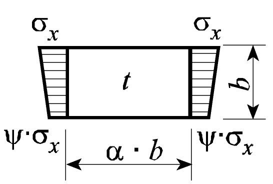 |  |  |  |  for   for    |
    |   |  |   |  |   |
    |   |  |   |  |   |
    | 2 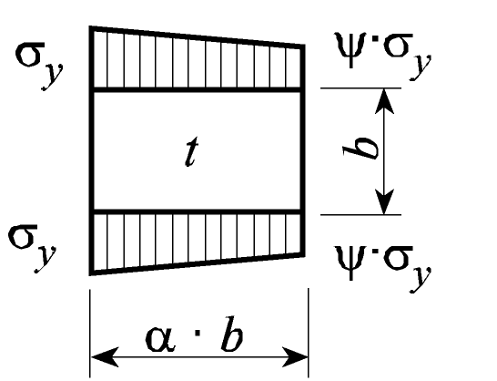 |  |  |  |    for   for     for  , for  due to direct loads , for  due to bending (in general) , for  due to bending in extreme load cases (e.g. wt. bulkheads)   |
    |   |  |  |   |   |
    |   |   |  |    |   |
    |   |  |  |  |   |
    |   |   |  |    |   |
    | Explanations for boundary conditions --------- plate edge free ─── plate edge simply supported ▬▬▬ plate edge clamped |   |   |   |   |

    Note : The load cases as listed in Table 2 are general cases. Each stress component (*s_x,* *s_y*) is to be understood in a local coordinates.

    | 3 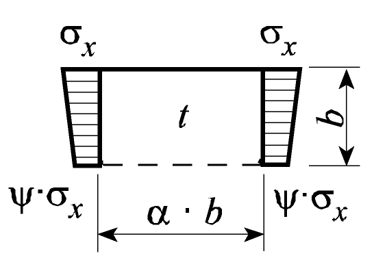 |  |  |  |  for   for  |
    | --- | --- | --- | --- | --- |
    |   |  |   |  |   |
    | 4 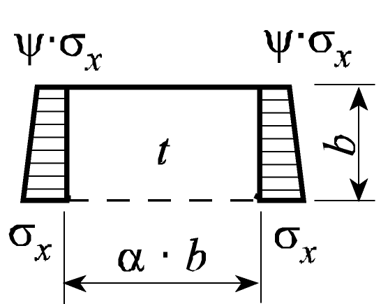 |  |  |  |   |
    | 5 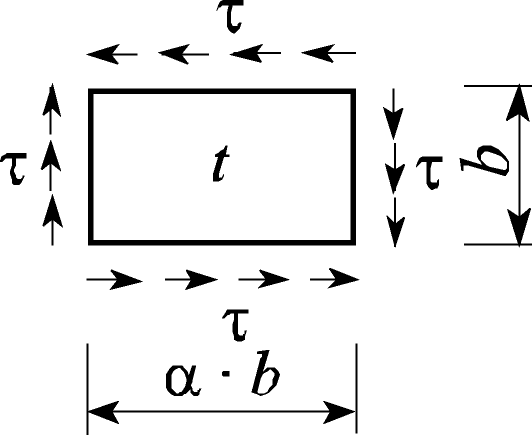 | === |   |  |  for   for  |
    |   | === |  |  |   |
    |   | === |  |  |   |
    | 6 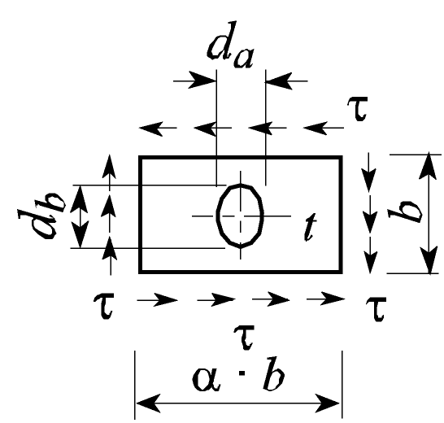 | === |   |   according to load case 5 r = Reductions factor r =  with  and  |   |
    | 7 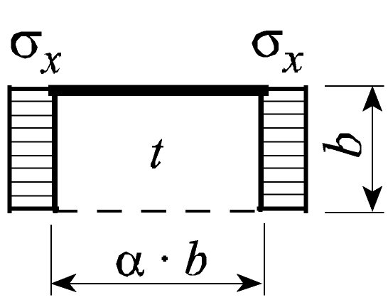 | === |  |  |  for   for  |
    |   | === |  |  |   |
    | 8 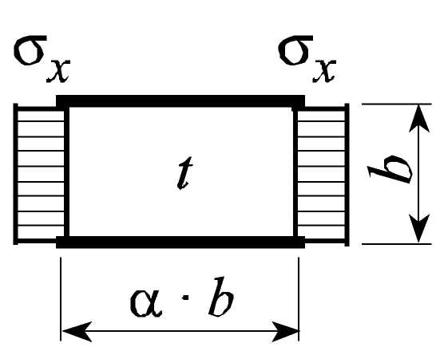 | === |  |  |  for   for  |
    |   | === |  |  |   |
    | 9 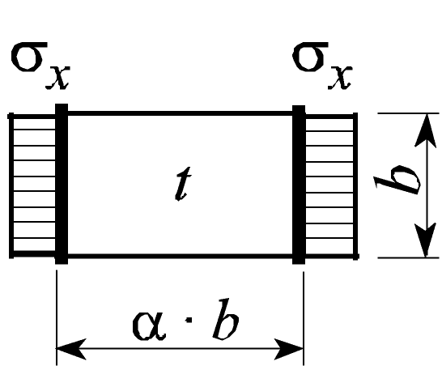 | === |  |  |   |
    |   | === |  |  |   |
    |   | === |  |  |   |
    | 10 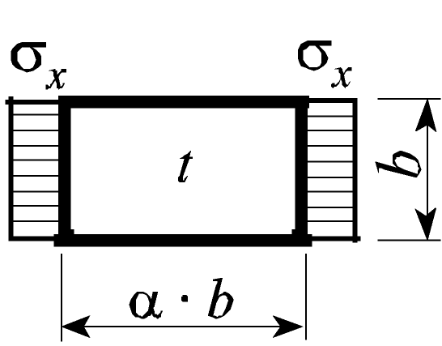 | === |  |  |   |
    |   | === |  |  |   |
    |   | === |  |  |   |
    | Explanations for boundary conditions --------- plate edge free ─── plate edge simply supported ▬▬▬ plate edge clamped |   |   |   |   |

    Note : The load cases as listed in Table 2 are general cases. Each stress component (*s_x,* *s_y*) is to be understood in a local coordinates.

    | Buckling Load Case | Aspect ratio $b/R$ | Buckling factor K | Reduction factor k |
    | --- | --- | --- | --- |
    | 1  |  |  |  for ^2  for   for  |
    |   |  |  |   |
    | 2 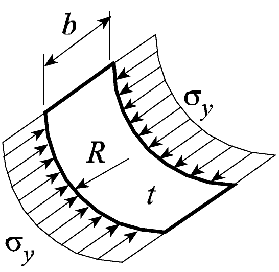 |  |  |  for ^2  for   for   for  |
    |   |  |   |   |
    | 3 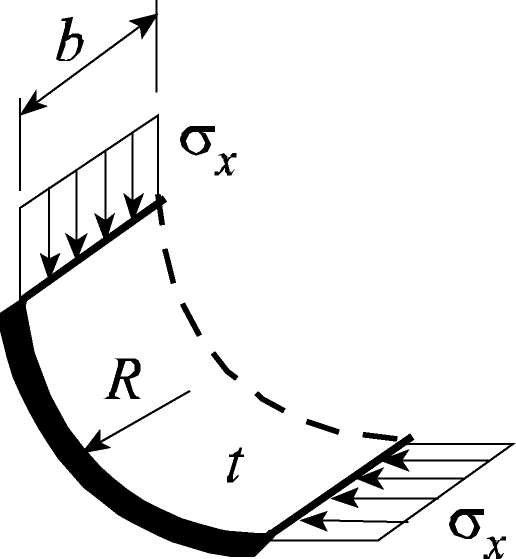 |  |  | as in load case 1a |
    |   |  |  | as in load case 1a |
    | 4 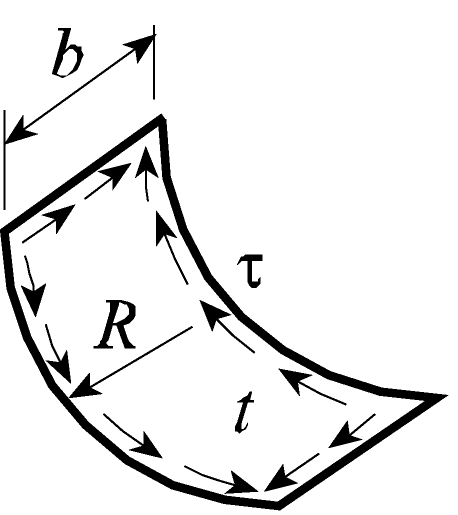 |  |   |  for   for   for  |
    |   |  |  |   |
    | Explanations for boundary conditions --------- plate edge free ─── plate edge simply supported ▬▬▬ plate edge clamped |   |   |   |
    | 1. For curved plate fields with a very large radius the κ-value need not to be taken less than for the expanded plane field 2. For curved single fields, e.g. bilge stake, which are located within plane partial or total fields, the reduction factor κ may taken as follow: Load case 1b :  Load case 2 :  |   |   |   |

#### 3. Buckling criteria of elementary plate panels

- **3.1** Plates
  - **3.1.1** General
    The net thickness of the elementary plate panel is to comply with the following:
    $t \geq b/100$
    The verification of an elementary plate panel in a transverse section analysis is to be carried out according to [3.1.2]. It is to be performed for the two different following combinations of stresses:
    • stress combination 1: 100 % of the normal stress as defined in [2.1.2] and 70 % of the shear stress as defined in [2.1.3]
    • stress combination 2: 70 % of the normal stress as defined in [2.1.2] and 100 % of the shear stress as defined in [2.1.3].
    The verification of elementary plate panel in a FEM analysis is to be carried out according to [3.2].
  - **3.1.2** Verification of elementary plate panel in a transverse section analysis
    Each elementary plate panel is to comply with the following criteria, taking into account the loads defined in [2.1]:
    • longitudinally framed plating
     for stress combination 1 with $\sigma _{x} = \sigma _{n}$ and $\tau = 0.7 \tau _{SF}$
     for stress combination 2 with $\sigma _{x} = 0.7 \sigma _{n}$ and $\tau = \tau _{SF}$
    • transversely framed plating
     for stress combination 1 with $\sigma _{y} = \sigma _{n}$ and $\tau = 0.7 \tau _{SF}$
     for stress combination 2 with $\sigma _{y} = 0.7 \sigma _{n}$ and $\tau = \tau _{SF}$
    Each term of the above conditions must be less than 1.0.
    The reduction factors $k _{x}$ and $k _{y}$ are given in Table 2 and/or Table 3.
    The coefficients *e*1, *e*2 and *e*3 are defined in Table 4.
    For the determination of *e*3, $k _{y}$ is to be taken equal to 1 in case of longitudinally framed plating and $k _{x}$ is to be taken equal to 1 in case of transversely framed plating.
- **3.2** Verification of elementary plate panel within FEM analysis
  - **3.2.1** General
    The buckling check of the elementary plate panel is to be performed under the loads defined in [3.2.2], according to the requirements of [3].
    The determination of the buckling and reduction factors is made for each relevant case of Table 2 according to the stresses calculated in [3.2.2] loading the considered elementary plate panel.
  - **3.2.2** Stresses
    For the buckling check, the buckling stresses are to be determined according to Table 2 and Table 3 including their stress ratio $\psi$ for the loading conditions required in Ch 4, Sec 7 and according to the requirements of Ch 7.
  - **3.2.3** Poisson effect
    Stresses derived with superimposed or direct method have to be reduced for buckling assessment because of the Poisson effect, which is taken into consideration in both analysis methods. The correction has to be carried out after summation of stresses due to local and global loads.
    Both stresses $\sigma _{x} ^{*}$ and $\sigma _{y} ^{*}$ are to be compressive stresses, in order to apply the stress reduction according to the following formulae:
    
    where:
    $\sigma _{x} ^{*}$, $\sigma _{y} ^{*}$ : Stresses containing the Poisson effect
    Where compressive stress fulfils the condition $\sigma _{y} ^{*} < 0.3 \sigma _{x} ^{*}$, then $\sigma _{y} = 0$ and $\sigma _{x} = \sigma _{x} ^{*}$
    Where compressive stress fulfils the condition $\sigma _{x} ^{*} < 0.3 \sigma _{y} ^{*}$, then $\sigma _{x} = 0$ and $\sigma _{y} = \sigma _{y} ^{*}$
  - **3.2.4** Checking Criteria
    Each elementary plate panel is to comply with the following criteria, taking into account the loads defined in [2.1]
    
    In addition, each compressive stress $\sigma _{x}$ and $\sigma _{y}$, and the shear stress $\tau$ are to comply with the following formulae:
    
    
    
    The reduction factors $k _{x}$, $k _{y}$ and $k _{\tau }$ are given in Table 2 and/or Table 3.
    • where $\sigma _{x} \leq 0$ (tensile stress), $k _{x}$ = 1.0.
    • where $\sigma _{y} \leq 0$ (tensile stress), $k _{y}$ = 1.0.
    The coefficients *e*1, *e*2 and *e*3 as well as the factor *B* are defined in Table 4.

    | Exponents *e*1–*e*3 and factor *B* | Plate panel |   |
    | --- | --- | --- |
    | Exponents *e*1–*e*3 and factor *B* | plane | curved |
    | *e*1 | $1+k _{x} ^{4}$ | 1.25 |
    | *e*2 | $1+k _{y} ^{4}$ | 1.25 |
    | *e*3 | $1+k _{x} k _{y} k _{\tau } ^{2}$ | 2.0 |
    | *B* $\sigma _{x}$ and $\sigma _{y}$ positive (compressive stress) | $(k _{x} k _{y} ) ^{5}$ | 0 |
    | *B* $\sigma _{x}$ or $\sigma _{y}$ negative (tensile stress) | 1 | - |
- **3.3** Webs and flanges
  - **3.3.1** For non-stiffened webs and flanges of sections and girders proof of sufficient buckling strength as for elementary plate panels is to be provided according to [3.1].

#### 4. Buckling criteria of partial and total panels

- **4.1** Longitudinal and transverse stiffeners
  - **4.1.1** In a hull transverse section analysis, the longitudinal and transverse ordinary stiffeners of partial and total plate panels are to comply with the requirements of [4.2] and [4.3].
- **4.2** Ultimate strength in lateral buckling mode
  - **4.2.1** Checking criteria
    The longitudinal and transverse ordinary stiffeners are to comply with the following criteria:
    
    where:
    $\sigma _{a}$ : Uniformly distributed compressive stress, in $\mathrm{N}/mm ^{2}$ in the direction of the stiffener axis.
    $\sigma _{a}$ = $\sigma _{n}$ for longitudinal stiffeners
    $\sigma _{a}$ = 0 for transverse stiffeners
    $\sigma _{b}$ : Bending stress, in $\mathrm{N}/mm ^{2}$, in the stiffener.
    $\sigma _{b}$ calculated as in [4.2.2] with $\sigma _{x}$ = $\sigma _{n}$ and $\tau$ = $\tau _{SF}$
  - **4.2.2** Evaluation of the bending stress $\sigma _{b}$
    The bending stress $\sigma _{b}$, in $\mathrm{N}/mm ^{2}$, in the stiffeners is equal to:
    
    where:
    $M _{0}$ : Bending moment, in N.mm, due to the deformation *w* of stiffener, taken equal to:
    
    with 
    $M _{1}$ : Bending moment, in N.mm, due to the lateral load *p*, taken equal to:
     for longitudinal stiffeners
     for transverse stiffeners, with *n* equal to 1 for ordinary transverse stiffeners.
    $W _{st}$ : Net section modulus of stiffener (longitudinal or transverse), in $\mathrm{cm} ^{3}$, including effective width of plating according to [5], taken equal to:
    •if a lateral pressure is applied on the stiffener:
    $W _{st}$ is the net section modulus calculated at flange if the lateral pressure is applied on the same side as the stiffener.
    $W _{st}$ is the net section modulus calculated at attached plate if the lateral pressure is applied on the side opposite to the stiffener.
    Note: For stiffeners sniped at both ends, $W _{st}$ is the net section modulus calculated at attached plate. However, if M_1 is larger than M_0 and the lateral pressure is applied on the same side as the stiffener, $W _{st}$ is the net section modulus calculated at flange.
    •if no lateral pressure is applied on the stiffener:
    $W _{st}$ is the minimum net section modulus among those calculated at flange and attached plate
    Note: For stiffeners sniped at both ends, $W _{st}$ is the net section modulus calculated at attached plate.
    $c _{s}$ : Factor accounting for the boundary conditions of the transverse stiffener
    $c _{s}$ = 1.0 simply supported stiffeners
    $c _{s}$ = 2.0 for partially constraint stiffeners
    $p$ : Lateral load in $\mathrm{kN}/m ^{ 2}$, as defined in Ch 4, Sec 5 and Ch 4, Sec 6 calculated at the load point as defined in Ch 6, Sec 2, [1.4]
    $F _{Ki}$ : Ideal buckling force, in N, of the stiffener, taken equal to:
     for longitudinal stiffeners
     for transverse stiffeners
    $I _{x}$, $I _{y}$ : Net moments of inertia, in $\mathrm{cm} ^{4}$, of the longitudinal or transverse stiffener including effective width of attached plating according to [5]. $I _{x}$ and $I _{y}$ are to comply with the following criteria:
    
    
    $p _{z}$ : Nominal lateral load, in $\mathrm{N}/mm ^{2}$, of the stiffener due to $\sigma _{x}$, $\sigma _{y}$ and $\tau$
     for longitudinal stiffeners
     for transverse stiffeners
    
    *t_a* : Net thickness offered of attached plate, in mm
    $c _{x}$, $c _{y}$ : Factor taking into account the stresses vertical to the stiffener's axis and distributed variable along the stiffener's length taken equal to:
    $0.5 \left( 1+ \psi \right)$ for 0 ≤ $\psi$ ≤ 1
    $\frac{0.5}{1- \psi}$ for $\psi$ < 0
    $A _{x}$, $A _{y}$ : Net sectional area, in $\mathrm{mm} ^{2}$, of the longitudinal or transverse stiffener respectively without attached plating
    
    $m _{1}$, $m _{2}$ : Coefficients taken equal to:for longitudinal stiffeners: for transverse stiffeners: 
     : generally
    $w= \left| w _{0} -w _{1} \right|$ : for stiffeners sniped at both ends, on which the same side lateral pressure as the stiffener is applied.
     : Assumed imperfection, in mm, taken equal to:
     for longitudinal stiffeners
     for transverse stiffeners
    For stiffeners sniped at both ends $w_0$ must not be taken less than the distance from the midpoint of attached plating to the neutral axis of the stiffener calculated with the effective width of its attached plating.
     : Deformation of stiffener, in mm, at midpoint of stiffener span due to lateral load *p*. In case of uniformly distributed load the following values for $w _{1}$ may be used:
     for longitudinal stiffeners
     for transverse stiffeners
    $c _{f}$ : Elastic support provided by the stiffener, in $\mathrm{N}/mm ^{2}$, taken equal to:
    • for longitudinal stiffeners
    
    
    $c _{xa}$ : Coefficient taken equal to
     for 
     for 
    • for transverse stiffeners
    
    
    $c _{ya}$ : Coefficient taken equal to
     for 
     for 
  - **4.2.3** Equivalent criteria for longitudinal and transverse ordinary stiffeners not subjected to lateral pressure
    Longitudinal and transverse ordinary stiffeners not subjected to lateral pressure, except for sniped stiffeners, are considered as complying with the requirement of [4.2.1] if their net moments of inertia $I _{x}$ and $I _{y}$, in $\mathrm{cm} ^{4}$, are not less than the value obtained by the following formula:
    • For longitudinal stiffener : 
    • For transverse stiffener : 
- **4.3** Torsional buckling
  - **4.3.1** Longitudinal stiffeners
    The longitudinal ordinary stiffeners are to comply with the following criteria:
    
    $k _{T}$ : Coefficient taken equal to:
    $k _{T} = 1.0$ for 
    $k _{T} = \frac{1}{\Phi + \sqrt {\Phi ^{2} - \lambda _{T}} ^{2}}$ for 
    
    $\lambda _{T}$ : Reference degree of slenderness taken equal to:
    $\lambda _{T } = \sqrt {\frac{R _{eH}}{\sigma _{KiT}}}$
    , in $\mathrm{N}/mm ^{2}$
    $I _{p}$ : Net polar moment of inertia of the stiffener, in $\mathrm{cm} ^{4}$, defined in Table 5, and related to the point C as shown in Fig 2
    $I _{T}$ : Net St. Venant's moment of inertia of the stiffener, in $\mathrm{cm} ^{4}$, defined in Table 5,
    $I _{w}$ : Net sectorial moment of inertia of the stiffener, in $\mathrm{cm} ^{6}$, defined in Table 5, related to the point C as shown in Fig 2
    $\varepsilon$ : Degree of fixation taken equal to:
    
    $A _{w}$ : Net web area equal to: $A _{w} = h _{w} t _{w}$
    $A _{f}$ : Net flange area equal to: $A _{f} = b _{f} t _{f}$
    , in mm
    
    Fig 2: Dimensions of stiffeners

    | Profile | *I_P* | *I_T* | *I_w* |
    | --- | --- | --- | --- |
    | Flat bar |  |  |  |
    | Sections with bulb or flange |  |  +  | for bulb and angle sections:  for tee-sections:  |
  - **4.3.2** Transverse stiffeners
    Transverse stiffeners loaded by axial compressive stresses and which are not supported by longitudinal stiffeners are to comply with the requirements of [4.3.1] analogously.

#### 5. Effective width of attached plating

- **5.1** Ordinary stiffeners
  - **5.1.1** The effective width of attached plating of ordinary stiffeners is determined by the following formulae (see also Fig 1):
    • for longitudinal stiffeners: 
    • for transverse stiffeners: 
    where:
    , to be taken notgreater than 1,0
    *s* : Spacing of the stiffener, in mm
    $\ell _{eff}$ : Value taken as follows:
    • for longitudinal stiffeners:
    $\ell _{eff}$ = *a* if simply supported at both ends
    $\ell _{eff}$ = 0.6 *a* if fixed at both ends
    • for transverse stiffeners:
    $\ell _{eff}$ = *b* if simply supported at both ends
    $\ell _{eff}$ = 0.6 *b* if fixed at both ends
- **5.2** Primary supporting members
  - **5.2.1** The effective width $e' _{m}$ of stiffened flange plates of primary supporting members may be determined as described in a) and b), with the notations:
    $e$ : Width of plating supported, in mm, measured from centre to centre of the adjacent unsupported fields
    $e _{m}$ : Effective width, in mm, of attached plating of primary supporting member according to Table 6 considering the type of loading (special calculations may be required for determining the effective width of one-sided or non-symmetrical flanges).
    $e _{m1}$ is to be applied where primary supporting members are loaded by uniformly distributed loads or else by not less than 6 equally spaced single loads.
    $e _{m2}$ is to be applied where primary supporting members are loaded by 3 or less single loads.
    
    Fig 3: Stiffening parallel to web
    
    
    $n$ : Integral number of the stiffener spacing *b* inside the effective width $e _{m}$, taken equal to:$n = \mathrm{i} n t} ^{} {} \left( \frac{e _{m}}{b} \right)$
    
    Fig 4: Stiffening perpendicular to web
    
    
    $n = 2.7 \frac{e _{m}}{a}$, to be taken not greater than 1.0
    For $b \geq e _{m}$ or $a < e _{m}$ respectively, *b* and *a* must be exchanged.

    | $\ell /e$ | 0 | 1 | 2 | 3 | 4 | 5 | 6 | 7 | ≥ 8 |
    | --- | --- | --- | --- | --- | --- | --- | --- | --- | --- |
    | $e _{m1} /e$ | 0 | 0.36 | 0.64 | 0.82 | 0.91 | 0.96 | 0.98 | 1.00 | 1.00 |
    | $e _{m2} /e$ | 0 | 0.20 | 0.37 | 0.52 | 0.65 | 0.75 | 0.84 | 0.89 | 0.90 |
    | Intermediate values may be obtained by direct interpolation. $\ell$ : Length between zero-points of bending moment curve, i.e. unsupported span in case of simply supported girders and 0.6 times the unsupported span in case of constraint of both ends of girder |   |   |   |   |   |   |   |   |   |
    - **a)** Stiffening parallel to web of the primary supporting member (see Fig 3)
    - **b)** Stiffening perpendicular to web of the primary supporting member (see Fig 4)

#### 6. Transverse vertically corrugated watertight bulkhead in flooded conditions

- **6.1** General
  - **6.1.1** Shear buckling check of the bulkhead corrugation webs
    The shear stress $\tau$, calculated according to Ch 6, Sec 2, [3.6.1], is to comply with the following formula:
    
    where:
    $\tau _{C}$ : Critical shear buckling stress to be obtained, in $\mathrm{N}/mm ^{2}$, from the following formulae:
     for 
     for 
    $\tau _{E}$ : Euler shear buckling stress to be obtained, in $\mathrm{N}/mm ^{2}$, from the following formula:
    *k_t* : Coefficient, to be taken equal to 6.34
    *t_W* : Net thickness, in mm, of the corrugation webs
    *c* : Width, in m of the corrugation webs (see Ch 3, Sec 6, Fig 28).

### Section 4 - PRIMARY SUPPORTING MEMBERS

Symbols
For symbols not defined in this Section, refer to Ch 1, Sec 4.
*L*_2 : Rule length *L*, but to be taken not greater than 300 m
*I_Y* : Net moment of inertia, in $\mathrm{m} ^{4}$, of the hull transverse section about its horizontal neutral axis, to be calculated according to Ch 5, Sec 1, [1.5], on gross of fered thickness reduced by 0.5 *t_C* for all structural members
*I_Z* : Net moment of inertia, in m^4, of the hull transverse section about its vertical neutral axis, to be calculated according to Ch 5, Sec 1, [1.5], on gross offered thickness reduced by 0.5 *t_C* for all structural members
*N* : *Z* co-ordinate with respect to the reference co-ordinate system defined in Ch 1, Sec 4, [4], in m, of the centre of gravity of the hull net transverse section defined in Ch 5, Sec 1, [1.2], considering gross offered thickness reduced by 0.5 *t_C* for all structural members
*p_S* *, p_W* : Still water and wave pressure, in $\mathrm{kN}/m ^{ 2}$, in intact conditions, defined in [2.1.2]
$\sigma _{X}$ : Normal stress, in $\mathrm{N}/mm ^{2}$, defined in [2.1.5]
*s* : Spacing, in m, of primary supporting members
$\ell$ : Span, in m, of primary supporting members, measured between the supporting members, see Ch 3, Sec 6, [5.3]
*h_w* : Web height, in mm
*t_w* : Net web thickness, in mm
*b_f* : Face plate width, in mm
*t_f* : Net face plate thickness, in mm
*b_p* : Width, in m, of the plating attached to the member, for the yielding check, defined in Ch 3, Sec 6, [4.3]
*w* : Net section modulus, in $\mathrm{cm} ^{3}$, of the member, with an attached plating of width *b_p*, to be calculated as specified in Ch 3, Sec 6, [4.4]
*A_sh* : Net shear sectional area, in $\mathrm{cm} ^{2}$, of the member, to be calculated as specified in Ch 3, Sec 6, [5.5]
*m* : Coefficient taken equal to 10
$\tau _{a}$ : Allowable shear stress, in $\mathrm{N}/mm ^{2}$, taken equal to:
$\tau _{a} = 0.4 R _{Y}$
*k* : Material factor, as defined in Ch 1, Sec 4, [2.2.1]
*x*, *y*, *z* : *X*, *Y* and *Z* co-ordinates, in m, of the evaluation point with respect to the reference co-ordinate system defined in Ch 1, Sec 4

#### 1. General

- **1.1** Application
  - **1.1.1** The requirements of this Section apply to the strength check of pillars and primary supporting members, subjected to lateral pressure and/or hull girder normal stresses for such members contributing to the hull girder longitudinal strength.
    The yielding check is also to be carried out for such members subjected to specific loads.
- **1.2** Primary supporting members for ships less than 150 m in length *L*
  - **1.2.1** For primary supporting members for ships having a length *L* less than 150 m, the strength check of such members is to be carried out according to the provisions specified in [2] and [4].
  - **1.2.2** Notwithstanding the above, the strength check of such members may be carried out by a direct strength assessment deemed as appropriate by the Society.
- **1.3** Primary supporting members for ships of 150 m or more in length *L*
  - **1.3.1** For primary supporting members for ships having a length *L* of 150 m or more, the direct strength analysis is to be carried out according to the provisions specified in Ch 7, and the requirements in [4] are also to be complied with. In addition, the primary supporting members for BC-A and BC-B ships are to comply with the requirements in [3].
- **1.4** Net scantlings
  - **1.4.1** As specified in Ch 3, Sec 2, all scantlings referred to in this Section are net, i.e. they do not include any corrosion addition.
    The gross scantlings are obtained as specified in Ch 3, Sec 2, [3].
- **1.5** Minimum net thicknesses of webs of primary supporting members
  - **1.5.1** The net thickness of the web of primary supporting members, in mm, is to be not less than $0.6 \sqrt {L _{2}}$.
- **1.6** Flooding check of primary supporting members
  - **1.6.1** General
    Flooding check of primary supporting members is to be carried out according to the requirements in [5].

#### 2. Scantling of primary supporting members for ships of less than 150 m in length L}

- **2.1** Load model
  - **2.1.1** General
    The still water and wave lateral loads induced by the sea and the various types of cargoes and ballast in intact conditions are to be considered, depending on the location of the primary supporting members under consideration and the type of the compartments adjacent to it.
    The wave lateral loads and hull girder loads are to be calculated, for the probability level of $10 ^{-8}$, in the mutually exclusive load cases H1, H2, F1, F2, R1, R2, P1 and P2, as defined in Ch 4, Sec 4.
  - **2.1.2** Lateral pressure in intact conditions
    The lateral pressure in intact conditions is constituted by still water pressure and wave pressure.
    Still water pressure ($p _{S}$) includes:
    Wave pressure ($p _{W}$) includes for each load case H1, H2, F1, F2, R1, R2, P1 and P2:
    - **a)** the hydrostatic pressure, defined in Ch 4, Sec 5, [1]
    - **b)** the still water internal pressure, defined in Ch 4, Sec 6 for the various types of cargoes and for ballast.
    - **c)** the hydrodynamic pressure, defined in Ch 4, Sec 5, [1]
    - **d)** the inertial pressure, defined in Ch 4, Sec 6 for the various types of cargoes and for ballast.
  - **2.1.3** Elements of the outer shell
    The still water and wave lateral pressures are to be calculated considering separately:
    • the still water and wave external sea pressures
    • the still water and wave internal pressure, considering the compartment adjacent to the outer shell as being loaded
    If the compartment adjacent to the outer shell is not intended to carry liquids, only the external sea pressures are to be considered.
  - **2.1.4** Elements other than those of the outer shell
    The still water and wave lateral pressures to be considered as acting on an element which separates two adjacent compartments are those obtained considering the two compartments individually loaded.
  - **2.1.5** Normal stresses
    The normal stress to be considered for the strength check of primary supporting members contributing to the hull girder longitudinal strength is the maximum value of $\sigma _{X}$ between sagging and hogging conditions, when applicable, obtained, in $\mathrm{N}/mm ^{2}$, from the following formula:
    
    where:
    *M_SW* : Permissible still water bending moments, in kN.m, in hogging or sagging as the case may be
    *M_WV* : Vertical wave bending moment, in kN.m, in hogging or sagging as the case may be, as defined in Ch 4, Sec 3
    *M_WH* : Horizontal wave bending moment, in kN.m, as defined in Ch 4, Sec 3
    *C_SW* : Combination factor for each load case H1, H2, F1, F2, R1, R2, P1 and P2 and defined in the Table 1
    *C_WV*, *C_WH* : Combination factors defined in Ch 4, Sec 4, [2.2] for each load case H1, H2, F1, F2, R1, R2, P1 and P2 and given in the Table 1

    | LC | Hogging |   |   |   |   | Sagging |   |   |
    | --- | --- | --- | --- | --- | --- | --- | --- | --- |
    |   | *C_SW* |   | *C_WV* |   | *C_WH* | *C_SW* | *C_WV* | *C_WH* |
    | H1 | Not Applicable |   |   |   |   | -1 | -1 | 0 |
    | H2 | 1 | 1 |   | 0 |   | Not Applicable |   |   |
    | F1 | Not Applicable |   |   |   |   | -1 | -1 | 0 |
    | F2 | 1 | 1 |   | 0 |   | Not Applicable |   |   |
    | R1 | 1 | 0 |   |  |   | -1 | 0 |  |
    | R2 | 1 | 0 |   |  |   | -1 | 0 |  |
    | P1 | 1 |  |   | 0 |   | -1 |  | 0 |
    | P2 | 1 |  |   | 0 |   | -1 |  | 0 |
- **2.2** Center Girders and Side Girders
  - **2.2.1** Net web thickness
    The net thickness of girders in double bottom structure, in mm, is not to be less than the greatest of either of the value $t _{1}$ to $t _{3}$ specified in the followings according to each location:
     where $\left| x-x _{c } \right|$ is less than 0.25 $\ell _{DB}$, $\left| x-x _{c } \right|$ is to be taken as 0.25 $\ell _{DB}$
    
    
    where:
    *P* : Differential pressure given by the following formula in $\mathrm{kN}/m ^{ 2}$:
    
    *P_S,IB* : Cargo or ballast pressure of inner bottom plating in still water, in $\mathrm{kN}/m ^{ 2}$, as calculated at the center of the double bottom structure under consideration, according to Ch 4, Sec 6
    *P_W,IB* : Cargo or ballast pressure of inner bottom plating due to inertia, in $\mathrm{kN}/m ^{ 2}$, as calculated at the center of the double bottom structure under consideration, according to Ch 4, Sec 6
    *P_S,BM* : External sea and ballast pressure of bottom plating in still water, in $\mathrm{kN}/m ^{ 2}$, as calculated at the center of the double bottom structure under consideration, according to Ch 4, Sec 5 and Ch 4, Sec 6
    *P_W,BM* : External sea and ballast pressure of bottom plating due to inertia, in $\mathrm{kN}/m ^{ 2}$, as calculated at the center of the double bottom structure under consideration, according to Ch 4, Sec 5 and Ch 4, Sec 6
    $S$ : Distance between the centers of the two spaces adjacent to the center or side girder under consideration, in m
    $d _{0}$ : Depth of the center or side girder under consideration, in m
    $d _{1}$ : Depth of the opening, if any, at the point under consideration, in m
    $\ell _{DB}$ : Length of the double bottom, in m. Where stools are provided at transverse bulkheads, $\ell _{DB}$ may be taken as the distance between the toes.
    $x _{c}$ : *X* co-ordinate, in m, of the center of double bottom structure under consideration with respect to ther eference co-ordinate system defined in Ch 1, Sec 4
    $B _{DB}$ : Distance between the toes of hopper tanks at the midship part, in m, see Fig 3
    $C _{1}$ : Coefficient obtained from Table 2 depending on $B _{DB}$ / $\ell _{DB}$. For intermediate values of $B _{DB}$ / $\ell _{DB}$, $C _{1}$ is to be obtained by linear interpolation
    $a$ : Depth of girders at the point under consideration, in m. However, where horizontal stiffeners are fitted on the girder, $a$ is the distance from the horizontal stiffener under consideration to the bottom shell plating or inner bottom plating, or the distance between the horizontal stiffeners under consideration
    $S _{1}$ : Spacing, in m, of vertical ordinary stiffeners or floors
    $C _{1} ^{ ' }$ : Coefficient obtained from Table 3 depending on $S _{1}$ / $a$. For intermediate values of $S _{1}$ / $a$, $C _{1} ^{ ' }$ is to be determined by linear interpolation
    $H$ : Value obtained from the following formulae:
    • where the girder is provided with an unreinforced opening : $H = 1+0.5 \frac{\phi}{\alpha}$
    • In other cases : $H = 1.0$
    $\phi$ : Major diameter of the openings, in m
    $\alpha$ : The greater of $a$ or $S _{1}$, in m.
    $C _{1} ^{ ' '}$ : Coefficient obtained from Table 4 depending on $S _{1}$ / $a$. For intermediate values of $S _{1}$ / $a$, $C _{1} ^{ ' '}$ is to be obtained by linear interpolation.

    | $B _{DB}$ / $\ell _{DB}$ | 0.4 and under | 0.6 | 0.8 | 1.0 | 1.2 | 1.4 | 1.6 and over |
    | --- | --- | --- | --- | --- | --- | --- | --- |
    | $C _{1}$ | 0.5 | 0.71 | 0.83 | 0.88 | 0.95 | 0.98 | 1.00 |

    | $\frac{S _{1}}{a}$ | 0.3 and under | 0.4 | 0.5 | 0.6 | 0.7 | 0.8 | 0.9 | 1.0 | 1.2 | 1.4 and over |
    | --- | --- | --- | --- | --- | --- | --- | --- | --- | --- | --- |
    | $C _{1} ^{ ' }$ | 64 | 38 | 25 | 19 | 15 | 12 | 10 | 9 | 8 | 7 |

    | $\frac{S _{1}}{a}$ |   | 0.3 and under | 0.4 | 0.5 | 0.6 | 0.7 | 0.8 | 0.9 | 1.0 | 1.2 | 1.4 | 1.6 and over |
    | --- | --- | --- | --- | --- | --- | --- | --- | --- | --- | --- | --- | --- |
    | $C _{1} ^{ ' '}$ | Centre girder | 4.4 | 5.4 | 6.3 | 7.1 | 7.7 | 8.2 | 8.6 | 8.9 | 9.3 | 9.6 | 9.7 |
    | $C _{1} ^{ ' '}$ | Side girder | 3.6 | 4.4 | 5.1 | 5.8 | 6.3 | 6.7 | 7.0 | 7.3 | 7.6 | 7.9 | 8.0 |
- **2.3** Floors
  - **2.3.1** Net web thickness
    The net thickness of floors in the double bottom structure, in mm, is not to be less than the greatest of values $t _{1}$ to $t _{3}$ specified in the following according to each location:
    , where $\left| x-x _{c } \right|$ is less than 0.25 $\ell _{DB}$, $\left| x-x _{c } \right|$ is to be taken as 0.25 $\ell _{DB}$, and where $\left| y \right|$ is less than $B _{DB} ^{' } / 4$, $\left| y \right|$ is to be taken as $B _{DB} ^{' } / 4$
    
    
    where :
    $S$ : Spacing of solid floors, in m
    $d _{0}$ : Depth of the solid floor at the point under consideration in m
    $d _{1}$ : Depth of the opening, if any, at the point under consideration in m
    $B _{DB} ^{' }$ : Distance between toes of hopper tanks at the position of the solid floor under consideration, in m
    $C _{2}$ : Coefficient obtained from Table 5 depending on $B _{DB}$ / $\ell _{DB}$. For intermediate values of $B _{DB}$ / $\ell _{DB}$, $C _{2}$ is to be obtained by linear interpolation
    $p$, $B _{DB}$, $x _{c}$, $\ell _{DB}$ : As defined in [2.2.1]
    $a$ : Depth of the solid floor at the point under consideration, in m. However, where horizontal stiffeners are fitted on the floor, $a$ is the distance from the horizontal stiffener under consideration to the bottom shell plating or the inner bottom plating or the distance between the horizontal stiffeners under consideration
    $S _{1}$ : Spacing, in m, of vertical ordinary stiffeners or girders
    $C _{2} ^{ ' }$ : Coefficient given in Table 6 depending on $S _{1}$ / $d _{0}$. For intermediate values of $S _{1}$ / $d _{0}$, $C _{2} ^{ ' }$ is to be determined by linear interpolation.
    $H$ : Value obtained from the following formulae:
    1) where slots without reinforcement are provided:
    , without being taken less than 1.0
    2) where slots with reinforcement are provided: $H$ = 1.0
    1) where slots without reinforcement are provided:
    , without being taken less than $1+0.5 \frac{\phi}{d _{0}}$
    2) where slots with reinforcement are provided: $H = 1+0.5 \frac{\phi}{d _{0}}$
    $d _{2}$ : Depth of slots without reinforcement provided at the upper and lower parts of solid floors, in m, whichever is greater
    $\phi$ : Major diameter of the openings, in m
    $S _{2}$ : The smaller of $S _{1}$ or $a$, in m.

    | $\frac{B _{DB}}{\ell _{DB}}$ | 0.4 and under | 0.6 | 0.8 | 1.0 | 1.2 | 1.4 | 1.6 and over |
    | --- | --- | --- | --- | --- | --- | --- | --- |
    | $C _{2}$ | 0.48 | 0.47 | 0.45 | 0.43 | 0.40 | 0.37 | 0.34 |

    | $S _{1}$ / $d _{0}$ | 0.3 and under | 0.4 | 0.5 | 0.6 | 0.7 | 0.8 | 0.9 | 1.0 | 1.2 | 1.4 and over |
    | --- | --- | --- | --- | --- | --- | --- | --- | --- | --- | --- |
    | $C _{2} ^{ ' }$ | 64 | 38 | 25 | 19 | 15 | 12 | 10 | 9 | 8 | 7 |
    - **a)** where openings with reinforcement or no opening are provided on solid floors:
    - **b)** where openings without reinforcement are provided on solid floors:
- **2.4** Stringer of double side structure
  - **2.4.1** Net web thickness
    The net thickness of stringers in double side structure, in mm, is not to be less than the greatest of either of the value $t _{1}$ to $t _{3}$ specified in the followings according to each location:
    , where $\left| x-x _{c } \right|$ is under 0.25 $\ell _{DS}$, $\left| x-x _{c } \right|$ is to be taken as 0.25 $\ell _{DS}$
    
    
    where :
    *P* : Differential pressure given by the following formula in $\mathrm{kN}/m ^{ 2}$:
    
    *P_S,SS* : External sea and ballast pressure of side shell plating in still water, in $\mathrm{kN}/m ^{ 2}$, as measured vertically at the upper end of hopper tank, longitudinally at the centre of $\ell _{DS}$, according to Ch 4, Sec 5 and Ch 4, Sec 6
    *P_W,SS* : External sea and ballast pressure of side shell plating due to inertia, in $\mathrm{kN}/m ^{ 2}$, as measured vertically at the upper end of hopper tank, longitudinally at the centre of $\ell _{DS}$, according to Ch 4, Sec 5 and Ch 4, Sec 6
    *P_S,LB* : Ballast pressure of longitudinal bulkhead in still water, in $\mathrm{kN}/m ^{ 2}$, as measured vertically at the upper end of hopper tank, longitudinally at the centre of $\ell _{DS}$, according to Ch 4, Sec 6
    *P_W,LB* : Ballast pressure of longitudinal bulkhead due to inertia, in $\mathrm{kN}/m ^{ 2}$, as measured vertically at the upper end of hopper tank, longitudinally at the centre of $\ell _{DS}$, according to Ch 4, Sec 6
    $S$ : Breadth of part supported by stringer, in m
    $d _{0}$ : Depth of stringers, in m
    $d _{1}$ : Depth of opening, if any, at the point under consideration, in m.
    $x _{c}$ : *X* co-ordinate, in m, of the center of double side structure under consideration with respect to the reference co-ordinate system defined in Ch 1, Sec 4
    $\ell _{DS}$ : Length of the double side structure between the transverse bulkheads under consideration, in m
    $h _{DS}$ : Height of the double side structure between the upper end of hopper tank and the lower end of topside tank, in m
    $C _{3} ^{ }$ : Coefficient obtained from Table 7 depending on $h _{DS}$ / $\ell _{DS}$. For intermediate values of $h _{DS}$ / $\ell _{DS}$, $C _{3} ^{ }$ is to be obtained by linear interpolation.
    $a$ : Depth of stringers at the point under consideration, in m. However, where horizontal stiffeners are fitted on the stringer, $a$ is the distance from the horizontal stiffener under consideration to the side shell plating or the longitudinal bulkhead of double side structure or the distance between the horizontal stiffeners under consideration
    $S _{1}$ : Spacing, in m, of transverse ordinary stiffeners or web frames
    $C _{3} ^{ ' }$ : Coefficient obtained from Table 8 depending on $S _{1}$ / $a$. For intermediate values of $S _{1}$ / $a$, $C _{3} ^{ ' }$ is to be obtained by linear interpolation.
    $H$ : Value obtained from the following formulae:
    • where the stringer is provided with an unreinforced opening: $H = 1+0.5 \frac{\phi}{\alpha}$
    • in other cases: $H = 1.0$
    $\phi$ : Major diameter of the openings, in m
    $\alpha$ : The greater of $a$ or $S _{1}$, in m
    $S _{2}$ : The smaller of $a$ or $S _{1}$, in m

    | $\frac{h _{DS}}{\ell _{DS}}$ | 0.5 and under | 0.6 | 0.7 | 0.8 | 0.9 | 1.0 | 1.1 | 1.2 | 1.3 and over |
    | --- | --- | --- | --- | --- | --- | --- | --- | --- | --- |
    | $C _{3} ^{ }$ | 0.16 | 0.23 | 0.30 | 0.36 | 0.41 | 0.44 | 0.47 | 0.50 | 0.54 |

    | $\frac{S _{1}}{a}$ | 0.3 and under | 0.4 | 0.5 | 0.6 | 0.7 | 0.8 | 0.9 | 1.0 | 1.2 | 1.4 and over |
    | --- | --- | --- | --- | --- | --- | --- | --- | --- | --- | --- |
    | $C _{3} ^{ ' }$ | 64 | 38 | 25 | 19 | 15 | 12 | 10 | 9 | 8 | 7 |
- **2.5** Transverse web in double side structure
  - **2.5.1** Net web thickness
    The net thickness of transverse webs in double side structure, in mm, is not to be less than the greatest of either of the value $t _{1}$ to $t _{3}$ specified in the followings according to each location:
    $t _{1} =C _{4} \frac{pSh _{DS}}{\left( d _{0} -d _{1} \right) \tau _{a}} \left( 1-1.75 \frac{z-z _{BH}}{h _{DS}} \right)$, where $z-z _{BH}$ is greater than 0.4 $h _{DS}$, $z-z _{BH}$ is to be taken as 0.4 $h _{DS}$
    $t _{2} =1.75 root {3} of {\frac{H ^{2} a ^{2} \tau _{a}}{C _{4} '} t _{1}}$
    $t _{3} = \frac{8.5S _{2}}{\sqrt {k}}$
    where :
    $S$ : Breadth of part supported by transverses, in m
    $d _{0}$ : Depth of transverses, in m
    $d _{1}$ : Depth of opening at the point under consideration, in m
    $C _{4} ^{ }$ : Coefficient obtained from Table 9 depending on $h _{DS}$ / $\ell _{DS}$. For intermediate values of $h _{DS}$ / $\ell _{DS}$, $C _{4} ^{ }$ is to be obtained by linear interpolation
    $z _{BH}$ : Z co-ordinates, in m, of the upper end of hopper tank with respect to the reference co-ordinate system defined in Ch 1, Sec 4
    $p$, $h _{DS}$ and $\ell _{DS}$ : as defined in the requirements of [2.4.1]
    $a$ : Depth of transverses at the point under consideration, in m. However, where vertical stiffeners are fitted on the transverse, $a$ is the distance from the vertical stiffener under consideration to the side shell or the longitudinal bulkhead of double side hull or the distance between the vertical stiffeners under consideration.
    $S _{1}$ : Spacing, in m, of horizontal ordinary stiffeners or stringers
    $C _{4} '$ : Coefficient obtained from Table 10 depending on $S _{1}$ / $a$. For intermediate values of $S _{1}$ / $a$, $C _{4} '$ is to be obtained by linear interpolation.
    $H$ : Value obtained from the following formulae :
    • where the transverse is provided with an unreinforced opening: $H = 1+0.5 \frac{\phi}{\alpha}$
    • in other cases: $H = 1.0$
    $\phi$ : Major diameter of the openings, in m
    $\alpha$ : The greater of $a$ or $S _{1}$. in m
    $S _{2}$ : The smaller of $a$ or $S _{1}$, in m

    | $\frac{h _{DS}}{\ell _{DS}}$ | 0.5 and under | 0.6 | 0.7 | 0.8 | 0.9 | 1.0 | 1.1 | 1.2 | 1.3 and over |
    | --- | --- | --- | --- | --- | --- | --- | --- | --- | --- |
    | $C _{4} ^{ }$ | 0.62 | 0.61 | 0.59 | 0.55 | 0.52 | 0.49 | 0.46 | 0.43 | 0.41 |

    | $\frac{S _{1}}{a}$ | 0.3 and under | 0.4 | 0.5 | 0.6 | 0.7 | 0.8 | 0.9 | 1.0 | 1.2 | 1.4 and over |
    | --- | --- | --- | --- | --- | --- | --- | --- | --- | --- | --- |
    | $C _{4} ^{ ' }$ | 64 | 38 | 25 | 19 | 15 | 12 | 10 | 9 | 8 | 7 |
- **2.6** Primary supporting member in bilge hopper tanks and topside tanks and other structures
  - **2.6.1** Load calculation point
    For horizontal members, the lateral pressure and hull girder stress, if any, are to be calculated at mid-span of the primary supporting members considered, unless otherwise specified.
    For vertical members, the lateral pressure *p* is to be calculated as the maximum between the values obtained at mid-span and the pressure obtained from the following formula:
    • , when the upper end of the vertical member is below the lowest zero pressure level
    • , when the upper end of the vertical member is at or above the lowest zero pressure level (see Fig 1)
    where:
     : Distance, in m, between the lower end of vertical member and the lowest zero pressure level
    *P_U*, *P_L* : Lateral pressures at the upper and lower end of the vertical member span $\ell$, respectively
    
    Fig 1: Definition of pressure for vertical members
  - **2.6.2** Boundary conditions
    The requirements of this sub-article apply to primary supporting members considered as clamped at both ends. For boundary conditions deviated from the above, the yielding check is to be considered on a case by case basis.
  - **2.6.3** Net section modulus, net shear sectional area and web thickness under intact conditions
    The net section modulus $w$, in $\mathrm{cm} ^{3}$, the net shear sectional area$A _{sh}$, in $\mathrm{cm} ^{2}$, and the net web thickness $t _{w}$, in mm, subjected to lateral pressure are to be not less than the values obtained from the following formulae:
    
    
    
    where:
    $\lambda _{S}$ : Coefficient defined in Table 11
    $\phi$ : Angle, in deg, between the primary supporting member web and the shell plate, measured at the middle of the member span; the correction is to be applied when f is less than 75 deg.
    $C _{ 5}$ : Coefficient defined in Table 12 according to $s _{1}$ and $d _{0}$. For intermediate values of$s _{1}$ / $d _{0}$, coefficient $C _{ 5}$ is to be obtained by linear interpolation.
    $s _{1}$ : Spacing of stiffeners or tripping brackets on web plate, in m
    $d _{0}$ : Spacing of stiffeners parallel to shell plate on web plate, in m

    | Primary supporting members | Coefficient $\lambda _{S}$ |
    | --- | --- |
    | Longitudinal members contributing to the hull girder longitudinal strength | , without being taken greater than 0.8 |
    | Other members | 0.8 |

    | $s _{1}$ / $d _{0}$ | 0.3 and under | 0.4 | 0.5 | 0.6 | 0.7 | 0.8 | 0.9 | 1.0 | 1.5 | 2.0 and over |
    | --- | --- | --- | --- | --- | --- | --- | --- | --- | --- | --- |
    | $C _{ 5}$ | 60.0 | 40.0 | 26.8 | 20.0 | 16.4 | 14.4 | 13.0 | 12.3 | 11.1 | 10.2 |

#### 3. Additional requirements for primary supporting members of BC-A and BC-B ships

- **3.1** Evaluation of double bottom capacity and allowable hold loading in flooded conditions
  - **3.1.1** Shear capacity of the double bottom
    The shear capacity of the double bottom is to be calculated as the sum of the shear strength at each end of:
    • all floors adjacent to both hopper tanks, less one half of the shear strength of the two floors adjacent to each stool, or transverse bulkhead if no stool is fitted (see Fig 2); the floor shear strength is to be calculated according to [3.1.2]
    • all double bottom girders adjacent to both stools, or transverse bulkheads if no stool is fitted; the girder shear strength is to be calculated according to [3.1.3].
    Where in the end holds, girders or floors run out and are not directly attached to the boundary stool or hopper tank girder, their strength is to be evaluated for the one end only.
    The floors and girders to be considered in calculating the shear capacity of the double bottom are those inside the hold boundaries formed by the hopper tanks and stools (or transverse bulkheads if no stool is fitted). The hopper tank side girders and the floors directly below the connection of the stools (or transverse bulkheads if no stool is fitted) to the inner bottom may not be included.
    When the geometry and/or the structural arrangement of the double bottom is/are such as to make the above assumptions inadequate, the shear capacity of the double bottom is to be calculated by means of direct calculations to be carried out according to the requirements specified in Ch 7, as far as applicable.
  - **3.1.2** Floor shear strength
    The floor shear strength, in kN, is to be obtained from the following formulae:
    • in way of the floor panel adjacent to the hopper tank:
    
    • in way of the openings in the outermost bay (i.e. that bay which is closer to the hopper tank):
    
    where:
    *A_f* : Net sectional area, in $\mathrm{mm} ^{2}$, of the floor panel adjacent to the hopper tank
    *A_f,h* : Net sectional area, in $\mathrm{mm} ^{2}$, of the floor panels in way of the openings in the outermost bay (i.e. that bay which is closer to the hopper tank)
    *τ_A* : Allowable shear stress, in $\mathrm{N}/mm ^{2}$, equal to the lesser of:
     and 
    *t_N* : Floor web net thickness, in mm
    *s* : Spacing, in m, of stiffening members of the panel considered
    $\eta _{1}$ : Coefficient to be taken equal to 1.1
    $\eta _{2}$ : Coefficient to be taken equal to 1.2. It may be reduced to 1.1 where appropriate reinforcements are fitted in way of the openings in the outermost bay, to be examined by the Society on a case-by-case basis.
  - **3.1.3** Girder shear strength
    The girder shear strength, in kN, is to be obtained from the following formulae:
    • in way of the girder panel adjacent to the stool (or transverse bulkhead, if no stool is fitted):
    
    • in way of the largest opening in the outermost bay (i.e. that bay which is closer to the stool, or transverse bulk-head, if no stool is fitted):
    
    where:
    *A_g* : Net sectional area, in $\mathrm{mm} ^{2}$, of the girder panel adjacent to the stool (or transverse bulkhead, if no stool is fitted)
    *A_g,h* : Net sectional area, in $\mathrm{mm} ^{2}$, of the girder panel in way of the largest opening in the outermost bay (i.e. that bay which is closer to the stool, or transverse bulkhead, if no stool is fitted)
    *τ_A* : Allowable shear stress, in $\mathrm{N}/mm ^{2}$, defined in [3.1.2], where *t_N* is the girder web net thickness
    $\eta _{1}$ : Coefficient to be taken equal to 1.1
    $\eta _{2}$ : Coefficient to be taken equal to 1.15. It may be reduced to 1.1 where appropriate reinforcements are fitted in way of the largest opening in the outermost bay, to be examined by the Society on a case-by-case basis.
  - **3.1.4** Allowable hold loading
    The allowable hold loading is to be obtained, in t, from the following formula:
    
    where:
    *F* : Coefficient to be taken equal to:
    *F =* 1.1 in general
    *F =* 1.05 for steel mill products
    *V* : Volume, in $\mathrm{m} ^{3}$, occupied by cargo at a level $h_B$
    $h_B$ : Level of cargo, in $\mathrm{m} ^{2}$, to be obtained from the following formula:
    
    *X* : Pressure, in $\mathrm{kN}/m ^{ 2}$, to be obtained from the following formulae:
    • for dry bulk cargoes, the lesser of:
    
    
    • for steel mill products:
    
    $D_1$ : Distance, in m, from the base line to the freeboard deck at side amidships
    $h_F$ : Inner bottom flooding head is the distance, in m, measured vertically with the ship in the upright position, from the inner bottom to a level located at a distance $z_F$, in m, from the baseline.
    $z_F$ : Flooding level, in m, defined in Ch 4, Sec 6, [3.4.3]
    $perm$ : Permeability of cargo, which need not be taken greater than 0.3
    $Z$ : Pressure, in $\mathrm{kN}/m ^{ 2}$, to be taken as the lesser of:
    
    
    $C_H$ : Shear capacity of the double bottom, in kN, to be calculated according to [3.1.1], considering, for each floor, the lesser of the shear strengths $S _{f1}$ and $S _{f2}$ (see [3.1.2]) and, for each girder, the lesser of the shear strengths $S _{g1}$ and $S _{g2}$ (see [3.1.3])
    $C _{E}$ : Shear capacity of the double bottom, in kN, to be calculated according to [3.1.1], considering, for each floor, the shear strength $S _{f1}$ (see [3.1.2]) and, for each girder, the lesser of the shear strengths $S _{g1}$ and $S _{g2}$ (see [3.1.3])
    • 
    • 
    $n$ : Number of floors between stools (or transverse bulkheads, if no stool is fitted)
    $S _{i}$ : Space of i-th floor, in m
    $B _{DB, i}$ : Length, in m, to be taken equal to :
    $B _{DB, i}$ = $B _{DB} -s$ for floors for which $S _{f1}$ < $S _{f2}$ (see [3.1.2])
    $B _{DB, i}$ = $B _{DB, h}$ for floors for which $S _{f1}$ ≥ $S _{f2}$ (see [3.1.2])
    $B _{DB}$ : Breadth, in m, of double bottom between the hopper tanks (see Fig 3)
    $B _{DB, h}$ : Distance, in m, between the two openings considered (see Fig 3)
    $s$ : Spacing, in m, of inner bottom longitudinal ordinary stiffeners adjacent to the hopper tanks.
    
    Fig 2: Double bottom structure
    
    Fig 3: Dimensions *B_DB* and *B_DB*_,*_h*

#### 4. Pillars

- **4.1** Buckling of pillars subjected to compressive axial load
  - **4.1.1** General
    It is to be checked that the compressive stress of pillars does not exceed the critical column buckling stress calculated according to [4.1.2].
  - **4.1.2** Critical column buckling stress of pillars
    The critical column buckling stress of pillars is to be obtained, in $\mathrm{N}/mm ^{2}$, from the following formulae:
     for 
     for 
    where:
    $\sigma _{E1}$ : Euler column buckling stress, to be obtained, in $\mathrm{N}/mm ^{2}$, from the following formula:
    
    *I* : Minimum net moment of inertia, in $\mathrm{cm} ^{4}$, of the pillar
    *A* : Net cross-sectional area, in $\mathrm{cm} ^{2}$, of the pillar
    *f* : Coefficient to be obtained from Table 13.

    | Boundary conditions of the pillar | *f* |
    | --- | --- |
    | Both ends fixed  | 0.5 |
    | One end fixed, one end pinned  |  |
    | Both ends pinned  | 1.0 |

#### 5. Flooding check of primary supporting members

- **5.1** Net section modulus and net shear sectional area under flooded conditions
  - **5.1.1** The net section modulus $w$, in $\mathrm{cm} ^{3}$, the net shear sectional area $A _{sh}$, in $\mathrm{cm} ^{2}$ subjected to flooding are to be not less than the values obtained from the following formulae:
    $w= \frac{p _{F} sl ^{2}}{16 \alpha \lambda _{s} R _{Y}} 10 ^{3}$
    $A _{sh} = \frac{5p _{F} sl}{\alpha \tau _{a} \sin \phi}$
    Where,
    $\alpha$ : Coefficient taken equal to:
    $\alpha$ = 0.95 for the primary supporting member of collision bulkhead,
    $\alpha$ = 1.15 for the primary supporting member of other watertight boundaries of compartments.
    $\lambda _{S}$ : Coefficient defined in Ch 6, Sec 4 Table 11, determined by considering $\sigma _{X}$ in flooded condition.
    $p _{F}$ : Pressure, in $\mathrm{kN}/m ^{ 2}$, in flooded conditions, defined in Ch 4, Sec 6, [3.2.1].

### Appendix 1 - BUCKLING & ULTIMATE STRENGTH

#### 1. Application of Ch 6, Sec 3

- **1.1** General application
  - **1.1.1** Mutable shear stress
    If shear stresses are not uniform on the width *b* of the elementary plate panel, the greater of the two following values is to be used:
    • mean value of τ
    • 0.5 τ_max
  - **1.1.2** Change of thickness within an elementary plate panel
    If the plate thickness of an elementary plate panel varies over the width *b*, the buckling check may be performed for an equivalent elementary plate panel $a \times b'$ having a thickness equal to the smaller plate thickness *t*_1.
    The width of this equivalent elementary plate panel is defined by the following formula:
    
    where:
    *b_1* : Width of the part of the elementary plate panel with the smaller plate thickness *t*_1
    *b_2* : Width of the part of the elementary plate panel with the greater plate thickness *t*_2
    
    Fig 1: Plate thickness change within the field breath
  - **1.1.3** Evaluation of floors or other high girders with holes
    The following procedure may be used to assess high girders with holes:
    • for sub panels 1 to 4: all edges are simply supported (load cases 1 and 2 in Ch 6, Sec 3, Table 2)
    • for sub panels 5 and 6: simply supported, one side free (load case 3 in Ch 6, Sec 3, Table 2).
    
    Fig 2: Elementary plate panels of high girder with hole
    - **a)** Divide the plate field in sub elementary plate panels according the Fig 2
    - **b)** Assess the elementary plate panel and all sub elementary plate panels separately with the following boundary conditions:
- **1.2** Application to hull transverse section analysis
  - **1.2.1** Idealization of elementary plate panels
    The buckling check of the elementary plate panel is to be performed under the loads defined in Ch 6, Sec 3, [2.1], according to the requirements of Ch 6, Sec 3, [3].
    The determination of the buckling and reduction factors is made according to the Ch 6, Sec 3, Table 2 for the plane plate panel and Ch 6, Sec 3, Table 3 for the curved plate panel.
    For the determination of the buckling and reduction factors in Ch 6, Sec 3, Table 2, the following cases are to be used according to the type of stresses and framing system of the plating:
    • For the normal compressive stress:
    • Buckling load case 1 for longitudinally framed plating, the membrane stress in $x$-direction $\sigma _{x}$ being the normal stress $\sigma _{n}$ defined in Ch 6, Sec 3, [2.1.2]
    • Buckling load case 2 for transversely framed plating, the membrane stress in $y$-direction $\sigma _{y}$ being the normal stress $\sigma _{n}$ defined in Ch 6, Sec3, [2.1.2], and the values *a* and *b* being exchanged to obtain $\alpha$ value greater than 1 as it is considered in load case 2.
    • For the shear stress: Buckling case 5, $\tau$ being the shear stress $\tau _{SF}$ defined in Ch 6, Sec 3, [2.1.3].
    
    Fig 3: Idealization of elementary plate panels
  - **1.2.2** Ordinary stiffeners
    The buckling check of the longitudinal and transverse ordinary stiffeners of partial and total plate panels is to be performed under the loads defined in Ch 6, Sec 3, [2.1], according to Ch 6, Sec 3, [4] with:
    • $\sigma _{x}$ = normal stress $\sigma _{n}$ defined in Ch 6, Sec 3, [2.1.2]
    • $\sigma _{y}$ = 0
    The effective width of the attached plating of the stiffeners is to be determined in accordance with Ch 6, Sec 3, [5]. A constant stress is to be assumed corresponding to the greater of the following values:
    • stress at half length of the stiffener
    • 0.5 of the maximum compressive stress of adjacent elementary plate panels
  - **1.2.3** Primary supporting members with stiffeners in parallel
    The effective width of the attached plating of the primary supporting members is to be determined in accordance with Ch 6, Sec 3, [5.2].
    In addition, when ordinary stiffeners are fitted on the attached plate and parallel to a primary supporting member, the buckling check is to consider a moment of inertia $I _{x}$ taking account the moments of inertia of the parallel ordinary stiffeners connected to its attached plate (see Ch 6, Sec 3, Fig 3).
  - **1.2.4** Primary supporting members with stiffener perpendicular to girder
    The effective width of the attached plating of the primary supporting members is to be determined in accordance with Ch 6, Sec 3, [5.2].
    In addition, when ordinary stiffeners are fitted on the attached plate and perpendicular to a primary supporting member, the buckling check is to consider a moment of inertia $I _{x}$ taking account the effective width according to (see Ch 6, Sec 3, Fig 4).
- **1.3** Additional application to FEM analysis
  - **1.3.1** Non uniform compressive stresses along the length of the buckling panel
    If compressive stresses are not uniform over the length of the unloaded plate edge (e.g. in case of girders subjected to bending), the compressive stress value is to be taken at a distance of *b*/2 from the transverse plate edge having the largest compressive stress (see Fig 4). This value is not to be less than the average value of the compressive stress along the longitudinal edge.
    
    Fig 4: Non uniform compressive stress along longitudinal edge *a*
  - **1.3.2** Buckling stress calculation of non rectangular elementary plate panels
    According to Fig 5, rectangles that completely surround the irregular buckling panel are searched. Among several possibilities the rectangle with the smallest area is taken. This rectangle is shrunk to the area of the original panel, where the aspect ratio and the centre are maintained. This leads to the final rectangular panel with the dimensions *a*, *b*.
    
    Fig 5: Approximation of non rectangular elementary plate panels
    A rectangle is derived with *a* being the mean value of the bases and *b* being the height of the original panel.
    
    Fig 6: Approximation of trapezoidal elementary plate panel
    The legs of the right triangle are reduced by $\sqrt {0.5}$ to obtain a rectangle of same area and aspect ratio.
    
    Fig 7: Approximation of right triangle
    General triangle is treated according to a) above.
    - **a)** Quadrilateral panels
    - **b)** Trapezoidal elementary plate panel
    - **c)** Right triangle
    - **d)** General triangle
  - **1.3.3** Buckling assessment of side shell plates
    In order to assess the buckling criteria for vertically stiffened side shell plating, the following cases have to be considered:
    In case vertical and shear stresses are approximately constant over the height of the elementary plate panel:
    • Buckling load cases 1, 2 and 5, according to Ch 6, Sec 3, Table 2 are to be considered
    • $\psi = f( \sigma _{1} , \sigma _{2} )$ for horizontal stresses
    • $\psi =1.0$ for vertical stresses
    • *t* = *t_min* (Elementary plate panel)
    In case of distributed horizontal, vertical and shear stresses over the height of the elementary plate panel, the following stress situations are to be considered separately:
    • The size of buckling field to be considered is *b* times *b* ($\alpha$ = 1)
    • $\psi =1.0$
    • The maximum vertical stress in the elementary plate panel is to be considered in applying the criteria
    • The size of buckling field to be considered is 2*b* times *b* ($\alpha$ = 2)
    • $\psi =1.0$
    • The following two stress combinations are to be considered:
    • The maximum vertical stress in the elementary plate panel plus the shear stress and longitudinal stress at the location where maximum vertical stress occurs
    • The maximum shear stress in the elementary plate panel plus the vertical stress and longitudinal stress at the location where maximum shear stress occurs
    • The plate thickness *t* to be considered is the one at the location where the maximum vertical/shear stress occurs
    • The actual size of the elementary plate panel is to be used ($\alpha =f(a, b)$).
    • The actual edge factor $\psi$ for longitudinal stress is to be used
    • The average values for vertical stress and shear stress are to be used.
    • *t* = *t_min* (Elementary plate panel)
    - **a)** Pure vertical stress
    - **b)** Shear stress associated to vertical stress
    - **c)** Distributed longitudinal stress associated with vertical and shear stress
  - **1.3.4** Buckling assessment of corrugated bulkheads
    The transverse elementary plate panel (face plate) is to be assesed using the normal stress parallel to the corrugation. The slanted elementary plate panel (web plate) is to be assessed using the combination of normal and shear stresses.
    The plate panel breadth *b* is to be measured according to Fig 8.
    
    Fig 8: Measuring *b* of corrugated bulkheads
    • The buckling load case 1, according to Ch 6, Sec 3, Table 2, is to be used
    • The size of the buckling field to be considered is *b* times *b* ($\alpha$ = 1)
    • $\psi =1.0$
    • The maximum vertical stress in the elementary plate panel is to be considered in applying the criteria
    • The plate thickness *t* to be considered is the one at the location where the maximum vertical stress occurs
    • The buckling load cases 1 and 5, according to Ch 6, Sec 3, Table 2, are to be used.
    • The size of the buckling field to be considered is 2*b* times *b* ($\alpha$ = 2)
    • $\psi =1.0$
    • The following two stress combinations are to be considered:
    • The maximum vertical stress in the elementary plate panel plus the shear stress and longitudinal stress at the location where maximum vertical stress occurs
    • The maximum shear stress in the elementary plate panel plus the vertical stress and longitudinal stress at the location where maximum shear stress occurs
    • The plate thickness *t* to be considered is the one at the location where the maximum vertical/shear stress occurs. 
    - **a)** Face plate assessment
    - **b)** Web plate assessment
