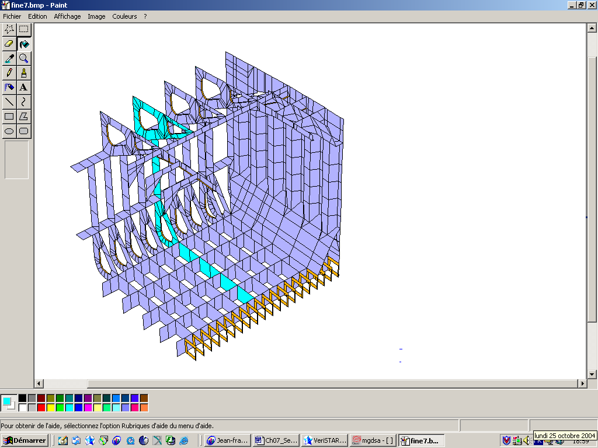
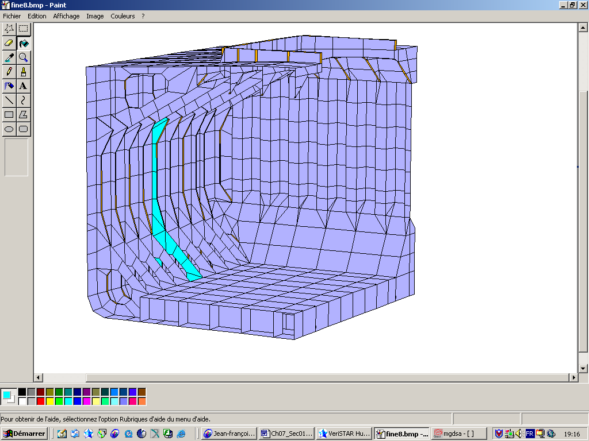
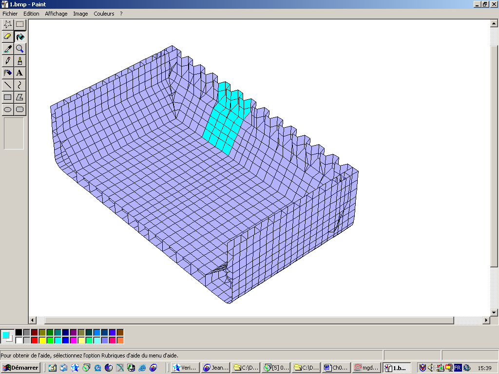
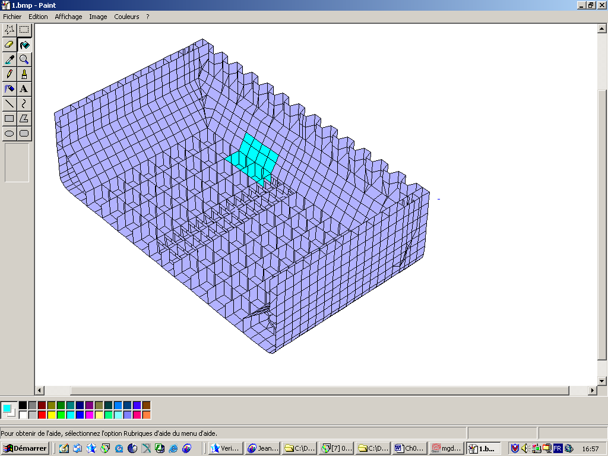
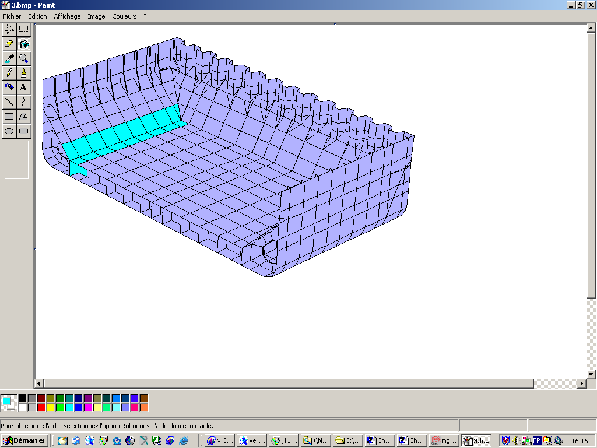
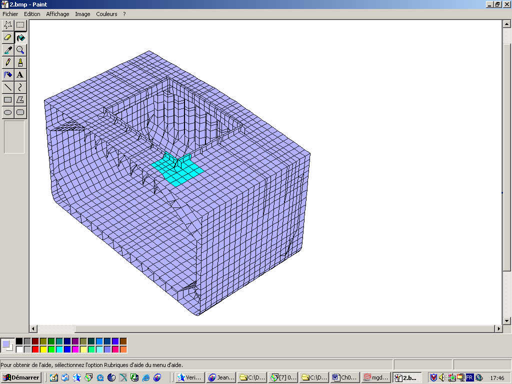

# PART 11 Common Structural Rules for Bulk Carriers

> RULES FOR CLASSIFICATION OF STEEL SHIPS / RA-11-E / 2025 / EN / Rules

## Chapter 7 Direct Strength Analysis

### Section 1 - DIRECT STRENGTH ASSESSMENT OF THE PRIMARY SUPPORTING MEMBERS

#### 1. General

- **1.1** Application
  - **1.1.1** Direct strength assessment of primary supporting members based on a three-dimensional (3D) finite element (FE) analysis is to be applied to ships having length *L* of 150 m or above.
  - **1.1.2** Three kinds of FE analysis procedures are specified in this Chapter:
    A flowchart of FE analysis procedure for direct strength assessment is shown in Fig 1.
    - **a)** global strength FE analysis (first FE analysis step) to assess global strength of primary supporting members of the cargo hold structure, according to Sec 2.
    - **b)** detailed stress assessment (second FE analysis step) to assess highly stressed areas with refined meshes, according to Sec 3
    - **c)** hot spot stress analysis (third FE analysis step) to calculate hot spot stresses at stress concentration points with very fine meshes for fatigue strength assessment, according to Sec 4.
- **1.2** Computer program
  - **1.2.1** Computer programs for FE analysis are to be suitable for the intended analysis. Reliability of unrecognized programs is to be demonstrated to the satisfaction of the Society prior to the commencement of the analysis.
- **1.3** Submission of analysis report
  - **1.3.1** A detailed report of direct strength FE analysis is to be submitted, including background information of the analysis. This report is to include the following items:
    - **a)** list of drawings/plans used in the analysis, including their versions and dates
    - **b)** detailed description of structural modeling principles and any deviations in the model from the actual structures
    - **c)** plots of structural model
    - **d)** material properties, plate thickness and beam properties used in the model
    - **e)** details of boundary conditions
    - **f)** all loading conditions analyzed
    - **g)** data for loads application
    - **h)** summaries and plots of calculated deflections
    - **i)** summaries and plots of calculated stresses
    - **j)** details of buckling strength assessment
    - **k)** tabulated results showing compliance with the design criteria
    - **l)** reference of the finite element computer program, including its version and date.
- **1.4** Net scantling
  - **1.4.1** Direct strength analysis is to be based on the net scantling approach according to Ch 3, Sec 2.
- **1.5** Applied loads
  - **1.5.1** Design loads
    Direct strength analysis is to be carried out by applying design loads given in Ch 4 at a probability level of $10 ^{-8}$, except for fatigue strength assessment where probability level is $10 ^{-4}$. Combination of static and dynamic loads which are likely to impose the most severe load regime are to be applied to the 3D FE model.
  - **1.5.2** Structural weight
    Effect of the hull structure weight is to be included in static loads, but is not to be included in dynamic loads. Standard density of steel is to be taken as 7.85 $\mathrm{t}/m ^{3}$.
  - **1.5.3** Loading conditions
    The loading conditions specified in Ch 4, Sec 7 are to be considered in 3D FE analysis.
    
    Fig 1: Flowchart of FE analysis procedure

### Section 2 - GLOBAL STRENGTH FE ANALYSIS OF CARGO HOLD STRUCTURES

Symbols
For symbols not defined in this Section, refer to Ch 1, Sec 4.
*M_SW* : Design vertical bending moment as defined in Ch 4, Sec 7, Table 2.
*M_WV* : Vertical wave bending moment, in hogging or sagging condition, as defined in Ch 4, Sec 3, [3.1.1]
*M_WH* : Horizontal wave bending moment, as defined in Ch 4, Sec 3, [3.3.1]
*Q_SW* : Allowable still water shear force at the considered bulkhead position as provided in Ch 4, Sec 7, Table 3
*Q_WV* : Vertical wave shear force as defined in Ch 4, Sec 3, [3.2.1]
*C_WV,* *C_WH* : Load combination factors, as defined in Ch 4, Sec 4, Table 3.

#### 1. General

- **1.1** Application
  - **1.1.1** The procedure given in this Section focuses on direct strength analysis of cargo hold structures in midship area.
  - **1.1.2** The global strength FE analysis of cargo hold structures is intended to verify that the following are within the acceptance criteria under the applied static and dynamic loads:
    - **a)** stress level in the hull girder and primary supporting members
    - **b)** buckling capability of primary supporting members
    - **c)** deflection of primary supporting members.

#### 2. Analysis model

- **2.1** Extent of model
  - **2.1.1** The longitudinal extent of FE model is to cover three cargo holds and four transverse bulkheads. The transverse bulkheads at the ends of the model extent are to be included, together with their associated stools. Both ends of the model are to form vertical planes and to include any transverse web frames on the planes if any. The details of the extent of the model are given in App 1.
  - **2.1.2** FE model is to include both sides of ship structures considering unsymmetrical wave-induced loads in the transverse direction.
  - **2.1.3** All main structural members are to be represented in FE model. These include inner and outer shell, floor and girder system in double bottom, transverse and vertical web frames, stringers, transverse and longitudinal bulkhead structures. All plates and stiffeners on these structural members are to be modelled.
- **2.2** Finite element modeling
  - **2.2.1** All main structural members (plates and stiffeners) detailed in [2.1.3] are to be represented in FE model.
  - **2.2.2** Mesh boundaries of finite elements are to simulate the stiffening systems on the actual structures as far as practical and are to represent the correct geometry of the panels between stiffeners.
  - **2.2.3** Stiffness of each structural member is to be represented correctly by using proper element type for the structural member. The principle for selection of element type is given below.
    (1) Stiffeners are to be modeled by beam or bar element having axial, torsional, bi-directional shear and bending stiffness. However, web stiffeners and face plates of primary supporting members may be modeled by rod element having only axial stiffness and a constant cross-sectional area along its length.
    (2) Plates are to be modeled by shell element having out-of-plane bending stiffness in addition to bi-axial and in-plane stiffness. However, membrane element having only bi-axial and in-plane stiffness can be used for plates that are not subject to lateral pressures.
    For membrane and shell elements, only linear quad or triangle elements, as shown in Fig 1, are to be adopted.
    
    Fig 1: Linear membrane and shell quad and triangle elements
    Triangle elements are to be avoided as far as possible, especially in highly stressed areas and in such areas around openings, at bracket connections and at hopper connections where significant stress gradient should be predicted.
    (3) Stiffened panels may be modeled by two-dimensional (2D) orthotropic elements that can represent the stiffness of the panels properly.
  - **2.2.4** When orthotropic elements are not used in FE model:
    • mesh size is to be equal to or less than the representative spacing of longitudinal stiffeners or transverse side frames
    • stiffeners are to be modeled by using rod and/or beam/bar elements
    • webs of primary supporting members are to be divided by at least three elements height-wise. However, for transverse primary supporting members inside hopper tank and top side tank, which are less in height than the space between ordinary longitudinal stiffeners, two elements on the height of supporting primary members are accepted.
    • side shell frames and their end brackets are to be modeled by using shell elements for web and shell/beam/rod elements for face plate. Webs of side shell frames need not be divided along the direction of depth
    • aspect ratio of elements is not to exceed 1:4.
    An example of typical mesh is given in App 1.
  - **2.2.5** When orthotropic elements are used in FE model for stiffened panels:
    • for the members such as the double bottom girder or floor, the element height is to be the double bottom height.
    • where a stiffener is located along the edge between two orthotropic elements, either it is to be modelled by using beam/rod element, or it is virtually modelled by reporting the stiffness of the stiffener onto the two orthotropic elements
    • where a stiffener is located along the edge between an orthotropic element and a membrane/shell element, it is to be modelled by using beam/rod element
    • where a stiffener is located along the edge between two membrane/shell elements, it is to be modelled by using beam/rod element
    • where a double hull is fitted, the web of the primary supporting members is to be modelled with one element on its height
    • where no double hull construction is fitted, at least one over three frame and its associated end brackets are to be modelled by using shell elements for the webs and shell/beam elements for the flanges
    • the aspect ratio of the elements is not to exceed 1:2.
- **2.3** Boundary conditions
  - **2.3.1** Both ends of the model are to be simply supported according to Table 1 and Table 2. The nodes on the longitudinal members at both end sections are to be rigidly linked to independent points at the neutral axis on the centreline as shown in Table 1. The independent points of both ends are to be fixed as shown in Table 2.

    | Nodes on longitudinal members at both ends of the model | Translational |   |   | Rotational |   |   |
    | --- | --- | --- | --- | --- | --- | --- |
    | Nodes on longitudinal members at both ends of the model | Dx | Dy | Dz | Rx | Ry | Rz |
    | All longitudinal members | RL | RL | RL | - | - | - |
    | RL means rigidly linked to the relevant degrees of freedom of the independent point |   |   |   |   |   |   |

    | Location of the independent point | Translational |   |   | Rotational |   |   |
    | --- | --- | --- | --- | --- | --- | --- |
    | Location of the independent point | Dx | Dy | Dz | Rx | Ry | Rz |
    | Independent point on aft end of model | - | Fix | Fix | Fix | - | - |
    | Independent point on fore end of model | Fix | Fix | Fix | Fix | - | - |
- **2.4** Loading conditions
  - **2.4.1** General
    The loading conditions, combined with loading patterns and load cases, as illustrated in Ch 4, App 2, are to be considered as mandatory conditions for the conventional designs.
- **2.5** Consideration of hull girder loads
  - **2.5.1** General
    Each loading condition is to be associated with its corresponding hull girder loads. The load combination is to be considered using Load Combination Factors (LCFs) of the wave-induced vertical and horizontal bending moments and of the wave-induced vertical shear forces specified in Ch 4, Sec 4 for each Load Case.
  - **2.5.2** Vertical bending moment analysis
    Vertical bending moment analysis is to be performed for cases listed in Ch 4, Sec 7, Table 2, the minimum required cases being listed in Ch 4, App 2.
    In vertical bending moment analysis the target hull girder loads are the maximum vertical bending moments which may occur at the centre of the mid-hold in the FE model. The target values of hull girder loads are to be obtained in accordance with Table 3 with considering still water vertical bending moments specified in Ch 4, Sec 7, Table 2, and in Ch 4, App 2.

    | Hull girder effect | Still water | Wave | Considered Location |
    | --- | --- | --- | --- |
    | Vertical bending moment | *M_SW* | *C_WVM_WV* | Centre of mid-hold |
    | Vertical shear force | 0 | 0 | Centre of mid-hold |
    | Horizontal bending moment | --- | *C_WHM_WH* | Centre of mid-hold |
    | Horizontal shear force | --- | 0 | Centre of mid-hold |
  - **2.5.3** Vertical shear force analysis
    Vertical shear force analysis is to be performed for cases listed in Ch 4, Sec 7, Table 3, the minimum required cases being listed in Ch 4, App 2.
    In vertical shear force analysis the target hull girder loads are the maximum vertical shear force which may occur at one of the transverse bulkheads of the mid-hold in the FE model. Reduced vertical bending moments are considered simultaneously. The target values of hull girder loads are to be obtained in accordance with Table 4 with considering still water vertical bending moments and shear forces specified in Ch 4, Sec 7, Table 2 and Ch 4, Sec 7, Table 3, and in Ch 4, App 2.

    | Hull girder effect | Still water | Wave | Location |
    | --- | --- | --- | --- |
    | Vertical bending moment | 0.8 *M_SW* | 0.65 *C_WVM_WV* | Transverse bulkhead |
    | Vertical shear force | *Q_SW* | *Q_WV* | Transverse bulkhead |
    | Horizontal bending moment | --- | 0 | Transverse bulkhead |
    | Horizontal shear force | --- | 0 | Transverse bulkhead |
  - **2.5.4** Influence of local loads
    The distribution of hull girder shear force and bending moment induced by local loads applied on the model are calculated using a simple beam theory for the hull girder.
    Reaction forces at both ends of the model and distributions of shearing forces and bending moments induced by local loads can be determined by following formulae:
     
     
     when 
     when 
     when 
     when 
    where:
     : Location of the aft end support,
     : Location of the fore end support,
     : Considered location,
    ,, and  : Vertical and horizontal reaction forces at the fore and aft ends
    ,, and  : Vertical and horizontal shear forces and bending moments created by the local loads applied on the FE model. Sign of *Q_V_FEM*, *M_V_FEM* and *M_H_FEM* is in accordance with the sign convention defined in Ch 4, Sec 3. The sign convention for reaction forces is that a positive creates a positive shear force.
     : Applied force on node *i* due to all local loads,
     : Longitudinal coordinate of node *i*.
  - **2.5.5** Methods to account for hull girder loads
    For bending moment analysis, two alternative methods can be used to consider the hull girder loads/stresses in the assessment of the primary supporting members:
    For shear force analysis, the “direct method” is to be used.
    - **a)** to add the hull girder loads directly to FE model (direct method), or
    - **b)** to superimpose the hull girder stresses separately onto the stresses obtained from the structural analysis using the lateral loads (superimposition method).
  - **2.5.6** Direct method
    In direct method the effect of hull girder loads are directly considered in 3D FE model. The equilibrium loads are to be applied at both model ends in order to consider the hull girder loads as specified in [2.5.2] and [2.5.3] and influence of local loads as specified in [2.5.4].
    In order to control the shear force at the target locations, two sets of enforced moments are applied at both ends of the model. These moments are calculated by following formulae:
    
    
    In order to control the bending moments at the target locations, another two sets of enforced moments are applied at both ends of the model. These moments are calculated by following formulae:
    
    
    where:
     : Considered location for the hull girder loads evaluation,
    ,,, : As defined in [2.5.4]
    ,,, : Target vertical and horizontal shear forces and bending moments, defined in Table 3 or Table 4, at the location . Sign of *Q_V_T*, *M_V_T* and *M_H_T* is in accordance with sign convention defined in Ch 4, Sec 3.
    ,,, : Enforced moments to apply at the aft and fore ends for vertical shear force and bending moment control, positive for clockwise around *y*-axis. The sign convention for *M_Y_aft_SF*, *M_Y_fore_SF*, *M_Y_aft_BM* and *M_Y_fore_BM* is that of the FE model axis. The sign convention for other bending moment, shear forces and reaction forces is in accordance with the sign convention defined in Ch 4, Sec 3.
    ,,, : Enforced moments to apply at the aft and fore ends for horizontal shear force and bending moment control, positive for clockwise around *z*-axis. The sign convention for *M_Z_aft_SF*, *M_Z_fore_SF*, *M_Z_aft_BM* and *M_Z_fore_BM* is that of the FE model axis. The sign convention for other bending moment, shear forces and reaction forces is in accordance with the sign convention defined in Ch 4, Sec 3.
    The enforced moments at the model ends can be generated by one of the following methods:
    • to apply distributed forces at the end section of the model, with a resulting force equal to zero and a resulting moment equal to the enforced moment. The distributed forces are applied to the nodes on the longitudinal members where boundary conditions are given according to Table 1. The distributed forces are to be determined by using the thin wall beam theory
    • to apply concentrated moments at the independent points defined in [2.3.1].
  - **2.5.7** Superimposition method
    For vertical bending moment analysis in the superimposition method, the stress obtained from the following formula is to be superimposed to the longitudinal stress of each element in longitudinal members obtained from 3D FE analysis. Vertical shear force analyses are to be in accordance with [2.5.6].
    
    where
    *M_V_T,* *M_H_T* : Target vertical and horizontal bending moments at considering section, respectively, with corrections due to local loads, taken equal to:
    
    *I_Y* : Vertical inertia of the section around horizontal neutral axis, calculated according to Ch 3, Sec 2, [3.2.1]
    *I_Z* : Horizontal inertia of the section, calculated according to Ch 3, Sec 2, [3.2.1]
    *N* : *Z* co-ordinate of the centre of gravity of the hull transverse section, as defined in Ch 5, Sec 1
    *y* : *Y* co-ordinate of the element
    *z* : *Z* co-ordinate of the element.

#### 3. Analysis criteria

- **3.1** General
  - **3.1.1** Assessment holds
    All the primary supporting members in the mid-hold of the three-hold (1+1+1) FE model, including bulkheads, are to be evaluated in 3D FE analysis.
  - **3.1.2** The results of the structural analysis are to satisfy the criteria for yielding strength, buckling strength and deflection of primary members.
- **3.2** Yielding strength assessment
  - **3.2.1** Reference stresses
    Reference stress is Von Mises equivalent stress at the centre of a plane element (shell or membrane) or axial stress of a line element (bar, beam or rod) obtained by FE analysis through considering hull girder loads according to [2.5.4] or [2.5.5].
    Where the effects of openings are not considered in the FE model, the reference stresses in way of the openings are to be properly modified with adjusting shear stresses in proportion to the ratio of web height and opening height.
    Where elements under assessment are smaller than the standard mesh size specified in [2.2.4] or [2.2.5], the reference stress may be obtained from the averaged stress over the elements within the standard mesh size.
  - **3.2.2** Equivalent stress
    Von Mises equivalent stress is given by the following formula:
    
    $\sigma _{x}$, $\sigma _{y}$ : Element normal stresses, in $\mathrm{N}/mm ^{2}$
    $\tau _{xy}$ : Element shear stress, in $\mathrm{N}/mm ^{2}$
    In superimposition method, the stress $\sigma _{S IM}$, defined in [2.5.7], is to be superimposed onto to longitudinal stress component.
  - **3.2.3** Allowable stress
    The reference stresses in FE model that does not include orthotropic elements, as specified in [2.2.4], are not to exceed 235/*k* $\mathrm{N}/mm ^{2}$, where *k* is the material factor defined in Ch3, Sec1.
    The reference stresses in FE model that includes orthotropic elements, as specified in [2.2.5], are not to exceed 205/*k* $\mathrm{N}/mm ^{2}$,where *k* is the material factor defined in Ch3, Sec1.
- **3.3** Buckling and ultimate strength assessment
  - **3.3.1** General
    Buckling and ultimate strength assessment is to be performed for the panels on primary supporting members according to Ch 6, Sec 3.
  - **3.3.2** Stresses of panel
    The stresses in each panel are to be obtained according to the following procedures:
    1) when the mesh model differs from the elementary plate panel geometry, the stresses $\sigma _{x}$,$\sigma _{y}$ and $\tau$ acting on an elementary plate panel are to be evaluated by extrapolation and/or interpolation of surrounding meshes using the elements stresses or using the displacement based method described in App 2.
    2) stresses obtained from with superimposed or direct method have to be reduced for buckling assessment because of the Poisson effect, which is taken into consideration in both analysis methods. The correction has to be carried out after summation of stresses due to local and global loads.
    When the stresses  and  are both compressive stresses, a stress reduction is to be made according to the following formulae:
    
    Where compressive stress fulfils the condition , then  and 
    Where compressive stress fulfils the condition , then  and 
    , : Stresses containing the Poisson effect
    3) determine stress distributions along edges of the considered buckling panel by introducing proper linear approximation as shown in Fig 2.
    4) calculate edge factor $\Psi$ according to Ch 6, Sec 3.
    
    Fig 2: Stresses of panel for buckling assessment
  - **3.3.3** Boundary conditions
    Buckling load cases 1, 2, 5 or 6 of Ch 6, Sec 3, Table 2 are to be applied to the buckling panel under evaluation, depending on the stress distribution and geometry of openings.
    If the actual boundary conditions are significantly different from simple support condition, another case in Ch 6, Sec 3, Table 2 can be applied.
  - **3.3.4** Safety factor
    The safety factor for the buckling and ultimate strength assessment of the plate is to be taken equal to 1.0.
- **3.4** Deflection of primary supporting members
  The relative deflection, $\delta _{\max}$, in mm, in the outer bottom plate obtained by FEA is not to exceed the following criteria:
  
  where:
   : Maximum relative deflection, in mm, obtained by the following formula, and not including secondary deflection
  
  where,  and  are shown in Fig 3.
   : Length or breadth of the flat part of the double bottom, in mm, whichever is the shorter.
  
  Fig 3: Definition of relative deflection

### Section 3 - DETAILED STRESS ASSESSMENT

#### 1. General

- **1.1** Application
  - **1.1.1** This Section describes the procedure for the detailed stress assessment with refined meshes to evaluate highly stressed areas of primary supporting members.
    Where the global cargo hold analysis of Sec 2 is carried out using a model complying with the modeling criteria of Sec 2, [2.2.4], the areas listed in Table 1 are to be refined at the locations whose calculated stresses exceed 95 % for non-orthotropic elements or 85 % for orthotropic element but do not exceed 100 % of the allowable stress as specified in Sec 2, [3.2.3].

#### 2. Analysis model

- **2.1** Areas to be refined
  - **2.1.1** Where the global cargo hold analysis of Sec 2 is carried out using a model complying with the modeling criteria of Sec 2, [2.2.4], the areas listed in Table 1 are to be refined at the locations whose calculated stresses exceed 95 % of the allowable stress as specified in Sec 2, [3.2.3].
  - **2.1.2** Where the global cargo hold analysis of Sec 2 is carried out using a model complying with the modeling criteria of Sec 2, [2.2.5], all the high stressed areas listed below are to be refined:
    • areas whose calculated stresses exceed 85 % of the allowable stress as specified in Sec 2, [3.2.3].
    • typical details of the primary supporting members as shown in Table 1.
    • typical details of the transverse bulkheads of the considered hold as shown in Table 1.

    | Structural member | Area of interest | Additional specifications | Description |
    | --- | --- | --- | --- |
    | Primary supporting member | Most stressed transverse primary supporting member for double side skin constructions | Refining of the most stressed transverse primary supporting members located in: • double bottom • hopper tank • double skin side • topside tank |  |
    | Primary supporting member | Most stressed transverse primary supporting member for single side skin constructions | Refining of the most stressed transverse primary supporting members located in: • double bottom • hopper tank • topside tank side shell frame with end brackets and connections to hopper tank and topside tank |  |
    | Transverse bulkhead and its associated lower stool | Most stressed connection of the corrugations with the lower stool | High stressed elements, including the diaphragm(s) of the lower stool, are to be modeled |  |
    | Transverse bulkhead and its associated lower stool | Most stressed connection of the lower stool with the inner bottom | High stressed elements are to be modeled |  |

    | Structural member | Area of interest | Additional specifications | Description |
    | --- | --- | --- | --- |
    | Inner bottom and hopper sloping plates with their associated supporting members | Most stressed connection of the inner bottom with the hopper sloping plate | Refining of the most stressed following members: • inner bottom • hopper sloping plate • floor • girder |  |
    | Deck plating | Deck plating in way of the most stressed hatch corners | High stressed elements are to be modeled |  |
- **2.2** Refining method
  - **2.2.1** Two methods can be used for refining the high stressed areas:
    • refined areas can be directly included in FE model used for the global cargo hold analysis of Ch 7, Sec 2 (See Fig 1).
    • detailed stresses in refined areas can be analysed by separate sub-models.
    
    Fig 1: “Direct” modelling with refined meshes
- **2.3** Modeling
  - **2.3.1** Element type
    Each structural members is to be modeled by using proper element type for the structure in accordance with the principle in Sec 2, [2.2.3]. Orthotropic elements are not to be used in refined areas.
  - **2.3.2** Mesh
    The element size in refined areas is to be approximately one fourth of the representative spacing of ordinary stiffeners in the corresponding area, i.e. 200 × 200 mm mesh size for structures whose ordinary stiffener spacing is 800 mm.
    In addition, the web height of primary supporting members and web frames of single side bulk carriers is to be divided at least into 3 elements.
    The aspect ratio of element is not to exceed 3. Quad elements are to have 90° angles as much as practicable, or to have angles between 45° and 135°.
  - **2.3.3** Extent of sub-model
    The minimum extent of sub-model is to be such that the boundaries of the sub-model correspond to the locations of adjacent supporting members (see Fig 2).
    
    Fig 2: Boundaries of sub-models
- **2.4** Loading conditions
  - **2.4.1** Loading conditions, which are applied to 3D FE model for the global cargo hold analysis according to Sec 2 and which induce stresses at considered locations exceeding the criteria specified in [2.1], are to be considered in the detailed stress assessment.
- **2.5** Boundary conditions
  - **2.5.1** Boundary conditions as specified in Sec 2, [2.3.1] are to be applied to the global cargo hold FE model with refined meshes.
  - **2.5.2** Nodal forces or nodal displacements obtained from the global cargo hold analysis of Sec 2 are to be applied to the sub-models. Where nodal forces are given, the supporting members located at the boundaries of a sub-model are to be included in the sub-model. Where nodal displacements are given and additional nodes are provided in sub-models, nodal displacements at the additional nodes are to be determined by proper interpolations.

#### 3. Analysis criteria

- **3.1** Allowable stress
  - **3.1.1** Von Mises equivalent stresses in plate elements and axial stresses in line elements within refined areas are not to exceed 280/*k* $\mathrm{N}/mm ^{2}$, where *k* is the material factor defined in Ch 3, Sec 1.
    In case elements significantly smaller than the size defined in [2.3.2] are used, this criteria applies to the average stress of all elements included in an area corresponding to a single element having the size specified in [2.3.2].

### Section 4 - HOT SPOT STRESS ANALYSIS FOR FATIGUE STRENGTH ASSESSMENT

#### 1. General

- **1.1** Application
  - **1.1.1** This Section describes the procedure to compute hot spot stresses for fatigue strength assessment of each location specified in Ch 8, Sec 1, Table 1 by using finite element method.
  - **1.1.2** The loading conditions and the load cases specified in [2.2] are to be considered for hot spot stress analysis.

#### 2. Analysis model

- **2.1** Modeling
  - **2.1.1** Hot spot stresses for fatigue assessment are to be obtained by the global cargo hold models where the areas for fatigue assessment are modeled by very fine meshes, as shown in Fig 1.
    Alternatively, hot spot stresses can be obtained from sub-models, by using the similar procedures specified in Sec 3, [2].
  - **2.1.2** Areas within at least a quarter of frame spacing in all directions from the hot spot position are to be modeled by very fine meshes. The element size in very fine mesh areas is to be approximately equal to the representative net thickness in the assessed areas, and the aspect ratio of elements is to be close to 1.
  - **2.1.3** The mesh size is to be gradually changed from very fine mesh to fine mesh through the transition areas as shown in Fig 2. All structural members, including brackets, stiffeners, longitudinals and faces of transverse rings, etc., within transition areas are to be modeled by shell elements with bending and membrane properties. Geometries of welds are not to be modeled.
    
    
    
    Fig 1: Example of very fine mesh model
    
    Fig 2: Very fine mesh area, transition area and fine mesh area
    - **(a)** Part of global cargo hold model with very fine mesh
    - **(b)** Bilge hopper knuckle part
    - **(c)** End of hold frame (d) Longitudinal
- **2.2** Loading conditions
  - **2.2.1** The loading conditions, specified in Ch 8, Sec 1, Table 2 and illustrated in Ch 4, App 3, are to be considered.
  - **2.2.2** Probability level of $10 ^{-4}$ is to be used for calculation of design loads.
- **2.3** Boundary conditions
  - **2.3.1** The boundary conditions specified in Sec 2, [2.3.1] are to be applied to the cargo hold model with localized very fine meshes or the mother model for sub-models. When using sub-models, nodal displacements or forces obtained from the mother model are to be applied to sub-models.

#### 3. Hot spot stress

- **3.1** Definition
  - **3.1.1** The hot spot stress is defined as the structural geometric stress on the surface at a hot spot.
  - **3.1.2** The hot spot stresses obtained by using superimposition method are to be modified according to Ch 8, Sec 3, [2.2] and [3.2].
- **3.2** Evaluation of hot spot stress
  - **3.2.1** The hot spot stress in a very fine mesh is to be obtained using a linear extrapolation. The surface stresses located at 0.5 times and 1.5 times the net plate thickness are to be linearly extrapolated at the hot spot location, as described in Fig 3 and Fig 4.
    The principal stress at the hot spot location having an angle with the assumed fatigue crack greater than 45° is to be considered as the hot spot stress.
    
    Fig 3: Definition of hot spot stress at an intersection of two plates
    
    Fig 4: Definition of hot spot stress at an intersection of plating and bracket
  - **3.2.2** The hot spot stress at the intersection of two plates, as obtained from [3.2.1], is to be multiplied by the correction factor *l* defined below, considering the difference between the actual hot spot location and assumed location and the difference of stress gradient depending on the angle $\theta$, in deg, between the two plates, to be measured between 0° and 90°.
    • welded intersection between plane plates: 
    • welded intersection between bent plate and plane plate: (i.e. bend type bilge knuckle part)
  - **3.2.3** The hot spot stress in a non-welded area or along free edge is to be determined by extrapolating the principal stresses of the two adjacent elements, as shown in Fig 5.
    
    Fig 5: Definition of the hot spot stress along free edge
- **3.3** Simplified method for the bilge hopper knuckle part
  - **3.3.1** At the bilge knuckle part, the hot spot stress *σ_hotspot* may be computed by multiplying the nominal stress*σ_nominal* with the stress concentration factor *K_gl* defined in [3.3.3].
    
  - **3.3.2** The nominal stress at the hot spot location is to be determined by extrapolating the membrane stresses located at 1.5 times and 2.5 times the frame spacing from the hot spot location, as shown in Fig 6.
    
    Fig 6: Definition of nominal stress at the bilge hopper knuckle part
  - **3.3.3** The geometrical stress concentration factor *K_gl* for the bilge hopper knuckle part is given by the following equation:
    
    where:
    *K*_0 : Stress concentration factor depending on the dimensions of the considered structure, defined in Table 1
    *K*_1 : Correction coefficient depending on the type of knuckle connection, defined in Table 2
    *K*_2 : Correction coefficient depending on the thickness increment of the transverse web, defined in Table 2 or taken equal to 1.0 if there is no thickness increment
    *K*_3 : Correction coefficient depending on the insertion of horizontal gusset or longitudinal rib (see Fig 7), defined in Table 2 or taken equal to 1.0 if there is no horizontal gusset or longitudinal rib
    *K*_4 : Correction coefficient depending on the insertion of transverse rib, defined in Table 2 (see Fig 8) or taken equal to 1.0 if there is no transverse rib

    | Plate net thickness in FE model $t$ (mm) | Angle of hopper slope plate to the horizontal $\theta$(deg.) |   |   |   |
    | --- | --- | --- | --- | --- |
    | Plate net thickness in FE model $t$ (mm) | 40 | 45 | 50 | 90 |
    | 16 | 3.0 | 3.2 | 3.4 | 4.2 |
    | 18 | 2.9 | 3.1 | 3.3 | 4.0 |
    | 20 | 2.8 | 3.0 | 3.2 | 3.8 |
    | 22 | 2.7 | 2.9 | 3.1 | 3.6 |
    | 24 | 2.6 | 2.8 | 3.0 | 3.5 |
    | 26 | 2.6 | 2.7 | 2.9 | 3.4 |
    | 28 | 2.5 | 2.7 | 2.8 | 3.3 |
    | 30 | 2.4 | 2.6 | 2.7 | 3.2 |
    | Note: Alternatively, $K _{0}$ can be determined by the following formula.  |   |   |   |   |

    | Type of knuckle | $K _{1}$ | $K _{2}$ | $K _{3}$ | $K _{4}$ |
    | --- | --- | --- | --- | --- |
    | Weld Type | 1.7 | 0.9 | 0.9 | 0.9 |
    | Bend Type |  | 0.9 |  | 0.9 |
    | Notes : (1) The linear interpolation is applied between $4 \leq R/t \leq 8$ “*R*” denotes the radius of bend part and “$t$” denotes the plate thickness (2) In using the correction coefficient $K _{2}$, the members should be arranged such that the bending deformation of the radius part is effectively suppressed. (3) The increase in web thickness is taken based on the plate thickness of the inner bottom plating. |   |   |   |   |

    
    Fig 7: Example of insertion of horizontal gusset or longitudinal rib
    
    Fig 8: Example of insertion of transverse rib

### Appendix 1 - LONGITUDINAL EXTENT OF THE FINITE ELEMENT MODELS

#### 1. Longitudinal extent

A three-hold length finite element model is recommended for the analysis, with the mid-hold as the target of assessment.
The three-hold length finite element model reduces the adverse effects of the boundary conditions to a minimum in the assessed mid-hold.

Fig 1: Longitudinal extent of the finite element model

Fig 2: Example of a finite element model

#### 2. Typical Mesh

Fig 3: Typical mesh of a web frame

### Appendix 2 - DISPLACEMENT BASED BUCKLING ASSESSMENT IN FINITE ELEMENT ANALYSIS

Symbols
For symbols not defined in this Section, refer to Ch 1, Sec 4.
*a* : Length of the longer plate panel side
*b* : Length of the shorter plate panel side
*x* : Direction parallel to *a*, taken as the longitudinal direction
*y* : Direction parallel to *b*, taken as the transverse direction
*C* : Coefficient taken equal to:
for 4-node buckling panel: 
for 8-node buckling panel: 
*v* : Poisson ratio
*m* : Coefficient taken equal to:

#### 1. Introduction

- **1.1**
  - **1.1.1** This Appendix provides a method to obtain the buckling stresses and edge stress ratios for elementary plate panels (EPP) from a finite element calculation. This method is called “Displacement Method”.

#### 2. Displacement method

- **2.1** General
  - **2.1.1** As the mesh of the finite elements does not correspond, in general, to the buckling panels the nodal points of the EPP can be mapped onto the FE-mesh and the displacements of these nodes can be derived from the FE-calculation.
    Whenever operations on displacements are performed, full numerical accuracy of the displacements should be used.
  - **2.1.2** 4-node and 8-node panels
    When the aspect ratio of the EPP is less than 3 and the variation of the longitudinal stresses in longitudinal direction of the EPP is small, a 4-node panel may be used. Otherwise an 8-node panel is to be taken.
  - **2.1.3** Calculation of nodal displacements
    Three different node locations are possible:
    • If a node of the buckling panel is located at an FE-node, then the displacements can be transferred directly.
    • If a node of the buckling panel is located on the edge of a plane stress element, then the displacements can be linearly interpolated between the FE-nodes at the edge.
    • If a node of the buckling panel is located inside of an element, then the displacements can be obtained using bi-linear interpolation of all nodes of the element.
  - **2.1.4** Transformation in local system
    The transformation of the nodal displacements from the global FE-system into the local system of the buckling panel is performed by
    
    where:
     : Local displacement vector
     : Global displacement vector
     : Transformation matrix (2×3), of direction cosines of angles formed between the two sets of axes.
- **2.2** Calculation of buckling stresses and edge stress ratios
  - **2.2.1** The displacements, derived at the corners of the elementary plate panel, are to be considered as input from which the stresses at certain stress-points are derived. In the 4-node buckling panel these points are identical but in the 8-node buckling panel they differ. The locations and the numbering convention may be taken from Fig 1 and Fig 2.
    The derived stresses at EPP corner nodes can be directly used as input for the buckling assessment according Ch 6, Sec 3. The buckling load cases, which have to be considered in the FEM buckling assessment and defined in Ch 7 are buckling load cases 1, 2 and 5 of Ch 6, Sec 3, Table 2 and 1a, 1b, 2 and 4 of Ch 6, Sec 3, Table 3. In special cases, other buckling load cases may be used for the buckling assessment by a hand calculation.
  - **2.2.2** 4-node buckling panel
    Stress displacement relationship for a 4-node buckling panel (compressive Stresses are positive)
    
    Fig 1: 4-node buckling panel
    From the displacements of the EPP corner nodes the stresses of these nodes can be obtained using
    
    where:
     : Element stress vector
     : Local node displacement vector
    If both  and  are compressive stresses then the stresses sx and sy must be obtained as follows:
    
    Where compressive stress fulfils the condition , then  and 
    Where compressive stress fulfils the condition , then  and 
    This leads to the following stress vector:
    
    Finally the relevant buckling stresses and edge stress ratios are obtained by:
    • LC 1: longitudinal compression
    
    • LC 2: transverse compression
    
    • LC 5: shear
    
  - **2.2.3** 8-node buckling panel
    Stress displacement relationship for a 8-node buckling panel (compressive stresses are positive)
    
    Fig 2: 8-node buckling panel
    From the displacements of the EPP corner nodes the stresses of these nodes and on mid positions can be obtained using:
    
    where:
    
    
    If both  and  are compressive stresses then the stresses sx and sy must be obtained as follows:
    
    Where compressive stress fulfils the condition , then  and 
    Where compressive stress fulfils the condition , then  and 
    This leads to the following stress vector:
    
    The relevant buckling stresses can be obtained by:
    • LC 1: longitudinal compression
    
    • LC 2: transverse compression
    
    • LC 5: shear
     
