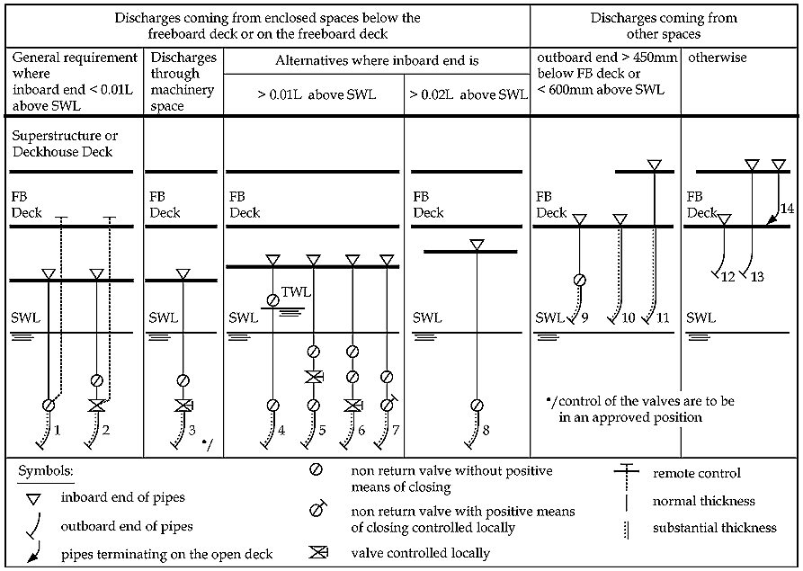

# PART 12 Common Structural Rules for Double Hull Oil Tankers

> RULES FOR CLASSIFICATION OF STEEL SHIPS / RA-12-E / 2025 / EN / Rules

## Chapter 11 General Requirements

### 1 Hull Openings and Closing Arrangements

#### 1.1 Shell and Deck Openings

- **1.1.1** General

#### 1.1.1.1

For closing appliances for openings in superstructures, deck house sides and ends see 1.4. For overflows and vents, and for discharges and inlets, see 1.5.

#### 1.1.1.2

For testing requirements, see Sub-Sec 5.

- **1.1.2** Cargo tank hatches - materials

#### 1.1.2.1

Covers for access hatches, tank cleaning and other openings for cargo tanks and adjacent spaces are to be manufactured from the following material:

- **(a)** normal strength steel in accordance with Sec 6/1
- **(b)** non-ferrous material such as bronze or brass may be considered; however, aluminium alloy is not to be used for covers of any opening to cargo tanks and spaces adjacent thereto
- **(c)** synthetic materials may also be considered, taking into account their fire resistance and physical and chemical properties in relation to the intended operating conditions. Details of the properties of the material, the design of the cover, and the method of manufacture are to be submitted for approval.

#### 1.1.2.2

The hatch cover packing material is to be compatible with the cargoes that are intended to be carried and is to be effectively held in place.

- **1.1.3** Cargo tank access coamings

#### 1.1.3.1

The height of the hatch coaming above the upper surface of the freeboard deck is not to be less than 600 mm. Lower heights may be permitted by the Flag Administration. The top of the hatch coaming is also not to be lower than the highest point of the tank over which it is fitted and is to be of sufficient height for the purpose of damage stability.

#### 1.1.3.2

The gross thickness of the coaming plate is not to be less than 10 mm. Where the coaming height, as fitted, exceeds 600 mm, the thickness may be required to be increased or edge stiffening fitted. The scantlings of coaming plates of tank access coamings that enclose an area of 1.2 $\mathrm{m}^{ 2}$ or more, and/or those that are not configured with a well rounded shape, may be subject to additional requirements.

- **1.1.4** Cargo tank access hatch covers

#### 1.1.4.1

The gross thickness of unstiffened plate covers with an area less than 1.2 $\mathrm{m}^{ 2}$ is not to be less than 12.5 mm. The gross thickness of covers of a larger area will need to be increased or the cover will require stiffening.

#### 1.1.4.2

Flat and unstiffened covers on circular hatchways are to be secured by fastenings with a spacing of not more than 600 mm.

#### 1.1.4.3

On rectangular hatchways, the spacing of fastenings is generally not to be greater then 450 mm and the distance between hatch corners, and adjacent fastenings, is not to be greater than 230 mm.

#### 1.1.4.4

The requirements of 1.1.4.1 to 1.1.4.3 do not apply to dished covers or covers of other specially approved design.

#### 1.1.4.5

Where the cover is hinged, adequate stiffening of the coaming and cover in way of the hinge is to be provided. In general, hinges are not to be considered securing devices for the cover and should be designed so as to prevent the gasket from being over tightened.

- **1.1.5** Machinery access openings - protection

#### 1.1.5.1

Machinery casings are generally to be protected by an enclosed poop or bridge; or by a deck house structure complying with the strength requirements of 1.4.

#### 1.1.5.2

Where a vessel is intended to operate at the freeboard allowed by the *International Convention on Load Lines* for Type-A freeboard vessels, the height of such structure is not to be less than 2.3 m. The bulkheads at the forward ends of these structures are to have scantlings at least equivalent to those required for bridge-front bulkheads, see 1.4.9 and 1.4.13.

- **1.1.6** Small hatches on the exposed fore deck

#### 1.1.6.1

Openings to forward spaces as defined in 1.1.6.2 are to comply with the requirements of 1.1.6.3 to 1.1.6.14.

#### 1.1.6.2

These requirements apply to small hatches (generally openings 2.5 $\mathrm{m}^{ 2}$ or less) on the exposed deck within 0.25 *L* from the F.P. and at a height less than 0.1 *L* or 22 m, whichever is less, from the summer load water line at the location of the hatch.

#### 1.1.6.3

Hatches designed for emergency escape need not comply with 1.1.6.9(a), 1.1.6.9(b), 1.1.6.13 and 11.6.14.

#### 1.1.6.4

For small rectangular steel hatch covers, the plate thickness, stiffener arrangement and scantlings are to be in accordance with Table 11.1.1 and Fig 11.1.1.

#### 1.1.6.5

Stiffeners, where fitted, are to be aligned with the metal to metal contact points required by 1.1.6.10 and 1.1.6.11. See also Fig 11.1.1. Primary stiffeners are to be continuous. All stiffeners are to be welded to the inner edge stiffener. See Fig 11.1.2.

#### 1.1.6.6

The upper edge of the hatchway coaming is to be suitably reinforced by a horizontal member, normally not more than 190 mm from the upper edge of the coaming.

#### 1.1.6.7

For small hatch covers of circular or similar shape, the cover plate thickness and reinforcement is to provide strength and stiffness equivalent to the requirements for small rectangular hatches.

#### 1.1.6.8

For small hatch covers constructed of materials other than normal strength steel, the required scantlings are to provide equivalent strength and stiffness.

#### 1.1.6.9

The primary securing devices are to be such that the hatch cover can be secured in place and be made weathertight by means of a closing mechanism employing any one of the following methods:
Dogs (twist tightening handles) with wedges are not acceptable.

- **(a)** butterfly nuts tightening onto forks (clamps)
- **(b)** quick acting cleats, or
- **(c)** a central locking device.

#### 1.1.6.10

The hatch cover is to be fitted with a gasket of elastic material. This is to be designed to allow a metal to metal contact at a designed compression and to prevent over compression of the gasket by green sea forces that may cause the securing devices to be loosened or dislodged.

#### 1.1.6.11

The metal to metal contacts are to be arranged close to each securing device as shown in Fig 11.1.1, and are to be of sufficient capacity to withstand the bearing force.

#### 1.1.6.12

The primary securing method is to be designed and manufactured such that the designed compression pressure can be achieved by one person without the need for any tools.

#### 1.1.6.13

For a primary securing method using butterfly nuts, the forks (clamps) are to be of robust design. They are to be designed to minimize the risk of butterfly nuts being dislodged while in use, by means of curving the forks upward and raising the surface on the free end, or a similar method. The gross plate thickness of unstiffened steel forks is not to be less than 16 mm. An example arrangement is shown in Fig 11.1.2.

#### 1.1.6.14

Small hatches on the exposed fore deck are to be fitted with an independent secondary securing device, e.g. by means of a sliding bolt, a hasp or a backing bar of slack fit, which is capable of keeping the hatch cover in place, even in the event that the primary securing device becomes loosened or dislodged. It is to be fitted on the side opposite to the hatch cover hinges.

#### 1.1.6.15

For small hatch covers located on the exposed deck within the forward 0.25 *L* from the F.P., the hinges are to be fitted such that the predominant direction of green sea will cause the cover to close, which means that the hinges are normally to be located on the fore edge.

**Table 11.1.1 Scantlings for Small Steel Hatch Covers on the Fore Deck**

| Nominal size (mm × mm) | Cover plate gross thickness (mm) | Primary stiffeners | Secondary stiffeners |
| --- | --- | --- | --- |
| Nominal size (mm × mm) | Cover plate gross thickness (mm) | Gross flat bar scantlings (mm × mm); number |   |
| 630 × 630 | 8 | --- | --- |
| 630 × 830 | 8 | 100 × 8; 1 | --- |
| 830 × 630 | 8 | 100 × 8; 1 | --- |
| 830 × 830 | 8 | 100 × 10; 1 | --- |
| 1030 × 1030 | 8 | 120 × 12; 1 | 80 × 8; 2 |
| 1330 × 1330 | 8 | 150 × 12; 2 | 100 × 10; 2 |

| Fig 11.1.1 Arrangement of Stiffeners |
| --- |
|  |
| #underline{Note} 1. Size dimensions are in millimeter |

| Fig 11.1.2 Example of a Primary Securing Method |
| --- |
|  |

- **1.1.7** Manholes and flush deck scuttles

#### 1.1.7.1

Manholes and flush deck scuttles in Position 1 or Position 2, as defined in *S*ec 4/1.2, or within superstructures, other than enclosed superstructures, are to be closed by substantial covers capable of being made watertight.

#### 1.1.7.2

The strength of watertight manholes is to be equivalent to that of the deck.

#### 1.1.7.3

Unless secured by closely spaced bolts, the covers are to be permanently attached.

- **1.1.8** Other openings

#### 1.1.8.1

Openings in freeboard decks other than hatchways, machinery space openings, manholes and flush scuttles are to be protected by an enclosed superstructure, or by a deck house or companionway of equivalent strength and weathertightness. Any such opening in an exposed superstructure deck, or in the top of a deck house on the freeboard deck, which gives access to a space below the freeboard deck or a space within an enclosed superstructure, is to be protected by an efficient deck house or companionway, as defined in 1.4.

- **1.1.9** Escape openings

#### 1.1.9.1

The closing appliances of escape openings are to be readily operable from each side.

#### 1.1.10

Rope hatches

#### 1.1.10.1

Rope hatches may be accepted with reduced coaming height, but generally not less than 380mm, provided that they are well secured and can be opened only at the Master's discretion. The gross thickness of the coaming is to be not less than the Rule minimum gross thickness for hull envelope plating for that position, or 11 mm, whichever is the lesser.

#### 1.1.11

Portable plates

#### 1.1.11.1

Where portable plates are required in casings or decks, for unshipping machinery or other similar reasons, they may be accepted provided that they are of equivalent strength to the un-pierced bulkhead or deck. Portable plates may be fitted with flush covers and they are to be secured by gaskets and closely spaced bolts at a distance not greater than five bolt diameters.

#### 1.1.11.2

The sill heights of access openings and the coaming heights of deck openings, closed by covers which are kept permanently closed at sea will be specially considered.

#### 1.1.12

Tank cleaning and ullage openings

#### 1.1.12.1

Tank cleaning and ullage openings are to be fitted with watertight covers or an equivalent. Flush covers may be accepted for tank cleaning and ullage openings where they comply with the applicable requirements of 1.1.11.

**Table 11.1.2 900 mm High Ventilator Thickness and Bracket Standards**

| Nominal pipe Size | Minimum fitted gross thickness, in mm | Maximum projected area of head, in $\mathrm{cm} ^{2}$ | Height of brackets, in mm |
| --- | --- | --- | --- |
| 80A | 6.3 | - | 460 |
| 100A | 7.0 | - | 380 |
| 150A | 8.5 | - | 300 |
| 200A | 8.5 | 550 | - |
| 250A | 8.5 | 880 | - |
| 300A | 8.5 | 1200 | - |
| 350A | 8.5 | 2000 | - |
| 400A | 8.5 | 2700 | - |
| 450A | 8.5 | 3300 | - |
| 500A | 8.5 | 4000 | - |

#### 1.2 Ventilators

- **1.2.1** General

#### 1.2.1.1

Ventilators are to comply with the requirements of 1.2.2 through 1.2.6 and are also to be in accordance with any relevant requirements for machinery of the individual Classification Societies.

- **1.2.2** Details, arrangements and scantlings for ventilators

#### 1.2.2.1

For standard ventilators of 900 mm in height, closed by heads of not more than the tabulated projected area, the minimum pipe thickness and bracket heights are to be as specified in Table 11.1.2.

#### 1.2.2.2

For ventilators of height greater than 900 mm, brackets or alternative means of support are to be provided. Brackets, where fitted, are to be of suitable thickness and length according to their height.

#### 1.2.2.3

Ventilators are to have coamings constructed of steel or other equivalent material and are to meet the requirements indicated in Table 11.1.3.

#### 1.2.2.4

All component parts and connections of ventilators are to be capable of withstanding the loads defined in 1.2.3.

#### 1.2.2.5

Rotating type mushroom ventilator heads are not to be used for application in the areas specified in 1.2.3.1.

#### 1.2.2.6

Ventilators passing through superstructures, other than enclosed superstructures, are to have substantially constructed coamings of steel or other equivalent material at the freeboard deck. Ventilators of deep tanks or tunnels passing through tween decks are to be watertight with scantlings to withstand the expected pressure.

**Table 11.1.3 Coamings for Ventilators**

| Feature | Requirement |
| --- | --- |
| Height(4) | *h_coam* = 900 at Position 1 *h_coam* = 760 at Position 2(1) |
| Thickness(2),(3) | *d_coam* ≤ 130 *t_coam-grs* = 7.5 165 < *d_coam* < 320 *t_coam-grs* = 8.5 *d_coam* ≥ 470 *t_coam-grs* = 10.0 Intermediate values are to be obtained by linear interpolations |
| Support(3) | Where *h_coam* exceeds 900 the coaming is to be specially supported |
| Where: *h_coam* height of coaming, in mm *d_coam* external diameter of coaming, in mm *t_coam-grs* gross thickness of coaming, in mm |   |
| #underline{Note} 1. The coaming height may need to be increased to satisfy any applicable subdivision and damage stability requirements. 2. Where the height of the ventilator exceeds that given, the gross thickness given above may be gradually reduced, above that height, to a minimum of 6.5 mm. 3. See also 1.2.3 and for 1.2.4 ventilators in the forward part of the ship. 4. Heights are measured above sheathing, if fitted. |   |

- **1.2.3** Applied loading on ventilators

#### 1.2.3.1

Ventilators on an exposed deck within the forward 0.25 *L*, and where the height of the exposed deck at the ventilator is less than 0.1 *L* or 22 m, whichever is less, from the summer load waterline are to comply with the requirements of 1.2.3.2 through 1.2.3.3 and 1.2.4.1.

#### 1.2.3.2

The pressures acting on ventilators, *P_vent*, and their closing devices are given by:
 $\mathrm{kN}/m ^{ 2}$
Where:
*ρ_sw* density of sea water, 1.025 tonnes/$\mathrm{m} ^{3}$
*v_sea* velocity of water over the fore deck, 13.5 m/sec
*C_1* shape coefficient:
0.5 for pipes
1.3 for pipe or ventilator heads in general
0.8 for pipe or ventilator heads of cylindrical form with its axis in the vertical direction
*C_2* slamming coefficient, 3.2
*C_3* protection coefficient:
0.7 for pipes and ventilator heads located immediately behind a breakwater or forecastle
1.0 elsewhere, including immediately behind a bulwark

#### 1.2.3.3

Forces acting in the horizontal direction on the ventilator and its closing device may be calculated from the above pressure, using the largest projected area of each component.

- **1.2.4** Strength requirements for ventilators and their closing devices

#### 1.2.4.1

Bending moments and stresses in ventilators are to be calculated at critical positions:
Bending stresses in the net section are not to exceed 0.8 *σ_yd*, where *σ_yd* is the specified minimum yield stress or 0.2 % proof stress of the steel at room temperature. Irrespective of corrosion protection, a corrosion addition to the net section of 2 mm is then to be applied.

- **(a)** at penetration pieces
- **(b)** at weld or flange connections
- **(c)** at toes of supporting brackets.
- **1.2.5** Closing appliances

#### 1.2.5.1

Except as indicated otherwise in this paragraph, ventilator openings are to be provided with efficient, permanently attached, closing appliances. Ventilators in Position 1, the coamings of which extend to more than 4.5 m above the deck, and in Position 2, the coamings of which extend to more than 2.3 m above the deck, need not be fitted with closing arrangements unless unusual features of the design make it necessary. Position 1 and Position 2 are defined in Sec 4/1.2.

- **1.2.6** Fire dampers

#### 1.2.6.1

Where a fire damper is located within a ventilation coaming, an inspection port or opening at least 150 mm in diameter is to be provided in the coaming to facilitate survey of the damper without disassembling the coaming or the ventilator. The closure provided for the inspection port or opening is to maintain the weathertight integrity of the coaming and, if appropriate, the fire integrity of the coaming.

#### 1.3 Air Pipes

- **1.3.1** General

#### 1.3.1.1

Air pipes are to comply with the requirements of 1.3.2 through 1.3.6 and are also to be in accordance with any relevant requirements for machinery of the individual Classification Societies.

- **1.3.2** Height

#### 1.3.2.1

The minimum height for air pipes on decks exposed to weather is given as:
The height is to be measured from the top of the sheathing, if fitted, to the point where water may have access below.

- **(a)** 760 mm for those on the freeboard deck; and
- **(b)** 450 mm for those on the superstructure deck.

#### 1.3.2.2

Where these heights may interfere with the working of the vessel, a lower height may be accepted subject to the fitting of an approved closing appliance at the open end of the vent.

#### 1.3.2.3

The height may need to be increased to satisfy any applicable subdivision and damage stability requirements.

#### 1.3.2.4

Where air pipes are led through the side of superstructures, the height of their opening is to be at least 2.3 m above the summer load waterline. Automatic vent heads of approved design are to be provided.

- **1.3.3** Details, arrangement and scantlings for air pipes

#### 1.3.3.1

The wall thicknesses of air pipes, where exposed to weather, are not to be taken less than that given in Table 11.1.4.

**Table 11.1.4 Minimum wall Thickness for Air Pipes**

| External diameter, in mm | Gross minimum wall thickness, in mm |
| --- | --- |
| *d_air* ≤ 80 | 6.0 |
| *d_air* ≥ 165 | 8.5 |
| Where: *d_air* external diameter of pipe, in mm |   |
| #underline{Note} 1. Intermediate values are to be obtained by linear interpolations. 2. See also 1.3.4 and 1.3.5 for ventilators in forward par of the ship. |   |

#### 1.3.3.2

For standard air pipes of 760 mm in height, closed by heads of not more than the tabulated projected area, the minimum pipe thickness and bracket heights are to be as specified in Table 11.1.5. Where brackets are required, three or more radial brackets are to be fitted. In addition, the relevant requirements of 1.3.4 are to be applied.

#### 1.3.3.3

Brackets are to have a gross thickness of 8 mm or more, minimum length of 100 mm, and height according to Table 11.1.5, but need not extend over the joint flange for the head. Bracket toes at the deck are to be suitably supported. In addition, loads according to 1.3.4 are to be applied. Brackets, where fitted, are to be of suitable thickness and length according to their height.

#### 1.3.3.4

Gross pipe thickness is to be in accordance with the relevant requirements for machinery of the individual Classification Societies.

- **1.3.4** Applied loading on air pipes

#### 1.3.4.1

Air pipes on an exposed deck within the forward 0.25 *L*, where the height of the exposed deck at the air pipe or sounding pipe is less than 0.1 *L* or 22 m, whichever is less, from the summer load waterline are to comply with the requirements of 1.3.4.2 through 1.3.4.3 and 1.3.5.1.

**Table 11.1.5 Thickness and Bracket Standards for 760 mm High Air Pipes**

| Nominal pipe size | Minimum fitted gross thickness, in mm | Maximum projected area of head, in $\mathrm{cm} ^{2}$ | Height(1) of brackets, in mm |
| --- | --- | --- | --- |
| 65A | 6.0 | - | 480 |
| 80A | 6.3 | - | 460 |
| 100A | 7.0 | - | 380 |
| 125A | 7.8 | - | 300 |
| 150A | 8.5 | - | 300 |
| 175A | 8.5 | - | 300 |
| 200A | 8.5(2) | 1900 | 300(2) |
| 250A | 8.5(2) | 2500 | 300(2) |
| 300A | 8.5(2) | 3200 | 300(2) |
| 350A | 8.5(2) | 3800 | 300(2) |
| 400A | 8.5(2) | 4500 | 300(2) |
| #underline{Note} 1. Brackets (see 1.3.3.2) need not extend over the joint flange for the head. 2. Brackets are required where the gross thickness of the pipe section is less than 10.5 mm, or where the tabulated projected head area is exceeded. |   |   |   |

#### 1.3.4.2

The pressures acting on air pipes and their closing devices, *P_pipe*, are given by:
 $\mathrm{kN}/m ^{ 2}$
Where:
*ρ_sw* density of sea water, 1.025 tonnes/$\mathrm{m} ^{3}$
*v_sea* velocity of water over the fore deck, 13.5 m/sec
*C_1* shape coefficient:
0.5 for pipes
1.3 for pipe or ventilator heads in general
0.8 for pipe or ventilator heads of cylindrical form with its axis in the vertical direction
*C_2* slamming coefficient, 3.2
*C_3* protection coefficient:
0.7 for pipes and ventilator heads located immediately behind a breakwater or forecastle
1.0 elsewhere, including immediately behind a bulwark

#### 1.3.4.3

Forces acting in the horizontal direction on the pipe and its closing device may be calculated from the above pressure, using the largest projected area of each component.

- **1.3.5** Strength requirements for air pipes and their closing devices

#### 1.3.5.1

Bending moments and stresses in air pipes are to be calculated at critical positions:
Bending stresses in the net section are not to exceed 0.8 *σ_yd*, where *σ_yd* is the specified minimum yield stress or 0.2 % proof stress of the steel at room temperature. Irrespective of corrosion protection, a corrosion addition to the net section of 2 mm is then to be applied.

- **(a)** at penetration pieces
- **(b)** at weld or flange connections
- **(c)** at toes of supporting brackets.
- **1.3.6** Closing appliances for air pipes

#### 1.3.6.1

All air pipes terminating on the weather deck are to be fitted with return bends (gooseneck), or other equivalent arrangement to prevent water from passing inboard.

#### 1.3.6.2

A weathertight permanent means of closure is to be provided for the outlet. The closing device is to be of an automatic type, i.e. close automatically upon submergence (e.g. ball float or equivalent) for any one of the following cases:

- **(a)** the outlet is submerged, with the ship at its summer load water line at an angle of 40 degrees, or the angle of down flooding if this is less than 40 degrees
- **(b)** to comply with damage stability requirements.

#### 1.3.6.3

Air pipes are not to be fitted with valves that may impair the venting function.

#### 1.4 Deck Houses and Companionways

- **1.4.1** Applicability

#### 1.4.1.1

The requirements of this section are applicable to steel deck houses and companionways, as defined in 1.4.3.1 and 1.4.3.2.

#### 1.4.1.2

Scantling requirements depend on the vertical location of the item relative to the waterline. This location is categorized in terms of “tiers”.

- **1.4.2** Materials

#### 1.4.2.1

The scantlings in 1.4 apply to structures constructed of hull structural steel, in accordance with the requirements of Sec 6/1. Scantlings of aluminium alloy deck houses will be considered by the individual Society, supported by the submission of a specification of the proposed alloys.

- **1.4.3** Definitions

#### 1.4.3.1

A deck house is defined as a decked structure, above the strength deck, with the side plating being inboard of the shell plating by more than 4 % of the ship’s breadth, *B*.

#### 1.4.3.2

A companionway is defined as a weathertight deck structure; protecting an access opening leading below the freeboard deck, or into a space within an enclosed superstructure.

#### 1.4.3.3

A tier is defined as a measure of the extent of a deck house. A deck house tier consists of a deck and external bulkheads. In general, the first tier is the tier situated on the freeboard deck.

- **1.4.4** Structural continuity

#### 1.4.4.1

In deck houses aft, the front bulkhead is to be in line with a transverse bulkhead in the hull below or is to be supported by a combination of partial transverse bulkheads, girders and pillars.

#### 1.4.4.2

The aft end bulkhead is to be effectively supported.

#### 1.4.4.3

At the corners of the deck house attachment at the strength deck, attention is to be given to the connection of the deck house to the deck and the arrangements to transmit load into the under-deck supporting structure.

#### 1.4.4.4

As far as practicable, exposed sides and main longitudinal and transverse bulkheads are to be located above bulkheads and/or deep girder frames in the hull structure, and are to be in line in the various tiers of accommodation. Where such structural arrangement in line is not possible, there is to be other effective support.

#### 1.4.4.5

Arrangements are to be made to minimize the effect of discontinuities in erections. All openings cut in the sides are to be substantially framed and have well-rounded corners. Continuous coamings or girders are to be fitted below and above doors and similar openings.

- **1.4.5** Deck plating

#### 1.4.5.1

The gross thickness of the plating, *t_dk-grs*, is not to be less than:
 mm, on first tier deck houses
 mm, on second tier deck houses
 mm, on third tier and above deck house
Where:
*s* spacing of stiffeners, in m
*k* higher strength steel factor, as defined in Sec 6/1.1.4
*σ_yd* specified minimum yield stress of the material, in $\mathrm{N}/mm ^{2}$
*s_std* standard reference spacing of longitudinals or beams, in m: $= 0.470 + 0.00167 L _{1}$
*L_1* rule length, as defined in Sec 4/1.1.1.1, but is not to be taken greater than 250 m

#### 1.4.5.2

The plating thickness inside deck houses may be reduced by 10 percent provided that the reduced gross thickness, *t_dh-grs*, is not less than:
 mm, but is not to be less than 5.5 mm
Where:
*s* spacing of stiffeners, in m
*k* higher strength steel factor, as defined in Sec 6/1.1.4
*σ_yd* specified minimum yield stress of the material, in $\mathrm{N}/mm ^{2}$

- **1.4.6** Deck longitudinals and beams

#### 1.4.6.1

For each longitudinal or beam, in association with the plating to which it is attached, the gross section modulus, *Z_lng-grs*, is not to be less than:
 $\mathrm{cm} ^{3}$
Where:
*s* spacing of stiffeners, in m
*l_bdg* effective bending span, as defined in Sec 4/2.1.1, in m
*B* as defined in Sec 4/1.1.3.1
*h_tier* load head in relation to the deck house tier, in m:
1.68 for poop and first tier above freeboard deck
1.30 for second tier above freeboard deck
0.91 for third and higher tiers above freeboard deck
For decks with position second tier or higher above the freeboard deck, generally used only as weather covering, the value of *h_tier* may be reduced, but in no case is it to be less than 0.46
*k* higher strength steel factor, as defined in Sec 6/1.1.4
*σ_yd* specified minimum yield stress of the material, in $\mathrm{N}/mm ^{2}$

- **1.4.7** Deck girders and transverses

#### 1.4.7.1

Deck girders and transverses are to be arranged to support beams or deck longitudinals. Where arrangements of deck girders and transverses are such that these members act as a grillage structure, additional analysis may be carried out to consider grillage effects and justify that scantlings are equivalent to those required by 1.4.7.2 and 1.4.7.3. In this analysis gross scantlings are to be used, basic geometry parameters are to be as indicated in 1.4.7.2, the load is to be taken as the head required by 1.4.7.2 with a unit density of 0.715 tonnes/$\mathrm{m} ^{3}$ and the permissible bending stress is to be taken as 0.67 *s_yd*. For the determination of equivalent scantlings to those required by 1.4.7.3, equivalency is to be based on the deflection at girder/transverse intersection points and at midspan of the members, and the permissible deflection is to be taken as the deflections calculated for a simple beam meeting the requirements of 1.4.7.2 and with depth *d_grd* as required by 1.4.7.3.

#### 1.4.7.2

For each deck girder or transverse web, the gross section modulus, *Z_t-grs*, is not to be less than:
 $\mathrm{cm} ^{3}$
Where:
*b_dk* mean breadth of the area of deck supported, in m
*l_bdg* effective bending span, to be taken as the distance between centres of supporting pillars, or between pillars, transverse members, girders and/or bulkheads supporting them, in m. Where an effective bracket is fitted at the bulkhead, the length *l_bdg* may be modified, see Sec 4/2.1.4
*h_tier* load head in relation to the deck house tier, in m:
1.68 for poop and first tier above freeboard deck
1.30 for second tier above freeboard deck
0.91 for third and higher tiers above freeboard deck
For decks with position second tier or higher above the freeboard deck, generally used only as weather covering, the value of *h_tier* may be reduced, but in no case is it to be less than 0.46
*k* higher strength steel factor, as defined in Sec 6/1.1.4
*σ_yd* specified minimum yield stress of the material, in $\mathrm{N}/mm ^{2}$

#### 1.4.7.3

The depth of girders and transverse webs, *d_grd*, is not to be less than:
 m
Where:
*l_bdg* effective bending span, to be taken as the distance between centres of supporting pillars, or between pillars, transverse members, girders and/or bulkheads supporting them, in m. Where an effective bracket is fitted at the bulkhead, the length *l_bdg* may be modified, see Sec 4/2.1.4
Where girders and transverse webs intersect, consideration may be given to accept a lesser depth for the longer member, where the shorter member provides full support to the longer member.

#### 1.4.7.4

The gross thickness of girders or transverse webs is not to be taken as less than 1 mm per 100mm of depth, plus an additional 4 mm. Where web shear strength and buckling capacity are demonstrated to be satisfactory, lesser thicknesses may be accepted. For shear strength analysis gross scantlings are to be used, basic geometry parameters are to be as indicated in 1.4.7.2, the load is to be taken as the head required by 1.4.7.2 with a unit density of 0.715 tonnes/$\mathrm{m} ^{3}$ and the permissible shear stress is to be taken as 0.39 *s_yd*. Bucking capacity is demonstrated as satisfactory when the depth to gross thickness ratio of the web is less than 75.

- **1.4.8** Pillars

#### 1.4.8.1

The gross scantlings of pillars are to be such that the permissible load, determined in accordance with 1.4.8.2*,* is greater than the design load, determined in accordance with 1.4.8.3, considering the requirement of 1.4.8.4.

#### 1.4.8.2

The permissible loading on a pillar, *W_perm*, is given by:
 kN
Where:
*f_s1* steel factor:
13.59 HT27 strength steel
16.11 HT32 strength steel
17.12 HT34 strength steel
18.12 HT36 strength steel
20.14 HT40 strength steel
*h_pill* distance between the top of the pillar supporting deck or other structure to the underside of the supported beam or girder, in m
*f_s2* steel factor:
4.44 normal strength steel
5.57 HT27 strength steel
7.47 HT32 strength steel
8.24 HT34 strength steel
9.00 HT36 strength steel
10.52 HT40 strength steel
*r_gyr-grs* radius of gyration for gross pillar section, in cm
*A_pill-grs* gross cross sectional area of pillar, in $\mathrm{cm} ^{2}$

#### 1.4.8.3

The design load for a specific pillar, *W_des*, is given by:
 kN
Where:
*b_dk* mean breadth of the area of deck supported, in m
*h_tier* load head in relation to the deck house tier, in m:
1.68 for poop and first tier above freeboard deck
1.30 for second tier above freeboard deck
0.91 for third and higher tiers above freeboard deck
For decks with position second tier or higher above the freeboard deck, generally used only as weather covering, the value of *h_tier* may be reduced, but in no case is it to be less than 0.46
*l_dk* mean length of the area of deck supported, in m

#### 1.4.8.4

Where pillars are arranged in a vertical line, the design load on the pillar at each level is to be calculated by summing the design load for the deck directly above the pillar and one-half of the design load for each pillar above.

- **1.4.9** Exposed bulkheads

#### 1.4.9.1

The scantlings of the exposed bulkheads of deck houses and companionways are to be in accordance with 1.4.10 to 1.4.13. Increased scantlings may be required where the structure supports loads from deck equipment, fittings, etc.

#### 1.4.9.2

Special consideration may be given to the bulkhead scantlings of deck houses which do not protect openings in the freeboard deck, superstructure deck or in the top of a lowest tier deck house. Special consideration may also be given to the bulkhead scantlings of deck houses which do not protect machinery casings, provided they do not contain accommodation or do not protect equipment essential to the operation of the vessel.

#### 1.4.9.3

Long deck houses may need additional support in order to provide resistance to racking, see 1.4.13.

#### 1.4.10

Exposed bulkhead plating

#### 1.4.10.1

The gross thickness of plating, *t_blk-grs*, is not to be less than that calculated from 1.4.10.2 and that given by:
 mm
Where:
*s* spacing of stiffeners, in m
*k* higher strength steel factor, as defined in Sec 6/1.1.4
*σ_yd* specified minimum yield stress of the material, in $\mathrm{N}/mm ^{2}$
*h_des* design head, in m:

but is not to be taken less than given below for the specified location:
 unprotected front bulkheads on the lowest tier
 elsewhere
*L_1* rule length, *L*, as defined in Sec 4/1.1.1.1, but is not to be taken greater than 250 m
*L_2* rule length, *L*, as defined in Sec 4/1.1.1.1, but is not to be taken greater than 300 m
*C_4* coefficient as given in Table 11.1.6
*C_5* coefficient:
 where *x/L* ≤ 0.45
 where *x/L* > 0.45
*C_b1* block coefficient as defined in Sec 4/1.1.9.1, but is not to be taken as less than 0.60 or greater than 0.80. For aft end bulkheads forward of amidships, *C_b1* may be taken as 0.80
*x* distance between the A.P. and the bulkhead being considered, in m. Deck house side bulkheads are to be divided into equal parts not exceeding 0.15 *L* in length, and *x* is to be measured from the A.P. to the centre of each part considered
*L* rule length, as defined in Sec 4/1.1.1.1
*f* as defined in Table 11.1.7
*z* vertical distance from the summer load waterline measured to the middle of the plate, in m
*c* 
but is not to be taken as less than 1.0 for exposed machinery casing bulkheads and in no case is *b_dh/B_1* to be taken as less than 0.25
*b_dh* breadth of deck house at the position being considered, in m
*B_1* actual breadth of the vessel at the freeboard deck at the position being considered, in m

**Table 11.1.6 Values of ‘*C_4*’**

| Bulkhead location | Value of ‘C4’ |
| --- | --- |
| Unprotected front, lowest tier | 2.0 + $L _{2}$/120 |
| Unprotected front, 2^nd tier | 1.0 + $L _{2}$/120 |
| Unprotected front, 3^rd tier and above | 0.5 + $L _{2}$/150 |
| Protected front, all tiers | 0.5 +$L _{2}$/150 |
| Sides, all tiers | 0.5 + $L _{2}$/150 |
| Aft ends, aft of amidships, all tiers | 0.7 + ($L _{2}$/1000) - 0.8 $x/L$ |
| Aft ends, forward of amidships, all tiers | 0.5 + ($L _{2}$/1000) - 0.4 $x/L$ |

**Table 11.1.7 Values of ‘*f* ’**

| *L*, in m | *f*, in m |
| --- | --- |
| 90 | 6.00 |
| 100 | 6.61 |
| 120 | 7.68 |
| 140 | 8.65 |
| 160 | 9.39 |
| 180 | 9.88 |
| 200 | 10.27 |
| 220 | 10.57 |
| 240 | 10.78 |
| 260 | 10.93 |
| 280 | 11.01 |
| ≥ 300 | 11.03 |
| #underline{Note} 1. This Table is based on the equations given in Table 11.1.8 |   |

**Table 11.1.8 Origin of ‘f’Values**

| *L*, in m | *f*, in m |
| --- | --- |
| *L* ≤ 150 |  |
| 150 < *L* < 300 |  |
| *L* ≥ 300 | 11.03 |

#### 1.4.10.2

The gross thickness for the lowest tier bulkheads, *t_blk-tier-grs*, is not to be less than:
 mm
For other tiers, the gross thickness of bulkheads is not to be less than:
 mm, or 5.0 mm, whichever is greater
Where:
*L_1* rule length, *L*, as defined in Sec 4/1.1.1.1, but is not to be taken greater than 250 m

#### 1.4.11

Exposed bulkhead stiffeners

#### 1.4.11.1

Each stiffener, in association with the plating to which it is attached, is to have a gross section modulus, *Z_blk-grs*, not less than:
 $\mathrm{cm} ^{3}$
Where:
*s* spacing of stiffeners, in m
*h_tween* tween deck height, in m
*h_des* design head, as defined in 1.4.10.1, with *z* taken as the vertical distance from the summer load waterline to midpoint of the stiffener span, in m
*k* higher strength steel factor, as defined in Sec 6/1.1.4
*σ_yd* specified minimum yield stress of the material, in $\mathrm{N}/mm ^{2}$

#### 1.4.12

Stiffener end attachments for stiffeners on exposed bulkheads

#### 1.4.12.1

Both ends of the webs of lowest tier bulkhead stiffeners are to be effectively attached. The scantlings of stiffeners having other types of end connection will be specially considered.

#### 1.4.13

Web arrangements for webs on exposed bulkheads

#### 1.4.13.1

In long deck houses with multiple tiers, web frames or partial bulkheads are to be fitted within the first tier, spaced a maximum of approximately 9 m apart and arranged, where practicable, in line with watertight bulkheads below.

#### 1.4.13.2

Webs are also to be arranged in way of large openings, boats davits and other points of high loading.

#### 1.4.14

Closing arrangements for openingsin deck houses and companionways

#### 1.4.14.1

All openings in the bulkheads of deck houses and companionways, which give direct access to enclosed superstructures or to spaces below the freeboard, are to be provided with efficient means of closing so that in any sea condition, water will not penetrate the vessel.

#### 1.4.14.2

Doors of such openings are to be of steel or other equivalent material, permanently and strongly attached to the bulkhead. The doors are to be provided with gaskets and clamping devices, or other equivalent arrangements, which are to be permanently attached to the bulkhead or to the doors themselves. The doors are to be so arranged that they can be operated from both sides of the bulkhead. Doors complying with a recognized national or international standard will generally be accepted.

#### 1.4.14.3

Access openings are to be framed and stiffened so that the whole structure is equivalent to the un-pierced bulkhead when closed.

#### 1.4.14.4

Except as permitted by 1.4.14.5, access doors, air inlets and openings to accommodation spaces, control stations and machinery spaces, are not to face the cargo tank region. They are to be located on the transverse bulkhead or on the side of the deck house at a distance of at least 0.04 *L* and not less than 3 m from the end of the deck house facing the cargo tank region. This distance need not exceed 5 m.

#### 1.4.14.5

Access doors in boundary bulkheads facing the cargo tank region, or within the 5 m limits specified in 1.4.14.4, leading to the main cargo control stations and to such service spaces used as provision rooms, store rooms and lockers, may be permitted, provided they do not give access directly or indirectly to any other space containing or providing for accommodation, control stations or service spaces such as galley, pantries or work shops, or similar spaces containing source of vapour ignition. The boundary of such a space is to be insulated to “A-60” class standard, with the exception of the boundary facing the cargo tank region.

#### 1.4.15

Sills of access openings

#### 1.4.15.1

The height of the sills of access openings, in the bulkheads of deck houses and companionways, which give direct access to enclosed superstructures or to spaces below the freeboard deck, is to be a minimum of 600 mm in Position 1 and 380 mm in Position 2, as defined in Sec 4/1.2.

#### 1.4.16

Access openings in machinery casings on Type ‘A’ freeboard tankers

#### 1.4.16.1

In general, there are to be no openings giving direct access from the freeboard deck to the machinery space in exposed machinery casings.

#### 1.4.16.2

A door complying with the requirements of 1.4.14.1 to 1.4.14.3 may be permitted in the exposed machinery casing provided that it leads to a space or passageway which is as strongly constructed as the casing, and is separated from the engine room by a second door complying with the requirements of 1.4.14.1 to 1.4.14.3. The sill of the exterior door is not to be taken less than 600 mm and the sill of the second door is not to be taken less than 230 mm.

#### 1.4.17

Windows and side scuttles

#### 1.4.17.1

Side scuttles, in the external bulkheads of deck houses and weathertight doors, are to be of substantial construction in accordance with a recognised national or international standard.

#### 1.4.17.2

Windows and side scuttles, fitted in the boundaries of deck houses protecting direct access into superstructures, or to spaces below the freeboard deck, are to be fitted with efficient hinged inside deadlights.

#### 1.4.17.3

Windows and portlights facing the cargo tank region, and on the side of the superstructures or deck houses within the limits specified in 1.4.14.4 and 1.4.14.5, shall be of a fixed (non-opening) type. Such windows and portlights, except wheelhouse windows, shall be constructed to “A-60” class standard.

#### 1.5 Scuppers, Inlets and Discharges

- **1.5.1** Drains - enclosed spaces

#### 1.5.1.1

Scuppers and discharges which drain spaces below the freeboard deck, or spaces within intact superstructures or deck houses on the freeboard deck, fitted with doors complying with the requirements of the *International Convention on Load Lines, Regulation 12*, may be led to the bilges in the case of scuppers, or to suitable sanitary tanks in the case of sanitary discharges. Alternatively, they may be led overboard, provided that:

- **(a)** the freeboard is such that the deck edge is not immersed when the ship heels to five degrees either way, and
- **(b)** each drain is fitted with means of preventing water from passing inboard, in accordance with 1.5.3.
- **1.5.2** Drains - open spaces

#### 1.5.2.1

Drains leading from superstructures or deck houses not fitted with doors complying with the requirements of *International Convention on Load Lines, Regulation 12* are to be led overboard.

- **1.5.3** Prevention of water passing inboard

#### 1.5.3.1

Drains either from spaces below the freeboard deck or from within superstructures and deck houses on the freeboard deck, where permitted to be led overboard, see 1.5.1.1(a), are to be fitted with efficient and accessible means for preventing water from passing inboard, in accordance with 1.5.3.2 to 1.5.3.7.

#### 1.5.3.2

For drains which remain open during normal operation of the ship, such as sanitary discharges, means for preventing water passing inboard are to be in accordance with those given below for the area described. *h_disc* is the height from the summer load line to the inboard end of the discharge, in m:
• one automatic non-return valve with a positive means of closing it from a position above the freeboard deck
• alternatively, one automatic non-return valve and one positive closing valve controlled from above the freeboard deck may be accepted.
• two automatic non-return valves, without positive means of closing, provided that the inboard valve is always accessible for examination under service conditions
• the inboard valve is to be located above the deepest salt water load line
• if this is not practicable, additional locally controlled positive closing may be provided outboard, or the outboard non-return valve may be provided with a locally controlled positive closing feature, in which case the inboard valve need not be located above the deepest salt water load line.
• one single automatic non-return valve without positive means of closing.

- **(a)** *h_disc* ≤ 0.01 *L_L*:
- **(b)** 0.01 *L_L* < *h_disc* ≤ 0.02 *L_L*:
- **(c)** *h_disc* > 0.02 *L_L*:

#### 1.5.3.3

For overboard discharges in way of machinery spaces, a locally operated positive closing valve at shell together with a non-return valve inboard, may be accepted in lieu of those required by 1.5.3.2.

#### 1.5.3.4

For acceptable arrangements for discharges and scuppers, see Fig 11.1.3.

| Fig 11.1.3 Diagrammatic Arrangement of Discharge and Scupper Systems |
| --- |
|  |

#### 1.5.3.5

For drains which are closed at sea, such as gravity drains from topside ballast tanks, a single screw down valve operated from the deck may be accepted.

#### 1.5.3.6

The means for operating the positive closing valve are to be readily accessible and provided with an indicator showing whether the valve is open or closed.

#### 1.5.3.7

Drain pipes originating at any level and penetrating the shell either more than 450 mm below the freeboard deck or less than 600 mm above the summer load waterline are to be provided with a non-return valve at the shell. This valve, unless required by 1.5.3.2 through 1.5.3.4, may be omitted if the pipe is of substantial thickness, in accordance with 1.5.7.3.

- **1.5.4** Sea inlets

#### 1.5.4.1

In manned machinery spaces, main and auxiliary sea inlets and discharges in connection with the operation of machinery may be controlled locally. The control is to be readily accessible and provided with indicators showing whether the valves are open or closed.

- **1.5.5** Shell valves and fittings

#### 1.5.5.1

For installation; the shell valves are to be mounted on the shell (or sea chest). However, where it is impracticable to do so, a distance piece, of substantial thickness in accordance with 1.5.7.3, may be fitted. Shell outlets are to be so located as to prevent any discharge falling onto a lowered survival craft.

#### 1.5.5.2

For material; all required shell valves and fittings are to be of steel, bronze or other approved ductile material. Valves of ordinary cast iron or similar material are not acceptable.

#### 1.5.5.3

Material readily rendered ineffective by heat is not to be used for shell connection where the failure of the material in case of fire would give rise to danger of flooding.

- **1.5.6** Unattended machinery space

#### 1.5.6.1

For unattended machinery space; the control of any valve serving a sea inlet, a discharge below the waterline, or a bilge injection system, is to be so sited as to allow adequate time to reach and operate the control, in case of ingress of water to the space with the ship in the fully loaded condition.

#### 1.5.6.2

For application of 1.5.6.1 in an unattended machinery space; where it can be demonstrated by calculation that the damaged water line will not be above the tank top floor level after 10 minutes from the initiation of the uppermost bilge level alarm, the valve control may be from the tank top floor.
#underline{Guidance Note:}
Various Flag Administrations have interpretations of this requirement. Where the ship is flagged by an Administration having an interpretation of this requirement, the interpretation of the Flag Administration shall take precedence or the requirements of 1.5.6.2.

- **1.5.7** Pipes

#### 1.5.7.1

All pipes from shell to the first valve are to be of steel or other equivalent material.

#### 1.5.7.2

The gross wall thickness of steel piping inboard of the valve is not to be less than that given in Table 11.1.9, unless substantial thickness is required.

**Table 11.1.9 Thickness of Normal Steel Piping**

| External diameter, in mm | Gross wall thickness, in mm |
| --- | --- |
| ≤ 155 | 4.5 |
| ≥ 230 | 6.0 |
| #underline{Note} 1. Intermediate values are to be obtained by linear interpolation. |   |

#### 1.5.7.3

The gross wall thickness of steel piping, where required to be of substantial thickness, see 1.5.3.7 and 1.5.5.1, is not to be less than given in Table 11.1.10.

**Table 11.1.10 Thickness of Substantial Steel Piping**

| External diameter, in mm | Gross wall thickness, in mm |
| --- | --- |
| ≤ 80 | 7.0 |
| 180 | 10.0 |
| ≥ 220 | 12.5 |
| #underline{Note} 1. Intermediate values are to be obtained by linear interpolation. |   |

- **1.5.8** Rubbish chutes, offal and similar discharges

#### 1.5.8.1

Rubbish chutes, offal, and similar discharges are to be constructed of mild steel piping or plating equal to the shell thickness. Other materials will be specially considered.

#### 1.5.8.2

Openings are to be kept clear of the sheer strake and areas of high stress concentration.

#### 1.5.8.3

Rubbish chute hoppers are to be provided that comprise a hinged weathertight cover at the inboard end with an interlock so that the discharge flap and hopper cover cannot be open at the same time.

#### 1.5.8.4

The hopper cover is to be secured closed when not in use, and a suitable notice is to be displayed at the control position.

#### 1.5.8.5

Where the inboard end of the hopper is less than 0.01 *L_L*, a positive closing valve is to be provided in addition to the cover and flap, in an easily accessible position above the deepest salt water load line.

#### 1.5.8.6

The valve is to be controlled from a position adjacent to the hopper and provided with an open/shut indicator. The valve is to be kept closed when not in use, and a notice to that effect is to be displayed at the valve operating position.

### 2 Crew Protection

#### 2.1 Bulwarks and Guardrails

- **2.1.1** General

#### 2.1.1.1

Bulwarks or guard rails are to be provided at the boundaries of exposed freeboard and superstructure decks, at the boundary of first tier deck houses and at the ends of superstructures.

#### 2.1.1.2

Bulwarks, or guard rails, are to be a minimum of 1.0m in height, measured above sheathing, and are to be constructed as required in 2.1.2. Where this height would interfere with the normal operation of the vessel, a lesser height may be approved. Where approval of a lower height is requested, justifying information is to be submitted.

#### 2.1.1.3

Within 0.6 *L* amidships, bulwarks are to be arranged to ensure that they are free from hull girder stresses.

#### 2.1.1.4

Satisfactory means in the form of guard rails, life lines, gangways, under deck passages or an equivalent are to be provided for the protection of crew during passage from their quarters, the machinery space, and all other locations necessary for the crewing of the ship, see 2.3.1.1.

- **2.1.2** Construction of bulwarks

#### 2.1.2.1

The gross thickness of bulwark plating, at the boundaries of exposed freeboard and superstructure decks, is not to be less than that given in Table 11.2.1.

**Table 11.2.1 Thickness of Bulwark Plates**

| Height of Bulwark | Gross Thickness |
| --- | --- |
| 1.8 m or more | As required for superstructure in the same position |
| 1.0 m | 6.5 mm |
| Intermediate height | To be determined by linear interpolation |

#### 2.1.2.2

Plate bulwarks are to be stiffened by a top rail. Plate bulwarks on the freeboard deck and forecastle deck are to be supported by stays having a spacing generally not greater than 2.0 m.

#### 2.1.2.3

The free edge of the stay is to be stiffened.

#### 2.1.2.4

The gross section modulus of stays, *Z_stay-grs*, is not to be less than that given below. In the calculation of the section modulus, only the material connected to the deck is to be included. The bulb or flange of the stay may be taken into account where connected to the deck. Where, at the ends of the ship, the bulwark plating is connected to the sheer strake, a width of attached plating, not exceeding 600 mm, may also be included.
 $\mathrm{cm} ^{3}$
Where:
*h_blwk* height of bulwark from the top of the deck plating to the top of the rail, in m
*s_stay* spacing of the stays, in m

#### 2.1.2.5

Where mooring fittings subject the bulwark to large forces, the strength of the stays is to be suitably upgraded.

#### 2.1.2.6

Bulwark stays are to be supported by, or are to be in line with, suitable under deck stiffening. The stiffening is to be connected by double continuous fillet welds in way of bulwark stay connections.

#### 2.1.2.7

Where bulwarks are cut to form a gangway or other opening, stays of increased strength are to be fitted at the ends of openings.

#### 2.1.2.8

Bulwarks are to be adequately strengthened and increased in thickness in way of mooring pipes.

#### 2.1.2.9

Cuts in bulwarks for gangways or other openings are to be kept clear of breaks of superstructures.

#### 2.1.2.10

Where bulwarks are fitted, freeing ports are to be provided as required in 2.1.5. The freeing ports are to comply with the requirements of the individual Classification Society.

- **2.1.3** Construction of guard rails

#### 2.1.3.1

Stanchions of guard rails required by 2.1.1.1 are to comply with the following requirements:

- **(a)** fixed, removable or hinged stanchions are to be fitted approximately 1.5 m apart
- **(b)** at least every third stanchion is to be supported by a bracket or stay
- **(c)** removable or hinged stanchions are to be capable of being locked in the upright position
- **(d)** in the case of ships with rounded gunwales, the stanchions are to be placed on the flat of the deck
- **(e)** in the case of ships with sheer strake, the stanchions are not to be attached to the sheer strake, upstand or a continuous gutter bar.

#### 2.1.3.2

The size of openings, below the lowest course of rails and the deck or upstand, is to be a maximum of 230 mm. The distance between other courses is not to be greater than 380 mm.

#### 2.1.3.3

Wire ropes may be accepted, in lieu of guard rails, only in special circumstances and then only in limited lengths. In such cases, they are to be made taut by means of turnbuckles.

#### 2.1.3.4

Chains may be accepted, in lieu of guard rails, only where they are fitted between two fixed stanchions and/or bulwarks.

- **2.1.4** Additional requirements for bulwarks and guard rails related to spill containment

#### 2.1.4.1

Generally, open guard rails are to be fitted on the upper deck. Plate bulwarks, with a 230 mm high continuous opening, at the lower edge, may be accepted provided the arrangement allows for the acceptable handling of spillage on deck and minimises the possibility for accumulation of volatile gas.

#### 2.1.4.2

Deck spills are to be prevented from spreading to the accommodation and service areas and from discharge into the sea by a permanent continuous coaming with a minimum height of 100mm surrounding the cargo deck. Along the sides at the aft end of the cargo deck, the coaming is to have a minimum height of 200 mm extending a minimum of 4.5 m forward from each corner. At the aft end of the cargo deck, the coaming is to have a minimum height of 300 mm and is to extend from ship-side to ship-side.

#### 2.1.4.3

Where a continuous gutter bar deck coaming is fitted, it is to be constructed of the same material strength and grade as the deck plating to which it is attached.

#### 2.1.4.4

Scupper plugs of mechanical type are to be provided. Means of draining or removing oil or oily water within the coaming are also to be provided.

- **2.1.5** Additional requirements for deeper loading

#### 2.1.5.1

Ships with Type A or B-100 Freeboard (i.e. a freeboard less than that based on Type B-60) are to have open rails fitted for a minimum of half the length of the exposed parts of the weather deck. Alternatively, if a continuous bulwark is fitted, the minimum freeing area is to be at least 33 % of the total area of the bulwark. The freeing area is to be located in the lower part of the bulwark.

#### 2.1.5.2

Where superstructures are connected by trunks, open rails are to be fitted for the whole length of the exposed parts of the freeboard deck.

#### 2.1.5.3

Ships with Type B-60 Freeboard (i.e. a freeboard less than that based on Type B but not less than Type B-60) are to have a minimum freeing area of at least 25 % of the total area of the bulwark. The freeing area is to be located in the lower part of the bulwark.

#### 2.2 Tank Access

- **2.2.1** Access to tanks in the cargo tank region

#### 2.2.1.1

Access to tanks in the cargo tank region is to be in accordance with Sec 5/5.

#### 2.3 Bow Access

- **2.3.1** General

#### 2.3.1.1

The ship is to be provided with means to enable the crew to gain safe access to the bow even in severe weather conditions, see Table 11.2.2.

**Table 11.2.2 Acceptable Arrangements for Access**

| Locations of access | Assigned summer freeboard | Acceptable arrangements according to type of freeboard assigned(6)(7)(8) |   |   |   |
| --- | --- | --- | --- | --- | --- |
| Locations of access | Assigned summer freeboard | Type A | Type B-100 | Type B-60 | Type B & B+ |
| Access to bow Between poop and bow, or Between a deck house containing living accommodation or navigation equipment, or both, and bow, or In the case of a flush deck vessel, between crew accommodation and the forward end of vessel. | ≤ ($h _{FB}$+$h _{ss}$) | a e f(1) f(5) |   |   |   |
| Access to bow Between poop and bow, or Between a deck house containing living accommodation or navigation equipment, or both, and bow, or In the case of a flush deck vessel, between crew accommodation and the forward end of vessel. | > ($h _{FB}$+$h _{ss}$) | a e f(1) f(2) |   |   |   |
| Access to aft end In the case of a flush deck vessel, between crew accommodation and the aft end of vessel. | ≤ 3000 mm | a b c(1) e f(1) | a b c(1) c(2) e f(1) f(2) | a b c(1) c(1) e f(1) f(2) | a b c(1) c(2) c(4) d(1) d(2) d(3) e f(1) f(2) f(4) |
| Access to aft end In the case of a flush deck vessel, between crew accommodation and the aft end of vessel. | > 3000 mm | a b c(1) d(1) e f(1) | a b c(1) c(2) d(1) d(2) e f(1) f(2) | a b c(1) c(2) c(4) d(1) d(2) d(3) e f(1) f(2) f(4) | a b c(1) c(2) c(4) d(1) d(2) d(3) e f(1) f(2) f(4) |

| Table 11.2.2 (Continued) Acceptable Arrangements for Access |
| --- |
| Where: $h _{ss}$ the standard height of a superstructure as defined in ICLL Regulation 33 $h _{FB}$ freeboard from the summer load waterline amidships, in m, calculated as a Type A ship, regardless of the type of freeboard actually assigned a a well lit and ventilated under deck passageway with a clear opening with a minimum width of 0.8 m, and a minimum height of 2.0 m, providing access to the locations under consideration and located as close as practicable to the freeboard deck b a permanently constructed gangway fitted at or above the level of the superstructure deck, on or as near as practicable to the centreline of the vessel, providing a continuous platform of a non-slip surface at least 0.6 m in width, with a foot-stop and guard rails extending on each side along its length. Guard rails are to be as required in 2.1.3, except that stanchions are to be fitted with a maximum spacing of 1.5 m c a permanent walkway with a minimum width of 0.6 m, fitted at the freeboard deck level, consisting of two rows of guard rails, the stanchions of which, are to have a maximum spacing of 3 m. The number of courses of rails and their spacing are to be as given in 2.1.3. On Type B freeboard ships, hatchway coamings with a height equal to or greater than 0.6 m may be regarded as forming one side of the walkway provided that two rows of guard rails are fitted between the hatchways d a rope lifeline with a minimum diameter of 10 mm, supported by stanchions approximately 10 m apart, or a single hand rail or wire rope attached to the hatch coamings, continued and adequately supported between hatchways e a permanently constructed gangway fitted at or above the level of the superstructure deck on, or as near as practicable, to the centreline of the vessel: • located so as not to hinder easy access across the working areas of the deck • providing a continuous platform with a minimum width of 1.0 m • constructed of fire resistant and non-slip material • fitted with guard rails extending on each side throughout its length. Guard rails are to be as required in 2.1.3, except that stanchions are to be fitted with a maximum spacing of 1.5 m • provided with a foot stop on each side • having openings, with ladders to and from the deck, where appropriate. Openings are to be spaced a maximum of 40 m apart • having shelters of substantial construction set in way of the gangway at intervals not exceeding 45 m, if the length of the exposed deck to be traversed is greater than 70 m. Every such shelter is to be capable of accommodating at least one person and be so constructed as to afford weather protection on the forward, port and starboard sides f a permanent and efficiently constructed walkway fitted at the freeboard deck level on, or as near as practicable, to the centreline of the vessel, having the same specifications as those defined for a permanent gangway in ‘e’ above, except for foot-stops. On Type B freeboard ships the hatch coamings may be accepted as forming one side of the walkway, provided that the combined height of the hatch coaming and hatch cover, in the closed condition, is not less than 1m, and that two rows of guard rails are fitted between the hatchways |
| #underline{Note} 1. At or near the centreline of the vessel, or fitted on hatchways at or near the centreline of the vessel 2. Fitted on each side of the vessel 3. Fitted on one side of the vessel, provision being made for fitting on either side 4. Fitted on one side only 5. Fitted on each side of the hatchways as near to the centreline as far as practicable 6. In all cases where wire ropes are fitted, adequate devices are to be provided to enable the maintaining of their tautness 7. A means of passage over obstructions, if any, such as pipes or other fittings of a permanent nature is to be provided 8. Generally, the width of the gangway or walkway is not to exceed 1.5 m. |
| #underline{Guidance Note} Deviations from some or all of these requirements may be allowed, subject to agreement on a case-by-case basis with the relevant Flag Administration. |

### 3 Support Structure and Structural Appendages

#### 3.1 Support Structure for Deck Equipment

- **3.1.1** General

#### 3.1.1.1

Information pertaining to the support structure of deck equipment and fittings, as listed in 3.1.2 to 3.1.7, is to be submitted for approval.

#### 3.1.1.2

This sub-section includes scantling requirements for the support structure and foundations of the following pieces of equipment and fittings:

- **(a)** anchor windlasses
- **(b)** anchoring chain stoppers
- **(c)** mooring winches
- **(d)** deck cranes, derricks and lifting masts
- **(e)** emergency towing arrangements
- **(f)** bollards and bitts, fairleads, stand rollers, chocks and capstans
- **(g)** other deck equipment and fittings which are subject to specific approval
- **(h)** miscellaneous deck fittings which are not subject to specific approval.

#### 3.1.1.3

Where deck equipment is subject to multiple load cases, such as an operational load and a green seas load, the operational load and green seas load are be applied independently for the evaluation of strength of foundations and support structure.

- **3.1.2** Supporting structures for anchoring windlass and chain stopper

#### 3.1.2.1

The windlass is to be efficiently bedded and secured to the deck. The deck thickness in way of the windlass and chain stopper is to be compatible with the deck attachment design.

#### 3.1.2.2

In addition to complying with the requirements of 3.1.2.6, the shipbuilder and the windlass manufacturer are to satisfy themselves that the foundation is suitable for the safe operation and maintenance of the windlass equipment.

#### 3.1.2.3

The Breaking Strength is defined as the minimum breaking strength of the chain.

#### 3.1.2.4

The following plans and information are to be submitted for approval:

- **(a)** details of the supporting structure for the anchor windlass
- **(b)** details of the windlass foundation design, including material specifications for holding down bolts and the connection of the foundation to the deck
- **(c)** details of the chain stopper foundation design, including material specification and the connection of the foundation to the deck.

#### 3.1.2.5

The following supporting information is also to be submitted:

- **(a)** general arrangement drawing of anchoring equipment.
- **(b)** design loads as specified in 3.1.2.8 and 3.1.2.9 and associated reaction forces applied to the foundation and supporting structure.

#### 3.1.2.6

The scantlings of the support structure are to be dimensioned to ensure that for each of the load scenarios specified in 3.1.2.8 and 3.1.2.9, the calculated stresses in the support structure does not exceed the permissible stress levels given in 3.1.2.15 to 3.1.2.18.

#### 3.1.2.7

These requirements are to be assessed using a simplified engineering analysis based on elastic beam theory, two-dimensional grillage or finite-element analysis using gross scantlings.

#### 3.1.2.8

The following load cases are to be examined for the anchoring operation, as appropriate:
Breaking Strength is defined in 3.1.2.3.

- **(a)** windlass where chain stopper is provided: 45 % of Breaking Strength
- **(b)** windlass where chain stopper is not provided: 80 % of Breaking Strength
- **(c)** chain stopper: 80 % of Breaking Strength

#### 3.1.2.9

The following forces are to be applied separately in the load cases that are to be examined for the design loads due to green seas in the forward 0.25 *L*, see Fig 11.3.1:
 kN, acting normal to the shaft axis
 kN, acting parallel to the shaft axis (inboard and outboard directions to be examined separately)
Where:
*A_x* projected frontal area, in $\mathrm{m}^{ 2}$
*A_y* projected side area, in $\mathrm{m}^{ 2}$
*f* = 1+*B_W/H*, but not to be taken greater than 2.5
*B_W* breadth of windlass measured parallel to the shaft axis, in m. See Fig 11.3.1
*H* overall height of windlass, in m, see Fig 11.3.1

| Fig 11.3.1 Direction of Forces and Weight |
| --- |
|  |

#### 3.1.2.10

Forces resulting from green sea design loads in the bolts, chocks and stoppers securing the windlass to the deck are to be calculated. The windlass is supported by a number of bolt groups, *N,* each containing one or more bolts. See Fig 11.3.2.

| Fig 11.3.2 Bolting Arrangements and Sign Conventions |
| --- |
|  |

#### 3.1.2.11

The axial forces, *R_xi* and *R_yi,* in bolt group (or bolt) *i*, positive in tension, are given by:

Where:
*P_x* force acting normal to the shaft axis, in kN
*P_y* force acting parallel to the shaft axis, either inboard or outboard, whichever gives the greater force in bolt group *i*, in kN
*h* shaft centre height above the windlass mounting, in cm, see Fig 11.3.1
*x_i*, *y_i* *x* and *y* coordinates of bolt group *i* from the centroid of all *N* bolt groups, in cm. Positive in the direction opposite to that of the applied force
*A_i* cross sectional area of all bolts in group *i*, in $\mathrm{cm} ^{2}$
*I_x* =  for *N* bolt groups, in $\mathrm{cm} ^{4}$
*I_y* =  for *N* bolt groups, in $\mathrm{cm} ^{4}$
*R_si* static reaction at bolt group *i*, due to the weight of windlass, in kN

#### 3.1.2.12

The shear forces, *F_xi* and *F_yi*, applied to the bolt group *i*, and the resultant combined force *F_i,* are given by:

Where:
*C_1* coefficient of friction, 0.5
*m* mass of windlass, in tonnes
*g* acceleration due to gravity, 9.81 $\mathrm{m}/s ^{2}$
*N* number of bolt groups

#### 3.1.2.13

The resultant forces from the application of the loads specified in 3.1.2.8 and 3.1.2.9 are to be considered in the design of the supporting structure.

#### 3.1.2.14

Where a separate foundation is provided for the windlass brake, the distribution of resultant forces is to be calculated on the assumption that the brake is applied for load cases (a) and (b) defined in 3.1.2.8.

#### 3.1.2.15

The stresses resulting from anchoring design loads induced in the supporting structure are not to be greater than the permissible values given below, based on the gross thickness of the structure:
Normal stress 1.00 *σ_yd*
Shear stress 0.58 *σ_yd*
Where:
*σ_yd* specified minimum yield stress of the material, in $\mathrm{N}/mm ^{2}$
Normal stress is the sum of bending stress and axial stress with the corresponding shearing stress acting perpendicular to the normal stress.

#### 3.1.2.16

The tensile axial stresses resulting from green sea design loads in the individual bolts in each bolt group *i* are not to exceed 50 % of the bolt proof strength under the above forces. The load is to be applied in the direction of the chain. Where fitted bolts are designed to support these shear forces in one or both directions, the von Mises equivalent stresses are not to exceed 50 % of the bolt proof strength.

#### 3.1.2.17

The horizontal forces resulting from the green sea design loads *F_xi* and *F_yi* may be reacted by shear chocks. Where pourable resins are incorporated in the holding down arrangements, due account is to be taken in the calculation.

#### 3.1.2.18

The stresses resulting from green sea design loads induced in the supporting structure are not to be greater than the permissible values given below, based on the gross thickness of the structure:
Normal stress 1.00 *σ_yd*
Shear stress 0.58 *σ_yd*
Where:
*σ_yd* specified minimum yield stress of the material, in $\mathrm{N}/mm ^{2}$
Normal stress is the sum of bending stress and axial stress with the corresponding shearing stress acting perpendicular to the normal stress.

- **3.1.3** Supporting structure for mooring winches

#### 3.1.3.1

Mooring winches are to be efficiently bedded and secured to the deck. The deck thickness in way of mooring winches is to be compatible with the deck attachment design.

#### 3.1.3.2

In addition to complying with the requirements of 3.1.3.6, the shipbuilder and mooring winch manufacturer are to satisfy themselves that the foundation is suitable for the safe operation and maintenance of the mooring winch equipment.

#### 3.1.3.3

The Rated Pull is defined as the maximum load which the mooring winch is designed to exert during operation and is to be stated on the mooring winch foundation/support plan.

#### 3.1.3.4

The Holding Load is defined as the maximum load which the mooring winch is designed to resist during operation and is to be taken as the design brake holding load or equivalent and is to be stated on the mooring winch foundation/support plan.

#### 3.1.3.5

The following plans and information are to be submitted for approval:

- **(a)** details of the supporting structure for mooring winches
- **(b)** details of the mooring winch foundation design, including material specifications for hold down bolts and the connection of the foundation to the deck
- **(c)** design loads as specified in 3.1.3.8 and 3.1.3.9 and associated reaction forces applied to the foundation and supporting structure.

#### 3.1.3.6

The scantlings of the support structure are to be dimensioned to ensure that, for each of the load cases specified in 3.1.3.8 and 3.1.3.9, the calculated stresses in the support structure do not exceed the permissible stress levels specified in 3.1.3.13 and 3.1.3.14, respectively.

#### 3.1.3.7

These requirements are to be assessed using a simplified engineering analysis based on elastic beam theory, two-dimensional grillage or finite-element analysis using net scantlings.

#### 3.1.3.8

Each of the following load cases are to be examined for design loads due to mooring operation:
Rated pull and holding load are defined in 3.1.3.3 and 3.1.3.4. The design load is to be applied through the mooring line according to the arrangement shown on the mooring arrangement plan.

- **(a)** mooring winch at maximum pull: 100 % of the rated pull
- **(b)** mooring winch with brake effective: 100 % of the holding load
- **(c)** line strength: 125 % of the breaking strength of the mooring line (hawser) required by Table 11.4.2 for the ship’s corresponding equipment number

#### 3.1.3.9

For mooring winches situated within the forward 0.25 *L*, the load cases for green seas are to be applied as indicated in 3.1.2.9.

#### 3.1.3.10

For mooring winches situated within the forward 0.25 *L,* the resultant forces in the bolts obtained from green sea design loads are to be calculated in accordance with 3.1.2.10 to 3.1.2.12.

#### 3.1.3.11

The resultant forces from the application of the loads specified in 3.1.3.8 and 3.1.3.9 are to be considered in the design of the supporting structure.

#### 3.1.3.12

Where a separate foundation is provided for the mooring winch brake, the distribution of resultant forces is to take account of the different load path. The brake is only to be considered in relation to the forces in 3.1.3.8, load case (b).

#### 3.1.3.13

The stresses resulting from mooring operation design loads, induced in the supporting structure, are not to exceed those given in 3.1.2.15.

#### 3.1.3.14

For mooring winches situated within the forward 0.25 *L,* the stresses resulting from green sea design loads, induced in the bolts and supporting structure, are not to exceed values indicated in 3.1.2.16 through 3.1.2.18.

- **3.1.4** Supporting structure for cranes, derricks and lifting masts

#### 3.1.4.1

Support structures of cranes, derricks and lifting masts with a Safe Working Load greater than 30 kN, or a maximum overturning moment to the supporting structure greater than 100 kNm, are to comply with the following requirements.

#### 3.1.4.2

These requirements apply to the connection to the deck and the supporting structure of cranes, derricks and lifting masts. Where the crane, derrick or lifting mast is to be certified by the Classification Society, additional requirements may be applied by the individual Society.

#### 3.1.4.3

These requirements do not cover the following items:

- **(a)** supports of lifting appliances for personnel or passengers, see 3.1.7.5
- **(b)** the structure of the lifting appliance pedestals or post above the area of the deck connection
- **(c)** holding down bolts and their arrangement, which are considered part of the lifting appliance.

#### 3.1.4.4

The term, Lifting Appliance, is defined as a crane, derrick or lifting mast.

#### 3.1.4.5

The Safe Working Load is defined as the maximum load which the lifting appliance is certified to lift at any specified outreach.

#### 3.1.4.6

The Self Weight is the calculated gross self weight of the lifting appliance, including the weight of any lifting gear.

#### 3.1.4.7

The Overturning Moment is the maximum bending moment, calculated at the connection of the lifting appliance to the ship structure, due to the lifting appliance operating at Safe Working Load, taking into account outreach and self weight.

#### 3.1.4.8

The Crane Pedestal and Derrick Mast are as defined in Fig 11.3.3.

| Fig 11.3.3 Crane Pedestal and Derrick Mast |
| --- |
|  |

#### 3.1.4.9

The following plans and information are to be submitted for approval:

- **(a)** details of the supporting structure of the lifting appliance, including its connection of the deck
- **(b)** details of the Safe Working Load, self weight, vertical reaction forces and the maximum overturning moment in the supporting structure of the lifting appliance
- **(c)** for offshore operation, the maximum sea state in which the lifting appliance is to be used.

#### 3.1.4.10

The following supporting information is also to be submitted:

- **(a)** a general arrangement drawing of the crane/derrick/lifting mast.

#### 3.1.4.11

Deck plating and under deck structure is to provide adequate support for derrick masts against the calculated vertical loads and maximum overturning moment. Where the deck is penetrated, the deck plating is to be suitably strengthened.

#### 3.1.4.12

Deck plating and under deck structure is to provide adequate support for crane pedestals against the calculated vertical loads and maximum overturning moment.

#### 3.1.4.13

In general, structural continuity of the deck structure is to be maintained and deep under-deck members are to be provided to support the crane pedestal.

#### 3.1.4.14

Depending on the arrangement of the deck connection in way of crane pedestals, the following additional requirements are to be complied with:

- **(a)** where the pedestal is directly connected to the deck, without above deck brackets, adequate under deck structure directly in line with the crane pedestal is to be provided. Where the crane pedestal is attached to the deck without bracketing or where the crane pedestal is not continuous through the deck, welding to the deck of the crane pedestal and its under deck support structure is to be made by suitable full penetration welding. This could include a deep penetration welding procedure with a maximum root face of 3 mm provided this results in full penetration and consequently enable ultrasonic lamination testing after welding has been completed. The design of the weld connection is to be adequate for the calculated stress in the welded connection, in accordance with 3.1.4.21.
- **(b)** where the pedestal is directly connected to the deck with brackets, under deck support structure is to be fitted to ensure a satisfactory transmission of the load, and to avoid structural hard spots. Above deck brackets may be fitted inside or outside of the pedestal and are to be aligned with deck girders and webs. The design is to avoid stress concentrations caused by an abrupt change of section. Brackets and other direct load carrying structure and under deck support structure are to be welded to the deck by suitable full penetration welding. This could include a deep penetration welding procedure with a maximum root face of 3mm provided this results in full penetration and consequently enables ultrasonic lamination testing after welding has been completed. The design of the connection is to be adequate for the calculated stress, in accordance with 3.1.4.21.

#### 3.1.4.15

Deck plates are to be of a thickness and material strength compatible with the crane pedestal. Where necessary, a thicker insert plate is to be fitted. In no case are doublers to be used where structures are subject to tension.

#### 3.1.4.16

The scantlings of the support structure are to be dimensioned to ensure that for the load cases specified in 3.1.4.18 and 3.1.4.19, the calculated stresses in the support structure do not exceed those given in 3.1.4.21.

#### 3.1.4.17

These requirements are to be assessed using a simplified engineering analysis based on elastic beam theory, two-dimensional grillage or beam element finite-element analysis using gross scantlings.

#### 3.1.4.18

For lifting appliances which are limited to use in harbour, the following load scenario is to be examined:

- **(a)** 130 % of the Safe Working Load added to the lifting appliances self weight.

#### 3.1.4.19

For lifting appliances which may be used for offshore operations the following is to be submitted for approval purposes:
The load scenario to be examined is to account for these environmental loads. As a minimum, the following load scenario is to be examined:
When a crane cab is fitted above the slewing ring, the load scenario is to be specially considered.

- **(a)** the maximum sea state in which the lifting appliance is to be used
- **(b)** the worst case vertical and horizontal accelerations
- **(c)** the worst case wind loadings for the specified design sea state and wind environment.
- **(a)** 150 % of the Safe Working Load added to the lifting appliances self weight.

#### 3.1.4.20

The vertical reaction force and maximum overturning moment, corresponding to the design loads specified in 3.1.4.18 and 3.1.4.19, are to be calculated and used in the assessment of the structure.

#### 3.1.4.21

The stresses induced in the supporting structure are not to exceed the permissible values given below, based on the gross thickness of the structure:
Normal stress 0.67 *σ_yd*
Shear stress 0.39 *σ_yd*
Where:
*σ_yd* specified minimum yield stress of the material, in $\mathrm{N}/mm ^{2}$
Normal stress is the sum of bending stress and axial stress with the corresponding shearing stress acting perpendicular to the normal stress.

#### 3.1.4.22

The capability of the supporting structure to resist buckling failure is also to be assured.

- **3.1.5** Supporting structures for components used in emergency towing arrangements on tankers

#### 3.1.5.1

Tankers having a deadweight of greater than or equal to 20,000 tonnes are to be fitted with an emergency towing arrangement at both ends, complying with *Maritime Safety Committee Resolution MSC 35(63)*.

#### 3.1.5.2

The Safe Working Load of emergency towing arrangements is as specified in *IMO Resolution MSC 35(63)*, as follows:

- **(a)** 1,000 kN for vessels having a deadweight greater than or equal to 20,000 tonnes, but less than 50,000 tonnes
- **(b)** 2,000 kN for vessels having a deadweight greater than or equal to 50,000 tonnes.

#### 3.1.5.3

The following plans are to be submitted for approval:

- **(a)** details of the supporting structure for the emergency towing arrangement, including the connection to the deck.

#### 3.1.5.4

The following supporting information is also to be submitted:

- **(a)** details of the emergency towing arrangement showing sufficient detail to enable the position and direction of load actions to be ascertained.

#### 3.1.5.5

The deck in way of strong-points and fairleads is to have a minimum gross thickness of 15 mm.

#### 3.1.5.6

The structural arrangement is to provide continuity of strength.

#### 3.1.5.7

The structural arrangement of the ship’s structure in way of the emergency towing equipment is to be such that, abrupt changes of shape or section are to be avoided in order to minimise stress concentrations. Sharp corners and notches are to be avoided, especially in high stress areas.

#### 3.1.5.8

The scantlings of the support structure are to be dimensioned to ensure that for the load cases specified in 3.1.5.10 and 3.1.5.11, the calculated stresses in the support structure do not exceed the permissible stress levels specified in 3.1.5.12.

#### 3.1.5.9

These requirements are to be assessed using a simplified engineering analysis based on elastic beam theory, two-dimensional grillage or finite-element analysis using gross scantlings.

#### 3.1.5.10

The design load for the connection of the strong-point and fittings to the deck and its supporting structure is to be taken as twice the Safe Working Load.

#### 3.1.5.11

The assessment of the structure is to consider lines of action of the applied design load, taking into account the particular arrangements proposed. See *IMO MSC 35(63)*.

#### 3.1.5.12

For the design load specified in 3.1.5.10 and 3.1.5.11 the stresses induced in the supporting structure and welds, in way of strong-points and fairleads, are not to exceed the permissible values given below based on the gross thickness of the structure:
Normal stress 1.00 *σ_yd*
Shear stress 0.58 *σ_yd*
Where:
*σ_yd* specified minimum yield stress of the material, in $\mathrm{N}/mm ^{2}$
Normal stress is the sum of bending stress and axial stress with the corresponding shearing stress acting perpendicular to the normal stress.

#### 3.1.5.13

The capability of the structure to resist buckling failure is also to be assured.

- **3.1.6** Supporting structure for bollards and bitts, fairleads, stand rollers, chocks and capstans

#### 3.1.6.1

In general, shipboard fittings (bollards and bitts, fairleads, stand rollers and chocks) and capstans used for mooring, and towing (other than as specified in 3.1.5) of the vessel are to be fitted to the deck or bulwark structures using a purpose designed base or attachment.

#### 3.1.6.2

The attachment of shipboard fittings to sheer strakes or sheer strake upstands is to be avoided, as required by Sec 8/2.2.5.2 and Sec 8/2.2.5.3.

#### 3.1.6.3

Where fairleads are fitted in bulwarks and the imposed loads from mooring or towing lines are high, the thickness of bulwarks may need to be increased. See also 2.1.2.

#### 3.1.6.4

The following plans are to be submitted for approval:

- **(a)** details of the supporting structure for the shipboard fitting and capstan arrangements, including the connection of shipboard fittings and their seats to the deck.

#### 3.1.6.5

The following supporting information is also to be submitted:

- **(a)** details of the shipboard fittings and capstans including the Safe Working Load of shipboard fittings and arrangements showing sufficient detail to enable the position and direction of load actions to be ascertained.

#### 3.1.6.6

The structural arrangement is to provide continuity of strength.

#### 3.1.6.7

The structural arrangement of the ship’s structure in way of the shipboard fittings and their seats and in way of capstans is to be such that, abrupt changes of shape or section are to be avoided in order to minimise stress concentrations. Sharp corners and notches are to be avoided, especially in high stress areas.

#### 3.1.6.8

The scantlings of the support structure are to be dimensioned to ensure that for the loads specified in 3.1.6.10*,* 3.1.6.11 and 3.1.6.12, the calculated stresses in the support structure do not exceed the permissible stress levels specified in 3.1.6.13.

#### 3.1.6.9

These requirements are to be assessed using a simplified engineering analysis based on elastic beam theory, two-dimensional grillage or finite-element analysis using net scantlings. The required gross thickness is obtained by adding the relevant full corrosion addition specified in Sec 6/3 to the required net thickness.

#### 3.1.6.10

The design load for the connection of shipboard fittings and their seats to the deck and its supporting structure is to be based on the line load as the greater of the following requirements, as applicable for the particular fitting and its intended use:

- **(a)** in the case of normal towing in harbour or maneuvering operations, 125 % of the maximum towline load as indicated on the towing and mooring arrangement plan, or
- **(b)** in the case of towing service other than that experienced in harbour or maneuvering operations, such as escort service, the nominal breaking strength of towline according to Table 11.4.2 for the ship’s corresponding equipment number, or
- **(c)** in the case of mooring operations 125 % of the nominal breaking strength of the mooring line (hawser) or towline according to Table 11.4.2 for the ship’s corresponding equipment number.

#### 3.1.6.11

The design load for the supporting structure for capstans is to be based the following:

- **(a)** 125 % of the maximum hauling in force.

#### 3.1.6.12

The assessment of the structure is to consider lines of action of the applied design load, taking into account the particular arrangements proposed, however, the total load applied for towing and mooring scenarios described in 3.1.6.10 need not be more than twice the design load on the mooring line or towline. The acting point for the force on the shipboard fittings is to be taken as the attachment point of the mooring line or towline, or at a change in its direction.

#### 3.1.6.13

For the design load specified in 3.1.6.10, 3.1.6.11 and 3.1.6.12 the stresses induced in the supporting structure and welds are not to exceed the permissible values given below based on the net thickness of the structure. The required gross thickness is obtained by adding the relevant full corrosion addition specified in Sec 6/3 to the required net thickness.
Normal stress 1.00 *σ_yd*
Shear stress 0.60 *σ_yd*
Where:
*σ_yd* specified minimum yield stress of the material, in $\mathrm{N}/mm ^{2}$
Normal stress is the sum of bending stress and axial stress with the corresponding shearing stress acting perpendicular to the normal stress.

#### 3.1.6.14

The capability of the structure to resist buckling failure is also to be assured.

#### 3.1.6.15

The following requirements on Safe Working Load apply for a single post basis (no more than one turn of one cable).

- **(a)** The Safe Working Load used for normal towing operations (e.g., harbour/maneuvering is not to exceed 80 % of the design load per 3.1.6.10(a) and the Safe Working Load used for other towing operations (e.g., escort) is not to exceed the design load per 3.1.6.10(b). For deck fittings used for both normal and other towing operations, the greater of the design loads of 3.1.6.10(a) and 3.1.6.10(b) is to be used.
- **(b)** The Safe Working Load for mooring operations is not to exceed 80% of the design load per 3.1.6.10(c).
- **(c)** The Safe Working Load of each deck fitting is to be marked (by weld bead or equivalent) on the deck fittings used for towing and/or mooring.
- **(d)** The towing and mooring arrangements plan mentioned in 3.1.6.16 is to define the method of use of towing lines and/or mooring lines.

#### 3.1.6.16

The Safe Working Load for the intended use for each deck fitting is to be noted in the towing and mooring arrangements plan available on board for the guidance of the Master. Information provided on the plan is to include in respect of each deck fitting:
This information is to be incorporated into the pilot card in order to provide the pilot proper information on harbour/escorting operations.

- **(a)** Location on the ship;
- **(b)** Fitting type;
- **(c)** SWL;
- **(d)** Purpose (mooring/harbour towing/escort towing); and
- **(e)** Manner of applying towing or mooring line load including limiting fleet angles.
- **3.1.7** Supporting structures for other deck equipment or fittings which are subject to specific approval

#### 3.1.7.1

The following requirements relate to other items of deck equipment which are not covered by 3.1.2 to 3.1.6*.* The scantlings and arrangements of support structure for such items are to be in accordance with the following requirements and the additional requirements of the individual Classification Society.

#### 3.1.7.2

The support structure of items not mentioned in this sub-section will be independently considered by the individual Classification Society.

#### 3.1.7.3

The following details are to be submitted for approval. They may be indicated separately or may be included on the main structural drawings:

- **(a)** plans showing the supporting structure for deck equipment/fittings
- **(b)** details of the loads imposed on the structure by the deck equipment/fittings.

#### 3.1.7.4

The support structure is to be arranged in order to resist both in-plane and out-of-plane loads acting on the deck structure.

#### 3.1.7.5

Support for lifting appliances for personnel is to be provided as follows:

- **(a)** in general, lifesaving appliances (lifeboats, life-rafts and rescue boats) are to be stowed on a purpose built cradle, seat or deployment appliance. The design load imposed on the ship structure is to be established by the supplier of the lifesaving appliance
- **(b)** the support structure is to be adequate for the design loads. Local stiffening and a local increase in plating thickness is to be provided. Deep supporting members may be required. Additional National and International Regulations are to be applied, where applicable
- **(c)** support structure for crew lifts is to be provided in way of the anchor points of lift operating equipment
- **(d)** support structure for boarding (accommodation) ladders is to be provided in way of the anchor points of accommodation ladders.

#### 3.1.7.6

Support for mast structures fitted with navigation aids is to be provided as follows:

- **(a)** adequate primary support members for the mast are to be arranged in the form of bulkheads, deep beams or girders. Such members are to be arranged below or close to the mast structure
- **(b)** in order to transmit the loads from the mast structure to the primary support members, under-deck stiffening members are to be arranged below the mast structure forming the attachment of the mast to the deck
- **(c)** the deck thickness may be required to be increased to provide an adequate thickness for the weld attachments.

#### 3.1.7.7

Supporting structure for breakwaters is to be designed to withstand the same design load as the breakwater itself. It is to be suitable for transmitting the loads from the breakwater into the primary supporting members of the ship. Efficient under-deck stiffening is to be provided in way of the breakwater structure that forms the deck connection.

- **3.1.8** Support and attachment of miscellaneous deck fittings which are not subject to specific approval

#### 3.1.8.1

The following general requirements are to be considered in the design of the support and attachment of miscellaneous fittings which impose relatively small loads on the ship’s structure and are not subject to specific approval. The arrangements of such details do not require the approval of plans by the Classification Society.

#### 3.1.8.2

Support positions are to be arranged so that the attachment to the ship structure is clear of deck openings and stress concentrations, such as the toes of end brackets. Design of supports is to be such that the attachment to the deck minimises the creation of hard points.

#### 3.1.8.3

A cargo manifold support is a self-contained, fabricated assembly designed to support the main pipework used for loading and unloading the ship. The design of the cargo manifold support is to be such as to distribute the loads imposed on the pipework during loading and unloading into the ship structure. To achieve this, the connection of the cargo manifold support to the deck is normally to be arranged to align with stiffening members of the main hull structure. Where this is impracticable, additional stiffening is to be fitted in order to avoid the creation of hard points. Attention is to be paid to the detail design of the structure forming the deck attachment in order to minimise the effects of change of section.

#### 3.2 Docking

- **3.2.1** Docking arrangements

#### 3.2.1.1

The dry docking arrangement itself is not covered explicitly in these Rules.

#### 3.2.1.2

The structure of bottom girders is to be sufficiently stiffened to withstand the forces imposed by dry docking the ship.

#### 3.2.1.3

For ships of unusual form, or where the Owner of the vessel has specific requirements for docking strength, the builder may need to carry out additional calculations. Such calculations are outside of the scope of Classification, but may be reviewed upon request.

- **3.2.2** Docking plan

#### 3.2.2.1

It is recommended that consideration be given to providing a docking plan for a vessel. The docking plan is to indicate any and all assumptions made during the design, including but not limited to, the arrangement of docking blocks, the maximum permissible loading during docking and the corresponding load at each block.

#### 3.2.2.2

The docking plan does not require approval by the Society as a condition of Classification.
#underline{Guidance Note:}

### 1. It is recommended that bottom plugs are not fitted in way of the keel plate.

#### 3.3 Bilge Keels

- **3.3.1** Construction and materials

#### 3.3.1.1

The bilge keel is to be of the same material tensile properties as the bilge strake to which it is attached.

#### 3.3.1.2

Bilge keels of a different design, from that shown in Fig 11.3.4, will be specially considered.

#### 3.3.1.3

A plan of all bilge keels is to be submitted for the approval of the material strength and grades, welded connections and detail design.

#### 3.3.1.4

The design of single web bilge keels is to ensure that failure to the web occurs before failure of the ground bar. In general, this may be achieved by ensuring the web thickness of the bilge keel does not exceed that of the ground bar.

- **3.3.2** Ground bars

#### 3.3.2.1

Bilge keels, where fitted, are to be attached to the shell by a ground bar, or doubler, as shown in Fig 11.3.4 and 11.3.5. In general, the ground bar is to be continuous.

#### 3.3.2.2

The gross thickness of the ground bar is not to be less than the gross thickness of the bilge strake or 14 mm, whichever is the lesser.

#### 3.3.2.3

The ground bar is to be of the same material strength as the bilge strake to which it is attached and constructed of the steel grade given in Sec 6/1.2*,* Tables 6.1.2 and 6.1.3 for bilge strakes.

- **3.3.3** End details

#### 3.3.3.1

The ends of the bilge keel are to be suitably tapered and are to terminate on an internal stiffening member. Typical arrangements complying with the requirements of this subsection are shown in Fig 11.3.5. Alternative end arrangements will be accepted, provided that they are considered equivalent.

#### 3.3.3.2

The ground bar and bilge keel ends are to be tapered or rounded. Where the ends are tapered, the tapers are to be gradual with a minimum ratio of 3:1. See Fig 11.3.5(a), 11.3.5(b), 11.3.5(d) and 11.3.5(e). Where the ends are rounded, details are to be as shown in Fig 11.3.5(c). Cut outs on the bilge keel web, within zone ‘A’, see Fig 11.3.5(b) and 11.3.5(e), are not permitted.

#### 3.3.3.3

The end of the bilge keel web is to be not less than 50 mm and not greater than 100 mm from the end of the ground bar. See Fig 11.3.5(a) and 11.3.5(d).

#### 3.3.3.4

An internal transverse support member is to be positioned between the end of the bilge keel web and the halfway point between the end of the bilge keel web and the end of the ground bar. See Fig 11.3.5(a), 11.3.5(b) and 11.3.5(c).

#### 3.3.3.5

Where an internal longitudinal stiffener is fitted in line with the bilge keel web, the longitudinal stiffener is to extend to at least the nearest transverse member forward and aft of zone ‘A’. See Fig 11.3.5(b) and 11.3.5(e). In this case, the requirement in 3.3.3.4 relating to the internal transverse support does not apply.

- **3.3.4** Welding

#### 3.3.4.1

The ground bar is to be connected to the shell with a continuous fillet weld, and the bilge keel to the ground bar with a light continuous fillet weld, in accordance with Table 11.3.1.

#### 3.3.4.2

Butt welds, in the bilge keel and ground bar, are to be well clear of each other and of butts in the shell plating. In general, shell butts are to be flush in way of the ground bar and ground bar butts are to be flush in way of the bilge keel. Direct connection between ground bar butt welds and shell plating, and between bilge keel butt welds and ground bar is to be avoided.

| Fig 11.3.4 Bilge Keel Construction |
| --- |
|  |

#### 3.3.4.3

In general, scallops and cut-outs are not to be used. Crack arresting holes are to be drilled in the bilge keel butt welds as close as practicable to the ground bar. The diameter of hole is to be greater than the width of the butt weld and is to be a minimum of 25 mm in diameter, as illustrated in Fig 11.3.4. Where the butt weld has been subject to non-destructive examination, the crack arresting hole may be omitted.

#### 3.3.4.4

Welds at the end of the ground bar and shell plating, and at the end of the bilge keel web and ground bar connection, within Zone ‘B’, see Fig 11.3.5(a) and 11.3.5(d) are to have a throat thickness as given in Table 11.3.1 for “A tends”. The toes of these welds are to be ground to blend them smoothly with the base materials.

| Fig 11.3.5 (a) - (c) Bilge Keel End Design |
| --- |
|  |

| Fig 11.3.5 (d) - (e) Bilge Keel End Design |
| --- |
|  |

**Table 11.3.1 Welding Requirements for End Connections of Bilge Keels**

| Structural items being joined | Throat thickness, in mm |   |
| --- | --- | --- |
| Structural items being joined | At ends | Elsewhere |
| Ground bar to shell | 0.44 *t_grs* | 0.34 *t_grs* |
| Bilge keel web to ground bar | 0.34 *t_grs* | 0.21 *t_grs* |
| Where: *t_grs* gross thickness of the item being attached, in mm |   |   |

### 4 Equipment

#### 4.1 Equipment Number Calculation

- **4.1.1** Requirements

#### 4.1.1.1

Anchors and chains are to be in accordance with Table 11.4.1 and the quantity, mass and sizes of these are to be determined by the equipment number (*EN*), given by:

Where:
*∆* moulded displacement, in tonnes, as defined in Sec 4/1.1.7.1
*B* moulded breadth, in m, as defined in Sec 4/1.1.3.1
*h_dk* *h_FB*+*h_1*+*h_2*+*h3*+..., as shown in Fig 11.4.1. In the calculation of *h*, sheer, camberand trim may be neglected
*hFB* freeboard from the summer load waterline amidships, in m
*h_1,h_2,h_3…h_n* height on the centreline of each tier of houses having a breadth greater than *B*/4, in m
*A* profile area of the hull, superstructure and houses above the summer load waterline which are within the length *L*, in $\mathrm{m}^{ 2}$. Superstructures or deck houses having a breadth equal to or less than *B*/4 at any point may be excluded. With regard to determining *A*, when a screen or bulwark is more than 1.5 m high, the area shown in Fig 11.4.2 as *A_2* is to be included in *A*
*L* rule length, as defined in Sec 4/1.1.1.1
Notes

| Fig 11.4.1 Effective Heights of Deck Houses |
| --- |
|  |

| Fig 11.4.2 Profile Areas of Screens and Bulwarks |
| --- |
|  |

- **(a)** Screens or bulwarks 1.5 m or more in height are to be regarded as parts of houses when determining h and A.
- **(b)** If a house having a breadth greater than B/4 is above a house with a breadth of B/4 or less then the wide house is to be included but the narrow house ignored.

#### 4.2 Anchors and Mooring Equipment

- **4.2.1** General

#### 4.2.1.1

The following anchoring equipment specification is intended for temporary mooring of a vessel within a harbour or sheltered area when the vessel is awaiting berth, tide, etc.

- **4.2.2** Limitations

#### 4.2.2.1

The equipment specified is not intended to be adequate to hold a ship off fully exposed coasts in rough weather or to stop a ship that is moving or drifting. In such a condition, the loads on the anchoring equipment increase to such a degree that its components may be damaged or lost.

#### 4.2.2.2

The anchoring equipment specified is intended to hold a ship in good holding ground in conditions such as to avoid dragging of the anchor. In poor holding ground, the ability of the anchors to hold the ship will be significantly reduced.

- **4.2.3** Assumptions

#### 4.2.3.1

The Equipment Number (*EN*) formula for the required anchoring equipment is based on an assumed current speed of 2.5 m/s, wind speed of 25 m/s and a scope of chain cable between 6 and 10. The scope of chain cable is defined as the ratio between the length of chain paid out and the waters depth.

#### 4.2.3.2

It is assumed that under normal circumstances a ship will use only one bow anchor and chain cable at a time.

- **4.2.4** Documentation

#### 4.2.4.1

The following plans and particulars are to be submitted for approval:

- **(a)** equipment number calculations
- **(b)** list of equipment including type of anchor, grade of anchor chain, type and breaking load of steel and fibre ropes
- **(c)** anchor design, if different from standard or previously approved anchor types, including material specification
- **(d)** windlass design; including material specifications for cable lifters, shafts, couplings and brakes
- **(e)** chain stopper design and material specification
- **(f)** emergency towing, towing and mooring arrangement plans and applicable Safe Working Load data, and other information related to emergency towing and mooring arrangements that will be available onboard the ship for the guidance of the Master.
- **4.2.5** Anchors

#### 4.2.5.1

Two bower anchors are to be connected to chain cable and stowed in position ready for use.

#### 4.2.5.2

A third anchor is recommended to be provided as a spare bower anchor and is listed for guidance only; it is not required as a condition of classification.

#### 4.2.5.3

Anchors are to be of an approved design. The design of anchor heads is to be such as to minimize stress concentrations. In particular, the radii, on all parts of cast anchor heads are to be as large as possible, especially where there is considerable change of section.

#### 4.2.5.4

The mass per anchor of bower anchors given in Table 11.4.1 is for anchors of equalmass. The mass of individual anchors may vary 7 % above or below the tabulated value, provided that the combined mass of all anchors is not less than that required for anchors of equal mass.

- **4.2.6** Ordinary anchors

#### 4.2.6.1

Anchors are to be of the stockless type. The mass of the head of a stockless anchor, including pins and fittings, is not to be less than 60 % of the total mass of the anchor.

- **4.2.7** High holding power anchors

#### 4.2.7.1

Where agreed by the Owner, consideration will be given to the use of special types of anchors. Where these are of a proven increased holding ability, consideration may also be given to some reduction in the basic requirement of anchor mass, up to a maximum of 25 percent from the mass specified in Table 11.4.1.

#### 4.2.7.2

An anchor for which approval is sought as a high holding power (HHP) anchor is to be tested at sea to show that it has a holding power of twice that approved for a standard stockless anchor of the same mass.

#### 4.2.7.3

If approval is sought for a range of sizes then at least two are to be tested. The smaller of the two anchors is to have a mass not less than one-tenth of that of the larger anchor. The larger of the two anchors tested is to have a mass not less than one-tenth of that of the largest anchor for which approval is sought.

#### 4.2.7.4

Each test is to comprise a comparison between at least two anchors, one ordinary stockless bower anchor and one HHP anchor. The masses of the anchors are to be approximately equal.

#### 4.2.7.5

The tests are to be conducted on at least three different types of bottom, which may be soft mud or silt, sand or gravel, and hard clay or similarly compacted material.

#### 4.2.7.6

The tests are generally to be carried out by means of a tug. The pull is to be measured by a dynamometer or determined from recently verified data of the tug's bollard pull as a function of propeller rpm.

#### 4.2.7.7

The diameter of the chain cables connected to the anchors is to be as required for the relevant Equipment Number. During the test, the length of the chain cable on each anchor is to be sufficient to obtain an approximately horizontal pull on the anchor. Generally, a horizontal distance between anchor and tug equal to 10 times the water depth will be sufficient.

#### 4.2.7.8

High holding power anchors are to be of a design that will ensure that the anchors will take effective hold of the sea bed without undue delay and will remain stable, for holding forces up to those required by 4.2.7.2, irrespective of the angle or position at which they first settle on the sea bed when dropped from a normal type of hawse pipe. A demonstration of these abilities may be required.

#### 4.2.7.9

The design approval of high holding power anchors may be given as a general/type approval, and listed in a published document by the Society.

- **4.2.8** Chain cables

#### 4.2.8.1

The total length of chain required to be carried onboard, as given in Table 11.4.1, is to be divided approximately equally between the two bower anchors.

#### 4.2.8.2

Where the Owner requires equipment for anchoring at depths greater than 82.5 m, it is the Owner’s responsibility to specify the appropriate total length of the chain cable required. In such a case, consideration can be given to dividing the chain cable into two unequal lengths

#### 4.2.8.3

Chain cables which are intended to form part of the equipment are not to be used as check chains when the vessel is launched.

- **4.2.9** Chain lockers

#### 4.2.9.1

The chain locker is to have adequate capacity and be of a suitable form to provide for the proper stowage of the chain cable, allowing an easy direct lead for the cable into the chain pipes when the cable is fully stowed. Port and starboard cables are to have separate spaces.

#### 4.2.9.2

The chain locker boundaries and access openings are to be watertight. Provisions are to be made to minimize the probability of the chain locker being flooded in bad weather. Adequate drainage facilities for the chain locker are to be provided.

#### 4.2.9.3

Chain or spurling pipes are to be of suitable size and provided with chafing lips.

#### 4.2.9.4

Chain lockers fitted aft the collision bulkhead are to be watertight and the space is to be efficiently drained.

#### 4.2.10

Securing and emergency release of chain cable

#### 4.2.10.1

Provisions are to be made for securing the inboard ends of the chain to the structure. This attachment is to be able to withstand a force of not less than 15 % or more than 30 % of the minimum breaking strength of the as fitted chain cable. The structure to which it is attached is to be adequate for this load.

#### 4.2.10.2

The fastening of the chain to the ship is to be arranged in such a way that in case of an emergency, when the anchor and chain have to be sacrificed, the chain can be readily released from an accessible position outside the chain locker. The proposed arrangement for slipping the chain cable must be made as watertight as possible

#### 4.2.11

Chain stoppers

#### 4.2.11.1

Means are to be provided to secure each chain cable once it is paid out. This is normally achieved by means of chain stoppers.

#### 4.2.11.2

Securing arrangements of chain stoppers are to be capable of withstanding a load equal to 80 % of the breaking load of the chain cable as required by 4.2.8, without undergoing permanent deformation.

#### 4.2.12

Tests

#### 4.2.12.1

All anchors and chain cables are to be tested at establishments and on machines recognised by the Society, under the supervision of Surveyors or other Representatives of the Society and in accordance with the relevant requirements for materials of the individual Classification Society.

#### 4.2.12.2

Test certificates showing particulars of weights of anchors, or size and weight of cable and of the test loads applied are to be available. These certificates are to be examined by the Surveyor when the anchors and cables are placed onboard the ship.

#### 4.2.12.3

Steel wire and fibre ropes are to be tested in

#### 4.2.13

Mooring lines and towlines

#### 4.2.13.1

Except as indicated in 4.3, mooring lines and towlines are not required as a condition of Classification. The hawsers and towlines listed in Table 11.4.2 are intended as a guide. Where the tabular breaking strength is greater than 490 kN, the breaking strength and the number of individual hawsers given in the Table may be modified, provided that their product is not less than that of the breaking strength and the number of hawsers given in the Table.

#### 4.2.14

Increased number or strength of mooring lines

#### 4.2.14.1

On a ship regularly using exposed berths, it is recommended that the total strength of mooring lines is twice that indicated in 4.2.13.1.

#### 4.2.14.2

Attention is also drawn to the Oil Companies International Marine Forum document, *Mooring Equipment Guidelines*, for guidance on mooring of tankers at exposed locations.

#### 4.2.15

Alternative mooring arrangement

#### 4.2.15.1

For ease of handling, fibre ropes should not to be less than 20 mm in diameter.

#### 4.2.15.2

All ropes having breaking strengths greater than 736 kN and used in normal mooring operations should be handled by, and stored on, suitably designed winches. Alternative methods of storing are to give due consideration to the difficulties experienced in manually handling ropes having breaking strengths in excess of 490 kN. In such cases, the breaking strength and the number of individual hawsers given in Table 11.4.2 may be modified, but their product is not to be less than that of the breaking strength and the number of hawsers given in the Table. However, the number of mooring lines is not be less than six, and no line should have a breaking strength less than 490 kN.

#### 4.2.16

Securing mooring lines

#### 4.2.16.1

Means should be provided to enable mooring lines to be adequately secured onboard ship. It is recommended that the total number of suitably placed bollards on either side of the ship and/or the total brake holding power of mooring winches is to be capable of holding not less than 1.5 times the sum of the maximum breaking strengths of the mooring lines.

#### 4.2.17

Bollards and bitts, fairleads, stand rollers and chocks

#### 4.2.17.1

The strength of shipboard fittings used for normal and/or emergency operations at bow, sides and stern are to comply with the requirements of 4.2.17.2 and 4.2.17.3. The requirements for the support structure of these shipboard fittings are specified in 3.1.6.

#### 4.2.17.2

Shipboard fittings are to be designed and constructed in accordance with recognized standards (e.g. ISO3913 Shipbuilding Welded Steel Bollards). The design load used to assess shipboard fittings and their attachments to the hull are to be in accordance with 3.1.6.

#### 4.2.17.3

The following requirements on Safe Working Load (SWL) apply to shipboard fittings used for mooring and/or emergency towing:

- **(a)** the SWL is not to exceed 80 % of the design load specified in 3.1.6.10(a) and 3.1.6.10(c) or 100 % of the design load specified in 3.1.6.10(b), as applicable
- **(b)** the SWL of each fitting is to be marked by weld bead or equivalent
- **(c)** the SWL with its intended use, i.e., mooring, towing or emergency towing operations or some combination thereof, for each fitting is to be indicated in the towing/emergency towing and mooring arrangement plans available onboard the ship for the guidance of the Master. The arrangement plans or information is to include information on each fitting detailing location on the ship, fitting type, Safe Working Load, purpose, method of applying load and limiting fleet angle, and it is to explicitly prohibit the use of mooring and/or towing lines outside of their intended function and/or different characteristics
- **(d)** the requirements of this paragraph apply for a single post basis (no more than one turn of one cable).

#### 4.2.18

Mooring winches

#### 4.2.18.1

Mooring winch design and capacity are not subject to approval by the Society as a condition of Classification. Mooring winch plans and information are to be submitted for approval of the supporting structure in way of the winch and for the connection of the mooring winch to its foundation and the connection of the foundation to the deck, as required by 3.1.3.
#underline{Guidance Note:}
Mooring winches should be fitted with drum brakes, the strength of which is to be sufficient to prevent unreeling of the mooring line when the rope tension is equal to 80 percent of that for a rope with breaking strength equal to the greater of the maximum breaking strength of the rope specified on the mooring arrangement plan or that according to Table 11.4.2 for the ship’s corresponding equipment number, as fitted on the first layer on the winch drum.

#### 4.2.19

Windlass

#### 4.2.19.1

A windlass of sufficient power and suitable for the size of chain is to be fitted to the ship in accordance with the requirements of the Classification Society. Where an Owner requires equipment significantly in excess of Rule requirements, it is the Owner’s responsibility to specify increased windlass power.

#### 4.2.19.2

The windlass is to be capable of heaving in either cable.

#### 4.2.19.3

The design of the windlass is to be such that access to the chain pipe is adequate to permit the fitting of a cover or seal of sufficient strength over the spurring pipe.
Special consideration will be given to the acceptance of equivalent arrangements that minimize the probability of the chain locker or forecastle being flooded in bad weather.

#### 4.2.20

Anchor windlass trial

#### 4.2.20.1

Each windlass is to be tested under working conditions after installation onboard to demonstrate satisfactory operation. Each unit is to be independently tested for the following:

- **(a)** braking
- **(b)** clutch functioning
- **(c)** lowering and hoisting of chain cable and anchor
- **(d)** proper riding of the chain over the chain lifter
- **(e)** proper transit of the chain through the hawse pipe and the chain pipe
- **(f)** effecting proper stowage of the chain and the anchor.

#### 4.2.20.2

During trials onboard ship, the windlass is to be shown to:
Where the depth of the water in the trial area is inadequate, suitable equivalent simulating conditions will be considered as an alternative.

- **(a)** for all specified design anchorage depths, raise the anchor from a depth of 82.5 m to a depth of 27.5 m at a mean speed of 9 m/min
- **(b)** for specified design anchorage depths greater than 82.5 m, in addition to (a), raise the anchor from the specified design anchorage depth to a depth of 82.5 m at a mean speed of 3 m/min.

#### 4.2.21

Stowage and deployment arrangements for anchors

#### 4.2.21.1

Arrangements are to be provided to ensure the simple deployment, recovery and stowage of anchors. Such arrangements generally consist of a hawse pipe and anchor housing which may be in the form of a fabricated anchor box or pocket.

#### 4.2.21.2

Where hawse pipes are not fitted, alternative arrangements will be specially considered.

#### 4.2.22

Dimensions and scantlings of hawse pipes and anchor pockets

#### 4.2.22.1

Hawse pipes are to be of a suitable size and configuration to ensure adequate clearance and an easy lead of the chain cable from the chain stopper through the ship’s side.

#### 4.2.22.2

Hawse pipes are to be of sufficient strength.

#### 4.2.22.3

Anchor pockets are to be of substantial thickness and of a suitable size and form to house the anchors efficiently, preventing, as much as practicable, slackening of the cable or movements of the anchor, caused by wave action.

#### 4.2.22.4

Hawse pipes and anchor pockets are to have full-rounded flanges or rubbing bars in order to minimize the nip on the cables and to minimize the probability of cable links being subjected to high bending stresses. The radius of curvature is to be such that at least three links of chain will bear simultaneously on the rounded parts of the upper and lower ends of the hawse pipes in those areas where the chain cable is supported during paying out and hoisting and when the vessel is at anchor.

#### 4.2.23

Hull reinforcement

#### 4.2.23.1

Hawse pipes are to be securely attached to thick, doubling or insert plates, by continuous welds.

#### 4.2.23.2

Framing in way of hawse pipes or anchor pockets is to be reinforced as necessary to ensure a rigid fastening to the hull.

#### 4.2.23.3

On ships provided with a bulbous bow, where it is not possible to obtain a suitable clearance between shell plating and the anchors during anchor handling, local reinforcements of the bulbous bow are to be provided in the form of increased shell plate thickness.

#### 4.2.24

Testing

#### 4.2.24.1

The anchors are to be shipped and unshipped so that the Surveyor is satisfied that there is no risk of the anchor jamming in the hawse pipe.

#### 4.2.24.2

During the windlass trials at sea, the Surveyor is to be satisfied that upon release of the brake, the anchor immediately starts falling by its own weight.

#### 4.2.24.3

When in position, hawse pipes and anchor pockets are to be thoroughly tested for watertightness by means of a hose in which the water pressure is in accordance with the requirements given in Sub-sec 5.

**Table 11.4.1 Equipment - Bower Anchors and Chain Cables**

|   |   | Stockless bower anchors |   | Chain cable stud link bower chain diameter |   |   |   |
| --- | --- | --- | --- | --- | --- | --- | --- |
| Equipment number |   | Number of anchors | Mass per anchor, in kg | Length, in m | Normal strength steel (Grade1), in mm | Higher strength steel (Grade2), in mm | Extra higher strength steel (Grade3), in mm |
| greater than or equal to | less than | Number of anchors | Mass per anchor, in kg | Length, in m | Normal strength steel (Grade1), in mm | Higher strength steel (Grade2), in mm | Extra higher strength steel (Grade3), in mm |
| 150 | 175 | 2 | 480 | 275 | 22 | 19 |   |
| 175 | 205 | 2 | 570 | 302.5 | 24 | 20.5 |   |
| 205 | 240 | 2 | 660 | 302.5 | 26 | 22 | 20.5 |
| 240 | 280 | 2 | 780 | 330 | 28 | 24 | 22 |
| 280 | 320 | 2 | 900 | 357.5 | 30 | 26 | 24 |
|   |   |   |   |   |   |   |   |
| 320 | 360 | 2 | 1020 | 357.5 | 32 | 28 | 24 |
| 360 | 400 | 2 | 1140 | 385 | 34 | 30 | 26 |
| 400 | 450 | 2 | 1290 | 385 | 36 | 32 | 28 |
| 450 | 500 | 2 | 1440 | 412.5 | 38 | 34 | 30 |
| 500 | 550 | 2 | 1590 | 412.5 | 40 | 34 | 30 |
|   |   |   |   |   |   |   |   |
| 550 | 600 | 2 | 1740 | 440 | 42 | 36 | 32 |
| 600 | 660 | 2 | 1920 | 440 | 44 | 38 | 34 |
| 660 | 720 | 2 | 2100 | 440 | 46 | 40 | 36 |
| 720 | 780 | 2 | 2280 | 467.5 | 48 | 42 | 36 |
| 780 | 840 | 2 | 2460 | 467.5 | 50 | 44 | 38 |
|   |   |   |   |   |   |   |   |
| 840 | 910 | 2 | 2640 | 467.5 | 52 | 46 | 40 |
| 910 | 980 | 2 | 2850 | 495 | 54 | 48 | 42 |
| 980 | 1060 | 2 | 3060 | 495 | 56 | 50 | 44 |
| 1060 | 1140 | 2 | 3300 | 495 | 58 | 50 | 46 |
| 1140 | 1220 | 2 | 3540 | 522.5 | 60 | 52 | 46 |
|   |   |   |   |   |   |   |   |
| 1220 | 1300 | 2 | 3780 | 522.5 | 62 | 54 | 48 |
| 1300 | 1390 | 2 | 4050 | 522.5 | 64 | 56 | 50 |
| 1390 | 1480 | 2 | 4320 | 550 | 66 | 58 | 50 |
| 1480 | 1570 | 2 | 4590 | 550 | 68 | 60 | 52 |
| 1570 | 1670 | 2 | 4890 | 550 | 70 | 62 | 54 |
|   |   |   |   |   |   |   |   |
| 1670 | 1790 | 2 | 5250 | 577.5 | 73 | 64 | 56 |
| 1790 | 1930 | 2 | 5610 | 577.5 | 76 | 66 | 58 |
| 1930 | 2080 | 2 | 6000 | 577.5 | 78 | 68 | 60 |
| 2080 | 2230 | 2 | 6450 | 605 | 81 | 70 | 62 |
| 2230 | 2380 | 2 | 6900 | 605 | 84 | 73 | 64 |
|   |   |   |   |   |   |   |   |
| 2380 | 2530 | 2 | 7350 | 605 | 87 | 76 | 66 |
| 2530 | 2700 | 2 | 7800 | 632.5 | 90 | 78 | 68 |
| 2700 | 2870 | 2 | 8300 | 632.5 | 92 | 81 | 70 |
| 2870 | 3040 | 2 | 8700 | 632.5 | 95 | 84 | 73 |
| 3040 | 3210 | 2 | 9300 | 660 | 97 | 84 | 76 |
|   |   |   |   |   |   |   |   |
| 3210 | 3400 | 2 | 9900 | 660 | 100 | 87 | 78 |
| 3400 | 3600 | 2 | 10500 | 660 | 102 | 90 | 78 |
| 3600 | 3800 | 2 | 11100 | 687.5 | 105 | 92 | 81 |
| 3800 | 4000 | 2 | 11700 | 687.5 | 107 | 95 | 84 |
| 4000 | 4200 | 2 | 12300 | 687.5 | 111 | 97 | 87 |
|   |   |   |   |   |   |   |   |
| 4200 | 4400 | 2 | 12900 | 715 | 114 | 100 | 87 |
| 4400 | 4600 | 2 | 13500 | 715 | 117 | 102 | 90 |
| 4600 | 4800 | 2 | 14100 | 715 | 120 | 105 | 92 |
| 4800 | 5000 | 2 | 14700 | 742.5 | 122 | 107 | 95 |
| 5000 | 5200 | 2 | 15400 | 742.5 | 124 | 111 | 97 |
|   |   |   |   |   |   |   |   |
| 5200 | 5500 | 2 | 16100 | 742.5 | 127 | 111 | 97 |
| 5500 | 5800 | 2 | 16900 | 742.5 | 130 | 114 | 100 |
| 5800 | 6100 | 2 | 17800 | 742.5 | 132 | 117 | 102 |
| 6100 | 6500 | 2 | 18800 | 742.5 | * | 120 | 107 |
| 6500 | 6900 | 2 | 20000 | 770 | * | 124 | 111 |
|   |   |   |   |   |   |   |   |
| 6900 | 7400 | 2 | 21500 | 770 | * | 127 | 114 |
| 7400 | 7900 | 2 | 23000 | 770 | * | 132 | 117 |
| 7900 | 8400 | 2 | 24500 | 770 | * | 137 | 122 |
| 8400 | 8900 | 2 | 26000 | 770 | * | 142 | 127 |
| 8900 | 9400 | 2 | 27500 | 770 | * | 147 | 132 |
| 9400 | 10000 | 2 | 29000 | 770 | * | 152 | 132 |
|   |   |   |   |   |   |   |   |
| 10000 | 10700 | 2 | 31000 | 770 | * | * | 137 |
| 10700 | 11500 | 2 | 33000 | 770 | * | * | 142 |
| 11500 | 12400 | 2 | 35500 | 770 | * | * | 147 |
| 12400 | 13400 | 2 | 38500 | 770 | * | * | 152 |
| 13400 | 14600 | 2 | 42000 | 770 | * | * | 157 |
| 14600 | 16000 | 2 | 46000 | 770 | * | * | 162 |
| #underline{Note} 1. Spare anchors are not included in the number of required anchors. 2. ‘*’ chain grade not to be used at this diameter. |   |   |   |   |   |   |   |

**Table 11.4.2 Equipment - Towline and Hawsers**

|   |   | Towline wire or rope |   | Hawsers |   |   |
| --- | --- | --- | --- | --- | --- | --- |
| Equipment number |   | Length, in m | Breaking strength, in kN | Number | Length of each, in m | Breaking strength, in kN |
| greater than or equal to | less than | Length, in m | Breaking strength, in kN | Number | Length of each, in m | Breaking strength, in kN |
| 150 | 175 | 180 | 98.0 | 3 | 120 | 54.0 |
| 175 | 205 | 180 | 112.0 | 3 | 120 | 59.0 |
| 205 | 240 | 180 | 129.0 | 4 | 120 | 64.0 |
| 240 | 280 | 180 | 150.0 | 4 | 120 | 69.0 |
| 280 | 320 | 180 | 174.0 | 4 | 140 | 74.0 |
| 320 | 360 | 180 | 207.0 | 4 | 140 | 78.0 |
| 360 | 400 | 180 | 224.0 | 4 | 140 | 88.0 |
| 400 | 450 | 180 | 250.0 | 4 | 140 | 98.0 |
| 450 | 500 | 180 | 277.0 | 4 | 140 | 108.0 |
| 500 | 550 | 190 | 306.0 | 4 | 160 | 123.0 |
| 550 | 600 | 190 | 338.0 | 4 | 160 | 132.0 |
| 600 | 660 | 190 | 371.0 | 4 | 160 | 147.0 |
| 660 | 720 | 190 | 406.0 | 4 | 160 | 157.0 |
| 720 | 780 | 190 | 441.0 | 4 | 170 | 172.0 |
| 780 | 840 | 190 | 480.0 | 4 | 170 | 186.0 |
| 840 | 910 | 190 | 518.0 | 4 | 170 | 201.0 |
| 910 | 980 | 190 | 559.0 | 4 | 170 | 216.0 |
| 980 | 1060 | 200 | 603.0 | 4 | 180 | 230.0 |
| 1060 | 1140 | 200 | 647.0 | 4 | 180 | 250.0 |
| 1140 | 1220 | 200 | 691.0 | 4 | 180 | 270.0 |
| 1220 | 1300 | 200 | 738.0 | 4 | 180 | 284.0 |
| 1300 | 1390 | 200 | 786.0 | 4 | 180 | 309.0 |
| 1390 | 1480 | 200 | 836.0 | 4 | 180 | 324.0 |
| 1480 | 1570 | 220 | 888.0 | 5 | 190 | 324.0 |
| 1570 | 1670 | 220 | 941.0 | 5 | 190 | 333.0 |
| 1670 | 1790 | 220 | 1024.0 | 5 | 190 | 353.0 |
| 1790 | 1930 | 220 | 1109.0 | 5 | 190 | 378.0 |
| 1930 | 2080 | 220 | 1168.0 | 5 | 190 | 402.0 |
| 2080 | 2230 | 240 | 1259.0 | 5 | 200 | 422.0 |
| 2230 | 2380 | 240 | 1356.0 | 5 | 200 | 451.0 |
| 2380 | 2530 | 240 | 1453.0 | 5 | 200 | 480.0 |
| 2530 | 2700 | 260 | 1471.0 | 6 | 200 | 480.0 |
| 2700 | 2870 | 260 | 1471.0 | 6 | 200 | 490.0 |
| 2870 | 3040 | 260 | 1471.0 | 6 | 200 | 500.0 |
| 3040 | 3210 | 280 | 1471.0 | 6 | 200 | 520.0 |
| 3210 | 3400 | 280 | 1471.0 | 6 | 200 | 554.0 |
| 3400 | 3600 | 280 | 1471.0 | 6 | 200 | 588.0 |
| 3600 | 3800 | 300 | 1471.0 | 6 | 200 | 618.0 |
| 3800 | 4000 | 300 | 1471.0 | 6 | 200 | 647.0 |
| 4000 | 4200 | 300 | 1471.0 | 7 | 200 | 647.0 |
| 4200 | 4400 | 300 | 1471.0 | 7 | 200 | 657.0 |
| 4400 | 4600 | 300 | 1471.0 | 7 | 200 | 667.0 |
| 4600 | 4800 | 300 | 1471.0 | 7 | 200 | 677.0 |
| 4800 | 5000 | 300 | 1471.0 | 7 | 200 | 686.0 |
| 5000 | 5200 | 300 | 1471.0 | 8 | 200 | 686.0 |
| 5200 | 5500 | 300 | 1471.0 | 8 | 200 | 696.0 |
| 5500 | 5800 | 300 | 1471.0 | 8 | 200 | 706.0 |
| 5800 | 6100 | 300 | 1471.0 | 8 | 200 | 706.0 |
| 6100 | 6500 | 300 | 1471.0 | 9 | 200 | 716.0 |
| 6500 | 6900 | 300 | 1471.0 | 9 | 200 | 726.0 |
| 6900 | 7400 | 300 | 1471.0 | 10 | 200 | 726.0 |
| 7400 | 7900 | 300 | 1471.0 | 11 | 200 | 726.0 |
| 7900 | 8400 | 300 | 1471.0 | 11 | 200 | 735.0 |
| 8400 | 8900 | 300 | 1471.0 | 12 | 200 | 735.0 |
| 8900 | 9400 | 300 | 1471.0 | 13 | 200 | 735.0 |
| 9400 | 10000 | 300 | 1471.0 | 14 | 200 | 735.0 |
| 10000 | 10700 | - | - | 15 | 200 | 735.0 |
| 10700 | 11500 | - | - | 16 | 200 | 735.0 |
| 11500 | 12400 | - | - | 17 | 200 | 735.0 |
| 12400 | 13400 | - | - | 18 | 200 | 735.0 |
| 13400 | 14600 | - | - | 19 | 200 | 735.0 |
| 14600 | 16000 | - | - | 21 | 200 | 735.0 |

#### 4.3 Emergency Towing

- **4.3.1** General requirements

#### 4.3.1.1

Emergency towing arrangements are to be fitted at both the bow and stern of every tanker with a deadweight of 20,000 tonnes or more, as required by the *International Convention for the Safety of Life at Sea, 1974, as amended (Regulation II-1/3-4)*.

#### 4.3.1.2

The design and construction of the towing arrangements is to be approved by the applicable Flag Administration, based on *IMO MSC.35(63), Guidelines for Emergency Towing Arrangements on Tankers*. See also 3.1.5 for requirements relating to the support structure of emergency towing equipment.

### 5 Testing Procedures

#### 5.1 Tank Testing

- **5.1.1** Application

#### 5.1.1.1

The following tanks and boundaries are to be tested in accordance with the requirements given in 5.1.3 to 5.1.9, as follows:

- **(a)** gravity tanks, excluding independent tanks of less than 5 $\mathrm{m} ^{3}$ in capacity, for their structural adequacy and tightness
- **(b)** watertight boundaries, other than tank boundaries, for watertightness
- **(c)** weathertight boundaries for weathertightness.
- **5.1.2** Definitions

#### 5.1.2.1

Watertight means capable of preventing the passage of water through the structure under a head of water for which the surrounding structure is designed.

#### 5.1.2.2

Weathertight means that in any sea conditions water will not penetrate into the ship.

#### 5.1.2.3

Structural Testing is a hydrostatic test carried out in order to demonstrate structural adequacy of the design. Where severe practical limitations prevail and hydrostatic testing is not feasible, hydropneumatic testing may be carried out instead.

#### 5.1.2.4

Leak Testing is an air or other medium test, carried out in order to demonstrate the tightness of the structure.

#### 5.1.2.5

Hose Testing is carried out by a jet of water in order to demonstrate the tightness of the structure items which are not subjected to hydrostatic or leak testing, and to other components which contribute to the watertight or weathertight integrity of the hull.

#### 5.1.2.6

Hydropneumatic Testing is a combination of hydrostatic and air testing, undertaken by filling the tank with water and applying an additional air pressure. It is carried out in order to demonstrate the tightness of the tanks and the structural adequacy of the design as an alternative to a hydrostatic test.

#### 5.1.2.7

Hydrostatic Testing is a test to verify the structural adequacy of the design and the tightness of the tank’s structure by means of water pressure, produced by filling water to the level given in Table 11.5.1. Hydrostatic testing is the normal means for structural testing, with exception, where severe practical limitations prevent it or where air testing is permitted.

#### 5.1.2.8

Shop Primer is a thin coating applied after surface preparation and prior to fabrication as a protection against corrosion during fabrication.

#### 5.1.2.9

Protective Coating is the coating system applied to protect the structure from corrosion. This excludes the shop primer.

- **5.1.3** Test procedures

#### 5.1.3.1

Tests are to be carried out in the presence of, and to the satisfaction of the Surveyor. The construction is to be at a stage sufficiently close to completion, after all attachments, outfittings or penetrations, which may affect the strength or tightness of the structure, have been completed, such that the strength and tightness are not subsequently impaired, and before any ceiling and cement work is applied over joints.

#### 5.1.3.2

Specific test requirements are given in Table 11.5.1.

#### 5.1.3.3

For the timing of the application of coating in relation to testing, see 5.1.8.

- **5.1.4** Structural testing

#### 5.1.4.1

Where structural testing is specified by Table 11.5.1, hydrostatic testing will be acceptable, except where practical limitations prevent it or where leak testing is permitted by Note 1 to Table 11.5.1. Hydropneumatic testing may be approved in lieu of hydrostatic testing.

#### 5.1.4.2

Hydrostatic testing is to consist of a head of water to the level specified in Table 11.5.1.

#### 5.1.4.3

Hydropneumatic testing, where approved, is to simulate the actual loading as far as practicable in relation to the combined water level and air pressure. The requirements and recommendations in 5.1.5 relative to air pressure will also apply.

#### 5.1.4.4

Structural testing may be carried out afloat where testing using water is undesirable in dry dock or on the building berth. When structural testing is carried out afloat it is to be performed by filling each tank and cofferdam separately to the test head given in Table 11.5.1.

#### 5.1.4.5

With about half the number of tanks full, the bottom and lower side shell in the empty tanks is to be examined and the remainder of the lower side shell is to be examined when the water has been transferred to the remaining tanks.

#### 5.1.4.6

Tank boundaries are to be tested from at least from one side. Tanks to be tested for structural adequacy (see Note 1 to Table 11.5.1) are to be selected so that all representative structural members are tested for the expected tension and compression.

- **5.1.5** Leak testing

#### 5.1.5.1

All boundary welds, erection joints, and penetrations including pipe connections, except welds made by automatic processes are to be examined in accordance with the approved procedure and under a pressure of at least 0.15 bar with a leak indicating solution (e.g. soapy water solution). Pressures greater than 0.20 bar are not recommended.

#### 5.1.5.2

It is recommended that the air pressure in the tank be raised to and maintained at 0.20 bar for approximately one hour, with a minimum number of personnel around the tank, before being lowered to the test pressure.

#### 5.1.5.3

A U-tube filled with water up to a height corresponding to the required test pressure is to be fitted for verification and to avoid over pressure. The cross sectional area of the U-tube is to be not less than that of the pipe supplying the air. In addition to the U-tube, a master gauge or other approved means is to be provided to verify the pressure.

#### 5.1.5.4

Other effective methods of leak testing, including compressed air fillet weld testing or vacuum testing may be considered upon submission of full particulars.

- **5.1.6** Hose testing

#### 5.1.6.1

Hose testing is applied to structures not subjected to structural or air testing but that are required to be watertight or weathertight as specified in Table 11.5.1.

#### 5.1.6.2

Hose testing is to be carried out with a pressure in the hose of at least 2.0 bar for the duration of the test. The nozzle is to have minimum inside diameter of 12 mm and is to be directed at the joint being tested from a distance not exceeding 1.5 m.

#### 5.1.6.3

Leak testing or structural testing may be accepted in lieu of hose testing.

- **5.1.7** Other methods of testing

#### 5.1.7.1

Other methods of testing may be considered upon submission of the full particulars.

- **5.1.8** Application of coating - protective coating

#### 5.1.8.1

Final coating may be applied prior to the hydrostatic testing provided that leak testing is carried out before the application of the final coating.

#### 5.1.8.2

The cause of any discolouration or disturbance of the coating is to be ascertained, and any deficiencies repaired.

#### 5.1.8.3

For all manual or semi-automatic erection welds, and all fillet weld tank boundary connections, including penetrations, final coating is to be applied after leak testing has taken place. For other welds, the final coating may be applied prior to leak testing, provided the Surveyor, after careful examination prior to the application of coating, is satisfied with the weld. The Surveyor may require leak testing to be carried out prior to final coating of automatic erection welds and manual or automatic pre-erection welds, taking account of the quality control procedure of the shipyard.

#### 5.1.8.4

Final coating is to be applied after all required hose testing is completed.

- **5.1.9** Temporary coating

#### 5.1.9.1

Temporary coatings which may conceal defects or leaks are to be applied as specified for protective coating, see 5.1.8. This requirement does not apply to shop primer applied before fabrication.

#### 5.1.9.2

Silicate based shop primer may be applied to welds before leak testing. The layer of the primer is to be applied with a maximum thickness of 50 microns. Other primers of uncertain chemical composition are to be applied with a maximum thickness of 30 microns.

**Table 11.5.1 Testing Requirements for Tanks and Boundaries**

|   | Structures to be tested | Type of testing | Hydrostatic testing head or pressure | Remarks |
| --- | --- | --- | --- | --- |
| 1 | Double bottom tanks | Structural(1) | The greater of - to the top of overflow, or - to the bulkhead deck | Tank boundaries tested from at least one side |
| 2 | Double side tanks | Structural(1) | The greater of - to the top of overflow, or - to 2.4 m above top of tank(2) | Tank boundaries tested from at least one side |
| 3 | Cargo tanks | Structural(1) | The greatest of - to the top of overflow, - to 2.4 m above top of tank(2), or - to the top of tank(2) plus setting of any pressure relief valve | Tank boundaries tested from at least one side |
| 3 | Fuel oil bunkers | Structural(1) | The greatest of - to the top of overflow, - to 2.4 m above top of tank(2), or - to the top of tank(2) plus setting of any pressure relief valve | Tank boundaries tested from at least one side |
| 4 | Cofferdams | Structural(3) | The greater of - to the top of overflow, or - to 2.4 m above top of cofferdam |   |
| 5a | Peak tanks | Structural | The greater of - to the top of overflow, or - to 2.4 m above top of tank(2) | Aft peak tank test to be carried out after installation of stern tube. |
| 5b | Fore peak not used as a tank | Refer to SOLAS II.1 Reg.14 |   |   |
| 5c | Aft peak not used as a tank | Leak |   |   |
| 6 | Watertight bulkheads in way of dry space | Hose(4) |   | Including steps and recesses |
| 7 | Watertight doors below freeboard or bulkhead deck | Hose |   | For testing before installation(5) |
| 8 | (void) |   |   |   |
| 9 | Watertight hatch covers of tanks on combination carriers | Structural testing | The greater of - to 2.4 m above the top of hatch cover, or - setting pressure of the pressure relief valve | At least every second hatch cover is to be tested |
| 10 | Weathertight hatch covers, doors and other closing appliances | Hose(4) |   |   |
| 11 | sShell plating in way of pump room | Visual examination |   | To be carefully examined with the vessel afloat |
| 12 | Chain locker (aft collision bulkhead) | Structural | To the top of chain locker spurling pipe |   |
| 13 | Independent tanks | Structural | The greater of - to the top of overflow, or - to 0.9 m above top of tank |   |
| 14 | Ballast ducts | Structural | Ballast pump maximum pressure or setting of any relief valve for the ballast duct if that is less |   |
| 15 | Hawse pipes | Hose |   |   |
| #underline{Note} 1. Leak or hydropneumatic testing may be accepted under the conditions specified in 5.1.5, provided that at least one tank for each type is structurally tested, and selected in connection with the approval of the design. In general, the structural testing need not be repeated for subsequent vessels of a series of identical new buildings unless the Survey or deems the repetition necessary. The structural testing of cargo space boundaries and tanks for segregated cargoes or pollutants on subsequent vessels of a series of identical new buildings are to be in accordance with the requirements of the individual Classification Society. 2. Top of tank is defined as the deck forming the top of the tank excluding hatchways. 3. Leak testing in accordance with 5.1.5 may be accepted, except that hydropneumatic testing may be required in consideration of the construction techniques and welding procedures employed. 4. Where hose testing is impractical due to the stage of outfitting (machinery, cables, switchboard, insulation etc.), it may be replaced at the individual Society’s discretion, by a careful visual examination of all the crossings and welded joints. A dye penetrant test, leak test or ultrasonic leak test may be required. 5. Before installation (i.e. normally at manufacture) the watertight access doors or hatches are to be hydrostatically tested with a head of water equivalent to the bulkhead deck at centre, from the side which is most prone to leakage. The acceptance criteria are as follows: • no leakage for doors or hatches with gaskets • a maximum water leakage of one litre per minute for doors or hatches with metallic sealing. 6. If leak or hydropneumatic testing is carried out, arrangements are to be made to ensure that no pressure in excess of 0.30 bar is applied. |   |   |   |   |
