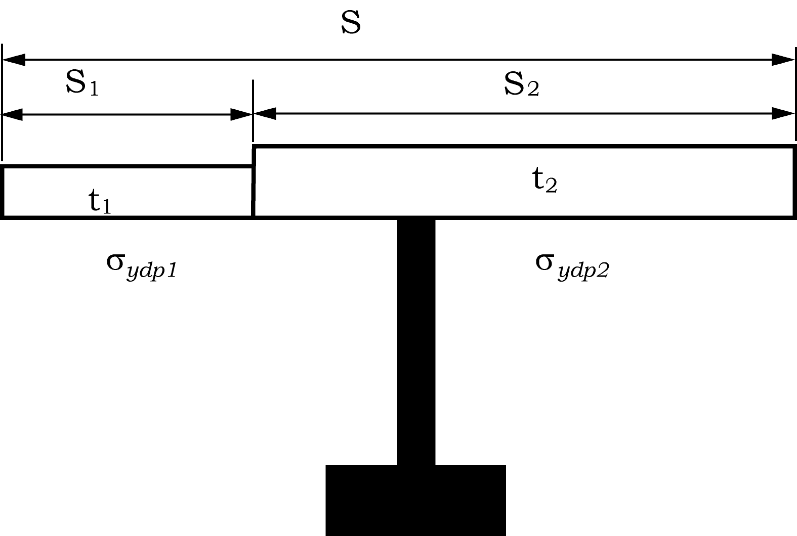

# PART 12 Common Structural Rules for Double Hull Oil Tankers

> RULES FOR CLASSIFICATION OF STEEL SHIPS / RA-12-E / 2025 / EN / Rules

## Appendix A Hull Girder Ultimate Strength

### 1 General

#### 1.1 Definitions

- **1.1.1** Hull girder bending moment capacity

#### 1.1.1.1

The hull girder ultimate bending moment capacity, *M_U*, is defined as the maximum bending capacity of the hull girder beyond which the hull will collapse. Hull girder failure is controlled by buckling, ultimate strength and yielding of longitudinal structural elements.

#### 1.1.1.2

The sagging hull girder ultimate capacity of a hull girder section, is defined as the maximum value on the static non-linear bending moment-curvature relationship *M‑k*, see Fig A.1.1. The curve represents the progressive collapse behaviour of hull girder under vertical bending.

| Fig A.1.1 Bending Moment - Curvature Curve *M-k* |
| --- |
|  |

#### 1.1.1.3

The curvature of the critical inter-frame section, *k*, is defined as:

Where:
*θ* the relative angle rotation of the two neighbouring cross-sections at transverse frame positions
*l* the transverse frame spacing, i.e. span of longitudinals

#### 1.2 Application

- **1.2.1** General

#### 1.2.1.1

The sagging hull girder ultimate bending capacity is to be assessed by the single step method in 2.1 or the incremental-iterative method in 2.2. This is only applicable to longitudinally framed double hull tankers in the sagging bending condition.

#### 1.2.1.2

The magnitudes of the partial safety factors in Sec 9/1.4 have been calibrated for this single step method in 2.1 and are also appropriate for the incremental iterative method in 2.2.

#### 1.3 Assumptions

- **1.3.1** General

#### 1.3.1.1

The method for calculating the ultimate hull girder capacity is to identify the critical failure modes of all main longitudinal structural elements. For tankers, in sagging, the critical mode is generally inter-frame buckling of deck structures, as shown in Fig A.1.2.

#### 1.3.1.2

Structures compressed beyond their buckling limit have reduced load carrying capacity. All relevant failure modes for individual structural elements, such as: plate buckling, torsional stiffener buckling, stiffener web buckling, lateral or global stiffener buckling; and their interactions, are to be considered in order to identify the weakest inter-frame failure mode.

#### 1.3.1.3

For tankers in the sagging condition, only vertical bending is considered. The effects of shear force, torsional loading, horizontal bending moment and lateral pressure are neglected.

| Fig A.1.2 Ship in Extreme Sagging Inter-Frame Buckling Failure |
| --- |
|  |

#### 1.4 Alternative Methods

- **1.4.1** General

#### 1.4.1.1

Principles for alternative methods for the calculation of the hull girder ultimate bending capacity; e.g. incremental-iterative procedure that may differ from the one defined in 2.2, and non-linear finite element analysis, are given in Sub-Sec 3.

#### 1.4.1.2

Application of alternative methods is to be agreed with the individual Classification Society prior to commencement. Documentation of the analysis methodology and detailed comparison of its results with those of the individual Classification Societies’ procedures are to be submitted for review and acceptance. The use of such methods may require the partial safety factors in Sec 9/1.4 to be re-calibrated.

### 2 Calculation of Hull Girder Ultimate Capacity

#### 2.1 Single Step Ultimate Capacity Method

- **2.1.1** Procedure

#### 2.1.1.1

The single step procedure for calculation of the sagging hull girder ultimate bending capacity is a simplified method based on a reduced hull girder bending stiffness accounting for buckling of the deck, see Fig A.2.1. The hull girder ultimate bending moment capacity, *M_U*, is to be taken as:
 kNm
Where:
*Z_red* reduced section modulus of deck (to the mean deck height)
 $\mathrm{m} ^{3}$
*I_red* reduced hull girder moment of inertia, in m4. The inertia is to be calculated in accordance with Sec 4/2.6.1.1, using:
• a hull girder net thickness of *t_net50* for all longitudinally effective members
• the effective net area after buckling of each stiffened panel of the deck, *A_eff*
*A_eff* effective net area after buckling of the stiffened deck panel. The effective area is the proportion of stiffened deck panel that is effectively able to be stressed to yield:
 $\mathrm{m}^{ 2}$
#underline{Note}
The effective area of deck girders is to be taken as the net area of the girders using a thickness of *t_net50*.
*A_net50* net area of the stiffened deck panel, in $\mathrm{m}^{ 2}$
*σ_U* buckling capacity of stiffened deck panel, in $\mathrm{N}/mm ^{2}$. To be calculated for each stiffened panel using:
• the advanced buckling analysis method, see Sec 10/4 and Appendix D
• the net thickness *t_net50*
*σ_yd* specified minimum yield stress of the material, in $\mathrm{N}/mm ^{2}$, that is used to determine the hull girder section modulus. In the case of the stiffener and plate having different specified minimum yield stress, *σ_yd*, is to be taken as the lesser of the two.
*z_dk-mean* vertical distance to the mean deck height, taken as the mean of the deck at side and the deck at centre line, measured from the baseline, in m
*z_NA-red* vertical distance to the neutral axis of the reduced section measured from the baseline, in m

#### 2.1.1.2

It is to be shown that the ultimate bending moment capacity, *M_U*, does not give stresses exceeding the specified minimum yield stress of the material, *σ_yd*, in the bottom shell plating. Therefore the ultimate hull girder bending moment capacity, *M_U*, is not to be greater than:
 kNm
Where:
*σ_yd* specified yield stress of material, in $\mathrm{N}/mm ^{2}$
*I_red* reduced hull girder moment of inertia, as defined in 2.1.1.1
*z_NA-red* vertical distance to the neutral axis of the reduced section measured from the baseline, in m

| Fig A.2.1 Moment - Curvature of Hull Girder Single Step Procedure |
| --- |
|  |

- **2.1.2** Assumption

#### 2.1.2.1

The assumption behind this procedure is that the ultimate sagging capacity of tankers is the point at which the ultimate capacity of the stiffened deck panels is reached. If the structural configuration is such that this assumption is not valid, then an alternative method to derive the ultimate capacity is to be used.

#### 2.2 Simplified Method Based on an Incremental-iterative Approach

- **2.2.1** Procedure

#### 2.2.1.1

In this approach, the ultimate hull girder bending moment capacity *M_U* is defined as the peak value of the curve with vertical bending moment *M* versus the curvature *κ* of the ship cross section as shown in Fig A.1.1.

#### 2.2.1.2

The curve *M-κ* is obtained by means of an incremental-iterative approach; the steps involved in the procedure are given in 2.2.1.7 and illustrated in the flow char tin Fig A.2.2.

#### 2.2.1.3

The bending moment *M_i* which acts on the hull girder transverse section due to the imposed curvature *κ_i* is calculated for each step of the incremental procedure. This imposed curvature corresponds to an angle of rotation of the hull girder transverse section about its effective horizontal neutral axis, which induces an axial strain *ε* in each hull structural element. In the sagging condition, the structural elements below the neutral axis are lengthened, whilst elements above the neutral axis are shortened.

#### 2.2.1.4

The stress *σ* induced in each structural element by the strain *ε* is obtained from the stress-strain curve *σ-ε* of the element, which takes into account the behaviour of the structural element in the non-linear elasto-plastic domain.

#### 2.2.1.5

The force in each structural element is obtained from its area times the stress and these force are summated to derive the total axial force on the transverse section. Note the element area is taken as the total net area of the structural element. This total force may not be zero as the effective neutral axis may have moved due to the non linear response. Hence it is necessary to adjust the neutral axis position, recalculate the element strains, forces and total sectional force and iterate until the total force is zero.

#### 2.2.1.6

Once the position of the new neutral axis is known, then the correct stress distribution in the structural elements is obtained. The bending moment *M*i about the new neutral axis due to the imposed curvature *κ_i* is then obtained by summating the moment contribution given by the force in each structural element.

#### 2.2.1.7

The main steps of the incremental-iterative approach are summarised as follows (see also Fig A.2.2):
Step 1 Divide the hull girder transverse section into structural elements, ie longitudinal stiffened panels (one stiffener per element), hard corners and transversely stiffened panels, see 2.2.2.2.
Step 2 Derive the stress-strain curves (or so called load-end shortening curves) for all structural elements, see 2.3.
Step 3 Derive the expected maximum required curvature *κ_F*, see 2.2.1.8. The curvature step size *Dκ* is to be taken as *κ_F*/300. The curvature for the first step, *κ_1* is to be taken as *Dκ*.
Derive the neutral axis *z_NA-i* for the first incremental step (*i* = 1) with the value of the elastic hull girder section modulus, *z_v-net50*, see Sec 4/2.6.1
Step 4 For each element (index *j*), calculate the strain *e_ij* = *κ_i*(*z_j*–*z_NA-i*) corresponding to *κ_i*, the corresponding stress *σ_j*, see 2.2.1.9, and hence the force in the element *σ_jA_j*.
Step 5 Determine the new neutral axis position *z_NA-i* by checking the longitudinal force equilibrium over the whole transverse section. Hence adjust *z_NA_i* until
$F _{i} = 0.1 \sum _{} ^{} A _{j} \sigma _{j}$ kN=0
Note s*_j* is positive for elements under compression and negative for elements under tension. Repeat from step 4 until equilibrium is satisfied. Equilibrium is satisfied when the change in neutral axis position is less than 0.0001 m.
Step 6 Calculate the corresponding moment by summating the force contributions of all elements as follows:
 kNm
Step 7 Increase the curvature by *Dκ*, use the current neutral axis position as the initial value for the next curvature increment and repeat from step 4 until the maximum required curvature is reached. The ultimate capacity is the peak value *M_u* from the *M-κ* curve. If the peak does not occur in the curve, then *κ_F* is to be increased until the peak is reached

#### 2.2.1.8

The expected maximum required curvature, *κ_F*, in m^-1, for the sagging condition is to be taken as:
 m^-1
Where:
*M_yd* vertical bending moment given by a linear elastic bending stress of yield in the deck or keel. To be taken as the greater of :
$Z _{v-n et50-dk} \sigma _{yd} 10 ^{3}$ kNm
$Z _{v-n et50-kl} \sigma _{yd} 10 ^{3}$ kNm
*Z_v-net50-dk*, *Z_v-net50-kl* section modulus at deck or bottom, in $\mathrm{m} ^{3}$, see Sec 8/1.2.2.3 and 1.2.2.4,
*E* modulus of elasticity, $2.06 \times 10 ^{5}$ $\mathrm{N}/mm ^{2}$
*σ_yd* specified minimum yield stress of the material, in $\mathrm{N}/mm ^{2}$
*I_v-net50* hull girder moment of inertia, in $\mathrm{m} ^{4}$, see Sec 8/1.2.1.1

#### 2.2.1.9

For each structural element, the stress *σ_j* corresponding to the element strain *ε_ij* is to be taken as the minimum stress value from all applicable stress-strain curves *σ-ε* for that element.

| Fig A.2.2 Flow Chart of the Procedure for the Evaluation of the Curve $M- \chi$ |
| --- |
|  |

- **2.2.2** Assumptions and modelling of the hull girder cross-section

#### 2.2.2.1

In applying the procedure described in 2.2.1, the following assumptions are to be made:

- **(a)** The ultimate strength is calculated at a hull girder transverse section between two adjacent transverse webs.
- **(b)** The hull girder transverse section remains plane during each curvature increment.
- **(c)** The material properties of steel are assumed to be elastic, perfectly plastic.
- **(d)** The hull girder transverse section can be divided into a set of elements which act independently of each other.

#### 2.2.2.2

The elements making up the hull girder transverse section are:

- **(a)** longitudinal stiffeners with attached plating, the structural behaviour is given in 2.3.1
- **(b)** transversely stiffened plate panels, the structural behaviour is given in 2.3.1
- **(c)** hard corners, as defined in 2.2.2.3, the structural behaviour is given in 2.3.2

#### 2.2.2.3

The following structural areas are to be defined as hard corners:
An illustration of hard corner definition for girders on longitudinal bulkheads is given in Fig A.2.3. The hard corner size is defined in 2.2.2.4.

- **(a)** the plating area adjacent to intersecting plates
- **(b)** the plating area adjacent to knuckles in the plating with an angle greater than 30 degrees.
- **(c)** plating comprising rounded gunwales

#### 2.2.2.4

The size and modelling of hard corner elements is to be as follows:
Note

- **(a)** it is to be assumed that the hard corner extends up to *s*/2 from the plate intersection for longitudinally stiffened plate, where *s* is the stiffener spacing
- **(b)** it is to be assumed that the hard corner extends up to 20 *tgrs* from the plate intersection for transversely stiffened plates, where *tgrs* is the gross plate thickness.
- **(a)** For transversely stiffened plate, the effective breadth of plate for the load shortening portion of the stress-strain curve is to be taken as the full plate breadth, i.e. to the intersection of other plates - not from the end of the hard corner if any. The area on which the value of $\sigma _{CR5}$ defined in 2.3.8.1 applies is to be taken as the breadth between the hard corners, i.e. excluding the end of the hard corner if any.
- **(b)** For longitudinally stiffened plate, the effective breadth of attached plate is equal to the mean spacing of the ordinary stiffener when the panels on both sides of the stiffener are longitudinally stiffened, or equal to the breadth of the longitudinally stiffened panel when the panel on one side of the stiffener is longitudinally stiffened and the other panel is of the transversely stiffened.

#### 2.2.2.5

Where the plate members are stiffened by non-continuous longitudinal stiffeners, the non-continuous stiffeners are considered only as dividing a plate into various elementary plate panels.

#### 2.2.2.6

Openings are to be considered in accordance with Sec. 4/2.6.3.

#### 2.2.2.7

Where attached plating is made of steels having different thicknesses and/or yield stresses, an average thickness and/or average yield stress obtained by the following formula are to be used for the calculation:
$t= \frac{t _{1} s _{1} +t _{2} s _{2}}{s}$
$\sigma _{ydp} = \frac{\sigma _{ydp1} t _{1} s _{1} + \sigma _{ydp2} t _{2} s _{2}}{ts}$
Where, $t _{1}$, $t _{2}$, $s _{1}$, $s _{2}$, $\sigma _{ydp1}$, $\sigma _{ydp1}$, $s$, see Fig.A.1.X.

| Fig A.1.X Definitions |
| --- |
|  |

| Figure A.2.3 Example of Defining Structural Elements |
| --- |
| a) Example showing side shell, inner hull and deck  |
| b) Example showing girder on longitudinal bulkhead  |

#### 2.3 Stress-strain Curves (or Load-end Shortening Curves)

- **2.3.1** Plate panels and stiffeners

#### 2.3.1.1

Hard corners are sturdier elements which are assumed to buckle and fail in an elastic, perfectly plastic manner. The relevant stress strain curve $\sigma - \varepsilon$ is to be obtained for lengthened and shortened hard corners according to 2.3.3.

#### 2.3.1.2

Where the plate members are stiffened by non-continuous longitudinal stiffeners, the stress of the element is to be obtained in accordance with 2.3.3 to 2.3.7, taking into account the non-continuous longitudinal stiffener. In calculating the total forces for checking the hull girder ultimate strength, the area of non-continuous longitudinal stiffener is to be assumed as zero.

#### 2.3.1.3

Where openings are provided in the plate panel, the considered area of the element is to be obtained by deducting the opening area from the plating in calculating the total force for checking the hull girder ultimate strength. Openings are to be considered in accordance with Sec. 4/2.6.3.

- **2.3.2** Hard corners

#### 2.3.2.1

Hard corners are sturdier elements which are assumed to buckle and fail in an elastic, perfectly plastic manner. The relevant stress strain curve $\sigma - \varepsilon$ is to be obtained for lengthened and shortened hard corners according to 2.3.3.

**Table A.2.1 Modes of Failure of Plate Panels and Stiffeners**

| Element | Mode of failure | Stress-strain curve $\sigma - \varepsilon$ defined in |
| --- | --- | --- |
| Lengthened transversely framed plate panels or stiffeners | Elastic, perfectly plastic failure | See 2.3.3 |
| Shortened stiffeners | Beam column buckling Torsional buckling Web local buckling of flanged profiles Web local buckling of flat bars | See 2.3.4 See 2.3.5 See 2.3.6 See 2.3.7 |
| Shortened transversely framed plate panels | Plate buckling | See 2.3.8 |

- **2.3.3** Elasto-plastic failure of structural elements

#### 2.3.3.1

The equation describing the stress-strain curve $\sigma - \varepsilon$ or the elasto-plastic failure of structural elements is to be obtained from the following formula, valid for both positive (compression or shortening) of hard corners and negative (tension or lengthening) strains of all elements (see Fig A.2.4):
*s* *=* *F* $\sigma _{ydA}$
Where:
*F* edge function:
*F* = -1 for $\epsilon$ < -1
*F* = $\epsilon$ for -1 < $\epsilon$ < 1
*F* = 1 for $\epsilon$ > 1
$\epsilon$ relative strain:
$\epsilon _{yd} = {\epsilon_\frac{E}{\epsilon_y}d}$
$\epsilon_E$ element strain
*e_yd* strain corresponding to yield stress in the element:
$\epsilon _{yd} = \frac{\sigma _{ydA}}{E}$
$\sigma _{ydA}$ equivalent minimum yield stress of the considered element, in $\mathrm{N}/mm ^{2}$
$\sigma _{ydA} = \frac{\sigma _{ydp} A _{p-"net"50} + \sigma _{yds} A _{s-"net"50}}{A _{p-"net"50} +A _{s-"net"50}}$
$\sigma _{ydp}$ specified minimum yield stress of the material of the plate, in $\mathrm{N}/mm ^{2}$
$\sigma _{yds}$ specified minimum yield stress of the material of the stiffener, in $\mathrm{N}/mm ^{2}$
A_p-net50 net sectional area of attached plating, in $\mathrm{cm} ^{2}$
A_s-net50 net sectional area of attached plating, in $\mathrm{cm} ^{2}$
Note
The signs of the stresses and strains in this Appendix are opposite to those in the rest of the Rules

| Fig A.2.4 Example of Stress Strain Curves *σ-ε* |
| --- |
| a) Stress strain curve *σ-ε* for elastic, perfectly plastic failure of a hard corner  |
| b) Typical stress strain curve *σ-ε* for elasto-plastic failure of a stiffener  |

- **2.3.4** Beam column buckling

#### 2.3.4.1

The equation describing the shortening portion of the stress strain curve *σ_CR1-ε* for the beam column buckling of stiffeners is to be obtained from the following formula:
 $\mathrm{N}/mm ^{2}$
Where:
*F* edge function defined in 2.3.3.1
*A_s-net50* net area of the stiffener, in $\mathrm{cm} ^{2}$, without attached plating
*σ_C1* critical stress, in $\mathrm{N}/mm ^{2}$:
$\sigma _{C1} = \frac{\sigma _{E1}}{\epsilon}$ for $\sigma _{E1} \leq \frac{\sigma _{ydB}}{2} \epsilon$
$\sigma _{C1} = \sigma _{ydB} \left( 1- \frac{\sigma _{ydB} \epsilon}{4 \sigma _{E1}} \right)$ for $\sigma _{E1} > \frac{\sigma _{ydB}}{2} \epsilon$
*ε* relative strain defined in 2.3.3.1
*σ_E1* Euler column buckling stress, in $\mathrm{N}/mm ^{2}$:

*E* modulus of elasticity, 2.06 × 105 $\mathrm{N}/mm ^{2}$
*I_E-net50* net moment of inertia of stiffeners, in $\mathrm{cm} ^{4}$, with attached plating of width *b_eff-s*
*b_eff-s* effective width, in mm, of the attached plating for the stiffener:

 $= \frac{s}{t _{"net"50}} \sqrt {\frac{\epsilon \sigma _{ydp}}{E}}$
s plate breadth, in mm, taken as the spacing between the stiffeners, as defined in Sec 4/2.2.1
*t_net50* net thickness of attached plating, in mm
*A_E-net50* net area, in $\mathrm{cm} ^{2}$, of stiffeners with attached plating of width *b_eff-p*
*l_stf* span of stiffener, in m, equal to spacing between primary support members
b_eff-p effective width, in mm, of the plating:

$\sigma _{ydB}$ equivalent minimum yield stress of the considered element, in $\mathrm{N}/mm ^{2}$
$\sigma _{ydB} = \frac{\sigma _{ydp} A _{pE-"net"50} l _{pE} + \sigma _{yds} A _{s-"net"50} l _{sE}}{A _{pE-"net"50} l _{pE} +A _{s-"net"50} l _{sE}}$
$A _{pE-"net"50}$ effective area, in $\mathrm{cm} ^{2}$
$A _{pE-"net"50} = 10 ^{-2} b _{eff-s} t _{"net"50}$
$\sigma _{ydp}$ specified minimum yield stress of the material of the plate, in $\mathrm{N}/mm ^{2}$
$\sigma _{yds}$ specified minimum yield stress of the material of the stiffener, in $\mathrm{N}/mm ^{2}$
$l _{pE}$ distance, in mm, measured from the neutral axis of the stiffener with attached plate of width, $b _{eff-s}$to the bottom of the attached plate
$l _{sE}$ distance, in mm, measured from the neutral axis of the stiffener with attached plate of width, $b _{eff-s}$to the top of the stiffener

- **2.3.5** Torsional buckling of stiffeners

#### 2.3.5.1

The equation describing the shortening portion of the stress-strain curve *σ_CR2-ε* for the lateral-flexural buckling of stiffeners is to be obtained according to the following formula:
 $\mathrm{N}/mm ^{2}$
Where:
*F* edge function defined in 2.3.3.1
*A_s-net50* net area of the stiffener, in $\mathrm{cm} ^{2}$, without attached plating
*s_C*_2 critical stress, in $\mathrm{N}/mm ^{2}$:
$\sigma _{C2} = \frac{\sigma _{E2}}{\epsilon}$ for $\sigma _{E2} \leq \frac{\sigma _{yds}}{2} \epsilon$
$\sigma _{C2} = \sigma _{yds} \left( 1- \frac{\sigma _{yds} \epsilon}{4 \sigma _{E2}} \right)$ for $\sigma _{E2} > \frac{\sigma _{yds}}{2} \epsilon$
*s_E2* Euler torsional buckling stress, in $\mathrm{N}/mm ^{2}$
*s_E2* = *s_ET_T*
*s_ET* reference stress for torsional buckling, in $\mathrm{N}/mm ^{2}$, defined in Sec 10/3.3.3.1, calculated based on gross thickness minus the corrosion addition 0.5 *t_corr*.
ε relative strain defined in 2.3.3.1
*s* plate breadth, in mm, taken as the spacing between the stiffeners, as defined in Sec 4/2.2.1
*t_net50* net thickness of attached plating, in mm
s_CP ultimate strength of the attached plating for the stiffener, in $\mathrm{N}/mm ^{2}$:
$\sigma _{CP} = \left( \frac{2.25}{\beta _{p}} - \frac{1.25}{\beta _{p} ^{2}} \right) \sigma _{ydp}$ for $\beta _{p} >1.25$
$\sigma _{CP} = \sigma _{yd}$ for $\beta _{p} \leq 1.25$
$\beta _p$ coefficient defined in 2.3.4
$\sigma _{ydp}$ specified minimum yield stress of the material of the plate, in $\mathrm{N}/mm ^{2}$
$\sigma _{yds}$ specified minimum yield stress of the material of the stiffener, in $\mathrm{N}/mm ^{2}$

- **2.3.6** Web local buckling of stiffeners with flanged profiles

#### 2.3.6.1

The equation describing the shortening portion of the stress strain curve *σ_CR3-ε* for the web local buckling of flanged stiffeners is to be obtained from the following formula:
$\sigma _{CR3} = \Phi \frac{b _{eff-p} t _{"net"50} \sigma _{ydp} + \left( d _{w-eff} t _{w-"net"50} +b _{f} t _{f-"net"50} \right) \sigma _{yds}}{st _{"net"50} +d _{w} t _{w-"net"50} +b _{f} t _{f-"net"50}}$ ($\mathrm{N}/mm ^{2}$)
Where:
*F* edge function defined in 2.3.3.1
*b_eff-p* effective width, in mm, of the plating, defined in 2.3.4
*t_net50* net thickness of plate, in mm
*d_w* depth of the web, in mm
*t_w-net50* net thickness of web, in mm
*b_f* breadth of the flange, in mm
*t_f-net50* net thickness of flange, in mm
*s* plate breadth, in mm, taken as the spacing between the stiffeners, as defined in Sec 4/2.2.1
*d_w-eff* effective depth of the web, in mm:

*b_w* $= \frac{d _{w}}{t _{w-"net"50}} \sqrt {\frac{\epsilon \sigma _{yds}}{E}}$
e relative strain defined in 2.3.3.1
E modulus of elasticity, $2.06 \times 10 ^{5}$ $\mathrm{N}/mm ^{2}$
$\sigma _{ydp}$ specified minimum yield stress of the material of the plate, in $\mathrm{N}/mm ^{2}$
$\sigma _{yds}$ specified minimum yield stress of the material of the stiffener, in $\mathrm{N}/mm ^{2}$

- **2.3.7** Web local buckling of flat bar stiffeners

#### 2.3.7.1

The equation describing the shortening portion of the stress-strain curve *σ_CR4-ε* for the web local buckling of flat bar stiffeners is to be obtained from the following formula:

Where:
*F* edge function defined in 2.3.3.1
*σ_CP* ultimate strength of the attached plating, in $\mathrm{N}/mm ^{2}$, defined in 2.3.5
*σ_C4* critical stress, in $\mathrm{N}/mm ^{2}$:
$\sigma _{C4} = \frac{\sigma _{E4}}{\epsilon}$ for $\sigma _{E4} \leq \frac{\sigma _{yds}}{2} \epsilon$
$\sigma _{C4} = \sigma _{yds} \left( 1- \frac{\sigma _{yds} \epsilon}{4 \sigma _{E4}} \right)$ for $\sigma _{E4} > \frac{\sigma _{yds}}{2} \epsilon$
*σ_E4* Euler buckling stress, in $\mathrm{N}/mm ^{2}$:

*ε* relative strain defined in 2.3.3.1.
*A_s-net50* net area of stiffener, in $\mathrm{cm} ^{2}$, see 2.3.5.1
*t_w-net50* net thickness of web, in mm
*d_w* depth of the web, in mm
*s* plate breadth, in mm, taken as the spacing between the stiffeners, as defined in Sec 4/2.2.1
tnet50 net thickness of attached plating, in mm
$\sigma _{yds}$ specified minimum yield stress of the material of the stiffener, in $\mathrm{N}/mm ^{2}$

- **2.3.8** Buckling of transversely stiffened plate panels

#### 2.3.8.1

The equation describing the shortening portion of the stress-strain curve σ*CR5*-ε for the buckling of transversely stiffened panels is to be obtained from the following formula:
$sigma CR`5 ``=`min {cases{eqalign{PHI sigma ydp LEFT [ {s} over {1000l stf} LEFT ( {2.25} over {beta p} - {1.25} over {beta p 2} RIGHT ) +0.1 LEFT ( 1- {s} over {1000l stf} RIGHT ) LEFT ( 1+ {1} over {beta p 2} RIGHT ) 2 RIGHT ]#
#
}sigma ydp PHI &}}$ ($\mathrm{N}/mm ^{2}$)
Where:
$\beta _{p}$ coefficient defined in 2.3.4.1
*F* edge function defined in 2.3.3.1
*s* plate breadth, in mm, taken as the spacing between the stiffeners, as defined in Sec 4/2.2.1
*lstf* stiffener span, in m, equal to spacing between primary support members
$\sigma _{ydp}$ specified minimum yield stress of the material of the plate, in $\mathrm{N}/mm ^{2}$

### 3 Alternative Methods

#### 3.1 General

- **3.1.1** Considerations for alternative models

#### 3.1.1.1

The bending moment-curvature relationship, *M-k*, may be established by alternative methods. Such models are to consider all the relevant effects important to the non-linear response with due considerations of:
• bi-axial compression
• bi-axial tension
• shear and lateral pressure

- **(a)** non-linear geometrical behaviour
- **(b)** inelastic material behaviour
- **(c)** geometrical imperfections and residual stresses (geometrical out-of flatness of plate and stiffeners)
- **(d)** simultaneously acting loads:
- **(e)** boundary conditions
- **(f)** interactions between buckling modes
- **(g)** interactions between structural elements such as plates, stiffeners, girders etc.
- **(h)** post-buckling capacity.

#### 3.2 Methods

- **3.2.1** Incremental-iterative procedure

#### 3.2.1.1

The most generally used method to assess the hull girder ultimate moment capacity is to derive the non-linear moment-curvature relationship, *M-k*, by incrementally increasing the bending curvature, *k*, of the hull section between two adjacent transverse frames and then identifying the maximum moment along this curve as the ultimate bending capacity, *M_U*.

#### 3.2.1.2

The *M-k* curve is to be based on the axial non-linear *P-e* (load/strain) load-shortening curves for individual structural component in the cross-section. The *P-e* curves shall consider all relevant structural effects as listed in 3.1.1.1.

- **3.2.2** Non-linear finite element analysis

#### 3.2.2.1

Advanced non-linear finite element analyses models may be used for the assessment of the hull girder ultimate capacity. Such models are to consider the relevant effects important to the non-linear responses with due consideration of the items listed in 3.1.1.1.

#### 3.2.2.2

Particular attention is to be given to modelling the shape and size of geometrical imperfections. It is to be ensured that the shape and size of geometrical imperfections trigger the most critical failure modes.
