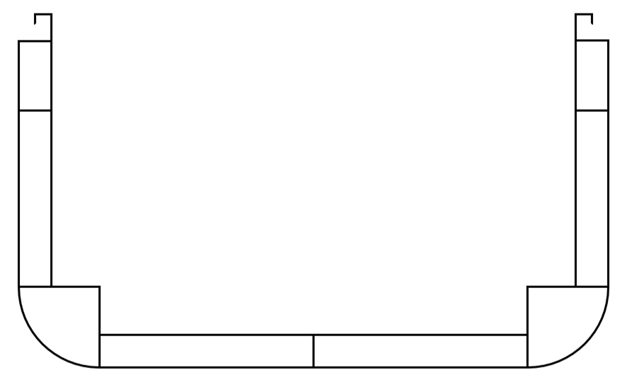
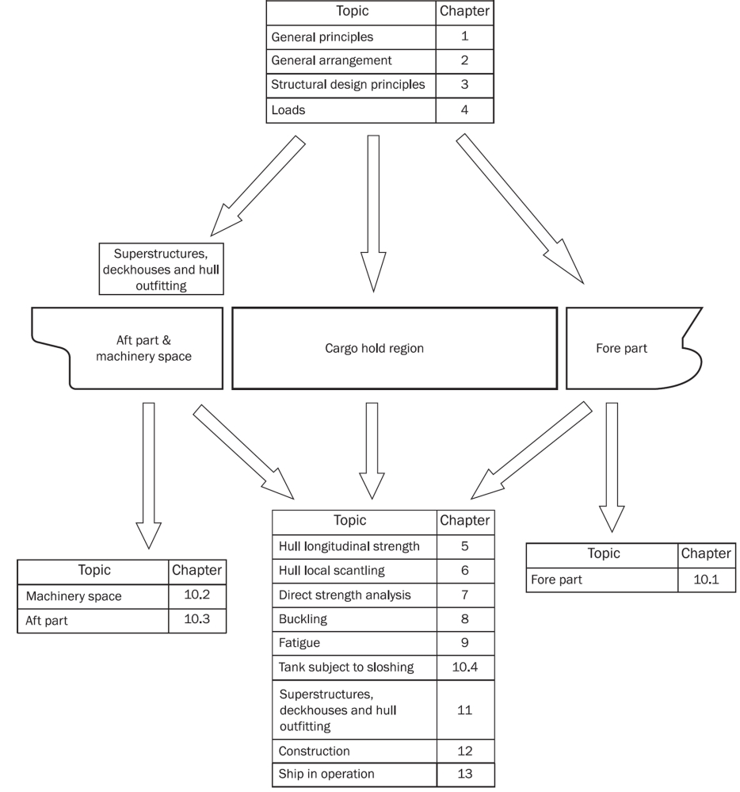
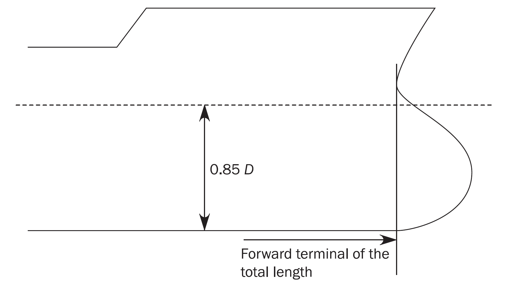
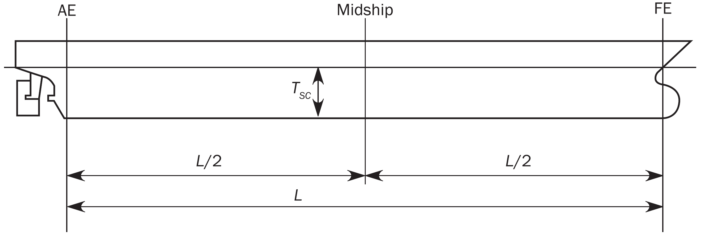
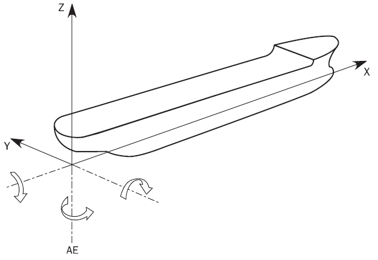
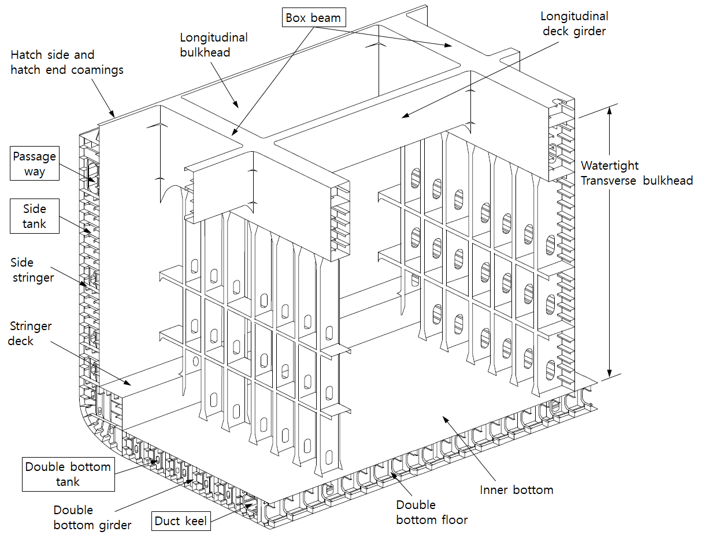
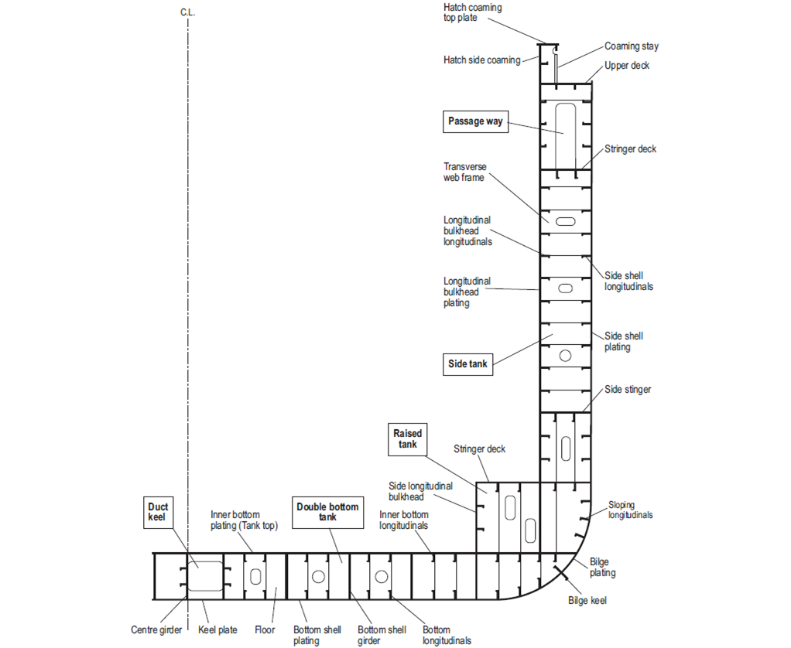
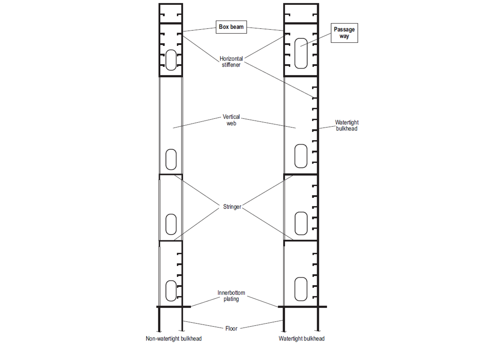

# PART 14 Structural Rules for Container Ships

> RULES FOR CLASSIFICATION OF STEEL SHIPS / RA-14-E / 2025 / EN / Rules

## Chapter 1 General Principles

### Section 1 Application

#### 1. Scope of application

- **1.1** **General**
  - **1.1.1** These Rules apply to the following ships:
    Note 1: "Container Ship" means a ship designed exclusively for the carriage of containers in holds and on deck.
    Note 2: Unrestricted navigation means that the ship is not subject to any geographical restrictions (i.e. any oceans, any seasons) except that limited by the ship’s capability for operation in ice.
    - **a)** Container ships and:
    - **b)** Being self-propelled ships with unrestricted navigation.
  - **1.1.2** These Rules apply to ships constructed of welded steel structures and composed of stiffened plate panels.
- **1.2** **Scope of application for container ships**
  - **1.2.1** These Rules apply to double bottom ships of double side skin construction, intended to carry containers in holds or on deck. The requirements of hull equipment are generally to comply with those in **Pt 4**. The requirements of container ships with a length less than 90 m are generally to comply with those in **Pt 4** and **Pt 10**.
    The ship’s structure is to be longitudinally and transversely framed with full transverse bulkheads and intermediate web frames. Typical midship sections are shown in **Figure 1**.
    
    Figure : Container ship of double side skin construction

#### 2. Rule application

- **2.1** **Rule description**
  - **2.1.1** **Rule structure**
    This Rules are structured in chapters giving instructions for detail application and requirements which are applied in order to satisfy the rule objectives.
  - **2.1.2** **Numbering**
    The system of numbering is given in **Table 1**.

    | Order | Levels | Example | Abbreviations |
    | --- | --- | --- | --- |
    | 1 | Chapter | Chapter 1 – General Requirements | **Ch 1** |
    | 2 | Section | Section 1 – Application | **Sec 1** |
    | 3 | Article | 1. Scope of application | **[1.]** |
    | 4 | Sub-article | 1.1 General | **[1.1]** |
    | 5 | Requirements | 1.1.1 These Rules apply to... | **[1.1.1]** |
- **2.2** **Rule requirements**
  - **2.2.1** These Rules provides requirements common to container ship as follow:
    • Chapter 1 : General Principles
    • Chapter 2 : General Arrangement
    • Chapter 3 : Structural Design Principles
    • Chapter 4 : Loads
    • Chapter 5 : Hull Girder Strength
    • Chapter 6 : Hull Local Scantling
    • Chapter 7 : Direct Strength Analysis
    • Chapter 8 : Buckling
    • Chapter 9 : Fatigue
    • Chapter 10 : Other Structures
    • Chapter 11 : Superstructure, Deckhouses and Hull Outfitting
    • Chapter 12 : Construction
    • Chapter 13 : Ship in Operation – Renewal Criteria
    • Chapter 14 : Container Securing
    The provisions of the **Ch 1, 2, 3, 4, 5, 6, 8, 12, 13, 14** and **Ch 10, Sec 4** are applicable all over the ship length. The **Ch 7, 9, 10** and **11** define their own scope of application.
  - **2.2.2** **Application of the Rules**
    The ship arrangement and scantlings are to comply with the relevant chapters of the Rules as it is given in **Figure 2**.
  - **2.2.3** **General criteria**
    The ship arrangement, the proposed details and the offered scantling in net or gross, as the case may, are to comply with the requirements and the minimum scantling given the Rules.
    
    Figure : Application of the Rules
- **2.3** **Structural requirements**
  - **2.3.1** **Materials and welding**
    The Rules apply to welded hull structures made of steel having characteristics complying with requirements in **Ch 3**, **Sec 1.** The Rules applies also to welded steel ships in which parts of the hull, such as superstructures or small hatch cover, are built in material other than steel, complying with requirements in **Ch 3**, **Sec 1**.
    Ships whose hull materials are different than those given in the first paragraph are to be individually considered by the Society, on the basis of the principles and criteria adopted in the present rules.
- **2.4** **Ship parts**
  - **2.4.1** **General**
    For the purpose of application of the present rules, the ship is considered as divided into the following five parts:
    • Fore part.
    • Cargo hold region.
    • Machinery space.
    • Aft part.
    • Superstructures and deckhouse.
  - **2.4.2** **Fore part**
    The part is that part of the ship located forward of the collision bulkhead, i.e.:
    • The fore peak structures.
    • The stem.
  - **2.4.3** **Cargo hold region**
    The cargo hold region is the part of the ship that contains cargo holds. It includes the full breadth and depth of the ship, the collision bulkhead and the transverse bulkhead at its aft end.
  - **2.4.4** **Machinery space**
    The machinery space is the part of the ship between the aft peak bulkhead and the transverse bulkhead at the aft end of the cargo hold region.
  - **2.4.5** **Aft part**
    The aft part includes the structures located aft of the aft peak bulkhead.
  - **2.4.6** **Superstructures and deckhouses**
    A superstructure is a decked structure on the freeboard deck extending from side to side of the ship or with the side plating not being inboard of the shell plating more than 0.04 $B$. A deckhouse is a decked structure on the freeboard or superstructure deck which does not comply with the definition of a superstructure.

### Section 2 Rule Principles

#### 1. General

- **1.1** **Rule objectives**
  - **1.1.1** The objectives of the Rules are to establish the classification minimum requirements to mitigate the risks of major hull structural failure in order to help improve the safety of life, environment and property and to contribute to the durability of the hull structure for the ship’s design life.

#### 2. Design basis

- **2.1** **General**
  - **2.1.1** This sub-section specifies the design parameters and the assumptions about the ship operation that are used as the basis of the design principles of the Rules.
  - **2.1.2** Ships are to be designed to withstand, in the intact condition, the environmental conditions as defined in **[4.3.2]** and **[4.3.3]** anticipated during the design life, for the appropriate loading conditions. Structural strength is to be determined against buckling and yielding. Ultimate strength calculations have to include ultimate hull girder capacity and ultimate strength of plates and stiffeners.
  - **2.1.3** Ship are to be designed to have sufficient reserve strength to withstand loads in damaged condition, e.g. flooded scenarios.
  - **2.1.4** **Finite element analysis**
    The scantling of the structural members within the cargo hold region of ships having a length $L$ of 150 $\mathrm{m}$ or above is to be assessed according to the requirements specified in **Ch 7**.
  - **2.1.5** **Fatigue life**
    Ships having a length $L$ of 150 $\mathrm{m}$ or above are to be assessed according to the design fatigue life for structural details specified in **Ch 9**.
- **2.2** **Hull form limit**
  - **2.2.1** The Rules assume the following hull form with respect to environmental loading:
    • 90 $\mathrm{m}$ ≤ *L* ≤ 500 $\mathrm{m}$
    • 5 ≤ $L$/ $B$ ≤ 9
    • 2 ≤ *B* / $T _{SC}$ ≤ 6
    • $B$ / $D$ $<$ 2.5
    • 0.55 ≤ $C _{B}$ ≤ 0.9
    For ships except above mentioned hull form, the wave loads are to be in accordance with **Pt 13, Annex 13-1**.
- **2.3** **Design life**
  - **2.3.1** A design life of 25 years is assumed for selecting ship design parameters. The specified design life is the nominal period that the ship is assumed to be exposed to operating conditions.
- **2.4** **Environmental conditions**
  - **2.4.1** **North Atlantic wave environment**
    The rule requirements are based on a ship trading in the North Atlantic wave environment for its entire design life. The wave environment for fatigue strength is to be in accordance with **Ch 9**.
  - **2.4.2** **Wind and current**
    The effects of wind and current with regard to the strength of the structure are not considered.
  - **2.4.3** **Ice**
    The effects of ice and ice accretion are not taken into account by the Rules.
  - **2.4.4** **Design temperatures**
    The Rules assume that the structural assessment of hull strength members is valid for the following design temperatures:
    • Lowest mean daily average temperature in air is –10 °C.
    • Lowest mean daily average temperature in seawater is 0.0 °C.
    Materials for ships intended to operate in areas with lower mean daily average temperature are to be in accordance with **Pt 3, Ch 1, 406**.
    In the above, the following definitions apply:
    • Mean : Statistical mean over observation period (at least 20 years).
    • Daily Average : Average during one day and night.
    • Lowest : Lowest during year.
    For seasonally restricted service the lowest value within the period of operation applies.
  - **2.4.5** **Thermal loads**
    The effects of thermal loads and residual stresses are not taken into account in the Rules.
- **2.5** **Operating conditions**
  - **2.5.1** The Rules specify minimum loading conditions that are to be assessed for compliance.
    Specification of loading conditions other than those required by the Rules is the responsibility of the owner. These other loading conditions are to be documented and also be assessed for compliance.
- **2.6** **Operating draughts**
  - **2.6.1** The design operating draughts are to be specified by the builder / designer subject to acceptance by the owner and are to be used to derive the appropriate structural scantlings. All operational loading conditions in the loading manual are to comply with the specified design operating draughts. The following design operating draughts are as a minimum to be considered:
    • Scantling draught for the assessment of structure.
    • Minimum ballast draught at midship for assessment of structure.
    • Minimum draughts at forward perpendicular and aft end for the assessment of forward and stern bottom structure subjected to slamming loads, as defined in **Ch 4, Sec 5**.
- **2.7** **Maximum service speed**
  - **2.7.1** The maximum service speed is to be specified in the design specification. Although the hull structure verification criteria takes into account the service speed this does not relieve the responsibilities of the owner and personnel to properly handle the ship.
- **2.8** **Owner’s extras**
  - **2.8.1** Owner’s specification of requirements above the general classification or statutory requirements may affect the structural design. Owner’s extras may include requirements for:
    • Vibration analysis.
    • Maximum percentage of high strength steel.
    • Additional scantlings above that required by the Rules.
    • Additional design margin on the loads specified by the Rules, etc.
    • Improved fatigue resistance, in the form of a specified increase in design fatigue life or equivalent.
    Owner’s extras are not specified by these Rules. Owner’s extras, if any, that may affect the structural design are to be clearly specified in the design documentation.

#### 3. Design principles

- **3.1** **Overall principles**
  - **3.1.1** **Introduction**
    This sub-section defines the underlying design principles of the Rules in terms of loads, structural capacity models and assessment criteria and also construction and in-service aspects.
  - **3.1.2** **General**
    The Rules are based on the following overall principles:
    • The safety of the structure can be assessed by addressing the potential structural failure mode(s) when the ship is subjected to operational loads and environmental loads / conditions.
    • The design complies with the design basis, see **Sec 3.**
    • The structural requirements are based on consistent design load sets which cover the appropriate operating modes of container ship.
  - **3.1.3** **Limit state design principles**
    The rules are based on the principles of limit state design.
    Limit state design is a systematic approach where each structural element is evaluated with respect to possible failure modes related to the design scenarios identified. For each retained failure mode, one or more limit states may be relevant. By consideration of all relevant limit states, the limit load for the structural element is found as the minimum limit load resulting from all the relevant limit states.
    The limit states defined in **Ch 3**, **Sec 5** are divided into the four categories:
    • Serviceability Limit State (SLS)
    • Ultimate Limit State (ULS)
    • Fatigue Limit State (FLS)
    • Accidental Limit State (ALS).
    The Rules include requirements to cover the relevant limit states for the various parts of the structure.
- **3.2** **Loads**
  - **3.2.1** **Design load scenarios**
    The structural assessment of the structure is based on the design load scenarios encountered by the ship. Refer to **Ch 4**, **Sec 7**.
    The design load scenarios are based on static and dynamic loads as given below:
    • Static design load scenario (S):
    Covers application of relevant static loads and typically covers load scenarios in harbour, sheltered water.
    • Static plus Dynamic design load scenario (S + D):
    Covers application of relevant static loads and simultaneously occurring dynamic load components and typically cover load scenarios for seagoing operations.
    • Impact design load scenario (I):
    Covers application of impact loads such as bottom slamming and bow impact encountered during seagoing operations.
    • Sloshing design load scenario (SL):
    Covers application of sloshing loads encountered during seagoing operations.
    • Fatigue design load scenario (F):
    Covers application of relevant dynamic loads.
    • Accidental design load scenario (A):
    Covers application of some loads not occurring during normal operations.
    • Tank testing design load scenario (T):
    Covers application of maximum loads during tank testing
- **3.3** **Structural capacity assessment**
  - **3.3.1** **General**
    The basic principle in structural design is to apply the defined design loads, identify plausible failure modes and employ appropriate capacity models to verify the required structural scantlings.
  - **3.3.2** **Capacity models for ULS, SLS and ALS**
    The strength assessment method is to be capable of analysing the failure mode in question to the required degree of accuracy.
    The structural capacity assessment methods are in either a prescriptive format or require the use of more advanced calculations such as finite element analysis methods.
    The formulae used to determine stresses, deformations and capacity are deemed appropriate for the selected capacity assessment method and the type and magnitude of the design load set.
  - **3.3.3** **Capacity models for FLS**
    The fatigue assessment method provides Rule requirements to assess structural details against fatigue failure.
    The fatigue capacity model is based on a linear cumulative damage summation (Palmgren-Miner’s rule) in combination with a design S-N curve, a reference stress range and an assumed long-term stress distribution curve.
    The fatigue capacity assessment models are in either a prescriptive format or require the use of more advanced calculations, such as finite element analysis methods. These methods account for the combined effects of global and local dynamic loads.
  - **3.3.4** **Net scantling approach**
    The objective of the net scantling approach is to:
    • Provide a relationship between the thickness used for strength calculations during the newbuilding stage and the minimum thickness accepted during the operational phase.
    • Enable the status of the structure with respect to corrosion to be clearly ascertained throughout the life of the ship.
    The net scantling approach distinguishes between local and global corrosion. Local corrosion is defined as uniform corrosion of local structural elements, such as a single plate or stiffener. Global corrosion is defined as the overall average corrosion of larger areas, such as primary supporting members and the hull girder. Both the local and global corrosion are used as a basis for the newbuilding review and are to be assessed during operation of the ship.
    No credit is given in the assessment of structural capability for the presence of coatings or similar corrosion protection systems. The application of the net thickness approach to assess the structural capacity is specified in **Ch 3**, **Sec 2**.
  - **3.3.5** **Intact structure**
    All strength calculations for ULS, SLS and FLS are based on the assumption that the structure is intact.

#### 4. Rule design method

- **4.1** **General**
  - **4.1.1** **Design methods**
    Scantling requirements are specified to cover the relevant limit states (ULS, SLS, FLS and ALS) as necessary for various structural parts. The criteria for the assessment of the scantlings are based on one of the following design methods:
    • Working Stress Design (WSD) method, also known as the permissible or allowable stress method.
    • Partial Safety Factor (PSF) method, also known as Load and Resistance Factor Design (LRFD).
    For both WSD and PSF, two design assessment conditions and corresponding acceptance criteria are given. These conditions are associated with the probability level of the combined loads, A and B.
  - **4.1.2** **WSD method**
    • $W _{stat} \leq \eta _{1} R$ for condition A
    • $W _{stat} +W _{dyn} \leq \eta _{2} R$ for condition B
    where
    $W _{stat}$ : Simultaneously occurring static loads (or load effects in terms of stresses).
    $W _{dyn}$ : Simultaneously occurring dynamic loads. The dynamic loads are typically a combination of local and global load components.
    *R* : Characteristic structural capacity (e.g. specified minimum yield stress or buckling capacity).
    $\eta _{i}$ : Permissible utilisation factor (resistance factor). The utilisation factor includes consideration of uncertainties in loads, structural capacity and the consequence of failure.
  - **4.1.3** **PSF method**
    • $\gamma _{sta-1} W _{sta} + \gamma _{dyn} W _{dyn} \leq \frac{R}{\gamma _{R}}$ for condition A
    • $\gamma _{sta-1} W _{sta} + \gamma _{dyn} W _{dyn} \leq \frac{R}{\gamma _{R}}$ for condition B
    where
    $\gamma _{sta-i}$ : Partial safety factor that accounts for the uncertainties related to static loads.
    $\gamma _{dyn-i}$ : Partial safety factor that accounts for the uncertainties related to dynamic loads.
    $\gamma _{R}$ : Partial safety factor that accounts for the uncertainties related to structural capacity.
    The acceptance criteria for both the WSD method and PSF method are calibrated for the various requirements such that consistent and acceptable safety levels for all combinations of static and dynamic load effects are derived.
- **4.2** **Minimum requirements**
  - **4.2.1** Minimum requirements specify the minimum scantling requirements which are to be applied irrespective of all other requirements, hence thickness below the minimum is not allowed.
    The minimum requirements are usually in one of the following forms:
    • Minimum thickness, which is independent of the specified minimum yield stress.
    • Minimum stiffness and proportion, which are based on buckling failure modes.
- **4.3** **Load-capacity based requirements**
  - **4.3.1** **General**
    In general, the Working Stress Design (WSD) method is applied in the requirements, except for the hull girder ultimate strength criteria where the Partial Safety Factor (PSF) method is applied. The partial safety factor format is applied for this highly critical failure mode to better account for uncertainties related to static loads, dynamic loads and capacity formulations.
    The identified load scenarios are addressed by the Rules in terms of design loads, design format and acceptance criteria set, as given in **Table 2**.
    The table is schematic and only intended to give an overview. Load based prescriptive requirements provide scantling requirements for all plating, local support members, most primary supporting members and the hull girder and cover all structural elements including deckhouses, foundations for deck equipment.
    In general, these requirements explicitly control one particular failure mode and hence several requirements may be applied to assess one particular structural member.
  - **4.3.2** **Design loads for SLS, ULS and ALS**
    The structural assessment of compartment boundaries, e.g. bulkheads, is based on loading condition deemed relevant for the type of ship and the operation the ship is intended for.
    To provide consistency of approach, standardised Rule values for parameters, such as $GM$, $R _{roll}$_l, $T _{sc}$ and $C _{B}$ are applied to calculate the Rule load values.
    The probability level of the dynamic global, local and impact loads (see **Table 1**) is 10^-8 and is derived using the long-term statistical approach. The probability level of the sloshing loads (see **Table 1**) is 10^-4.
    The design load scenarios for structural verification apply the applicable simultaneously acting local and global load components. The relevant design load scenarios are given in **Ch 4, Sec 7**.
    The simultaneously occurring dynamic loads are specified by applying a dynamic load combination factor to the dynamic load values given in **Ch 4**. The dynamic load combination factors that define the dynamic load cases are given in **Ch 4, Sec 2**.
    Design load conditions for the hull girder ultimate strength are given in **Ch 5, Sec 2**.

    | Operation | Load type | Design load scenario | Acceptance criteria |
    | --- | --- | --- | --- |
    | **Seagoing operations** |   |   |   |
    | Transit | Static and dynamic loads in heavy weather | S+D | AC-SD |
    | Transit | Impact loads in heavy weather | Impact (I) | AC-I |
    | Transit | Internal sloshing loads | Sloshing (SL) | AC-S |
    | Transit | Cyclic wave loads | Fatigue (F) | - |
    | BWE by flow through or sequential methods | Static and dynamic loads in heavy weather | S + D | AC-SD |
    | **Harbour and sheltered operations** |   |   |   |
    | Loading, unloading and ballasting | Typical maximum loads during loading, unloading and ballasting operations | S | AC-S |
    | Special conditions in harbour | Typical maximum loads during special operations in harbour, e.g. propeller inspection afloat | S | AC-S |
    | **Accidental condition** |   |   |   |
    | Collision conditions | Maximum loads on internal watertight subdivision structure including cofferdam bulkheads in collision | A | AC-A |
    | Flooded conditions | Typically maximum loads on internal watertight subdivision structure in accidental flooded conditions | A | AC-A |
    | **Testing condition** |   |   |   |
    | Tank testing | Typical maximum loads during tank testing operations | T | AC-T |
  - **4.3.3** **Design loads for FLS**
    For the fatigue requirements given in **Ch 9**, the load assessment is based on the expected load history and an average approach is applied. The expected load history for the design life is characterised by the 10^-2 probability level of the dynamic load value, the load history for each structural member is represented by Weibull probability distributions of the corresponding stresses.
    The considered wave induced loads include:
    • Hull girder loads.
    • Dynamic wave pressures.
    • Dynamic pressure from cargo.
    The load values are based on Rule parameters corresponding to the loading conditions, e.g. $GM$ and $C _{B}$ and the applicable draughts at amidships.
    The simultaneously occurring dynamic loads are accounted for by combining the stresses due to the various dynamic load components. The stress combination procedure is given in **Ch 9.**
  - **4.3.4** **Structural response analysis**
    In general, the following approaches are applied for determination of the structural response to the applied design load combinations.
    • Used for prescriptive requirements.
    • Coarse mesh for cargo hold model.
    • Fine mesh for local models.
    • Very fine mesh for fatigue assessment.
    - **a)** Beam theory:
    - **b)** FE analysis:
- **4.4** **Acceptance criteria**
  - **4.4.1** **General**
    The acceptance criteria are categorised into five acceptance criteria sets. These are explained below and shown in **Table 2** and **Table 3**. The specific acceptance criteria set that is applied in the rule requirements is dependent on the probability level of the characteristic combined load.
    • Repeated yield.
    • Allowance for some dynamics.
    • Margins for some selected limited operational mistakes.

    | Acceptance criteria | Plate panels and local support members(1) |   | Primary supporting members(1) |   | Hull girder members |   |
    | --- | --- | --- | --- | --- | --- | --- |
    | Acceptance criteria | Yield | Buckling | Yield | Buckling | Yield | Buckling |
    | AC-S AC-SD AC-A AC-T | Permissible stress: **Ch 6, Sec 4** **Ch 6, Sec 5** | Control of stiffness and proportions: **Ch 8 Sec 2** | Permissible stress: **Ch 6, Sec 6** | Control of stiffness and proportions: **Ch 8, Sec 1, 2** Pillar buckling | Permissible stress: **Ch 5, Sec 1** | Allowable buckling utilisation factor: **Ch 8 Sec 1 [3]** |
    | AC-I(2) | Plastic criteria: **Ch 10 Sec 1 [3]** **Ch 10 Sec 3 [5]** | Control of stiffness and proportions: **Ch 8, Sec 2** **Ch 10 Sec 1 [3]** **Ch 10 Sec 3 [5]** | Plastic criteria: **Ch 10 Sec 1 [3]** **Ch 10 Sec 3 [5]** | Control of stiffness and proportions: **Ch 8, Sec 2** **Ch 10 Sec 1 [3]** **Ch 10 Sec 3 [5]** | N/A | N/A |
    | (1) Refer to **Ch 10** for Other structures and to **Ch 11** for Superstructure, deckhouses and hull outfitting (2) If necessary, direct analysis guidance specified Classification Society can be applied. |   |   |   |   |   |   |

    | Acceptance criteria | Cargo hold analysis |   | Fine mesh analysis |
    | --- | --- | --- | --- |
    | Acceptance criteria | Yield | Buckling | Yield |
    | AC-S, AC-SD, AC-A, AC-T | Permissible stress: **Ch 7, Sec 2, [5]** | Allowable buckling utilisation factor: **Ch 8, Sec 1, [3]** | Permissible Von Mises stress: **Ch 7, Sec 3, [4]** |
    - **a)** The acceptance criteria set AC-S is applied for the static design load combinations, and for the sloshing design loads. The allowable stress for such loads is lower than that for an extreme load to take into account effects of:
    - **b)** The acceptance criteria set AC-SD is applied for the S + D design load combinations where considered loads are extreme loads with a low probability of occurrence.
    - **c)** The acceptance criteria set AC-I is typically applied for impact loads, such as bottom slamming and bow impact loads.
    - **d)** The acceptance criteria set AC-A is applied for the static design loads in accidental flooded condition
    - **e)** The acceptance criteria set AC-T is applied for the design loads in tank testing condition.
  - **4.4.2** **Acceptance criteria**
    The specific acceptance criteria applied in the working stress design requirements are given in the detailed Rule requirements in **Ch 5** to **Ch 8**, **Ch 10** and **Ch 11**.
    To provide a general informational summary overview of the acceptance criteria, refer to **Table 2** and **Table 3** below for the different design load scenarios covered by these Rules for the yield and buckling failure modes.
    For the yield criteria the permissible stress is proportional to the specified minimum yield stress of the material. For the buckling failure mode, the acceptance criteria are based on the control of stiffness and proportions as well as on the buckling utilization factor.
- **4.5** **Design verification**
  - **4.5.1** **Design verification – hull girder ultimate strength**
    The requirements for the ultimate strength of the hull girder are based on a Partial Safety Factor (PSF) method. A safety factor is assigned to each of the basic variables, the still water bending moment, wave bending moment and ultimate capacity. The safety factors were determined using a structural reliability assessment approach, the long-term load history distribution of the wave bending moment was derived using ship motion analysis techniques suitable for determining extreme wave bending moments.
    The purpose of the hull girder ultimate strength verification is to demonstrate that one of the most critical failure modes of a ship is controlled.
  - **4.5.2** **Design verification – global finite element analysis**
    The global finite element analysis is used to verify the scantlings given by the load-capacity based prescriptive requirements to better consider the complex interactions between the ship’s structural components, complex local structural geometry, change in thicknesses and member section properties as well as the complex load regime with sufficient accuracy.
    A linear elastic three dimensional finite element analysis of the cargo region (a FE model length of three holds is required) is carried out to assess and verify the structural response of the proposed hull girder and primary supporting members and assist in specifying the scantling requirements for the primary supporting members. The purpose with the finite element analysis is to verify that the stresses and buckling capability of the primary supporting members are within acceptable limits for the applied design loads.
  - **4.5.3** **Design verification – fatigue assessment**
    The fatigue assessment is required to verify that the fatigue life of critical structural details is adequate. A simplified fatigue requirement is applied to details such as end connections of longitudinal stiffeners using stress concentration factors (SCF) to account the actual detail geometry. A fatigue assessment procedure using finite element analysis for determining the actual hot spot stress of the geometric detail is applied to selected details. In both cases, the fatigue assessment method is based on the Palmgren-Miner linear damage model.
  - **4.5.4** **Relationship between prescriptive scantling requirements and FE analysis**
    The scantlings defined by the prescriptive requirements are not to be reduced by any form of alternative calculations such as FE analysis, unless explicitly stated.

### Section 3 Verification of Compliance

#### 1. General

- **1.1** **Newbuilding**
  - **1.1.1** For newbuildings, the plans and documents submitted for approval, as indicated in **[2],** are to comply with applicable requirements in these Rules, taking account of the relevant criteria, such as additional service features and classification notations assigned to the ship or the ship length.
  - **1.1.2** When a ship is surveyed by the Society during construction, the Society:
    - **a)** Approves the plans and documentation submitted as required by the Rules.
    - **b)** Proceeds with the appraisal of the design of materials and equipment used in the construction of the ship and their inspection at works.
    - **c)** Carries out surveys or obtains appropriate evidence to satisfy itself that the scantlings and construction meet the Rule requirements in relation to the approved drawings.
    - **d)** Attends tests and trials provided for in the Rules.
    - **e)** Assigns the classification character of the Society’s notation.
  - **1.1.3** The Society defines in specific Rules which materials and equipment used for the construction of ships built under survey are, as a rule, subject to appraisal of their design and to inspection at works, and according to which particulars.
  - **1.1.4** As part of his/her interventions during ship’s construction, the surveyor:
    - **a)** Conducts an overall examination of the parts of the ship covered by the Rules.
    - **b)** Examines the construction methods and procedures when required by the Rules.
    - **c)** Checks selected items covered by the Rule requirements.
    - **d)** Attends tests and trials where applicable and deemed necessary.
  - **1.1.5** Through all stages of ship construction, it is the builder’s responsibility to promptly inform the Society of modifications or departures from approved plans. The builder is to ensure that deviations from the requirements of the Rules or approved plans are accepted by the Society.

#### 2. Document to be submitted

- **2.1** **Documentation and data requirements**
  - **2.1.1** **Loading information**
    Loading information containing sufficient information to enable the master of the ship to maintain the ship within the stipulated operational limitations is to be provided on board the ship. The loading information is to include an approved loading manual and loading instrument complying with the requirements given in **Sec 5**.
  - **2.1.2** **Calculation data and results**
    Where calculations have been carried out in accordance with the procedures given in the Rules, one copy of the following is to be submitted for information as applicable:
    The responsibility for error free specification and input of program data and the subsequent correct transposal of output resides with the designer.
    Reference is made to **Ch 7, Sec 1, [4.1]** for required reporting of finite element analysis.
    - **a)** Reference to the calculation procedure and technical program used.
    - **b)** A description of the structural modelling.
    - **c)** summary of the analysed parameter including properties and boundary conditions for direct analysis, when applicable.
    - **d)** Details of the loading conditions and the means of applying loads for direct analysis, when applicable.
    - **e)** A comprehensive summary of calculation results.
    - **f)** Sample calculations where appropriate.
- **2.2** **Submission of plans and supporting calculations**
  - **2.2.1** **Plans and supporting calculations are to be submitted for approval**
    For the application of these Rules, the plans and supporting calculations to be submitted to the Society for approval are listed in **Table 1**. Plans are to be submitted electronically or physically. When physically submitted plans are to be submitted in triplicate, with one copy necessary for supporting documents and calculations. In addition, the Society may request the submission of information, other plans and documents deemed necessary for the review of the design.
    Structural plans are to show scantling, details of connection of the various parts and are to specify the design materials including, in general, their grades, manufacturing processes, welding procedures and heat treatments.
    For welding requirements, see **Ch 12, Sec 2** and **Ch 12, Sec 3**. In case there are deviations from the design basis, then these are to be documented and submitted to the Society.
  - **2.2.2** **Plans to be submitted for information**
    In addition to those in **[2.2.1],** the following plans are to be submitted to the Society for information:

    | **Plan or supporting calculation** | **Containing also information on** |
    | --- | --- |
    | Midship section Transverse sections Shell expansion Decks and profiles Double bottom Pillar arrangements Framing plan Deep tank and ballast tank bulkheads, Standard construction details | Class characteristics Ship’s main dimensions Minimum ballast draught Frame spacing Maximum service speed Design loads of container Steel grades Corrosion protection Openings in decks and shell and relevant compensations Boundaries of flat areas in bottom and sides Details of structural reinforcements and / or discontinuities Bilge keel with details of connections to hull structures Welding |
    | Watertight subdivision bulkheads Watertight tunnels | Openings and their closing appliances, if any |
    | Fore part structure | - |
    | Aft part structure | - |
    | Machinery space structures Foundations of propulsion machinery and boilers | Type, power and RPM of propulsion machinery Mass and centre of gravity of machinery and boilers |
    | Superstructures and deckhouses Machinery space casing | Extension and mechanical properties of the aluminium alloy used (where applicable) |
    | Hatch covers and hatch coamings | Design loads on hatch covers Sealing and securing arrangements, type and position of locking bolts Distance of hatch covers from the summer load waterline and from the fore end |
    | Transverse thruster, if any, general arrangement, tunnel structure, connections of thruster with tunnel and hull structures | - |
    | Bulwarks and freeing ports | Arrangement and dimensions of bulwarks and freeing ports on the freeboard deck and superstructure deck |
    | Windows and side scuttles, arrangements and details | - |
    | Scuppers and sanitary discharges | - |
    | Mooring and towing arrangement | - |
    | Supporting structure and foundations for shipboard fittings associated with mooring and towing operations | Design loads and directions of load actions, rated pull and holding load for mooring winches Reaction forces Details of connection of the foundations to the deck, including specifications for holding down bolts for mooring winches Material specifications and welding |
    | Supporting structure and foundations for windlasses and chain stoppers | Design loads and directions of load actions Reaction forces Details of connection of the foundations to the deck, including specifications for holding down bolts for windlasses Material specifications and welding |
    | Stern frame or sternpost, stern tube Propeller shaft boss and brackets(1) | - |
    | Plan of watertight doors and scheme of relevant closing devices | Closing devices Electrical diagrams of power control and position indication circuits |
    | Plan of weathertight or outer doors and hatchways | - |
    | Supporting structure for lifting appliances | Design loads (forces and moments) SWL and self weight of lifting appliances Maximum sea state in offshore operation, if any Connections to the hull structures |
    | Supporting structure for life saving appliances | Design loads (forces and moments) SWL and self weight of lifting appliances Connections to the hull structure |
    | Sea chests, stabiliser recesses, etc | - |
    | Plan of manholes | - |
    | Plan of access to and escape from spaces | - |
    | Plan of ventilation including ventilators and tank vents | Use of spaces and location and height of air vent outlets of various compartments |
    | Plan of tank testing | Testing procedures for the various compartments Height of pipes for testing |
    | Equipment number calculation | Geometrical elements for calculation List of equipment Construction and breaking load of steel wires Material, construction, breaking load and relevant elongation of synthetic ropes |
    | Anchoring arrangement | - |
    | Hawse pipes | - |
    | Loading manual and / or trim and stability booklet | - |
    | (1) Where other steering or propulsion systems are adopted (e.g. steering nozzles or azimuth propulsion systems), the plans showing the relevant arrangement and structural scantlings are to be submitted. |   |
    - **a)** General arrangement.
    - **b)** Capacity plan, indicating the volume and position of the centre of gravity of all compartments and tanks.
    - **c)** Lines plan, when deemed necessary by the Society.
    - **d)** Hydrostatic curves.
    - **e)** Lightweight distribution.
    - **f)** Docking plan.
    - **g)** Arrangement of lifting appliances
  - **2.2.3** **Plans and instruments to be supplied onboard the ship**
    As a minimum, the following plans and instrument are to be supplied onboard:
    Other plans or instrument may be required by the Society.
    - **a)** One copy of the following plans indicating the newbuilding thickness for each structural item is to be supplied onboard the ship: plans of midship sections, construction profiles, shell expansion, transverse bulkheads, aft and fore part structures, machinery space structures, superstructures, deckhouses and casing.
    - **b)** One copy of the final approved loading manual, see **[2.1.1]**.
    - **c)** One copy of the final approved loading instrument, see **[2.1.1]**.
    - **d)** Welding.
    - **e)** Details of the extent and location of higher tensile steel together with details of the specification and mechanical properties, and any recommendations for welding, working and treatment of these steels.
    - **f)** Details and information on use of special materials, such as an aluminium alloy, used in the hull construction.
    - **g)** Towing and mooring arrangements plan.
    - **h)** Structural details for which post weld treatment methods are applied, showing the description of the details and their locations.

#### 3. Scope of approval

- **3.1** **General**
  - **3.1.1** The attention of owners, designers and builders is directed to the regulations of international, national, canal, and other authorities dealing with those requirements which may affect structural aspects, in addition to or in excess of the classification requirements.
  - **3.1.2** The documentation, plans and data requirements specified in **[2]** are to be submitted. The Society is to review such documentation to verify compliance with the requirements.
  - **3.1.3** An appropriate term to indicate that the plans, reports or documents have been reviewed for compliance with these Rules is to be used according to the procedures of the Society.
- **3.2** **Requirements of international and national regulations**
  - **3.2.1** **Responsibility**
    It is the responsibility of the designer to ensure that the design complies with the national and international regulations applicable to the ship.
    The Society is not responsible for assessing compliance with international and national regulations as part of the general classification process. However, the Society may enter into an agreement with the flag administration of the ship under which they are explicitly instructed to review and approve a ship design for compliance with specified regulations.

#### 4. Workmanship

- **4.1** **Requirements to be complied with by the manufacturer**
  - **4.1.1** The manufacturing plant is to be provided with suitable equipment and facilities to enable proper handling of the materials, manufacturing processes and structural components. The manufacturing plant is to have at its disposal sufficiently qualified personnel. The Society is to be advised of the names and areas of responsibility of the supervisory and control personnel in charge of the project.
- **4.2** **Quality control**
  - **4.2.1** As far as required and expedient, the manufacturer’s personnel has to examine all structural components both during manufacture and on completion, to verify that they are complete, that the dimensions are correct and that workmanship is satisfactory and meets the standard of good shipbuilding practice.
    Upon inspection and corrections by the manufacturing plant, the structural components are to be shown to the surveyor of the Society for inspection, in suitable sections, normally unpainted condition and enabling proper access for inspection.
    The Surveyor may reject components that have not been adequately checked by the plant and may demand their resubmission upon successful completion of such checks and corrections by the plant.

#### 5. Structural details

- **5.1** **Details in manufacturing documents**
  - **5.1.1** Significant details concerning quality and functional ability of the component concerned are to be entered in the manufacturing documents (e.g. workshop drawing). This includes not only scantlings but, where relevant, such items as surface conditions (e.g. finishing of flame cut edges and weld seams), and special methods of manufacture involved as well as inspection and acceptance requirements and where relevant permissible tolerances. When a standard is used (works or national standard), it is to be submitted to the Society. For weld joint details, see **Ch 12, Sec 2.**
    If, due to missing or insufficient details in the manufacturing documents, the quality or functional ability of the component is doubtful, the Society may require appropriate improvements to be submitted by the manufacturer. This includes the provision of supplementary or additional parts (for example, reinforcements) even if these were not required at the time of plan approval.

#### 6. Equivalence procedures

- **6.1** **Rule applications**
  - **6.1.1** These Rules apply to ships of normal form, proportions, speed and structural arrangements. Relevant design parameters defining the assumptions made are given in **Sec 2, [2].**
  - **6.1.2** Special consideration is to be given to the application of the Rules incorporating design parameters which are outside the design basis as specified in **Sec 2, [2]**, for example, increased fatigue life.
- **6.2** **Novel designs**
  - **6.2.1** Ships of novel design, i.e. those of unusual form, proportions, speed and structural arrangements outside those specified in **Sec 2, [2.2]**, are specially considered according to the contents of **[6.2.2]** to **[6.2.4].**
  - **6.2.2** Information is to be submitted to the Society to demonstrate that the structural safety of the novel design is at least equivalent to that intended by the Rules.
  - **6.2.3** In such cases, the Society is to be contacted at an early stage in the design process to establish the applicability of the Rules and additional information required for submission.
  - **6.2.4** Dependent on the nature of the deviation, a systematic review may be required to document equivalence with the Rules.
- **6.3** **Alternative calculation methods**
  - **6.3.1** Where indicated in specific sections of the Rules, alternative calculation methods to those shown in the Rules may be accepted provided it is demonstrated that the scantling and arrangements are of at least equivalent strength to those derived using the Rules.

### Section 4 Symbols and Definitions

#### 1. Primary symbols and units

- **1.1** **General**
  - **1.1.1** Unless otherwise specified, the general symbols and their units used in these Rules are those defined in **Table 1**.

    | **Symbols** | **Meaning** | **Units** |
    | --- | --- | --- |
    | *A* | Area | m^2 |
    | *A* | Sectional area of stiffeners and primary members | cm^2 |
    | *C* | Coefficient | - |
    | *F* | Force and concentrated loads | kN |
    | *I* | Hull girder inertia | m^4 |
    | *I* | Inertia of stiffeners and primary members | cm^4 |
    | *M* | Bending moment | kNm |
    | *M* | Mass | t |
    | *P* | Pressure | kN/m^2 |
    | *Q* | Shear force | kN |
    | *T* | Draught of ship, see **[3.1.5]** | m |
    | *Z* | Hull girder section modulus | m^3 |
    | *Z* | Section modulus of stiffeners and primary supporting members | cm^3 |
    | *a_i* | Acceleration for the effect ‘i’ | m/s^2 |
    | *b* | Width of attached plating | m |
    | *b* | Width of face plate of stiffeners and primary supporting members | mm |
    | *g* | Gravity acceleration, taken equal to 9.81 m/s2 | m/s^2 |
    | *h* | Height | m |
    | *h* | Web height of stiffeners and primary supporting members | mm |
    | *l* | Length/span of stiffeners and primary supporting members | m |
    | *n* | Number of items | - |
    | *r* | Radius | mm |
    | *r* | Radius of curvature of plating or bilge radius | mm |
    | *t* | Thickness | mm |
    | *x* | $X$ coordinate along longitudinal axis, see **[3.5]** | m |
    | *y* | $Y$ coordinate along transverse axis, see **[3.5]** | m |
    | *z* | $Z$ coordinate along vertical axis, see **[3.5]** | m |
    | $\eta$ | Permissible utilisation factor (usage factor) | - |
    | $\gamma$ | Safety factor | - |
    | $\delta$ | Deflection/displacement | mm |
    | $\theta$ | Angle | deg |
    | $\rho$ | Density of seawater, taken equal to 1.025 t/m^3 | t/m^3 |
    | $\sigma$ | Normal stress | N/mm^2 |
    | $\tau$ | Shear stress | N/mm^2 |

#### 2. Symbols

- **2.1** **Ship’s main data**
  - **2.1.1** Unless otherwise specified, symbols regarding ship’s main data and their units used in these Rules are those defined in **Table 2**.

    | **Symbols** | **Meaning** | **Units** |
    | --- | --- | --- |
    | *L* | Rule length | m |
    | *L_LL* | Freeboard length | m |
    | *L_PP* | Length between perpendiculars | m |
    | *L_0* | Rule length, *L*, but not to be taken less than 110 m | m |
    | *L_1* | Rule length, *L*, but need not be taken greater than 250 m | m |
    | *L_2* | Rule length, *L*, but need not be taken greater than 300 m | m |
    | *B* | Moulded breadth of ship | m |
    | *D* | Moulded depth of ship | m |
    | *T* | Moulded draught | m |
    | *T_SC* | Scantling draught | m |
    | *T_BAL* | Ballast draught (minimum midship) | m |
    | *T_Design* | Design draught | m |
    | *T_LC* | Midship draught at considered loading condition | m |
    | *T_FD* | Deepest equilibrium waterline in damage condition | m |
    | *T_F* | Minimum draught at forward perpendicular for bottom slamming | m |
    | *T_AE* | Minimum draught at aft end for stern slamming | m |
    | $\Delta$ | Moulded displacement at draught *T_SC* | t |
    | *C_B* | Block coefficient at draught *T_SC* | - |
    | *V* | Maximum service speed | knot |
    | *x, y, z* | *X*, *Y*, *Z* coordinates of the calculation point with respect to the reference coordinate system | m |
- **2.2** **Materials**
  - **2.2.1** Unless otherwise specified, symbols regarding materials and their units used in these Rules are those defined in **Table 3**.

    | **Symbols** | **Meaning** | **Units** |
    | --- | --- | --- |
    | *E* | Young’s modulus, see **Ch 3, Sec 1, [2]** | N/mm^2 |
    | *G* | Shear modulus, $G= \frac{E}{2(1+ \upsilon )}$ | N/mm^2 |
    | *R_eH* | Specified minimum yield stress, see **Ch 3, Sec 1, [2]** | N/mm^2 |
    | $\tau _{eH}$ | Specified shear yield stress, $\tau _{eH} = \frac{R _{eH}}{\sqrt {3}}$ | N/mm^2 |
    | $\upsilon$ | Poisson’s ratio, see **Ch 3, Sec 1, [2]** | - |
    | *k* | Material factor, see **Ch 3, Sec 1, [2]** | - |
    | *R_m* | Specified minimum tensile strength, see **Ch 3, Sec 1, [2]** | N/mm^2 |
    | *R_Y* | Nominal yield stress, taken equal to $235/k$ | N/mm^2 |
- **2.3** **Loads**
  - **2.3.1** Unless otherwise specified, symbols regarding loads and their units used in these Rules are those defined in **Table 4**.

    | **Symbols** | **Meaning** | **Units** |
    | --- | --- | --- |
    | $C _{w}$ | Wave coefficient | - |
    | $T _{\theta }$ | Roll period | s |
    | $\theta$ | Roll angle | deg |
    | $T _{\phi }$ | Pitch period | s |
    | $\phi$ | Pitch angle | deg |
    | *a_0* | Common acceleration parameter | - |
    | *a_z* | Vertical acceleration | m/s^2 |
    | *a_y* | Transverse acceleration | m/s^2 |
    | *a_x* | Longitudinal acceleration | m/s^2 |
    | *f_P* | Probability factor | - |
    | *k_r* | Roll amplitude of gyration | m |
    | *GM* | Metacentric height | m |
    | $\lambda$ | Wave length | m |
    | *S* | Static load case | - |
    | *S+D* | Dynamic load case | - |
    | *P_ex* | Total sea pressure, see **Ch 4, Sec 5, [1.1]** | kN/m^2 |
    | *P_in* | Total internal pressure due to liquid, see **Ch 4, Sec 6, [1]**, or due to container, see **Ch 4, Sec 6, [2]** | kN/m^2 |
    | *P_s* | Static sea pressure | kN/m^2 |
    | *P_ls* | Static tank pressure | kN/m^2 |
    | *P_w* | Dynamic wave pressure | kN/m^2 |
    | *P_ld* | Dynamic tank pressure | kN/m^2 |
    | *P_D* | Green sea deck pressure | kN/m^2 |
    | *P_slh-j* | Sloshing pressure, j=direction | kN/m^2 |
    | *F_x* | Total longitudinal force due to container load, see **Ch 4, Sec 5, [2.2]** and **[2.3]** | kN |
    | *F_y* | Total transverse force due to container load, see **Ch 4, Sec 5, [2.2]** and **[2.3]** | kN |
    | *F_z* | Total vertical force due to container load, see **Ch 4, Sec 5, [2.2]** and **[2.3]** | kN |
    | *P_SL* | Bottom slamming pressure | kN/m^2 |
    | *P_FB* | Bow impact pressure | kN/m^2 |
    | *P_SS* | Stern slamming pressure | kN/m^2 |
    | *P_fs* | Static pressure in flooded conditions | kN/m^2 |
    | *P_fd* | Dynamic pressure in flooded conditions | kN/m^2 |
    | *P_ST* | Tank testing pressure (static) | kN/m^2 |
    | *M_sw-j* | Vertical still water bending moment, *j* = *h*, *s*, *p* (hog, sag, harbour) | kNm |
    | *Q_sw* | Vertical still water shear force | kN |
    | *M_wv-j* | Vertical wave bending moment, *j* = *h*, *s* (hog, sag) | kNm |
    | *Q_wv* | Vertical wave shear force | kN |
    | *M_wt* | Torsional wave moment | kNm |
    | *M_wh* | Horizontal wave bending moment | kNm |
- **2.4** **Scantlings**
  - **2.4.1** Unless otherwise specified, symbols regarding scantlings and their units used in these Rules are those defined in **Table 5**.

    | **Symbols** | **Meaning** | **Units** |
    | --- | --- | --- |
    | *I_y-n50* | Net vertical moment of inertia of hull girder | m^4 |
    | *I_z-n50* | Net horizontal moment of inertia of hull girder | m^4 |
    | *Z _D-n50 , Z _B-n50* | Net vertical hull girder section moduli, at deck and bottom respectively | m^3 |
    | *z_n* | Vertical distance from BL to horizontal neutral axis | m |
    | *a* | Length of EPP, as defined in **Ch 3, Sec 7, [2.1.1]** | mm |
    | *b* | Breadth of EPP, as defined in **Ch 3, Sec 7, [2.1.1]** | mm |
    | *s* | Stiffener spacing (see **Ch 3, Sec 7, [1.2.1]**) | mm |
    | *S* | Primary supporting member spacing (see **Ch 3, Sec 7, [1.2.2]**) | m |
    | $\ell$ | Span of stiffeners or primary supporting member (see **Ch 3, Sec 7, [1]**) | m |
    | $\ell _{b}$ | Bracket arm length | m |
    | *t* | Net thickness with full corrosion reduction | mm |
    | *t_n50* | Net thickness with half corrosion reduction | mm |
    | *t_c* | Corrosion addition | mm |
    | *t_gr* | Gross thickness | mm |
    | *t_as_built* | As built thickness | mm |
    | *t_gr_off* | Gross thickness offered | mm |
    | *t_gr_req* | Gross thickness required | mm |
    | *t_off* | Net thickness offered | mm |
    | *t_req* | Net thickness required | mm |
    | *t_vol_add* | Thickness for voluntary addition | mm |
    | *t_res* | Reserve thickness | mm |
    | *t _c1 , t _c2* | Corrosion addition on each side of structural me | mm |
    | *h_w* | Web height of stiffener or primary supporting member | mm |
    | *t_w* | Web thickness of stiffener or primary supporting member | mm |
    | *b_f* | Face plate width stiffener or primary supporting member | mm |
    | *h_stf* | Height of stiffener | mm |
    | *t_f* | Face plate/flange thickness of stiffener or primary supporting member | mm |
    | *t_p* | Thickness of the plating attached to a stiffener or a primary supporting member | mm |
    | *d_e* | Distance from the upper edge of the web to the top of the flange for *L*_3 profiles | mm |
    | *b_eff* | Effective breadth of attached plating, in bending, for yield and fatigue | mm |
    | *A _eff or A _eff-n50* | Net sectional area of stiffeners or primary supporting members, with attached plating (of width s) | cm^2 |
    | *A _shr or A _shr-n50* | Net shear sectional area of stiffeners or primary supporting members | cm^2 |
    | *I_p* | Net polar moment of inertia of stiffener about its connection to plating | cm^4 |
    | *I* | Net moment of inertia of the stiffener, with attached shell plating, about its neutral axis parallel to the plating | cm^4 |
    | *Z or Z_n50* | Net section modulus of a stiffener or primary supporting member with attached plating (of breadth *b_eff* ) | cm^3 |

#### 3. Definition

- **3.1** **Principal Particulars**
  - **3.1.1** ***L*****, Rule length**
    The Rule length *L* is the distance, in m, measured on the waterline at the scantling draught *T_SC* from the forward side of the stem to the centre of the rudder stock. *L* is to be not less than 96 % and need not exceed 97 % of the extreme length on the waterline at the scantling draught *T_SC*.
    In ships without rudder stock (e.g. ships fitted with azimuth thrusters), the Rule length *L* is to be taken equal to 97 % of the extreme length on the waterline at the scantling draught *T_SC*.
    In ships with unusual stem or stern arrangements, the Rule length is considered on a case-by-case basis.
  - **3.1.2** ***L******_LL*****, freeboard length**
    The freeboard length *L_LL*, in m, is to be taken as 96 % of the total length on a waterline at 85 % of the least moulded depth measured from the top of the keel, or as the length from the fore side of the stem to the axis of the rudder stock on that waterline, if that be greater.
    For ships without a rudder stock, the length *L_LL* is to be taken as 96 % of the waterline at 85 % of the least moulded depth.
    Where the stem contour is concave above the waterline at 85 % of the least moulded depth, both the forward end of the extreme length and the forward side of the stem are to be taken at the vertical projection to that waterline of the aftermost point of the stem contour (above that waterline), see **Figure1**.
    
    Figure : Concave stem contour
  - **3.1.3** **Moulded breadth**
    The moulded breadth *B* is the greatest moulded breadth, in m, measured amidships at the scantling draught, *T_SC*.
  - **3.1.4** **Moulded depth**
    *D*, the moulded depth, is the vertical distance, in m, amidships, from the moulded baseline to the moulded deck line of the uppermost continuous deck measured at deck at side. On ships with a rounded gunwale, *D* is to be measured to the continuation of the moulded deck line.
  - **3.1.5** **Draughts**
    *T*, the draught in m, is the summer load line draught for the ship in operation, measured from the moulded baseline at midship. Note this may be less than the maximum permissible summer load waterline draught.
    *T_SC* is the scantling draught, in m, at which the strength requirements for the scantlings of the ship are met and represents the full load condition. The scantling draught *T_SC* is to be not less than that corresponding to the assigned freeboard.
    *T_BAL* is the minimum design normal ballast draught amidships, in m, at which the strength requirements for the scantlings of the ship are met. This normal ballast draught is the minimum draught of ballast conditions including ballast water exchange operation, if any, for any ballast conditions in the loading manual including both departure and arrival conditions.
  - **3.1.6** **Moulded displacement**
    Moulded displacement, in t, corresponds to the underwater volume of the ship, at a draught, in seawater with a density of 1.025 t/m^3.
  - **3.1.7** **Maximum service speed**
    *V*, the maximum ahead service speed, in knots, means the greatest speed which the ship is designed to maintain in service at her deepest seagoing draught at the maximum propeller RPM and corresponding engine MCR (Maximum Continuous Rating).
  - **3.1.8** **Block coefficient**
    *C_B*, the block coefficient at the draught, *T_SC* is defined in the following equation:
    $C _{B} = \frac{\Delta }{1.025LBT _{SC}}$
    where:
    *Δ* : Moulded displacement of the ship at draught *T_SC*.
    *C_B-BAL*, the block coefficient at the draught, *T_BAL* is defined in the following equation:
    $C _{B-Bal} = \frac{\Delta _{BAL}}{1.025LBT _{BAL}}$
    where:
    *Δ_BAL* : Moulded displacement of the ship at draught *T_BAL*.
  - **3.1.9** **Waterplane coefficient**
    $C _{"wp"}$, the Waterplane coefficient at the draught, *T_SC* is defined in the following equation:
    $C _{"wp"} = \frac{A _{"wp"}}{LB}$
    where:
    $A _{"wp"}$ : Waterplane area at draught *T_SC*.
    $C _{"wp"-Bal}$, the Waterplane coefficient at the draught, *T_BAL* is defined in the following equation:
    $C _{"wp"-Bal} = \frac{A _{"wp"-Bal}}{LB}$
    where:
    $A _{"wp"-Bal}$ : Waterplane area at draught *T_BAL*.

#### 3.1.10

**Lightweight**
The lightweight is the ship displacement, in t, complete in all respects, but without cargo, consumable, stores, passengers and crew and their effects, and without any liquids on board except that machinery and piping fluids, such as lubricants and hydraulics, are at operating levels.

#### 3.1.11

**Deadweight**
The deadweight DWT is the difference, in t, between the displacement, at the summer draught in seawater of density $\rho$ = 1.025 t/m^3, and the lightweight.

#### 3.1.12

**Fore end**
The fore end (FE) of the rule length *L*, see **Figure 2**, is the perpendicular to the scantling draught waterline at the forward side of the stem.

#### 3.1.13

**Aft end**
The aft end (AE) of the rule length *L*, see **Figure 2**, is the perpendicular to the scantling draught waterline at a distance *L* aft of the fore end.

Figure : Ends and midship

#### 3.1.14

**Midship**
The midship is the perpendicular to the scantling draught waterline at a distance 0.5 *L* aft of the fore end.

#### 3.1.15

**Midship part**
The midship part of a ship is the part extending 0.4 *L* amidships, unless otherwise specified.

#### 3.1.16

**Forward freeboard perpendicular**
The forward freeboard perpendicular, *FP_LL*, is to be taken at the forward end of the length *L_LL* and is to coincide with the foreside of the stem on the waterline on which the length *L_LL* is measured.

#### 3.1.17

**After freeboard perpendicular**
The after freeboard perpendicular, *AP_LL*, is to be taken at the aft end of the length *L_LL*.

- **3.2** **Position 1 and Position 2**
  - **3.2.1** **Position 1**
    Position 1 includes:
    Note 1: In application of exposed deck, the details are as given in **Pt 4, Sec 2, 102** of the guidance.
    - **a)** Exposed freeboard and raised quarter decks.
    - **b)** Exposed superstructure decks situated forward of 0.25 *L_LL* from *FP_LL*.
  - **3.2.2** **Position 2**
    Position 2 includes:
    Note 1: In application of exposed deck, the details are as given in **Pt 4, Sec 2, 102** of the guidance.
    - **a)** Exposed superstructure decks situated aft of 0.25 *L_LL* from *FP_LL* and located at least one standard height of superstructure above the freeboard deck.
    - **b)** Exposed superstructure decks situated forward of 0.25 *L_LL* from *FP_LL* and located at least two standard heights of superstructure above the freeboard deck.
- **3.3** **Standard height of superstructure**
  - **3.3.1** The standard height of superstructure is defined in **Table 6**.

    | Freeboard length *L_LL*, in m | Standard height *h_S*, in m |   |
    | --- | --- | --- |
    | Freeboard length *L_LL*, in m | Raised quarter deck | All other superstructures |
    | 90 < *L_LL* ≤ 125 | 0.3 + 0.012 *L_LL* | 1.05 + 0.01 *L_LL* |
    | *L_LL* > 125 | 1.80 | 2.30 |
  - **3.3.2** A tier is defined as a measure of the extent of a deckhouse. A deckhouse tier consists of a deck and external bulkheads. In general, the first tier is the tier situated on the freeboard deck.
- **3.4** **Operation definition**
  - **3.4.1** **Sheltered water**
    Sheltered waters are generally calm stretches of water when the wind force does not exceed 6 Beaufort scale, i.e. harbours, estuaries, roadsteads, bays, lagoons.
- **3.5** **Reference coordinate system**
  - **3.5.1** The ship’s geometry, motions, accelerations and loads are defined with respect to the following right-hand coordinate system, see **Figure 3**:
    *Origin* : At the intersection among the longitudinal plane of symmetry of ship, the aft end of *L* and the baseline.
    *X axis* : Longitudinal axis, positive forwards.
    *Y axis* : Transverse axis, positive towards portside.
    *Z axis* : Vertical axis, positive upwards.
    
    Figure : Reference coordinate system
- **3.6** **Naming convention**
  - **3.6.1** **Structural nomenclature**
    **Figure 4** to **Figure 6** show the common structural nomenclature used within these Rules.
    
    Figure : Typical cargo hold configuration
    
    Figure : Typical transverse section in way of cargo hold
    
    Figure : typical transverse bulkheads
- **3.7** **Glossary**
  - **3.7.1** **Definitions of terms**

    | **Terms** | **Definition** |
    | --- | --- |
    | Accommodation deck | Deck used primarily for the accommodation of the crew |
    | Accommodation ladder | Portable set of steps on a ship’s side for people boarding from small boats or from a pier |
    | Aft peak | The area aft of the aft peak bulkhead |
    | Aft peak bulkhead | First main transverse watertight bulkhead forward of the stern |
    | Aft peak tank | Compartment in the narrow part of the stern, aft of the aft peak bulkhead |
    | Anchor | Device attached to anchor chain at one end and lowered into the sea bed to hold a ship in position; it is designed to grip the bottom when it is dragged by the ship trying to float away under the influence of wind and current |
    | Ballast tank | Compartment used for the storage of water ballast |
    | Bay | Area between adjacent transverse frames or transverse bulkheads |
    | Bilge keel | Piece of plate set perpendicular to a ship’s shell along the bilges to reduce the rolling motion |
    | Bilge plating | Curved plating between the bottom shell and the side shell, to be taken as follows: • Within the cylindrical part of the ship: from the start of the curvature at the lower turn of bilge on the bottom to the end of the curvature at the upper turn of the bilge • Outside the cylindrical part of the ship: from the start of the curvature at the lower turn of the bilge on the bottom to the lesser of: - a point on the side shell located 0.2 *D* above the baseline / local centreline elevation - the end of the curvature at the upper turn of the bilge |
    | Bilge strake | The lower strake of bilge plating |
    | Boss | The boss of the propeller is the central part to which propeller blades are attached and through which the shaft end passes |
    | Bottom shell | Shell envelope plating forming the predominantly flat bottom portion of the shell envelope, including the keel plate |
    | Bow | Structural arrangement and form of the forward end of the ship |
    | Bower anchor | Anchor carried at the bow of the ship |
    | Bracket | Extra structural component used to increase the strength of a joint between two structural members |
    | Bracket toe | Narrow end of a tapered bracket |
    | Breakwater | Inclined and stiffened plate structure on a weather deck to break and deflect the flow of water coming over the bow |
    | Breasthook | Triangular plate bracket joining port and starboard side structural members at the stem |
    | Bridge | Elevated superstructure having a clear view forward and at each side, and from which a ship is steered |
    | Buckling panel | Elementary plate panel considered for the buckling analysis |
    | Builder | The party contracted by the Owner to build a ship in compliance with the Rules |
    | Bulb profile | Stiffener having an increase in steel mass on the outer end of the web instead of a separate flange |
    | Bulkhead | Structural partition wall subdividing the interior of the ship into compartments |
    | Bulkhead deck | Uppermost continuous deck up to which transverse watertight bulkheads and shell are to extend |
    | Bulkhead structure | Transverse or longitudinal bulkhead plating with stiffeners and girders |
    | Bulwark | Vertical plating immediately above the upper edge of the ship’s side surrounding the exposed deck(s) |
    | Bunker | Compartment for the storage of fuel oil used by the ship's machinery |
    | Cable | Rope or chain attached to the anchor |
    | Camber | Upward rise of the weather deck from both sides towards the centreline of the ship |
    | Container hold | Generic term for spaces intended to carry container |
    | Carling | Stiffening member used to supplement the regular stiffening arrangement |
    | Casing | Covering or bulkheads around any space for protection |
    | Centreline girder | Longitudinal member located on the centreline of the ship |
    | Chain | Connected metal rings or links used for holding anchor, fastening timber cargoes, etc. |
    | Chain locker | Compartment, usually at the forward end of the ship, used to store the anchor chain |
    | Chain pipe | Section of pipe through which the anchor chain enters or leaves the chain locker |
    | Chain stopper | Device for securing the chain cable when riding at anchor as well as securing the anchor in the housed position in the hawse pipe, thereby relieving the strain on the windlass |
    | Coaming | Vertical boundary structure of a hatch or a skylight |
    | Cofferdams | Spaces, between two bulkheads or decks, primarily designed as a safeguard against leakage from one compartment to another, see **Ch 2, Sec 3, [1]** |
    | Collar plate | Patch used to close, partly or completely, a hole cut for a stiffener passing through a web plate |
    | Collision bulkhead | The foremost main transverse watertight bulkhead |
    | Companionway | Weathertight entrance leading from a deck to spaces below |
    | Compartment | Internal space bounded by bulkheads or plating |
    | Continually manned space | A space in which the continuous or prolonged presence of seafarers is necessary for normal operational periods. This includes spaces routinely occupied for a period of 20 minutes or more during normal operational periods. |
    | Cargo hold region | See **Ch 1, Sec 1, [2.4.3]** |
    | Cross deck | Area between cargo hatches |
    | Deck | Horizontal structure element defining the upper or lower boundary of a compartment |
    | Deckhouse | See **Ch 1, Sec 1, [2.4.6]** |
    | Deck structure | Deck plating with stiffeners, girders and supporting pillars |
    | Deck transverse | Transverse primary supporting member (PSM) of a deck |
    | Deep tank | Any tank which extends between two decks or between the shell/inner bottom and the deck above or higher |
    | Designer | The party who creates the documentation to be submitted to the Society for approval or for information. The designer can be the builder or a party contracted by the builder or the Owner to create this documentation |
    | Discharges | Any piping leading through the ship’s sides for conveying bilge water, circulating water, drains etc. |
    | Docking bracket | Bracket located in the double bottom to locally strengthen the bottom structure for the purposes of docking |
    | Double bottom structure | Inner bottom plating and all shell plating, stiffeners, primary supporting members and other elements located below |
    | Doubler | Small piece of plate which is attached to a larger area of plate that requires strengthening in that location. Usually at the attachment point of a stiffener |
    | Double skin member | Structural member where the idealised beam comprises the web with top and bottom flanges formed by the attached plating |
    | Duct keel | Keel built of plates in box form. It is used to house ballast and other piping leading forward which otherwise would have to run through the cargo hold and or ballast tanks. |
    | Enclosed superstructure | Superstructure with bulkheads forward and/or aft fitted with weathertight doors and closing appliances |
    | Engine room bulkhead | Transverse bulkhead located either directly forward or aft of the engine room |
    | EPP | Elementary Plate Panel, the smallest plate element surrounded by structural members such as stiffeners, PSM, bulkheads, etc. |
    | Face plate | Section of a stiffening member attached to the web and usually parallel to the plated surface |
    | Flange | Section of a stiffening member attached to the web, or sometimes formed by bending the web over. It is usually parallel to the plated surface |
    | Flat bar | Stiffener only made of a web |
    | Floor | A bottom transverse member |
    | Forecastle | Short superstructure situated at the bow |
    | Fore peak | Area of the ship forward of the collision bulkhead |
    | Fore peak deck | Short raised deck extending aft from the bow of the ship |
    | Freeboard deck | Deck designated as such by the designer, in accordance with ICLL. Generally the uppermost complete deck exposed to weather and sea, with permanent means of closing for all the exposed openings |
    | Freeing port | Opening in the bulwarks to allow water shipped on deck to run freely overboard |
    | Girder | Collective term for primary supporting structural members |
    | Gudgeon | Block with a hole in the centre to receive the pintle of a rudder; located on the stern post, it supports the rudder and allows it to swing |
    | Gunwale | Upper edge of side shell |
    | Gusset | Plate usually fitted to distribute forces at a strength connection between two structural members |
    | Hatch cover | Cover fitted over a hatchway to prevent the ingress of water into the hold |
    | Hatchway | Opening, generally rectangular, in a deck affording access to the compartment below |
    | Hawse pipe | Steel pipe through which the hawser or cable of anchor passes, located in the ship's bow on either side of the stem, also known as spurling pipe |
    | Hawser | Large steel wire or fibre rope used for towing or mooring |
    | HP | Bulb profile in accordance with the Holland Profile standard |
    | IACS | International Association of Classification Societies |
    | ICLL | IMO International Convention on Load Lines, 1966, as amended |
    | IMO | International Maritime Organisation |
    | Inner hull | The innermost plating forming a second layer to the hull of the ship |
    | Intercostal | Non-continuous member between stiffeners or PSM |
    | JIS | Japanese Industrial Standard |
    | Keel | Main structural member or backbone of a ship running longitudinally along the centreline of the bottom. Usually a flat plate stiffened by a vertical plate on its centreline inside the shell |
    | Knuckle | Discontinuity in a structural member |
    | Lightening hole | Hole cut in a structural member to reduce its weight |
    | Limber hole | Small drain hole cut in a frame or a plate to prevent water or oil from collecting |
    | Local support members | Local stiffening members influencing only the structural integrity of a single panel, e.g. deck beams |
    | Manhole | Round or oval hole cut in decks, tanks, etc, for the purpose of providing access |
    | Margin plate | Outboard strake of the inner bottom and, when turned down at the bilge, the margin plate (or girder) forms the outer boundary of the double bottom |
    | MARPOL | IMO International Convention for the Prevention of Pollution from Ships, 1973 and Protocol of 1978, as amended |
    | Mid-hold | Middle hold(s) of the three cargo hold length FE model as defined in **Ch 7, Sec 2, [1.2.2]** |
    | Normally unmanned space | A space not normally manned (without the continuous or prolonged presence of seafarers) during normal operational periods This includes spaces routinely occupied for a period of less than 20 minutes during normal operational periods. |
    | Notch | Discontinuity in a structural member caused by welding |
    | Oil fuel tank | Tank used for the storage of fuel oil |
    | Outer shell | Same as shell envelope |
    | Owner | The party who has assumed all the duties and responsibilities for registration and operation of the ship and who, assuming such responsibilities, has agreed to take over all the duties and responsibilities on delivery of the ship from the builder with valid certificates prepared for the operator |
    | Pillar | Vertical support placed between decks, where the deck is not supported by the shell or a bulkhead |
    | Pipe tunnel | Void space running between the inner bottom and the shell plating, and forming a protective space for bilge, ballast and other lines linking the engine room to the tanks |
    | Plate panel | Unstiffened plate surrounded and supported by structural members such as stiffeners, PSM, bulkheads, etc. See also EPP |
    | Plating | Sheet of steel supported by stiffeners, primary supporting members or bulkheads |
    | Poop | Superstructure located at the extreme aft end of the ship |
    | Primary supporting members (PSM) | Members of the beam, girder or stringer type, which provide the overall structural integrity of the hull envelope and tank boundaries, e.g. double bottom floors and girders, transverse side structure, deck transverses, bulkhead stringers and vertical webs on longitudinal bulkheads. |
    | Propeller post | The forward post of stern frame, which is bored for propeller shaft. |
    | Rudder post | After post of stern frame to which the rudder is hung (also called stern post). |
    | Scallop | Hole cut into a stiffening member to allow continuous welding of a plate seam |
    | Scarfing bracket | Bracket used between two offset structural items |
    | Scantlings | Physical dimensions of a structural item |
    | Scupper | Any opening for carrying off water from a deck, either directly or through piping |
    | Scuttle | Small opening in a deck or elsewhere, usually fitted with a cover, a lid or a door for access to a compartment |
    | Sheer strake | Top strake of a ship’s side shell plating |
    | Shell envelope plating | Shell plating forming the effective hull girder exclusive of the strength deck plating |
    | Side shell | Shell envelope plating forming the side portion of the shell envelope above the bilge plating |
    | Single skin member | Structural member where the idealised beam comprises a web, a top flange formed by an attached plating and a bottom flange formed by a face plate |
    | Skylight | Deck opening fitted with or without a glass port light and serving as a ventilator for engine room, quarters, etc. |
    | SOLAS | IMO International Convention for the Safety of Life at Sea, 1974 as amended |
    | Spaces | Separate compartments, including tanks |
    | Stay | Bulwark or hatch coaming brackets |
    | Stem | Piece of bar or plating at which the hull plating terminates at forward end |
    | Stern | The after end of the vessel. |
    | Stern frame | The heavy strength members attached to the after end of a hull to form the ship’s stern. It includes rudder post, propeller post, and aperture for the propeller. |
    | Stern tube | Tube through which the shaft passes to the propeller; it acts as an after bearing for the shafting. It may be lubricated with water or oil |
    | Stiffener | Collective term for secondary supporting structural members |
    | Strake | Course or row of shell, deck, bulkhead, or other plating |
    | Strength deck | The uppermost continuous deck |
    | Stringer | Horizontal girder linking vertical web frames |
    | Stringer plate | Outside strake of deck plating |
    | Superstructure | See **Ch 1, Sec 1, [2.4.6]** |
    | SWL | Safe Working Load |
    | Tank | Generic term for space intended to carry liquid such as seawater, fresh water, oil, liquid cargoes, FO, DO, etc. |
    | Tank top | Horizontal plating forming the bottom of a cargo hold |
    | Towing pennant | Long rope used to tow a ship |
    | Transom | Structural arrangement and form of the aft end of the ship |
    | Transverse ring | All transverse material appearing in a cross-section of the hull, in way of a double-bottom floor, a vertical web and a deck transverse girder |
    | Transverse web frame | Primary transverse girder which joins the ship longitudinal structure |
    | Tripping bracket | Bracket used to strengthen a structural member under compression against torsional forces |
    | Trunk | Decked structure similar to a deckhouse but not provided with a lower deck |
    | Tween deck | Space between two decks, placed between the upper deck and the tank top in the cargo hold |
    | Void | Enclosed empty space in a ship |
    | Wash bulkhead | Perforated or partial bulkhead in a tank |
    | Watertight | Watertight means capable of preventing the passage of water through the structure under a head of water for which the surrounding structure is designed |
    | Weather deck | Deck or section of deck exposed to the elements which has means of closing weathertight all hatches and openings |
    | Weathertight | Weathertight means that, in any sea conditions, water will not penetrate into the ship |
    | Web | Section of a stiffening member attached to the plated surface, usually perpendicular |
    | Web frame | Transverse PSM, including deck transverse |
    | Wind and water strakes | Strakes of the side shell plating between the ballast and the deepest load waterline |
    | Windlass | Winch for lifting and lowering the anchor chain |
    | Wing tank | Space bounded by the inner hull longitudinal bulkhead and the side shell |

### Section 5 Loading Manual and Loading Instrument

#### 1. General requirements

- **1.1** **Application**
  - **1.1.1** This Section contains minimum requirements for loading guidance information.
  - **1.1.2** An approved loading manual and an approved loading instrument are to be supplied onboard.
  - **1.1.3** A ship may in actual operation be loaded differently from the loading conditions specified in the loading manual, provided limitations for longitudinal and local strength as defined in the loading manual and loading instrument onboard and applicable stability requirements are not exceeded.
  - **1.1.4** The requirements concerning the loading manual are given in **[2]** and those concerning the loading instruments in **[3].**
- **1.2** **Annual and class renewal survey**
  - **1.2.1** At each annual and class renewal survey, it is to be checked that the approved loading manual is available onboard.
  - **1.2.2** The loading instrument is to be checked for accuracy at regular intervals by the ship's master by applying test loading conditions.
  - **1.2.3** At each class renewal survey this checking is to be done in the presence of the surveyor.

#### 2. Loading manuals

- **2.1** **General requirements**
  - **2.1.1** **Definition**
    The approved loading manual is to be based on the final data of the ship.
    A loading manual is a document which describes:
    - **a)** The loading conditions on which the design of the ship has been based for seagoing and harbour / sheltered water, including permissible limits of still water bending moment and shear force.
    - **b)** The results of the calculations of still water bending moments, shear forces and where applicable limitations due to lateral loads,
    - **c)** The allowable local loading for the structure (e.g. hatch covers, decks, double bottom, etc), where applicable,
    - **d)** The relevant operational limitations.
  - **2.1.2** **Condition of approval**
    The approved loading manual is to be based on the final data of the ship.
    Modifications resulting in changes to the main data of the ship (e.g. lightship weight, buoyancy distribution, tank volumes or usage, etc), require the loading manual to be updated and re-approved, and subsequently the loading computer system to be updated and re-approved. However, new loading guidance and an updated loading manual need not be resubmitted provided that the resulting draughts, still water bending moments and shear forces do not differ from the originally approved data by more than 2 %.
    The loading manual is to be prepared in a language understood by the users. If this language is not English, a translation into English is to be included.
  - **2.1.3** **Loading conditions**
    The loading manual is to include the design (cargo and ballast) loading conditions, subdivided into departure and arrival conditions as appropriate, upon which the approval of the hull scantlings is based, as defined in **Ch 4, Sec 8**. The loading conditions are listed in **Ch 4, Sec 8, [2].**
  - **2.1.4** **Operational limitations**
    The loading manual is to describe relevant operational limitations:
    - **a)** Scantling draught,
    - **b)** Design minimum ballast draught at midships,
    - **c)** Design slamming ballast draught forward with forward double bottom ballast tanks filled,
    - **d)** Design slamming ballast draught forward with any of the forward double bottom ballast tanks empty,
    - **e)** Maximum allowable container weight,
    - **f)** Maximum container weight in any loading condition in the Loading Manual,
    - **g)** Maximum service speed,
    - **h)** Envelope results and permissible limits of still water bending moments and shear forces.

#### 3. Loading instrument

- **3.1** **General requirements**
  - **3.1.1** **Definition**
    A loading computer system is a system, which is either analog or digital, by means of which it can be easily and quickly ascertained that, at specified read-out points, relevant operational limitations, such as the still water bending moments, shear forces, and lateral loads, where applicable, in any load or ballast condition do not exceed the specified permissible values.
    The loading instrument is ship specific onboard equipment and the results of the calculations are only applicable to the ship for which it has been approved.
    An approved loading instrument can not replace an approved loading manual.
  - **3.1.2** **Conditions of approval of loading instruments**
    The loading instrument is subject to approval based on the Rules of the individual Society. The approval is to include:
    Modifications resulting in changes to the main data of the ship (e.g. lightship weight, buoyancy distribution, tank volumes or usage, etc), require the loading manual to be updated and re-approved, and subsequently the loading instrument to be updated and re-approved. However, new loading guidance and an updated loading instrument need not be resubmitted provided that the resulting draughts, still water bending moments and shear forces do not differ from the originally approved data by more than 2%.
    An operational manual is always to be provided for the loading instrument. The operation manual and the instrument output are to be prepared in a language understood by the users. If this language is not English, a translation into English is to be included.
    The operation of the loading instrument is to be verified upon installation. It is to be checked that the agreed test conditions and the operation manual for the instrument is available onboard. 
    - **a)** Verification of type approval, if any,
    - **b)** Verification that the final data of the ship has been used,
    - **c)** Acceptance of number and position of read-out points,
    - **d)** Acceptance of relevant limits for all read-out points,
    - **e)** Checking of proper installation and operation of the instrument onboard, in accordance with agreed test conditions, and that a copy of the operation manual is available.
