# PART 14 Structural Rules for Container Ships

> RULES FOR CLASSIFICATION OF STEEL SHIPS / RA-14-E / 2025 / EN / Rules

## Chapter 4 Loads

### Section 1 Introduction

**Symbols**
For symbols not defined in this section, refer to **Ch 1, Sec 4.**
$S$ : Static load case
$S +D$ : Static plus dynamic load case

#### 1. General

- **1.1** **Application**
  - **1.1.1** **Scope**
    This chapter provides the design load for strength and fatigue assessments.
    The load combinations are to be derived for the design load scenarios specified in **Sec 7.** This section uses the concept of design load scenarios to specify consistent design load sets which cover the appropriate operating modes.
  - **1.1.2** **Equivalent Design Wave EDW**
    The dynamic loads associated with each dynamic load case are based on the Equivalent Design Wave (EDW) concept. The EDW concept applies a consistent set of dynamic loads to the ship such that specified dominant load response is equivalent to the required long term response value.
  - **1.1.3** **Prob ability lev el for strength and fatigue assessments**
    In this chapter, the assessments are to be understood as follows:
    • Strength assessment means the assessment for the strength criteria excluding fatigue, for the loads corresponding to the probability level of $10 ^{-8}$ for the ballast water exchange, for harbour conditions and for flooded conditions.
    • Fatigue assessment means the assessment for the fatigue criteria for the loads corresponding to the probability level of $10 ^{-2}$.
  - **1.1.4** **Dynam ic load com ponents**
    All dynamic load components are to be concurrent values calculated for each dynamic load case.
  - **1.1.5** **Load s for str ength assessment**
    The strength assessment is to be undertaken for all design load scenarios and the final assessment is to be made on the most onerous strength requirement.
    Each design load scenario for strength assessment is composed of a Static (S) load case or a Static + Dynamic (S+D) load case, where the static and dynamic loads are dependent on the loading condition being considered.
    The static loads are defined in the following sections:
    • Still water hull girder loads in **Sec 4**.
    • External loads in **Sec 5**.
    • Internal loads in **Sec 6**.
    The EDWs for the strength assessment and the dynamic load combination factors for global loads are listed in **Sec 2, [2].**
    The dynamic load components are defined in the following sections:
    • Dynamic hull girder load components in **Sec 4**.
    • External loads in **Sec 5.**
    • Internal loads in **Sec 6.**
  - **1.1.6** **Lo ads for f atigue assessment**
    Each design load scenario for fatigue assessment is composed of a Static + Dynamic (S + D) load case, where the static and dynamic loads are dependent on the loading condition being considered.
    The static loads are defined in the following sections:
    • Still water hull girder loads in **Sec 4.**
    • External loads in **Sec 5.**
    • Internal loads in **Sec 6.**
    The EDWs for the fatigue assessment are listed in **Sec 2, [2].**
    The dynamic load components are defined in the following sections:
    • Dynamic hull girder load components in **Sec 4.**
    • External loads in **Sec 5.**
    • Internal loads in **Sec 6.**
- **1.2** **Definitions**
  - **1.2.1** **Coordinate system**
    The coordinate system is defined in **Ch 1, Sec 4, [3.5.1].**
  - **1.2.2** **Sign convention for ship motions**
    The ship motions are defined with respect to the ship’'s centre of gravity (COG) as shown in **Figure 1,** where:
    • Positive surge is translation in the $X$-axis direction (positive forward).
    • Positive sway is translation in the $Y$-axis direction (positive towards port side of ship).
    • Positive heave is translation in the $Z$-axis direction (positive upwards).
    • Positive roll motion is positive rotation about a longitudinal axis through the COG (starboard down and port up).
    • Positive pitch motion is positive rotation about a transverse axis through the COG (bow down and stern up).
    • Positive yaw motion is positive rotation about a vertical axis through the COG (bow moving to port and stern to starboard).
    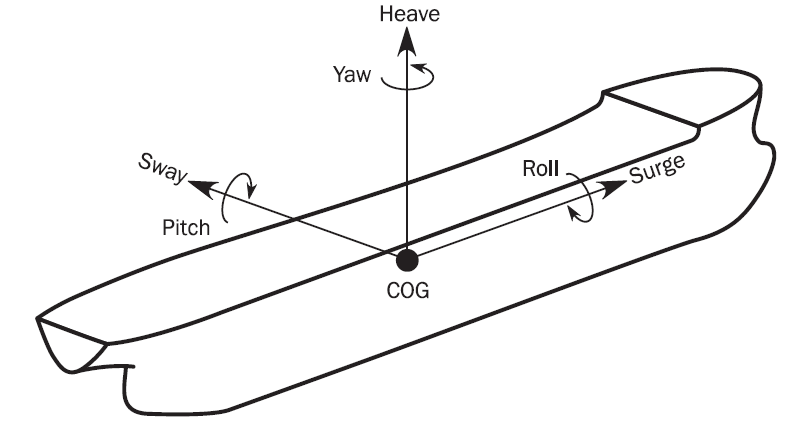
    Figure : Definition of positive motions
  - **1.2.3** **Sign convention for hull girder loads**
    The sign conventions of vertical bending moments, vertical shear forces, horizontal bending moments and torsional moments at any ship transverse section are as shown in **Figure 2,** namely:
    • The vertical bending moments $M _{sw}$ and $M _{wv}$ are positive when they induce tensile stresses in the strength deck (hogging bending moment) and negative when they induce tensile stresses in the bottom (sagging bending moment).
    • The vertical shear forces $Q _{sw}$, $Q _{wv}$ are positive in the case of downward resulting forces acting aft of the transverse section and upward resulting forces acting forward of the transverse section under consideration.
    • The horizontal bending moment $M _{wh}$ is positive when it induces tensile stresses in the starboard side and negative when it induces tensile stresses in the port side.
    • The torsional moment $M _{wt}$ is positive in the case of resulting moment acting aft of the transverse section following negative rotation around the $X$-axis, and of resulting moment acting forward of the transverse section following positive rotation around the $X$-axis.
    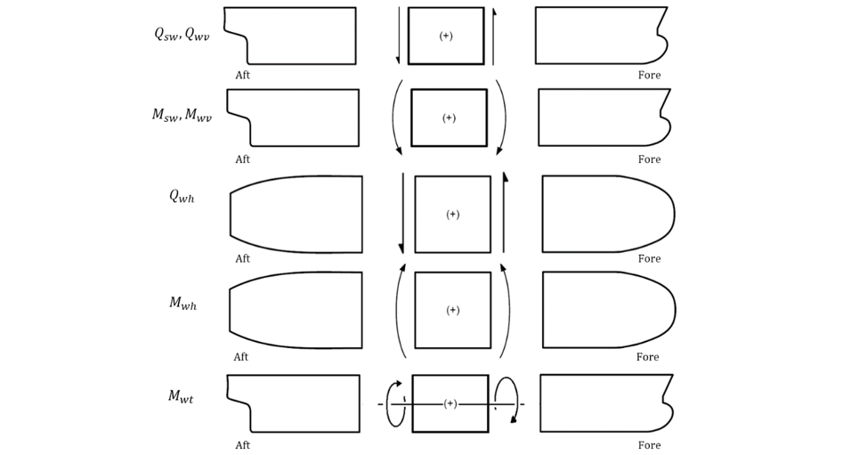
    Figure : Sign conventions for shear forces #eqnID-16, #eqnID-17, #eqnID-18 and bending moments #eqnID-19, #eqnID-20, #eqnID-21 and #eqnID-22

### Section 2 Dynamic Load Cases

**Symbols**
For symbols not defined in this section, refer to **Ch 1, Sec 4.**
$a _{surge}$, $a _{"pitch-x"}$, $a _{sway}$, $a_roll-y$, $a_heave$, $a_roll-z$, $a_"pitch-z"$ : Acceleration components, as defined in **Sec 3.**
$f_xL$ : Ratio between $X$-coordinate of the load point and $L$, to be taken as:
$f_xL = x overL$, but not to be taken less than 0.0 or greater than 1.0.
$f _{T}$ : Ratio between draught at a loading condition and scantling draught, as defined in **Sec 3.**
$f _{lp}$ : Factor depending on longitudinal position along the ship, to be taken as:
$f _{lp}=1.0$ for $f _{xL} \leq 0.5$
$f _{lp} =-1.0$ for $f _{xL} >0.5$
$f _{lp-OST}$ : Factor for the longitudinal distribution of the torsional moment for the OST load case, to be taken as:
$f _{lp-OST} =1.0$ for $f _{xL} \leq 0.45$
$f _{lp-OST} =-8.5f _{xL} +4.825$ for $0.45\(f _{lp-OST} =-0.7$ for $f _{xL} >0.65$
$f _{lp-OSA}$ : Factor for the longitudinal distribution of the torsional moment for the OSA load case, to be taken as:
$f _{lp-OSA} =-0.8$ for $f _{xL} \leq 0.3$
$f _{lp-OSA} = \frac{11}{3} f _{xL} -1.9$ for $0.3\(f _{lp-OSA} =0.3$ for $f _{xL} >0.6$
$WS$ : Weather side, side of the ship exposed to the incoming waves.
$LS$ : Lee side, sheltered side of the ship away from the incoming waves.
$M _{WV}$ : Vertical wave bending moment, in $\mathrm{kNm}$, defined in **Sec 4.**
$Q _{WV}$ : Vertical wave shear force, in $\mathrm{kN}$, defined in **Sec 4.**
$M _{WH}$ : Horizontal wave bending moment, in $\mathrm{kNm}$, defined in **Sec 4.**
$Q _{WH}$ : Horizontal wave shear force, in $\mathrm{kN}$, defined in **Sec 4.**
$M _{WT}$ : Torsional wave bending moment, in $\mathrm{kNm}$, defined in **Sec 4.**
$C _{WV}$ : Load combination factor to be applied to the vertical wave bending moment.
$C _{QV}$ : Load combination factor to be applied to the vertical wave shear force.
$C _{WH}$ : Load combination factor to be applied to the horizontal wave bending moment.
$C _{WT}$ : Load combination factor to be applied to the wave torsional moment.
$C _{XS}$ : Load combination factor to be applied to the surge acceleration.
$C _{XP}$ : Load combination factor to be applied to the longitudinal acceleration due to pitch.
$C _{XG}$ : Load combination factor to be applied to the longitudinal acceleration due to pitch motion.
$C _{YS}$ : Load combination factor to be applied to the sway acceleration.
$C _{YR}$ : Load combination factor to be applied to the transverse acceleration due to roll.
$C _{YG}$ : Load combination factor to be applied to the transverse acceleration due to roll motion.
$C _{ZH}$ : Load combination factor to be applied to the heave acceleration.
$C _{ZR}$ : Load combination factor to be applied to the vertical acceleration due to roll.
$C _{ZP}$ : Load combination factor to be applied to the vertical acceleration due to pitch.
$\theta$ : Roll angle, in deg, as defined in **Sec 3, [2.1.1].**
$\phi$ : Pitch angle, in deg, as defined in **Sec 3, [2.1.2].**

#### 1. General

- **1.1** **Definition of dynamic load cases**
  - **1.1.1** The following Equivalent Design Waves (EDW) are to be used to generate the dynamic load cases for structural assessment:
    • HSM load cases :
    HSM-1 and HSM-2: Head sea EDWs that minimise and maximise the vertical wave bending moment amidships respectively.
    • HSA load cases:
    HSA-1 and HSA-2: Head sea EDWs that maximise and minimise the head sea vertical acceleration at FP respectively.
    • FSM load cases:
    FSM-1 and FSM-2: Following sea EDWs that minimise and maximise the vertical wave bending moment amidships respectively.
    • BSR load cases:
    BSR-1P and BSR-2P: Beam sea EDWs that minimise and maximise the roll motion downward and upward on the port side respectively with waves from the port side.
    BSR-1S and BSR-2S: Beam sea EDWs that maximise and minimise the roll motion downward and upward on the starboard side respectively with waves from the starboard side.
    • BSP load cases:
    BSP-1P and BSP-2P: Beam sea EDWs that maximise and minimise the hydrodynamic pressure at the waterline amidships on the port side respectively.
    BSP-1S and BSP-2S: Beam sea EDWs that maximise and minimise the hydrodynamic pressure at the waterline amidships on the starboard side respectively.
    • OST load cases:
    OST-1P and OST-2P: Oblique sea EDWs that minimise and maximise the torsional moment at 0.25L from the AE with waves from the port side respectively.
    OST-1S and OST-2S: Oblique sea EDWs that maximise and minimise the torsional moment at 0.25L from the AE with waves from the starboard side respectively.
    • OSA load cases:
    OSA-1P and OSA-2P: Oblique sea EDWs that maximise and minimise the pitch acceleration with waves from the port side respectively.
    OSA-1S and OSA-2S: Oblique sea EDWs that maximise and minimise the pitch acceleration with waves from the starboard side respectively.
    Note 1: 1 and 2 denote the maximum or the minimum dominate load component for each EDW.
    Note 2: P and S denote that the weather side is on port side and on starboard side respectively.
    BSP load cases are not to be used for ballast conditions.
    HSA and OSA load cases are not to be used for fatigue assessment.
- **1.2** **Application**
  - **1.2.1** The dynamic load cases described in this section are to be used for determining the dynamic loads required by the design load scenarios described in **Sec 7.** These dynamic load cases are to be applied to the following structural assessments:
    • For plating, ordinary stiffeners and primary supporting members by prescriptive methods.
    • For the direct strength method (FE analysis) assessment of structural members.
    • For structural details covered by simplified stress analysis.
    • For structural details covered by FE stress analysis.
    - **a)** Strength assessment:
    - **b)** Fatigue assessment:

#### 2. Dynamic load cases for strength assessment

- **2.1** **Description of dynamic load cases**
  - **2.1.1** **Table 1** to **Table 3** describe the ship motions responses and the global loads corresponding to each dynamic load case to be considered for the strength assessment.

    | Load case | HSM-1 | HSM-2 | HSA-1 | HSA-2 | FSM-1 | FSM-2 |
    | --- | --- | --- | --- | --- | --- | --- |
    | EDW | HSM |   | HSA |   | FSM |   |
    | Heading | Head |   | Head |   | Following |   |
    | Effect | Max. bending moment |   | Max. vertical acceleration |   | Max. bending moment |   |
    | VWBM | Sagging | Hogging | Sagging | Hogging | Sagging | Hogging |
    | VWSF | Negative-aft Positive-fore | Positive-aft Negative-fore | Negative-aft Positive-fore | Positive-aft Negative-fore | Negative-aft Positive-fore | Positive-aft Negative-fore |
    | HWBM | - | - | - | - | - | - |
    | HWSF | - | - | - | - | - | - |
    | TM | - | - | - | - | - | - |
    | Surge | To stern | To bow | To stern | To bow | To stern | To bow |
    | $a _{surge}$ | 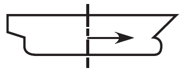 | 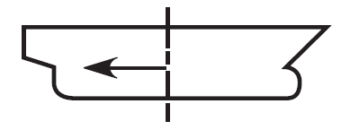 |  |  |  |  |
    | Sway | - | - | - | - | - | - |
    | $a _{sway}$ | - | - | - | - | - | - |
    | Heave | Down | Up | Down | Up | Down | Up |
    | $a _{heave}$ | 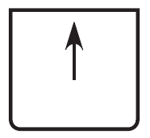 | 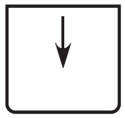 |  |  |  |  |
    | Roll | - | - | - | - | - | - |
    | $a _{roll}$ | - | - | - | - | - | - |
    | Pitch | Bow down | Bow up | Bow down | Bow up | Bow down | Bow up |
    | $a _{"pitch"}$ |  |  |  |  |  | 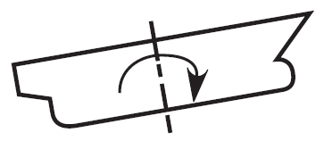 |

    | Load case | BSR-1P | BSR-2P | BSR-1S | BSR-2S | BSP-1P | BSP-2P | BSP-1S | BSP-2S |
    | --- | --- | --- | --- | --- | --- | --- | --- | --- |
    | EDW | BSR |   | BSR |   | BSP |   | BSP |   |
    | Heading | Beam |   |   |   | Beam |   |   |   |
    | Effect | Max. roll |   |   |   | Max. pressure at waterline |   |   |   |
    | VWBM | - | - | - | - | Sagging | Hogging | Sagging | Hogging |
    | VWSF | - | - | - | - | Negative-aft Positive-fore | Positive-aft Negative-fore | Negative-aft Positive-fore | Positive-aft Negative-fore |
    | HWBM | Stbd tensile | Port tensile | Port tensile | Stbd tensile | Stbd tensile | Port tensile | Port tensile | Stbd tensile |
    | HWSF | - | - | - | - | Negative-aft Positive-fore | Positive-aft Negative-fore | Positive-aft Negative-fore | Negative-aft Positive-fore |
    | TM | - | - | - | - | - | - | - | - |
    | Surge | - | - | - | - | To bow | To stern | To bow | To stern |
    | $a _{surge}$ | - | - | - | - |  |  |  |  |
    | Sway | To portside or to starboard |   | To starboard or to portside |   | To portside | To starboard | To starboard | To portside |
    | $a_{sway }$ |  or  |   |  or  |   |  | 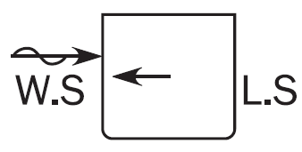 | 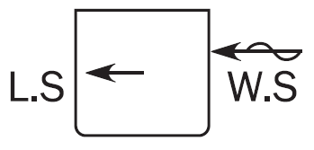 | 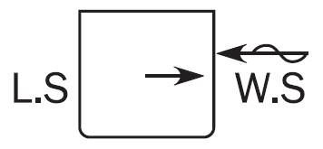 |
    | Heave | Down | Up | Down | Up | Down | Up | Down | Up |
    | $a _{heave}$ |  |  |  |  |  | 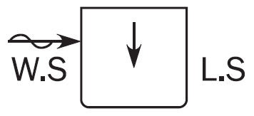 |  |  |
    | Roll | Portside down | Portside up | Starboard down | Starboard up | Portside up | Portside down | Starboard up | Starboard down |
    | $a _{roll}$ |  | 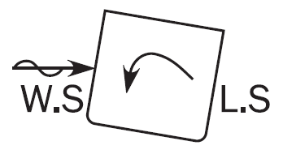 |  |  |  |  |  | 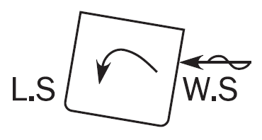 |
    | Pitch | - | - | - | - | - | - | - | - |
    | $a _{p i tch}$ | - | - | - | - | - | - | - | - |

    | Load case | OST-1P | OST-2P | OST-1S | OST-2S | OSA-1P | OSA-2P | OSA-1S | OSA-2S |
    | --- | --- | --- | --- | --- | --- | --- | --- | --- |
    | EDW | OST |   |   |   | OSA |   |   |   |
    | Heading | Oblique |   |   |   | Oblique |   |   |   |
    | Effect | Max. torsional moment |   |   |   | Max. pitch acceleration |   |   |   |
    | VWBM | Sagging | Hogging | Sagging | Hogging | Hogging | Sagging | Hogging | Sagging |
    | VWSF | Negative-aft Positive-fore | Positive-aft Negative-fore | Negative-aft Positive-fore | Positive-aft Negative-fore | Positive-aft Negative-fore | Negative-aft Positive-fore | Positive-aft Negative-fore | Negative-aft Positive-fore |
    | HWBM | Port tensile | Stbd tensile | Stbd tensile | Port tensile | Stbd tensile | Port tensile | Port tensile | Stbd tensile |
    | HWSF | Positive-aft Negative-fore | Negative-aft Positive-fore | Negative-aft Positive-fore | Positive-aft Negative-fore | Negative-aft Positive-fore | Positive-aft Negative-fore | Positive-aft Negative-fore | Negative-aft Positive-fore |
    | TM | Negative-aft Positive-fore | Positive-aft Negative-fore | Positive-aft Negative-fore | Negative-aft Positive-fore | Positive-aft Negative-fore | Negative-aft Positive-fore | Negative-aft Positive-fore | Positive-aft Negative-fore |
    | Surge | To bow | To stern | To bow | To stern | To bow | To stern | To bow | To stern |
    | $a _{surge}$ |  |  |  |  |  |  |  |  |
    | Sway | - | - | - | - | To portside | To starboard | To starboard | To portside |
    | $a_{sway }$ | - |   |   | - | 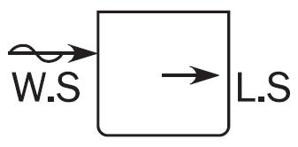 |  |  |  |
    | Heave | Up | Down | Up | Down | Up | Down | Up | Down |
    | $a _{heave}$ |  |  |  |  |  | 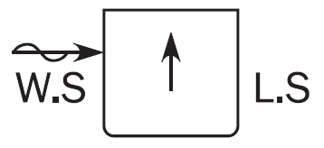 | 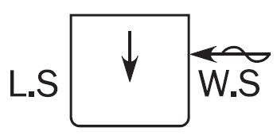 | 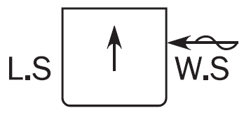 |
    | Roll | Portside down | Portside up | Starboard down | Starboard up | Portside down | Portside up | Starboard down | Starboard up |
    | $a _{roll}$ |  |  |  | 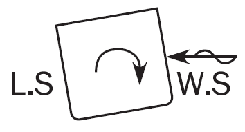 | 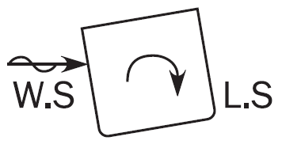 |  |  |  |
    | Pitch | Bow up | Bow down | Bow up | Bow down | Bow up | Bow down | Bow up | Bow down |
    | $a _{p i tch}$ |  |  |  | 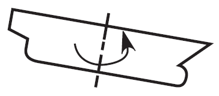 |  |  |  |  |
- **2.2** **Load combination factors**
  - **2.2.1** The load combinations factors, LCFs for the global loads and inertia load components for strength assessment are defined in:
    **Table 4** : LCFs for HSM, HSA and FSM load cases.
    **Table 5** : LCFs for BSR and BSP load cases.
    **Table 6** : LCFs for OST and OSA load cases.

    | Load component |   | LCF | HSM-1 | HSM-2 | HSA-1 | HSA-2 | FSM-1 | FSM-2 |
    | --- | --- | --- | --- | --- | --- | --- | --- | --- |
    | Hull girder loads | $M _{WV}$ | $C _{WV}$ | $-1.0$ | $1.0$ | $-0.9$ | $0.9$ | $-1.0$ | $1.0$ |
    | Hull girder loads | $Q _{WV}$ | $C _{QW}$ | $-f _{lp}$ | $f _{lp}$ | $-f _{lp}$ | $f _{lp}$ | $-0.85f _{lp}$ | $0.85f _{lp}$ |
    | Hull girder loads | $M _{WH}$ | $C _{WH}$ | $0.0$ | $0.0$ | $0.0$ | $0.0$ | $0.0$ | $0.0$ |
    | Hull girder loads | $Q _{WH}$ | $C _{QH}$ | $0.0$ | $0.0$ | $0.0$ | $0.0$ | $0.0$ | $0.0$ |
    | Hull girder loads | $M _{WT}$ | $C _{WT}$ | $0.0$ | $0.0$ | $0.0$ | $0.0$ | $0.0$ | $0.0$ |
    | Longitudinal accelerations | $a _{surge}$ | $C _{XS}$ | $-0.4f _{T} +0.6$ | $0.4f _{T} -0.6$ | $-0.4f _{T} +1$ | $0.4f _{T} -1$ | $-0.5f _{T} +0.5$ | $0.5f _{T} -0.5$ |
    | Longitudinal accelerations | $a _{"pitch-x"}$ | $C _{XP}$ | $-0.5$ | $0.5$ | $-1.0$ | $1.0$ | $-0.1$ | $0.1$ |
    | Longitudinal accelerations | $gsin \varphi$ | $C _{XG}$ | $0.45$ | $-0.45$ | $0.95$ | $-0.95$ | $0.1$ | $-0.1$ |
    | Transverse accelerations | $a _{sway}$ | $C _{YS}$ | $0.0$ | $0.0$ | $0.0$ | $0.0$ | $0.0$ | $0.0$ |
    | Transverse accelerations | $a _{roll-y}$ | $C _{YR}$ | $0.0$ | $0.0$ | $0.0$ | $0.0$ | $0.0$ | $0.0$ |
    | Transverse accelerations | $gsin \theta$ | $C _{YG}$ | $0.0$ | $0.0$ | $0.0$ | $0.0$ | $0.0$ | $0.0$ |
    | Vertical accelerations | $a _{heave}$ | $C _{ZH}$ | $0.2$ | $-0.2$ | $0.4f _{T} -0.1$ | $-0.4f _{T} +0.1$ | $0.1$ | $-0.1$ |
    | Vertical accelerations | $a _{roll-z}$ | $C _{ZR}$ | $0.0$ | $0.0$ | $0.0$ | $0.0$ | $0.0$ | $0.0$ |
    | Vertical accelerations | $a _{"pitch-z"}$ | $C _{ZP}$ | $-0.5$ | $0.5$ | $-1.0$ | $1.0$ | $-0.1$ | $0.1$ |

    | Load component |   | LCF | BSR-1P | BSR-2P | BSR-1S | BSR-2S |
    | --- | --- | --- | --- | --- | --- | --- |
    | Hull girder loads | $M _{WV}$ | $C _{WV}$ | $0.0$ | $0.0$ | $0.0$ | $0.0$ |
    | Hull girder loads | $Q _{WV}$ | $C _{QW}$ | $0.0$ | $0.0$ | $0.0$ | $0.0$ |
    | Hull girder loads | $M _{WH}$ | $C _{WH}$ | $0.05$ | $-0.05$ | $-0.05$ | $0.05$ |
    | Hull girder loads | $Q _{WH}$ | $C _{QH}$ | $0.0$ | $0.0$ | $0.0$ | $0.0$ |
    | Hull girder loads | $M _{WT}$ | $C _{WT}$ | $0.0$ | $0.0$ | $0.0$ | $0.0$ |
    | Longitudinal accelerations | $a _{surge}$ | $C _{XS}$ | $0.0$ | $0.0$ | $0.0$ | $0.0$ |
    | Longitudinal accelerations | $a _{"pitch-x"}$ | $C _{XS}$ | $0.0$ | $0.0$ | $0.0$ | $0.0$ |
    | Longitudinal accelerations | $a _{"pitch-x"}$ | $C _{XP}$ | $0.0$ | $0.0$ | $0.0$ | $0.0$ |
    | Longitudinal accelerations | $gsin \varphi$ | $C _{XG}$ | $0.0$ | $0.0$ | $0.0$ | $0.0$ |
    | Longitudinal accelerations | $gsin \varphi$ | $C _{YS}$ | $-0.7f _{T} +0.6$ | $0.7f _{T} -0.6$ | $0.7f _{T} -0.6$ | $-0.7f _{T} +0.6$ |
    | Transverse accelerations | $a _{sway}$ | $C _{YS}$ | $-0.7f _{T} +0.6$ | $0.7f _{T} -0.6$ | $0.7f _{T} -0.6$ | $-0.7f _{T} +0.6$ |
    | Transverse accelerations | $a _{roll-y}$ | $C _{YR}$ | $1.0$ | $-1.0$ | $-1.0$ | $1.0$ |
    | Transverse accelerations | $gsin \theta$ | $C _{YG}$ | $-1.0$ | $1.0$ | $1.0$ | $-1.0$ |
    | Vertical accelerations | $a _{heave}$ | $C _{ZH}$ | $-0.8f _{T} +0.9$ | $0.8f _{T} -0.9$ | $-0.8f _{T} +0.9$ | $0.8f _{T} -0.9$ |
    | Vertical accelerations | $a _{roll-z}$ | $C _{ZR}$ | $1.0$ | $-1.0$ | $-1.0$ | $1.0$ |
    | Vertical accelerations | $a _{roll-z}$ | $C _{ZP}$ | $0.0$ | $0.0$ | $0.0$ | $0.0$ |
    | Vertical accelerations | $a _{"pitch-z"}$ | $C _{ZP}$ | $0.0$ | $0.0$ | $0.0$ | $0.0$ |
    |   |   |   |   |   |   |   |
    | Load component |   | LCF | BSP-1P | BSP-2P | BSP-1S | BSP-2S |
    | Hull girder loads | $M _{WV}$ | $C _{WV}$ | $-0.5f _{T} +0.25$ | $0.5f _{T} -0.25$ | $-0.5f _{T} +0.25$ | $0.5f _{T} -0.25$ |
    | Hull girder loads | $Q _{WV}$ | $C _{QW}$ | $(0.25f _{T} -0.5)f _{lp}$ | $(-0.25f _{T} +0.5)f _{lp}$ | $(0.25f _{T} -0.5)f _{lp}$ | $(-0.25f _{T} +0.5)f _{lp}$ |
    | Hull girder loads | $M _{WH}$ | $C _{WH}$ | $0.15$ | $-0.15$ | $-0.15$ | $0.15$ |
    | Hull girder loads | $Q _{WH}$ | $C _{QH}$ | $-0.1f _{lp}$ | $0.1f _{lp}$ | $0.1f _{lp}$ | $-0.1f _{lp}$ |
    | Hull girder loads | $M _{WT}$ | $C _{WT}$ | $0.0$ | $0.0$ | $0.0$ | $0.0$ |
    | Longitudinal accelerations | $a _{surge}$ | $C _{XS}$ | $-0.1$ | $0.1$ | $-0.1$ | $0.1$ |
    | Longitudinal accelerations | $a _{"pitch-x"}$ | $C _{XS}$ | $-0.1$ | $0.1$ | $-0.1$ | $0.1$ |
    | Longitudinal accelerations | $a _{"pitch-x"}$ | $C _{XP}$ | $0.0$ | $0.0$ | $0.0$ | $0.0$ |
    | Longitudinal accelerations | $gsin \varphi$ | $C _{XG}$ | $0.0$ | $0.0$ | $0.0$ | $0.0$ |
    | Transverse accelerations | $a _{sway}$ | $C _{YS}$ | $-1.0$ | $1.0$ | $1.0$ | $-1.0$ |
    | Transverse accelerations | $a _{roll-y}$ | $C _{YR}$ | $-0.58f _{T} +0.18$ | $0.58f _{T} -0.18$ | $0.58f _{T} -0.18$ | $-0.58f _{T} +0.18$ |
    | Transverse accelerations | $gsin \theta$ | $C _{YG}$ | $0.1$ | $-0.1$ | $-0.1$ | $0.1$ |
    | Vertical accelerations | $a _{heave}$ | $C _{ZH}$ | $0.5f _{T} +0.4$ | $-0.5f _{T} -0.4$ | $0.5f _{T} +0.4$ | $-0.5f _{T} -0.4$ |
    | Vertical accelerations | $a _{roll-z}$ | $C _{ZR}$ | $-0.58f _{T} +0.18$ | $0.58f _{T} -0.18$ | $0.58f _{T} -0.18$ | $-0.58f _{T} +0.18$ |
    | Vertical accelerations | $a _{roll-z}$ | $C _{ZP}$ | $0.0$ | $0.0$ | $0.0$ | $0.0$ |
    | Vertical accelerations | $a _{"pitch-z"}$ | $C _{ZP}$ | $0.0$ | $0.0$ | $0.0$ | $0.0$ |

    | Load component |   | LCF | OST-1P | OST-2P | OST-1S | OST-2S |
    | --- | --- | --- | --- | --- | --- | --- |
    | Hull girder loads | $M _{WV}$ | $C _{WV}$ | $-0.2f _{T} -0.3$ | $0.2f _{T} +0.3$ | $-0.2f _{T} -0.3$ | $0.2f _{T} +0.3$ |
    | Hull girder loads | $Q _{WV}$ | $C _{QW}$ | $-0.35f _{lp}$ | $0.35f _{lp}$ | $-0.35f _{lp}$ | $0.35f _{lp}$ |
    | Hull girder loads | $M _{WH}$ | $C _{WH}$ | $-1.0$ | $1.0$ | $1.0$ | $-1.0$ |
    | Hull girder loads | $Q _{WH}$ | $C _{QH}$ | $(1.1f _{T} -0.4)f _{lp}$ | $(-1.1f _{T} +0.4)f _{lp}$ | $(-1.1f _{T} +0.4)f _{lp}$ | $(1.1f _{T} -0.4)f _{lp}$ |
    | Hull girder loads | $M _{WT}$ | $C _{WT}$ | $-f _{lp-OST}$ | $f _{lp-OST}$ | $f _{lp-OST}$ | $-f _{lp-OST}$ |
    | Longitudinal accelerations | $a _{surge}$ | $C _{XS}$ | $-0.25$ | $0.25$ | $-0.25$ | $0.25$ |
    | Longitudinal accelerations | $a _{"pitch-x"}$ | $C _{XP}$ | $0.6$ | $-0.6$ | $0.6$ | $-0.6$ |
    | Longitudinal accelerations | $gsin \varphi$ | $C _{XG}$ | $-0.4$ | $0.4$ | $-0.4$ | $0.4$ |
    | Transverse accelerations | $a _{sway}$ | $C _{YS}$ | $0.0$ | $0.0$ | $0.0$ | $0.0$ |
    | Transverse accelerations | $a _{roll-y}$ | $C _{YR}$ | $1.4f _{T} -0.7$ | $-1.4f _{T} +0.7$ | $-1.4f _{T} +0.7$ | $1.4f _{T} -0.7$ |
    | Transverse accelerations | $gsin \theta$ | $C _{YG}$ | $-0.4f _{T} +0.1$ | $0.4f _{T} -0.1$ | $0.4f _{T} -0.1$ | $-0.4f _{T} +0.1$ |
    | Vertical accelerations | $a _{heave}$ | $C _{ZH}$ | $-0.15$ | $0.15$ | $-0.15$ | $0.15$ |
    | Vertical accelerations | $a _{roll-z}$ | $C _{ZR}$ | $1.4f _{T} -0.7$ | $-1.4f _{T} +0.7$ | $-1.4f _{T} +0.7$ | $1.4f _{T} -0.7$ |
    | Vertical accelerations | $a _{roll-z}$ | $C _{ZP}$ | $0.6$ | $-0.6$ | $0.6$ | $-0.6$ |
    | Vertical accelerations | $a _{"pitch-z"}$ | $C _{ZP}$ | $0.6$ | $-0.6$ | $0.6$ | $-0.6$ |
    |   |   |   |   |   |   |   |
    | Load component |   | LCF | OSA-1P | OSA-2P | OSA-1S | OSA-2S |
    | Hull girder loads | $M _{WV}$ | $C _{WV}$ | $-0.3f _{T} +0.75$ | $0.3f _{T} -0.75$ | $-0.3f _{T} +0.75$ | $0.3f _{T} -0.75$ |
    | Hull girder loads | $Q _{WV}$ | $C _{QW}$ | $(-0.3f _{T} +0.75)f _{lp}$ | $(0.3f _{T} -0.75)f _{lp}$ | $(-0.3f _{T} +0.75)f _{lp}$ | $(0.3f _{T} -0.75)f _{lp}$ |
    | Hull girder loads | $M _{WH}$ | $C _{WH}$ | $-0.4f _{T} +1.1$ | $0.4f _{T} -1.1$ | $0.4f _{T} -1.1$ | $-0.4f _{T} +1.1$ |
    | Hull girder loads | $Q _{WH}$ | $C _{QH}$ | $(0.4f _{T} -1.1)f _{lp}$ | $(-0.4f _{T} +1.1)f _{lp}$ | $(-0.4f _{T} +1.1)f _{lp}$ | $(0.4f _{T} -1.1)f _{lp}$ |
    | Hull girder loads | $M _{WT}$ | $C _{WT}$ | $-f _{lp-OSA}$ | $f _{lp-OSA}$ | $f _{lp-OSA}$ | $-f _{lp-OSA}$ |
    | Longitudinal accelerations | $a _{surge}$ | $C _{XS}$ | $0.2f _{T} -0.45$ | $-0.2f _{T} +0.45$ | $0.2f _{T} -0.45$ | $-0.2f _{T} +0.45$ |
    | Longitudinal accelerations | $a _{"pitch-x"}$ | $C _{XP}$ | $1.0$ | $-1.0$ | $1.0$ | $-1.0$ |
    | Longitudinal accelerations | $gsin \varphi$ | $C _{XG}$ | $-0.6$ | $0.6$ | $-0.6$ | $0.6$ |
    | Transverse accelerations | $a _{sway}$ | $C _{YS}$ | $-0.2f _{T}$ | $0.2f _{T}$ | $0.2f _{T}$ | $-0.2f _{T}$ |
    | Transverse accelerations | $a _{roll-y}$ | $C _{YR}$ | $0.2$ | $-0.2$ | $-0.2$ | $0.2$ |
    | Transverse accelerations | $gsin \theta$ | $C _{YG}$ | $0.1$ | $-0.1$ | $-0.1$ | $0.1$ |
    | Vertical accelerations | $a _{heave}$ | $C _{ZH}$ | $-0.4f _{T} +0.1$ | $0.4f _{T} -0.1$ | $-0.4f _{T} +0.1$ | $0.4f _{T} -0.1$ |
    | Vertical accelerations | $a _{roll-z}$ | $C _{ZR}$ | $0.2$ | $-0.2$ | $-0.2$ | $0.2$ |
    | Vertical accelerations | $a _{roll-z}$ | $C _{ZP}$ | $1.0$ | $-1.0$ | $1.0$ | $-1.0$ |
    | Vertical accelerations | $a _{"pitch-z"}$ | $C _{ZP}$ | $1.0$ | $-1.0$ | $1.0$ | $-1.0$ |

#### 3. Dynamic load cases for fatigue assessment

- **3.1** **Description of dynamic load cases**
  - **3.1.1** **Table 7** to **Table 9** describe the ship motions responses and the global loads corresponding to each dynamic load case to be considered for the fatigue assessment.

    | Loadcase | HSM-1 | HSM-2 | FSM-1 | FSM-2 |
    | --- | --- | --- | --- | --- |
    | EDW | HSM |   | FSM |   |
    | Heading | Head |   | Following |   |
    | Effect | Max. bending moment |   | Max. bending moment |   |
    | VWBM | Sagging | Hogging | Sagging | Hogging |
    | VWSF | Negative-aft Positive-fore | Positive-aft Negative-fore | Negative-aft Positive-fore | Positive-aft Negative-fore |
    | HWBM | - | - | - | - |
    | HWSF | - | - | - | - |
    | TM | - | - | - | - |
    | Surge | To stern | To bow | To bow | To stern |
    | $a _{surge}$ |  |  |  |  |
    | Sway | - | - | - | - |
    | $a _{sway}$ | - | - | - | - |
    | Heave | Down | Up | - | - |
    | $a _{heave}$ |  |  | - | - |
    | Roll | - | - | - | - |
    | $a _{roll}$ | - | - | - | - |
    | Pitch | Bow down | Bow up | Bow down | Bow up |
    | $a _{"pitch"}$ |  |  |  |  |

    | Load case | BSR-1P | BSR-2P | BSR-1S | BSR-2S | BSP-1P | BSP-2P | BSP-1S | BSP-2S |
    | --- | --- | --- | --- | --- | --- | --- | --- | --- |
    | EDW | BSR |   | BSR |   | BSP |   | BSP |   |
    | Heading | Beam |   |   |   | Beam |   |   |   |
    | Effect | Max. roll |   |   |   | Max. pressure at waterline |   |   |   |
    | VWBM | - | - | - | - | Sagging | Hogging | Sagging | Hogging |
    | VWSF | - | - | - | - | Negative-aft Positive-fore | Positive-aft Negative-fore | Negative-aft Positive-fore | Positive-aft Negative-fore |
    | HWBM | Stbd tensile | Port tensile | Port tensile | Stbd tensile | Stbd tensile | Port tensile | Port tensile | Stbd tensile |
    | HWSF | - | - | - | - | Negative-aft Positive-fore | Positive-aft Negative-fore | Positive-aft Negative-fore | Negative-aft Positive-fore |
    | TM | - | - | - | - | - | - | - | - |
    | Surge | - | - | - | - | To bow | To stern | To bow | To stern |
    | $a _{surge}$ | - | - | - | - |  |  |  |  |
    | Sway | To portside or to starboard |   | To starboard or to portside |   | To portside | To starboard | To starboard | To portside |
    | $a_{sway }$ |  or  |   |  or  |   |  |  |  |  |
    | Heave | Down | Up | Down | Up | Down | Up | Down | Up |
    | $a _{heave}$ |  |  |  |  |  |  |  |  |
    | Roll | Portside down | Portside up | Starboard down | Starboard up | Portside up | Portside down | Starboard up | Starboard down |
    | $a _{roll}$ |  |  |  |  |  |  |  |  |
    | Pitch | - | - | - | - | - | - | - | - |
    | $a _{p i tch}$ | - | - | - | - | - | - | - | - |

    | Loadcase | OST-1P | OST-2P | OST-1S | OST-2S |
    | --- | --- | --- | --- | --- |
    | EDW | OST |   |   |   |
    | Heading | Oblique |   |   |   |
    | Effect | Max. torsional moment |   |   |   |
    | VWBM | Sagging | Hogging | Sagging | Hogging |
    | VWSF | Negative-aft Positive-fore | Positive-aft Negative-fore | Negative-aft Positive-fore | Positive-aft Negative-fore |
    | HWBM | Port tensile | Stbd tensile | Stbd tensile | Port tensile |
    | HWSF | Positive-aft Negative-fore | Negative-aft Positive-fore | Negative-aft Positive-fore | Positive-aft Negative-fore |
    | TM | Negative-aft Positive-fore | Positive-aft Negative-fore | Positive-aft Negative-fore | Negative-aft Positive-fore |
    | Surge | To bow | To stern | To bow | To stern |
    | $a _{surge}$ |  |  |  |  |
    | Sway | - | - | - | - |
    | $a_{sway }$ | - |   |   | - |
    | Heave | Up | Down | Up | Down |
    | $a _{heave}$ |  |  |  |  |
    | Roll | Portside down | Portside up | Starboard down | Starboard up |
    | $a _{roll}$ |  |  |  |  |
    | Pitch | Bow up | Bow down | Bow up | Bow down |
    | $a _{p i tch}$ |  |  |  |  |
- **3.2** **Load combination factors**
  - **3.2.1** The load combinations factors, LCFs for the global loads and inertia load components for fatigue assessment are defined in:
    **Table 10** : LCFs for HSM and FSM load cases.
    **Table 11** : LCFs for BSR and BSP load cases.
    **Table 12** : LCFs for OST load cases.

    | Load component |   | LCF | HSM-1 | HSM-2 | FSM-1 | FSM-2 |
    | --- | --- | --- | --- | --- | --- | --- |
    | Hull girder loads | $M _{WV}$ | $C _{WV}$ | $-1.0$ | $1.0$ | $-1.0$ | $1.0$ |
    | Hull girder loads | $Q _{WV}$ | $C _{QW}$ | $-f _{lp}$ | $f _{lp}$ | $-(-0.15f _{T} +0.95)f _{lp}$ | $(-0.15f _{T} +0.95)f _{lp}$ |
    | Hull girder loads | $M _{WH}$ | $C _{WH}$ | $0.0$ | $0.0$ | $0.0$ | $0.0$ |
    | Hull girder loads | $Q _{WH}$ | $C _{QH}$ | $0.0$ | $0.0$ | $0.0$ | $0.0$ |
    | Hull girder loads | $M _{WT}$ | $C _{WT}$ | $0.0$ | $0.0$ | $0.0$ | $0.0$ |
    | Longitudinal accelerations | $a _{surge}$ | $C _{XS}$ | $-0.4f _{T} +0.6$ | $0.4f _{T} -0.6$ | $-0.65f _{T} +0.6$ | $0.65f _{T} -0.6$ |
    | Longitudinal accelerations | $a _{"pitch-x"}$ | $C _{XP}$ | $-0.35f _{T} -0.5$ | $0.35f _{T} +0.5$ | $-0.05$ | $0.05$ |
    | Longitudinal accelerations | $gsin \varphi$ | $C _{XG}$ | $0.35f _{T} +0.4$ | $-0.35f _{T} -0.4$ | $0.1$ | $-0.1$ |
    | Transverse accelerations | $a _{sway}$ | $C _{YS}$ | $0.0$ | $0.0$ | $0.0$ | $0.0$ |
    | Transverse accelerations | $a _{roll-y}$ | $C _{YR}$ | $0.0$ | $0.0$ | $0.0$ | $0.0$ |
    | Transverse accelerations | $gsin \theta$ | $C _{YG}$ | $0.0$ | $0.0$ | $0.0$ | $0.0$ |
    | Vertical accelerations | $a _{heave}$ | $C _{ZH}$ | $0.4f _{T} -0.1$ | $-0.4f _{T} +0.1$ | $0.0$ | $0.0$ |
    | Vertical accelerations | $a _{roll-z}$ | $C _{ZR}$ | $0.0$ | $0.0$ | $0.0$ | $0.0$ |
    | Vertical accelerations | $a _{"pitch-z"}$ | $C _{ZP}$ | $-0.35f _{T} -0.5$ | $0.35f _{T} +0.5$ | $-0.05$ | $0.05$ |

    | Load component |   | LCF | BSR-1P | BSR-2P | BSR-1S | BSR-2S |
    | --- | --- | --- | --- | --- | --- | --- |
    | Hull girder loads | $M _{WV}$ | $C _{WV}$ | $0.0$ | $0.0$ | $0.0$ | $0.0$ |
    | Hull girder loads | $Q _{WV}$ | $C _{QW}$ | $0.0$ | $0.0$ | $0.0$ | $0.0$ |
    | Hull girder loads | $M _{WH}$ | $C _{WH}$ | $0.05$ | $-0.05$ | $-0.05$ | $0.05$ |
    | Hull girder loads | $Q _{WH}$ | $C _{QH}$ | $0.0$ | $0.0$ | $0.0$ | $0.0$ |
    | Hull girder loads | $M _{WT}$ | $C _{WT}$ | $0.0$ | $0.0$ | $0.0$ | $0.0$ |
    | Longitudinal accelerations | $a _{surge}$ | $C _{XS}$ | $0.0$ | $0.0$ | $0.0$ | $0.0$ |
    | Longitudinal accelerations | $a _{"pitch-x"}$ | $C _{XS}$ | $0.0$ | $0.0$ | $0.0$ | $0.0$ |
    | Longitudinal accelerations | $a _{"pitch-x"}$ | $C _{XP}$ | $0.0$ | $0.0$ | $0.0$ | $0.0$ |
    | Longitudinal accelerations | $gsin \varphi$ | $C _{XG}$ | $0.0$ | $0.0$ | $0.0$ | $0.0$ |
    | Longitudinal accelerations | $gsin \varphi$ | $C _{YS}$ | $-0.8f _{T} +0.75$ | $0.8f _{T} -0.75$ | $0.8f _{T} -0.75$ | $-0.8f _{T} +0.75$ |
    | Transverse accelerations | $a _{sway}$ | $C _{YS}$ | $-0.8f _{T} +0.75$ | $0.8f _{T} -0.75$ | $0.8f _{T} -0.75$ | $-0.8f _{T} +0.75$ |
    | Transverse accelerations | $a _{roll-y}$ | $C _{YR}$ | $-1.35f _{T} +1.75$ | $1.35f _{T} -1.75$ | $1.35f _{T} -1.75$ | $-1.35f _{T} +1.75$ |
    | Transverse accelerations | $gsin \theta$ | $C _{YG}$ | $-1.0$ | $1.0$ | $1.0$ | $-1.0$ |
    | Vertical accelerations | $a _{heave}$ | $C _{ZH}$ | $0.75f _{T} -0.8$ | $0.8-0.75f _{T}$ | $0.8-0.75f _{T}$ | $0.75f _{T} -0.8$ |
    | Vertical accelerations | $a _{roll-z}$ | $C _{ZR}$ | $-1.35f _{T} +1.75$ | $1.35f _{T} -1.75$ | $1.35f _{T} -1.75$ | $-1.35f _{T} +1.75$ |
    | Vertical accelerations | $a _{roll-z}$ | $C _{ZP}$ | $0.0$ | $0.0$ | $0.0$ | $0.0$ |
    | Vertical accelerations | $a _{"pitch-z"}$ | $C _{ZP}$ | $0.0$ | $0.0$ | $0.0$ | $0.0$ |
    |   |   |   |   |   |   |   |
    | Load component |   | LCF | BSP-1P | BSP-2P | BSP-1S | BSP-2S |
    | Hull girder loads | $M _{WV}$ | $C _{WV}$ | $-0.65f _{T} +0.4$ | $0.65f _{T} -0.4$ | $-0.65f _{T} +0.4$ | $0.65f _{T} -0.4$ |
    | Hull girder loads | $Q _{WV}$ | $C _{QW}$ | $(-0.65f _{T} +0.4)f _{lp}$ | $(0.65f _{T} -0.4)f _{lp}$ | $(-0.65f _{T} +0.4)f _{lp}$ | $(0.65f _{T} -0.4)f _{lp}$ |
    | Hull girder loads | $M _{WH}$ | $C _{WH}$ | $0.15$ | $-0.15$ | $-0.15$ | $0.15$ |
    | Hull girder loads | $Q _{WH}$ | $C _{QH}$ | $-0.1f _{lp}$ | $0.1f _{lp}$ | $0.1f _{lp}$ | $-0.1f _{lp}$ |
    | Hull girder loads | $M _{WT}$ | $C _{WT}$ | $0.0$ | $0.0$ | $0.0$ | $0.0$ |
    | Longitudinal accelerations | $a _{surge}$ | $C _{XS}$ | $0.0$ | $0.0$ | $0.0$ | $0.0$ |
    | Longitudinal accelerations | $a _{"pitch-x"}$ | $C _{XS}$ | $0.0$ | $0.0$ | $0.0$ | $0.0$ |
    | Longitudinal accelerations | $a _{"pitch-x"}$ | $C _{XP}$ | $0.0$ | $0.0$ | $0.0$ | $0.0$ |
    | Longitudinal accelerations | $gsin \varphi$ | $C _{XG}$ | $0.0$ | $0.0$ | $0.0$ | $0.0$ |
    | Transverse accelerations | $a _{sway}$ | $C _{YS}$ | $-2.4f _{T} +1.5$ | $2.4f _{T} -1.5$ | $2.4f _{T} -1.5$ | $-2.4f _{T} +1.5$ |
    | Transverse accelerations | $a _{roll-y}$ | $C _{YR}$ | $-3.3f _{T} +3.0$ | $3.3f _{T} -3.0$ | $3.3f _{T} -3.0$ | $-3.3f _{T} +3.0$ |
    | Transverse accelerations | $gsin \theta$ | $C _{YG}$ | $2.6f _{T} -2.5$ | $-2.6f _{T} +2.5$ | $-2.6f _{T} +2.5$ | $2.6f _{T} -2.5$ |
    | Vertical accelerations | $a _{heave}$ | $C _{ZH}$ | $0.55f _{T} +0.2$ | $-0.55f _{T} -0.2$ | $0.55f _{T} +0.2$ | $-0.55f _{T} -0.2$ |
    | Vertical accelerations | $a _{roll-z}$ | $C _{ZR}$ | $-3.3f _{T} +3.0$ | $3.3f _{T} -3.0$ | $3.3f _{T} -3.0$ | $-3.3f _{T} +3.0$ |
    | Vertical accelerations | $a _{roll-z}$ | $C _{ZP}$ | $0.0$ | $0.0$ | $0.0$ | $0.0$ |
    | Vertical accelerations | $a _{"pitch-z"}$ | $C _{ZP}$ | $0.0$ | $0.0$ | $0.0$ | $0.0$ |

    | Load component |   | LCF | OST-1P | OST-2P | OST-1S | OST-2S |
    | --- | --- | --- | --- | --- | --- | --- |
    | Hull girder loads | $M _{WV}$ | $C _{WV}$ | $-0.8f _{T} +0.5$ | $0.8f _{T} -0.5$ | $-0.8f _{T} +0.5$ | $0.8f _{T} -0.5$ |
    | Hull girder loads | $Q _{WV}$ | $C _{QW}$ | $\left( -0.8f _{T} +0.5 \right) f _{lp}$ | $\left( 0.8f _{T} -0.5 \right) f _{lp}$ | $\left( -0.8f _{T} +0.5 \right) f _{lp}$ | $\left( 0.8f _{T} -0.5 \right) f _{lp}$ |
    | Hull girder loads | $M _{WH}$ | $C _{WH}$ | $-1.3f _{T} +0.3$ | $1.3f _{T} -0.3$ | $1.3f _{T} -0.3$ | $-1.3f _{T} +0.3$ |
    | Hull girder loads | $Q _{WH}$ | $C _{QH}$ | $\left( 0.11f _{T} +0.05 \right) f _{lp}$ | $\left( -0.11f _{T} -0.05 \right) f _{lp}$ | $\left( -0.11f _{T} -0.05 \right) f _{lp}$ | $\left( 0.11f _{T} +0.05 \right) f _{lp}$ |
    | Hull girder loads | $M _{WT}$ | $C _{WT}$ | $-f _{lp-OST}$ | $f _{lp-OST}$ | $f _{lp-OST}$ | $-f _{lp-OST}$ |
    | Longitudinal accelerations | $a _{surge}$ | $C _{XS}$ | $0.1f _{T} -0.2$ | $-0.1f _{T} +0.2$ | $0.1f _{T} -0.2$ | $-0.1f _{T} +0.2$ |
    | Longitudinal accelerations | $a _{"pitch-x"}$ | $C _{XP}$ | $-0.26f _{T} +0.24$ | $0.26f _{T} -0.24$ | $-0.26f _{T} +0.24$ | $0.26f _{T} -0.24$ |
    | Longitudinal accelerations | $gsin \varphi$ | $C _{XG}$ | $0.26f _{T} -0.24$ | $-0.26f _{T} +0.24$ | $0.26f _{T} -0.24$ | $-0.26f _{T} +0.24$ |
    | Transverse accelerations | $a _{sway}$ | $C _{YS}$ | $0.0$ | $0.0$ | $0.0$ | $0.0$ |
    | Transverse accelerations | $a _{roll-y}$ | $C _{YR}$ | $3.4f _{T} -2.9$ | $-3.4f _{T} +2.9$ | $-3.4f _{T} +2.9$ | $3.4f _{T} -2.9$ |
    | Transverse accelerations | $gsin \theta$ | $C _{YG}$ | $-2.5f _{T} +2.4$ | $2.5f _{T} -2.4$ | $2.5f _{T} -2.4$ | $-2.5f _{T} +2.4$ |
    | Vertical accelerations | $a _{heave}$ | $C _{ZH}$ | $1.3f _{T} -1.2$ | $-1.3f _{T} +1.2$ | $1.3f _{T} -1.2$ | $-1.3f _{T} +1.2$ |
    | Vertical accelerations | $a _{roll-z}$ | $C _{ZR}$ | $3.4f _{T} -2.9$ | $-3.4f _{T} +2.9$ | $-3.4f _{T} +2.9$ | $3.4f _{T} -2.9$ |
    | Vertical accelerations | $a _{roll-z}$ | $C _{ZP}$ | $-0.26f _{T} +0.24$ | $0.26f _{T} -0.24$ | $-0.26f _{T} +0.24$ | $0.26f _{T} -0.24$ |
    | Vertical accelerations | $a _{"pitch-z"}$ | $C _{ZP}$ | $-0.26f _{T} +0.24$ | $0.26f _{T} -0.24$ | $-0.26f _{T} +0.24$ | $0.26f _{T} -0.24$ |

### Section 3 Ship Motions and Accelerations

**Symbols**
For symbols not defined in this section, refer to **Ch 1, Sec 4.**
$a _{0}$ : Acceleration parameter, to be taken as:
$a _{0} =(1.31-0.43C _{B} ) \left( \frac{4.2}{\sqrt {L}} + \frac{16}{L} - \frac{150}{L ^{2}} \right)$
$T_\theta$ : Roll period, in s, as defined in **[2.1.1].**
$\theta$ : Roll angle, in deg, as defined in **[2.1.1].**
$T_ \phi$ : Pitch period, in s, as defined in **[2.1.2].**
$\phi$ : Pitch angle, in deg, as defined in **[2.1.2].**
$R$ : Vertical coordinate, in $\mathrm{m}$, of the ship rotation centre, to be taken as:
$R= \frac{1}{2} (0.35B + 1.4T _{LC} )$
$C _{XG} , C _{XS} , C _{XP} , C _{YG} , C _{YS} , C _{YR} , C _{ZH} , C _{ZR}$ and $C _{ZP}$ : Load combination factors, as defined in **Sec 2.**
$a _{roll-y}$ : Transverse acceleration due to roll, in $\mathrm{m}/s ^{2}$, as defined in **[3.3.2].**
$a _{"pitch-x"}$ : Longitudinal acceleration due to pitch, in $\mathrm{m}/s^2$, as defined in **[3.3.1].**
$a_roll-z$ : Vertical acceleration due to roll, in $\mathrm{m}/s ^{2}$, as defined in **[3.3.3].**
$a_"pitch-z"$ : Vertical acceleration due to pitch, in $\mathrm{m}/s ^{2}$, as defined in **[3.3.3].**
$f_T$ : Ratio between draught at a loading condition and scantling draught, to be taken as:
$f _{T} = \frac{T _{LC}}{T _{SC}}$ but is not to be taken less than 0.5.
$T _{LC}$ : Draught, in $\mathrm{m}$, amidships for the considered load case.
$x, y, z$ : $X$, $Y$ and $Z$ coordinates, in $\mathrm{m}$, of the considered point with respect to the coordinate system, as defined in **Sec 1, [1.2.1].**
$f _{ps}$ : Coefficient for strength assessments which is dependant on the applicable design load scenario specified in **Sec 7,** and to be taken as:
$f _{ps}$ = 1.0 for the extreme sea loads design load scenario.
$f _{ps}$ = 0.8 for the ballast water exchange design load scenario.
$f _{ps}$ = 0.8 for the accidental design load scenario at sea.
$f _{ps}$ = 0.4 for the harbour/sheltered water design load scenario.
$f _{R}$ : Coefficient related to the operational profile, to be taken as:
$f _{R}$ = 0.85

#### 1. General

- **1.1** **Definition**
  - **1.1.1** The ship motions and accelerations are assumed to be sinusoidal. The motion values defined by the formulae in this section are single amplitudes, i.e. half of the ‘crest to trough’ height.

#### 2. Ship motions and accelerations

- **2.1** **Ship motions**
  - **2.1.1** **Roll motion**
    The roll period, $T _{\theta}$ in s, to be taken as:
    $T _{\theta } = {2.3 \pi k _{r}} over {\sqrt {g GM}$
    The roll angle, $\theta$ in deg, to be taken as:
    $\theta = \frac{9000(1.25-0.025T _{\theta } )f _{p} f _{BK}}{(B+75) \pi}$
    where:
    $f _{p}$ : Coefficient to be taken as:
    $f _{p} =f _{ps}$ for strength assessment.
    $f _{p} =0.1 \left[ \left( -8f _{T} +10 \right) -B \times 10 ^{-2} \right]$ for fatigue assessment.
    $f_BK$ : To be taken as:
    $f_BK =1.2$ for ships without bilge keel.
    $f _{BK} =1.0$ for ships with bilge keel.
    $k _{r}$ : Roll radius of gyration, in $\mathrm{m}$, in the considered loading condition. The values in **Table 1** is to be adopted unless provided in the loading manual.
    $GM$ : Metacentric height, in $\mathrm{m}$, in the considered loading condition. The values in **Table 1** is to be adopted unless provided in the loading manual.

    | Loading condition(1) | $T _{LC}$ | $k _{r}$ | $GM$ |
    | --- | --- | --- | --- |
    | Full load condition | $T _{SC}$ | $0.35B$ | $0.06B$ |
    | Ballast condition | $T _{BAL}$ | $0.45B$ | $0.16B$ |
    | (1) For flooded loading conditions, the values of $k _{r}$ and $GM$, unless provided in the loading manual, are to be taken as those for the full load condition. |   |   |   |
  - **2.1.2** **Pitch motion**
    The pitch period, $T _{\phi}$ in s, is to be taken as:
    $T _{\phi } = \sqrt {\frac{2 \pi L}{g}}$
    where:
    The pitch angle, $\phi$ in deg, is to be taken as:
    $\phi =1350 f _{R} f _{p} L ^{-0.94} \left\{ 1.0+ \left( \frac{15}{\sqrt {gL}} \right) ^{1.6} \right\}$
    where:
    $f _{p}$ : Coefficient to be taken as:
    $f _{p} =f _{ps}$ for strength assessment.
    $f _{p} =0.92 \left[ \left( 0.36-0.1f _{T} \right) - \left( 11.6-5.17f _{T} \right) L \times 10 ^{-9.34} \right]$ for fatigue assessment.
- **2.2** **Ship accelerations at the centre of gravity**
  - **2.2.1** **Surge acceleration**
    The longitudinal acceleration due to surge, in $\mathrm{m}/s^2$, is to be taken as:
    $a _{surge} =0.32 f _{R} f _{p} a _{0} g$
    where:
    $f _{p}$ : Coefficient to be taken as:
    $f _{p} =f _{ps}$ for strength assessment.
    $f _{p} =0.9 \left[ 0.4- \left( 12f _{T} -0.6 \right) L \times 10 ^{-4.26} \right]$ for fatigue assessment.
  - **2.2.2** **Sway acceleration**
    The transverse acceleration due to sway, in $\mathrm{m}/s^2$, is to be taken as:
    $a _{sway} =0.56 f _{R} f _{p} a _{0} g$
    where:
    $f _{p}$ : Coefficient to be taken as:
    $f _{p} =f _{ps}$ for strength assessment.
    $f _{p} =0.9 \left[ 0.3- \left( 0.56f _{T} -2 \right) B \times 10 ^{-3.7} \right]$ for fatigue assessment.
  - **2.2.3** **Heave acceleration**
    The vertical acceleration due to heave, in $\mathrm{m}/s^2$, is to be taken as:
    $a _{heave} =f _{R} f _{p} a _{0} g$
    where:
    $f _{p}$ : Coefficient to be taken as:
    $f _{p} =f _{ps}$ for strength assessment.
    $f _{p} =0.9 \left[ \left( 0.35+0.15f _{T} \right) -5L \times 10 ^{-4} \right]$ for fatigue assessment.
  - **2.2.4** **Roll acceleration**
    The roll acceleration, $a _{roll}$ in $\mathrm{rad}/s ^{2}$, is to be taken as:
    $a _{roll} =f _{p} \theta \frac{\pi}{180} \left( \frac{2 \pi}{T _{\theta }} \right) ^{2}$
    where:
    $\theta$ : Roll angle using $f _{p}$ equal to 1.0
    $f _{p}$ : Coefficient to be taken as:
    $f _{p} =f _{ps}$ for strength assessment.
    $f _{p} =0.3 \left[ \left( -5f _{T} +10 \right) -B \times 10 ^{-2} \right]$ for fatigue assessment.
  - **2.2.5** **Pitch acceleration**
    The pitch acceleration, $a _{"pitch"}$ in $\mathrm{rad}/s ^{2}$, is to be taken as:
    $a _{"pitch"} =f _{p} \left( \frac{3.1}{\sqrt {gL}} +1.4 \right) \phi \frac{\pi}{180} \left( \frac{2 \pi}{T _{\phi }} \right) ^{2}$
    where:
    $\phi$ : Pitch angle using $f _{p}$ equal to 1.0
    $f _{p}$ : Coefficient to be taken as:
    $f _{p} =f _{ps}$ for strength assessment.
    $f _{p} =1.0$ for fatigue assessment.

#### 3. Accelerations at any position

- **3.1** **General**
  - **3.1.1** The accelerations used to derive the inertial loads at any position are defined with respect to the ship fixed coordinate system. Hence the acceleration values defined in **[3.2]** and **[3.3]** include the gravitational acceleration components due to the instantaneous roll and pitch angles.
  - **3.1.2** The accelerations to be applied for the dynamic load cases defined in **Sec 2** are given in **[3.2]**.
  - **3.1.3** The envelope accelerations as defined in **[3.3]** are provided for advisory purposes and may be used for other design purpose when the maximum design acceleration values are required, for example, crane foundations, machinery foundations, etc.
- **3.2** **Accelerations for dynamic load cases**
  - **3.2.1** **General**
    The accelerations to be applied for the dynamic load cases defined in **Sec 2** are given in **[3.2.2]** to **[3.2.4]**.
  - **3.2.2** **Longitudinal acceleration**
    The longitudinal acceleration at any position for each dynamic load case, in $\mathrm{m}/s ^{2}$, is to be taken as:
    $a _{X} =-C _{XG} g \sin \phi +C _{XS} a _{surge} +C _{XP} a _{"pitch"} (z-R)$
  - **3.2.3** **Transverse acceleration**
    The transverse acceleration at any position for each dynamic load case, in $\mathrm{m}/s ^{2}$, is to be taken as:
    $a _{Y} =C _{YG} g \sin \theta +C _{YS} a _{sway} -C _{YR} a _{roll} (z-R)$
  - **3.2.4** **Vertical acceleration**
    The vertical acceleration at any position for each dynamic load case, in $\mathrm{m}/s ^{2}$, is to be taken as:
    $a _{Z} =C _{ZH} a _{heave} +C _{ZR} a _{roll} y -C _{ZP} a _{"pitch"} (x-0.45L)$
- **3.3** **Envelope accelerations**
  - **3.3.1** **Longitudinal acceleration**
    The envelope longitudinal acceleration, $a _{x-env}$ in $\mathrm{m}/s ^{2}$, at any position, is to be taken as:
    $a _{x-env} =0.7 \sqrt {a _{surge} ^{2} + \left[ \frac{L}{325} (g \sin \phi +a _{"pitch-x"} ) \right] ^{2}}$
    where:
    $a _{"pitch-x"}$ : Longitudinal acceleration due to pitch, in $\mathrm{m}/s ^{2}$.
    $a _{"pitch-x"} =a _{"pitch"} (z-R)$
  - **3.3.2** **Transverse acceleration**
    The envelope longitudinal acceleration, $a _{y-env}$ in $\mathrm{m}/s ^{2}$, at any position, is to be taken as:
    $a _{y-env} = \sqrt {a _{sway} ^{2} +(g \sin \theta +a _{roll-y} ) ^{2}}$
    where:
    $a _{roll-y}$ : Transverse acceleration due to roll, in $\mathrm{m}/s ^{2}$.
    $a _{roll-y} =a _{roll} (z-R)$
  - **3.3.3** **Vertical acceleration**
    The envelope longitudinal acceleration, $a _{z-env}$ in $\mathrm{m}/s ^{2}$, at any position, is to be taken as:
    $a _{z-env} = \sqrt {a _{heave} ^{2} + \left( \left( 0.3+ \frac{L}{325} \right) a _{"pitch-z"} \right) ^{2} +(1.2 a _{roll-z} ) ^{2}}$
    where:
    $a _{"pitch-z"}$ : Vertical acceleration due to pitch, in $\mathrm{m}/s ^{2}$.
    $a _{"pitch-z"} =a _{"pitch"} (x-0.45L)$
    $a _{roll-z}$ : Vertical acceleration due to roll, in $\mathrm{m}/s ^{2}$.
    $a _{roll-z} =a _{roll} y$

### Section 4 Hull Girder Loads

**Symbols**
For symbols not defined in this section, refer to **Ch 1, Sec 4.**
$x$ : $X$ coordinate, in $\mathrm{m}$, of the calculation point with respect to the reference coordinate system defined in **Sec 1, [1.2.1].**
$f _{xL}$ : Ratio as defined in **Sec 2.**
$f _{\beta }$ : Heading correction factor, to be taken as:
$f _{\beta }$ = 1.0 in general
$f _{\beta }$ = 0.8 for BSR and BSP load cases for the extreme sea loads design load scenario.
$f _{\beta }$ = 1.0
$f _{ps}$ : Coefficient, as defined in **Sec 3**.
$f _{R}$ : Coefficient, as defined in **Sec 3**.
$C _{w}$ : Wave coefficient, to be taken as:
$C _{w} =10.75-left( \frac{300-L}{100} right) ^{1.5}$ for $90 \leq L \leq 300$
$C _{w} =10.75$ for $300\(C _{w} =10.75- \left( \frac{L-350}{150} \right) ^{1.5}$ for $350\(C _{"wp"}$ : Waterplane coefficient at scantling draught to be taken as:
$C _{"wp"} = \frac{A _{"wp"}}{LB}$
$A _{"wp"}$ : Waterplane area at scantling draught, in $\mathrm{m} ^{2}$
HSM, HSA, FSM, BSR, BSP, OST, OSA : Dynamic load cases, as defined in **Sec 2.**

#### 1. Application

- **1.1** **General**
  - **1.1.1** The hull girder loads for the static (S) design load scenarios is to be taken as the still water loads defined in **[2].**
  - **1.1.2** The total hull girder loads for the static plus dynamic (S+D) design load scenarios are to be derived for each dynamic load case and are to be taken as the sum of the still water loads defined in **[2]** and the dynamic loads defined in **[3.7]**.

#### 2. Vertical still water hull girder loads

- **2.1** **Application**
  - **2.1.1** **General**
    The designer is to provide the permissible still water bending moment and shear force for seagoing and harbour/sheltered water operations.
    The permissible still water hull girder loads are to be given at each transverse bulkhead in the cargo hold region, at the middle of cargo compartments, at the collision bulkhead, at the engine room forward bulkhead and at the midpoint between the forward and aft engine room bulkheads. The permissible hull girder bending moments and shear forces at any other position may be obtained by linear interpolation.
    Still water bending moments, $M _{S}$ in $\mathrm{kNm}$, and still water shear forces, $F _{S}$ in $\mathrm{kN}$, are to be calculated at each section along the ship length for design loading conditions as specified in **[2.1.2]**.
  - **2.1.2** **Design loading conditions**
    In general, the design cargo and ballast loading conditions, based on amount of bunker, fresh water and stores at departure and arrival, are to be considered for the $M _{S}$ and $F _{S}$ calculations. Where the amount and disposition of consumables at any intermediate stage of the voyage are considered more severe, calculations for such intermediate conditions are to be submitted in addition to those for departure and arrival conditions. Also, where any ballasting and/or de-ballasting is intended during voyage, calculations of the intermediate condition just before and just after ballasting and/or de-ballasting any ballast tank are to be submitted and where approved included in the loading manual for guidance.
    The permissible vertical still water bending moments $M _{Smax}$ and $M _{Smin}$ and the permissible vertical still water shear forces $F _{Smax}$ and $F _{Smin}$ in seagoing conditions at any longitudinal position are to envelop:
    • The maximum and minimum still water bending moments and shear forces for the seagoing loading conditions defined in the loading manual.
    • The maximum and minimum still water bending moments and shear forces specified by the designer
    The loading manual should include the relevant loading conditions, which envelop the still water hull girder loads for seagoing conditions.
- **2.2** **Vertical still water bending moment**
  - **2.2.1** **Still water bending moment**
    When the still water bending moments are not defined in the loading manual, the permissible still water bending moment, $M _{sw-h}$, in $\mathrm{kNm}$, in hogging condition, is to be taken as:
    Hogging conditions:
    $M _{sw-h} =f _{sw} (190 C _{w} L ^{2} B (C _{B} +0.7)10 ^{-3} -M _{wv-h-mid} )$
    where:
    $M _{wv-h-mid}$ : Vertical wave bending moment for strength assessment in hogging condition, as defined in **[3.2]** using $f _{p}$ and $f _{m}$ equal to $1.0$.
    $f _{sw}$ : Distribution factor along the ship length. To be taken as, see **Figure 1**:
    $f _{sw}$ = 0.0 for $f _{xL} =0.0$, $f _{xL} =1.0$
    $f _{sw}$ = 0.15 for $f _{xL} =0.1$
    $f _{sw}$ = 1.0 for $0.3 \leq f _{xL} \leq 0.7$
    $f _{sw}$ = 0.15 for $f _{xL} =0.9$
    Intermediate values of $f _{sw}$ are to be obtained by linear interpolation.
    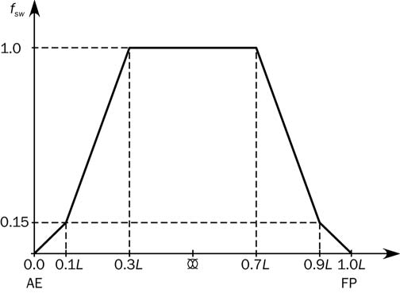
    Figure : Distribution factor #eqnID-1071
  - **2.2.2** **Permissible vertical still water bending moment in seagoing condition**
    The permissible vertical still water bending moments, $M _{sw-h}$ and $M _{sw-s}$ in seagoing condition at any longitudinal position are to envelop:
    • The most severe still water bending moments calculated, in hogging and sagging conditions, respectively, for the seagoing loading conditions defined in **Sec 8**.
    • The most severe still water bending moments for the seagoing loading conditions defined in the loading manual.
  - **2.2.3** **Permissible vertical still water bending moment in harbour / sheltered water**
    The permissible vertical still water bending moments in the harbour / sheltered water $M _{sw-p-h}$ and $M _{sw-p-s}$ at any longitudinal position are to envelop:
    • The most severe still water bending moments, in hogging and sagging conditions, respectively, for the harbour / sheltered water loading conditions defined in **Sec 8**.
    • The most severe still water bending moments for the harbour / sheltered water loading conditions defined in the loading manual.
    • The permissible still water bending moment defined in **[2.2.2]**.
  - **2.2.4** **Permissible vertical still water bending moment in flooded condition at sea**
    The permissible vertical still water bending moments in flooded condition $M _{sw-f}$ at any longitudinal position are to envelop:
    • The most severe still water bending moments, in hogging and sagging conditions, respectively, for the intact and flooded seagoing loading conditions defined in **Sec 8**.
    • The most severe still water bending moments for the intact and flooded seagoing loading conditions defined in the loading manual.
    • The permissible still water bending moment defined in **[2.2.2]**.
  - **2.2.5** **Permissible vertical still water bending moment in tank testing condition**
    The permissible vertical still water bending moments in tank testing condition $M _{sw-t}$ at any longitudinal position are to envelop:
    • The most severe still water bending moments for the tank testing conditions defined in the tank testing procedure.
    • When the still water bending moments are not defined in the tank testing procedure, the permissible still water bending moment may be taken the values as defined in **[2.2.2]**.
- **2.3** **Vertical still water shear force**
  - **2.3.1** **Permissible still water shear force in seagoing condition**
    The permissible vertical still water shear forces, $Q _{sw}$, in seagoing condition at any longitudinal position are to envelop:
    • The most severe still water shear forces, positive or negative, for the seagoing loading conditions defined in **Sec 8**.
    • The most severe still water shear forces for the seagoing loading conditions defined in the loading manual.
  - **2.3.2** **Permissible still water shear force in harbour / sheltered water**
    The permissible vertical still water shear forces, $Q _{sw-p}$, in the harbour / sheltered water at any longitudinal position are to envelop:
    • The most severe still water shear forces, positive or negative, for the harbour / sheltered water loading conditions defined in **Sec 8**.
    • The most severe still water shear forces for the harbour / sheltered water loading conditions defined in the loading manual.
    • The permissible still water shear force defined in **[2.3.1]**.
  - **2.3.3** **Permissible still water shear force in flooded condition at sea**
    The permissible vertical still water shear forces, $Q_sw-f$, in flooded condition at any longitudinal position are to envelop:
    • The most severe still water shear forces, positive or negative, for the flooded seagoing loading conditions defined in **Sec 8**.
    • The most severe still water shear forces for the flooded seagoing loading conditions defined in the loading manual.
    • The permissible still water shear force defined in **[2.3.1]**.
  - **2.3.4** **Permissible still water shear force in tank testing condition**
    The permissible vertical still water shear forces, $Q _{sw-t}$, in tank testing condition at any longitudinal position are to envelop:
    • The most severe still water shear forces for the tank testing conditions defined in the tank testing procedure.
    • When the still water shear forces are not defined in the tank testing procedure, the permissible still water shear force may be taken the values as defined in **[2.3.1]**.
- **2.4** **Torsional still water moment**
  - **2.4.1** The value and distribution of still water moment torsional, $M _{st}$, are to be specified by designer and are not to be less than minimum design value to still water torsional moment. The minimum design value of still water torsional moment, $M _{st}$, in $\mathrm{kNm}$, at any position along the ship is defined as:
    $M _{st} =0.11 B W _{total-cont} \left( 1-L / 500 \right)$
    where:
    $W _{total-cont}$ : maximum total container weight of vessel, in ton
    $W _{total-cont} =n \cdot W _{cont}$
    $n$ : Number of containers corresponding to $W _{cont}$
    $W _{cont}$ : Maximum weight of 20 ft container in the loading manual, in ton

#### 3. Dynamic hull girder loads

- **3.1** **Wave parameter**
  - **3.1.1** The wave parameter is defined as follows:
    $C=1-1.50 \left( 1- \sqrt {\frac{L}{L _{ref}}} \right) ^{2.2}$ for $L \leq L_ref$
    $C=1-0.45 \left( \sqrt {\frac{L}{L _{ref}}} -1 \right) ^{1.7}$ for $L >L _{ref}$
    where:
    $L _{ref}$ : Reference length, in $\mathrm{m}$, to be taken as:
    $L _{ref} =315 C _{"wp"} ^{-1.3}$ for the determination of vertical wave bending moments according to **[3.2].**
    $L _{ref} =330 C _{"wp"} ^{-1.3}$ for the determination of vertical wave shear forces according to **[3.3].**
- **3.2** **Vertical wave bending moment**
  - **3.2.1** The distribution of the vertical wave induced bending moments, $M _{wv}$ in $\mathrm{kNm}$, along the ship length is given in **Figure 2**, where:
    $M _{wv-Hog} =1.5 f _{R} f _{p} L ^{3} C C _{"wp"} \left( \frac{B}{L} \right) ^{0.8} f _{NL-Hog}$
    $M _{wv-Sag} =-1.5 f _{R} f _{p} L ^{3} C C _{"wp"} \left( \frac{B}{L} \right) ^{0.8} f _{NL-Sag}$
    where:
    $f _{p}$ : Coefficient to be taken as:
    $f _{p} =f _{ps}$ for strength assessment.
    $f _{p} =0.9 \left[ 0.27- \left( 16-16f _{T} \right) L \times 10 ^{-5} \right]$ for fatigue assessment.
    $f _{NL-Hog}$ : Non-linear correction for hogging, to be taken as:
    $f _{NL-Hog} =0.3 \frac{C _{B}}{C _{"wp"}} \sqrt {T _{SC}}$, for strength assessment, not to be taken greater than 1.1.
    $f _{NL-Hog} =1.0$, for fatigue assessment
    $f _{NL-Sag}$ : Non-linear correction for sagging, to be taken as:
    $f _{NL-Sag} =4.5 \frac{1+0.2f _{Bow}}{C _{"wp"} \sqrt {C _{B}} L ^{0.3}}$, for strength assessment, not to be taken less than 1.0.
    $f _{NL-Sag} =1.0$, for fatigue assessment
    $f _{Bow}$ : Bow flare shape coefficient, to be taken as:
    $f _{Bow} = \frac{A _{DK} -A _{WL}}{0.2L z _{f}}$
    $A _{DK}$ : Projected area in horizontal plane of uppermost deck, in $\mathrm{m} ^{2}$ including the forecastle deck, if any, extending from 0.8 $L$ forward (see **Figure 3**). Any other structures, e.g. plated bulwark, are to be excluded.
    $A _{WL}$ : Waterplane area, in $\mathrm{m} ^{2}$, at scantling draught $T _{SC}$, extending from 0.8 $L$ forward.
    $z _{f}$ : Vertical distance, in $\mathrm{m}$, from the waterline at scantling draught $T _{SC}$ to the uppermost deck (or forecastle deck), measured at FE (see **Figure 3**). Any other structures, e.g. plated bulwark, are to be excluded.
    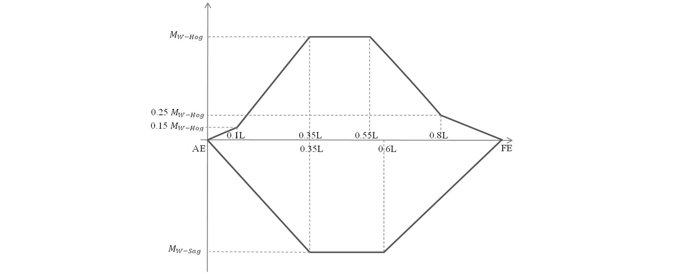
    Figure : Distribution of vertical wave bending moment #eqnID-1124 along the ship length
    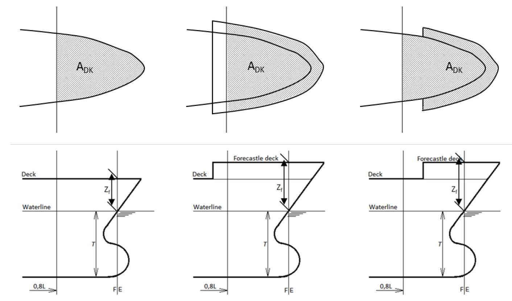
    Figure : Projected area #eqnID-1125 and vertical distance #eqnID-1126
- **3.3** **Vertical wave shear force**
  - **3.3.1** The distribution of the vertical wave induced shear forces, $Q _{wv}$ in $\mathrm{kN}$, along the ship length is given in **Figure 4,** where:
    $Q _{wv} _{Hog}^{Aft} =5.2 f _{R} f _{p} L ^{2} C C _{"wp"} \left( \frac{B}{L} \right) ^{0.8} (0.3+0.7f _{NL-Hog} )$
    $Q _{wv} _{Hog}^{Fore} =-5.7 f _{R} f _{p} L ^{2} C C _{"wp"} \left( \frac{B}{L} \right) ^{0.8} f _{NL-Hog}$
    $Q _{wv} _{Sag}^{Aft} =-5.2 f _{R} f _{p} L ^{2} C C _{"wp"} \left( \frac{B}{L} \right) ^{0.8} (0.3+0.7f _{NL-Sag} )$
    $Q _{wv} _{Sag}^{Fore} =5.7 f _{R} f _{p} L ^{2} C C _{"wp"} \left( \frac{B}{L} \right) ^{0.8} (0.25+0.75f _{NL-Sag} )$
    $Q _{wv} ^{Mid} =4.0 f _{R} f _{p} L ^{2} C C _{"wp"} \left( \frac{B}{L} \right) ^{0.8}$
    Intermediate values are obtained by linear interpolation.
    where:
    $f _{p}$ : Coefficient to be taken as:
    $f _{p} =f _{ps}$ for strength assessment.
    $f _{p} =0.9 \left[ 0.4- \left( 12-12f _{T} \right) L \times 10 ^{-5} \right]$ for fatigue assessment.
    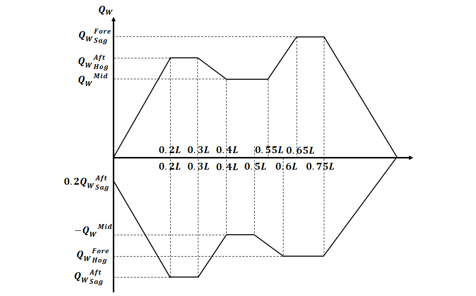
    Figure : Distribution of vertical wave shear force #eqnID-1137 along the ship length
- **3.4** **Horizontal wave bending moment**
  - **3.4.1** The horizontal wave bending moment at any longitudinal position, in $\mathrm{kNm}$, is to be taken as:
    $M _{wh} =0.25 f _{R} f _{p} L ^{2} T _{LC} C _{"w"} \left( \frac{1.2L}{1000} +1 \right) f _{m-H}$
    where:
    $f _{m-H}$ : Distribution factor along the ship length, to be taken as (see **Figure 5**):
    $f _{m-H} =0.0$ for $f _{xL} =0.0$, $f _{xL} =1.0$
    $f _{m-H} =1.0$ for $0.4 \leq f _{xL} \leq 0.65$
    Intermediate values are obtained by linear interpolation.
    $f _{p}$ : Coefficient to be taken as:
    $f _{p} =f _{ps}$ for strength assessment.
    $f _{p} =0.9 \left[ \left( 0.08+0.16f _{T} \right) + \left( 25-20f _{T} \right) L \times 10 ^{-5} \right]$ for fatigue assessment.
    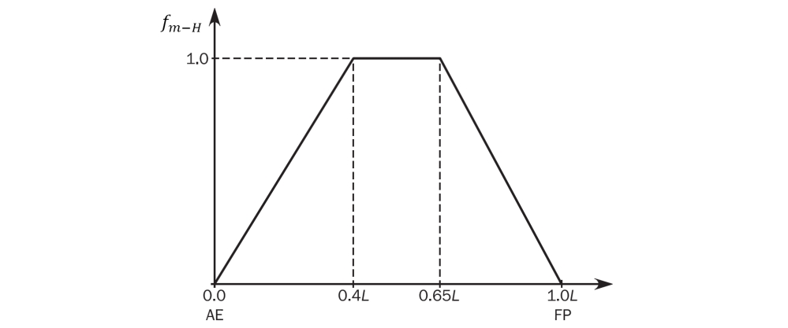
    Figure : Distribution of horizontal wave bending moment #eqnID-1149 along the ship length
- **3.5** **Horizontal wave shear force**
  - **3.5.1** The horizontal wave shear force at any longitudinal position with respect to the ship baseline, in $\mathrm{kNm}$, is to be taken as:
    $Q _{wh} = f _{R} f _{p} L T _{LC} C _{B} C _{"w"} \left( \frac{17L}{10000} +1.27 \right) f _{q-H}$
    where:
    $f _{q-H}$ : Distribution factor along the ship length, to be taken as (see **Figure 6**):
    $f _{q-H} =0.0$ for $f _{xL} =0.0$, $f _{xL} =1.0$
    $f _{q-H} =1.0$ for $0.2 \leq f _{xL} \leq 0.35$
    $f _{q-H} =0.8$ for $0.5 \leq f _{xL} \leq 0.55$
    $f _{q-H} =1.0$ for $0.7 \leq f _{xL} \leq 0.85$
    Intermediate values are obtained by linear interpolation.
    $f _{p}$ : Coefficient to be taken as:
    $f _{p} =f _{ps}$ for strength assessment.
    $f _{p} =0.9 \left[ \left( 0.11+0.13f _{T} \right) + \left( 0.2-f _{T} \right) L \times 10 ^{-5} \right]$ for fatigue assessment.
    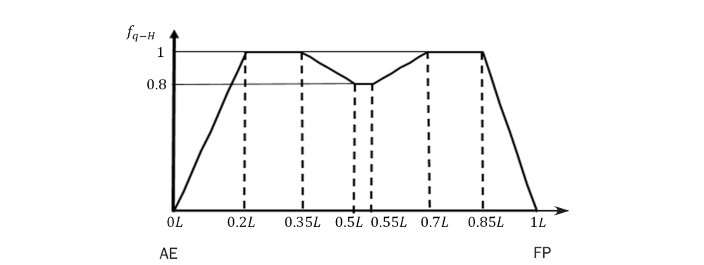
    Figure : Distribution of horizontal shear force #eqnID-1165 along the ship length
- **3.6** **Wave torsional moment**
  - **3.6.1** The wave torsional moment at any longitudinal position with respect to the ship baseline, in $\mathrm{kNm}$, is to be taken as:
    $M _{wt} = f _{R} f _{p} L B C _{"w"} T _{LC} \left( \frac{5B}{1000} +0.44 \right) f _{m-T} f _{sc}$
    where:
    $f _{p}$ : Coefficient to be taken as:
    $f _{p} =f _{ps}$ for strength assessment.
    $f _{p} =0.9 \left[ 0.55+ \left( 50-60f _{T} \right) B \times 10 ^{-4} \right]$ for fatigue assessment.
    $f _{m-T}$ : Distribution factor along the ship length, to be taken as (see **Figure 7**):
    $f _{m-T} =0.0$ for $f _{xL} =0.0$, $f _{xL} =1.0$
    $f _{m-T} =1.0$ for $0.2 \leq f _{xL} \leq 0.35$
    $f _{m-T} =0.6$ for $0.45 \leq f _{xL} \leq 0.55$
    $f _{m-T} =0.03C _{"w"} +0.5$ for $0.65 \leq f _{xL} \leq 0.8$
    Intermediate values are obtained by linear interpolation.
    $f _{sc}$ : Shear center factor along the ship length, to be taken as:
    $f _{sc} =1- \frac{z _{sc}}{D}$
    $z _{sc}$ : $Z$ coordinates of shear center, in $\mathrm{m}$, at the middle of the mid-hold.
    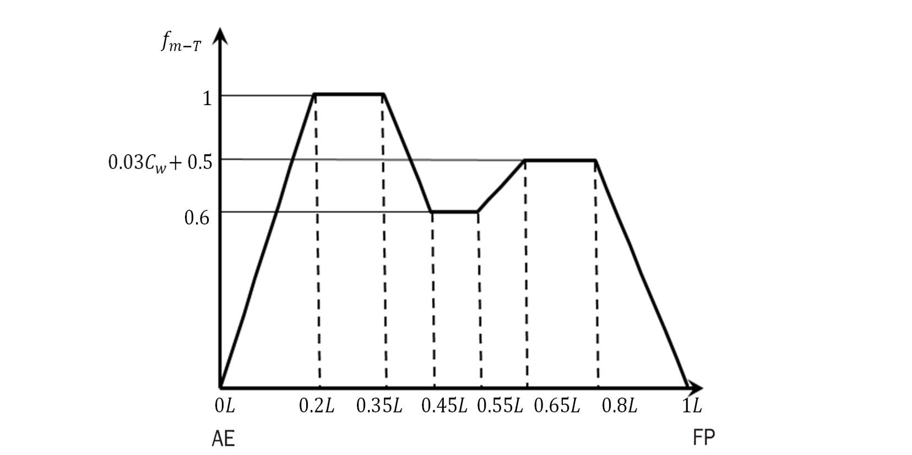
    Figure : Distribution of wave torsional moment #eqnID-1186 along the ship length
- **3.7** **Hull girder loads for dynamic load cases**
  - **3.7.1** **General**
    The dynamic hull girder loads to be applied for the dynamic load cases defined in **Sec 2**, are given in **[3.7.2]** to **[3.7.5]**.
  - **3.7.2** **Vertical wave bending moment**
    The vertical wave bending moment, $M _{wv-LC}$ in $\mathrm{kNm}$, to be used for each dynamic load case in **Sec 2**, is defined in **Table 1**.

    | Load combination factor | $M _{wv-LC}$ |
    | --- | --- |
    | $C _{WV} \geq 0$ | $f _{\beta } C _{WV} M _{wv-Hog}$ |
    | $C _{WV} <0$ | $f _{\beta } C _{WV}  M _{wv-Sag} $ |

    where:
    $C _{WV}$ : Load combination factor for vertical wave bending moment, to be taken as specified in **Sec 2.**
    $M _{wv-Hog}$, $M _{wv-Sag}$ : Hogging and sagging vertical wave bending moment taking account of the considered design load scenario, as defined in **[3.2].**
  - **3.7.3** **Vertical wave shear force**
    The vertical wave shear force, $Q _{wv-LC}$ in $\mathrm{kN}$, to be used for each dynamic load case in **Sec 2,** is defined in **Table 2**.

    | Load combination factor | $Q _{wv-LC}$ |
    | --- | --- |
    | $C _{QW} \geq 0$ | $f _{\beta } C _{QW} Q _{wv} _{Hog}^{Aft}$ $f _{\beta } C _{QW} Q _{wv} _{Sag}^{Fore}$ |
    | $C _{QW} <0$ | $f _{\beta } C _{QW} \left\| Q _{wv} _{Hog}^{Fore} \right\|$ $f _{\beta } C _{QW} \left\| Q _{wv} _{Sag}^{Aft} \right\|$ |

    where:
    $C _{QW}$ : Load combination factor for vertical wave shear force, to be taken as specified in **Sec 2.**
    $Q _{wv-pos}$, $Q _{wv-"neg"}$ : Vertical wave shear force taking account of the considered design load scenario, as defined in **[3.3].**
  - **3.7.4** **Horizontal wave bending moment**
    The horizontal wave bending moment, $M _{wh-LC}$ in $\mathrm{kNm}$, to be used for each dynamic load case defined in **Sec 2**, is to be taken as:
    $M _{wh-LC} =f _{\beta } C _{WH} M _{wh}$
    where:
    $C _{WH}$ : Load combination factor for horizontal wave bending moment, to be taken as specified in **Sec 2.**
    $M _{wh}$ : Horizontal wave bending moment taking account of the appropriate design load scenario, as defined in **[3.4].**
  - **3.7.5** **Horizontal wave shear force**
    The horizontal wave shear force, $Q _{wh}$ in $\mathrm{kN}$, to be used for each dynamic load case in **Sec 2,** is defined in **Table 3**.

    | Load combination factor | $Q _{wh-LC}$ |
    | --- | --- |
    | $C _{QH} \geq 0$ | $f _{\beta } C _{QH} Q _{wh}$ |
    | $C _{QH} <0$ | $f _{\beta } C _{QH} \left\| Q _{wh} \right\|$ |

    where:
    $C _{QH}$ : Load combination factor for horizontal wave shear force, to be taken as specified in **Sec 2.**
    $Q _{wh}$ : Horizontal wave shear force taking account of the considered design load scenario, as defined in **[3.5]**
  - **3.7.6** **Wave torsional moment**
    The wave torsional moment, $M _{wt-LC}$ in $\mathrm{kNm}$, to be used for each dynamic load case defined in **Sec 2,** is to be taken as:
    $M _{wt-LC} =f _{\beta } C _{WT} M _{wt}$
    where:
    $C _{WT}$ : Load combination factor for wave torsional moment, to be taken as specified in **Sec 2.**
    $M _{wt}$ : Wave torsional moment taking account of the appropriate design load scenario, as defined in **[3.6].**

### Section 5 External Loads

**Symbols**
For symbols not defined in this section, refer to **Ch 1, Sec 4.**
$\lambda$ : Wave length, in $\mathrm{m}$.
$B _{x}$ : Moulded breadth at the waterline, in $\mathrm{m}$, at the considered cross section.
$x$, $y$, $z$ : $X$, $Y$ and $Z$ coordinates, in $\mathrm{m}$, of the load point with respect to the reference coordinate system defined in **Sec 1, [1.2.1].**
$f _{xL}$ : Ratio as defined in **Sec 2.**
$f _{yB}$ : Ratio between $Y$-coordinate of the load point and $B _{x}$, to be taken as:
$f _{yB} = \frac{\left| 2y \right|}{B _{x}}$, but not greater than 1.0.
$f _{yB} =0$ when $B _{x} =0$.
$f _{yB1}$ : Ratio between $Y$-coordinate of the load point and $B$, to be taken as:
$f _{yB1} = \frac{\left| 2y \right|}{B}$, but not greater than 1.0.
$f _{T}$ : Ratio as defined in **Sec 3.**
$f _{zT}$ : Ratio between $Z$-coordinate of the load point and $f _{T}$, to be taken as:
$f _{zT} = \frac{z}{T _{LC}}$, but not greater than 1.0.
$h _{W}$ : Water head equivalent to the pressure at waterline, in $\mathrm{m}$, to be taken as:
$h _{w} = \frac{P _{W,WL}}{rhog}$
$P _{W,WL}$ : Wave pressure at the waterline, $\mathrm{kN}/m ^{2}$, for the considered dynamic load case.
$P _{W,WL} =P _{W}$ for $y=B _{x} /2$ and $z=T _{LC}$
$f _{ps}$ : Coefficient for strength assessment, as defined in **Sec 3.**
$f _{R}$ : Coefficient, as defined in **Sec 3**.
$T _{\theta}$ : Roll period, in s, as defined in **Sec 3, [2.1.1].**
$\theta$ : Roll angle, in deg, as defined in **Sec 3, [2.1.1]**.
$f _{\beta}$ : Coefficient defined in **Sec 4**.
$C _{w}$ : Coefficient defined in **Sec 4**.
$z _{SD}$ : $Z$ coordinate, in $\mathrm{m}$, of the midpoint of stiffener span, or of the middle of the plate field.

#### 1. Sea pressure

- **1.1** **Total pressure**
  - **1.1.1** The external pressure $P _{ex}$ at any load point of the hull, in $\mathrm{kN}/m ^{2}$, for the static (S) design load scenarios, is to be taken as:
    $P _{ex} =P _{s}$, but not less than 0.0
    The total pressure $P _{ex}$ at any load point of the hull for the static plus dynamic (S + D) design load scenarios, is to be derived from each dynamic load case and is to be taken as:
    $P _{ex} =P _{S} +P _{W}$, but not less than 0.0
    where:
    $P _{S}$ : Hydrostatic pressure, in $\mathrm{kN}/m ^{2}$, is defined in **[1.2].**
    $P _{W}$ : Wave pressure, in $\mathrm{kN}/m ^{2}$, is defined in **[1.3].**
- **1.2** **Hydrostatic pressure**
  - **1.2.1** The hydrostatic pressure, $P _{S}$ at any load point, in $\mathrm{kN}/m ^{2}$, is obtained from **Table 1.** See also **Figure 1**.

    | Location | Hydrostatic pressure, $P _{S}$, in $\mathrm{kN}/m ^{2}$ |
    | --- | --- |
    | $z \leq T _{LC}$ | $\rho g (T _{LC} -z)$ |
    | $z>T _{LC}$ | $0.0$ |

    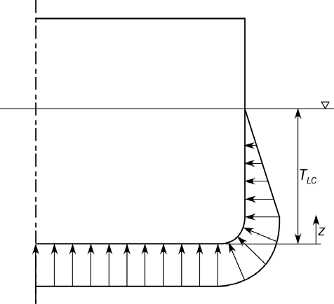
    Figure : Hydrostatic pressure, #eqnID-1290
- **1.3** **External dynamic pressures for strength assessment**
  - **1.3.1** **General**
    The hydrodynamic pressures for each dynamic load case defined in **Sec 2, [2]** are defined in **[1.3.2]** to **[1.3.8].**
  - **1.3.2** **Hydrodynamic pressures for HSM load cases**
    The hydrodynamic pressures, $P _{W}$, for HSM-1 and HSM-2 load cases, at any load point, in $\mathrm{kN}/m ^{2}$, are to be obtained from **Table 2.**

    |   | Wave pressure, in $\mathrm{kN}/m ^{2}$ |   |   |
    | --- | --- | --- | --- |
    | Load case | $Z \leq T _{LC}$ | $T _{LC} < Z \leq h _{w} +T _{LC}$ | $Z >h _{W} +T _{LC}$ |
    | HSM-1 | $P _{W} = \max (-P _{HSM} , \rho g(z-T _{LC} ))$ | $P _{W} = P _{W,WL} - \rho g (z-T _{LC} )$ | $P _{W } = 0.0$ |
    | HSM-2 | $P _{W} = \max (P _{HSM} , \rho g(z-T _{LC} ))$ | $P _{W} = P _{W,WL} - \rho g (z-T _{LC} )$ | $P _{W } = 0.0$ |

    where:
    $P _{HSM} =f _{R} f _{ps} f _{nl} f _{\beta } f _{yz} P _{a} f _{a} f _{p-HSM}$
    $f _{nl}$ : Coefficient considering non-linear effects, to be taken as:
    $f _{nl} =0.7$ at $f _{xL} =0.0$
    $f _{nl} =0.9$ at $0.3 \leq f _{xL} <0.7$
    $f _{nl} =0.6$ at $f _{xL} =1.0$
    $f _{nl} =0.85$ at $f _{xL} =0.0$
    $f _{nl} =0.95$ at $0.3 \leq f _{xL} <0.7$
    $f _{nl} =0.80$ at $f _{xL} =1.0$
    Intermediate values are obtained by linear interpolation.
    $f _{yz}$ : Girth distribution coefficient, to be taken as:
    $f _{yz} = \frac{1}{3} \left( 0.5 f _{yB} f _{BG} +1.4 f _{zT} f _{WL} +1.1 f _{CL} \right)$
    $f _{WL}$ : Pressure amplitude coefficient at water line, but not less than $1.0$
    $f _{WL} =2.59-0.15P _{a}$
    $f _{WL} =2.0-0.085P _{a}$
    $f _{BG}$ : Pressure amplitude coefficient at bilge, but not less than $1.0$
    $f _{BG} =2.5-0.15P _{a}$
    $f _{BG} =2.22-0.13P _{a}$
    $f _{CL}$ : Pressure amplitude coefficient at bottom centerline, but not less than $1.0$
    $f _{CL} =2.21-0.13P _{a}$
    $f _{CL} =1.75-0.08P _{a}$
    $P _{a}$ : Pressure amplitude coefficient in mid-ship position, to be taken as:
    $P _{a} = \frac{B}{10} + \frac{L}{80}$
    $P _{a} = \frac{L}{B} + \frac{200}{L}$
    $f _{a}$ : Wave amplitude coefficient to be taken as:
    $f _{a} =0.85C _{w} \sqrt {\frac{\lambda +25}{L}}$
    $\lambda$ : Wave length of the dynamic load case, in $\mathrm{m}$, to be taken as:
    $\lambda =0.5(1+f _{T} )L$
    $f _{p-HSM}$ : Pressure distribution coefficient in the longitudinal direction of the ship, to be taken as:
    $\left. f _{p-HSM} =k _{a} k _{p} \right.$
    $k _{a}$ : Amplitude coefficient in the longitudinal direction of the ship, to be taken as:
    $k _{a} =k _{a-WL} f _{zT} +k _{a-CL} \left( 1-f _{zT} \right)$
    Intermediate values are obtained by linear interpolation.

    | $f _{xL}$ | $0.0$ | $- \frac{1}{9} f _{T} + \frac{47}{180}$ | $- \frac{1}{9} f _{T} + \frac{37}{90}$ | $- \frac{1}{9} f _{T} + \frac{32}{45}$ | $- \frac{1}{45} f _{T} + \frac{158}{225}$ | $1.0$ |
    | --- | --- | --- | --- | --- | --- | --- |
    | $k _{a-WL}$ | $- \frac{20}{9} f _{T} + \frac{29}{9}$ | $0.3$ | $1.0$ | $1.0$ | $0.3$ | $\frac{20}{9} f _{T} + \frac{16}{9}$ |

    | $f _{xL}$ | $0.0$ | $- \frac{1}{9} f _{T} + \frac{14}{45}$ |   | $- \frac{1}{9} f _{T} + \frac{37}{90}$ |   | $- \frac{1}{9} f _{T} + \frac{32}{45}$ |   | $- \frac{4}{45} f _{T} + \frac{173}{225}$ |   | $1.0$ |
    | --- | --- | --- | --- | --- | --- | --- | --- | --- | --- | --- |
    | $k _{a-CL}$ | $- \frac{34}{9} f _{T} + \frac{547}{90}$ | $0.3$ |   | $1.0$ |   | $1.0$ |   | $0.5$ |   | $\frac{40}{9} f _{T} + \frac{347}{90}$ |

    $k _{p}$ : Phase coefficient in the longitudinal direction of the ship, to be taken as:
    $k _{p} =k _{p-WL} f _{zT} +k _{p-CL} \left( 1-f _{zT} \right)$
    Intermediate values are obtained by linear interpolation.

    | $f _{xL}$ | $0.0$ | $0.15$ | 0.22 | $0.25$ | $0.35$ | $0.65$ | $0.7$ | $0.75$ | $1.0$ |
    | --- | --- | --- | --- | --- | --- | --- | --- | --- | --- |
    | $k _{p-WL}$ | $- \frac{16}{9} f T\# + \frac{62}{45}$ | $-f _{T}$ | $\frac{41}{15} f T\# - \frac{751}{300}$ | $3f T\# - \frac{49}{20}$ | $0.0$ | $1.0$ | $- \frac{26}{9} f T\# + \frac{17}{9}$ | $-1.0$ | $-0.8$ |

    | $f _{xL}$ | $0.0$ | $- \frac{8}{45} f _{T} + \frac{313}{900}$ | $- \frac{1}{9} f _{T} + \frac{37}{90}$ | $- \frac{1}{9} f _{T} + \frac{32}{45}$ | $- \frac{1}{9} f _{T} + \frac{73}{90}$ | $1.0$ |
    | --- | --- | --- | --- | --- | --- | --- |
    | $k _{p-CL}$ | $- \frac{10}{9} f _{T} + \frac{10}{9}$ | $-1.0$ | $1.0$ | $1.0$ | $-1.0$ | $-0.75$ |
    - **a)** For extreme sea loads design load scenario:
    - **b)** For ballast water exchange design load scenario:
    - **a)** For full load condition and $B>35\mathrm{m}$:
    - **b)** For ballast load condition or $B \leq 35 \mathrm{m}$:
    - **a)** For full load condition and $B>35\mathrm{m}$:
    - **b)** For ballast load condition or $B \leq 35 \mathrm{m}$:
    - **a)** For full load condition and $B>35\mathrm{m}$:
    - **b)** For ballast load condition or $B \leq 35 \mathrm{m}$:
    - **a)** For full load condition and $B>35\mathrm{m}$:
    - **b)** For ballast load condition or $B \leq 35 \mathrm{m}$:
  - **1.3.3** **Hydrodynamic pressure for HSA load cases**
    The hydrodynamic pressures, $P _{W}$, for HSA-1 and HSA-2 load cases at any load point, in $\mathrm{kN}/m ^{2}$, are to be obtained from **Table 7.**

    |   | Wave pressure, in $\mathrm{kN}/m ^{2}$ |   |   |
    | --- | --- | --- | --- |
    | Load case | $z \leq T _{LC}$ | $T _{LC} \(z >h _{W} +T _{LC}$ |   |
    | HSA-1 | $P _{W} =\max (P _{HSA} , \rho g (z-T _{LC} ))$ | $P _{W} =P _{W,WL} - \rho g(z-T _{LC} )$ | $P _{W} = 0.0$ |
    | HSA-2 | $P _{W} =\max (-P _{HSA} , \rho g (z-T _{LC} ))$ | $P _{W} =P _{W,WL} - \rho g(z-T _{LC} )$ | $P _{W} = 0.0$ |

    where:
    $P _{HSA} =f _{R} f _{ps} f _{nl} f _{\beta } f _{yz} P _{a} f _{a} f _{p-HSA}$
    $f _{nl}$ : Coefficient considering non-linear effects, to be taken as:
    $f _{nl} =0.7$ at $f _{xL} =0.0$
    $f _{nl} =0.9$ at $0.3 \leq f _{xL} <0.7$
    $f _{nl} =0.6$ at $f _{xL} =1.0$
    $f _{nl} =0.85$ at $f _{xL} =0.0$
    $f _{nl} =0.95$ at $0.3 \leq f _{xL} <0.7$
    $f _{nl} =0.80$ at $f _{xL} =1.0$
    Intermediate values are obtained by linear interpolation.
    $f _{yz}$ : Girth distribution coefficient, to be taken as:
    $f _{yz} = \frac{1}{3} \left( 0.5 f _{yB} +1.4 f _{zT} +1.1 \right)$
    $P _{a}$ : Pressure amplitude coefficient in mid-ship position, to be taken as:
    $P _{a} = \frac{B}{10} + \frac{L}{80}$
    $P _{a} = \frac{L}{B} + \frac{200}{L}$
    $f _{a}$ : Wave amplitude coefficient to be taken as:
    $f _{a} =0.8C _{w} \sqrt {\frac{L+ \lambda -125}{L}}$
    $\lambda$ : Wave length of the dynamic load case, in $\mathrm{m}$, to be taken as:
    $\lambda =0.5(1+f _{T} )L$
    $f _{p-HSA}$ : Pressure distribution coefficient in the longitudinal direction of the ship, to be taken as:
    $\left. f _{p-HSA} =k _{a} k _{p} \right.$
    $k _{a}$ : Amplitude coefficient in the longitudinal direction of the ship, to be taken as:
    $k _{a} =k _{a-WL} f _{zT} +k _{a-CL} \left( 1-f _{zT} \right)$
    Intermediate values are obtained by linear interpolation.

    | $f _{xL}$ | $0.0$ | $- \frac{2}{9} f _{T} + \frac{67}{180}$ | $- \frac{2}{9} f _{T} + \frac{47}{90}$ | 0.6 | $- \frac{1}{9} f _{T} + \frac{73}{90}$ | $1.0$ |
    | --- | --- | --- | --- | --- | --- | --- |
    | $k _{a-WL}$ | $- \frac{8}{3} f _{T} + \frac{11}{3}$ | $0.3$ | $1.0$ | $1.0$ | $0.25$ | $\frac{10}{9} f _{T} + \frac{26}{9}$ |

    | $f _{xL}$ | $0.0$ | $- \frac{1}{9} f _{T} + \frac{14}{45}$ | $- \frac{2}{9} f _{T} + \frac{47}{90}$ | $0.6$ | $- \frac{1}{9} f _{T} + \frac{73}{90}$ | $1.0$ |
    | --- | --- | --- | --- | --- | --- | --- |
    | $k _{a-CL}$ | $-4f _{T} + \frac{31}{5}$ | $0.3$ | $1.0$ | $1.0$ | $0.45$ | $\frac{10}{9} f _{T} + \frac{62}{9}$ |

    $k _{p}$ : Phase coefficient in the longitudinal direction of the ship, to be taken as:
    $k _{p} =k _{p-WL} f _{zT} +k _{p-CL} \left( 1-f _{zT} \right)$
    Intermediate values are obtained by linear interpolation.

    | $f _{xL}$ | $0.0$ | $- \frac{2}{9} f _{T} + \frac{353}{900}$ | $- \frac{2}{9} f _{T} + \frac{47}{90}$ | $- \frac{4}{45} f _{T} + \frac{133}{180}$ | $- \frac{2}{9} f _{T} + \frac{83}{90}$ | $1.0$ |
    | --- | --- | --- | --- | --- | --- | --- |
    | $k _{p-WL}$ | $\frac{10}{9} f _{T} - \frac{68}{45}$ | $1.0$ | $-0.7$ | $-0.7$ | $0.9$ | $1.0$ |

    | $f _{xL}$ | $0.0$ | $0.15$ |   | $- \frac{2}{9} f _{T} + \frac{19}{45}$ | $- \frac{2}{9} f _{T} + \frac{47}{90}$ |   | $- \frac{4}{45} f _{T} + \frac{133}{180}$ | $- \frac{2}{9} f _{T} + \frac{83}{90}$ |   |   | $1.0$ |   |   |
    | --- | --- | --- | --- | --- | --- | --- | --- | --- | --- | --- | --- | --- | --- |
    | $k _{p-CL}$ | $\frac{4}{9} f _{T} - \frac{103}{90}$ | $\frac{8}{9} f _{T} - \frac{8}{9}$ |   | $1.0$ | $-0.7$ |   | $-0.7$ | $0.9$ |   |   | $1.0$ |   |   |
    - **a)** For extreme sea loads design load scenario:
    - **b)** For ballast water exchange design load scenario
    - **a)** For full load condition and $B>35\mathrm{m}$:
    - **b)** For ballast load condition or $B \leq 35 \mathrm{m}$:
  - **1.3.4** **Hydrodynamic pressure for FSM load cases**
    The hydrodynamic pressures, $P _{W}$, for FSM-1 and FSM-2 load cases, at any load point, in $\mathrm{kN}/m ^{2}$, are to be obtained from **Table 12.**

    |   | Wave pressure, in $\mathrm{kN}/m ^{2}$ |   |   |
    | --- | --- | --- | --- |
    | Load case | $z \leq T _{LC}$ | $T _{LC} \(z >h _{W} +T _{LC}$ |   |
    | FSM-1 | $P _{W} =\max (-P _{FSM} , \rho g (z-T _{LC} ))$ | $P _{W} =P _{W,WL} - \rho g(z-T _{LC} )$ | $P _{W} = 0.0$ |
    | FSM-2 | $P _{W} =\max (P _{FSM} , \rho g (z-T _{LC} ))$ | $P _{W} =P _{W,WL} - \rho g(z-T _{LC} )$ | $P _{W} = 0.0$ |

    where:
    $P _{FSM} =f _{R} f _{ps} f _{nl} f _{\beta } f _{yz} P _{a} f _{a} f _{p-FSM}$
    $f _{nl}$ : Coefficient considering non-linear effects, to be taken as:
    $f _{nl} =0.9$
    $f _{nl} =0.95$
    $f _{yz}$ : Girth distribution coefficient, to be taken as:
    $f _{yz} = \frac{1}{3} \left( 0.5 f _{yB} +1.2 f _{zT} +1.3 \right)$
    $P _{a}$ : Pressure amplitude coefficient in mid-ship position, to be taken as:
    $P _{a} =0.5 \frac{L}{B} + \frac{50}{L} +2.3$
    $f _{a}$ : Wave amplitude coefficient to be taken as:
    $f _{a} =0.85C _{w} \sqrt {\frac{\lambda +25}{L}}$
    $\lambda$ : Wave length of the dynamic load case, in $\mathrm{m}$, to be taken as:
    $\lambda =0.5(1+1.5f _{T} )L$
    $f _{p-FSM}$ : Pressure distribution coefficient in the longitudinal direction of the ship, to be taken as:
    $\left. f _{p-FSM} =k _{a} k _{p} \right.$
    $k _{a}$ : Amplitude coefficient in the longitudinal direction of the ship, to be taken as:
    $k _{a} =k _{a-WL} f _{zT} +k _{a-CL} \left( 1-f _{zT} \right)$
    Intermediate values are obtained by linear interpolation.

    | $f _{xL}$ | $0.0$ | $- \frac{2}{9} f _{T} + \frac{67}{180}$ | $- \frac{2}{9} f _{T} + \frac{17}{36}$ | $- \frac{1}{9} f _{T} + \frac{32}{45}$ | $- \frac{1}{9} f _{T} + \frac{73}{90}$ | $1.0$ |
    | --- | --- | --- | --- | --- | --- | --- |
    | $k _{a-WL}$ | $- \frac{20}{9} f _{T} + \frac{67}{18}$ | $0.4$ | $1.0$ | $1.0$ | $0.5$ | $\frac{4}{9} f _{T} + \frac{106}{45}$ |

    | $f _{xL}$ | $0.0$ | $- \frac{7}{45} f _{T} + \frac{16}{45}$ | $- \frac{2}{9} f _{T} + \frac{17}{36}$ | $- \frac{1}{9} f _{T} + \frac{32}{45}$ | $- \frac{4}{45} f _{T} + \frac{683}{900}$ | $1.0$ |
    | --- | --- | --- | --- | --- | --- | --- |
    | $k _{a-CL}$ | $- \frac{40}{9} f _{T} + \frac{125}{18}$ | $0.2$ | $1.0$ | $1.0$ | $0.4$ | $5.0$ |

    $k _{p}$ : Phase coefficient in the longitudinal direction of the ship, to be taken as:
    $k _{p} =k _{p-WL} f _{zT} +k _{p-CL} \left( 1-f _{zT} \right)$
    Intermediate values are obtained by linear interpolation.

    | $f _{xL}$ | $0.0$ | $- \frac{8}{45} f _{T} + \frac{67}{225}$ | $- \frac{2}{9} f _{T} + \frac{17}{36}$ | $- \frac{1}{9} f _{T} + \frac{32}{45}$ | $- \frac{1}{9} f _{T} + \frac{31}{36}$ | $1.0$ |
    | --- | --- | --- | --- | --- | --- | --- |
    | $k _{p-WL}$ | $- \frac{5}{9} f _{T} - \frac{7}{36}$ | $-1.0$ | $1.0$ | $1.0$ | $-1.0$ | $-0.7$ |

    | $f _{xL}$ | $0.0$ | $- \frac{8}{45} f _{T} + \frac{161}{450}$ | $- \frac{2}{9} f _{T} + \frac{19}{45}$ | $0.65$ | $- \frac{1}{9} f _{T} + \frac{73}{90}$ | $1.0$ |
    | --- | --- | --- | --- | --- | --- | --- |
    | $k _{p-CL}$ | $-0.6$ | $-1.0$ | $1.0$ | $1.0$ | $-1.0$ | $-0.7$ |
    - **a)** For extreme sea loads design load scenario:
    - **b)** For ballast water exchange design load scenario:
  - **1.3.5** **Hydrodynamic pressure for BSR load cases**
    The wave pressures, $P _{W}$, for BSR-1 and BSR-2 load cases, at any load point, in $\mathrm{kN}/m ^{2}$, are to be obtained from **Table 17.**

    |   | Wave pressure, in $\mathrm{kN}/m ^{2}$ |   |   |
    | --- | --- | --- | --- |
    | Load case | $z \leq T _{LC}$ | $T _{LC} \(z >h _{W} +T _{LC}$ |   |
    | BSR-1P | $P _{W} =\max (P _{BSR} , \rho g (z-T _{LC} ))$ | $P _{W} =P _{W,WL} - \rho g(z-T _{LC} )$ | $P _{W} = 0.0$ |
    | BSR-2P | $P _{W} =\max (-P _{BSR} , \rho g (z-T _{LC} ))$ | $P _{W} =P _{W,WL} - \rho g(z-T _{LC} )$ | $P _{W} = 0.0$ |
    | BSR-1S | $P _{W} =\max (P _{BSR} , \rho g (z-T _{LC} ))$ | $P _{W} =P _{W,WL} - \rho g(z-T _{LC} )$ | $P _{W} = 0.0$ |
    | BSR-2S | $P _{W} =\max (-P _{BSR} , \rho g (z-T _{LC} ))$ | $P _{W} =P _{W,WL} - \rho g(z-T _{LC} )$ | $P _{W} = 0.0$ |

    where:
    For BSR-1P and BSR-2P load cases, to be taken as:
    $P _{BSR} =f _{\beta } f _{nl} \left( 10 y \sin \theta +0.48f _{ps} C _{W} \sqrt {\frac{L _{0} + \lambda -125}{L}} \left( f _{yB1} +1 \right) \right)$
    For BSR-1S and BSR-2S load cases, to be taken as:
    $P _{BSR} =f _{\beta } f _{nl} \left( -10 y \sin \theta +0.48f _{ps} C _{W} \sqrt {\frac{L _{0} + \lambda -125}{L}} \left( f _{yB1} +1 \right) \right)$
    $f _{nl}$ : Coefficient considering non-linear effects, to be taken as:
    $f _{nl} =1.0$
    $\lambda$ : Wave length of the dynamic load case, in $\mathrm{m}$, to be taken as:
    $\lambda = \frac{gT _{\theta } ^{2}}{2 \pi}$
  - **1.3.6** **Hydrodynamic pressure for BSP load cases**
    The wave pressure, $P_W$, for BSP-1 and BSP-2 load cases, at any load point, in $\mathrm{kN}/m^2$, are to be obtained from **Table 18.**

    |   | Wave pressure, in $\mathrm{kN}/m ^{2}$ |   |   |
    | --- | --- | --- | --- |
    | Load case | $z \leq T _{LC}$ | $T _{LC} \(z >h _{W} +T _{LC}$ |   |
    | BSP-1P | $P _{W} =\max (P _{BSP} , \rho g (z-T _{LC} ))$ | $P _{W} =P _{W,WL} - \rho g(z-T _{LC} )$ | $P _{W} = 0.0$ |
    | BSP-2P | $P _{W} =\max (-P _{BSP} , \rho g (z-T _{LC} ))$ | $P _{W} =P _{W,WL} - \rho g(z-T _{LC} )$ | $P _{W} = 0.0$ |
    | BSP-1S | $P _{W} =\max (P _{BSP} , \rho g (z-T _{LC} ))$ | $P _{W} =P _{W,WL} - \rho g(z-T _{LC} )$ | $P _{W} = 0.0$ |
    | BSP-2S | $P _{W} =\max (-P _{BSP} , \rho g (z-T _{LC} ))$ | $P _{W} =P _{W,WL} - \rho g(z-T _{LC} )$ | $P _{W} = 0.0$ |

    | Transverse position | BSP-1P, BSP-2P | BSP-1S, BSP-2S |
    | --- | --- | --- |
    | $y \geq 0$ | (S) | (P) |
    | $y<0$ | (P) | (S) |

    where:
    $P _{BSP} =f _{R} f _{ps} f _{nl} f _{\beta } f _{yz} P _{a} f _{a} f _{p-BSP}$
    $f _{nl}$ : Coefficient considering non-linear effects, to be taken as:
    $f _{nl} =0.6$ at $f _{xL} =0.0$
    $f _{nl} =0.8$ at $0.3 \leq f _{xL} <0.7$
    $f _{nl} =0.6$ at $f _{xL} =1.0$
    $f _{nl} =0.6$ at $f _{xL} =0.0$
    $f _{nl} =0.8$ at $0.3 \leq f _{xL} <0.7$
    $f _{nl} =0.6$ at $f _{xL} =1.0$
    Intermediate values are obtained by linear interpolation.
    $f _{yz}$ : Girth distribution coefficient, to be taken as:
    $f _{yz} (P)=0.25 f _{zT} +0.6 f _{yB1} +0.15$
    $f _{yz} (S)=0.5 f _{zT} +0.35 f _{yB1} +0.15$
    $P _{a}$ : Pressure amplitude coefficient in mid-ship position, to be taken as:
    $P _{a} (P)=11$
    $P _{a} (S)=25$
    $f _{a}$ : Wave amplitude coefficient to be taken as:
    $\left. f _{a} = \left( 0.8C _{w} \sqrt {\frac{L+ \lambda -125}{L}} \right) \left( \frac{L}{600(2-f _{T} )} \right) +5C _{b} \right.$
    $\lambda$ : Wave length of the dynamic load case, in $\mathrm{m}$, to be taken as:
    $\lambda =90+0.3B$
    $f _{p-BSP}$ : Pressure distribution coefficient in the longitudinal direction of the ship, to be taken as:
    $\left. f _{p-BSP} =1 \right. .0$
    - **a)** For extreme sea loads design load scenario:
    - **b)** For ballast water exchange design load scenario:
  - **1.3.7** **Hydrodynamic pressure for OST load cases**
    The wave pressures, $P _{W}$, for OST-1 and OST-2 load cases, at any load point are to be obtained, in $\mathrm{kN}/m ^{2}$, from **Table 20.**

    |   | Wave pressure, in $\mathrm{kN}/m ^{2}$ |   |   |
    | --- | --- | --- | --- |
    | Load case | $z \leq T _{LC}$ | $T _{LC} \(z >h _{W} +T _{LC}$ |   |
    | OST-1P | $P _{W} =\max (P _{OST} , \rho g (z-T _{LC} ))$ | $P _{W} =P _{W,WL} - \rho g(z-T _{LC} )$ | $P _{W} = 0.0$ |
    | OST-2P | $P _{W} =\max (-P _{OST} , \rho g (z-T _{LC} ))$ | $P _{W} =P _{W,WL} - \rho g(z-T _{LC} )$ | $P _{W} = 0.0$ |
    | OST-1S | $P _{W} =\max (P _{OST} , \rho g (z-T _{LC} ))$ | $P _{W} =P _{W,WL} - \rho g(z-T _{LC} )$ | $P _{W} = 0.0$ |
    | OST-2S | $P _{W} =\max (-P _{OST} , \rho g (z-T _{LC} ))$ | $P _{W} =P _{W,WL} - \rho g(z-T _{LC} )$ | $P _{W} = 0.0$ |

    | Transverse position | OST-1P, OST-2P | OST-1S, OST-2S |
    | --- | --- | --- |
    | $y \geq 0$ | (S) | (P) |
    | $y<0$ | (P) | (S) |

    where:
    $P _{OST} =f _{R} f _{ps} f _{nl} f _{\beta } f _{yz} P _{a} f _{a} f _{p-OST}$
    $f _{nl}$ : Coefficient considering non-linear effects, to be taken as:
    $f _{nl} =0.8$
    $f _{yz}$ : Girth distribution coefficient, to be taken as:
    $\left. f _{yz} (P)=0.06 f _{zT} +0.09 f _{yB} +0.15 \right.$
    $\left. f _{yz} (S)=0.72 f _{zT} +0.28 f _{yB} +0.15 \right.$
    $P _{a}$ : Pressure amplitude coefficient in mid-ship position, to be taken as:
    $P _{a} = 20.0$
    $f _{a}$ : Wave amplitude coefficient to be taken as:
    $f _{a} =0.6C _{w} \sqrt {\frac{L+ \lambda -125}{L}}$
    $\lambda$ : Wave length of the dynamic load case, in $\mathrm{m}$, to be taken as:
    $\lambda =0.45L$
    $f _{p-OST}$ : Pressure distribution coefficient in the longitudinal direction of the ship, to be taken as:
    $\left. f _{p-OST} =k _{a} k _{p} \right.$
    $k _{a}$ : Amplitude coefficient in the longitudinal direction of the ship, to be taken as:
    $k _{a} =k _{a-WL} f _{zT} +k _{a-CL} \left( 1-f _{zT} \right)$
    Intermediate values are obtained by linear interpolation.

    | Transverse position | OST-1P, OST-2P |   | OST-1S, OST-2S |   |
    | --- | --- | --- | --- | --- |
    | Transverse position | $f _{xL}$ | $k _{a-WL}$ | $f _{xL}$ | $k _{a-WL}$ |
    | $y \geq 0$ | $0.0$ | $1.0$ | $0.0$ | $3-2f _{T}$ |
    | $y \geq 0$ | $0.2$ | $0.6f _{T} +0.4$ | $0.15$ | $f _{T}$ |
    | $y \geq 0$ | $0.4$ | $0.4f _{T} +0.6$ | $0.3$ | $2-f _{T}$ |
    | $y \geq 0$ | $0.5$ | $1.0$ | $0.5$ | $1.0$ |
    | $y \geq 0$ | $0.6$ | $1.0$ | $0.65$ | $1.4f _{T} -0.4$ |
    | $y \geq 0$ | $0.8$ | $f _{T}$ | $0.8$ | $f _{T}$ |
    | $y \geq 0$ | $1.0$ | $1.4-0.4f _{T}$ | $1.0$ | $3.0$ |
    | $y<0$ | $0.0$ | $3-2f _{T}$ | $0.0$ | $1.0$ |
    | $y<0$ | $0.15$ | $f _{T}$ | $0.2$ | $0.6f _{T} +0.4$ |
    | $y<0$ | $0.3$ | $2-f _{T}$ | $0.4$ | $0.4f _{T} +0.6$ |
    | $y<0$ | $0.5$ | $1.0$ | $0.5$ | $1.0$ |
    | $y<0$ | $0.65$ | $1.4f _{T} -0.4$ | $0.6$ | $1.0$ |
    | $y<0$ | $0.8$ | $f _{T}$ | $0.8$ | $f _{T}$ |
    | $y<0$ | $1.0$ | $3.0$ | $1.0$ | $1.4-0.4f _{T}$ |

    | $f _{xL}$ | $0.0$ | $0.2$ | $0.8$ | $1.0$ |
    | --- | --- | --- | --- | --- |
    | $k _{a-CL}$ | $7-5f _{T}$ | $1.0$ | $1.0$ | $6-2f _{T}$ |

    $k _{p}$ : Phase coefficient in the longitudinal direction of the ship, to be taken as:
    $k _{p} =k _{p-WL} f _{zT} +k _{p-CL} \left( 1-f _{zT} \right)$
    Intermediate values are obtained by linear interpolation.

    | Transverse position | OST-1P, OST-2P |   | OST-1S, OST-2S |   |
    | --- | --- | --- | --- | --- |
    | Transverse position | $f _{xL}$ | $k _{p-WL}$ | $f _{xL}$ | $k _{p-WL}$ |
    | $y \geq 0$ | $0.0$ | $1.0$ | $0.0$ | $1.5-f _{T}$ |
    | $y \geq 0$ | $0.1$ | $1.0$ | $0.1$ | $2.5-3f _{T}$ |
    | $y \geq 0$ | $0.15$ | $1.0$ | $0.15$ | $2.4-2.8f _{T}$ |
    | $y \geq 0$ | $0.2$ | $1.0$ | $0.2$ | $1.1-1.4f _{T}$ |
    | $y \geq 0$ | $0.4$ | $-1.0$ | $0.4$ | $2.06-2.36f _{T}$ |
    | $y \geq 0$ | $0.1f _{T} +0.55$ | $-1.0$ | $0.45$ | $2.53-3.06f _{T}$ |
    | $y \geq 0$ | $0.1f _{T} +0.55$ | $-1.0$ | $0.55$ | $3-4f _{T}$ |
    | $y \geq 0$ | $0.1f _{T} +0.75$ | $1.0$ | $0.65$ | $3-4f _{T}$ |
    | $y \geq 0$ | $0.1f _{T} +0.75$ | $1.0$ | $0.8$ | $2-3f _{T}$ |
    | $y \geq 0$ | $1.0$ | $0.5-f _{T}$ | $1.0$ | $-0.6f _{T} -0.4$ |
    | $y<0$ | $0.0$ | $1.5-f _{T}$ | $0.0$ | $1.0$ |
    | $y<0$ | $0.1$ | $2.5-3f _{T}$ | $0.1$ | $1.0$ |
    | $y<0$ | $0.15$ | $2.4-2.8f _{T}$ | $0.15$ | $1.0$ |
    | $y<0$ | $0.2$ | $1.1-1.4f _{T}$ | $0.2$ | $1.0$ |
    | $y<0$ | $0.4$ | $2.06-2.36f _{T}$ | $0.4$ | $-1.0$ |
    | $y<0$ | $0.45$ | $2.53-3.06f _{T}$ | $0.1f _{T} +0.55$ | $-1.0$ |
    | $y<0$ | $0.55$ | $3-4f _{T}$ | $0.1f _{T} +0.55$ | $-1.0$ |
    | $y<0$ | $0.65$ | $3-4f _{T}$ | $0.1f _{T} +0.75$ | $1.0$ |
    | $y<0$ | $0.8$ | $2-3f _{T}$ | $0.1f _{T} +0.75$ | $1.0$ |
    | $y<0$ | $1.0$ | $-0.6f _{T} -0.4$ | $1.0$ | $0.5-f _{T}$ |

    | $f _{xL}$ | $0.0$ | $0.35-0.1f _{T}$ | $0.5-0.2f _{T}$ | $0.2f _{T} +0.55$ | $0.8$ | $1.0$ |
    | --- | --- | --- | --- | --- | --- | --- |
    | $k _{p-CL}$ | $1.0$ | $1.4-0.8f _{T}$ | $-1.0$ | $-1.0$ | $2.5-3f _{T}$ | $-0.5$ |
  - **1.3.8** **Hydrodynamic pressure for OSA load cases**
    The wave pressures, $P _{W}$, for OSA-1 and OSA-2 load cases, at any load point, in $\mathrm{kN}/m ^{2}$, are to be obtained from **Table 26.**

    |   | Wave pressure, in $\mathrm{kN}/m ^{2}$ |   |   |
    | --- | --- | --- | --- |
    | Load case | $z \leq T _{LC}$ | $T _{LC} \(z >h _{W} +T _{LC}$ |   |
    | OSA-1P | $P _{W} =\max (P _{OSA} , \rho g (z-T _{LC} ))$ | $P _{W} =P _{W,WL} - \rho g(z-T _{LC} )$ | $P _{W} = 0.0$ |
    | OSA-2P | $P _{W} =\max (-P _{OSA} , \rho g (z-T _{LC} ))$ | $P _{W} =P _{W,WL} - \rho g(z-T _{LC} )$ | $P _{W} = 0.0$ |
    | OSA-1S | $P _{W} =\max (P _{OSA} , \rho g (z-T _{LC} ))$ | $P _{W} =P _{W,WL} - \rho g(z-T _{LC} )$ | $P _{W} = 0.0$ |
    | OSA-2S | $P _{W} =\max (-P _{OSA} , \rho g (z-T _{LC} ))$ | $P _{W} =P _{W,WL} - \rho g(z-T _{LC} )$ | $P _{W} = 0.0$ |

    | Transverse position | OSA-1P, OSA-2P | OSA-1S, OSA-2S |
    | --- | --- | --- |
    | $y \geq 0$ | (S) | (P) |
    | $y<0$ | (P) | (S) |

    where:
    $P _{OSA} =f _{R} f _{ps} f _{nl} f _{\beta } f _{yz} P _{a} f _{a} f _{p-OSA}$
    $f _{nl}$ : Coefficient considering non-linear effects, to be taken as:
    $f _{nl} =0.5$ at $f _{xL} =0.0$
    $f _{nl} =0.8$ at $0.3 \leq f _{xL} <0.7$
    $f _{nl} =0.6$ at $f _{xL} =1.0$
    $f _{nl} =0.75$ at $f _{xL} =0.0$
    $f _{nl} =0.90$ at $0.3 \leq f _{xL} <0.7$
    $f _{nl} =0.80$ at $f _{xL} =1.0$
    Intermediate values are obtained by linear interpolation.
    $f _{yz}$ : Girth distribution coefficient, to be taken as:
    $f _{yz} (P)=0.6 f _{zT} +(0.32 f _{T} -0.16) f _{yB} +0.24$
    $f _{yz} (S)=0.85 f _{zT} +0.21 f _{yB} +0.24$
    $P _{a}$ : Pressure amplitude coefficient in mid-ship position, to be taken as:
    $P _{a} = \left( \frac{2300}{L} +0.4L ^{0.3} \right) \left( 2f _{T} -1 \right) +12 \left( 1-f _{T} \right)$
    $f _{a}$ : Wave amplitude coefficient to be taken as:
    $f _{a} =0.6C _{w} \sqrt {\frac{L+ \lambda -125}{L}}$
    $\lambda$ : Wave length of the dynamic load case, in $\mathrm{m}$, to be taken as:
    $\lambda =0.3(f _{T} +1)L$
    $f _{p-OSA}$ : Pressure distribution coefficient in the longitudinal direction of the ship, to be taken as:
    $\left. f _{p-OSA} =k _{a} k _{p} \right.$
    $k _{a}$ : Amplitude coefficient in the longitudinal direction of the ship, to be taken as:
    $k _{a} =k _{a-WL} f _{zT} +k _{a-CL} \left( 1-f _{zT} \right)$
    Intermediate values are obtained by linear interpolation.

    | Transverse position | OSA-1P, OSA-2P |   | OSA-1S, OSA-2S |   |
    | --- | --- | --- | --- | --- |
    | Transverse position | $f _{xL}$ | $k _{a-WL}$ | $f _{xL}$ | $k _{a-WL}$ |
    | $y \geq 0$ | $0.0$ | $-f _{T} +1$ | $0.0$ | $2f _{T}$ |
    | $y \geq 0$ | $0.1$ | $-0.4f _{T} +0.7$ | $0.1$ | $3f _{T} -1$ |
    | $y \geq 0$ | $0.2$ | $1.2f _{T} -0.6$ | $0.2$ | $3f _{T} -1$ |
    | $y \geq 0$ | $0.3$ | $-0.2f _{T} +1.1$ | $0.3$ | $3f _{T} -1$ |
    | $y \geq 0$ | $0.4$ | $1.0$ | $0.4$ | $f _{T}$ |
    | $y \geq 0$ | $0.5$ | $1.0$ | $0.5$ | $1.0$ |
    | $y \geq 0$ | $0.6$ | $f _{T}$ | $0.6$ | $1.5$ |
    | $y \geq 0$ | $0.7$ | $f _{T}$ | $0.7$ | $2.0$ |
    | $y \geq 0$ | $0.8$ | $0.8f _{T} +0.4$ | $0.8$ | $0.6f _{T} +0.9$ |
    | $y \geq 0$ | $0.9$ | $0.4f _{T} +1$ | $0.9$ | $2.0$ |
    | $y \geq 0$ | $1.0$ | $f _{T} +1$ | $1.0$ | $3.0$ |
    | $y<0$ | $0.0$ | $2f _{T}$ | $0.0$ | $-f _{T} +1$ |
    | $y<0$ | $0.1$ | $3f _{T} -1$ | $0.1$ | $-0.4f _{T} +0.7$ |
    | $y<0$ | $0.2$ | $3f _{T} -1$ | $0.2$ | $1.2f _{T} -0.6$ |
    | $y<0$ | $0.3$ | $3f _{T} -1$ | $0.3$ | $-0.2f _{T} +1.1$ |
    | $y<0$ | $0.4$ | $f _{T}$ | $0.4$ | $1.0$ |
    | $y<0$ | $0.5$ | $1.0$ | $0.5$ | $1.0$ |
    | $y<0$ | $0.6$ | $1.5$ | $0.6$ | $f _{T}$ |
    | $y<0$ | $0.7$ | $2.0$ | $0.7$ | $f _{T}$ |
    | $y<0$ | $0.8$ | $0.6f _{T} +0.9$ | $0.8$ | $0.8f _{T} +0.4$ |
    | $y<0$ | $0.9$ | $2.0$ | $0.9$ | $0.4f _{T} +1$ |
    | $y<0$ | $1.0$ | $3.0$ | $1.0$ | $f _{T} +1$ |

    | $f _{xL}$ | $0.0$ | $0.1$ | $0.2$ | $0.6$ | $0.7$ | $0.8$ | $0.9$ | $1.0$ |
    | --- | --- | --- | --- | --- | --- | --- | --- | --- |
    | $k _{a-CL}$ | $4.0$ | $2.0$ | $1.0$ | $1.0$ | $2f _{T}$ | $3f _{T} +0.5$ | $3f _{T} +2.5$ | $3f _{T} +4.5$ |

    $k _{p}$ : Phase coefficient in the longitudinal direction of the ship, to be taken as:
    $k _{p} =k _{p-WL} f _{zT} +k _{p-CL} \left( 1-f _{zT} \right)$
    Intermediate values are obtained by linear interpolation.

    | Transverse position | OSA-1P, OSA-2P |   | OSA-1S, OSA-2S |   |
    | --- | --- | --- | --- | --- |
    | Transverse position | $f _{xL}$ | $k _{p-WL}$ | $f _{xL}$ | $k _{p-WL}$ |
    | $y \geq 0$ | $0.0$ | $f _{T}$ | $0.0$ | $0.5$ |
    | $y \geq 0$ | $0.1$ | $2f _{T} -1$ | $0.1$ | $0.5$ |
    | $y \geq 0$ | $0.2$ | $4f _{T} -3$ | $0.2$ | $f _{T} -0.5$ |
    | $y \geq 0$ | $0.3$ | $0.4f _{T} +0.6$ | $0.3$ | $2.2f _{T} -1.7$ |
    | $y \geq 0$ | $0.4$ | $1.1-0.2f _{T}$ | $0.4$ | $3f _{T} -2.5$ |
    | $y \geq 0$ | $0.5$ | $1.1-0.4f _{T}$ | $0.5$ | $0.4f _{T} -0.9$ |
    | $y \geq 0$ | $0.6$ | $1.2-1.2f _{T}$ | $0.6$ | $-0.6f _{T} -0.4$ |
    | $y \geq 0$ | $0.7$ | $-0.6f _{T} -0.2$ | $0.7$ | $-0.6f _{T} -0.4$ |
    | $y \geq 0$ | $0.8$ | $0.2f _{T} -1.1$ | $0.8$ | $-1.0$ |
    | $y \geq 0$ | $0.9$ | $-1.0$ | $0.9$ | $0.4f _{T} -1.2$ |
    | $y \geq 0$ | $1.0$ | $-1.0$ | $1.0$ | $0.4f _{T} -1.2$ |
    | $y<0$ | $0.0$ | $0.5$ | $0.0$ | $f _{T}$ |
    | $y<0$ | $0.1$ | $0.5$ | $0.1$ | $2f _{T} -1$ |
    | $y<0$ | $0.2$ | $f _{T} -0.5$ | $0.2$ | $4f _{T} -3$ |
    | $y<0$ | $0.3$ | $2.2f _{T} -1.7$ | $0.3$ | $0.4f _{T} +0.6$ |
    | $y<0$ | $0.4$ | $3f _{T} -2.5$ | $0.4$ | $1.1-0.2f _{T}$ |
    | $y<0$ | $0.5$ | $0.4f _{T} -0.9$ | $0.5$ | $1.1-0.4f _{T}$ |
    | $y<0$ | $0.6$ | $-0.6f _{T} -0.4$ | $0.6$ | $1.2-1.2f _{T}$ |
    | $y<0$ | $0.7$ | $-0.6f _{T} -0.4$ | $0.7$ | $-0.6f _{T} -0.2$ |
    | $y<0$ | $0.8$ | $-1.0$ | $0.8$ | $0.2f _{T} -1.1$ |
    | $y<0$ | $0.9$ | $0.4f _{T} -1.2$ | $0.9$ | $-1.0$ |
    | $y<0$ | $1.0$ | $0.4f _{T} -1.2$ | $1.0$ | $-1.0$ |

    | $f _{xL}$ | $0.0$ | $0.1$ | $0.2$ | $0.3$ | $0.4$ | $0.5$ | $0.6$ | $0.7$ | $0.8$ | $1.0$ |
    | --- | --- | --- | --- | --- | --- | --- | --- | --- | --- | --- |
    | $k _{p-CL}$ | $0.9\# -0.4f T$ | $0.9\# -0.4f T$ | $2f T\# -1$ | $2f T\# -1$ | $f _{T}$ | $1.2\# -0.4f T$ | $2.5\# -3f T$ | $-0.6f T\# -0.2$ | $-1.0$ | $-1.0$ |
    - **a)** For extreme sea loads design load scenario:
    - **b)** For ballast water exchange design load scenario:
  - **1.3.9** **Envelope of dynamic pressure**
    The envelope of dynamic pressure at any point, $P _{ex- it \max}$, is to be taken as the greatest pressure obtained from any of the load cases determined by **[1.3.2]** to **[1.3.8]**.
- **1.4** **External dynamic pressures for fatigue assessments**
  - **1.4.1** **General**
    The external pressure $P _{ex}$ at any load point of the hull for the fatigue static plus dynamic (F:S+D) design load scenario, is to be derived for each fatigue dynamic load case and is to be taken as:
    $P _{ex} =P _{S} +P _{W}$ but not less than 0.
    where:
    $P _{S}$ : Hydrostatic pressure, in $\mathrm{kN}/m ^{2}$, is defined in **[1.2]**.
    $P _{W}$ : Hydrodynamic pressure, in $\mathrm{kN}/m ^{2}$, is defined in **[1.4.2]** to **[1.4.6]**.
  - **1.4.2** **Hydrodynamic pressures for HSM load cases**
    The hydrodynamic pressures, $P _{W}$, for HSM-1 and HSM-2 load cases, at any load point, in $\mathrm{kN}/m ^{2}$, are to be obtained from **Table 32**.

    |   | Wave pressure, in $\mathrm{kN}/m ^{2}$ |   |   |
    | --- | --- | --- | --- |
    | Load case | $Z \leq T _{LC}$ | $T _{LC} < Z \leq h _{w} +T _{LC}$ | $Z >h _{W} +T _{LC}$ |
    | HSM-1 | $P _{W} = \max (-P _{HSM} , \rho g(z-T _{LC} ))$ | $P _{W} = P _{W,WL} - \rho g (z-T _{LC} )$ | $P _{W } = 0.0$ |
    | HSM-2 | $P _{W} = \max (P _{HSM} , \rho g(z-T _{LC} ))$ | $P _{W} = P _{W,WL} - \rho g (z-T _{LC} )$ | $P _{W } = 0.0$ |

    where:
    $P _{HSM} =f _{R} f _{\beta } f _{yz} P _{a} f _{a} f _{p-HSM}$
    $f _{yz}$ : Girth distribution coefficient, to be taken as:
    $f _{yz} =0.28f _{zT} +0.01f _{yB} +0.52$
    $P _{a}$ : Pressure amplitude coefficient in mid-ship position, to be taken as:
    $P _{a} = \frac{B}{10} + \frac{L}{80}$
    $P _{a} = \frac{L}{B} + \frac{200}{L}$
    $f _{a}$ : Wave amplitude coefficient to be taken as:
    $f _{a} =0.14C _{w} \sqrt {\frac{L _{0} + \lambda -50}{L}}$
    $\lambda$ : Wave length of the dynamic load case, in $\mathrm{m}$, to be taken as:
    $\lambda =0.5(1.34+0.56f _{T} )L$
    $f _{p-HSM}$ : Pressure distribution coefficient in the longitudinal direction of the ship, to be taken as:
    $\left. f _{p-HSM} =k _{a} k _{p} \right.$
    $k _{a}$ : Amplitude coefficient in the longitudinal direction of the ship, to be taken as:
    $k _{a} =k _{a-WL} f _{zT} +k _{a-CL} \left( 1-f _{zT} \right)$
    Intermediate values are obtained by linear interpolation.

    | $f _{xL}$ | $0.0$ | $0.6$ | $1.0$ |
    | --- | --- | --- | --- |
    | $k _{a-WL}$ | $1.0$ | $1.0$ | $10f _{T} -5$ |

    | $f _{xL}$ | $0.0$ | $0.15$ |   | $0.3$ |   | $0.6$ |   | $0.8$ |   | $1.0$ |
    | --- | --- | --- | --- | --- | --- | --- | --- | --- | --- | --- |
    | $k _{a-CL}$ | $3-1.5f _{T}$ | $1.5-1.1f _{T}$ |   | $1.0$ |   | $1.0$ |   | $4f _{T} -1$ |   | $10f _{T} -1$ |

    $k _{p}$ : Phase coefficient in the longitudinal direction of the ship, to be taken as:
    $k _{p} =k _{p-WL} f _{zT} +k _{p-CL} \left( 1-f _{zT} \right)$
    Intermediate values are obtained by linear interpolation.

    | $f _{xL}$ | $0.0$ | $0.12$ |   | $0.18$ |   | $0.55$ |   | $0.6$ | $1.0$ |
    | --- | --- | --- | --- | --- | --- | --- | --- | --- | --- |
    | $k _{p-WL}$ | $-0.3$ | $-1.0$ |   | $1.0$ |   | $1.0$ |   | $-1.0$ | $-1.0$ |

    | $f _{xL}$ | $0.0$ | $0.15$ | $0.25$ | $0.5$ | $0.75$ | $1.0$ |
    | --- | --- | --- | --- | --- | --- | --- |
    | $k _{p-CL}$ | $2.5-2.5f _{T}$ | $-1.0$ | $1.0$ | $1.0$ | $-1.0$ | $-1.0$ |
    - **a)** For full load condition and $B>35\mathrm{m}$:
    - **b)** For ballast load condition or $B \leq 35 \mathrm{m}$:
  - **1.4.3** **Hydrodynamic pressure for FSM load cases**
    The hydrodynamic pressures, $P _{W}$, for FSM-1 and FSM-2 load cases, at any load point, in $\mathrm{kN}/m ^{2}$, are to be obtained from **Table 37**.

    |   | Wave pressure, in $\mathrm{kN}/m ^{2}$ |   |   |
    | --- | --- | --- | --- |
    | Load case | $z \leq T _{LC}$ | $T _{LC} \(z >h _{W} +T _{LC}$ |   |
    | FSM-1 | $P _{W} =\max (-P _{FSM} , \rho g (z-T _{LC} ))$ | $P _{W} =P _{W,WL} - \rho g(z-T _{LC} )$ | $P _{W} = 0.0$ |
    | FSM-2 | $P _{W} =\max (P _{FSM} , \rho g (z-T _{LC} ))$ | $P _{W} =P _{W,WL} - \rho g(z-T _{LC} )$ | $P _{W} = 0.0$ |

    where:
    $P _{FSM} =f _{R} f _{\beta } f _{yz} P _{a} f _{a} f _{p-FSM}$
    $f _{yz}$ : Girth distribution coefficient, to be taken as:
    $f _{yz} =0.04f _{zT} +0.02f _{yB} +0.04$
    $P _{a}$ : Pressure amplitude coefficient in mid-ship position, to be taken as:
    $P _{a} =0.5 \frac{L}{B} + \frac{50}{L} +2.3$
    $f _{a}$ : Wave amplitude coefficient to be taken as:
    $f _{a} =0.15C _{w} \sqrt {\frac{L _{0} + \lambda +222}{L}}$
    $\lambda$ : Wave length of the dynamic load case, in $\mathrm{m}$, to be taken as:
    $\lambda =0.5(1.56+0.4f _{T} )L$
    $f _{p-FSM}$ : Pressure distribution coefficient in the longitudinal direction of the ship, to be taken as:
    $\left. f _{p-FSM} =k _{a} k _{p} \right.$
    $k _{a}$ : Amplitude coefficient in the longitudinal direction of the ship, to be taken as:
    $k _{a} =k _{a-WL} f _{zT} +k _{a-CL} \left( 1-f _{zT} \right)$
    Intermediate values are obtained by linear interpolation.

    | $f _{xL}$ | $0.0$ | $0.15$ | $0.3$ | $0.6$ | $0.7$ | $1.0$ |
    | --- | --- | --- | --- | --- | --- | --- |
    | $k _{a-WL}$ | $2.3-1.4f _{T}$ | $1.5-f _{T}$ | $1.0$ | $1.0$ | $0.55$ | $3-1.2f _{T}$ |

    | $f _{xL}$ | $0.0$ | $0.2$ | $0.3$ | $0.6$ | $0.7$ | $1.0$ |
    | --- | --- | --- | --- | --- | --- | --- |
    | $k _{a-CL}$ | $5.5-3.7f _{T}$ | $1.5-1.1f _{T}$ | $1.0$ | $1.0$ | $0.7-0.4f _{T}$ | $4.0-0.1f _{T}$ |

    $k _{p}$ : Phase coefficient in the longitudinal direction of the ship, to be taken as:
    $k _{p} =k _{p-WL} f _{zT} +k _{p-CL} \left( 1-f _{zT} \right)$
    Intermediate values are obtained by linear interpolation.

    | $f _{xL}$ | $0.0$ | $0.15$ | $0.3$ | $0.6$ | $0.8$ | $1.0$ |
    | --- | --- | --- | --- | --- | --- | --- |
    | $k _{p-WL}$ | $-0.9$ | $-1.0$ | $1.0$ | $1.0$ | $-1.0$ | $-0.75$ |

    | $f _{xL}$ | $0.0$ | $0.2$ | $0.25$ | $0.65$ | $0.75$ | $1.0$ |
    | --- | --- | --- | --- | --- | --- | --- |
    | $k _{p-CL}$ | $-0.65$ | $-1.0$ | $1.0$ | $1.0$ | $-1.0$ | $-0.65$ |
  - **1.4.4** **Hydrodynamic pressure for BSR load cases**
    The wave pressures, $P _{W}$, for BSR-1 and BSR-2 load cases, at any load point, in $\mathrm{kN}/m ^{2}$, are to be obtained from **Table 42**.

    |   | Wave pressure, in $\mathrm{kN}/m ^{2}$ |   |   |
    | --- | --- | --- | --- |
    | Load case | $z \leq T _{LC}$ | $T _{LC} \(z >h _{W} +T _{LC}$ |   |
    | BSR-1P | $P _{W} =\max (P _{BSR} , \rho g (z-T _{LC} ))$ | $P _{W} =P _{W,WL} - \rho g(z-T _{LC} )$ | $P _{W} = 0.0$ |
    | BSR-2P | $P _{W} =\max (-P _{BSR} , \rho g (z-T _{LC} ))$ | $P _{W} =P _{W,WL} - \rho g(z-T _{LC} )$ | $P _{W} = 0.0$ |
    | BSR-1S | $P _{W} =\max (P _{BSR} , \rho g (z-T _{LC} ))$ | $P _{W} =P _{W,WL} - \rho g(z-T _{LC} )$ | $P _{W} = 0.0$ |
    | BSR-2S | $P _{W} =\max (-P _{BSR} , \rho g (z-T _{LC} ))$ | $P _{W} =P _{W,WL} - \rho g(z-T _{LC} )$ | $P _{W} = 0.0$ |

    where:
    For BSR-1P and BSR-2P load cases, to be taken as:
    $P _{BSR} =f _{\beta } \left( 10y \sin \theta +0.015C _{W} \sqrt {\frac{L _{0} + \lambda -125}{L}} \left( f _{yB1} +1 \right) \right)$
    For BSR-1S and BSR-2S load cases, to be taken as:
    $P _{BSR} =f _{\beta } \left( -10y \sin \theta +0.015C _{W} \sqrt {\frac{L _{0} + \lambda -125}{L}} \left( f _{yB1} +1 \right) \right)$
    $\lambda$ : Wave length of the dynamic load case, in $\mathrm{m}$, to be taken as:
    $\lambda = \frac{gT _{\theta } ^{2}}{2 \pi}$
  - **1.4.5** **Hydrodynamic pressure for BSP load cases**
    The wave pressure, $P_W$, for BSP-1 and BSP-2 load cases, at any load point, in $\mathrm{kN}/m^2$, are to be obtained from **Table 43**.

    |   | Wave pressure, in $\mathrm{kN}/m ^{2}$ |   |   |
    | --- | --- | --- | --- |
    | Load case | $z \leq T _{LC}$ | $T _{LC} \(z >h _{W} +T _{LC}$ |   |
    | BSP-1P | $P _{W} =\max (P _{BSP} , \rho g (z-T _{LC} ))$ | $P _{W} =P _{W,WL} - \rho g(z-T _{LC} )$ | $P _{W} = 0.0$ |
    | BSP-2P | $P _{W} =\max (-P _{BSP} , \rho g (z-T _{LC} ))$ | $P _{W} =P _{W,WL} - \rho g(z-T _{LC} )$ | $P _{W} = 0.0$ |
    | BSP-1S | $P _{W} =\max (P _{BSP} , \rho g (z-T _{LC} ))$ | $P _{W} =P _{W,WL} - \rho g(z-T _{LC} )$ | $P _{W} = 0.0$ |
    | BSP-2S | $P _{W} =\max (-P _{BSP} , \rho g (z-T _{LC} ))$ | $P _{W} =P _{W,WL} - \rho g(z-T _{LC} )$ | $P _{W} = 0.0$ |

    | Transverse position | BSP-1P, BSP-2P | BSP-1S, BSP-2S |
    | --- | --- | --- |
    | $y \geq 0$ | (S) | (P) |
    | $y<0$ | (P) | (S) |

    where:
    $P _{BSP} =f _{R} f _{\beta } f _{yz} P _{a} f _{a} f _{p-BSP}$
    $f _{yz}$ : Girth distribution coefficient, to be taken as:
    $f _{yz} (P)=0.5 f _{zT} +0.77 f _{yB1}$
    $f _{yz} (S)=0.5 f _{zT} +0.55 f _{yB1}$
    $P _{a}$ : Pressure amplitude coefficient in mid-ship position, to be taken as:
    $P _{a} (P)=11$
    $P _{a} (S)=25$
    $f _{a}$ : Wave amplitude coefficient to be taken as:
    $\left. f _{a} = \left( 0.8C _{w} \sqrt {\frac{L+ \lambda -125}{L}} \right) \left( \frac{0.22L}{1200(5-4f _{T} )} \right) +1.5C _{b} \right.$
    $\lambda$ : Wave length of the dynamic load case, in $\mathrm{m}$, to be taken as:
    $\lambda =55+2.0B$
    $f _{p-BSP}$ : Pressure distribution coefficient in the longitudinal direction of the ship, to be taken as:
    $\left. f _{p-BSP} =1 \right. .0$
  - **1.4.6** **Hydrodynamic pressure for OST load cases**
    The wave pressures, $P _{W}$, for OST-1 and OST-2 load cases, at any load point are to be obtained, in $\mathrm{kN}/m ^{2}$, from **Table 45.**

    |   | Wave pressure, in $\mathrm{kN}/m ^{2}$ |   |   |
    | --- | --- | --- | --- |
    | Load case | $z \leq T _{LC}$ | $T _{LC} \(z >h _{W} +T _{LC}$ |   |
    | OST-1P | $P _{W} =\max (P _{OST} , \rho g (z-T _{LC} ))$ | $P _{W} =P _{W,WL} - \rho g(z-T _{LC} )$ | $P _{W} = 0.0$ |
    | OST-2P | $P _{W} =\max (-P _{OST} , \rho g (z-T _{LC} ))$ | $P _{W} =P _{W,WL} - \rho g(z-T _{LC} )$ | $P _{W} = 0.0$ |
    | OST-1S | $P _{W} =\max (P _{OST} , \rho g (z-T _{LC} ))$ | $P _{W} =P _{W,WL} - \rho g(z-T _{LC} )$ | $P _{W} = 0.0$ |
    | OST-2S | $P _{W} =\max (-P _{OST} , \rho g (z-T _{LC} ))$ | $P _{W} =P _{W,WL} - \rho g(z-T _{LC} )$ | $P _{W} = 0.0$ |

    | Transverse position | OST-1P, OST-2P | OST-1S, OST-2S |
    | --- | --- | --- |
    | $y \geq 0$ | (S) | (P) |
    | $y<0$ | (P) | (S) |

    where:
    $P _{OST} =f _{R} f _{\beta } f _{yz} P _{a} f _{a} f _{p-OST}$
    $f _{yz}$ : Girth distribution coefficient, to be taken as:
    $\left. f _{yz} (P)=0.1 f _{zT} +0.2 f _{yB} +0.15 \right.$
    $\left. f _{yz} (S)=0.8 f _{zT} +0.3 f _{yB} +0.15 \right.$
    $P _{a}$ : Pressure amplitude coefficient in mid-ship position, to be taken as:
    $P _{a} = 20.0$
    $f _{a}$ : Wave amplitude coefficient to be taken as:
    $f _{a} =0.11C _{w} \sqrt {\frac{L+ \lambda -125}{L}}$
    $\lambda$ : Wave length of the dynamic load case, in $\mathrm{m}$, to be taken as:
    $\lambda =0.45(3.16-2.27f _{T} )L$
    $f _{p-OST}$ : Pressure distribution coefficient in the longitudinal direction of the ship, to be taken as:
    $\left. f _{p-OST} =k _{a} k _{p} \right.$
    $k _{a}$ : Amplitude coefficient in the longitudinal direction of the ship, to be taken as:
    $k _{a} =k _{a-WL} f _{zT} +k _{a-CL} \left( 1-f _{zT} \right)$
    Intermediate values are obtained by linear interpolation.

    | Transverse position | OST-1P, OST-2P |   | OST-1S, OST-2S |   |
    | --- | --- | --- | --- | --- |
    | Transverse position | $f _{xL}$ | $k _{a-WL}$ | $f _{xL}$ | $k _{a-WL}$ |
    | $y \geq 0$ | $0.0$ | $0.05+0.55f _{T}$ | $0.0$ | $3.1f _{T} -1.9$ |
    | $y \geq 0$ | $0.15$ | $1.3f _{T} -0.3$ | $0.12$ | $0.25+0.15f _{T}$ |
    | $y \geq 0$ | $0.3$ | $1.0$ | $0.35$ | $2.0f _{T} -0.4$ |
    | $y \geq 0$ | $0.6$ | $1.0$ | $0.6$ | $1.8-1.2f _{T}$ |
    | $y \geq 0$ | $0.8$ | $1.3f _{T} -0.3$ | $0.8$ | $1.8f _{T} -0.8$ |
    | $y \geq 0$ | $1.0$ | $2.5f _{T} -0.9$ | $1.0$ | $10f _{T} -7.0$ |
    | $y<0$ | $0.0$ | $3.1f _{T} -1.9$ | $0.0$ | $0.05+0.55f _{T}$ |
    | $y<0$ | $0.12$ | $0.25+0.15f _{T}$ | $0.15$ | $1.3f _{T} -0.3$ |
    | $y<0$ | $0.35$ | $2.0f _{T} -0.4$ | $0.3$ | $1.0$ |
    | $y<0$ | $0.6$ | $1.8-1.2f _{T}$ | $0.6$ | $1.0$ |
    | $y<0$ | $0.8$ | $1.8f _{T} -0.8$ | $0.8$ | $1.3f _{T} -0.3$ |
    | $y<0$ | $1.0$ | $10f _{T} -7.0$ | $1.0$ | $2.5f _{T} -0.9$ |

    | $f _{xL}$ | $0.0$ | $0.25$ | $0.35$ | $0.6$ | $0.7$ | $1.0$ |
    | --- | --- | --- | --- | --- | --- | --- |
    | $k _{a-CL}$ | $8.5-7.0f _{T}$ | $3.3-2.6f _{T}$ | $1.0$ | $1.0$ | $2.0-1.3f _{T}$ | $12.0-8f _{T}$ |

    $k _{p}$ : Phase coefficient in the longitudinal direction of the ship, to be taken as:
    $k _{p} =k _{p-WL} f _{zT} +k _{p-CL} \left( 1-f _{zT} \right)$
    Intermediate values are obtained by linear interpolation.

    | Transverse position | OST-1P, OST-2P |   | OST-1S, OST-2S |   |
    | --- | --- | --- | --- | --- |
    | Transverse position | $f _{xL}$ | $k _{p-WL}$ | $f _{xL}$ | $k _{p-WL}$ |
    | $y \geq 0$ | $0.0$ | $10f _{T} -9$ | $0.0$ | $-1.0$ |
    | $y \geq 0$ | $0.15$ | $10f _{T} -9$ | $0.15$ | $1.0$ |
    | $y \geq 0$ | $0.3$ | $-1.0$ | $0.55$ | $1.0$ |
    | $y \geq 0$ | $0.6$ | $-1.0$ | $0.65$ | $9-10f _{T}$ |
    | $y \geq 0$ | $0.8$ | $10f _{T} -9$ | $0.8$ | $9-10f _{T}$ |
    | $y \geq 0$ | $1.0$ | $10f _{T} -9$ | $1.0$ | $2.1f _{T} -2$ |
    | $y<0$ | $0.0$ | $-1.0$ | $0.0$ | $10f _{T} -9$ |
    | $y<0$ | $0.15$ | $1.0$ | $0.15$ | $10f _{T} -9$ |
    | $y<0$ | $0.55$ | $1.0$ | $0.3$ | $-1.0$ |
    | $y<0$ | $0.65$ | $9-10f _{T}$ | $0.6$ | $-1.0$ |
    | $y<0$ | $0.8$ | $9-10f _{T}$ | $0.8$ | $10f _{T} -9$ |
    | $y<0$ | $1.0$ | $2.1f _{T} -2$ | $1.0$ | $10f _{T} -9$ |

    | $f _{xL}$ | $0.0$ | $0.2$ | $0.35$ | $0.65$ | $0.75$ | $1.0$ |
    | --- | --- | --- | --- | --- | --- | --- |
    | $k _{p-CL}$ | $10f _{T} -9$ | $10f _{T} -9$ | $-1.0$ | $-1.0$ | $10f _{T} -9$ | $10f _{T} -9$ |

#### 2. External pressures on exposed decks

- **2.1** **Application**
  - **2.1.1** The external pressures and forces on exposed decks are only to be applied for strength assessment.
  - **2.1.2** The green sea pressures defined in **[2.2]** for exposed decks are to be considered independently of the pressures due to distributed cargo or other equipment loads and any concentrated forces due to cargo or other unit equipment loads, defined in **[2.3.1]** and **[2.3.2]** respectively.
- **2.2** **Green sea loads**
  - **2.2.1** **Pressure on exposed deck**
    The external dynamic pressure due to green sea loading, $P _{D}$, at any point of an exposed deck, in $\mathrm{kN}/m ^{2}$, for the static plus dynamic (S + D) design load scenarios is to be derived for each dynamic load case and is to be taken as defined in **[2.2.3]** to **[2.2.4]**.
    The external dynamic pressure due to green sea loading, $P _{D}$, at any point of an exposed deck for the static (S) design load scenarios is zero.
  - **2.2.2** If a breakwater is fitted on the exposed deck, no reduction in the green sea pressure is allowed for the area of the exposed deck located aft of the breakwater.
  - **2.2.3** **HSM, HSA and FSM load cases**
    The external pressure, $P _{D}$, for HSM, HSA and FSM load cases, at any load point of an exposed deck is to be obtained, in $\mathrm{kN}/m ^{2}$, from the following formula.
    $P _{D} = \chi P _{W}$
    where:
    $P _{W} =P _{W,D}$, but not to be taken less than $P_"D-\min"$.
    $P _{W,D}$ : Pressure, in $\mathrm{kN}/m ^{2}$, obtained at side of the exposed deck for HSM, HSA and FSM load cases as defined in **[1.3].**
    $P _{"D-\min"}$ : Minimum exposed deck pressure, in $\mathrm{kN}/m ^{2}$, to be taken as:
    $\chi$ : Coefficient defined in **Table 52.**

    | Location | Minimum pressure on exposed deck, $P _{D-\min}$, in $\mathrm{kN}/m ^{2}$ |   |
    | --- | --- | --- |
    | Location | $L _{LL} \geq 100\mathrm{m}$ | $L _{LL} <100\mathrm{m}$ |
    | $x _{LL} /L _{LL} \leq 0.75$ | $34.3$ | $14.9+0.195L _{LL}$ |
    | $x _{LL} /L _{LL} >0.75$ | $34.3+(14.8+a(L _{ LL}-100))( 4\frac{x _{ LL}}{L _{ LL}}-3)$ | $12.2+ \frac{L _{ LL}}{9}( 5\frac{x _{ LL}}{L _{ LL}}-2)+3.6 \frac{x _{ LL}}{L _{ LL}}$ |
    | $a$ : $0.0726$ $x _{LL}$ : $X$-coordinate of the load point measured from the aft end of the freeboard length $L _{LL}$. |   |   |

    | Exposed deck location | $\chi$ |
    | --- | --- |
    | Freeboard deck | $1.00$ |
    | Superstructure deck including forecastle deck | $0.75$ |
    | 1st tier of deckhouse | $0.56$ |
    | 2nd tier of deckhouse | $0.42$ |
    | 3rd tier of deckhouse | $0.32$ |
    | 4th tier of deckhouse | $0.25$ |
    | 5th tier of deckhouse | $0.20$ |
    | 6th tier of deckhouse | $0.15$ |
    | 7th tier of deckhouse and above | $0.10$ |
    - **a)** For cargo hold analysis according to **Ch 7**: $P _{"D-\min"} =0$.
    - **b)** For other cases: $P _{"D-\min"}$ as defined in **Table 51.**
  - **2.2.4** **BSR, BSP, OST and OSA load cases**
    The external pressure, $P _{D}$, for BSR, BSP, OST and OSA load cases at any load point of an exposed deck is to be obtained, in $\mathrm{kN}/m ^{2}$, by linear interpolation between the pressures at the port and starboard deck edges :
    $P _{D, stb} =\chi P _{W,D-stb}$
    $P _{D, pt} = \chi P _{W,D-pt}$
    where:
    $P _{W, D-stb}$ : Pressure obtained at starboard deck edge for BSR, BSP, OST or OSA load cases as defined in **[1.3],** as appropriate.
    $P _{W, D-pt}$ : Pressure obtained at port deck edge for BSR, BSP, OST and OSA load cases as defined in **[1.3],** as appropriate.
    $\chi$ : Coefficient defined in **Table 52.**
  - **2.2.5** **Envelope of dynamic pressures on exposed deck**
    The envelope of dynamic pressure at any point of an exposed deck, $P _{"D-\max"}$, is to be taken as the greatest pressure obtained from any of the load cases determined by **[2.2.3]** and **[2.2.4]**.
- **2.3** **Load carried on exposed deck**
  - **2.3.1** **Pressure due to distributed load**
    If a distributed load is carried on an exposed deck, for example deck cargo or other equipment, the static and dynamic pressures due to this distributed load are to be considered.
    The total pressure, $P _{dl}$ in $\mathrm{kN}/m ^{2}$, due to this distributed load for the static (S) design load scenario is to be taken as:
    $P _{dl} =P _{dl-s}$
    The pressure $P _{dl}$, in $\mathrm{kN}/m ^{2}$, due to this distributed load for the static plus dynamic (S + D) design load scenario is to be derived for each dynamic load case and is to be taken as:
    $P _{dl} =P _{dl-s} +P _{dl-d}$
    where:
    $P _{dl-s}$ : Static pressure, in $\mathrm{kN}/m ^{2}$, due to the distributed load, to be defined by the Designer and, in general, but not less than 10.0 $\mathrm{kN}/m ^{2}$.
    $P _{dl-d}$ : Dynamic pressure, in $\mathrm{kN}/m ^{2}$, due to the distributed load, to be taken as:
    $P _{dl-d} =f _{\beta} \frac{a _{Z}}{g} P _{dl-s}$
    $a _{Z}$ : Vertical acceleration, in $\mathrm{m}/s ^{2}$, at the centre of gravity of the distributed load, for the considered load case, to be obtained according to **Sec 3, [3.2.4].**
  - **2.3.2** **Concentrated force due to unit load**
    If a unit load, for example deck cargo, is carried on an exposed deck, the static and dynamic forces due to the unit load carried are to be considered.
    The force $F _{U}$, in $\mathrm{kN}$, due to this concentrated load for the static (S) design load scenarios, is to be taken as:
    $F _{U} =F _{U-s}$
    The force $F _{U}$, in $\mathrm{kN}$, due to this concentrated load for the static plus dynamic (S + D) design load scenarios is to be derived for each dynamic load case and is to be taken as:
    $F _{U} =F _{U-s} +F _{U-d}$
    where:
    $F _{U-s}$ : Static force, in $\mathrm{kN}$, due to the unit load to be taken equal to:
    $F _{U-s} =m _{U} g$
    $F _{U-d}$ : Dynamic force, in $\mathrm{kN}$, due to unit load to be taken equal to:
    $F _{U-d} =m _{U} f _{\beta} a _{Z}$
    $m _{U}$ : Mass of the unit load carried, in $t$.
    $a _{Z}$ : Vertical acceleration, in $\mathrm{m}/s ^{2}$, at the centre of gravity of the unit load carried for the considered load case, to be obtained according to **Sec 3, [3.2.4].**

#### 3. External impact pressures

- **3.1** **Application**
  - **3.1.1** The impact pressures for the bow / stern area are only to be applied for strength assessment.
- **3.2** **Equivalent design pressure**
  - **3.2.1** **Entry impact pressure**
    The entry impact pressure, $P _{EI}$ in $\mathrm{kN}/m ^{2}$, as equivalent static pressure is to be taken as:
    $P _{EI} =C P _{E} C _{E}$
    where:
    $C$ : Vertical distribution coefficient, to be taken as:
    $C =1.0$ for bottom slamming
    $C =0.18 \left( C _{w} -0.5 h _{0} \right)$ for bow impact
    $C =0.18 \left( C _{w} -2.0 h _{0} \right)$ for stern slamming
    $C$ is not to be less than 0.0 nor greater than 1.0.
    $C _{w}$ : Wave coefficient as defined in **Sec 4.**
    $h _{0}$ : Vertical distance, in $\mathrm{m}$, from the waterline at the draught $T_SC$ to the calculation point, see **Figure 2** and **Figure 3**, to be taken as:
    ⦁ For bow impact
    $h _{0} =0.0$ for calculation point between $T _{BAL}$ and $T _{SC}$
    $h _{0} =z-T _{SC}$ for calculation point above the draught $T_SC$
    ⦁ For stern slamming
    $h _{0} =0.0$ for calculation point between $T _{AE}$ and $T _{SC}$
    $h _{0} =z-T _{SC}$ for calculation point above the draught $T_SC$
    $T _{AE}$ : Design stern slamming draught, in $\mathrm{m}$, at the AE to be provided by designer.
    $P _{E}$ : Impact pressure, in $\mathrm{kN}/m ^{2}$.
    $P _{E} = \frac{1}{2} \rho K _{E} V _{E}^{2}$
    $K _{E}$ : Pressure factor, to be taken as:
    $K _{E} =745 \xi ^{-1.22}$
    $V _{E}$ : Entrance speed, in $\mathrm{m}/s ^{2}$
    $V _{E} =0.38 \left( 25-0.02 L \right)$ for bottom slamming and bow impact
    $V _{E} =0.6 \left( 8.7+0.005 L \right)$ for stern slamming
    $C _{E}$ : Equivalent coefficient, to be taken as:
    ⦁ For $\xi \leq 30 {}^{\circ}$
    $C _{E} =0.025 \xi + 0.25$ for bottom slamming
    $C _{E} =0.03 \xi + 0.1$ for bow impact
    $C _{E} =0.032 \xi + 0.04$ for stern slamming
    ⦁ For $\xi >30 {}^{\circ}$
    $C _{E} =1.0$
    $\xi$ : Angle, in deg, to be taken as:
    $\xi =90- \alpha >3.85$ for bottom slamming and stern slamming
    $\xi =64- \alpha >3.85$ for bow impact
    $\alpha$ : Flare angle, in deg, at the calculation point defined as the angle between a vertical line and the tangent to the side plating, measured in a vertical plane normal to the horizontal tangent to the shell plating, see **Figure 2** and **Figure 3**.
  - **3.2.2** **Breaking wave impact pressure**
    The breaking wave impact pressure, $P _{BI}$ in $\mathrm{kN}/m ^{2}$, is to be taken as:
    $P _{BI} =C P _{B}$
    where:
    $C$ : Vertical distribution coefficient, as given in **[3.2.1]**.
    $C _{w}$ : Wave coefficient, as defined in **Sec 4.**
    $h _{0}$ : Vertical distance, in $\mathrm{m}$, as given in **[3.2.1]**.
    $P _{B}$ : Impact pressure, in $\mathrm{kN}/m ^{2}$.
    $P _{B} = \frac{1}{2} \rho K _{B} V _{B}^{2} C _{\phi }$
    $K _{B}$ : Coefficient, to be taken as:
    $K _{B} =4$ but not less than 4 or greater than 7.5
    $V _{B}$ : Relative velocity, in $\mathrm{m}/s ^{2}$, to be taken as:
    $V _{B} =0.514 V \cdot \sin \left( \beta +30 \right) +V _{BW}$
    $V _{BW}$ : Breaking wave velocity, in $\mathrm{m}/s ^{2}$, to be taken as:
    $V _{BW} =12 C _{\beta}$
    $C _{\beta}$ : Coefficient, to be taken as:
    $C _{\beta } =0.25+ \frac{\beta}{60}$ for $0 {}^{\circ} <\beta \leq 45 {}^{\circ}$
    $C _{\beta } =1$ for $45 {}^{\circ} < \beta \leq 90 {}^{\circ}$
    $C _{\phi}$ : Hull inclination angle influence coefficient, in deg, to be taken as:
    $C _{\phi } =1- \frac{\alpha}{60}$ for $\beta <15 {}^{\circ}$
    $C _{\phi } =1$ for $\beta \geq 15 {}^{\circ}$
    $\alpha$ : Flare angle, in deg, as given in **[3.2.1]**.
    $\beta$ : Angle, in deg, at the calculation point defined as the angle between a longitudinal line and a tangent to the side plating in a horizontal plan, see **Figure 2** and **Figure 3**.
- **3.3** **Bottom slamming**
  - **3.3.1** **Design pressures**
    The bottom slamming pressure, $P _{SL}$ in $\mathrm{kN}/m ^{2}$, to be considered for the bottom slamming design load scenario is to be taken as:
    $P _{SL} =0.7 C _{x} P _{EI}$
    where:
    $C _{x}$ : Longitudinal distribution factor along the ship length, to be taken as:
    $C _{x} =0.0$ for $f _{xL} \leq 0.5$
    $C _{x} =1.0$ for $f _{xL} =0.5+c _{1}$
    $C _{x} =1.0$ for $f _{xL} =0.6+c _{1}$
    $C _{x} =0.1$ for $f _{xL} \geq 1.0$
    Intermediate values of $C _{x}$ are obtained by linear interpolation.
    $c _{1}$ : Coefficient to be taken as:
    $c _{1} =0.33C _{B} + \frac{L}{2500}$ but not greater than 0.35.
    $P _{EI}$ : Entry impact pressure, in $\mathrm{kN}/m ^{2}$, as defined in **[3.2.1]**.
    $\alpha$ : Flare angle, in deg, at the bottom centerline in the longitudinal direction of the ship, see **Figure 2**.
- **3.4** **Bow impact**
  - **3.4.1** **Design pressures**
    The bow impact pressure, $P _{FB}$ in $\mathrm{kN}/m ^{2}$, to be considered for the bow impact design load scenario is to be taken as:
    $P _{FB} =\max( P _{EI} , P _{BI} ) \cdot f _{FB}$
    where:
    $P _{EI}$ : Entry impact pressure, in $\mathrm{kN}/m ^{2}$, as defined in **[3.2.1]**.
    $P _{BI}$ : Breaking wave impact pressure, in $\mathrm{kN}/m ^{2}$, as defined in **[3.2.2]**.
    $f _{FB}$ : Longitudinal distribution factor along the ship length, to be taken as follow but not to be taken greater than 1.0:
    $f _{FB} =2.8 \left( f _{xL} +1.5 \frac{L}{2500} -0.12 \right) ^{2} -1.4$ for $L \leq 200 \mathrm{m}$
    $f _{FB} =2.8 f _{xL}^{ 2} -1.4$ for $L>200 \mathrm{m}$
    $P _{SS}$ : Vertical distribution factor, to be taken as:
    $\mathrm{kN}/m ^{2}$ but not less than 0.7 or greater than 1.0
- **3.5** **Stern slamming**
  - **3.5.1** **Design pressures**
    The stern slamming pressure, $P _{SS} =P _{EI}$ in $P _{EI}$, to be considered for the stern slamming design load scenario is to be taken as:
    $\mathrm{kN}/m ^{2}$
    where:
    $P_D$ : Entry impact pressure, in $\mathrm{kN}/m^2$, as defined in **[3.2.1]**.
    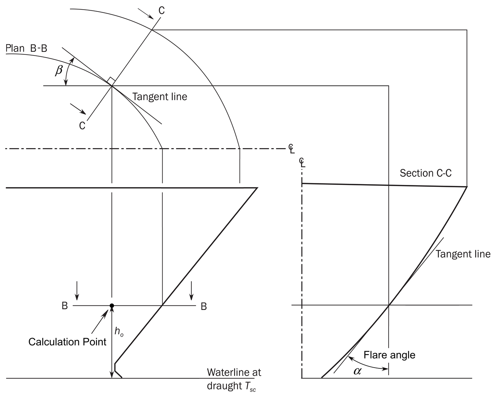
    Figure : Definition of bow geometry
    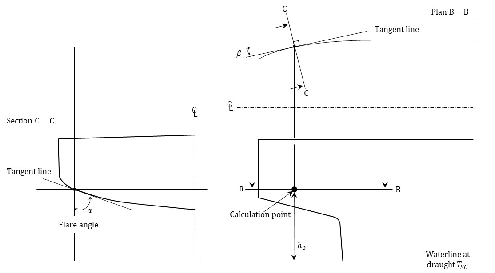
    Figure : Definition of stern geometry

#### 4. External pressures on superstructure and deckhouses

- **4.1** **Application**
  - **4.1.1** The external pressures on superstructure and deckhouses are only to be applied for strength assessment.
    These pressures are to be considered as dynamic pressures and are to be applied to the appropriate structure without any static pressure load component.
  - **4.1.2** The dynamic load case concept is not to be applied for external pressures on superstructures and deckhouses.
- **4.2** **Exposed wheel house tops**
  - **4.2.1** The lateral pressure for exposed wheel house tops, $P_D =12.5$ in $P_SI$, is to be taken as:
    $\mathrm{kN}/m^2$
- **4.3** **Sides of superstructures**
  - **4.3.1** The design pressure for the external sides of superstructures, $P _{SI} =2.1C _{w} c _{F} (C _{B} +0.7) \frac{20}{10+z _{SD} -T _{SC}}$ in $c _{F}$, is to be taken as:
    $boldc _{F}$
    where:
    $c _{F}$ : Distribution factor according to **Table 53**.

    | Location | $c _{F}$ |
    | --- | --- |
    | $f _{xL} <0.2$ | $1.0+ \frac{5}{C _{B}} \left( 0.2- \frac{x}{L} \right)$ without taking $x/L$ less than $0.1$ |
    | $f _{xL} \geq 0.2$ | $1.0$ |
- **4.4** **End bulkheads of superstructures and deckhouse walls**
  - **4.4.1** The external pressure for the aft and forward external bulkheads of superstructures and deckhouse walls, in $P _{"A-\min"}$, is to be taken as:
    $f _{n}$ but is not to be less than $f _{c}$.
    where:
    $f _{c} =0.3+0.7 \frac{b _{1}}{B _{1}}$ : Coefficient defined in **Table 54.**
    $f _{c}$ : Coefficient, to be taken as:
    $f _{d}$ but not less than 0.475.
    For exposed parts of machinery casings, $f _{d} = \frac{L}{10} e ^{-(L/300)} -left(1-left( \frac{L}{150} right) ^{2} right)$ is not to be taken less than 1.0.
    $L<150\mathrm{m}$ : Coefficient, to be taken as:
    $f _{d} = \frac{L}{10} e ^{-(L/300)}$ for $150 \mathrm{m} \leq L<300 \mathrm{m}$
    $f _{d} =11.03$ for $L \geq 300\mathrm{m}$
    $b _{1}$ for $B _{1}$
    $f _{b}$ : Breadth of deckhouse at the position considered.
    $P _{"A-\min"}$ : Actual breadth of ship on the exposed weather deck at the position considered.
    $\mathrm{kN}/m ^{2}$ : Coefficient defined in **Table 55.**
    $boldf _{n}$ : Minimum lateral pressure, in $f _{n}$, as defined in **Table 56.**

    | Type of bulkhead | Location | $f _{n}$ |
    | --- | --- | --- |
    | Unprotected front bulkhead(1) | Lowest tier(2) | $20+ \frac{L _{2}}{12}$ |
    | Unprotected front bulkhead(1) | Second tier | $10+ \frac{L _{2}}{12}$ |
    | Unprotected front bulkhead(1) | Third tier and above | $5+ \frac{L _{2}}{15}$ |
    | Protected front bulkhead(1) | All tiers | $5+ \frac{L _{2}}{15}$ |
    | Side bulkheads | All tiers | $5+ \frac{L _{2}}{15}$ |
    | Aft end bulkheads | Abaft amidships | $7+ \frac{L _{2}}{100} -8 \frac{x}{L _{2}}$ |
    | Aft end bulkheads | Forward of amidships | $5+ \frac{L _{2}}{100} -4 \frac{x}{L _{2}}$ |
    | (1) The front bulkhead of a superstructure or deckhouse may be considered as protected when it is located less than $B _{x}$ behind another superstructure or deckhouse, and the width of the front bulkhead being considered is less than the width of the aft bulkhead of the superstructure or deckhouse forward of it. $B _{x}$ is the local breadth of the ship at the front bulkhead. (2) The lowest tier is normally that tier which is directly situated above the uppermost continuous deck to which the moulded depth $D$ is measured. However, when $(D-T _{SC} )$ exceeds the minimum non-corrected tabular freeboard (according to ICLL as amended) by at least one standard superstructure height (as defined in **Ch 1, Sec 4, [3.3]**), then this tier may be defined as the 2nd tier and the tier above as the 3rd tier. |   |   |

    | Location of bulkhead(1) | $f _{b}$ |
    | --- | --- |
    | $f _{xL} <0.45$ | $1.0+ \left( \frac{x/L-0.45}{C _{B1} +0.2} \right) ^{2}$ |
    | $f _{xL} \geq 0.45$ | $1.0+1.5 \left( \frac{x/L-0.45}{C _{B1} +0.2} \right) ^{2}$ |
    | $C _{B1}$ : Block coefficient, but not less than 0.60 nor greater than 0.80. For aft deckhouse bulkheads located forward of amidships, $C _{B1}$ may be taken as 0.80. (1) For deckhouse sides, the deckhouse is to be subdivided into parts of approximately equal length, not exceeding $0.15L$ each, and $x$ is to be taken as the $X$-coordinate of the centre of each part considered. |   |

    | $L$ | $P _{"A-\min"}$, in $\mathrm{kN}/m ^{2}$ |   |
    | --- | --- | --- |
    | $L$ | Lowest tier of unprotected fronts | Elsewhere(1) |
    | $90 \(25+ \frac{L}{10}$ $12.5+ \frac{L}{20}$ |   |   |
    | $L>250$ | $50$ | $25$ |
    | (1) For the 4th tier and above, $P _{"A-\min"}$ is to be taken equal to 12.5 $\mathrm{kN}/m ^{2}$. |   |   |

### Section 6 Internal Loads

**Symbols**
For symbols not defined in this section, refer to **Ch 1, Sec 4.**
$x _{G}$ : Longitudinal, transverse and vertical accelerations, in $y _{G}$, at $z _{G}$, $f _{\beta}$, $h _{air}$, as defined in **Sec 3, [3.2].**
$\mathrm{m}$ : Coefficient defined in **Sec 4.**
$h _{"\max"}$ : Height of air pipe or overflow pipe above the top of the tank, in $\mathrm{m}$.
$P _{drop}$ : Maximum tank height measured from tank bottom, in $\mathrm{kN}/m^2$.
$\mathrm{kN}/m ^{2}$ : Overpressure, in $P _{PV}$, due to sustained liquid flow through air pipe or overflow pipe in case of overfilling or filling during flow through ballast water exchange. It is to be defined by the designer, but not to be less than 25 $\mathrm{kN}/m^2$.
$\mathrm{kN}/m ^{2}$ : Design vapour pressure, in $x, y, z$, but not less than 25 $X$.
$Y$ : $Z$, $\mathrm{m}$ and $x _{G}$ coordinates, in $y _{G}$, of the load point with respect to the reference coordinate system defined in **Sec 1, [1.2.1].**
$z _{G}$, $X$, $Y$ : $Z$, $\mathrm{m}$ and $V_Full$ coordinates, in $z _{"top"}$, of the volumetric centre of gravity of the tank or fully filled cargo hold, i.e. $Z$, considered with respect to the reference coordinate system defined in **Sec 1, [1.2].**
$\mathrm{m}$ : $\rho _{L}$ coordinate of the highest point of tank, excluding small hatchways, in $\mathrm{t}/m^3$.
$\rho _{L}$ : Density of liquid in the tank, in $\rho _{L}$, but not less than:
⦁ For fresh water
$\rho _{L}$=1.0
⦁ For liquefied natural gas as fuel
$\rho _{L}$=0.5 for strength assessment
$\rho _{L}$=0.46 or higher value for fatigue assessment
⦁ For methanol as fuel
$\rho_slh$=0.8
⦁ For ammonia as fuel
$\mathrm{t}/m^3$=0.8 or higher value
⦁ For other cases
$\rho _{slh} = \rho _{L}$=1.025
$\rho _{ST}$ : Liquid density, in $\mathrm{t}/m ^{3}$, to be used for sloshing assessment, taken as:
$\theta$
$\mathrm{deg}$ : Density of steel, in $\mathrm{kN}/m ^{2}$, to be taken as 7.85.
$P _{"in"} =P _{ls}$ : Roll angle, in $\mathrm{kN}/m ^{2}$, defined in **Sec 3, [2.1.1].**

#### 1. Pressure due to liquids

- **1.1** **Application**
  - **1.1.1** **Pressures for the strength assessments of intact conditions**
    The internal pressure due to liquid acting on any load point of a tank, in $P _{"in"} =P _{ls} +P _{ld}$, for the static (S) design load scenarios, given in **Sec 7**, is to be taken as:
    $P _{ls}$ but not less than 0.0
    The internal pressure due to liquid acting on any load point of a tank, in $\mathrm{kN}/m ^{2}$, for the static plus dynamic (S + D) design load scenarios is to be derived for each dynamic load case and is to be taken as:
    $P _{ld}$ but not less than 0.0
    where:
    $\mathrm{kN}/m ^{2}$ : Static pressure due to liquid in tanks, in $\mathrm{kN}/m ^{2}$, as defined in **[1.2].**
    $P _{"in"} =P _{fs}$ : Dynamic inertial pressure due to liquid in tanks, in $rhogd _{0}$, as defined in **[1.3].**
  - **1.1.2** **Pressures for the strength assessment of flooded conditions**
    The internal pressure in flooded condition, in $P _{fs}$, acting on any load point of the watertight boundary of a hold, tank or other space for the flooded static (S) design load scenarios, given in **Sec 7,** is to be taken as:
    $\mathrm{kN}/m ^{2}$ but not less than $d _{0}$.
    where:
    $\mathrm{m}$ : Static pressure of seawater in flooded condition in the compartment, in $d _{0} =0.02L$, as defined in **[1.4].**
    $L<120 \mathrm{m}$ : Distance, in $d _{0} =2.4$, to be taken as:
    $L \geq 120 \mathrm{m}$ for $P _{ls}$.
    $\mathrm{kN}/m ^{2}$ for $P _{ls} = \rho _{L} g(z _{"top"} -z)+P _{PV}$.
- **1.2** **Static liquid pressure**
  - **1.2.1** **Normal operations at sea**
    The static pressure due to liquid in tanks, $P _{ls} = \rho _{L} g(z _{"top"} -z)$ during normal operations at sea, in $P _{ls}$, is to be taken as:
    $\mathrm{kN}/m ^{2}$ for tanks installed with pressure relief valves
    $P _{ls} = \rho _{L} g(z _{"top"} -z)+P _{PV}$ for other cases
  - **1.2.2** **Harbour / sheltered water operations**
    The static pressure, $P _{ls} = \rho _{L} g(z _{"top"} -z)$ due to liquid in tanks for harbour / sheltered water operations, in $P _{ls}$, is to be taken as:
    $\mathrm{kN}/m ^{2}$ for tanks installed with pressure relief valves
    $P _{ls} = \rho _{L} g(z _{"top"} -z+0.5 h _{air} )$ for other cases
  - **1.2.3** **Sequential ballast water exchange**
    The static pressure, $P _{ls}$ due to liquid in ballast tanks associated with sequential ballast water exchange operations, in $\mathrm{kN}/m ^{2}$, is to be taken as:
    $P _{ls} = \rho _{L} g(z _{"top"} -z+h _{air} )+P _{drop}$
  - **1.2.4** **Flow through ballast water exchange**
    The static pressure, $P _{ls}$ due to liquid in ballast tanks associated with flow through ballast water exchange operations, in $P _{drop}$, is to be taken as:
    $P _{ls}$
  - **1.2.5** **Ballasting using ballast water treatment system**
    The static pressure, $\mathrm{kN}/m ^{2}$ due to liquid in tanks associated with ballasting operations using a ballast water treatment system is to be taken as defined for sequential ballast exchange in **[1.2.3].** The ship designer has to inform the Society if the ballast water treatment system implies additional pressure to be considered as $P _{ls} = \rho _{L} g(z _{"top"} -z)$, etc in addition to the pressure defined in **[1.2.3]**.
  - **1.2.6** **Static liquid pressure for the fatigue assessment**
    The static pressure due to liquid in tanks, $P _{ld}$ to be used for the fatigue assessment, in $\mathrm{kN}/m ^{2}$, is to be taken as:
    $P _{ld} =f _{\beta } \rho _{L} [a _{Z} (z _{0} -z)+f _{ull-l} a _{X} (x _{0} -x)+f _{ull-t} a _{Y} (y _{0} -y)]$
- **1.3** **Dynamic liquid pressure**
  - **1.3.1** The dynamic pressure, $f _{ull-l}$ due to liquid in tanks, in $f _{ull-l} =0.62$, is to be taken as:
    $f _{ull-l} =1.0$
    where:
    $f _{ull-l} =0.5+ \frac{\left| z _{o} -z \right|}{\ell _{fs}} \frac{180}{\phi \pi}$ : Longitudinal acceleration correction factor to account for the ullage space above the liquid in tanks, taken as
    ⦁ For strength assessment:
    $f _{ull-l} =1.0$ for fuel tanks filled with any liquids.
    $f _{ull-l}$ for other cases.
    ⦁ For fatigue assessment:
    $\ell _{fs}$ for fuel tanks filled with any liquids.
    $\mathrm{m}$ for other cases.
    $f _{ull-t}$ is not to be less than 0.0 nor greater than 1.0
    $f _{ull-l} =0.67$ : Fuel tank length at the top of the tank, in $f _{ull-l} =1.0$
    $f _{ull-t} =0.5+ \frac{\left| z _{o} -z \right|}{b _{"top"}} \frac{180}{\theta \pi}$ : Transverse acceleration correction factor to account for the ullage space above the liquid in tanks, taken as
    ⦁ For strength assessment:
    $f _{ull-t} =1.0$ for fuel tanks filled with any liquids.
    $f _{ull-t}$ for other cases.
    ⦁ For fatigue assessment:
    $b _{"top"}$ for fuel tanks filled with any liquids.
    $\mathrm{m}$ for other cases.
    $x _{0}$ is not to be less than 0.0 nor greater than 1.0
    $X$ : Fuel tank breadth at the top of the tank, in $\mathrm{m}$, determined at mid length of the tank.
    $y _{0}$ : $Y$ coordinate, in $\mathrm{m}$, of the reference point.
    $z _{0}$ : $Z$ coordinate, in $\mathrm{m}$, of the reference point.
    $V _{j}$ : $V _{j} =a _{X} (x _{j} -x _{G} )+a _{Y} (y _{j} -y _{G} )+(a _{Z} +g) (z _{j} -z _{G} )$ coordinate, in $x _{j}$, of the reference point.
    The reference point is to be taken as the point with the highest value of $X$, calculated for all points that define the upper boundary of the tank as follows:
    $\mathrm{m}$
    where:
    $j$ : $y _{j}$ coordinate, in $Y$, of the point $\mathrm{m}$ on the upper boundary of the tank.
    $j$ : $z _{j}$ coordinate, in $Z$, of the point $\mathrm{m}$ on the upper boundary of the tank.
    $j$ : $P _{fs}$ coordinate, in $\mathrm{kN}/m ^{2}$, of the point $P _{fs} = \rho g h _{fs}$ on the upper boundary of the tank.
- **1.4** **Static pressure in flooded conditions**
  - **1.4.1** **Static pressure in flooded compartments**
    The static pressure, $0.0$ in $h _{fs}$, for watertight boundaries of flooded compartments is to be taken as:
    $\mathrm{m}$ but not less than $h _{fs} =\max \left( z _{FD} -z , \left| y \right| \sin \theta _{dam} + \left( z _{dam} -z \right) \cos \theta _{dam} \right)$
    where:
    $h _{fs} =y \sin \theta _{dam} + \left( z _{dam} -z \right) \cos \theta _{dam} +1.0$ : Pressure height, in $z _{FD}$, in flooded condition, to be taken as:
    $Z$ for hull local scantling according to **Ch 6**
    $\mathrm{m}$ for direct strength analysis according to **Ch 7**
    Alternatively, the worst damage water line corresponding to the damage stability calculation for every individual cargo hold may be used for direct strength assessment.
    $z _{dam}$ : $Z$ coordinate, in $\mathrm{m}$, of the freeboard deck at side in way of the transverse section considered.
    $\theta _{dam}$ : $\mathrm{deg}$ coordinate, in $M _{"con"-"i"}$, of the deepest equilibrium waterline at centre line in the damaged condition.(or in intermediate stages of flooding)
    $M_stack$ : Angle, in $\mathrm{ton}$, between the deepest equilibrium waterline in the damaged condition (or in intermediate stages of flooding) and the base line.

#### 2. Pressures and forces due to container

- **2.1** **Container design load**
  - **2.1.1** **Design weight of a container**
    The design weight of a container, $M _{"con"-"i"} \geq 2.5$, in hold and design stack weight on deck, $M _{"con"-"i"} \geq 3.5$, in $M _{"con"-"i"} \geq 4.0$, is to be used based on the trim and stability booklet. The design weight of a container is not to be less than the minimum as follow:
    $M_"con-i"$ for 20ft container
    $i$ for 40ft container
    $rm"ton"$ for 45ft container
    where:
    $F _{"con-s-i"}$ : Design weight of a container at tier '$\mathrm{kN}$', in $F _{stack-s}$, and to be defined for each 20ft and 40ft container.
  - **2.1.2** **Static force of a container**
    The static force of a container, $\mathrm{kN}$, in $F _{"con-s-i"} =g M _{con-i}$, and the static force of stack, $F _{"stack-s"} =g M _{stack}$, in $\mathrm{kN}$, are to be taken as:
    $F _{"con-d-x-i"} =M _{con-i} a _{X}$
    $F _{"con-d-y-i"} =M _{con-i} a _{Y}$
  - **2.1.3** **Dynamic force of a container**
    The dynamic container force components of a container at the container center of gravity, in $F _{"con-d-z-i"} =M _{con-i} a _{Z}$, is to be taken as:
    $a _{X}$
    $a _{Y}$
    $a _{Z}$
    The reference point of $F _{"con-total-x"} = \sum _{i=1} ^{N} F _{"con-d-x-i"}$, $F _{"con-total-y"} = \sum _{i=1} ^{N} F _{"con-d-y-i"}$ and $F _{"con-total-z"} = \sum _{i=1} ^{N} F _{"con-s-i"} + \sum _{i=1} ^{N} F _{"con-d-z-i"}$ is to be taken at the center of considered cargo hold.
  - **2.1.4** **Center of gravity of a container**
    The vertical center of gravity of each container is assumed at 45 % of container height. And, the longitudinal and transverse center of gravity of each container is assumed at the mid of corresponding length.
  - **2.1.5** **Total container forces**
    The total container force acting on the bottom of each container stack is to be taken as:
    $F _{con-"total"-z} =F _{stack-s} + \sum _{i=1} ^{N} F _{con-d-z-i}$
    $N$
    $F _{x}$ or $\mathrm{kN}$
    where:
    $F _{x} =F _{"con-d-x-i"} /4$ : Number of containers per stack in hold or on deck.
- **2.2** **Container loads in hold**
  - **2.2.1** **Longitudinal load component**
    The longitudinal load component, $F _{y}$, in $\mathrm{kN}$, is to be applied to the transverse bulkhead depending on the direction of acceleration at the position of container corner in way of cell guide. See also **Figure 1.**
    $F _{y} =F _{"con-d-y-i"} /4$
  - **2.2.2** **Transverse load component**
    The transverse load component, $F _{z}$, in $\mathrm{kN}$, is to be applied to the transverse bulkhead depending on the direction of acceleration at the position of container corner in way of cell guide. See also **Figure 2.**
    $F _{z} =F _{"con-total-z"} /4$
  - **2.2.3** **Vertical load component**
    The vertical load component, $20\mathrm{ft}$, in $40\mathrm{ft}$, is to be applied to the inner bottom at the position of 4 container corners. See also **Figure 3**.
    $F _{y} =0.65 F _{"con-d-y-i"} /2$
  - **2.2.4** **Load application**
    $F _{y} =F _{"con-total-y"} /4$ for the end 2 corners of 20ft container near transverse bulkhead.
    $F _{z} =F _{"con-total-z"} /4$ for the bottom corners of free end of 20ft stack in 40ft container bay.
    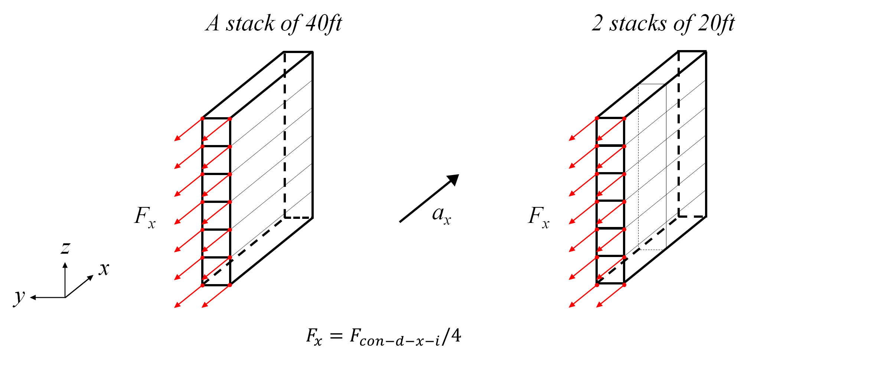
    Figure : Longitudinal container load component in hold
    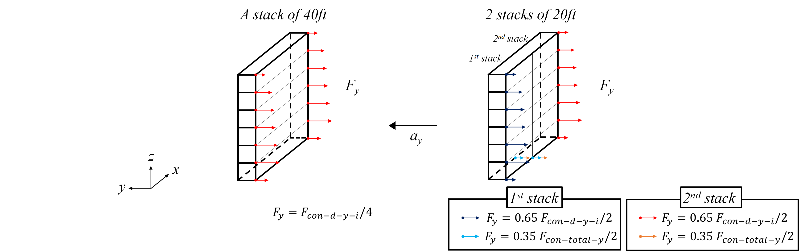
    Figure : Transverse container load component in hold
    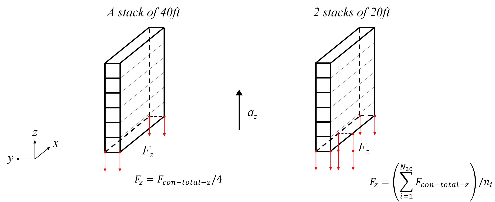
    Figure : Vertical container load component in hold
    - **a)** For $F _{y} =0.35 F _{"con-total-y"} /2$ container in $F _{x} =F _{"con-total-x"} /4$ container bay, 35% of the total transverse load component is to be applied to the inner bottom at the free end of the 20ft stack. At the other end, the remaining 65% of the total transverse load component is to be applied to the transverse bulkhead in way of the cell guide in the transverse force direction.
    - **b)** For 20ft container in 40ft container bay, the longitudinal load component combined with longitudinally nearest 20ft container, is also to be applied to the transverse bulkhead depending on the direction of combined acceleration at the position of container corner in way of cell guide.
- **2.3** **Container loads on deck or hatch cover**
  - **2.3.1** **Load application**
    The effect of the hatch cover self-weight may be considered in the loads applied to the ship structures. See also **Figure 4**, **Figure 5** and **Figure 6**.
    $F _{x} = \left( \sum _{i=1} ^{N _{20}} F _{"con-total-x"} \right) /n _{i}$
    $F _{y} = \left( \sum _{i=1} ^{N _{20}} F _{"con-total-y"} \right) /n _{i}$
    $F _{z} = \left( \sum _{i=1} ^{N _{20}} F _{"con-total-z"} \right) /n _{i}$
    $N _{20}$ $n _{i}$ $P _{IGC}$
    where:
    $\mathrm{kN}/m ^{2}$ : Number of 20ft stacks on hatch cover.
    $a _{x}$ : Number of nodal points of top of hatch coaming.
    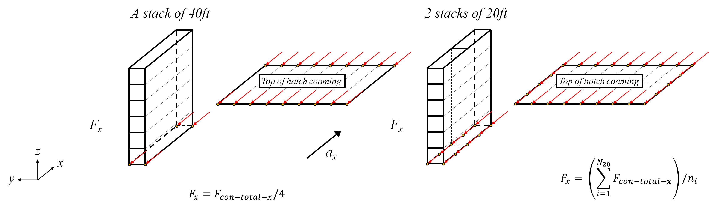
    Figure : Longitudinal container load component on deck
    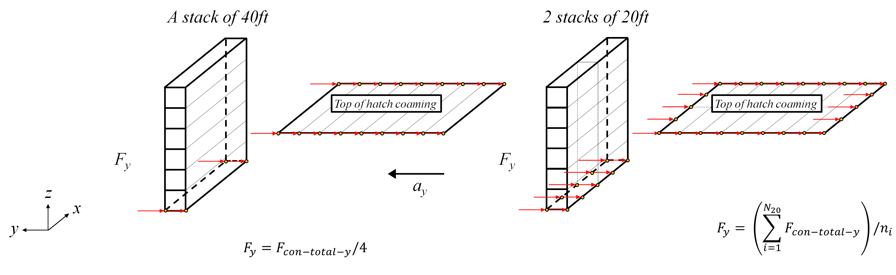
    Figure : Transverse container load component on deck
    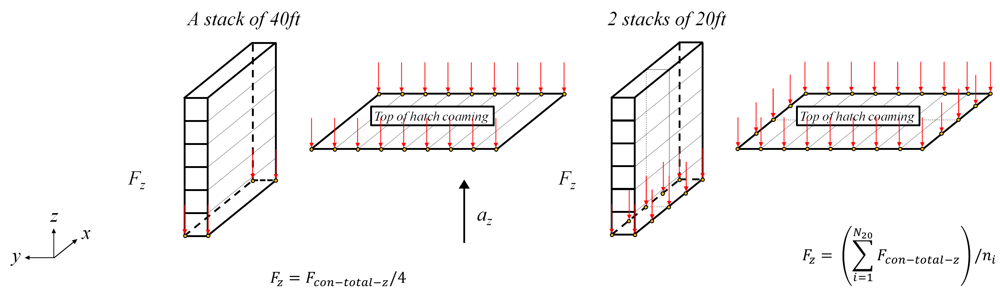
    Figure : Vertical container load component on deck
    - **a)** Each container load component at the bottom corners of each stack on deck or hatch cover is to be taken as:
    - **b)** In case of 20ft container stack on hatch cover in way of 40ft bay, each container load component acting on hatch cover is to be distributed along the top of the corresponding hatch coaming. The total force acting on the hatch cover is determined by integrating all stacks on hatch cover. Then the total force is to be distributed to the total length of the hatch coamings using the average line load.

#### 3. Pressure by IGF

- **3.1** **General**
  - **3.1.1** **Application**
    For the liquefied natural gas fuel tank, the internal pressure acting on a tank boundary, which is symbolized as $a _{y}$ in **Ch 6**, is given in **“Rules/Guidance for the Classification of Ships Using Low-flashpoint Fuels”, Ch 6, Sec 4, 409.** in $a _{z}$. This pressure is calculated with dimensionless acceleration, which is combined with 3 components($\mathrm{m} ^{3}$, $b _{tk-h}$, $0.56 B$) in an arbitrary direction according to an ellipsoid surface. For the corner points of the liquefied natural gas fuel tank, pressure may be calculated with different acceleration direction so as to have a maximum. The pressure between corner points is decided by linear interpolation.

#### 4. Sloshing pressure in tanks

- **4.1** **General**
  - **4.1.1** **Application**
    This article applies to all ballast tanks and other tanks with a volume exceeding 100$\ell _{tk-h}$, but the water ballast tanks located within the cargo hold region do not need to be applied.
  - **4.1.2** The sloshing pressures defined in this article do not include the effect of impact pressures due to high velocity impacts with tank boundaries or internal structures. For tanks with a breadth of cargo tank, $0.13 L$, greater than $0.05 h _{itmax}$ or a length of cargo tank, $0.95 h _\mathit{\max}$, greater than $P _{slh}$ at any filling level from $\mathrm{kN}/m ^{2}$ to $P _{slh-itmin}$, a separate impact assessment is to be carried out in accordance with the Society procedures.
  - **4.1.3** **Sloshing pressure on tank boundaries and internal divisions**
    The sloshing pressure due to liquid motions in a tank $P _{slh} =P _{slh-"lng"}$ acting on any load point of a tank boundary or internal divisions, in $P _{slh} =P _{slh-wf}$, for the sloshing design load scenario, given in **Sec 7,** is to be taken as follows, without being less than $P _{slh} =P _{slh-t}$, as given in **[4.2]**:
    - **a)** $P _{slh} =P _{slh-grd}$ for transverse bulkheads, as defined in **[4.3.2]**.
    - **b)** $P _{slh-"\min"}$ for web frames and transverse stringers, as defined in **[4.3.3]**.
    - **c)** $\mathrm{kN}/m ^{2}$ for longitudinal bulkheads, as defined in **[4.4.2]**.
    - **d)** $P _{slh-"\min"}$ for longitudinal girders and stringers, see **[4.4.3]**.
- **4.2** **Minimum sloshing pressure**
  - **4.2.1** The minimum sloshing pressure, $\mathrm{kN}/m ^{2}$, for tanks of cellular construction, i.e. double hull construction with internal structures restricting the fluid motion, is to be taken as 12.0 $P _{slh-"lng"}$.
    The minimum sloshing pressure, $0.05 h _{itmax}$, for all other tanks is to be taken as 20.0 $0.95 h _{itmax}$.
- **4.3** **Sloshing pressure due to longitudinal liquid motion**
  - **4.3.1** The sloshing pressure due to longitudinal liquid motion, $0.05 h _{"\max"}$, is to be taken as a constant value over the full tank depth and is to be taken as the greater of the sloshing pressures calculated for filling levels from $P _{slh-"lng"}$, to $\mathrm{kN}/m ^{2}$, in $P _{slh-"lng"} = \rho _{slh} g \ell _{tk-h} f _{slh} \left[ 0.4- \left( 0.39- \frac{1.7 \ell _{tk-h}}{L} \right) \frac{L}{350} \right]$ increments.
  - **4.3.2** **Sloshing pressure in way of transverse bulkheads**
    The sloshing pressure in way of transverse bulkheads due to longitudinal liquid motion, $\ell _{tk-h}$, in $\mathrm{m}$, for a particular filling level, is to be taken as:
    $f_slh$
    where:
    $h_fill$ : Length of cargo tank, in $\mathrm{m}$, at considered filling height.
    $f_slh$ : Coefficient as defined in **Table 1**.
    $h _{fill}$ : Filling height, measured from tank bottom, in $f_slh$.

    | $h _{fill}$ | $f_slh$ |
    | --- | --- |
    | 0.0$h _{Tank}$ | 0.0 |
    | 0.1$h _{Tank}$ | $f _{slh} =1.5 \left[ 1-2 \left( 0.3- \frac{h _{fill}}{h _{Tank}^{2}} \right) ^{2} \right]$ |
    | 0.3$h _{Tank}$ | $f _{slh} =2.0 \left[ 1-2 \left( 0.3- \frac{h _{fill}}{h _{Tank}^{2}} \right) ^{2} \right]$ |
    | 1.0$h _{Tank}$ | $f _{slh} =1.5 \left[ 1-2 \left( 0.3- \frac{h _{fill}}{h _{Tank}^{2}} \right) ^{2} \right]$ |
    | For intermediate values of $h _{fill}$, $f_slh$ are to be obtained by linear interpolation. |   |
  - **4.3.3** **Sloshing pressure on internal web frames or transverse stringers adjacent to a transverse bulkhead**
    For tanks with internal web frames the sloshing pressure acting on a web frame or transverse stringer adjacent to transverse bulkheads or transverse wash bulkheads due to longitudinal liquid motion, $P _{slh-wf} =P _{"slh-lng"} \left( 1- \frac{s _{wf}}{\ell _{tk-h}} \right) ^{2}$, in $\ell _{tk-h}$, provided it is located within $\mathrm{m}$ from the bulkhead, is to be taken as:
    $P_"slh-lng"$
    where:
    $s_wf$ : Length of cargo tank, in $\mathrm{m}$, at considered filling height.
    $P_slh-t$ : Sloshing pressure due to longitudinal liquid motion acting on transverse bulkhead, as defined in **[3.2.6].**
    $0.05h _{itmax}$ : Distance from transverse bulkhead to web frame under consideration, in $0.95 h _{itmax}$.
    The distribution of pressure across web frames and transverse stringers is given in **Figure 7.**
    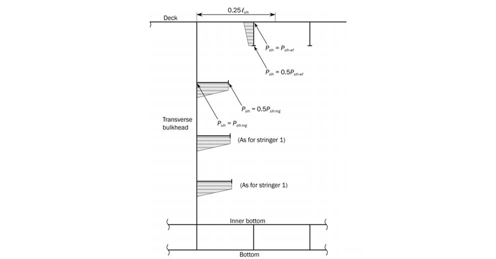
    Figure : Sloshing pressure distribution on transverse stringers and web frames
- **4.4** **Sloshing pressure due to transverse liquid motion**
  - **4.4.1** **Application**
    The sloshing pressure due to transverse liquid motion, $0.05 h _{itmax}$, is to be taken constant as a constant value over the full tank depth and is to be taken as the greater of the sloshing pressures calculated for filling levels from $P _{slh-t}$ to $\mathrm{kN}/m ^{2}$, in $P _{slh-t} =7 \rho _{slh} g f _{slh} \left( \frac{b _{tk-h}}{B} -0.3 \right) GM ^{ 0.75}$ increments.
  - **4.4.2** **Sloshing pressure in way of longitudinal bulkheads**
    The sloshing pressure in way of longitudinal bulkheads due to transverse liquid motion, $b _{tk-h}$, in $\mathrm{m}$, for a particular filling level, is to be taken as:
    $f_slh$
    where:
    $GM$ : Breadth of cargo tank, in $P _{slh-grd}$, at considered filling height.
    $\mathrm{kN}/m ^{2}$ : Coefficient to be taken as defined in **[4.3.2] Table 1**.
    $0.25 b _{slh}$ : Metacentric height, given in **Sec 3, [2.1.1]**.
  - **4.4.3** **Sloshing pressure on internal girders or longitudinal stringers adjacent to longitudinal bulkheads**
    For tanks with internal girders or stringers, the sloshing pressure acting on the girder/web frame adjacent to longitudinal bulkheads and longitudinal wash bulkhead, $P _{slh-grd} =P _{slh-t} \left( 1- \frac{s _{grd}}{b _{tk-h}} \right) ^{2}$, in $b _{tk-h}$, provided it is located within $\mathrm{m}$ from the bulkhead, is to be taken as:
    $P _{slh-t}$
    where:
    $s _{grd}$ : Breadth of cargo tank, in $\mathrm{m}$, at considered filling height.
    $P _{ST}$ : Sloshing pressure due to transverse liquid motion acting on longitudinal bulkhead, as defined in **[3.2.9].**
    $\mathrm{kN}/m ^{2}$ : Distance from longitudinal bulkhead to girder under consideration, in $P _{ST} =10(z _{ST} -z)$.
    The distribution of pressure across stringers is given in **Figure 8.** The distribution of pressure across longitudinal girders is similar to the deck web frame shown in **Figure 7**.
    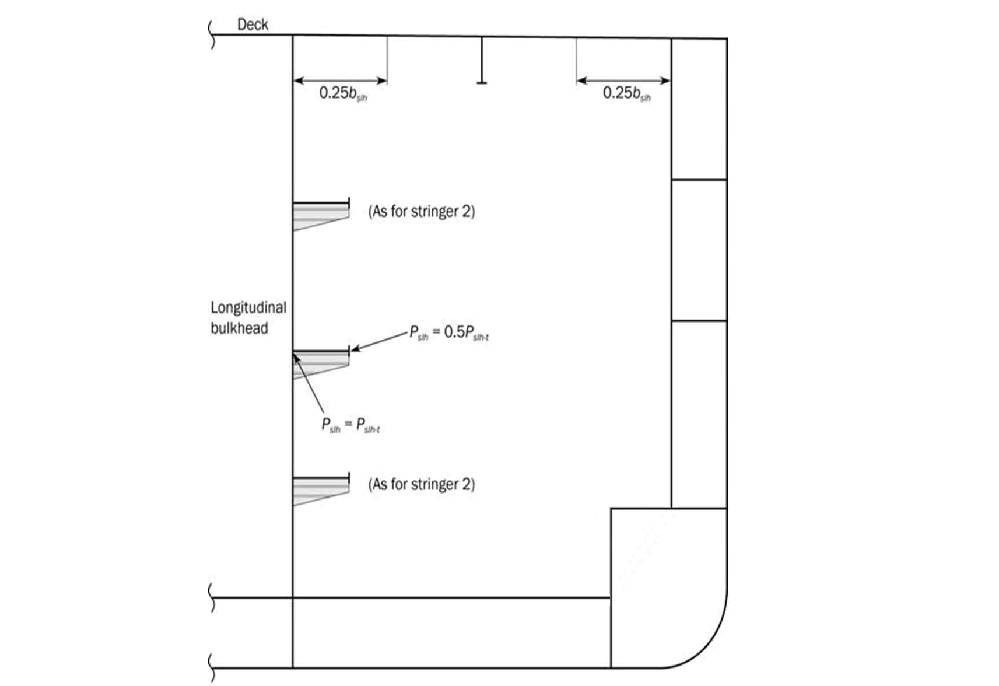
    Figure : Sloshing pressure distribution on longitudinal stringers and girders

#### 5. Design pressure for tank testing

- **5.1** **Definition**
  - **5.1.1** In order to assess the structure, static design pressures are to be applied. The design pressure for tank testing, $z _{ST}$, in $\mathrm{m}$, is to be taken as:
    $\mathbf{{z _{ST}}}$
    where:
    $z _{ST}$ : Design testing load height, in $z _{ST} =z _{t op} +h _{air}$, as defined in **Table 2.**

    | Compartment | $z _{ST}$ |
    | --- | --- |
    | Double bottom tanks (1) | The greater of the following: $z _{ST} =z _{t op} +h _{air}$ $z _{ST} =z _{bd}$ |
    | Double side tanks, fore and aft peaks used as tank | The greater of the following: $z _{ST} =z _{t op} +h _{air}$ $z _{ST} =z _{t op} +2.4$ |
    | Tank bulkheads, deep tanks, fuel oil bunkers and methanol fuel tanks | The greater of the following: $z _{ST} =z _{t op} +h _{air}$ $z _{ST} =z _{t op} +2.4$ $z _{ST} =z _{t op} +0.1P _{PV}$ |
    | Chain locker | $z _{ST} =z _{c}$ |
    | Independent tanks | The greater of the following: $z _{ST} =z _{t op} +h _{air}$ $z _{ST} =z _{t op} +0.9$ |
    | Ballast ducts | Testing load height corresponding to ballast pump maximum pressure |
    | $z _{bd}$ : $z$ coordinate, in $\mathrm{m}$, of the bulkhead deck. $z _{c}$ : $z$ coordinate, in $\mathrm{m}$, of the top of the chain pipe. (1) For double bottom tanks connected with double side tanks, corresponding to "Double side tanks, fore and aft peaks used as tank" is applicable. |   |

#### 6. Loads on non-exposed decks and platforms

- **6.1** **Application**
  - **6.1.1** **General**
    The loads defined in **[5.2]** and **[5.3]** are applicable to non-exposed decks, accommodation decks and platforms.
- **6.2** **Pressure due to distributed load**
  - **6.2.1** If a distributed load is carried on a deck, the static and dynamic pressures due to this distributed load are to be considered.
    The static distributed load is to be defined by the designer without being less than 3.0 $\mathrm{kN}/m ^{2 }$ for accommodation decks and 10.0 $P _{dl} =P _{dl-s}$ for other decks and platforms.
    The pressure $P _{dl}$, in $\mathrm{kN}/m ^{2 }$, due to this distributed load for the static (S) design load scenarios, given in **Sec 7,** is to be taken as:
    $P _{dl} =P _{dl-s} +P _{dl-d}$
    The pressure $P _{dl-s}$, in $\mathrm{kN}/m ^{2 }$, due to this distributed load for the static plus dynamic (S + D) design load scenarios, is to be derived for the envelope of dynamic load cases and is to be taken as:
    $P _{dl-d}$ but not less than 0.0.
    where:
    $\mathrm{kN}/m ^{2 }$ : Static pressure, in $\mathrm{kN}/m ^{2 }$, due to the distributed load.
    $P _{dl-d} =f _{\beta} \frac{a _{z-env}}{g} P _{dl-s}$ : Dynamic pressure, in $a _{z-env}$, due to the distributed load, in $\mathrm{m}/s ^{2}$, to be taken as:
    $F _{U}$
    $\mathrm{kN}$ : Envelope of vertical acceleration, in $F _{U} =F _{U-s}$, at the load position being considered, for the dynamic load cases, given in **Sec 3, [3.3.3].**
- **6.3** **Concentrated force due to unit load**
  - **6.3.1** If a unit load is carried on an internal deck, the static and dynamic forces due to the unit load carried are to be considered when a direct analysis is applied for stiffeners or primary supporting members such as in **Ch 6, Sec 5 [1.2]** or **Ch 6, Sec 6 [3.3]** respectively.
    The force $F _{U}$, in $\mathrm{kN}$, due to this concentrated load for the static (S) design load scenarios, given in **Sec 7,** is to be taken as:
    $F _{U} =F _{U-s} +F _{U-d}$
    The force $F _{U-s}$, in $\mathrm{kN}$, due to this concentrated load for the static plus dynamic (S + D) design load scenarios, is to be derived for the envelope of dynamic load cases and is to be taken as:
    $F _{U-s} =m _{U} g$ but not less than 0.0.
    where:
    $F _{U-d}$ : Static force, in $\mathrm{kN}$, due to the unit load to be taken as:
    $F _{U-d} =m _{U} f _{\beta} a _{z-env}$
    $m _{U}$ : Dynamic force, in $a _{z-env}$, due to unit load to be taken as:
    $\mathrm{m}/s ^{2}$
    $VBM$ : Mass of the unit load carried, in t.
    $\mathrm{kNm}$ : Envelope of vertical acceleration, in $M _{sw}$, at the centre of gravity of the unit load carried for the dynamic load cases, given in **Sec 3, [3.3.3].**

### Section 7 Design Load Scenarios

**Symbols**
For symbols not defined in this section, refer to **Ch 1, Sec 4.**
$\mathrm{kNm}$ : Design vertical bending moment, in $M _{sw-p}$.
$\mathrm{kNm}$ : Permissible hull girder hogging and sagging still water bending moment for seagoing operation, in $M _{sw-f}$, as defined in **Sec 4, [2.2.2].**
$M _{sw-f}$ : Permissible hull girder hogging and sagging still water bending moment for harbour / sheltered water operation, in $\mathrm{kNm}$, as defined in **Sec 4, [2.2.3].**
$M _{sw-t}$ : Permissible hull girder hogging or sagging still water bending moment $\mathrm{kNm}$ for seagoing operation in the flooded condition, in $M _{wv-LC}$, as defined in **Sec 4, [2.2.4].**
$\mathrm{kNm}$ : Permissible hull girder hogging and sagging still water bending moment for tank testing, in $HBM$, as defined in **Sec 4, [2.2.5].**
$\mathrm{kNm}$ : Vertical wave bending moment for a considered dynamic load case, in $M _{wh-LC}$, as defined in **Sec 4, [3.2].**
$\mathrm{kNm}$ : Design horizontal bending moment, in $TM$.
$\mathrm{kNm}$ : Horizontal wave bending moment for a considered dynamic load case, in $M _{wt-LC}$, as defined in **Sec 4, [3.4].**
$\mathrm{kNm}$ : Design torsional moment, in $VSF$.
$\mathrm{kN}$ : Wave torsional moment for a considered dynamic load case, in $Q _{sw}$, as defined in **Sec 4, [3.6].**
$\mathrm{kN}$ : Design vertical shear force, in $Q _{sw-p}$.
$\mathrm{kN}$ : Permissible hull girder positive and negative still water shear force limits for seagoing operation, in $Q _{sw-f}$, as defined in **Sec 4, [2.3.1].**
$\mathrm{kN}$ : Permissible hull girder positive and negative still water shear force limits for harbour / sheltered water operation, in $Q _{sw-t}$, as defined in **Sec 4, [2.3.2].**
$\mathrm{kN}$ : Permissible hull girder positive and negative still water shear force for seagoing operation in the flooded condition, in $Q _{wv-LC}$, as defined in **Sec 4, [2.3.3].**
$\mathrm{kN}$ : Permissible hull girder positive and negative still water shear force limits for tank testing, in $P _{ex}$**.**
$\mathrm{kN}/m ^{2}$ : Vertical wave shear force for a considered dynamic load case, in $P _{S}$, as defined in **Sec 4, [3.3].**
$\mathrm{kN}/m ^{2}$ : Design external pressure, in $P _{W}$.
$\mathrm{kN}/m ^{2}$ : Static sea pressure at considered draught, in $P _{D}$, as defined in **Sec 5, [1.2.1].**
$\mathrm{kN}/m ^{2}$ : Dynamic pressure for a considered dynamic load case, in $P _{"in"}$, as defined in **Sec 5, [1.3.2]** to **[1.3.8]**.
$\mathrm{kN}/m ^{2}$ : Green sea load for a considered dynamic load case, in $P _{ST}$, as defined in **Sec 5, [2.2.3]** and **[2.2.4]**.
$\mathrm{kN}/m ^{2}$ : Design internal pressure, in $P _{liters}$.
$\mathrm{kN}/m ^{2}$ : Tank testing pressure, in $P _{literd}$, see **Sec 6, [4.1.1].**
$\mathrm{kN}/m ^{2}$ : Static liquid pressure in tank, in $P _{fs}$, as defined in **Sec 6, [1.2].**
$\mathrm{kN}/m ^{2}$ : Dynamic liquid pressure in tank for a considered dynamic load case, in $F _{U-s}$, as defined in **Sec 6, [1.3].**
$\mathrm{kN}$ : Static pressure in compartments and tanks in flooded condition, in $F _{U-d}$, as defined in **Sec 6, [1.4.1].**
$\mathrm{kN}$ : Static load acting on supporting structures and securing systems for heavy units or cargo, equipment or structural components, in $P _{SL}$, as defined in **Sec 5, [2.3.2].**
$\mathrm{kN}/m ^{2}$ : Dynamic load acting on supporting structures and securing systems for heavy units of cargo, equipment or structural components, in $P _{FB}$, as defined in **Sec 5, [2.3.2].**
$\mathrm{kN}/m ^{2}$ : Bottom slamming pressure, in $P _{SS}$, as defined in **Sec 5, [3.2].**
$\mathrm{kN}/m ^{2}$ : Bow impact pressure, in $P _{slh}$, as defined in **Sec 5, [3.3].**
$\mathrm{kN}/m ^{2}$ : Stern slamming pressure, in $M _{sw-p}$, as defined in **Sec 5, [3.4].**
$M _{sw} +M _{wv-LC}$ : Sloshing pressure, in $M _{sw} +M _{wv-LC}$, as defined in **Sec 6, [3].**

#### 1. General

- **1.1** **Application**
  - **1.1.1** This section gives the design load scenarios that are to be used for:
    - **a)** Strength assessment by prescriptive and direct analysis (Finite Element Method, FEM) methods, as given in **[2].**
    - **b)** Fatigue assessment by prescriptive and direct analysis (FEM) methods, as given in **[3].**
  - **1.1.2** For the strength assessment, the principal design load scenarios consist of either S (Static) loads or S + D (Static + Dynamic) loads. In some cases, the letter ‘'A’' prefixes the S or S + D to denote that this is an accidental design load scenario. There are some additional design load scenarios to be considered which relate to impact (I) loads and sloshing (SL) loads.

#### 2. Design load scenarios for strength assessment

- **2.1** **Principal design load scenarios**
  - **2.1.1** The principal design load scenarios are given in **Table 1.**

    | Design load scenario |   |   | Harbour and sheltered water | Seagoing conditions with extreme sea loads | Ballast water exchange(1) | Flooded conditions | Collision conditions |
    | --- | --- | --- | --- | --- | --- | --- | --- |
    | Load components |   |   | Static (S) | Static + Dynamic (S+D) | Static + Dynamic (S+D) | Accidental (A) | Accidental (A) |
    | Hull Girder | VBM |   | $M _{sw-p}$ | $M _{sw} +M _{wv-LC}$ | $M _{sw} +M _{wv-LC}$ | $M _{sw-f} ^{}$ | $M _{sw}^{}$ |
    | Hull Girder | HBM |   | - | $M _{wh-LC}$ | $M _{wh-LC}$ | - | - |
    | Hull Girder | VSF |   | $Q _{sw-p}$ | $Q _{sw} +Q _{wv-LC}$ | $Q _{sw} +Q _{wv-LC}$ | - | - |
    | Hull Girder | TM |   | - | $M _{st} +M _{wt-LC}$ | $M _{st} +M _{wt-LC}$ | - | - |
    | Local Loads | $P _{ex}$ | External deck for green sea | - | $P _{D}$ | - | - | - |
    | Local Loads | $P _{ex}$ | Hull envelope | $P _{s}$ | $P _{s} +P _{w}$ | $P _{s} +P _{w}$ | - | - |
    | Local Loads | $P _{i n}$ | Ballast tanks | $P _{ls}$ | $P _{ls} +P _{ld}$ | $P _{ls} +P _{ld}$ | - | - |
    | Local Loads | $P _{i n}$ | Liquefied natural gas fuel tanks | $P _{ls}$ | $P _{ls} +P _{ld}$ | - | - | $0.5g$, $-0.25g$ |
    | Local Loads | $P _{i n}$ | Other tanks | $P _{ls}$ | $P _{ls} +P _{ld}$ | - | - | - |
    | Local Loads | $P _{i n}$ | Watertight boundaries | - | - | - | $P _{fs}$ | - |
    | Local Loads | $F _{con}$ | Container | $F _{con-s}$ | $F _{con-s} +F _{con-d}$ | - | - | - |
    | Local Loads | $P _{dk}$ | Internal decks for dry spaces | $P _{dl-s}$ | $P _{dl-s} +P _{dl-d}$ | - | - | - |
    | Local Loads | $P _{dk}$ | External deck for distributed loads | $P _{dl-s}$ | $P _{dl-s} +P _{dl-d}$ | - | - | - |
    | Local Loads | $P _{dk}$ | External deck for heavy units | $F _{U-s}$ | $F _{U-s} +F _{U-d}$ | - | - | - |
    | (1) Applicable to prescriptive assessment only |   |   |   |   |   |   |   |
- **2.2** **Additional design load scenarios**
  - **2.2.1** The design load scenarios to be considered for bow impact, bottom slamming, stern slamming, sloshing and tank testing are given in **Table 2.**

    | Design load scenario |   |   | Bow impact | Bottom slamming | Stern slamming | Sloshing | Tank testing(1) |
    | --- | --- | --- | --- | --- | --- | --- | --- |
    | Load components |   |   | Impact (I) | Impact (I) | Impact (I) | Sloshing (SL) | Test (T) |
    | Hull Girder | VBM |   | - | - | - | $M _{sw}$ | $M _{sw-t}$ |
    | Hull Girder | HBM |   | - | - | - | - | - |
    | Hull Girder | VSF |   | - | - | - | - | $Q _{sw-t}$ |
    | Hull Girder | TM |   | - | - | - | - | - |
    | Local Loads | $P _{ex}$ | External deck for green sea | - | - | - | - | - |
    | Local Loads | $P _{ex}$ | Hull envelope | $P _{FB}$ | $P _{SL}$ | $P _{SS}$ | - | $P _{s}$ |
    | Local Loads | $P _{i n}$ | Ballast tanks | - | - | - | $P _{slh}$ | $P _{ST}$ |
    | Local Loads | $P _{i n}$ | Liquefied natural gas fuel tanks | - | - | - | $P _{slh}$ | - |
    | Local Loads | $P _{i n}$ | Other tanks | - | - | - | $P _{slh}$ | $P _{ST}$ |
    | Local Loads | $P _{i n}$ | Watertight boundaries | - | - | - | - | - |
    | Local Loads | $F _{con}$ | Container | - | - | - | - | - |
    | Local Loads | $P _{dk}$ | Internal decks for dry spaces | - | - | - | - | - |
    | Local Loads | $P _{dk}$ | External deck for distributed loads | - | - | - | - | - |
    | Local Loads | $P _{dk}$ | External deck for heavy units | - | - | - | - | - |
    | (1) Applicable to prescriptive assessment only |   |   |   |   |   |   |   |

#### 3. Design load scenarios for fatigue assessment

- **3.1** **Design load scenarios**
  - **3.1.1** The design load scenarios are given in **Table 3.**

    | Design load scenario |   |   | Fatigue: Static + Dynamic (F: S + D) |
    | --- | --- | --- | --- |
    | Load components |   |   | Fatigue: Static + Dynamic (F: S + D) |
    | Hull Girder | VBM |   | $M _{sw} +M _{wv-LC}$ |
    | Hull Girder | HBM |   | $M _{wh-LC}$ |
    | Hull Girder | VSF |   | $Q _{sw} +Q _{wv-LC}$ |
    | Hull Girder | TM |   | $M _{st} +M _{wt-LC}$ |
    | Local Loads | $P _{ex}$ | External deck for green sea | - |
    | Local Loads | $P _{ex}$ | Hull envelope | $P _{s} +P _{w}$ |
    | Local Loads | $P _{i n}$ | Ballast tanks | $P _{ls} +P _{ld}$ |
    | Local Loads | $P _{i n}$ | Liquefied natural gas fuel tanks | $P _{ls} +P _{ld}$ |
    | Local Loads | $P _{i n}$ | Other tanks | $P _{ls} +P _{ld}$ |
    | Local Loads | $P _{i n}$ | Watertight boundaries | - |
    | Local Loads | $F _{con}$ | Container | $F _{con-s} +F _{con-d}$ |
    | Local Loads | $P _{dk}$ | Internal decks for dry spaces | - |
    | Local Loads | $P _{dk}$ | External deck for distributed loads | - |
    | Local Loads | $P _{dk}$ | External deck for heavy units | - |

### Section 8 Loading Conditions

**Symbols**
For symbols not defined in this section, refer to **Ch 1, Sec 4.**

#### 1. Application

- **1.1** **Design loading conditions for strength assessment**
  - **1.1.1** Design loading conditions for strength assessment are given in **[2].** Unless otherwise specified, each of the design seagoing and harbour conditions are to be investigated for all dynamic load case.
  - **1.1.2** These requirements are not intended to prevent conditions to be included in the loading manual for which calculations are to be submitted. It is not intended to replace in any way the required loading manual/instrument.
  - **1.1.3** Loading conditions from the loading manual, which are not covered in **[2],** if any, are to be considered.
- **1.2** **Design load conditions for fatigue assessment**
  - **1.2.1** The design loading conditions for fatigue assessment are given in **[3].**

#### 2. Design loading conditions

- **2.1** **Definitions**
  - **2.1.1** In general, the design cargo and ballast loading conditions, based on the amount of bunker, fresh water and stores at departure and arrival, are to be considered for the still water bending moment and shear force calculations. Where the amount and disposition of consumables at any intermediate stage of the voyage are considered more severe, calculations for such intermediate conditions are to be submitted in addition to those for departure and arrival conditions. Also, where any ballasting and/or deballasting is intended during voyage, calculations of the intermediate condition just before and just after ballasting and/or deballasting are to be submitted and included in the loading manual.
  - **2.1.2** **Departure conditions**
    The departure conditions are to be based on bunker tanks not taken less than 95 % full and other consumables taken at 100 % capacity.
  - **2.1.3** **Arrival conditions**
    The arrival conditions are to be based on 10 % of the maximum capacity of bunker, fresh water and stores.
- **2.2** **Seagoing conditions**
  - **2.2.1** The following seagoing loading conditions are to be included, as a minimum, in the loading manual:
    - **a)** Homogeneous cargo loading condition including a condition at the scantling draught.
    - **b)** Ballast condition where the ballast tanks may be full or empty. All cargo holds are to be empty. The propeller is to be fully immersed.
    - **c)** Conditions covering ballast water exchange procedures, if any, with the calculations of intermediate conditions just before and just after ballasting and/or deballasting any ballast tank.
- **2.3** **Harbour and sheltered water conditions**
  - **2.3.1** The following harbour and sheltered water conditions are to be included in the loading manual:
    - **a)** Conditions representing typical complete loading and unloading operations.
    - **b)** Docking condition afloat.
- **2.4** **Loading conditions**
  - **2.4.1** **Alternative design**
    For structural arrangement not covered by this section, the loading conditions, including loading pattern, corresponding draught, still water bending moment and shear forces are to be agreed by the Society.
  - **2.4.2** **Standard loading conditions for cargo holds strength check**
    The loading conditions to be considered for cargo hold strength check are given in **Table 1.**
  - **2.4.3** **Standard loading conditions for fuel oil tanks strength check**
    The loading conditions to be considered for fuel oil tank strength check are given in **Table 2.**
  - **2.4.4** **Standard loading conditions for liquefied natural gas fuel tank strength check**
    The loading conditions to be considered for liquefied natural gas fuel tank strength check are given in **Table 3**.
  - **2.4.5** **Standard loading conditions for independent fuel tanks strength check**
    The loading conditions to be considered for independent fuel tank strength check are performed considering the **Guideline of Structural Assessment for Liquefied Gas Carriers with Type A Prismatic Tank**.
  - **2.4.6** **Standard loading conditions for cargo holds fatigue check**
    The loading conditions to be considered for cargo hold fatigue check are given in **Table 4.**

    | No. | Loading Pattern |   |   | Still Water Loads |   |   |   |   |   |   |   |   |   | Dynamic Load Cases |
    | --- | --- | --- | --- | --- | --- | --- | --- | --- | --- | --- | --- | --- | --- | --- |
    | No. | Loading Pattern |   |   | Draught |   | Container Load |   |   |   |   | % of perm. SWBM |   | % of perm. SWSF | Midship cargo region |
    | No. | Loading Pattern |   |   | Draught |   | In hold |   |   | On deck |   | % of perm. SWBM |   | % of perm. SWSF | Midship cargo region |
    | Seagoing conditions |   |   |   |   |   |   |   |   |   |   |   |   |   |   |
    | B1^3) | 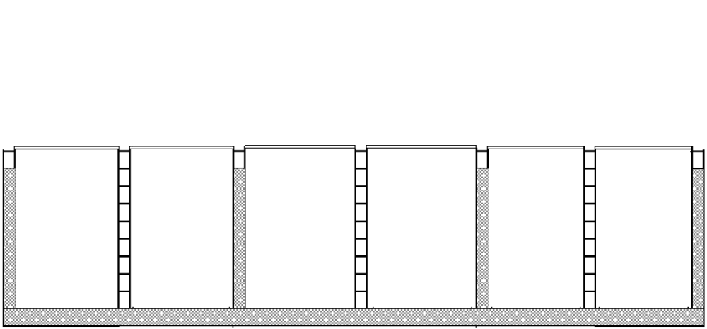 |   |   | *T_BAL*^1) |   | All ballast tanks full |   |   | - |   | SWBM in ballast condition^2) |   | ≤100% | HSM-2 HSA-2 FSM-2 BSR-1P BSR-2P BSP-1P BSP-2P |
    | F1^3) |   |   |   | *T_SC* |   | Max. 40 ft stack weight All tanks empty |   |   | Max. 40 ft stack weight |   | 100% (Hog.) |   | ≤100% | HSM-2 HSA-2 FSM-2 BSR-1P BSR-2P BSP-1P BSP-2P |
    | F2^3) |   |   |   | *T_SC* |   | 55% of Max. 40 ft stack weight not exceeding 16.5 t/FEU All tanks empty |   |   | 90% of Max. 40 ft stack weight not exceeding 17 t/FEU |   | 100% (Hog.) |   | ≤100% | HSM-2 HSA-2 FSM-2 BSR-1P BSR-2P BSP-1P BSP-2P |
    | F3^3) |   |   |   | 0.9*T_SC* |   | Max. 20 ft stack weight All tanks empty |   |   | Max. 20 ft stack weight, if mixed stowage is applicable, Max. 20 ft + 40 ft stack weight |   | 100% (Sag. or Min. Hog.) |   | ≤100% | HSM-1 HSA-1 FSM-1 BSR-1P BSR-2P BSP-1P BSP-2P |
    | F4^3) |   |   |   | 0.9*T_SC* |   | 55% of Max. 40 ft stack weight not exceeding 16.5 t/FEU All tanks empty |   |   | Max. 20 ft stack weight, if mixed stowage is applicable, Max. 20 ft + 40 ft stack weight |   | 100% (Sag. or Min. Hog.) |   | ≤100% | HSM-1 HSA-1 FSM-1 BSR-1P BSR-2P BSP-1P BSP-2P |
    | F5 |   |   |   | *T_SC* |   | Max. 40 ft stack weight All tanks empty |   |   | Max. 40 ft stack weight |   | 100% (Hog.) |   | ≤100% | HSM-2 HSA-2 FSM-2 |
    | F6 |   |   |   | *T_SC* |   | Max. 40 ft stack weight All tanks empty |   |   | Max. 40 ft stack weight |   | 100% (Hog.) |   | ≤100% | HSM-2 HSA-2 FSM-2 |
    | F7^3) | 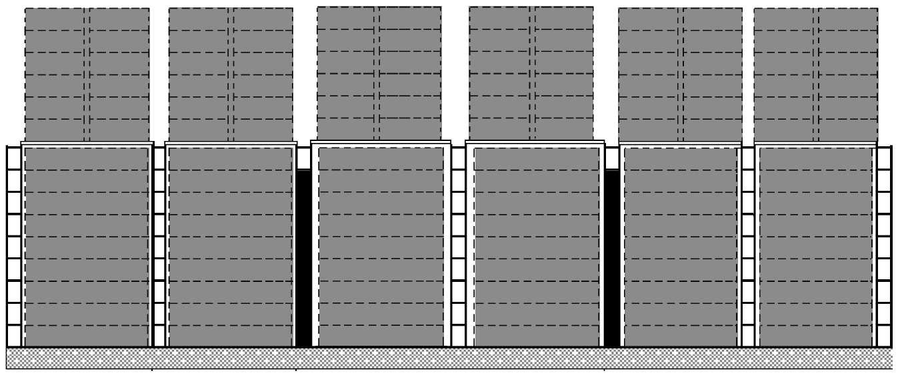 |   |   | *T_SC* |   | Max. 40 ft stack weight All fuel oil tanks full All ballast tanks full |   |   | Max. 20 ft stack weight, if mixed stowage is applicable, Max. 20 ft + 40 ft stack weight |   | 100% (Sag. or Min. Hog.) |   | ≤100% | HSM-1 HSA-1 FSM-1 BSR-1P BSR-2P BSP-1P BSP-2P |
    | Flooded condition |   |   |   |   |   |   |   |   |   |   |   |   |   |   |
    | A1^4) | 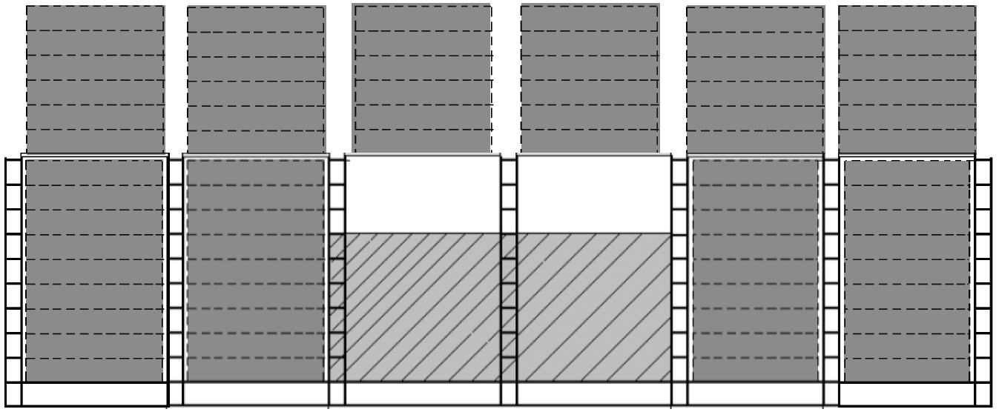 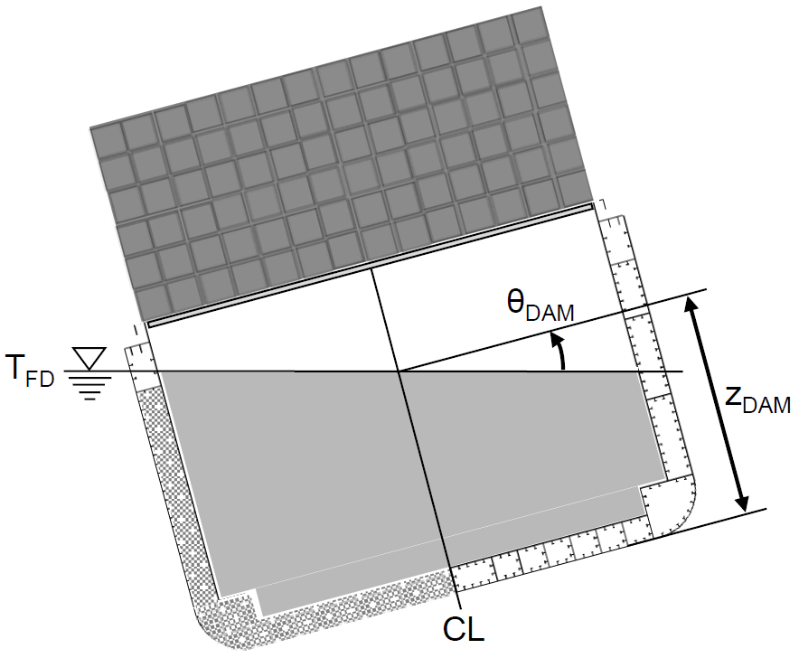 |   |   | *T_FD* |   | Centre: flooded Adjacent: Max. 40 ft stack weight All ballast tanks full at inclined side |   |   | Max. 40 ft stack weight |   | 100% (Sag. or Min. Hog.) |   | - | Static^5) |
    |  |   | heavy cargo |  |   | light cargo |   |  | ballast tank |   |  |   | fuel oil tank |   |   |
    | ^1) Minimum ballast draught corresponding to the ballast departure loading condition from loading manual. ^2) Still water bending moment corresponding to the ballast departure loading condition from loading manual. ^3) For asymmetrical structures BSR-1S, BSR-2S, BSP-1S and BSP-2S shall be investigated additionally. ^4) With deepest equilibrium waterline $T _{FD}$ in a heeled damage condition where the considered hold is one of the flooded compartments. Although this is a typical scenario with two or three flooded holds, in the FE-analysis only the center cargo hold is flooded. ^5) Heel condition shall be considered at least for inner pressure in the flooding cargo hold, for outer pressure on the shell and for container forces, base on design $z _{dam}$ and $\theta _{dam}$ as designed in **Sec 6, [1.4.1]** |   |   |   |   |   |   |   |   |   |   |   |   |   |   |

    | No. | Loading Pattern |   |   |   | Still Water Loads |   |   |   |   |   |   |   |   | Dynamic Load Cases |
    | --- | --- | --- | --- | --- | --- | --- | --- | --- | --- | --- | --- | --- | --- | --- |
    | No. | Loading Pattern |   |   |   | Draught | Container Load |   |   |   |   | % of perm. SWBM |   | % of perm. SWSF | Midship cargo region |
    | No. | Loading Pattern |   |   |   | Draught | In hold |   |   | On deck |   | % of perm. SWBM |   | % of perm. SWSF | Midship cargo region |
    | Seagoing conditions |   |   |   |   |   |   |   |   |   |   |   |   |   |   |
    | OF1 |   |   |   |   | *T_SC* | Max. 40 ft stack weight All ballast tanks empty All fuel oil tanks full |   |   | Max. 40 ft stack weight |   | 100% (Sag. or Min. Hog.) |   | ≤100% | HSM-1 HSA-1 FSM-1 BSR-1P BSR-2P BSP-1P BSP-2P |
    | OF2 |   |   |   |   | *T_SC* | Max. 40 ft stack weight All ballast tanks empty Relevant fuel oil tanks are full and empty |   |   | Max. 40 ft stack weight |   | 100% (Sag. or Min. Hog.) |   | ≤100% | HSM-1 HSA-1 FSM-1 BSR-1P BSR-2P BSP-1P BSP-2P |
    | OF3 |   |   |   |   | *T_SC* | Max. 40 ft stack weight All ballast tanks empty Relevant fuel oil tanks are full and empty |   |   | Max. 40 ft stack weight |   | 100% (Sag. or Min. Hog.) |   | ≤100% | HSM-1 HSA-1 FSM-1 BSR-1P BSR-2P BSP-1P BSP-2P |
    | OF4 |   |   |   |   | *T_SC* | 55% of Max. 40 ft stack weight not exceeding 16.5 t/FEU All ballast tanks empty All fuel oil tanks empty |   |   | 90% of Max. 40 ft stack weight not exceeding 17 t/FEU |   | 100% (Hog.) |   | ≤100% | HSM-2 HSA-2 FSM-2 |
    | OF5 | 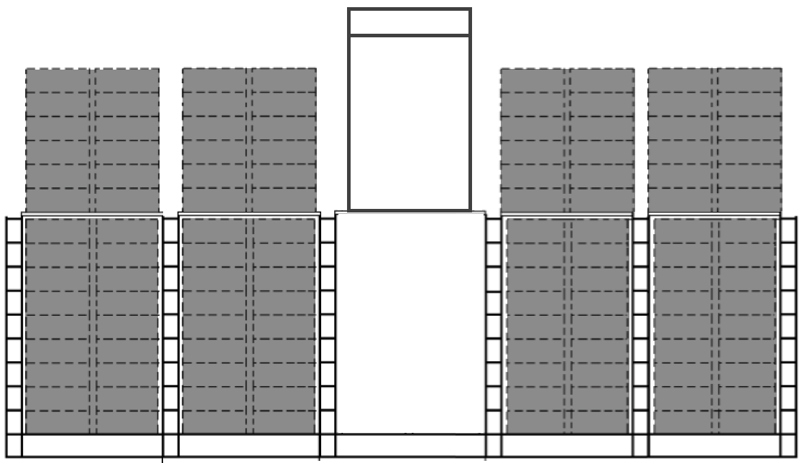 |   |   |   | 0.9*T_SC* | Max 20 ft stack weight, All ballast tanks empty All fuel oil tanks empty |   |   | Max. 20 ft stack weight, if mixed stowage is applicable, Max. 20 ft + 40 ft stack weight |   | 100% (Sag. or Min. Hog.) |   | ≤100% | HSM-1 HSA-1 FSM-1 |
    | Ballast conditions |   |   |   |   |   |   |   |   |   |   |   |   |   |   |
    | OB1 | 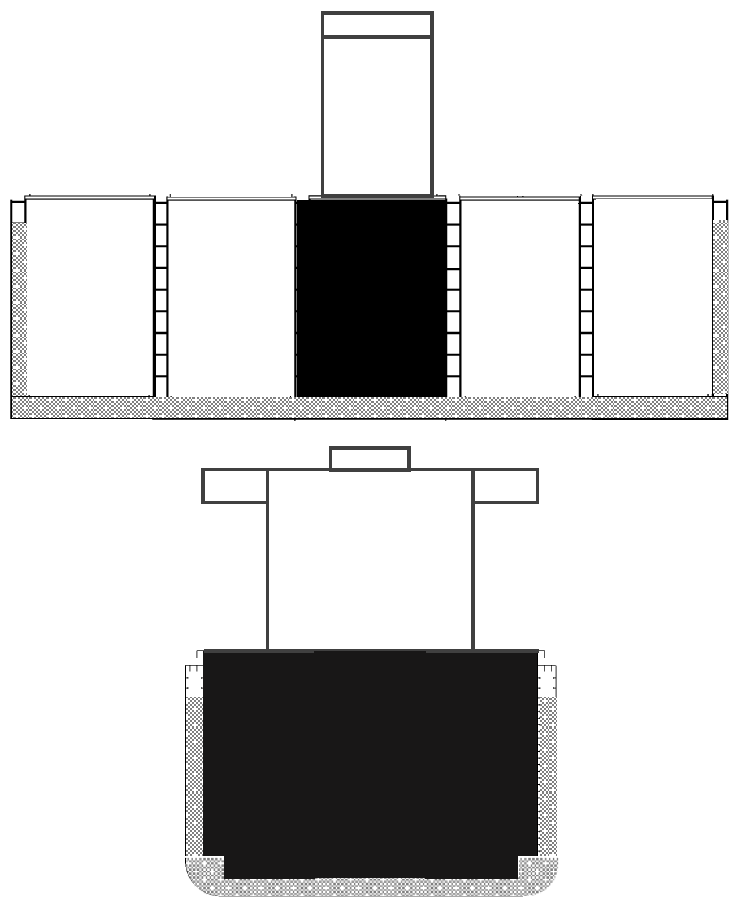 |   |   |   | *T_BAL*^1) | All fuel oil tanks full All ballast tanks full All container bays empty |   |   | All container bays are empty |   | SWBM in ballast condition^2) |   | ≤100% | HSM-1 HSA-1 FSM-1 |
    | OB2 |   |   |   |   | *T_BAL*^1) | Relevant fuel oil tanks are full and empty All ballast tanks full All container bays empty |   |   | All container bays are empty |   | SWBM in ballast condition^2) |   | ≤100% | HSM-1 HSA-1 FSM-1 |
    | OB3 |   |   |   |   | *T_BAL*^1) | Relevant fuel oil tanks are full and empty All ballast tanks full All container bays empty |   |   | All container bays are empty |   | SWBM in ballast condition^2) |   | ≤100% | HSM-1 HSA-1 FSM-1 |
    | Testing conditions |   |   |   |   |   |   |   |   |   |   |   |   |   |   |
    | OT1 |   |   |   |   | *T_BAL*^1) | Fuel oil tanks filling is for tank test All fuel oil tanks full All ballast tanks empty All container bays empty |   |   | All container bays are empty |   | SWBM in ballast condition^2) |   | ≤100% | Static |
    | OT2 |   |   |   |   | *T_BAL*^1) | Fuel oil tanks filling is for tank test Relevant fuel oil tanks are full and empty All ballast tanks empty All container bays empty |   |   | All container bays are empty |   | SWBM in ballast condition^2) |   | ≤100% | Static |
    | OT3 |   |   |   |   | *T_BAL*^1) | Fuel oil tanks filling is for tank test Relevant fuel oil tanks are full and empty All ballast tanks empty All container bays empty |   |   | All container bays are empty |   | SWBM in ballast condition^2) |   | ≤100% | Static |
    |  |   | heavy cargo |  | light cargo |   |   |  | ballast tank |   |  |   | fuel oil tank |   |   |
    | ^1) Minimum ballast draught corresponding to the ballast departure loading condition from loading manual. ^2) Still water bending moment corresponding to the ballast departure loading condition from loading manual. |   |   |   |   |   |   |   |   |   |   |   |   |   |   |

    | No. | Loading Pattern |   |   |   | Still Water Loads |   |   |   |   |   |   |   |   |   |   | Dynamic Load Cases |
    | --- | --- | --- | --- | --- | --- | --- | --- | --- | --- | --- | --- | --- | --- | --- | --- | --- |
    | No. | Loading Pattern |   |   |   | Draught | Container Load |   |   |   |   |   | % of perm. SWBM |   | % of perm. SWSF |   | Midship cargo region |
    | No. | Loading Pattern |   |   |   | Draught | In hold |   |   | On deck |   |   | % of perm. SWBM |   | % of perm. SWSF |   | Midship cargo region |
    | Seagoing conditions |   |   |   |   |   |   |   |   |   |   |   |   |   |   |   |   |
    | GF1 | 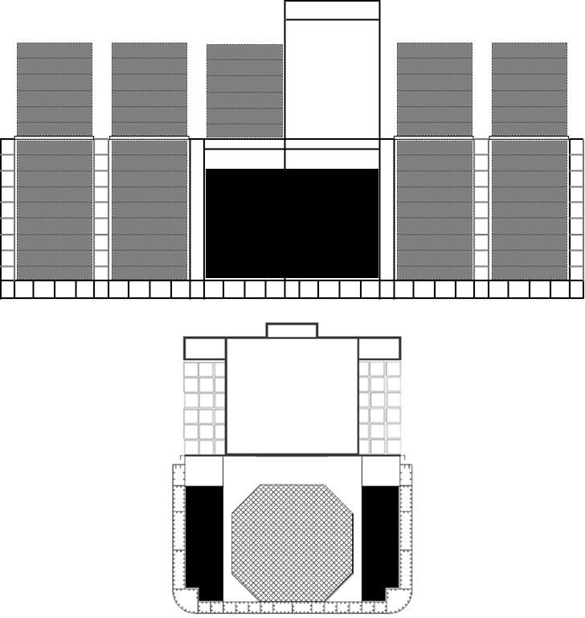 |   |   |   | *T_SC* | Max. 40 ft stack weight All ballast tanks empty All fuel tanks full |   |   | Max. 40 ft stack weight |   |   | 100% (Sag. or Min. Hog.) |   | ≤100% |   | HSM-1 HSA-1 FSM-1 BSR-1P BSR-2P BSP-1P BSP-2P |
    | GF2 | 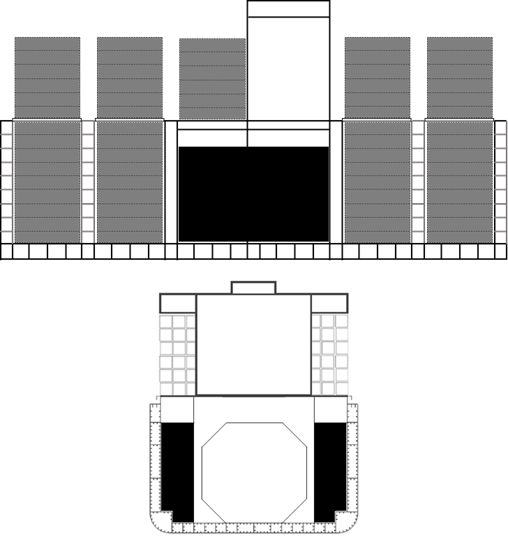 |   |   |   | *T_SC* | Max. 40 ft stack weight All ballast tanks empty Fuel oil tanks full Liquefied natural gas fuel tank empty |   |   | Max. 40 ft stack weight |   |   | 100% (Sag. or Min. Hog.) |   | ≤100% |   | HSM-1 HSA-1 FSM-1 BSR-1P BSR-2P BSP-1P BSP-2P |
    | GF3 |  |   |   |   | *T_SC* | Max. 40 ft stack weight All ballast tanks empty Fuel oil tanks empty Liquefied natural gas fuel tank full |   |   | Max. 40 ft stack weight |   |   | 100% (Sag. or Min. Hog.) |   | ≤100% |   | HSM-1 HSA-1 FSM-1 BSR-1P BSR-2P BSP-1P BSP-2P |
    | GF3 -IGF | 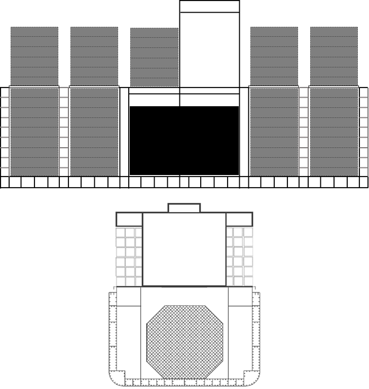 |   |   |   | *T_SC* | Max. 40 ft stack weight All ballast tanks empty Fuel oil tanks empty Liquefied natural gas fuel tank full |   |   | Max. 40 ft stack weight |   |   | ≤100% |   | ≤100% |   | Static Pressure by IGF with heel angle, $\theta _{\beta } \leq 30 {}^{\circ}$ |
    | GF4 | 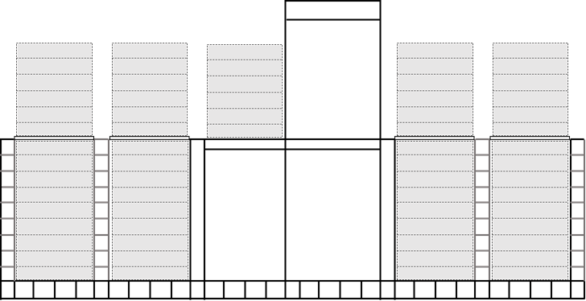 |   |   |   | *T_SC* | 55% of Max. 40 ft stack weight not exceeding 16.5 t/FEU All ballast tanks empty All fuel tanks empty |   |   | 90% of Max. 40 ft stack weight not exceeding 17 t/FEU |   |   | 100% (Hog.) |   | ≤100% |   | HSM-2 HSA-2 FSM-2 |
    | GF5 | 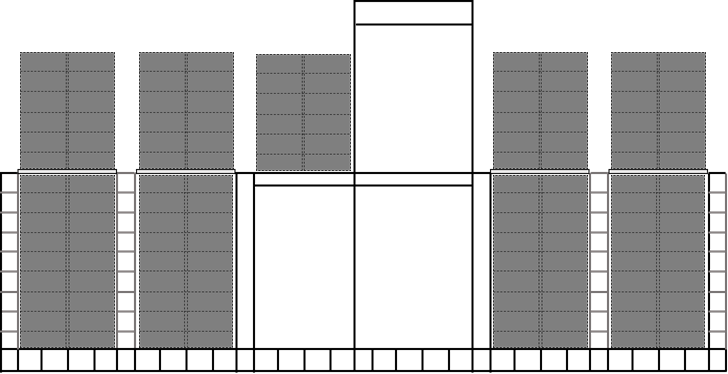 |   |   |   | 0.9*T_SC* | Max 20 ft stack weight, All ballast tanks empty All fuel tanks empty |   |   | Max. 20 ft stack weight, if mixed stowage is applicable, Max. 20 ft + 40 ft stack weight |   |   | 100% (Sag. or Min.Hog.) |   | ≤100% |   | HSM-1 HSA-1 FSM-1 |
    | Ballast conditions |   |   |   |   |   |   |   |   |   |   |   |   |   |   |   |   |
    | GB1 | 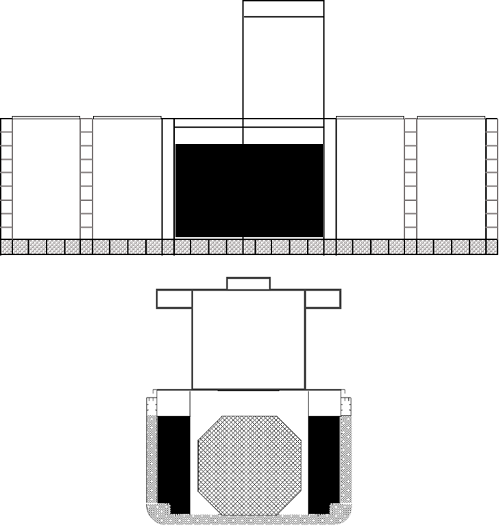 |   |   |   | *T_BAL*^1) | All container bays empty All ballast tanks full All fuel tanks full |   |   | All container bays are empty |   |   | SWBM in ballast condition^2) |   | ≤100% |   | HSM-1 HSA-1 FSM-1 |
    | GB2 | 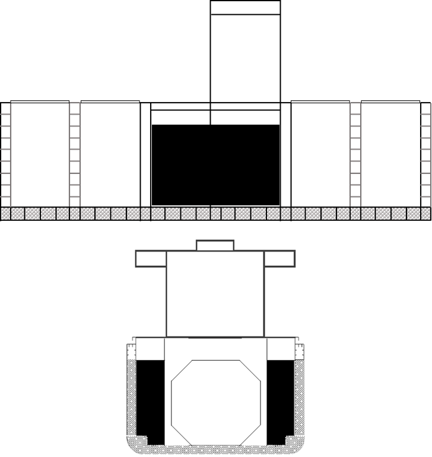 |   |   |   | *T_BAL*^1) | All container bays empty All ballast tanks full Fuel oil tanks full Liquefied natural gas fuel tank empty |   |   | All container bays are empty |   |   | SWBM in ballast condition^2) |   | ≤100% |   | HSM-1 HSA-1 FSM-1 |
    | GB3 | 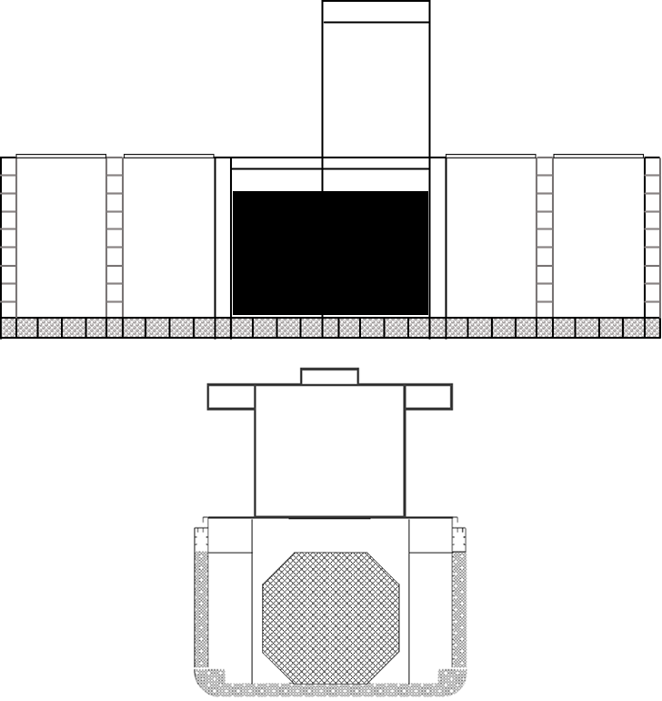 |   |   |   | *T_BAL*^1) | All container bays empty All ballast tanks full Fuel oil tanks empty Liquefied natural gas fuel tank full |   |   | All container bays are empty |   |   | SWBM in ballast condition^2) |   | ≤100% |   | HSM-1 HSA-1 FSM-1 |
    | Accidental condition |   |   |   |   |   |   |   |   |   |   |   |   |   |   |   |   |
    | A1 |  |   |   |   | *T_SC* | Max. 40 ft stack weight All ballast tanks empty Fuel oil tanks empty Liquefied natural gas fuel tank full |   |   | Max. 40 ft stack weight |   |   | ≤100% |   | ≤100% |   | Static Forward a_x=0.5g Aftward a_x=0.25g |
    | Testing condition |   |   |   |   |   |   |   |   |   |   |   |   |   |   |   |   |
    | GT1 | 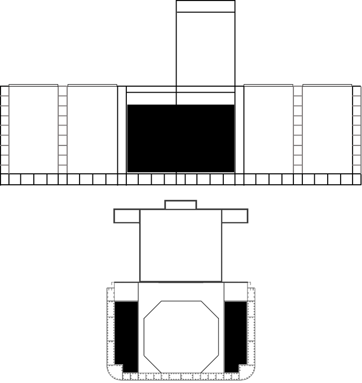 |   |   |   | *T_BAL*^1) | All container bays empty All ballast tanks empty Fuel oil tanks full Liquefied natural gas fuel tank empty |   |   | All container bays are empty |   |   | SWBM in ballast condition^2) |   | ≤100% |   | Static |
    |  |   | heavy cargo |  | light cargo |   |   |  | ballast tank |   |  | fuel oil tank |   |   |   | LNG fuel tank |   |
    | ^1) Minimum ballast draught corresponding to the ballast departure loading condition from loading manual. ^2) Still water bending moment corresponding to the ballast departure loading condition from loading manual. |   |   |   |   |   |   |   |   |   |   |   |   |   |   |   |   |
    | 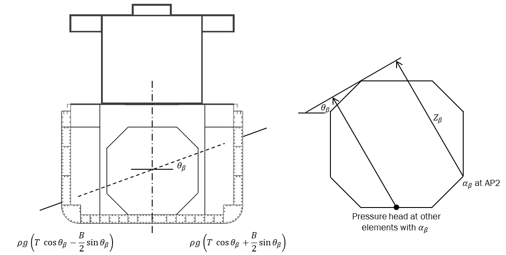 |   |   |   |   |   |   |   |   |   |   |   |   |   |   |   |   |

#### 3. Standard loading conditions for fatigue assessment

- **3.1** **General**
  - **3.1.1** The standard loading conditions to be applied for fatigue assessment as required in **Ch 9, Sec 1, [6.2],** are defined in **Table 4**.

    | No | Description | Loading Pattern | Still Water Loads |   |   | Dynamic Load Cases |
    | --- | --- | --- | --- | --- | --- | --- |
    | No | Description | Loading Pattern | Draught | % of perm. SWBM | % of perm. SWSF | Midship cargo region |
    | FL-1 | Full load (all ballast tanks full) |   | *T_Design* (but not less than 0.8*T_SC*) | 90% (Hog.) | - | HSM-1 HSM-2 FSM-1 FSM-2 BSR-1P BSR-2P BSR-1S BSR-2S BSP-1P BSP-2P BSP-1S BSP-2S |
    | FL-2 | Full load (all ballast tanks empty) |   | *T_Design* (but not less than 0.8*T_SC*) | 90% (Hog.) | - | HSM-1 HSM-2 FSM-1 FSM-2 BSR-1P BSR-2P BSR-1S BSR-2S BSP-1P BSP-2P BSP-1S BSP-2S |
    | FL-3 | Full load (all ballast tanks full) |   | *T_Design* (but not less than 0.8*T_SC*) | 100% (Sag. or Min. Hog.)^1) | - | HSM-1 HSM-2 FSM-1 FSM-2 BSR-1P BSR-2P BSR-1S BSR-2S BSP-1P BSP-2P BSP-1S BSP-2S |
    | FL-4 | Full load (all ballast tanks empty) |   | *T_Design* (but not less than 0.8*T_SC*) | 100% (Sag. or Min. Hog.)^1) | - | HSM-1 HSM-2 FSM-1 FSM-2 BSR-1P BSR-2P BSR-1S BSR-2S BSP-1P BSP-2P BSP-1S BSP-2S |
    | ^1) $M _{sw, \min}$ is a minimum design hogging moment taken from the loading manual. If $M _{sw, \min}$ is larger (hogging positive) than 0.1 $M _{sw-h}$, then $M _{sw, \min}$ shall replace 0.1 $M _{sw-h}$ |   |   |   |   |   |   |

    
