# PART 14 Structural Rules for Container Ships

> RULES FOR CLASSIFICATION OF STEEL SHIPS / RA-14-E / 2025 / EN / Rules

## Chapter 5 Hull Girder Strength

### Section 1 Hull Girder Yield and Buckling Strength

**Symbols**
For symbols not defined in this section, refer to **Ch 1, Sec 4.**
$M _{sw}$ : Permissible hogging and sagging vertical still water bending moment in seagoing operation, in kNm, at the hull transverse section considered, defined in **Ch 4, Sec 4, [2.2.2].**
$M _{sw-p}$ : Permissible hogging and sagging vertical still water bending moment for harbour/sheltered water operation, in kNm, at the hull transverse section considered, as defined in **Ch 4, Sec 4, [2.2.3].**
$M _{sw-f}$ : Permissible hogging and sagging vertical still water bending moment in flooded condition at sea, in kNm, at the hull transverse section considered, as defined in **Ch 4, Sec 4, [2.2.4].**
$M _{wv}$ : Vertical wave bending moment in seagoing condition, in kNm, in seagoing operation at the hull transverse section considered, defined in **Ch 4, Sec 4, [3.2.1].**
$M _{wh}$ : Horizontal wave bending moment, in kNm, at the hull transverse section considered, defined in **Ch 4, Sec 4, [3.3.1].**
$Q _{sw}$ : Permissible positive or negative still water shear force for seagoing operation, in kN, at the hull transverse section considered, as defined in **Ch 4, Sec 4, [2.3.1].**
$Q _{sw-p}$ : Permissible positive or negative still water shear force for harbour/sheltered operation, in kN, at the hull transverse section considered, as defined in **Ch 4, Sec 4, [2.3.2].**
$Q _{wv}$ : Vertical wave shear force in seagoing condition, in kN, at the hull transverse section considered, defined in **Ch 4, Sec 4, [3.3].**
$Q _{wh}$ : Horizontal wave shear force in seagoing condition, in kN, at the hull transverse section considered, defined in **Ch 4, Sec 4, [3.3].**
$x$ : *X* coordinate, in m, of the calculation point with respect to the reference coordinate system defined in **Ch 1, Sec 4, [3.5].**
$V _{D}$ : Vertical distance to the equivalent deck line, in m, as defined in **[1.4.3].**
$z$ : $Z$ coordinate, in m, of the calculation point with respect to the reference coordinate system defined in **Ch 1, Sec 4, [3.5].**
$z _{n}$ : $Z$ coordinate, in m, of horizontal neutral axis of the hull transverse section with net scantling defined in **[1.2],** with respect to the reference coordinate system defined in **Ch 1, Sec 4, [3.5].**
$I _{y-n50}$ : Net moment of inertia, in m^4, of the hull transverse section about its horizontal neutral axis, to be calculated according to **[1.5].**
$I _{Z-n50}$ : Net moment of inertia, in m^4, of the hull transverse section about its vertical neutral axis, to be calculated according to **[1.5].**
$Z _{A-n50}$ : Net section modulus, in m^3, at any point of the hull transverse section, to be calculated according **[1.4.1].**
$C _{w}$ : Wave coefficient defined in **Ch 4, Sec 4.**
$\rho$ : Seawater density, taken equal to 1.025 t/m^3.

#### 1. Strength characteristics of hull girder transverse sections

- **1.1** **General**
  - **1.1.1** This section specifies the criteria for calculating the hull girder strength characteristics to be used for the checks in **[2]** to **[3]**, in association with the hull girder loads specified in **Ch 4, Sec 4.**
- **1.2** **Hull girder transverse sections**
  - **1.2.1** **General**
    Hull girder transverse sections are to be considered as being constituted by the members contributing to the hull girder longitudinal strength, taking into account the requirements in **[1.2.2]** to **[1.2.12].**
  - **1.2.2** **Net scantling**
    The members contributing to the hull girder longitudinal strength are to be considered using the net offered scantlings based on gross offered thickness reduced by 0.5$0.5t_c$, as defined in **Ch 3, Sec 3,** when the hull girder strength characteristics are used for the hull girder yielding check according to **[2]** to **[3].**
  - **1.2.3** **Structural members not contributing to hull girder sectional area**
    The following members are not to be considered in the calculation as they are considered not contributing to the hull girder sectional area:
    • Superstructures which do not form a strength deck.
    • Deckhouses.
    • Bulwarks and gutter plates.
    • Bilge keels.
    • Sniped or non-continuous longitudinal stiffeners.
    • Non-continuous hatch coamings.
  - **1.2.4** **Continuous trunks and longitudinal continuous hatch coamings**
    Continuous trunks and longitudinal continuous hatch coamings may be included in the hull girder transverse sections, provided that they are effectively supported by longitudinal bulkheads or primary supporting members.
  - **1.2.5** **Longitudinal stiffeners or girders welded above the strength deck**
    Longitudinal stiffeners or girders welded above the strength deck, including the deck of any trunk fitted as specified in **[1.2.4]**, are to be included in the hull girder transverse sections.
  - **1.2.6** **Longitudinal girders between hatchways**
    Where longitudinal girders are between hatch ways, the sectional area that can be included in the hull girder transverse sections is obtained, in m^2, from the following formula:
    $A _{eff} =A _{LG} \xi$
    where:
    $A _{LG}$ : Sectional area, in m^2, of longitudinal girders
    $\xi$ : Ratio of inclusion of members effective for longitudinal strength as defined in **Table 1**.

    | No of holds | 2 |   |   | 3 |   |   |
    | --- | --- | --- | --- | --- | --- | --- |
    | $\ell/L$ $\xi$ | 0.10 | 0.20 | 0.30 | 0.10 | 0.15 | 0.20 |
    | 0.0 | 0.96 | 0.85 | 0.70 | 0.96 | 0.91 | 0.85 |
    | 0.5 | 0.65 | 0.57 | 0.48 | 0.89 | 0.80 | 0.69 |
    | 1.0 | 0.48 | 0.43 | 0.36 | 0.83 | 0.73 | 0.62 |
    | 2.0 | 0.32 | 0.29 | 0.25 | 0.73 | 0.63 | 0.53 |
    | 3.0 | 0.24 | 0.22 | 0.17 | 0.65 | 0.57 | 0.47 |
    | 4.0 | 0.19 | 0.17 | 0.14 | 0.59 | 0.51 | 0.43 |
    | 5.0 | 0.16 | 0.14 | 0.12 | 0.53 | 0.47 | 0.39 |
    | Note: 1. $\xi$ is to be in accordance with followings $\xi = \frac{ab ^{3}}{literI _{c}} \left\{ \frac{1+2 \mu}{2(2+ \mu )} \times 10 ^{4} +2.6 \frac{I _{c}}{a _{c} b ^{2}} \right\}$ Where: $I _{c}$ : Moment of inertia, in cm^4, of deck hatches, including hatch coaming $a _{c}$ : Effective shear area, in cm^2, of deck between hatches $a$ : Sectional area, in cm^2, of continuous deck between hatches (one side) $\ell$ : length, in m, of hatch $\mu$ : coefficient as specified in **Figure 1** $b$ : breadth, in m, of hatch opening as specified in **Figure 1** 2. $\xi$ or $\ell/L$ may obtained from the interpolation. 3. When the value of $\xi$ is over 5.0, it may be obtained extrapolation. |   |   |   |   |   |   |

    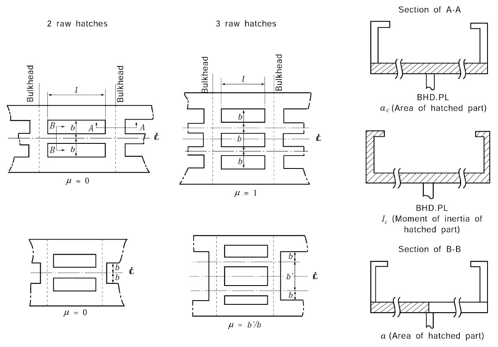
    Figure : Coefficient (#eqnID-38), length (#eqnID-39) and breadth (#eqnID-40) of hatch
  - **1.2.7** **Members in materials other than steel**
    Where a member contributing to the longitudinal strength is made in material other than steel with a Young’s modulus, *E* equal to 206,000 N/mm^2, the steel equivalent sectional area that may be included in hull girder transverse section is obtained, in m^2, from the following formula:
    $A _{SE-n50} = \frac{E}{2.06 \times 10 ^{5}} A _{M-n50}$
    where:
    $A _{M-n50}$ : Sectional area, in m^2, of the member under consideration.
  - **1.2.8** **Definitions of openings**
    The following definitions of opening are to be applied:
    • Elliptical openings exceeding 2.5 m in length or 1.2 m in breadth.
    • Circular openings exceeding 0.9 m in diameter.
    - **a)** Large openings are:
    - **b)** Small openings (i.e. drain holes, etc) are openings that are not large ones.
    - **c)** Manholes.
    - **d)** Isolated openings are openings spaced not less than 1.0 m apart in the ship’s transverse / vertical direction.
  - **1.2.9** **Large openings, manholes and nearby small openings**
    Large openings and manholes are to be deducted from the sectional area used in hull girder moment of inertia and section modulus. When small openings are spaced less than 1 m apart in the ship’s transverse/vertical direction to large openings or manholes, the total breadth of them is to be deducted from the sectional area. Additionally, isolated small openings which do not comply with the arrangement requirements given in **Ch 3, Sec 6, [6.3.2]** are to be deducted from the sectional areas included in the hull girder transverse sections.

#### 1.2.10

**Isolated small openings**
Isolated small openings in one transverse section in the strength deck or bottom area need not be deducted from the sectional areas included in the hull girder transverse sections, provided that:
$\Sigma b _{s} \leq 0.06(B- \Sigma b)$
where:
$\Sigma b _{s}$ : Total breadth of isolated small openings, in m, in the strength deck or bottom area at the transverse section considered, determined as indicated in **Figure 2,** not deducted from the section area as per **[1.2.9].**
$\Sigma b$ : Total breadth of large openings, in m, at the transverse section considered, determined as indicated in **Figure 2,** deducted from the section area as defined in **[1.2.9].**
Where the total breadth of isolated small openings $\Sigma b _{s}$ does not fulfill the above criteria, only the excess of breadth is to be deducted from the sectional areas included in the hull girder transverse sections.

#### 1.2.11

**Lightening holes, draining holes and single scallops**
Lightening holes, draining holes and single scallops in longitudinals need not be deducted if their height is less than 0.25 $0.25h _{w}$, where $h _{w}$ is the web height of the longitudinals, in mm. Otherwise, the excess is to be deducted from the sectional area or compensated.

#### 1.2.12

**Non-continuous decks and longitudinal bulkheads**
When calculating the effective area in way of non-continuous decks and longitudinal bulkheads, the effective area is to be taken as shown in **Figure 3.** The shadow area, which indicates the ineffective area, is obtained by drawing two tangent lines with an angle of 15 deg to the longitudinal axis of the ship.
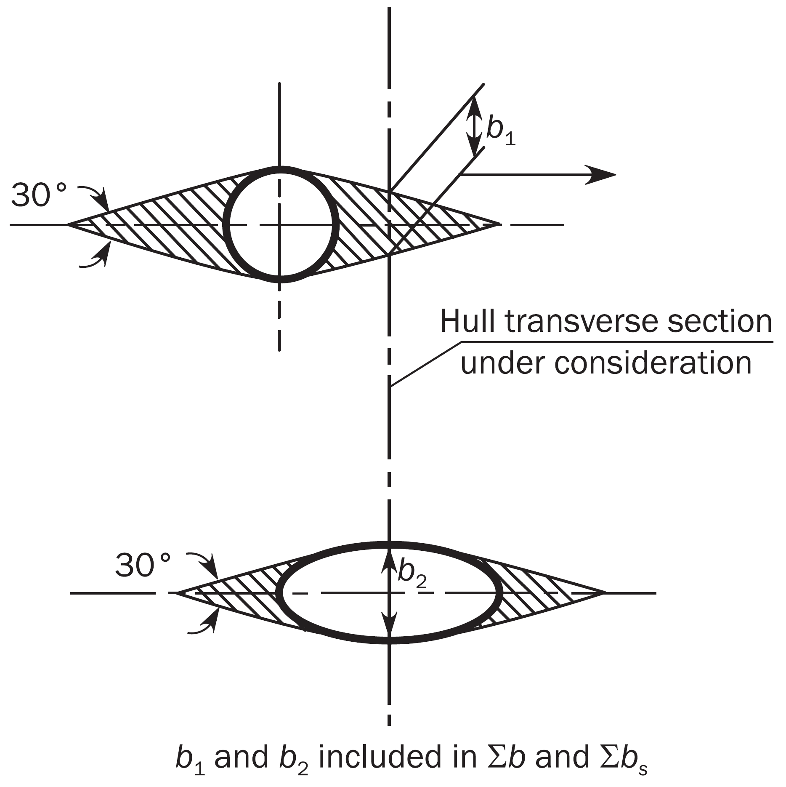
Figure : Calculation of #eqnID-49 and #eqnID-50
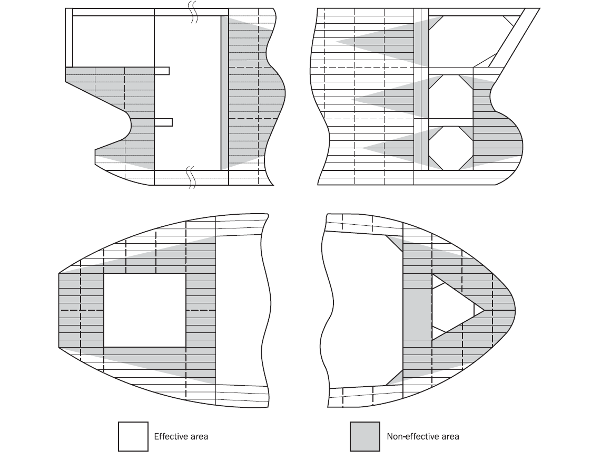
Figure : Effective area in way of non-continuous decks and bulkheads

- **1.3** **Strength deck**
  - **1.3.1** The strength deck is, in general, the uppermost continuous deck. In the case of a superstructure or deckhouses contributing to the longitudinal strength, the strength deck is the deck of the superstructure or the deck of the uppermost deckhouse.
- **1.4** **Section modulus**
  - **1.4.1** **Section modulus at any point located below** ***z******_D***
    The section modulus at any point of a hull transverse section is obtained, in m^3, from the following formula:
    $Z _{A-n50} = \frac{I _{y-n50}}{|z-z _{n} |}$
  - **1.4.2** **Section modulus at deck**
    The section modulus at any point of deck and effective longitudinal members is obtained, in m^3, from the following formula:
    $Z _{D-n50} = \frac{I _{y-n50}}{V _{D}}$
    Where,
    $(z _{D} -z _{n} )/0.9$ : Vertical distance of the equivalent deck line, in mm taken equal to:
    • When no effective longitudinal members specified in **[1.2.4]** and **[1.2.5]** are positioned above a line extending from strength deck at side to a position $V _{D} =z _{D} -z _{n}$ from the neutral axis at the centreline.
    $(z _{D} -z _{n} )/0.9$
    • When effective longitudinal members as specified in **[1.2.4]** and **[1.2.5]** are positioned above a line extending from strength deck at side to a position $V _{D} =(z _{T} -z _{n} ) \left( 0.9+0.2 \frac{y _{T}}{B} \right) \geq z _{D} -z _{n}$ from the neutral axis at the centreline
    $z _{D}$
    $y _{T}$ : *Z* coordinate, in m, of strength deck at side, defined in **[1.3]**.
    $z _{T}$, $V _{D}$ : *Y* and *Z* coordinates, in m, of the top of continuous trunk, hatch coaming, longitudinal stiffeners or girders, to be measured for the point which maximises the value of $I _{y-n50}$.
- **1.5** **Moments of inertia**
  - **1.5.1** The net moment of inertia, $I _{z-n50}$ and $z _{D}$, in m^4, are those, calculated about the horizontal and vertical neutral axes, respectively, of the hull transverse sections defined in **[1.2].**

#### 2. Hull girder stress

- **2.1** **Normal stress**
  - **2.1.1** **Normal stress induced by vertical still water bending moment**
    The normal stress induced, at any point, by vertical still water bending moments is to be obtained, in N/mm^2, as defined in **Table 2**.

    |   | At any point located below $z _{D}$ | At any point located above $z _{D}$ |
    | --- | --- | --- |
    | Seagoing condition | $\sigma _{sw} = \frac{M _{sw}}{I _{y-n50}} (z-z _{n} ) \times 10 ^{-3}$ | $\sigma _{sw} = \frac{M _{sw}}{I _{y-n50}} V _{D} \times 10 ^{-3}$ |
    | Harbour/sheltered condition | $\sigma _{sw-p} = \frac{M _{sw-p}}{I _{y-n50}} (z-z _{n} ) \times 10 ^{-3}$ | $\sigma _{sw-p} = \frac{M _{sw-p}}{I _{y-n50}} V _{D} \times 10 ^{-3}$ |
  - **2.1.2** **Normal stress induced by vertical wave bending moment**
    The normal stress induced, at any point, by vertical wave bending moments is to be obtained, in N/mm^2, from the following formula:
    $\sigma _{wh} =- \frac{M _{wh}}{I _{z-n50}} y \times 10 ^{-3}$
  - **2.1.3** **Normal stress induced by horizontal wave bending moment**
    The normal stress induced, at any point, by horizontal wave bending moments is to be obtained, in N/mm^2, from the following formula:
    $\sigma _{wt} =0.6C _{L} C _{z} C _{A} C _{F} C _{I \omega M} C _{JM} C _{I \omega A} C _{I \omega F} C _{JF} C _{\omega A} C _{\omega F} C _{AA} C _{AF} \frac{M _{wt \max}}{I _{\omega M}} \frac{- \omega}{\omega _{Nominal}} \sigma _{Nominal}$
  - **2.1.4** **Normal stress induced by wave torsional moment (Conventional type)**
    When a direct calculation using finite element analysis is not available, the normal stress induced by wave torsional moment may be determined as specified below. The normal stress induced, at any point, by wave torsional moments is to be obtained, in N/mm^2, from the following formula:
    $C _{L}$
    Where,
    $C _{L} = \frac{L}{L+900} \left[ \frac{-0.008(L-100)}{x _{F} -x _{A}} \left( x-x _{A} \right) +0.008(L-100)+10 \right]$ : Coefficient taken equal to:
    $C _{z}$
    $C _{z} =0.8$ : Coefficient taken equal to:
    $z<0.25D$ for $C _{z} =1.0$
    $z>0.75D$ for $x _{A}$
    $x _{F}$ : Distance between the aft end of the length and the aft edge of the hatch forward of the engine room front bulkhead on ships with cargo hatches, in m, see **Figure 4**.
    $I _{\omega M}$ : Distance between the aft end of the length and the forward edge of foremost cargo hold, in m, see **Figure 4**.
    $I _{\omega A}$ : Sectorial moment of inertia amidships, in m^6.
    $x _{A}$ : Sectorial moment of inertia at $I _{\omega F}$, in m^6.
    $x _{F}$ : Sectorial moment of inertia at $I _{\omega ,0.7L}$, in m^6.
    $I _{\omega N}$ : Sectorial moment of inertia at 0.7*L*, in m^6.
    $J _{M}$ : Nominal sectorial moment of inertia as defined in **Table 5.**
    $J _{A}$ : St. Venant's moment of inertia amidships, in m^4.
    $x _{A}$ : St. Venant's moment of inertia at $J _{F}$, in m^4.
    $x _{F}$ : St. Venant's moment of inertia at $J _{N}$, in m^4.
    $\omega$ : Nominal St. Venant's moment of inertia as defined in **Table 5.**
    $x$ : Warping function of the point being considered, in m^2, where $0.85L$ of considered point is between $x _{F}$ and $\omega _{Nomianl}$, absolute vale of warping function is not to be taken greater than $\omega _{M} /200$ ․ $\omega _{M}$.
    $\omega _{A}$ : Warping function amidships at the inboard edge (port side) of the strength deck plating, clear of the hatch corner, in m^2, see **Figure 4**.
    $x _{A}$ : Warping function at the inboard edge (port side) of the strength deck plating, clear of the hatch corner $\omega _{F}$, in m^2, see **Figure 4**.
    $x _{F}$ : Warping function at the inboard edge (port side) of the strength deck plating, clear of the hatch corner $\omega _{Nominal}$, in m^2, see **Figure 4**.
    $a$ : Nominal warping function as defined in **Table 15.**
    $a= \frac{I _{\omega ,0.7L}}{I _{\omega M}}$ : Ratio between sectorial moment of inertia at 0.7*L* and sectorial moment of inertia amidship, to be taken as:
    $A _{M}$
    $A _{A}$ : Cross section area amidships, in m^2.
    $x _{A}$ : Cross section area at $A _{F}$, in m^2.
    $x _{F}$ : Cross section area at $C _{A}$, in m^2.
    $x _{A}$ : Correction factor for $C _{F}$ as defined in **Table 3.**
    $x _{F}$ : Correction factor for $C _{I \omega M}$ as defined in **Table 4.**
    $I _{\omega M}$ : Correction factor for $C _{JM}$ as defined in **Table 6.**
    $J _{M}$ : Correction factor for $C _{I \omega A}$ as defined in **Table 7.**
    $I _{\omega A}$ : Correction factor for $C _{I \omega F}$ as defined in **Table 8.**
    $I _{\omega F}$ : Correction factor for $C _{JF}$ as defined in **Table 9.**
    $J _{F}$ : Correction factor for $C _{\omega A}$ as defined in **Table 10.**
    $\omega _{A}$ : Correction factor for $C _{\omega F}$ as defined in **Table 11.**
    $\omega _{F}$ : Correction factor for $C _{AA}$ as defined in **Table 12.**
    $A _{A}$ : Correction factor for $C _{AF}$ as defined in **Table 13.**
    $A _{F}$ : Correction factor for $M _{wt \max}$ as defined in **Table 14.**
    $0.25L$ : Wave torsional moment at $\sigma _{Nominal}$ as defined in **Ch 4, Sec 4, [3.6].**
    $\mathbf{{x _{A}}}$ : Nominal stress as defined in **Table 16.**
    Note 1: For intermediate value of x, correction factors, nominal stress and section property are to be obtained by linear interpolation.
    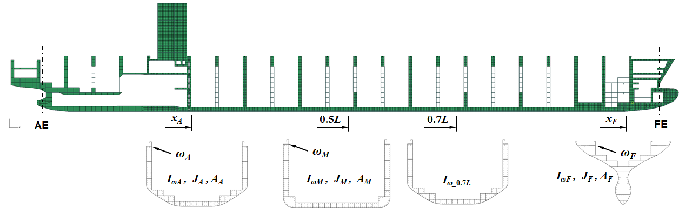
    Figure : Section Property – Conventional Type

    |   | $x _{A}$ | $0.5L$ | $0.7L$ | $0.85L$ | $x _{F}$ |
    | --- | --- | --- | --- | --- | --- |
    | $C _{A}$ | $1+3 \left( \frac{x _{A}}{L} -0.25 \right)$ | $1-4a \left( \frac{x _{A}}{L} -0.25 \right)$ | $1-4a \left( \frac{x _{A}}{L} -0.25 \right)$ | $1.0$ | $1.0$ |

    |   | $x _{A}$ | $0.5L$ | $0.7L$ | $0.85L$ | $x _{F}$ |
    | --- | --- | --- | --- | --- | --- |
    | $C _{F}$ | $1+ \left( 10a-8 \right) \left( \frac{x _{F}}{L} -0.95 \right)$ | $1+4 \left( \frac{x _{F}}{L} -0.95 \right)$ | $1+5 \left( \frac{x _{F}}{L} -0.95 \right)$ | $1-3 \left( \frac{x _{F}}{L} -0.95 \right)$ | $1.0$ |

    |   | *L* = 100 m | *L* = 150 m | *L* = 200 m | *L* = 250 m | *L* = 300 m | *L* = 350 m |
    | --- | --- | --- | --- | --- | --- | --- |
    | $I _{\omega N}$ | 7,500 | 10,000 | 50,000 | 100,000 | 200,000 | 300,000 |
    | $J _{N}$ | 4 | 5 | 7 | 10 | 15 | 20 |

    |   | $I _{\omega M} /I _{\omega N} \leq 1$ | $I _{\omega M} /I _{\omega N} >1$ |
    | --- | --- | --- |
    | $x _{A}$ | $\left[ -3 \left( \frac{I _{\omega M}}{I _{\omega N}} -1 \right) \left( \frac{x _{A}}{L} -0.25 \right) +1-0.24 \left( \frac{I _{\omega M}}{I _{\omega N}} -1 \right) \right]$ $\times \left[ -3.6 \left( \frac{I _{\omega M}}{I _{\omega N}} -1 \right) \left( \frac{x _{F}}{L} -0.95 \right) +1 \right]$ | $\left[ -2 \left( \frac{I _{\omega M}}{I _{\omega N}} -1 \right) \left( \frac{x _{A}}{L} -0.25 \right) +1-0.16 \left( \frac{I _{\omega M}}{I _{\omega N}} -1 \right) \right]$ $\times \left[ -3 \left( \frac{I _{\omega M}}{I _{\omega N}} -1 \right) \left( \frac{x _{F}}{L} -0.95 \right) +1 \right]$ |
    | $0.5L$ | $\left[ \left( \frac{I _{\omega M}}{I _{\omega N}} -1 \right) \left( \frac{x _{A}}{L} -0.25 \right) +1+0.3 \left( \frac{I _{\omega M}}{I _{\omega N}} -1 \right) \right]$ $\times \left[ 3 \left( \frac{I _{\omega M}}{I _{\omega N}} -1 \right) \left( \frac{x _{F}}{L} -0.95 \right) +1 \right]$ | $\left[ 0.64 \left( \frac{I _{\omega M}}{I _{\omega N}} -1 \right) \left( \frac{x _{A}}{L} -0.25 \right) +1+0.24 \left( \frac{I _{\omega M}}{I _{\omega N}} -1 \right) \right]$ $\times \left[ 1.6 \left( \frac{I _{\omega M}}{I _{\omega N}} -1 \right) \left( \frac{x _{F}}{L} -0.95 \right) +1 \right]$ |
    | $0.7L$ | $\left[ 1+0.28 \left( \frac{I _{\omega M}}{I _{\omega N}} -1 \right) \right]$$\times \left[ 3 \left( \frac{I _{\omega M}}{I _{\omega N}} -1 \right) \left( \frac{x _{F}}{L} -0.95 \right) +1 \right]$ | $\left[ 1+0.2 \left( \frac{I _{\omega M}}{I _{\omega N}} -1 \right) \right]$$\times \left[ 1.6 \left( \frac{I _{\omega M}}{I _{\omega N}} -1 \right) \left( \frac{x _{F}}{L} -0.95 \right) +1 \right]$ |
    | $x _{F}$ | $\left[ 1+0.48 \left( \frac{I _{\omega M}}{I _{\omega N}} -1 \right) \right]$$\times \left[ 6 \left( \frac{I _{\omega M}}{I _{\omega N}} -1 \right) \left( \frac{x _{F}}{L} -0.95 \right) +1 \right]$ | $\left[ 1+0.32 \left( \frac{I _{\omega M}}{I _{\omega N}} -1 \right) \right]$$\times \left[ 3 \left( \frac{I _{\omega M}}{I _{\omega N}} -1 \right) \left( \frac{x _{F}}{L} -0.95 \right) +1 \right]$ |

    |   | $J _{M} /J _{N} \leq 1$ | $J _{M} /J _{N} >1$ |
    | --- | --- | --- |
    | $x _{A}$ | $\left[ 2.4 \left( \frac{J _{M}}{J _{N}} -1 \right) \left( \frac{x _{A}}{L} -0.25 \right) +1+0.2 \left( \frac{J _{M}}{J _{N}} -1 \right) \right]$ $\times \left[ 4 \left( \frac{J _{M}}{J _{N}} -1 \right) \left( \frac{x _{F}}{L} -0.95 \right) +1 \right]$ | $\left[ 2 \left( \frac{J _{M}}{J _{N}} -1 \right) \left( \frac{x _{A}}{L} -0.25 \right) +1+0.16 \left( \frac{J _{M}}{J _{N}} -1 \right) \right]$ $\times \left[ 2.4 \left( \frac{J _{M}}{J _{N}} -1 \right) \left( \frac{x _{F}}{L} -0.95 \right) +1 \right]$ |
    | $0.5L$ | $\left[ -0.8 \left( \frac{J _{M}}{J _{N}} -1 \right) \left( \frac{x _{A}}{L} -0.25 \right) +1-0.24 \left( \frac{J _{M}}{J _{N}} -1 \right) \right]$ $\times \left[ -2.4 \left( \frac{J _{M}}{J _{N}} -1 \right) \left( \frac{x _{F}}{L} -0.95 \right) +1 \right]$ | $\left[ -0.6 \left( \frac{J _{M}}{J _{N}} -1 \right) \left( \frac{x _{A}}{L} -0.25 \right) +1-0.2 \left( \frac{J _{M}}{J _{N}} -1 \right) \right]$ $\times \left[ -1.4 \left( \frac{J _{M}}{J _{N}} -1 \right) \left( \frac{x _{F}}{L} -0.95 \right) +1 \right]$ |
    | $0.7L$ | $\left[ -0.6 \left( \frac{J _{M}}{J _{N}} -1 \right) \left( \frac{x _{A}}{L} -0.25 \right) +1-0.2 \left( \frac{J _{M}}{J _{N}} -1 \right) \right]$ $\times \left[ -2.4 \left( \frac{J _{M}}{J _{N}} -1 \right) \left( \frac{x _{F}}{L} -0.95 \right) +1 \right]$ | $\left[ 1-0.16 \left( \frac{J _{M}}{J _{N}} -1 \right) \right]$$\times \left[ -1.6 \left( \frac{J _{M}}{J _{N}} -1 \right) \left( \frac{x _{F}}{L} -0.95 \right) +1 \right]$ |
    | $x _{F}$ | $\left[ 1-0.4 \left( \frac{J _{M}}{J _{N}} -1 \right) \right]$$\times \left[ -4.2 \left( \frac{J _{M}}{J _{N}} -1 \right) \left( \frac{x _{F}}{L} -0.95 \right) +1 \right]$ | $\left[ 1-0.28 \left( \frac{J _{M}}{J _{N}} -1 \right) \right]$$\times \left[ -3 \left( \frac{J _{M}}{J _{N}} -1 \right) \left( \frac{x _{F}}{L} -0.95 \right) +1 \right]$ |

    |   | $x _{A}$ | $0.35L$ | $0.7L$ | $x _{F}$ |
    | --- | --- | --- | --- | --- |
    | $I _{\omega A} /I _{\omega M} \leq 0.6$ | $\left[ -3 \left( \frac{I _{\omega A}}{I _{\omega M}} -0.6 \right) \left( \frac{x _{A}}{L} -0.25 \right) +1- \left( \frac{I _{\omega A}}{I _{\omega M}} -0.6 \right) \right]$ $\times \left[ -3 \left( \frac{I _{\omega A}}{I _{\omega M}} -0.6 \right) \left( \frac{x _{F}}{L} -0.95 \right) +1 \right]$ | $1-0.1 \left( \frac{I _{\omega A}}{I _{\omega M}} -0.6 \right)$ | $1-0.1 \left( \frac{I _{\omega A}}{I _{\omega M}} -0.6 \right)$ | $1.0$ |
    | $I _{\omega A} /I _{\omega M} >0.6$ | $\left[ -2.2 \left( \frac{I _{\omega A}}{I _{\omega M}} -0.6 \right) \left( \frac{x _{A}}{L} -0.25 \right) +1-0.7 \left( \frac{I _{\omega A}}{I _{\omega M}} -0.6 \right) \right]$ $\times \left[ -3 \left( \frac{I _{\omega A}}{I _{\omega M}} -0.6 \right) \left( \frac{x _{F}}{L} -0.95 \right) +1 \right]$ | $1-0.1 \left( \frac{I _{\omega A}}{I _{\omega M}} -0.6 \right)$ | $1-0.1 \left( \frac{I _{\omega A}}{I _{\omega M}} -0.6 \right)$ | $1.0$ |

    |   | $x _{A}$~$0.9L$ | $x _{F}$ |
    | --- | --- | --- |
    | $I _{\omega F} /I _{\omega M} \leq 0.007$ | 1.0 | $-16 \left( \frac{I _{\omega F}}{I _{\omega M}} -0.007 \right) +1$ |
    | $I _{\omega F} /I _{\omega M} >0.007$ | 1.0 | $-5.38 \left( \frac{I _{\omega F}}{I _{\omega M}} -0.007 \right) +1$ |

    |   | $x _{A}$ | $0.5L$ | $0.85L$ | $x _{F}$ |
    | --- | --- | --- | --- | --- |
    | $C _{JF}$ | $0.044 \left( \frac{J _{F}}{J _{M}} -1.1 \right) +1$ | $-0.058 \left( \frac{J _{F}}{J _{M}} -1.1 \right) +1$ | $1.0$ | $\left[ -2.9 \left( \frac{x _{F}}{L} -0.95 \right) +1 \right] \left[ -0.19 \left( \frac{J _{F}}{J _{M}} -1.1 \right) +1 \right]$ |

    |   | $x _{A}$ | $0.35L$ | $x _{F}$ |
    | --- | --- | --- | --- |
    | $C _{\omega A}$ | $-0.63 \left( \frac{\omega _{A}}{\omega _{M}} -0.8 \right) +1$ | 1.0 | 1.0 |

    |   | $x _{A}$ | $0.5L$ | $0.7L$ | $x _{F}$ |
    | --- | --- | --- | --- | --- |
    | $\omega _{F} / \omega _{M} \leq 0.15$ | $-0.7 \left( \frac{\omega _{F}}{\omega _{M}} -0.15 \right) +1$ | $0.8 \left( \frac{\omega _{F}}{\omega _{M}} -0.15 \right) +1$ | $0.8 \left( \frac{\omega _{F}}{\omega _{M}} -0.15 \right) +1$ | $50 \left( 0.15- \frac{\omega _{F}}{\omega _{M}} \right) ^{2} +2.5 \left( 0.15- \frac{\omega _{F}}{\omega _{M}} \right) +1$ |
    | $\omega _{F} / \omega _{M} >0.15$ | $-0.7 \left( \frac{\omega _{F}}{\omega _{M}} -0.15 \right) +1$ | $0.8 \left( \frac{\omega _{F}}{\omega _{M}} -0.15 \right) +1$ | $0.8 \left( \frac{\omega _{F}}{\omega _{M}} -0.15 \right) +1$ | $-2 \left( \frac{\omega _{F}}{\omega _{M}} -0.15 \right) +1$ |

    |   | $x _{A}$ | $0.35L$ | $x _{F}$ |
    | --- | --- | --- | --- |
    | $C _{AA}$ | $-0.5 \left( \frac{A _{A}}{A _{M}} -0.95 \right) +1$ | 1.0 | 1.0 |

    |   | $x _{A}$ | $0.65L$ | $0.85L$ | $x _{F}$ |
    | --- | --- | --- | --- | --- |
    | $C _{AF}$ | 1.0 | 1.0 | $-0.1 \left( \frac{A _{F}}{A _{M}} -0.5 \right) +1$ | $-0.4 \left( \frac{A _{F}}{A _{M}} -0.5 \right) +1$ |

    |   | $x _{A}$ | $0.35L$ | $0.6L$ | $x _{F}$ |
    | --- | --- | --- | --- | --- |
    | ${\omega _{Nominal}}}$ | 160 | 200 | 200 | 30 |

    | $x/L$ | $a=0.2$ | $a=0.3$ | $a=0.4$ | $a=0.5$ | $a=0.6$ |
    | --- | --- | --- | --- | --- | --- |
    | 0.20 | 2.58 | 3.09 | 3.51 | 3.85 | 4.12 |
    | 0.25 | 1.33 | 1.84 | 2.26 | 2.60 | 2.87 |
    | 0.30 | 0.26 | 0.77 | 1.18 | 1.52 | 1.78 |
    | 0.35 | -0.86 | -0.35 | 0.07 | 0.41 | 0.67 |
    | 0.40 | -1.76 | -1.24 | -0.81 | -0.46 | -0.19 |
    | 0.45 | -2.60 | -2.05 | -1.61 | -1.25 | -0.97 |
    | 0.5 | -3.15 | -2.58 | -2.12 | -1.75 | -1.46 |
    | 0.55 | -3.56 | -2.96 | -2.48 | -2.09 | -1.78 |
    | 0.60 | -3.76 | -3.12 | -2.61 | -2.19 | -1.87 |
    | 0.65 | -3.65 | -2.99 | -2.45 | -2.02 | -1.68 |
    | 0.70 | -3.25 | -2.66 | -2.14 | -1.72 | -1.39 |
    | 0.75 | -1.55 | -1.51 | -1.27 | -1.01 | -0.79 |
    | 0.80 | 2.04 | 0.85 | 0.34 | 0.15 | 0.08 |
    | 0.85 | 6.82 | 4.79 | 3.16 | 2.07 | 1.38 |
    | 0.90 | 5.51 | 4.46 | 3.37 | 2.36 | 1.56 |
    | 0.95 | 6.27 | 5.45 | 4.52 | 3.45 | 2.38 |
    | 0.97 | 6.27 | 5.45 | 4.52 | 3.45 | 2.38 |
  - **2.1.5** **Normal stress induced by wave torsional moment (2-Island type : Aft Part)**
    When a direct calculation using finite element analysis is not available, the normal stress induced by wave torsional moment may be determined as specified below. The normal stress induced, at any point, by wave torsional moments is to be obtained, in N/mm^2, from the following formula:
    $x _{A1}$
    Where,
    $x _{F1}$ : Distance between the aft end of the length and the aft edge of the hatch forward of the engine room front bulkhead on ships with cargo hatches, in m, see **Figure 5**.
    $I _{\omega M}$ : Distance between the aft end of the length and the forward edge of cargo hold adjacent to after wall of deck house, in m, see **Figure 5**.
    $I _{\omega A1}$ : Sectorial moment of inertia amidships, in m^6.
    $x _{A1}$ : Sectorial moment of inertia at $I _{\omega F1}$, in m^6.
    $x _{F1}$ : Sectorial moment of inertia at $I _{\omega N}$, in m^6.
    $J _{M}$ : Nominal sectorial moment of inertia as defined in **Table 17.**
    $J _{A1}$ : St. Venant's moment of inertia amidships, in m^4.
    $x _{A1}$ : St. Venant's moment of inertia at $J _{F1}$, in m^4.
    $x _{F1}$ : St. Venant's moment of inertia at $J _{N}$, in m^4.
    $\omega$ : Nominal St. Venant's moment of inertia as defined in **Table 17.**
    $\omega _{M}$ : Warping function of the point being considered, in m^2.
    $\omega _{A1}$ : Warping function amidships at the inboard edge (port side) of the strength deck plating, clear of the hatch corner, in m^2, see **Figure 5**.
    $x _{A1}$ : Warping function at the inboard edge (port side) of the strength deck plating, clear of the hatch corner $\omega _{F1}$, in m^2, see **Figure 5**.
    $x _{F1}$ : Warping function at the inboard edge (port side) of the strength deck plating, clear of the hatch corner $\omega _{Nominal}$, in m^2, see **Figure 5**.
    $A _{M}$ : Nominal warping function as defined in **Table 25.**
    $A _{A1}$ : Cross section area amidships, in m^2.
    $x _{A1}$ : Cross section area at $A _{F1}$, in m^2.
    $x _{F1}$ : Cross section area at $C _{I \omega M}$, in m^2.
    $I _{\omega M}$ : Correction factor for $C _{JM}$ as defined in **Table 18.**
    $J _{M}$ : Correction factor for $C _{I \omega A1}$ as defined in **Table 19.**
    $I _{\omega A1}$ : Correction factor for $C _{\omega A1}$ as defined in **Table 20.**
    $\omega _{A1}$ : Correction factor for $C _{\omega F1}$ as defined in **Table 21.**
    $\omega _{F1}$ : Correction factor for $C _{AA1}$ as defined in **Table 22.**
    $A _{A1}$ : Correction factor for $C _{AF1}$ as defined in **Table 23.**
    $A _{F1}$ : Correction factor for $M _{wt \max}$ as defined in **Table 24.**
    $0.25L$ : Wave torsional moment at $\sigma _{Nominal}$ as defined in **Ch 4, Sec 4, [3.6].**
    $\sigma _{Nominal} = \sigma _{aft} +C _{xF1} \left( \frac{x _{F 1}}{L} -0.63 \right)$ : Nominal stress, to be taken as:
    $C _{xf1}$
    $x _{F1}$ : Correction factor for $\sigma _{Aft}$ as defined in **Table 26.**
    $\mathbf{{I _{\omega N}}}$ : Nominal stress coefficient as defined in **Table 27.**
    Note 1: For intermediate value of x, correction factors, nominal stress and section property are to be obtained by linear interpolation.
    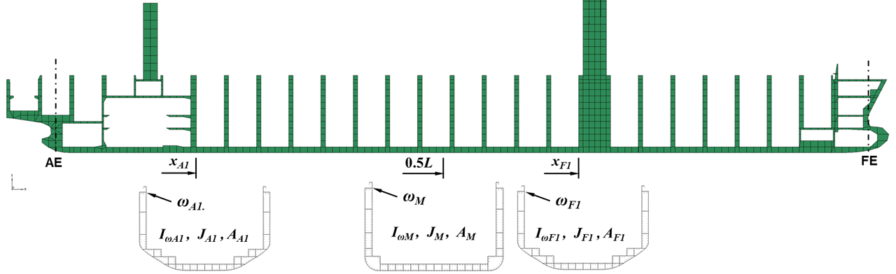
    Figure : Section Property – 2-Island (Aft Part)

    |   | 340 m $\leq L \leq$ 350 m | 370 m $\leq L \leq$ 380 m |
    | --- | --- | --- |
    | $I _{\omega N}$ | 350,000 | 700,000 |
    | $J _{N}$ | 22 | 30 |

    |   | $x _{A}$ | $0.45L$ | $x _{F 1}$ |
    | --- | --- | --- | --- |
    | $340 \leq L \leq 350$ | $\left[ 2 \left( \frac{x _{F 1}}{L} -0.63 \right) -0.35 \right] \times \left[ \frac{I _{\omega M}}{I _{\omega N}} -1 \right] +1$ | $0.5 \left( \frac{I _{\omega M}}{I _{\omega N}} -1 \right) +1$ | $0.5 \left( \frac{I _{\omega M}}{I _{\omega N}} -1 \right) +1$ |
    | $370 \leq L \leq 380$ | $\left[ 3 \left( \frac{x _{F 1}}{L} -0.63 \right) -0.55 \right] \times \left[ \frac{I _{\omega M}}{I _{\omega N}} -1 \right] +1$ | $0.6 \left( \frac{I _{\omega M}}{I _{\omega N}} -1 \right) +1$ | $0.5 \left( \frac{I _{\omega M}}{I _{\omega N}} -1 \right) +1$ |

    |   | $x _{A}$ | $0.45L$ | $x _{F 1}$ |
    | --- | --- | --- | --- |
    | $340 \leq L \leq 350$ | $-0.15 \left( \frac{J _{M}}{J _{N}} -1 \right) +1$ | $-0.05 \left( \frac{J _{M}}{J _{N}} -1 \right) +1$ | $-0.1 \left( \frac{J _{M}}{J _{N}} -1 \right) +1$ |
    | $370 \leq L \leq 380$ | $-0.15 \left( \frac{J _{M}}{J _{N}} -1 \right) +1$ | $-0.05 \left( \frac{J _{M}}{J _{N}} -1 \right) +1$ | $-0.05 \left( \frac{J _{M}}{J _{N}} -1 \right) +1$ |

    |   | $x _{A1}$ | $0.45L$ | $x _{F 1}$ |
    | --- | --- | --- | --- |
    | $340 \leq L \leq 350$ | $\left[ 2 \left( \frac{x _{F 1}}{L} -0.63 \right) -0.9 \right] \times \left[ \frac{I _{\omega A1}}{I _{\omega M}} -0.5 \right] +1$ | $-0.2 \left( \frac{I _{\omega A1}}{I _{\omega M}} -0.5 \right) +1$ | $-0.1 \left( \frac{I _{\omega A1}}{I _{\omega M}} -0.5 \right) +1$ |
    | $370 \leq L \leq 380$ | $\left[ 2 \left( \frac{x _{F 1}}{L} -0.63 \right) -1 \right] \times \left[ \frac{I _{\omega A1}}{I _{\omega M}} -0.5 \right] +1$ | $-0.2 \left( \frac{I _{\omega A1}}{I _{\omega M}} -0.5 \right) +1$ | $-0.1 \left( \frac{I _{\omega A1}}{I _{\omega M}} -0.5 \right) +1$ |

    |   |   | $x _{A1}$ | $0.45L$ | $x _{F1}$ |
    | --- | --- | --- | --- | --- |
    | $340 \leq L \leq 350$ | $x _{F 1} \leq 0.63L$ | $-1.2 \left( \frac{\omega _{A1}}{\omega _{M}} -0.8 \right) +1$ | $0.7 \left( \frac{\omega _{A1}}{\omega _{M}} -0.8 \right) +1$ | $0.5 \left( \frac{\omega _{A1}}{\omega _{M}} -0.8 \right) +1$ |
    | $340 \leq L \leq 350$ | $x _{F 1} >0.63L$ | $- \left( \frac{\omega _{A1}}{\omega _{M}} -0.8 \right) +1$ | $0.7 \left( \frac{\omega _{A1}}{\omega _{M}} -0.8 \right) +1$ | $0.5 \left( \frac{\omega _{A1}}{\omega _{M}} -0.8 \right) +1$ |
    | $370 \leq L \leq 380$ | $x _{F 1} \leq 0.63L$ | $-1.4 \left( \frac{\omega _{A1}}{\omega _{M}} -0.8 \right) +1$ | $0.8 \left( \frac{\omega _{A1}}{\omega _{M}} -0.8 \right) +1$ | $0.6 \left( \frac{\omega _{A1}}{\omega _{M}} -0.8 \right) +1$ |
    | $370 \leq L \leq 380$ | $x _{F 1} >0.63L$ | $-1.1 \left( \frac{\omega _{A1}}{\omega _{M}} -0.8 \right) +1$ | $0.8 \left( \frac{\omega _{A1}}{\omega _{M}} -0.8 \right) +1$ | $0.6 \left( \frac{\omega _{A1}}{\omega _{M}} -0.8 \right) +1$ |

    |   | $x _{A1}$ | $0.55L$ | $x _{F 1}$ |
    | --- | --- | --- | --- |
    | ${C{} _{\omega F1}}$ | $1.0$ | $1.0$ | $- \left( \frac{\omega _{A1}}{\omega _{M}} -0.93 \right) +1$ |

    |   | $x _{A1}$ | $0.35L$ | $x _{F1}$ |
    | --- | --- | --- | --- |
    | ${C{} _{AA1}}$ | $-0.4 \left( \frac{A _{A1}}{A _{M}} -0.9 \right) +1$ | 1.0 | 1.0 |

    |   | $x _{A1}$ | $0.55L$ | $x _{F1}$ |
    | --- | --- | --- | --- |
    | ${C{} _{AF1}}$ | 1.0 | 1.0 | $0.8 \left( \frac{A _{F}}{A _{M}} -0.975 \right) +1$ |

    |   | $x _{A1}$ | $0.35L$ | $0.55L$ | $0.7L$ |
    | --- | --- | --- | --- | --- |
    | $\omega _{Nominal}$ | 240 | 300 | 300 | 255 |

    |   | $x _{F 1} \leq 0.63L$ | $x _{F 1} >0.63L$ |
    | --- | --- | --- |
    | $340 \leq L \leq 350$ | $37.6$ | $27.1$ |
    | $370 \leq L \leq 380$ | 45.1 | 33.4 |

    | $x/L$ | $\sigma _{Aft}$ $(340 \leq L \leq 350)$ | $\sigma _{Aft}$ $(370 \leq L \leq 380)$ |
    | --- | --- | --- |
    | 0.20 | 15.1 | 14.5 |
    | 0.25 | 8.8 | 7.5 |
    | 0.30 | 2.6 | 1.3 |
    | 0.35 | -2.2 | -4.2 |
    | 0.40 | -6.9 | -8.9 |
    | 0.45 | -10.5 | -12.7 |
    | 0.50 | -12.8 | -15.6 |
    | 0.55 | -14.2 | -17.0 |
    | 0.58 | -14.5 | -17.4 |
    | 0.60 | -14.5 | -17.4 |
    | 0.63 | -13.9 | -16.8 |
    | 0.65 | 13.5 | -16.3 |
    | 0.68 | -12.4 | -15.2 |
  - **2.1.6** **Normal stress induced by wave torsional moment (2-Island type : FWD Part)**
    When a direct calculation using finite element analysis is not available, the normal stress induced by wave torsional moment may be determined as specified below. The normal stress induced, at any point, by wave torsional moments is to be obtained, in N/mm^2, from the following formula:
    $x _{A2}$
    Where,
    $x _{F2}$ : Distance between the aft end of the length and the aft edge of cargo hold adjacent to front wall of deck house, in m, see **Figure 6**.
    $I _{\omega M}$ : Distance between the aft end of the length and the forward edge of foremost cargo hold, in m, see **Figure 6**.
    $I _{\omega A2}$ : Sectorial moment of inertia amidships, in m^6.
    $x _{A2}$ : Sectorial moment of inertia at $I _{\omega F2}$, in m^6.
    $x _{F2}$ : Sectorial moment of inertia at $I _{\omega N}$, in m^6.
    $J _{M}$ : Nominal sectorial moment of inertia as defined in **Table 28.**
    $J _{A2}$ : St. Venant's moment of inertia amidships, in m^4.
    $x _{A2}$ : St. Venant's moment of inertia at $J _{F2}$, in m^4.
    $x _{F2}$ : St. Venant's moment of inertia at $J _{N}$, in m^4.
    $\omega$ : Nominal St. Venant's moment of inertia as defined in **Table 28.**
    $x$ : Warping function of the point being considered, in m^2, Where $0.85L$ of considered point is between $x _{F}$ and $\omega _{Nomianl}$, absolute vale of warping function is not greater than $\omega _{M} /300$ ․ $\omega _{M}$.
    $\omega _{A2}$ : Warping function amidships at the inboard edge (port side) of the strength deck plating, clear of the hatch corner, in m^2, see **Figure 6**.
    $x _{A2}$ : Warping function at the inboard edge (port side) of the strength deck plating, clear of the hatch corner $\omega _{F2}$, in m^2, see **Figure 6**.
    $x _{F2}$ : Warping function at the inboard edge (port side) of the strength deck plating, clear of the hatch corner $\omega _{Nominal}$, in m^2, see **Figure 6**.
    $A _{M}$ : Nominal warping function as defined in **Table 36.**
    $A _{A2}$ : Cross section area amidships, in m^2.
    $x _{A1}$ : Cross section area at $A _{F2}$, in m^2.
    $x _{F1}$ : Cross section area at $C _{I \omega M}$, in m^2.
    $I _{\omega M}$ : Correction factor for $C _{JA2}$ as defined in **Table 29.**
    $J _{A2}$ : Correction factor for $C _{I \omega A2}$ as defined in **Table 30.**
    $I _{\omega A2}$ : Correction factor for $C _{JF2}$ as defined in **Table 31.**
    $J _{F2}$ : Correction factor for $C _{I \omega F2}$ as defined in **Table 32.**
    $I _{\omega F2}$ : Correction factor for $C _{\omega F2}$ as defined in **Table 33.**
    $\omega _{F2}$ : Correction factor for $C _{AF2}$ as defined in **Table 34.**
    $A _{F2}$ : Correction factor for $M _{wt \max}$ as defined in **Table 35.**
    $0.25L$ : Wave torsional moment at $\sigma _{Nominal}$ as defined in **Ch 4, Sec 4, [3.6].**
    $\sigma _{Nominal} = \sigma _{FWD} +C _{xA2} \left( \frac{x _{A2}}{L} -0.67 \right)$ : Nominal stress, to be taken as:
    $C _{xA2}$
    $x _{A2}$ : Correction factor for $\sigma _{FWD}$ as defined in **Table 37.**
    $\mathbf{{I _{\omega N}}}$ : Nominal stress coefficient as defined in **Table 38.**
    Note 1: For intermediate value of x, correction factors, nominal stress and section property are to be obtained by linear interpolation.
    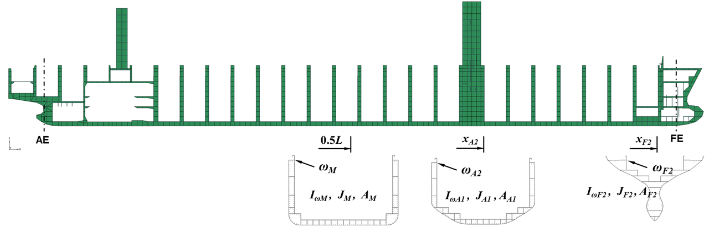
    Figure : Section Property – 2-Island (FWD Part)

    |   | 340 m $\leq L \leq$ 350 m | 370 m $\leq L \leq$ 380 m |
    | --- | --- | --- |
    | $I _{\omega N}$ | 350,000 | 700,000 |
    | $J _{N}$ | 22 | 30 |

    |   | $x _{A2}$ | $0.75L$ | $x _{F 2}$ |
    | --- | --- | --- | --- |
    | ${C _{I \omega M}}$ | $0.2 \left( \frac{I _{\omega M}}{I _{\omega N}} -1 \right) +1$ | $0.25 \left( \frac{I _{\omega M}}{I _{\omega N}} -1 \right) +1$ | $0.35 \left( \frac{I _{\omega M}}{I _{\omega N}} -1 \right) +1$ |

    |   | $x _{A2}$ | $0.75L$ | $x _{F 2}$ |
    | --- | --- | --- | --- |
    | $340 \leq L \leq 350$ | $-0.2 \left( \frac{J _{A2}}{J _{N}} -1 \right) +1$ | $-0.25 \left( \frac{J _{A2}}{J _{N}} -1 \right) +1$ | $-0.4 \left( \frac{J _{A2}}{J _{N}} -1 \right) +1$ |
    | $370 \leq L \leq 380$ | $-0.15 \left( \frac{J _{A2}}{J _{N}} -1 \right) +1$ | $-0.2 \left( \frac{J _{A2}}{J _{N}} -1 \right) +1$ | $-0.3 \left( \frac{J _{A2}}{J _{N}} -1 \right) +1$ |

    |   | $C _{I \omega A2}$ |
    | --- | --- |
    | $x _{A2}$ | $\left[ -6 \left( \frac{x _{A 2}}{L} -0.67 \right) -0.9 \right] \times \left[ \frac{I _{\omega A2}}{I _{\omega M}} +5 \left( \frac{x _{A2}}{L} -0.67 \right) -0.7 \right] +1$ |
    | $0.75L$ | $\left[ -7 \left( \frac{x _{A 2}}{L} -0.67 \right) -0.5 \right] \times \left[ \frac{I _{\omega A2}}{I _{\omega M}} +5 \left( \frac{x _{A2}}{L} -0.67 \right) -0.7 \right] +1$ |
    | $x _{F 2}$ | $-0.2 \left[ \frac{I _{\omega A2}}{I _{\omega M}} +5 \left( \frac{x _{A2}}{L} -0.67 \right) -0.7 \right] +1$ |

    |   | $x _{A2}$ | $0.75L$ | $x _{F 2}$ |
    | --- | --- | --- | --- |
    | $C _{JF2}$ | $-0.1 \left( \frac{J _{F2}}{J _{M}} -0.9 \right) +1$ | $-0.2 \left( \frac{J _{F2}}{J _{M}} -0.9 \right) +1$ | $-0.3 \left( \frac{J _{F2}}{J _{M}} -0.9 \right) +1$ |

    |   | $x _{A2}$ | $0.9L$ | $x _{F 2}$ |
    | --- | --- | --- | --- |
    | ${{C _{I \omega F2}}}$ | $1.0$ | $1.0$ | $-15 \left[ \frac{I _{\omega F2}}{I _{\omega M}} -0.007 \right] +1$ |

    |   |   | $x _{A2} \sim 0.75L$ | $0.9L$ | $x _{F 2}$ |
    | --- | --- | --- | --- | --- |
    | $C_omegaF2$ | $x _{A1} =0.62L$ | $\left( \frac{\omega _{F2}}{\omega _{M}} -0.05 \right) +1$ | $-1.8 \left( \frac{\omega _{F2}}{\omega _{M}} -0.05 \right) +1$ | $48 \left( \frac{\omega _{F2}}{\omega _{M}} -0.05 \right) ^{2} -9.8 \left( \frac{\omega _{F2}}{\omega _{M}} -0.05 \right) +1$ |
    | $C_omegaF2$ | $x _{A1} =0.67L$ | $\left( \frac{\omega _{F2}}{\omega _{M}} -0.05 \right) +1$ | $-4 \left( \frac{\omega _{F2}}{\omega _{M}} -0.05 \right) +1$ | $60 \left( \frac{\omega _{F2}}{\omega _{M}} -0.05 \right) ^{2} -12.2 \left( \frac{\omega _{F2}}{\omega _{M}} -0.05 \right) +1$ |
    | $C_omegaF2$ | $x _{A1} =0.72L$ | $\left( \frac{\omega _{F2}}{\omega _{M}} -0.05 \right) +1$ | $1.0$ | $68 \left( \frac{\omega _{F2}}{\omega _{M}} -0.05 \right) ^{2} -13.8 \left( \frac{\omega _{F2}}{\omega _{M}} -0.05 \right) +1$ |

    |   | $x _{A2}$ | $0.75L$ | $x _{F 2}$ |
    | --- | --- | --- | --- |
    | $C _{AF2}}$ | $-0.1 \left( \frac{A _{F2}}{A _{M}} -0.5 \right) +1$ | $-0.2 \left( \frac{A _{F2}}{A _{M}} -0.5 \right) +1$ | $-0.3 \left( \frac{A _{F2}}{A _{M}} -0.5 \right) +1$ |

    | $x$ | $\omega _{Nominal}$ |
    | --- | --- |
    | $0.35L \sim 0.55L$ | 300 |
    | $x _{F}$ | 15 |

    |   |   | $x _{A 2} \leq 0.67L$ | $x _{A 2} >0.67L$ |
    | --- | --- | --- | --- |
    | $340 \leq L \leq 350$ | $x _{A2} /L \leq 0.75$ | $3.2$ | $-4.8$ |
    | $340 \leq L \leq 350$ | $x _{A2} /L>0.75$ | $3.2-12.8(x/L-0.75)$ | $-4.8+19.2(x/L-0.75)$ |
    | $370 \leq L \leq 380$ | $x _{A2} /L \leq 0.75$ | $2.7$ | $-4$ |
    | $370 \leq L \leq 380$ | $x _{A2} /L>0.75$ | $2.7-10.8(x/L-0.75)$ | $-4+16(x/L-0.75)$ |

    | *x* / *L* | $\sigma _{FWD}$ (340 ≤ *L* ≤ 350) | $\sigma _{FWD}$ (370 ≤ *L* ≤ 380) |
    | --- | --- | --- |
    | 0.62 | -17.8 | -15.4 |
    | 0.65 | -17.1 | -14.8 |
    | 0.67 | -16.6 | -14.4 |
    | 0.70 | -15.6 | -13.7 |
    | 0.72 | -14.8 | -12.9 |
    | 0.75 | -13.0 | -11.4 |
    | 0.80 | -8.6 | -7.6 |
    | 0.85 | 0.8 | -0.4 |
    | 0.90 | 9.2 | 8.0 |
    | 0.93 | 12.5 | 11.4 |
    | 0.96 | 13.5 | 12.3 |
  - **2.1.7** **Normal stress induced by still water torsional moment (Conventional type)**
    When a direct calculation using finite element analysis is not available, the normal stress induced by still water torsional moment may be determined as specified below. The normal stress induced, at any point, by still water torsional moments is to be obtained, in N/mm^2, from the following formula:
    $M _{st \max}$
    $C _{L}$ : maximum value of still water torsional moment, in kNm, as defined in **Ch 4, Sec 4, [2.4]**.
    $C _{z}$, $I _{\omega M}$, $\omega$, $\omega _{Nominal}$, $C _{A}$, $C _{F}$, $C _{I \omega M}$, $C _{JM}$, $C _{I \omega A}$, $C _{I \omega F}$, $C _{JF}$, $C _{\omega A}$, $C _{\omega F}$, $C _{AA}$, $C _{AF}$, $\sigma _{Nominal}$ and $\sigma _{st} =0.5C _{I \omega M} C _{JM} C _{I \omega A1} C _{\omega A1} C _{\omega F1} C _{AA1} C _{AF1} \frac{M _{st \max}}{I _{\omega M}} \frac{- \omega}{\omega _{Nominal}} \sigma _{Nominal}$ are defined in **[2.1.4]**.
  - **2.1.8** **Normal stress induced by still water torsional moment (2-Island : Aft Part)**
    When a direct calculation using finite element analysis is not available, the normal stress induced by still water torsional moment may be determined as specified below. The normal stress induced, at any point, by still water torsional moments is to be obtained, in N/mm^2, from the following formula:
    $M _{st \max}$
    $I _{\omega M}$ : maximum value of still water torsional moment, in kNm, as defined in **Ch 4, Sec 4, [2.4]**.
    $\omega$, $\omega _{Nominal}$, $C _{I \omega M}$, $C _{JM}$, $C _{I \omega A1}$, $C _{I \omega F1}$, $C _{\omega A1}$, $C _{\omega F1}$, $C _{AA1}$, $C _{AF1}$, $\sigma _{Nominal}$ and $\sigma _{st} =0.5C _{I \omega M} C _{I \omega A2} C _{I \omega F2} C _{JA2} C _{JF2} C _{\omega F2} C _{AF2} \frac{M _{st \max}}{I _{\omega M}} \frac{- \omega}{\omega _{Nominal}} \sigma _{Nominal}$ are defined in **[2.1.5]**.
  - **2.1.9** **Normal stress induced by still water torsional moment (2-Island : FWD Part)**
    When a direct calculation using finite element analysis is not available, the normal stress induced by still water torsional moment may be determined as specified below. The normal stress induced, at any point, by still water torsional moments is to be obtained, in N/mm^2, from the following formula:
    $M _{st \max}$
    $I _{\omega M}$ : maximum value of still water torsional moment, in kNm, as defined in **Ch 4, Sec 4, [2.4]**.
    $\omega$, $\omega _{Nominal}$, $C _{I \omega M}$, $C _{I \omega A2}$, $C _{I \omega F2}$, $C _{JA2}$, $C _{JF2}$, $C _{\omega F2}$, $C _{AF2}$, $\sigma _{Nominal}$ and $\tau _{sw} = \frac{Q _{sw}}{t} q _{vi} \times 10 ^{3}$ are defined in **[2.1.6]**.
- **2.2** **Shear stress**
  - **2.2.1** **Shear stress induced by vertical still water shear force**
    The hull girder shear stress, in $\tau _{sw} = \frac{Q _{sw-p}}{t} q _{vi} \times 10 ^{3}$, induced by vertical still water shear forces is to be determined, at the load calculation point under consideration, as follows:
    $q _{vi}$
    $t _{C}$
    where:
    $\tau _{sw} = \frac{Q _{wv}}{t} q _{vi} \times 10 ^{3}$ : Net thickness of the plate $\tau _{sw} = \frac{Q _{wh}}{t} q _{hi} \times 10 ^{3}$*,* in $q _{hi}$.
    $t _{C}$ : Contribution ratio for hull girder shear force per $I _{y-n50}$, in $I _{y-n50} \geq 1.55L \left| M _{sw} +M _{wv} \right| \times 10 ^{-7}$, for the plate $\sigma _{L}$ based on net scantlings with deduction of 0.5 $\sigma _{L} \leq \sigma _{perm}$, which is equal to the unit shear flow per $\sigma _{L} = \sigma _{sw} +C _{WV} \sigma _{wv} +C _{WH} \sigma _{wh} +C _{st} \sigma _{st} +C _{"tor"} \sigma _{wt}$, in $C _{WV}$, for a unit vertical shear force, from a numerical calculation based on thin-walled beam theory according to **App 1**.
    - **a)** for seagoing condition:
    - **b)** for harbour / sheltered condition
  - **2.2.2** **Shear stress induced by vertical wave shear force**
    The hull girder shear stress, in $C _{WH}$, induced by vertical wave shear forces is to be determined, at the load calculation point under consideration, as follows:
    $C _{st}$
  - **2.2.3** **Shear stress induced by horizontal wave shear force**
    The hull girder shear stress, in $C _{st} =0.0$, induced by horizontal wave shear forces is to be determined, at the load calculation point under consideration, as follows:
    $C _{st} =1.0$
    where:
    $C _{st} = -1.0$ : Contribution ratio for hull girder shear force per $C _{"tor"}$, in $C _{"tor"} =0.0$, for the plate $C _{"tor"} =1.0$ based on net scantlings with deduction of 0.5 $C _{"tor"} =-1.0$, which is equal to the unit shear flow per $C _{"tor"} =-0.6$, in $C _{"tor"} =0.6$, for a unit horizontal shear force, from a numerical calculation based on thin-walled beam theory according to **App 1.**

#### 3. Hull girder strength assessment

- **3.1** **General**
  - **3.1.1** Continuity of structure is to be maintained throughout the length of the ship. Where significant changes in structural arrangement occur adequate transitional structure is to be provided.
- **3.2** **Longitudinal extent of strength assessment**
  - **3.2.1** The stiffness, yield strength and buckling strength assessment are to be carried out in way of 0.2 *L* to 0.75 *L* with due consideration given to locations where there are significant changes in hull cross-section, e.g. changes of framing system and the fore and aft ends of the forward superstructure in case of 2-island design.
  - **3.2.2** In addition, yield strength and buckling strength assessments are to be carried out outside this area. As a minimum, these assessments are to be carried out at forward end of the foremost cargo hold and at aft end of the aftermost cargo hold.
- **3.3** **Hull girder stiffness**
  - **3.3.1** **Stiffness criterion**
    For both hogging and sagging conditions, the net moment of inertia $\sigma _{perm}$, in m^4, of the hull transverse section is to be not less than:
    $\sigma _{sw}$
- **3.4** **Hull girder bending strength assessment**
  - **3.4.1** **General acceptance criteria**
    The normal stress, $\sigma _{wv}$ is to be assessed for all conditions, along the full length of the hull girder, from AE to FE. The normal stress at any point of the hull transverse section is to comply with the following formula:
    $\sigma _{wh}$
    $\sigma _{st}$
    $\sigma _{wt}$, ${\sigma _{perm} }$ : Load combination factors, as given in **Ch 4, Sec 2, [2.2.1]**
    $\frac{235}{1.24 k}$ : Static warping stress combination factors, to be taken as:
    • $\frac{143}{k}$ for HSM, HSA, FSM, BSR, BSP load cases
    • $\sigma _{L} = \frac{E}{2.06 \times 10 ^{5}} \sigma _{LS}$ for OST-1P, OST-2S, OSA-2P, OSA-1S load cases
    • $\sigma _{LS}$ for OST-2P, OST-1S, OSA-1P, OSA-2S load cases
    $A _{SE-n50}$ : Dynamic warping stress combination factors, to be taken as:
    • $z_{hts,i}$ for HSM, HSA, FSM, BSR, BSP load cases
    • $z _{hts,i} =z _{1} \left( 1- \frac{\sigma _{perm,i}}{\sigma _{L}} \right)$ for OST-1P, OST-2S load cases
    • $z _{hts,i} = \frac{\left( \sigma _{perm,i} - \sigma _{dk} \right)}{\left( \sigma _{VD} - \sigma _{dk} \right)} \left( z _{T} -z _{dk} \right)$ for OST-2P, OST-1S load cases
    • $z _{1}$ for OSA-1P, OSA-2S load cases
    • $\sigma _{perm,i}$ for OSA-2P, OSA-1S load cases
    $\sigma _{L}$ : Permissible hull girder bending stress, in N/mm^2, as given in **Table 39**.
    $\sigma _{dk}$ : Normal stress, in N/mm^2, induced by vertical still water bending moment, as defined in **[2.1.1]**.
    $\sigma _{bl}$ : Normal stress, in N/mm^2, induced by vertical wave bending moment, as defined in **[2.1.2]**.
    $\sigma _{VD}$ : Normal stress, in N/mm^2, induced by horizontal wave bending moment, as defined in **[2.1.3]**.
    $\sigma _{b \ell} = \frac{\left| M _{sw} +M _{wv} \right|}{I _{y-n50}} z _{n} \times 10 ^{-3}$ : Normal stress, in N/mm^2, induced by static torsional moment, as defined in **[2.1.7]** to **[2.1.9]**. The longitudinal assessment range of warping stress is shown in **Figure 7** and **Figure 8**.
    $\sigma _{b \ell} = \frac{\left| M _{sw-p} \right|}{I _{y-n50}} z _{n} \times 10 ^{-3}$ : Normal stress, in N/mm^2, induced by wave torsional moment, as defined in **[2.1.4]** to **[2.1.6]**. The longitudinal assessment range of warping stress is shown in **Figure 7** and **Figure 8**.

    | Operation | Design load | Permissible hull girder bending stress, ${\sigma _{perm} }$ |
    | --- | --- | --- |
    | Seagoing | (S+D) | $\frac{235}{1.24 k}$ |
    | Harbour/sheltered water | (S) | $\frac{143}{k}$ |

    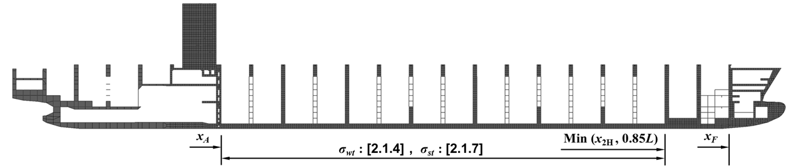
    Figure : Application of normal stress induced by wave torsional bending moment - Conventional type
    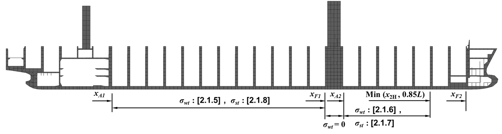
    Figure : Application of normal stress induced by wave torsional bending moment - 2-Island type
  - **3.4.2** **Bending strength assessment**
    The bending strength is to be assessed at the following locations of the cross-section:
    - **a)** at bottom
    - **b)** at deck
    - **c)** at top of hatch coaming
    - **d)** at any point where there is a change of steel yield strength.
  - **3.4.3** **Material other than steel**
    In a member made in material other than steel with a Young’s modulus E equal to 2.06×10^5 N/mm^2 and included in the hull girder transverse sections as specified in **[1.2.7],** the normal stress is obtained from the following formula:
    $\sigma _{VD} = \frac{\left| M _{sw-p} \right|}{I _{y-n50}} V _{D} \times 10 ^{-3}$
    where:
    $z _{dk-s}$ : Normal stress, in N/mm^2, in the member under consideration, calculated according to **[3.4.1]** considering this member as having the steel equivalent sectional area $V _{D}$ defined in **[1.2.7].**
- **3.5** **Extent of high tensile steel**
  - **3.5.1** **Vertical extent**
    The vertical extent of higher strength steel, $\tau _{hg}$, in m, used in the deck zone or bottom zone and measured respectively from the moulded deck line at side or baseline is not to be taken less the value obtained from the following formula, see **Figure 9:**
    $\tau _{hg}$ for structural members located below strength deck
    $\tau _{hg} \leq \tau _{perm}$ for effective longitudinal members located above strength deck
    where:
    $\tau _{hg} = \tau _{sw} +C _{WV} \tau _{wv} +C _{WH} \tau _{wh}$ : Distance from horizontal neutral axis to moulded deck line or baseline respectively, in m.
    $C _{WV}$ : Permissible hull girder bending stress of the considered steel, in N/mm^2, as given in **Table 39** and **Figure 9.**
    $C _{WH}$ : Hull girder bending stress, $\tau _{perm}$ at moulded deck line or ${\tau _{i-perm}}}}}$ at baseline respectively, in N/mm^2 given in **Table 40.**
    $\frac{235}{1.13 \sqrt {3} k}$ : Hull girder bending stress at equivalent deck line, in N/mm^2 given in **Table 40.**
    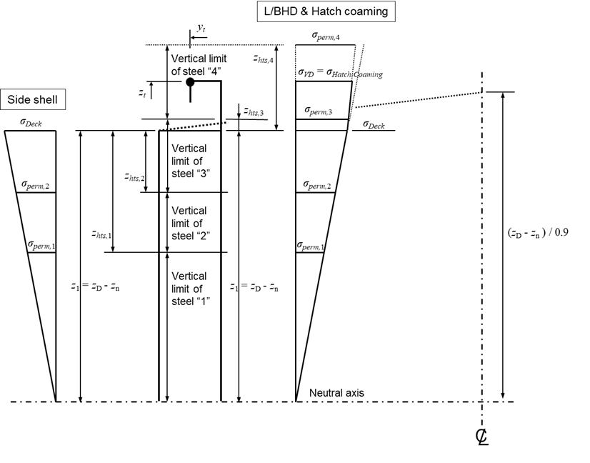
    Figure : Vertical extent of higher strength steel

    | Operation | Seagoing | Harbour/sheltered water |
    | --- | --- | --- |
    | At baseline | $\sigma _{b \ell} = \frac{\left\| M _{sw} +M _{wv} \right\|}{I _{y-n50}} z _{n} \times 10 ^{-3}$ | $\sigma _{b \ell} = \frac{\left\| M _{sw-p} \right\|}{I _{y-n50}} z _{n} \times 10 ^{-3}$ |
    | At moulded deck line | $\sigma _{dk} = \frac{\left\| M _{sw} +M _{wv} \right\|}{I _{y-n50}} (z _{dk-s} -z _{n} ) \times 10 ^{-3}$ | $\sigma _{dk} = \frac{\left\| M _{sw-p} \right\|}{I _{y-n50}} (z _{dk-s} -z _{n} ) \times 10 ^{-3}$ |
    | At equivalent deck line | $\sigma _{VD} = \frac{\left\| M _{sw} +M _{wv} \right\|}{I _{y-n50}} V _{D} \times 10 ^{-3}$ | $\sigma _{VD} = \frac{\left\| M _{sw-p} \right\|}{I _{y-n50}} V _{D} \times 10 ^{-3}$ |
    | $z _{dk-s}$ : Distance from baseline to moulded deck line at side, in m. $V _{D}$ : Vertical distance of the equivalent deck line, in m, defined in **[1.4.3]** |   |   |
  - **3.5.2** **Longitudinal extent**
    Where used, the application of higher strength steel is to be continuous over the length of the ship to the location where the longitudinal stress levels are within the allowable range for mild steel structure, as shown in **Figure 10.**
    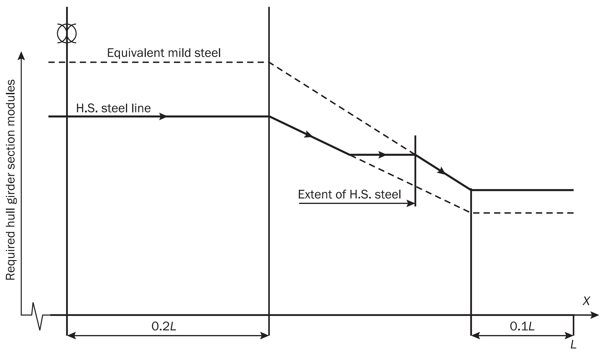
    Figure : Longitudinal extent of higher strength steel
- **3.6** **Hull girder shear strength assessment**
  - **3.6.1** The shear stress, $\gamma _{DB}$ is to be assessed for all conditions, along the full length of the hull girder, from AE to FE. The shear stress, $\gamma _{DB}$, at any point of the hull transverse section is to comply with the following formula:
    $M$
    $M= \gamma _{s} M _{sw} + \gamma _{w} M _{wv}$
    $M _{sw}$, $M _{wv}$ : Load combination factors, as given in **Ch 4, Sec 2, [2.2.1]**
    $\gamma _{s}$ : Permissible hull girder shear stress, in N/mm^2, as given in **Table 41.**

    | Operation | Design load | Permissible hull girder shear, ${\tau _{i-perm}}}}}$ |
    | --- | --- | --- |
    | Seagoing | (S + D) | $\frac{235}{1.13 \sqrt {3} k}$ |
    | Harbour/sheltered water | (S) | $\frac{105}{k}$ |
- **3.7** **Hull girder buckling strength assessment**
  - **3.7.1** Hull girder buckling strength of members contributing to the longitudinal strength is to be assessed according to **Ch 8**.

#### 4. Stress control of inner hull forming liquefied natural gas fuel tank

- **4.1** **General**
  - **4.1.1** Liquefied natural gas fuel tanks with a membrane containment system may have some limitation such as elongation or stress level of adjacent installed hull structure. Any required criteria for inner hull is to be confirmed by the designer of the fuel containment system.

### Section 2 Hull girder ultimate strength

#### 1. Application

- **1.1** **General**
  - **1.1.1** The requirements of this Section apply to ships with length *L* equal to or greater than 150 m.
  - **1.1.2** The hull girder ultimate strength is to be assessed in way of 0.2 *L* to 0.75 *L*.
  - **1.1.3** The hull girder ultimate bending capacity is to be checked to ensure that it satisfies the checking criteria given in **[2].** Such criteria are applicable to intact ship structures for both hogging and sagging conditions, in seagoing and harbour / sheltered water conditions.

#### 2. Checking criteria

- **2.1** **General**
  The vertical hull girder ultimate bending capacity at any hull transverse section is to satisfy the following criterion:
  $M _{U}$
  where:
  $M _{U}$ : Vertical bending moment, in kNm, to be obtained as specified in **[2.2.1].**
  $\chi$ : Hull girder ultimate bending moment capacity, in kNm, to be obtained as specified in **[2.3].**
  $M _{UH}$ : Partial safety factor covering material, geometric and strength prediction uncertainties, in general to be taken equal to:
  $M _{US}$ = 1.05
  $\chi$ : Partial safety factor covering the effect of double bottom bending under lateral loads, to be taken equal to:
  • $M _{U}$ = 1.15 for hogging condition
  • ${\mathbf{\chi }}$ = 1.0 for sagging condition
  For cross-sections where the breadth of the inner bottom is less than the one amidships, or where the double bottom structure differs from the one amidships (e.g. engine room sections), the factor $q _{V}$ for hogging condition may be reduced, based upon agreement with the Society.
- **2.2** **Hull girder ultimate bending loads**
  - **2.2.1** The vertical hull girder bending moment $q _{v}$, in kNm, in hogging and sagging conditions, to be considered in the ultimate strength check, is to be taken as:
    $q _{V} =q _{D} +q _{I}$
    where:
    $q _{D}$ : Permissible hogging and sagging vertical still water bending moment, in kNm, at the hull transverse section considered as defined in **Ch 4, Sec 4, [2.2.2]**
    $q _{I}$ : Vertical wave bending moment in seagoing operation, in kNm, at the hull transverse section considered as defined in **Ch 4, Sec 4, [3.2.1]**
    $q _{V}$ : Partial safety factor for the still water bending moment, to be taken as: $\mathbf{{q _{D}}}$=1.0
    $q _{D}$ : Partial safety factor for the vertical wave bending moment, to be taken as: $q _{D} (s)=- \frac{1}{10 ^{6} I _{y-n50}} \int _{0} ^{s} {(z-z _{n}} )t _{n50} ds$=1.2.
- **2.3** **Hull girder ultimate bending moment capacity**
  - **2.3.1** **General**
    The hull girder ultimate bending moment capacity $I _{y-n50}$ is defined as the maximum bending moment capacity of the hull girder beyond which the hull structure collapses.
  - **2.3.2** **Determination of hull girder ultimate bending moment capacity**
    The ultimate bending moment capacities of a hull girder transverse section, in hogging and sagging conditions, are defined as the maximum values of the curve of bending moment $t _{n50}$ versus the curvature $z _{n}$ of the transverse section considered ($q _{D k} =q _{D} ( \ell )=- \frac{t \ell }{2 \times 10 ^{6} I _{y-n50}} (z _{k} +z _{i} -2z _{n} )+q _{D i}$ for hogging condition and $q _{Dk}$ for sagging condition, see **Figure 1**). The curvature $q _{Di}$ is positive for hogging condition and negative for sagging condition.
    The hull girder ultimate bending moment capacity $k$ is to be calculated according to **App2**.
    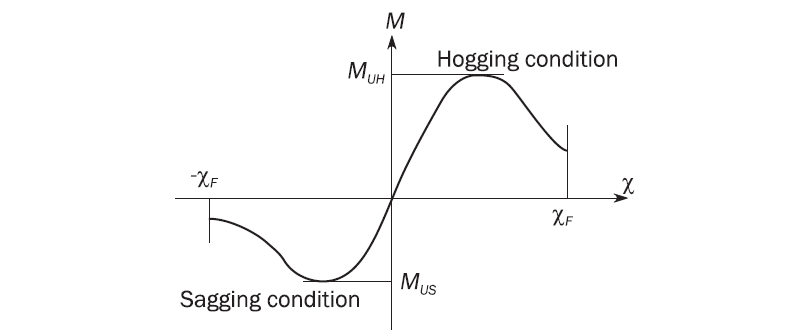
    Figure : Bending moment capacity versus curvature #eqnID-750
  - **2.3.3** The effective area to be considered for the hull girder ultimate strength capacity assessment is specified in **App 2.**
- **2.4** **Whipping**
  - **2.4.1** Ultimate strength check of the hull considering the whipping effect is to be performed according to the requirements of the **Guidance on Strength Assessment of Container ships Considering the Whipping Effect.**

### Appendix 1 – Direct Calculation of Shear Flow

**Symbols**
For symbols not defined in this section, refer to **Ch 1, Sec 4.**

#### 1. Calculation formula

- **1.1** **General**
  - **1.1.1** This Appendix describes the procedures of direct calculation of shear flow around a ship cross-section due to hull girder vertical shear force. The shear flow $\ell$, at each location in the cross-section, is calculated considering the cross-section subjected to a unit vertical shear force of 1 N.
    The unit shear flow per mm $y _{i}$, in N/mm, is to be taken as:
    $y _{k}$
    where:
    $i$ : Determinate shear flow, as defined in **[1.2].**
    $k$ : Indeterminate shear flow which circulates around the closed cells, as defined in **[1.3].**
    In the calculation of the unit shear flow $z _{i}$, the longitudinal stiffeners are to be taken into account.
- **1.2** **Determinate shear flow,** $z _{k}$
  - **1.2.1** The determinate shear flow $i$, in N/mm, at each location in the cross-section is to be obtained from the following line integration:
    $k$
    where:
    s : Coordinate value of the running coordinate along the cross-section, in m
    $\mathbf{{q _{I}}}$ : Net moment of inertia of the cross-section, in m^4
    $q _{Ic} oint _{c} ^{} {\frac{1}{t _{n50}}} ds - \sum _{m=1} ^{Nw} \left( q _{Im } oint _{cm} ^{} {\frac{1}{t _{n50}} ds} \right) =- oint _{c} ^{} {\frac{q _{D}}{t _{n50}} ds}$ : Net thickness of plating, in mm.
    $N _{W}$ : Z coordinate of horizontla neutral axis from baseline, in m
  - **1.2.2** It is assumed that the cross-section is composed of line segments as shown in **Figure 1,** where each line segment has a constant plate net thickness. The determinate shear flow, in N/mm, is obtained by the following equation:
    $cm$
    where:
    $q _{Ic}$, $q _{Im}$ : Determinate shear flow, at node $q _{Ic} \sum _{j=1} ^{Nc} \left( \frac{\ell }{t _{n50}} \right) _{j} - \sum _{m=1} ^{Nw} \left\{ q _{Im} \left[ \sum _{j=1} ^{Nm} \left( \frac{\ell }{t _{n50}} \right) \right] \right\} =- \sum _{j=1} ^{Nc} \phi _{j}$ and node $\phi _{j} = \left[ - \frac{\ell ^{2}}{6 \times 10 ^{3} I _{y-n50}} (z _{k} +2z _{i} -3z _{n} )+ \frac{\ell }{t _{n50}} q _{Di} \right]$ respectively, in N/mm
    $Nc$ : Length of line segments, in m
    $Nm$, $q _{Di}$ : Y coordinates, in m, of the end points $\ell = \sqrt {(y _{k} -y _{i} ) ^{2} +(z _{k} -z _{i} ) ^{2}}$ and $a _{n50} =10 ^{-3} \ell t _{n50}$ of a line segment, as defined in **Figure 1.**
    $A _{n50} = \sum _{} ^{} a _{n50}$, $s _{y-n50} = \frac{a _{n50}}{2} (z _{k} +z _{i} )$ : Z coordinates, in m, of the end points $s _{y-n50} = \sum _{} ^{} s _{y-n50}$ and $i _{y0-n50} = \frac{a _{n50}}{3} (z _{k} ^{2} +z _{k} z _{i} +z _{i} ^{2} )$ of a line segment, as defined in **Figure 1.**
  - **1.2.3** Where the cross-section includes closed cells, the closed cells are to be cut with virtual slits, as shown in **Figure 2** in order to obtain the determinate shear flow.
    These virtual slits are not to be located in walls which form part of another closed cell.
  - **1.2.4** Determinate shear flow at bifurcation points is to be calculated by water flow calculations or similar, as shown in **Figure 2.**
    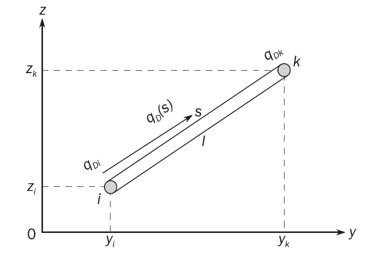
    Figure : Definition of line segment
    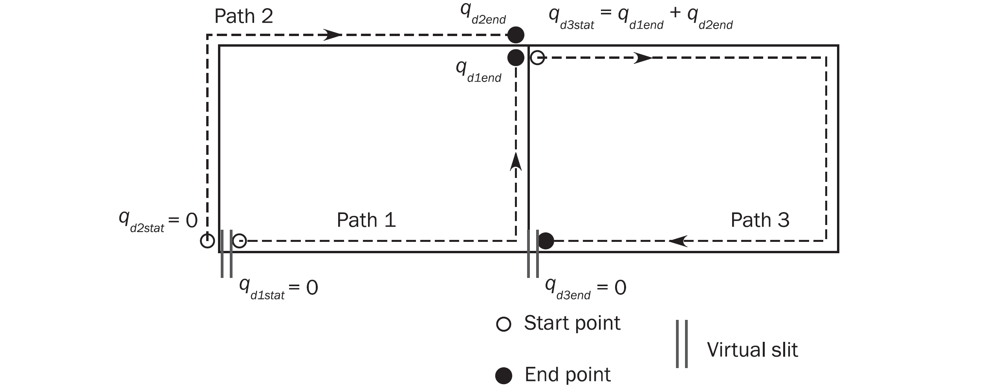
    Figure : Calculation of determinate shear flow at bifurcation
- **1.3** **Indeterminate shear flow,** $I _{y0-n50} = \sum _{} ^{} i _{y0-n50}$
  - **1.3.1** The indeterminate shear flow qI around the closed cells of a cross-section is considered as a constant value within the same closed cell. The following system of equation for determination of indeterminate shear flows can be developed. In the equations, contour integrations of several parameters around all the closed cells are performed.
    $y _{i}$
    where:
    $z _{i}$ : Number of common walls shared by cell c and all the other cells
    $y _{k}$ : Common wall shared by cells *c* and *m*
    $z _{k}$, $a _{n50}$ : Indeterminate shear flows around the closed cells c and m respectively, in N/mm.
  - **1.3.2** Under the assumption of the assembly of line segments shown in **Figure 1** and constant plate thickness of each line segment, the equation in **[1.3.1]** is expressed as follows:
    $A _{n50}$
    $s _{y-n50}$
    where:
    $S _{y-n50}$ : Number of line segments in cell *c*
    $i _{y0-n50}$ : Number of line segments on the common wall shared by cells *c* and *m*
    $I _{y0-n50}$ : Determinate shear flow, in N/mm, calculated according to **[1.2.2].**
    The difference in the directions of running coordinates specified in **[1.2]** and the present **[1.3]** is to be considered.
    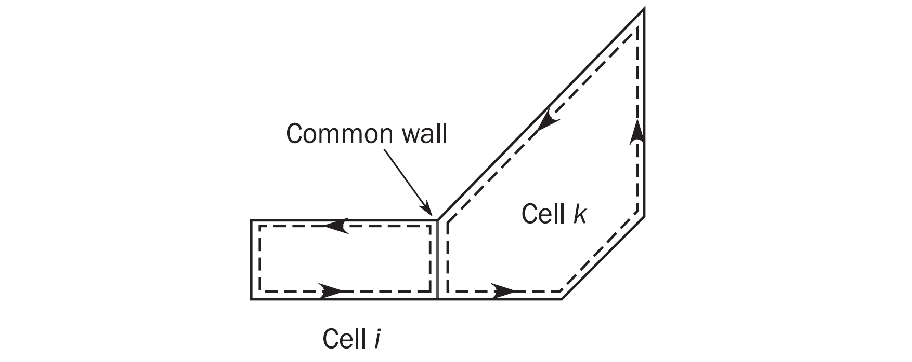
    Figure : Closed cells and common wall
- **1.4** **Computation of sectional properties**
  - **1.4.1** Properties of the cross-section are to be obtained by the following formulae, where the cross-section is assumed to be made of the assembly of line segments:
    $z _{n}$
    $z _{n} = \frac{S _{y-n50}}{A _{n50}}$ $I _{y-n50} =I _{y0-n50} -z _{n} ^{2} A _{n50}$
    $I _{y-n50}$ $Z _{B-n50}$
    $Z _{D-n50}$ $R _{eHs}$
    where:
    $R _{eHp}$, $A _{s-n50}$ : Y and Z coordinates of start point i of a line segment, in m, as defined in **Figure 1**
    $A _{p-n50}$, $M _{i}$ : Y and Z coordinates of end point k of a line segment, in m, as defined in **Figure 1**
    $\chi _{i}$, $\sigma$ : Areas of the line segment and the cross-section respectively, in m^2
    $\varepsilon$, $\sigma -\varepsilon$ : First moments of the line segment and the cross-section about the baseline, in m^3.
    $\sigma$, $\sigma - \varepsilon$ : Moments of inertia of the line segment and the cross-section about the baseline, in m^4.
  - **1.4.2** The height of the horizontal neutral axis $\chi _{F}$, in m, is to be obtained as follows:
    $\chi _{F} =±0.003 \frac{M _{Y}}{EI _{y-n50}}$
  - **1.4.3** The moment of inertia about the horizontal neutral axis, in m^4, is to be obtained as follows:
    $M _{Y}$

### Appendix 2 – Hull Girder Ultimate Bending Capacity

**Symbols**
For symbols not defined in this section, refer to **Ch 1, Sec 4**
$M _{Y1}$ : Moment of inertia, in m^4, of the hull transverse section around its horizontal neutral axis, to be calculated according to **Ch 5, Sec 1**
$M _{Y2}$ : Section modulus at bottom, in m^3, defined in **Ch 5, Sec 1**
$M _{Y1} =10 ^{3} R _{eH} Z _{B-n50}$ : Section modulus at deck, in m^3, defined in **Ch 5, Sec 1**
$M _{Y2} =10 ^{3} R _{eH} Z _{D-n50}$ : Minimum yield stress, in N/mm^2, of the material of the considered stiffener
$\chi _{F}$ : Minimum yield stress, in N/mm^2, of the material of the considered plate
$M - \chi$ : Net sectional area, in cm^2, of stiffener, without attached plating
$M - \chi$ : Net sectional area, in cm^2, of attached plating.

#### 1. General

- **1.1** **Application**
  - **1.1.1** This Appendix provides the criteria to obtain the ultimate longitudinal bending moment capacity *M_U* to be used in the hull girder ultimate capacity check according to **Ch 5, Sec 2.**
  - **1.1.2** *M_U* is defined as the maximum bending moment capacity of the hull girder beyond which the hull structure collapses. Hull girder failure is controlled by buckling, ultimate strength and yielding of longitudinal structural elements.
- **1.2** **Methods**
  - **1.2.1** **Incremental-iterative method**
    The hull girder ultimate bending moment capacity is to be assessed by the incremental-iterative method defined in **[2].**
  - **1.2.2** **Alternative methods**
    Principles for alternative methods for the calculation of the hull girder ultimate bending moment capacity, e.g. the nonlinear finite element analysis, are given in Article **[3].** Application of alternative methods is to be agreed by the Society prior to commencement. Documentation of the analysis methodology and detailed comparison of its results are to be submitted for review and acceptance. The use of such methods may require the partial safety factors to be recalibrated.
- **1.3** **General assumptions**
  - **1.3.1** The method for calculating the ultimate hull girder bending capacity is to identify the critical failure modes of all the main longitudinal structural elements.
  - **1.3.2** Structures compressed beyond their buckling limit have reduced load carrying capacity. All relevant failure modes for individual structural elements, such as plate buckling, torsional stiffener buckling, stiffener web buckling, lateral or global stiffener buckling and their interactions, are to be considered in order to identify the weakest inter-frame failure mode.

#### 2. Incremental-iterative method

- **2.1** **Assumptions**
  - **2.1.1** In applying the procedure described in **[2.2],** the following assumptions are generally to be made:
    • The ultimate strength is calculated at hull transverse sections between two adjacent transverse webs.
    • The hull girder transverse section remains plane during each curvature increment.
    • The hull material has an elasto-plastic behaviour.
    • The hull girder transverse section is divided into a set of elements, see **[2.2.2],** which are considered to act independently.
    These elements are:
    • Transversely framed plating panels and / or stiffeners with attached plating, whose structural behaviour is described in **[2.3.1].**
    • Hard corners, constituted by plating crossing, whose structural behaviour is described in **[2.3.2].**
    According to the iterative procedure, the bending moment $M _{U}$ acting on the transverse section at each curvature value $\chi$ is obtained by summing the contribution given by the stress σ acting on each element. The stress $M _{i}$ corresponding to the element strain $\chi _{i}$ is to be obtained, for each curvature increment, from the non-linear load-end shortening curves $\chi _{i}$ of the element.
    These curves are to be calculated, for the failure mechanisms of the element, from the formulae specified in **[2.3].** The stress $\Delta \chi$ is selected as the lowest value among those obtained from each of the considered load-end shortening curves $\chi _{i-1}$.
    The procedure is to be repeated until the value of the imposed curvature reaches the value $\varepsilon$, in m^-1, in hogging and sagging conditions, obtained from the following formula:
    where:
    $\sigma$
    $\varepsilon$ : The lesser of the following values $\sigma - \varepsilon$ and $\sigma-\varepsilon$, in kNm
    $M _{i}$
    $\chi _{i}$
    If the value $\chi _{1}$ is not sufficient to evaluate the peaks of the curve $\chi _{1} = \Delta \chi =0.01 \frac{R _{eH}}{E} \frac{1}{z _{D} -z _{n}}$, the procedure is to be repeated until the value of the imposed curvature permits the calculation of the maximum bending moments of the curve.
- **2.2** **Procedure**
  - **2.2.1** **General**
    The curve $z _{D}$ is to be obtained by means of an incremental-iterative approach, summarised in the flow chart of **Figure 1.**
    In this procedure, the hull girder ultimate bending moment capacity $z _{n}$ is defined as the peak value of the curve with vertical bending moment *M* versus the curvature $\varepsilon _{i} = \chi (z _{i} -z _{n} )$ of the ship cross-section as shown in **Figure 1.** The curve is to be obtained through an incremental-iterative approach.
    Each step of the incremental procedure is represented by the calculation of the bending moment $\sigma _{i}$ which acts on the hull transverse section as the effect of an imposed curvature $z _{NA-cur}$.
    For each step, the value $\Sigma A _{i-n50 } \sigma _{i} = \Sigma A _{j-n50} \sigma _{j}$ is to be obtained by summing an increment of curvature $M _{u} = \Sigma \sigma _{Ui} A _{i-n50} |(z _{i} -z _{NA-cur} )|$ to the value relevant to the previous step $M - \chi$. This increment of curvature corresponds to an increment of the rotation angle of the hull girder transverse section around its horizontal neutral axis.
    This rotation increment induces axial strains $M _{U}$ in each hull structural element, whose value depends on the position of the element. In hogging condition, the structural elements above the neutral axis are lengthened, while the elements below the neutral axis are shortened, and vice-versa in sagging condition.
    The stress $\Delta \chi$ induced in each structural element by the strain ${\mathbf{M- \chi }}$ is to be obtained from the load-end shortening curve $t _{n-50}$ of the element, which takes into account the behaviour of the element in the non-linear elasto-plastic domain.
    The distribution of the stresses induced in all the elements composing the hull transverse section determines, for each step, a variation of the neutral axis position, due to the nonlinear $t _{n-50}$ relationship. The new position of the neutral axis relevant to the step considered is to be obtained by means of an iterative process, imposing the equilibrium among the stresses acting in all the hull elements on the transverse section.
    Once the position of the neutral axis is known and the relevant element stress distribution in the section is obtained, the bending moment of the section $t _{n-50}$ around the new position of the neutral axis, which corresponds to the curvature $t= \frac{t _{1-n50} s _{1} +t _{2-n50} s _{2}}{s}$ imposed in the step considered, is to be obtained by summing the contribution given by each element stress.
    The main steps of the incremental-iterative approach described above are summarised as follows (see also **Figure 1**):
    $R _{eHp1}$
    where:
    $R _{eHp2}$ : *Z* coordinate, in m, of the strength deck at side, with respect to the reference coordinate system defined in **Ch 1, Sec 4, [3.5]**
    $t _{1-n50}$ : *Z* coordinate, in m, of the horizontal neutral axis of the hull transverse section, with respect to the reference coordinate system defined in **Ch 1, Sec 4, [3.5]**
    $s$
    the *i*-th element being under compression and the *j*-th element under tension
    $\mathbf{\sigma - \varepsilon }$
    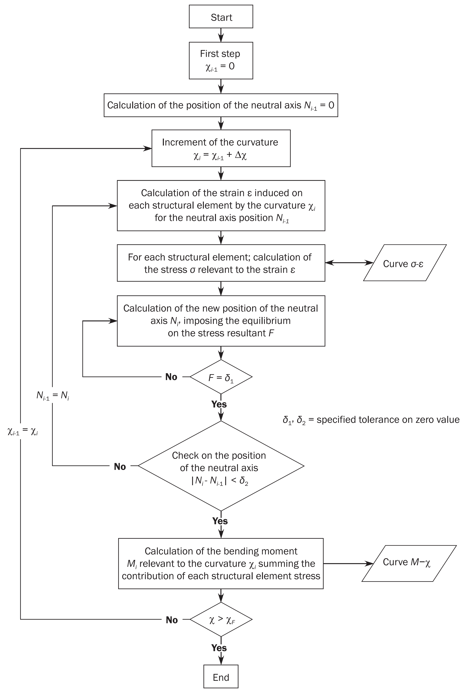
    Figure : Flow chart of the procedure for the evaluation of the curve #eqnID-858
    - **a)** **Step 1** : Divide the transverse section of hull into stiffened plate elements
    - **b)** **Step 2** : Define stress-strain relationships for all the elements, as shown in **Table 1**
    - **c)** **Step 3** : Initialise curvature $R _{eHp} = \frac{R _{eHp1} t _{1-n50} s _{1} +R _{eHp2} t _{2-n50} s _{2}}{t _{n50} S}$ and neutral axis for the first incremental step with the value of incremental curvature (i.e. curvature that induces a stress equal to 1 % of yield strength in strength deck) as:
    - **d)** **Step 4** : Calculate, for each element, the corresponding strain $t _{2-n50}$ and the corresponding stress $s _{1}$
    - **e)** **Step 5** : Determine the neutral axis $s _{2}$ at each incremental step by establishing force equilibrium over the whole transverse section as:
    - **f)** **Step 6** : Calculate the corresponding moment by summing the contributions of all the elements:
    - **g)** **Step 7** : Compare the moment in the current incremental step with the moment in the previous incremental step. If the slope in $\sigma - \varepsilon$ relationship is less than a negative fixed value, terminate the process and define the peak value $\sigma - \varepsilon$. Otherwise, increase the curvature by the amount of $\sigma = \Phi R _{eHA}$ and go to **Step 4**.
  - **2.2.2** **Modelling of the hull girder cross-section**
    Hull girder transverse sections are to be considered as being constituted by the members contributing to the hull girder ultimate strength.
    Sniped stiffeners are also to be modelled, taking account of the fact that they do not contribute to the hull girder strength.
    The structural members are categorised into a stiffener element, a stiffened plate element or a hard corner element.
    The plate panel including web plate of girder or side stringer is idealised into either a stiffened plate element, an attached plate of a stiffener element, or a hard corner element.
    The plate panel is categorised into the following two kinds:
    • Longitudinally stiffened panel, the longer side of which is in the ship longitudinal direction, and
    • Transversely stiffened panel, the longer side of which is in the direction perpendicular to the ship longitudinal direction.
    Hard corner elements are sturdier elements composing the hull girder transverse section, which collapse mainly according to an elasto-plastic mode of failure (material yielding); they are generally constituted by two plates not lying in the same plane.
    The extent of a hard corner element from the point of intersection of the plates is taken equal to 20 $R _{eHA} = \frac{R _{eHP} A _{p-n50} +R _{eHs} A _{s-n50}}{A _{p-n50} +A _{s-n50}}$ on a transversely stiffened panel and to 0.5 *s* on a longitudinally stiffened panel, see **Figure 2.**
    where:
    $\Phi$ : Net offered thickness of the plate, in mm
    s : Spacing of the adjacent longitudinal stiffener, in m.
    Bilge, sheer strake-deck stringer elements, girder-deck connections and face plate-web connections on large girders are typical hard corners.
    The stiffener constitutes a stiffener element together with the attached plate.
    The attached plate width is, in principle, equal to:
    • The mean spacing of the stiffener, when the panels on both sides of the stiffener are longitudinally stiffened, or
    • The width of the longitudinally stiffened panel, when the panel on one side of the stiffener is longitudinally stiffened and the other panel is transversely stiffened, see **Figure 2.**
    The plate between stiffener elements, between a stiffener element and a hard corner element or between hard corner elements is to be treated as a stiffened plate element, see **Figure 2.**
    The typical examples of modelling of hull girder section are illustrated in **Figure 3.** Notwithstanding the foregoing principle, these figures are to be applied to the modelling in the vicinity of upper deck, sheer strake and hatch coaming.
    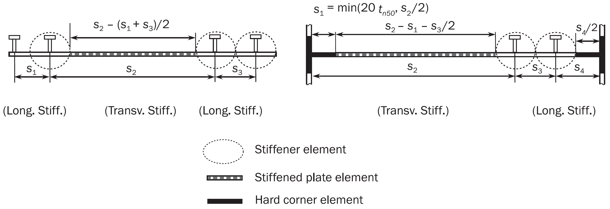
    Figure : Extension of the breadth of the attached plating and hard corner element
    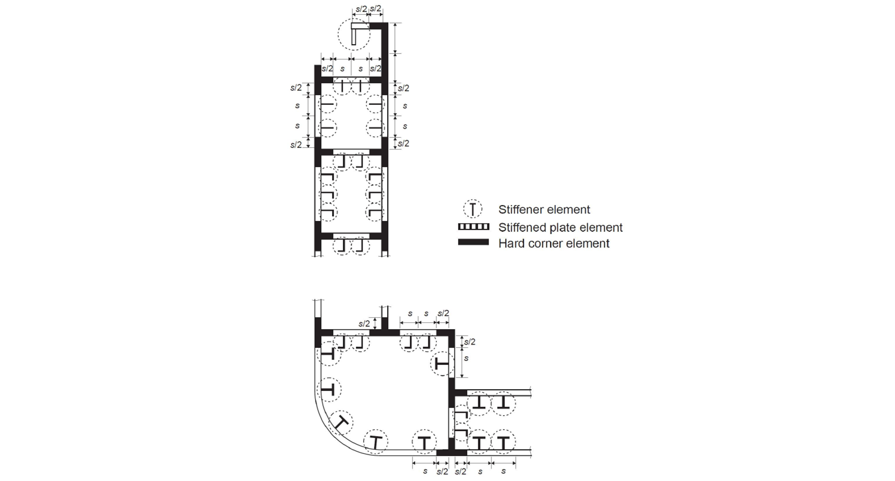
    Figure : Examples of the configuration of stiffened plate elements, stiffener elements andhard corner elements on a hull section
    • In case of knuckle points as shown in **Figure 4,** the plating area adjacent to the knuckles in a plating having an angle greater than 30° is defined as a hard corner. The extent, from the knuckle point, of one side of the corner is taken equal to 20 $\Phi$ on transversely framed panels and to 0.5 *s* on longitudinally framed panels.
    • Where plate elements are stiffened by non-continuous longitudinal stiffeners, the non-continuous stiffeners are considered only as dividing a plate into various elementary plate panels.
    • Where openings are provided in stiffened plate elements, the openings are to be considered in accordance with **Ch 5, Sec 1, [1.2.8].**
    • Where an attached plating is made of steels having different thicknesses and / or yield stresses, an average thickness and / or average yield stress, obtained from the following formulae, are to be used for the calculation:
    $\varepsilon$ $\Phi$
    where,
    $\epsilon$, $\varepsilon$, $\Phi$, $\varepsilon$, $\varepsilon$, $\varepsilon = \frac{\varepsilon _{E}}{\varepsilon _{Y}}$ and $\varepsilon _{E}$ are shown in **Figure 5.**
    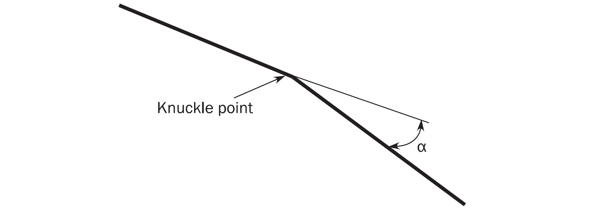
    Figure : Plating with knuckle point
    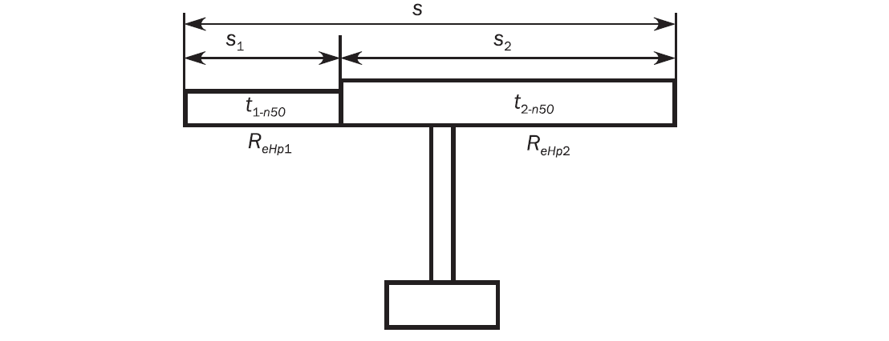
    Figure : Element with different thickness and yield strength
    - **a)** Hard corner element
    - **b)** Stiffener element
    - **c)** Stiffened plate element
- **2.3** **Load-end shortening curves**
  - **2.3.1** **Stiffened plate element and stiffener element**
    Stiffened plate element and stiffener element composing the hull girder transverse sections may collapse, following one of the modes of failure specified in **Table 1.**

    | Element | Mode of failure | Curve $\mathbf{\sigma - \varepsilon }$ defined in |
    | --- | --- | --- |
    | Lengthened stiffened plate element or stiffener element | Elasto-plastic collapse | **[2.3.3]** |
    | Shortened stiffener element | Beam column buckling Torsional buckling Web local buckling of flanged profiles Web local buckling of flat bars | **[2.3.4]** **[2.3.5]** **[2.3.6]** **[2.3.7]** |
    | Shortened stiffened plate element | Plate buckling | **[2.3.8]** |
    - **a)** Where the plate elements are stiffened by non-continuous longitudinal stiffeners, the stress of the element is to be obtained in accordance with **[2.3.3]** to **[2.3.8]**, taking account of the non-continuous longitudinal stiffener. In the calculation of the total forces for checking the hull girder ultimate strength, the area of the non-continuous longitudinal stiffener is to be assumed as zero.
    - **b)** Where an opening is provided in the stiffened plate element, the considered area of the stiffened plate element is to be obtained by deducting the opening area from the plating in the calculation of the total forces for checking the hull girder ultimate strength. The consideration of the opening is in accordance with the requirement in **Ch 5, Sec 1, [1.2.8]** to **[1.2.12]**.
    - **c)** For the stiffened plate element, the effective width of plate for the load shortening portion of the stress-strain curve is to be taken as the full plate width, i.e. to the intersection of the other plate or longitudinal stiffener – neither from the end of the hard corner element nor from the attached plating of the stiffener element, if any. In the calculation of the total forces for checking the hull girder ultimate strength, the area of the stiffened plate element is to be taken between the hard corner element and the stiffener element or between the hard corner elements, as applicable.
  - **2.3.2** **Hard corner element**
    The relevant load-end shortening curve $\varepsilon _{Y}$ is to be obtained for lengthened and shortened hard corners according to **[2.3.3].**
  - **2.3.3** **Elasto-plastic collapse of structural elements**
    The equation describing the load-end shortening curve $\varepsilon _{Y} = \frac{R _{eHA}}{E}$ for the elasto-plastic collapse of structural elements composing the hull girder transverse section is to be obtained from the following formula, valid for both positive (shortening) and negative (lengthening) strains (see **Figure 6**):
    ${\mathbf{\sigma - \varepsilon }}$
    where:
    $\sigma - \varepsilon$ : Equivalent minimum yield stress, in N/mm^2, of the considered element, obtained by the following formula:
    $\sigma _{CR1} = \Phi \sigma _{C1} \frac{A _{s-n50} +A _{pE-n50}}{A _{s-n50} +A _{p-n50}}$
    $\Phi$ : Edge function, equal to:
    $\sigma _{C1}$ = -1 for $\sigma _{C1} = \frac{\sigma _{E1}}{\varepsilon}$ < -1
    $\sigma _{E1} \leq \frac{R _{eHB}}{2} \varepsilon$ = $\sigma _{C1} = R _{eHB} \left( 1- \frac{R _{eHB} \varepsilon}{4 \sigma _{E1}} \right)$ for -1 ≤ $\sigma _{E1} > \frac{R _{eHB}}{2} \varepsilon$ ≤ 1
    $R _{eHB}$ = 1 for $R _{eHB} = \frac{R _{eHp} A _{pEI-n50} \ell _{pE} +R _{eHs} A _{s-n50} \ell _{sE}}{A _{pEI-n50} \ell _{pE} +A _{s-n50} \ell _{sE}}$ > 1
    $A _{pEI-n50}$ : Relative strain, equal to:
    $A _{pEI-n50} =10b _{E1} t _{n50}$
    $\ell _{pE}$$b _{E1}$ : Element strain
    $\ell _{sE}$ : Strain at yield stress in the element, equal to:
    $b _{E1}$
    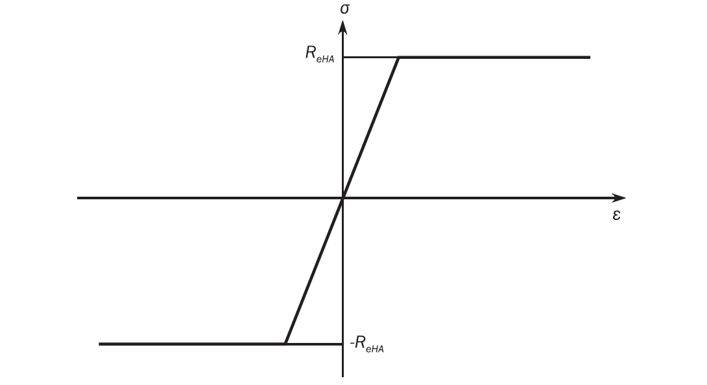
    Figure : Load-end curve #eqnID-891 for elasto plastic collapse
  - **2.3.4** **Beam column buckling**
    The equation describing the load-end shortening curve $\sigma _{E1}$ for the beam column buckling of stiffeners composing the hull girder transverse section is to be obtained from the following formula, see **Figure 7:**
    $\sigma _{E1} = \pi ^{2} E \frac{I _{E-n50}}{A _{E-n50} \ell ^{2}} 10 ^{-4}$
    where:
    $I _{E-n50}$ : Edge function, as defined in **[2.3.3]**
    $b _{E1}$ : Critical stress, in N/mm^2, equal to:
    $A _{E-n50}$, for $b _{E}$
    $b _{E1}$ for $b _{E1} = \frac{s}{\beta _{E}}$
    $\beta _{E} > 1.0$ : Equivalent minimum yield stress, in N/mm^2, of the considered element, obtained by the following formula:
    $b _{E1} = s$
    $\beta _{E} \leq 1.0$ : Effective area, in cm^2, equal to:
    $\beta _{E} = 10 ^{3} \frac{s}{t _{n50}} \sqrt {\frac{\varepsilon R _{eHP}}{E}}$
    $A _{pE-n50}$ : Distance, in mm, measured from the neutral axis of the stiffener with attached plate of width $b _{E}$ to the bottom of the attached plate
    $A _{pE-n50} =10 b _{E} t _{n50}$ : Distance, in mm, measured from the neutral axis of the stiffener with attached plating of width $b _{E}$ to the top of the stiffener
    $b _{E} = \left( \frac{2.25}{\beta _{E}} - \frac{1.25}{\beta _{E} ^{2}} \right) s$ : Relative strain, as defined in **[2.3.3]**
    $\beta _{E} > 1.25$ : Euler column buckling stress, in N/mm^2, equal to:
    $b _{E} = s$
    $\beta _{E} \leq 1.25$ : Net moment of inertia of stiffeners, in cm^4, with attached plating of width $\mathbf{{\sigma _{CR1} - \varepsilon }}$
    $\sigma _{CR2} - \varepsilon$ : Net area, in cm^2, of stiffeners with attached plating of width $\sigma _{CR2} = \Phi \frac{A _{s-n50} \sigma _{C2} +A _{p-n50} \sigma _{CP}}{A _{s-n50} +A _{p-n50}}$
    $\Phi$ : Effective width corrected for relative strain, in m, of the attached plating, equal to:
    $\sigma _{C2}$ for $\sigma _{C2} = \frac{\sigma _{E2}}{\varepsilon}$
    $\sigma _{E 2} \leq \frac{R _{eHs}}{2} \varepsilon$ for $\sigma _{C2} = R _{eHs} \left( 1- \frac{R _{eHs} \varepsilon}{4 \sigma _{E2}} \right)$
    $\sigma _{E 2} > \frac{R _{eHs}}{2} \varepsilon$
    $\sigma _{E2}$ : Net sectional area, in cm^2, of attached plating of width $\sigma _{ET}$, equal to:
    $\varepsilon$
    $\sigma _{CP}$ : Effective width, in m, of the attached plating, equal to:
    $\sigma _{CP} = \left( \frac{2.25}{\beta _{E}} - \frac{1.25}{\beta _{E} ^{2}} \right) R _{eHp}$ for $\beta _{E} > 1.25$
    $\sigma _{CP} = R _{eHp}$ for $\beta _{E} \leq 1.25$
    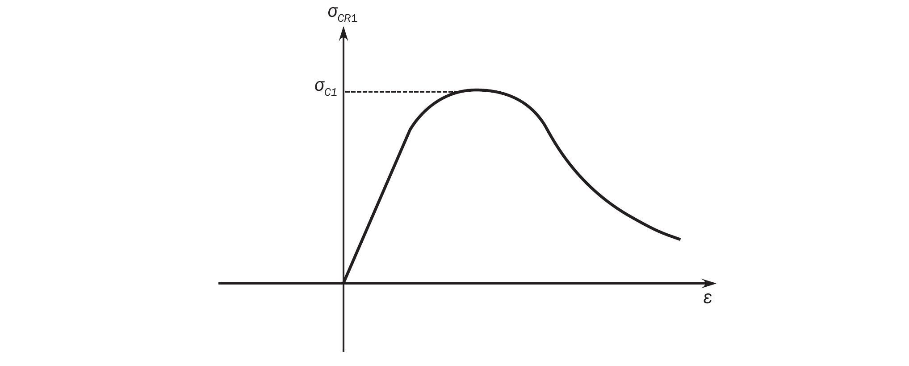
    Figure : Load-end shortening curve #eqnID-929 for beam column buckling
  - **2.3.5** **Torsional buckling**
    The load-end shortening curve $\mathbf{{\sigma _{CR2} - \varepsilon }}$ for the flexural-torsional buckling of stiffeners composing the hull girder transverse section is to be obtained according to the following formula, see **Figure 8:**
    $\sigma _{CR3} - \varepsilon$
    where:
    $\sigma _{CR3} = \Phi \frac{10 ^{3} b _{E} t _{n50} R _{eHp} +(h _{we} t _{w-n50} +b _{f} t _{f-n50} )R _{eHs}}{10 ^{3} st _{n50} +h _{w} t _{w-n50} +b _{f} t _{f-n50}}$ : Edge function, as defined in **[2.3.3]**
    $\Phi$ : Critical stress, in N/mm^2, equal to:
    $b _{E}$ for $h _{we}$
    $h _{we} = \left( \frac{2.25}{\beta _{w}} - \frac{1.25}{\beta _{w} ^{2}} \right) h _{w}$ for $\beta _{w} > 1.25$
    $h _{we} = h _{w}$ : Euler column buckling stress, in N/mm^2, taken equal to $\beta _{w} \leq 1.25$, as defined in **Ch 8, Sec 5, [3.1.3]**
    $\beta _{w} = \frac{h _{w}}{t _{w-n50}} \sqrt {\frac{\varepsilon R _{eHs}}{E}}$ : Relative strain, as defined in **[2.3.3]**
    $\varepsilon$ : Buckling stress of the attached plating, in N/mm^2, equal to:
    $\sigma _{CR4} - \varepsilon$ for $\sigma _{CR4} = \Phi \frac{A _{P-n50} \sigma _{CP} +A _{s-n50} \sigma _{C 4}}{A _{p-n50} +A _{s-n50}}$
    $\Phi$ for $\sigma _{CP}$
    $\sigma _{C 4}$ : Coefficient, as defined in **[2.3.4].**
    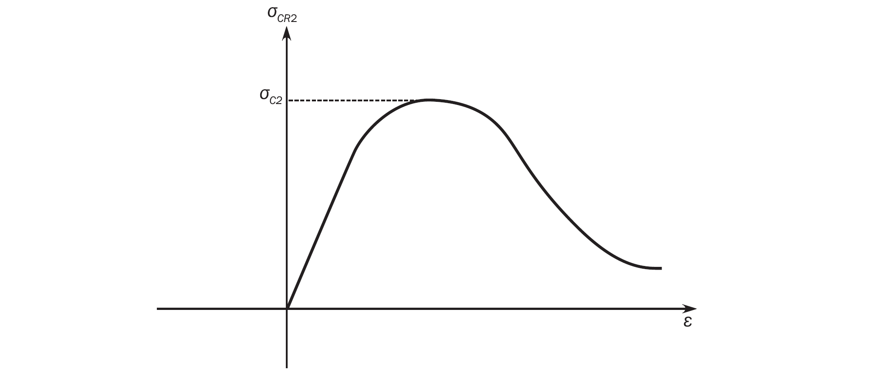
    Figure : Load-end shortening curve #eqnID-947 for flexural-torsional buckling
  - **2.3.6** **Web local buckling of stiffeners made of flanged profiles**
    The equation describing the load-end shortening curve $\sigma _{E 4} \leq \frac{R _{eHs}}{2} \varepsilon$ for the web local buckling of flanged stiffeners composing the hull girder transverse section is to be obtained from the following formula:
    $\sigma _{C 4} = R _{eHs} \left( 1- \frac{R _{eHs} \varepsilon}{4 \sigma _{E 4}} \right)$
    where:
    $\sigma _{E 4} > \frac{R _{eHs}}{2} \varepsilon$ : Edge function, as defined in **[2.3.3]**
    $\sigma _{E 4}$ : Effective width, in m, of the attached shell plating, as defined in **[2.3.4]**
    $\sigma _{E 4} = 160000 \left( \frac{t _{w-n50}}{h _{w}} \right) ^{2}$ : Effective height of the web, in mm, equal to:
    $\varepsilon$ for $\mathbf{{\sigma _{CR4} - \varepsilon }}$
    $\sigma _{CR5} - \varepsilon$ for $sigma CR`5 ``=min {cases{eqalign{PHI R eHp#
    }PHI R eHp LEFT [ {s} over {LITER } LEFT ( {2.25} over {beta E} - {1.25} over {beta E2} RIGHT ) +0.1 LEFT ( 1- {s} over {LITER } RIGHT ) LEFT ( 1+ {1} over {beta E2} RIGHT ) 2 RIGHT ]&}}$
    $\Phi$
    $\beta _{ E}$ : Relative strain, as defined in **[2.3.3].**
  - **2.3.7** **Web local buckling of stiffeners made of flat bars**
    The load-end shortening curve $\beta _{E} = 10 ^{3} \frac{s}{t _{n50}} \sqrt {\frac{\varepsilon R _{eHp}}{E}}$ for the web local buckling of flat bar stiffeners composing the hull girder transverse section is to be obtained from the following formula, see **Figure 9:**
    $ell$
    where:
    $N$ : Edge function, as defined in **[2.3.3]**
    $\omega (s)$ : Buckling stress of the attached plating, in N/mm^2, as defined in **[2.3.5]**
    $\omega (s)= \int _{0} ^{N} {\left( \frac{q _{s}}{t _{s}} -h(s) \right) ds}$ : Critical stress, in N/mm^2, equal to:
    $s$ for $q _{s}$
    $t _{s}$ for $q$
    $q _{i} oint _{i} ^{} {\frac{ds}{t}} -q _{i-1} oint _{i-1} ^{} {\frac{ds}{t}} -q _{i+1} oint _{i+1} ^{} {\frac{ds}{t}} =2A _{i}$ : Local Euler buckling stress, in N/mm^2, equal to:
    $(i=1,2, \cdots ,k)$
    $q _{i}$ : Relative strain, as defined in **[2.3.3].**
    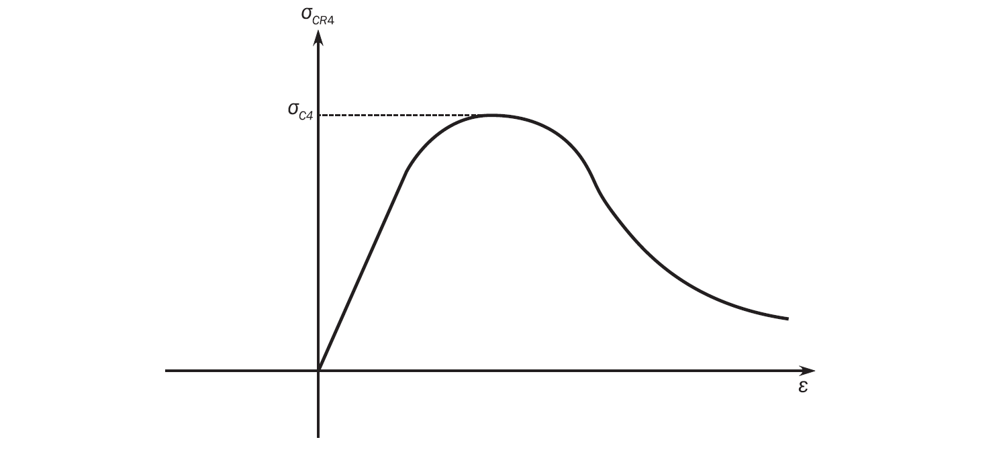
    Figure : Load-end shortening curve #eqnID-971 for web local buckling
  - **2.3.8** **Plate buckling**
    The load-end shortening curve $q _{i-1}$ for the buckling of transversely stiffened panels composing the hull girder transverse section is to be obtained from the following formula:
    $i$
    where:
    $q _{i+1}$ : Edge function, as defined in **[2.3.3]**
    $i$ : value of following formula
    $k$
    *s* : Plate breadth, in m, taken as the spacing between the stiffeners
    $A _{i}$ : Longer side of the plate, in m.

#### 3. Alternative methods

- **3.1** **General**
  - **3.1.1** Application of alternative methods is to be agreed by the Society prior to commencement. Documentation of the analysis methodology and detailed comparison of its results are to be submitted for review and acceptance. The use of such methods may require the partial safety factors to be recalibrated.
  - **3.1.2** The bending moment-curvature relationship *M-χ* may be established by alternative methods. Such models are to consider all the relevant effects important to the non-linear response, with due consideration to:
    • Bi-axial compression
    • Bi-axial tension
    • Shear and lateral pressure
    - **a)** Non-linear geometrical behaviour
    - **b)** Inelastic material behaviour
    - **c)** Geometrical imperfections and residual stresses (geometrical out-of-flatness of plate and stiffeners)
    - **d)** Simultaneously acting loads:
    - **e)** Boundary conditions
    - **f)** Interactions between buckling modes
    - **g)** Interactions between structural elements such as plates, stiffeners, girders, etc
    - **h)** Post-buckling capacity
    - **i)** Overstressed elements on the compression side of hull girder cross-section possibly leading to local permanent sets/buckle damages in plating, stiffeners etc (double bottom effects or similar).
- **3.2** **Non-linear finite element analysis**
  - **3.2.1** Advanced non-linear finite element analysis models may be used for the assessment of the hull girder ultimate capacity. Such models are to consider the relevant effects important to the non-linear responses, with due consideration to the items listed in **[3.1.1].**
  - **3.2.2** Particular attention is to be given to modelling the shape and size of geometrical imperfections. It is to be ensured that the shape and size of geometrical imperfections trigger the most critical failure modes.

### Appendix 3 – Definition of Hull Girder Torsional Properties

#### 1. General

The hull girder torsional properties may be calculated based on the thin walled beam theory. The torsional properties for each design will be calculated with SeaTrust-HullScan.

#### 2. Warping Function

The warping fuction for node “*N* ”, $i$, may be obtained from the following equation.
$t$
where,
*s* : length along girth
*q_s* : Specific stress flow of cell to which each segment belongs
*t_s* : Plate thickness of each segment with the area of longitudinal stiffeners smeared
*h* (*s*) : Distance from the center of twist to the tangent to the point in question. This distance shall be considered positive when, in conjunction with the positive direction of the arc length coordinate *s*, it would correspond to a positive twist.
The specific stress flow, *q*, of each cell may be obtained from the following set of equations; the number of the equation is equal to the number of cells in hull girder section.
$I _{\omega }$ $I _{\omega } = \sum _{n-1} ^{p} t _{n} \int _{0} ^{l _{n}} {\omega ^{2} (s)ds}$
where,
*q_i* : Specific flow for cell “*i* ”
*q_i*_-1 : Specific flow for adjacent cell “*i* -1”
*q_i*_+1 : Specific flow for adjacent cell “*i* +1”
*k* : Number of the cells in hull girder section
*A_i* : Enclosed area of cell “*i* ”
*t* : Plate thickness of segment with the area of longitudinal stiffeners smeared

#### 3. Sectorial Moment of Inertia

The sectorial moment of inertia, $\ell _{n}$, for the hull girder section may be obtained from the following equation:
$t _{n}$
where,
*p* : number of segments in hull girder section
*l_n* : length of segment “*n* ”
*t_n* : Plate thickness of segment “*n* ” with the area of longitudinal stiffeners smeared
$\omega (s)$ : Warping function

#### 4. St. Venant Moment of Inertia

The St. Vemenat moment of inertia, *J*, may be obtained from the following equation:
$J$
where
*A_i* : Enclosed area of cell “*i* ”
t : Plate thickness of segment in cell “*i* ” without smearing longitudinal stiffeners
*k* : Number of the cells in hull girder section
*b_w* : Web height of longitudinal stiffener
*t_w* : Web thickness of longitudinal stiffener
*b_f* : Face plate width of longitudinal stiffener
*t_f* : Face plate thickness of longitudinal stiffener 
