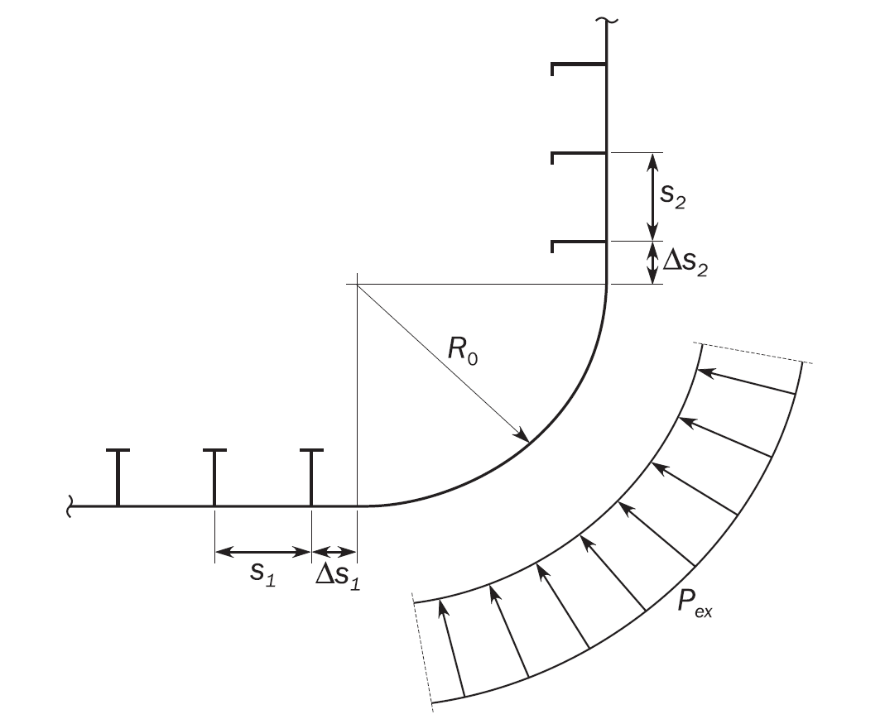
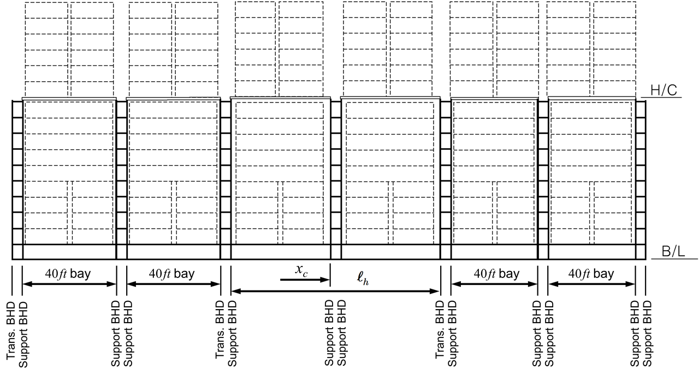
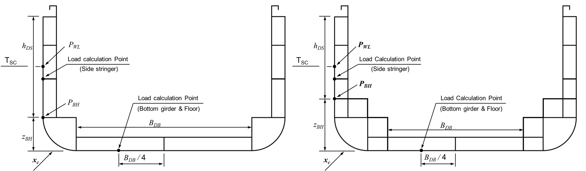
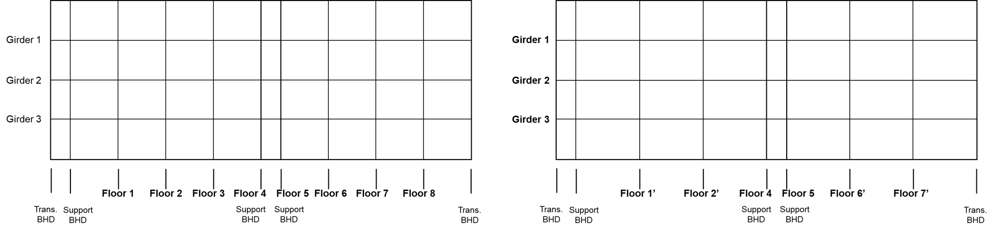
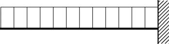

# PART 14 Structural Rules for Container Ships

> RULES FOR CLASSIFICATION OF STEEL SHIPS / RA-14-E / 2025 / EN / Rules

## Chapter 6 Hull Local Scantling

### Section 1 General

#### 1. Application

- **1.1** **Application**
  - **1.1.1** This chapter applies to hull structure over the full length of the ship including fore end, cargo hold region, machinery space and aft end, the side shell above the freeboard deck, engine casing, exposed decks of superstructure and internal decks except those inside superstructure and deckhouse.
  - **1.1.2** This chapter provides requirements for evaluation of plating, stiffeners and Primary Supporting Members (PSM) subject to lateral pressure, local loads and to hull girder loads, as applicable. Requirements are specified for:
    In addition, other requirements not related to defined design load sets, are provided.
    - **a)** Load application in **Sec 2**.
    - **b)** Minimum thickness of plates, stiffeners and PSM in **Sec 3**.
    - **c)** Plating in **Sec 4**.
    - **d)** Stiffeners in **Sec 5**.
    - **e)** PSM and pillars in **Sec 6**.
  - **1.1.3** The offered net scantling is to be greater than or equal to the required scantlings based on requirements provided in this chapter.
  - **1.1.4** Additional local strength requirements are provided in **Ch 10** considering bow impact loads, bottom slamming loads, stern slamming loads and sloshing loads, and for fore end, machinery space and aft end.
- **1.2** **Acceptance criteria**
  - **1.2.1** Acceptance criteria set to be selected based on design load as follows:
    - **a)** AC-S for design load S : static loads
    - **b)** AC-SD for design load S + D : combination of static and dynamic loads
    - **c)** AC-A for design load A : accidental loads
    - **d)** AC-T for design load T : tank testing loads

### Section 2 Load Application

**Symbols**
For symbols not defined in this section, refer to **Ch 1, Sec 4**.

#### 1. Load combination

- **1.1** **Hull girder bending**
  - **1.1.1** **Normal stresses**
    The normal stress $\sigma _{hg}$, in $\mathrm{N}/mm^2$, induced by acting vertical and horizontal bending moments at the position being considered is given as follow. This stress is to be calculated for each design load set, as defined in **[2]** covering all dynamic load cases defined in **Ch 4** in combination with $M_sw$ both in hogging and in sagging.
    $\sigma _{hg} = \left( \frac{M _{sw} +M _{wv-LC}}{I _{y-n50}} (z- z _\mathit{n rm } )- \frac{it M _{wh-LC} rm}{it I _\mathrm{z- it n50} rm} it y \right) 10 ^{-3} +C _{"tor"} \sigma _{WT}$
    where:
    $M_sw$ : Still water bending moment, in $\mathrm{kNm}$, as defined in **Ch 4, Sec 4, [2.2]** in accordance with the considered design load scenario in **Ch 4, Sec 7, Table 1.**
    $M_wv-LC$ : Vertical wave bending moment, in $\mathrm{kNm}$, of the considered dynamic load case, as defined in **Ch 4, Sec 4, [3.2]** in accordance with the considered design load scenario in **Ch 4, Sec 7, Table 1,** at the considered longitudinal position.
    $M_wh-LC$ : Horizontal wave bending moment, in $\mathrm{kNm}$, of the considered dynamic load case, as defined in **Ch 4, Sec 4, [3.4]** in accordance with the considered design load scenario in **Ch 4, Sec 7, Table 1,** at the considered longitudinal position.
    $I_y-n50$ : Net vertical hull girder moment of inertia, at the longitudinal position being considered, in $\mathrm{m}^4$
    $I_{\mathrm{z}-itn50$ : Net horizontal hull girder moment of inertia, at the longitudinal position being considered, in $\mathrm{m}^4$
    $y$ : Transverse coordinate of load calculation point, in $\mathrm{m}$.
    $z$ : Vertical coordinate of the load calculation point under consideration, in $\mathrm{m}$.
    $z _\mathit{n rm}$ : Distance from the baseline to the horizontal neutral axis, in $\mathrm{m}$.
    $C _{"tor"}$ : Warping stress coefficient, as defined in **Ch 5, Sec 1, [3.4.1]**.
    $\sigma_WT$ : Warping stress, in $\mathrm{N}/mm^2$, as defined in **Ch 5, Sec 1, [2.1.4]** to **[2.1.6].**
- **1.2** **Lateral pressures**
  - **1.2.1** **Static and dynamic pressures in intact conditions**
    The static and dynamic lateral pressures in intact condition induced by the sea and the various types of cargoes, ballast and other liquids are to be considered. Applied loads will depend on the location of the elements under consideration, and the adjacent type of compartments.
  - **1.2.2** **Pressure in collision condition**
    The internal liquefied natural gas fuel pressure due to collision is to be considered with colliding acceleration $a _{x}$, whose direction is decided depending on the position of transverse bulkhead of the liquefied natural gas fuel tank considered, combined with static liquefied natural gas fuel pressure.
  - **1.2.3** **Lateral pressure in flooded conditions**
    Watertight boundaries of compartments not intended to carry liquids, excluding shell envelope, are to be subjected to lateral pressure in flooded conditions.
- **1.3** **Pressure combination**
  - **1.3.1** **Elements of the outer shell**
    If the compartment adjacent to the outer shell is intended to carry liquids, the static and dynamic lateral pressures to be considered are the differences between the internal pressures and the external sea pressures at the corresponding draught.
    If the compartment adjacent to the outer shell is not intended to carry liquids, the internal pressures and external sea pressures are to be considered independently.
  - **1.3.2** **Elements other than those of the outer shell**
    Except as specified in **[1.3.1],** the static and dynamic lateral pressures on an element separating two adjacent compartments are those obtained considering the two compartments individually loaded.

#### 2. Design load sets

- **2.1** **Application of load components**
  - **2.1.1** **Application**
    These requirements apply to:
    - **a)** Plating and stiffeners along the full length of the ship.
    - **b)** PSM outside the cargo hold region.
  - **2.1.2** **Load components**
    The static and dynamic load components are to be determined in accordance with **Ch 4, Sec 7, Table 1.** Radius of gyration, $k_r$, and metacentric height, $GM$, are to be in accordance with **Ch 4, Sec 3, Table 1** for the considered loading conditions specified in the design load sets given in **Table 1.**
  - **2.1.3** **Design load sets for plating, stiffeners and PSM**
    Design load sets for plating, stiffeners and primary supporting members are given in **Table 1.**

    | Structural member | Design load set | Load component | Draught | Design load | Loading condition |
    | --- | --- | --- | --- | --- | --- |
    | External shell and Exposed deck | SEA-1 | $P_ex$, $P _{D}$ | $T _{SC}$ | S + D | Full load condition |
    | External shell and Exposed deck | SEA-2 | $P _{ex}$ | $T _{SC}$ | S | Harbour condition |
    | Water ballast tanks | WB-1 | $P _{"in" } -P _{ex}$(1) | $T_BAL$ | S + D | Normal ballast condition |
    | Water ballast tanks | WB-2 | $P _{"in" } -P _{ex}$(1) | $T_BAL$ | S + D | Normal ballast condition Water ballast exchange |
    | Water ballast tanks | WB-3 | $P _{"in" } -P _{ex}$(1) | $0.25T _{SC}$ | S | Harbour condition |
    | Water ballast tanks | WB-4 | $P _{"in" } -P _{ex}$(1) | $0.25T_SC$ | T | Test condition |
    | Other tanks • Fuel oil tanks • Methanol fuel tanks | TK-1 | $P _{"in" } -P _{ex}$(1) | $T_BAL$ | S + D | Normal ballast condition |
    | Other tanks • Fuel oil tanks • Methanol fuel tanks | TK-2 | $P _{"in" } -P _{ex}$(1) | $0.25T_SC$ | S | Harbour condition |
    | Other tanks • Fuel oil tanks • Methanol fuel tanks | TK-3 | $P _{"in" } -P _{ex}$(1) | $0.25T_SC$ | T | Test condition |
    | Liquefied natural gas fuel tank | FTK-1 | $P_"in"$ | $T _{SC}$ | S + D | Full load condition |
    | Liquefied natural gas fuel tank | COL(2) | $P_"in"$ | - | A | Collision condition |
    | Watertight boundaries | FD-1(3) | $P_"in"$ | - | A | Flooded condition |
    | Dry space and hatch coaming | VD-1 | $P _{ex}$, $P _{"in"}$ | $T _{SC}$ | S + D | Full load condition |
    | (1) $P_ex$ is to be considered for external shell only. (2) COL set means collision conditions that 0.5g and –0.25g of colliding accelerations in way of longitudinal direction are to be applied for liquefied natural gas fuel tank full condition under Accidental design load (A) in order to verify structural integrity of liquefied natural gas fuel tank boundary and support structures, refer to “**Rules/Guidance for the Classification of Ships Using Low-flashpoint Fuels”, Ch 6, Sec 4, 409.5.** (3) FD-1 is not applicable to external shell. |   |   |   |   |   |

### Section 3 Minimum Thickness

**Symbols**
For symbols not defined in this section, refer to **Ch 1, Sec 4.**

#### 1. Plating

- **1.1** **Minimum thickness requirements**
  - **1.1.1** The net thickness of plating in $\mathrm{mm}$, is to comply with the appropriate minimum thickness requirements given in **Table 1.**

    | Element | Location | Area | Net thickness |
    | --- | --- | --- | --- |
    | Shell | Keel | - | $7.5+0.03L _{2} \sqrt {k}$ |
    | Shell | Bottom Side shell Bilge | Fore Part | $5.5+0.03L _{2} \sqrt {k}$ |
    | Shell | Bottom Side shell Bilge | Machinery space, Aft part | $7.0+0.02L _{2} \sqrt {k}$ |
    | Shell | Bottom Side shell Bilge | Elsewhere | $4.0+0.035L _{2} \sqrt {k}$ |
    | Breast hook | - | Fore part | $6.5$ |
    | Deck | Weather deck, strength deck, internal tank boundary | - | $3.7+0.019L _{2} \sqrt {k}$ |
    | Deck | Platform deck | Machinery space | $4.5+0.02L _{2} \sqrt {k}$ |
    | Deck | Platform deck | Elsewhere | $6.5$ |
    | Inner bottom(1) | - | Machinery space | $6.1+0.024L _{2} \sqrt {k}$ |
    | Inner bottom(1) | - | Elsewhere | $4.0+0.028L _{2} \sqrt {k}$ |
    | Bulkheads | Ballast tank boundary | - | $4.5+0.016L _{2} \sqrt {k}$ |
    | Bulkheads | Transverse / longitudinal watertight bulkhead and other tanks bulkheads | - | $4.5+0.01L _{2} \sqrt {k}$ |
    | Bulkheads | Non-tight bulkhead, Bulkheads between dry spaces. | - | $4.5+0.01L _{2} \sqrt {k}$ |
    | Bulkheads | Pillar bulkheads in fore and aft peaks | - | $7.5$ |
    | Other members | Engine casing (in the cargo hold region) | Cargo hold region | $5.5$ |
    | Other members | Engine casing (in way of accommodation) | Accommodation | $4.0$ |
    | Other members | Other plates in general | - | $4.5+0.01L _{2} \sqrt {k}$ |
    | (1) Applicable for both tight and non tight members |   |   |   |

#### 2. Stiffeners and tripping brackets

- **2.1** **Minimum thickness requirements**
  - **2.1.1** The net thickness of the web and face plate, if any, of stiffeners and tripping brackets in $\mathrm{mm}$, is to comply with the minimum net thickness given in **Table 2.**
    In addition, the net thickness of the web of stiffeners and tripping brackets, in $\mathrm{mm}$, is to be:

    | Element | Location | Net thickness |
    | --- | --- | --- |
    | Stiffeners and attached end brackets | Watertight boundary | $4.5 +0.007L _{2}$ |
    | Stiffeners and attached end brackets | Other structure | $4.0 +0.007L _{2}$ |
    | Tripping brackets |   | $4.5 +0.01L _{2}$ |
    - **a)** Not less than 40 % of the net required thickness of the attached plating, to be determined according to **Sec 4.**
    - **b)** Less than twice the net offered thickness of the attached plating.

#### 3. Primary supporting members

- **3.1** **Minimum thickness requirements**
  - **3.1.1** The net thickness of web plating and flange of primary supporting members in $\mathrm{mm}$, is to comply with the minimum net thickness given in **Table 3.**

    | Element | Location | Net thickness |
    | --- | --- | --- |
    | Double bottom centreline girder | Machinery space | $0.50 \sqrt {L _{2} k} +5.5$ |
    | Double bottom centreline girder | Elsewhere | $0.45 \sqrt {L _{2} k} +5.0$ |
    | Other bottom girder | Machinery space | $0.45 \sqrt {L _{2} k} +5.0$ |
    | Other bottom girder | Fore part | $0.45 \sqrt {L _{2} k} +4.0$ |
    | Other bottom girder | Elsewhere | $0.35 \sqrt {L _{2} k} +3.5$ |
    | Girders bounding a duct keel | Machinery space | $0.50 \sqrt {L _{2} k} +5.0$ |
    | Bottom floor | Machinery space | $0.40 \sqrt {L _{2} k} +5.0$ |
    | Bottom floor | Fore part | $0.30 \sqrt {L _{2} k} +5.0$ |
    | Bottom floor | Elsewhere | $0.30 \sqrt {L _{2} k} +4.0$ |
    | Aft peak floor | - | $0.30 \sqrt {L _{2} k} +4.0$ |
    | Other primary supporting member | - | $0.20 \sqrt {L _{2} k} +4.0$ |

### Section 4 Plating

**Symbols**
For symbols not defined in this section, refer to **Ch 1, Sec 4.**
$\alpha_p$ : Correction factor for the panel aspect ratio to be taken as follow but not to be taken greater than 1.0.
$\alpha_p =1.2- \frac{b}{2.1 a}$
$a$ : Length of plate panel, in $\mathrm{mm}$, as defined in **Ch 3, Sec 7, [2.2.2].**
$b$ : Breath of plate panel, in $\mathrm{mm}$, as defined in **Ch 3, Sec 7, [2.2.2].**
$P$ : Design pressure for the considered design load set, see **Sec 2, [2],** calculated at the load calculation point defined in **Ch 3, Sec 7, [2.2],** in $\mathrm{kN}/m^2$.
$\sigma_hg$ : Hull girder bending stress, in $\mathrm{N}/mm^2$, as defined in **Sec 2, [1.1],** calculated at the load calculation point as defined in **Ch 3, Sec 7, [2.2].**
$\chi$ : Coefficient taken equal to:
 $\chi =1.00$
 $\chi =0.95$ for collision bulkheads for acceptance criteria set AC-A
 $\chi =1.15$ for other watertight boundaries of compartments

#### 1. Plating subjected to lateral pressure

- **1.1** **Yielding check**
  - **1.1.1** **Plating**
    The net thickness, $t$ in $\mathrm{mm}$, is not to be taken less than the greatest value for all applicable design load sets, as defined in **Sec 2, [2.1.3],** given by:
    $t= 0.0158 \alpha _{p} b \sqrt {\frac{\left| P \right|}{\chi C _{a} R _{eH}}}$
    where:
    $C _{a}$ : Permissible bending stress coefficient for plate taken equal to:
    $C _{a} = \beta - \alpha \frac{\left| \sigma _{hg} \right|}{R _{eH}}$, not to be taken greater than $C _{a- it \max}$
    $\beta$ : Coefficient as defined in **Table 1.**
    $\alpha$ : Coefficient as defined in **Table 1.**
    $C _{a- it \max}$ : Maximum permissible bending stress coefficient as defined in **Table 1.**

    | Acceptance criteria set | Structural member |   | $\beta$ | $\alpha$ | $C _{a-m ax}$ |
    | --- | --- | --- | --- | --- | --- |
    | AC-S | Longitudinal strength members | Longitudinally stiffened plating | 0.90 | 0.5 | 0.80 |
    | AC-S | Longitudinal strength members | Transversely stiffened plating | 0.90 | 1.0 | 0.80 |
    | AC-S | Other members |   | 0.80 | 0.0 | 0.80 |
    | AC-SD | Longitudinal strength members | Longitudinally stiffened plating | 1.05 | 0.5 | 0.95 |
    | AC-SD | Longitudinal strength members | Transversely stiffened plating | 1.05 | 1.0 | 0.95 |
    | AC-SD | Other members |   | 1.00 | 0.0 | 1.00 |
    | AC-A | Longitudinal strength members | Longitudinally stiffened plating | 1.10 | 0.5 | 1.00 |
    | AC-A | Longitudinal strength members | Transversely stiffened plating | 1.10 | 1.0 | 1.00 |
    | AC-A | Other members |   | 1.00 | 0.0 | 1.00 |
    | AC-T | Longitudinal strength members | Longitudinally stiffened plating | 1.25 | 0.5 | 1.15 |
    | AC-T | Longitudinal strength members | Transversely stiffened plating | 1.15 | 1.0 | 1.15 |
    | AC-T | Other members |   | 1.15 | 0.0 | 1.15 |
- **1.2** **Plating of corrugated bulkheads**
  - **1.2.1** **Cold, hot formed and built up corrugations**
    The net thicknesses, $t$ in $\mathrm{mm}$, of the web and flange plates of corrugated bulkheads are not to be taken less than the greatest value calculated for all applicable design load sets, as defined in **Sec 2, [2.1.3]**, given by:
    $t= 0.0158 b _{p} \sqrt {\frac{\left| P \right|}{C _{CB} R _{eH}}}$
    where:
    $b _{p}$ : Breadth of plane corrugation plating:
    $b _{p} =b _{f-cg}$ for flange plating, in $\mathrm{mm}$, as defined in **Ch 3, Sec 6, Figure 21**.
    $b _{p} =b _{w-cg}$ for web plating, in $\mathrm{mm}$, as defined in **Ch 3, Sec 6, Figure 21**.
    $C _{CB}$ : Permissible bending stress coefficient for corrugated bulkheads plating taken equal to:
    $C _{CB} = \beta _{CB} - \alpha _{CB} \frac{\left| \sigma _{hg} \right|}{R _{eH}}$, not to be taken greater than $C _{CB-"\max"}$
    $\beta _{CB}$ : Coefficient as defined in **Table 2**.
    $\alpha _{CB}$ : Coefficient as defined in **Table 2**.
    $C _{CB-"\max"}$ : Maximum permissible bending stress coefficient as defined in **Table 2**.

    | Acceptancecriteria set | Structural member | $\beta _{CB}$ | $\alpha _{CB}$ | $C _{CB-"\max"}$ |
    | --- | --- | --- | --- | --- |
    | AC-S | Horizontally corrugated longitudinal bulkheads | 0.90 | 0.50 | 0.75 |
    | AC-S | Other corrugated bulkheads | 0.75 | 0.00 | 0.75 |
    | AC-SD | Horizontally corrugated longitudinal bulkheads | 1.05 | 0.50 | 0.90 |
    | AC-SD | Other corrugated bulkheads | 0.90 | 0.00 | 0.90 |
    | AC-T | Horizontally corrugated longitudinal bulkheads | 1.10 | 0.50 | 0.95 |
    | AC-T | Other corrugated bulkheads | 1.00 | 0.00 | 1.00 |
  - **1.2.2** **Built-up corrugations**
    For built-up corrugations, with flange and web plate of different thickness, the net thickness, $t _{1}$ in $\mathrm{mm}$, is to be taken as the greatest value calculated for all applicable design load sets, as defined in **Sec 2, [2.1.3]**, given by:
    $t _{1} = \sqrt {\frac{0.0005 b _{p} ^{2} \left| P \right|}{C _{CB} R _{eH}} -t _{2}^{2}}$
    where:
    $t _{1}$ : Net thickness of the thicker plating, either flange or web, in $\mathrm{mm}$.
    $t _{2}$ : Net thickness of the thinner plating, either flange or web, in $\mathrm{mm}$.
    $b _{p}$ : Breadth of thicker plate, either flange or web, in $\mathrm{mm}$.
    $C _{CB}$ : Permissible bending stress coefficient as defined in **[1.2.1]**.
  - **1.2.3** **Net section modulus over the height with no lower and upper stool**
    The net section modulus at the lower and upper ends and at the mid length of the corrugation of a unit corrugation, $Z _{cg}$ are to be taken as the greatest value calculated for all applicable design load sets, as given in **Sec 2, [2]** and given by the following.
    $Z _{cg} = \frac{1000 M _{cg}}{C _{s-cg} R _{eH}}$
    where:
    $M _{cg}$ : Vertical bending moment in $\mathrm{kNm}$.
    $M _{cg} = \frac{vert P vert s _{cg} \ell _{bdg}^{2}}{12000}$
    $P$ : Averaged pressure in $\mathrm{kN}/m ^{2}$.
    $P = \frac{P _{u} + P _{\ell}}{2}$
    $P _{\ell}$, $P _{u}$ : Design pressure given in **Sec 2, Table 1** for the design load set being considered, calculated at the lower and upper ends of the corrugation, respectively, in $\mathrm{kN}/m ^{2}$:
    • For transverse corrugated bulkheads, the pressures are to be calculated at a section located at $b _{tk} /2$ from the longitudinal bulkheads of each tank.
    • For longitudinal corrugated bulkheads, the pressures are to be calculated at the ends of the tank, i.e. the intersection of the forward and aft transverse bulkheads and the longitudinal bulkhead.
    $b _{tk}$ : Maximum breadth of tank under consideration measured at the bulkhead, in $\mathrm{m}$.
    $s _{cg}$ : Half pitch length of corrugation, in $\mathrm{mm}$, as defined in **Ch 3, Sec 6, Figure 21**.
    $\ell _{bdg}$ : Effective bending span of the corrugation, in $\mathrm{m}$, as defined in **Ch 3, Sec 6, Figure 22,** measured from the mid depth of the lower stool to the mid depth of the upper stool. Where no lower or upper stool is fitted, $\ell _{bdg}$(=$\ell _{c}$) is to be measured to lower or upper end.
    $C _{s-cg}$ : Permissible bending stress coefficient for corrugated bulkheads taken as to:
    $C _{s-cg} = \beta _{CB} - \alpha _{CB} \frac{\left| \sigma _{hg} \right|}{R _{eH}}$, not to be taken greater than $C _{s-cg-"\max"}$
    $\beta _{CB}$ : Coefficient as defined in **Table 3**.
    $\alpha _{CB}$ : Coefficient as defined in **Table 3**.
    $C _{s-cg-"\max"}$ : Maximum permissible bending stress coefficient as defined in **Table 3**.

    | Acceptancecriteria set | Structural member | $\beta _{CB}$ | $\alpha _{CB}$ | $C _{s-cg-"\max"}$ |
    | --- | --- | --- | --- | --- |
    | AC-S | Horizontally corrugated longitudinal bulkheads | 0.85 | 1.00 | 0.75 |
    | AC-S | Other corrugated bulkheads | 0.75 | 0.00 | 0.75 |
    | AC-SD | Horizontally corrugated longitudinal bulkheads | 1.00 | 1.00 | 0.90 |
    | AC-SD | Other corrugated bulkheads | 0.90 | 0.00 | 0.90 |
    | AC-T | Horizontally corrugated longitudinal bulkheads | 1.00 | 1.00 | 0.95 |
    | AC-T | Other corrugated bulkheads | 1.00 | 0.00 | 1.00 |

#### 2. Special requirements

- **2.1** **Minimum thickness of keel plating**
  - **2.1.1** The net thickness of the keel plating is not to be taken less than the required net thickness of the adjacent 2.0 $\mathrm{m}$ width bottom plating, measured from the edge of the keel strake.
    The width of the keel is defined in **Ch 3, Sec 6, [7.2.1].**
- **2.2** **Bilge plating**
  - **2.2.1** **Definition of bilge plating**
    The definition of bilge plating is given in **Ch 1, Sec 4, [3.8.1].**
  - **2.2.2** **Bilge plate thickness**
    $t=6.45 \times 10 ^{-4} (P _{ex} s _{b} ) ^{0.4} R ^{0.6}$
    where:
    $P _{ex}$ : Design sea pressure for the design load set SEA-1 as defined in Sec 2, [2.1.3] calculated at the lower turn of the bilge, in $\mathrm{kN}/m ^{2}$.
    $R$ : Effective bilge radius in $\mathrm{mm}$.
    $R=R _{0} +0.5( \Delta s _{1} + \Delta s _{2} )$
    $R _{0}$ : Radius of curvature, in $\mathrm{mm}$. See **Figure 1.**
    $\Delta s _{1}$ : Distance between the lower turn of bilge and the outermost bottom longitudinal, in $\mathrm{mm}$, see **Figure 1.** Where the outermost bottom longitudinal is within the curvature, this distance is to be taken as zero.
    $\Delta s _{2}$ : Distance between the upper turn of bilge and the lowest side longitudinal, in $\mathrm{mm}$, see **Figure 1.** Where the lowest side longitudinal is within the curvature, this distance is to be taken as zero.
    $s _{b}$ : Distance between transverse stiffeners, webs or bilge brackets, in $\mathrm{mm}$.
    - **a)** The net thickness of bilge plating is not to be taken less than the offered net thickness for the adjacent bottom shell or adjacent side shell plating, whichever is greater.
    - **b)** The net thickness of rounded bilge plating, $t$, in $\mathrm{mm}$, is not to be taken less than:
    - **c)** Longitudinally stiffened bilge plating is to be assessed as regular stiffened plating. The bilge thickness is not to be less than the lesser of the value obtained by **[1.1.1]** and **[2.2.2] b)**. A bilge keel is not considered as an effective ‘longitudinal stiffening’ member.
  - **2.2.3** **Transverse extension of bilge minimum plate thickness**
    Where a plate seam is located in the straight plate just below the lowest stiffener on the side shell, any increased thickness required for the bilge plating does not have to be extended to the adjacent plate above the bilge provided the plate seam is not more than $s_2 /4$ below the lowest side longitudinal. Similarly, for the flat part of adjacent bottom plating, any increased thickness for the bilge plating does not have to be extended to the adjacent plate provided that the plate seam is not more than $s_1 /4$ beyond the outboard bottom longitudinal. For definition of $s_1$ and $s_2$, see **Figure 1.**
    
    Figure : Transverse stiffened bilge plating
  - **2.2.4** **Hull envelope framing in bilge area**
    For transversely stiffened bilge plating, a longitudinal is to be fitted at the bottom and at the side close to the position where the curvature of the bilge plate starts. The scantling of those longitudinals are to be not less than the one of the closer adjacent stiffener. The distance between the lower turn of bilge and the outermost bottom longitudinal, $triangle s_1$, is generally not to be greater than one-third of the spacing between the two outermost bottom longitudinals, $s_1$. Similarly, the distance between the upper turn of the bilge and the lowest side longitudinal, $triangle s_2$, is generally not to be greater than one-third of the spacing between the two lowest side longitudinals, $s_2$, See **Figure 1.**
- **2.3** **Side shell plating**
  - **2.3.1** **Fender contact zone**
    The net thickness, $t$ in $\mathrm{mm}$, of the side shell plating within the fender contact zone as specified in **[2.3.2]** is not to be taken less than:
    $t=26 \left( \frac{b}{1000} +0.7 \right) \left( \frac{B T _{SC}}{R _{eH}^{2}} \right) ^{0.25}$
  - **2.3.2** **Application of fender contact zone requirement**
    The application extends within the cargo hold region as defined in **Ch 1, Sec 1, [2.4.3],** from the ballast draught $T_BAL$ to 0.25 $T _{SC}$ (minimum 2.2 $\mathrm{m}$) above $T _{SC}$.
  - **2.3.3** **Strengthening for harbour and tug manoeuvres**
    In those zones of the side shell which may be exposed to concentrated loads due to harbour manoeuvres the plate net thickness is not to be less than given in **[2.3.4]**. These zones are mainly the plates in way of the ship's fore and aft shoulder and in addition amidships. The exact locations where the tugs shall push are to be defined in the building specification. They are to be identified in the shell expansion plan. The length of the strengthened areas shall not be less than approximately 5 m. The height of the strengthened areas shall extend from about 0.5 $\mathrm{m}$ above ballast draught to about 4.0 $\mathrm{m}$ above scantling draught. (Where the side shell thickness so determined exceeds the thickness required by this section, it is recommended to specially mark these areas.)
  - **2.3.4** **Plate thickness in tug pushing area**
    The net thickness, in $\mathrm{mm}$, in the strengthened areas is to be determined by the following formula:
    $t=0.65 \sqrt {P _{fl} k}$
    where:
    $P _{fl}$ : Local design force, in $\mathrm{kN}$, shall not be taken less than:
    $P _{fl} = \Delta /100$ $(200 \leq P _{fl} \leq 700)$
- **2.4** **Sheer strake**
  - **2.4.1** **General**
    The minimum width of the sheer strake is defined in **Ch 3, Sec 6, [8.2.4]**. The thickness of sheer strakes at the strength deck for midship part is not to be less than 75 % of the stringer plate of the strength deck. Where the global analysis is performed in compliance with **Pt.3, Annex 3-2**, the sheer strake may be reduced in thickness.
    In no case, however, is the thickness to be less than that of the adjacent side shell plating.
  - **2.4.2** **Welded sheer strake**
    Within 0.6 $L$ of amidships, the net thickness of a welded sheer strake is not to be less than the offered net thickness of the adjacent 2.0 $\mathrm{m}$ width side plating.
  - **2.4.3** **Rounded sheer strake**
    The net thickness of a rounded sheer strake is not to be less than:
    - **a)** The offered net thickness of the adjacent 2.0 $\mathrm{m}$ width deck plating, or
    - **b)** The offered net thickness of the adjacent 2.0 $\mathrm{m}$ width side plating, whichever is greater.
- **2.5** **Deck stringer plating**
  - **2.5.1** The minimum width of deck stringer plating is defined in **Ch 3, Sec 6, [9.1.2].**
  - **2.5.2** Within 0.6 $L$ of amidships, the net thickness of the deck stringer plate is not to be less than the offered net thickness of the adjacent deck plating.
- **2.6** **Aft peak bulkhead**
  - **2.6.1** The net thickness of the aft peak bulkhead plating in way of the stern tube penetration is to be at least 1.6 times the required thickness for the bulkhead plating.
- **2.7** **Plating in liquefied natural gas fuel tank boundary**
  - **2.7.1** **By IGF pressure**
    The net thickness of inner hull plating protected by fuel containment system, $t$ in $\mathrm{mm}$, is not to be taken less than:
    $t= 0.0158 \alpha _{p} b \sqrt {\frac{\left| P _{IGF} \right|}{\chi C _{a-IGF} R _{eH}}}$
    where:
    $P _{IGF}$ : Pressure given in **“Rules/Guidance for the Classification of Ships Using Low-flashpoint Fuels”, Ch 6, Sec 4, 409.**, in $\mathrm{kN}/m^2$
    $C _{a-IGF}$ : Permissible bending stress coefficient for plate taken equal to:
    $C _{a-IGF} = \beta _{IGF} - \alpha _{IGF} \frac{\left| \sigma _{hg-IGF} \right|}{R _{eH}}$, not to be taken greater than $C _{a-IGF- it \max}$
    $\sigma _{hg-IGF} = it \max \left[ \left| \left( \frac{M _{sw} +M _{wv-LC}}{I _{y-n50}} \left( z-z _{n} \right) \right) 10 ^{-3} \right| , \left| \left\{ \left( \frac{M _{sw} +0.5M _{wv-LC}}{I _{y-n50}} \left( z-z _{n} \right) \right) + \left( \frac{M _{wh-LC}}{I _{z-n50}} \left( y-y _{n} \right) \right) \right\} 10 ^{-3} \right| \right]$
    $\beta _{IGF}$ : Coefficient as defined in **Table 4.**
    $\alpha _{IGF}$ : Coefficient as defined in **Table 4.**
    $C _{a-IGF- it \max}$ : Maximum permissible bending stress coefficient as defined in **Table 4.**

    | Acceptance criteria set | Structural member |   | $\beta _{IGF}$ | $\alpha _{IGF}$ | $C _{a-IGF-m ax}$ |
    | --- | --- | --- | --- | --- | --- |
    | IGF condition | Longitudinal strength members | Longitudinally stiffened plating | 1.05 | 0.5 | 0.95 |
    | IGF condition | Longitudinal strength members | Transversely stiffened plating | 1.05 | 1.0 | 0.95 |
    | IGF condition | Other members |   | 1.0 | 0.0 | 1.0 |
  - **2.7.2** **By sloshing pressure**
    The net thickness of plating, $t$ in $\mathrm{mm}$, subjected to sloshing pressures is not to be less than:
    $t= 0.0158 \alpha _{p} b \sqrt {\frac{P _{slh}}{\chi C _{a-slh} R _{eH}}}$
    where:
    $P _{slh}$ : Pressure given in **Ch 4, Sec 6, [3.2.3]**, in $\mathrm{kN}/m^2$.
    $C _{a-slh}$ : Permissible bending stress coefficient for plate taken equal to:
    $C _{a-slh} = \beta - \alpha \frac{\left| \sigma _{hg-slh} \right|}{R _{eH}}$, not to be taken greater than $C _{a- it \max}$
    $\sigma _{hg-slh} = \left[ \frac{M _{sw}}{I _{y-n50}} \left( z-z _{n} \right) \right] 10 ^{-3}$ in $\mathrm{N}/mm ^{2}$
    $\beta$ : Coefficient of AC-S as defined in **Table 1.**
    $\alpha$ : Coefficient of AC-S as defined in **Table 1.**
    $C _{a- it \max}$ : Maximum permissible bending stress coefficient of AC-S as defined in **Table 1.**

### Section 5 Stiffeners

**Symbols**
For symbols not defined in this section, refer to **Ch 1, Sec 4.**
$d _{shr}$ : Effective shear depth, in $\mathrm{mm}$, as defined in **Ch 3, Sec 7, [1.4.3].**
$\ell _{bdg}$ : Effective bending span, in $\mathrm{m}$, as defined in **Ch 3, Sec 7, [1.1.2].**
$\ell _{shr}$ : Effective shear span, in $\mathrm{m}$, as defined in **Ch 3, Sec 7, [1.1.3].**
$P$ : Design pressure for the design load set being defined in **Sec 2** and calculated at the load calculation point defined in **Ch 3, Sec 7, [3.2],** in $\mathrm{kN}/m ^{2}$
$\chi$ : Coefficient taken equal to:
 $\chi =1.00$
 $\chi =0.95$ for collision bulkheads for acceptance criteria set AC-A
 $\chi =1.15$ for other watertight boundaries of compartments

#### 1. Stiffeners subject to lateral pressure

- **1.1** **Yielding check**
  - **1.1.1** **Web plating**
    The minimum net web thickness, $t _{w}$ in $\mathrm{mm}$, is not to be taken less than the greatest value calculated for all applicable design load sets as defined in **Sec 2, [2],** given by:
    $t _{w} = \frac{f _{shr} \left| P \right| s \ell _{shr}}{d _{shr} \chi C _{t} \tau _{eH}}$ with $\chi C _{t}$ not to be taken greater than 1.0.
    where:
    $f _{shr}$ : Shear force distribution factor taken as:
     $f _{shr} =0.5$ for horizontal stiffeners and upper end of vertical stiffeners.
     $f _{shr} =0.7$ for lower end of vertical stiffeners
    $C _{t}$ : Permissible shear stress coefficient for the design load set being considered, taken as:
    - **a)** For continuous stiffeners with fixed ends, $f _{shr}$ is not to be taken less than:
    - **b)** For stiffeners with reduced end fixity, variable load or being part of grillage, the requirement in **[1.2]** applies.
    - **a)** $C _{t} =0.75$ for acceptance criteria set AC-S.
    - **b)** $C _{t} =0.90$ for acceptance criteria set AC-SD.
    - **c)** $C _{t} =1.00$ for acceptance criteria set AC-A.
    - **d)** $C _{t} =0.95$ for acceptance criteria set AC-T.
  - **1.1.2** **Section modulus**
    The minimum net section modulus, $Z$ in $\mathrm{cm} ^{3}$, is not to be taken less than the greatest value calculated for all applicable design load sets as defined in **Sec 2, [2.1.3],** given by:
    $Z= \frac{\left| P \right| s \ell _{bdg}^{ 2}}{f _{bdg} \chi C _{s} R _{eH}}$ with $\chi C _{s}$ not to be taken greater than 1.0
    where:
    $f _{bdg}$ : Bending moment factor taken as:
     $f _{bdg} =12$ for horizontal stiffeners and upper end of vertical stiffeners.
     $f _{bdg} =10$ for lower end of vertical stiffeners.
    $C _{s}$ : Permissible bending stress coefficient as defined in **Table 1** for the design load set being considered.
    $\sigma _{hg}$ : Hull girder bending stress, in $\mathrm{N}/mm ^{2}$, as defined in **Sec 2, [1.1],** calculated at the load calculation point as defined in **Ch 3, Sec 7, [3.2].**
    $\beta _{s}$ : Coefficient as defined in **Table 2.**
    $\alpha _{s}$ : Coefficient as defined in **Table 2.**
    $C _{s-itmax}$ : Coefficient as defined in **Table 2.**

    | Sign of hull girder bending stress, $\sigma _{hg}$ | Lateral pressure acting on | Coefficient $C _{s}$ |
    | --- | --- | --- |
    | Tension (positive) | Stiffener side | $C _{s} = \beta _{s} - \alpha _{s} \frac{\left\| \sigma _{hg} \right\|}{R _{eH}}$ but not to be taken greater than $C _{s-itmax}$ |
    | Compression (negative) | Plate side | $C _{s} = \beta _{s} - \alpha _{s} \frac{\left\| \sigma _{hg} \right\|}{R _{eH}}$ but not to be taken greater than $C _{s-itmax}$ |
    | Tension (positive) | Plate side | $C _{s} = C_{s-itmax$ |
    | Compression (negative) | Stiffener side | $C _{s} = C_{s-itmax$ |

    | Acceptance criteria set | Structural member | $\beta _{s}$ | $\alpha _{s}$ | $C _{s-itmax}$ |
    | --- | --- | --- | --- | --- |
    | AC-S | Longitudinal strength member | 0.95 | 1.0 | 0.85 |
    | AC-S | Transverse or vertical member | 0.85 | 0.0 | 0.85 |
    | AC-SD | Longitudinal strength member | 1.10 | 1.0 | 0.95 |
    | AC-SD | Transverse or vertical member | 0.95 | 0.0 | 0.95 |
    | AC-A | Longitudinal strength member | 1.10 | 1.0 | 1.00 |
    | AC-A | Transverse or vertical member | 1.00 | 0.0 | 1.00 |
    | AC-T | Longitudinal strength member | 1.25 | 1.0 | 1.15 |
    | AC-T | Transverse or vertical member | 1.15 | 0.0 | 1.15 |
    - **a)** For continuous stiffeners with fixed ends, $f _{bdg}$ is not to be taken higher than:
    - **b)** For stiffeners with reduced end fixity, variable load or being part of grillage, the requirement in **[1.2]** applies.
  - **1.1.3** **G roup of s tiffeners**
    Scantlings of stiffeners based on requirements in **[1.1.1]** and **[1.1.2]** may be decided based on the concept of grouping designated sequentially placed stiffeners of equal scantlings on a single stiffened panel between primary supporting members. The scantling of the group is to be taken as the greater of the following:
    - **a)** The average of the required scantling of all stiffeners within a group.
    - **b)** 90 % of the maximum scantling required for any one stiffener within the group.
  - **1.1.4** **Plate and stiffener of different materials**
    When the minimum specified yield stress of a stiffener exceeds the minimum specified yield stress of the attached plate by more than 35 %, the following criterion is to be satisfied:
    $R _{eH-s} \leq \left( R _{eH-P} - \frac{\alpha _{s} \left| \sigma _{hg} \right|}{\beta _{s}} \right) \frac{Z _{P}}{Z} + \frac{\alpha _{s} \left| \sigma _{hg} \right|}{\beta _{s}}$
    where:
    $R _{eH-S}$ : Minimum specified yield stress of the material of the stiffener, in $\mathrm{N}/mm ^{2}$.
    $R _{eH- P$ : Minimum specified yield stress of the material of the attached plate, in $\mathrm{N}/mm ^{2}$
    $\sigma_hg$ : Hull girder bending stress, in $\mathrm{N}/mm^2$, as defined in **Sec 2, [1.1]** with $\left| \sigma _{hg} \right|$ not to be taken less than 0.4 $R _{eH-P}$.
    $Z$ : Net section modulus, in way of face plate/free edge of the stiffener, in $\mathrm{cm}^3$.
    $Z_P$ : Net section modulus, in way of the attached plate of stiffener, in $\mathrm{cm}^3$.
    $\alpha_s$, $\beta_s$ : Coefficients defined in **Table 2.**
- **1.2** **Beam analysis**
  - **1.2.1** **Direct analysis**
    The maximum normal bending stress, $\sigma$ and shear stress, $\tau$ in a stiffener using net properties with reduced end fixity, variable load or being part of grillage are to be determined by direct calculations taking into account:
    - **a)** The distribution of static and dynamic pressures and forces, if any.
    - **b)** The number and position of intermediate supports (e.g. decks, girders, etc).
    - **c)** The condition of fixity at the ends of the stiffener and at intermediate supports.
    - **d)** The geometrical characteristics of the stiffener on the intermediate spans.
  - **1.2.2** **Stress criteria**
    The stress is to comply with the following criteria where the coefficients $C _{t}$ and $C _{s}$, are defined in **[1.1.1]** and **[1.1.2].**
    - **a)** $\tau \leq \chi C _{t} \tau _{eH}$
    - **b)** $\sigma \leq \chi C _{s} R _{eH}$

#### 2. Special requirement

- **2.1** **Section modulus in tug pushing area**
  - **2.1.1** In the strengthened areas the net section modulus, $Z$ in $\mathrm{cm} ^{3}$, of side longitudinals is to be determined by the following formula:
    $Z=0.3 P _{fl} \ell _{bdg} k$
    where:
    $P _{fl}$ : local design force, in $\mathrm{kN}$, as defined in **Sec 4 [2.3.4]**.
- **2.2** **Section modulus of stiffener attached on liquefied natural gas fuel tank boundary**
  - **2.2.1** **By IGF pressure**
    The minimum net section modulus of stiffeners connected to inner hull protected by fuel containment system, $Z _{IGF}$ in $\mathrm{cm} ^{3}$, is not to be taken less than:
    $Z _{IGF} = \frac{\left| P _{IGF} \right| s \ell _{bdg}^{ 2}}{f _{bdg} \chi C _{s-IGF} R _{eH}}$ with $\chi C _{s-IGF}$ not to be taken greater than 1.0
    where:
    $P _{IGF}$ : Dynamic pressure defined in **Sec 4, [2.7.1].**
    $f _{bdg}$ : Bending moment factor taken as:
     $f _{bdg} =12$ for horizontal stiffeners and upper end of vertical stiffeners.
     $f _{bdg} =10$ for lower end of vertical stiffeners.
    $C _{s-IGF}$ : Permissible bending stress coefficient as defined in **Table 3** for the design load set being considered.
    $\sigma _{hg-IGF}$ : Hull girder bending stress as defined in **Ch 6, Sec 4, [2.7.1].**
    $\beta _{s-IGF}$ : Coefficient as defined in **Table 4.**
    $\alpha _{s-IGF}$ : Coefficient as defined in **Table 4.**
    $C _{s-IGF- it \max}$ : Coefficient as defined in **Table 4.**

    | Sign of hull girder bending stress, $\sigma _{hg-IGF}$ | Lateral pressure acting on | Coefficient $C _{s-IGF}$ |
    | --- | --- | --- |
    | Compression (negative) | Plate side | $C _{s-IGF} = \beta _{s-IGF} - \alpha _{s-IGF} \frac{\left\| \sigma _{hg-IGF} \right\|}{R _{eH}}$ but not to be taken greater than $C _{s-IGF- it \max}$ |
    | Tension (positive) | Plate side | $C _{s-IGF} =C _{s-IGF- it \max}$ |

    | Acceptance criteria set | Structural member | $\beta _{s-IGF}$ | $\alpha _{s-IGF}$ | $C _{s-IGF- it \max}$ |
    | --- | --- | --- | --- | --- |
    | IGF condition | Longitudinal strength member | 1.0 | 1.0 | 0.9 |
    | IGF condition | Transverse or vertical member | 0.9 | 0.0 | 0.9 |
    - **a)** For continuous stiffeners with fixed ends, $f _{bdg}$ is not to be taken higher than:
    - **b)** For stiffeners with reduced end fixity, variable load or being part of grillage, the requirement in **[1.2]** applies.
  - **2.2.2** **By sloshing pressure**
    The net section modulus $Z$ in $\mathrm{cm} ^{3}$, of stiffeners subject to sloshing pressure is not to be taken less than:
    $Z= \frac{P _{slh} s \ell _{bdg}^{ 2}}{f _{bdg} \chi C _{s-slh} R _{eH}}$
    where:
    $P _{slh}$ : Pressure given in **Ch 4, Sec 6, [3.2.3]**, in $\mathrm{kN}/m^2$.
    $f _{bdg}$ : Bending moment factor taken as:
    $C _{s-slh}$ : Permissible bending stress coefficient taken equal to:
    $C _{s-slh} = \beta _{s} - \alpha _{s} \frac{\left| \sigma _{hg-slh} \right|}{R _{eH}}$, not to be taken greater than $C _{s- "\max"}$
    $\sigma _{hg-slh} = \left[ \frac{M _{sw}}{I _{y-n50}} \left( z-z _{n} \right) \right] 10 ^{-3}$ in $\mathrm{N}/mm ^{2}$
    $\beta _{s}$ : Coefficient of AC-S as defined in **Table 2.**
    $\alpha _{s}$ : Coefficient of AC-S as defined in **Table 2.**
    $C _{s- "\max"}$ : Maximum permissible bending stress coefficient of AC-S as defined in **Table 2.**
    - **a)** For continuous stiffeners generally, $f _{bdg} =12$
    - **b)** For discontinuous stiffeners, $f _{bdg} =8$

### Section 6 Primary Support members and Pillars

**Symbols**
For symbols not defined in this section, refer to **Ch 1, Sec 4**
$\ell _{bdg}$ : Effective bending span, as defined in **Ch 3, Sec 7, [1.1.6],** in $\mathrm{m}$.
$\ell _{shr}$ : Effective shear span, as defined in **Ch 3, Sec 7, [1.1.7],** in $\mathrm{m}$.
$\ell _{h}$ : Length of the double bottom within hold under consideration, in $\mathrm{m}$. Where support bulkhead are provided adjacent to the transverse bulkhead, $\ell _{h}$ may be taken as the distance between support bulkhead and transverse bulkhead, as shown in **Figure 1.**
$B _{DB}$ : Breadth of the double bottom within hold under consideration, in $\mathrm{m}$, as shown in **Figure 2**.
$h _{DS}$ : Height of the double side structure between the lower end and the upper end of double side structure, as shown in **Figure 2.**
$x$, $y$, $z$ : $X$, $Y$ and $Z$ coordinates, in $\mathrm{m}$, of the evaluation point with respect to the reference coordinate system, as defined in **Ch 1, Sec 4, [3.5].**
$x _{c}$ : $X$ coordinate, in $\mathrm{m}$, of the centre of double bottom structure under consideration with respect to the reference coordinate system, as shown in **Figure 1.**
$\phi$ : Major diameter of the openings, in $\mathrm{m}$.
$\alpha$ : The greater of $a$ or $S _{1}$, in $\mathrm{m}$.

Figure : #eqnID-401 , #eqnID-402 coordinate of the centre of double bottom structure

Figure : Load calculation point for design pressure

#### 1. General

- **1.1** **Application**
  - **1.1.1** The requirements of this section apply to primary supporting members subjected to lateral pressure and concentrated loads and pillars subjected to compressive axial loads. The yielding check is to be carried out for such members subjected to specific loads.

#### 2. Primary support members within cargo hold region

- **2.1** **Midship cargo hold region of container ship having a length** ***L*** **of 150 m and above**
  - **2.1.1** The scantlings of primary supporting members within the midship cargo hold region are to be verified by FE structural analysis as defined in **Ch 7.**
- **2.2** **Cargo hold region of container ship having a length** ***L*** **less than 150 m and outside midship cargo hold region of container ship having a length** ***L*** **of 150 m and above**
  - **2.2.1** The requirements of this sub-article section apply to the strength check of primary supporting members in cargo hold structures, subjected to lateral pressure.
  - **2.2.2** As an alternative to **[2.2.1]**, the strength check may be verified by direct strength assessment deemed as appropriate by the Society.
  - **2.2.3** Thickness of a primary support member may be reduced scantlings comply with the direct strength analysis and with **Sec 3, [3.1.1].**
  - **2.2.4** **Design load sets**
    The severest loading conditions from the loading manual or otherwise specified by the designer are to be considered for the calculation of $P _{"in" }$ in design load sets SEA-1. If primary supporting members support deck structure or tank / watertight boundaries, applicable design load sets in **Sec 2, Table 1** are also to be considered.

    | Item | Design load set | Load component | Draught | Design load | Loading condition | Dynamic load cases |
    | --- | --- | --- | --- | --- | --- | --- |
    | Bottom girders & Floors | SEA-1 | $P _{ex}$ | $T _{SC}$ | S + D | Full load condition | HSM, HSA, FSM, OST, OSA |
    | Stringers & Transverse webs | SEA-1 | $P _{ex}$ | $T _{SC}$ | S + D | Full load condition | BSR, BSP, OST, OSA |
  - **2.2.5** **Centre girders and side girders**
    The net thickness of girders in double bottom structure, in $\mathrm{mm}$, is not to be less than the greater of the value $t _{1}$ and $t _{2}$ specified in the followings according to each location:
    $t _{1} =0.7C _{1 {under{}} 1} C _{1 {under{}} 2} C _{1 {under{}} 3} \frac{\left| P \right| S _{gir} \ell _{h}}{(d _{0} -d _{1} ) C _{t-pr1} \tau _{eH}}$
    $t _{2} =1.75 root {3} of {\frac{H ^{2} a ^{2} C _{t-pr1} \tau _{eH}}{C _{1} '} \cdot t _{1}}$
    $P$ : Design pressure in $\mathrm{kN}/m ^{2}$, for the design load set being considered according to **Table 1**, calculated at reference point as shown in **Figure 2.**
    $S _{gir}$ : Distance between the centres of the two spaces adjacent to the centre or side girder under consideration, in $\mathrm{m}$.
    $d _{0}$ : Depth of the centre or side girder under consideration, in $\mathrm{m}$.
    $d _{1}$ : Depth of the opening, if any, at the point under consideration, in $\mathrm{m}$.
    $C _{1 {under{}} 1}$ : Coefficient given in **Table 2** depending on $B _{DB} / \ell _{h}$. For intermediate values of $B _{DB} / \ell _{h}$, $C _{1 {under{}} 1}$ is to be obtained by linear interpolation.
    $C _{1 {under{}} 2}$ : Coefficient given depending on $y/B$. Value obtained from the following formulae:
    • $C _{1 {under{}} 2} =1.4$ for $\left| 2y \right| /B _{DB} <0.3$
    • $C _{1 {under{}} 2} =1.4- \frac{4}{3} \left( \frac{2y}{B _{DB}} -0.3 \right)$ for $\left| 2y \right| /B _{DB} \geq 0.3$
    $C _{1 {under{}} 3}$ : Coefficient given depending on $(x-x _{c} )/ \ell _{h}$. Value obtained from the following formulae:
    • $C _{1 {under{}} 3} =0.25$ for $\left| x-x _{c} \right| / \ell _{h} \leq 0.25$
    • $C _{1 {under{}} 3} = \frac{\left| x-x _{c} \right|}{\ell _{h}}$ for $0.25< \left| x-x _{c} \right| / \ell _{h} \leq 0.5$
    $C _{t-pr1}$ : Permissible shear stress coefficient for centre girders and side girders taken equal to:
    $C _{t-pr1} =0.92$
    $a$ : Depth of girders at the point under consideration, in $\mathrm{m}$. However, where horizontal stiffeners are fitted on the girder, a is the distance from the horizontal stiffener under consideration to the bottom shell plating or inner bottom plating, or the distance between the horizontal stiffeners under consideration.
    $S _{1}$ : Spacing, in $\mathrm{m}$, of vertical stiffeners or floors.
    $C _{1} '$ : Coefficient given in **Table 3** depending on $s _{1} /a$. For intermediate values of $s _{1} /a$, $C _{1} '$ is to be determined by linear interpolation.
    $H$ : Value obtained from the following formulae:
    • Where the girder is provided with an unreinforced opening:
    $H=1+0.5 \frac{\phi}{\alpha}$
    • In other cases:
    $H=1.0$

    | $B _{DB} / \ell _{h}$ | 0.85 | 1.03 | 1.12 | 1.32 | 1.87 |
    | --- | --- | --- | --- | --- | --- |
    | $C _{1 {under{}} 1}$ | 0.41 | 0.50 | 0.55 | 0.61 | 0.69 |

    | $S _{1} /a$ | 0.3 and under | 0.4 | 0.5 | 0.6 | 0.7 | 0.8 | 0.9 | 1.0 | 1.2 | 1.4 and over |
    | --- | --- | --- | --- | --- | --- | --- | --- | --- | --- | --- |
    | $C _{1} '$ | 64 | 38 | 25 | 19 | 15 | 12 | 10 | 9 | 8 | 7 |
  - **2.2.6** **Floors**
    The net thickness of floors in the double bottom structure, in $\mathrm{mm}$, is not to be less than the greatest of values $t _{1}$ and $t _{2}$ specified in the following according to each location:
    $t _{1} =0.7 C _{2 {under{}} 1} C _{2 {under{}} 2} C _{2 {under{}} 3} \frac{\left| P \right| S _{floor} B _{DB}}{(d _{0} -d _{1} ) C _{t-pr2} \tau _{eH}}$
    $t _{2} =1.75 root {3} of {\frac{H ^{2} a ^{2} C _{t-pr2} \tau _{eH}}{C _{2} '} \cdot t _{1}}$
    $P$ : Design pressure in $\mathrm{kN}/m ^{2}$, for the design load set being considered according to **Table 1**, calculated at reference point as shown in **Figure 2.**
    $S _{floor}$ : Spacing of solid floors, in $\mathrm{m}$.
    $d _{0}$ : Depth of the solid floor at the point of under consideration, in $\mathrm{m}$.
    $d _{1}$ : Depth of the opening, if any, at the point under consideration, in $\mathrm{m}$.
    $C _{2 {under{}} 1}$ : Coefficient given in **Table 4** depending on $B _{DB} / \ell _{h}$. For intermediate values of $B _{DB} / \ell _{h}$, $C _{2 {under{}} 1}$ is to be obtained by linear interpolation.
    $C _{2 {under{}} 2}$ : Coefficient given in **Table 5** depending on position and number of floors, in $\mathrm{m}$.
    $C _{2 {under{}} 3}$ : Coefficient given depending on $y/B$. Value obtained from the following formulae:
    • $C _{2 {under{}} 3} =0.25$ for $\left| 2y \right| /B _{DB} \leq 0.5$
    • $C _{2 {under{}} 3} = \frac{\left| y \right|}{B _{DB}}$ for $0.5< \left| 2y \right| /B _{DB} \leq 1$
    $C _{t-pr2}$ : Permissible shear stress coefficient for floors taken equal to:
    $C _{t-pr2} =0.97$
    $a$ : Depth of the solid floor at the point under consideration, in $\mathrm{m}$. However, where horizontal stiffeners are fitted on the floor, a is the distance from the horizontal stiffener under consideration to the bottom shell plating or the inner bottom plating or the distance between the horizontal stiffeners under consideration.
    $S _{1}$ : Spacing, in $\mathrm{m}$, of vertical stiffeners or girders.
    $C _{2} '$ : Coefficient given in **Table 6** depending on $s _{1} /d _{0}$. For intermediate values of $s _{1} /d _{0}$, $C _{2} '$ is to be determined by linear interpolation.
    $H$ : Value obtained from the following formulae:
    • Where openings with reinforcement or no opening are provided on solid floors:
    - Where slots without reinforcement are provided:
    $H= \sqrt {4.0 \frac{d _{2}}{S _{1}} -1.0}$ without being taken less than 1.0.
    - Where slots with reinforcement are provided:
    $H=1.0$
    • Where openings without reinforcement are provided on solid floors:
    - Where slots without reinforcement are provided:
    $H= \left( 1+0.5 \frac{\phi}{d _{0}} \right) \sqrt {4.0 \frac{d _{2}}{S _{1}} -1.0}$ without being taken less than $1+0.5 \frac{\phi}{d _{0}}$
    - Where slots with reinforcement are provided:
    $H=1+0.5 \frac{\phi}{d _{0}}$
    $d _{2}$ : Depth of slots without reinforcement provided at the upper and lower parts of solid floors, in $\mathrm{m}$, whichever is greater.

    | $B _{DB} / \ell _{h}$ | 0.85 | 1.03 | 1.12 | 1.32 | 1.87 |
    | --- | --- | --- | --- | --- | --- |
    | $C _{2 {under{}} 1}$ | 0.59 | 0.50 | 0.45 | 0.39 | 0.31 |

    | Floors | Floor 1 | Floor 2 | Floor 3 | Floor 4 | Floor 5 | Floor 6 | Floor 7 | Floor 8 |
    | --- | --- | --- | --- | --- | --- | --- | --- | --- |
    | $C _{2 {under{}} 2}$ | 0.85 | 1.1 | 1.18 | 1.05 | 1.05 | 1.18 | 1.1 | 0.85 |
    | Floors | Floor 1ʹ | Floor 2ʹ | - | Floor 4 | Floor 5 | Floor 6ʹ | Floor 7ʹ | - |
    | $C _{2 {under{}} 2}$ | 0.95 | 1.15 | - | 1.05 | 1.05 | 1.15 | 0.95 | - |

    | $S _{1} /d _{0}$ | 0.3 and under | 0.4 | 0.5 | 0.6 | 0.7 | 0.8 | 0.9 | 1.0 | 1.2 | 1.4 and over |
    | --- | --- | --- | --- | --- | --- | --- | --- | --- | --- | --- |
    | $C _{2} '$ | 64 | 38 | 25 | 19 | 15 | 12 | 10 | 9 | 8 | 7 |

    
    Figure : Position of floors
  - **2.2.7** **Stringer of double side structure**
    The net thickness of stringers in double side structure, in $\mathrm{mm}$, is not to be less than the greater of the value $t _{1}$ and $t _{2}$ specified in the followings according to each location:
    $t _{1} =0.9 C _{3 {under{}} 1} C _{3 {under{}} 2} C _{3 {under{}} 3} \frac{3 \left| P \right| \ell _{h}}{(d _{0} -d _{1} ) C _{t-pr3} \tau _{eH}}$
    $t _{2} =1.75 root {3} of {\frac{H ^{2} a ^{2} C _{t-pr3} \tau _{eH}}{C _{3} '} \cdot t _{1}}$
    $P$ : Design pressure in $\mathrm{kN}/m ^{2}$, for the design load set being considered according to **Table 1,** calculated at reference point as shown in **Figure 2.**
    $d _{0}$ : Depth of stringers, in $\mathrm{m}$.
    $d _{1}$ : Depth of the opening, if any, at the point under consideration, in $\mathrm{m}$.
    $C _{3 {under{}} 1}$ : Coefficient given in **Table 7** depending on $h _{DS ^{}} / \ell _{h}$. For intermediate values of $h _{DS ^{}} / \ell _{h}$, $C _{3 {under{}} 1}$ is to be obtained by linear interpolation.
    $C _{3 {under{}} 2}$ : Coefficient given in **Table 8** depending on $(z-z _{BH} )/h _{DS}$. For intermediate values of
    $(z-z _{BH} )/h _{DS}$, $C _{3 {under{}} 2}$ is to be obtained by linear interpolation.
    $C _{3 {under{}} 3}$ : Coefficient given depending on $(x-x _{c} )/ \ell _{h}$. Value obtained from the following formulae:
    • $C _{3 {under{}} 3} =0.25$ for $\left| x-x _{c} \right| / \ell _{h} \leq 0.25$
    • $C _{3 {under{}} 3} = \frac{\left| x-x _{c} \right|}{\ell _{h}}$ for $0.25< \left| x-x _{c} \right| / \ell _{h} \leq 0.5$
    $C _{t-pr3}$ : Permissible shear stress coefficient for primary supporting members taken equal to:
    $C _{t-pr3} =0.92$
    $a$ : Depth of stringers at the point under consideration, in $\mathrm{m}$. However, where longitudinal stiffeners are fitted on the stringer, $a$ is the distance from the horizontal stiffener under consideration to the side shell plating or the longitudinal bulkhead of double side structure or the distance between the horizontal stiffeners under consideration.
    $S _{1}$ : Spacing, in $\mathrm{m}$, of transverse stiffeners or web frames.
    $C _{3} '$ : Coefficient given in **Table 9** depending on $S _{1} /a$. For intermediate values of $S _{1} /a$, $C _{3} '$ is to be obtained by linear interpolation.
    $H$ : Value obtained from the following formulae:
    • Where the stringer is provided with an unreinforced opening:
    $H=1+0.5 \frac{\phi}{\alpha}$
    • In other cases:
    $H=1.0$

    | $h _{DS ^{}} / \ell _{h}$ | 0.72 and under | 0.84 | 1.02 |
    | --- | --- | --- | --- |
    | $C _{3 {under{}} 1}$ | 0.7 | 1.0 | 1.25 |

    | $(z-z _{BH} )/h _{DS}$ | 0.2 | 0.3 | 0.4 | 0.6 | 0.8 |
    | --- | --- | --- | --- | --- | --- |
    | $C _{3 {under{}} 2}$ | 0.4 | 0.6 | 0.7 | 0.9 | 1.2 |

    | $S _{1} /a$ | 0.3 and under | 0.4 | 0.5 | 0.6 | 0.7 | 0.8 | 0.9 | 1.0 | 1.2 | 1.4 and over |
    | --- | --- | --- | --- | --- | --- | --- | --- | --- | --- | --- |
    | $C _{3} '$ | 64 | 38 | 25 | 19 | 15 | 12 | 10 | 9 | 8 | 7 |
  - **2.2.8** **Transverse web in double side structure**
    The net thickness of transverse webs in double side structure, in $\mathrm{mm}$, is not to be less than the greater of the value $t _{1}$ and $t _{2}$ specified in the followings according to each location:
    $t _{1} =0.9 C _{4 {under{}} 1} C _{4 {under{}} 2} C _{4 {under{}} 3} \frac{\left| P \right| S _{trans} (T _{SC} -z _{BH} )}{(d _{0} -d _{1} ) C _{t-pr4} \tau _{eH}}$
    $t _{2} =1.75 root {3} of {\frac{H ^{2} a ^{2} C _{t-pr4} \tau _{eH}}{C _{4} '} \cdot t _{1}}$
    $P$ : Design pressure in $\mathrm{kN}/m ^{2}$, for the design load set being considered according to **Table 1**, value obtained from the following formulae:
    $P= \frac{P _{BH} +P _{WL}}{2}$
    $P _{BH}$ : Design pressure in $\mathrm{kN}/m ^{2}$, for the design load set being considered according to **Table 1**, as measured at the lower end of double side structure.(see **Figure 2**)
    $P _{WL}$ : Design pressure in $\mathrm{kN}/m ^{2}$, for the design load set being considered according to **Table 1**, as measured at waterline.(see **Figure 2**)
    $S _{trans}$ : Breadth of part supported by transverses, in $\mathrm{m}$.
    $d _{0}$ : Depth of transverses, in $\mathrm{m}$.
    $d _{1}$ : Depth of opening at the point under consideration, in $\mathrm{m}$.
    $C _{4 {under{}} 1}$ : Coefficient given in **Table 10** depending on $h _{DS ^{}} / \ell _{h}$. For intermediate values of $h _{DS ^{}} / \ell _{h}$, $C _{4 {under{}} 1}$ is to be obtained by linear interpolation. Where Transverse webs are not extended up to the uppermost continuous deck, $C _{4 {under{}} 1}$ is not less than 0.8.
    $C _{4 {under{}} 2}$ : Coefficient given in **Table 11** depending on position of transverse web.
    $C _{4 {under{}} 3}$ : Coefficient given depending on $(z-z _{BH} )/h _{DS}$. Value obtained from the following formulae:
    • $C _{4 {under{}} 3} =1.0$ for $(z-z _{BH} )/h _{DS} \leq 0.05$
    • $C _{4 {under{}} 3} = \frac{10}{9} \left( 0.5- \frac{z-z _{BH}}{h _{DS}} \right) +0.5$ for $0.05<(z-z _{BH} )/h _{DS} <0.5$
    • $C _{4 {under{}} 3} =0.5$ for $(z-z _{BH} )/h _{DS} >0.5$
    $z _{BH}$ : $Z$ coordinate, in $\mathrm{m}$, of the lower end of double side structure as shown in **Figure 2.**
    $C _{t-pr4}$ : Permissible shear stress coefficient for transverse web in double side structure taken equal to:
    $C _{t-pr4} =0.97$
    $a$ : Depth of transverses at the point under consideration, in $\mathrm{m}$. However, where vertical stiffeners are fitted on the transverse, $a$ is the distance from the vertical stiffener under consideration to the side shell or the longitudinal bulkhead of double side hull or the distance between the vertical stiffeners under consideration.
    $S _{1}$ : Spacing, in $\mathrm{m}$, of horizontal stiffeners or stringers.
    $C _{4} '$ : Coefficient given in **Table 12** depending on $S _{1} /a$. For intermediate values of $S _{1} /a$, $C _{4} '$ is to be obtained by linear interpolation.
    $H$ : Value obtained from the following formulae:
    • Where the transverse web is provided with an unreinforced opening:
    $H=1+0.5 \frac{\phi}{\alpha}$
    • In other cases:
    $H=1.0$

    | $h _{DS ^{}} / \ell _{h}$ | 0.55 | 0.72 | 0.84 | 1.02 |
    | --- | --- | --- | --- | --- |
    | $C _{4 {under{}} 1}$ | 0.8 | 0.66 | 0.60 | 0.57 |

    | Transverse | Trans. 1 | Trans. 2 |   | Trans. 3 | Trans. 4 | Trans. 5 | Trans. 6 | Trans. 7 |   | Trans. 8 |
    | --- | --- | --- | --- | --- | --- | --- | --- | --- | --- | --- |
    | $C _{4 {under{}} 2}$ | 1.0 | 1.15 |   | 1.15 | 0.9 | 0.9 | 1.15 | 1.15 |   | 1.0 |
    | Transverse | Trans. 1ʹ |   | Trans. 2ʹ |   | Trans. 4 | Trans. 5 | Trans. 6ʹ |   | Trans. 7ʹ |   |
    | $C _{4 {under{}} 2}$ | 1.0 |   | 1.15 |   | 0.9 | 0.9 | 1.15 |   | 1.15 |   |

    | $S _{1} /a$ | 0.3 and under | 0.4 | 0.5 | 0.6 | 0.7 | 0.8 | 0.9 | 1.0 | 1.2 | 1.4 and over |
    | --- | --- | --- | --- | --- | --- | --- | --- | --- | --- | --- |
    | $C _{4} '$ | 64 | 38 | 25 | 19 | 15 | 12 | 10 | 9 | 8 | 7 |

#### 3. Primary supporting members outside cargo hold region

- **3.1** **Application**
  The requirements of this article apply to primary supporting members, subjected to lateral pressure within the fore part, aft part and machinery space.
- **3.2** **Scantling requirements**
  - **3.2.1** **Net section modulus**
    The net section modulus, $Z _{n50}$ in $\mathrm{cm} ^{3}$, of primary supporting members subjected to lateral pressure is not to be taken less than the greatest value for all applicable design load sets defined in **Sec 2, [2],** given by:
    $Z _{n50} =1000 \frac{\left| P \right| S _{}^{} \ell _{bdg}^{2}}{f _{bdg} C _{s} R _{eH}}$
    where:
    $f _{bdg}$ : Bending moment distribution factor, as given in **Table 14.**
    $C _{s}$ : Permissible bending stress coefficient for the acceptance criteria set, as given in **Table 13.**
  - **3.2.2** **Net shear area**
    The net shear area, $A_shr-n50$ in $\mathrm{cm} ^{2}$, of primary supporting members subjected to lateral pressure is not to be taken less than the greatest value for all applicable design load sets defined in **Sec 2, [2],** given by:
    $A _{shr-n50} =10 \frac{f _{shr} \left| P \right| S _{}^{} \ell _{shr}}{C _{t} \tau _{eH}}$
    where:
    $f _{shr}$ : Shear force distribution factor, as given in **Table 14.**
    $C _{t}$ : Permissible shear stress coefficient for the acceptance criteria set being considered, as given in **Table 13.**

    | Acceptance criteria set | Structure attached to primary supporting member | ${C _{s}}}$ and ${C _{t}}}$ |
    | --- | --- | --- |
    | AC-S | All boundaries, including decks and flats | 0.70 |
    | AC-SD | All boundaries, including decks and flats | 0.85 |
    | AC-A AC-T | All boundaries, including decks and flats | 0.95 |

    | Load and boundary condition |   |   |   | Bending moment and shear force distribution factors (based on load at mid span, where load varies) |   |   |
    | --- | --- | --- | --- | --- | --- | --- |
    | Position |   |   |   | 1 $f _{bdg1}$ $f _{shr1}$ | 2 $f _{bdg2}$ - | 3 $f _{bdg3}$ $f _{shr3}$ |
    | Load model | 1 Support | 2 Field | 3 Support | 1 $f _{bdg1}$ $f _{shr1}$ | 2 $f _{bdg2}$ - | 3 $f _{bdg3}$ $f _{shr3}$ |
    | A |  |   |   | 12.0 0.50 | 24.0 - | 12.0 0.50 |
    | B |  |   |   | - 0.38 | 14.2 - | 8.0 0.63 |
    | C |  |   |   | - 0.50 | 8.0 - | - 0.50 |
    | D |  |   |   | 15.0 0.30 | 23.3 - | 10.0 0.70 |
    | E |  |   |   | - 0.20 | 16.8 - | 7.5 0.80 |
    | F |  |   |   | - - | - - | 2.0 1.0 |
    | Note 1: The bending moment distribution factor, $f _{bdg}$ for the support positions is applicable for a distance of 0.2 $\ell _{bdg}$ from the end of the effective bending span of the primary supporting member. Note 2: The shear force distribution factor, $f _{shr}$ for the support positions is applicable for a distance of 0.2 $\ell _{shr}$ from the end of the effective shear span of the primary supporting member. Note 3: Application of $f _{bdg}$ and $f _{shr}$: The section modulus requirement within 0.2 $\ell _{bdg}$ from the end of the effective span is to be determined using the applicable $f _{bdg1}$ and $f _{bdg3}$, however $f _{bdg}$ is not to be taken greater than 12. The section modulus of mid-span area is to be determined using $f _{bdg}$ = 24, or $f _{bdg2}$ from the table if lesser. The shear area requirement of end connections within 0.2 $\ell _{shr}$ from the end of the effective span is to be determined using $f _{shr}$ = 0.5 or the applicable $f _{shr1}$ or $f _{shr3}$, whichever is greater. For models A through F, the value of $f _{shr}$ may be gradually reduced outside of 0.2 $\ell _{shr}$ towards 0.5 $f _{shr}$ at mid-span, where $f _{shr}$ is the greater value of $f _{shr1}$ and $f _{shr3}$. |   |   |   |   |   |   |
- **3.3** **Advanced calculation methods**
  - **3.3.1** **Direct analysis**
    Where complex grillage structures are employed or cross ties are fitted in side shell primary supporting members, the scantlings are to be determined by direct calculation taking into account:
    • The distribution of still water and wave pressure and forces, if any.
    • The number and position of intermediate supports (e.g. decks, girders, etc).
    • The condition of fixity at the ends of the primary supporting members and at intermediate supports.
    • The geometrical characteristics of the primary supporting members on the intermediate spans.
  - **3.3.2** **Analysis criteria**
    The calculated stresses are to comply with the following criteria where the coefficients $C_t$ and $C_s$, are defined in **[3.2]**:
    • $\sigma \leq C _{s} R _{eH}$
    • $\tau \leq C _{t } \tau _{eH}$
    where:
    $\tau$ : Shear stress in member, in $\mathrm{N}/mm ^{2}$, based on $t _{n50}$.
    $\sigma$ : Normal stress in member, in $\mathrm{N}/mm ^{2}$, based on $t _{n50}$.
    $F _{"pill"}$, $\mathrm{kN}$ : Permissible bending stress coefficient, as defined in **[3.2]**.

#### 4. Pillars

- **4.1** **Pillars subjected to compressive axial load**
  - **4.1.1** **Criteria**
    The maximum applied compressive axial load on a pillar, $F _{ p ill} =P b _{"a-^" ^{ }} \ell _{"a-^"} +F _{p ill-upr}$, in $b _{a-su p}$, is to be taken as the greatest value calculated for all applicable design load sets defined in **Sec 2, [2],** and is given by the following formula:
    $\mathrm{m}$
    where:
    $\ell _{"a-^"}$ : Mean breadth of area supported, in $\mathrm{m}$.
    $F _{pill-upr}$ : Mean length of area supported, in $\mathrm{kN}$.
    $A _{pill-n50}$ : Axial load from pillar including axial load from pillars above, in $\mathrm{cm} ^{2}$, if any.
    $\sigma_av$ : Net cross section area of the pillar, in $\mathrm{N}/mm ^{2}$.
    The buckling check of the pillar is to be performed according to **Ch 8, Sec 4, [3.1],** with $\sigma _{ av}=10 \frac{F _{ p ill}}{A _{ p ill-n50}}$ in $\mathrm{N}/mm ^{2}$, as defined in **Ch 8, Sec 5, [3.1]** given by:
    $\sigma _{ av}=10 \frac{F _{ p ill}}{A _{ p ill-n50}}$
- **4.2** **Pillars subject to tensile axial load**
  - **4.2.1** **Criteria**
    Pillars and PSM members subjected to tensile axial load are to satisfy the criteria given in **[3.3.2].** 
