# PART 14 Structural Rules for Container Ships

> RULES FOR CLASSIFICATION OF STEEL SHIPS / RA-14-E / 2025 / EN / Rules

## Chapter 7 Direct Strength Analysis

### Section 1 Strength Assessment

#### 1. General

- **1.1** **Application**
  - **1.1.1** This chapter provides requirements applicable to ships having rule length *L* of 150 $\mathrm{m}$ or above to assess the scantlings of the hull structure using finite element analysis. A flow diagram showing the minimum requirement of finite element analysis is shown in **Figure 1.**
  - **1.1.2** The finite element analysis consists of three parts:
    - **a)** Cargo hold analysis to assess the strength of longitudinal hull girder structural members, primary supporting structural members and bulkheads.
    - **b)** Fine mesh analysis to assess detailed stress levels in local structural details.
    - **c)** Very fine mesh analysis to assess the fatigue capacity of the structural details according to **Ch 9.**
  - **1.1.3** Strength assessment based on finite element analysis is applicable for the cargo hold region.
  - **1.1.4** The analysis is to verify the following:
    
    Figure : Flow diagram of finite element analysis
    - **a)** Stress levels are within the acceptance criteria for yielding.
    - **b)** Buckling capability of plates and stiffened panels are within the acceptance criteria for bucking defined in **Ch 8**.
    - **c)** Fatigue capacity of structural details is within the acceptance criteria defined in **Ch 9.**
  - **1.1.5** Cargo Hold Analysis is to be carried out for ships of length 150 $\mathrm{m}$ or above in accordance with the requirements in this chapter. In case of ships of lengths less than 150 $\mathrm{m}$, where there is a significant variation in the arrangement of structure(e.g. extremely narrow ballast tank, evaluation of PSMs, etc.), the Cargo Hold Analysis should be performed additionally.
    Global Analysis is to be carried out for ships of length 290 $\mathrm{m}$ or above in accordance with the requirements in **Pt 3, Annex 3-2**.

#### 2. Corrosion addition

- **2.1** **General**
  - **2.1.1** FE models for cargo hold FE analyses, local fine mesh FE analysis and very fine mesh FE analyses, are to be based on the net scantling approach, applying a corrosion addition as defined in **Ch 3, Sec 2, Table 1.**
    All buckling capacity assessment are to be based on corrosion addition, as defined in **Ch 3, Sec 2, Table 1.**

#### 3. Finite element types

- **3.1** **Used finite element types**
  - **3.1.1** The structural assessment is to be based on linear finite element analysis of three dimensional structural models. The general types of finite elements to be used in the finite element analysis are given in **Table 1.**

    | Type of finite element | Description |
    | --- | --- |
    | Rod (or truss) element | Line element with axial stiffness only and constant cross sectional area along the length of the element. |
    | Beam element | Line element with axial, torsional and bi-directional shear and bending stiffness and with constant properties along the length of the element. |
    | Shell (or plate) element | Shell element with in-plane stiffness and out-of-plane bending stiffness with constant thickness. |
  - **3.1.2** Two node line elements and four node shell elements are, in general, considered sufficient for the representation of the hull structure. The mesh requirements given in this chapter are based on the assumption that these elements are used in the finite element models. However, higher order elements may also be used.

#### 4. Submission of results

- **4.1** **Detailed report**
  - **4.1.1** A detailed report of the structural analysis is to be submitted by the designer / builder to demonstrate compliance with the specified structural design criteria. This report is to include the following information:
    - **a)** List of plans used including dates and versions.
    - **b)** Detailed description of structural modelling including all modelling assumptions and any deviations in geometry and arrangement of structure compared with plans.
    - **c)** Plots to demonstrate correct structural modelling and assigned properties.
    - **d)** Details of material properties, plate thickness, beam properties used in the model.
    - **e)** Details of boundary conditions.
    - **f)** Details of all loading conditions reviewed with calculated hull girder shear force, bending moment and torsional moment distributions.
    - **g)** Details of applied loads and confirmation that individual and total applied loads are correct.
    - **h)** Plots and results that demonstrate the correct behaviour of the structural model under the applied loads.
    - **i)** Summaries and plots of global and local deflections.
    - **j)** Summaries and sufficient plots of stresses to demonstrate that the design criteria are not exceeded in any member.
    - **k)** Plate and stiffened panel buckling analysis and results.
    - **l)** Tabulated results showing compliance, or otherwise, with the design criteria.
    - **m)** Proposed amendments to structure where necessary, including revised assessment of stresses, buckling and fatigue properties showing compliance with design criteria.
    - **n)** Reference of the finite element computer program, including its version and date.

#### 5. Computer programs

- **5.1** **Use of computer programs**
  - **5.1.1** Any finite element computation program complying with **Ch 1, Sec 3** may be employed to determine the stress and deflection of the hull structure, provided that the combined effects of bending, shear, axial and torsional deformations are considered.

### Section 2 Cargo Hold Structural Strength Analysis

**Symbols**
For symbols not defined in this section, refer to **Ch 1, Sec 4.**
$M _{sw}$ : Permissible vertical still water bending moment, in kNm, as defined in **Ch 4, Sec 4.**
$M _{wv}$ : Vertical wave bending moment, in kNm, in hogging or sagging condition, as defined in **Ch 4, Sec 4.**
$M _{wh}$ : Horizontal wave bending moment, in kNm, as defined in **Ch 4, Sec 4.**
$M _{wt}$ : Wave torsional moment in seagoing condition, in kNm, as defined in **Ch 4, Sec 4.**
$Q _{sw}$ : Permissible still water shear force, in kN, at the considered bulkhead position, as provided in **Ch 4, Sec 4.**
$Q _{wv}$ : Vertical wave shear force, in kN, as defined in **Ch 4, Sec 4.**
$x _{b-aft}$, $x _{b-fwd}$ : X-coordinate, in m, of respectively the aft and forward bulkhead of the mid-hold.
$x _{aft}$ : X-coordinate, in m, of the aft end support of the FE model.
$x _{fore}$ : X-coordinate, in m, of the fore end support of the FE model.
$x _{i}$ : X-coordinate, in m, of web frame station $i$.
$Q _{aft}$ : Vertical shear force, in kN, at aft bulkhead of mid-hold as defined in **[4.4.6].**
$Q _{fwd}$ : Vertical shear force, in kN, at fore bulkhead of mid-hold as defined in **[4.4.6].**
$Q _{targ-aft}$ : Target shear force, in kN, at the aft bulkhead of mid-hold as defined in **[4.3.3].**
$Q _{targ-fwd}$ : Target shear force, in kN, at the forward bulkhead of mid-hold as defined in **[4.3.3].**

#### 1. Objective and scope

- **1.1** **General**
  - **1.1.1** The cargo hold structural strength analysis is used for the assessment of scantlings of longitudinal hull girder structural members, primary supporting members and bulkheads within the cargo hold region. This section gives the requirements for cargo hold structural strength analysis.
  - **1.1.2** Holds in the midship cargo hold region are defined as holds with their longitudinal centre of gravity position at or forward of 0.3 *L* from AE and at or aft of 0.7 *L* from AE, as defined in **Figure 1:**
    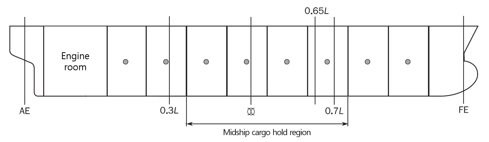
    Figure : Definition of cargo hold regions for FE structural assessment
- **1.2** **Cargo hold structural strength analysis procedure**
  - **1.2.1** **Procedure description**
    The structural FE analysis is to be performed in accordance with the following:
    • Extent as given in **[2.2]**
    • Finite element types as given in **[2.3]**
    • Structural modelling as defined in **[2.4]**
    - **a)** Model: Three cargo hold model with:
    - **b)** Boundary conditions as defined in **[2.5]**
    - **c)** FE load combinations as defined in **[3]**
    - **d)** Load application as defined in **[4]**
    - **e)** Evaluation area as defined in **[5.1]**
    - **f)** Strength assessment as defined in **[5.2]** and **[5.3]**
  - **1.2.2** **Mid-hold definition**
    For the purpose of the FE analysis, the mid-hold is defined as the middle hold(s) of the three cargo hold length FE model.
  - **1.2.3** **Scantling assessment**
    The scantling assessment is carried out according to **Sec 1** for mid cargo hold using the FE load combinations defined in **Ch 4, Sec 8** applicable to the considered cargo hold. The FE analysis results are applicable to the evaluation area as defined in **[5.1.1]**, of the considered cargo hold.

#### 2. Structural model

- **2.1** **Members to be modelled**
  - **2.1.1** All main longitudinal and transverse structural elements are to be modelled. These include:
    • Inner and outer shell,
    • Upper deck,
    • Double bottom floors and girders,
    • Transverse and vertical web frames,
    • Hatch coamings,
    • Stringers and lower decks,
    • Transverse and longitudinal bulkhead structures,
    • Other primary supporting members,
    • Other structural members which contribute to hull girder strength.
    All plates and stiffeners on the structure, including web stiffeners, are to be modelled. Brackets which contribute to primary supporting member strength and the size of which is not less than the typical mesh size (s-by-s) described in **[2.4.2],** are to be modelled.
- **2.2** **Extent of model**
  - **2.2.1** **Longitudinal extent**
    Except the foremost and aftermost cargo hold models, the longitudinal extent of the cargo hold FE model is to cover three cargo hold lengths. The transverse bulkheads at the ends of the model are to be modelled. Typical finite element models representing the midship cargo hold region is shown in **Figure 2.**
  - **2.2.2** **Hull form modelling**
    In general, the finite element model is to represent the geometry of the hull form. In the midship cargo hold region, the finite element model may be prismatic provided the mid-hold has a prismatic shape.
  - **2.2.3** **Transverse extent**
    Both port and starboard sides of the ship are to be modelled.
  - **2.2.4** **Vertical extent**
    The full depth of the ship is to be modelled including primary supporting members above the upper deck, trunks and cargo hatch coaming, if any. In case of twin-island design the deckhouse or superstructure above the fuel oil tanks are required to be included in the model.
- **2.3** **Finite element types**
  - **2.3.1** Shell elements are to be used to represent plates.
  - **2.3.2** All stiffeners are to be modelled with beam elements having axial, torsional, bi-directional shear and bending stiffness. The eccentricity of the neutral axis is to be modelled.
  - **2.3.3** Face plates of primary supporting members and brackets are to be modelled using rod or beam elements.
    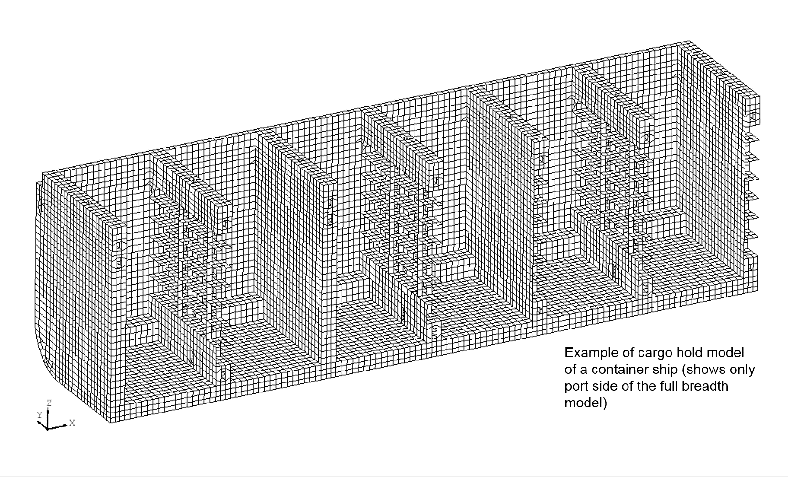
    Figure : Example of 3 cargo hold model within midship region
    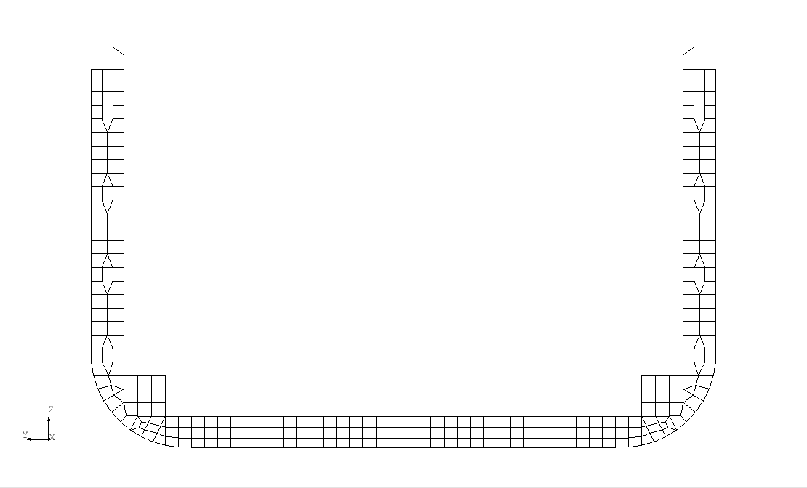
    Figure : Typical finite element mesh on web frame
    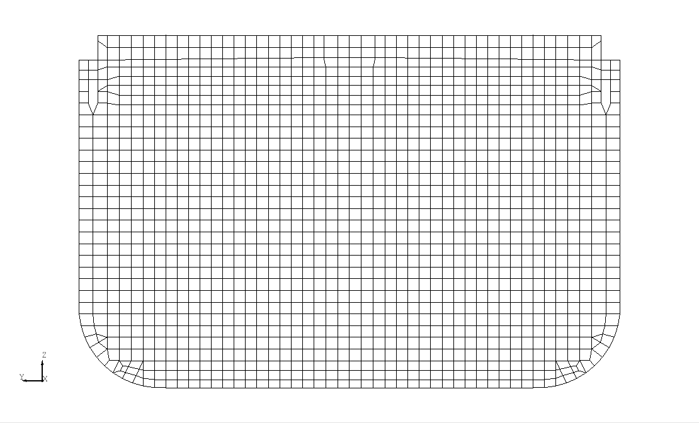
    Figure : Typical finite element mesh on transverse bulkhead
- **2.4** **Structural modelling**
  - **2.4.1** **Aspect ratio**
    The aspect ratio of the shell elements is in general not to exceed 3. The use of triangular shell elements is to be kept to a minimum. Where possible, the aspect ratio of shell elements in areas where there are likely to be high stresses or a high stress gradient is to be kept close to 1 and the use of triangular elements is to be avoided.
  - **2.4.2** **Mesh**
    The shell element mesh is to follow the stiffening system as far as practicable, hence representing the actual plate panels between stiffeners. In general, the shell element mesh is to satisfy the following requirements:
    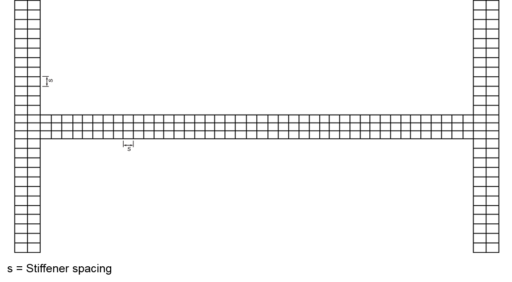
    Figure : Typical finite element mesh on horizontal transverse stringer on transverse bulkhead
    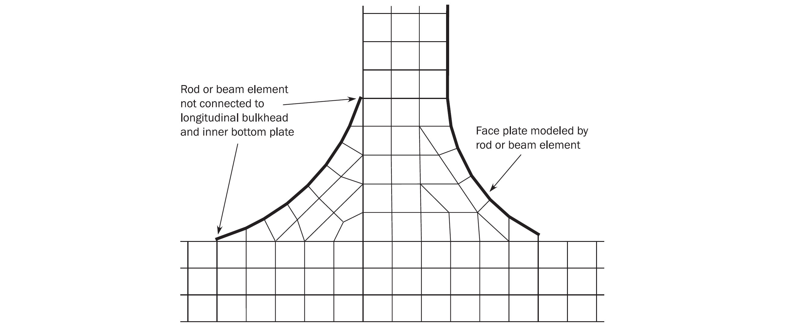
    Figure : Typical finite element mesh on transverse web frame main bracket
    - **a)** One element between every longitudinal stiffener, see **Figure 3.** Longitudinally, the element length is not to be greater than 2 longitudinal spaces with a minimum of three elements between primary supporting members.
    - **b)** One element between every stiffener on transverse bulkheads, see **Figure 4.**
    - **c)** One element between every web stiffener on transverse and vertical web frames and stringers, see **Figure 3** and **Figure 5.**
    - **d)** At least 3 elements over the depth of double bottom girders, floors, transverse web frames, vertical web frames and horizontal stringers on transverse bulkheads. For deck transverse and horizontal stringers on transverse wash bulkheads and longitudinal bulkheads with a smaller web depth, modelling using 2 elements over the depth is acceptable provided that there is at least 1 element between every web stiffener. The mesh size of adjacent structure is to be adjusted accordingly.
    - **e)** The curvature of the free edge on large brackets of primary supporting members is to be modelled to avoid unrealistic high stress due to geometry discontinuities. In general, a mesh size equal to the stiffener spacing is acceptable. The bracket toe may be terminated at the nearest nodal point provided that the modelled length of the bracket arm does not exceed the actual bracket arm length. The bracket flange is not to be connected to the plating, as shown in **Figure 6**. The modelling of the tapering part of the flange is to be in accordance with **[2.4.7].** An example of acceptable mesh is shown in **Figure 6.** A finer mesh is to be used for the determination of detailed stress at the bracket toe, as given in **Sec 3.**
  - **2.4.3** **Finer mesh**
    Where the geometry cannot be adequately represented in the cargo hold model and the stress exceeds the cargo hold mesh acceptance criteria, a finer mesh may be used for such geometry to demonstrate satisfactory scantlings. The mesh size required for such analysis can be governed by the geometry. In such cases, the average stress within an area equivalent to that specified in **[2.4]** is to comply with the requirements given in **[5.2].**
  - **2.4.4** Example of mesh arrangements of the cargo hold structure are shown in **Figure 7.**
    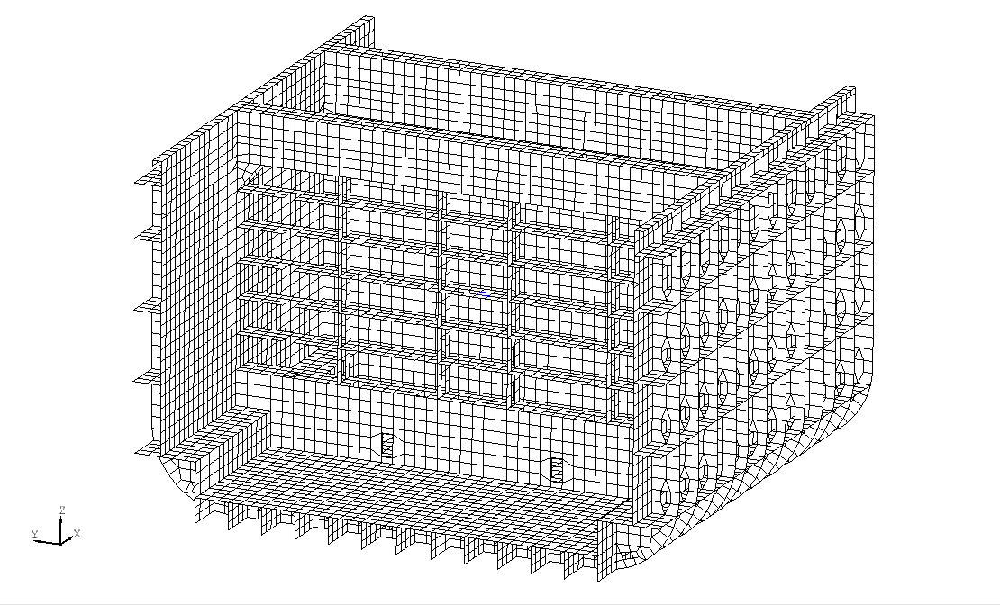
    Figure : Example of FE mesh arrangements of cargo hold structure for a container ship
  - **2.4.5** **Sniped stiffener**
    Non continuous stiffeners are to be modelled as continuous stiffeners, i.e. the height web reduction in way of the snip ends are not to be modelled.
  - **2.4.6** **Web stiffeners of primary supporting members**
    Web stiffeners of primary supporting members are to be modelled. Where these stiffeners are not in line with the primary FE mesh, it is sufficient to place the line element along the nearby nodal points provided that the adjusted distance does not exceed 0.2 times the stiffener spacing under consideration. The stresses and buckling utilisation factors obtained need not be corrected for the adjustment. Buckling stiffeners on large brackets, deck transverses and stringers parallel to the flange are to be modelled. These stiffeners may be modelled using rod elements.
  - **2.4.7** **Face plate of primary supporting member**
    The effective cross sectional area at the curved part of the face plate of primary supporting members and brackets is to be calculated in accordance with **Ch 3, Sec 7.** The cross sectional area of a rod or beam element representing the tapering part of the face plate is to be based on the average cross sectional area of the face plate in way of the element length.
  - **2.4.8** **Openings**
    Methods of representing openings and manholes in webs of primary supporting members are to be in accordance with **Table 1.** Regardless of size, manholes are to be modelled by removing the appropriate elements.

    | Criteria | Modelling decision | Analysis |
    | --- | --- | --- |
    | $h _{o} /h<0.5$ and $g _{o} <2.0$ | Openings do not need to be modelled | To be evaluated by fine mesh as given in **Ch 7, Sec 3, [1.2]** |
    | Manholes | The geometry of the opening is to be modelled by removing the adequate elements | To be evaluated by fine mesh as given in **Ch 7, Sec 3, [1.2]** |
    | $h _{o} /h \geq 0.5$ or $g _{o} \geq 2.0$ | The geometry of the opening is to be modelled | To be evaluated by fine mesh as given in **Ch 7, Sec 3, [1.2]** |
    | where: $g _{0} = \left( 1+ \frac{\ell _{0} ^{2}}{2.6(h-h _{0} ) ^{2}} \right)$ $\ell_{o}$ : Length of opening parallel to primary supporting member web direction, in m, see **Figure 8.** For sequential openings where the distance, $d _{o}$ between openings is less than $0.25h$, the length $\ell _{o}$ is to be taken as the length across openings as shown in **Figure 9.** $h _{o}$ : Height of opening parallel to depth of web, in m, see **Figure 8** and **Figure 9**. $h$ : Height of web of primary supporting member in way of opening, in m, see **Figure 8** and **Figure 9**. |   |   |

    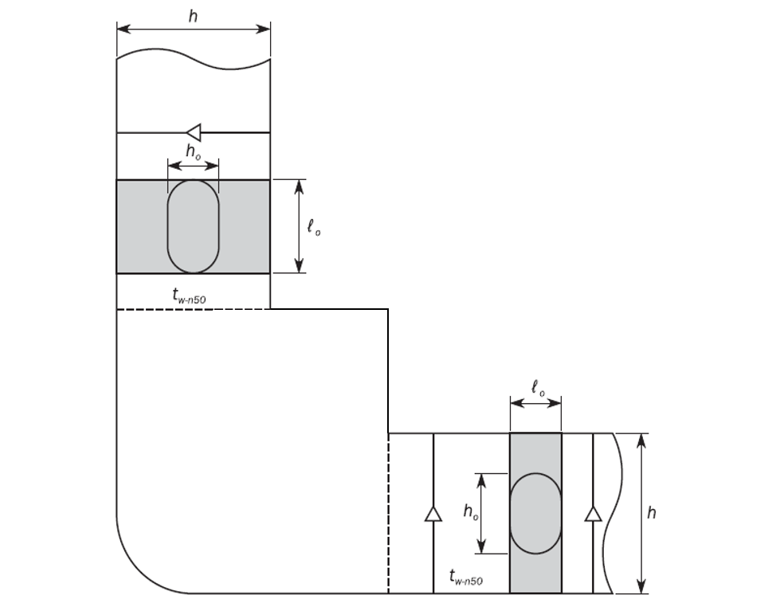
    Figure : Openings in web
    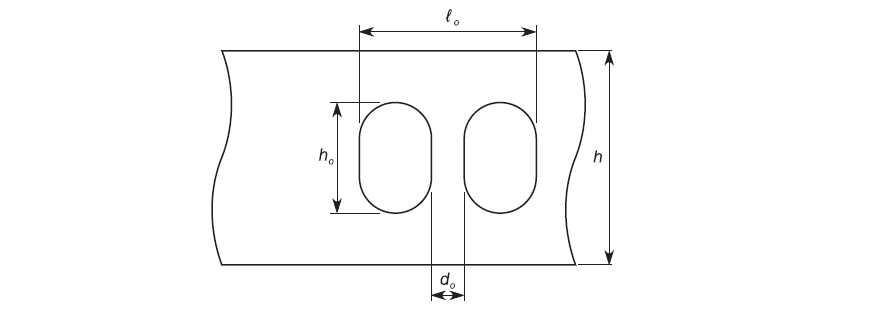
    Figure : Length #eqnID-32 for sequential openings with #eqnID-33
- **2.5** **Boundary conditions**
  - **2.5.1** **General**
    All boundary conditions described in this section are in accordance with the global coordinate system defined in **Ch 4, Sec 1.**
  - **2.5.2** **Application**
    The boundary conditions given **[2.5.3]** are applicable to cargo hold finite element model analyses in cargo hold region.
  - **2.5.3** **Boundary Conditions**
    The boundary conditions consist of the rigid links at model ends, point constraints and end-beams. The rigid links connect the nodes on the longitudinal members at the model ends to an independent point at neutral axis in centreline. The boundary conditions to be applied at the ends of the cargo hold FE model are given in **Table 2.**

    | Location | Translation |   |   | Rotation |   |   |
    | --- | --- | --- | --- | --- | --- | --- |
    | Location | $\delta _{x}$ | $\delta _{y}$ | $\delta _{z}$ | $\theta _{x}$ | $\theta _{y}$ | $\theta _{z}$ |
    | **Aft End** |   |   |   |   |   |   |
    | Independent point | - | Fix | Fix | $M _{T-end}$ | - | - |
    | Cross Section | - | Rigid link | Rigid link | Rigid link | - | - |
    | Cross Section | End beam, see **[2.5.4]** |   |   |   |   |   |
    | **Fore End** |   |   |   |   |   |   |
    | Independent point | - | Fix | Fix | Fix | - | - |
    | Intersection of centreline and inner bottom | Fix | - | - | - | - | - |
    | Cross Section | - | Rigid link | Rigid link | Rigid link | - | - |
    | Cross Section | End beam, see **[2.5.4]** |   |   |   |   |   |
    | Note 1: [-] means no constraint applied (free). Note 2: See **Figure 10.** |   |   |   |   |   |   |

    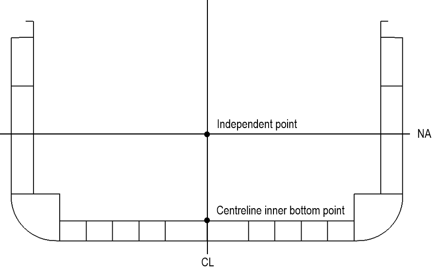
    Figure : Boundary conditions applied at the model end sections
    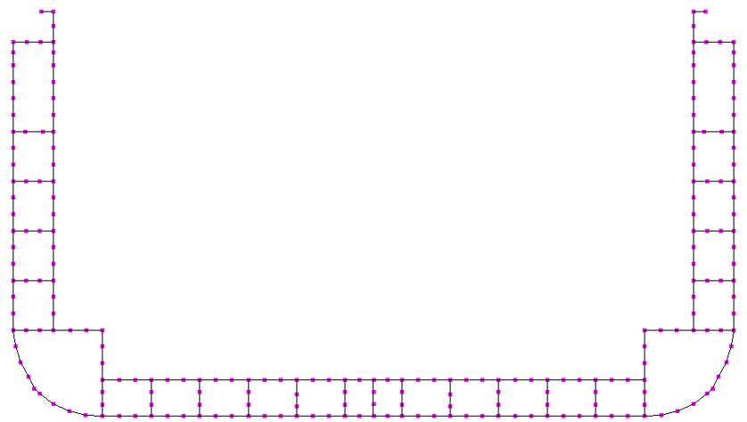
    Figure : End constraint beams for a container ship
  - **2.5.4** **End constraint beams**
    End constraint beams are to be modelled at the both end sections of the model along all longitudinally continuous structural members. An example of end beams at one end for a container ship is shown in **Figure 11.**
    The properties of beams are calculated at fore and after sections separately and all beams at each end section have identical properties as follows:
    • Net moment of inertia: $I _{yy-n50}$ = $I _{zz-n50}$ = $I _{xx-n50} \left( J \right)$ = 1/10 of the vertical hull girder moment of inertia of fore/aft end cross sections based on the net FE model.
    • Net cross sectional area: $A _{y-n50}$ and $A _{z-n50}$ = 1/80 of the fore/aft end cross sectional areas based on the net FE model.
    where:
    $I _{yy-n50}$ : Moment of inertia about local beam *Y* axial, in m^4.
    $I _{zz-n50}$ : Moment of inertia about local beam *Z* axial, in m^4.
    $I _{xx-n50} \left( J \right)$ : Torsional inertia, in m^4.
    $A _{y-n50}$ : Shear area in local beam *Y* direction, in m^2.
    $A _{z-n50}$ : Shear area in local beam *Z* direction, in m^2.

#### 3. FE load combinations

- **3.1** **Design load combinations**
  - **3.1.1** **FE load combination definition**
    A FE load combination is defined as a loading pattern, a draught, a value of still water bending and shear force, associated with a given dynamic load case.
  - **3.1.2** **Mandatory load combinations**
    For cargo hold structural strength analysis, the design load combinations specified in **Ch 4, Sec 8** are to be used.
    Each design load combination given in **Ch 4, Sec 8** consists of a loading pattern and dynamic load cases as given in **Ch 4, Sec 2.** Each load combination requires the application of the structural weight, internal and external loads and hull girder loads. For seagoing condition, both static and dynamic load components (S + D) are applied. For tank testing and flooding condition, only static load components (S) are applied.
  - **3.1.3** **Additional loading conditions**
    Where the loading conditions specified by the designer are not covered by the load combinations given in **Ch 4, Sec 8,** these additional loading conditions are to be examined according to the procedure in **[4].**

#### 4. Load application

- **4.1** **General**
  - **4.1.1** **Structural weight**
    Effect of the weight of hull structure is to be included in static loads, but is not to be included in dynamic loads. Density of steel is to be taken as given in **Ch 4, Sec 6.**
  - **4.1.2** **Sign convention**
    Unless otherwise mentioned in this Section, the sign of moments and shear force is to be in accordance with the sign convention defined in **Ch 4, Sec 1.**
- **4.2** **External and internal loads**
  - **4.2.1** **External loads**
    External pressure is to be calculated for each load case in accordance with **Ch 4, Sec 5.** External pressures include static sea pressure, wave pressure and green sea pressure.
  - **4.2.2** **Internal loads**
    Internal loads are to be calculated for each load case in accordance with **Ch 4, Sec 6** for design load scenarios given in **Ch 4, Sec 7, Table 1.** They include static dry cargo (including containers on deck), ballast and other liquid pressure, setting pressure on relief valve and dynamic load of dry cargo (including containers on deck), ballast and other liquid pressure due to acceleration.
  - **4.2.3** **Liquefied natural gas fuel density**
    Maximum liquefied natural gas fuel density is generally taken as not less than 0.5 $\mathrm{t}/m ^{3}$. To take into account of the volume difference between 1^st barrier and inner hull, the liquefied natural gas fuel density may be used as adjusted below,
    $\rho _{c _{adjusted}} = \rho _{c} \frac{V _{C}}{V _{Hull}} + \rho _{CCS} \frac{V _{Hull} -V _{C}}{V _{Hull}}$
    where:
    $V _{C}$ : Volume of liquefied natural gas fuel tank enclosed by primary barrier of fuel containment system in $\mathrm{m} ^{3}$.
    $V _{Hull}$ : Volume of liquefied natural gas fuel tank enclosed by inner hull structure in $\mathrm{m} ^{3}$.
    $\rho _{CCS}$ : Density of fuel containment system in $\mathrm{t}/m ^{3}$, generally 0.12 can be used.
    And, effective liquefied natural gas fuel density may be adjusted to consider the maximum filling height as below,
    $\rho _{c _{eff}} = \rho _{c _{adjusted}} \frac{M _{Max filling\% by \rho _{Max-LM}}}{M _{100\% by \rho _{c}}}$
    where:
    $M _{Max filling\% by \rho _{Max-LM}}$ : Mass of liquefied natural gas fuel when filled to maximum level (%) with design fuel density
    $M _{100\% by \rho _{c}}$ : Mass of liquefied natural gas fuel when filled to 100 % with $\rho _{c}$= 0.5 $\mathrm{t}/m ^{3}$
    $\rho _{c _{eff}}$ : Effective liquefied natural gas fuel density, in $\mathrm{t}/m ^{3}$, for internal loads in FE analysis
  - **4.2.4** **Pressure application on FE element**
    Constant pressure, calculated at the element’s centroid, is applied to the shell element of the loaded surfaces, e.g. outer shell and deck for external pressure and tank / hold boundaries for internal pressure. Alternately, pressure can be calculated at element nodes applying linear pressure distribution within elements.
- **4.3** **Hull girder loads**
  - **4.3.1** **General**
    Each loading condition is to be associated with its corresponding hull girder loads which is to be applied to the model according to the procedure described in **[4.4]** for shear force and bending moment and in [4.5] for torsional moment. The hull girder loads are the combinations of still water hull girder loads and wave induced hull girder loads as specified in **Ch 4, Sec 8**. For each required FE load combination, the wave induced hull girder loads are to be calculated with the Load Combination Factors (LCFs), specified in **Ch 4, Sec 2**.
  - **4.3.2** **Target hull girder vertical bending moment**
    The target hull girder vertical bending moment, $M _{v-targ}$, in kNm, at a longitudinal position for a given FE load combination is taken as:
    $M _{v-targ} =M _{sw} +M _{wv-LC}$
    where:
    $M _{sw}$ : Permissible still water bending moments in kNm, at the considered longitudinal position for seagoing as defined in **Ch 4, Sec 4, [2.2.2]** and **Ch 4, Sec 4, [2.2.3]** respectively.
    $M _{wv-LC}$ : Vertical wave bending moment in kNm, for the dynamic load case under consideration, calculated in accordance with **Ch 4, Sec 4, [3.7.2]**.
    The values of $M _{v-targ}$ are taken as the maximum hull girder bending moment within the mid-hold(s) for each individual cargo hold for each given FE load combination as defined in **Ch 4, Sec 8**.
  - **4.3.3** **Target hull girder shear force**
    The target hull girder vertical shear force at the aft and forward transverse bulkheads of the mid-hold, $Q _{targ-aft}$ and $Q _{targ-fwd}$, in kN, for a given FE load combination is taken as:
    • $Q _{fwd} \geq Q _{aft}$ :
    $Q _{targ-aft} =Q _{sw-n eg} +f _{\beta } \left| C _{QW} \right| Q _{wv-n eg}$
    $Q _{targ-fwd} =Q _{sw-pos} +f _{\beta } \left| C _{QW} \right| Q _{wv-pos}$
    • $Q _{fwd} \prec Q _{aft}$ :
    $Q _{targ-aft} =Q _{sw-pos} +f _{\beta } \left| C _{QW} \right| Q _{wv-pos}$
    $Q _{targ-fwd} =Q _{sw-n eg} +f _{\beta } \left| C _{QW} \right| Q _{wv-n eg}$
    where:
    $Q _{fwd} , Q _{aft}$ : Vertical shear forces, in kN, due to the local loads respectively at the forward and aft bulkhead position of the mid-hold, as defined in **[4.4.6].**
    $Q _{sw-pos} , Q _{sw-n eg}$ : Positive and negative permissible still water shear forces, in kN, at any longitudinal position for seagoing as defined in **Ch 4, Sec 4, [2.3.1]** and **Ch 4, Sec 4, [2.3.2]** respectively.
    $f _{\beta }$ : Wave heading factor, as given in **Ch 4, Sec 4.**
    $C _{QW}$ : Load combination factor for vertical wave shear force, as given in **Ch 4, Sec 2.**
    $Q _{wv-pos} , Q _{wv-n eg}$ : Positive and negative vertical wave shear force, in kN, as defined in **Ch 4, Sec 4, [3.2.1].**
    The values of $Q _{targ-aft}$ and $Q _{targ-fwd}$ are to be taken at after and forward transverse bulkheads of the mid-hold under consideration.
  - **4.3.4** **Target hull girder horizontal bending moment**
    The target hull girder horizontal bending moment, $M _{h-targ}$ in kNm, for a given FE load combination is taken as:
    $M _{h-targ} =M _{wh-LC}$
    where:
    $M _{wh-LC}$ : Horizontal wave bending moment, in kNm, for the dynamic load case under consideration, calculated in accordance with **Ch 4, Sec 4, [3.7.4].**
    The values of $M _{wh-LC}$ are taken as the value calculated for the middle of the individual cargo hold under consideration.
  - **4.3.5** **Target hull girder torsional moment**
    For dynamic load cases, hull girder torsional moment $M _{wt-targ}$, at the middle of the mid-hold is to be adjusted to zero.
- **4.4** **Procedure to adjust hull girder shear forces and bending moments**
  - **4.4.1** **General**
    The procedure given in this sub-article **[4.4]** describes how to adjust the hull girder horizontal bending moment, vertical force and vertical bending moment distribution on the three cargo hold FE model to achieve the required target values at required locations. The hull girder load target values are specified in **[4.3].**
    The target locations for hull girder shear force are at the transverse bulkheads of the mid-hold. The final adjusted hull girder shear force at the target location should not exceed the target hull girder shear force.
    The target location for hull girder bending moment is, in general, located at the centre of the mid-hold. If the maximum value of bending moment is not located at the centre of the mid-hold, the final adjusted maximum bending moment within the mid-hold is not to exceed the target hull girder bending moment.
  - **4.4.2** **Local load distribution**
    The following local loads are to be applied for the calculation of hull girder shear and bending moments:
    With the above local loads applied to the FE model, the FE nodal forces are obtained through FE loading procedure. The 3D nodal forces will then be lumped to each longitudinal station to generate the one dimension local load distribution. The longitudinal stations are located at transverse bulkheads/frames and typical longitudinal FE model nodal locations in between the frames according to the cargo hold model mesh size requirement. Any intermediate nodes created for modelling structural details are not treated as the longitudinal stations for the purpose of local load distribution. The nodal forces within half of forward and half of afterward of longitudinal station spacing are lumped to that station. The lumping process will be done for vertical and horizontal nodal forces separately to obtain the lumped vertical and horizontal local loads, $f _{vi}$ and $f _{hi}$, at the longitudinal station $i$.
    - **a)** Ship structural steel weight distribution over the length of the cargo hold model (static loads). The structural steel weight is to be calculated based on the FE model with a net thickness of 0.5 $t _{c}$ deduction, as used in the cargo hold FE model.
    - **b)** Weight of cargo / containers and ballast and fuel oil (static loads).
    - **c)** Static sea pressure, dynamic wave pressure and, where applicable, green sea load. For the tank testing and flooding load cases, only static sea pressure needs to be applied.
    - **d)** Dynamic cargo / containers, ballast and fuel oil loads for seagoing load cases.
  - **4.4.3** **Hull girder forces and bending moment due to local loads**
    With the local load distribution, the hull girder load longitudinal distributions are obtained by assuming the model is simply supported at model ends. The reaction forces at both ends of the model and longitudinal distributions of hull girder shear forces and bending moments induced by local loads at any longitudinal station are determined by the following formulae:
    $R _{V _{-} f o re} =- \frac{\sum _{i} ^{} (x _{i} -x _{aft} )f _{vi}}{x _{fo re} -x _{aft}}$ $R _{V _{-} aft} = \sum _{i} ^{} f _{vi} +R _{V _{-} f o re}$
    $R _{H _{-} f o re} =- \frac{\sum _{i} ^{} (x _{i} -x _{aft} )f _{hi}}{x _{fo re} -x _{aft}}$ $R _{H _{-} aft} =- \sum _{i} ^{} f _{hi} +R _{H _{-} f o re}$
    $F _{l} = \sum _{i} ^{} f _{li}$
    $Q _{V _{-} FEM} (x _{j} )=R _{V _{-} aft} - \sum _{i} ^{} f _{vi}$ when $x _{i} \(Q _{H _{-} FEM} (x _{j} )=R _{H _{-} aft} + \sum _{i} ^{} f _{hi}$ when $x _{i} \(M _{V _{-} FEM} (x _{j} )=(x _{j} -x _{aft} )R _{V _{-} aft} - \sum _{i} ^{} (x _{j} -x _{i} )f _{vi}$ when $x _{i} \(M _{H _{-} FEM} (x _{j} )=(x _{j} -x _{aft} )R _{H _{-} aft} + \sum _{i} ^{} (x _{j} -x _{i} )f _{hi}$ when $x _{i} where:
    \(R _{V _{-} aft} , R _{V _{-} f o re} , R _{H _{-} aft} , R _{H _{-} f o re}$ : Vertical and horizontal reaction forces at the aft and fore ends, in kN.
    $x _{aft}$ : X-coordinate of the aft end support, in m.
    $x _{fore}$ : X-coordinate of the fore end support, in m.
    $f _{vi}$ : Lumped vertical local load at longitudinal station $i$ as defined in **[4.4.2],** in kN.
    $f _{hi}$ : Lumped horizontal local load at longitudinal station $i$ as defined in **[4.4.2],** in kN.
    $F _{l}$ : Total net longitudinal force of the model, in kN.
    $f _{li}$ : Lumped longitudinal local load at longitudinal station $i$ as defined in **[4.4.2],** in kN.
    $x _{j}$ : X-coordinate, in m, of considered longitudinal station $j$.
    $x _{i}$ : X-coordinate, in m, of longitudinal station $i$.
    $Q _{V _{-} FEM} (x _{j} ), Q _{H _{-} FEM} (x _{j} ), M _{V _{-} FEM} (x _{j} ), M _{H _{-} FEM} (x _{j} )$ : Vertical and horizontal shear forces, in kN, and bending moments, in kNm, at longitudinal station $x _{j}$ created by the local loads applied on the FE model. The sign convention for reaction forces is that a positive creates a positive shear force.
  - **4.4.4** **Longitudinal unbalanced force**
    In case total net longitudinal force of the model, $F _{l}$, is not equal to zero, the counter longitudinal force, $\left( F _{x} \right) _{j}$, is to be applied at one end of the model, where the translation on X-direction, $\delta _{x}$, is fixed, by distributing longitudinal axial nodal forces to all hull girder bending effective longitudinal elements, as follows:
    $(F _{x} ) _{j} = \frac{F _{l}}{A _{x-n50}} \frac{A _{j-n50}}{n _{j}}$
    where:
    $\left( F _{x} \right) _{j}$ : Axial force applied to a node of the j-th element, in kN.
    $F _{l}$ : Total net longitudinal force of the model, as defined in **[4.4.3],** in kN.
    $A _{j-n50}$ : Net cross sectional area of the j-th element, in m^2.
    $A _{x-n50}$ : Net cross sectional area of fore end section, in m^2,
    $A _{x-n50} = \sum _{j} ^{} A _{j-n50}$
    $n _{j}$ : Number of nodal points of j-th element on the cross section, $n _{j} =1$ for beam element, $n _{j} =2$ for 4-node shell element.
  - **4.4.5** **Hull girder shear force adjustment procedure**
    The hull girder shear force adjustment procedure defined in this requirement applies to all FE load combinations given in **Ch 4, Sec 8.** The FE load combinations not directly covered by the load combination tables of **Ch 4, Sec 8** are to be considered on a case by case basis.
    The two following methods are to be used for the shear force adjustment:
    • Method 1 (M1) : for shear force adjustment at one bulkhead of the mid-hold as given in **[4.4.6],**
    • Method 2 (M2) : for shear force adjustment at both bulkheads of the mid-hold as given in **[4.4.7].**
    For the considered FE load combination, the method to be applied is to be selected as follows:
    • The shear force adjustment is not requested when the shear forces at both bulkheads are lower or equal to the target values.
    • The method 1 applies when the shear force exceeds the target at one bulkhead and the shear force at the other bulkhead after the adjustment with method 1 does not exceed the target value. Otherwise the method 2 applies,
    • The method 2 applies when the shear forces at both bulkheads exceed the target values,
  - **4.4.6** **Method 1 for shear force adjustment at one bulkhead**
    The required adjustments in shear force at following transverse bulkheads of the mid-hold are given by:
    • Aft bulkhead:
    $M _{Y _{-} aft} =M _{Y _{-} f o re} = \frac{(x _{f o re} -x _{aft} )}{2} (Q _{targ-aft} -Q _{aft} )$
    • Forward bulkhead:
    $M _{Y _{-} aft} =M _{Y _{-} f o re} = \frac{(x _{f o re} -x _{aft} )}{2} (Q _{targ-fwd} -Q _{aft} )$
    where:
    $M _{Y _{-} aft} , M _{Y _{-} fore}$ : Vertical bending moment, in kNm, to be applied at the aft and fore ends in accordance with **[4.4.9],** to enforce the hull girder vertical shear force adjustment as shown in **Table 3**. The sign convention is that of the FE model axis.
    $Q _{aft}$ : Vertical shear force, in kN, due to local loads at aft bulkhead location of mid-hold, $x _{b _{-} aft}$, resulting from the local loads calculated according to **[4.4.3].**
    Since the vertical shear force is discontinued at the transverse bulkhead location, $Q _{aft}$ is the maximum absolute shear force between the stations located right after and right forward of the aft bulkhead of mid-hold.
    $Q _{fwd}$ : Vertical shear force, in kN, due to local loads at the forward bulkhead location of mid-hold, $x _{b _{-} fwd}$, resulting from the local loads calculated according to **[4.4.3].**
    Since the vertical shear force is discontinued at the transverse bulkhead location, $Q _{fwd}$ is the maximum absolute shear force between the stations located right after and right forward of the forward bulkhead of mid-hold.

    | Vertical shear force diagram | Target position in mid-hold |
    | --- | --- |
    | 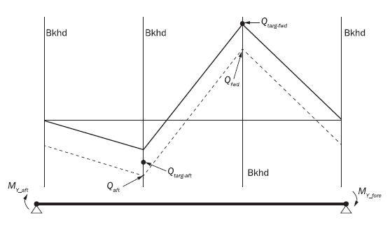 | Forward bulkhead |
    | 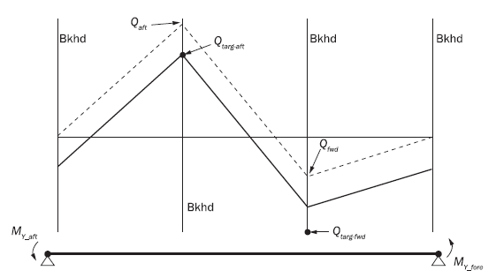 | Aft bulkhead |
    |  Vertical shear force after adjustment  Vertical shear due to local loads |   |
  - **4.4.7** **Method 2 for vertical shear force adjustment at both bulkheads**
    The required adjustments in shear force at both transverse bulkheads of the mid-hold are to be made by applying:
    • Vertical bending moments, $M _{Y _{-} aft}$, $M _{Y _{-} fore}$ at model ends and,
    • Vertical loads at the transverse frame positions as shown in **Table 5** in order to generate vertical shear forces, $\Delta Q _{aft}$ and $\Delta Q _{fwd}$, at the transverse bulkhead positions.
    **Table 4** shows examples of the shear adjustment application due to the vertical bending moments and to vertical loads.
    $M _{Y _{-} aft} = \frac{x _{f o re} -x _{aft}}{2} . \frac{Q _{targ-fwd} -Q _{fwd} +Q _{targ-aft} -Q _{aft}}{2}$
    $M _{Y _{-} f o re} =M _{Y _{-} aft}$
    $\Delta Q _{fwd} = \frac{Q _{targ-fwd} -Q _{fwd} -(Q _{targ-aft} -Q _{aft} )}{2}$
    $\Delta Q _{aft} = - \Delta Q _{fwd}$
    where:
    $M _{Y _{-} aft} , M _{Y _{-} fore}$ : Vertical bending moment, in kNm, to be applied at the aft and fore ends in accordance with **[4.4.9],** to enforce the hull girder vertical shear force adjustment. The sign convention is that of the FE model axis.
    $\Delta Q _{aft}$ : Adjustment of shear force, in kN, at aft bulkhead of mid-hold.
    $\Delta Q _{fwd}$ : Adjustment of shear force, in kN, at fore bulkhead of mid-hold.
    The above adjustments in shear forces, $\Delta Q _{aft}$ and $\Delta Q _{fwd}$, at the transverse bulkhead positions are to be generated by applying vertical loads at the transverse frame positions as shown in **Table 5.** Vertical correction loads are not to be applied to any transverse tight bulkheads, any frames forward of the forward cargo hold and any frames aft of the aft cargo hold of the FE model.
    The vertical loads to be applied to each transverse frame to generate the increase/decrease in shear force at the bulkheads may be calculated as shown in **Table 5.** In case of uniform frame spacing, the amount of vertical force to be distributed at each transverse frame may be calculated in accordance with **Table 6.**

    | Vertical shear force diagram | Aft BHD | Fore BHD |
    | --- | --- | --- |
    | Vertical shear force diagram | SF Target | SF target |
    | 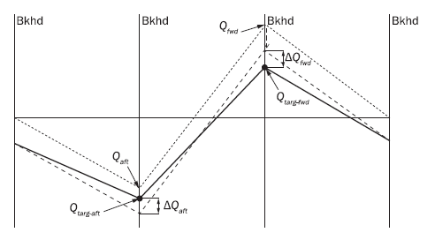 | $Q _{targ-aft} \left( -ve \right)$ | $Q _{targ-fwd} \left( +ve \right)$ |
    | 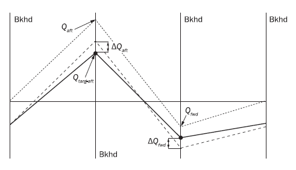 | $Q _{targ-aft} \left( +ve \right)$ | $Q _{targ-fwd} \left( -ve \right)$ |
    |  Vertical shear force after both adjustments  Vertical shear force after adjustment by use of $M _{Y _{-} aft}$ and $M _{Y _{-} fore}$  Vertical shear due to local loads |   |   |
    | Note 1: -ve means negative. Note 2: +ve means positive. |   |   |

    | 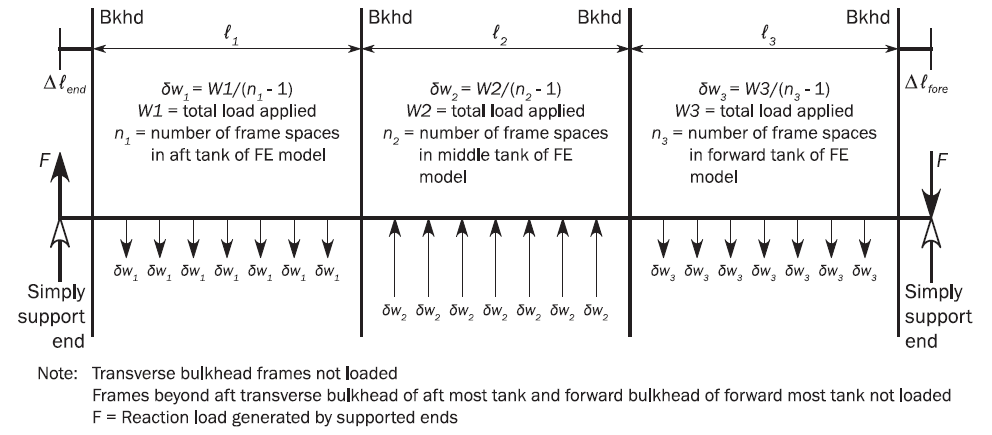 |
    | --- |
    | 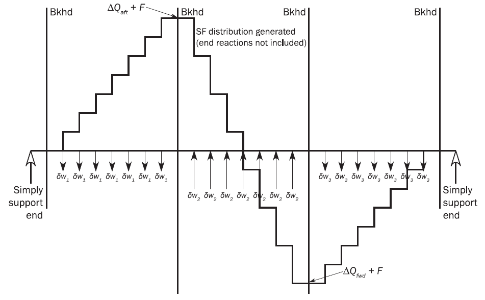 Shear Force distribution due to adjusting vertical force at frames |
    | 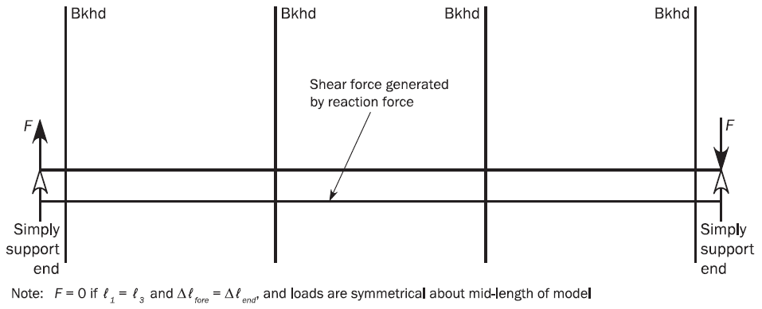 |
    | Note 1: For definition of symbols, see **Table 6.** |

    | $\delta w _{1} = \frac{\Delta Q _{aft} (2\ell-\ell_{2} -\ell_{3} )+ \Delta Q _{fwd} (\ell_{2} +\ell_{3} )}{(n _{1} -1)(2\ell-\ell_{1} -2\ell_{2} -\ell_{3} )}$ | $F=0.5 \left( \frac{W1(\ell _{1} +\ell _{1} )-W3(\ell _{2} +\ell _{3} )}{\ell} \right)$ |
    | --- | --- |
    | $\delta w _{2} = \frac{(W1+W3)}{(n _{2} -1)} = \frac{( \Delta Q _{aft} - \Delta Q _{fwd} )}{(n _{2} -1)}$ |   |
    | $\delta w _{3} = \frac{- \Delta Q _{fwd} (2\ell-\ell _{1} -\ell _{2} )- \Delta Q _{aft} (\ell _{1} +\ell _{2} )}{(n _{3} -1)(2\ell-\ell _{1} -2\ell _{2} -\ell _{3} )}$ |   |
    | where: $\ell _{ 1}$ : Length of aft cargo hold of model, in m. $\ell _{2}$ : Length of mid-hold of model, in m. $\ell _{3}$ : Length of forward cargo hold of model, in m. $\Delta Q _{aft}$ : Required adjustment in shear force, in kN, at aft bulkhead of middle hold, see **[4.4.7]**. $\Delta Q _{fwd}$ : Required adjustment in shear force, in kN, at fore bulkhead of middle hold, see **[4.4.7]**. $F$ : End reactions, in kN, due to application of vertical loads to frames. $W1$ : Total evenly distributed vertical load, in kN, applied to aft hold of FE model, ($n _{1}$ - 1) $\delta w _{1}$. $W2$ : Total evenly distributed vertical load, in kN, applied to mid-hold of FE model, ($n _{2}$ - 1) $\delta w _{2}$. $W3$ : Total evenly distributed vertical load, in kN, applied to forward hold of FE model, ($n _{3}$ - 1) $\delta w _{3}$. $n _{1}$ : Number of frame spaces in aft cargo hold of FE model. $n _{2}$ : Number of frame spaces in mid-hold of FE model. $n _{3}$ : Number of frame spaces in forward cargo hold of FE model. $\delta w _{1}$ : Distributed load, in kN, at frame in aft cargo hold of FE model. $\delta w _{2}$ : Distributed load, in kN, at frame in mid-hold of FE model. $\delta w _{3}$ : Distributed load, in kN, at frame in forward cargo hold of FE model. $\ell _{end}$ : Distance, in m, between end bulkhead of aft cargo hold to aft end of FE model. $\ell _{fore}$ : Distance, in m, between fore bulkhead of forward cargo hold to forward end of FE model. $\ell$ : Total length, in m, of FE model including portions beyond end bulkheads: $=\ell _{1} +\ell _{2} +\ell _{3} + \Delta \ell _{end} + \Delta \ell _{fo re}$ |   |
    | Note 1: Positive direction of loads, shear forces and adjusting vertical forces in the formulae is in accordance with **Table 4** and **Table 5**. Note 2: $W1+W3=W2$ Note 3: The above formulae are only applicable if uniform frame spacing is used within each hold. The length and frame spacing of individual cargo holds may be different. |   |

    If non-uniform frame spacing is used within each cargo hold, the average frame spacing $i$ is used to calculate the average distributed frame loads $\delta w _{av-i}$, according to **Table 6,** where $\delta w _{i}^{k} = \delta w _{av-i} \frac{\ell _{ av-i}^{k}}{\ell _{av-i}}$ = 1, 2, 3 for each hold.
    Then $n _{i} -1$ is redistributed to the non-uniform frame as follows:
    $i$ k = 1, 2,..., $i$, for each frame in cargo hold $\ell _{av-i}$, $\ell _{i} /n _{i}$ = 1, 2, 3
    where:
    $i$ : Average frame spacing, in m, calculated as $i$, in cargo hold $\ell _{i}$ with $i$ = 1, 2, 3.
    $i$ : Length, in m, of the cargo hold $n _{i}$ with $i$ = 1, 2, 3 as defined in **Table 6.**
    $i$ : Number of frame spacing in cargo hold $\delta w _{av-i}$ with $\ell _{av-i}$ = 1, 2, 3 as defined in **Table 6.**
    $i$ : Average uniform frame spacing, in m, distributed force calculated according to **Table 6** with the average frame spacing $i$ in cargo hold $\delta w _{i} ^{k}$ with $k$ = 1, 2, 3.
    $i$ : Distributed load, in kN, for non-uniform frame $\ell ^{k} _{av-i}$ in cargo hold $k$.
    $k$ : Equivalent frame spacing, in m, for each frame $n _{i}$ with $i$ = 1, 2,..., $\ell _{ av-i}^{k} =\ell _{ i}^{1} - \frac{\ell _{av-i} \ell _{ i}^{1}}{\ell _{ i}^{1} +\ell _{ i}^{n _{i}}} + \frac{\ell _{ i}^{2}}{2}$ - 1, in cargo hold $k$, taken as:
    $i$ for $\ell _{ av-i}^{k} = \frac{\ell _{ i}^{k}}{2} + \frac{\ell _{ i}^{k+1}}{2}$ = 1 (first frame), in cargo hold $k$
    $n _{i}$ for $i$ = 2, 3, …, $\ell _{ av-i}^{k} =\ell _{ i}^{n _{i}} - \frac{\ell _{av-i} \ell _{ i}^{n _{i}}}{\ell _{ i}^{1} +\ell _{ i}^{n _{i}}} + \frac{\ell _{ i}^{n _{i} -1}}{2}$ - 2, in cargo $k$
    $n _{i}$ for $i$ = $\ell _{i} ^{k}$ - 1 (last frame), in cargo $k$
    $k$ : Frame spacing, in m, between the frame $i$ - 1 and $\delta w _{i}$ in the cargo hold $\delta w _{i} ^{k}$.
    The required vertical load $\delta w _{i}$ for a uniform frame spacing or $q _{f}$ for non-uniform frame spacing, are to be applied by following the shear flow distribution at the considered cross section, as described in **Ch 5, App 1.** For a frame section under vertical load $q _{f-k} = \frac{\delta w _{i}}{l _{y-n50}} Q _{k-n50}$, the shear flow, $q _{f-k}$, at the middle point of the element is calculated as:
    $k$
    where:
    $\delta w _{t}$ : Shear flow calculated at the middle of the $i$-th element of the transverse frame, in N/mm.
    $i$ : Distributed load at each transverse frame location for $I _{y-n50}$-th cargo hold, $Q _{k-n50}$ = 1, 2, 3, as defined in **Table 6,** in N.
    $s _{k}$ : Moment of inertia of the hull girder cross section, in mm^4.
    $q _{f-k}$ : First moment about neutral axis of the accumulative section area starting from the open end (shear stress free end) of the cross section to the point $Q _{k-n50} = \int _{0} ^{S _{k}} {z _{n eu} t _{n50} ds}$ for shear flow $z _{n eu}$, in mm^3, taken as;
    $s$
    $t_{ n50}$ : Vertical distance from the integral point, $j$, to the vertical neutral axis.
    $F_{ j-grid}$ : Net thickness, in mm, of the plate at the integral point of the cross section.
    The distributed shear force at $F _{j-grid} = \sum _{k=1} ^{n} q _{f-k} \frac{l _{k}}{2}$-th FE grid of the transverse frame, $\ell _{k}$, is obtained from the shear flow of the connected elements as following:
    $j$
    where:
    $n$ : Length of the k-th element of the transverse frame connected to the grid $j$, in mm.
    $F_{ j-grid}$ : Total number of elements connect to the grid $M _{v-end} =M _{v-targ} -M _{v-peak}$.
    The shear flow has direction along the cross section and therefore the distributed force, $M _{v-end}$, is a vector force. For vertical hull girder shear correction, the vertical and horizontal force components calculated with above mentioned shear flow method need to be applied to the cross section.
  - **4.4.8** **Procedure to adjust vertical and horizontal bending moments for midship cargo hold region**
    In case the target vertical bending moment needs to be reached, an additional vertical bending moment is to be applied at both ends of the cargo hold FE model to generate this target value in the mid-hold of the model. This end vertical bending moment is given as follows:
    $M _{v-targ}$
    where:
    $M _{v-peak}$ : Additional vertical bending moment, in kNm, to be applied to both ends of FE model in accordance with **[4.4.9].**
    $M _{v-peak}$ : Hogging(positive) or sagging(negative) vertical bending moment, in kNm, as specified in **[4.3.2]**.
    $M _{v-targ}$ : Maximum or minimum bending moment, in kNm, within the length of the mid-hold due to the local loads described in **[4.4.3]** and due to the shear force adjustment as defined in **[4.4.5]**.
    $M _{v-targ}$ is to be taken as the maximum bending moment if $M _{v-peak}$ is hogging (positive) and as the minimum bending moment if $M _{v-peak} =Extremum \left\{ M _{V-FEM} (x)+M _{l i n eload} +M _{Y _{-} aft} (2 \frac{x-x _{aft}}{x _{f o re} -x _{aft}} -1) \right\}$ is sagging (negative). $M _{V-FEM} (x)$ is to be calculated as follows based on a simply supported beam model:
    $x$
    $M _{Y _{-} aft}$ : Vertical bending moment, in kNm, at position $M _{Y _{-} aft}$, due to the local loads as described in **[4.4.3].**
    $M _{lin eload}$ : End bending moment, in kNm, to be taken as:
    • When method 1 is applied : the value as defined in **[4.4.6].**
    • When method 2 is applied : the value as defined in **[4.4.7].**
    • Otherwise : $M _{lin eload} =- \left( x-x _{aft} \right) F- \sum _{i} ^{} \left( x-x _{i} \right) \delta w _{i}$ = 0.0
    $x _{i} \prec x$ : Vertical bending moment, in kNm, at position x, due to application of vertical line loads at frames according to method 2, to be taken as:
    $F$ when $x$
    $\delta w _{i}$ : Reaction force, in kN, at model ends due to application of vertical loads to frames as defined in **Table 5.**
    $i$ : X-coordinate, in m, of frame in way of the mid-hold.
    $M _{h-end} =M _{h-targ} -M _{h-peak}$ : vertical load, in kN, at web frame station $M _{v-end}$ applied to generate required shear force.
    In case the target horizontal bending moment needs to be reached, an additional horizontal bending moment is to be applied at the ends of the cargo hold FE model to generate this target value within the mid-hold. The additional horizontal bending moment is to be taken as:
    $M _{h-targ}$
    where:
    $M _{h-peak}$ : Additional horizontal bending moment, in kNm, to be applied to both ends of the FE model according to **[4.4.9].**
    $M _{h-peak}$ : Horizontal bending moment, as defined in **[4.3.4].**
    $M _{h-targ}$ : Maximum or minimum horizontal bending moment, in kNm, within the length of the mid-hold due to the local loads described in **[4.4.3].**
    $M _{h-targ}$ is to be taken as the maximum horizontal bending moment if $M _{h-peak}$ is positive (starboard side in tension) and as the minimum horizontal bending moment if $M _{h-peak} =Extremum \left\{ M _{H _{-} FEM} (x) \right\}$ is negative (port side in tension).
    $M _{H-FEM} (x)$ is to be calculated as follows based on a simply supported beam model:
    $x$
    $(F _{x} ) _{i} = \frac{M _{v}}{I _{y-n50}} \frac{A _{i-n50}}{n _{i}} z _{i}$: Horizontal bending moment, in kNm, at position $(F _{x} ) _{i} = \frac{M _{h}}{I _{z-n50}} \frac{A _{i-n50}}{n _{i}} y _{i}$, due to the local loads as described in **[4.4.3].**
    The vertical and horizontal bending moments are to be calculated over the length of the mid-hold to identify the position and value of each maximum/minimum bending moment.
  - **4.4.9** **Application of bending moment adjustments on the FE model**
    The required vertical and horizontal bending moment adjustments are to be applied to the considered cross section of the cargo hold model by distributing longitudinal axial nodal forces to all hull girder bending effective longitudinal elements of the considered cross section according to **Ch 5, Sec 1, [1.2]** as follows:
    • For vertical bending moment:
    $M _{v}$
    • For horizontal bending moment:
    $M _{h}$
    where:
    $\left( F _{x} \right) _{i}$ : Vertical bending moment adjustment, in kNm, to be applied to the considered cross section of the model.
    $i$ : Horizontal bending moment adjustment, in kNm, to be applied to the considered cross section the ends of the model.
    $I _{y-n50}$ : Axial force, in kN, applied to a node of the $I _{z-n50}$-th element.
    $Z _{i}$ : Hull girder vertical moment of inertia, in m^4, of the considered cross section about its horizontal neutral axis.
    $Y _{i}$ : Hull girder horizontal moment of inertia, in m^4, of the considered cross section about its vertical neutral axis.
    $i$ : Vertical distance, in m, from the neutral axis to the centre of the cross sectional area of the i-th element.
    $A _{i-n50}$ : Horizontal distance, in m, from the neutral axis to the centre of the cross sectional area of the $n _{i}$-th element.
    $n _{i}$ : Cross sectional area, in m^2, of the i-th element.
    $n _{i}$ : Number of nodal points of i-th element on the cross section, $i$ = 1 for beam element, $M _{T-FEMi}$ = 2 for 4-node shell element.
    For cross sections other than cross sections at the model end, the average area of the corresponding i-th elements forward and aft of the considered cross section is to be used.
- **4.5** **Procedure to adjust hull girder torsional moments**
  - **4.5.1** **General**
    The procedure in this sub-article describes how to adjust the hull girder torsional moment distribution on the cargo hold FE model to achieve the target torsional moment at the target location. The hull girder torsional moment target values are given in **[4.3.5].**
  - **4.5.2** **Torsional moment due to local loads**
    Torsional moment, in kNm, at longitudinal station $M _{T-FEM i} = \sum _{k} ^{} [f _{hik} (z _{ik} -z _{r} )]- \sum _{k} ^{} (f _{vik} y _{ik} )$ due to local loads, $M _{T-FEM i}$ in kNm, is determined by the following formula (see **Figure 12**):
    $i$
    where:
    $z _{r}$ : Lumped torsional moment, in kNm, due to local load at longitudinal station $z _{r} =z _{sc}$.
    $f _{hik}$ : Vertical coordinate of torsional reference point, in m:
    $k$, shear centre at the middle of the mid-hold.
    $i$ : Horizontal nodal force, in kN, of node $f _{vik}$ at longitudinal station $k$.
    $i$ : Vertical nodal force, in kN, of node $y _{ik}$ at longitudinal station $k$.
    $i$ : Y-coordinate, in m, of node $z _{ik}$ at longitudinal station $k$.
    $i$ : Z-coordinate, in m, of node $M _{T-FEMO}$ at longitudinal station $M _{T-FEMO} = \sum _{k} ^{} [f _{h0k} (z _{0k} -z _{r} )]- \sum _{k} ^{} (f _{v0k} y _{0k} )+R _{H _{-} aft} (z _{i n d} -z _{r} )$.
    $R _{H _{-} fwd}$ : Lumped torsional moment, in kNm, due to local load at aft end of the FE model, taken as:
    $R _{H _{-} aft}$
    $z _{i nd}$ : Horizontal reaction forces, in kN, at the forward end, as defined in **[4.4.3].**
    $M _{T-FEM} \left( x _{j} \right)$ : Horizontal reaction forces, in kN, at the aft end, as defined in **[4.4.3].**
    $M _{T-FEM} (x _{j} )= \sum _{i} ^{} M _{T-FEM i}$ : Vertical coordinate, in m, of independent point as defined in **[2.5.3].**
    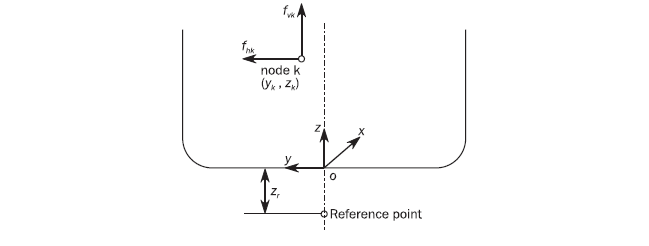
    Figure : Station forces and acting location of torsional moment at section
  - **4.5.3** **Hull girder torsional moment**
    The hull girder torsional moment, $x _{i} \(M _{T-FEM} (x _{j} )$ when $x _{j}$
    where:
    $x _{j}$ : Hull girder torsional moment, in kNm, at longitudinal station $j$.
    $M _{T-end}$ : X-coordinate, in m, of considered longitudinal station $M _{T-end} =M _{wt-targ} -M _{T-FEM} (x _{targ} )$.
    The torsional moment distribution given in **[4.5.2],** has a step at each longitudinal station.
  - **4.5.4** **Procedure to adjust hull girder torsional moment to target value**
    The torsional moment is to be adjusted by applying a hull girder torsional moment $x _{targ}$ in kNm, at the independent point of the aft end section of the model, given as follows:
    $M _{wt-targ}$
    where:
    $M _{T-FEM} (x _{targ} )$ : X-coordinate, in m, of the target location for hull girder torsional moment, as defined in **[4.3.5]**.
    $\sigma _{vm}$ : Target hull girder torsional moment, in kNm, specified in **[4.3.5],** to be achieved at the target location.
    $\sigma _{vm} = \sqrt {\sigma _{x} ^{2} - \sigma _{x} \sigma _{y} + \sigma _{y} ^{2} +3 \tau _{xy} ^{2}}$ : Hull girder torsional moment, in kNm, at target location due to local loads.
    Due to the step of hull girder torsional moment at each longitudinal station, the hull girder torsional moment is to be selected from the values aft and forward of the target location as follows: Maximum value for positive torsional moment and minimum value for negative torsional moment.
- **4.6** **Summary of hull girder load adjustments**
  - **4.6.1** The required methods of hull girder load adjustments for cargo hold regions are given in **Table 7.**

    |   | Midship cargo hold region |
    | --- | --- |
    | Adjustment of Vertical Shear Forces | See **[4.4.5]** |
    | Adjustment of Bending Moments | See **[4.4.8]** |
    | Adjustment of Torsional Moment | See **[4.5.4]** |

#### 5. Analysis criteria

- **5.1** **General**
  - **5.1.1** **Evaluation areas**
    Verification of results against the acceptance criteria is to be carried out within the longitudinal extent of the mid-hold, as shown in **Figure 13.**
    For accidental condition, the evaluation is carried out for the members within one web frame forward and one frame aftward in way of cofferdam structure, where the collision load direction is coincided. Refer to **Figure 14**.
    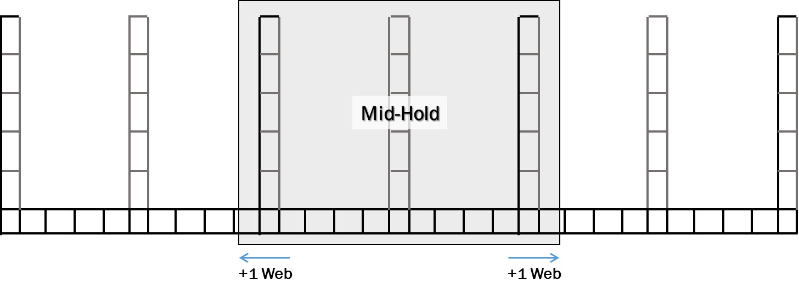
    Figure : Longitudinal extent of evaluation area
    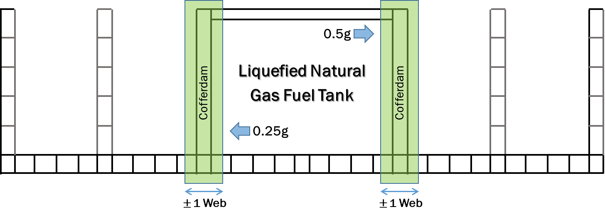
    Figure 14 : Longitudinal extent of evaluation area for accidental condition
  - **5.1.2** **Structural members**
    The following structural elements within the evaluation area are to be verified with the criteria given in **[5.2]** and **[5.3]:**
    • All hull girder longitudinal structural members.
    • All primary supporting structural members and bulkheads within the mid-hold.
    • All structural members being part of the transverse bulkheads.
- **5.2** **Yield strength assessment**
  - **5.2.1** **Von Mises stress**
    For all plates of the structural members defined in **[5.1.2],** the von Mises stress, $\sigma _{x} , \sigma _{y}$, in N/mm^2, is to be calculated based on the membrane normal and shear stresses of the shell element. The stresses are to be evaluated at the element centroid of the mid-plane (layer), as follows:
    $\tau _{xy}$
    where:
    $\sigma _{axial}$ : Element normal membrane stresses, in N/mm^2.
    $\lambda _{yperm}$ : Element shear stress, in N/mm^2.
  - **5.2.2** **Axial stress in beams and rod elements**
    For beams and rod elements, the axial stress, $\lambda _{y} \leq \lambda _{yperm}$, in N/mm^2, is to be calculated based on axial force alone. The axial stress is to be evaluated at the middle of element length.
  - **5.2.3** **Coarse mesh permissible yield utilisation factors**
    The coarse mesh permissible yield utilisation factors, $\lambda _{y}$, given in **Table 8**, are based on the mesh sizes and element types described in **[2.3]** to **[2.4].**
    The yield utilisation factor resulting from element stresses of each structural component are not to exceed the permissible values as given in **Table 8.**
  - **5.2.4** **Yield criteria**
    The structural elements given in **[5.1.2]** are to comply with the following criteria:
    $\lambda _{y} = \frac{\sigma _{vm}}{R _{Y}}$
    where:
    $\lambda _{y} = \frac{\left| \sigma _{axial} \right|}{R _{Y}}$ : Yield utilisation factor.
    $\sigma _{vm}$ for shell elements in general.
    $\sigma _{axial}$ for rod or beam elements in general.
    $\lambda _{yperm}$ : Von Mises stress, in N/mm^2.
    $\lambda _{ yperm}$ : Axial stress in rod or beam element, in N/mm^2.
    $\tau _{cor} = \frac{h t _{mod}}{A _{shr}} \tau _{elem}$ : Coarse mesh permissible yield utilisation factors defined in **Table 8.**
    The yield check criteria is to be based on axial stress for the flange of primary supporting members.
    Where the von Mises stress of the elements in the cargo hold FE model in way of the area under investigation by fine mesh exceeds the yield criteria, average von Mises stress, obtained from the fine mesh analysis, calculated over an area equivalent to the mesh size of the cargo hold finite element model is to satisfy the yield criteria above.
    In way of cut-outs, yield utilisation factor is to be obtained with shear stress correction, as given in **[5.2.5]**.

    | Structural component | Load combination | $\lambda _{ yperm}$ |
    | --- | --- | --- |
    | Plating of all longitudinal hull girder structural members, primary supporting structural members and bulkheads. Face plate of primary supporting members modelled using shell or rod elements. Dummy rod of corrugated bulkhead | S + D | 1.00 |
    | Plating of all longitudinal hull girder structural members, primary supporting structural members and bulkheads. Face plate of primary supporting members modelled using shell or rod elements. Dummy rod of corrugated bulkhead | S | 0.80 |
    | Plating of all longitudinal hull girder structural members, primary supporting structural members and bulkheads. Face plate of primary supporting members modelled using shell or rod elements. Dummy rod of corrugated bulkhead | A, T | 1.00 |
    | Corrugation of vertically corrugated bulkheads with lower stool and horizontally corrugated bulkhead, under lateral pressure from liquid loads, for shell elements only. Supporting structure in way of lower end of corrugated bulkheads without lower stool. | S + D | 0.90 |
    | Corrugation of vertically corrugated bulkheads with lower stool and horizontally corrugated bulkhead, under lateral pressure from liquid loads, for shell elements only. Supporting structure in way of lower end of corrugated bulkheads without lower stool. | S | 0.72 |
    | Corrugation of vertically corrugated bulkheads with lower stool and horizontally corrugated bulkhead, under lateral pressure from liquid loads, for shell elements only. Supporting structure in way of lower end of corrugated bulkheads without lower stool. | A, T | 0.90 |
    | Corrugation of vertically corrugated bulkheads without lower stool under lateral pressure from liquid loads and without lower stool, for shell elements only. | S + D | 0.81 |
    | Corrugation of vertically corrugated bulkheads without lower stool under lateral pressure from liquid loads and without lower stool, for shell elements only. | S | 0.65 |
    | Corrugation of vertically corrugated bulkheads without lower stool under lateral pressure from liquid loads and without lower stool, for shell elements only. | A, T | 0.81 |
  - **5.2.5** **Shear stress correction for cut-out**
    Except as indicated in **[5.2.6]**, the element shear stress in way of cut-outs in webs is to be corrected for loss in shear area in accordance with the following formula. The corrected element shear stress is to be used to calculate the von Mises stress of the element for verification against the yield criteria.
    $h$
    where:
    $h$ : Corrected element shear stress, in N/mm^2.
    $t _{mod}$ : Height of web of girder, in mm, in way of opening, see **Table 1**. Where the geometry of the opening is modelled, $A _{shr}$ is to be taken as the height of web of the girder deducting the height of the modelled opening.
    $\tau _{elem}$ : Modelled web thickness, in mm, in way of opening.
    $\lambda _{y} / C _{r}$ : Effective shear area of web, in mm^2, taken as the web area deducting the area lost of all openings, including slots for stiffeners, calculated in accordance with **Ch 3, Sec 7, [1.4.8]**.
    $\frac{A _{FEM} -A _{shr}}{A _{FEM}} \cdot 100\%$ : Element shear stress, in N/mm^2, before correction.
  - **5.2.6** **Exceptions for shear stress correction for openings**
    Correction of element shear stress due to presence of cut-outs is not required for cases given in **Table 9** provided $C _{r}$ complies with the criteria given in **[5.2.4]**.

    | Identification | Figure | Difference between modelled shear area and the effective shear area in % of the modelled shear area $\frac{A _{FEM} -A _{shr}}{A _{FEM}} \cdot 100\%$ | Reduction factor for yield criteria, $C _{r}$ |
    | --- | --- | --- | --- |
    | Upper and lower slots for local support stiffeners fitted with lugs or collar plates | 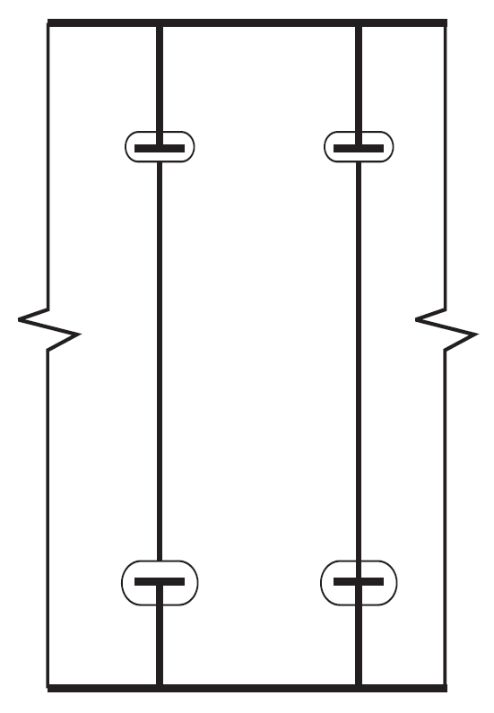 | $<$ 15 % | 0.85 |
    | Upper or lower slots for local support stiffeners fitted with lugs or collar plates | 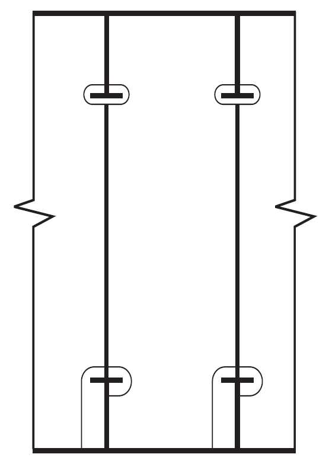 | $<$ 20 % | 0.80 |
    | In way of opening; upper and lower slots for local support stiffeners fitted with collar plates | 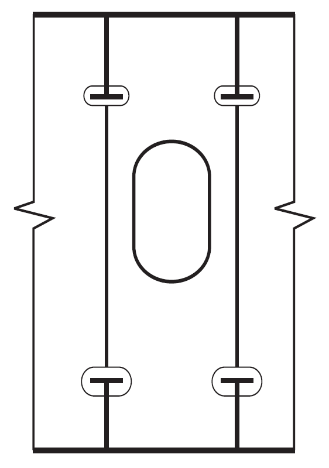 | $<$ 40 % | 0.60 |
    | $A _{shr}$ : Effective shear area of web, in mm^2, taken as the web area deducting the area lost of all openings, including slots for stiffeners, calculated in accordance with **Ch 3, Sec 7, [1.4.8]**. |   |   |   |
- **5.3** **Buckling strength assessment**
  - **5.3.1** All structural elements in FE analysis carried out in accordance with this Section are to be assessed individually against the buckling requirements as defined in **Ch 8, Sec 4.**

### Section 3 Local Structural Strength Analysis

#### 1. Objective and scope

- **1.1** **General**
  - **1.1.1** The local strength analysis of structural details is to be in accordance with the requirements given in this section.
  - **1.1.2** **Fine mesh analysis procedure**
    The details to be assessed by fine mesh analysis are to be modelled according to the requirements given in **[2]**, under the FE load combinations defined in **[3]** and to comply with the criteria given in **[4]**.
- **1.2** **Modelling of standard structural details**
  The fine mesh analysis may be carried out the area of high stress concentration identified during coarse mesh analysis.

#### 2. Structural modelling

- **2.1** **General**
  - **2.1.1** Evaluation of detailed stresses requires the use of refined finite element mesh in way of areas of high stress. This fine mesh analysis can be carried out by fine mesh zones incorporated into the cargo hold model. Alternatively, separate local FE model with fine mesh zones in conjunction with the boundary conditions obtained from the cargo hold model may be used.
- **2.2** **Extent of model**
  - **2.2.1** If a separate local fine mesh model is used, its extent is to be such that the calculated stresses at the areas of interest are not significantly affected by the imposed boundary conditions. The boundary of the fine mesh model is to coincide with primary supporting members in the cargo hold model, such as web frame, girders, stringers and floors.
- **2.3** **Mesh size**
  - **2.3.1** The mesh size in the fine mesh zones is not to be greater than 50 × 50 mm.
  - **2.3.2** The extent of the fine mesh zone is not to be less than 10 elements in all directions from the area under investigation. A smooth transition of mesh density from fine mesh zone to the boundary of the fine mesh model is to be maintained.
- **2.4** **Elements**
  - **2.4.1** All plating within the fine mesh zone is to be represented by shell elements. The aspect ratio of elements within the fine mesh zone is to be kept as close to 1 as possible. Variation of mesh density within the fine mesh zone and the use of triangular elements are to be avoided. In all cases, the elements within the fine mesh model are to have an aspect ratio not exceeding 3. Distorted elements, with element corner angles of less than 45 ° or greater than 135 °, are to be avoided. Stiffeners inside the fine mesh zone are to be modelled using shell elements. Stiffeners outside the fine mesh zones may be modelled using beam elements.
  - **2.4.2** Where fine mesh analysis is required for main bracket end connections and hatch opening, the fine mesh zone is to be extended at least 10 elements in all directions from the area subject to assessment, see **Figure 2.**
  - **2.4.3** Where fine mesh analysis is required for an opening, the first two layers of elements around the opening are to be modelled with mesh size not greater than 50 x 50 mm. A smooth transition from the fine mesh to the coarser mesh is to be maintained. Edge stiffeners which are welded directly to the edge of an opening are to be modelled with shell elements. Web stiffeners close to an opening may be modelled using rod or beam elements located at a distance of at least 50 mm from the edge of the opening. Example of fine mesh zone around an opening is shown in **Figure 3.**
  - **2.4.4** Face plates of openings, primary supporting members and associated brackets are to be modelled with at least two elements across their width on either side.
    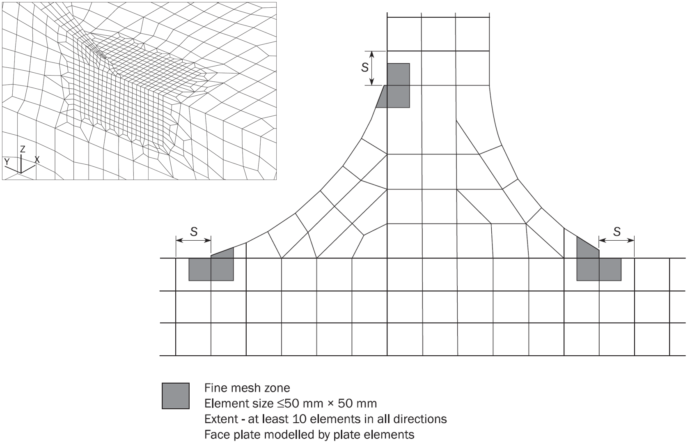
    Figure : Fine mesh zone around bracket toes
    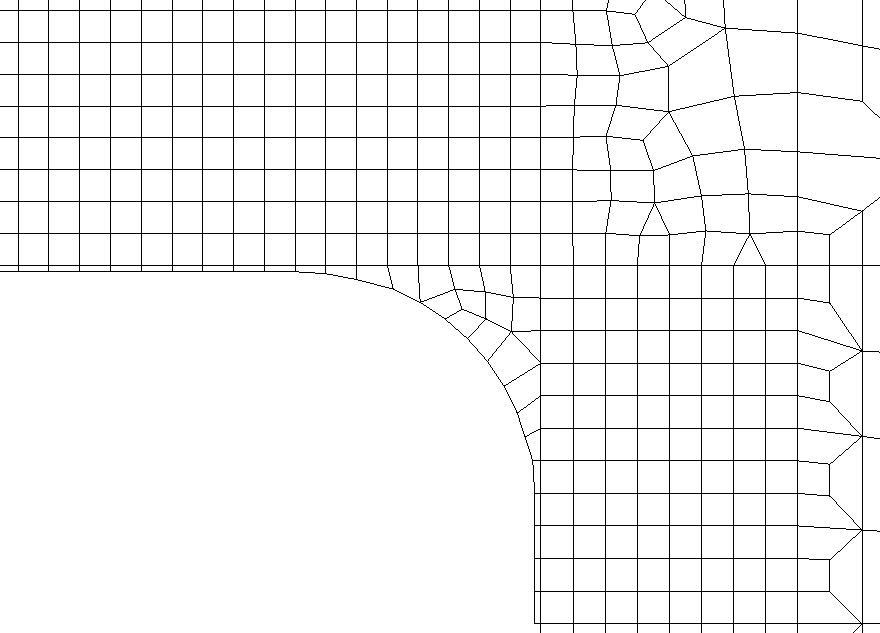
    Figure : Fine mesh zone around hatch opening structures 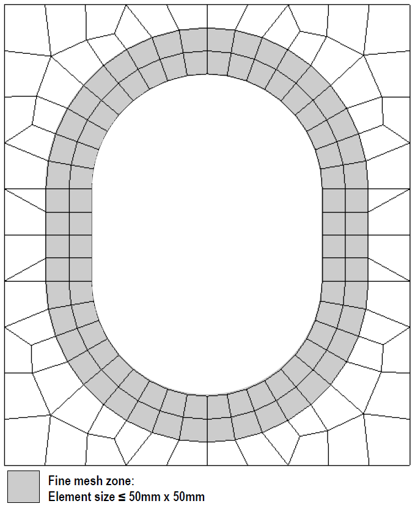
    Figure : Fine mesh zone around an opening

#### 3. FE load combinations

- **3.1** **General**
  - **3.1.1** The fine mesh detailed stress analysis is to be carried out for all FE load combinations applied to the corresponding cargo hold analysis.
- **3.2** **Application of loads and boundary conditions**
  - **3.2.1** **General**
    Where a separate local model is used for the fine mesh detailed stress analysis, the nodal displacements from the cargo hold model are to be applied to the corresponding boundary nodes on the local model as prescribed displacements. Alternatively, equivalent nodal forces from the cargo hold model may be applied to the boundary nodes.
    Where there are nodes on the local model boundaries which are not coincident with the nodal points on the cargo hold model, it is acceptable to impose prescribed displacements on these nodes using multi-point constraints. The use of linear multi-point constraint equations connecting two neighbouring coincident nodes is considered sufficient.
    All local loads, including any loads applied for hull girder bending moment and / or shear force adjustments, in way of the structure represented by the separate local finite element model are to be applied to the model.

#### 4. Analysis criteria

- **4.1** **Stress assessment**
  - **4.1.1** **General**
    Stress assessment of the fine mesh analysis is to be carried out for the FE load combinations specified in **Ch 4, Sec 8.**
  - **4.1.2** **Reference stress**
    Reference stress is von Mises stress, $\lambda _{f}$, which is to be calculated based on the membrane normal and shear stresses of the shell element evaluated at the element centroid. The stresses are to be evaluated at the mid plane of the element.
  - **4.1.3** **Permissible stress**
    The maximum permissible stresses are based on the mesh size of 50 x 50 mm as specified in **[2.1]** to **[2.4].** Where a smaller mesh size is used, an area weighted von Mises stress calculated over an area equal to the specified mesh size may be used to compare with the permissible stresses. The averaging is to be based only on elements with their entire boundary located within the desired area. The average stress is to be calculated based on stresses at element centroid; stress values obtained by interpolation and / or extrapolation are not to be used. Stress averaging is not to be carried across structural discontinuities and abutting structure.
- **4.2** **Acceptance criteria**
  - **4.2.1** Verification of stress results against the acceptance criteria is to be carried out in accordance with **[4.1].** The structural assessment is to demonstrate that the stress complies with the following criteria:
    $\lambda _{f} = \frac{\sigma _{vm}}{R _{Y}}$
    where:
    $\lambda _{f} = \frac{\left| \sigma _{axial} \right|}{R _{Y}}$ : Fine mesh yield utilisation factor.
    $\sigma _{vm}$ for shell elements in general.
    $\sigma _{axial}$ for rod or beam elements in general.
    $\lambda _{fperm}$ : Von Mises stress, in N/mm^2.
    $\lambda _{fperm} =1.70f _{f}$ : Axial stress in rod element, in N/mm^2.
    $\lambda _{fperm} =1.36f _{f}$ : Permissible fine mesh utilisation factor, taken as:
    • $\lambda _{fperm} =1.50f _{f}$ for AC-SD, AC-A and AC-T
    • $\lambda _{fperm} =1.20f _{f}$ for AC-S
    • $f _{f}$ for AC-SD, AC-A and AC-T
    • $f _{f} =1.0$ for AC-S
    $f _{f} =1.2$ : Fatigue factor, taken as:
    • $\sigma _{vm-av}$ in general, including the free edge of base material.
    • $\sigma _{vm-av} = \frac{\Sigma _{1} ^{n} A _{i} \sigma _{vm-i}}{\Sigma _{1} ^{n} A _{i}}$ for details assessed by very fine mesh analysis complying with the fatigue assessment criteria given in **Ch 9, Sec 2.**
    Note 1: The maximum permissible stresses are based on the mesh size of 50 x 50 mm. Where a smaller mesh size is used, an average von Mises stress calculated in accordance with **[4.1]** over an area equal to the specified mesh size may be used to compare with the permissible stresses.
    Note 2: Average von Mises stress, $\sigma _{vm-av}$, is to be calculated based on weighted average against element areas:
    $\sigma _{vm-av} = \frac{\Sigma _{1} ^{n} A _{i} \sigma _{vm-i}}{\Sigma _{1} ^{n} A _{i}}$
    Note 3: Stress averaging is not to be carried across structural discontinuities and abutting structure.
    - **a)** Element not adjacent to weld:
    - **b)** Element adjacent to weld:
  - **4.2.2** **Lower stool not fitted to a transverse or longitudinal corrugated bulkhead**
    Where a lower stool is not fitted to a transverse or longitudinal corrugated bulkhead, the permissible stresses given in **[4.2.1]** are to be reduced by 10% for the areas under investigation by fine mesh analysis. 
