# PART 14 Structural Rules for Container Ships

> RULES FOR CLASSIFICATION OF STEEL SHIPS / RA-14-E / 2025 / EN / Rules

## Chapter 10 Other Structures

### Section 1 Fore Part

**Symbols**
For symbols not defined in this section, refer to **Ch 1, Sec 4.**
$\alpha_p$ : Correction factor for the panel aspect ratio to be taken as:
$\alpha_p = 1.2 - \frac{b}{2.1 a}$ but not to be taken as greater than 1.0.
$f_bdg$ : Bending moment factor taken as:
$f _{bdg} =8 \left( 1+ \frac{n _{s}}{2} \right)$
$n_s$ : End fixation factor taken as:
$n_s = 0$ for both ends with low end fixity (simply supported).
$n_s = 1$ for one end fixed and one end simply supported.
$n_s =2$ for continuous members or members with bracketed fitted at both ends.
$d _{shr}$ : Effective web depth of stiffener, in $\mathrm{mm}$, as defined in **Ch 3, Sec 7, [1.4.3]**
$P _{SL}$ : Bottom slamming pressure defined in **Ch 4, Sec 5, [3.3.1]**, in $\mathrm{kN}/m ^{2}$.
$P _{FB}$ : Bow impact pressure defined in **Ch 4, Sec 5, [3.4.1]**, in $\mathrm{kN}/m ^{2}$.

#### 1. General

- **1.1** **Application**
  - **1.1.1** The requirements of this section apply to the following structures of the fore part as defined in **Ch 1, Sec 1, [2.4.2]:**
    • Fore peak structures.
    • Stem.
    In addition, the requirements of this section apply to structure subjected to impact loads:
    • Flat bottom forward, according to **[3.2]**.
    • Bow area, according to **[3.3]**.

#### 2. Structural Arrangement

- **2.1** **Floors and bottom girders**
  - **2.1.1** **Floors**
    In case of transverse framing, solid floors are to be fitted at each web frame location.
    In case of longitudinal framing, the spacing of solid floors is not to be greater than 3.5 $\mathrm{m}$ or four transverse frame spaces, whichever is smaller.
    The minimum depth of the floor at the centreline is not to be less than the required depth of the double bottom of the foremost cargo hold. See **Ch 2, Sec 3, [2.3].**
  - **2.1.2** **Bottom girders**
    A supporting structure is to be provided at the centreline either by extending the centreline girder to the stem or by providing a deep girder or centreline bulkhead.
    Where a centreline girder is fitted, the minimum depth and thickness is not to be less than that required for the depth of the double bottom in the neighbouring cargo tank region, and the upper edge is to be stiffened.
    In case of transverse framing, the spacing of bottom girders is not to exceed 2.5 $\mathrm{m}$.
    In case of longitudinal framing, the spacing of bottom girders is not to exceed 3.5 $\mathrm{m}$.
  - **2.1.3** **Alternative design verification**
    This spacing, defined in **[2.1.1]** and **[2.1.2]** may be increased, if the designer performs a verification of the bottom structure by means of grillage analysis or FE analysis and provides their full documentation. The acceptance criteria to be applied are defined in **Ch 6, Sec 6, [3].** A FE analysis is to be performed under consideration of the requirements provided in **Ch 7.**
- **2.2** **Side shell supporting structure**
  - **2.2.1** **Web frames**
    The spacing of web frames, $S$, in $\mathrm{m}$ as defined in **Ch 1, Sec 4, Table 5,** is to be taken as:
    $S=2.6+0.005L$, but not to be taken greater than 3.5 $\mathrm{m}$.
    Perforated flats are to be fitted to limit the effective span of web frames to not greater than 10 $\mathrm{m}$.
  - **2.2.2** **Stringers**
    The transverse framing forward of collision bulkhead stringers are to be spaced approximately 3.5 m apart. Stringers are to have an effective span not greater than 10 $\mathrm{m}$, and are to be adequately supported by web frame structures.
  - **2.2.3** **Alternative design verification**
    The spacing of web frames and stringers may be increased, if the designer performs a verification of the side shell supporting structure by means of beam analysis or FE analysis and provides their full documentation.
    The acceptance criteria to be applied are defined in **Ch 6, Sec 6, [3].** A FE analysis is to be performed under consideration of the requirements provided in **Ch 7.**
- **2.3** **Tripping brackets**
  - **2.3.1** For side shell and tank walls, located forward of the collision bulkhead and vertically framed, tripping brackets spaced not more than 2.6 $\mathrm{m}$ are to be fitted, according to **Figure 1,** between primary supporting members, decks and / or platforms.
    The as-built thickness of the tripping brackets is not to be less than the as-built thickness of the side frame webs to which they are connected.
    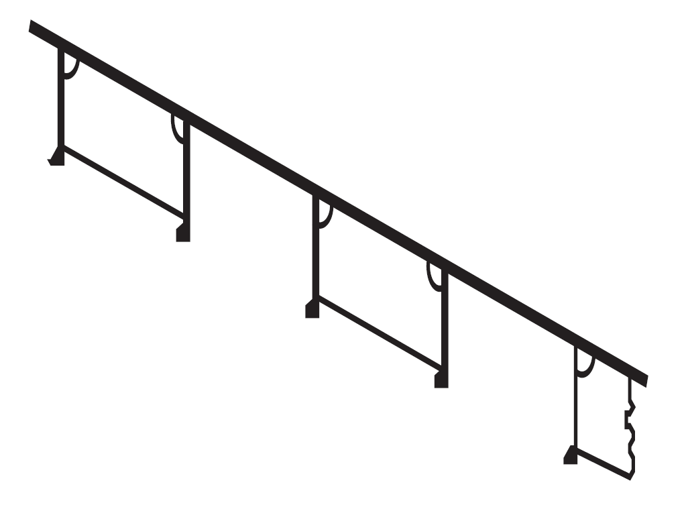
    Figure : Tripping brackets
- **2.4** **Bulbous bow**
  - **2.4.1** **General**
    Where a bulbous bow is fitted, the structural arrangements are to be such that the bulb is adequately supported and integrated into the fore peak structure.
  - **2.4.2** **Diaphragm plates**
    At the forward end of the bulb the structure is generally to be supported by horizontal diaphragm plates spaced about 1 $\mathrm{m}$ apart in conjunction with a deep centreline web.
    In general, vertical transverse diaphragm plates are to be arranged in way of the transition from the peak framing to the bulb framing.
  - **2.4.3** **Special bulbous bow designs**
    In way of a wide bulb, additional strengthening in the form of a centreline wash bulkhead is generally to be fitted.
    In way of a long bulb, additional strengthening in the form of transverse wash bulkheads or substantial web frames is to be fitted.
  - **2.4.4** **Strengthening for anchor and chain cable contact**
    The shell plating is to be increased in thickness at the forward end of the bulb and also in areas likely to be subjected to contact with anchors and chain cables during anchor handling. The increased plate thickness is to be the same as that required for plated stems given in **[4.1.1].**

#### 3. Structure subjected to impact loads

- **3.1** **General**
  - **3.1.1** **Application**
    The requirements of this sub-section cover the strengthening requirements for local impact loads that may occur in the forward structure. The impact loads to be applied in **[3.2]** and **[3.3]** are described in **Ch 4, Sec 5, [3].**
  - **3.1.2** **General scantling requirements**
    The requirements of **[3.2]** and **[3.3]** are to be applied in addition to applicable scantling requirements in **Ch 6.** Local scantling increases due to impact loads are to be made with due consideration given to details and avoidance of hard spots, notches and other harmful stress concentrations.
- **3.2** **Bottom slamming**
  - **3.2.1** **Application**
    Where the minimum draughts forward, $T _{F}$, as specified in **Ch 4, Sec 5, [3.2.1]**, are less than 0.045 $L$, the bottom forward is to be additionally strengthened to resist bottom slamming pressures.
    The draughts for which the bottom has been strengthened are to be indicated on the shell expansion plan and loading guidance information, as required in **Ch 1, Sec 5.**
    The load calculation point of the primary supporting members is specified in **Ch 3, Sec 7, [4].**
  - **3.2.2** **Extent of strengthening**
    The strengthening is to extend forward of 0.3 $L$ from the FP over the flat of bottom and adjacent plating with attached stiffeners up to a height of 500 $\mathrm{mm}$ above the baseline, see **Figure 2.**
    Outside the region strengthened to resist bottom slamming the scantlings are to be tapered to maintain continuity of longitudinal and / or transverse strength.
    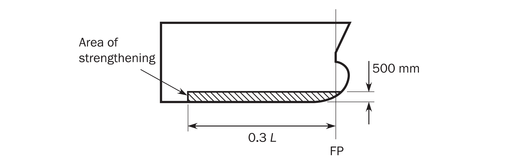
    Figure : Extent of strengthening against bottom slamming
  - **3.2.3** **Design to resist bottom slamming loads**
    The design of end connections of stiffeners in the bottom slamming region is to provide end fixity, either by making the stiffeners continuous through supports or by providing end brackets complying with **Ch 3, Sec 6, [3.2].**
    Scantlings and arrangements of primary supporting members, including bulkheads in way of stiffeners, are to comply with **[3.2.6].**
  - **3.2.4** **Shell plating**
    The net thickness of the hull envelope plating, $t$ in $\mathrm{mm}$, except for the transversely stiffened bilge plating within the cylindrical part of the ship, is not to be less than:
    $t= \frac{0.0158 \alpha _{p} b}{C _{d}} \sqrt {\frac{P _{SL}}{R _{eH}}}$
    where:
    $C _{d}$ : Plate capacity correction coefficient taken as:
    $C _{d} =1.3$
  - **3.2.5** **Shell stiffeners**
    The shell stiffeners within the strengthening area defined in **[3.2.2]** are to comply with the following criteria:
    $t _{w} = \frac{f _{shr} P s \ell _{shr}}{d _{shr} \tau _{eH}}$
    $Z _{pl} = \frac{1.2 P s \ell _{bdg}^{2}}{f _{bdg} R _{eH}}$
    where:
    $P$ : Effective design pressure, in $\mathrm{kN}/m ^{2}$.
    $P=0.5 P _{SL}$
    $f _{shr}$ : Shear force distribution factor:
    $f _{shr}$=0.7
    - **a)** The net web thickness, $t _{w}$ in $\mathrm{mm}$, is not to be less than:
    - **b)** The net plastic section modulus, $Z_pl$ in $\mathrm{cm} ^{3}$, is not to be less than:
  - **3.2.6** **Bottom slamming load area for primary supporting members**
    The scantlings of primary supporting members according to **[3.2.7]** are based on the application of the slamming pressure defined in **Ch 4, Sec 5, [3.2]** to an idealised slamming load area of hull envelope plating, $A _{SL}$, in $\mathrm{m} ^{2}$, given by:
    $A _{SL} = \frac{1.1 L B C _{b}}{1000}$
  - **3.2.7** **Primary supporting members**
    The size and number of openings in web plating of the floors and girders is to be minimised considering the required shear area.
    The shear area, $A _{shr}$, in $\mathrm{cm} ^{2}$, of each primary supporting member web is not to be less than:
    $A _{shr} = \frac{10Q _{SL}}{\tau _{eH}}$
    For simple arrangements of primary supporting members, where the grillage effect may be ignored, the shear force, $Q _{SL}$, in $\mathrm{kN}$, is given by:
    $Q _{SL} =f _{dist} F _{SL}$
    $f _{dist}$ : Factor for the greatest shear force distribution along the span, according to **Figure 3**.
    $F _{SL}$ : Patch load, in $\mathrm{kN}$, taken as:
    $F _{SL} =P \ell _{SL} b _{SL}$
    $P$ : Effective design pressure, in $\mathrm{kN}/m ^{2}$.
    $P=0.4 P _{SL}$
    $\ell _{SL}$ : Extent of slamming load area along the span, in m, taken as:
    $\ell _{SL} = \sqrt {A _{SL}}$ but not to be greater than 0.5$\ell _{SL}$
    $b _{SL}$ : Breadth of impact area supported by primary supporting member, in m, taken as:
    $b _{SL} = \sqrt {A _{SL}}$ but not to be greater than $S$
    For complex arrangements of primary supporting members, the greatest shear force, $Q _{SL}$, at any location along the span of each primary supporting member is to be derived by direct calculation in accordance with **Table 1**. The nominal shear stress shall not exceed 0.9$\tau _{eH}$ when the stress levels are determined through a grillage analysis.
    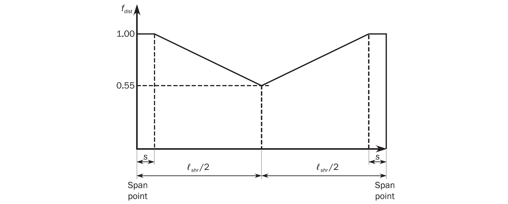
    Figure : Distribution of #eqnID-70 along the span of simple primary supporting members
    The net web thickness, $t _{w}$, in $\mathrm{mm}$, of primary supporting members adjacent to the shell is not to be less than:
    $t _{w} = \frac{s _{W}}{100} \sqrt {\frac{R _{eH}}{235}}$
    $s _{W}$ : Plate breadth, in $\mathrm{mm}$, taken as the spacing between the web stiffening.

    | Type of analysis | Model extent | Assumed end fixity of floors |
    | --- | --- | --- |
    | Beam theory | Overall span of member between effective bending supports. | Fixed at ends |
    | Double bottom grillage | Longitudinal extent to be one cargo hold length. Transverse extent to be half breadth of inner bottom | Floors and girders to be fixed at boundaries of the model. |
    | Note 1: The envelope of greatest shear force along each primary supporting member is to be derived by applying the load patch on a square area as defined in **[3.2.6]**, to a number of locations along the span. Note 2: A more extensive model in length and breadth can be considered. |   |   |
    - **a)** Shear area
    - **b)** Simplified calculation of slamming shear force
    - **c)** Direct calculation method for slamming shear force
    - **d)** Web thickness of primary supporting member
- **3.3** **Bow impact**
  - **3.3.1** **Application**
    The side structure in the ship forward area is to be strengthened against bow impact pressures.
  - **3.3.2** **Extent of strengthening**
    The strengthening is to extend forward of 0.1 $L$ from the FP and vertically above the minimum design ballast draught, $T_BAL$, defined in **Ch 1, Sec 4, [3.1.5]** and forecastle deck if any. See **Figure 4.**
    If the flare angle, $\alpha$ as defined in **Ch 4, Sec 5, [3.3.1]**, is greater than 40 ° at 0.1 $L$ from FE, the bow impact area shall be extended to 0.15 $L$ from FE.
    Outside the strengthening area the scantlings are to be tapered to maintain continuity of longitudinal and / or transverse strength.
    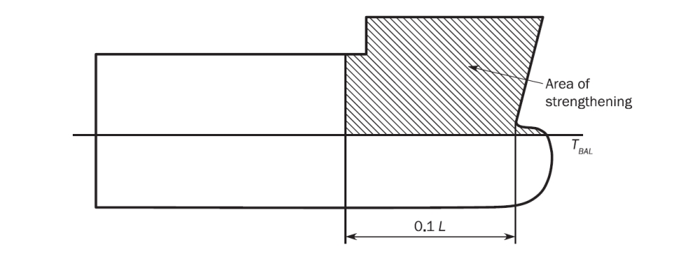
    Figure : Extent of strengthening against bow impact
  - **3.3.3** **Design to resist bow impact loads**
    The design of end connections of stiffeners in the bow impact region are to ensure end fixity, either by making the stiffeners continuous through supports or by providing end brackets complying with **Ch 3, Sec 6, [3.2].**
    - **a)** In the bow impact strengthening area, longitudinal framing is to be carried as far forward as practicable.
    - **b)** Scantlings and arrangements of primary supporting members, including decks and bulkheads, in way of the stiffeners, are to comply with **[3.3.6]**. In areas of the greatest bow impact load, the web stiffeners arranged perpendicular to the hull envelope plating and the double sided lug connections are to be provided.The main stiffening direction of decks and bulkheads supporting shell framing is to be arranged parallel to the span direction of the supported shell frames, to protect against buckling.
  - **3.3.4** **Side shell plating**
    The net thickness of the side shell plating, $t$ in $\mathrm{mm}$ is not to be less than:
    $t= \frac{0.0158 \alpha _{p} b}{C _{d}} \sqrt {\frac{P _{FB}}{R _{eH}}}$
    where:
    $C _{d}$ : Plate capacity correction coefficient taken as:
    $C _{d} =1.3$
  - **3.3.5** **Side shell stiffeners**
    The side shell stiffeners within the strengthening area defined in **[3.3.2]** are to comply with the following criteria:
    $t _{w} = \frac{f _{shr} P s \ell _{shr}}{d _{shr} \tau _{eH}}$
    $Z _{pl} = \frac{1.2 P s \ell _{bdg}^{2}}{f _{bdg} R _{eH}}$
    where:
    $P$ : Effective design pressure, in $\mathrm{kN}/m ^{2}$.
    $P=0.5 P _{FB}$
    $f _{shr}$ : Shear force distribution factor:
    $f _{shr}$=0.5 for horizontal stiffeners and upper end of vertical stiffeners
    $f _{shr}$=0.7 for lower end of vertical stiffeners
    - **a)** The net web thickness, $t _{w}$ in $\mathrm{mm}$, is not to be less than:
    - **b)** The net plastic section modulus, $Z_pl$ in $\mathrm{cm} ^{3}$, is not to be less than:
  - **3.3.6** **Primary supporting members**
    $t _{w} = \frac{s _{W}}{75} \sqrt {\frac{R _{eH}}{235}}$
    $Z=1000 \frac{P S \ell _{bdg}^{2}}{f _{bdg} R _{eH}}$ with $f _{bdg}$ is not to be taken less than 10
    $A _{shr} =10 \frac{f _{shr} P S \ell _{shr}}{\tau _{eH}}$
    where:
    $P$ : Effective design pressure, in $\mathrm{kN}/m ^{2}$.
    $P=0.4 P _{FB}$
    $f _{shr}$ : Shear force distribution factor, as defined in **Ch 6, Sec 6, Table 14**.
    $s _{W}$ : Plate breadth, in $\mathrm{mm}$, taken as the spacing between the web stiffening.
    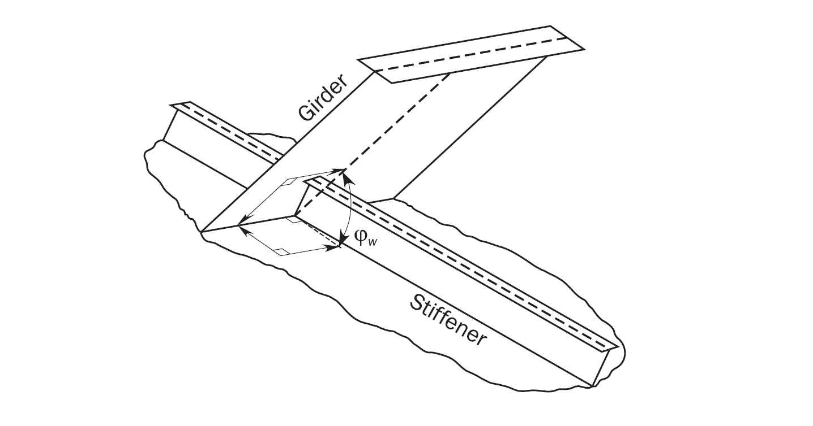
    Figure : Angle between shell primary member and shell plate
    - **a)** Primary supporting members in the bow impact strengthening area are to be configured to provide effective continuity of strength and the avoidance of hard spots.
    - **b)** End brackets of primary supporting members are to be suitably stiffened along their edge. Consideration is to be given to the design of bracket toes to minimise abrupt changes of cross section.
    - **c)** Tripping brackets are to be fitted at the toes of end brackets and at locations where the primary supporting member flange is knuckled or curved.
    - **d)** The net thickness of primary supporting members in way of bow impact strengthening area defined in **[3.3.2]**, $t_w$ in $\mathrm{mm}$, is not to be less than:
    - **e)** The effective section modulus of each primary supporting member, $Z$ in $\mathrm{cm} ^{3}$, is not to be less than:
    - **f)** The effective shear area of the web, $A _{shr}$ in $\mathrm{cm} ^{2}$, of each primary supporting member at the support / toe of end brackets is not to be less than:

#### 4. Additional scantling requirements

- **4.1** **Plate stem**
  - **4.1.1** The net thickness, $t_Stm$ in $\mathrm{mm}$, is not to be less than:
    $t _{Stm} =(0.6+0.4S _{B} )(0.08L+2.7) \sqrt {k}$ but need not be greater than $22 \sqrt {k} -1$
    where:
    $S _{B}$ : Spacing, in $\mathrm{m}$, between horizontal stringers (partial or not), breasthooks or equivalent horizontal stiffening members.
    Starting from 0.6 $\mathrm{m}$ above the summer load waterline up to $T _{SC} +C _{w}$, the net thickness may gradually be reduced to 0.8 $t _{S tm}$.
  - **4.1.2** **Breasthooks and diaphragm plating**
    The net thickness of breasthooks / diaphragm plates in way of bow impact strengthening area defined in **[3.3.1]**, $t_w$ in $\mathrm{mm}$, is not to be less than:
    $t _{w} = \frac{s}{70} \sqrt {\frac{R _{eH}}{235}}$
    where:
    $s$ : Spacing of stiffeners on the web, as defined in **Ch 1, Sec 4, Table 5**, in $\mathrm{mm}$. Where no stiffeners are fitted, $s$ is to be taken as the depth of the web.
- **4.2** **Thruster tunnel**
  - **4.2.1** The net thickness of the tunnel plating, $t _{tun}$ in $\mathrm{mm}$, is not to be less than the net required thickness for the shell plating in the vicinity of the bow thruster.
    In addition, $t _{tun}$ is not to be taken less than:
    $t _{tun} =0.008 d _{tun} +1.8$
    where:
    $d _{tun}$ : inside diameter of the tunnel, in $\mathrm{mm}$, but not to be taken less than 970 $\mathrm{mm}$.
    Where the outboard ends of the tunnel are provided with bars or grids, the bars or grids are to be effectively secured.

### Section 2 Machinery Space

#### 1. General

- **1.1** **Application**
  - **1.1.1** The requirements of this section apply to the scantlings and arrangement of structures located in the machinery space. It is the shipyard responsibility to design the ship in accordance with the machinery manufacturer’s requirements.

#### 2. Machinery space arrangement

- **2.1** **Structural arrangement**
  - **2.1.1** Where openings in decks / bulkheads are provided in the machinery space, the arrangements are to support the deck, side, and bottom structure.
  - **2.1.2** All parts of the machinery, shafting, etc, are to be supported to distribute the loads into the ship’ structure. The adjacent structure is to be suitably stiffened.
  - **2.1.3** Primary supporting members are to be positioned giving consideration to the provision of through stiffeners and in line pillar supports to achieve an efficient structural design.
  - **2.1.4** The spacing of web frames in way of transversely framed machinery spaces is generally not to exceed five transverse frame spaces. Web frames are to be connected at the top and bottom to members of suitable stiffness, and supported by deck transverses.
  - **2.1.5** End connections of side longitudinals at transverse bulkheads are to provide fixity, lateral support, and when not continuous are to be provided with soft-toe brackets. Brackets lapped onto the longitudinals are not to be fitted.
  - **2.1.6** Where a transverse framing system is adopted, deck stiffeners are to be supported by a suitable arrangement of longitudinal girders in association with pillars or pillar bulkheads. Where fitted, deck transverses are to be arranged in line with web frames to provide end fixity and transverse continuity of strength.
    Where a longitudinal framing system is adopted, deck longitudinals are to be supported by deck transverses in line with web frames in association with pillars or pillar bulkheads.
  - **2.1.7** Machinery casings are to be supported by a suitable arrangement of deck transverses and longitudinal girders in association with pillars or pillar bulkheads. In way of particularly large machinery casing openings, cross ties may be required. These are to be arranged in line with deck transverses.
  - **2.1.8** The foundations for main propulsion units, reduction gears, shaft and thrust bearings, and the structure supporting those foundations are to maintain the required alignment and rigidity under all anticipated conditions of loading. Consideration is to be given to the submittal of the following plans to the machinery manufacturer for review:
    - **a)** Foundations for main propulsion units.
    - **b)** Foundations for reduction gears.
    - **c)** Foundations for thrust bearings.
    - **d)** Structure supporting a), b) and c).
- **2.2** **Double bottom**
  - **2.2.1** **Double bottom height**
    The double bottom height at the centreline, irrespective of the location of the machinery space, is to be not less than the value defined in **Ch 2, Sec 3, [2.3.1].** This depth may need to be considerably increased in relation to the type and depth of main machinery seatings.
    The above height is to be increased by the shipyard where the machinery space is very large and where there is a considerable variation in draught between light ballast and full load conditions.
    Where the double bottom height in the machinery space differs from that in adjacent spaces, structural continuity of longitudinal members is to be provided by sloping the inner bottom over an adequate longitudinal extent. The knuckles in the sloped inner bottom are to be located in way of floors. Lesser double bottom height may be accepted in local areas provided that the overall strength of the double bottom structure is not thereby impaired.
  - **2.2.2** **Centreline girder**
    The double bottom is to be arranged with a centreline girder. In way of any openings for manholes on the centreline girder, permitted only where absolutely necessary for double bottom access and maintenance, local strengthening is to be arranged.
  - **2.2.3** **Side bottom girders**
    In the machinery space, the number of side bottom girders is to be adequately increased, with respect to the adjacent areas, to provide adequate rigidity of the structure. The side bottom girders in longitudinal stiffened double bottom, are to be a continuation of any bottom longitudinals in the areas adjacent to the machinery space and are generally to have a spacing not greater than 3 times that of longitudinals and in no case greater than 3.0 $\mathrm{m}$.
  - **2.2.4** **Girders in way of machinery seatings**
    Additional side bottom girders are to be fitted in way of machinery seating.
  - **2.2.5** **Floors in longitudinally stiffened double bottom**
    Where the double bottom is longitudinally stiffened, plate floors are to be fitted at every frame under the main engine and thrust bearing. Outboard of the engine and bearing seatings, the floors may be fitted at alternate frames.
  - **2.2.6** **Floors in transversely framed double bottom**
    Where the double bottom in the machinery space is transversely stiffened, floors are to be arranged at every frame.
  - **2.2.7** **Manholes and wells**
    The number and size of manholes in floors located in way of seatings and adjacent areas are to be kept to the minimum necessary for double bottom access and maintenance.
    In general, manhole edges are to be stiffened with flanges; failing this, the floor plate is to be adequately stiffened with flat bars at manhole sides.
    Manholes with perforated portable plates are to be fitted in the inner bottom in the vicinity of wells arranged close to the aft bulkhead of the engine room.
    Drainage of the tunnel is to be arranged through a well located at the aft end of the tunnel.
  - **2.2.8** **Inner bottom plating**
    Where main engines or thrust bearings are bolted directly to the inner bottom, the net thickness of the inner bottom plating is to be at least 19.0 $\mathrm{mm}$. Hold-down bolts are to be arranged as close as possible to floors and longitudinal girders. Plating thickness and the arrangements of hold-down bolts are also to consider the manufacturer’ recommendations.
  - **2.2.9** **Heavy equipment**
    Where heavy equipment is mounted directly on the inner bottom, the thickness of the floors and girders is to be suitably increased.

#### 3. Machinery foundations

- **3.1** **General**
  - **3.1.1** Main engines and thrust bearings are to be effectively secured to the hull structure by foundations of strength that is sufficient to resist the various gravitational, thrust, torque, dynamic, and vibratory forces which may be imposed on them.
  - **3.1.2** In the case of higher power internal combustion engines or turbine installations, the foundations are generally to be integral with the double bottom structure. Consideration is to be given to substantially increase the inner bottom plating thickness in way of the engine foundation plate or the turbine gear case and the thrust bearing, see Type 1 of **Figure 1.**
  - **3.1.3** For main machinery supported on foundations of Type 2, as shown in **Figure 2,** the forces from the engine into the adjacent structure are to be distributed as uniformly as possible. Longitudinal members supporting the foundation are to be aligned with girders in the double bottom, and transverse stiffening is to be arranged in line with the floors, see Type 2 of **Figure 2.**
    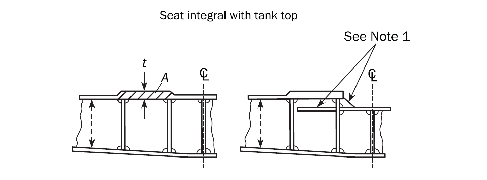
    Figure : Machinery foundations Type 1
    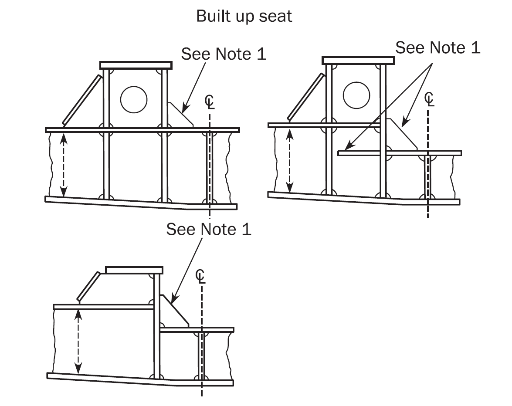
    Figure : Machinery foundation Type 2
    Note 1: Brackets are to be as large as possible. Brackets may be omitted to avoid interference with the girders of the engine foundation, in accordance with recommendations of the engine manufacturer.
- **3.2** **Foundations for internal combustion engines and thrust bearings**
  - **3.2.1** In determining the scantlings of foundations for internal combustion engines and thrust bearings, consideration is to be given to the general rigidity of the engine and to its design characteristics with regard to out of balance forces.
  - **3.2.2** Generally, two girders are to be fitted in way of the foundation for internal combustion engines and thrust bearings.
- **3.3** **Auxiliary foundations**
  - **3.3.1** Auxiliary machinery is to be secured on foundations that are of suitable size and arrangement to distribute the loads from the machinery evenly into the supporting structure.

### Section 3 Aft Part

**Symbols**
For symbols not defined in this section, refer to **Ch 1, Sec 4.**
$P _{SS}$ : Stern slamming pressure defined in **Ch 4, Sec 5, [3.5.1]**, in $\mathrm{kN}/m ^{2}$.

#### 1. General

- **1.1** **Application**
  - **1.1.1** The requirements of this section apply for the scantlings and arrangement of structures located aft of the aft peak bulkhead.

#### 2. Aft peak

- **2.1** **Structural arrangement**
  - **2.1.1** **Floors**
    Floors are to be fitted at each frame space in the aft peak and carried to a height at least above the stern tube. Where floors do not extend to flats or decks, they are to be stiffened by flanges at their upper end.
    Heavy plate floors are to be fitted in way of the aft face of the horn and in line with the webs in the rudder horn. They may be required to be carried up to the first deck or flat. In this area, cut outs, scallops or other openings are to be kept to a minimum.
  - **2.1.2** **Platforms and side girders**
    Platforms and side girders within the peak are to be arranged in line with those located in the area immediately forward.
    Where this arrangement is not possible due to the shape of the hull and access needs, structural continuity between the peak and the structures of the area immediately forward is to be ensured by adopting wide tapering brackets.
    Where the aft peak is adjacent to a machinery space whose side is longitudinally framed, the side girders in the aft peak are to be fitted with tapering brackets.
    Where the depth from the peak tank top to the weather deck is greater than 2.6 $\mathrm{m}$ and the side is transversely framed, one or more side girders are to be fitted, preferably in line with similar structures existing forward.
  - **2.1.3** **Longitu dinal bul kheads**
    A longitudinal non-tight bulkhead is to be fitted on the centreline of the ship, in general in the upper part of the peak, and stiffened at each frame spacing.
    Where either the stern overhang is very large or the maximum breadth of the space divided by watertight and wash bulkheads is greater than 20.0 $\mathrm{m}$, additional longitudinal wash bulkheads may be required.
  - **2.1.4** **Alterna tive design verification**
    The spacing and arrangement requirements, defined in **[2.1.1], [2.1.2]** and **[2.1.3]** may be increased, if the designer performs a verification by means of grillage analysis or FE analysis and provides their full documentation. The acceptance criteria to be applied are defined in **Ch 6, Sec 6, [3].** A FE analysis is to be performed under consideration of the requirements provided in **Ch 7.**
- **2.2** **Stiffening of floors and girders in aft peak**
  - **2.2.1** Stiffeners on the floors and girders in aft peak ballast or fresh water tanks above propeller are to be designed in accordance with **[2.2.2]** and **[2.2.3]**. This applies for stiffeners located in an area extending longitudinally between the forward edge of the rudder and the after end of the propeller boss and transversely within the diameter of the propeller.
  - **2.2.2** The height of stiffeners, $h_stf$ in $\mathrm{mm}$, on the floors and girders are not to be less than:
    $h _{stf} =80 \ell _{stf}$ for flat bar stiffeners.
    $h _{stf} =70 \ell _{stf}$ for bulb profiles and flanged stiffeners.
    where:
    $\ell _{stf}$ : Length of stiffener, in $\mathrm{m}$, as shown in **Figure 1**. Length need not be taken greater than 5.0 $\mathrm{m}$.
  - **2.2.3** End brackets are to be provided as follows:
    where:
    $\ell _stf-t$ : Total length of stiffener, in $\mathrm{m}$, as shown in **Figure 1.**
    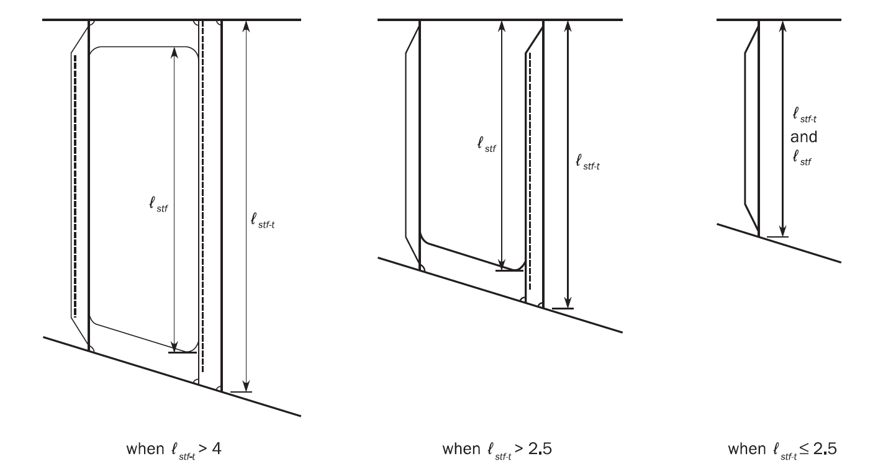
    Figure : Stiffening of floors and girders in the aft peak tank
    - **a)** Brackets are to be fitted at the lower and upper ends when $\ell _stf-t$ exceeds 4.0 $\mathrm{m}$.
    - **b)** Brackets are to be fitted at the lower end when $\ell _stf-t$ exceeds 2.5 $\mathrm{m}$.

#### 3. Stern frames

- **3.1** **General**
  - **3.1.1** Stern frames may be fabricated from steel plates or made of cast steel with a hollow section. For applicable material specifications and steel grades, see **Ch 3, Sec 1.** Stern frames of other material or construction will be specially considered.
  - **3.1.2** Cast steel and fabricated stern frames are to be strengthened by adequately spaced horizontal plates with gross thickness not less than 80 % of required thickness for stern frames. Abrupt changes of section are to be avoided in castings; all sections are to have adequate tapering radius.
  - **3.1.3** In the upper part of the propeller aperture, where the hull form is full and centreline supports are provided, the thickness of stern frames may be reduced to 80 % of the applicable requirement in **[3.2.1]**.
- **3.2** **Propeller posts**
  - **3.2.1** **Gross scantlings of propeller posts**
    The gross scantlings of propeller posts are not to be less than those obtained from the formulae in **Table 1** for single screw ships and **Table 2** for twin screw ships.
    Scantlings and proportions of the propeller post which differ from **Table 1** and **Table 2** may be considered acceptable provided that the section modulus of the propeller post section about its longitudinal axis is not less than that calculated with the propeller post scantlings in **Table 1** or **Table 2**, as applicable.

    | Gross scantlings of propeller posts, in $\mathrm{mm}$ | Fabricated propeller post 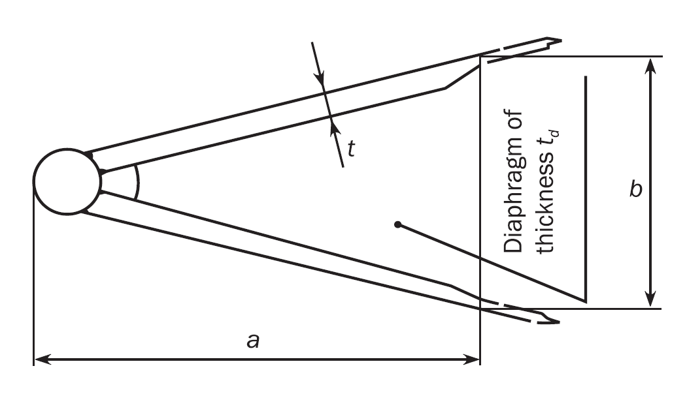 | Cast propeller post 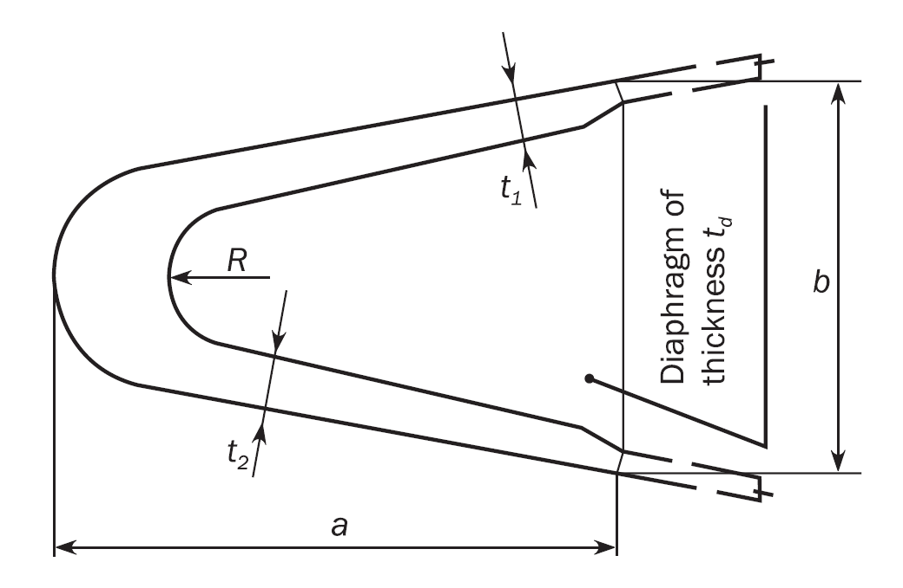 | Bar propeller post, cast or forged, having rectangular section 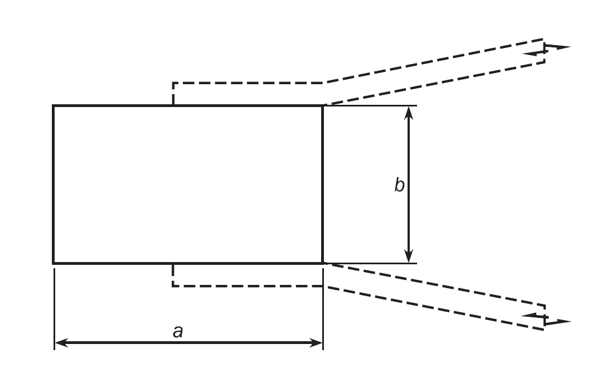 |
    | --- | --- | --- | --- |
    | *a* | $50L _{1} ^{ 1/2}$ | $33L _{1} ^{1/2}$ | $10 \sqrt {7.2L-256}$ |
    | *b* | $35L _{1} ^{1/2}$ | $23L _{1} ^{1/2}$ | $10 \sqrt {4.6L-164}$ |
    | $t _{1}$ | $2.5L _{1} ^{1/2}$ | $3.2L _{1} ^{1/2}$ | - |
    | $t _{2}$ | - | $4.4L _{1} ^{1/2}$ | - |
    | $t _{d}$ | $1.3L _{1} ^{1/2}$ | $2.0L _{1} ^{1/2}$ | - |
    | *R* | - | 50 mm | - |

    | Gross scantlings of propeller posts, in $\mathrm{mm}$ | Fabricated propeller post 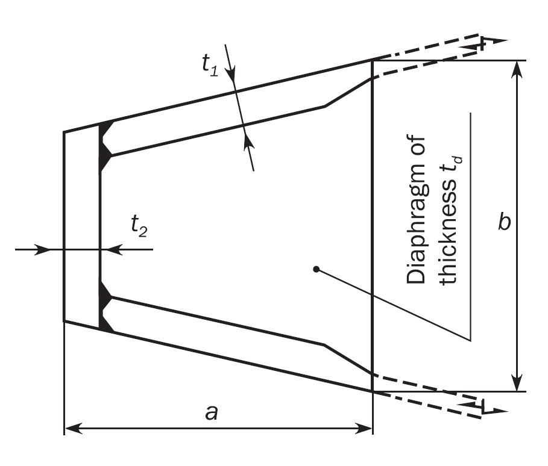 | Cast propeller post 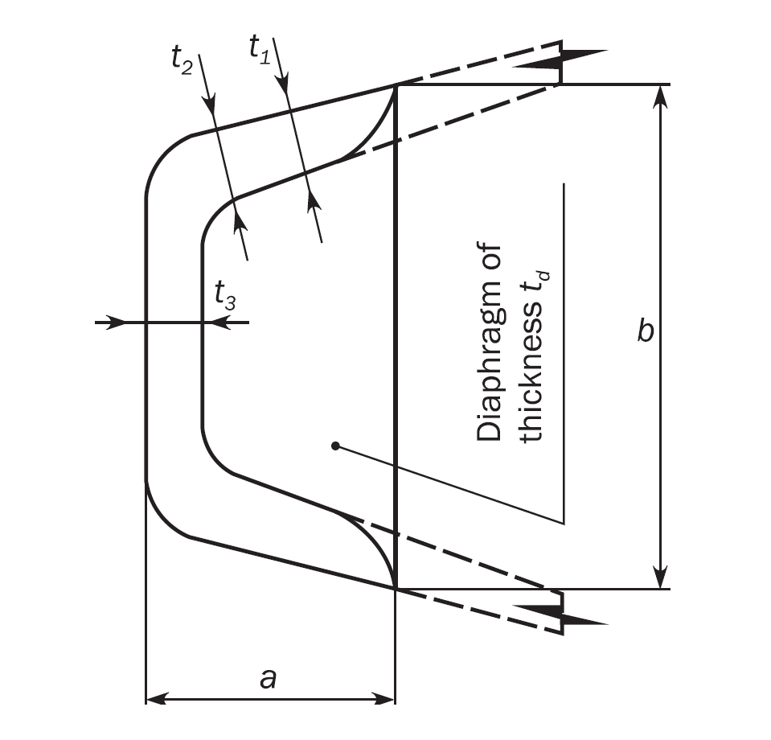 | Bar propeller post, cast or forged, having rectangular section 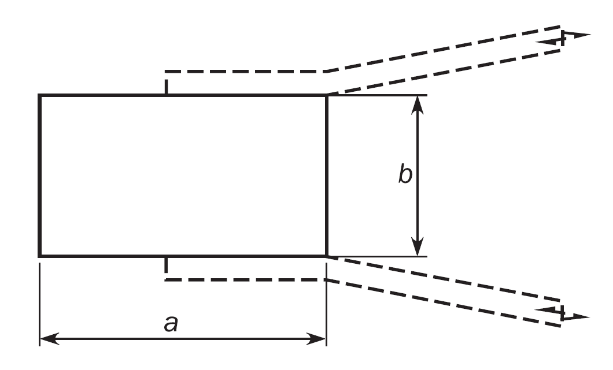 |
    | --- | --- | --- | --- |
    | *a* | $25L _{} ^{1/2}$ | $12.5L _{} ^{1/2}$ | $2.4L+6$ |
    | *b* | $25L _{} ^{1/2}$ | $25L _{} ^{1/2}$ | $0.8L+2$ |
    | *t_1* | $2.5L _{} ^{1/2}$ | $2.5L _{} ^{1/2}$ | - |
    | *t_2* | $3.2L _{} ^{1/2}$ | $3.2L _{} ^{1/2}$ | - |
    | *t_3* | - | $4.4L _{} ^{1/2}$ | - |
    | $t _{d}$ | $1.3L _{} ^{1/2}$ | $2.0L _{} ^{1/2}$ | - |
  - **3.2.2** **Prop eller sha ft bossing**
    In single screw ships, the thickness of the propeller shaft bossing, included in the propeller post, is not to be less than 60 % of the dimension b required in **[3.2.1]** for bar propeller posts with a rectangular section.
- **3.3** **Connections**
  - **3.3.1** **Connections with hull structure**
    Stern frames are to be effectively attached to the aft structure and the required scantling for the lower part of the propeller post is to be extended from the aft end of the propeller post, at the centerline of the propeller shaft, to a length not less than 1500 + 6 $L _{2}$ $\mathrm{mm}$, in order to provide an effective connection with the keel. However, the stern frame need not extend beyond the aft peak bulkhead.
  - **3.3.2** **Conne ction w ith keel plate**
    The thickness of the lower part of the stern frames is to be gradually tapered to that of the solid bar keel or keel plate.
    Where a keel plate is fitted, the lower part of the stern frame is to be designed to ensure an effective connection with the keel.
  - **3.3.3** **Connect ion with transom floors**
    Rudder posts and propeller posts are to be connected with transom floors having height not less than that of the double bottom height and a net thickness not less than that obtained, in $\mathrm{mm}$, from the following formula:
    $t=9+0.023 L _{1}$
  - **3.3.4** **Connection with centre keelson**
    Where the stern frame is made of cast steel, the lower part of the stern frame is to be fitted, as far as practicable, with a longitudinal web for connection with the centre keelson.

#### 4. Special scantling requirements for shell structure

- **4.1** **Shell plating**
  - **4.1.1** **Shell plating connected with stern frame**
    The net thickness of shell plating connected with the stern frame is not to be less than that obtained, in $\mathrm{mm}$, from the following formula:
    $t=0.094(L _{2} -43)+0.009 b$
    In way of the boss and heel plate, the net thickness, $t$, of shell plating, in $\mathrm{mm}$, is not to be less than:
    $t=0.105(L _{2} -47)+0.011 b$
    where:
    $b$ : Breadth of plate panel, in $\mathrm{mm}$, as defined in **Ch 3, Sec 7, [2.2.2].**
  - **4.1.2** **Heavy shell plates**
    Heavy shell plates are to be fitted locally in way of the heavy plate floors as required by **[2.1.1].** The net thickness of heavy shell plates is not to be less than the value given in **[4.1.1]**. Outboard of the heavy floors, the heavy shell plates may be reduced in thickness in as gradual a manner as practicable. Where the horn plating is radiused into the shell plating, the radius at the shell connection, $r$ in $\mathrm{mm}$, is not to be less than:
    $r=150+0.8L _{2}$
  - **4.1.3** **Thruster tunnel plating**
    The net thickness of the tunnel plating, $t_tun$ in $\mathrm{mm}$, is to comply with the requirements in **Sec 1, [4.2.1].**

#### 5. Structure subjected to impact loads

- **5.1** **General**
  - **5.1.1** **Application**
    The requirements of this sub-section cover the strengthening requirements for local impact loads that may occur in the stern bottom structure of the ships with length $L \geq 150$ $\mathrm{m}$. The stern slamming loads, $P _{SS}$, to be applied in **[5.2]** are described in **Ch 4, Sec 5, [3].** The requirements of **[5.2]** are to be applied in addition to applicable scantling requirements in **Ch 6.**
- **5.2** **Stern slamming**
  - **5.2.1** **Application**
    The stern bottom structure is to be strengthened against stern slamming pressures.
  - **5.2.2** **Extent of strengthening**
    In general the strengthening is to extend aft of 0.1 $L$ forward of AE and vertically above the minimum design ballast draught, $T _{AE}$, defined in **Ch 1, Sec 4, Table 2**. Outside the strengthening area the scantlings are to be tapered to maintain continuity of longitudinal and / or transverse strength.
  - **5.2.3** **Side shell plating**
    The net thickness of the side shell plating, $t$ in $\mathrm{mm}$, is not to be less than:
    $t= \frac{0.0158 \alpha _{p} b}{C _{d}} \sqrt {\frac{P _{SS}}{R _{eH}}}$
    where:
    $C _{d}$ : Plate capacity correction coefficient taken as:
    $C _{d} =1.3$
  - **5.2.4** **Side shell stiffeners**
    The side shell stiffeners within the strengthening area defined in **[5.2.2]** are to comply with the following criteria:
    $t _{w} = \frac{f _{shr} P s \ell _{shr}}{d _{shr} \tau _{eH}}$
    $Z _{pl} = \frac{1.2 P s \ell _{bdg}^{2}}{f _{bdg} R _{eH}}$
    where:
    $P$ : Effective design pressure, in $\mathrm{kN}/m ^{2}$.
    $P=0.5 P _{SS}$
    $f _{shr}$ : Shear force distribution factor:
    $f _{shr} =0.7$
    - **a)** The net web thickness, $t _{w}$ in $\mathrm{mm}$, is not to be less than:
    - **b)** The net plastic section modulus, $Z_pl$ in $\mathrm{cm} ^{3}$, is not to be less than:
  - **5.2.5** **Primary supporting members**
    The size and number of openings in web plating of the floors and girders is to be minimised considering the required shear area as given:
    The section modulus of each primary supporting member, $Z$ in $\mathrm{cm} ^{3}$, is not to be less than:
    $Z=1000 \frac{P S \ell _{bdg}^{2}}{f _{bdg} R _{eH}}$ with $f _{bdg}$ is not to be taken less than 10
    The shear area, $A _{shr}$ in $\mathrm{cm} ^{2}$, of each primary supporting member web at any position along its span is not to be less than:
    $A _{shr} =10 \frac{f _{shr} P S \ell _{shr}}{\tau _{eH}}$
    The net thickness of primary supporting members in way of stern slamming strengthening area defined in **[5.2.2]**, $t_w$ in $\mathrm{mm}$, is not to be less than:
    $t _{w} = \frac{s _{W}}{75} \sqrt {\frac{R _{eH}}{235}}$
    where:
    $P$ : Effective design pressure, in $\mathrm{kN}/m ^{2}$.
    $P=0.4 P _{SS}$
    $f _{shr}$ : Shear force distribution factor, as defined in **Ch 6, Sec 6, Table 14**.
    $s _{W}$ : Plate breadth, in $\mathrm{mm}$, taken as the spacing between the web stiffening.
    - **a)** Section modulus
    - **b)** Shear area
    - **c)** Web thickness of primary supporting member

### Section 4 Tanks Subject to Sloshing

**Symbols**
For symbols not defined in this section, refer to **Ch 1, Sec 4.**
$\alpha_p$ : Correction factor for the panel aspect ratio to be taken as:
$\alpha _{p} =1.2- \frac{b}{2.1 a}$ but not to be taken as greater than 1.0
$a$ : Length of plate panel, in $\mathrm{mm}$, as defined in **Ch 3, Sec 7, [2.1.1].**
$b$ : Breadth of plate panel, in $\mathrm{mm}$, as defined in **Ch 3, Sec 7, [2.1.1].**
$\ell _bdg$ : Effective bending span, as defined in **Ch 3, Sec 7, [1.1.2],** in $\mathrm{m}$.
$\ell _{tk-h}$ : Effective sloshing length, in $\mathrm{m}$, as defined in **Ch 4, Sec 6, [3.3.2].**
$b _{tk-h}$ : Effective sloshing breadth, in $\mathrm{m}$, as defined in **Ch 4, Sec 6, [3.4.2].**
$I_y-n50$ : Net horizontal hull girder moment of inertia, at the longitudinal position being considered, as defined in **Ch 5, Sec 1, [1.5],** in $\mathrm{m} ^{4}$.
$M _{sw}$ : Permissible hull girder hogging and sagging still water bending moment for seagoing operation at the location being considered, in $\mathrm{kNm}$, as defined in **Ch 4, Sec 4, [2.2.2].**
$z it rm _{n}$ : Distance from the baseline to the horizontal neutral axis, as defined in **Ch 5, Sec 1,** in $\mathrm{m}$.
$z$ : Vertical coordinate of the load calculation point or at the reference point under consideration, in $\mathrm{m}$.
$\sigma _hg$ : Hull girder bending stress, in $\mathrm{N}/mm^2$, calculated at the load calculation point defined in **Ch 3, Sec 7, [2.2]** or in **Ch 3, Sec 7, [3.2],** as the case may be:
$\sigma _{hg} = \left[ \frac{(z it -z _{n} it )M _{sw}}{I _{y-n50}} \right] 10 ^{-3}$

#### 1. General

- **1.1** **Application**
  - **1.1.1** The requirements of this section cover the strengthening requirements for localised sloshing loads that may occur in tanks.
    Sloshing loads due to the free movement of liquid in tanks are given in **Ch 4, Sec 6, [3].**
- **1.2** **General requirements**
  - **1.2.1** **Filling heights of fuel tanks and ballast tanks**
    The scantlings of all fuel tanks and ballast tanks are to comply with the sloshing requirements given in this section for the following cases:
    • unrestricted filling height for ballast tanks.
    • unrestricted filling height for fuel tanks with fuel density equal to $\rho _{L}$, as defined in **Ch 4, Sec 6**.
  - **1.2.2** **Structural details**
    Local scantling increases due to sloshing loads are to be made with due consideration given to details and avoidance of hard spots, notches and other harmful stress concentrations.
- **1.3** **Application of sloshing pressure**
  - **1.3.1** **General**
    The structural members of the following tanks are to be assessed for the design sloshing pressures $P _{slh-itlng}$ and $P_slh-t$ in accordance with **[1.3.4]** and **[1.3.5].**
    Where the effective sloshing length, $\ell _{tk-h}$ is less than 0.03 $L$, calculations involving $P _{slh- it lng}$ are not required and where the effective sloshing breadth $b _{tk-h}$ is less than 0.32 $B$, calculations involving $P _{slh-t}$ are not required.
    - **a)** Fore peak and aft peak ballast tanks.
    - **b)** Other tanks which allow free movement of liquid, e.g. ballast tanks, fuel oil bunkering tanks, methanol fuel tanks and fresh water tanks, etc.
  - **1.3.2** **Minimum sloshing pressure**
    The minimum sloshing pressure, $P _{slh-itmin}$, as defined in **Ch 4, Sec 6, [3.2]** is to apply to tanks in which the effective sloshing length, $\ell _{tk-h}$ or breadth $b _{tk-h}$, is less than defined in **[1.3.1].**
  - **1.3.3** **Structural members to be assessed**
    The following structural members are to be assessed:
    - **a)** Plates and stiffeners forming boundaries of tanks.
    - **b)** Plates and stiffeners on wash bulkheads.
    - **c)** Web plates and web stiffeners of primary supporting members located in tanks.
    - **d)** Tripping brackets supporting primary supporting members in tanks.
  - **1.3.4** **Application of design sloshing pressure due to longitudinal liquid motion**
    The design sloshing pressure due to longitudinal liquid motion, $P_{slh-itlng}$, as defined in **Ch 4, Sec 6, [4.3.2]** is to be applied to the following members as shown in **Figure 1.**
    • 0.25 $\ell _{tk-h}$,
    • The distance between the transverse bulkhead and the first web frame if located inside the tank at the considered level,
    whichever is less.
    In addition, the first web frame next to a transverse tight or wash bulkhead if the web frame is located within 0.25 $\ell _{tk-h}$ from the bulkhead, as shown in **Figure 1,** is to be assessed for the web frame reflected sloshing pressure, $P_slh-wf$, as defined in **Ch 4, Sec 6, [4.3.3].**
    The minimum sloshing pressure, $P_{slh-it \min$, as defined in **Ch 4, Sec 6, [4.2]** is to be applied to all other members.
    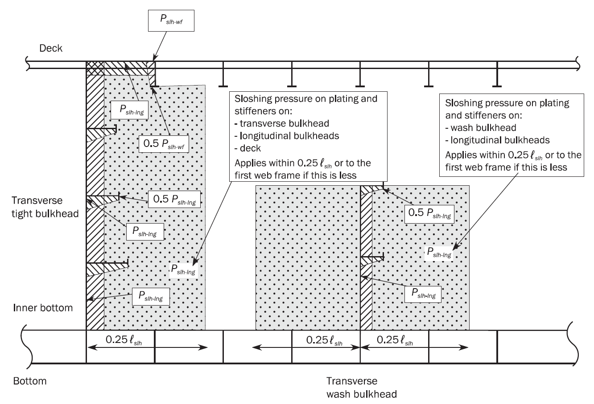
    Figure : Application of sloshing loads due to longitudinal liquid motion
    - **a)** Transverse tight bulkheads.
    - **b)** Transverse wash bulkheads.
    - **c)** Stringers on transverse tight and wash bulkheads.
    - **d)** Plating and stiffeners on the longitudinal bulkheads, deck and inner hull within a distance from the transverse bulkhead taken as:
  - **1.3.5** **Application of design sloshing pressure due to transverse liquid motion**
    The design sloshing pressure due to transverse liquid motion, $P_shl-t$, as defined in **Ch 4, Sec 6, [4.4.2],** is to be applied to the following members as shown in **Figure 2.**
    • 0.25 $b _{tk-h}$,
    • The distance between the longitudinal bulkhead and the first girder if located inside the tank at the considered level,
    whichever is less.
    In addition, the first girder next to the longitudinal tight or wash bulkhead if the girder is located within 0.25 $b _{tk-h}$ from longitudinal bulkhead, as shown in **Figure 2,** is to be assessed for the reflected sloshing pressure, $P _{slh-grd}$ as defined in **Ch 4, Sec 6, [4.4.3].**
    The minimum sloshing pressure, $P _{slh- it \min}$, as defined in **Ch 4, Sec 6, [4.2]**, is to be applied to all other members.
    - **a)** Longitudinal tight bulkhead.
    - **b)** Longitudinal wash bulkhead.
    - **c)** Horizontal stringers on longitudinal tight and wash bulkheads.
    - **d)** Plating and stiffeners on the transverse tight bulkheads including stringers and deck within a distance from the longitudinal bulkhead taken as:
  - **1.3.6** **Combination of transverse and longitudinal fluid motion**
    The sloshing pressures due to transverse and longitudinal fluid motion are assumed to act independently. Structural members are therefore to be evaluated based on the greatest sloshing pressure due to longitudinal and transverse fluid motion.
    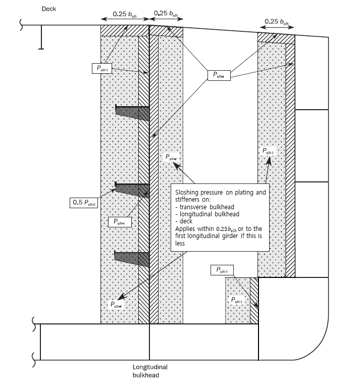
    Figure 2 : Application of sloshing loads due to transverse liquid motion
  - **1.3.7** **Additional sloshing impact assessment**
    For tanks with effective sloshing breadth, $b _{tk-h}$, greater than 0.56 $B$ or effective sloshing length, $\ell _{tk-h}$, greater than 0.13 $L$, an additional sloshing impact assessment is to be carried out in accordance with the individual Society' procedures.

#### 2. Scantling requirements

- **2.1** **Plating**
  - **2.1.1** **Net thickness**
    The net thickness of plating, $t$ in $\mathrm{mm}$, subjected to sloshing pressure is not to be less than:
    $t=0.0158 \alpha _{p} b \sqrt {\frac{P _{slh}}{C _{a} R _{eH}}}$
    where:
    $C _{a}$ : Permissible bending stress coefficient to be taken as:
    $C _{a} = \beta _{a} - \alpha _{a} \frac{\left| \sigma _{hg} \right|}{R_eH}$ with coefficients defined in **Table 1,** but not to be taken greater than $C_{a-itmax$.
    $\sigma _hg$ : Hull girder bending stress, in $\mathrm{N}/mm^2$, corresponding to the greatest of the sagging and hogging bending moment in absolute value.
    $P_slh$ : The greater of $P_{slh-itlng$, $P_slh-t$ or $P_{slh-itmin$ as specified in **[1.3].**

    | Acceptance criteria set | Structural member |   | $\beta _{a}$ | $\alpha _{a}$ | $C _{a-m ax}$ |
    | --- | --- | --- | --- | --- | --- |
    | AC-S | Longitudinal strength members in the cargo hold region including but not limited to: • Deck. • Longitudinal plane bulkhead. • Horizontal corrugated longitudinal bulkhead. • Longitudinal girders and stringers. | Longitudinally stiffened plating | 0.9 | 0.5 | 0.8 |
    | AC-S | Longitudinal strength members in the cargo hold region including but not limited to: • Deck. • Longitudinal plane bulkhead. • Horizontal corrugated longitudinal bulkhead. • Longitudinal girders and stringers. | Transversely or vertically stiffened plating | 0.9 | 1.0 | 0.8 |
    | AC-S | Other strength members including: • Vertical corrugated longitudinal bulkhead. • Transverse plane bulkhead. • Transverse corrugated bulkhead. • Transverse stringers and web frames. • Plating of tank boundaries and primary supporting members outside the cargo hold region. |   | 0.8 | 0.0 | 0.8 |
- **2.2** **Stiffeners**
  - **2.2.1** **Net section modulus**
    The net section modulus, $Z$ in $\mathrm{cm}^3$, of stiffeners subjected to sloshing pressure is not to be less than:
    $Z= \frac{P _{slh} s \ell _{bdg} ^{2}}{f _{bdg} C _{s} R _{eH}}$
    where:
    $f _{bdg}$ : Bending moment factor:
    $f _{bdg}=12$, for stiffeners fixed against rotation at each end. This is generally to be applied for scantlings of all continuous stiffeners.
    $f_bdg =8$, for stiffeners with one or both ends not fixed against rotation. This is generally to be applied to discontinuous stiffeners.
    $C_s$ : Permissible bending stress coefficient to be taken as :
    • For members subject to hull girder stress: coefficient to be taken as defined in **Table 2**.
    • $C _{s} =C _{s-\max}$ for other cases.
    $P_slh$ : The greater of $P _{slh- it lng}$, $P_slh-t$ or $P_{slh-itmin$ as specified in **[1.3].**
    $C _{s-\max}$ : Coefficient as defined in **Table 3**.

    | Sign of hull girder bending stress $\sigma _{hg} ^{}$(1) | Lateral pressure acting on(2) | Stiffener boundary condition(3) | $f _{bdg}$ | Coefficient $C _{s}$ |
    | --- | --- | --- | --- | --- |
    | Tension (positive) | Stiffener side | F - F | 12 | $C _{s} = \beta _{s} - \alpha _{s} \frac{ \sigma _{hg} }{R _{eH}}$ but not to be taken greater than $C _{s-\max}$ |
    | Tension (positive) | Stiffener side | F - S | 8 | $C _{s} = \beta _{s} - \alpha _{s} \frac{ \sigma _{hg} }{R _{eH}}$ but not to be taken greater than $C _{s-\max}$ |
    | Tension (positive) | Stiffener side | S - S | 8 | $C _{s} =C _{s-\max}$ |
    | Tension (positive) | Plate side | F - F | 12 | $C _{s} =C _{s-\max}$ |
    | Tension (positive) | Plate side | F - S | 8 | $C _{s} =C _{s-\max}$ |
    | Tension (positive) | Plate side | S - S | 8 | $C _{s} = \beta _{s} - \alpha _{s} \frac{ \sigma _{hg} }{R _{eH}}$ but not to be taken greater than $C _{s-\max}$ |
    | Compression (negative) | Stiffener side | F - F | 12 | $C _{s} =C _{s-\max}$ |
    | Compression (negative) | Stiffener side | F - S | 8 | $C _{s} =C _{s-\max}$ |
    | Compression (negative) | Stiffener side | S - S | 8 | $C _{s} = \beta _{s} - \alpha _{s} \frac{ \sigma _{hg} }{R _{eH}}$ but not to be taken greater than $C _{s-\max}$ |
    | Compression (negative) | Plate side | F - F | 12 | $C _{s} = \beta _{s} - \alpha _{s} \frac{ \sigma _{hg} }{R _{eH}}$ but not to be taken greater than $C _{s-\max}$ |
    | Compression (negative) | Plate side | F - S | 8 | $C _{s} = \beta _{s} - \alpha _{s} \frac{ \sigma _{hg} }{R _{eH}}$ but not to be taken greater than $C _{s-\max}$ |
    | Compression (negative) | Plate side | S - S | 8 | $C _{s} =C _{s-\max}$ |
    | (1) $\sigma _{hg}$ is to be considered for the hogging and sagging situations. (2) For primary supporting members located inside the considered tank and for wash bulkheads, the sloshing pressure is to be applied both on stiffeners and plate sides. (3) F - F stands for both ends of the stiffener fixed against rotation. F - S stands for one end of the stiffener fixed and the other not fixed against rotation. S - S stands for both ends of the stiffener not fixed against rotation. |   |   |   |   |

    | Acceptance criteria set | Structural member |   | $\beta _{s}$ | $\alpha _{s}$ | $C _{s-m ax}$ |
    | --- | --- | --- | --- | --- | --- |
    | AC-S | Longitudinal strength members in the cargo hold region including but not limited to: • Deck stiffeners. • Stiffeners on longitudinal bulkheads. • Stiffeners on longitudinal girders and stringers | Longitudinally stiffeners | 0.85 | 1.0 | 0.75 |
    | AC-S | Longitudinal strength members in the cargo hold region including but not limited to: • Deck stiffeners. • Stiffeners on longitudinal bulkheads. • Stiffeners on longitudinal girders and stringers | Transversely or vertically stiffeners | 0.7 | 0.0 | 0.7 |
    | AC-S | Other strength members including: • Stiffeners on transverse bulkheads. • Stiffeners on transverse stringers and web frames. • Stiffeners on tank boundaries and primary supporting members outside the cargo hold region. |   | 0.75 | 0.0 | 0.75 |
- **2.3** **Primary supporting members**
  - **2.3.1** **Web plating**
    The web plating net thickness of primary supporting members, $t$ in $\mathrm{mm}$, is not to be less than:
    $t=0.0158 \alpha _{p} b \sqrt {\frac{P _{slh}}{C _{a} R _{eH}}}$
    where:
    $P _{slh}$ : The greater of $P _{slh- it lng}$, $P_slh-t$, $P_slh-wf$, $P_slh-grd$ and $P_{slh-itmin$ as specified in **[1.3].** The pressure is to be calculated at the load application point, defined in **Ch 3, Sec 7, [4.1],** taking into account the distribution over the height of the member, as shown in **Figure 1** and **Figure 2.**
    $C_a$ : Permissible plate bending stress coefficient, as given in **[2.1.1].**
  - **2.3.2** **Stiffeners on web plating**
    The net section modulus, $Z$ in $\mathrm{cm}^3$, of each individual stiffener on the web plating of primary supporting members subjected to sloshing pressures is not to be less than:
    $Z= \frac{P_slh s \ell _bdg ^2}{f_bdg C_s R_eH}$
    where:
    $P _{slh}$ : The greater of $P _{slh- it lng}$, $P_slh-t$, $P_slh-wf$, $P_slh-grd$ and $P_{slh-itmin$ as specified in **[1.3].** The pressure is to be calculated at the load application point, defined in **Ch 3, Sec 7, [3.2],** taking into account the distribution over the height of the member, as shown in **Figure 1** and **Figure 2**.
    $C _{s}$ : Permissible plate bending stress coefficient, as given in **[2.2.1].**
    $f _{bdg}$ : Bending moment factor as given in **[2.2.1].**
  - **2.3.3** **Tripping brackets supporting primary supporting members**
    The net section modulus, $Z$ in $\mathrm{cm} ^{3}$, in way of the base within the effective length, $d$, of tripping brackets and net shear area, $A _{shr}$ in $\mathrm{cm} ^{2}$, after deduction of cut-outs and slots, of tripping brackets supporting primary supporting members is not to be less than:
    $Z= \frac{1000 P_slh s_trip h^2}{2 C_s R_eH}$
    $A_shr =10 \frac{P_slh s_trip h}{C_t \tau_eH}$
    where:
    $P _{slh}$ : The greater of $P _{slh- it lng}$, $P_slh-t$, $P_slh-wf$, $P_slh-grd$ and $P_{slh-itmin$ as specified in **[1.3].** The average pressure may be calculated at mid point of the tripping bracket taking into account the distribution as shown in **Figure 1** and **Figure 2.**
    $s_trip$ : Mean spacing, between tripping brackets or other primary supporting members or bulkheads, in $\mathrm{m}$.
    $h$ : Height of tripping bracket, see **Figure 3**, in $\mathrm{m}$.
    $C _{s}$ : Permissible bending stress coefficient for tripping brackets to be taken as 0.75.
    $C _{t}$ : Permissible shear stress coefficient for tripping bracket to be taken as 0.75.
    The effective breadth of the attached plate to be used for calculating the section modulus of the tripping bracket is to be taken as $h/3$. 
    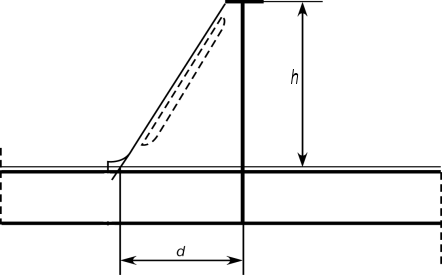
    Figure : Effective length of tripping bracket
