# PART 14 Structural Rules for Container Ships

> RULES FOR CLASSIFICATION OF STEEL SHIPS / RA-14-E / 2025 / EN / Rules

## Chapter 12 Construction

### Section 1 Construction and Fabrication

#### 1. General

- **1.1** **Workmanship**
  - **1.1.1** All workmanship is to be of commercial marine quality and acceptable to the surveyor. Welding is to be in accordance with the requirements of **Sec 2.** Any defect is to be rectified to the satisfaction of the surveyor before the material is covered with paint, cement or any other composition.
- **1.2** **Fabrication standard**
  - **1.2.1** Structural fabrication is to be carried out in accordance with **IACS Recommendation No. 47** or with a recognised fabrication standard which has been accepted by the Society prior to the commencement of fabrication / construction.
  - **1.2.2** The fabrication standard to be used during fabrication / construction is to be made available to the attending representative of the Society prior to the commencement of the fabrication / construction.
  - **1.2.3** The fabrication standard is to include information, to establish the range and the tolerance limits, for the items specified as follows:
    - **a)** Cut edges : the slope of the cut edge and the roughness of the cut edges.
    - **b)** Flanged stiffeners and brackets and built-up sections : the breadth of flange and depth of web, angle between flange and web, and straightness in plane of flange or at the top of face plate.
    - **c)** Pillars : the straightness between decks and cylindrical structure diameter.
    - **d)** Brackets and flat bar stiffeners : the distortion at the free edge line of tripping brackets and flat bar stiffeners.
    - **e)** Sub-assembly stiffeners : details of sniped end of face plates and webs.
    - **f)** Plate assembly : for flat and curved blocks, the dimensions (length and breadth), distortion and squareness, and the deviation of interior members from the plate.
    - **g)** Cubic assembly : in addition to the criteria for plate assembly, twisting deviation between upper and lower plates, for flat and curved cubic blocks.
    - **h)** Special assembly : the distance between upper and lower gudgeons, distance between aft edge of propeller boss and aft peak bulkhead, twist of stern frame assembly, breadth and length of top plate of main engine bed. Where boring out of the propeller boss and stern frame, skeg or solepiece are to be carried out after completing the major part of the welding of the aft part of the ship. Where block boring is used, the shaft alignment is to be carried out using a method and sequence submitted to and recognised by the Society. The fit-up and alignment of the rudder, pintles and axles are to be carried out after completing the major parts of the welding of the aft part of the ship. The contacts between the conical surfaces of pintles, rudder stocks and rudder axles are to be checked before the final mounting.
    - **i)** Butt joints in plating : alignment of butt joint in plating.
    - **j)** Cruciform joints : alignment measured on the median line and measured on the heel line of cruciform joints.
    - **k)** Alignment of interior members : alignments of flange of T profiles, alignment of panel stiffeners, gaps in T joints and lap joints, and distance between scallop and cut-outs for continuous stiffeners in assembly and in erection joints.
    - **l)** Keel and bottom sighting : deflections for whole length of the ship, and for the distance between two adjacent bulkheads, cocking-up of fore body and of aft body, and rise of floor amidships.
    - **m)** Dimensions : length between perpendiculars, moulded breadth and depth at midship, and length between aft edge of propeller boss and main engine.
    - **n)** Fairness of plating between frames : deflections between frames of shell, tank top, bulkhead, upper deck, superstructure deck, deckhouse deck and wall plating.
    - **o)** Fairness of plating in way of frames : deflections of shell, tank top, bulkhead, strength deck plating and other structures measured in way of frames.

#### 2. Cut-Outs, Plate Edges

- **2.1** **General**
  - **2.1.1** The free edges (cut surfaces) of cut-outs, hatch corners, etc are to be properly prepared and are to be free from notches. As a general rule, cutting draglines, etc are to be smoothly ground. All edges are to be broken or in cases of highly stressed parts, be rounded off.
    Free edges on flame or machine cut plates or flanges are not to be sharp cornered and are to be finished off as specified above. This also applies to cutting drag lines, etc, in particular to the upper edge of sheer strake and analogously to weld joints, changes in sectional areas or similar discontinuities.
  - **2.1.2** Corners in hatch opening are to be machine cut.

#### 3. Cold Forming

- **3.1** **Special structural members**
  - **3.1.1** For highly stressed components of the hull girder where notch toughness is of particular concern (e.g. items required to be Class III in **Ch 3, Sec 1, Table 3**, such as radius gunwales (bent sheer plates) and bilge strakes), the inside bending radius, in cold formed plating, is not to be less than 10 times the as-built plate thickness for carbon-manganese steels (see **Ch 3, Sec 1**). The allowable inside bending radius may be reduced provided the requirements stated in **[3.3]** are complied with.
- **3.2** **Corrugated bulkheads**
  - **3.2.1** For corrugated bulkheads the inside bending radius, in cold formed plating, is not to be less than 4.5 times the as-built plate thickness for carbon-manganese steels (see **Ch 3**, **Sec 1**). The allowable inside bending radius may be reduced provided the requirements stated in **[3.3]** are complied with.
- **3.3** **Low bending radius**
  - **3.3.1** When the inside bending radius is reduced below 10 times or 4.5 times the as-built plate thickness according to **[3.1]** and **[3.2]** respectively, supporting data is to be provided. The bending radius is in no case to be less than 2 times the as-built plate thickness. As a minimum, the following additional requirements are to be complied with:
    • 100 % visual inspection of the bent area is to be carried out.
    • Random checks by magnetic particle testing are to be carried out.
    • The steel is to be of Grade D / DH or higher.
    • The material is impact tested in the strain-aged condition and satisfies the requirements stated herein. The deformation is to be equal to the maximum deformation to be applied during production, calculated by the formula $t _{as-built} /(2r _{bdg} +t _{as-built} )$, where $t _{as-built}$ is the as-built thickness of the plate material and $r _{bdg}$ is the bending radius. One sample is to be plastically strained at the calculated deformation or 5 %, whichever is greater and then artificially aged at 250 °C for one hour then subject to Charpy V-notch testing. The average impact energy after strain ageing is to meet the impact requirements specified for the grade of steel used.
    - **a)** For all bent plates:
    - **b)** In addition to a), for bent plates at boundaries to tanks:

#### 4. Hot Forming

- **4.1** **Temperature requirements**
  - **4.1.1** Steel is not to be formed between the upper and lower critical temperatures. If the forming temperature exceeds 650°C for as-rolled, controlled rolled, thermo-mechanical controlled rolled or normalised steels, or is not at least 28°C lower than the tempering temperature for quenched and tempered steels, mechanical tests are to be made to assure that these temperatures have not adversely affected both the tensile and impact properties of the steel. Where curve forming or fairing, by line or spot heating, is carried out in accordance with **[4.2.1]** these mechanical tests are not required.
  - **4.1.2** After further heating, other than specified in **[4.1.1]**, of Thermo-Mechanically Controlled Steels (TMCP plates) for forming and stress relieving, it is to be demonstrated that the mechanical properties meet the requirements specified by a procedure test using representative material.
- **4.2** **Line or spot heating**
  - **4.2.1** Curve forming or fairing, by linear or spot heating, is to be carried out using approved procedures in order to ensure that the properties of the material are not adversely affected. Heating temperature on the surface is to be controlled so as not to exceed the maximum allowable limit applicable to the plate grade.

#### 5. Assembly and Alignment

- **5.1** **General**
  - **5.1.1** The use of excessive force is to be avoided during the assembly of individual structural components or during the erection of sections. Major distortions of individual structural components are to be corrected before further assembly.
    After completion of welding, straightening and aligning are to be carried out in such a manner that the material properties are not influenced significantly. In case of doubt, the Society may require a procedure test or a working test to be carried out.
  - **5.1.2** Structural members are to be aligned following the provisions of **IACS Recommendation No. 47, Table 7** or according to the requirements of a recognised fabrication standard that has been accepted by the Society. In the case of critical components, control drillings are to be made where necessary, which are then to be welded up again on completion.

### Section 2 Fabrication by Welding

#### 1. General

- **1.1** **Application**
  - **1.1.1** The requirements of this section apply to the preparation, execution and inspection of welded connections in hull structures.
- **1.2** **Limits of application to welding procedures**
  - **1.2.1** **Weld type, size and materials**
    The requirements of this section for weld type, size and materials are based on the following considerations:
    • Joint type.
    • Criticality of the joint.
    • Magnitude, type and direction of the stresses in the joint.
    • Material properties of the parent and weld material.
    • Weld gap size.
  - **1.2.2** **Preparation, execution and inspection**
    The requirements of this section are to be complemented by the general requirements relevant to fabrication by welding and qualification of welding procedures given by the Society when deemed appropriate by the Society.

#### 2. Welding Procedures, Welding Consumables and Welders

- **2.1** **General**
  - **2.1.1** All welding is to be carried out by approved welders, in accordance with approved welding procedures, using approved welding consumables, in compliance with **Pt 2.**
    Personnel manning automatic welding machines and equipment are to be competent, sufficiently trained and certified by the Society as specified in **Pt 2.**

#### 3. Weld Joints

- **3.1** **General**
  - **3.1.1** Welding of connections is to be executed according to the approved plans.
  - **3.1.2** The quality standard adopted by the shipyard is to be submitted to the Society and it applies to all welded connections unless otherwise specified on a case-by-case basis.
  - **3.1.3** Consideration is to be given to the assembly sequence and the effect of the overall shrinkage of plate panels, assemblies, etc, resulting from the welding processes employed. Welding is to proceed systematically, with each welded joint being completed in correct sequence, without undue interruption. When practicable, welding is to commence at the centre of a joint and proceed outwards, or at the centre of assembly and progress outwards towards the perimeter so that each part has freedom to move in one or more directions.
  - **3.1.4** Completed welded joints are to be to the satisfaction of the attending surveyor. Edge preparations and root gaps are to be in accordance with the approved welding procedure. The gap between the members being joined should not exceed the maximum values given in **IACS Recommendation No. 47** or as specified in recognised fabrication standard approved by the Society. Where the gap between members being joined exceeds the specified values, corrective measures are to be taken in accordance with an approved welding procedure specification.
  - **3.1.5** Where small fillets are used to attach heavy plates or sections, welding is to be based on approved welding procedure specifications. Special precautions, such as the use of preheating, low-hydrogen electrodes or low hydrogen welding processes, are accepted.
  - **3.1.6** When heavy structural members are attached to relatively light plating, the weld size and sequence may require modification.
  - **3.1.7** Where quality control systems are in place which ensure that the grade of welding consumable used is higher than the minimum required for the particular strength steel being welded, the welding consumables that are used may have a weld deposit material yield strength that is greater than the minimum specified in **Sec 3, [2.5.2]** and the size of the weld may be determined based on the yield strength of the higher grade welding consumable.
  - **3.1.8** In general, butt joints are to be welded from both sides. Before welding is carried out on the second side, unsound metal is to be removed at the root by a suitable method. Butt welding from one side will only be permitted for specific applications with an approved welding procedure specification.
  - **3.1.9** **Arrangements at junctions of welds**
    Welds are to be made flush in way of the faying surface where stiffening members, attached by continuous fillet welds, cross the completely finished butt or seam welds. Similarly, butt welds in webs of stiffening members are to be completed and made flush with the stiffening member before the fillet weld is made. The ends of the flush portion are to run out smoothly without notches or sudden changes of section. Where these conditions can not be complied with, a scallop is to be arranged in the web of the stiffening member. Scallops are to be of the size, and in a position, that a satisfactory return weld can be made.

#### 3.1.10

**Leak stoppers**
Where structural members pass through the boundary of a tank, leakage into adjacent space could be hazardous or undesirable, and full penetration welding is to be adopted for the members for at least 150 mm on each side of the boundary. Alternatively, a small scallop of suitable shape may be cut in a member close to the boundary outside of the compartment, and carefully welded all around.

#### 4. Non-Destructive Examination(NDE)

- **4.1** **General**
  - **4.1.1** The NDE plan to be submitted for approval has to contain the necessary data relevant to the locations and number of examinations, welding procedures applied, method of NDE applied, etc. Visual inspection of finished welds is to be carried out by the shipyard to ensure that all welding has been satisfactory completed. In addition to visual inspection, welded joints are to be examined using any one or a combination of ultrasonic, radiographic, magnetic particle, eddy current, dye penetrant or other acceptable methods appropriate to the configuration of the weld. Above inspections are to be carried out as per the requirements of the Society.
  - **4.1.2** NDE of welding is to be carried out at the positions indicated by the NDE plan in order to ensure that the welds are free from cracks and unacceptable internal defects with regards to the requirements of the Society. NDE is to be carried out by qualified personnel certified by recognised bodies in compliance with recognised standards.
- **4.2** **Hatch coaming**
  - **4.2.1** When NDE during construction is to be carried out, NDE is to follow **Sec 4, [2]**.
  - **4.2.2** When periodic NDE after delivery is to be carried out, periodic NDE is to be follow **Sec 4, [3]**.

### Section 3 Design of Weld Joints

**Symbols**
$A _{weld}$ : Effective fillet weld area, in $\mathrm{cm} ^{2}$.
$f$ : Root face, in $\mathrm{mm}$.
$f _{weld}$ : Weld factor.
$f _{yd}$ : Correction factor taking into account the yield strength of the weld deposit as defined in **[2.5.2].**
$\ell _{dep}$ : Total length of deposit of weld metal, in $\mathrm{mm}$.
$\ell _{"leg"}$ : Leg length of continuous, lapped or intermittent fillet weld, in $\mathrm{mm}$.
$\ell _{weld}$ : Length of the welded connection in $\mathrm{mm}$.
$R _{eH-weld}$ : Minimum yield stress of weld deposit, in $\mathrm{N}/mm ^{2}$.
$t _{as-built}$ : As-built thickness of the member being joined, in $\mathrm{mm}$.
$t _{gap}$ : Allowance for fillet weld gap, is to be taken equal to 2.0 $\mathrm{mm}$.
$t _{throat}$ : Throat thickness of fillet weld in $\mathrm{mm}$, as defined in **[2.5.3].**

#### 1. General

- **1.1** **Application**
  - **1.1.1** The requirements of this section apply to the design of welded connections in hull structures and are based on the considerations mentioned in **Sec 2, [1.2.1].**
  - **1.1.2** Plans and / or specifications showing weld sizes and weld details are to be submitted for approval.
  - **1.1.3** The leg length of welds is to comply with the minimum leg length given in **Table 1.**
- **1.2** **Alternatives**
  - **1.2.1** The requirements given in this section are considered minimum for electric-arc welding in hull construction, but alternative methods, arrangements and details will be specially considered for approval.

#### 2. Tee or Cross Joint

- **2.1** **Application**
  - **2.1.1** The connection of primary supporting members, stiffener webs to plating as well as the plating abutting on another plating, are to be made by fillet or penetration welding, as shown on **Figure 1.**
    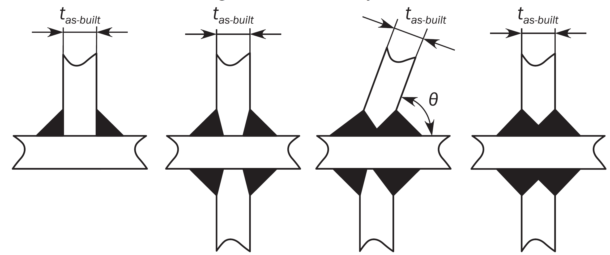
    #eqnID-24 : As-built thickness of the member being attached, #eqnID-25.#eqnID-26 : Connecting angle, in #eqnID-27.Figure : Tee or cross joints
  - **2.1.2** Where the connection is highly stressed or otherwise considered critical, a partial or full penetration weld is to be achieved by bevelling the edge of the abutting plate.
- **2.2** **Continuous fillet welds**
  - **2.2.1** Continuous welding is to be adopted in the following locations:
    - **a)** Connection of the web to the face plate for all members.
    - **b)** All fillet welds where higher strength steel is used.
    - **c)** Boundaries of weathertight decks and erections, including hatch coamings, companionways and other openings.
    - **d)** Boundaries of tanks and watertight compartments.
    - **e)** All structures inside tanks and cargo holds.
    - **f)** Stiffeners and primary supporting members at tank boundaries.
    - **g)** All structures in the aft peak and stiffeners and primary supporting members of the aft peak bulkhead.
    - **h)** All structures in the fore peak.
    - **i)** Welding in way of all end connections of stiffeners and primary supporting members, including end brackets, lugs, scallops, and at orthogonal connections with other members.
    - **j)** All lap welds in the main hull.
    - **k)** Primary supporting members and stiffener members to bottom shell in the 0.3 $L$ forward region.
    - **l)** Flat bar longitudinals to plating.
    - **m)** The attachment of minor fittings to higher strength steel plating and other connections or attachments.
    - **n)** Pillars to heads and heels.
    - **o)** Hatch coaming stay webs to deck plating, see **[2.4.5].**
- **2.3** **Intermittent fillet welds**
  - **2.3.1** Where continuous welding is not required, intermittent welding may be applied.
  - **2.3.2** Where beams, stiffeners, frames, etc, are intermittently welded and pass through slotted girders, shelves or stringers, there is to be a pair of matched intermittent welds on each side of every intersection. In addition, the beams, stiffeners and frames are to be efficiently attached to the girders, shelves and stringers.
    Where intermittent welding or one side continuous welding is permitted, unbracketed stiffeners of shell, watertight and oil-tight bulkheads, and deckhouse front ends are to have double continuous welds for one-tenth of their shear span at each end, in accordance with **[2.5.2]** and **[2.5.3]**. Unbracketed stiffeners of non-tight structural bulkheads, deckhouse sides and aft ends are to have a pair of matched intermittent welds at each end.
  - **2.3.3** **Deckhouses**
    One side continuous fillet welding is acceptable in the dry spaces of deckhouses.
  - **2.3.4** **Size for one side continuous weld**
    The size for one side continuous weld is to be of fillet required by **[2.5.2]** for intermittent welding, where $f _{3}$ factor is to be taken as 2.0.
- **2.4** **Partial or full penetration welds**
  - **2.4.1** **High stress area definition**
    For the application of this section, high stress area means an area where fine mesh finite element analysis is to be carried out and the fine mesh yield utilisation factor in elements adjacent to the weld is more than 90% of the fine mesh permissible utilisation factor, as defined in **Ch 7, Sec 3, [6.2].**
  - **2.4.2** **Partial or full penetration welding**
    In areas with high tensile stresses or areas considered critical, full or partial penetration welds are to be used. In case of full penetration welding, the root face is to be removed, e.g. by gouging before welding of the back side. For partial penetration welds the root face, $f$, is to be taken between 3.0 $\mathrm{mm}$ and $t _{as-built} /3$.
    The groove angle $\alpha$ made to ensure welding bead penetrating up to the root of the groove is usually from 40 ° to 60 °.
    The welding bead of the full / partial penetration welds is to cover root of the groove.
    Examples of partial penetration welds are given on **Figure 2.** The weld size of partial penetration for extremely thick steel is to satisfy the following equation.
    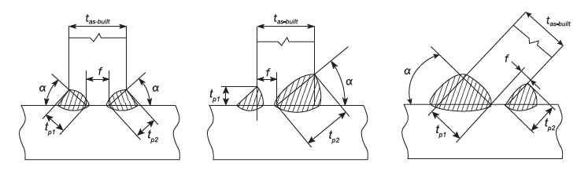
    **Figure : Partial penetration welds**
    $t _{p1} +t _{p2} \geq 2(f _{yd} \cdot f _{c} \cdot f _{ten} \cdot t _{as-built} +t _{gap} )$
    $t _{p1}$, $t _{p2}$ : The weld size in **Figure 2**
    $f _{c}$ : Position coefficient, which is 1.1 for ballast tank and bilge well and 1.0 for elsewhere
    $f _{ten}$ : welding factor
    $f _{ten} =0.22+0.66 f / t _{as-built}$
  - **2.4.3** **One side partial penetration weld**
    For partial penetration welds with one side bevelling the fillet weld at the opposite side of the bevel is to satisfy the requirements given in **[2.5.2].**
  - **2.4.4** **Extent of full or partial penetration welding**
    The extent of full or partial penetration welding in each particular location listed in **[2.4.5]** and **[2.4.6]** is to be approved by the Society. However, the minimum extent of full / partial penetration welding from the reference point (i.e. intersection point of structural members, end of bracket toe, etc.) is not to be taken less than 300 $\mathrm{mm}$, unless otherwise specifically stated.
  - **2.4.5** **Locations required for full penetration welding**
    Full penetration welds are to be used in the following locations and elsewhere as required by the rules :
    - **a)** Radiused hatch coaming plate at corners to deck.
    - **b)** Connection of vertical corrugated bulkhead to the inner bottom plate within the cargo hold region, when the vertical corrugated bulkhead is arranged without a lower stool.
    - **c)** Connection of structural elements in the double bottom in line with corrugated bulkhead flanges to the inner bottom plate, when the vertical corrugated bulkhead is arranged without a lower stool.
    - **d)** Connection of vertical corrugated bulkhead to top plating of lower stool.
    - **e)** Corrugated bulkhead lower stool side plating to lower stool top plate.
    - **f)** Corrugated bulkhead lower stool side plating to inner bottom.
    - **g)** Edge reinforcement or pipe penetration both to strength deck, sheer strake and bottom plating within 0.6 $L$ amidships, when the dimensions of the opening exceeds 300 $\mathrm{mm}$.
    - **h)** Abutting plate panels with as-built thickness less than or equal to 12.0 $\mathrm{mm}$, forming outer shell boundaries below the scantling draught, including but not limited to: sea chests, rudder trunks, and portions of transom.
    - **i)** Crane pedestals and associated bracketing and support structure.
    - **j)** For toe connections of longitudinal hatch coaming end bracket to the deck plating, full penetration weld for a distance of 0.15 $H _{c}$ from toe of side coaming termination bracket is required, where $H _{c}$ is the hatch coaming height.
    - **k)** Rudder horns and shaft brackets to shell structure.
  - **2.4.6** **Locations required for partial penetration welding**
    Partial penetration welding as defined in **[2.4.2]**, is to be used in the following locations.
    - **a)** Abutting plate panels with as-built thickness greater than 12mm, forming outer shell boundaries below the scantling draught, including but not limited to : sea chests, rudder trunks, and portions of transom.
  - **2.4.7** **Fine mesh finite element analysis**
    In high stress area, at least partial penetration welds as defined in **[2.4.2]** are to be used. The minimum extent of full or partial penetration welding in that case is to be the greater of the following:
    - **a)** 150 $\mathrm{mm}$ in either direction from the element with the highest yield utilisation factor.
    - **b)** The extent covering all elements that exceed the above mentioned yield utilisation factor criteria.
- **2.5** **Weld size criteria**
  - **2.5.1** The required weld sizes are to be rounded to the nearest half millimetre.
  - **2.5.2** The leg length, $\ell _{"leg"}$ in $\mathrm{mm}$, of continuous, lapped or intermittent fillet welds is not to be taken less than the greater of the following values:
    $\ell _{"leg"} =f _{1} f _{2} t _{w}$
    $\ell _{"leg"} =f _{yd} f _{weld} f _{2} f _{3} t _{w} +t _{gap}$
    $\ell _{"leg"}$ as given in **Table 1.**
    where:
    $t _{w}$ : Effective thickness of abutting plate in $\mathrm{mm}$
    $t _{w}$ = $t _{as-built}$ for $t _{as-built} \leq 25 rm .0$ $\mathrm{mm}$
    $t _{w}$ = $0.5(25+t _{as-built} )$ for $t _{as-built} >25 rm .0$ $\mathrm{mm}$
    $t _{w}$ = $25+0.25(t _{as-built} -25)$ for longitudinals of flat-bar type with $t _{as-built} >25 rm .0$ $\mathrm{mm}$
    $f _{1}$ : Coefficient depending on welding type:
    $f _{1}$ = 0.30 for double continuous welding.
    $f _{1}$ = 0.38 for intermittent welding.
    $f _{2}$ : Coefficient depending on the edge preparation:
    $f _{2}$ = 1.0 for welds without bevelling.
    $f _{2}$ = 0.70 for welds with one / both side bevelling and $f=t _{as-built} /3$.
    $f _{yd}$ : Coefficient not to be taken less than the following:
    $f _{yd} =( \frac{1}{k} ) ^{0.5} ( \frac{235}{R _{eH-weld}} ) ^{0.75}$
    $f _{yd} =0.71$
    $R _{eH-weld}$ : Specified minimum yield stress for the weld deposit in $\mathrm{N}/mm ^{2}$, not to be less than:
    $R _{eH-weld}$ = 305 $\mathrm{N}/mm ^{2}$ for welding of normal strength steel with $R _{eH}$ = 235 $\mathrm{N}/mm ^{2}$
    $R _{eH-weld}$ = 375 $\mathrm{N}/mm ^{2}$ for welding of higher strength steels with $R _{eH}$ from 265 to 355 $\mathrm{N}/mm ^{2}$
    $R _{eH-weld}$ = 400 $\mathrm{N}/mm ^{2}$ for welding of higher strength steel with $R _{eH}$ = 390 $\mathrm{N}/mm ^{2}$
    $R _{eH-weld}$ = 460 $\mathrm{N}/mm ^{2}$ for welding of higher strength steel with $R _{eH}$ = 460 $\mathrm{N}/mm ^{2}$
    $f _{weld}$ : Weld factor dependent on the type of the structural member, see **Table 2, Table 3** and **Table 4.**
    $k$ : Material factor of the abutting member.
    $f _{3}$ : Correction factor for the type of weld:
    $f _{3}$ = 1.0 for double continuous weld.
    $f _{3}$= $s _{ctr} / \ell _{weld}$ for intermittent or chain welding.
    $s _{ctr}$ : Distance between successive fillet welds, in $\mathrm{mm}$
  - **2.5.3** The throat size $t _{throat}$, in $\mathrm{mm}$, as shown in **Figure 3,** is not to be less than:
    $t _{throat} = \frac{\ell _{"leg"}}{\sqrt {2}}$
    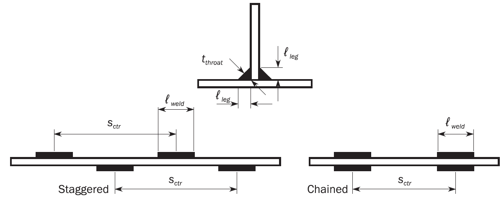
    Figure : Weld scantlings definitions

    | Area | Minimum length, in $\mathrm{mm}$ |
    | --- | --- |
    | Cargo hold region | 4.5 |
    | Superstructures and deckhouses | 3.5 |
    | Other areas | 4.5 |

    | Connection |   |   | $f _{weld}$ |
    | --- | --- | --- | --- |
    | Stiffenersin general | At ends (15% of span) on deep tank bulkheads, brackets at ends |   | 0.30 |
    | Stiffenersin general | Other span |   | 0.20 |
    | PSM(1)in general | At ends (15% of span), brackets at ends |   | 0.38 |
    | PSM(1)in general | Other span |   | 0.24 |
    | PSM(1)in general | Connection between stiffeners and PSMs, **Figure 4 (a)** |   | 0.30 |
    | Watertight boundary | Deep tank, **Figure 4 (b)** |   | 0.48 |
    | Watertight boundary | Watertight compartments, **Figure 4 (b)** |   | 0.38 |
    | Deck | Strength deck, | Within 0.6$L$ midship, **Figure 4 (a)** | PPW(3) |
    | Deck | Strength deck, | Elsewhere, **Figure 4 (a)** | 0.48 |
    | Deck | Other deck |   | 0.30 |
    | Deck | Hatch coaming(2) | End of hatch corner curvatureradius(R.E.) + 100 mm, **Figure 5** | PPW(3) |
    | Deck | Hatch coaming(2) | Transverse hatch coaming 15% of hatch coaming height(5), **Figure 5** | PPW(3) or 0.38 |
    | Deck | Hatch coaming(2) | Elsewhere | PPW(4) or 0.38 |
    | Side and bottom structurein double hull | Girder(1) | At ends(6) (15% of span), **Figure 4 (a)** | 0.38 |
    | Side and bottom structurein double hull | Girder(1) | Center girder | 0.30 |
    | Side and bottom structurein double hull | Girder(1) | Other girders | 0.24 |
    | Side and bottom structurein double hull | Floor, Stringer,Web frame(1) | At ends(6) (15% of span), **Figure 4 (a)** | 0.38 |
    | Side and bottom structurein double hull | Floor, Stringer,Web frame(1) | Other span, **Figure 4 (a)** | 0.24 |
    | Machinery space | Center girder | To keel and inner bottom | 0.38 |
    | Machinery space | Floor | To center girder | 0.38 |
    | Fore and Aft part | Above waterline |   | 0.20 |
    | Fore and Aft part | Below waterline |   | 0.30 |
    | Superstructure, Deckhouse excluding watertight boundary |   |   | 0.20 |
    | Not specified in the table |   |   | 0.38 |
    | (1) Weld factor may be determined based on the shear stress according to **[2.5.7]** (2) $f _{weld}$ = 0.43 for hatch coaming other than in cargo holds. (3) PPW : Partial penetration welding in accordance with **[2.4.2]**. (4) PPW : Partial penetration welding in accordance with **[2.4.2]**, with $f=t _{as-built} /2$ (5) Need not to be taken greater than 250 $\mathrm{mm}$ (6) Need not to be taken greater than length of the shorter side of PSMs |   |   |   |

    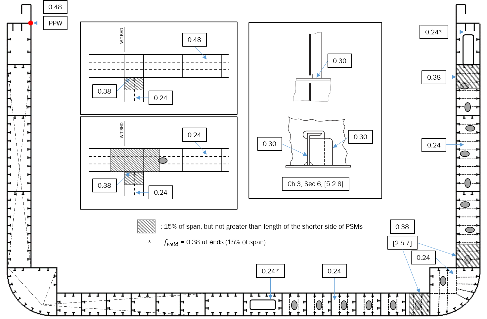
    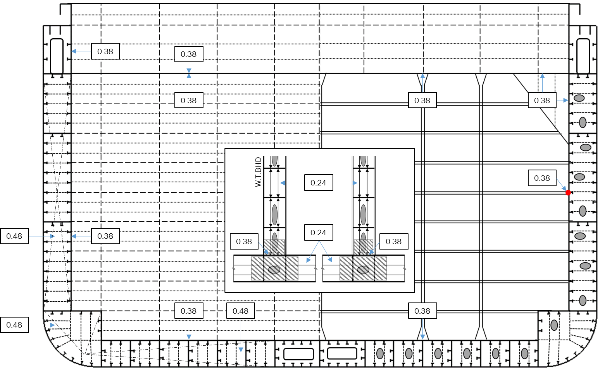
    (b) Watertight and Support bulkheadFigure 4 : Welding of structural members
    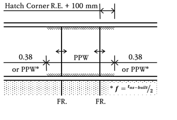
    (a) Longitudinal 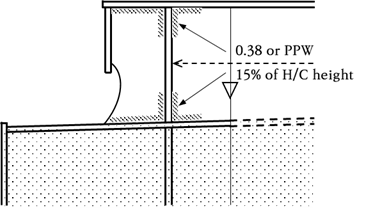
    (b) Transverse
    **Figure 5 : Welding of hatch coaming**

    | Item |   | Connection to | $f _{weld}$ |
    | --- | --- | --- | --- |
    | Hatch cover | Primary supportingmembers | At ends(15% of span) of PSM | 0.48 |
    | Hatch cover | Primary supportingmembers | Elsewhere | 0.24 |
    | Hatch cover | Stiffeners | At ends | 0.38 |
    | Hatch cover | Stiffeners | Elsewhere | 0.24 |
    | Mast, derrick post, crane pedestal, etc. |   | Deck / Underdeck reinforced structure | 0.43 |
    | Deck machinery seat |   | Deck | 0.24 |
    | Mooring equipment seat |   | Deck | 0.43 |
    | Ring for access hole type cover |   | Anywhere | 0.43 |
    | Stiffening of side shell doors and weathertight doors |   | Anywhere | 0.24 |
    | Frames of shell and weathertight doors |   | Anywhere | 0.43 |
    | Coaming of ventilator and air pipe |   | Deck | 0.43 |
    | Ventilators, etc., fittings |   | Anywhere | 0.24 |
    | Scupper and discharge |   | Deck | 0.55 |
    | Bulwark stay |   | Deck | 0.24 |
    | Bulwark plating |   | Deck | 0.43 |
    | Guard rail, stanchion |   | Deck | 0.43 |
    | Cell guide backing bracket |   | Bulkhead | 0.24 |
    | Cone bracket |   | Deck and Girders | 0.43 |
    | Lashing bridge, Container stanchion |   | Deck | PPW(1) |
    | Cleats and fittings |   | Hatch coaming and hatch cover | 0.24(2) |
    | (1) PPW : Partial penetration welding in accordance with **[2.4.2]**. (2) Minimum weld factor. Where $t _{as-built} >11.5$$\mathrm{mm}$, $\ell _{"leg"}$ need not exceed 0.62$t _{as-built}$. Penetration welding may be required depending on design. |   |   |   |
    - **(a)** **Ordinary and Typical web section**
  - **2.5.4** Where the effective thickness of the abutting longitudinal stiffener web, $t _{w}$ is greater than 15.0 $\mathrm{mm}$ and exceeds the thickness of the attached plating, the welding is to be double continuous and the leg length of the weld is not to be less than the largest of the following:
    - **a)** 0.30 $t _{as-built}$, where $t _{as-built}$ is the as-built thickness of the attached plating without being taken greater than 30.0 $\mathrm{mm}$.
    - **b)** 0.27 $t _{as-built} +1$, where $t _{as-built}$ is the as-built thickness of the abutting member. The leg size resulting of this formula needs not to be taken greater than 8.0 $\mathrm{mm}$.
    - **c)** Leg length given in the **Table 1.**
  - **2.5.5** Where the minimum weld size is determined by the requirements of second formula shown in **[2.5.2],** the weld connections to shell, decks or bulkheads are to take account of the material lost in the cut out, where stiffeners pass through the member. In cases where the width of the cut-out exceeds 15 % of the stiffener spacing, the size of weld leg length is to be multiplied by:
    $\frac{0.85 s}{\ell _{w}}$
    where:
    $s$ : Stiffener spacing, in $\mathrm{mm}$, as shown in **Figure 6.**
    $\ell _{w}$ : Length of web plating between notches, in $\mathrm{mm}$, as shown in **Figure 6.**
    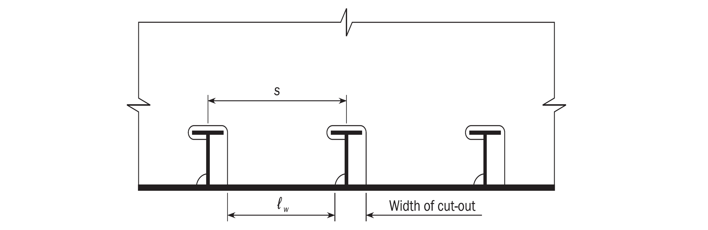
    Figure : Effective material in web cut-outs for stiffeners
  - **2.5.6** **Shear area of primary supporting member end connections**
    Welding of the end connections, inclusive 10 % of shear span, of primary supporting members is to be such that the weld area is to be equivalent to the gross cross sectional area of the member. The weld leg length in $\mathrm{mm}$, $\ell _{"leg"}$, is to be taken as:
    $\ell _{"leg"} =1.41 f _{yd} \frac{h _{w} t _{gr-req}}{\ell _{dep}}$
    where:
    $h _{w}$ : Web height of primary supporting members, in $\mathrm{mm}$.
    $t _{gr-req}$ : Required gross thickness of the web in way of the end connection, including 10 % of shear span, based on the highest average usage factor for yield from cargo hold FE analysis or the shear area requirement for PSM outside cargo hold region, in $\mathrm{mm}$.
    $\ell _{weld}$ : Length of the welded connection in $\mathrm{mm}$, as shown in **Figure 7.**
    $\ell _{dep}$ : Total length of deposit of weld metal, in $\mathrm{mm}$, see **Figure 7** taken as:
    $\ell _{dep} =2 \ell _{weld}$
    The size of weld is not to be less than the value calculated in accordance with **[2.5.2].**
    
    Note 1: The length #eqnID-141 is the length of the welded connection. The total length of the weld deposit #eqnID-142 if welded with double continuous fillet welds is twice the length of the welded connection #eqnID-143.Figure : Shear area of primary supporting member
  - **2.5.7** **Longitudinals**
    Welding of longitudinals to plating is to be doubled continuous at the ends of the longitudinals at the extent of 15 % of shear span as defined in **Ch 3, Sec 7, [1.1.3].**
    In way of primary supporting members, the length of the double continuous weld is to be equal to the depth of the longitudinal or the end bracket, whichever is greater.
  - **2.5.8** **Deck longitudinals**
    For deck longitudinals, a matched pair of welds is required at the intersection of longitudinals with primary supporting members.
  - **2.5.9** **Longitudinal continuity provided by brackets**
    Where a longitudinal strength member is to cut at a primary supporting structure and the continuity of strength is provided by brackets, the weld area $A _{weld}$ is not to be less than the gross cross sectional area of the member. The weld area, $A _{weld}$ in $\mathrm{cm} ^{2}$, is to be determined by the following formula:
    $A _{weld} = \frac{f _{yd} t _{throat} \ell _{dep}}{100}$

#### 2.5.10

**Reduced weld size**
Where an approved automatic deep penetration procedure is used and quality control facilitates are working to a gap between members of 1.0 $\mathrm{mm}$ and less, the weld factors given in **Table 2** may be reduced by 15 % but not more than fillet weld leg size of 1.5 $\mathrm{mm}$. Reductions of up to 20 %, but not more than the fillet weld leg size of 1.5 $\mathrm{mm}$, will be accepted provided that the shipyard is able to consistently meet the following requirements:

- **a)** The welding is performed to a suitable process selection confirmed by welding procedure tests covering both minimum and maximum root gaps.
- **b)** The penetration at the root is at least the same amount as the reduction into the members being attached.
- **c)** Demonstrate that an established quality control system is in place.

#### 2.5.11

**Reduced weld size justification**
Where any of the methods for reduction of the weld size are adopted, the specific requirements giving justification for the reduction are to be indicated on the drawings. The drawings are to document the weld design and dimensioning requirements for the reduced weld length and the required weld leg length given by **[2.5.2]** without the leg length reduction. Also, notes are to be added to the drawings to describe the difference in the two leg lengths and the requirements for their application.

#### 3. Butt Joint

- **3.1** **General**
  - **3.1.1** Joints in the plate components of stiffened panel structures are generally to be joined by butt welds, see **Figure 8.**
- **3.2** **Thickness difference**
  - **3.2.1** **Taper**
    In the case of welding of plates with difference in as-built thickness greater than 4.0 $\mathrm{mm}$, the thicker plate is normally to be tapered. The taper has to have a length of not less than 3 times the difference in as-built thickness.
    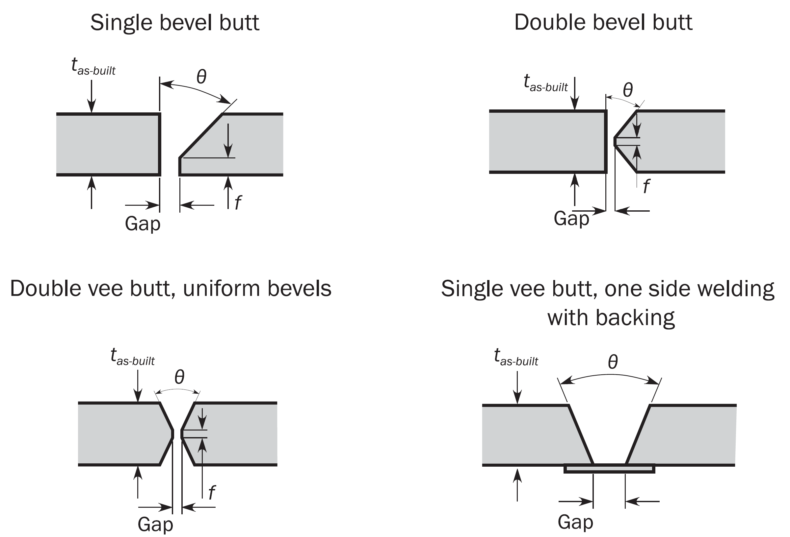
    Figure : Typical butt welds

#### 4. Other Types of Joints

- **4.1** **Lapped joints**
  - **4.1.1** **Areas**
    Lap joint welds may be adopted in very specific cases subject to the approval of the Society. Lap joint welds may be adopted for the following:
    - **a)** Peripheral connections of doublers.
    - **b)** Internal structural elements subject to very low stresses.
  - **4.1.2** **Overlap width**
    Where overlaps are adopted, the width of the overlap,$W _{lap}$ in $\mathrm{mm}$, is not to be less than 3 times, but not greater than 4 times the as-built thickness of the plates being joined, see **Figure 9.** Where the as-built thickness of the thinner plate being joined has a thickness of 25 $\mathrm{mm}$ or more, the overlap will be subject to special consideration.
    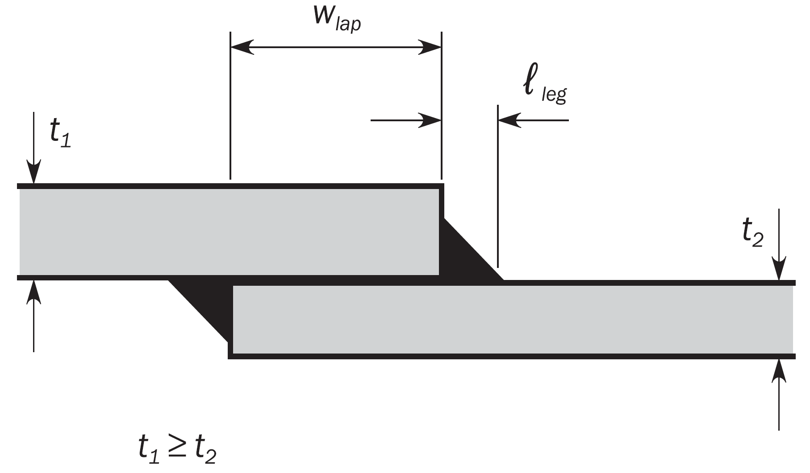
    Figure : Fillet weld in lapped joint
  - **4.1.3** **Overlaps for lugs**
    The overlaps for lugs and collars in way of cut-outs for the passage of stiffeners through webs and bulkhead plating are not to be less than 3 times the thickness of the lug but not be greater than 50 $\mathrm{mm}$.
  - **4.1.4** **Lapped end connections**
    Lapped end connections are to have continuous welds on each edge with leg length, $\ell _{"leg"}$ in $\mathrm{mm}$, as shown on **Figure 9** such that the sum of the two leg lengths is not less than 1.5 times the as-built thickness of the thinner plate.
- **4.2** **Slot welds**
  - **4.2.1** Slot welds may be adopted in very specific cases subject to the approval of the Society. However, slot welds of doublers on the outer shell and strength deck are not permitted within 0.6 $L$ amidships.
  - **4.2.2** Slots are to be well-rounded and have a minimum slot length, $\ell _{slot}$ of 75 $\mathrm{mm}$ and width, $W _{slot}$ of twice the as-built plate thickness. Where used in the body of doublers and similar locations, such welds are in general to be spaced a distance, $S _{slot}$ of 2 $\ell _{slot}$ to 3 $\ell _{slot}$ but not greater than 250 $\mathrm{mm}$, see **Figure 10.** The size of the fillet welds is to be determined from second formula shown in **[2.5.2]** using $t _{as-built}$ of the thinner plate and a weld factor of 0.48.
    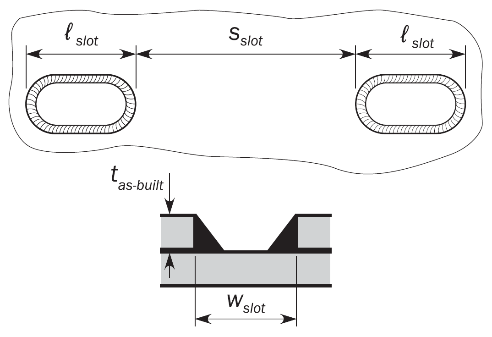
    Figure : Slot welds
  - **4.2.3** **Closing plates**
    For the connection of plating to internal webs, where access for welding is not practicable, the closing plating may be attached by slot welds to face plates fitted to the webs.
  - **4.2.4** Slots are to be well-rounded and have a minimum slot length, $\ell _{slot}$ of 90 $\mathrm{mm}$ and a minimum width, $W _{slot}$ of twice the as-built plate thickness. Slots cut in plating are to have smooth, clean and square edges and are in general to be spaced a distance, $S _{slot}$ not greater than 140 $\mathrm{mm}$. Slots are not to be filled with welding.
- **4.3** **Stud and lifting lug welds**
  - **4.3.1** Where permanent or temporary studs or lifting lugs are to be attached by welding to main structural parts in areas subject to high stress, the proposed locations are to be submitted for approval.

#### 5. Connection Details

- **5.1** **Bilge keels**
  - **5.1.1** The ground bar is to be connected to the shell with a continuous fillet weld, and the bilge keel to the ground bar with a continuous fillet weld in accordance with **Table 5.**

    | Structural items being joined | Leg length of weld, in $\mathrm{mm}$ |   |
    | --- | --- | --- |
    | Structural items being joined | At ends (1) | Elsewhere |
    | Ground bar to the shell | $0.62 t _{1as-built}$ | $0.48 t _{1as-built}$ |
    | Bilge keel web to ground bar | $0.48 t _{1as-built}$ | $0.30 t _{2as-built}$ |
    | $t _{1as-built}$ : As-built thickness of ground bar, in $\mathrm{mm}$. $t _{2as-built}$ : As-built thickness of web of bilge keel, in $\mathrm{mm}$. (1) : Zone “b” in **Figure 18** and **Figure 19** in **Ch 3 Sec 6** for definition of “ends” |   |   |
  - **5.1.2** Butt welds, in the bilge keel and ground bar, are to be well clear of each other and of butts in the shell plating as shown in **Figure 11.** In general, shell butts are to be flush in way of the ground bar and ground bar butts are to be flush in way of the bilge keel. Direct connection between ground bar butt welds and shell plating is not permitted. This may be obtained by use of removable backing.
  - **5.1.3** The ground bar is to be continuously fillet welded with a leg length as given in **Table 5.** At the ends of the ground bar, the leg length is to be increased as given in **Table 5,** without exceeding the as-built thickness of the ground bar as shown in **Figure 11.** The welded transition at the ends of the ground bar to the plating connection should be formed with the weld flank angle of 45 ° or less.
  - **5.1.4** In general, scallops and cut-outs are not to be used. Crack arresting holes are to be drilled in the bilge keel butt welds as close as practicable to the ground bar. The diameter of the hole is to be greater than the width of the butt weld and is to be a minimum of 25 mm. Where the butt weld has been subject to non-destructive examination, the crack arresting hole may be omitted.
    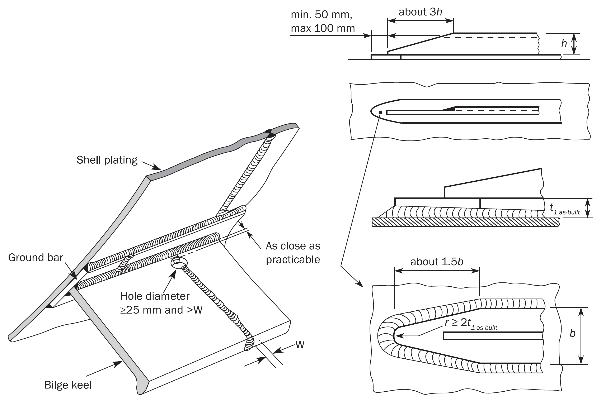
    Figure : Bilge keel
- **5.2** **End connections of pillars**
  - **5.2.1** The end connections of pillars are to have an effective fillet weld area, $A _{weld}$ in $\mathrm{cm} ^{2}$, (weld throat multiplied by weld length) not less than:
    $A _{weld} =f _{3} ( \frac{235}{R _{eH-weld}} ) ^{0.75} F$
    where:
    $F$ : Design load, for the structure under consideration, in $\mathrm{kN}$.
    $f _{3}$ : Coefficient equal to:
    $f _{3}$ = 0.05 when pillar is in compression only.
    $f _{3}$ = 0.14 when pillar is in tension.
- **5.3** **Abutting plates with small angles**
  - **5.3.1** Where the angle $\theta$ between the abutting plate and the connected plate is less than 75 ° as shown in **Figure 12**, the size of fillet welds $\ell _{\theta }$, in $\mathrm{mm}$, for the side of larger angle is to be increased in accordance with:
    $\ell _{\theta } = \frac{\ell _{"leg"}}{\sqrt {2} \sin \frac{\theta}{2}}$
    where:
    $\ell _{"leg"}$ : Leg length of fillet weld, in $\mathrm{mm}$, as defined in **[2.5.2].**
    $\theta$ : Connecting angle, in $\mathrm{deg}$, as shown in **Figure 12.**
    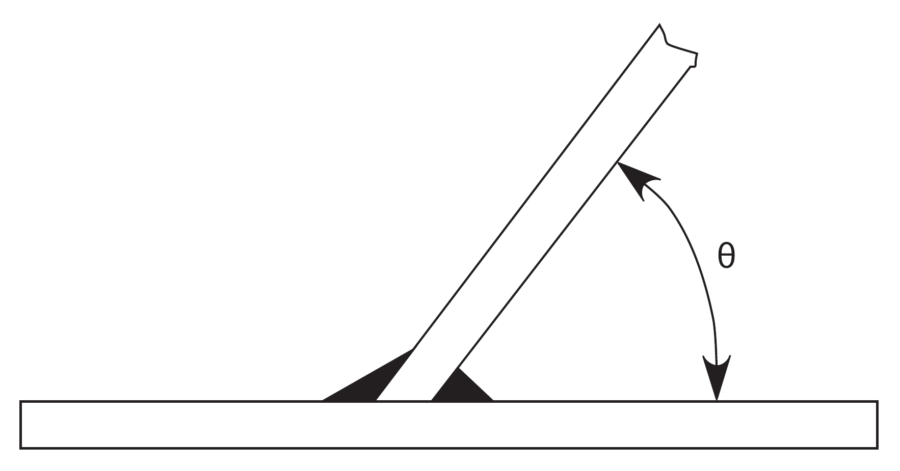
    Figure : Connecting angle
  - **5.3.2** Connections of main strength members where $\theta$ is less than 45 °, see **Figure 12**, may be applied only in dry spaces and voids.

### Section 4 Use of Extremely Thick Steel

#### 1. Application

- **1.1** **General**
  - **1.1.1** This requirements of this section is to be complied with for container ships incorporating extremely thick steel plates having steel grade and thickness in accordance with **[1.1.2]** and **[1.1.3]** respectively.
  - **1.1.2** The requirements given in this section identifies when measures for prevention of brittle fracture of extremely thick steel plates are required for longitudinal structural members.
  - **1.1.3** This requirements gives the basic concepts for application of extremely thick steel plates to longitudinal structural members in the upper deck region.
  - **1.1.4** This requirements defines the following methods to apply to the extremely thick plates of container ships for preventing the crack initiation and propagation:
    The application of the measures specified in **[2], [3]** and **[4]** of this requirements is to be in accordance with **[5].**
    - **a)** Non-Destructive Testing(NDT) during construction detailed in **[2]**
    - **b)** Welding to increase toughness in **[3]**
    - **c)** Brittle crack arrest design detailed in **[4]**
  - **1.1.5** For the application of this requirements, the upper deck region means the upper deck plating, hatch side coaming plating, hatch coaming top plating and their attached longitudinals.
- **1.2** **Steel Grade**
  - **1.2.1** This requirements is to be applied to when any of YP36, YP40 and YP47 steel plates are used for the longitudinal structure members in the upper deck region.
  - **1.2.2** YP36, YP40 and YP47 means the steel plates having the minimum specified yield points of 355, 390 and 460 $\mathrm{N}/mm ^{2}$, respectively.
  - **1.2.3** In case YP47 steel plates are used for longitudinal structural members in the upper deck region, the steel plates are to be EH47-H specified in **Pt 2, Ch 1, Sec 3.**
- **1.3** **Thickness**
  - **1.3.1** For steel plates with thickness of over 50 $\mathrm{mm}$ and not greater than 100 $\mathrm{mm}$, the measures for prevention of brittle crack initiation and propagation specified in **[2], [3]** and **[4]** are to be taken.
  - **1.3.2** For steel plates with thickness exceeding 100 $\mathrm{mm}$, appropriate measures for prevention of brittle crack initiation and propagation are to be taken in accordance with the Society’s procedures.

#### 2. Non-Destructive Testing(NDT) during construction(Measure No.1 of [5])

- **2.1** **General**
  - **2.1.1** Where NDT during construction is required in **[5]**, the NDT is to be in accordance with **[2.1]** and **[2.2].** Enhanced NDT as specified in **[4.3.5]** is to be carried out in accordance with an appropriate standard.
  - **2.1.2** Ultrasonic testing (UT) is to be carried out on all block-to-block butt joints of all upper flange longitudinal structural members in the cargo hold region.
  - **2.1.3** Upper flange longitudinal structural members include the topmost strakes of the inner hull/bulkhead, the sheer strake, main deck, coaming plate, coaming top plate, and all attached longitudinal stiffeners. These members are defined in **Figure 1.**
    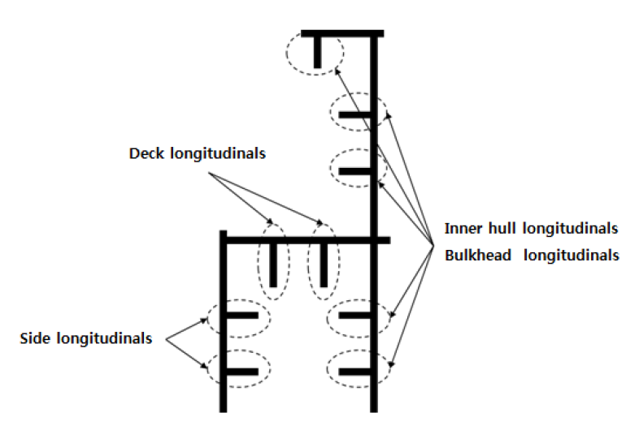
    Figure : Upper flange longitudinal structural members
  - **2.1.4** Testing procedure of UT not specified in this requirements are to comply with the requirements in **Pt 2, Annex 2-7** of the Guidance.
    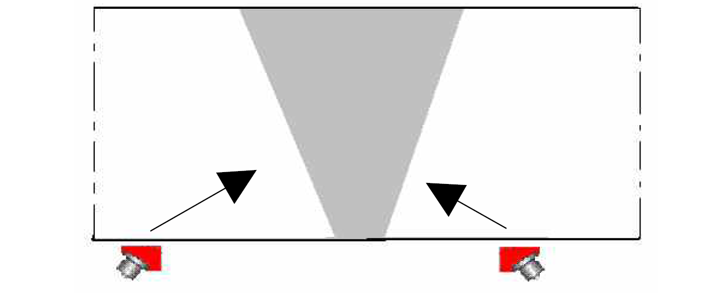
    Figure : Scanning from root face and both sides
    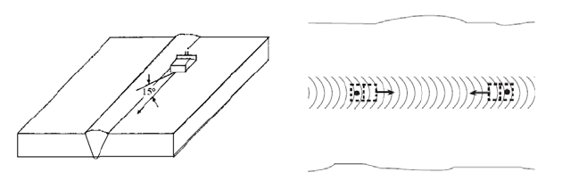
    Figure : UT scanning examples for detecting the transverse defects
    - **a)** Scanning has to be performed from at least one surfaces and both sides of the welded seam as shown in **Figure 2.** (Scanning from root face is recommended.)
    - **b)** Testing has to be performed with two probes 70 ° and 45 ° or 70 ° and 60 ° depending on the bevel preparation.
    - **c)** Any possible differences in attenuation and surface character between the calibration block and the welded seam to be tested are to be checked in accordance with **KS B 0896** or equivalent.
    - **d)** In case where the detected echo signal is suspicious as vertically oriented defect such as lack of fusion(LF) based on the calculation of sound path, the length of the detected echo signal is to be measured by 6 $\mathrm{dB}$ drop method and evaluated regardless of echo height.(acceptance criteria ≤ 25.0 $\mathrm{mm}$)
    - **e)** For the NDE personnel engaged in UT of extremely thick steel plates welds, the shipyard should give education and training related to the detecting and evaluation of vertically oriented defect.
    - **f)** In order to detect transverse defects, scanning to be made with an angle probe angled about 15 degree from weld axis on at least one surface and both sides or with an angle probe along the centre line of the weld as shown in **Figure 3.**
- **2.2** **Acceptance criteria of UT**
  - **2.2.1** Acceptance criteria of UT not specified in this requirements are to comply with the requirements in **Pt 2, Annex 2-7** of the Guidance.
  - **2.2.2** The acceptance criteria may be adjusted under consideration of the appertaining brittle crack initiation prevention procedure and where this is more severe than that found in **Pt 2, Annex 2-7** of the Guidance, the UT procedure is to be amended accordingly to a more severe sensitivity.

#### 3. Welding to increase toughness(Measure No.2 of [5])

- **3.1** Welding to increase toughness is to be carried out when B option in **[5]** is selected as a safety measure to identify and prevent brittle fracture.
- **3.2** Impact specimens are to be taken in accordance with **[3.2.1]**.
  - **3.2.1** Impact specimens are to be taken from the weld center “WM”, fusion line “FL”, heat affected zone of 2 $\mathrm{mm}$ from fusion line, heat affected zone of 5 $\mathrm{mm}$ from fusion line.
- **3.3** Impact specimens are to meet the criteria for absorbed energy of base material at impact test temperature of base material.

#### 4. Brittle crack arrest design(Measure No.3, 4 and 5 of [5])

- **4.1** **General**
  - **4.1.1** The brittle crack arrest steel method detailed in **[4]** may be used when the **measures No. 3, 4, and 5 of [5]** are applied and the steel grade material of the upper deck is not higher than YP40. Otherwise other means for preventing the crack initiation and propagation shall be agreed with the Society.
  - **4.1.2** Measures for prevention of brittle crack propagation are to be taken within the cargo hold region. A brittle crack arrest design means a design using these measures.
  - **4.1.3** The measures given in this section generally apply to the block-to-block joints but it should be noted that cracks can initiate and propagate away from such joints. Therefore, appropriate measures should also be considered for the cases specified in **[4.2.2.b]**.
  - **4.1.4** Brittle crack arrest steels are defined in **Pt 2, Ch 1, Sec 3**.
- **4.2** **Functional requirements of brittle crack arrest design**
  The purpose of the brittle crack arrest design is aimed at arresting propagation of a crack at a proper position and to prevent large scale fracture of the hull girder.
  - **4.2.1** The locations of most concern fro brittle crack initiation and propagation are the block-to-block butt weld joints either on hatch side coaming or on upper deck plating. Other locations in block fabrication where joints are aligned may also present higher opportunity for crack initiation and propagation along butt weld joints.
  - **4.2.2** Both of the following cases are to be considered:
    Fillet welds between hatch side coaming plating, including top plating, and longitudinals;
    Fillet welds between hatch side coaming plating, including top plating and longitudinals, and attachments. (e.g. Fillet welds between hatch side top plating and hatch cover pad plating.);
    Fillet welds between hatch side coaming top plating and hatch side coaming plating;
    Fillet welds between hatch side coaming plating and upper deck plating;
    Fillet welds between upper deck plating and inner hull / bulkheads;
    Fillet welds between upper deck plating and longitudinal; and
    Fillet welds between sheer strakes and upper deck plating.
    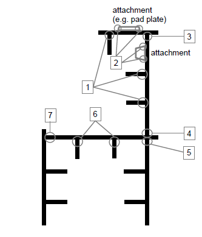
    Figure : Other weld areas
    - **a)** where the brittle crack runs straight along the butt joint, and
    - **b)** where the brittle crack initiates in the butt joint but deviates away from the weld and into the plate, or where the brittle crack initiates from any other weld and propagates into the plate.
    - **c)** “Other weld areas” in b) includes the following (refer to **Figure 4**):
- **4.3** **Concept examples of brittle crack arrest design**
  The followings are considered to be acceptable examples of measures that can be used on a brittle crack arrest-design to prevent brittle crack propagations. The detail design arrangements are to be submitted to the Society for their approval. Other measures may be considered and accepted for review by the Society.
  - **4.3.1** **Brittle crack arrest design for [4.2.2.b]:**
    Brittle crack arresting steel is to be used for the upper deck along the cargo hold region in a way suitable to arrest a brittle crack initiating from the coaming and propagating into the structure below.
  - **4.3.2** **Brittle crack arrest design for [4.2.2.a]:**
    Where the block to block butt welds of the hatch side coaming and those of the upper deck are shifted, this shift is to be greater than or equal to 300 mm. Brittle crack arrest steel is to be provided for the hatch side coaming. (refer to **Figure 5**)
    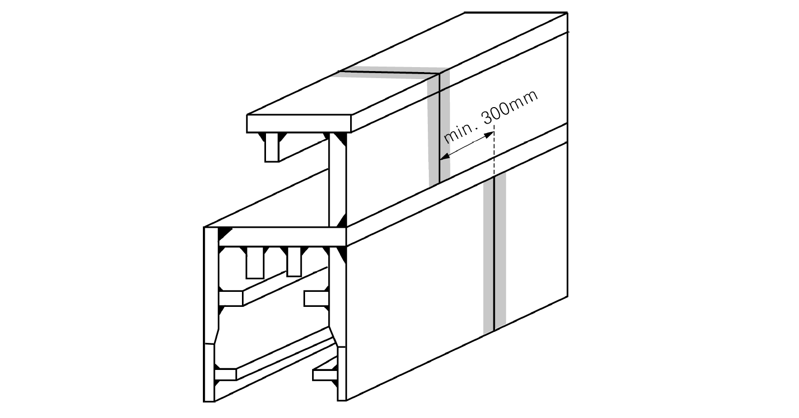
    Figure : An example of block to block butt-shift
  - **4.3.3** Where crack arrest holes are provided in way of the block-to-block butt welds at the region where hatch side coaming weld meets the deck weld, the fatigue strength of the lower end of the butt weld is to be assessed. Additional countermeasures are to be taken for the possibility that a running brittle crack may deviate from the weld line into upper deck or hatch side coaming. These countermeasures are to include the application of brittle crack arrest steel in hatch side coaming.
  - **4.3.4** Where Arrest Insert Plates of brittle crack arrest steel or Weld Metal Inserts with high crack arrest toughness properties are provided in way of the block-to-block butt welds at the region where hatch side coaming weld meets the deck weld, additional countermeasures are to be taken for the possibility that a running brittle crack may deviate from the weld line into upper deck or hatch side coaming. These countermeasures are to include the application of brittle crack arrest steel in hatch side coamings.
    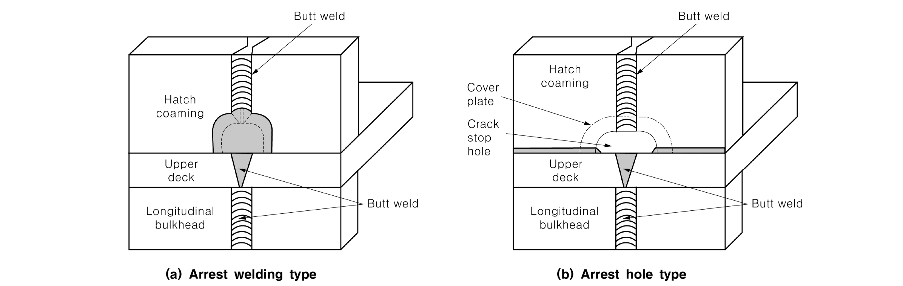
    Figure : An example of joint arrangement for arresting the brittle crack propagation
  - **4.3.5** The application of enhanced NDT such as time of flight diffraction (TOFD) technique or phase array (PAUT) using stricter defect acceptance in lieu of standard UT technique specified in **[2]** can be an alternative to **[4.3.2], [4.3.3]** and **[4.3.4]** above.
- **4.4** **Selection of brittle crack arrest steels**
  - **4.4.1** The brittle crack arrest steels fitted in the upper deck region of container ships are to comply with **Table 1** where suffixes BCA1 and BCA2 are defined in **Rule Part 2**.
  - **4.4.2** The brittle crack arrest steel property is to be selected for each individual structural member with thickness above 50 mm according to **Table 1**.
  - **4.4.3** When brittle crack arrest steels as specified in **Table 1** are used, the weld joints between the hatch coaming side and the upper deck are to be partial penetration weld details approved by the Society.
    In the vicinity of ship block joints, alternative weld details may be used for the deck and hatch coaming side connection provided additional means for preventing the crack propagation are implemented and agreed by the Society in this connection area.

    | Structural Members plating (1) | Thickness(mm) | Brittle crack arrest steel requirement |
    | --- | --- | --- |
    | Upper deck | \(50 Steel grade YP36 or 40 with suffix BCA1 |   |
    | Hatch coaming side | \(50 Steel grade YP40 or 47 with suffix BCA1 |   |
    | Hatch coaming side | \(80 Steel grade YP40 or 47 with suffix BCA2 |   |
    | Note; (1) Excluding their attached longitudinals |   |   |

#### 5. Measures for Extremely Thick Steel Plates

The thickness and the yield strength shown in the **Table 2** apply to the hatch coaming top plating and side plating, and are the controlling parameters for the application of countermeasures. These controling parameters are not applicable for the upper deck.
If the as built thickness of the hatch coaming top plating and side plating is below the values contained in the **Table 2**, countermeasures are not necessary regardless of the thickness and yield strength of the upper deck plating.

| Yield Strength (kgf/mm^2) | Thickness (mm) | Option | Measures |   |   |   |
| --- | --- | --- | --- | --- | --- | --- |
| Yield Strength (kgf/mm^2) | Thickness (mm) | Option | 1 | 2 | 3 + 4 | 5 |
| 36 | 50 < t ≤ 85 |   | N.A. | N.A. | N.A. | N.A. |
| 36 | 85 < t ≤ 100 |   | O | N.A. | N.A. | N.A. |
| 40 | 50 < t ≤ 85 |   | O | N.A. | N.A. | N.A. |
| 40 | 85 < t ≤ 100 | A | O | N.A. | O | O |
| 40 | 85 < t ≤ 100 | B | O* | N.A.** | N.A. | O |
| 47 (FCAW) | 50 < t ≤ 100 | A | O | N.A. | O | O |
| 47 (FCAW) | 50 < t ≤ 100 | B | O* | N.A.** | N.A. | O |
| 47 (EGW) | 50 < t ≤ 100 |   | O | N.A. | O | O |
| Measures: No. ; Measures 1 ; NDT other than visual inspection on all target block joints (during construction) **[2]**. 2 ; Welding to increase toughness(during construction) See **[3]**. 3 ; Brittle crack arrest design against straight propagation of brittle crack along weld line to be taken (during construction) See **[4.3.2]**, **[4.3.3]** or **[4.3.4]** of this requirements. 4 ; Brittle crack arrest design against deviation of brittle crack from weldline (during construction) See **[4.3.1]**. 5 ; Brittle crack arrest design against propagation of cracks from other weld areas such as fillets and attachment welds. (during construction) See **[4.3.1]**. No. Measures 1 NDT other than visual inspection on all target block joints (during construction) **[2]**. 2 Welding to increase toughness(during construction) See **[3]**. 3 Brittle crack arrest design against straight propagation of brittle crack along weld line to be taken (during construction) See **[4.3.2]**, **[4.3.3]** or **[4.3.4]** of this requirements. 4 Brittle crack arrest design against deviation of brittle crack from weldline (during construction) See **[4.3.1]**. 5 Brittle crack arrest design against propagation of cracks from other weld areas such as fillets and attachment welds. (during construction) See **[4.3.1]**. Symbols: (a) “O” means “To be applied”. (b) “N.A.” means “Need not to be applied”. (c) Selectable from option “A” and “B”. Note: * : See **[4.3.5]** ** : See **[3]**. |   |   |   |   |   |   |
| No. | Measures |   |   |   |   |   |
| 1 | NDT other than visual inspection on all target block joints (during construction) **[2]**. |   |   |   |   |   |
| 2 | Welding to increase toughness(during construction) See **[3]**. |   |   |   |   |   |
| 3 | Brittle crack arrest design against straight propagation of brittle crack along weld line to be taken (during construction) See **[4.3.2]**, **[4.3.3]** or **[4.3.4]** of this requirements. |   |   |   |   |   |
| 4 | Brittle crack arrest design against deviation of brittle crack from weldline (during construction) See **[4.3.1]**. |   |   |   |   |   |
| 5 | Brittle crack arrest design against propagation of cracks from other weld areas such as fillets and attachment welds. (during construction) See **[4.3.1]**. |   |   |   |   |   |

#### 6. Application of YP47 Steel Plates

These requirements apply to YP47 steel plates specified in **Pt 2, Ch 1, Sec 3, 311**.

- **6.1** **Hull structure(design)**
  - **6.1.1** HT factor (Material factor of high tensile steel, $k$) for the assessment of hull girder strength is to be taken as 0.62.
  - **6.1.2** Butt welds in the hatch side coaming and fillet welded joints for fixing outfitting items are to be set at an adequate distance from the hatch corners so that effects of stress concentration are to be avoided.
  - **6.1.3** The free edge including hatch corner of the hatch side coaming should not have any defects such as notch that could be harmful against fatigue strength. Appropriate edge treatment including treatment of corner edge (as an example, see **Figure 7**) is to be performed so that the edges should have adequate fatigue strength.
    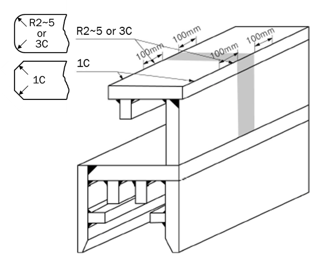
    Figure 7 : An example of appropriate edge treatment including corner edge
  - **6.1.4** In case of fitting of outfitting items such as hatch cover pads and container pads, taper is to be provided on the edge of the outfitting item so that a very large difference in rigidity does not occur between outfitting items and the hull structure. Measures such as increasing the thickness of plating at the fitted location are also to be adopted.
  - **6.1.5** Special consideration is to be paid to the construction details where extremely thick steel plates are applied as structural members such as connections between outfitting and hull structures. 
