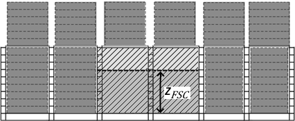

# PART 14 Structural Rules for Container Ships

> RULES FOR CLASSIFICATION OF STEEL SHIPS / RA-14-E / 2025 / EN / Rules

## Annex 14-1 Strength assessment of flooded condition for fire-fighting

### 1. General

#### 1.1 Application

- **1.1.1** **Scope**
  In addition to the Rules, this Annex applies to the strength assessment of container ships with flooding requirements for fire-fighting in cargo holds in accordance with **Pt 8**, **Annex 8-9**}, **405**. **5** of **Guidance relating to Rules for the Classification of Steel Ships**.
- **1.1.2** **Limitations**
  The cargo hold flooding condition is regarded as an accident condition and the design load and acceptance criteria are applied.
  The ship is assumed to be intact and upright.

#### 1.2 Loading Manual and Loading Instrument

- **1.2.1** **Loading Manual**
  The maximum flooding level of each hold is to be specified in the loading manual according to the strength assessment results based on this annex.
  It is to be specified in the loading manual to ensure that the permissible vertical bending moment and shear force in **[2.2]** are not exceeded under actual loading conditions and flooding level when filling the cargo hold with water.
- **1.2.2** **Loading instrument**
  The loading instrument shall be equipped with a function to check the vertical still water bending moment, the vertical still water shear force, and the intact stability at specified read-out points when any cargo hold is completely or partially flooded.

### 2. Loads

#### 2.1 Application

- **2.1.1** For requirements not described in this Article, refer to **Ch 4** of the Rules.
- **2.1.2** **Coefficient for strength assessment**
  For the flooded condition for fire-fighting, the coefficient for strength assessment is to be taken as 0.8.

#### 2.2 Hull girder loads

- **2.2.1** **Permissible vertical still water bending moment in flooded condition for fire-fighting**
  Permissible vertical still water bending moment, $M _{sw-FSC}$, in flooded condition for fire-fighting is calculated as:
  $M _{sw-FSC} =M _{sw} +M _{wv} \left( 1-f _{ps} \right)$
  where:
  $M _{sw}$ : Permissible hogging and sagging vertical still water bending moment in seagoing operation, in kNm, at the hull transverse section considered, defined in **Ch 4**, **Sec 4**, **[2.2.2]** of the Rules.
  $M _{wv}$ : Vertical wave bending moment in seagoing condition, in kNm, in seagoing operation at the hull transverse section considered, defined in **Ch 4**, **Sec 4**, **[3.2.1]** of the Rules.
  $f _{ps}$ : The coefficient for strength assessment in flooded condition for fire-fighting, refer to **[2.1.2]**.
- **2.2.2** **Permissible vertical still water shear force in flooded condition for fire-fighting**
  Permissible vertical still water shear force, $Q _{sw-FSC}$, in flooded condition for fire-fighting is calculated as:
  $Q _{sw-FSC} =Q _{sw} +Q _{wv} \left( 1-f _{ps} \right)$
  where:
  $Q _{sw}$ : Permissible positive or negative still water shear force for seagoing operation, in kN, at the hull transverse section considered, as defined in **Ch 4**, **Sec 4**, **[2.3.1]** of the Rules.
  $Q _{wv}$ : Vertical wave shear force in seagoing condition, in kN, at the hull transverse section considered, defined in **Ch 4**, **Sec 4**, **[3.3.1]** of the Rules.
  $f _{ps}$ : The coefficient for strength assessment in flooded condition for fire-fighting, refer to **[2.1.2]**.

#### 2.3 Internal loads

- **2.3.1** **Pressures for the strength assessment of flooded conditions for fire-fighting**
  The internal pressure in flooded condition for fire-fighting, in $\mathrm{kN}/m ^{2}$, acting on any load point of the watertight boundary of a hold for the flooded static (S) design load scenarios, given in **[2.4]** is to be taken as:
  $P _{"in"} =P _{FSC}$
  $P _{FSC} = \rho g h$
  $\rho$ : Density of seawater, taken equal to 1.025 t/m^3
  $g$ : Gravity acceleration, taken equal to 9.81 m/s^2
  $h$ : Pressure height, in $\mathrm{m}$, in flooded condition, to be taken as:
  $h=z _{FSC} -z$
  where:
  $z _{FSC}$ : Vertical distance from the top of inner bottom plating to the maximum flooding level, in m
  $z$ : Vertical distance from the top of inner bottom plating to the load point, in m

#### 2.4 Design load scenarios

- **2.4.1** **Design load scenarios for strength assessment in flooded condition for fire-fighting**
  The design load scenarios for strength assessment in flooded condition for fire-fighting are given in **Table 1**.

  | Design load scenario |   |   | Flooded condition(for fire-fighting) |
  | --- | --- | --- | --- |
  | Load components |   |   | Accidental (A) |
  | Hull Girder | VBM |   | $M _{sw-FSC}^{}$ |
  | Hull Girder | HBM |   | - |
  | Hull Girder | VSF |   | - |
  | Hull Girder | TM |   | - |
  | Local Loads | $P _{ex}$ | External deck for green sea | - |
  | Local Loads | $P _{ex}$ | Hull envelope | - |
  | Local Loads | $P _{i n}$ | Ballast tanks | - |
  | Local Loads | $P _{i n}$ | Other tanks | - |
  | Local Loads | $P _{i n}$ | Watertight boundaries | $P _{FSC}$ |
  | Local Loads | $F _{con}$ | Container | - |
  | Local Loads | $P _{dk}$ | Internal decks for dry spaces | - |
  | Local Loads | $P _{dk}$ | External deck for distributed loads | - |
  | Local Loads | $P _{dk}$ | External deck for heavy units | - |

#### 2.5 Loading conditions

- **2.5.1** **Loading condition for cargo hold strength assessment in flooded condition for fire-fighting**
  The loading condition for strength assessment in flooded condition for fire-fighting is given in **Table 2**.

  | No | Loading Pattern |   |   | Still water loads |   |   |   |   |   |   |   |   |   | Dynamic load cases |
  | --- | --- | --- | --- | --- | --- | --- | --- | --- | --- | --- | --- | --- | --- | --- |
  | No | Loading Pattern |   |   | Draught |   | Container load |   |   |   |   | % of perm. SWBM |   | % of perm. SWSF | Midship cargo region |
  | No | Loading Pattern |   |   | Draught |   | In hold |   |   | On deck |   | % of perm. SWBM |   | % of perm. SWSF | Midship cargo region |
  | Flooded condition(for fire-fighting) |   |   |   |   |   |   |   |   |   |   |   |   |   |   |
  | A2 |  |   |   | $T _{SC}$ |   | centre: flooded adjacent: 40t/FEU all ballast tanks empty |   |   | max 40 ft stack weight |   | 100% (sag. or min. hog.) |   | - | Static |
  |  |   | heavy cargo |  |   | light cargo |   |  | ballast tank |   |  |   | fuel oil tank |   |   |

### 3. Hull local scantling

#### 3.1 Application

- **3.1.1** Hull local scantlings for cargo hold region in flooded condition for fire-fighting are to be evaluated in accordance with **Ch 6** of the Rules.

#### 3.2 Load combination

- **3.2.1** **Design load sets for plating, stiffeners and PSM in flooded condition for fire-fighting**
  Design load sets for plating, stiffeners and primary supporting members in flooded condition for fire-fighting are given in **Table 3**.

  | Structural member | Design load set | Load component | Draught | Design load | Loading condition |
  | --- | --- | --- | --- | --- | --- |
  | Watertight boundaries | FD-2 | $P_"in"$ | - | A | Flooded condition(for fire-fighting) |

### 4. Cargo Hold Structural Strength Analysis

#### 4.1 Application

- **4.1.1** Cargo hold structural strength analysis is to be carried out in accordance with **Ch 7**, **Sec 1** and **2** of the Rules.

#### 4.2 Design load combinations

- **4.2.1** The loading condition for cargo hold structural strength analysis in flooding condition for fire-fighting is in accordance with **Table 2**.

#### 4.3 Internal loads

- **4.3.1** **Internal pressure in flooded condition**
  The internal pressure is calculated according to **[2.3.1]** for the design load scenarios in flooded condition for fire-fighting in **Table 1**.

#### 4.4 Hull girder loads

- **4.4.1** The hull girder loads is to be taken as the still water vertical bending moment according to **Table 2**.
- **4.4.2** **Target hull girder vertical bending moment in flooded condition for fire-fighting**
  The target hull girder vertical bending moment, $M _{v-targ}$, in kNm, at a longitudinal position for a given FE load combination is taken as:
  $M _{v-targ} =M _{sw-FSC}$
  where:
  $M _{sw-FSC}$ : Permissible still water bending moments in kNm, at the considered longitudinal position in flooded condition for fire-fighting as defined in **[2.2.1]**.
  The values of $M _{v-targ}$ are taken as the maximum hull girder bending moment within the mid-hold(s) for each individual cargo hold for each given FE load combination as defined in **Table 2**.

#### 4.5 Alternative methods

- **4.5.1** **Strength assessment for PSM in flooded condition for fire-fighting**
  In evaluating the strength of the primary supporting members in flooded condition for fire-fighting, a method that considers the plasticity of the material using nonlinear finite element analysis can be used as an alternative evaluation method. In this case, evaluation procedures and methods are to be submitted to the Society for consultation in advance. 

  | **Rules for the Classification of Steel Ships Guidance Relating to the Rules for the Classification of Steel Ships** |
  | --- |
  | **PART 14 STRUCTURAL RULES FOR CONTAINER SHIPS** Published by **KR** 36, Myeongji ocean city 9-ro, Gangseo-gu, BUSAN, KOREA TEL : +82 70 8799 7114 FAX : +82 70 8799 8999 Website : http://www.krs.co.kr |
  |   |

  | CopyrightⒸ 2024, **KR** Reproduction of this Rules and Guidance in whole or in parts is prohibited without permission of the publisher. |
  | --- |
