# PART 15 Structural Rules for Membrane Type Liquefied Natural Gas Carriers

> RULES FOR CLASSIFICATION OF STEEL SHIPS / RA-15-E / 2025 / EN / Rules

## Chapter 3 Structural Design Principles

### Section 10 - Materials

#### 1. General

- **1.1** **Standard of material**
  - **1.1.1** Materials used during construction are to comply with **Pt2,Ch1**.
  - **1.1.2** Other materials than those covered under **[1.1.1]** may be accepted, provided their specification (e.g. manufacture, chemical composition, mechanical properties, welding) is submitted to the Society for approval. In order to select hull material in cargo hold region, temperature analyses shall be carried out as given in **Pt 7, Ch 5, Sec 4, [413.4]** and “**Guidance of Heat Transfer Analysis for Ships Carrying Liquefied Gases in Bulk/Ships Using Liquefied Gases as Fuels**”.
- **1.2** **Testing of materials**
  - **1.2.1** Materials are to be tested in compliance with the applicable requirements of **Pt2, Ch 1**.
- **1.3** **Manufacturing process**
  - **1.3.1** The requirements of this section presume that welding and other cold or hot manufacturing processes are carried out in compliance with current sound working practice defined in the Rules and/or documents of the individual Society which incorporate **IACS UR W** and the applicable requirements of **Pt2, Ch 1**.
    In particular:
    - **a)** Parent material and welding processes are to be within the limits stated for the specified type of material for which they are intended.
    - **b)** Specific preheating may be required before welding.
    - **c)** Welding or other cold or hot manufacturing processes may need to be followed by an adequate heat treatment.

#### 2. Hull structural steel

- **2.1** **General**
  - **2.1.1** **Young’s modulus and Poisson’s ratio**
    The Young’s modulus for Carbon steel materials is equal to 206,000 N/mm^2 and the Poisson’s ratio equal to 0.3.
  - **2.1.2** **Steel material grades and mechanical properties**
    Steel having a specified minimum yield stress of 235 N/mm^2 is regarded as normal strength hull structural steel and is denoted by ‘MS’ for mild steel. Steel having a higher specified minimum yield stress is regarded as higher strength hull structural steel and is denoted ‘HT’ for high tensile steel.
    Material grades of hull structural steels are referred to as follows:
    **Table 1** gives the mechanical characteristics of steels generally used in the construction of ships.

    | Steel grades for plates with $t _{as-built}$ ≤ 100 mm | $R _{eH}$, specified minimum yield stress, in N/mm^2 | $R _{m}$, specified tensile strength, in N/mm^2 |
    | --- | --- | --- |
    | A-B-D-E | 235 | 400 - 520 |
    | AH32 - DH32 - EH32 - FH32 | 315 | 440 - 570 |
    | AH36 - DH36 - EH36 - FH36 | 355 | 490 - 630 |
    | AH40 - DH40 - EH40 - FH40 | 390 | 510 - 660 |
    - **a)** A, B, D and E denote normal strength steel grades.
    - **b)** AH, DH and EH denote higher strength steel grades.
  - **2.1.3** Higher strength steels other than those indicated in **Table 1** are considered by the Society on a case-by-case basis.
  - **2.1.4** **High tensile steel**
    When steels with a specified minimum yield stress $R _{eH}$ other than 235 N/mm^2 are used, hull girder strength and hull scantlings are to be determined by taking into account the material factor, *k* defined in **[2.2]**.
  - **2.1.5** **Onboard documents**
    It is required to keep onboard a plan indicating the steel types and grades adopted for the hull structures. Where steels other than those indicated in **Table 1** are used, their mechanical and chemical properties, as well as any workmanship requirements or recommendations, are to be available onboard together with the above plan.
- **2.2** **Material factor,** ***k***
  - **2.2.1** Unless otherwise specified, the material factor, *k* of normal and higher strength steel for hull girder strength and scantling purposes is to be taken as defined in **Table 2**, as a function of the specified minimum yield stress $R _{eH}$. For intermediate values of $R _{eH}$, *k* is obtained by linear interpolation. Steels with a specified minimum yield stress $R _{eH}$, greater than 390 N/mm^2 are considered by the Society on a case by-case basis.

    | $R _{eH}$, specified minimum yield stress, in N/mm^2 | *k* |
    | --- | --- |
    | 235 | 1.00 |
    | 315 | 0.78 |
    | 355 | 0.72 |
    | 390 | 0.68 |
- **2.3** **Steel grades**
  - **2.3.1** Materials in the various strength members are not to be of lower grade than those corresponding to the material classes and grades specified in **Table 3** to **Table 6**. General requirements are given in **Table 3**, while additional minimum requirements for ships greater than 150 m or 250 m in length are given respectively in **Table 4** and **Table 5**. The material grade requirements for hull members of each class depending on the thickness are defined in **Table 6**.
  - **2.3.2** For strength members not mentioned in **Table 3** to **Table 5**, grade A/AH may be used, upon agreement of the Society.
  - **2.3.3** Plating materials for stern frames and shaft brackets are, in general, not to be of lower grades than those corresponding to Class II.

    | Structural member category |   | Within 0.4 *L* amidships | Outside 0.4 *L* and within 0.6 *L* amidships | Outside 0.6 *L* amidships |
    | --- | --- | --- | --- | --- |
    | **Secondary** | • Longitudinal bulkhead strakes, other than those belonging to the primary category • Deck plating exposed to weather, other than that belonging to the primary or special category • Side plating | I | A / AH | A / AH |
    | **Primary** | • Bottom plating, including keel plate • Strength deck plating, excluding that belonging to the special category • Continuous longitudinal plating of strength members above strength deck • Uppermost strake in longitudinal bulkhead | II | A / AH | A / AH |
    | **Special** | • Sheerstrake at strength deck(1) • Stringer plate in strength deck(1) • Deck strake at longitudinal bulkhead, excluding deck plating in way of inner-skin bulkhead of double hull ships(1) | III | II | I |
    | **Special** | • Plating in trunk deck and inner deck at outboard coners of liquid and gas dome in membrane type liquefied natural gas carrier. | III | II | II |
    | **Special** | • Bilge strake in ships with double bottom over the full breadth and with length less than 150 m | II | II | I |
    | **Special** | • Bilge strake in other ships(1) | III | II | I |
    | (1) Single strakes required to be of class III within 0.4 *L* amidships are to have breadths not less than (800 + 5 *L*) mm, but need not be greater than 1800 mm, unless limited by the geometry of the ship’s design. |   |   |   |   |

    | Structural member category |   | Material grade |
    | --- | --- | --- |
    | • Longitudinal plating of strength deck where contributing to the longitudinal strength |   | Grade B/AH within 0.4 *L* amidships |
    | • Continuous longitudinal plating of strength members above strength deck | Trunk deck plating | Class II within 0.4 *L* amidships |
    | • Continuous longitudinal plating of strength members above strength deck | Inner deck plating Longitudinal plating between the trunk deck and inner deck | Grade B/AH within 0.4 *L* amidships |
    | 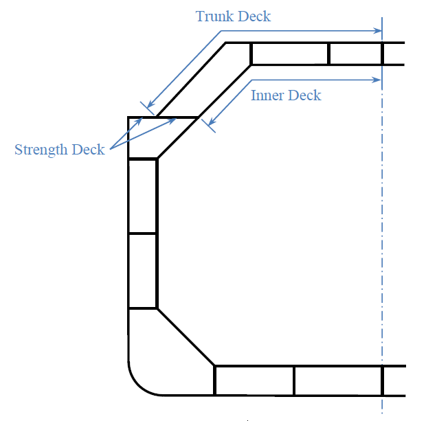 |   |   |

    | Structural member category(1) | Material grade |
    | --- | --- |
    | • Shear strake at strength deck | Grade E/EH within 0.4 *L* amidships |
    | • Stringer plate in strength deck | Grade E/EH within 0.4 *L* amidships |
    | • Bilge strake | Grade D/DH within 0.4 *L* amidships |
    | (1) Single strakes required to be of grade D/DH or grade E/EH and within 0.4 *L* amidships are to have breadths not less than (800 + 5 *L*) mm, but need not be greater than 1800 mm, unless limited by the geometry of the ship’s design. |   |

    | As-built thickness, in mm | Class I |   | Class II |   | Class III |   |
    | --- | --- | --- | --- | --- | --- | --- |
    | As-built thickness, in mm | MS steel | HT steel | MS steel | HT steel | MS steel | HT steel |
    | *t* ≤ 15 | A | AH | A | AH | A | AH |
    | 15 < *t* ≤ 20 | A | AH | A | AH | B | AH |
    | 20 < *t* ≤ 25 | A | AH | B | AH | D | DH |
    | 25 < *t* ≤ 30 | A | AH | D | DH | D | DH |
    | 30 < *t* ≤ 35 | B | AH | D | DH | E | EH |
    | 35 < *t* ≤ 40 | B | AH | D | DH | E | EH |
    | 40 < *t* ≤ 50 | D | DH | E | EH | E | EH |
- **2.4** **Structures exposed to low air temperature**
  - **2.4.1** For ships intended to operate in areas with low air temperatures refer to **Ch 1, Sec 2, [3.4.4]**.
- **2.5** **Through thickness property**
  - **2.5.1** Where tee or cruciform connections employ partial or full penetration welds, and the plate material is subject to significant tensile strain in a direction perpendicular to the rolled surfaces, consideration is to be given to the use of special material with specified through thickness properties, in accordance with **Pt 2**,**Ch1**. These steels are to be designated on the approved plan by the required steel strength grade followed by the letter Z (e.g. EH36Z).
- **2.6** **Stainless steel**
  - **2.6.1** The reduction of strength of stainless steel with increasing temperature is to be taken into account in the calculation of the material factor, *k* and in the material Young’s modulus, *E*. Stainless steels are to be in accordance with **Pt 2, Ch 1**.

#### 3. Steels for forging and casting

- **3.1** **General**
  - **3.1.1** Mechanical and chemical properties of steels for forging and casting to be used for structural members are to comply with the applicable requirements of **Pt 2, Ch 1**.
  - **3.1.2** Steels of structural members intended to be welded are to have mechanical and chemical properties deemed appropriate for this purpose by the Society on a case-by-case basis.
  - **3.1.3** The steels used are to be tested in accordance with the applicable requirements of **Pt 2, Ch 1**.
- **3.2** **Steels for forging**
  - **3.2.1** Rolled bars may be accepted in lieu of forged products, after consideration by the Society on a case-by-case basis. In such case, compliance with the applicable requirements of the Rules for Materials of the Society, relevant to the quality and testing of rolled parts accepted in lieu of forged parts, may be required.
- **3.3** **Steels for casting**
  - **3.3.1** Cast parts intended for stems and stern frames in general may be made of C and C-Mn weldable steels, having specified minimum tensile strength, $R _{m}$ = 400 N/mm^2, in accordance with the applicable requirements of the Society’s Rules for Materials.
  - **3.3.2** The welding of cast parts to main plating contributing to hull strength members is considered by the Society on a case-by-case basis.
    The Society may require additional properties and tests for such casting, in particular impact properties which are appropriate to those of the steel plating on which the cast parts are to be welded and non-destructive examinations.

#### 4. Aluminium alloys

- **4.1** **General**
  - **4.1.1** The use of aluminium alloys in superstructures, deckhouses, hatch covers, helicopter platforms, or other local components is to be specially considered. A specification of the proposed alloys and their proposed method of fabrication is to be submitted for approval. Material requirements and scantlings are to comply with the Rules for Materials of the Society. Series 5000 aluminium-magnesium alloys or series 6000 aluminium-magnesium-silicon alloys are to be used.
  - **4.1.2** In the case of structures subjected to low service temperatures or intended for other specific applications, the alloys to be employed are to be agreed by the Society.
  - **4.1.3** Unless otherwise agreed, the Young’s modulus for aluminium alloys is equal to 70,000 N/mm^2 and the Poisson’s ratio equal to 0.33.
  - **4.1.4** Details of the proposed method of joining any aluminium and steel structures are to be submitted for approval.
- **4.2** **Extruded plating**
  - **4.2.1** Extrusions with built-in plating and stiffeners, referred to as extruded plating, may be used.
  - **4.2.2** In general, the application of extruded plating is limited to decks, bulkheads, superstructures and deckhouses. Other uses may be permitted by the Society on a case-by-case basis.
  - **4.2.3** Extruded plating is to be oriented so that the stiffeners are parallel to the direction of main stresses.
  - **4.2.4** Connections between extruded plating and primary members are to be given special attention.
- **4.3** **Mechanical properties of weld joints**
  - **4.3.1** Welding heat input lowers locally the mechanical strength of aluminium alloys hardened by work hardening (series 5000 other than condition O or H111) or by heat treatment (series 6000).
  - **4.3.2** The as-welded properties of aluminium alloys of series 5000 are in general those of condition O or H111. Higher mechanical characteristics may be considered, provided they are duly justified.
  - **4.3.3** The as-welded properties of aluminium alloys of series 6000 are to be agreed by the Society.
- **4.4** **Material factor,** ***k***
  - **4.4.1** The material factor, *k* for aluminium alloys is to be obtained from the following formula:
    *k =* $\frac{235}{R ' _{l im}}$
    where:
    $R ' _{l im}$ : Minimum guaranteed yield stress of the parent metal in welded condition $R ' _{p0.2}$, in N/mm^2, but not to be taken greater than 70% of the minimum guaranteed tensile strength of the parent metal in welded condition $R ' _{m}$, in N/mm^2.
    $R ' _{p0.2}$ : Minimum guaranteed yield stress, in N/mm^2, of material in welded condition.
    $R ' _{p0,2} = \eta _{1} R _{p0,2}$
    $R ' _{m}$ : Minimum guaranteed tensile strength, in N/mm^2, of material in welded condition.
    $R ' _{m} = \eta _{2} R _{m}$
    $R _{p0.2}$ : Minimum guaranteed yield stress, in N/mm^2, of the parent metal in delivery condition.
    $R _{m}$ : Minimum guaranteed tensile strength, in N/mm^2, of the parent metal in delivery condition.
    $\eta _{1} , \eta _{2}$ : Specified in **Table 7.**

    | Aluminium alloy | $\eta _{1}$ | $\eta _{2}$ |
    | --- | --- | --- |
    | Alloys without work-hardening treatment (series 5000 in annealed condition O or annealed flattened condition H111) | 1 | 1 |
    | Alloys hardened by work hardening (series 5000 other than condition O or H111) | $R ' _{p0,2} /R _{p0,2}$ | $R ' _{m} /R _{m}$ |
    | Alloys hardened by heat treatment (series 6000) (1) | $R ' _{p0,2} /R _{p0,2}$ | 0.6 |
    | (1) When no information is available, coefficient $\eta _{1}$ is to be taken equal to the metallurgical efficiency coefficient $\beta$ as defined in Table 8. |   |   |

    | Aluminium alloy | Temper condition | As-built thickness, in mm | ${\beta }$ |
    | --- | --- | --- | --- |
    | 6005A (Open sections) | T5 or T6 | *t* ≤ 6 | 0.45 |
    | 6005A (Open sections) | T5 or T6 | *t* ＞ 6 | 0.40 |
    | 6005A (Closed sections) | T5 or T6 | All | 0.50 |
    | 6061 (Sections) | T6 | All | 0.53 |
    | 6082 (Sections) | T6 | All | 0.45 |
  - **4.4.2** In the case of welding of two different aluminium alloys, the material factor, *k* to be considered for the scantlings is the greater material factor of the aluminium alloys of the assembly.
- **4.5** **Others**
  - **4.5.1** Aluminium fittings in tanks used for the carriage of fuel oil, and in cofferdams and pump rooms are to be avoided.
  - **4.5.2** The underside of heavy portable aluminium structures such as gangways, is to be protected by means of a hard plastic or wood cover, or other approved means, in order to avoid the creation of smears. Such protection is to be permanently and securely attached to the structures.

#### 5. Other materials and products

- **5.1** **General**
  - **5.1.1** Other materials and products such as parts made of iron castings, where allowed, products made of copper and copper alloys, rivets, anchors, chain cables, cranes, masts, derrick posts, derricks, accessories and wire ropes are to comply with the applicable requirements of **Pt 2**, **Ch 1**, the Rules for Materials of the Society.
  - **5.1.2** The use of plastics or other special materials not covered by these Rules is to be considered by the Society on a case-by-case basis. In such cases, the requirements for the acceptance of the materials concerned are to be agreed by the Society.
- **5.2** **Iron cast parts**
  - **5.2.1** As a rule, the use of grey iron, malleable iron or spheroidal graphite iron cast parts with combined ferritic/perlitic structure is allowed only to manufacture low stressed elements of secondary importance.
  - **5.2.2** Ordinary iron cast parts may not be used for windows or sidescuttles; Iron cast part used for windows or sidescuttles are to be in accordance with **Pt 4, Ch 8, 804** and **904**.

### Section 11 - Net Scantling Approach

**Symbols**
For symbols not defined in this section, refer to **Ch 1, Sec 4**.
*t* : Net thickness in mm.
*t_c* : Corrosion addition in mm.
*t_gr* : Gross thickness in mm.
$h _{stf}$ : Height of stiffener or primary supporting member in mm.
$h _{w}$ : Web height of stiffener or primary supporting member in mm.
$t _{w}$ : Web thickness of stiffener or primary supporting member in mm.
$b _{f}$ : Face plate width of stiffener or primary supporting member in mm.
$t _{f}$ : Face plate thickness of stiffener or primary supporting member in mm.
*t_p* : Thickness of the plating attached to a stiffener or to a primary supporting member in mm.
*d_e* : Distance in mm, from the upper edge of the web to the top of the flange for L3 profiles, see **Figure 3**.
*d_f* : Distance in mm, for extension of flange for L2 profiles, see **Figure 3**.
$t _{as-built}$ : As-built thickness, in mm, taken as the actual thickness provided at the newbuilding stage.
$t _{gr"_"off}$ : Gross offered thickness, in mm, as defined in **[1.2.2]**.
$t _{gr"_"req}$ : Gross required thickness, in mm, as defined in **[1.2.1]**.
$t _{off}$ : Net offered thickness, in mm, as defined in **[1.2.3].**
$t _{dm}$ : Design production margin, in mm, taken as the thickness difference between offered gross thickness and required gross thickness (equal also to the difference between offered net and required net thickness) as a result of scantlings applied by the designer or builder to suit design or production situation. This difference in thickness is not to be considered as an additional corrosion margin.
$t _{req}$ : Net required thickness, in mm, as required in **[1.3.1]**.
$t _{vol"_"add}$ : Thickness for voluntary addition, in mm, taken as the thickness voluntarily added as the owner’s extra margin or builder’s extra margin for corrosion wastage in addition to *t_c*.
$t _{res}$ : Reserve thickness, in mm, taken equal to 0.5 mm.
*t _c1 , t _c2* : Corrosion addition on one side of the considered structural member, in mm, as defined in **Ch3, Sec 3, Table 1**.

#### 1. General

- **1.1** **Application**
  - **1.1.1** **Net thickness approach**
    The net thickness, *t*, of a structural element is required for structural strength in compliance with the design basis. The corrosion addition, *t_c*, for a structural element is derived independently from the net scantling requirements as shown in **Figure 1**. This approach clearly separates the net thickness from the thickness added to address the corrosion that is likely to occur during the ship-in-operation phase.
  - **1.1.2** **Local and global corrosion**
    The net thickness approach distinguishes between local and global corrosion. Local corrosion is defined as uniform corrosion of local structural elements, such as a single plate or stiffener. Global corrosion is defined as the average corrosion of larger areas, such as primary supporting members and the hull girder.
  - **1.1.3** **Exceptions in gross scantling**
    Items that are directly determined in terms of gross scantlings do not follow the net scantling approach, i.e. they already include additions for corrosion but without any owner’s extra margin. Gross scantling requirements are identified with the suffix "gr" and examples are:
    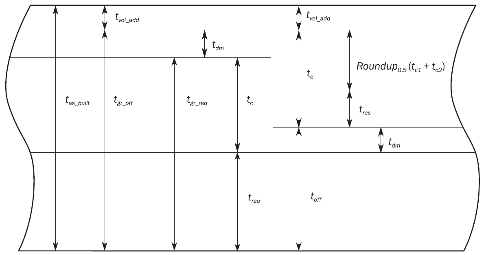
    **Figure : Net scantling approach scheme**
    - **a)** Scantlings of superstructures and deckhouses as given in **Ch 11, Sec 1**.
    - **b)** Scantlings of massive pieces made of steel forgings and steel castings.
- **1.2** **Gross and net scantling definitions**
  - **1.2.1** **Gross required thickness**
    The gross required thickness, $t _{gr"_"req}$, is the thickness obtained by adding the corrosion addition as defined in **Ch 3, Sec 3** to the net required thickness, as follows:
    $t _{gr"_"req} =t _{req} +t _{c}$
  - **1.2.2** **Gross offered thickness**
    The gross offered thickness, $t _{gr"_"off}$, is the gross thickness provided at the newbuilding stage, which is obtained by deducting any thickness for voluntary addition from the as-built thickness, as follows:
    $t _{gr"_"off} =t _{as"_"built} -t _{vol"_"add}$
  - **1.2.3** **Net offered thickness**
    The net offered thickness, $t _{off}$, is obtained by subtracting the corrosion addition from the gross offered thickness, as follows:
    $t _{off} =t _{gr"_"off} -t _{c} =t _{as"_"built} -t _{vol"_"add} -t _{c}$
- **1.3** **Scantling compliance**
  - **1.3.1** The net required thickness, $t _{req}$, is obtained by rounding the net thickness calculated according to the Rules to the nearest half millimetre. For example:
    - **a)** For 10.75 ≤ *t* ＜ 11.25 mm, the Rule required net thickness is 11.0 mm.
    - **b)** For 11.25 ≤ *t* ＜ 11.75 mm, the Rule required net thickness is 11.5 mm.
  - **1.3.2** Scantling compliance in relation to the Rules is as follow:
    Any additional thickness specified by the owner or the builder is not to be included when considering the compliance with the Rules.

    | Structural requirement | Property/analysis type | Applied corrosion addition |
    | --- | --- | --- |
    | Minimum thickness (all members including PSM) | Thickness | *t_c* |
    | Local strength (plates and stiffeners) | Thickness / sectional properties | *t_c* |
    | Local strength (plates and stiffeners) | Stiffness / proportions / Buckling capacity | *t_c* |
    | Primary supporting members (prescriptive) | Sectional properties | 0.5 *t_c* |
    | Primary supporting members (prescriptive) | Stiffness / proportions of web and flange Buckling capacity | *t_c* |
    | Strength assessment by FEM | Cargo hold (stress determination) | 0 |
    | Strength assessment by FEM | Buckling capacity | *t_c* |
    | Strength assessment by FEM | Local fine mesh | 0 |
    | Hull girder strength | Sectional properties | 0 |
    | Hull girder strength | Buckling capacity | *t_c* |
    | Fatigue assessment (simplified stress analysis) | Hull girder section properties Local support member | 0.5 *t_c* |
    | Fatigue assessment (FE Stress analysis) | Coarse mesh FE model Very fine mesh portion | 0 |

    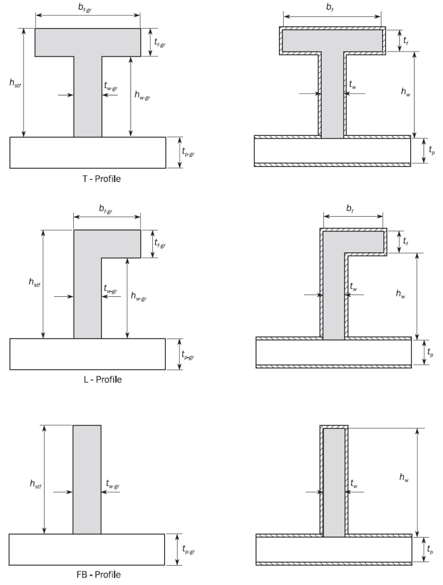
    **Figure : Net sectional properties of local supporting members (T, L and FB-profile)**
    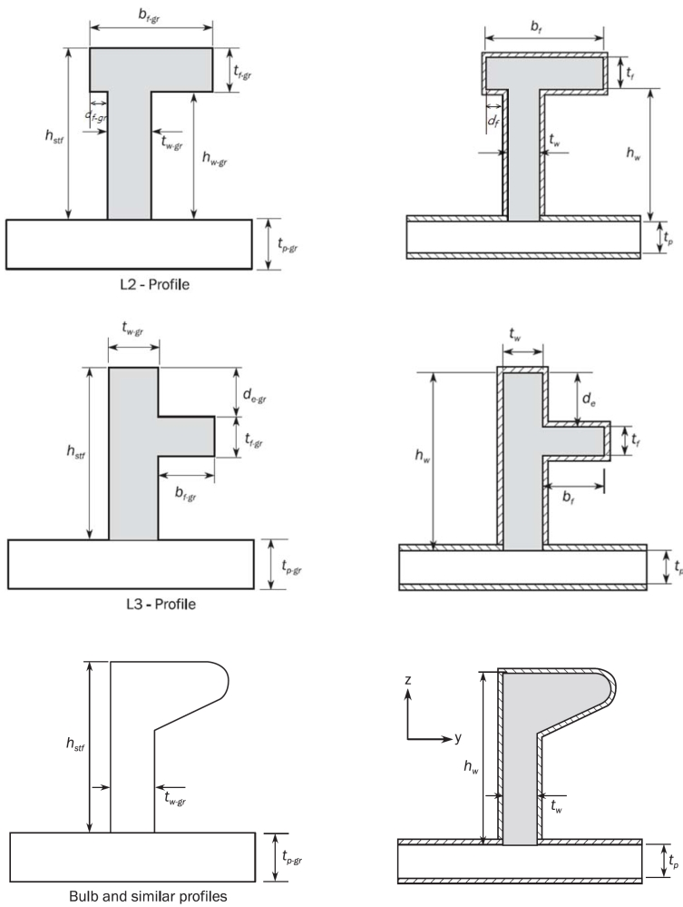
    **Figure : Net sectional properties of local supporting members (L2, L3 and Bulb-Profile)**
    The net cross-sectional area, the moment of inertia about the y-axis and the associated neutral axis position are to be determined applying a corrosion magnitude of 0.5 *t_c* deducted from the surface of the profile cross-section.
    - **a)** The net offered thickness of plating is to be equal to or greater than the net required thickness of plating.
    - **b)** The required net section modulus, moment of inertia and shear area properties of local supporting members are to be calculated using the net thickness of the attached plate, web and flange. The net sectional dimensions of local supporting members are defined in **Figure 2** and **Figure 3**. The required section modulus and web net thickness apply to areas clear of the end brackets.
    - **c)** The offered net sectional properties of primary supporting members are to be equal to or greater than the required net sectional properties which are to be based on the gross offered scantling with a reduction of the applicable corrosion addition, as specified in **Table 1**, applied to all component structural members.
    - **d)** The strength assessment methods prescribed are to be assessed with by applying the corrosion reduction specified in **Table 1** to the offered gross scantlings. Buckling strength is to be assessed by applying corrosion reduction specified in **Table 1**.
    - **e)** Corrosion additions are not to be taken less than those given in **Ch 3, Sec 3, [1.2]**.

### Section 12 - Corrosion Additions

**Symbols**
*t_c* : Corrosion addition, in mm.
*t_c1*, *t_c2* : Corrosion addition, in mm, on one side of the considered structural member, as defined in **Table 1**.
$t _{res}$ : Reserve thickness, taken as 0.5 mm.

#### 1. General

- **1.1** **Applicability**
  - **1.1.1** The corrosion additions given in these Rules are applicable to carbon-manganese steels, stainless steels, stainless clad steels and aluminium alloys. Corrosion addition for the exposed carbon steel side of stainless clad structure is to be as required in **Table 1** for the corresponding compartment.
    The corrosion additions for other materials are to be in accordance with the requirements of the Society.
- **1.2** **Corrosion addition determination**
  - **1.2.1** The corrosion addition for each of the two sides of a structural member, *t_c1* or *t_c2*, is specified in **Table1**.
    The total corrosion addition, *t_c*, in mm, for both sides of the structural member is obtained by the following formula:
    $t _{c} =t _{c1} +t _{c2} +t _{res}$
    For an internal member within a given compartment, the total corrosion addition, tc is obtained from the following formula:
    $t _{c} =2t _{c1} +t _{res}$
    where *t_c1* is the value specified in **Table 1** for one side exposure to that compartment.
    The total corrosion addition, *t_c*, in mm, for compartment boundaries and internal members made from stainless steel, or aluminium is to be taken as:
    $t _{c} =t _{res} =$ 0.5
    In case of stainless clad steel, the corrosion additions, *t_c1*, for the carbon steel side and *t_c2*, for the stainless steel side are respectively to be taken as:
    - **a)** *t_c1* as specified for the corresponding compartment in **Table 1**
    - **b)** *t_c2* = 0
  - **1.2.2** **Stiffener**
    The corrosion addition of a stiffener is determined according to the location of its connection to the attached plating.
  - **1.2.3** When a local structural member/plate is affected by more than one value of corrosion addition, the most onerous value is to be applied to the entire strake.
  - **1.2.4** **Corrosion addition limit**
    Considering the renewal criteria specified in **Ch 13, Sec 2**, the corrosion addition is to satisfy the following condition:
    $t _{c} \leq t _{gr _{-} off} \times 0.2$ with nearest half millimetre

    | Compartment type | *t_c1* or *t_c2* |
    | --- | --- |
    | Ballast water tank, bilge tank, drain storage tank, chain locker(1) | 1.0 |
    | Exposed to atmosphere/sea water | 0.5 |
    | Fuel oil and lube oil tank | 0.5 |
    | Fresh water tank | 0.0 |
    | Void spaces and dry spaces(2)(3) | 0.0 |
    | Spaces protected by cargo containment system | 0.0 |
    | Accommodation spaces | 0.0 |
    | Compartments other than those mentioned above | 0.5 |
    | (1) 1.0 mm is to be added to the plate surface within 3 m above the upper surface of the chain locker bottom. (2) For the determination of the corrosion addition of the outer shell plating, the pipe tunnel is considered as for a ballast water tank. (3) For bottom plate of compartment, *t*_c1 or *t*_c2 is to be taken equal to 0.5 mm. |   |

### Section 13 - Corrosion Protection

#### 1. General

- **1.1** **Structures to be protected**
  - **1.1.1** **Dedicated seawater ballast tanks**
    All dedicated seawater ballast tanks are to have an efficient corrosion prevention system.
  - **1.1.2** **Narrow spaces**
    Narrow spaces are generally to be filled by an efficient protective product, particularly at the ends of the ship where inspections and maintenance are not easily practicable due to their inaccessibility.
- **1.2** **Corrosion protection coating**
  - **1.2.1** All sea water ballast spaces having boundaries formed by the hull envelope are to have an effective corrosion protection coating in accordance with the manufacturer's requirements.
  - **1.2.2** Corrosion protection coating for dedicated sea water ballast tanks are to be in accordance with the requirements as specially prepared by the Society.
  - **1.2.3** The bilges and the double bottoms in the boiler spaces are to be efficiently protected by Portland cement or other equivalent materials which cover the plates and frames as far as the upper turn of bilge. However, cement protection may be dispensed with in the bottom of the space solely used for carriage of oil.

#### 2. Sacrificial anodes

- **2.1** **Attachment of anodes to the hull**
  - **2.1.1** All anodes are to be attached to the structure in such a way that they remain securely fastened both initially and during service even when it is wasted. The following methods are acceptable:
    - **a)** Steel core connected to the structure by continuous fillet welds.
    - **b)** Attachment to separate supports by bolting, provided a minimum of two bolts with lock nuts are used. However, other mechanical means of clamping may be accepted.
  - **2.1.2** Anodes are to be attached to stiffeners or aligned in way of stiffeners on plane bulkhead plating, but they are not to be attached to the shell. The two ends are not to be attached to separate members which are capable of relative movement.
  - **2.1.3** Where cores or supports are welded to local support members or primary supporting members, they are to be kept clear of end supports, toes of brackets and similar stress raisers. Where they are welded to asymmetrical members, the welding is to be at least 25 mm away from the edge of the web. In the case of stiffeners or girders with symmetrical face plates, the connection may be made to the web or to the centreline of the face plate, but well clear of the free edges. Generally, anodes are not to be fitted to a face plate of higher strength steel.

### Section 14 - Limit States

#### 1. General

- **1.1** **Limit states**
  - **1.1.1** **Definition**
    A limit state is defined as a state beyond which the structure no longer satisfies the requirements. The following categories of limit states are relevant for structures:
    - **a)** Serviceability limit state (SLS), which corresponds to conditions beyond which specified requirements are no longer met.
    - **b)** Ultimate limit state (ULS), which corresponds to the maximum load carrying-capacity or, in some cases, to the maximum applicable strain or deformation, under intact (undamaged) conditions.
    - **c)** Fatigue limit state (FLS), which corresponds to degradation due to effect of time varying (cyclic) loading.
    - **d)** Accidental limit state (ALS), which concerns the ability of the structure to resist accident situations.
  - **1.1.2** **Serviceability limit state**
    Serviceability limit state, which concerns the normal use, includes:
    In the context of serviceability limit state, the term ‘appearance’ is concerned with such criteria as high deflection and extensive cracking, rather than aesthetics.
    - **a)** Local damage which may reduce the working life of the structure or affect the efficiency or appearance of structural members or non-structural elements.
    - **b)** Unacceptable deformations which affect the efficient use and appearance of structural or non-structural elements or the functioning of safety equipment.
  - **1.1.3** **Ultimate limit state**
    Ultimate limit state, which corresponds to the maximum load-carrying capacity, or in some cases, the maximum applicable strain or deformation, includes:
    - **a)** Attainment of the maximum resistance capacity of sections, members or connections by rupture or excessive deformations or instability (buckling).
    - **b)** Excessive yielding, transforming the structure or part of it into a plastic mechanism.
  - **1.1.4** **Fatigue limit state**
    Fatigue limit states assess that the fatigue capacity of structural members under accumulated cyclic loading is greater than the design fatigue life.
  - **1.1.5** **Accidental limit state**
    Accidental limit states are concerned with the ability of the structure to resist accident situations or abnormal events. As described in **Pt 7, Ch 5**, this limit states are concerned with the collision loads imposed on a cargo containment system and its supporting structure in intact (undamaged) conditions as follows:
    • 0.5g in the forward direction in fully loaded condition.
    • 0.25g in the aft direction in fully loaded condition.
    where, “g” is gravitational acceleration.
- **1.2** **Failure modes**
  - **1.2.1** A number of possible failure modes may be relevant for the various parts of the ship structure. For each failure mode, one or more limit states may be relevant. The failure modes to be considered for the assessment of ship structural safety with relation to the limit states are shown in **Table 1**.

    | Possible failure modes to be considered | Limit states(1) |   |   |   |
    | --- | --- | --- | --- | --- |
    | Possible failure modes to be considered | SLS | ULS | FLS | ALS |
    | Yielding | Y | Y | - | Y |
    | Plastic collapse | - | Y | - | Y |
    | Buckling | Y | Y | - | - |
    | Rupture | - | Y | - | Y |
    | Fatigue cracking | - | - | Y | - |
    | Brittle fracture(2) | - | - | - | - |
    | (1) “Y” indicates that the structural assessment is to be carried out. (2) Controlled by the material rule requirement of steel grade |   |   |   |   |
  - **1.2.2** **Yielding**
    The yielding failure mode is the mode in which plastic strain locally occurs in the structural members to be considered under combined in-plane and normal stresses. Local plastic strain is controlled in SLS, ULS and ALS by checking that the stresses caused in the structural members remains below a permissible value.
  - **1.2.3** **Plastic collapse**
    The plastic collapse failure mode usually appears in the local structural members under large lateral impact pressure. In this failure mode, permanent lateral deflection in the local structural members occurs, but does not influence the global strength. This mode is controlled in ULS and ALS by using conventional plastic design method.
  - **1.2.4** **Buckling**
    The buckling failure mode is the instability phenomena of structural members under compressive loads. When the stress in structural members just attains the elastic buckling stress, elastic (reversible) buckling occurs during the compressive load. This buckling failure mode is controlled in SLS. By further increasing the compressive load, stress redistribution occurs due to buckling of the weakest structural member and the stress in some structural members reaches the yield stress. This buckling failure mode with large elastic deflection is controlled in ULS. When compression is unloaded, no consequence of failure due to buckling is seen. On the other hand, plastic (irreversible) buckling occurs when the stress in structural members exceeds the yield stress. As a result, the substantial permanent deflections due to plastic buckling appear. This irreversible buckling failure mode is controlled only in ULS for global hull girder strength.
  - **1.2.5** **Rupture**
    The rupture failure mode is the mode in which breaking occurs in the structural members to be considered under large tensile stress beyond the yield stress of the material. This failure mode is controlled in ULS or ALS, but the assessment of this failure mode is covered by controlling the yielding failure.
  - **1.2.6** **Brittle fracture**
    Brittle fracture is dependent upon the material, temperature and thickness. Therefore, this mode is controlled by the material rule requirement of steel grade.
  - **1.2.7** **Fatigue cracking**
    This failure mode is different from the failure modes mentioned above and is controlled in FLS.

#### 2. Criteria

- **2.1** **General**
  - **2.1.1** Criteria are prescribed in the Rules to check the relevant limit states for the various structural elements. The strength assessments included in the Rules are defined in terms of yield check, buckling check, ultimate strength check, and fatigue check as indicated in **Table 2.**

    | Structural Elements(1) |   | Yielding check | Buckling check | Ultimate strength check | Fatigue check |
    | --- | --- | --- | --- | --- | --- |
    | Local Structures | Stiffeners | Y | Y | Y(2) | Y |
    | Local Structures | Plating | Y | Y | Y(3) | - |
    | Primary supporting members |   | Y | Y | Y(2) | Y |
    | Hull girder |   | Y | Y(4) | - | - |
    | (1) “Y” indicates that the structural assessment is to be carried out. (2) The ultimate strength check is included in the buckling check. (3) The ultimate strength check of plating is included in the yielding check formula of plating. (4) The buckling check of stiffeners and plating taking part in hull girder strength is performed against stress due to hull girder bending moment and hull girder shear force. |   |   |   |   |   |
- **2.2** **Serviceability limit states**
  - **2.2.1** **Hull girder**
    For the yielding check of the hull girder, the stress corresponds to a load at 10^-8 probability level.
  - **2.2.2** **Plating**
    For the yielding check and buckling check of platings constituting a primary supporting member, the stress corresponds to a load at 10^-8 probability level.
  - **2.2.3** **Stiffeners**
    For the yielding check of stiffeners, the stress corresponds to a load at 10^-8 probability level.
- **2.3** **Ultimate limit states**
  - **2.3.1** **Plating**
    The ultimate strength of the plating between stiffeners and primary supporting members is to be checked against the loads at 10^-8 probability level.
  - **2.3.2** **Stiffeners**
    The ultimate strength of stiffeners is to be checked against the loads at 10^-8 probability level.
- **2.4** **Fatigue limit state**
  - **2.4.1** **Structural details**
    The fatigue life of representative welded structural details such as connections of stiffeners and primary supporting members is to be assessed from long term distribution loads based on loads at 10^-2 probability level.
- **2.5** **Accidental limit state**
  - **2.5.1** **Bulkhead structure**
    The fore and aft cofferdam transverse bulkheads in cargo tank boundary**,** are to be assessed for regarding bow/stern collision loads in accordance with **Ch 6** and **Ch 7** for yielding criteria.
  - **2.5.2** **Plating, stiffeners and PSM**
    The plating, stiffeners and PSM in way of internal watertight subdivision not carrying liquid are to be assessed in flooded condition in accordance with **Ch 6** for yielding criteria and with **Ch 8, Sec 3** for buckling criteria.

#### 3. Strength check against impact loads

- **3.1** **General**
  - **3.1.1** Structural response against impact loads such as forward bottom slamming, bow impact depends on the loaded area, magnitude of loads and structural grillage.
  - **3.1.2** The ultimate strength of structural members that constitute the grillage, i.e. platings between stiffeners and primary supporting members and stiffeners with attached plating, is to be checked against the maximum impact loads acting on them.

### Section 15 - Structural Detail Principles

**Symbols**
For symbols not defined in this section, refer to **Ch 1, Sec 4**.

#### 1. Application

- **1.1** **General**
  - **1.1.1** If not specified otherwise, the requirements of this section apply to the hull structure except superstructures and deckhouses.

#### 2. General principles

- **2.1** **Structural continuity**
  - **2.1.1** **General**
    Attention is to be paid to the structural continuity, in particular in the following areas:
    At the termination of a structural member, structural continuity is to be maintained by the fitting of suitable supporting structure. Abrupt changes in transverse section properties of longitudinal members are to be avoided. Where the machinery space is situated aft, the inner hull is to extend as far abaft as possible and be tapered at the ends.
    - **a)** In way of changes in the framing system.
    - **b)** At end connections of primary supporting members or ordinary stiffeners.
    - **c)** In way of the transition zones between cargo hold region and fore part, aft part and machinery space.
    - **d)** In way of side and end bulkheads of superstructures.
  - **2.1.2** **Longitudinal members**
    Longitudinal members are to be arranged in such a way that continuity of strength is maintained. Longitudinal members contributing to the hull girder longitudinal strength are to extend continuously as far as practicable towards the ends of the ship.
    In particular, the structural continuity in way of longitudinal bulkheads within the cargo hold region, is to be maintained outside the cargo hold region. Large transition brackets (e.g. scarfing brackets) fitted in line with the longitudinal bulkhead are a possible means to achieve such structural continuity.
  - **2.1.3** **Primary supporting members**
    Primary supporting members are to be arranged in such a way that continuity of strength is maintained. Abrupt changes of web height or cross section are to be avoided.
  - **2.1.4** **Stiffeners**
    Stiffeners are to be arranged in such a way that continuity of strength is maintained. Stiffeners contributing to the hull girder longitudinal strength are to be continuous when crossing primary supporting members within the 0.4 *L* amidships and as far as practicable outside 0.4 *L* amidships.
    Where stiffeners are terminated in way of large openings, foundations and partial girders, compensation is to be arranged to provide structural continuity in way of the end connection.
  - **2.1.5** **Plating**
    Where plates with different thicknesses are joined, the change in the as-built plate thickness is not to exceed 50% of the larger plate thickness in the load carrying direction. This also applies to strengthening by local inserts, e.g. insert plates in double bottom girders, floors and inner bottom.
  - **2.1.6** **Weld joints**
    Weld joints are to be avoided in areas with high stress concentration.
- **2.2** **Local reinforcements**
  - **2.2.1** **Reinforcements at knuckles**
    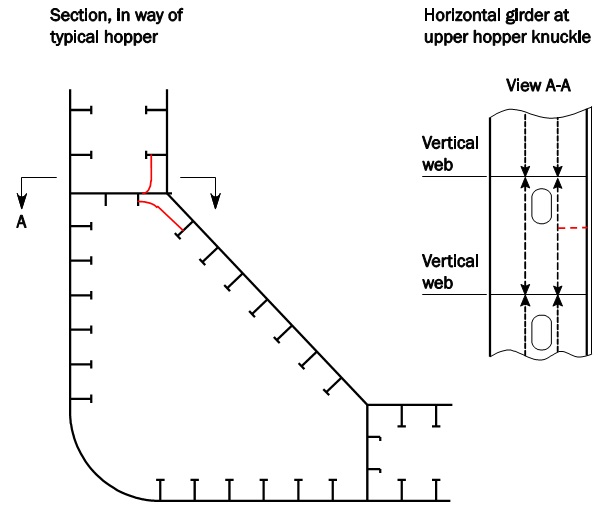
    **Figure 1 : Example of reinforcement at knuckles**
    - **a)** Knuckles are in general to be stiffened to achieve out-of-plane stiffness by fitting ordinary stiffeners or equivalent means in line with the knuckle.
    - **b)** Whenever a knuckle in a main member (shell, longitudinal bulkhead etc) is arranged, stiffening in the form of webs, brackets or profiles is to be connected to the members to which they are to transfer the load (in shear). See example of reinforcement at upper hopper knuckle in **Figure 1**.
    - **c)** For longitudinal shallow knuckles, closely spaced carlings are to be fitted across the knuckle, between longitudinal members above and below the knuckle. Carlings or other types of reinforcement need not be fitted in way of shallow knuckles that are not subject to high lateral loads and/or high in-plane loads across the knuckle, such as deck camber knuckles.
    - **d)** Generally, the distance between the knuckle and the support stiffening in line with the knuckle is not to be greater than 50 mm. Otherwise, fatigue analysis according to **Ch 9** is to be submitted by the designer.
  - **2.2.2** **Reinforcement in way of attachments for providing means of access permanently**
    Local reinforcement, considering location and strength, is to be provided in way of attachments to the hull structure when the means for access is provided permanently.
  - **2.2.3** **Reinforcement of deck structure in way of concentrated loads**
    The deck structure is to be reinforced in way of concentrated loads, such as anchor windlass, deck machinery, cranes, masts and derrick posts.
  - **2.2.4** **Reinforcement by insert plates**
    Insert plates are to be made of materials with, at least, the same specified minimum yield stress and the same grade as the plates to which they are welded. See also **[2.1.5]**.
- **2.3** **Connection of longitudinal members not contributing to the hull girder longitudinal strength**
  - **2.3.1** Where the hull girder stress at the strength deck and trunk deck or at the bottom as defined in **Ch 5, Sec 1, [2.1.2]** is higher than the permissible stress as defined in **Ch 5, Sec 1, [2.2.1]** for normal strength steel, longitudinal members not contributing to the hull girder longitudinal strength and welded to the strength deck or bottom plating and bilge strake, such as gutter bars, strengthening of deck openings, bilge keel, are to be made of steel with the same specified minimum yield stress as the strength deck or bottom structure steel.
  - **2.3.2** Non-continuous longitudinal stiffeners welded on the web of a primary structural member contributing to the hull girder longitudinal strength such as stringers and girders or on the inner bottom and trunk deck are to be made of steel with the same specified minimum yield stress as attached plate when the hull girder stress on those members is higher than the permissible stress as defined in **Ch 5, Sec 1, [2.2.1]** for normal strength steel.

#### 3. Stiffeners

- **3.1** **General**
  - **3.1.1** All types of stiffeners (excluding web stiffeners) are to be connected at their ends. However, in special cases such as isolated areas of the ship where end connections cannot be applied, sniped ends may be permitted. Requirements for the various types of connections (bracketed, bracketless or sniped ends) are given in **[3.2]** to **[3.4]**.
  - **3.1.2** Where the angle between the web plate of the stiffener and the attached plating is less than 50 deg, as shown on **Figure 2**, a tripping bracket is to be fitted. If the angle between the web plate of an unsymmetrical stiffener and the attached plating is less than 50 deg, the face plate of the stiffener is to be fitted on the side of the open angle.
    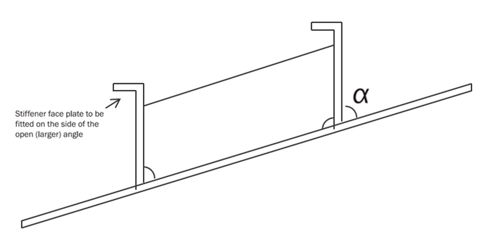
    **Figure : Stiffener on attached plating with an angle less than 50°**
- **3.2** **Bracketed end connections of non-continuous stiffeners**
  - **3.2.1** Where continuity of strength of longitudinal members is provided by brackets, the alignment of the brackets on each side of the primary supporting member is to be ensured, and the scantlings of the brackets are to be such that the combined stiffener/bracket section modulus and effective cross sectional area are not less than those of the member.
  - **3.2.2** At bracketed end connections, continuity of strength is to be maintained at the stiffener connection to the bracket and at the connection of the bracket to the supporting member.
  - **3.2.3** The arrangement of the connection between the stiffener and the bracket is to be such that at no point in the connection, is the section modulus to be less than that required for the stiffener.
  - **3.2.4** **Net web thickness**
    The net bracket web thickness, $t _{b}$, in mm, is to comply with the following:
    $t _{b} \geq (2 + f _{bkt} \sqrt {Z} ) \sqrt {\frac{R _{eH-stf}}{R _{eH-bkt}}}$ and need not be greater than 13.5 mm.
    where:
    $f _{bkt}$ : Coefficient taken as:
    • $f _{bkt}$ = 0.2 for brackets with flange or edge stiffener.
    • $f _{bkt}$ = 0.3 for brackets without flange or edge stiffener.
    *Z* : Net required section modulus, of the stiffener, in cm^3. In the case of two stiffeners connected, *Z* is the smallest net required section modulus of the two connected stiffeners.
    $R _{eH-stf}$ : Specified minimum yield stress of the stiffener material, in N/mm^2.
    $R _{eH-bkt}$ : Specified minimum yield stress of the bracket material, in N/mm^2.
  - **3.2.5** **Brackets at the ends of non-continuous stiffeners**
    Brackets at the ends of non-continuous stiffeners Brackets are to be fitted at the ends of non-continuous stiffeners, with arm lengths, $\ell _{bkt}$, in mm, taken as:
    $\ell _{bkt} = C _{bkt} \sqrt {\frac{Z}{t _{b}}}$
    $\ell _{bkt}$ is not to be taken less than:
    • $\ell _{bkt}$ = 1.8 $h _{stf}$ for connections where the end of the stiffener web is supported and the bracket is welded in line with the stiffener web or with offset necessary to enable welding, see item (c) in **Figure 3**.
    • $\ell _{bkt}$ = 2.0 $h_stf$ for other cases, see items (a), (b) and (d) in **Figure 3**.
    where:
    $C _{bkt}$ : Coefficient taken as:
    • $C _{bkt}$ = 65 for brackets with flange or edge stiffener.
    • $C _{bkt}$ = 70 for brackets without flange or edge stiffener.
    *Z* : Net required section modulus, for the stiffener, in cm^3, as defined in **[3.2.4]**.
    $t _{b}$ : Minimum net bracket thickness, in mm, as defined in **[3.2.4]**.
    For connections similar to item (b) in **Figure 3**, but not lapped, the bracket arm length is to comply with $\ell _{bkt} \geq h _{stf}$.
    For connections similar to items (c) and (d) in **Figure 3** where the smaller stiffener is connected to a primary supporting member or bulkhead, the bracket arm length is not to be less than two times of $h _{stf}$_.
  - **3.2.6** **Brackets with different arm lengths**
    The lengths of the arms, measured from the plating to the toe of the bracket, are to be such that the sum of them is greater than 2$\ell _{bkt}$ and each arm not to be less than 0.8$\ell _{bkt}$, where $\ell _{bkt}$ is as defined in **[3.2.5]**.
  - **3.2.7** **Edge stiffening of bracket**
    Where an edge stiffener is required, the web height of the edge stiffener, $h _{w}$, in mm, is not to be less than:
    $h _{w} = 45 \left( 1+ \frac{Z}{2000} \right)$ but not less than 50 mm.
    where:
    *Z* : Net section modulus, of the stiffener, in cm^3, as defined in **[3.2.4].**
    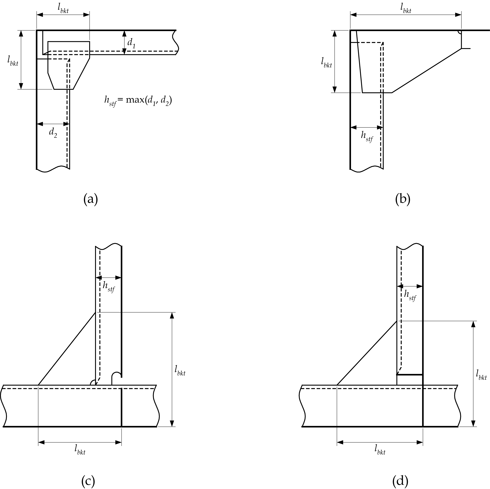
    **Figure : Bracket arm length of non-continuous stiffeners**
- **3.3** **Bracketless connections**
  - **3.3.1** The design of bracketless connections is to be such as to provide adequate resistance to rotation and displacement of the connection.
- **3.4** **Sniped ends**
  - **3.4.1** Sniped ends may be used where dynamic loads are small, provided the net thickness of plating supported by the stiffener, *t_p*, in mm, is not less than:
    $t _{p} = c _{1} \sqrt {(1000 l - \frac{s}{2} ) \frac{sPk}{10 ^{6}}}$
    where:
    *P* : Design pressure for the stiffener for the design load set being considered (including pressure
    by IGC code, *P_IGC* in case of cargo tank support structures), in kN/m^2.
    $c _{1}$ : Coefficient for the design load set being considered, to be taken as:
    • $c _{1}$ = 1.2 for acceptance criteria set AC-S.
    • $c _{1}$ = 1.1 for acceptance criteria set AC-SD, AC-T and AC-A.
    In general, sniped stiffeners are not to be used on structures at the following locations: (2023)
    • In the vincinity of engines and generators in the machinery space
    • Propeller impulse zone in the strern area
    • On the shell envelope under impact pressure
    • in way of temporary side opening structure in double side for cargo containement installation and maintenance purpose.
  - **3.4.2** Bracket toes and sniped stiffeners ends are to be terminated close to the adjacent member. The distance is not to exceed 40 mm unless the bracket or member is supported by another member on the opposite side of the plating. Tapering of the sniped end is not to be more than 30 deg. The depth of toe or sniped end is, generally, not to exceed the thickness of the bracket toe or sniped end member, but need not be less than 15 mm.

#### 4. Primary support members

- **4.1** **General**
  - **4.1.1** Primary supporting members web stiffeners, tripping brackets and end brackets are to comply with **[4.2]** to **[4.4]**. Where the structural arrangement is such that these requirements cannot be complied with, adequate alternative arrangement has to be demonstrated by the designer.
- **4.2** **Web stiffening arrangement**
  - **4.2.1** Primary supporting members web stiffeners are to be arranged in such a way that they ensure adequate strength.
- **4.3** **Tripping bracket arrangement**
  - **4.3.1** Tripping brackets (see **Figure 4**) are generally to be fitted:
    - **a)** At positions along the member span with an interval of spacing such that it satisfied the criteria of **Ch 8, Sec 2, [5.1]** without exceeding 4 m.
    - **b)** At the toe of end brackets.
    - **c)** At ends of continuous curved face plates.
    - **d)** In way of concentrated loads.
    - **e)** Near the change of section.
  - **4.3.2** Where the width of the symmetrical face plate is greater than 400 mm, backing brackets are to be fitted in way of the tripping brackets.
  - **4.3.3** Where the face plate of the primary supporting member exceeds 180 mm on either side of the web, a tripping bracket is to support the face plate.
  - **4.3.4** **Arm length**
    The arm length of tripping brackets is not to be less than the greater of the following values, in m:
    where:
    $b$ : Height, in m, of tripping brackets, shown in **Figure 4**.
    $s _{t}$ : Spacing, in m, of tripping brackets.
    *t* : Net thickness, in mm, of tripping brackets.
    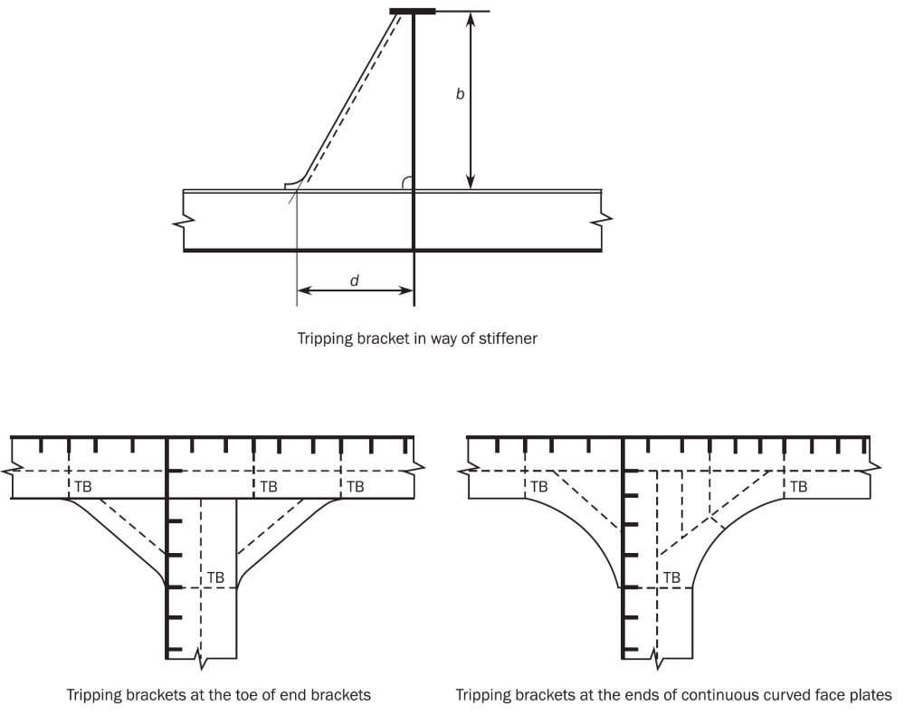
    **Figure : Primary supporting member: Tripping bracket arrangement**
    - **a)** $d = 0.38 b$
    - **b)** $d = 0.85b \sqrt {\frac{s _{t}}{t}}$
- **4.4** **End connections**
  - **4.4.1** **General**
    Brackets or equivalent structure are to be provided at ends of primary supporting members. End brackets are generally to be soft-toed. Bracketless connections may be applied provided that there is adequate support of adjoining face plates.
  - **4.4.2** **Scantling of end brackets**
    In general, the arm length of brackets connecting PSMs, as shown in **Figure 5**, is not to be less than the web depth of the member and need not be taken greater than 1.5 times this web depth. The bracket thickness is, in general, not to be less than that of the adjoining PSM web plate.
    The scantling of the end brackets is to be such that the section modulus of the primary supporting member with end bracket, excluding face plate where it is sniped, is not less than that of the primary supporting member at mid-span. The net cross-sectional area $A _{f}$, in cm^2, of the bracket face plates is to be such that:
    $A _{f} = \ell _{b} t _{b}$
    where:
    $\ell _{b}$ : Length of the bracket edge, in m, see **Figure 5**. For curved brackets, the length of the bracket edge may be taken as the length of the tangent at the midpoint of the edge.
    $t _{b}$ : Minimum net bracket web thickness, in mm, as defined in **[3.2.4]**.
    Moreover, the net thickness of the face plate is to be not less than that of the bracket web.
    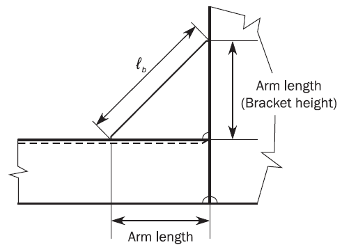
    **Figure : Dimension of brackets**
  - **4.4.3** **Arrangement of end brackets**
    Where the length of free edge of bracket, $\ell _{b}$, is greater than 1.5 m, the web of the bracket is to be stiffened as follows:
    For a ring system where the end bracket is integral with the webs of the members and the face plate is carried continuously along the edges of the members and the bracket, the full area of the largest face plate is to be maintained close to the mid-point of the bracket and gradually tapered to the smaller face plates. Butts in face plates are to be kept well clear of the bracket toes. Where a wide face plate abuts a narrower one, the taper is not to be greater than 1 to 4.
    The toes of brackets are not to land on unstiffened plating. The toe height is not to be greater than the thickness of the bracket toe, but need not be less than 15 mm. In general, the end brackets of primary supporting members are to be soft-toed. Where primary supporting members are constructed of higher strength steel, particular attention is to be paid to the design of the end bracket toes in order to minimise stress concentrations. Where a face plate is welded onto the edge or welded adjacent to the edge of the end bracket (see **Figure 6**), the face plate is to be sniped and tapered at an angle not greater than 30°.
    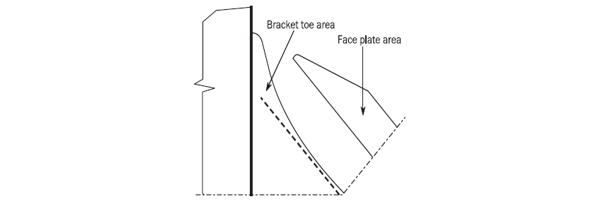
    The details shown in this figure are only used to illustrate items described in the text and are not intended to represent design guidance or recommendations.**Figure : Bracket face plate adjacent to the edge**
    - **a)** The net sectional area, in cm^2, of web stiffeners is to be not less than 16.5$\ell$, where $\ell$ is the span, in m, of the stiffener.
    - **b)** Tripping flat bars are to be fitted. Where the width of the symmetrical face plate is greater than 400 mm, additional backing brackets are to be fitted.

#### 5. Intersection of stiffeners and primary supporting members

- **5.1** **Cut-outs**
  - **5.1.1** Cut-outs for the passage of stiffeners through the web of primary supporting members, and the related collaring arrangements, are to be designed to minimise stress concentrations around the perimeter of the opening and on the attached web stiffeners.
  - **5.1.2** The total depth of cut-outs without collar plate is to be not greater than 50% of the depth of the primary supporting member.
  - **5.1.3** Cut-outs in high stress areas are to be fitted with full collar plates, see **Figure 7**.
    $R \geq 0.2b$ but not less than 25 mm.
    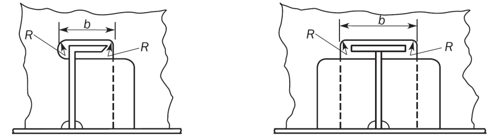
    **Figure : Full collar plates**
  - **5.1.4** Lug type collar plates are to be fitted in cut-outs where required for compliance with the requirements of **[5.2]**, and in areas of high stress concentrations, e.g. in way of primary supporting member toes. See **Figure 8** for typical lug arrangements.
  - **5.1.5** At connection to shell envelope longitudinals below the scantling draught, $T _{SC}$ and at connection to inner
    bottom longitudinals, a soft heel is to be provided in way of the heel of the primary supporting member web stiffeners when the calculated direct stress, $\sigma _{w}$, in the primary supporting member web stiffener according to **[5.2]** exceeds 80% of the permissible values. The soft heel is to have a keyhole, similar to that shown in item (c) in **Figure 9**.
    This is not applicable for design pressure defined in **Ch 4, Sec 5, [3.2]** and **[3.3]**.
  - **5.1.6** Cut-outs are to have rounded corners and the corner radii, R, are to be as large as practicable, with a minimum of 20% of the breadth, b, of the cut-out or 25 mm, whichever is greater. The corner radii, R, does not need to be greater than 50 mm, see **Figure 7**. Consideration is to be given to other shapes on the basis of maintaining equivalent strength and minimising stress concentration.
    Note 1: Except where specific dimensions are noted for the details of the keyhole in way of the soft heel, the details shown in this figure are only used to illustrate symbols and definitions and are not intended to represent design guidance or recommendations.
    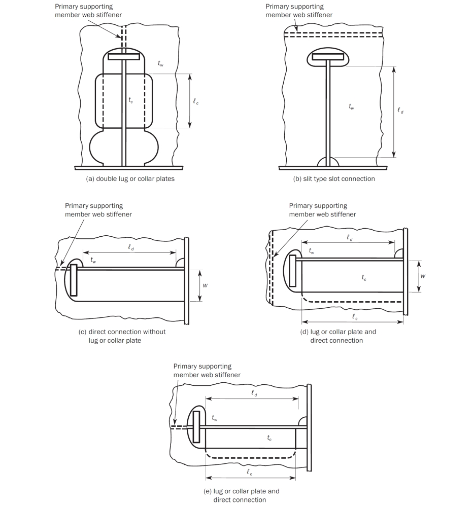
    The details shown in this figure are only used to illustrate symbols and definitions and are not intended to represent design guidance.**Figure : Symmetric and asymmetric cut-outs**
    *t_ws*, *t_ws1*, *t_ws2* : Net thickness of the primary supporting member web stiffener/backing bracket, in mm.
    *d_w*, *d_w1*, *d_w2* : Minimum depth of the primary supporting member web stiffener/backing bracket, in mm.
    *d_wc*, *d_wc1*, *d_wc2* : Length of connection between the primary supporting member web stiffener/backing bracket and the stiffener, in mm.
    *t_f* : Net thickness of the flange in mm. For bulb profile, *t_f* is to be obtained as defined in **Ch.3 Sec.7 [1.4.1]**.
- **5.2** **Connection of stiffeners to PSM**
  - **5.2.1** **General**
    For connection of stiffeners to PSM in case of lateral pressure, **[5.2.2]** and **[5.2.3]** are to be applied.
    The cross sectional areas of the connections are to be determined from the proportion of load transmitted through each component in association with its appropriate permissible stress.
  - **5.2.2** The load, $W _{1}$, in kN, transmitted through the shear connection is to be taken as follows.
    $W _{1} =W \left( \alpha _{a} + \frac{A _{1}}{4f _{c} A _{w} +A _{1}} \right)$
    $W _{1} =W$
    where:
    $W$ : Total load, in kN, transmitted through the stiffener connection to the PSM taken equal to:
    $W= \frac{P _{1} s _{1} \left( S _{1} - \frac{{}_{S _{1}}}{2000} \right) +P _{2} s _{2 } \left( S _{2} - \frac{{}_{S _{2}}}{2000} \right)}{2\sin \phi _{w1} \sin \phi _{w2}} 10 ^{-3}$
    $P _{1} , P _{2}$ : Design pressure applied on the stiffener for the design load set being considered (including pressure by IGC code, $P _{IGC}$ in case of cargo tank support structures), in kN/m^2, on each side of the considered connection. For bottom slamming or bow impact loads, *P_1* and *P_2* are the design pressure as defined in **Ch 4, Sec 5, [3.2]** and **[3.3]** respectively. For bottom slamming, applied pressures need not exceed 70% of the design pressure. (2023)
    $S _{1} , S _{2}$ : Spacing between the considered and the adjacent PSM on each side of the considered connection, in m.
    $s _{1} , s _{2}$ : Spacing of the stiffener, in mm, on each side of the considered connection.
    $\alpha _{a}$ : Panel aspect ratio, not to be taken greater than 0.25.
    $\alpha _{a} = \frac{s}{1000　S}$
    $S= \frac{S _{1} +S _{2}}{2}$
    $s= \frac{s _{1} +s _{2}}{2}$
    $\phi _{w1}$ : Angle between primary supporting member and attached plating, in deg, as defined in **Ch 3, Sec 7**, Symbols and **Ch 10, Sec 1, Figure 5**.
    $\phi _{w2}$ : Angle between stiffener and attached plating, in deg, as defined in **Ch 3, Sec 7**, Symbols and **Ch 3, Sec 7, Figure 12**.
    $A _{1}$ : Effective net shear area, in cm^2, of the connection, to be taken equal to:
    $A _{1} =A _{1d} +A _{1c}$
    In case of a slit type slot connections area, $A _{1}$, is given by:
    $A _{1} =2A _{1d}$
    In case of a typical double lug or collar plate connection area, $A _{1}$, is given by:
    $A _{1} =2A _{1c}$
    $A _{1d}$ : Net shear connection area, in cm^2, excluding lug or collar plate, as given by:
    $A _{1d} = \ell _{d} t _{w} 10 ^{-2}$
    $\ell _{d}$ : Length of direct connection between stiffener and PSM web, in mm.
    $t _{w}$ : Net web thickness of the primary supporting member, in mm.
    $A _{1c}$ : Net shear connection area, in cm^2, with lug or collar plate, given by:
    $A _{1c} =f _{1} \ell _{c} t _{c} 10 ^{-2}$
    $\ell _{c}$ : Length of connection between lug or collar plate and PSM, in mm.
    $t _{c}$ : Net thickness of lug or collar plate, not to be taken greater than the net thickness of the adjacent PSM web, in mm.
    $f _{1}$ : Shear stiffness coefficient, taken as:
    $f _{1} =1.0$, for stiffeners of symmetrical cross section.
    $f _{1} =140/w$, not to be taken greater than 1.0, for stiffeners of asymmetrical cross section.
    $w$ : Width of the cut-out for an asymmetrical stiffener, measured from the cut-out side of the stiffener web, in mm, as indicated in **Figure 8**.
    $A _{w}$ : Effective net cross sectional area, in cm^2, of the PSM web stiffener in way of the connection including backing bracket where fitted, as shown in **Figure 9**. If the PSM web stiffener incorporates a soft heel ending or soft heel and soft toe ending, Aw is to be measured at the throat of the connection, as shown in **Figure 9**.
    $f _{c}$ : Collar load factor taken equal to:
    For intersecting stiffeners of symmetrical cross section:
    $f _{c} =1.85$ for $A _{w} \leq 14$
    $f _{c} =1.85-0.0441(A _{w} -14)$ for $14\(f _{c} =1.1-0.013(A _{w} -31)$ for $31\(f _{c} =0.75$ for $A _{w} >58$
    For intersecting stiffeners of asymmetrical cross section:
    $f _{c} =0.68+0.0172 \frac{\ell _{s}}{A _{w}}$
    $\ell _{s}$ : Connection length equal to:
    For a single lug or collar plate connection to the PSM:
    $\ell _{s} =l _{c}$
    For a single sided direct connection to the PSM:
    $\ell _{s} =l _{d}$
    In the case of a lug or collar plus a direct connection:
    $\ell _{s} =0.5(l _{c} +l _{d} )$
    - **a)** If the web stiffener is connected to the intersecting stiffener:
    - **b)** If the web stiffener is not connected to the intersecting stiffener:
  - **5.2.3** The load, $W _{2}$, in kN, transmitted through the PSM web stiffener is to be taken as:
    • If the web stiffener is connected to the intersecting stiffener:
    $W _{2} =W \left( 1- \alpha _{a} - \frac{A _{1}}{4f _{c} A _{w} +A _{1}} \right)$
    • If the web stiffener is not connected to the intersecting stiffener:
    $W _{2} =0$
    The values of $A _{w}$, $A _{wc}$ and $A _{1}$ are to be such that the calculated stresses satisfy the following criteria:
    • For the connection to the PSM web stiffener not in way of the weld : $\sigma _{w} \leq \sigma _{perm}$
    • For the connection to the PSM web stiffener in way of the weld : $\sigma _{wc} \leq \sigma _{perm}$
    • For the shear connection to the PSM web : $\tau _{w} \leq \tau _{perm}$
    where:
    $W$ : Load, in kN, as defined in **[5.2.2]**.
    $f _{c}$ : Collar load factor as defined in **[5.2.2]**.
    $\alpha _{a}$ : Panel aspect ratio, as defined in **[5.2.2]**.
    $A _{1}$ : Effective net shear area, in cm^2, as defined in **[5.2.2]**.
    $A _{w}$ : Effective net cross sectional area, in cm^2, as defined in **[5.2.2]**.
    $\sigma _{w}$ : Direct stress, in N/mm^2, in the PSM web stiffener at the minimum bracket area away from the weld connection:
    $\sigma _{w} = \frac{10W _{2}}{A _{w}}$
    $\sigma _{wc}$ : Direct stress, in N/mm^2, in the PSM web stiffener in way of the weld connection:
    $\sigma _{wc} = \frac{10W _{2}}{A _{wc}}$
    $\tau _{w}$ : Shear stress, in N/mm^2, in the shear connection to the PSM web:
    $\tau _{w} = \frac{10W _{1}}{A _{1}}$
    $A _{wc}$ : Effective net area, in cm^2, of the PSM web stiffener in way of the weld as shown in **Figure9**.
    $\sigma _{perm}$ : Permissible direct stress given in **Table 1** for AC-S, AC-SD, AC-T and AC-A, in N/mm^2.
    $\tau _{perm}$ : Permissible shear stress given in **Table 1** for AC-S, AC-SD, AC-T and AC-A in N/mm^2.

    | Item | Direct stress, $\sigma _{perm}$, in N/mm^2 |   |   | shear stress, $\tau _{perm}$, in N/mm^2 |   |   |
    | --- | --- | --- | --- | --- | --- | --- |
    | Item | Acceptance criteria set |   |   | Acceptance criteria set |   |   |
    | Item | AC-S | AC-SD | AC-I AC-T AC-A | AC-S | AC-SD | AC-I AC-T AC-A |
    | PSM web stiffener | $0.83R _{eH}^{} ^{(2)}$ | $R _{eH}$ | $R _{eH}$ | - | - | - |
    | PSM web stiffener to intersecting stiffener in way of weld connection: • Double continuous fillet • Partial penetration weld | $0.58R _{eH } ^{(2)}$ $0.83R _{eH} ^{(1)(2)}$ | $0.70R _{eH } ^{(2)}$ $R _{eH} ^{(1)}$ | $R _{eH}$ $R _{eH}$ | - - | - - | - - |
    | PSM stiffener to intersecting stiffener in way of lapped welding | $0.50R _{eH}$ | $0.60R _{eH}$ | $R _{eH}$ | - | - | - |
    | Shear connection including lugs or collar plates: • Single sided connection • Double sided connection | - - | - - | - - | $0.71 \tau _{eH}$ $0.83 \tau _{eH}$ | $0.85 \tau _{eH}$ $\tau _{eH}$ | $\tau _{eH}$ $\tau _{eH}$ |
    | (1) The root face is not to be greater than one third of the gross thickness of the PSM stiffener. (2) Permissible stresses may be increased by 5 percent where a soft heel is provided in way of the heel of the PSM web stiffener. |   |   |   |   |   |   |
  - **5.2.4** Where a backing bracket is fitted in addition to the PSM web stiffener, it is to be aligned with the web stiffener. The arm length of the backing bracket is not to be less than the depth of the web stiffener. The net cross sectional area through the throat of the bracket is to be included in the calculation of $A _{w}$ as shown in **Figure 9**.
  - **5.2.5** Lapped connections of PSM web stiffeners or tripping brackets to stiffeners are not permitted in the cargo hold region.
  - **5.2.6** Where built-up stiffeners have their face plate welded to the side of the web, a symmetrical arrangement of connection to the PSM is to be fitted. This may be achieved by fitting backing brackets on the opposite side of the PSM or bulkhead. In way of the cargo hold region, the PSM web stiffener and backing brackets are to be butt welded to the intersecting stiffener web.
  - **5.2.7** Where the web stiffener of the PSM is parallel to the web of the intersecting stiffener, but not connected to it, the offset PSM web stiffener is to be located in close proximity to the slot edge as shown in **Figure 10**. The ends of the offset web stiffeners are to be suitably tapered and softened. Locations where the web stiffener of the PSM are not connected to the intersecting stiffeners as well as the detail arrangements are to be specially considered on the basis of their ability to transmit load with equivalent effectiveness to that of **[5.2.2]** through **[5.2.6]**. Details of calculations made and/or testing procedures and results are to be submitted.
  - **5.2.8** The size of the fillet welds is to be calculated according to **Ch 12, Sec 3, [2.5]** based on the weld factors given in **Table 2**. For the welding in way of the shear connection the size is not to be less than that required for the PSM web plate for the location under consideration.

    | Item | Weld factor |
    | --- | --- |
    | PSM stiffener to intersecting stiffener | $0.6 \sigma _{wc} / \sigma _{perm}$ |
    | Shear connection inclusive of lug or collar plate, including the web stiffener of the PSM is not connected to the intersection stiffener | $0.6 \tau _{w} / \tau _{perm}$ |
    | Note $\tau _{w}$ : Shear stress, in N/mm^2, as defined in **[5.2.3]**. $\sigma _{wc}$ : Stress, in N/mm^2, as defined in **[5.2.3]**. $\tau _{perm}$ : Permissible shear stress, in N/mm^2, see **Table 1**. $\sigma _{perm}$ : Permissible direct stress, in N/mm^2, see **Table 1**. $W$ : Load, in kN, as defined in **[5.2.2]**. $A _{1}$ : Effective net shear area, in cm^2, as defined in **[5.2.2]**. $A _{w}$ : Effective net cross sectional area, in cm^2, as defined in **[5.2.2]**. |   |

    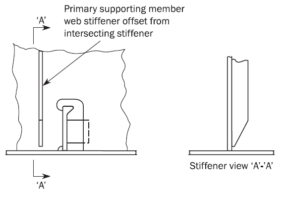
    **Figure : Offset PSM web stiffeners**

#### 6. Openings

- **6.1** **Openings and scallops in stiffeners**
  - **6.1.1** **Figure 11** shows examples of air holes, drain holes and scallops. In general, the ratio of *a*/*b*, as defined in **Figure 11**, is to be between 0.5 and 1.0. In fatigue sensitive areas further consideration may be required with respect to the details and arrangements of openings and scallops.
    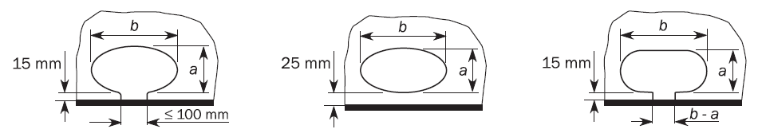
    The details shown in this figure are for guidance and illustration only.**Figure : Examples of air holes, drain holes and scallops**
  - **6.1.2** Openings and scallops are to be kept at least 200 mm clear of the toes of end brackets, end connections and other areas of high stress concentration, measured along the length of the stiffener toward the mid-span and 50 mm measured along the length in the opposite direction, see **Figure 12**. In areas where the shear stress is less than 60% of the permissible stress, alternative arrangements may be accepted.
    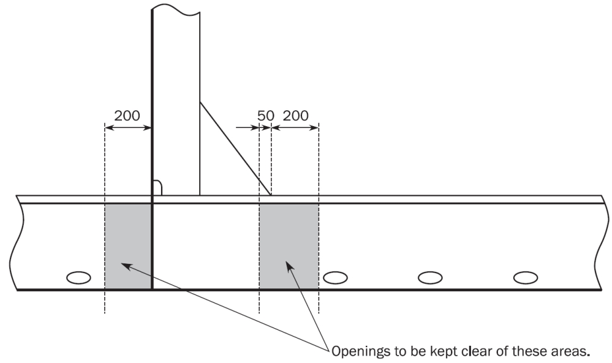
    **Figure : Location of air and drain holes**
  - **6.1.3** Closely spaced scallops or drain holes, i.e. where the distance between scallops/drain holes is less than twice the width b as shown in **Figure 11**, are not permitted in stiffeners contributing to the longitudinal strength. For other stiffeners, closely spaced scallops/drain holes are not permitted within 20% of the stiffener span measured from the end of the stiffener. Widely spaced air or drain holes may be permitted provided that they are of elliptical shape or equivalent to minimise stress concentration and are cut clear of the welds.
- **6.2** **Openings in primary supporting members**
  - **6.2.1** **General**
    Manholes, lightening holes and other similar openings are to be avoided in way of concentrated loads and areas of high shear. In particular, manholes and similar openings are to be avoided in high stress areas unless the stresses in the plating and the panel buckling characteristics have been calculated and found satisfactory.
    Examples of high stress areas include:
    Where openings are arranged, the shape of openings is to be such that the stress concentration remains within acceptable limits. Openings are to be well rounded with smooth edges.
    - **a)** Vertical or horizontal diaphragm plates in narrow cofferdams/double plate bulkheads within one-sixth of their length from either end.
    - **b)** Floors or double bottom girders close to their span ends.
    - **c)** Primary supporting member webs in way of end bracket toes.
    - **d)** Above the heads and below the heels of pillars.
  - **6.2.2** **Manholes and lightening holes**
    Web openings as indicated below do not require reinforcement
    • In single skin sections, having depth not exceeding 25% of the web depth and located so that the edges are not less than 40% of the web depth from the face plate.
    • In double skin sections, having depth not exceeding 50% of the web depth and located so that the edges are well clear of cut outs for the passage of stiffeners.
    The length of openings is not to be greater than:
    • At the mid-span of primary supporting members: the distance between adjacent openings.
    • At the ends of the span: 25% of the distance between adjacent openings.
    For openings cut in single skin sections, the length of opening is not to be greater than the web depth or 60% of the stiffener spacing, whichever is greater. The ends of the openings are to be equidistant from the cut outs for stiffeners. Where lightening holes are cut in the brackets, the distance from the circumference of the hole to the free flange of brackets is not to be less than the diameter of the lightening hole. Openings not complying with this requirement are to be reinforced according to **[6.2.3]**.
  - **6.2.3** **Reinforcements around openings**
    Manholes and lightening holes are to be stiffened according to this requirement, except where alternative arrangements are demonstrated as satisfactory, in accordance with the analysis methods described in **Ch7**.
    On members contributing to longitudinal strength, stiffeners are to be fitted along the free edges of the openings parallel to the vertical and horizontal axis of the opening. Stiffeners may be omitted in one direction if the shortest axis is less than 400 mm and in both directions if length of both axes is less than 300 mm. Edge reinforcement may be used as an alternative to stiffeners, see **Figure 13**.
    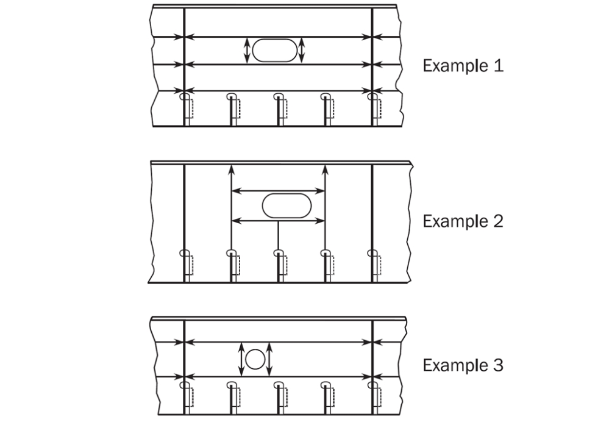
    **Figure : Web plate with openings**
- **6.3** **Openings in the strength deck**
  - **6.3.1** **General**
    Openings in the strength deck are to be kept to a minimum and spaced as far as practicable from one another and from the ends of superstructures. Openings are to be located as far as practicable from high stress regions such as side shell platings, hatchway corners.
  - **6.3.2** **Small opening location**
    Openings are generally to be located outside the limits as shown in **Figure 14** in dashed area, defined by:
    where:
    $b$ : Width, in m, of the hatchway considered, measured in the transverse direction, see **Figure 14**.
    $\ell$ : Width, in m, in way of the corner considered, of the cross deck strip between two consecutive hatchways, measured in the longitudinal direction, see **Figure 14**.
    Transverse distance between the above limits and openings or between hatchways and openings as shown in **Figure 14** is not to be less than:
    • $g _{2} =2a _{2}$ for circular openings.
    • $g _{1} =a _{1}$ for elliptical openings.
    Transverse distance between openings as shown in **Figure 15** is not to be less than:
    • $2(a _{1} +a _{2} )$ for circular openings.
    • $1.5(a _{1} +a _{2} )$ for elliptical openings.
    where:
    $a _{1}$ : Transverse dimension of elliptical openings, or diameter of circular openings.
    $a _{2}$ : Transverse dimension of elliptical openings, or diameter of circular openings.
    $a _{3}$ : Longitudinal dimension of elliptical openings, or diameter of circular openings.
    Longitudinal distance between openings is not to be less than:
    • $(a _{1} +a _{3} )$ for circular openings.
    • $0.75(a _{1} +a _{3} )$ for elliptical openings and for an elliptical opening in line with a circular one.
    If the opening arrangements do not comply with these requirements, the hull girder longitudinal strength assessment is to be carried out by subtracting such opening areas, see **Ch 5, Sec 1, [1.2.9]**.
    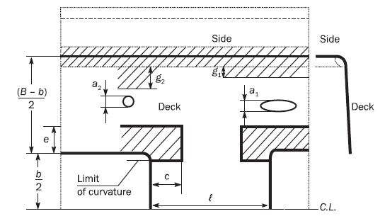
    **Figure : Position of openings in strength deck**
    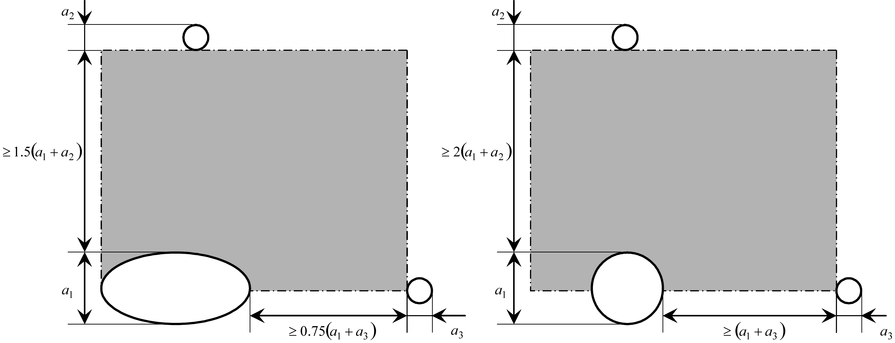
    **Figure : Elliptical and circular openings in strength deck**
    - **a)** The bent area of a rounded sheer strake, if any, or the side shell.
    - **b)** $e=0.25(B-b)$ from the edge of opening.
    - **c)** $c=0.074 \ell +0.1b$ or $0.25b$, whichever is greater.

#### 7. Double bottom structure

- **7.1** **General**
  - **7.1.1** **Framing system**
    The bottom shell and the inner bottom are to be longitudinally framed within the cargo hold region. Where it is not practicable to apply the longitudinal framing system to fore and aft parts of the cargo hold region due to the hull form, transverse framing may be accepted on a case-by-case basis subject to appropriate brackets and other arrangements being incorporated to provide structural continuity in way of changes to the framing system.
  - **7.1.2** **Variation in height of double bottom**
    Any variation in the height of the double bottom is to be made gradually and over an adequate length; the knuckles of inner bottom plating are to be located in way of plate floors. Where such arrangement is not possible, suitable longitudinal structures such as partial girders, longitudinal brackets, fitted across the knuckle are to be arranged.
  - **7.1.3** **Drainage of tank top**
    Where wells are provided for the drainage, such wells are not to extend for more than one-half height of the double bottom. In no case the vertical distance from the bottom of such wells to a plane coinciding with the keel line be less than 500 mm.
  - **7.1.4** **Duct keel**
    Where a duct keel is arranged, the centre girder may be replaced by two girders spaced, no more than 3 m apart. Otherwise, for a spacing wider than 3 m, the two girders are to be provided with support of adjacent structure and subject to the Society’s approval. The structures in way of the floors are to provide sufficient continuity of the latter.
- **7.2** **Keel plate**
  - **7.2.1** Keel plating is to extend over the flat of bottom for the full length of the ship. The width of the keel, in m, is not to be less than 0.8 $+$ *L*#eqnID-342200_s0, without being taken greater than 2.3 m.
- **7.3** **Girders**
  - **7.3.1** **Centre girder**
    When fitted, the centre girder is to extend within the cargo hold region and is to extend forward and aft as far as practicable. Structural continuity of the centre girder is to be maintained within the full length of the ship.
    Where double bottom compartments are used for the carriage of fresh water or ballast water, the centre girder is to be watertight, except for the case such as narrow tanks at the end parts or when other watertight girders are provided within 0.25 *B* from the centreline.
  - **7.3.2** **Side girders**
    The side girders are to extend within the parallel part of the cargo hold region and are to extend forward and aft of the cargo hold region as far as practicable.
- **7.4** **Floors**
  - **7.4.1** **Web stiffeners**
    Floors are to be provided with web stiffeners in way of longitudinal ordinary stiffeners. Where the web stiffeners are not welded to the longitudinal stiffeners, design standard as given in **Ch 9, Sec 6, [2]** applies unless fatigue strength assessment for the cut out and connection of longitudinal stiffener is carried out.
- **7.5** **Bilge keel**
  - **7.5.1** **Material**
    The material of the bilge keel and ground bar is to be of the same yield stress as the material to which they are attached. In addition, when the bilge keel extends over a length more than 0.15 *L*, the material of the bilge keel and ground bar is to be of the same grade as the material to which they are attached.
  - **7.5.2** **Design**
    The design of single web bilge keels is to be such that failure to the web occurs before failure of the ground bar. This may be achieved by ensuring the web thickness of the bilge keel does not exceed that of the ground bar. Bilge keels of a different design, from that shown in **Figure 16**, are to be specially considered by the Society.
  - **7.5.3** **Ground bars**
    Bilge keels are not to be welded directly to the shell plating. A ground bar, or doubler, is to be fitted on the shell plating as shown in **Figure 16** and **Figure 17**. In general, the ground bar is to be continuous. The gross thickness of the ground bar is not to be less than the gross thickness of the bilge strake or 14 mm, whichever is the lesser.
  - **7.5.4** **End details**
    The ground bar and bilge keel ends are to be tapered or rounded. Tapering is to be gradual with a minimum ratio of 3:1, see items (a), (b), (d) and (e) in **Figure 17/Figure 18**. Rounded ends are to be as shown in item (c) of **Figure 17**. Cut-outs on the bilge keel web, within zone ‘A’ (see items (b) and (e) of **Figure 17/Figure 18**) are not permitted. The end of the bilge keel web is to be not less than 50 mm and not greater than 100 mm from the end of the ground bar, see items (a) and (d) of **Figure 19/Figure 20**). Ends of the bilge keel and ground bar are to be supported by either transverse or longitudinal members inside the hull, as indicated as follows:
    Alternative end arrangements may be accepted, provided that they are considered equivalent.
    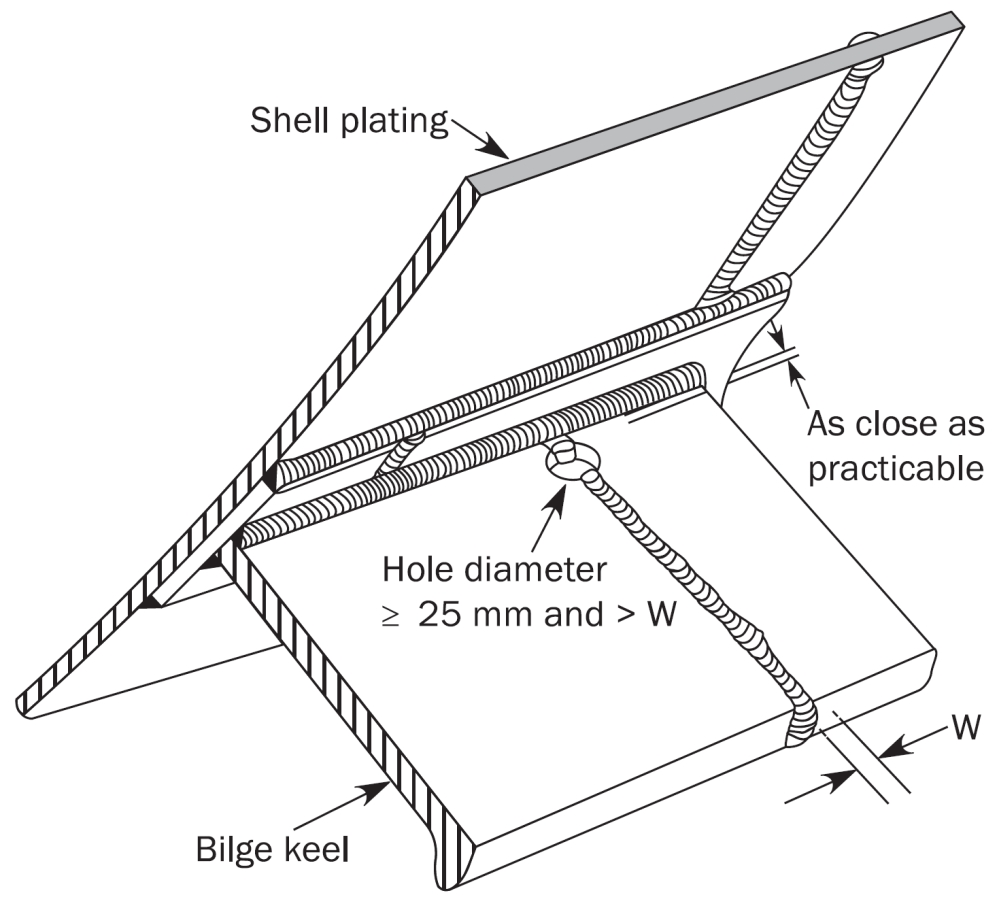
    **Figure : Bilge keel construction**
    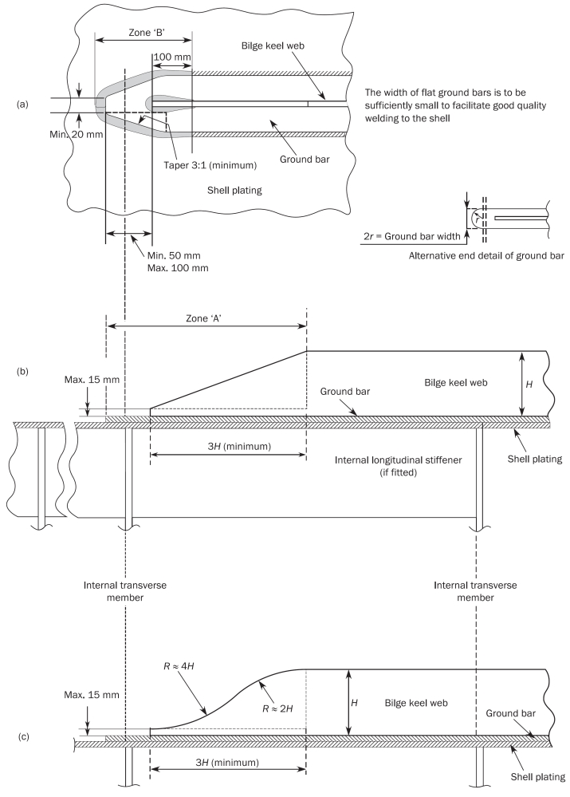
    **Figure : Bilge keel end design**
    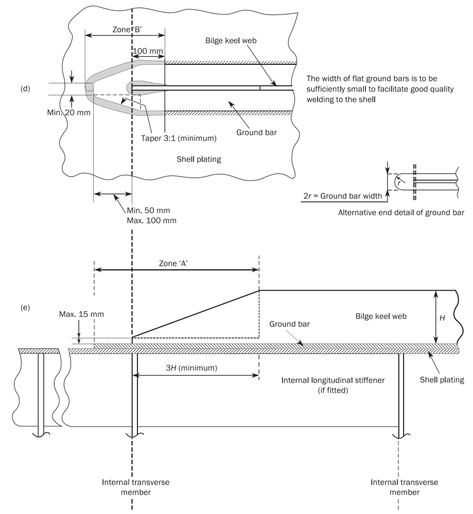
    **Figure : Bilge keel end design (continued)**
    - **a)** Transverse support member is to be fitted at mid length between the end of the bilge keel web and the end of the ground bar, see items (a), (b) and (c) of **Figure 17**.
    - **b)** Longitudinal stiffener is to be fitted in line with the bilge keel web, it is to extend to at least the nearest transverse member forward and aft of zone ’A’ (see items (b) and (e) of **Figure 17/Figure 18**).
- **7.6** **Docking**
  - **7.6.1** **General**
    The dry docking arrangement itself is not covered in these Rules. The bottom structure is to withstand the forces imposed by dry docking the ship.
  - **7.6.2** **Docking brackets**
    Docking brackets connecting the centreline girder to the bottom plating, are to be connected to the adjacent bottom longitudinals.

#### 8. Double side structure

- **8.1** **General**
  - **8.1.1** Side shell and inner hull are generally to be longitudinally framed. Where the side shell is longitudinally framed, the inner hull are to be longitudinally framed.
- **8.2** **Structural arrangement**
  - **8.2.1** **Primary supporting members**
    Double side web frames are to be fitted in line with web frames in hopper tanks. In general, horizontal side stringers are to be fitted aft of the collision bulkhead, up to 0.2*L* aft of the fore end, in line with fore peak stringers.
  - **8.2.2** **Longitudinal stiffeners**
    The longitudinal stiffeners on side shell and inner hull, where fitted, are to be continuous within the length of the parallel part of the cargo hold region. They are to be effectively connected to the transverse web frames and bulkheads of the double side structure. Longitudinal framing of the side shell and inner longitudinal bulkhead is to extend outside the cargo hold region, as far forward as practicable.
  - **8.2.3** **Transverse stiffeners**
    The transverse stiffeners on side shell and inner hull, where fitted, are to be continuous or fitted with bracket end connections. At their upper and lower ends, the shell and inner hull transverse stiffeners are to be connected by brackets to the supporting stringer plates.
  - **8.2.4** **Sheer strake**
    Sheer strakes are to have breadths, in m, not less than 0.8 + *L*/200, measured vertically, but need not be greater than 1.8 m. The sheer strake may be either welded to the stringer plate or rounded. If the sheer strake is rounded, its radius, in mm, is to be not less than $17t _{s}$ , where $t _{s}$ is the net thickness, in mm, of the sheer strake.
    The upper edge of the welded sheer strake is to be rounded, smooth and free of notches. Fixtures, such as bulwarks and eye plates, are not to be directly welded on the upper edge of the sheer strake, except in fore and aft parts. Drainage openings with a smooth transition in the longitudinal direction may be permitted. Longitudinal seam welds of rounded sheer strake are to be located outside the bent area at a distance not less than 5 times the maximum net thickness of the sheer strake. The welding of deck fittings to rounded sheer strakes is to be avoided within 0.6 *L* amidships. The transition from a rounded sheer strake to an angled sheer strake associated with the arrangement of superstructures is to be designed to avoid any discontinuities.
  - **8.2.5** **Plating connection**
    Connection between the inner hull plating and the inner bottom plating is to be designed such that stress concentration is avoided. The connections of hopper tanks plating with inner hull and with inner bottom are to be supported by a primary supporting member.

#### 9. Deck structure

- **9.1** **Structural arrangement**
  - **9.1.1** **Framing system**
    Deck areas contributing to the longitudinal strength are to be longitudinally framed.
  - **9.1.2** **Stringer plate**
    Stringer plates are to have breadths not less than 0.8 + *L*/200 m, measured parallel to the deck, but need not be greater than 1.8 m. Rounded stringer plates, where adopted, are to comply with the requirements in **[8.2.4]**.
  - **9.1.3** **Connection of deckhouses and superstructures**
    Connection of deckhouses and superstructures to the strength deck are to be designed such that loads are transmitted into the under deck supporting structure.
- **9.2** **Deck scantlings**
  - **9.2.1** The web depth of deck stiffeners is not to be less than 60 mm. Unless the double deck structure, the web depth of PSMs is not to be less than 10% and 7% of the unsupported span in bending in tanks and in dry spaces, respectively, and is not to be less than 2.5 times the depth of the slots if the slots are not closed. Unsupported span in bending is the bending span as defined in **Ch 3, Sec 7** or in case of a grillage structure, the distance between connections to other PSMs.

#### 10. Bulkhead structure

- **10.1** **Application**

#### 10.1.1

The requirements of this article apply to longitudinal and transverse bulkheads.

- **10.2** **General**

#### 10.2.1

The web height of vertical PSMs on bulkheads may be gradually tapered from bottom to deck.

#### 10.2.2

Bulkheads are to be stiffened in way of deck girders.

#### 10.2.3

Where bulkheads are penetrated by ballast piping, the structural arrangements in way of the connection are to be adequate for the loads imparted to the bulkheads by the hydraulic forces in the pipes.

- **10.3** **Cargo hold bulkheads**

#### 10.3.1

**General**
Watertight transverse bulkheads are to be fitted in line with a double bottom floor.

#### 10.3.2

**Primary supporting members**
The vertical primary supporting members of the transverse bulkheads are to be fitted in line with bottom girders. Their flanges are to be in line with a double bottom floor. The strength of the connection between these members and the bottom structure is to be assessed.

- **10.4** **Plane bulkheads**

#### 10.4.1

**General**
Plane bulkheads may be horizontally or vertically stiffened. The horizontally framed bulkheads are made of horizontal stiffeners supported by vertical primary supporting members. The vertically framed bulkheads are made of vertical stiffeners supported by horizontal stringers, if needed.

#### 10.4.2

**End connection of stiffeners**
The crossing of stiffeners through a watertight bulkhead is to be watertight. End connections of stiffeners are to be bracketed. For isolated areas where bracketed end connections cannot be applied due to hull lines, other arrangements including sniped ends are acceptable. Sniped ends may be used for stiffeners on bulkheads subject to hydrostatic pressure, provided they comply with **[3.4]**.

- **10.5** **Watertight bulkheads of trunks and tunnels**

#### 10.5.1

Watertight bulkheads of trunks, tunnels, duct keels and ventilators are to be of the same strength as watertight bulkheads at corresponding levels. The means used for making them watertight, and the arrangements adopted for closing their openings, are to be to the satisfaction of the Society.

#### 11. Pillars

- **11.1** **General**

#### 11.1.1

Wherever possible, pillars are to be fitted in the same vertical line. If not possible, effective means are to be provided for transmitting the pillar loads to the supports below. Effective arrangements are to be made to distribute the loads at the heads and the heels of all the pillars. Where pillars support eccentric loads, they are to be strengthened to withstand the additional bending moment applied on them.

#### 11.1.2

Pillars are to be provided in line with the double bottom girders or as close thereto as practicable, and the structure above and below the pillars is to be of sufficient strength to provide effective distribution of the load.
Where pillars connected to the inner bottom are not located in way of the intersection of floors and girders, partial floors or girders, or equivalent structures, are to be fitted as necessary to support the pillars.

#### 11.1.3

Pillars provided in tanks are to be of solid or open section type. Where the hydrostatic pressure may result in tensile stresses in the pillar, the tensile stress in the pillar and its end connections is not to exceed 45% of the specified minimum yield stress of the material.

- **11.2** **Connections**

#### 11.2.1

Heads and heels of the pillars are to be secured by thick doubling plates and brackets, as necessary. Alternative arrangements for doubling plates may be accepted, provided they are considered equivalent, as deemed appropriate by the Society. Where the pillars are likely to be subjected to tensile loads, heads and heels of the pillars are to be efficiently secured to withstand the tensile loads and the doubling plates are to be replaced by insert plates. The net thickness of the doubling plates, when fitted, is to be not less than 1.5 times the net thickness of the pillar. Pillars are to be attached at their heads and heels by continuous welding.

### Section 16 - Structural Idealisation

**Symbols**
For symbols not defined in this section, refer to **Ch 1, Sec 4**.
$\varphi _{w}$ : Angle, in deg, between the stiffener or primary supporting member web and the attached plating, see **Figure 12** for stiffener and **Ch 10, Sec 1, Figure 5** for primary supporting member. $\varphi _{w}$ is to be taken equal to 90 deg if the angle is between 75 and 105 deg including 75 and 105 deg.
$\ell _{bdg}$ : Effective bending span, in m, as defined in **[1.1.2]** for stiffeners and **[1.1.5]** for primary supporting members.
$\ell _{shr}$ : Effective shear span, in m, as defined in **[1.1.3]** for stiffeners and **[1.1.6]** for primary supporting members.
$\ell$ : Full length of stiffener or of primary supporting member, in m, between their supports.
*s* : Stiffener spacing, in mm, as defined in **[1.2]**.
*S* : Primary supporting member spacing, in m, as defined in **[1.2]**.
*a* : Length, in mm, of EPP as defined in **[2.1.1]**.
*b* : Breadth, in mm, of EPP as defined in **[2.1.1]**.
$h _{stf}$ : Stiffener height, including the face plate, in mm.
$t _{p}$ : Net thickness of attached plate, in mm.
$t _{w}$ : Net web thickness, in mm. For bulb profiles, see **[1.4.1].**
$b _{f}$ : Breadth of flange, in mm, see **Ch 3, Sec 2, Figure 2**. For bulb profiles, see **[1.4.1]**.
$t _{f}$ : Net thickness of flange, in mm.
PSM : Primary Supporting Member.
EPP : Elementary Plate Panel.
LCP : Load Calculation Point.

#### 1. Structural idealisation of stiffeners and primary support members

- **1.1** **Effective spans**
  - **1.1.1** **General**
    Where arrangements differ from those defined in this article, span definition may be specially considered.
  - **1.1.2** **Effective bending span of stiffeners**
    The effective bending span $\ell _{bdg}$ of stiffeners is to be measured as shown in **Figure 1** for single skin structures and **Figure 2** for double skin structures. If the web stiffener is sniped at the end or not attached to the stiffener under consideration, the effective bending span is to be taken as the full length between PSMs unless a backing bracket is fitted, see **Figure 1**.
    The effective bending span may be reduced where brackets are fitted to the flange or free edge of the stiffener. Brackets fitted on the side opposite to that of the stiffener with respect to attached plating are not to be considered as effective in reducing the effective bending span.
    In single skin structures, the effective bending span of a stiffener supported by a bracket or by a web stiffener on one side only of the primary supporting member web, is to be taken as the total span between primary supporting members as shown in item (a) of **Figure 1**. If brackets are fitted on both sides of the primary supporting member, the effective bending span is to be taken as in items (b), (c) and (d) of **Figure 1**.
    Where the face plate of the stiffener is continuous along the edge of the bracket, the effective bending span is to be taken to the position where the depth of the bracket is equal to one quarter of the depth of the stiffener, see **Figure 3**.
    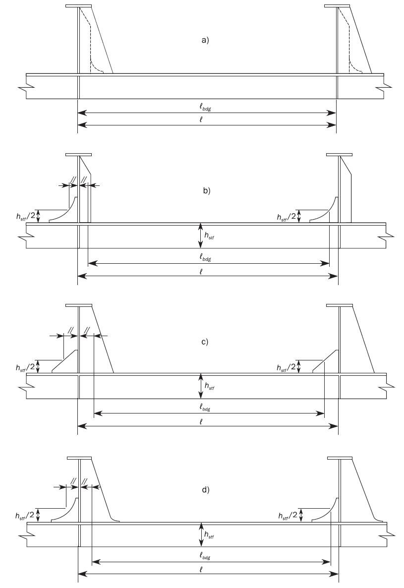
    **Figure : Effective bending span of stiffeners supported by web stiffeners (Single skin construction)**
    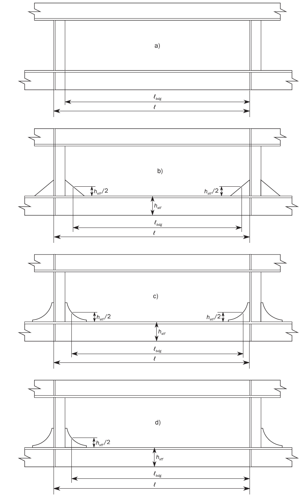
    **Figure : Effective bending span of stiffeners supported by web stiffeners (Double skin construction)**
    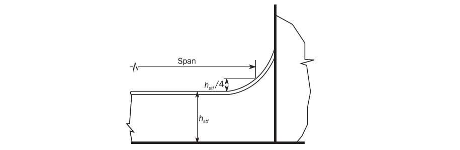
    **Figure : Effective bending span for local support members with continuous face plate along bracket edge**
  - **1.1.3** **Effective shear span of stiffeners**
    The effective shear span, $\ell _{shr}$ in m, of stiffeners is to be measured as shown in **Figure 4** for single skin structures and **Figure 5** for double skin structures. The effective shear span may be reduced for brackets fitted on either the flange or the free edge of the stiffener, or for brackets fitted to the attached plating on the side opposite to that of the stiffener.
    If brackets are fitted at both the flange or free edge of the stiffener, and to the attached plating on the side opposite to the stiffener the effective shear span may be reduced using the longer effective bracket arm. Regardless of support detail, the full length of the stiffener may be reduced by a minimum of *s*/4000 m at each end of the member, hence the effective shear span $\ell _{shr}$, is not to be taken greater than:
    $\ell _{shr} \leq \ell - \frac{s}{2000}$
    For curved and/or long brackets (high length/height ratio), the effective bracket length is to be taken as the maximum inscribed 1:1.5 right angled triangle as shown in item (c) of both **Figure 4** and **Figure 5**.
    Where the face plate of the stiffener is continuous along the curved edge of the bracket, the bracket length to be considered for determination of the span point location is not to be taken greater than 1.5 times the length of the bracket arm as shown in **Figure 6**.
    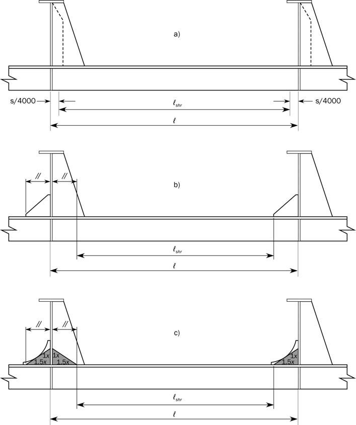
    **Figure : Effective shear span of stiffeners supported by web stiffeners (single skin construction)**
    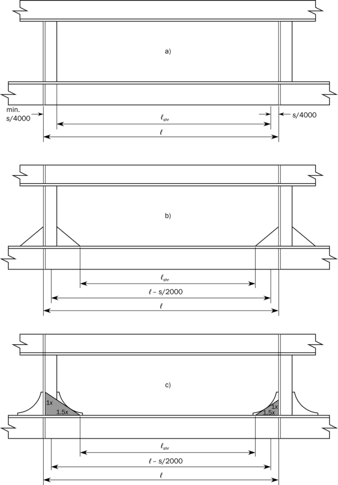
    **Figure : Effective shear span of stiffeners supported by web stiffeners (double skin construction)**
    
    **Figure : Effective shear span for local support members with continuous face plate along bracket edge**
  - **1.1.4** **Effect of hull form shape on span of stiffeners**
    For curved stiffeners, the span is defined as the chord length between span points to be measured at the flange for stiffeners with a flange, and at the free edge for flat bar stiffeners. The calculation of the effective span is to be in accordance with requirements given in **[1.1.2]** and **[1.1.3]**.
  - **1.1.5** **Effective bending span of primary supporting members**
    The effective bending span $\ell _{bdg}$ of a primary supporting member without end bracket is to be taken as the length of the primary supporting member between supports. The effective bending span $\ell _{bdg}$ of a primary supporting member may be taken as less than the full length of the primary supporting member between supports, provided suitable end brackets are fitted.
    The effective bending span $\ell _{bdg}$, in m, of a primary supporting member with end brackets is taken between points where the depth of the bracket is equal to half the web height of the primary supporting member as shown in **Figure 7** (b). The effective bracket used to define these span points is to be taken as given in **[1.1.7]**.
    In case of brackets where the face plate of the member is continuous along the face of the bracket, as shown in **Figure 7** (a), (c) and (d), the effective bending span $\ell _{bdg}$, in m, is taken between points where the depth of the bracket is equal to one quarter the web height of the primary supporting member. The effective bracket used to define these span points is to be taken as given in **[1.1.7]**.
    For straight brackets with a length to height ratio greater than 1.5, the span point is to be taken to the effective bracket; otherwise the span point is to be taken to the fitted bracket.
    For curved brackets, for span positions above the tangent point between fitted bracket and effective bracket, the span point is to be taken to the fitted bracket; otherwise, the span point is to be taken to the effective bracket.
    For arrangements where the primary supporting member face plate is carried on to the bracket and backing brackets are fitted, the span point need not be taken greater than to the position where the total depth reaches twice the depth of the primary supporting member. Arrangements with small and large backing brackets are shown in **Figure 7** (e) and (f).
    For arrangements where the height of the primary supporting member is maintained and the face plate width is increased towards the support, the effective bending span $\ell _{bdg}$ may be taken to a position where the face plate breadth reaches twice the nominal breadth.
  - **1.1.6** **Effective shear span of primary supporting members**
    The effective shear span of the primary supporting member may be reduced compared to effective bending span, and taken between the toes of the effective brackets supporting the member, where the toes of effective brackets are as shown in **Figure 8**. The effective bracket used to define the toe point is given in **[1.1.7]**. For arrangements where the effective backing bracket is larger than the effective bracket in way of face plate, the shear span is to be taken as the mean distance between toes of the effective brackets as shown in **Figure 8** (f).
  - **1.1.7** **Effective bracket definition**
    The effective bracket is defined as the maximum size of right angled triangular bracket with a length to height ratio of 1.5 that fits inside the fitted bracket. See **Figure 7** for examples.
    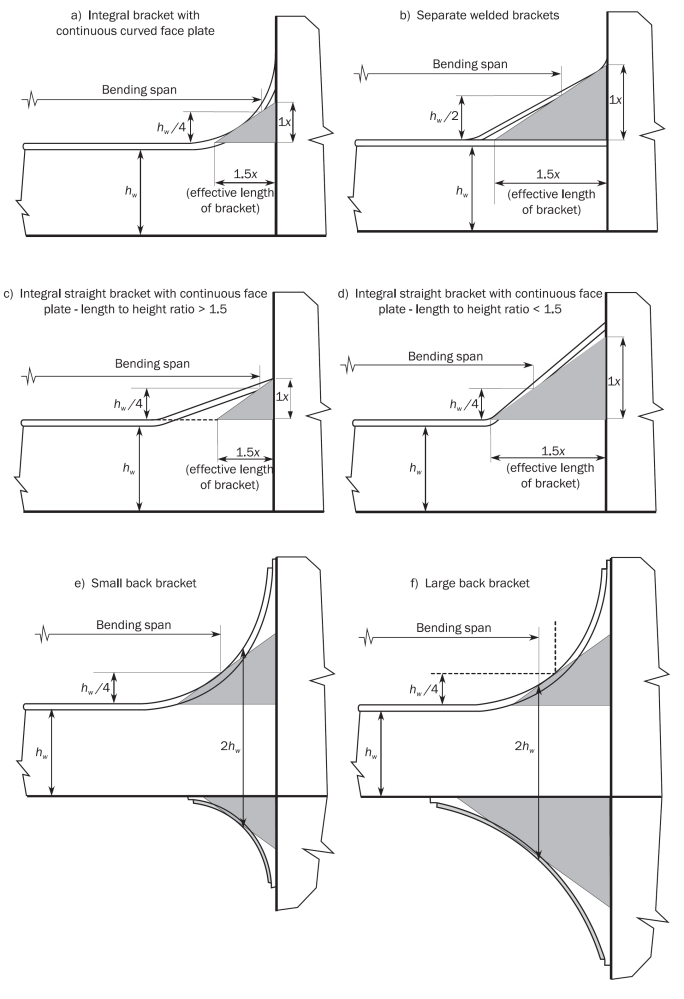
    **Figure : Effective bending span of primary supporting member**
    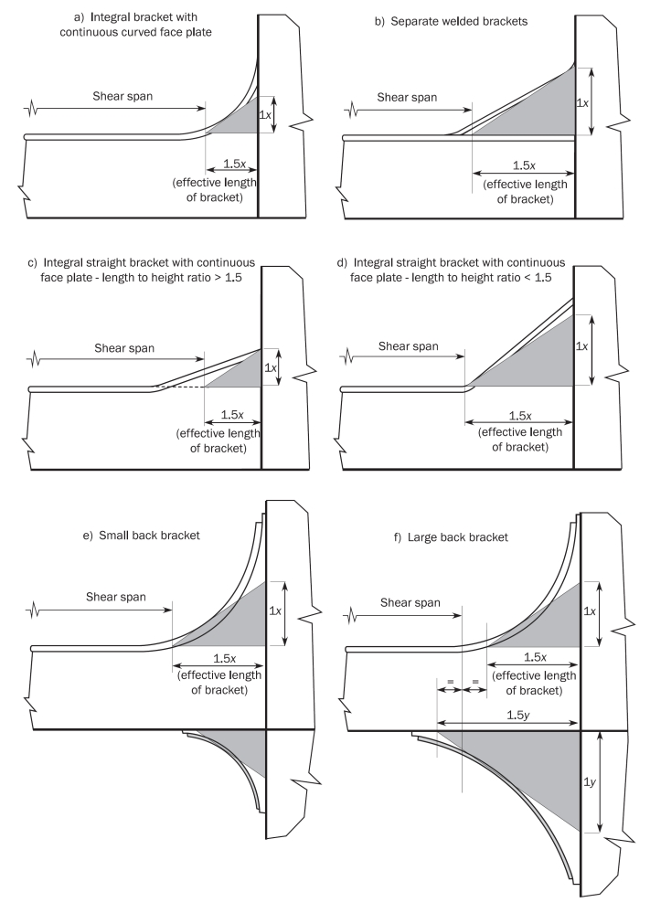
    **Figure : Effective shear span of primary supporting member**
- **1.2** **Spacing and load supporting breadth**
  - **1.2.1** **Stiffeners**
    Stiffeners spacing, *s*, in mm, for the calculation of the effective attached plating of stiffeners is to be taken as the mean spacing between stiffeners and taken equal to, see **Figure 9**.
    $s = \frac{b _{1} +b _{2} +b _{3} +b _{4}}{4}$
    where:
    $b_{1}$, $b_{2}$, $b_{3}$, $b_{4}$ : Spacings between stiffeners at ends, in mm. In general, the loading breadth supported by stiffener is to be taken equal to *s*.
  - **1.2.2** **Primary supporting member**
    Primary supporting member spacing, *S*, for the calculation of the effective attached plating of primary supporting members is to be taken as the mean spacing between adjacent primary supporting members, and taken equal to, see **Figure 9**.
    $s = \frac{b _{1} +b _{2} +b _{3} +b _{4}}{4}$
    where:
    $b_{1}$, $b_{2}$, $b_{3}$, $b_{4}$ : Spacings between primary supporting members at ends. In general, the loading breadth supported by a primary supporting member is to be taken equal to *S*.
    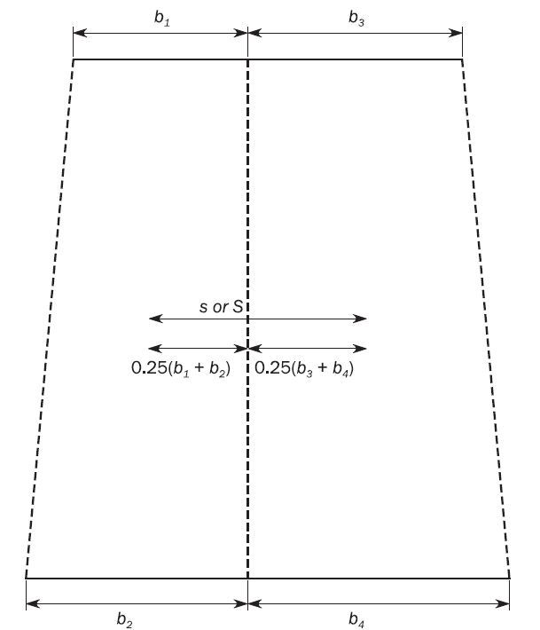
    **Figure : Spacing of plating**
  - **1.2.3** **Spacing of curved plating**
    For curved plating, the stiffener spacing, *s* or the primary supporting member spacing, *S* is to be measured on the mean chord between members.
- **1.3** **Effective breadth**
  - **1.3.1** **Stiffeners**
    The effective breadth, $b _{eff}$ , in mm, of the attached plating to be considered in the actual net section modulus for the yielding check of stiffeners is to be obtained from the following formulae:
    $b _{eff} =200 \ell$, or
    $b _{eff} =s$
    whichever is lesser.
    $b _{eff} =100 \ell$, or
    $b _{eff} =0.5s$
    whichever is lesser.
    However, where the attached plate net thickness is less than 8 mm, the effective breadth is not to be taken greater than 600 mm. The effective breadth, $b _{eff}$ , in mm, of the attached plating to be considered for the buckling check of stiffeners is given in **Ch 8, Sec 5, [2.3.5]**.
    - **a)** Where the plating extends on both sides of the stiffener:
    - **b)** Where the plating extends on one side of the stiffener (i.e. stiffeners bounding openings):
  - **1.3.2** **Primary supporting members**
    The effective breadth of attached plating, $b _{eff}$, in m, for calculating the section modulus and/or moment of inertia of a primary supporting member is to be taken as:
    $b _{eff} = S · itmin \left[ \frac{1.12}{1+ \frac{1.75}{\left( \frac{\ell _{bdg}}{S \sqrt {3}} \right) ^{1.6}}} ; 1.0 \right]$ for $\frac{\ell _{bdg}}{S \sqrt {3}} \geq 1$
    $b _{eff} =0.407 \frac{\ell _{bdg}}{\sqrt {3}}$ for $\frac{\ell _{bdg}}{S \sqrt {3}} <1$
  - **1.3.3** **Effective area of curved face plate and attached plating of primary supporting members**
    The effective net area given in a) and b) is only applicable to curved face plates and curved attached plating of primary supporting members. This is not applicable for the area of web stiffeners parallel to the face plate. The effective net area is applicable to primary supporting members for the following calculations:
    • Actual net section modulus used for comparison with the scantling requirements in **Ch 6**.
    • Actual effective net area of curved face plates, modelled by beam elements, used in **Ch 7**.
    $A _{eff-n50} = C _{f} t _{f-n50} b _{f}$
    where:
    $C _{f}$ : Flange efficiency coefficient is to be obtained from the following formula but not to be greater than 1.0:
    $C _{f} = C _{f1} \frac{1.285}{\beta k _{1}}$ for symmetrical face plate
    $C _{f} = 0.18+ \frac{0.08}{\beta ^{2}}$ for unsymmetrical face plate
    $C _{f} = C _{f1} \frac{1.285}{\beta}$ for attached plating of box girders
    $C _{f1}$ : Coefficient taken equal to:
    • For symmetrical face plates,
    $C _{f1} = \frac{sinhk _{1} \beta coshk _{1} \beta + sink _{1} \beta cosk _{1} \beta}{(\cosh k _{1} \beta ) ^{2} + \cos ^{2} k _{1} \beta}$
    • For attached plating of box girders with two webs,
    $C _{f1} = \frac{0.78 (\sinh \beta +\sin \beta )(\cosh \beta -\cos \beta )}{(\sinh \beta ) ^{2} + \sin ^{2} \beta}$
    • For attached plating of box girders with multiple webs,
    $C _{f1} = \frac{1.56 (\cosh \beta -\cos \beta )}{\sinh \beta +\sin \beta}$
    $k _{1}$ : Coefficient calculated as:
    $k _{1} =1.4+1.25(1.4- \beta ) ^{3}$ for $\beta <1.4$
    $k _{1} =1.4$ for $\beta \geq 1.4$
    $\beta$ : Coefficient calculated as:
    $\beta = \frac{1.285 b _{1}}{\sqrt {r _{f} t _{f-n50}}}$ , in rad.
    $b _{1}$ : Breadth, in mm, to be taken equal to:
    • For symmetrical face plates, $b _{1} =0.5(b _{f} -t _{w-n50} )$
    • For unsymmetrical face plates, $b _{1} =b _{f}$
    • For attached plating of box girders, $b _{1} =s _{w} -t _{w-n50}$
    $s _{w}$ : Spacing of supporting webs for box girders, in mm.
    $t _{f-n50}$ : Net flange thickness, in mm. For calculation of $C _{f}$ and $\beta$ of unsymmetrical face plates, $t _{f-n50}$ is not to be taken greater than $t _{w-n50}$.
    $t _{w-n50}$ : Net web plate thickness, in mm.
    $r _{f}$ : Radius of curved face plate or attached plating, in mm, see **Figure 10** at mid thickness.
    $b _{f}$ : Breadth of face plate or attached plating, in mm, see **Figure 10**.
    $A _{eff-n50} = \left( \frac{3r _{f} t _{f-n50} +C _{f} s _{r}^{2}}{3r _{f} t _{f-n50} +s _{r}^{2}} \right) t _{f-n50} b _{f}$
    where:
    $s _{r}$ : Spacing of tripping brackets or web stiffeners or stiffeners normal to the web plating, in mm, see **Figure 10**.
    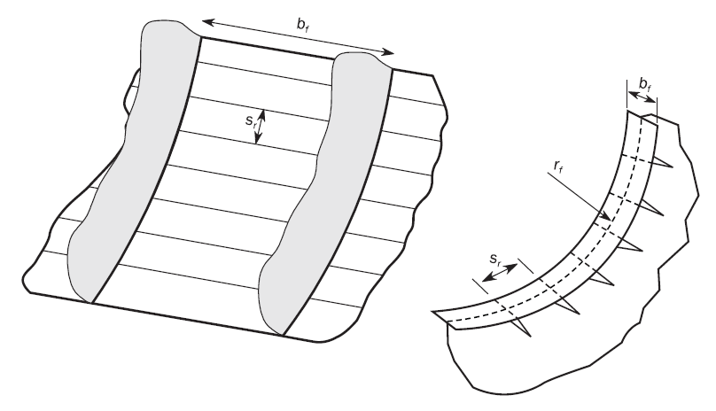
    **Figure : Curved shell panel and face plate**
    - **a)** The effective net area, $A _{eff-n50}$, in mm^2, is to be taken as:
    - **b)** The effective net area, in mm^2, of curved face plates supported by radial brackets, or attached plating supported by cylindrical stiffeners, is given by:
- **1.4** **Geometrical properties of stiffeners and primary supporting members**
  - **1.4.1** **Stiffener profile with a bulb section**
    The properties of bulb profile sections are to be determined by direct calculations. Where direct calculation of properties is not possible, a bulb section may be taken equivalent to a built-up section. The net dimensions of the equivalent built-up section are to be obtained, in mm, from the following formulae.
    $h _{W} = h ' _{W} - \frac{h ' _{W}}{9.2} +2$
    $b _{f} = \alpha \left( t ' _{W} + \frac{h ' _{W}}{6.7} -2 \right)$
    $t _{f} = \frac{h ' _{W}}{9.2} -2$
    $t _{w} =t ' _{w}$
    where:
    $h ' _{w}$, $t ' _{w}$ : Net height and thickness of a bulb section, in mm, as shown in **Figure 11**.
    $\alpha$ : Coefficient equal to:
    $\alpha = 1.1+ \frac{(120-h ' _{w} ) ^{2}}{3000}$ for $h ' _{w} \leq 120$
    $\alpha = 1.0$ for $h ' _{w} >120$
    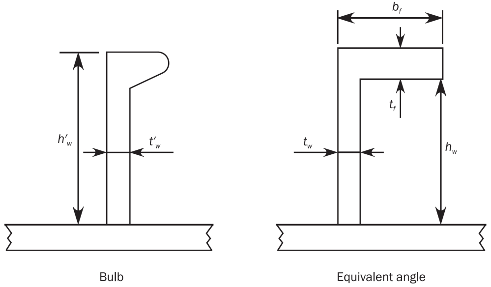
    **Figure : Dimensions of stiffeners**
  - **1.4.2** **Net elastic shear area of stiffeners**
    The net elastic shear area, $A _{shr}$, in cm^2, of stiffeners is to be taken as:
    $A _{shr} =d _{shr } t _{w} 10 ^{-2}$
    $d _{shr}$ : Effective shear depth of stiffener, in mm, as defined in **[1.4.3]**.
    $t _{w}$ : Net web thickness of the stiffener, in mm, as defined in **Ch 3, Sec 2, Figure 2**.
  - **1.4.3** **Effective shear depth of stiffeners**
    The effective shear depth of stiffeners, $d _{shr}$, in mm, is to be taken as:
    $d _{shr} =(h _{stf} -0.5t _{c-stf} +t _{p} +0.5t _{c-pl} )\sin \varphi _{w}$
    where:
    $h _{stf}$ : Height of stiffener, in mm, as defined in **Ch 3, Sec 2, Figure 2**.
    $t _{p}$ : Net thickness of the stiffener attached plating, in mm, as defined in **Ch 3, Sec 2, Figure 2**.
    $t _{c-stf}$ : Corrosion addition, in mm, of considered stiffener as given in **Ch 3, Sec 3**.
    $t _{c-pl}$ : Corrosion addition, in mm, of attached plate of the stiffener considered as given in **Ch 3, Sec 3**.
    $\varphi_w$ : Angle, in deg, as defined in **Figure 12**. $\varphi_w$ is to be taken as 90 degrees if the angle is greater than or equal to 75 degrees.
  - **1.4.4** **Elastic net section modulus of stiffeners**
    The elastic net section modulus, *Z*, in cm^3 and the net moment of inertia, $I$, in cm^4 of stiffeners, in cm^3, is to be taken as:
    $Z=Z _{stf} \sin \varphi _{w}$
    $I=I _{st} \sin ^{2} \varphi _{w}$
    where:
    $Z _{stf}$ : Net section modulus of the stiffener, in cm^3, considered perpendicular to its attached plate, i.e. with $\varphi _{w}$ = 90 deg.
    $I _{st}$ : Net moment of inertia of the stiffener, in cm^4, considered perpendicular to its attached plate, i.e. with $\varphi _{w}$ = 90 deg.
    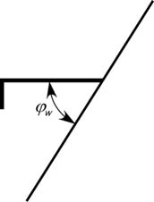
    **Figure : Angle between stiffener web and attached plating**
  - **1.4.5** **Effective net plastic shear area of stiffeners**
    The net plastic shear area, $A _{shr-pl}$ of stiffeners, in cm^2, which is used for assessment against impact loads is to be taken as:
    $A _{shr-pl} = A _{shr}$
    where:
    $A _{shr}$ : Net elastic shear area, in cm^2, as defined in **[1.4.2]**.
  - **1.4.6** **Effective net plastic section modulus of stiffeners (2023)**
    The effective net plastic section modulus, $Z _{pl}$, of stiffeners, in cm^3, which is used for assessment against impact loads, is to be taken as:
    for $75 ^{o} \leq \varphi _{w} \leq 90 ^{o}$
    $Z _{pl} = \frac{f _{w} h _{w}^{} t _{w} \left( h _{w} +e _{pN} \right)}{2000} + \frac{(2 \gamma -1) A _{f} (h _{f-ctr} +e _{pN} )}{1000} + \frac{\left( h _{w} t _{w} +A _{f} \right) e _{pN}}{1000}$
    for $\varphi _{w} <75 ^{o}$
    $Z _{pl} = \frac{f _{w} h _{w}^{} t _{w} \left( h _{w} +e _{pN} \right) \sin \varphi _{w}}{2000} + \frac{(2 \gamma -1) A _{f} ((h _{f-ctr} +e _{pN} ) \sin \varphi _{w} - b _{f-ctr} \cos \varphi _{w} )}{1000} + \frac{(h _{w} t _{w} +A _{f} )e _{pN}}{1000}$
    where
    $f_{w}$ : Web shear stress factor, taken equal to:
    • $f _{w}$ = 0.75 for flanged profile cross sections with n = 1 or 2
    • $f _{w}$ = 1.0 for flanged profile cross sections with n = 0
    • $f _{w}$ = 1.0 for flat bar stiffeners
    n : Number of plastic hinges at end supports of each member, taken equal to: 0, 1 or 2.
    A plastic hinge at end support may be considered where:
    • The stiffener is continuous at the support.
    • The stiffener passes through the support plate while it is connected at its termination point by a carling (or equivalent) to adjacent stiffeners.
    • The stiffener is attached to an abutting stiffener effective in bending (not a buckling stiffener).
    • The stiffener is attached to a bracket effective in bending. The bracket is assumed to be effective in bending when it is attached to another stiffener (not a buckling stiffener).
    $h _{w}$ : Depth of stiffener web, in mm, taken equal to:
    • For T, L (rolled and built-up) profiles and flat bar, as defined in **Ch 3, Sec 2, Figure 2**.
    • For L2 and L3 profiles as defined in **Ch 3, Sec 2, Figure 3**.
    • For bulb profiles, to be taken as defined in **[1.4.1]**.
    $\gamma$ : Coefficient equal to:
    $\gamma = \frac{\sqrt {3+2 \beta }}{2}$
    $e _{pN}$ : Coefficient taken equal to:
    $e _{pN} = \frac{(A _{f} +h _{w} t _{w} )}{2s} \leq \frac{t _{p}}{2}$
    $\beta$ : Coefficient equal to:
    • For L profiles without a mid-span tripping bracket:
    $\beta = \frac{t _{w}^{2} f _{b} l _{shr}^{2}}{80b _{f}^{2} t _{f} h _{f-ctr}} 10 ^{6} + \frac{t _{w}}{2b _{f}}$
    Without being taken greater than 0.5.
    • For other cases:
    $\beta =0.5$
    $A _{f}$ : Net cross sectional area of flange, in mm^2:
    • $A _{f}$ = 0 for flat bar stiffeners.
    • $A _{f} =b _{f} t _{f}$ for other stiffeners.
    $b _{f-ctr}$ : Distance from mid thickness of stiffener web to the centre of the flange area:
    • $b _{f-ctr} =0.5(b _{f} -t _{wr} )$ for rolled angle profiles and bulb profiles.
    • $b _{f-ctr} =0$ for T profiles.
    $h _{f-ctr}$ : Height of stiffener measured to the mid thickness of the flange:
    • $h _{f-ctr} =h _{w} +0.5t _{f}$ for profiles with flange of rectangular shape except for L3 profiles.
    • $h _{f-ctr} =h _{stf} -d _{e} -0.5t _{f}$ for L3 profiles as defined in **Ch 3, Sec 2, Figure 3**.
    $d _{e}$ : Distance from upper edge of web to the top of the flange, in mm, for L3 profiles, see **Ch 3, Sec 2, Figure 3**.
    $f _{b}$ : Coefficient taken equal to:
    • $f _{b}$ = 0.8 for flanges continuous through the primary supporting member, with end bracket(s).
    • $f _{b}$ = 0.7 for flanges sniped at the primary supporting member or terminated at the support without aligned structure on the other side of the support, and with end bracket(s).
    • $f _{b}$ = 1.0 for other stiffeners.
    $t _{f}$ : Net flange thickness, in mm.
    • $t _{f}$ = 0 for flat bar stiffeners.
    • For bulb profiles $t _{f}$ is defined in **[1.4.1]**.
  - **1.4.7** **Primary supporting member web not perpendicular to attached plating**
    Where the primary supporting member web is not perpendicular to the attached plating, the actual net shear area, in cm^2, and the actual net section modulus, in cm^3, can be obtained from the following formulae:
    $A _{sh-n50} = A _{sh­0­n50} \sin \varphi _{w}$ for $\varphi _{w} <75 ^{o}$
    $A _{sh-n50} = A _{sh­0­n50}$ for $75 ^{o} \leq \varphi _{w} \leq 90 ^{o}$
    $Z _{n50} = Z _{perp-n50} \sin \varphi _{w}$ for $\varphi _{w} <75 ^{o}$
    $Z _{n50} = Z _{perp-n50}$ for $75 ^{o} \leq \varphi _{w} \leq 90 ^{o}$
    where:
    $A _{sh-0-n50}$ : Actual net shear area, in cm^2, of the primary supporting member assumed to be perpendicular to the attached plating, to be taken equal to:
    $A _{sh-0-n50} = (h _{eff} +t _{f-n50} +t _{p-n50} ) t _{w-n50} 10 ^{-2}$
    $Z _{perp-n50}$ : Actual section modulus, in cm^3, with its attached plating of the primary supporting member assumed to be perpendicular to the attached plating.
    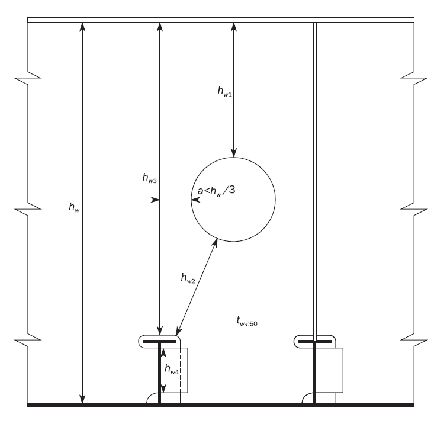
    **Figure : Effective shear area in way of web openings**
    - **a)** Actual net shear area:
    - **b)** Actual net section modulus:
  - **1.4.8** **Shear area of primary supporting members with web openings**
    The effective web height, $h _{eff}$, in mm, to be considered for calculating the effective net shear area, $A _{sh-n50}$ is to be taken as the lesser of:
    $h _{eff} =h _{w}$
    $h _{eff} =h _{w3} +h _{w4}$
    $h _{eff} =h _{w1} +h _{w2} +h _{w4}$
    where:
    $h_{w}$ : Web height of primary supporting member, in mm.
    $h_{w1}$, $h_{w2}$, $h_{w3}$, $h_{w4}$ : Dimensions as shown in **Figure 13**.
    where an opening is located at a distance less than $h _{w} /3$ from the cross-section considered, $h _{eff}$ is to be taken as the smaller of the net height and the net distance through the opening. See **Figure 13**.

#### 2. Plates

- **2.1** **Idealisation of EPP**
  - **2.1.1** **EPP**
    An elementary plate panel (EPP) is the unstiffened part of the plating between stiffeners and/or primary supporting members. The plate panel length, a, and breadth, b, of the EPP are defined respectively as the longest and shortest plate edges, as shown in **Figure 14**.
    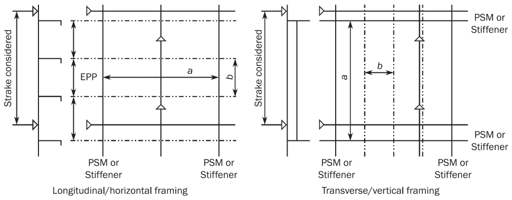
    **Figure : Elementary Plate Panel (EPP) definition**
  - **2.1.2** **Strake required thickness**
    The required thickness of a plate strake is to be taken as the greatest value required for each EPP within that strake. The requirements given in **Table 1** are to be applied for the selection of strakes to be considered as shown in **Figure 15**. The maximum corrosion addition within a strake is to be applied according to **Ch 3, Sec 3, [1.2.3]**.
  - **2.1.3** For direct strength assessment, the EPP is idealised with the mesh arrangement in the finite element model.
    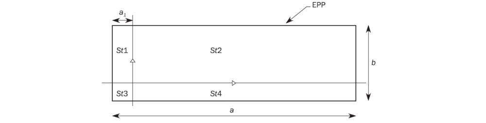
    #eqnID-509 : Distance, in mm, measured inside the considered strake in the direction of the long edge of the EPP, between the strake boundary weld seam and the EPP edge.**Figure : Strake considered in a given EPP**
- **2.2** **Load calculation point**
  - **2.2.1** **Yielding**
    For the yielding check, the local pressure and hull girder stress, used for the calculation of the local scantling requirements are to be taken at the Load Calculation Point (LCP) having coordinates *x*, *y* and *z* as defined in **Table 2**.

    | LCP coordinates | General(1) |   | Horizontal plating |   | Vertical transverse structure |   |
    | --- | --- | --- | --- | --- | --- | --- |
    | LCP coordinates | Longitudinal framing **(Figure 16)** | Transverse framing **(Figure 17)** | Longitudinal framing | Transverse framing | Horizontal framing **(Figure 18)** | Vertical framing **(Figure 19)** |
    | *x* coordinate | Mid-length of the EPP |   | Mid-length of the EPP |   | Corresponding to *y* and *z* values |   |
    | *y* coordinate | Corresponding to *x* and *z* coordinates |   | Outboard *y* value of the EPP |   | Outboard *y* value of the EPP, taken at *z* level(2) |   |
    | *z* coordinate | Lower edge of the EPP | The greater of lower edge of the EPP or lower edge of the strake | Corresponding to *x* and *y* values |   | Lower edge of the EPP | The greater of lower edge of the EPP or lower edge of the strake |
    | (1) All structures other than horizontal platings or vertical transverse structures (2) For transom plate, the y coordinate of the load calculation point is to be taken corresponding to *y* value at side shell at *z* level of the load calculation point, for the external dynamic pressure calculation. |   |   |   |   |   |   |

    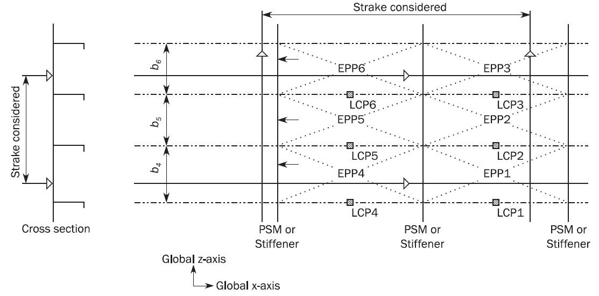
    **Figure : Load calculation point for longitudinal framing**
    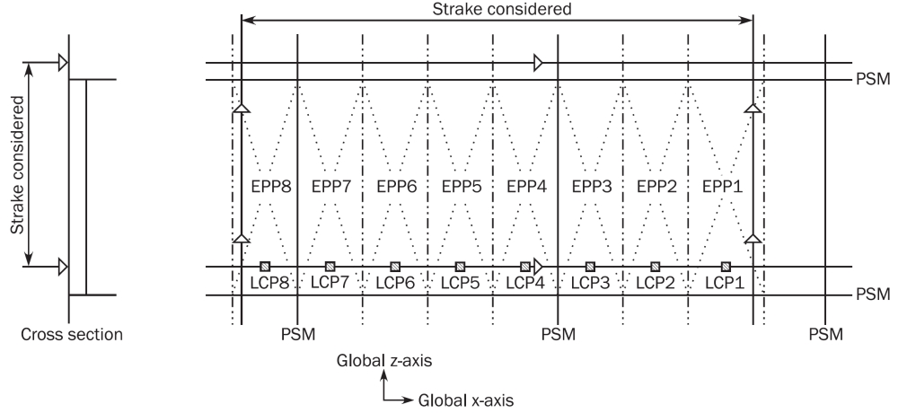
    **Figure : Load calculation point for transverse framing**
    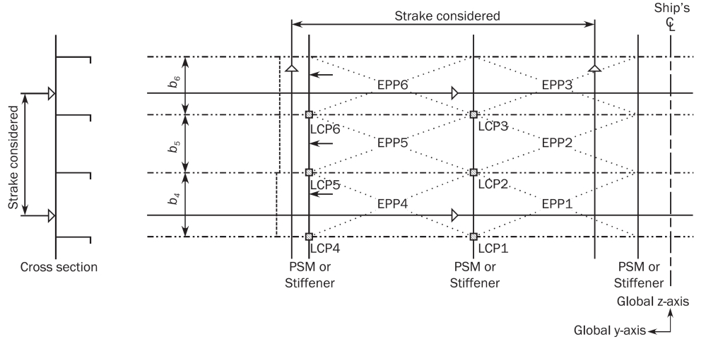
    **Figure : Load calculation point for horizontal framing on transverse vertical structure**
    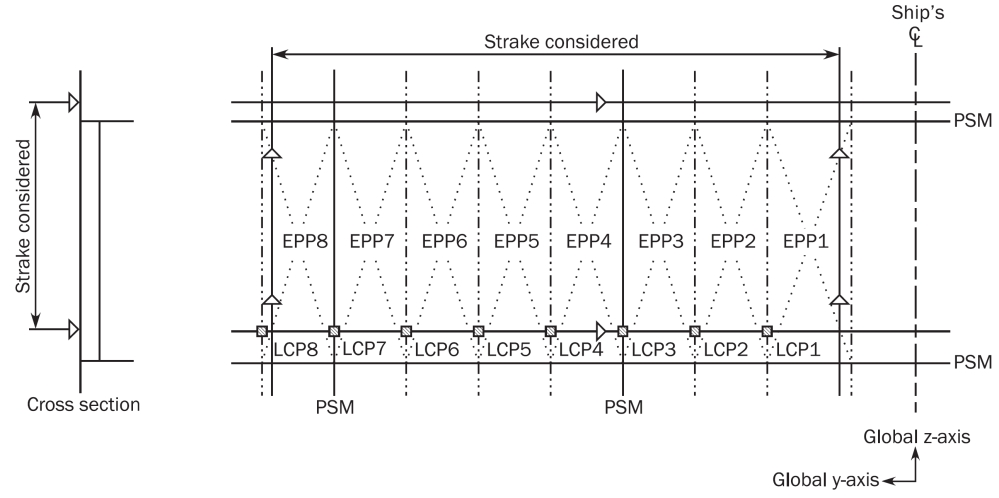
    **Figure : Load calculation point for vertical framing on transverse vertical structure**
  - **2.2.2** **Buckling**
    For the prescriptive buckling check of the EPP according to **Ch 8, Sec 2**, the LCP for the pressure and for the hull girder stresses are defined in **Table 3**. For the FE buckling check, **Ch 8, Sec 4** is applicable.

    | LCP coordinates | LCP for pressure | LCP for hull girder stresses (**Figure 20**) |   |   |
    | --- | --- | --- | --- | --- |
    | LCP coordinates | LCP for pressure | Bending stresses(1) |   | Shear stresses |
    | LCP coordinates | LCP for pressure | Non horizontal plate | Horizontal plate | Shear stresses |
    | *x* coordinate | Same coordinates as LCP for yielding See **Table 2** | Mid-length of the EPP |   |   |
    | *y* coordinate | Same coordinates as LCP for yielding See **Table 2** | Corresponding to *x* and *z* values | Outboard and inboard ends of the EPP (points A1 and A2) | Mid-point of EPP (point B) |
    | *z* coordinate | Same coordinates as LCP for yielding See **Table 2** | Both upper and lower ends of the EPP (points A1 and A2) | Corresponding to *x* and *y* values |   |
    | (1) The bending stress for curved plate panel is the mean value of the stresses calculated at points A1 and A2. |   |   |   |   |

    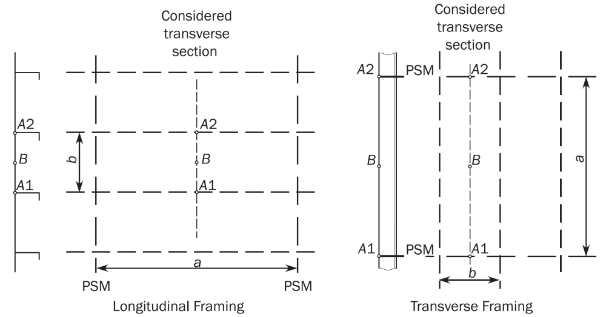
    **Figure : LCP for plate buckling – hull girder stresses**

#### 3. Stiffeners

- **3.1** **Reference point**
  - **3.1.1** The requirements of section modulus for stiffeners relate to the reference point giving the minimum section modulus. This reference point is generally located as shown in **Figure 21** for typical profiles.
    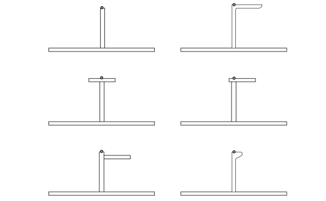
    **Figure : Reference point for calculation of section modulus and hull girder stress for local scantling assessment**
- **3.2** **Load calculation points**
  - **3.2.1** **LCP for Pressure**
    The load calculation point for the pressure is located at:
    For stiffeners located on transom plate, the *y* coordinate of the load calculation point is to be taken corresponding to *y* value at side shell at *z* level of the load calculation point, for the external dynamic pressure calculation.
    - **a)** Middle of the full length, $\ell$, of the considered stiffener.
    - **b)** The intersection point between the stiffener and its attached plate.
  - **3.2.2** **LCP for hull girder bending stress**
    The load calculation point for the hull girder bending stresses is defined as follows:
    • At the middle of the full length, $\ell$, of the considered stiffener.
    • At the reference point given in **Figure 21**.
    • At the middle of the full length, $\ell$, of the considered stiffener.
    • At the intersection point between the stiffener and its attached plate.
    - **a)** For yielding verification according **Ch 6**:
    - **b)** For prescriptive buckling requirements according to **Ch 8**:
  - **3.2.3** **Non-horizontal stiffeners**
    The lateral pressure (considering the pressure by IGC code, $P _{IGC}$ in case of cargo tank support structures), *P* is to be calculated as the maximum between the value obtained at middle of the full length, $\ell$, and the value obtained from the following formulae:
    $P= \frac{P _{u} +P _{L}}{2}$
    $P= \frac{\ell _{1}}{\ell } \frac{P _{L}}{2}$
    where:
    $\ell _{1}$ : Distance, in m, between the lower end of vertical stiffener and the lowest zero pressure level.
    $P _{u}$ : Lateral pressures at the upper end of the vertical stiffener span $\ell$.
    $P _{L}$ : Lateral pressures at the lower end of the vertical stiffener span $\ell$.
    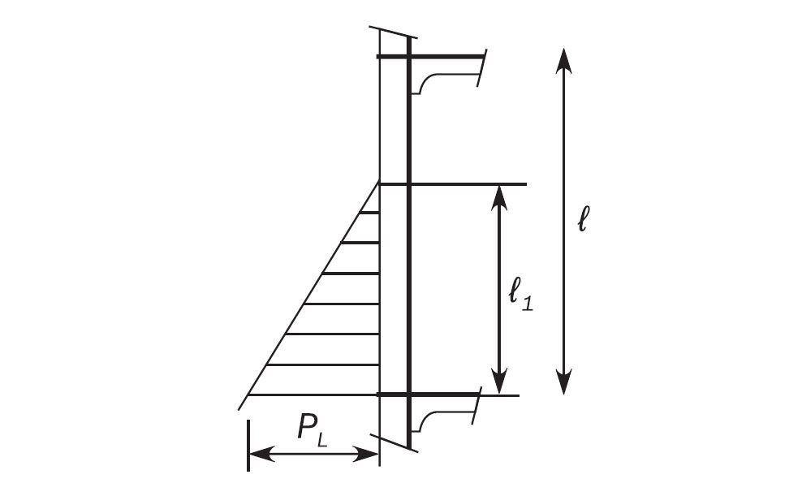
    **Figure : Definition of pressure for vertical stiffeners**
    - **a)** when the upper end of the vertical stiffener is below the lowest zero pressure level.
    - **b)** when the upper end of the vertical stiffener is at or above the lowest zero pressure level, see **Figure 22**.

#### 4. Primary Support Members

- **4.1** **Load calculation point**
  - **4.1.1** The load calculation point is located at the middle of the full length, $\ell$, at the attachment point of the primary supporting member with its attached plate. For primary supporting members located on transom plate, the *y* coordinate of the load calculation point is to be taken corresponding to *y* value at side shell at *z* level of load calculation point for the external dynamic pressure calculation.
