# PART 15 Structural Rules for Membrane Type Liquefied Natural Gas Carriers

> RULES FOR CLASSIFICATION OF STEEL SHIPS / RA-15-E / 2025 / EN / Rules

## Chapter 4 Loads

### Section 17 - Introduction

**Symbols**
For symbols not defined in this section, refer to **Ch 1, Sec 4**.
$S$ : Static load case
$S+D$ : Static plus dynamic load case

#### 1. General

- **1.1** **Application**
  - **1.1.1** **Scope**
    This chapter provides the design load for strength and fatigue assessments.
    The load combinations are to be derived for the design load scenarios specified in **Ch 4, Sec 7**. This section uses the concept of design load scenarios to specify consistent design load sets which cover the appropriate operating modes.
  - **1.1.2** **Equivalent Design Wave EDW**
    The dynamic loads associated with each dynamic load case are based on the Equivalent Design Wave (EDW) concept. The EDW concept applies a consistent set of dynamic loads to the ship such that specified dominant load response is equivalent to the required long term response value.
  - **1.1.3** **Probability level for strength and fatigue assessments**
    In this chapter, the assessments are to be understood as follows:
    - **a)** Strength assessment means the assessment for the strength criteria excluding fatigue, for the loads corresponding to the probability level of 10^-8, for the seagoing conditions and for harbour conditions.
    - **b)** Fatigue assessment means the assessment for the fatigue criteria for the loads corresponding to the probability level of 10^-2.
  - **1.1.4** **Dynamic load components**
    All dynamic load components are to be concurrent values calculated for each dynamic load case.
  - **1.1.5** **Loads for strength assessment**
    The strength assessment is to be undertaken for all design load scenarios and the final assessment is to be made on the most onerous strength requirement.
    Each design load scenario for strength assessment is composed of a Static (S) load case or a Static + Dynamic (S+D) load case, where the static and dynamic loads are dependent on the loading condition being considered.
    The static loads are defined in the following sections:
    The EDWs for the strength assessment and the dynamic load combination factors for global loads are listed in **Ch 4, Sec 2, [2]**.
    The dynamic load components are defined in the following sections:
    - **a)** Still water hull girder loads in **Ch 4, Sec 4**.
    - **b)** External loads in **Ch 4, Sec 5**.
    - **c)** Internal loads in **Ch 4, Sec 6**.
    - **a)** Dynamic hull girder load components in **Ch 4, Sec 4**.
    - **b)** External loads in **Ch 4, Sec 5**.
    - **c)** Internal loads in **Ch 4, Sec 6**.
  - **1.1.6** **Loads for fatigue assessment**
    Each design load scenario for fatigue assessment is composed of a Static + Dynamic (S+D) load case, where the static and dynamic loads are dependent on the loading condition being considered.
    The static loads are defined in the following sections:
    The EDWs for the fatigue assessment are listed in **Ch 4, Sec 2, [3]**.
    The dynamic load components are defined in the following sections:
    - **a)** Still water hull girder loads in **Ch 4, Sec 4**.
    - **b)** External loads in **Ch 4, Sec 5**.
    - **c)** Internal loads in **Ch 4, Sec 6**.
    - **a)** Dynamic hull girder load components in **Ch 4, Sec 4**.
    - **b)** External loads in **Ch 4, Sec 5**.
    - **c)** Internal loads in **Ch 4, Sec 6**.
- **1.2** **Definitions**
  - **1.2.1** **Coordinate system**
    The coordinate system is defined in **Ch 1, Sec 4, [3.5.1]**.
  - **1.2.2** **Sign convention for ship motions**
    The ship motions are defined with respect to the ship’'s centre of gravity (COG) as shown in **Figure 1**, where:
    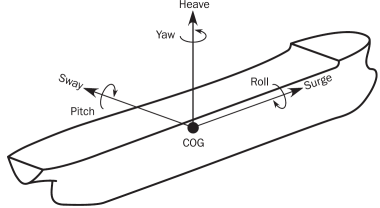
    **Figure : Definition of positive motions**
    - **a)** Positive surge is translation in the $X$-axis direction (positive forward).
    - **b)** Positive sway is translation in the $Y$-axis direction (positive towards port side of ship).
    - **c)** Positive heave is translation in the $Z$-axis direction (positive upwards).
    - **d)** Positive roll motion is positive rotation about a longitudinal axis through the COG (starboard down and port up).
    - **e)** Positive pitch motion is positive rotation about a transverse axis through the COG (bow down and stern up).
    - **f)** Positive yaw motion is positive rotation about a vertical axis through the COG (bow moving to port and stern to starboard).
  - **1.2.3** **Sign convention for hull girder loads**
    The sign conventions of vertical bending moments, vertical shear forces, horizontal bending moments and torsional moments at any ship transverse section are as shown in **Figure 2**, namely:
    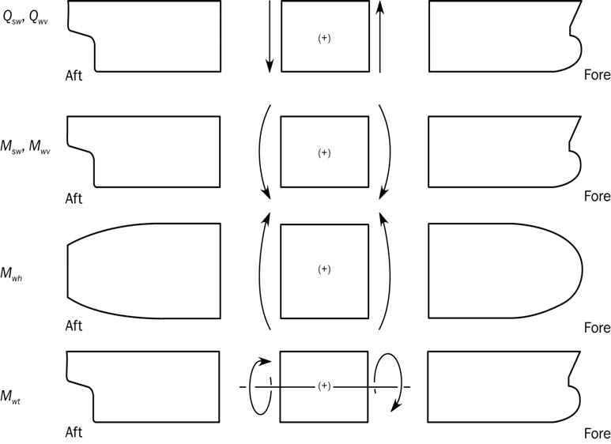
    **Figure : Sign conventions for shear forces** #eqnID-536**,** #eqnID-537 **and bending moments** #eqnID-538**,** #eqnID-539**,** #eqnID-540 **and** #eqnID-541
    - **a)** The vertical bending moments $M _{sw}$ and $M _{wv}$ are positive when they induce tensile stresses in the strength deck (hogging bending moment) and negative when they induce tensile stresses in the bottom (sagging bending moment).
    - **b)** The vertical shear forces $Q _{sw}$,$Q _{wv}$ are positive in the case of downward resulting forces acting aft of the transverse section and upward resulting forces acting forward of the transverse section under consideration.
    - **c)** The horizontal bending moment $M _{wh}$ is positive when it induces tensile stresses in the starboard side and negative when it induces tensile stresses in the port side.
    - **d)** The torsional moment $M _{wt}$ is positive in the case of resulting moment acting aft of the transverse section following negative rotation around the $X$-axis, and of resulting moment acting forward of the transverse section following positive rotation around the $X$-axis.

### Section 18 - Dynamic load cases

**Symbols**
For symbols not defined in this section, refer to **Ch 1, Sec 4**.
$a _{surge}$, $a _{"pitch-x"}$, $a _{sway}$, $a_roll-y$, $a_heave$, $a_roll-z$, $a_"pitch-z"$ : Acceleration components, as defined in **Ch 4, Sec 3**.
$f_xL$ : Ratio between $X$-coordinate of the load point and $L$, to be taken as:
$f_xL = x overL$, but not to be taken less than 0.0 or greater than 1.0.
$f _{T}$ : Ratio between draught at a loading condition and scantling draught, as defined in **Ch 4, Sec 3**.
$f _{lp}$ : Factor depending on longitudinal position along the ship, to be taken as:
$f _{lp}=1.0$ for $x/L \leq 0.5$
$f _{lp} =-1.0$ for $0.5\(f _{lp-OST}$ : Factor for the longitudinal distribution of the torsional moment for the OST load case, to be taken as:
$f _{lp-OST} =5f _{xL}$ for $x/L<0.2$
$f _{lp-OST} =1.0$ for $0.2 \leq x/L<0.4$
$f _{lp-OST} =-7.6f _{xL} +4.04$ for $0.4 \leq x/L<0.65$
$f _{lp-OST} =-0.9$ for $0.65 \leq x/L<0.85$
$f _{lp-OST} =6f _{xL} -6$ for $0.85 \leq x/L$
$f _{lp-OSA}$ : Factor for the longitudinal distribution of the torsional moment for the OSA load case, to be taken as:
$f _{lp-OSA} =- \left( 0.8-0.25f _{T} \right)$ for $x/L<0.4$
$f _{lp-OSA} =1.3 \left( 0.2+0.3f _{T} \right)$ for $0.6 \leq x/L$
Intermediate values are obtained by linear interpolation.
$WS$ : Weather side, side of the ship exposed to the incoming waves.
$LS$ : Lee side, sheltered side of the ship away from the incoming waves.
$M _{wv}$ : Vertical wave bending moment, in $\mathrm{kNm}$, defined in **Ch 4, Sec 4**.
$Q _{wv}$ : Vertical wave shear force, in $\mathrm{kN}$, defined in **Ch 4, Sec 4**.
$M _{wh}$ : Horizontal wave bending moment, in $\mathrm{kNm}$, defined in **Ch 4, Sec 4**.
$M _{wt}$ : Torsional wave bending moment, in $\mathrm{kNm}$, defined in **Ch 4, Sec 4**.
$C _{WV}$ : Load combination factor to be applied to the vertical wave bending moment.
$C _{QV}$ : Load combination factor to be applied to the vertical wave shear force.
$C _{WH}$ : Load combination factor to be applied to the horizontal wave bending moment.
$C _{WT}$ : Load combination factor to be applied to the wave torsional moment.
$C _{XS}$ : Load combination factor to be applied to the surge acceleration.
$C _{XP}$ : Load combination factor to be applied to the longitudinal acceleration due to pitch.
$C _{XG}$ : Load combination factor to be applied to the longitudinal acceleration due to pitch motion.
$C _{YS}$ : Load combination factor to be applied to the sway acceleration.
$C _{YR}$ : Load combination factor to be applied to the transverse acceleration due to roll.
$C _{YG}$ : Load combination factor to be applied to the transverse acceleration due to roll motion.
$C _{ZH}$ : Load combination factor to be applied to the heave acceleration.
$C _{ZR}$ : Load combination factor to be applied to the vertical acceleration due to roll.
$C _{ZP}$ : Load combination factor to be applied to the vertical acceleration due to pitch.
$\theta$ : Roll angle, in deg, as defined in **Ch 4, Sec 3, [2.1.1]**.
$\phi$ : Pitch angle, in deg, as defined in **Ch 4, Sec 3, [2.1.2]**.

#### 1. General

- **1.1** **Definition of dynamic load cases**
  - **1.1.1** The following Equivalent Design Waves (EDW) are to be used to generate the dynamic load cases for structural assessment:
    HSM-1 and HSM-2: Head sea EDWs that minimise and maximise the vertical wave bending moment amidships respectively.
    HSA-1 and HSA-2: Head sea EDWs that maximise and minimise the head sea vertical acceleration at FP respectively.
    FSM-1 and FSM-2: Following sea EDWs that minimise and maximise the vertical wave bending moment amidships respectively.
    BSR-1P and BSR-2P: Beam sea EDWs that minimise and maximise the roll motion downward and upward on the port side respectively with waves from the port side.
    BSR-1S and BSR-2S: Beam sea EDWs that maximise and minimise the roll motion downward and upward on the starboard side respectively with waves from the starboard side.
    BSP-1P and BSP-2P: Beam sea EDWs that maximise and minimise the hydrodynamic pressure at the waterline amidships on the port side respectively.
    BSP-1S and BSP-2S: Beam sea EDWs that maximise and minimise the hydrodynamic pressure at the waterline amidships on the starboard side respectively.
    OST-1P and OST-2P: Oblique sea EDWs that minimise and maximise the torsional moment at 0.25L from the AE with waves from the port side respectively.
    OST-1S and OST-2S: Oblique sea EDWs that maximise and minimise the torsional moment at 0.25L from the AE with waves from the starboard side respectively.
    OSA-1P and OSA-2P: Oblique sea EDWs that maximise and minimise the pitch acceleration with waves from the port side respectively.
    OSA-1S and OSA-2S: Oblique sea EDWs that maximise and minimise the pitch acceleration with waves from the starboard side respectively.
    Note 1: 1 and 2 denote the maximum or the minimum dominate load component for each EDW.
    Note 2: P and S denote that the weather side is on port side and on starboard side respectively.
    HSA and OSA load cases are not to be used for fatigue assessment.
    - **a)** HSM load cases :
    - **b)** HSA load cases:
    - **c)** FSM load cases:
    - **d)** BSR load cases:
    - **e)** BSP load cases:
    - **f)** OST load cases:
    - **g)** OSA load cases:
- **1.2** **Application**
  - **1.2.1** The dynamic load cases described in this section are to be used for determining the dynamic loads required by the design load scenarios described in **Ch 4, Sec 7**. These dynamic load cases are to be applied to the following structural assessments:
    • For plating, ordinary stiffeners and primary supporting members by prescriptive methods.
    • For the direct strength method (FE analysis) assessment of structural members.
    • For structural details covered by simplified stress analysis.
    • For structural details covered by FE stress analysis.
    - **a)** Strength assessment :
    - **b)** Fatigue assessment :

#### 2. Dynamic load cases for strength assessment

- **2.1** **Description of dynamic load cases**
  - **2.1.1** **Table 1** to **Table 3** describe the ship motions responses and the global loads corresponding to each dynamic load case to be considered for the strength assessment.

    | Loadcase | HSM-1 | HSM-2 | HSA-1 | HSA-2 | FSM-1 | FSM-2 |
    | --- | --- | --- | --- | --- | --- | --- |
    | EDW | HSM |   | HSA |   | FSM |   |
    | Heading | Head |   | Head |   | Following |   |
    | Effect | Max. bending moment |   | Max. vertical acceleration |   | Max. bending moment |   |
    | VWBM | Sagging | Hogging | Sagging | Hogging | Sagging | Hogging |
    | VWSF | Negative-aft Positive-fore | Positive-aft Negative-fore | Negative-aft Positive-fore | Positive-aft Negative-fore | Negative-aft Positive-fore | Positive-aft Negative-fore |
    | HWBM | - | - | - | - | - | - |
    | TM | - | - | - | - | - | - |
    | Surge | To stern | To bow | To stern | To bow | - | - |
    | $a _{surge}$ |  |  |  |  | - | - |
    | Sway | - | - | - | - | - | - |
    | $a _{sway}$ | - | - | - | - | - | - |
    | Heave | Down | Up | Down | Up | Down | Up |
    | $a _{heave}$ |  |  |  |  |  |  |
    | Roll | - | - | - | - | - | - |
    | $a _{roll}$ | - | - | - | - | - | - |
    | Pitch | Bow down | Bow up | Bow down | Bow up | Bow down | Bow up |
    | $a _{"pitch"}$ |  |  |  |  |  |  |

    | Loadcase | BSR-1P | BSR-2P | BSR-1S | BSR-2S | BSP-1P | BSP-2P | BSP-1S | BSP-2S |
    | --- | --- | --- | --- | --- | --- | --- | --- | --- |
    | EDW | BSR |   |   |   | BSP |   |   |   |
    | Heading | Beam |   |   |   | Beam |   |   |   |
    | Effect | Max. roll |   |   |   | Max. pressure at waterline |   |   |   |
    | VWBM | Sagging | Hogging | Sagging | Hogging | Sagging | Hogging | Sagging | Hogging |
    | VWSF | Negative-aft Positive-fore | Positive-aft Negative-fore | Negative-aft Positive-fore | Positive-aft Negative-fore | Negative-aft Positive-fore | Positive-aft Negative-fore | Negative-aft Positive-fore | Positive-aft Negative-fore |
    | HWBM | Stbd tensile | Port tensile | Port tensile | Stbd tensile | Stbd tensile | Port tensile | Port tensile | Stbd tensile |
    | TM | - | - | - | - | - | - | - | - |
    | Surge | - | - | - | - | To bow | To stern | To bow | To stern |
    | $a _{surge}$ | - | - | - | - |  |  |  |  |
    | Sway | To starboard | To Portside | To Portside | To starboard | To Portside | To starboard | To starboard | To Portside |
    | $a_{sway }$ |  |  |  | 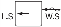 | 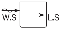 |  |  |  |
    | Heave | Down | Up | Down | Up | Down | Up | Down | Up |
    | $a _{heave}$ | 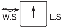 |  |  |  |  |  |  |  |
    | Roll | Portside down | Portside up | Starboard down | Starboard up | Portside up | Portside down | Starboard up | Starboard down |
    | $a _{roll}$ |  |  |  |  |  |  |  |  |
    | Pitch | - | - | - | - | Bow down | Bow up | Bow down | Bow up |
    | $a _{p i tch}$ | - | - | - | - |  |  |  |  |

    | Loadcase | OST-1P | OST-2P | OST-1S | OST-2S | OSA-1P | OSA-2P | OSA-1S | OSA-2S |
    | --- | --- | --- | --- | --- | --- | --- | --- | --- |
    | EDW | OST |   |   |   | OSA |   |   |   |
    | Heading | Oblique |   |   |   | Oblique |   |   |   |
    | Effect | Max. torsional moment |   |   |   | Max. pitch acceleration |   |   |   |
    | VWBM | Sagging | Hogging | Sagging | Hogging | Hogging | Sagging | Hogging | Sagging |
    | VWSF | Negative-aft Positive-fore | Positive-aft Negative-fore | Negative-aft Positive-fore | Positive-aft Negative-fore | Positive-aft Negative-fore | Negative-aft Positive-fore | Positive-aft Negative-fore | Negative-aft Positive-fore |
    | HWBM | Port tensile | Stbd tensile | Stbd tensile | Port tensile | Stbd tensile | Port tensile | Port tensile | Stbd tensile |
    | TM |  |  |  |  |  |  |  |  |
    | Surge | To bow | To stern | To bow | To stern | To bow | To stern | To bow | To stern |
    | $a _{surge}$ |  |  |  |  |  |  |  |  |
    | Sway | - | - | - | - | To portside | To starboard | To starboard | To portside |
    | $a_{sway }$ | - | - | - | - |  | 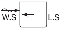 |  |  |
    | Heave | Up | Down | Up | Down | Up | Down | Up | Down |
    | $a _{heave}$ |  |  | 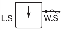 |  |  |  |  |  |
    | Roll | Portside down | Portside up | Starboard down | Starboard up | Portside down | Portside up | Starboard down | Starboard up |
    | $a _{roll}$ |  |  |  |  |  |  |  |  |
    | Pitch | Bow up | Bow down | Bow up | Bow down | Bow up | Bow down | Bow up | Bow down |
    | $a _{p i tch}$ |  |  |  |  |  |  |  |  |
- **2.2** **Load combination factors**
  - **2.2.1** The load combinations factors, LCFs for the global loads and inertia load components for strength assessment are defined in:
    **Table 4** : LCFs for HSM, HSA and FSM load cases.
    **Table 5** : LCFs for BSR and BSP load cases.
    **Table 6** : LCFs for OST and OSA load cases.

    | Load component |   | LCF | HSM-1 | HSM-2 | HSA-1 | HSA-2 | FSM-1 | FSM-2 |
    | --- | --- | --- | --- | --- | --- | --- | --- | --- |
    | Hull girder loads | $M _{wv}$ | $C _{WV}$ | $-1$ | $1$ | $0.4f _{T} -1.2$ | $1.2-0.4f _{T}$ | $-1$ | $1$ |
    | Hull girder loads | $Q _{wv}$ | $C _{QW}$ | $-f _{lp}$ | $f _{lp}$ | $-f _{lp}$ | $f _{lp}$ | $- \left( 1-0.15f _{T} \right) f _{lp}$ | $\left( 1-0.15f _{T} \right) f _{lp}$ |
    | Hull girder loads | $M _{wh}$ | $C _{WH}$ | $0$ | $0$ | $0$ | $0$ | $0$ | $0$ |
    | Hull girder loads | $M _{wt}$ | $C _{WT}$ | $0$ | $0$ | $0$ | $0$ | $0$ | $0$ |
    | Longitudinal accelerations | $a _{surge}$ | $C _{XS}$ | $0.4-0.25f _{T}$ | $0.25f _{T} -0.4$ | $1.05-0.7f _{T}$ | $0.7f _{T} -1.05$ | $0$ | $0$ |
    | Longitudinal accelerations | $a _{"pitch-x"}$ | $C _{XP}$ | $0.15f _{T} -0.7$ | $0.7-0.15f _{T}$ | $-1$ | $1$ | $-0.05$ | $0.05$ |
    | Longitudinal accelerations | $gsin \phi$ | $C _{XG}$ | $0.5$ | $-0.5$ | $0.9$ | $-0.9$ | $0.1$ | $-0.1$ |
    | Transverse accelerations | $a _{sway}$ | $C _{YS}$ | $0$ | $0$ | $0$ | $0$ | $0$ | $0$ |
    | Transverse accelerations | $a _{roll-y}$ | $C _{YR}$ | $0$ | $0$ | $0$ | $0$ | $0$ | $0$ |
    | Transverse accelerations | $gsin \theta$ | $C _{YG}$ | $0$ | $0$ | $0$ | $0$ | $0$ | $0$ |
    | Vertical accelerations | $a _{heave}$ | $C _{ZH}$ | $0.5f _{T} -0.15$ | $0.15-0.5f _{T}$ | $0.4f _{T}$ | $-0.4f _{T}$ | $0.1$ | $-0.1$ |
    | Vertical accelerations | $a _{roll-z}$ | $C _{ZR}$ | $0$ | $0$ | $0$ | $0$ | $0$ | $0$ |
    | Vertical accelerations | $a _{"pitch-z"}$ | $C _{ZP}$ | $0.15f _{T} -0.7$ | $0.7-0.15f _{T}$ | $-1$ | $1$ | $-0.05$ | $0.05$ |

    | Load component |   | LCF | BSR-1P | BSR-2P | BSR-1S | BSR-2S |
    | --- | --- | --- | --- | --- | --- | --- |
    | Hull girder loads | $M _{wv}$ | $C _{WV}$ | $0.2-0.3f _{T}$ | $0.3f _{T} -0.2$ | $0.2-0.3f _{T}$ | $0.3f _{T} -0.2$ |
    | Hull girder loads | $Q _{wv}$ | $C _{QW}$ | $\left( 0.2-0.3f _{T} \right) f _{lp}$ | $\left( 0.3f _{T} -0.2 \right) f _{lp}$ | $\left( 0.2-0.3f _{T} \right) f _{lp}$ | $\left( 0.3f _{T} -0.2 \right) f _{lp}$ |
    | Hull girder loads | $M _{wh}$ | $C _{WH}$ | $0.35-0.25f _{T}$ | $0.25f _{T} -0.35$ | $0.25f _{T} -0.35$ | $0.35-0.25f _{T}$ |
    | Hull girder loads | $M _{wt}$ | $C _{WT}$ | $0$ | $0$ | $0$ | $0$ |
    | Longitudinal accelerations | $a _{surge}$ | $C _{XS}$ | $0$ | $0$ | $0$ | $0$ |
    | Longitudinal accelerations | $a _{"pitch-x"}$ | $C _{XP}$ | $0$ | $0$ | $0$ | $0$ |
    | Longitudinal accelerations | $gsin \phi$ | $C _{XG}$ | $0$ | $0$ | $0$ | $0$ |
    | Transverse accelerations | $a _{sway}$ | $C _{YS}$ | $0.2-0.2f _{T}$ | $0.2f _{T} -0.2$ | $0.2f _{T} -0.2$ | $0.2-0.2f _{T}$ |
    | Transverse accelerations | $a _{roll-y}$ | $C _{YR}$ | $1$ | $-1$ | $-1$ | $1$ |
    | Transverse accelerations | $gsin \theta$ | $C _{YG}$ | $-1$ | $1$ | $1$ | $-1$ |
    | Vertical accelerations | $a _{heave}$ | $C _{ZH}$ | $0.85-0.55f _{T}$ | $0.55f _{T} -0.85$ | $0.85-0.55f _{T}$ | $0.55f _{T} -0.85$ |
    | Vertical accelerations | $a _{roll-z}$ | $C _{ZR}$ | $1$ | $-1$ | $-1$ | $1$ |
    | Vertical accelerations | $a _{"pitch-z"}$ | $C _{ZP}$ | $0$ | $0$ | $0$ | $0$ |
    |   |   |   |   |   |   |   |
    | Load component |   | LCF | BSP-1P | BSP-2P | BSP-1S | BSP-2S |
    | Hull girder loads | $M _{wv}$ | $C _{WV}$ | $0.5-0.8f _{T}$ | $0.8f _{T} -0.5$ | $0.5-0.8f _{T}$ | $0.8f _{T} -0.5$ |
    | Hull girder loads | $Q _{wv}$ | $C _{QW}$ | $(0.5-0.8f _{T} )f _{lp}$ | $(0.8f _{T} -0.5)f _{lp}$ | $(0.5-0.8f _{T} )f _{lp}$ | $(0.8f _{T} -0.5)f _{lp}$ |
    | Hull girder loads | $M _{wh}$ | $C _{WH}$ | $0.9-0.85f _{T}$ | $0.85f _{T} -0.9$ | $0.85f _{T} -0.9$ | $0.9-0.85f _{T}$ |
    | Hull girder loads | $M _{wt}$ | $C _{WT}$ | $0$ | $0$ | $0$ | $0$ |
    | Longitudinal accelerations | $a _{surge}$ | $C _{XS}$ | $0.2-0.4f _{T}$ | $0.4f _{T} -0.2$ | $0.2-0.4f _{T}$ | $0.4f _{T} -0.2$ |
    | Longitudinal accelerations | $a _{"pitch-x"}$ | $C _{XS}$ | $0.2-0.4f _{T}$ | $0.4f _{T} -0.2$ | $0.2-0.4f _{T}$ | $0.4f _{T} -0.2$ |
    | Longitudinal accelerations | $a _{"pitch-x"}$ | $C _{XP}$ | $0.1-0.15f _{T}$ | $0.15f _{T} -0.1$ | $0.1-0.15f _{T}$ | $0.15f _{T} -0.1$ |
    | Longitudinal accelerations | $gsin \phi$ | $C _{XG}$ | $0.15f _{T} -0.1$ | $0.1-0.15f _{T}$ | $0.15f _{T} -0.1$ | $0.1-0.15f _{T}$ |
    | Transverse accelerations | $a _{sway}$ | $C _{YS}$ | $0.3f _{T} -1.2$ | $1.2-0.3f _{T}$ | $1.2-0.3f _{T}$ | $0.3f _{T} -1.2$ |
    | Transverse accelerations | $a _{roll-y}$ | $C _{YR}$ | $1.2-1.15f _{T}$ | $1.15f _{T} -1.2$ | $1.15f _{T} -1.2$ | $1.2-1.15f _{T}$ |
    | Transverse accelerations | $gsin \theta$ | $C _{YG}$ | $0.4f _{T} -0.45$ | $0.45-0.4f _{T}$ | $0.45-0.4f _{T}$ | $0.4f _{T} -0.45$ |
    | Vertical accelerations | $a _{heave}$ | $C _{ZH}$ | $1$ | $-1$ | $1$ | $-1$ |
    | Vertical accelerations | $a _{roll-z}$ | $C _{ZR}$ | $1.2-1.15f _{T}$ | $1.15f _{T} -1.2$ | $1.15f _{T} -1.2$ | $1.2-1.15f _{T}$ |
    | Vertical accelerations | $a _{roll-z}$ | $C _{ZP}$ | $0.1-0.15f _{T}$ | $0.15f _{T} -0.1$ | $0.1-0.15f _{T}$ | $0.15f _{T} -0.1$ |
    | Vertical accelerations | $a _{"pitch-z"}$ | $C _{ZP}$ | $0.1-0.15f _{T}$ | $0.15f _{T} -0.1$ | $0.1-0.15f _{T}$ | $0.15f _{T} -0.1$ |

    | Load component |   | LCF | OST-1P | OST-2P | OST-1S | OST-2S |
    | --- | --- | --- | --- | --- | --- | --- |
    | Hull girder loads | $M _{wv}$ | $C _{WV}$ | $-0.55$ | $0.55$ | $-0.55$ | $0.55$ |
    | Hull girder loads | $Q _{wv}$ | $C _{QW}$ | $\left( 0.4f _{T} -0.7 \right) f _{lp}$ | $\left( 0.7-0.4f _{T} \right) f _{lp}$ | $\left( 0.4f _{T} -0.7 \right) f _{lp}$ | $\left( 0.7-0.4f _{T} \right) f _{lp}$ |
    | Hull girder loads | $M _{wh}$ | $C _{WH}$ | $-1$ | $1$ | $1$ | $-1$ |
    | Hull girder loads | $M _{wt}$ | $C _{WT}$ | $-f _{lp-OST}$ | $f _{lp-OST}$ | $f _{lp-OST}$ | $-f _{lp-OST}$ |
    | Longitudinal accelerations | $a _{surge}$ | $C _{XS}$ | $0.2f _{T} -0.5$ | $0.5-0.2f _{T}$ | $0.2f _{T} -0.5$ | $0.5-0.2f _{T}$ |
    | Longitudinal accelerations | $a _{"pitch-x"}$ | $C _{XP}$ | $1.25-0.5f _{T}$ | $0.5f _{T} -1.25$ | $1.25-0.5f _{T}$ | $0.5f _{T} -1.25$ |
    | Longitudinal accelerations | $gsin \phi$ | $C _{XG}$ | $0.35f _{T} -0.85$ | $0.85-0.35f _{T}$ | $0.35f _{T} -0.85$ | $0.85-0.35f _{T}$ |
    | Transverse accelerations | $a _{sway}$ | $C _{YS}$ | $0$ | $0$ | $0$ | $0$ |
    | Transverse accelerations | $a _{roll-y}$ | $C _{YR}$ | $f _{T} -0.7$ | $0.7-f _{T}$ | $0.7-f _{T}$ | $f _{T} -0.7$ |
    | Transverse accelerations | $gsin \theta$ | $C _{YG}$ | $0.25-0.35f _{T}$ | $0.35f _{T} -0.25$ | $0.35f _{T} -0.25$ | $0.25-0.35f _{T}$ |
    | Vertical accelerations | $a _{heave}$ | $C _{ZH}$ | $0.25-0.45f _{T}$ | $0.45f _{T} -0.25$ | $0.25-0.45f _{T}$ | $0.45f _{T} -0.25$ |
    | Vertical accelerations | $a _{roll-z}$ | $C _{ZR}$ | $f _{T} -0.7$ | $0.7-f _{T}$ | $0.7-f _{T}$ | $f _{T} -0.7$ |
    | Vertical accelerations | $a _{roll-z}$ | $C _{ZP}$ | $1.25-0.5f _{T}$ | $0.5f _{T} -1.25$ | $1.25-0.5f _{T}$ | $0.5f _{T} -1.25$ |
    | Vertical accelerations | $a _{"pitch-z"}$ | $C _{ZP}$ | $1.25-0.5f _{T}$ | $0.5f _{T} -1.25$ | $1.25-0.5f _{T}$ | $0.5f _{T} -1.25$ |
    |   |   |   |   |   |   |   |
    | Load component |   | LCF | OSA-1P | OSA-2P | OSA-1S | OSA-2S |
    | Hull girder loads | $M _{wv}$ | $C _{WV}$ | $1-0.65f _{T}$ | $0.65f _{T} -1$ | $1-0.65f _{T}$ | $0.65f _{T} -1$ |
    | Hull girder loads | $Q _{wv}$ | $C _{QW}$ | $(0.7-0.25f _{T} )f _{lp}$ | $(0.25f _{T} -0.7)f _{lp}$ | $(0.7-0.25f _{T} )f _{lp}$ | $(0.25f _{T} -0.7)f _{lp}$ |
    | Hull girder loads | $M _{wh}$ | $C _{WH}$ | $0.7$ | $-0.7$ | $-0.7$ | $0.7$ |
    | Hull girder loads | $M _{wt}$ | $C _{WT}$ | $-f _{lp-OSA}$ | $f _{lp-OSA}$ | $f _{lp-OSA}$ | $-f _{lp-OSA}$ |
    | Longitudinal accelerations | $a _{surge}$ | $C _{XS}$ | $0.15f _{T} -0.35$ | $0.35-0.15f _{T}$ | $0.15f _{T} -0.35$ | $0.35-0.15f _{T}$ |
    | Longitudinal accelerations | $a _{"pitch-x"}$ | $C _{XP}$ | $1$ | $-1$ | $1$ | $-1$ |
    | Longitudinal accelerations | $gsin \phi$ | $C _{XG}$ | $-1$ | $1$ | $-1$ | $1$ |
    | Transverse accelerations | $a _{sway}$ | $C _{YS}$ | $-0.2$ | $0.2$ | $0.2$ | $-0.2$ |
    | Transverse accelerations | $a _{roll-y}$ | $C _{YR}$ | $0.2-0.15f _{T}$ | $0.15f _{T} -0.2$ | $0.15f _{T} -0.2$ | $0.2-0.15f _{T}$ |
    | Transverse accelerations | $gsin \theta$ | $C _{YG}$ | $0$ | $0$ | $0$ | $0$ |
    | Vertical accelerations | $a _{heave}$ | $C _{ZH}$ | $0.5f _{T} -0.6$ | $0.6-0.5f _{T}$ | $0.5f _{T} -0.6$ | $0.6-0.5f _{T}$ |
    | Vertical accelerations | $a _{roll-z}$ | $C _{ZR}$ | $0.2-0.15f _{T}$ | $0.15f _{T} -0.2$ | $0.15f _{T} -0.2$ | $0.2-0.15f _{T}$ |
    | Vertical accelerations | $a _{roll-z}$ | $C _{ZP}$ | $1$ | $-1$ | $1$ | $-1$ |
    | Vertical accelerations | $a _{"pitch-z"}$ | $C _{ZP}$ | $1$ | $-1$ | $1$ | $-1$ |

#### 3. Dynamic load cases for fatigue assessment

- **3.1** **Description of dynamic load cases**
  - **3.1.1** **Table 7** to **Table 9** describe the ship motions responses and the global loads corresponding to each dynamic load case to be considered for the fatigue assessment.

    | Loadcase | HSM-1 | HSM-2 | FSM-1 | FSM-2 |
    | --- | --- | --- | --- | --- |
    | EDW | HSM |   | FSM |   |
    | Heading | Head |   | Following |   |
    | Effect | Max. bending moment |   | Max. bending moment |   |
    | VWBM | Sagging | Hogging | Sagging | Hogging |
    | VWSF | Negative-aft Positive-fore | Positive-aft Negative-fore | Negative-aft Positive-fore | Positive-aft Negative-fore |
    | HWBM | - | - | - | - |
    | TM | - | - | - | - |
    | Surge | To stern | To bow | - | - |
    | $a _{surge}$ |  |  | - | - |
    | Sway | - | - | - | - |
    | $a _{sway}$ | - | - | - | - |
    | Heave | Down | Up | Down | Up |
    | $a _{heave}$ |  |  |  |  |
    | Roll | - | - | - | - |
    | $a _{roll}$ | - | - | - | - |
    | Pitch | Bow down | Bow up | Bow down | Bow up |
    | $a _{"pitch"}$ |  |  |  |  |

    | Loadcase | BSR-1P | BSR-2P | BSR-1S | BSR-2S | BSP-1P | BSP-2P | BSP-1S | BSP-2S |
    | --- | --- | --- | --- | --- | --- | --- | --- | --- |
    | EDW | BSR |   |   |   | BSP |   |   |   |
    | Heading | Beam |   |   |   | Beam |   |   |   |
    | Effect | Max. roll |   |   |   | Max. pressure at waterline |   |   |   |
    | VWBM | Sagging | Hogging | Sagging | Hogging | Sagging | Hogging | Sagging | Hogging |
    | VWSF | Negative-aft Positive-fore | Positive-aft Negative-fore | Negative-aft Positive-fore | Positive-aft Negative-fore | Negative-aft Positive-fore | Positive-aft Negative-fore | Negative-aft Positive-fore | Positive-aft Negative-fore |
    | HWBM | Stbd tensile | Port tensile | Port tensile | Stbd tensile | Stbd tensile | Port tensile | Port tensile | Stbd tensile |
    | TM | - | - | - | - | - | - | - | - |
    | Surge | - | - | - | - | To bow | To stern | To bow | To stern |
    | $a _{surge}$ | - | - | - | - |  |  |  |  |
    | Sway | To starboard | To Portside | To Portside | To starboard | To Portside | To starboard | To starboard | To Portside |
    | $a_{sway }$ |  |  |  |  |  |  |  |  |
    | Heave | Down | Up | Down | Up | Down | Up | Down | Up |
    | $a _{heave}$ |  |  |  |  |  |  |  |  |
    | Roll | Portside down | Portside up | Starboard down | Starboard up | Portside up | Portside down | Starboard up | Starboard down |
    | $a _{roll}$ |  |  |  |  |  |  |  |  |
    | Pitch | - | - | - | - | Bow down | Bow up | Bow down | Bow up |
    | $a _{p i tch}$ | - | - | - | - |  |  |  |  |

    | Loadcase | OST-1P | OST-2P | OST-1S | OST-2S |
    | --- | --- | --- | --- | --- |
    | EDW | OST |   |   |   |
    | Heading | Oblique |   |   |   |
    | Effect | Max. torsional moment |   |   |   |
    | VWBM | Sagging | Hogging | Sagging | Hogging |
    | VWSF | Negative-aft Positive-fore | Positive-aft Negative-fore | Negative-aft Positive-fore | Positive-aft Negative-fore |
    | HWBM | Port tensile | Stbd tensile | Stbd tensile | Port tensile |
    | TM |  |  |  |  |
    | Surge | To bow | To stern | To bow | To stern |
    | $a _{surge}$ |  |  |  |  |
    | Sway | - | - | - | - |
    | $a_{sway }$ | - | - | - | - |
    | Heave | Up | Down | Up | Down |
    | $a _{heave}$ |  |  |  |  |
    | Roll | Portside down | Portside up | Starboard down | Starboard up |
    | $a _{roll}$ |  |  |  |  |
    | Pitch | Bow up | Bow down | Bow up | Bow down |
    | $a _{p i tch}$ |  |  |  |  |
- **3.2** **Load combination factors**
  - **3.2.1** The load combinations factors, LCFs for the global loads and inertia load components for fatigue assessment are defined in:
    **Table 10** : LCFs for HSM and FSM load cases.
    **Table 11** : LCFs for BSR and BSP load cases.
    **Table 12** : LCFs for OST load cases.

    | Load component |   | LCF | HSM-1 | HSM-2 | FSM-1 | FSM-2 |
    | --- | --- | --- | --- | --- | --- | --- |
    | Hull girder loads | $M _{wv}$ | $C _{WV}$ | $-1$ | $1$ | $-1$ | $1$ |
    | Hull girder loads | $Q _{wv}$ | $C _{QW}$ | $-f _{lp}$ | $f _{lp}$ | $- \left( 0.95-0.15f _{T} \right) f _{lp}$ | $\left( 0.95-0.15f _{T} \right) f _{lp}$ |
    | Hull girder loads | $M _{wh}$ | $C _{WH}$ | $0$ | $0$ | $0$ | $0$ |
    | Hull girder loads | $M _{wt}$ | $C _{WT}$ | $0$ | $0$ | $0$ | $0$ |
    | Longitudinal accelerations | $a _{surge}$ | $C _{XS}$ | $0.4-0.25f _{T}$ | $0.25f _{T} -0.4$ | $0$ | $0$ |
    | Longitudinal accelerations | $a _{"pitch-x"}$ | $C _{XP}$ | $0.15f _{T} -0.7$ | $0.7-0.15f _{T}$ | $-0.05$ | $0.05$ |
    | Longitudinal accelerations | $gsin \phi$ | $C _{XG}$ | $0.5$ | $-0.5$ | $0.1$ | $-0.1$ |
    | Transverse accelerations | $a _{sway}$ | $C _{YS}$ | $0$ | $0$ | $0$ | $0$ |
    | Transverse accelerations | $a _{roll-y}$ | $C _{YR}$ | $0$ | $0$ | $0$ | $0$ |
    | Transverse accelerations | $gsin \theta$ | $C _{YG}$ | $0$ | $0$ | $0$ | $0$ |
    | Vertical accelerations | $a _{heave}$ | $C _{ZH}$ | $0.45f _{T} -0.15$ | $0.15-0.45f _{T}$ | $0.1$ | $-0.1$ |
    | Vertical accelerations | $a _{roll-z}$ | $C _{ZR}$ | $0$ | $0$ | $0$ | $0$ |
    | Vertical accelerations | $a _{"pitch-z"}$ | $C _{ZP}$ | $0.15f _{T} -0.7$ | $0.7-0.15f _{T}$ | $-0.05$ | $0.05$ |

    | Load component |   | LCF | BSR-1P | BSR-2P | BSR-1S | BSR-2S |
    | --- | --- | --- | --- | --- | --- | --- |
    | Hull girder loads | $M _{wv}$ | $C _{WV}$ | $0.25-0.25f _{T}$ | $0.25f _{T} -0.25$ | $0.25-0.25f _{T}$ | $0.25f _{T} -0.25$ |
    | Hull girder loads | $Q _{wv}$ | $C _{QW}$ | $\left( 0.25-0.25f _{T} \right) f _{lp}$ | $\left( 0.25f _{T} -0.25 \right) f _{lp}$ | $\left( 0.25-0.25f _{T} \right) f _{lp}$ | $\left( 0.25f _{T} -0.25 \right) f _{lp}$ |
    | Hull girder loads | $M _{wh}$ | $C _{WH}$ | $0.3-0.25f _{T}$ | $0.25f _{T} -0.3$ | $0.25f _{T} -0.3$ | $0.3-0.25f _{T}$ |
    | Hull girder loads | $M _{wt}$ | $C _{WT}$ | $0$ | $0$ | $0$ | $0$ |
    | Longitudinal accelerations | $a _{surge}$ | $C _{XS}$ | $0$ | $0$ | $0$ | $0$ |
    | Longitudinal accelerations | $a _{"pitch-x"}$ | $C _{XP}$ | $0$ | $0$ | $0$ | $0$ |
    | Longitudinal accelerations | $gsin \phi$ | $C _{XG}$ | $0$ | $0$ | $0$ | $0$ |
    | Transverse accelerations | $a _{sway}$ | $C _{YS}$ | $0.15-0.15f _{T}$ | $0.15f _{T} -0.15$ | $0.15f _{T} -0.15$ | $0.15-0.15f _{T}$ |
    | Transverse accelerations | $a _{roll-y}$ | $C _{YR}$ | $1.15-0.2f _{T}$ | $0.2f _{T} -1.15$ | $0.2f _{T} -1.15$ | $1.15-0.2f _{T}$ |
    | Transverse accelerations | $gsin \theta$ | $C _{YG}$ | $-1$ | $1$ | $1$ | $-1$ |
    | Vertical accelerations | $a _{heave}$ | $C _{ZH}$ | $0.85-0.55f _{T}$ | $0.55f _{T} -0.85$ | $0.85-0.55f _{T}$ | $0.55f _{T} -0.85$ |
    | Vertical accelerations | $a _{roll-z}$ | $C _{ZR}$ | $1$ | $-1$ | $-1$ | $1$ |
    | Vertical accelerations | $a _{"pitch-z"}$ | $C _{ZP}$ | $0$ | $0$ | $0$ | $0$ |
    |   |   |   |   |   |   |   |
    | Load component |   | LCF | BSP-1P | BSP-2P | BSP-1S | BSP-2S |
    | Hull girder loads | $M _{wv}$ | $C _{WV}$ | $0.6-0.85f _{T}$ | $0.85f _{T} -0.6$ | $0.6-0.85f _{T}$ | $0.85f _{T} -0.6$ |
    | Hull girder loads | $Q _{wv}$ | $C _{QW}$ | $(0.6-0.85f _{T} )f _{lp}$ | $(0.85f _{T} -0.6)f _{lp}$ | $(0.6-0.85f _{T} )f _{lp}$ | $(0.85f _{T} -0.6)f _{lp}$ |
    | Hull girder loads | $M _{wh}$ | $C _{WH}$ | $0.9-0.85f _{T}$ | $0.85f _{T} -0.9$ | $0.85f _{T} -0.9$ | $0.9-0.85f _{T}$ |
    | Hull girder loads | $M _{wt}$ | $C _{WT}$ | $0$ | $0$ | $0$ | $0$ |
    | Longitudinal accelerations | $a _{surge}$ | $C _{XS}$ | $0.2-0.35f _{T}$ | $0.35f _{T} -0.2$ | $0.2-0.35f _{T}$ | $0.35f _{T} -0.2$ |
    | Longitudinal accelerations | $a _{"pitch-x"}$ | $C _{XS}$ | $0.2-0.35f _{T}$ | $0.35f _{T} -0.2$ | $0.2-0.35f _{T}$ | $0.35f _{T} -0.2$ |
    | Longitudinal accelerations | $a _{"pitch-x"}$ | $C _{XP}$ | $0.1-0.15f _{T}$ | $0.15f _{T} -0.1$ | $0.1-0.15f _{T}$ | $0.15f _{T} -0.1$ |
    | Longitudinal accelerations | $gsin \phi$ | $C _{XG}$ | $0.15f _{T} -0.1$ | $0.1-0.15f _{T}$ | $0.15f _{T} -0.1$ | $0.1-0.15f _{T}$ |
    | Transverse accelerations | $a _{sway}$ | $C _{YS}$ | $0.25f _{T} -1.15$ | $1.15-0.25f _{T}$ | $1.15-0.25f _{T}$ | $0.25f _{T} -1.15$ |
    | Transverse accelerations | $a _{roll-y}$ | $C _{YR}$ | $1.2-1.15f _{T}$ | $1.15f _{T} -1.2$ | $1.15f _{T} -1.2$ | $1.2-1.15f _{T}$ |
    | Transverse accelerations | $gsin \theta$ | $C _{YG}$ | $0.4f _{T} -0.4$ | $0.4-0.4f _{T}$ | $0.4-0.4f _{T}$ | $0.4f _{T} -0.4$ |
    | Vertical accelerations | $a _{heave}$ | $C _{ZH}$ | $1$ | $-1$ | $1$ | $-1$ |
    | Vertical accelerations | $a _{roll-z}$ | $C _{ZR}$ | $1.2-1.15f _{T}$ | $1.15f _{T} -1.2$ | $1.15f _{T} -1.2$ | $1.2-1.15f _{T}$ |
    | Vertical accelerations | $a _{roll-z}$ | $C _{ZP}$ | $0.1-0.15f _{T}$ | $0.15f _{T} -0.1$ | $0.1-0.15f _{T}$ | $0.15f _{T} -0.1$ |
    | Vertical accelerations | $a _{"pitch-z"}$ | $C _{ZP}$ | $0.1-0.15f _{T}$ | $0.15f _{T} -0.1$ | $0.1-0.15f _{T}$ | $0.15f _{T} -0.1$ |

    | Load component |   | LCF | OST-1P | OST-2P | OST-1S | OST-2S |
    | --- | --- | --- | --- | --- | --- | --- |
    | Hull girder loads | $M _{wv}$ | $C _{WV}$ | $-0.55$ | $0.55$ | $-0.55$ | $0.55$ |
    | Hull girder loads | $Q _{wv}$ | $C _{QW}$ | $\left( 0.4f _{T} -0.7 \right) f _{lp}$ | $\left( 0.7-0.4f _{T} \right) f _{lp}$ | $\left( 0.4f _{T} -0.7 \right) f _{lp}$ | $\left( 0.7-0.4f _{T} \right) f _{lp}$ |
    | Hull girder loads | $M _{wh}$ | $C _{WH}$ | $-1$ | $1$ | $1$ | $-1$ |
    | Hull girder loads | $M _{wt}$ | $C _{WT}$ | $-f _{lp-OST}$ | $f _{lp-OST}$ | $f _{lp-OST}$ | $-f _{lp-OST}$ |
    | Longitudinal accelerations | $a _{surge}$ | $C _{XS}$ | $0.2f _{T} -0.5$ | $0.5-0.2f _{T}$ | $0.2f _{T} -0.5$ | $0.5-0.2f _{T}$ |
    | Longitudinal accelerations | $a _{"pitch-x"}$ | $C _{XP}$ | $1.2-0.45f _{T}$ | $0.45f _{T} -1.2$ | $1.2-0.45f _{T}$ | $0.45f _{T} -1.2$ |
    | Longitudinal accelerations | $gsin \phi$ | $C _{XG}$ | $0.40f _{T} -0.85$ | $0.85-0.4f _{T}$ | $0.40f _{T} -0.85$ | $0.85-0.4f _{T}$ |
    | Transverse accelerations | $a _{sway}$ | $C _{YS}$ | $0$ | $0$ | $0$ | $0$ |
    | Transverse accelerations | $a _{roll-y}$ | $C _{YR}$ | $f _{T} -0.75$ | $0.75-f _{T}$ | $0.75-f _{T}$ | $f _{T} -0.75$ |
    | Transverse accelerations | $gsin \theta$ | $C _{YG}$ | $0.25-0.35f _{T}$ | $0.35f _{T} -0.25$ | $0.35f _{T} -0.25$ | $0.25-0.35f _{T}$ |
    | Vertical accelerations | $a _{heave}$ | $C _{ZH}$ | $0.25-0.45f _{T}$ | $0.45f _{T} -0.25$ | $0.25-0.45f _{T}$ | $0.45f _{T} -0.25$ |
    | Vertical accelerations | $a _{roll-z}$ | $C _{ZR}$ | $f _{T} -0.75$ | $0.75-f _{T}$ | $0.75-f _{T}$ | $f _{T} -0.75$ |
    | Vertical accelerations | $a _{roll-z}$ | $C _{ZP}$ | $1.2-0.45f _{T}$ | $0.45f _{T} -1.2$ | $1.2-0.45f _{T}$ | $0.45f _{T} -1.2$ |
    | Vertical accelerations | $a _{"pitch-z"}$ | $C _{ZP}$ | $1.2-0.45f _{T}$ | $0.45f _{T} -1.2$ | $1.2-0.45f _{T}$ | $0.45f _{T} -1.2$ |

### Section 19 - Ship motions and accelerations

**Symbols**
For symbols not defined in this section, refer to **Ch 1, Sec 4**.
$a _{0}$ : Acceleration parameter, to be taken as:
$a _{0} =(0.65-0.15C _{B} ) \left( \frac{8}{\sqrt {L}} + \frac{38}{L} \right)$
$T_\theta$ : Roll period, in s, as defined in **[2.1.1]**.
$\theta$ : Roll angle, in deg, as defined in **[2.1.1]**.
$T_ \phi$ : Pitch period, in s, as defined in **[2.1.2]**.
$\phi$ : Pitch angle, in deg, as defined in **[2.1.2]**.
$R$ : Vertical coordinate, in m, of the ship rotation centre, to be taken as:
$R=0.65f _{T} D$
$C _{XG} , C _{XS} , C _{XP} , C _{YG} , C _{YS} , C _{YR} , C _{ZH} , C _{ZR}$ and $C _{ZP}$ : Load combination factors, as defined in **Ch 4, Sec 2**.
$a _{roll-y}$ : Transverse acceleration due to roll, in m/s^2, as defined in **[3.3.2]**.
$a _{"pitch-x"}$ : Longitudinal acceleration due to pitch, in m/s^2, as defined in **[3.3.1]**.
$a_roll-z$ : Vertical acceleration due to roll, in m/s^2, as defined in **[3.3.3]**.
$a_"pitch-z"$ : Vertical acceleration due to pitch, in m/s^2, as defined in **[3.3.3]**.
$f_T$ : Ratio between draught at a loading condition and scantling draught, to be taken as:
$f _{T} = \frac{T _{LC}}{T _{SC}}$ but is not to be taken less than 0.7.
$T _{LC}$ : Draught, in m, amidships for the considered load case.
$x, y, z$ : $X$, $Y$ and $Z$ coordinates, in $\mathrm{m}$, of the considered point with respect to the coordinate system, as defined in **Ch 4, Sec 1, [1.2.1]**.
$f _{ps}$ : Coefficient for strength assessments which is dependent on the applicable design load scenario specified in **Ch 4, Sec 7**, and to be taken as: (2023)
$f _{ps} =$ 1.0 for extreme sea loads design load scenario.
$f _{ps} =$ 0.8 for the ballast water exchange design load scenario.
$f _{R}$ : Factor related to the operational profile, to be taken as:
$f _{R} =$ 0.85
$f _{fa}$ : Fatigue coefficient to be taken as:
$f _{fa} =$ 0.9

#### 1. General

- **1.1** **Definition**
  - **1.1.1** The ship motions and accelerations are assumed to be sinusoidal. The motion values defined by the formulae in this section are single amplitudes, i.e. half of the ‘'crest to trough’' height.

#### 2. Ship motions and accelerations

- **2.1** **Ship motions**
  - **2.1.1** **Roll motion**
    The roll period $T _{\theta}$, in s, to be taken as:
    $T _{\theta } = \frac{2.3 \pi k _{r}}{\sqrt {g GM}}$
    The roll angle $\theta$, in deg, to be taken as:
    $\theta = \frac{9000(1.25-0.025T _{\theta } )f _{p} f _{BK}}{(B+75) \pi}$
    where:
    $f _{p}$ : Coefficient to be taken as:
    $f _{p} =f _{ps}$ for strength assessment.
    $f _{p} =f _{fa} \left( 0.23-4f _{T} B \times 10 ^{-4} \right)$ for fatigue assessment.
    $f_BK$ : To be taken as:
    $f_BK =1.2$ for ships without bilge keel.
    $f _{BK} =1.0$ for ships with bilge keel.
    $k _{r}$ : Roll radius of gyration, in m, in the considered loading condition. The values in **Table 1** is to be adopted unless provided in the loading manual.
    $GM$ : Metacentric height, in m, in the considered loading condition. The values in **Table 1** is to be adopted unless provided in the loading manual.

    | Loading condition(1) | $T _{LC}$ | $k _{r}$ | $GM$ |
    | --- | --- | --- | --- |
    | Full load condition | $T _{SC}$ | $0.35B$ | $0.07B$ |
    | Ballast condition | $T _{BAL}$ (≤0.7$T _{SC}$) | $0.45B$ | $0.20B$ |
    | Note 1: For other loading conditions with draught between $T _{SC}$ and $T _{BAL}$, the value of $k _{r}$ and $GM$, unless provided in the loading manual, are to be obtained by linear interpolation. |   |   |   |
  - **2.1.2** **Pitch motion**
    The pitch period $T _{\phi}$, in s, is to be taken as:
    $T _{\phi } = \sqrt {\frac{2 \pi \lambda _{\phi }}{g}}$
    $\lambda _{\phi } =1.2L$
    where:
    The pitch angle $\phi$, in deg, is to be taken as:
    $\phi =2300 f _{p} f _{R} L ^{-1}$
    where:
    $f _{p}$ : Coefficient to be taken as:
    $f _{p} =f _{ps}$ for strength assessment.
    $f _{p} =f _{fa} \left[ \left( 0.27 \right) - \left( 1.25+8f _{T} \right) L \times 10 ^{-5} \right]$ for fatigue assessment.
- **2.2** **Ship accelerations at the centre of gravity**
  - **2.2.1** **Surge acceleration**
    The longitudinal acceleration due to surge, in m/s^2, is to be taken as:
    $a _{surge} =0.32 f _{p} f _{R} a _{0} g$
    where:
    $f _{p}$ : Coefficient to be taken as:
    $f _{p} =f _{ps}$ for strength assessment.
    $f _{p} =f _{fa} \left[ \left( 0.35-0.07f _{T} \right) - \left( 20+4f _{T} \right) L \times 10 ^{-5} \right]$ for fatigue assessment.
  - **2.2.2** **Sway acceleration**
    The transverse acceleration due to sway, in m/s^2, is to be taken as:
    $a _{sway} =0.58 f _{p} f _{R} a _{0} g$
    where:
    $f _{p}$ : Coefficient to be taken as:
    $f _{p} =f _{ps}$ for strength assessment.
    $f _{p} =f _{fa} \left[ \left( 0.28-0.02f _{T} \right) - \left( 6-2f _{T} \right) B \times 10 ^{-4} \right]$ for fatigue assessment.
  - **2.2.3** **Heave acceleration**
    The vertical acceleration due to heave, in m/s^2, is to be taken as:
    $a _{heave} = f _{p} f _{R} a _{0} g$
    where:
    $f _{p}$ : Coefficient to be taken as:
    $f _{p} =f _{ps}$ for strength assessment.
    $f _{p} =f _{fa} \left[ \left( 0.25+0.07f _{T} \right) -10L \times 10 ^{-5} \right]$ for fatigue assessment.
  - **2.2.4** **Roll acceleration**
    The roll acceleration, $a _{roll}$, in rad/s^2, is to be taken as:
    $a _{roll} =f _{p} \theta \frac{\pi}{180} \left( \frac{2 \pi}{T _{\theta }} \right) ^{2}$
    where:
    $f _{p}$ : Coefficient to be taken as:
    $f _{p} =f _{ps}$ for strength assessment.
    $f _{p} =f _{fa} \left( 0.23-4f _{T} B \times 10 ^{-4} \right)$ for fatigue assessment.
  - **2.2.5** **Pitch acceleration**
    The pitch acceleration, $a _{"pitch"}$, in rad/s^2, is to be taken as:
    $a _{"pitch"} =f _{p} \left( \frac{0.54}{\left( gL \right) ^{-0.24}} +0.1 \right) \left( \frac{1}{1.4(1+f _{T} )} \right) \phi \frac{\pi}{180} \left( \frac{2 \pi}{T _{\phi }} \right) ^{2}$
    where:
    $\phi$ : Pitch angle using $f _{p}$ equal to 1.0.
    $f _{p}$ : Coefficient to be taken as:
    $f _{p} =f _{ps}$ for strength assessment.
    $f _{p} =f _{fa} \left[ \left( 0.36 \right) - \left( 20-6f _{T} \right) L \times 10 ^{-5} \right]$ for fatigue assessment.

#### 3. Accelerations at any position

- **3.1** **General**
  - **3.1.1** The accelerations used to derive the inertial loads at any position are defined with respect to the ship fixed coordinate system. Hence the acceleration values defined in **[3.2]** and **[3.3]** include the gravitational acceleration components due to the instantaneous roll and pitch angles.
  - **3.1.2** The accelerations to be applied for the dynamic load cases defined in **Ch 4, Sec 2** are given in **[3.2]**.
  - **3.1.3** The envelope accelerations as defined in **[3.3]** are provided for advisory purposes and may be used for other design purpose when the maximum design acceleration values are required, for example, crane foundations, machinery foundations, etc.
- **3.2** **Accelerations for dynamic load cases**
  - **3.2.1** **General**
    The accelerations to be applied for the dynamic load cases defined in **Ch 4, Sec 2** are given in **[3.2.2]** to **[3.2.4]**.
  - **3.2.2** **Longitudinal acceleration**
    The longitudinal acceleration at any position for each dynamic load case, in m/s^2, is to be taken as:
    $a _{X} =-C _{XG} g \sin \phi +C _{XS} a _{surge} +C _{XP} a _{"pitch"} (z-R)$
  - **3.2.3** **Transverse acceleration**
    The transverse acceleration at any position for each dynamic load case, in m/s^2, is to be taken as:
    $a _{Y} =C _{YG} g \sin \theta +C _{YS} a _{sway} -C _{YR} a _{roll} (z-R)$
  - **3.2.4** **Vertical acceleration**
    The vertical acceleration at any position for each dynamic load case, in m/s^2, is to be taken as:
    $a _{Z} =C _{ZH} a _{heave} +C _{ZR} a _{roll} y -C _{ZP} a _{"pitch"} (x-0.45L)$
- **3.3** **Envelope accelerations**
  - **3.3.1** **Longitudinal acceleration**
    The envelope longitudinal acceleration, $a _{x-env}$, in m/s^2, at any position, is to be taken as:
    $a _{x-env} =0.7 \sqrt {a _{surge}^{2} + \left[ \frac{L}{325} (g \sin \phi +a _{"pitch-x"} ) \right] ^{2}}$
    where:
    $a _{"pitch-x"}$ : Longitudinal acceleration due to pitch, in m/s^2.
    $a _{"pitch-x"} =a _{"pitch"} (z-R)$
  - **3.3.2** **Transverse acceleration**
    The envelope longitudinal acceleration, $a _{y-env}$, in m/s^2, at any position, is to be taken as:
    $a _{y-env} = \sqrt {a _{sway}^{2} +(g \sin \theta +a _{roll-y} ) ^{2}}$
    where:
    $a _{roll-y}$ : Transverse acceleration due to roll, in m/s^2.
    $a _{roll-y} =a _{roll} (z-R)$
  - **3.3.3** **Vertical acceleration**
    The envelope longitudinal acceleration, $a _{z-env}$, in m/s^2, at any position, is to be taken as:
    $a _{z-env} = \sqrt {a _{heave}^{2} + \left( \left( 0.3+ \frac{L}{325} \right) a _{"pitch-z"} \right) ^{2} +(1.2 a _{roll-z} ) ^{2}}$
    where:
    $a _{"pitch-z"}$ : Vertical acceleration due to pitch, in m/s^2.
    $a _{"pitch-z"} =a _{"pitch"} (x-0.45L)$
    $a _{roll-z}$ : Vertical acceleration due to roll, in m/s^2.
    $a _{roll-z} =a _{roll} y$

### Section 20 - Hull girder loads

**Symbols**
For symbols not defined in this section, refer to **Ch 1, Sec 4**.
$x$ : $X$ coordinate, in $\mathrm{m}$, of the calculation point with respect to the reference coordinate system defined in **Ch 4, Sec 1, [1.2.1]**.
$C _{w}$ : Wave coefficient, in m, to be taken as:
$C _{w} =10.75- \left( \frac{300-L}{100} \right) ^{1.5}$ for $90 \leq L \leq 300$
$C _{w} =10.75$ for $300\(C _{w} =10.75- \left( \frac{L-350}{150} \right) ^{1.5}$ for $350\(f _{R}$ : Coefficient, as defined in **Ch 4, Sec 3**.
$f _{ps}$ : Coefficient, as defined in **Ch 4, Sec 3**.
$f _{\beta }$ : Heading correction factor, to be taken as:
$f _{\beta } =$ 1.0 generally
$f _{\beta } =$ 0.8 for BSR and BSP load cases for the extreme sea loads design load scenario
$f _{\beta } =$ 1.0
HSM, HSA, FSM, BSR, BSP, OST, OSA : Dynamic load cases, as defined in **Ch 4, Sec 2**.

#### 1. Application

- **1.1** **General**
  - **1.1.1** The hull girder loads for the static (S) design load scenarios is to be taken as the still water loads defined in **[2].**
  - **1.1.2** The total hull girder loads for the static plus dynamic (S+D) design load scenarios are to be derived for each dynamic load case and are to be taken as the sum of the still water loads defined in **[2]** and the dynamic loads defined in **[3.5]**.

#### 2. Vertical still water hull girder loads

- **2.1** **Application**
  - **2.1.1** **Seagoing and harbour/sheltered water conditions**
    The designer is to provide the permissible still water bending moment and shear force for seagoing and harbour/sheltered water operations.
    The permissible still water hull girder loads are to be given at each transverse bulkhead in the cargo hold region, at the middle of cargo compartments, at the collision bulkhead, at the engine room forward bulkhead and at the midpoint between the forward and aft engine room bulkheads. The permissible hull girder bending moments and shear forces at any other position may be obtained by linear interpolation.
  - **2.1.2** **Still water loads for fatigue assessment**
    The still water bending moment and shear force values and distribution to be used for the fatigue assessment are to be taken as the most typical values applicable for the loading conditions that the ship will operate in for most of its life. Typically, these conditions will be the normal ballast condition and full homogeneously loaded condition. The definition of loading conditions to be used is specified in **Ch 9**.
- **2.2** **Vertical still water bending moment**
  - **2.2.1** **Permissible vertical still water bending moment in seagoing condition**
    The permissible vertical still water bending moments, $M _{sw-h}$ and $M _{sw-s}$ in seagoing condition at any longitudinal position are to envelop:
    - **a)** The most severe still water bending moments calculated, in hogging and sagging conditions, respectively, for the seagoing loading conditions.
    - **b)** The most severe still water bending moments for the seagoing loading conditions defined in the loading manual.
  - **2.2.2** **Permissible vertical still water bending moment in harbour/sheltered water and tank testing condition**
    The permissible vertical still water bending moments in the harbour/sheltered water and tank testing condition $M _{sw-p-h}$ and $M _{sw-p-s}$ at any longitudinal position are to envelop:
    - **a)** The most severe still water bending moments, in hogging and sagging conditions, respectively, for the harbour/sheltered water loading conditions.
    - **b)** The most severe still water bending moments for the harbour/sheltered water loading conditions defined in the loading manual.
    - **c)** The permissible still water bending moment defined in **[2.2.1]**.
- **2.3** **Vertical still water shear force**
  - **2.3.1** **Permissible still water shear force in seagoing condition**
    The permissible vertical still water shear forces, $Q _{sw}$, in seagoing condition at any longitudinal position are to envelop:
    - **a)** The most severe still water shear forces, positive or negative, for the seagoing loading conditions.
    - **b)** The most severe still water shear forces for the seagoing loading conditions defined in the loading manual.
  - **2.3.2** **Permissible still water shear force in harbour/sheltered water and tank testing condition**
    The permissible vertical still water shear forces, $Q _{sw-p}$, in the harbour/sheltered water and tank testing condition at any longitudinal position are to envelop:
    - **a)** The most severe still water shear forces, positive or negative, for the harbour/sheltered water loading conditions**.**
    - **b)** The most severe still water shear forces for the harbour/sheltered water loading conditions defined in the loading manual.
    - **c)** The permissible vertical still water shear force defined in **[2.3.1]**. (2023)

#### 3. Dynamic hull girder loads

- **3.1** **Vertical wave bending moment**
  - **3.1.1** The vertical wave bending moments at any longitudinal position, in kNm, are to be taken as:
    Hogging condition:
    $M _{wv-Hog} =0.19f _{m} f _{p} C _{w} L ^{2} BC _{B}$
    Sagging condition:
    $M _{wv-Sag} =-0.19f _{m} f _{p} C _{w} L ^{2} BC _{B} f _{nl-vs}$
    where:
    $f _{p}$ : Coefficient to be taken as:
    $f _{p} =f _{ps}$ for strength assessment.
    $f _{p} =f _{fa} \left[ 0.27- \left( 6+4f _{T} \right) L \times 10 ^{-5} \right]$ for fatigue assessment.
    $f _{m}$ : Distribution factor for vertical wave bending moment along the ship‘s length, to be taken as:
    $f _{m} =0.0$ for $x \leq 0$
    $f _{m} =1.0$ for $0.4L \leq x \leq 0.65L$
    $f _{m} =0.0$ for $x \geq L$
    Intermediate values of $f _{m}$ are to be obtained by linear interpolation(see **Figure 1**).
    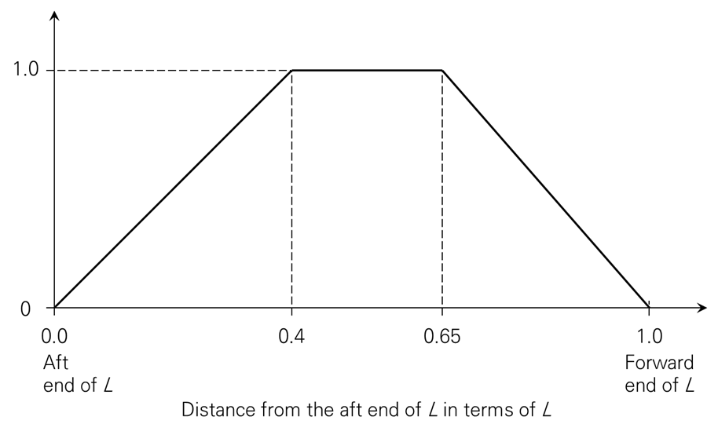
    **Figure : Distribution factor** $boldf _{m}$
    $f _{nl-vs}$ : Coefficient considering nonlinear effects applied to sagging, to be taken as:
    $f _{nl-vs} = \frac{11}{19} \left( \frac{C _{B} +0.7}{C _{B}} \right)$ for strength assessment.
    $f _{nl-vs} =1$ for fatigue assessment.
- **3.2** **Vertical wave shear force**
  - **3.2.1** The vertical wave shear forces at any longitudinal position, in kN, are to be taken as:
    $Q _{wv-pos} =0.3 f _{q-pos} f _{p} C _{"w"} LB \left( C _{B} +0.7 \right)$
    $Q _{wv-n e g} =-0.3f _{q-n eg} f _{p} C _{"w"} LB \left( C _{B} +0.7 \right)$
    where:
    $f _{p}$ : Coefficient to be taken as:
    $f _{p} =f _{ps}$ for strength assessment.
    $f _{p} =f _{fa} \left[ 0.27- \left( 17-8f _{T} \right) L \times 10 ^{-5} \right]$ for fatigue assessment.
    $f _{q-pos}$ : Distribution factor along the ship length for positive wave shear force(see **Figure 2**).
    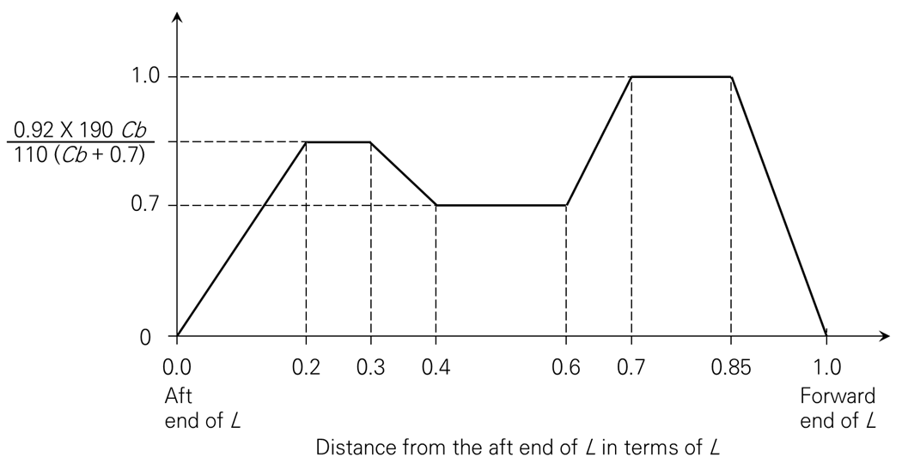
    **Figure : Distribution factor of positive vertical shear force**#eqnID-1509
    $f _{q-n eg}$ : Distribution factor along the ship length for negative wave shear force(see **Figure 3**).
    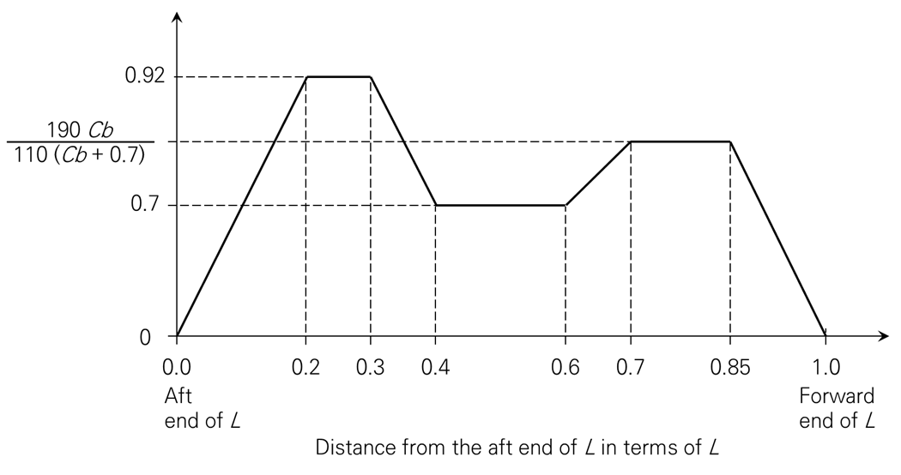
    **Figure : Distribution factor of negative vertical shear force** #eqnID-1511
- **3.3** **Horizontal wave bending moment**
  - **3.3.1** The horizontal wave bending moment at any longitudinal position, in kNm, is to be taken as:
    $M _{wh} = f _{nlh} f _{p} \left( 0.33+ \frac{L}{3400} \right) f _{m} C _{"w"} L ^{2} T _{LC} C _{B}$
    where:
    $f _{nlh}$ : Coefficient considering nonlinear effect to be taken as:
    $f _{nlh} =0.9$ for strength assessment
    $f _{nlh} =1.0$ for fatigue assessment.
    $f _{p}$ : Coefficient to be taken as:
    $f _{p} =f _{ps}$ for strength assessment.
    $f _{p} =f _{fa} \left \left( 0.26-0.02f _{T} \right) +6L \times 10 ^{-5} \right]$ for fatigue assessment.
    $f _{m}$ : Distribution factor defined in [3.1.1.
- **3.4** **Wave torsional moment**
  - **3.4.1** The wave torsional moment at any longitudinal position with respect to the ship baseline, in kNm, is to be taken as:
    $M _{wt} = f _{p} \left( M _{wt1} +M _{wt2} \right)$
    $M _{wt1} = \frac{1}{4} f _{t1} C _{w} \sqrt {\frac{L}{T _{LC}}} B ^{2} DC _{B}$
    $M _{wt2} = \frac{1}{8} f _{t2} C _{w} LB ^{2} C _{B}$
    where:
    $f _{t1}$, $f _{t2}$ : Distribution factor, taken as:
    $f _{t1} =0$ for $x<0$
    $f _{t1} = \left| \sin \left( \frac{2 \pi x}{L} \right) \right|$ for $0 \leq x \leq L$
    $f _{t1} =0$ for $x>L$
    $f _{t2} =0$ for $x<0$
    $f _{t2} =\sin ^{2} \left( \frac{\pi x}{L} \right)$ for $0 \leq x \leq L$
    $f _{t2} =0$ for $x>L$
    $f _{p}$ : Coefficient to be taken as:
    $f _{p} =f _{ps}$ for strength assessment.
    $f _{p} =f _{fa} \left[ \left( 0.15+0.1f _{T} \right) + \left( 3f _{T} \right) B \times 10 ^{-5} \right]$ for fatigue assessment.
- **3.5** **Hull girder loads for dynamic load cases**
  - **3.5.1** **General**
    The dynamic hull girder loads to be applied for the dynamic load cases defined in **Ch 4, Sec 2**, are given in **[3.5.2]** to **[3.5.5]**.
  - **3.5.2** **Vertical wave bending moment**
    The vertical wave bending moment, $M _{wv-LC}$, in $\mathrm{kNm}$, to be used for each dynamic load case in **Ch 4, Sec 2**, is defined in **Table 1**.

    | Load combination factor | $M _{wv-LC}$ |
    | --- | --- |
    | $C _{WV} \geq 0$ | $f _{\beta } C _{WV} M _{wv-h}$ |
    | $C _{WV} <0$ | $f _{\beta } C _{WV} M _{wv-s} $ |
    | $C _{WV}$ : Load combination factor for vertical wave bending moment, to be taken as specified in **Ch 4, Sec 2**. $M _{wv-Hog}$, $M _{wv-Sag}$ : Hogging and sagging vertical wave bending moment taking account of the considered design load scenario, as defined in **[3.1.1]**. |   |
  - **3.5.3** **Vertical wave shear force**
    The vertical wave shear force, $Q _{wv-LC}$, in $\mathrm{kN}$, to be used for each dynamic load case in **Ch 4, Sec 2**, is defined in **Table 2**.

    | Load combination factor | $Q _{wv-LC}$ |
    | --- | --- |
    | $C _{QW} \geq 0$ | $f _{\beta } C _{QW} Q _{wv-pos}$ |
    | $C _{QW} <0$ | $f _{\beta } C _{QW} \left\| Q _{wv-neg} \right\|$ |
    | $C _{QW}$ : Load combination factor for vertical wave shear force, to be taken as specified in **Ch 4, Sec 2**. $Q _{wv-pos}$, $Q _{wv-"neg"}$ : Vertical wave shear force taking account of the considered design load scenario, as defined in **[3.2.1]**. |   |
  - **3.5.4** **Horizontal wave bending moment**
    The horizontal wave bending moment, $M _{wh-LC}$, in $\mathrm{kNm}$, to be used for each dynamic load case defined in **Ch 4, Sec 2**, is to be taken as:
    $M _{wh-LC} =f _{\beta } C _{WH} M _{wh}$
    where:
    $C _{WH}$ : Load combination factor for horizontal wave bending moment, to be taken as specified in **Ch 4, Sec 2**.
    $M _{wh}$ : Horizontal wave bending moment taking account of the appropriate design load scenario, as defined in **[3.3.1]**.
  - **3.5.5** **Wave torsional moment**
    The wave torsional moment, $M _{wt-LC}$, in $\mathrm{kNm}$, to be used for each dynamic load case defined in **Ch 4, Sec 2**, is to be taken as:
    $M _{wt-LC} =f _{\beta } C _{WT} M _{wt}$
    where:
    $C _{WT}$ : Load combination factor for wave torsional moment, to be taken as specified in **Ch 4, Sec 2**.
    $M _{wt}$ : Wave torsional moment taking account of the appropriate design load scenario, as defined in **[3.4.1]**.

### Section 21 - External loads

**Symbols**
For symbols not defined in this section, refer to **Ch 1, Sec 4**.
$\lambda$ : Wave length, in m.
$B _{x}$ : Moulded breadth at the waterline, in m, at the considered cross section.
$x$, $y$, $z$ : $X$, $Y$ and $Z$ coordinates, in m, of the load point with respect to the reference coordinate system defined in **Ch 4, Sec 1, [1.2.1]**.
$f _{xL}$ : Ratio as defined in **Ch 4, Sec 2**.
$f _{yB}$ : Ratio between $Y$-coordinate of the load point and $B _{x}$, to be taken as:
$f _{yB} = \frac{\left| 2y \right|}{B _{x}}$ , but not greater than 1.0.
$f _{yB} =0$ when $B _{x} =0$.
$f _{yB1}$ : Ratio between $Y$-coordinate of the load point and $B$, to be taken as:
$f _{yB1} = \frac{\left| 2y \right|}{B}$ , but not greater than 1.0.
$f _{zT}$ : Ratio between $Z$-coordinate of the load point and $T _{LC}$, to be taken as:
$f _{zT} = \frac{z}{T _{LC}}$ , but not greater than 1.0.
$C _{w}$ : Wave coefficient defined in **Ch 4, Sec 4**.
$f _{T}$ : Ratio as defined in **Ch 4, Sec 3**.
$P _{W,WL}$ : Wave pressure at the waterline, kN/m^2, for the considered dynamic load case.
$P _{W,WL} =P _{W}$ for $y=B _{x} /2$ and $z=T _{LC}$
$h _{W}$ : Water head equivalent to the pressure at waterline, in $\mathrm{m}$, to be taken as:
$h _{w} = \frac{P _{W,WL}}{rhog}$
$f _{ps}$ : Coefficient for strength assessment, as defined in **Ch 4, Sec 3**.
$\theta$ : Roll angle, in deg, as defined in **Ch 4, Sec 3, [2.1.1]**.
$T _{\theta}$ : Roll period, in s, as defined in **Ch 4, Sec 3, [2.1.1]**.
$z _{SD}$ : Z coordinate, in m, of the midpoint of stiffener span, or of the middle of the plate field.
$f _{R}$ : Coefficient defined in **Ch 4, Sec 3**.
$f _{\beta }$ : Coefficient defined in **Ch 4, Sec 4**.

#### 1. Sea pressure

- **1.1** **Total pressure**
  - **1.1.1** The external pressure $P _{ex}$ at any load point of the hull, in kN/m^2, for the static (S) design load scenarios, is to be taken as:
    $P _{ex} =P _{S}$ but not less than 0.
    The total pressure $P _{ex}$ at any load point of the hull for the static plus dynamic (S+D) design load scenarios, is to be derived from each dynamic load case and is to be taken as:
    $P _{ex} =P _{S} +P _{W}$ but not less than 0.
    where:
    $P _{S}$ : Hydrostatic pressure, in kN/m^2, is defined in **[1.2].**
    $P _{W}$ : Wave pressure, in kN/m^2, is defined in **[1.3].**
- **1.2** **Hydrostatic pressure**
  - **1.2.1** The hydrostatic pressure, $P _{S}$ at any load point, in kN/m^2, is obtained from **Table 1**. See also **Figure 1**.
    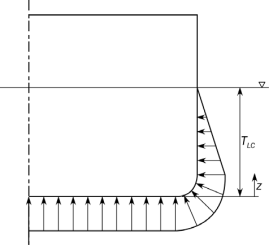
    **Figure : Hydrostatic pressure,** #eqnID-1615

    | Location | Hydrostatic pressure, $P _{S}$, in kN/m^2 |
    | --- | --- |
    | $z \leq T _{LC}$ | $\rho g (T _{LC} -z)$ |
    | $z>T _{LC}$ | $0$ |
- **1.3** **External dynamic pressures**
  - **1.3.1** **General**
    The hydrodynamic pressures for each dynamic load case defined in **Ch 4, Sec 2, [2]** are defined in **[1.3.2]** to **[1.3.8]**.
  - **1.3.2** **Hydrodynamic pressures for HSM load cases**
    The hydrodynamic pressures, $P _{W}$, for HSM-1 and HSM-2 load cases, at any load point, in kN/m^2, are to be obtained from **Table 2**.
    where:
    $P _{HS} =f _{R} f _{\beta } f _{p} f _{nl} f _{h} k _{a} k _{p} f _{yz} C _{W} \sqrt {\frac{L _{0} + \lambda -125}{L}}$
    $f _{p}$ : Coefficient to be taken as:
    $f _{p} =f _{ps}$
    $f _{nl}$ : Coefficient considering non-linear effects, to be taken as:
    $f _{nl} =0.7$ at $f _{xL} =0$
    $f _{nl} =0.9$ at $0.3 \leq f _{xL} <0.7$
    $f _{nl} =0.6$ at $f _{xL} =1$
    $f _{nl} =0.85$ at $f _{xL} =0$
    $f _{nl} =0.95$ at $0.3 \leq f _{xL} <0.7$
    $f _{nl} =0.80$ at $f _{xL} =1$
    Intermediate values are obtained by linear interpolation.
    $f _{h}$ : Design wave height coefficient to be taken as:
    $f _{h} =\exp \left[ - \left( L/135 \right) ^{2} /f _{T} \right] +(1.65-0.15f _{T} )$
    $k _{a}$ : Amplitude coefficient in the longitudinal direction of the ship, to be taken as:
    $k _{a} =k _{a-WL} f _{zT} +k _{a-CL} \left( 1-f _{zT} \right)$
    Intermediate values are to be interpolated.

    | $f _{xL}$ | $0$ | $0.2$ | $0.35$ | $0.55$ | $0.7$ | $1$ |
    | --- | --- | --- | --- | --- | --- | --- |
    | $k _{a-WL}$ | $0.8+0.35f _{T}$ | $0.1+0.2f _{T}$ | $1$ | $1$ | $0.25$ | $5.7f _{T} -1$ |
    | $k _{a-CL}$ | $2.0+1.3f _{T}$ | $0.1+0.3f _{T}$ | $1$ | $1$ | $0.5$ | $11.5f _{T} -2$ |

    $k _{p}$ : Phase coefficient in the longitudinal direction of the ship, to be taken as:
    $k _{p} =k _{p-WL} f _{zT} +k _{p-CL} \left( 1-f _{zT} \right)$
    Intermediate values are to be interpolated.

    | $f _{xL}$ | $0$ | $0.15$ | $0.3$ | $0.65$ | $0.7$ | $1$ |
    | --- | --- | --- | --- | --- | --- | --- |
    | $k _{p-WL}$ | $-0.45$ | $-1$ | $1$ | $1$ | $-1$ | $-0.8$ |

    | $f _{xL}$ | $0$ | $0.3-0.1f _{T}$ | $0.55-0.25f _{T}$ | $0.75-0.1f _{T}$ | $0.8-0.1f _{T}$ | $1$ |
    | --- | --- | --- | --- | --- | --- | --- |
    | $k _{p-CL}$ | $1.9f _{T} -1.5$ | $-1$ | $1$ | $1$ | $-1$ | $-0.75$ |

    $f _{yz}$ : Girth distribution coefficient, to be taken as:
    $f _{yz} =2.0f _{zT} +0.8f _{yB} +1.34$
    $\lambda$ : Wave length of the dynamic load case, in m, to be taken as:
    $\lambda = \left[ 0.95-0.4 \left( 1-f _{T} \right) \right] L$
    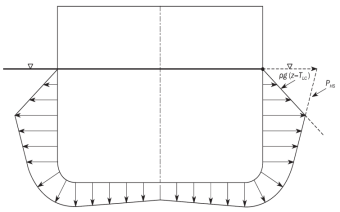
    **Figure : Transverse distribution amidships of dynamic pressure for HSM-1, HSA-1 and FSM-1 load cases**
    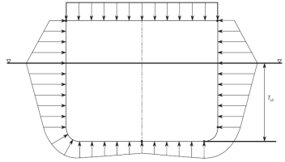
    **Figure : Transverse distribution amidships of dynamic pressure for HSM-2, HSA-2 and FSM-2 load cases**
    - **a)** For extreme sea loads design load scenario for strength assessment :
    - **b)** For ballast water exchange design load scenario for strength assessment :
  - **1.3.3** **Hydrodynamic pressure for HSA load cases**
    The hydrodynamic pressures, $P _{W}$, for HSA-1 and HSA-2 load cases at any load point, in kN/m^2, are to be obtained from **Table 6**.
    where:
    $P _{HS} =f _{R} f _{\beta } f _{p} f _{nl} f _{h} k _{a} k _{p} f _{yz} C _{W} \sqrt {\frac{L _{0} + \lambda -125}{L}}$
    $f _{p}$ : Coefficient to be taken as:
    $f _{p} =f _{ps}$
    $f _{nl}$ : Coefficient considering non-linear effects, to be taken as defined in **[1.3.2]**.
    $f _{h}$ : Design wave height coefficient to be taken as:
    $f _{h} =(2-0.26f _{T} ) \left( \frac{7}{10 ^{4}} L+0.85 \right)$
    $k _{a}$ : Amplitude coefficient in the longitudinal direction of the ship, to be taken as:
    $k _{a} =k _{a-WL} f _{zT} +k _{a-CL} \left( 1-f _{zT} \right)$
    Intermediate values are to be interpolated.

    | $f _{xL}$ | $0$ | $0.2$ | $0.35$ | $0.55$ | $0.7$ | $1$ |
    | --- | --- | --- | --- | --- | --- | --- |
    | $k _{a-WL}$ | $0.8+0.35f _{T}$ | $0.1+0.2f _{T}$ | $1$ | $1$ | $0.25$ | $1.35+3.5f _{T}$ |
    | $k _{a-CL}$ | $2+1.5f _{T}$ | $0.1+0.3f _{T}$ | $1$ | $1$ | $0.5$ | $11.5f _{T} -2$ |

    $k _{p}$ : Phase coefficient in the longitudinal direction of the ship, to be taken as:
    $k _{p} =k _{p-WL} f _{zT} +k _{p-CL} \left( 1-f _{zT} \right)$
    Intermediate values are to be interpolated.

    | $f _{xL}$ | $0$ | $0.35-0.15f _{T}$ | $0.4$ | $0.8-0.15f _{T}$ | $0.85-0.15f _{T}$ | $1$ |
    | --- | --- | --- | --- | --- | --- | --- |
    | $k _{p-WL}$ | $0.25+0.15f _{T}$ | $-1$ | $0.45-0.1f _{T}$ | $1$ | $-0.8$ | $-1$ |

    | $f _{xL}$ | $0$ | $0.25$ | $0.4$ | $0.65$ | $0.75$ | $1$ |
    | --- | --- | --- | --- | --- | --- | --- |
    | $k _{p-CL}$ | $0.6$ | $-1$ | $0.5-0.15f _{T}$ | $1$ | $-0.8$ | $-1$ |

    $f _{yz}$ : Girth distribution coefficient, to be taken as:
    $f _{yz} =1.5f _{zT} +0.6f _{yB} +1$
    $\lambda$ : Wave length of the dynamic load case, in m, to be taken as:
    $\lambda =0.95L$
  - **1.3.4** **Hydrodynamic pressure for FSM load cases**
    The hydrodynamic pressures, $P _{W}$, for FSM-1 and FSM-2 load cases, at any load point, in kN/m^2, are to be obtained from **Table 10**.
    where:
    $P _{FS} =f _{R} f _{\beta } f _{p} f _{nl} f _{h} k _{a} k _{p} f _{yz} C _{W} \sqrt {\frac{L _{0} + \lambda -125}{L}}$
    $f _{p}$ : Coefficient to be taken as:
    $f _{p} =f _{ps}$
    $f _{nl}$ : Coefficient considering non-linear effects, to be taken as:
    $f _{nl} =0.9$
    $f _{nl} =0.95$
    $f _{h}$ : Design wave height coefficient to be taken as:
    $f _{h} =(4.8-0.7f _{T} )(19.5L ^{-1} +0.3)$
    $k _{a}$ : Amplitude coefficient in the longitudinal direction of the ship, to be taken as:
    $k _{a} =k _{a-WL} f _{zT} +k _{a-CL} \left( 1-f _{zT} \right)$
    Intermediate values are to be interpolated.

    | $f _{xL}$ | $0$ | $0.2$ | $0.35$ | $0.55$ | $0.75$ | $1$ |
    | --- | --- | --- | --- | --- | --- | --- |
    | $k _{a-WL}$ | $2.25-0.95f _{T}$ | $0.65-0.25f _{T}$ | $1$ | $1$ | $0.4+0.1f _{T}$ | $1.65+0.85f _{T}$ |

    | $f _{xL}$ | $0$ | $0.45-0.25f _{T}$ | $0.35$ | $0.55$ | $0.7$ | $1$ |
    | --- | --- | --- | --- | --- | --- | --- |
    | $k _{a-CL}$ | $4.7-2f _{T}$ | $0.25$ | $1$ | $1$ | $0.8-0.6f _{T}$ | $2.7+1.8f _{T}$ |

    $k _{p}$ : Phase coefficient in the longitudinal direction of the ship, to be taken as:
    $k _{p} =k _{p-WL} f _{zT} +k _{p-CL} \left( 1-f _{zT} \right)$
    Intermediate values are to be interpolated.

    | $f _{xL}$ | $0$ | $0.3-0.15f _{T}$ | $0.3$ | $0.55+0.1f _{T}$ | $0.8$ | $1$ |
    | --- | --- | --- | --- | --- | --- | --- |
    | $k _{p-WL}$ | $-0.1-0.75f _{T}$ | $-1$ | $1$ | $1$ | $-1$ | $-0.7$ |

    | $f _{xL}$ | $0$ | $0.45-0.25f _{T}$ | $0.5-0.25f _{T}$ | $0.85-0.25f _{T}$ | $0.75$ | $1$ |
    | --- | --- | --- | --- | --- | --- | --- |
    | $k _{p-CL}$ | $-0.8$ | $-1$ | $1$ | $1$ | $-1$ | $-0.75$ |

    $f _{yz}$ : Girth distribution coefficient, to be taken as:
    $f _{yz} =1.6f _{zT} +0.6f _{yB} +1.5$
    $\lambda$ : Wave length of the dynamic load case, in m, to be taken as:
    $\lambda = \left[ 1.1-0.26 \left( 1-f _{T} \right) \right] L$
    - **a)** For extreme sea loads design load scenario for strength assessment :
    - **b)** For ballast water exchange design load scenario for strength assessment :
  - **1.3.5** **Hydrodynamic pressure for BSR load cases**
    The wave pressures, $P _{W}$, for BSR-1 and BSR-2 load cases, at any load point, in kN/m^2, are to be obtained from **Table 15**.
    where:
    For BSR-1P and BSR-2P load cases
    $P _{BSR} =f _{\beta } f _{nl} \left( 10ysin \theta +0.4f _{p} C _{W} \sqrt {\frac{L _{0} + \lambda -125}{L}} \left( f _{yB1} +1 \right) \right)$
    For BSR-1S and BSR-2S load cases
    $P _{BSR} =f _{\beta } f _{nl} \left( -10ysin \theta +0.4f _{p} C _{W} \sqrt {\frac{L _{0} + \lambda -125}{L}} \left( f _{yB1} +1 \right) \right)$
    $f _{nl}$ : Coefficient considering non-linear effects, to be taken as:
    $f _{nl} =1$
    $f _{nl} =1$
    $f _{p}$ : Coefficient to be taken as:
    $f _{p} =f _{ps}$
    $\lambda$ : Wave length of the dynamic load case, in $\mathrm{m}$, to be taken as:
    $\lambda = \frac{gT _{\theta } ^{2}}{2 \pi}$
    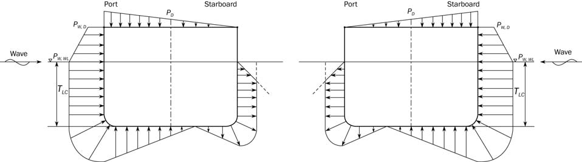
    **Figure : Transverse distribution of dynamic pressure for BSR-1P(left)와 BSR-1S(right) load cases**
    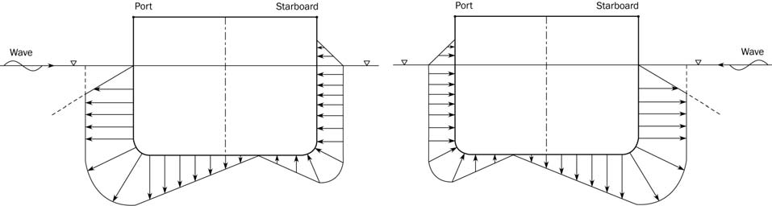
    **Figure : Transverse distribution of dynamic pressure for BSR-2P(left)와 BSR-2S(right) load cases**
    - **a)** For extreme sea loads design load scenario for strength assessment :
    - **b)** For ballast water exchange design load scenario for strength assessment :
  - **1.3.6** **Hydrodynamic pressure for BSP load cases**
    The wave pressure, $P_W$, for BSP-1 and BSP-2 load cases, at any load point, in kN/m^2, are to be obtained from **Table 16**.
    where:
    $P _{BSP} =f _{R} f _{\beta } f _{p} f _{nl} f _{h} k _{a} k _{p} f _{yz} C _{W} \sqrt {\frac{L _{0} + \lambda -125}{L}}$
    $f _{p}$ : Coefficient to be taken as:
    $f _{p} =f _{ps}$
    $f _{nl}$ : Coefficient considering non-linear effects, to be taken as:
    $f _{nl} =0.6$ at $f _{xL} =0$
    $f _{nl} =0.8$ for $0.3 \leq f _{xL} <0.7$
    $f _{nl} =0.6$ at $f _{xL} =1$
    $f _{nl} =0.6$ at $f _{xL} =0$
    $f _{nl} =0.8$ for $0.3 \leq f _{xL} <0.7$
    $f _{nl} =0.6$ at $f _{xL} =1$
    Intermediate values are obtained by linear interpolation.
    $f _{h}$ : Design wave height coefficient to be taken as:
    $f _{h} =(3.7-1.2f _{T} ) \left[ 1.6(L/B) ^{-1} +0.33 \right]$
    $k _{a}$ : Amplitude coefficient in the longitudinal direction of the ship, to be taken as:

    | $f _{xL}$ | $0$ | $0.3$ | $0.7$ | $1$ |
    | --- | --- | --- | --- | --- |
    | $k _{a}$ | $0.5$ | $1$ | $1$ | $0.7$ |

    Intermediate values are obtained by linear interpolation.
    $k _{p}$ : Phase coefficient in the longitudinal direction of the ship, to be taken as:
    $k _{p} =1$
    $f _{yz}$ : Girth distribution coefficient, to be taken as:

    | Transverse position | BSP-1P, BSP-2P | BSP-1S, BSP-2S |
    | --- | --- | --- |
    | $y \geq 0$ | $f _{yz} =7f _{zT} +6f _{yB} +1$ | $f _{yz} =3f _{zT} +2.5f _{yB} +1$ |
    | $y<0$ | $f _{yz} =3f _{zT} +2.5f _{yB} +1$ | $f _{yz} =7f _{zT} +6f _{yB} +1$ |

    $\lambda$ : Wave length of the dynamic load case, in $\mathrm{m}$, to be taken as:
    $\lambda = \left[ 0.5-0.4 \left( 1-f _{T} \right) \right] L$
    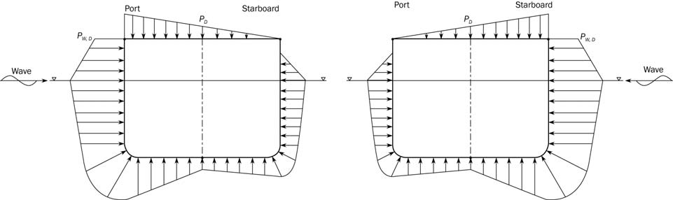
    **Figure : Transverse distribution of dynamic pressure for BSP-1P(left)와 BSP-1S(right) load cases**
    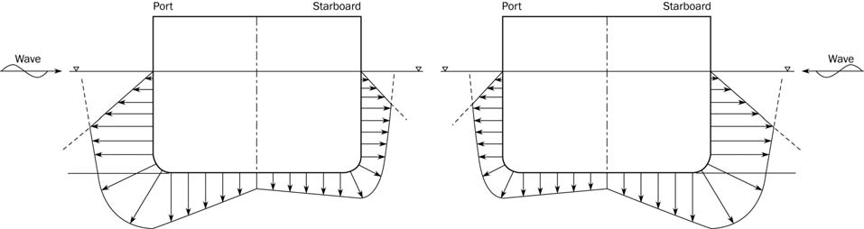
    **Figure : Transverse distribution of dynamic pressure for BSP-2P(left)와 BSP-2S(right) load cases**
    - **a)** For extreme sea loads design load scenario for strength assessment :
    - **b)** For ballast water exchange design load scenario for strength assessment :
  - **1.3.7** **Hydrodynamic pressure for OST load cases**
    The wave pressures, $P _{W}$, for OST-1 and OST-2 load cases, at any load point are to be obtained, in kN/m^2, from **Table 19**.
    where:
    $P _{OST} =f _{R} f _{\beta } f _{p} f _{nl} f _{h} k _{a} k _{p} f _{yz} C _{W} \sqrt {\frac{L _{0} + \lambda -125}{L}}$
    $f _{p}$ : Coefficient to be taken as:
    $f _{p} =f _{ps}$
    $f _{nl}$ : Coefficient considering non-linear effects, to be taken as:
    $f _{nl} =0.8$
    $f _{nl} =0.9$
    $f _{h}$ : Design wave height coefficient to be taken as:
    $f _{h} =(1-f _{T} )(70L ^{-0.11} -36)+ \left( 1.25f _{T} \right)$
    $k _{a}$ : Amplitude coefficient in the longitudinal direction of the ship, to be taken as:
    $k _{a} =k _{a-WL} f _{zT} +k _{a-CL} \left( 1-f _{zT} \right)$
    Intermediate values are to be interpolated.

    | Transverse position | OST-1P, OST-2P |   | OST-1S, OST-2S |   |
    | --- | --- | --- | --- | --- |
    | Transverse position | $f _{xL}$ | $k _{a-WL}$ | $f _{xL}$ | $k _{a-WL}$ |
    | $y \geq 0$ | $0$ | $1.55-0.85f _{T}$ | $0$ | $7.5-6f _{T}$ |
    | $y \geq 0$ | $0.2$ | $1.4-0.85f _{T}$ | $0.1$ | $4.5-3.9f _{T}$ |
    | $y \geq 0$ | $0.3$ | $1.15-0.7f _{T}$ | $0.2$ | $3.0-f _{T}$ |
    | $y \geq 0$ | $0.5$ | $1$ | $0.3$ | $3.0-f _{T}$ |
    | $y \geq 0$ | $0.6$ | $1.1$ | $0.4$ | $1.9-1.45f _{T}$ |
    | $y \geq 0$ | $0.7$ | $0.9$ | $0.6$ | $3.35-1.6f _{T}$ |
    | $y \geq 0$ | $0.85$ | $0.45-0.2f _{T}$ | $0.8$ | $3.9-2.0f _{T}$ |
    | $y \geq 0$ | $1$ | $1.05-0.15f _{T}$ | $1$ | $7.5-2.5f _{T}$ |
    | $y<0$ | $0$ | $7.5-6f _{T}$ | $0$ | $1.55-0.85f _{T}$ |
    | $y<0$ | $0.1$ | $4.5-3.9f _{T}$ | $0.2$ | $1.4-0.85f _{T}$ |
    | $y<0$ | $0.2$ | $3.0-f _{T}$ | $0.3$ | $1.15-0.7f _{T}$ |
    | $y<0$ | $0.3$ | $3.0-f _{T}$ | $0.5$ | $1$ |
    | $y<0$ | $0.4$ | $1.9-1.45f _{T}$ | $0.6$ | $1.1$ |
    | $y<0$ | $0.6$ | $3.35-1.6f _{T}$ | $0.7$ | $0.9$ |
    | $y<0$ | $0.8$ | $3.9-2.0f _{T}$ | $0.85$ | $0.45-0.2f _{T}$ |
    | $y<0$ | $1$ | $7.5-2.5f _{T}$ | $1$ | $1.05-0.15f _{T}$ |

    | $f _{xL}$ | $0$ | $0.1$ | $0.3$ | $0.45$ | $0.65$ | $0.8$ | $1$ |
    | --- | --- | --- | --- | --- | --- | --- | --- |
    | $k _{a-CL}$ | $11-8.5f _{T}$ | $3.3-2.2f _{T}$ | $1-0.85f _{T}$ | $1$ | $1$ | $0.45$ | $8-3.0f _{T}$ |

    $k _{p}$ : Phase coefficient in the longitudinal direction of the ship, to be taken as:
    $k _{p} =k _{p-WL} f _{zT} +k _{p-CL} \left( 1-f _{zT} \right)$
    Intermediate values are to be interpolated.

    | Transverse position | OST-1P, OST-2P |   | OST-1S, OST-2S |   |
    | --- | --- | --- | --- | --- |
    | Transverse position | $f _{xL}$ | $k _{p-WL}$ | $f _{xL}$ | $k _{p-WL}$ |
    | $y \geq 0$ | $0$ | $1$ | $0$ | $0.15+0.8f _{T}$ |
    | $y \geq 0$ | $0.25$ | $1$ | $0.5-0.4f _{T}$ | $2.0-2.3f _{T}$ |
    | $y \geq 0$ | $0.4$ | $-1$ | $0.65-0.25f _{T}$ | $3.45-3.5f _{T}$ |
    | $y \geq 0$ | $0.6$ | $-1$ | $0.7-0.25f _{T}$ | $2.9-3.8f _{T}$ |
    | $y \geq 0$ | $0.75$ | $-0.36-0.1f _{T}$ | $1.5-f _{T}$ | $-0.4-0.4f _{T}$ |
    | $y \geq 0$ | $0.85$ | $1$ | $0.9$ | $-0.7-0.15f _{T}$ |
    | $y \geq 0$ | $1$ | $-0.15-0.25f _{T}$ | $1$ | $-0.7-0.15f _{T}$ |
    | $y<0$ | $0$ | $0.15+0.8f _{T}$ | $0$ | $1$ |
    | $y<0$ | $0.5-0.4f _{T}$ | $2.0-2.3f _{T}$ | $0.25$ | $1$ |
    | $y<0$ | $0.65-0.25f _{T}$ | $3.45-3.5f _{T}$ | $0.4$ | $-1$ |
    | $y<0$ | $0.7-0.25f _{T}$ | $2.9-3.8f _{T}$ | $0.6$ | $-1$ |
    | $y<0$ | $1.5-f _{T}$ | $-0.4-0.4f _{T}$ | $0.75$ | $-0.36-0.1f _{T}$ |
    | $y<0$ | $0.9$ | $-0.7-0.15f _{T}$ | $0.85$ | $1$ |
    | $y<0$ | $1$ | $-0.7-0.15f _{T}$ | $1$ | $-0.15-0.25f _{T}$ |

    | $f _{xL}$ | $0$ | $0.5-0.25f _{T}$ | $0.55-0.25f _{T}$ | $0.25+0.5f _{T}$ | $1.3-0.5f _{T}$ | $1$ |
    | --- | --- | --- | --- | --- | --- | --- |
    | $k _{p-CL}$ | $1$ | $2-1.25f _{T}$ | $-1$ | $-1$ | $f _{T} -1.5$ | $-0.75$ |

    $f _{yz}$ : Girth distribution coefficient, to be taken as:

    | Transverse position | OST-1P, OST-2P | OST-1S, OST-2S |
    | --- | --- | --- |
    | $y \geq 0$ | $f _{yz} =7f _{zT} +3.5f _{yB} +1.2$ | $f _{yz} =1.4f _{zT} +0.2f _{yB} +1.2$ |
    | $y<0$ | $f _{yz} =1.4f _{zT} +0.2f _{yB} +1.2$ | $f _{yz} =7f _{zT} +3.5f _{yB} +1.2$ |

    $\lambda$ : Wave length of the dynamic load case, in $\mathrm{m}$, to be taken as:
    $\lambda =$ 0.45*L*
    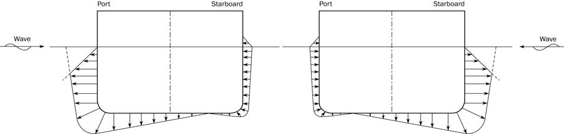
    **Figure : Transverse distribution of dynamic pressure for OST-1P(left)와 OST-1S(right) load cases**
    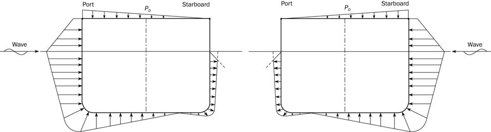
    **Figure : Transverse distribution of dynamic pressure for OST-2P(left)와 OST-2S(right) load cases**
    - **a)** For extreme sea loads design load scenario for strength assessment :
    - **b)** For ballast water exchange design load scenario for strength assessment :
  - **1.3.8** **Hydrodynamic pressure for OSA load cases**
    The wave pressures, $P _{W}$, for OSA-1 and OSA-2 load cases, at any load point, in kN/m^2, are to be obtained from **Table 25**.
    where:
    $P _{OSA} =f _{R} f _{\beta } f _{p} f _{nl} f _{h} k _{a} k _{p} f _{yz} C _{W} \sqrt {\frac{L _{0} + \lambda -125}{L}}$
    $f _{p}$ : Coefficient to be taken as:
    $f _{p} =f _{ps}$
    $f _{nl}$ : Coefficient considering non-linear effects, to be taken as:
    $f _{nl} =0.5$ at $f _{xL} =0$
    $f _{nl} =0.7$ at $0.3 \leq f _{xL} <0.7$
    $f _{nl} =0.5$ at $f _{xL} =1$
    $f _{nl} =0.7$ at $f _{xL} =0$
    $f _{nl} =0.8$ at $0.3 \leq f _{xL} <0.7$
    $f _{nl} =0.7$ at $f _{xL} =1$
    Intermediate values are obtained by linear interpolation.
    $f _{h}$ : Design wave height coefficient to be taken as:
    $f _{h} =\exp \left[ - \left( L/170 \right) ^{2} /f _{T} \right] +1.2$
    $k _{a}$ : Amplitude coefficient in the longitudinal direction of the ship, to be taken as:
    $k _{a} =k _{a-WL} f _{zT} +k _{a-CL} \left( 1-f _{zT} \right)$
    Intermediate values are to be interpolated.

    | Transverse position | OSA-1P, OSA-2P |   | OSA-1S, OSA-2S |   |
    | --- | --- | --- | --- | --- |
    | Transverse position | $f _{xL}$ | $k _{a-WL}$ | $f _{xL}$ | $k _{a-WL}$ |
    | $y \geq 0$ | $0$ | $0.5-0.3f _{T}$ | $0$ | $4.65-2.9f _{T}$ |
    | $y \geq 0$ | $0.1$ | $0.1$ | $0.4$ | $1.5f _{T} -0.55$ |
    | $y \geq 0$ | $0.5$ | $1$ | $0.4$ | $1.5f _{T} -0.55$ |
    | $y \geq 0$ | $0.65$ | $1$ | $0.65$ | $4.0-2.45f _{T}$ |
    | $y \geq 0$ | $0.9$ | $1.9-0.5f _{T}$ | $0.8$ | $4.1-2.65f _{T}$ |
    | $y \geq 0$ | $1$ | $2.65-f _{T}$ | $1$ | $10-4.1f _{T}$ |
    | $y<0$ | $0$ | $4.65-2.9f _{T}$ | $0$ | $0.5-0.3f _{T}$ |
    | $y<0$ | $0.4$ | $1.5f _{T} -0.55$ | $0.1$ | $0.1$ |
    | $y<0$ | $0.4$ | $1.5f _{T} -0.55$ | $0.35$ | $1.25-0.15f _{T}$ |
    | $y<0$ | $0.4$ | $1.5f _{T} -0.55$ | $0.5$ | $1$ |
    | $y<0$ | $0.65$ | $4.0-2.45f _{T}$ | $0.65$ | $1$ |
    | $y<0$ | $0.8$ | $4.1-2.65f _{T}$ | $0.9$ | $1.9-0.5f _{T}$ |
    | $y<0$ | $1$ | $10-4.1f _{T}$ | $1$ | $2.65-f _{T}$ |

    | $f _{xL}$ | $0$ | $0.2$ | $0.6$ | $0.65$ | $0.8$ | $0.9$ | $1$ |
    | --- | --- | --- | --- | --- | --- | --- | --- |
    | $k _{a-CL}$ | $5.5-2f _{T}$ | $1$ | $1$ | $1.5f _{T} -0.45$ | $1.35+0.4f _{T}$ | $5.6-f _{T}$ | $11.0f _{T} -3.6$ |

    $k _{p}$ : Phase coefficient in the longitudinal direction of the ship, to be taken as:
    $k _{p} =k _{p-WL} f _{zT} +k _{p-CL} \left( 1-f _{zT} \right)$
    Intermediate values are to be interpolated.

    | Transverse position | OSA-1P, OSA-2P |   | OSA-1S, OSA-2S |   |
    | --- | --- | --- | --- | --- |
    | Transverse position | $f _{xL}$ | $k _{p-WL}$ | $f _{xL}$ | $k _{p-WL}$ |
    | $y \geq 0$ | $0$ | $1$ | $0$ | $0.9-0.55f _{T}$ |
    | $y \geq 0$ | $0.1$ | $1$ | $0.6-0.5f _{T}$ | $0.8-0.5f _{T}$ |
    | $y \geq 0$ | $0.9-0.5f _{T}$ | $1$ | $0.35$ | $0.5f _{T}$ |
    | $y \geq 0$ | $0.6$ | $0$ | $0.25f _{T} +0.25$ | $-1$ |
    | $y \geq 0$ | $0.5f _{T} +0.3$ | $-1$ | $0.8$ | $-1$ |
    | $y \geq 0$ | $0.9$ | $-1$ | $1.1-0.25f _{T}$ | $-0.75$ |
    | $y \geq 0$ | $1$ | $-1$ | $1$ | $-0.75$ |
    | $y<0$ | $0$ | $0.9-0.55f _{T}$ | $0$ | $1$ |
    | $y<0$ | $0.6-0.5f _{T}$ | $0.8-0.5f _{T}$ | $0.1$ | $1$ |
    | $y<0$ | $0.35$ | $0.5f _{T}$ | $0.9-0.5f _{T}$ | $1$ |
    | $y<0$ | $0.25f _{T} +0.25$ | $-1$ | $0.6$ | $0$ |
    | $y<0$ | $0.8$ | $-1$ | $0.5f _{T} +0.3$ | $-1$ |
    | $y<0$ | $1.1-0.25f _{T}$ | $-0.75$ | $0.9$ | $-1$ |
    | $y<0$ | $1$ | $-0.75$ | $1$ | $-1$ |

    | $f _{xL}$ | $0$ | $0.35-0.25f _{T}$ | $0.15f _{T} +0.1$ | $0.7-0.25f _{T}$ | $0.75$ | $1$ |
    | --- | --- | --- | --- | --- | --- | --- |
    | $k _{p-CL}$ | $0.5$ | $0.7-0.2f _{T}$ | $0.9$ | $0.9$ | $-0.75$ | $-0.9$ |

    $f _{yz}$ : Girth distribution coefficient, to be taken as:

    | Transverse position | OSA-1P, OSA-2P | OSA-1S, OSA-2S |
    | --- | --- | --- |
    | $y \geq 0$ | $f _{yz} =5f _{zT} +3f _{yB} +1$ | $f _{yz} =2f _{zT} +0.5f _{yB} +1$ |
    | $y<0$ | $f _{yz} =2f _{zT} +0.5f _{yB} +1$ | $f _{yz} =5f _{zT} +3f _{yB} +1$ |

    $\lambda$ : Wave length of the dynamic load case, in m, to be taken as:
    $\lambda = \left[ 0.6-0.15 \left( 1-f _{T} \right) \right] L$
    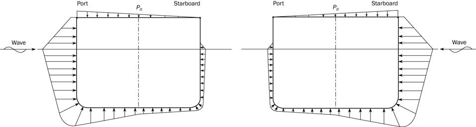
    **Figure : Transverse distribution of dynamic pressure for OSA-1P(left), OSA-1S(right) load cases**
    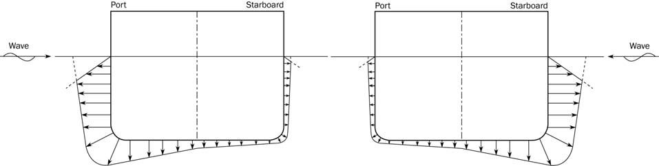
    **Figure : Transverse distribution of dynamic pressure for OSA-2P(left), OSA-2S(right) load cases**
    - **a)** For extreme sea loads design load scenario for strength assessment :
    - **b)** For ballast water exchange design load scenario for strength assessment :
  - **1.3.9** **Envelope of dynamic pressure**
    The envelope of dynamic pressure at any point, $P _{ex-itmax}$, is to be taken as the greatest pressure obtained from any of the load cases determined by **[1.3.2]** to **[1.3.8]**.
- **1.4** **External dynamic pressures for fatigue assessments**
  - **1.4.1** **General**
    The external pressure $P _{ex}$ at any load point of the hull for the fatigue static plus dynamic (F:S+D) design load scenario, is to be derived for each fatigue dynamic load case and is to be taken as:
    $P _{ex} =P _{S} +P _{W}$ but not less than 0.
    $P _{S}$ : Hydrostatic pressure, in kN/m^2, defined in **[1.2]**.
    $P _{W}$ : Hydrodynamic pressure, in kN/m^2, is defined in **[1.4.2]** to **[1.4.6]**.
  - **1.4.2** **Hydrodynamic pressures for HSM load cases**
    The hydrodynamic pressures, $P _{W}$, for load cases HSM-1 and HSM-2, at any load point, in kN/m^2, are to be obtained from **Table 31**.
    where:
    $P _{HS} =f _{p} f _{h} k _{a} k _{p} f _{yz} C _{W} \sqrt {\frac{L _{0} + \lambda -125}{L}}$
    $f _{p}$ : Coefficient to be taken as:
    $f _{p} =f _{fa} \left[ \left( 2.70-2f _{T} \right) + \left( 6-4f _{T} \right) L \times 10 ^{-5} \right]$
    $f _{h}$ : Coefficient to be taken as:
    $f _{h} =\exp(- \left( L/100 \right) ^{2} /f _{T} )+(0.31+0.01f _{T} )$
    $k _{a}$ : Amplitude coefficient in the longitudinal direction of the ship, to be taken as:
    $k _{a} =k _{a-WL} f _{zT} +k _{a-CL} \left( 1-f _{zT} \right)$
    Intermediate values are to be interpolated.

    | $f _{xL}$ | $0$ | $0.2$ | $0.3$ | $0.4$ | $0.55+(1-f _{T} )$ | $0.85$ | $1$ |
    | --- | --- | --- | --- | --- | --- | --- | --- |
    | $k _{a-WL}$ | $3f _{T} -0.5$ | $0.5f _{T}$ | $4.5f _{T} -3$ | $3.75f _{T} -2$ | $2-1.25f _{T}$ | $14.25f _{T} -9$ | $15f _{T} -5.5$ |

    | $f _{xL}$ | $0$ | $0.25$ | $0.45$ | $0.65$ | $0.75$ | $0.9$ | $1$ |
    | --- | --- | --- | --- | --- | --- | --- | --- |
    | $k _{a-CL}$ | $3.75f _{T} -1$ | $0.5f _{T}$ | $1$ | $1$ | $4f _{T} -2.25$ | $6.5f _{T} -1.5$ | $13.5-4f _{T}$ |

    $k _{p}$ : Phase coefficient in the longitudinal direction of the ship, to be taken as:
    $k _{p} =k _{p-WL} f _{zT} +k _{p-CL} \left( 1-f _{zT} \right)$
    Intermediate values are to be interpolated.

    | $f _{xL}$ | $0$ | $0.2+0.25(1-f _{T} )$ | $0.25+0.25(1-f _{T} )$ | $0.5+0.5(1-f _{T} )$ | $0.6+0.75(1-f _{T} )$ | $1$ |
    | --- | --- | --- | --- | --- | --- | --- |
    | $k _{p-WL}$ | $-0.5$ | $-1$ | $1$ | $1$ | $-1$ | $-1$ |

    | $f _{xL}$ | $0$ | $0.25$ | $0.3$ | $0.5$ | $0.8$ | $1$ |
    | --- | --- | --- | --- | --- | --- | --- |
    | $k _{p-CL}$ | $2.5-3f _{T}$ | $1.5f _{T} -2$ | $0.75f _{T}$ | $1.75-f _{T}$ | $- \left( 0.75+0.25f _{T} \right)$ | $-1$ |

    $f _{yz}$ : Girth distribution coefficient, to be taken as:
    $f _{yz} =2f _{zT} +0.8f _{yB} +1.34$
    $\lambda$ : Wave length of the dynamic load case, in $\mathrm{m}$, to be taken as:
    $\lambda = \left[ 0.95-0.4 \left( 1-f _{T} \right) \right] L$
  - **1.4.3** **Hydrodynamic pressures for FSM load cases**
    The hydrodynamic pressures, $P _{W}$, for load cases FSM-1 and FSM-2, at any load point, in kN/m^2, are to be obtained from **Table 36**.
    where:
    $P _{FS} =f _{p} f _{h} k _{a} k _{p} f _{yz} C _{W} \sqrt {\frac{L _{0} + \lambda -125}{L}}$
    $f _{p}$ : Coefficient to be taken as:
    $f _{p} =f _{fa} \left[ \left( 1-0.2f _{T} \right) + \left( 6-4f _{T} \right) L \times 10 ^{-5} \right]$
    $f _{h}$ : Coefficient to be taken as:
    $f _{h} =(4.8-1.26f _{T} )(7.7L ^{-1} +0.07)$
    $k _{a}$ : Amplitude coefficient in the longitudinal direction of the ship, to be taken as:
    $k _{a} =k _{a-WL} f _{zT} +k _{a-CL} \left( 1-f _{zT} \right)$
    Intermediate values are to be interpolated.

    | $f _{xL}$ | $0$ | $0.2+0.25(1-f _{T} )$ | $0.35+0.25(1-f _{T} )$ | $0.55$ | $0.75$ | $1$ |
    | --- | --- | --- | --- | --- | --- | --- |
    | $k _{a-WL}$ | $6-5f _{T}$ | $0.3+0.2f _{T}$ | $0.5+0.5f _{T}$ | $1$ | $f _{T} -0.5$ | $7.5-5.5f _{T}$ |

    | $f _{xL}$ | $0$ | $0.2+0.25(1-f _{T} )$ | $0.35$ | $0.55$ | $0.70$ | $1$ |
    | --- | --- | --- | --- | --- | --- | --- |
    | $k _{a-CL}$ | $3.5-f _{T}$ | $0.25f _{T}$ | $1$ | $1$ | $0.2$ | $3.25+0.5f _{T}$ |

    $k _{p}$ : Phase coefficient in the longitudinal direction of the ship, to be taken as:
    $k _{p} =k _{p-WL} f _{zT} +k _{p-CL} \left( 1-f _{zT} \right)$
    Intermediate values are to be interpolated.

    | $f _{xL}$ | $0$ | $0.15+0.5(1-f _{T} )$ | $0.3$ | $0.6+0.5(1-f _{T} )$ | $0.8-0.25(1-f _{T} )$ | $1$ |
    | --- | --- | --- | --- | --- | --- | --- |
    | $k _{p-WL}$ | $-1$ | $-1$ | $1$ | $1$ | $-1$ | $-0.75$ |

    | $f _{xL}$ | $0$ | $0.2+0.25(1-f _{T} )$ | $0.25+0.25(1-f _{T} )$ | $0.65$ | $0.75$ | $1$ |
    | --- | --- | --- | --- | --- | --- | --- |
    | $k _{p-CL}$ | $-1$ | $-1$ | $1$ | $1$ | $-1$ | $-0.75$ |

    $f _{yz}$ : Girth distribution coefficient, to be taken as:
    $f _{yz} =1.6f _{zT} +0.6f _{yB} +1.5$
    $\lambda$ : Wave length of the dynamic load case, in m, to be taken as:
    $\lambda = \left[ 1.1-0.26 \left( 1-f _{T} \right) \right] L$
  - **1.4.4** **Hydrodynamic pressures for BSR load cases**
    The hydrodynamic pressures, $P _{W}$, for load cases BSR-1 and BSR-2, at any load point, in kN/m^2, are to be obtained from **Table 41**.
    where:
    For BSR-1P and BSR-2P load cases
    $P _{BSR} =-10ysin \theta +0.4f _{p} C _{W} \sqrt {\frac{L _{0} + \lambda -125}{L}} \left( f _{yB1} +1 \right)$
    For BSR-1S and BSR-2S load cases
    $P _{BSR} =10ysin \theta +0.4f _{p} C _{W} \sqrt {\frac{L _{0} + \lambda -125}{L}} \left( f _{yB1} +1 \right)$
    $f _{p}$ : Coefficient to be taken as:
    $f _{p} =f _{fa} \left[ \left( 0.23+0.04f _{T} \right) + \left( 2-12f _{T} \right) B \times 10 ^{-4} \right]$
    $\lambda$ : Wave length of the dynamic load case, in m, to be taken as:
    $\lambda = \frac{gT _{\theta } ^{2}}{2 \pi}$
  - **1.4.5** **Hydrodynamic pressures for BSP load cases**
    The hydrodynamic pressures, $P _{W}$, for load cases BSP-1 and BSP-2, at any load point, in kN/m^2, are to be obtained from **Table 42**.
    where:
    $P _{BSP} =f _{p} f _{h} k _{a} k _{p} f _{yz} C _{W} \sqrt {\frac{L _{0} + \lambda -125}{L}}$
    $f _{p}$ : Coefficient to be taken as:
    $f _{p} =f _{fa} \left[ \left( 0.4+1.1f _{T} \right) + \left( 1-10f _{T} \right) B \times 10 ^{-3} \right]$
    $f _{h}$ : Coefficient to be taken as:
    $f _{h} =(4-f _{T} )(0.55 \left( L/B \right) ^{-1} +0.01)$
    $k _{a}$ : Amplitude coefficient in the longitudinal direction of the ship, to be taken as:

    | $f _{xL}$ | $0$ | $0.3$ | $0.7$ | $1$ |
    | --- | --- | --- | --- | --- |
    | $k _{a}$ | $0.5$ | $1$ | $1$ | $0.7$ |

    Intermediate values are to be interpolated.
    $k _{p}$ : Phase coefficient in the longitudinal direction of the ship, to be taken as:
    $k _{p} =1$
    $f _{yz}$ : Girth distribution coefficient, to be taken as:

    | Transverse position | BSP-1P, BSP-2P | BSP-1S, BSP-2S |
    | --- | --- | --- |
    | $y \geq 0$ | $f _{yz} =7f _{zT} +6f _{yB} +1$ | $f _{yz} =3f _{zT} +2.5f _{yB} +1$ |
    | $y<0$ | $f _{yz} =3f _{zT} +2.5f _{yB} +1$ | $f _{yz} =7f _{zT} +6f _{yB} +1$ |

    $\lambda$ : Wave length of the dynamic load case, in $\mathrm{m}$, to be taken as:
    $\lambda = \left[ 0.5-0.4 \left( 1-f _{T} \right) \right] L$
  - **1.4.6** **Hydrodynamic pressures for OST load cases**
    The hydrodynamic pressures, $P _{W}$, for load cases OST-1 and OST-2, at any load point, in $\mathrm{kN}/m ^{2}$, are to be obtained from **Table 45**.
    where:
    $P _{OST} =f _{p} f _{h} k _{a} k _{p} f _{yz} C _{W} \sqrt {\frac{L _{0} + \lambda -125}{L}}$
    $f _{p}$ : Coefficient to be taken as:
    $f _{p} =f _{fa} \left[ \left( 0.04+0.15f _{T} \right) - \left( 9-12f _{T} \right) B \times 10 ^{-4} \right]$
    $f _{h}$ : Coefficient to be taken as:
    $f _{h} =(1-f _{T} )(41L ^{-0.02} -36)+ \left( 0.29f _{T} \right)$
    $k _{a}$ : Amplitude coefficient in the longitudinal direction of the ship, to be taken as:
    $k _{a} =k _{a-WL} f _{zT} +k _{a-CL} \left( 1-f _{zT} \right)$
    Intermediate values are to be interpolated.

    | $f _{xL}$ | $0$ | $0.25+0.25 \left( 1-f _{T} \right)$ | $0.45$ | $0.65$ | $0.8$ | $1$ |
    | --- | --- | --- | --- | --- | --- | --- |
    | $k _{a-CL}$ | $8.5-6.25f _{T}$ | $1.5-1.25f _{T}$ | $1$ | $1$ | $0.5$ | $12.25-6f _{T}$ |

    | Transverse position | OST-1P, OST-2P |   | OST-1S, OST-2S |   |
    | --- | --- | --- | --- | --- |
    | Transverse position | $f _{xL}$ | $k _{a-WL}$ | $f _{xL}$ | $k _{a-WL}$ |
    | $y \geq 0$ | $0$ | $10-9f _{T}$ | $0$ | $10-10f _{T}$ |
    | $y \geq 0$ | $0.3$ | $2.25f _{T} -1.5$ | $0.2$ | $2.5-1.5f _{T}$ |
    | $y \geq 0$ | $0.4-0.25 \left( 1-f _{T} \right)$ | $1$ | $0.35-0.25 \left( 1-f _{T} \right)$ | $0.5-0.25f _{T}$ |
    | $y \geq 0$ | $0.5$ | $1$ | $0.55-0.25 \left( 1-f _{T} \right)$ | $1+0.25f _{T}$ |
    | $y \geq 0$ | $0.6$ | $1$ | $0.7$ | $1+0.25f _{T}$ |
    | $y \geq 0$ | $0.8$ | $1.25f _{T} -0.5$ | $0.85-0.25 \left( 1-f _{T} \right)$ | $2.5f _{T} -1.5$ |
    | $y \geq 0$ | $1$ | $19.5-17f _{T}$ | $1$ | $15.5-13f _{T}$ |
    | $y<0$ | $0$ | $10-10f _{T}$ | $0$ | $10-9f _{T}$ |
    | $y<0$ | $0.2$ | $2.5-1.5f _{T}$ | $0.3$ | $2.25f _{T} -1.5$ |
    | $y<0$ | $0.35-0.25 \left( 1-f _{T} \right)$ | $0.5-0.25f _{T}$ | $0.4-0.25 \left( 1-f _{T} \right)$ | $1$ |
    | $y<0$ | $0.55-0.25 \left( 1-f _{T} \right)$ | $1+0.25f _{T}$ | $0.5$ | $1$ |
    | $y<0$ | $0.7$ | $1+0.25f _{T}$ | $0.6$ | $1$ |
    | $y<0$ | $0.85-0.25 \left( 1-f _{T} \right)$ | $2.5f _{T} -1.5$ | $0.8$ | $1.25f _{T} -0.5$ |
    | $y<0$ | $1$ | $15.5-13f _{T}$ | $1$ | $19.5-17f _{T}$ |

    $\lambda$ : Wave length of the dynamic load case, in m, to be taken as:
    $\lambda =0.45L$
    $f _{yz}$ : Girth distribution coefficient, to be taken as:

    | Transverse position | OST-1P, OST-2P | OST-1S, OST-2S |
    | --- | --- | --- |
    | $y \geq 0$ | $f _{yz} =26f _{zT} +15f _{yB} +8$ | $f _{yz} =18f _{zT} +7f _{yB} +8$ |
    | $y<0$ | $f _{yz} =18f _{zT} +7f _{yB} +8$ | $f _{yz} =26f _{zT} +15f _{yB} +8$ |

    $k _{p}$ : Phase coefficient in the longitudinal direction of the ship, to be taken as:
    $k _{p} =k _{p-WL} f _{zT} +k _{p-CL} \left( 1-f _{zT} \right)$
    Intermediate values are to be interpolated.

    | $f _{xL}$ | $0$ | $0.25+0.25 \left( 1-f _{T} \right)$ | $0.3+0.25 \left( 1-f _{T} \right)$ | $0.75$ | $0.8$ | $1$ |
    | --- | --- | --- | --- | --- | --- | --- |
    | $k _{p-CL}$ | $1$ | $0.5+0.25f _{T}$ | $-0.5$ | $-1$ | $f _{T} -0.5$ | $0$ |

    | Transverse position | OST-1P, OST-2P |   | OST-1S, OST-2S |   |
    | --- | --- | --- | --- | --- |
    | Transverse position | $f _{xL}$ | $k _{p-WL}$ | $f _{xL}$ | $k _{p-WL}$ |
    | $y \geq 0$ | $0$ | $1$ | $0$ | $9-10f _{T}$ |
    | $y \geq 0$ | $0.2+0.5 \left( 1-f _{T} \right)$ | $1$ | $0.2+0.5 \left( 1-f _{T} \right)$ | $6.5-7.5f _{T}$ |
    | $y \geq 0$ | $0.45-0.5 \left( 1-f _{T} \right)$ | $-1$ | $0.35$ | $8f _{T} -7$ |
    | $y \geq 0$ | $0.5$ | $-1$ | $0.75$ | $1.25f _{T} -2$ |
    | $y \geq 0$ | $0.65+0.5 \left( 1-f _{T} \right)$ | $-1$ | $0.8$ | $3.25-4f _{T}$ |
    | $y \geq 0$ | $0.85-0.25 \left( 1-f _{T} \right)$ | $2.5f _{T} -1.5$ | $0.9$ | $2-2.5f _{T}$ |
    | $y \geq 0$ | $1$ | $0.5$ | $1$ | $0$ |
    | $y<0$ | $0$ | $9-10f _{T}$ | $0$ | $1$ |
    | $y<0$ | $0.2+0.5 \left( 1-f _{T} \right)$ | $6.5-7.5f _{T}$ | $0.2+0.5 \left( 1-f _{T} \right)$ | $1$ |
    | $y<0$ | $0.35$ | $8f _{T} -7$ | $0.45-0.5 \left( 1-f _{T} \right)$ | $-1$ |
    | $y<0$ | $0.75$ | $1.25f _{T} -2$ | $0.5$ | $-1$ |
    | $y<0$ | $0.8$ | $3.25-4f _{T}$ | $0.65+0.5 \left( 1-f _{T} \right)$ | $-1$ |
    | $y<0$ | $0.9$ | $2-2.5f _{T}$ | $0.85-0.25 \left( 1-f _{T} \right)$ | $2.5f _{T} -1.5$ |
    | $y<0$ | $1$ | $0$ | $1$ | $0.5$ |

#### 2. External pressures on exposed decks

- **2.1** **Application**
  - **2.1.1** The external pressures and forces on exposed decks are only to be applied for strength assessment.
  - **2.1.2** The green sea pressures defined in **[2.2]** for exposed decks are to be considered independently of the pressures due to distributed cargo or other equipment loads and any concentrated forces due to cargo or other unit equipment loads, defined in **[2.3.1]** and **[2.3.2]** respectively.
- **2.2** **Green sea loads**
  - **2.2.1** **Pressure on exposed deck**
    The external dynamic pressure due to green sea loading, $P _{D}$, at any point of an exposed deck, in kN/m^2, for the static plus dynamic (S+D) design load scenarios is to be derived for each dynamic load case and is to be taken as defined in **[2.2.3]** to **[2.2.4]**.
    The external dynamic pressure due to green sea loading, $P _{D}$, at any point of an exposed deck for the static (S) design load scenarios is zero.
  - **2.2.2** If a breakwater is fitted on the exposed deck, no reduction in the green sea pressure is allowed for the area of the exposed deck located aft of the breakwater.
  - **2.2.3** **HSM, HSA and FSM load cases**
    The external pressure, $P _{D}$, for HSM, HSA and FSM load cases, at any load point of an exposed deck is to be obtained, in kN/m^2, from the following formula, see **Figure 2** and **Figure 3**.
    $P _{D} = \chi P _{W}$
    where:
    $P _{W} =P _{W,D}$, but not to be taken less than $P_"D-\min"$.
    $P _{W,D}$ : Pressure, in kN/m^2, obtained at side of the exposed deck for HSM, HSA and FSM load cases as defined in **[1.3]**.
    $P _{"D-\min"}$ : Minimum exposed deck pressure, in kN/m^2, to be taken as:
    • For cargo hold analysis according to **Ch 7**: $P _{"D-\min"} =0$.
    • For other cases: $P _{"D-\min"}$ as defined in **Table 51**.
    $\chi$ : Coefficient defined in **Table 52**.

    | Location | Minimum pressure on exposed deck, $P _{D-\min}$, in kN/m^2 |   |
    | --- | --- | --- |
    | Location | $L _{LL} \geq 100\mathrm{m}$ | $L _{LL} <100\mathrm{m}$ |
    | $x _{LL} /L _{LL} \leq 0.75$ | $34.3$ | $14.9+0.195L _{LL}$ |
    | $x _{LL} /L _{LL} >0.75$ | $34.3+(14.8+a(L _{ LL}-100))( 4\frac{x _{ LL}}{L _{ LL}}-3)$ | $12.2+ \frac{L _{ LL}}{9}( 5\frac{x _{ LL}}{L _{ LL}}-2)+3.6 \frac{x _{ LL}}{L _{ LL}}$ |
    | $a$ : $0.0726$ $x _{LL}$ : $X$-coordinate of the load point measured from the aft end of the freeboard length $L _{LL}$. |   |   |

    | Exposed deck location | $\chi$ |
    | --- | --- |
    | Freeboard deck | $1.00$ |
    | Superstructure deck including forecastle deck | $0.75$ |
    | 1st tier of deckhouse | $0.56$ |
    | 2nd tier of deckhouse | $0.42$ |
    | 3rd tier of deckhouse | $0.32$ |
    | 4th tier of deckhouse | $0.25$ |
    | 5th tier of deckhouse | $0.20$ |
    | 6th tier of deckhouse | $0.15$ |
    | 7th tier of deckhouse and above | $0.10$ |

    The external pressure, $P _{D}$, for HSM, HSA and FSM load cases, at any load point of an trunk deck including sloping plate is to be obtained, in kN/m^2, from the following formula.
    $P _{D} =0.75 ^{c} P _{W}$ but not to be taken less than 20 kN/m^2.
    where:
    $P _{W}$ : Pressure, in kN/m^2, obtained at side of the exposed deck for HSM, HSA and FSM load cases.
    • For cargo hold analysis according to **Ch 7** : $P _{W} =0$.
    • For other cases : $P _{W}$ as defined in **[2.2.3] a)**.
    $c$ : Coefficient to be taken as:
    $c=(z-z _{fdk} )/2.3$
    $z$ : distance from baseline to load point, in m.
    $z _{fdk}$ : distance from baseline to freeboard deck considered at side, in m.
    - **a)** Case 1: External pressure for exposed deck except trunk deck
    - **b)** Case 2: External pressure for trunk deck
  - **2.2.4** **BSR, BSP, OST and OSA load cases**
    The external pressure, $P _{D}$, for BSR, BSP, OST and OSA load cases at any load point of an exposed deck is to be obtained, in kN/m^2, by linear interpolation between the pressures at the port and starboard deck edges. (see **Figure 4** to **Figure 10**)
    $P _{D, stb} = \chi P _{W,D-stb}$
    $P _{D, pt} = \chi P _{W,D-pt}$
    where:
    $P _{W, D-stb}$: Pressure obtained at starboard deck edge for BSR, BSP, OST or OSA load cases as defined in **[1.3]**, as appropriate.
    $P _{W, D-pt}$ : Pressure obtained at port deck edge for BSR, BSP, OST and OSA load cases as defined in **[1.3]**, as appropriate.
    $\chi$ : Coefficient defined in **Table 52**.
    The external pressure, $P _{D}$, for BSR, BSP, OST and OSA load cases, at any load point of an trunk deck including slanted plate is to be obtained, in kN/m^2, from the following formula.
    $P _{D} =P _{W,D-"\int"} - \rho g(z-z _{"\int"} )$
    where:
    $P _{W,D-"\int"}$: Pressure obtained by linear interpolation in transverse direction to the transverse coordinate of the intersection of deck plate and truck deck sloping plate between $P _{W, D-stb}$ and $P _{W, D-pt}$.
    $z$ : as defined in **[2.2.3]**
    $z _{"in t"}$ : distance from baseline to intersection of deck plate and truck deck sloping plate
  - **2.2.5** **Envelope of dynamic pressures on exposed deck**
    The envelope of dynamic pressure at any point of an exposed deck, $P _{"D-\max"}$, is to be taken as the greatest pressure obtained from any of the load cases determined by **[2.2.3]** and **[2.2.4]**.
- **2.3** **Load carried on exposed deck**
  - **2.3.1** **Pressure due to distributed load**
    If a distributed load is carried on an exposed deck, the static and dynamic pressures due to this distributed load are to be considered.
    The total pressure, $P _{dl}$, in kN/m^2, due to this distributed load for the static (S) design load scenario is to be taken as:
    $P _{dl} =P _{dl-s}$
    The pressure $P _{dl}$, in kN/m^2, due to this distributed load for the static plus dynamic (S+D) design load scenario is to be derived for each dynamic load case and is to be taken as:
    $P _{dl} =P _{dl-s} +P _{dl-d}$
    where:
    $P _{dl-s}$ : Static pressure, in kN/m^2, due to the distributed load, to be defined by the Designer and, in general, but not less than 10 kN/m^2.
    $P _{dl-d}$ : Dynamic pressure, in kN/m^2, due to the distributed load, to be taken as:
    $P _{dl-d} =f _{\beta} \frac{a _{Z}}{g} P _{dl-s}$
    $a _{Z}$ : Vertical acceleration, in m/s^2, at the centre of gravity of the distributed load, for the considered load case, to be obtained according to **Ch 4, Sec 3, [3.2.4]**.
  - **2.3.2** **Concentrated force due to unit load**
    If a unit load is carried on an exposed deck, the static and dynamic forces due to the unit load carried are to be considered.
    The force $F _{U}$, in kN, due to this concentrated load for the static (S) design load scenarios, is to be taken as:
    $F _{U} =F _{U-s}$
    The force $F _{U}$, in kN, due to this concentrated load for the static plus dynamic (S+D) design load scenarios is to be derived for each dynamic load case and is to be taken as:
    $F _{U} =F _{U-s} +F _{U-d}$
    where:
    $F _{U-s}$ : Static force, in kN, due to the unit load to be taken equal to:
    $F _{U-s} =m _{U} g$
    $F _{U-d}$ : Dynamic force, in kN, due to unit load to be taken equal to:
    $F _{U-d} =m _{U} f _{\beta} a _{Z}$
    $m _{U}$ : Mass of the unit load carried, in $t$.
    $a _{Z}$ : Vertical acceleration, in m/s^2, at the centre of gravity of the unit load carried for the considered load case, to be obtained according to **Ch 4, Sec 3, [3.2.4]**.

#### 3. External impact pressures for the bow area (2024)

- **3.1** **Application**
  - **3.1.1** The impact pressures for the bow area are only to be applied for strength assessment.
- **3.2** **Equivalent design pressure**
  - **3.2.1** **Entry impact pressure**
    The entry impact pressure, $P _{EI}$ in kN/m^2, as equivalent static pressure is to be taken as:
    $P _{EI} =CP _{E} C _{E}$
    where:
    $C$ : Vertical distribution coefficient, to be taken as:
    $C = 1.0$ for bottom slamming
    $C = 0.18(C _{W} - 0.5h _{0} )$ for bow impact
    $C = 0.18(C _{W} - 2.0h _{0} )$ for stern slamming
    $C$ is not to be less than 0.0 nor greater than 1.0.
    $C _{W}$ : Wave coefficient as defined in **Ch 4, Sec 4.**
    $h _{0}$ : Vertical distance, in m, from the waterline at the draught $T _{SC}$ to the calculation point, see **Figure 12** and **Figure 13**, to be taken as:
    ⦁For bow impact
    $h _{0} = 0$   for calculation point between $T _{BAL}$ and $T _{SC}$
    $h _{0} = z - T _{SC}$ for calculation point above the draught $T _{SC}$ 
    ⦁For stern slamming
    $h _{0} = 0$   for calculation point between $T _{AE}$ and $T _{SC}$
    $h _{0} = z - T _{SC}$ for calculation point above the draught $T _{SC}$
    $C _{E}$ : Equivalent coefficient, to be taken as:
    ⦁For $\xi \leq 30 {}^{\circ}$
    $C _{E} = 0.03 \xi +0.1$ for bottom slamming
    $C _{E} = 0.03 \xi +0.1$ for bow impact
    $C _{E} = 0.032 \xi +0.04$ for stern slamming
    ⦁For $\xi > 30 {}^{\circ}$
    $C _{E} = 1.0$
    $\xi$ : Angle, in deg, to be taken as:
    $\xi = 90 - \alpha > 3.85$ for bottom slamming
    $\xi = 64 - \alpha > 3.85$ for bow impact
    $\xi = 90 - \alpha > 0$ for stern slamming
    $\alpha$ : Flare angle, in deg, at the calculation point defined as the angle between a vertical line and the tangent to the side plating, measured in a vertical plane normal to the horizontal tangent to the shell plating, see **Figure 12** and **Figure 13**.
    $P _{E}$ : Impact pressure, in kNm.
      $P _{E} = \frac{1}{2} \rho K _{E} V ^{2} _{E}$
    $K _{E}$ : Pressure factor, to be taken as:
       $K _{E} = 745 \xi ^{-1.22}$
    $V _{E}$ : Entrance speed, in m/s
    $V _{E} =0.38(22.8-0.014L)$ for bottom slamming and bow impact
    $V _{E} =0.6(6.8+0.01L)$ for stern slamming
    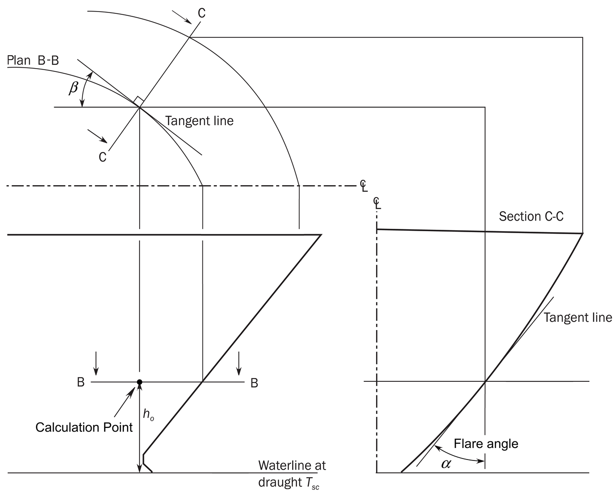
    **Figure : Definition of bow geometry**
    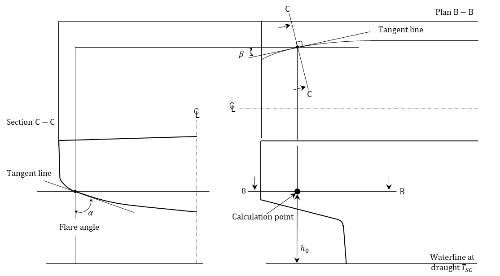
    **Figure : Definition of stern geometry**
  - **3.2.2** **Breaking wave impact pressure**
    The breaking wave impact pressure, $P _{BI}$ in kN/m^2, is to be taken as:
    $P _{BI} =CP _{B}$
    where:
    $C$ : Vertical distribution coefficient, as given in **[3.2.1]**.
    $C _{W}$ : Wave coefficient, as defined in **Ch 4, Sec 4**.
    $h _{0}$ : Vertical distance, in m, as given in **[3.2.1]**.
    $P _{B}$ : Impact pressure, in kNm.
    $P _{B} = \frac{1}{2} \rho K _{E} V _{B}^{2} C _{\emptyset }$
    $K _{B}$ : Coefficient, to be taken as:
    $K _{B}$ = 4
    $V _{B}$ : Relative velocity, in m/, to be taken as:
    $V _{B} =0.514V \cdot \sin( \beta +30)+V _{BW}$
    $V _{BW}$ : Breaking wave velocity, in m/s, to be taken as:
    $V _{BW} = 12C _{\beta }$
    $C _{\beta }$ : Coefficient, to be taken as:
    $C _{\beta } =0.25+ \frac{\beta}{60}$ for  $0 {}^{\circ} < \beta <45 {}^{\circ}$
    $C _{\beta } =1$  for $45 {}^{\circ} \leq \beta \leq 90 {}^{\circ}$
    $C _{\emptyset }$ : Hull inclination angle influence coefficient, in deg, to be taken as:
    $C _{\emptyset } = 1- \frac{\alpha}{60}$ for $\beta <15 {}^{\circ}$
    $C _{ \emptyset } =1$ for $\beta \geq 15 {}^{\circ}$
    $\alpha$ : Flare angle, in deg, as given in **[3.2.1]**.
    $\beta$ : Angle, in deg, at the calculation point defined as the angle between a longitudinal line and a tangent to the side plating in a horizontal plan, see **Figure 12** and **Figure 13**.
- **3.3** **Bottom slamming**
  - **3.3.1** **Design pressures**
    The bottom slamming pressure, $P _{SL}$ in kN/m^2, at the centre line for the bottom slamming design load scenario is to be taken as:
    $P _{SL} =C _{x} P _{EI}$
    where:
    $C _{x}$ : Longitudinal distribution factor along the ship length, to be taken as:
    $C _{x} = 0.0$ for $f _{xL} \leq 0.5$ 
     $C _{x} = 1.0$ for $f _{xL} = 0.5 + c _{2}$  
     $C _{x} = 1.0$ for $f _{xL} = 0.6 + c _{2}$  
     $C _{x} = 0.5$ for $f _{xL} = 1.0$ 
    Intermediate values of $C _{x}$ are obtained by linear interpolation.
    $c _{2}$ : Coefficient to be taken as:
    $c _{2} = 0.33 C _{B} + \frac{L}{2500}$ but not to be taken greater than 0.35.
    $P _{EI}$ : Entry impact pressure, in kN/m^2, as defined in **[3.2.1]**.
    $\alpha$ : Flare angle, in deg, at the bottom centerline in the longitudinal direction of the ship, see **Figure 12**.
- **3.4** **Bow impact**
  - **3.4.1** **Design pressures**
    The bow impact pressure, $P _{FB}$ in kN/m^2, to be considered for the bow impact design load scenario is to be taken as:
      $P _{FB} =\max(P _{EI} , P _{BI} ) \cdot f _{FB}$
    where:
    $P _{EI}$ : Entry impact pressure, in kNm, as defined in **[3.2.1]**.
    $P _{BI}$ : Breaking wave impact pressure, in kNm, as defined in **[3.2.2]**.
    $f _{FB}$: Longitudinal distribution factor along the ship length, to be
    taken as follow but not to be taken greater than 1.0:
    $f _{FB} = 0.0$   for $f _{xL} < 0.5$ 
    $f _{FB} = 2.5f _{xL} -1.25$   for $f _{xL} \geq 0.5$
- **3.5** **Stern slamming**
  - **3.5.1** **Design pressures**
    The stern slamming pressure, $P _{SS}$ in kN/m^2, to be considered for the stern slamming design load scenario is to be taken as:
     $P _{SS} = P _{EI}$
    where:
    $P _{EI}$ : Entry impact pressure, in kN/m^2, as defined in **[3.2.1]**.

#### 4. External pressures on superstructure and deckhouses

- **4.1** **Application**
  - **4.1.1** The external pressures on superstructure and deckhouses are only to be applied for strength assessment.
    These pressures are to be considered as dynamic pressures and are to be applied to the appropriate structure without any static pressure load component.
  - **4.1.2** The dynamic load case concept is not to be applied for external pressures on superstructures and deckhouses.
- **4.2** **Exposed wheel house tops**
  - **4.2.1** The lateral pressure for exposed wheel house tops, $P_D$, in kN/m^2, is to be taken as:
    $P _{D} =12.5$
- **4.3** **Sides of superstructures**
  - **4.3.1** The design pressure for the external sides of superstructures, $P_SI$, in kN/m^2, is to be taken as:
    $P _{SI} =2.1C _{W} c _{F} (C _{B} +0.7) \frac{20}{10+z _{SD} -T _{SC}}$
    where:
    $c _{F}$ : Distribution factor according to **Table 53.**

    | Location | $c _{F}$ |
    | --- | --- |
    | $x/L<0.2$ | $1.0+ \frac{5}{C _{B}} \left( 0.2- \frac{x}{L} \right)$ without taking $x/L$ less than $0.1$ |
    | $x/L \geq 0.2$ | $1.0$ |
- **4.4** **End bulkheads of superstructures and deckhouse walls**
  - **4.4.1** The external pressure for the aft and forward external bulkheads of superstructures and deckhouse walls, in kN/m^2, is to be taken as:
    $P _{A} =f _{n} f _{c} [f _{b} f _{d} -(z _{SD} -T _{SC} )]$ but is not to be less than $P _{"A-\min"}$.
    where:
    $f _{n}$ : Coefficient defined in **Table 54**.
    $f _{c}$ : Coefficient, to be taken as:
    $f _{c} =0.3+0.7 \frac{b _{1}}{B _{1}}$ but not less than 0.475.
    For exposed parts of machinery casings, $f _{c}$ is not to be taken less than $1.0$.
    $f _{d}$ : Coefficient, to be taken as:
    $f _{d} = \frac{L}{10} e ^{-(L/300)} -left(1-left( \frac{L}{150} right) ^{2} right)$ for *L* ＜ 150 m
    $f _{d} = \frac{L}{10} e ^{-(L/300)}$ for 150m ≤ *L* ＜ 300 m
    $f _{d} =11.03$ for L ＞ 300 m
    $b _{1}$ : Breadth of deckhouse at the position considered.
    $B _{1}$ : Actual breadth of ship on the exposed weather deck at the position considered.
    $f _{b}$ : Coefficient defined in **Table 55**.
    $P _{"A-\min"}$ : Minimum lateral pressure, in kN/m^2, as defined in **Table 56**.

    | Type of bulkhead | Location | $f _{n}$ |
    | --- | --- | --- |
    | Unprotected front bulkhead(1) | Lowest tier(2) | $20+ \frac{L _{2}}{12}$ |
    | Unprotected front bulkhead(1) | Second tier | $10+ \frac{L _{2}}{12}$ |
    | Unprotected front bulkhead(1) | Third tier and above | $5+ \frac{L _{2}}{15}$ |
    | Protected front bulkhead(1) | All tiers | $5+ \frac{L _{2}}{15}$ |
    | Side bulkheads | All tiers | $5+ \frac{L _{2}}{15}$ |
    | Aft end bulkheads | Abaft amidships | $7+ \frac{L _{2}}{100} -8 \frac{x}{L _{2}}$ |
    | Aft end bulkheads | Forward of amidships | $5+ \frac{L _{2}}{100} -4 \frac{x}{L _{2}}$ |
    | (1) The front bulkhead of a superstructure or deckhouse may be considered as protected when it is located less than $B _{x}$ behind another superstructure or deckhouse, and the width of the front bulkhead being considered is less than the width of the aft bulkhead of the superstructure or deckhouse forward of it. $B _{x}$ is the local breadth of the ship at the front bulkhead. (2) The lowest tier is normally that tier which is directly situated above the uppermost continuous deck to which the moulded depth $D$ is measured. However, when $(D-T _{SC} )$ exceeds the minimum non-corrected tabular freeboard (according to ICLL as amended) by at least one standard superstructure height (as defined in **Ch 1, Sec 4, [3.3]**), then this tier may be defined as the 2nd tier and the tier above as the 3rd tier. |   |   |

    | Location of bulkhead(1) | $f _{b}$ |
    | --- | --- |
    | $\frac{x}{L} <0.45$ | $1.0+ \left( \frac{x/L-0.45}{C _{B1} +0.2} \right) ^{2}$ |
    | $\frac{x}{L} \geq 0.45$ | $1.0+1.5 \left( \frac{x/L-0.45}{C _{B1} +0.2} \right) ^{2}$ |
    | $C _{B1}$ : Block coefficient, but not less than 0.60 nor greater than 0.80. For aft deckhouse bulkheads located forward of amidships, $C _{B1}$ may be taken as 0.80. (1) For deckhouse sides, the deckhouse is to be subdivided into parts of approximately equal length, not exceeding $0.15L$ each, and $x$ is to be taken as the $X$-coordinate of the centre of each part considered. |   |

    | $L$ | $P _{"A-\min"}$, in kN/m^2 |   |
    | --- | --- | --- |
    | $L$ | Lowest tier of unprotected fronts | Elsewhere(1) |
    | $90 \(25+ \frac{L}{10}$ $12.5+ \frac{L}{20}$ |   |   |
    | $L>250$ | $50$ | $25$ |
    | (1) For the 4th tier and above, $P _{"A-\min"}$ is to be taken equal to $12.5 \mathrm{kN}/m ^{2}$. |   |   |

### Section 22 - Internal loads

**Symbols**
For symbols not defined in this section, refer to **Ch 1, Sec 4**.
$a _{X} , a _{Y} , a _{Z}$ : Longitudinal, transverse and vertical accelerations, in m/s^2, at $x _{G} , y _{G} , z _{G}$, as defined in **Ch 4, Sec 3, [3.2]**.
$f _{\beta}$ : Coefficient defined in **Ch 4, Sec 4**.
$h _{air}$ : Height of air pipe or overflow pipe above the top of the tank, in m.
$P _{drop}$ : Overpressure, in kN/m^2, due to sustained liquid flow through air pipe or overflow pipe in case of overfilling or filling during flow through ballast water exchange. It is to be defined by the designer, but not to be less than 25 kN/m^2.
$P _{PV}$ : Design vapour pressure, in kN/m^2, but not less than 25 kN/m^2.
$x, y, z$ : $X$, $Y$ and $Z$ coordinates, in m, of the load point with respect to the reference coordinate system defined in **Ch 4, Sec 1, [1.2.1]**.
$x _{G} , y _{G} , z _{G}$ : $X$, $Y$ and $Z$ coordinates, in m, of the volumetric centre of gravity of the tank or fully filled cargo hold, i.e. $V_Full$, considered with respect to the reference coordinate system defined in **Ch 4, Sec 1, [1.2]**.
$z _{"top"}$ : $Z$ coordinate of the highest point of tank, excluding small hatchways, in m.
$\rho _{L}$ : Density of liquid in the tank, in t/m^3, but not less than:
$\rho _{L} =$ design cargo density, 0.5 t/m^3 for strength assessment
0.46 t/m^3 or higher value for fatigue assessment
$\rho _{L} =$ 1.025 for all liquids except cargo.
$\rho_slh$ : Liquid density, in t/m^3, to be used for sloshing assessment, taken as:
$\rho _{slh} = \rho _{L}$
$\rho _{ST}$ : Density of steel, in t/m^3, to be taken as 7.85.
$\theta$ : Roll angle, in $\mathrm{deg}$, defined in **Ch 4, Sec 3, [2.1.1]**.

#### 1. Pressure due to liquids

- **1.1** **Application**
  - **1.1.1** **Pressures for the strength assessments of intact conditions**
    The internal pressure due to liquid acting on any load point of a tank, in kN/m^2, for the static (S) design load scenarios, given in **Ch 4, Sec 7**, is to be taken as:
    $P _{"in"} =P _{ls}$ but not less than $0$.
    The internal pressure due to liquid acting on any load point of a tank, in kN/m^2, for the static plus dynamic (S+D) design load scenarios is to be derived for each dynamic load case and is to be taken as:
    $P _{"in"} =P _{ls} +P _{ld}$ but not less than 0.
    where:
    $P _{ls}$ : Static pressure due to liquid in tanks, in kN/m^2, as defined in **[1.2]**.
    $P _{ld}$ : Dynamic inertial pressure due to liquid in tanks, in kN/m^2, as defined in **[1.3]**.
- **1.2** **Static liquid pressure**
  - **1.2.1** **Normal operations at sea**
    The static pressure due to liquid in tanks, $P _{ls}$ during normal operations at sea, in kN/m^2, is to be taken as:
    $P _{ls} = \rho _{L} g(z _{"top"} -z)+P _{PV}$ for cargo tanks filled with liquid cargo.
    $P _{ls} = \rho _{L} g(z _{"top"} -z+0.5h _{air} )$ for other cases.
  - **1.2.2** **Harbour/sheltered water operations**
    The static pressure, $P _{ls}$ due to liquid in tanks for harbour/sheltered water operations, in kN/m^2, is to be taken as:
    $P _{ls} = \rho _{L} g(z _{"top"} -z)+P _{PV}$ for cargo tanks filled with liquid cargo
    $P _{ls} = \rho _{L} g(z _{"top"} -z+0.5h _{air} )$ for other cases
  - **1.2.3** **Sequential ballast water exchange**
    The static pressure, $P _{ls}$ due to liquid in ballast tanks associated with sequential ballast water exchange operations, in kN/m^2, is to be taken as:
    $P _{ls} = \rho _{L} g(z _{"top"} -z+0.5 h _{air} )$
  - **1.2.4** **Flow through ballast water exchange**
    The static pressure, $P _{ls}$ due to liquid in ballast tanks associated with flow through ballast water exchange operations, in kN/m^2, is to be taken as:
    $P _{ls} = \rho _{L} g(z _{"top"} -z+h _{air} )+P _{drop}$
  - **1.2.5** **Ballasting using ballast water treatment system**
    The static pressure, $P _{ls}$ due to liquid in tanks associated with ballasting operations using a ballast water treatment system is to be taken as defined for sequential ballast exchange in **[1.2.3]**. The ship designer has to inform the Society if the ballast water treatment system implies additional pressure to be considered as $P _{drop}$, etc in addition to the pressure defined in **[1.2.3]**.
  - **1.2.6** **Static liquid pressure for the fatigue assessment**
    The static pressure due to liquid in tanks, $P _{ls}$ to be used for the fatigue assessment, in kN/m^2, is to be taken as:
    $P _{ls} = \rho _{L} g(z _{"top"} -z)$ for all tanks.
- **1.3** **Dynamic liquid pressure**
  - **1.3.1** The dynamic pressure, $P _{ld}$ due to liquid in tanks, in kN/m^2, is to be taken as:
    $P _{ld} =f _{\beta } \rho _{L} [a _{Z} (z _{0} -z)+f _{ull-l} a _{X} (x _{0} -x)+f _{ull-t} a _{Y} (y _{0} -y)]$
    where:
    $f _{ull-l}$ : Longitudinal acceleration correction factor for the ullage space above the liquid in tanks, taken as:
    • For strength assessment:
    $f _{ull-l} =$ 0.62 for cargo tanks.
    $f _{ull-l} =$ 1.0 for other cases.
    • For fatigue assessment:
    $f _{ull-l} =0.5+ \frac{\left| z _{0} -z \right|}{l _{fs}} \frac{180}{\phi \pi}$ for cargo tanks.
    $f _{ull-l} =1.0$ for other cases.
    $f _{ull-l}$ is not to be less than 0.0 nor greater than 1.0
    $l_fs$ : Cargo tank length at the top of the tank, in m.
    $f _{ull-t}$ : Transverse acceleration correction factor to account for the ullage space above the liquid in tanks, taken as:
    • For strength assessment:
    $f _{ull-t} =0.67$ for cargo tanks.
    $f _{ull-t} =1.0$ for other cases.
    • For fatigue assessment:
    $f _{ull-t} =0.5+ \frac{\left| z _{0} -z \right|}{b _{"top" }} \frac{180}{\theta \pi}$ for cargo tanks.
    $f _{ull-t} =1.0$ for other cases.
    $f _{ull-t}$ is not to be less than 0.0 nor greater than 1.0
    $b _{"top" }$ : Cargo tank breadth at the top of the tank, in m, determined at mid length of the tank.
    $x _{0}$ : $X$ coordinate, in m, of the reference point.
    $y _{0}$ : $Y$ coordinate, in m, of the reference point.
    $z _{0}$ : $Z$ coordinate, in m, of the reference point.
    The reference point is to be taken as the point with the highest value of $V _{j}$, calculated for all points that define the upper boundary of the tank as follows:
    $V _{j} =a _{X} (x _{j} -x _{G} )+a _{Y} (y _{j} -y _{G} )+(a _{Z} +g)(z _{j} -z _{G} )$
    where:
    $x _{j}$ : $X$ coordinate, in m, of the point $j$ on the upper boundary of the tank.
    $y _{j}$ : $Y$ coordinate, in m, of the point $j$ on the upper boundary of the tank.
    $z _{j}$ : $Z$ coordinate, in m, of the point $j$ on the upper boundary of the tank.
- **1.4** **Static pressure in flooded condition**
  - **1.4.1** **Static pressure in flooded compartments**
    The static pressure, $P _{fs}$ in kN/m^2, for watertight boundaries of flooded compartments is to be taken as:
    $P _{fs} = \rho g(z _{FD} -z)$ but not less than 0.
    where:
    $z _{FD}$ : $Z$ coordinate, in m, of the freeboard deck at side in way of the transverse section considered.

#### 2. Internal cargo pressure

- **2.1** **Pressure by IGC**
  The internal pressure acting on a cargo tank boundary, which is symbolized as $P _{IGC}$ in **Ch 6**, is given in **Pt 7, Ch 5, Sec 4, [428]**, in kN/m^2. This pressure is calculated with dimensionless acceleration $\alpha _{\beta }$, which is combined with 3 components($a _{x}$, $a _{y}$, $a _{z}$) in an arbitrary direction $\beta$ according to an ellipsoid surface. For the corner points of the cargo tank, pressure may be calculated with different acceleration direction so as to have a maximum. The pressure between corner points is decided by linear interpolation.
  Upon agreement by the Society, the accelerations obtained by other method for alternative designs can be used. In that case, the derivation of the accelerations for alternative designs is to be documented and provided to the Society.
- **2.2** **Sloshing impact by liquid cargo**
  - **2.2.1** **Application (2023)**
    This article applied to all liquid cargo, ballast tanks and other tanks with volume exceeding 100 m^3. The sloshing pressure on hold boundary supporting membrane cargo tanks shall be applied based on allowable filling levels.
  - **2.2.2** **Sloshing pressure on tank boundaries (2023)**
    The sloshing pressure due to liquid motions in a tank $P _{slh}$ acting on specific load point of a tank boundary, in kN/m^2, for the sloshing load scenario, given in **Ch 4, Sec 7**, is to be taken as follows, without being less than $P _{slh- mi n}$, as given in **[2.2.3]**:
    • $P _{slh} =P _{slh-l}$ for transverse bulkheads, as defined in **[2.2.4]** and [1.2.1].
    • $P _{slh} =P _{slh-t}$ for longitudinal bulkheads, as defined in **[2.2.5]** and [1.2.1].
    The specific load calculation points are the nearest corner of filling limitation if any, and the calculated pressure is applied uniformly with some extent as shown in Figure 1.
    
    **Figure : Load calculation point for sloshing pressure**
  - **2.2.3** **Minimum sloshing pressure**
    The minimum sloshing pressure, $P _{slh- mi n}$, for tanks of cellular construction, i.e. double hull construction with internal structures restring the fluid motion, is to be taken as 12 kN/m^2.
    For cargo and other tanks is to be taken as 20 kN/m^2.
  - **2.2.4** **Sloshing pressure due to longitudinal liquid motion**
    The pressure $P _{slh-l}$, due to longitudinal liquid motion, is to be taken as:
    $P _{slh-l} = \rho _{slh} g l _{ t ank} f _{slh} \left[ 0.4- \left( 0.39- \frac{1.7 l _{ t ank}}{L} \right) \frac{L}{350} \right]$
    where:
    $l _{ t ank}$ : Length of tank in m.
    $f _{slh}$ : Coefficient to be taken as:

    | $h _{fill}$ | $f _{slh}$ |
    | --- | --- |
    | 0.0$h _{Tank}$ | 0.0 |
    | 0.1$h _{Tank}$ | $f _{slh} =1.5 \left[ 1-2 \left( 0.3- \frac{h _{fill}}{h _{Tank} ^{2}} \right) ^{2} \right]$ |
    | 0.3$h _{Tank}$ | $f _{slh} =2.0 \left[ 1-2 \left( 0.3- \frac{h _{fill}}{h _{Tank} ^{2}} \right) ^{2} \right]$ |
    | 1.0$h _{Tank}$ | $f _{slh} =1.5 \left[ 1-2 \left( 0.3- \frac{h _{fill}}{h _{Tank} ^{2}} \right) ^{2} \right]$ |
    | For intermediate values of $h _{fill}$, $f _{slh}$ are to be obtained by linear interpolation. |   |

    $h _{fill}$ : Filling height measured from tank bottom in m.
  - **2.2.5** **Sloshing pressure due to transverse liquid motion**
    The pressure $P _{slh-t}$, due to longitudinal liquid motion, is to be taken as:
    $P _{slh-t} =7 \rho _{slh} g f _{slh} \left( \frac{b _{ t ank}}{B} -0.3 \right) GM ^{0.75}$
    where:
    $b _{ t ank}$ : Breadth of tank in m.
    $f _{slh}$ : Coefficient to be taken as defined in **[2.2.4] Table 1**.

#### 3. Loads on non-exposed decks and platforms

- **3.1** **Application**
  - **3.1.1** **General**
    The loads defined in **[3.2]** and **[3.3]** are applicable to non-exposed decks, accommodation decks and platforms.
- **3.2** **Pressure due to distributed load**
  - **3.2.1** If a distributed load is carried on a deck, the static and dynamic pressures due to this distributed load are to be considered.
    The static distributed load is to be defined by the designer without being less than 3 kN/m^2 for accommodation decks and 10 kN/m^2 for other decks and platforms.
    The pressure $P _{dl}$, in kN/m^2, due to this distributed load for the static (S) design load scenarios, given in **Ch 4, Sec 7**, is to be taken as:
    $P _{dl} =P _{dl-s}$
    The pressure $P _{dl}$, in kN/m^2, due to this distributed load for the static plus dynamic (S+D) design load scenarios, is to be derived for the envelope of dynamic load cases and is to be taken as:
    $P _{dl} =P _{dl-s} +P _{dl-d}$ but not less than 0.
    where:
    $P _{dl-s}$ : Static pressure, in kN/m^2, due to the distributed load.
    $P _{dl-d}$ : Dynamic pressure, in kN/m^2, due to the distributed load, to be taken as:
    $P _{dl-d} =f _{\beta} \frac{a _{z-env}}{g} P _{dl-s}$
    $a _{z-env}$ : Envelope of vertical acceleration, in m/s^2, at the load position being considered, for the dynamic load cases, given in **Ch 4, Sec 3, [3.3.3]**.
- **3.3** **Concentrated force due to unit load**
  - **3.3.1** If a unit load is carried on an internal deck, the static and dynamic forces due to the unit load carried are to be considered when a direct analysis is applied for stiffeners or primary supporting members.
    The force $F _{U}$, in kN, due to this concentrated load for the static (S) design load scenarios, given in **Ch 4, Sec 7**, is to be taken as:
    $F _{U} =F _{U-s}$
    The force $F _{U}$, in kN, due to this concentrated load for the static plus dynamic (S+D) design load scenarios, is to be derived for the envelope of dynamic load cases and is to be taken as:
    $F _{U} =F _{U-s} +F _{U-d}$ but not less than 0.
    where:
    $F _{U-s}$ : Static force, in kN, due to the unit load to be taken as $F _{U-s} =m _{U} g$
    $F _{U-d}$ : Dynamic force, in kN, due to unit load to be taken as $F _{U-d} =m _{U} f _{\beta} a _{z-env}$
    $m _{U}$ : Mass of the unit load carried, in t.
    $a _{z-env}$ : Envelope of vertical acceleration, in m/s^2, at the centre of gravity of the unit load carried for the dynamic load cases, given in **Ch 4, Sec 3, [3.3.3]**.

#### 4. Design pressure for tank testing & overflow event

- **4.1** **Definition**
  - **4.1.1** In order to assess the structure, static design pressures are to be applied. The design pressure for tank testing, $P _{ST}$, in kN/m^2, is to be taken as:
    $P _{ST} =10(z _{ST} -z)$
    where:
    $z _{ST}$ : Design testing load height, in m, as defined in **Table 2**.

    | Compartment | $z _{ST}$ |
    | --- | --- |
    | Double bottom tanks(1) | The greater of the following: $z _{ST} =z _{t op} +h _{air}$ $z _{ST} =z _{bd}$ |
    | Double side tanks, fore and aft peaks used as tank | The greater of the following: $z _{ST} =z _{t op} +h _{air}$ $z _{ST} =z _{"top"} +2.4$ |
    | Tank bulkheads, deep tanks, fuel oil bunkers | The greater of the following: $z _{ST} =z _{t op} +h _{air}$ $z _{ST} =z _{t op} +2.4$ $z _{ST} =z _{t op} +0.1P _{PV}$ |
    | Chain locker (if aft of collision bulkhead) | $z _{ST} =z _{c}$ |
    | Independent tanks | The greater of the following: $z _{ST} =z _{t op} +h _{air}$ $z _{ST} =z _{t op} +0.9$ |
    | Ballast ducts | Testing load height corresponding to ballast pump maximum pressure |
    | where: $z _{bd}$ : $z$ coordinate, in m, of the bulkhead deck. $z _{c}$ : $z$ coordinate, in m, of the top of the chain pipe. (1) For double bottom tanks connected with hopper side tanks or double side tanks, $z _{ST}$ corresponding to "hopper side tanks, double side tanks, fore and aft peaks used as tank, cofferdams" is applicable. |   |
  - **4.1.2** **Pressure for overflow event in harbour/sheltered water (2023)**
    For the event of overflowing in tanks, $h _{air}$ is to be the height of overflow pipe above the top of the tank and the static pressure shall be taken as;
    $P _{ls-oflow} = \rho _{L} g(z _{"top"} -z+h _{air} )+P _{drop}$ for tanks with overflow pipe

### Section 23 - Design load scenarios

**Symbols**
For symbols not defined in this section, refer to **Ch 1, Sec 4**.
$VBM$ : Design vertical bending moment, in kNm.
$M _{sw}$ : Permissible hull girder hogging and sagging still water bending moment for seagoing operation, in kNm, as defined in **Ch 4, Sec 4, [2.2.1]**.
$M _{sw-p}$ : Permissible hull girder hogging and sagging still water bending moment for harbour/sheltered water operation, in kNm, as defined in **Ch 4, Sec 4, [2.2.2]**.
$M _{wv-LC}$ : Vertical wave bending moment for a considered dynamic load case, in kNm, as defined in **Ch 4, Sec 4, [3.5.2]**.
$HBM$ : Design horizontal bending moment, in kNm.
$M _{wh-LC}$ : Horizontal wave bending moment for a considered dynamic load case, in kNm, as defined in **Ch 4, Sec 4, [3.5.4]**.
$TM$ : Design torsional moment, in kNm.
$M _{wt-LC}$ : Wave torsional moment for a considered dynamic load case, in $\mathrm{kNm}$, as defined in **Ch 4, Sec 4, [3.5.5]**.
$VSF$ : Design vertical shear force, in kN.
$Q _{sw}$ : Permissible hull girder positive and negative still water shear force limits for seagoing operation, in kN, as defined in **Ch 4, Sec 4, [2.3.1]**.
$Q _{sw-p}$ : Permissible hull girder positive and negative still water shear force limits for harbour/sheltered water operation, in kN, as defined in **Ch 4, Sec 4, [2.3.2]**.
$Q _{wv-LC}$ : Vertical wave shear force for a considered dynamic load case, in $\mathrm{kN}$, as defined in **Ch 4, Sec 4, [3.5.3]**.
$P _{ex}$ : Design external pressure, in kN/m^2.
$P _{S}$ : Static sea pressure at considered draught, in kN/m^2, as defined in **Ch 4, Sec 5, [1.2.1]**.
$P _{W}$ : Dynamic pressure for a considered dynamic load case, in kN/m^2, as defined in **Ch 4, Sec 5, [1.3.2]** to **Ch 4, Sec 5, [1.3.8]**.
$P _{D}$ : Green sea load for a considered dynamic load case, in kN/m^2, as defined in **Ch 4, Sec 5, [2.2.3]** and **Ch 4, Sec 5, [2.2.4]**.
$P _{"in"}$ : Design internal pressure, in kN/m^2.
$P _{ST}$ : Tank testing pressure, in kN/m^2, see **Ch 4, Sec 6, [4.1.1]**.
$P _{ls}$ : Static liquid pressure in tank, in kN/m^2, as defined in **Ch 4, Sec 6, [1.2]**.
$P _{ld}$ : Dynamic liquid pressure in tank for a considered dynamic load case, in kN/m^2, as defined in **Ch 4, Sec 6, [1.3]**.
$P_dl-s$ : Static pressure on non-exposed decks and platforms, in kN/m^2, as defined in **Ch 4, Sec 6, [3.2.1]**.
$P_dl-d$ : Dynamic pressure on non-exposed decks and platforms for a considered dynamic load case, in kN/m^2, as defined in **Ch 4, Sec 6, [3.2.1]**.
$F _{U-s}$ : Static load acting on supporting structures and securing systems for heavy units of equipment or structural components, in kN, as defined in **Ch 4, Sec 5, [2.3.2]**.
$F _{U-d}$ : Dynamic load acting on supporting structures and securing systems for heavy units of equipment or structural components, in kN, as defined in **Ch 4, Sec 5, [2.3.2]**.
$P _{SL}$ : Bottom slamming pressure, in kN/m^2, as defined in **Ch 4, Sec 5, [3]**.
$P _{FB}$ : Bow impact pressure, in kN/m^2, as defined in **Ch 4, Sec 5, [3]**.
$P _{slh}$ : Sloshing pressure, in kN/m^2, as defined in **Ch 4, Sec 6, [2.2]**.

#### 1. General

- **1.1** **Application**
  - **1.1.1** This section gives the design load scenarios that are to be used for:
    - **a)** Strength assessment by prescriptive and direct analysis (Finite Element Method, FEM) methods, as given in **[2]**.
    - **b)** Fatigue assessment by prescriptive and direct analysis (FEM) methods, as given in **[3]**.
  - **1.1.2** For the strength assessment, the principal design load scenarios consist of either S (Static) loads or S+D (Static + Dynamic) loads. In some cases, the letter ‘'A’' prefixes the S or S+D to denote that this is an accidental design load scenario. There are some additional design load scenarios to be considered which relate to impact (I) loads and sloshing (SL) loads.

#### 2. Design load scenarios for strength assessment

- **2.1** **Principal design load scenarios**
  - **2.1.1** The principal design load scenarios are given in **Table 1**.
- **2.2** **Additional design load scenarios**
  - **2.2.1** The design load scenarios to be considered for tank test, sloshing, bottom slamming and bow impact are given in **Table 2**.

    | Design load scenario |   |   | Harbour and sheltered water | Seagoing conditions with extreme sea loads | Ballast water exchange(1) | Collision | Accidental flooded(1) |
    | --- | --- | --- | --- | --- | --- | --- | --- |
    | Load components |   |   | Static (S) | Static + Dynamic (S+D) | Static + Dynamic (S+D) | Accidental (A) | Static (S) |
    | Hull Girder | *VBM* |   | $M _{sw-p}$ | $M _{sw} +M _{wv-LC}$ | $M _{sw} +M _{wv-LC}$ | $M _{sw}$ | $M _{sw}$ |
    | Hull Girder | *HBM* |   | - | $M _{wh-LC}$ | $M _{wh-LC}$ | - | - |
    | Hull Girder | *VSF* |   | $Q _{sw-p}$ | $Q _{sw} +Q _{wv-LC}$ | $Q _{sw} +Q _{wv-LC}$ | $Q _{sw}$ | - |
    | Hull Girder | *TM* |   | - | $M _{wt-LC}$ | $M _{wt-LC}$ | - | - |
    | Local Loads | $P _{ex}$ | External deck for green sea | - | $P _{D}$ | - | - | - |
    | Local Loads | $P _{ex}$ | Hull envelope | $P _{s}$ | $P _{s} +P _{w}$ | $P _{s} +P _{w}$ | - | - |
    | Local Loads | $P _{i n}$ | Ballast tanks | $P _{ls}$ | $P _{ls} +P _{ld}$ | $P _{ls} +P _{ld}$ | - | - |
    | Local Loads | $P _{i n}$ | Liquid cargo tanks | $P _{ls}$ | $P _{ls} +P _{ld}$ | - | $0.5g, -0.25g$ | - |
    | Local Loads | $P _{i n}$ | Other tanks | $P _{ls}$ | $P _{ls} +P _{ld}$ | - | - | - |
    | Local Loads | $P _{i n}$ | Watertight boundaries | - | - | - | - | $P _{fs}$ |
    | Local Loads | $P _{dk}$ | Internal decks for dry spaces | $P _{dl-s}$ | $P _{dl-s} +P _{dl-d}$ | - | - | - |
    | Local Loads | $P _{dk}$ | External deck for distributed loads | $P _{dl-s}$ | $P _{dl-s} +P _{dl-d}$ | - | - | - |
    | Local Loads | $P _{dk}$ | External deck for heavy units | $F _{U-s}$ | $F _{U-s} +F _{U-d}$ | - | - | - |
    | (1) Applicable to prescriptive assessment only |   |   |   |   |   |   |   |

    | Design load scenario |   |   | Tank test/overflow (T) | Bow impact Impact (I) | Bottom slamming Impact (I) | Sloshing Sloshing(SL) |
    | --- | --- | --- | --- | --- | --- | --- |
    | Load components |   |   | Tank test/overflow (T) | Bow impact Impact (I) | Bottom slamming Impact (I) | Sloshing Sloshing(SL) |
    | Hull Girder | *VBM* |   | $M _{sw-p}$ | - | - | $M _{sw-p}$ |
    | Hull Girder | *HBM* |   | - | - | - | - |
    | Hull Girder | *VSF* |   | $Q _{sw-p}$ | - | - | - |
    | Hull Girder | *TM* |   | - | - | - | - |
    | Local Loads | $P _{ex}$ | External deck for green sea | - | - | - | - |
    | Local Loads | $P _{ex}$ | Hull envelope | $P _{s}$ | $P _{FB}$ | $P _{SL}$ |   |
    | Local Loads | $P _{i n}$ | Ballast tanks | $\min (P _{ls-oflow} , P _{ST} )$ | - | - | $P _{ls} +P _{slh}$ |
    | Local Loads | $P _{i n}$ | Liquid cargo tanks | $\min (P _{ls-oflow} , P _{ST} )$ | - | - | $P _{ls} +P _{slh}$ |
    | Local Loads | $P _{i n}$ | Other tanks | $\min (P _{ls-oflow} , P _{ST} )$ | - | - | $P _{ls} +P _{slh}$ |
    | Local Loads | $P _{dk}$ | Internal decks for dry spaces | - | - | - | - |
    | Local Loads | $P _{dk}$ | External deck for distributed loads | - | - | - | - |
    | Local Loads | $P _{dk}$ | External deck for heavy units | - | - | - | - |

#### 3. Design load scenarios for fatigue assessment

- **3.1** **Design load scenarios**
  - **3.1.1** The design load scenarios are given in **Table 3.**

    | Design load scenario |   |   | Fatigue: Static + Dynamic (F: S+D) |
    | --- | --- | --- | --- |
    | Load components |   |   | Fatigue: Static + Dynamic (F: S+D) |
    | Hull Girder | $VBM$ |   | $M _{sw} +M _{wv-LC}$ |
    | Hull Girder | $HBM$ |   | $M _{wh-LC}$ |
    | Hull Girder | $VSF$ |   | $Q _{sw} +Q _{wv-LC}$ |
    | Hull Girder | $TM$ |   | $M _{wt-LC}$ |
    | Local Loads | $P _{ex}$ | External deck for green sea | - |
    | Local Loads | $P _{ex}$ | Hull envelope | $P _{s} +P _{w}$ |
    | Local Loads | $P _{i n}$ | Ballast tanks | $P _{ls} +P _{ld}$ |
    | Local Loads | $P _{i n}$ | Liquid cargo tanks | $P _{ls} +P _{ld}$ |
    | Local Loads | $P _{i n}$ | Other tanks | $P _{ls} +P _{ld}$ |
    | Local Loads | $P _{dk}$ | Internal decks for dry spaces | - |
    | Local Loads | $P _{dk}$ | External deck for distributed loads | - |
    | Local Loads | $P _{dk}$ | External deck for heavy units | - |
