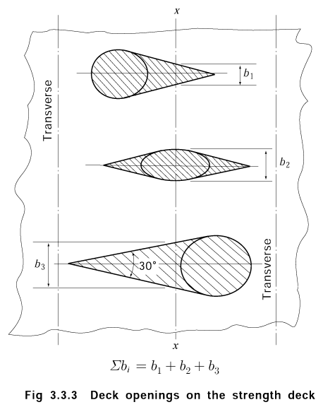
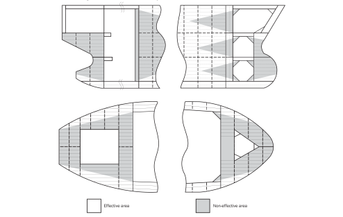
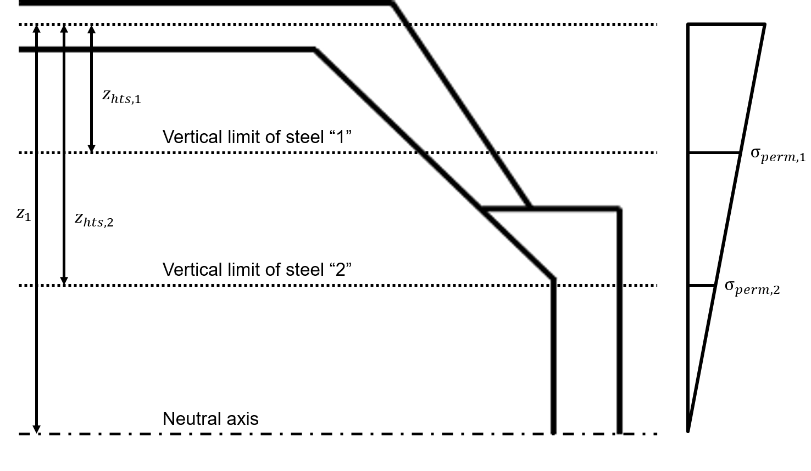
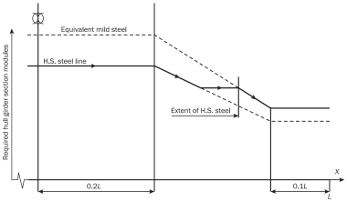
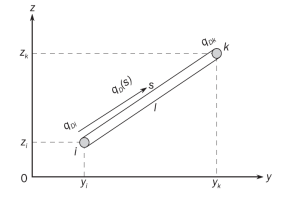
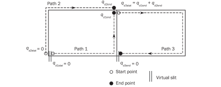
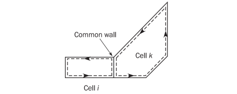

# PART 15 Structural Rules for Membrane Type Liquefied Natural Gas Carriers

> RULES FOR CLASSIFICATION OF STEEL SHIPS / RA-15-E / 2025 / EN / Rules

## Chapter 5 Hull Girder Strength

### Section 24 - Hull Girder Yield Strength

**Symbols**
For symbols not defined in this section, refer to **Ch 1, Sec 4**.
$M _{sw}$ : Permissible hogging and sagging vertical still water bending moment in seagoing operation, in kNm, at the hull transverse section considered, defined in **Ch 4, Sec 4, [2.2.2]**.
$M _{wv}$ : Vertical wave bending moment in seagoing condition, in kNm, in seagoing operation at the hull transverse section considered, defined in **Ch 4, Sec 4, [3.2.1]**.
$Q _{sw}$ : Permissible positive or negative still water shear force for seagoing operation, in kN, at the hull transverse section considered, as defined in **Ch 4, Sec 4, [2.3.1]**.
$Q _{wv}$ : Vertical wave shear force in seagoing condition, in kN, at the hull transverse section considered, defined in **Ch 4, Sec 4, [3.2]**.
$x$ : *X* coordinate, in m, of the calculation point with respect to the reference coordinate system defined in **Ch 1, Sec 4, [3.5]**.
$V _{D}$ : Vertical distance to the equivalent deck line, in m, as defined in **[1.4.3]**.
$z$ : $Z$ coordinate, in m, of the calculation point with respect to the reference coordinate system defined in **Ch 1, Sec 4, [3.5]**.
$z _{n}$ : $Z$ coordinate, in m, of horizontal neutral axis of the hull transverse section with gross scantling defined in **[1.2]**, with respect to the reference coordinate system defined in **Ch 1, Sec 4, [3.5]**.
$I _{y-gr}$ : Gross moment of inertia, in m^4, of the hull transverse section about its horizontal neutral axis, to be calculated according to **[1.5]**.
$I _{Z-gr}$ : Gross moment of inertia, in m^4, of the hull transverse section about its vertical neutral axis, to be calculated according to **[1.5]**.
$Z _{A-gr}$ : Gross section modulus, in m^3, at any point of the hull transverse section, to be calculated according **[1.4.1]**.
$C _{w}$ : Wave coefficient defined in **Ch 4, Sec 4**.
$Z _{B-gr}$,$Z _{D-gr}$: Gross section moduli, in m^3, at bottom and deck respectively, to be calculated according to **[1.4.2]** and **[1.4.3]**.
$z _{VD}$ : $Z$ coordinate, in m, taken equal to $V _{D} +z _{n}$.

#### 1. Strength characteristics of hull girder transverse sections

- **1.1** **General**
  - **1.1.1** This section specifies the criteria for calculating the hull girder strength characteristics to be used for the checks in **[2]** to **[3]**, in association with the hull girder loads specified in **Ch 4, Sec 4**.
- **1.2** **Hull girder transverse sections**
  - **1.2.1** **General**
    Hull girder transverse sections are to be considered as being constituted by the members contributing to the hull girder longitudinal strength, I.e. all continuous longitudinal members below and including the strength deck defined in **[1.3]**, taking into account the requirements in **[1.2.2]** to **[1.2.11]**.
  - **1.2.2** **Gross scantling**
    The members contributing to the hull girder longitudinal strength are to be considered using the gross offered scantlings, when the hull girder strength characteristics are used for the hull girder yielding check according to **[2]** to **[3].**
  - **1.2.3** **Structural members not contributing to hull girder sectional area**
    The following members are not to be considered in the calculation as they are considered not contributing to the hull girder sectional area:
    - **a)** superstructures which do not form a strength deck.
    - **b)** Deckhouses
    - **c)** bulwarks and gutter plates.
    - **d)** bilge keels.
    - **e)** sniped or non-continuous longitudinal stiffeners.
    - **f)** non-continuous dome opening.
  - **1.2.4** **Continuous trunks**
    Continuous trunks may be included in the hull girder transverse sections, provided that they are effectively supported by longitudinal bulkheads or primary supporting members.
  - **1.2.5** **Longitudinal stiffeners or girders welded above the strength deck**
    Longitudinal stiffeners or girders welded above the strength deck, including the deck of any trunk fitted as specified in **[1.2.4],** are to be included in the hull girder transverse sections.
  - **1.2.6** **Members in materials other than steel**
    Where a member contributing to the longitudinal strength is made in material other than steel with a Young’s modulus, *E* equal to 2.06×10^5 N/mm^2, the steel equivalent sectional area that may be included in hull girder transverse section is obtained, in m^2, from the following formula:
    $A _{SE-gr} = \frac{E}{2.06 \times 10 ^{5}} A _{M-gr}$
    where:
    $A _{M-gr}$: Sectional area, in m^2, of the member under consideration.
  - **1.2.7** **Definitions of openings**
    The following definitions of opening are to be applied:
    • Elliptical openings exceeding 2.5 m in length or 1.2 m in breadth.
    • Circular openings exceeding 0.9 m in diameter.
    - **a)** Large openings are:
    - **b)** Small openings (i.e. drain holes, etc) are openings that are not large ones.
    - **c)** Isolated openings are openings spaced not less than 1 m apart in the ship’s transverse/vertical direction.
  - **1.2.8** **Large openings, manholes and nearby small openings**
    Large openings and manholes are to be deducted from the sectional area used in hull girder moment of inertia and section modulus. When small openings are spaced less than 1 m apart in the ship’s transverse/vertical direction to large openings or manholes, the total breadth of them is to be deducted from the sectional area.
    Additionally, isolated small openings which do not comply with the arrangement requirements given in **Ch 3, Sec 6, [6.3.2]** are to be deducted from the sectional areas included in the hull girder transverse sections.
  - **1.2.9** **Isolated small openings**
    Isolated small openings in one transverse section in the strength deck above or bottom area need not be deducted from the sectional areas included in the hull girder transverse sections, provided that:
    $\Sigma b _{s} \leq 0.06(B- \Sigma b)$
    where:
    $\Sigma b _{s}$ : Total breadth of isolated small openings, in m, in the strength deck above or bottom area at the transverse section considered, determined as indicated in **Figure 1**, not deducted from the section area as per **[1.2.8]**.
    $\Sigma b$ : Total breadth of large openings, in m, at the transverse section considered, determined as indicated in **Figure 1**, deducted from the section area as defined in **[1.2.8]**.
    Where the total breadth of isolated small openings $\Sigma b _{s}$ does not fulfil the above criteria, only the excess of breadth is to be deducted from the sectional areas included in the hull girder transverse sections.
    Notwithstanding the requirement above, deck openings on the strength deck need not be deducted, provided that the sum of their breadths in one transverse section is not reducing the section modulus at deck or bottom by more than 3%.
    Deck openings as shown in **Figure 1** include shadow area which is obtained by drawing two tangential lines with an opening angle of 30 deg having the focus on the longitudinal line of the ship.
    
    **Figure : Calculation of** #eqnID-3238 **and** #eqnID-3239

#### 1.2.10

**Lightening holes, draining holes and single scallops**
Lightening holes, draining holes and single scallops in longitudinals need not be deducted if their height is less than $0.25h _{w}$, where $h _{w}$ is the web height of the longitudinals, in mm. Otherwise, the excess is to be deducted from the sectional area or compensated.

#### 1.2.11

**Non-continuous decks and longitudinal bulkheads**
When calculating the effective area in way of non-continuous decks and longitudinal bulkheads, the effective area is to be taken as shown in **Figure 2**. The shadow area, which indicates the ineffective area, is obtained by drawing two tangent lines with an angle of 15 deg to the longitudinal axis of the ship.

**Figure : Effective area in way of non-continuous decks and bulkheads**

- **1.3** **Strength deck**
  - **1.3.1** The strength deck is, in general, the uppermost continuous deck. In the case of a superstructure or deckhouses contributing to the longitudinal strength, the strength deck is the deck of the superstructure or the deck of the uppermost deckhouse.
- **1.4** **Section modulus**
  - **1.4.1** **Section modulus at any point**
    The section modulus at any point of a hull transverse section is obtained, in m^3, from the following formula:
    $Z _{A-gr} = \frac{I _{y-gr}}{|z-z _{n} |}$
  - **1.4.2** **Section modulus at bottom**
    The section modulus at bottom is obtained, in m^3, from the following formula:
    $Z _{B-gr} = \frac{I _{y-gr}}{z _{n}}$
  - **1.4.3** **Section modulus at deck**
    The section modulus at equivalent deck line is obtained, in m^3, from the following formula:
    $Z _{D-gr} = \frac{I _{y-gr}}{V _{D}}$
    where:
    $V _{D}$ : Vertical distance of the equivalent deck line, in m, taken equal to:
    When no effective longitudinal members specified in **[1.2.4]** and **[1.2.5]** are positioned above a line extending from strength deck at side to a position $(z _{D} -z _{n} )/0.9$ from the neutral axis at the centreline.
    $V _{D} =z _{D} -z _{n}$
    When effective longitudinal members as specified in **[1.2.4]** and **[1.2.5]** are positioned above a line extending from strength deck at side to a position $(z _{D} -z _{n} )/0.9$ from the neutral axis at the centreline
    $V _{D} =(z _{T} -z _{n} ) \left( 0.9+0.2 \frac{y _{T}}{B} \right) \geq z _{D} -z _{n}$
    $z _{D}$ : *Z* coordinate, in m, of strength deck at side, defined in **[1.3]**.
    $y _{T}$ , $z _{T}$ : *Y* and *Z* coordinates, in m, of the top of continuous trunk, hatch coaming, longitudinal stiffeners or girders, to be measured for the point which maximises the value of $V _{D}$.
- **1.5** **Moments of inertia**
  - **1.5.1** The gross moment of inertia, $I _{y-gr}$ in m^4, are those, calculated about the horizontal neutral axes, respectively, of the hull transverse sections defined in **[1.2]**.

#### 2. Hull girder bending assessment

- **2.1** **General**
  - **2.1.1** Scantlings of all continuous longitudinal members of the hull girder based on moment of inertia and section modulus requirement in **[2.3]** are to be maintained within 0.4 *L* amidships.
  - **2.1.2** The *k* material factors are to be defined with respect to the materials used for the bottom and deck members contributing to the longitudinal strength according to **[1]**. When material factors for higher strength steels are used, the requirements in **[2.5]** apply.
  - **2.1.3** Continuity of structure is to be maintained throughout the length of the ship. Where significant changes in structural arrangement occur adequate transitional structure is to be provided.
- **2.2** **Normal stress**
  - **2.2.1** The normal stress, $\sigma _{L}$ induced by vertical bending moments, is to be assessed for both hogging and sagging conditions, along the full length of the hull girder, from AE to FE.
    The normal stress, $\sigma _{L}$ at any point of the hull transverse section located below $z _{VD}$, is to comply with the following formula:
    $\sigma _{L} \leq \sigma _{perm}$
    $\sigma _{L}$ : Normal stress, in N/mm^2, induced by vertical bending moments as given in **Table 1**:
    $\sigma _{perm}$ : Permissible hull girder bending stress, in N/mm^2, as given in **Table 2**.
  - **2.2.2** The normal stresses in a member made in material other than steel with a Young’s modulus, *E* equal to 2.06 × 10^5 N/mm^2, included in the hull girder transverse sections as specified in **[1.2.6]**, are obtained from the following formula:
    $\sigma _{L} = \frac{E}{2.06 \times 10 ^{5}} \sigma _{LS}$
    where
    $\sigma _{LS}$ : Normal stress, in N/mm^2, in the member under consideration, calculated according to **[2.2.1]** considering this member as having the steel equivalent sectional area $A _{SE}$ defined in **[1.2.6]**.
- **2.3** **Minimum moment of inertia and section modulus at midship section**
  - **2.3.1** At the transverse section in the midship part, the gross moment of inertia about the horizontal axis, $I _{y-gr}$ is to be not less than the value obtained, in m^4, from the following formula:
    $I _{yR} =3C _{w} L ^{3} B(C _{B} +0.7) \mathrm{\times } 10 ^{-8}$
  - **2.3.2** At the transverse section in the midship part, the vertical hull girder gross section modulus at the deck and the bottom, $Z _{D-gr}$ and $Z _{B-gr}$, are not to be less than the value obtained, in m^3, from the following formula:
    $Z _{R} =C _{w} L ^{2} B(C _{B} +0.7)$*k*$\times 10 ^{-6}$
- **2.4** **Bending strength at sections other than amidships**
  The required bending strength outside 0.4 *L* amidships is to be determined according to **[2.2.1]**. As a minimum, hull girder bending strength checks are to be carried out at the following locations:
  Buckling strength of members contributing to the longitudinal strength and subjected to compressive and shear stresses is to be checked, in particular in regions where changes in the framing system or significant changes in the hull cross-section occur. The buckling evaluation criteria used for this check is determined by **Ch 8**.
- **2.5** **Extent of high tensile steel**
  - **2.5.1** **Vertical extent**
    The vertical extent of higher strength steel, $z_{hts,i}$, in m, used in the deck zone or bottom zone and measured respectively from the equivalent deck line($z _{VD}$) or baseline is not to be taken less the value obtained from the following formula, see **Figure 3**:
    $z _{hts,i} =z _{1} \left( 1- \frac{\sigma _{perm,i}}{\sigma _{L}} \right)$ for structural members located below equivalent deck line
    where:
    $z _{1}$ : Distance from horizontal neutral axis to equivalent deck line or baseline respectively, in m.
    $\sigma _{perm,i}$ : Permissible hull girder bending stress of the considered steel, in N/mm^2, as given in **Table 2** and **Figure 3**.
    $\sigma _{L}$ : Hull girder bending stress, $\sigma _{VD}$ at equivalent deck line or $\sigma _{bl}$ at baseline respectively, in N/mm^2 given in **Table 3**.
    
    **Figure : Vertical extent of higher strength steel**

    | At baseline | At equivalent deck line |
    | --- | --- |
    | $\sigma _{bl} = \frac{\left\| M _{sw} +f _{\beta } M _{wv} \right\|}{I _{y-gr}} z _{n} \times 10 ^{-3}$ | $\sigma _{VD} = \frac{\left\| M _{sw} +f _{\beta } M _{wv} \right\|}{I _{y-gr}} V _{D} \times 10 ^{-3}$ |
  - **2.5.2** **Longitudinal extent**
    Where used, the application of higher strength steel is to be continuous over the length of the ship to the location where the longitudinal stress levels are within the allowable range for mild steel structure, as shown in **Figure 4**.
    
    **Figure : Longitudinal extent of higher strength steel**

#### 3. Hull girder shear strength assessment

- **3.1** **General**
  - **3.1.1** The hull girder shear strength requirements apply along the full length of the hull girder, from AE to FE.
- **3.2** **Hull girder shear capacity**
  - **3.2.1** The total vertical hull girder shear capacity, $Q _{R}$ in kN, is the minimum of the calculated values for all plates *i* contributing to the hull girder shear of the considered transverse section and is to be taken as:
    $Q _{R} = pile{min#i} LEFT ( {tau _{i-perm} t _{i-gr}} over {q _{vi}} TIMES 10 ^{-3} RIGHT )$
    where:
    $t _{i-gr}$ : Gross thickness of plate *i*, in mm.
    $q _{vi}$ : Contribution ratio for hull girder shear force per mm, in mm^-1, for the plate *i* based on gross scantlings, which is equal to the unit shear flow per mm, in N/mm, obtained from a numerical calculation based on thin-walled beam theory according to **Ch 5, App 1**.
    $\tau _{i-perm}$ : Permissible shear stress, in N/mm^2, for plate *i* to be taken as:
    $\tau _{i-perm} =110/k$
- **3.3** **Acceptance criteria**
  - **3.3.1** **Permissible vertical shear force**
    The positive and negative permissible vertical shear forces are to comply with the following criteria:
    $\left| Q _{sw} \right| \leq Q _{R} - \left| f _{\beta } Q _{wv} \right|$ Seagoing operation
    $\left| Q _{sw-p} \right| \leq Q _{R}$ Harbour and sheltered operation
    where:
    $Q _{R}$ : Total vertical hull girder shear capacity, in kN, as defined in **[3.1.1]**.
    The shear force $Q _{wv}$, used in above criteria is to be taken with the same sign as the considered shear forces $Q _{sw}$.

#### 4. Stress control of inner hull forming cargo hold

- **4.1** **General**
  Membrane tanks with a cargo containment system may have some limitation such as elongation or stress level of adjacent installed hull structure. Any required criteria for inner hull is to be confirmed by the designer of the cargo containment system.
- **4.2** **Cargo containment with a barrier welded to hull**
  Cargo containment systems for which primary or secondary barrier is rigidly connected to the cofferdam bulkhead, shall have allowable stress for inner hull forming cargo hold.
  For instance, box type cargo containment system with invar membrane has a maximum allowable stress as following:
  #eqnID-3297120_s0 MPa for box type cargo containment system(e.g. NO 96 series)
  where:
  $\sigma _{st}$ : Hull girder bending stress, in N/mm^2, due to the maximum still water bending moment
  $\sigma _{dy}$ : Hull girder bending stress, in N/mm^2, due to the maximum wave bending moment corresponding to the 10^-8 probability level in North Atlantic condition
- **4.3** **Cargo containment with a barriers not welded directly to hull**
  Cargo containment systems for which primary or secondary barrier is not connected directly to the inner hull structure, may specify allowable stress for the control of allowable elongation at inner hull level.
  For instance, foam type cargo containment has a maximum allowable stress depending on cargo containment system design following criteria:
  #eqnID-3300185_s0 MPa for foam type cargo containment system(e.g. Mark III series)
  #eqnID-3301160_s0 MPa for KC-1 cargo containment system
  where:
  $\sigma _{st}$, $\sigma _{dy}$ : Hull girder bending stress, in N/mm^2, defined in **[4.2]**
  $\sigma _{lo}$ : Maximum local bending stress, in N/mm^2, due to local deflection of inner hull when considering alternate loading cases

### Appendix 1 – Direct Calculation of Shear Flow

**Symbols**
For symbols not defined in this section, refer to **Ch 1, Sec 4**.

#### 5. Calculation formula

- **5.1** **General**
  - **5.1.1** This Appendix describes the procedures of direct calculation of shear flow around a ship cross-section due to hull girder vertical shear force. The shear flow $q _{V}$, at each location in the cross-section, is calculated considering the cross-section subjected to a unit vertical shear force of 1 N.
    The unit shear flow per mm $q _{v}$, in N/mm, is to be taken as:
    $q _{V} =q _{D} +q _{I}$
    where:
    $q _{D}$ : Determinate shear flow, as defined in **[1.2]**.
    $q _{I}$ : Indeterminate shear flow which circulates around the closed cells, as defined in **[1.3]**.
    In the calculation of the unit shear flow $q _{V}$, the longitudinal stiffeners are to be taken into account.
- **5.2** **Determinate shear flow,** $\mathbf{{q _{D}}}$
  - **5.2.1** The determinate shear flow $q _{D}$ , in N/mm, at each location in the cross-section is to be obtained from the following line integration:
    $q _{D} (s)=- \frac{1}{10 ^{6} I _{y-gr}} \int _{0} ^{s} {(z-z _{n}} )t _{gr} ds$
    where:
    *s* : Coordinate value of the running coordinate along the cross-section, in m
    $I _{y-gr}$ : Gross moment of inertia of the cross-section, in m^4
    $t _{gr}$ : Gross thickness of plating, in mm.
    $z _{n}$ : *Z* coordinate of horizontla neutral axis from baseline, in m
  - **5.2.2** It is assumed that the cross-section is composed of line segments as shown in **Figure 1**, where each line segment has a constant plate gross thickness. The determinate shear flow is obtained by the following equation:
    $q _{Dk} =q _{D} ( \ell )=- \frac{t \ell }{2 \times 10 ^{6} I _{y-gr}} (z _{k} +z _{i} -2z _{n} )+q _{Di}$ (N/mm)
    where:
    $q _{Dk}$, $q _{Di}$ : Determinate shear flow, at node *k* and node *i* respectively, in N/mm
    $\ell$ : Length of line segments, in m
    $y _{i}$, $y _{k}$ : *Y* coordinates, in m, of the end points *i* and *k* of a line segment, as defined in **Figure 1**.
    $z _{i}$, $z _{k}$ : *Z* coordinates, in m, of the end points *i* and *k* of a line segment, as defined in **Figure 1**.
  - **5.2.3** Where the cross-section includes closed cells, the closed cells are to be cut with virtual slits, as shown in **Figure 2** in order to obtain the determinate shear flow.
    These virtual slits are not to be located in walls which form part of another closed cell.
  - **5.2.4** Determinate shear flow at bifurcation points is to be calculated by water flow calculations or similar, as shown in **Figure 2.**
    
    **Figure : Definition of line segment**
    
    **Figure : Calculation of determinate shear flow at bifurcation**
- **5.3** **Indeterminate shear flow,** $\mathbf{{q _{I}}}$
  - **5.3.1** The indeterminate shear flow qI around the closed cells of a cross-section is considered as a constant value within the same closed cell. The following system of equation for determination of indeterminate shear flows can be developed. In the equations, contour integrations of several parameters around all the closed cells are performed.
    $q _{lc} oint _{k} ^{} {\frac{1}{t _{gr}}} ds - \sum _{i} ^{} \left( q _{Ii } oint _{k,i} ^{} {\frac{1}{t _{gr}} ds} \right) =- oint _{k} ^{} {\frac{q _{D}}{t _{gr}} ds}$
    where:
    $q _{Ii}$, $q _{Ik}$ : Indeterminate shear flows around the closed cells *c* and m respectively, in N/mm.
  - **5.3.2** Under the assumption of the assembly of line segments shown in **Figure 1** and constant plate thickness of each line segment, the equation in **[1.3.1]** is expressed as follows:
    $q _{Ik} \sum _{cell k} ^{} \frac{\ell }{t _{gr}} - \sum _{i} ^{} q _{Ii} \left( \frac{\ell }{t _{gr}} \right)  _{common wall with cell k} =- \sum _{cell k} ^{} \phi _{}$
    $\phi _{} = \int _{0} ^{\ell } {\frac{q _{D} (s)}{t _{gr}} ds =} \left[ - \frac{\ell ^{2}}{6 \times 10 ^{3} I _{y-gr}} (z _{k} +2z _{i} -3z _{n} )+ \frac{\ell }{t _{gr}} q _{Di} \right]$
    where:
    $q _{Di}$ : Determinate shear flow, in N/mm, calculated according to **[1.2.2]**.
    The difference in the directions of running coordinates specified in **[1.2]** and the present **[1.3]** is to be considered.
    
    **Figure : Closed cells and common wall**
- **5.4** **Computation of sectional properties**
  - **5.4.1** Properties of the cross-section are to be obtained by the following formulae, where the cross-section is assumed to be made of the assembly of line segments:
    $\ell = \sqrt {(y _{k} -y _{i} ) ^{2} +(z _{k} -z _{i} ) ^{2}}$
    $a _{gr} =10 ^{-3} \ell t _{gr}$ $A _{gr} = \sum _{} ^{} a _{gr}$
    $s _{y-gr} = \frac{a _{gr}}{2} (z _{k} +z _{i} )$ $S _{y-gr} = \sum _{} ^{} s _{y-gr}$
    $i _{y0-gr} = \frac{a _{gr}}{3} (z _{k}^{2} +z _{k} z _{i} +z _{i}^{2} )$ $I _{y0-gr} = \sum _{} ^{} i _{y0-gr}$
    where:
    $y _{i}$, $z _{i}$ : *Y* and *Z* coordinates of start point i of a line segment, in m, as defined in **Figure 1**
    $y _{k}$, $z _{k}$ : *Y* and *Z* coordinates of end point k of a line segment, in m, as defined in **Figure 1**
    $a _{gr}$, $A _{gr}$ : Areas of the line segment and the cross-section respectively, in m^2
    $s _{y-gr}$, $S _{y-gr}$ : First moments of the line segment and the cross-section about the baseline, in m^3
    $i _{y0-gr}$, $I _{y0-gr}$ : Moments of inertia of the line segment and the cross-section about the baseline, in m^4.
  - **5.4.2** The height of the horizontal neutral axis $z _{n}$, in m, is to be obtained as follows:
    $z _{n} = \frac{S _{y-gr}}{A _{gr}}$
  - **5.4.3** The moment of inertia about the horizontal neutral axis, in m^4, is to be obtained as follows:
    $I _{y-gr} =I _{y0-gr} -z _{n}^{2} A _{gr}$
