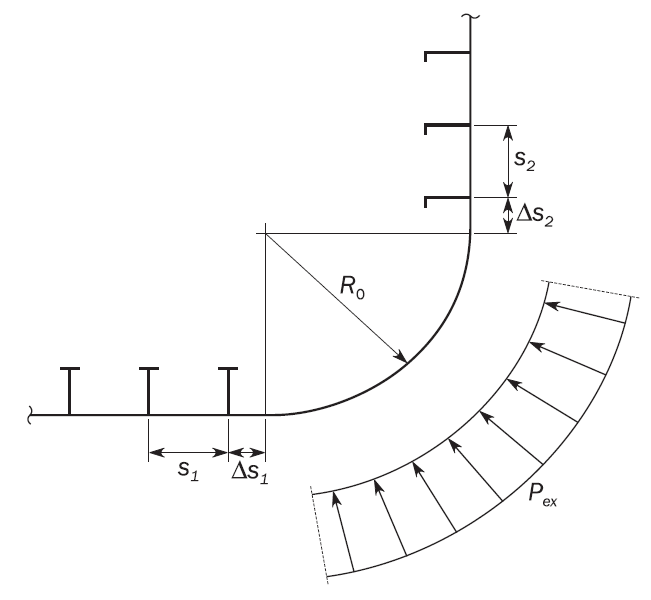
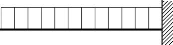

# PART 15 Structural Rules for Membrane Type Liquefied Natural Gas Carriers

> RULES FOR CLASSIFICATION OF STEEL SHIPS / RA-15-E / 2025 / EN / Rules

## Chapter 6 Hull Local Scantling

### Section 25 - General

#### 1. Application

- **1.1** **Application**
  - **1.1.1** This chapter applies to hull structure over the full length of the ship including fore end, cargo hold region, machinery space and aft end, the side shell above the freeboard deck, engine casing, exposed decks of superstructure and internal decks except those inside superstructure and deckhouse.
  - **1.1.2** This chapter provides requirements for evaluation of plating, stiffeners and Primary Supporting Members (PSM) subject to lateral pressure, local loads and to hull girder loads, as applicable. Requirements are specified for:
    In addition, other requirements not related to defined design load sets, are provided.
    - **a)** Load application in **Ch 6, Sec 2**.
    - **b)** Minimum thickness of plates, stiffeners and PSM in **Ch 6, Sec 3**.
    - **c)** Plating in **Ch 6, Sec 4**.
    - **d)** Stiffeners in **Ch 6, Sec 5**.
    - **e)** PSM and pillars in **Ch 6, Sec 6**.
  - **1.1.3** The offered net scantling is to be greater than or equal to the required scantlings based on requirements provided in this chapter.
  - **1.1.4** Additional local strength requirements are provided in **Ch 10** considering bow impact loads and bottom slamming loads for fore end, machinery space and aft end.
- **1.2** **Acceptance criteria**
  - **1.2.1** Acceptance criteria set to be selected based on design load as follows:
    - **a)** AC-S for design load S; static loads
    - **b)** AC-SD for design load S+D; combination of static and dynamic loads
    - **c)** AC-A for design load A; accidental loads
    - **d)** AC-T for design load T; tank test or overflowing of tank loads

### Section 26 - Load Application

**Symbols**
For symbols not defined in this section, refer to **Ch 1, Sec 4**.

#### 1. Load combination

- **1.1** **Hull girder bending**
  - **1.1.1** **Normal stresses**
    The normal stress $\sigma _{hg}$, in N/mm^2, induced by acting vertical and horizontal bending moments at the position being considered is given as follow. This stress is to be calculated for each design load set, as defined in **[2]** covering all dynamic load cases defined in **Ch 4** in combination with $M_sw$ both in hogging and in sagging.
    $\sigma _{hg} = \left( \frac{M _{sw} +M _{wv-LC}}{I _{y-n50}} (z- z _\mathit{n rm } )- \frac{it M _{wh-LC} rm}{it I _\mathrm{z- it n50} rm} it y \right) 10 ^{-3}$
    where:
    $M_sw$ : Still water bending moment, in kNm, as defined in **Ch 4, Sec 4, [2.2]** in accordance with the considered design load scenario in **Ch 4, Sec 7, Table 1**.
    $M_wv-LC$ : Vertical wave bending moment, in kNm, of the considered dynamic load case, as defined in **Ch 4, Sec 4, [3.5.2]** in accordance with the considered design load scenario in **Ch 4, Sec 7, Table 1**, at the considered longitudinal position.
    $M_wh-LC$ : Horizontal wave bending moment, in kNm, of the considered dynamic load case, as defined in **Ch 4, Sec 4, [3.5.4]** in accordance with the considered design load scenario in **Ch 4, Sec 7, Table 1**, at the considered longitudinal position.
    $I_y-n50$ : Net vertical hull girder moment of inertia, at the longitudinal position being considered, in m^4
    $I_{\mathrm{z}-itn50$ : Net horizontal hull girder moment of inertia, at the longitudinal position being considered, in m^4
    $y$ : Transverse coordinate of load calculation point, in m.
    $z$ : Vertical coordinate of the load calculation point under consideration, in m.
    $z _\mathit{n rm}$ : Distance from the baseline to the horizontal neutral axis, in m.
- **1.2** **Lateral pressures**
  - **1.2.1** **Static and dynamic pressures in intact conditions**
    The static and dynamic lateral pressures in intact condition induced by the sea and the various types of cargoes, ballast and other liquids are to be considered. Applied loads will depend on the location of the elements under consideration, and the adjacent type of compartments.
  - **1.2.2** **Pressure in collision condition**
    The internal cargo pressure due to collision is to be considered with colliding acceleration $a _{x}$, whose direction is decided depending on the position of transverse bulkhead of the cargo hold considered, combined with static cargo pressure.
  - **1.2.3** **Lateral pressure in flooded conditions**
    Watertight boundaries of compartments not intended to carry liquids, excluding shell envelope, are to be subjected to lateral pressure in flooded conditions
- **1.3** **Pressure combination**
  - **1.3.1** **Elements of the outer shell**
    If the compartment adjacent to the outer shell is intended to carry liquids, the static and dynamic lateral pressures to be considered are the differences between the internal pressures and the external sea pressures at the corresponding draught.
    If the compartment adjacent to the outer shell is not intended to carry liquids, the internal pressures and external sea pressures are to be considered independently.
  - **1.3.2** **Elements other than those of the outer shell**
    Except as specified in **[1.3.1]**, the static and dynamic lateral pressures on an element separating two adjacent compartments are those obtained considering the two compartments individually loaded.

#### 2. Design load sets

- **2.1** **Application of load components**
  - **2.1.1** **Application**
    These requirements apply to:
    - **a)** Plating and stiffeners along the full length of the ship.
    - **b)** PSM outside the cargo hold region.
  - **2.1.2** **Load components**
    The static and dynamic load components are to be determined in accordance with **Ch 4, Sec 7, Table 1**. Radius of gyration, $k_r$, and metacentric height, $GM$, are to be in accordance with **Ch 4, Sec 3, Table 1** for the considered loading conditions specified in the design load sets given in **Table 1**.
  - **2.1.3** **Design load sets for plating, stiffeners and PSM**
    Design load sets for plating, stiffeners and primary supporting members are given in **Table 1**.

    | **Item** | **Design load set** | **Load component** | **Draught** | **Design load** | **Loading condition** |
    | --- | --- | --- | --- | --- | --- |
    | External shell and Exposed deck | SEA-1 | $P_ex$, $P _{D}$ | $T _{SC}$ | S+D | Full load condition |
    | External shell and Exposed deck | SEA-2 | $P _{ex}$ | $T _{SC}$ | S | Harbour condition(1) |
    | Water ballast tank | WB-1 | $P _{"in" } -P _{ex}$(2) | $0.7T _{SC}$ | S+D | Ballast condition |
    | Water ballast tank | WB-2 | $P _{"in" } -P _{ex}$(2) | $0.7T _{SC}$ | S+D | Ballast exchange condition |
    | Water ballast tank | WB-3 | $P _{"in" } -P _{ex}$(2) | $0.7T _{SC}$ | S | Harbour condition |
    | Water ballast tank | WB-4 | $P _{"in" } -P _{ex}$(2) | $0.4T _{SC}$ | T | Tank testing condition |
    | Tanks other than water ballast tank | TK-1 | $P _{"in" } -P _{ex}$(2) | $0.7T _{SC}$ | S+D | Ballast condition |
    | Tanks other than water ballast tank | TK-2 | $P _{"in" } -P _{ex}$(2) | $0.7T _{SC}$ | S | Harbour condition |
    | Tanks other than water ballast tank | TK-3 | $P _{"in" } -P _{ex}$(2) | $0.4T _{SC}$ | T | Test condition |
    | Cargo Hold Area | CH-1 | $P_"in"$ | $T _{SC}$ | S+D | Full load condition |
    | Cargo Hold Area | CH-2 | $P_"in"$ | $0.8T _{SC}$ | S+D | One hold loading condition |
    | Cargo Hold Area | COL(3) | $P_"in"$ | - | A | Collision condition |
    | Compartment not carrying liquid | FD(4) | $P_"in"$ | $T _{SC}$ | A | Flooded condition |
    | Notes: (1) For external shell only. (2) $P_ex$ is to be considered for external shell only. (3) COL set means collision conditions that 0.5g and –0.25g of colliding accelerations in way of longitudinal direction are to be applied for full loaded cargo holds under Accidental design load (A) in order to verify structural integrity of cargo hold boundary and support structures, refer to **Pt 7 Ch 5, Sec 4, [415]**. (4) FD is not applicable to external shell. |   |   |   |   |   |

### Section 27 - Minimum Thickness

**Symbols**
For symbols not defined in this section, refer to **Ch 1, Sec 4**.
$L _{2}$ : Reference rule length, in m, taken as less of L and 300 m.

#### 1. Plating

- **1.1** **Minimum thickness requirements**
  - **1.1.1** The net thickness of plating in mm, is to comply with the appropriate minimum thickness requirements given in **Table 1**.

    | **Element** | **Location** | **Area** | **Net thickness** |
    | --- | --- | --- | --- |
    | Shell | Keel | - | $7.5+0.03L _{2} \sqrt {k}$ |
    | Shell | Bottom Side shell Bilge | Fore Part | $5.5+0.03L _{2} \sqrt {k}$ |
    | Shell | Bottom Side shell Bilge | Machinery space Aft part | $7.0+0.02L _{2} \sqrt {k}$ |
    | Shell | Bottom Side shell Bilge | Elsewhere | $4.5+0.02L _{2} \sqrt {k}$ |
    | Breasthook |   | Fore part | $6.5$ |
    | Deck | Weather deck, strength deck, internal tank boundary | - | $3.7+0.019L _{2} \sqrt {k}$ |
    | Deck | Platform deck | Machinery space | $3.7+0.019L _{2} \sqrt {k}$ |
    | Deck | Platform deck | Elsewhere | $6.5$ |
    | Inner bottom(1) | - | Machinery space | $6.1+0.024L _{2} \sqrt {k}$ |
    | Inner bottom(1) | - | Elsewhere | $4.0+0.028L _{2 } \sqrt {k}$ |
    | Bulkheads | Internal tank boundary, Transverse/longitudinal watertight bulkhead | - | $4.5+0.01L _{2} \sqrt {k}$ |
    | Bulkheads | Non-tight bulkhead, Bulkheads between dry spaces. | - | $4.5+0.008L _{2} \sqrt {k}$ |
    | Bulkheads | Pillar bulkheads in fore and aft peaks | - | $7.5$ |
    | Other members | Engine casing (in way of accommodation) | - | $4.0$ |
    | Other members | Other plates in general | - | $4.5+0.01L _{2} \sqrt {k}$ |
    | (1) Applicable for both tight and non tight members |   |   |   |

#### 2. Stiffeners and tripping brackets

- **2.1** **Minimum thickness requirements**
  - **2.1.1** The net thickness of the web and face plate, if any, of stiffeners and tripping brackets in mm, is to comply with the minimum net thickness given in **Table 2**.
    In addition, the net thickness of the web of stiffeners and tripping brackets, in mm, is to be:

    | **Element** | **Location** | **Net thickness** |
    | --- | --- | --- |
    | Stiffeners and attached end brackets | Watertight boundary | $4.5 +0.007L _{2}$ |
    | Stiffeners and attached end brackets | Other structure | $4.0 +0.007L _{2}$ |
    | Tripping brackets |   | $4.5 +0.01L _{2}$ |
    - **a)** Not less than 40% of the net required thickness of the attached plating, to be determined according to **Ch 6, Sec 4**.
    - **b)** Less than twice the net offered thickness of the attached plating.

#### 3. Primary supporting members

- **3.1** **Minimum thickness requirements**
  - **3.1.1** The net thickness of web plating and flange of primary supporting members in mm, is to comply with the minimum net thickness given in **Table 3**.

    | **Element** | **Location** | **Net thickness** |
    | --- | --- | --- |
    | Double bottom centreline girder | Machinery space | $0.5 \sqrt {L _{2} k} +5.5$ |
    | Double bottom centreline girder | Elsewhere | $0.45 \sqrt {L _{2} k} +5.0$ |
    | Other bottom girder | Machinery space | $0.45 \sqrt {L _{2} k} +5.0$ |
    | Other bottom girder | Fore part | $0.45 \sqrt {L _{2} k} +4.0$ |
    | Other bottom girder | Elsewhere | $0.35 \sqrt {L _{2} k} +3.5$ |
    | Girders bounding a duct keel | Machinery space | $0.5 \sqrt {L _{2} k} +5.0$ |
    | Bottom floor | Machinery space | $0.4 \sqrt {L _{2} k} +5.0$ |
    | Bottom floor | Fore part | $0.35 \sqrt {L _{2} k} +5.0$ |
    | Bottom floor | Elsewhere | $0.3 \sqrt {L _{2} k} +4.0$ |
    | Aft peak floor | - | $0.3 \sqrt {L _{2} k} +4.0$ |
    | Other primary supporting member | - | $0.2 \sqrt {L _{2} k} +4.0$ |

### Section 28 - Plating

**Symbols**
For symbols not defined in this section, refer to **Ch 1, Sec 4**.
$\alpha_p$ : Correction factor for the panel aspect ratio to be taken as follow but not to be taken greater than 1.0.
$\alpha_p =1.2- \frac{b}{2.1 a}$
$a$ : Length of plate panel, in mm, as defined in **Ch 3, Sec 7, [2.2.2]**.
$b$ : Breath of plate panel, in mm, as defined in **Ch 3, Sec 7, [2.2.2]**.
$P$ : Design pressure for the considered design load set, see **Ch 6, Sec 2, [2]**, calculated at the load calculation point defined in **Ch 3, Sec 7, [2.2]**, in kN/m^2.
$\sigma_hg$ : Hull girder bending stress, in N/mm^2, as defined in **Ch 6, Sec 2, [1.1]**, calculated at the load calculation point as defined in **Ch 3, Sec 7, [2.2]**.

#### 1. Plating subjected to lateral pressure

- **1.1** **Yielding check**
  - **1.1.1** **Plating**
    The net thickness, $t$ in mm, is not to be taken less than the greatest value for all applicable design load sets, as defined in **Ch 6, Sec 2, [2.1.3]**, given by:
    $t= 0.0158 \alpha _{p} b \sqrt {\frac{\left| P \right|}{C _{a} R _{eH}}}$
    where:
    $C _{a}$ : Permissible bending stress coefficient for plate taken equal to:
    $C _{a} = \beta - \alpha \frac{\left| \sigma _{hg} \right|}{R _{eH}}$ , not to be taken greater than $C_{a-itmax$
    $\beta$ : Coefficient as defined in **Table 1**.
    $\alpha$ : Coefficient as defined in **Table 1**.
    $C_{a-itmax$ : Maximum permissible bending stress coefficient as defined in **Table 1**.

    | Acceptance criteria set | Structural member |   |   | $\beta$ | $\alpha$ | $C _{a-m ax}$ |
    | --- | --- | --- | --- | --- | --- | --- |
    | AC-S | Longitudinal strength members | Longitudinally stiffened plating |   | 0.9 | 0.5 | 0.8 |
    | AC-S | Longitudinal strength members | Transversely stiffened plating |   | 0.9 | 1.0 | 0.8 |
    | AC-S | Other members |   |   | 0.8 | 0 | 0.8 |
    | AC-SD | Longitudinal strength members |   | Longitudinally stiffened plating | 1.05 | 0.5 | 0.95 |
    | AC-SD | Longitudinal strength members |   | Transversely stiffened plating | 1.05 | 1.0 | 0.95 |
    | AC-SD | Other members |   |   | 0.95 | 0 | 0.95 |
    | AC-A(1) | Longitudinal strength members | Longitudinally stiffened plating |   | 1.1 | 0.5 | 1.0 |
    | AC-A(1) | Longitudinal strength members | Transversely stiffened plating |   | 1.1 | 1.0 | 1.0 |
    | AC-A(1) | Other members |   |   | 1.0 | 0 | 1.0 |
    | AC-T | Longitudinal strength members | Longitudinally stiffened plating |   | 1.2 | 0.75 | 1.05 |
    | AC-T | Longitudinal strength members | Transversely stiffened plating |   | 1.2 | 1.5 | 1.05 |
    | AC-T | Other members |   |   | 1.05 | 0 | 1.05 |
    | 1) In case of COL design load set, $C _{a}$ is to be calculated with the hull girder stress by still water bending moment only. |   |   |   |   |   |   |

#### 2. Special requirements

- **2.1** **Minimum thickness of keel plating**
  - **2.1.1** The net thickness of the keel plating is not to be taken less than the offered net thickness of the adjacent 2 m width bottom plating, measured from the edge of the keel strake. The width of the keel is defined in **Ch 3, Sec 6, [7.2.1]**.
- **2.2** **Bilge plating**
  - **2.2.1** **Definition of bilge area**
    The definition of bilge area is given in **Ch 1, Sec 4, [3.7.1]**.
  - **2.2.2** **Bilge plate thickness**
    $t=6.45 \times 10 ^{-4} (P _{ex} s _{b} ) ^{0.4} R ^{0.6}$
    where:
    $P _{ex}$ : Design sea pressure for the design load set SEA-1 as defined in **Ch 6, Sec 2, [2.1.3]** calculated at the lower turn of the bilge, in kN/m^2.
    $R$ : Effective bilge radius in mm.
    $R=R _{0} +0.5( \Delta s _{1} + \Delta s _{2} )$
    $R _{0}$ : Radius of curvature, in mm. See **Figure 1**.
    $\Delta s _{1}$ : Distance between the lower turn of bilge and the outermost bottom longitudinal, in mm, see **Figure 1**. Where the outermost bottom longitudinal is within the curvature, this distance is to be taken as zero.
    $\Delta s _{2}$ : Distance between the upper turn of bilge and the lowest side longitudinal, in mm, see **Figure 1**. Where the lowest side longitudinal is within the curvature, this distance is to be taken as zero.
    $s _{b}$ : Distance between transverse stiffeners, webs or bilge brackets, in mm.
    - **a)** The net thickness of bilge plating is not to be taken less than the net required thickness for the adjacent bottom shell or adjacent side shell plating, whichever is greater.
    - **b)** The net thickness of rounded bilge plating, $t$, in mm, is not to be taken less than:
    - **c)** Longitudinally stiffened bilge plating is to be assessed as regular stiffened plating. The bilge thickness is not to be less than the lesser of the value obtained by **[1.1.1]** and **[2.2.2]** b). A bilge keel is not considered as an effective ‘longitudinal stiffening’ member.
  - **2.2.3** **Transverse extension of bilge minimum plate thickness**
    Where a plate seam is located in the straight plate just below the lowest stiffener on the side shell, any increased thickness required for the bilge plating does not have to be extended to the adjacent plate above the bilge provided the plate seam is not more than $s_2 /4$ below the lowest side longitudinal. Similarly, for the flat part of adjacent bottom plating, any increased thickness for the bilge plating does not have to be extended to the adjacent plate provided that the plate seam is not more than $s_1 /4$ beyond the outboard bottom longitudinal. For definition of $s_1$ and $s_2$, see **Figure 1**.
    
    **Figure : Transverse stiffened bilge plating**
  - **2.2.4** **Hull envelope framing in bilge area**
    For transversely stiffened bilge plating, a longitudinal is to be fitted at the bottom and at the side close to the position where the curvature of the bilge plate starts. The scantling of those longitudinals are to be not less than the one of the closer adjacent stiffener. The distance between the lower turn of bilge and the outermost bottom longitudinal, $triangle s_1$, is generally not to be greater than one-third of the spacing between the two outermost bottom longitudinals, $s_1$. Similarly, the distance between the upper turn of the bilge and the lowest side longitudinal, $triangle s_2$, is generally not to be greater than one-third of the spacing between the two lowest side longitudinals, $s_2$, See **Figure 1**.
- **2.3** **Side shell plating**
  - **2.3.1** **Fender contact zone**
    The net thickness, $t$ in $\mathrm{mm}$, of the side shell plating within the fender contact zone as specified in **[2.3.2]** is not to be taken less than:
    $t=26 \left( \frac{b}{1000} +0.7 \right) \left( \frac{B T _{sc}}{R _{eH}^{2}} \right) ^{0.25}$
  - **2.3.2** **Application of fender contact zone requirement**
    The application extends within the cargo hold region as defined in **Ch 1, Sec 1, [2.4.3]**, from the ballast draught $T_BAL$ to $0.25T _{sc}$(minimum 2.2 m) above $T _{sc}$.
- **2.4** **Sheer strake**
  - **2.4.1** **General**
    The minimum width of the sheer strake is defined in **Ch 3, Sec 6, [8.2.4]**.
  - **2.4.2** **Welded sheer strake**
    The net thickness of a welded sheer strake is not to be less than the offered net thickness of the adjacent 2 m width side plating, provided this plating is located entirely within double side tank as the case may be.
  - **2.4.3** **Rounded sheer strake**
    The net thickness of a rounded sheer strake is not to be less than:
    whichever is greater.
    - **a)** The offered net thickness of the adjacent 2 m width deck plating, or
    - **b)** The offered net thickness of the adjacent 2 m width side plating,
- **2.5** **Deck stringer plating**
  - **2.5.1** The minimum width of deck stringer plating is defined in **Ch 3, Sec 6, [9.1.2]**.
  - **2.5.2** Within 0.6*L* of amidships, the net thickness of the deck stringer plate is not to be less than the offered net thickness of the adjacent deck plating.
- **2.6** **Aft peak bulkhead**
  - **2.6.1** The net thickness of the aft peak bulkhead plating in way of the stern tube penetration is to be at least 1.6 times the required thickness for the bulkhead plating.
- **2.7** **Plating in cargo tank boundary**
  - **2.7.1** **By IGC pressure**
    The net thickness of inner hull plating protected by cargo containment system, $t$ in mm, is not to be taken less than:
    $t= 0.0158 \alpha _{p} b \sqrt {\frac{\left| P _{IGC} \right|}{C _{a-IGC} R _{eH}}}$
    where:
    $P _{IGC}$ : Pressure given in **Pt 7, Ch 5, Sec 4, [428]**, in kN/m^2.
    Note : For conventional gas carriers, this pressure may be calculated using the acceleration referred to in **Ch 4, Sec. 3.** (2025)
    $C _{a-IGC}$ : Permissible bending stress coefficient for plate taken equal to:
    $C _{a-IGC} = \beta _{IGC} - \alpha _{IGC} \frac{\sigma _{hg-IGC}}{R _{eH}}$ , not to be taken greater than $C _{a-IGC- it \max}$
    $\sigma _{hg-IGC} =itmax \left[ \left| \left( \frac{M _{sw} +M _{wv-LC}}{I _{y-n50}} (z- z _\mathit{n rm } ) \right) 10 ^{-3} \right| , \left| \left\{ \left( \frac{(M _{sw} +0.5 M _{wv-LC} )}{I _{y-n50}} (z- z _\mathit{n rm } ) \right) + \left( \frac{M _{wh-LC}}{I _{z-n50}} (y- y _\mathit{n rm } ) \right) \right\} 10 ^{-3} \right| \right]$
    $\beta _{IGC}$ : Coefficient as defined in **Table 2**.
    $\alpha _{IGC}$ : Coefficient as defined in **Table 2**.
    $C _{a-IGC- it \max}$ : Maximum permissible bending stress coefficient as defined in **Table 2**.

    | Acceptance criteria set | Structural member |   | $\beta _{IGC}$ | $\alpha _{IGC}$ | $C _{a-IGC- it \max}$ |
    | --- | --- | --- | --- | --- | --- |
    | IGC condition | Longitudinal strength members | Longitudinally stiffened plating | 1.05 | 0.5 | 0.95 |
    | IGC condition | Longitudinal strength members | Transversely stiffened plating | 1.05 | 1.0 | 0.95 |
    | IGC condition | Other members |   | 1.0 | 0 | 1.0 |
  - **2.7.2** **By sloshing pressure (2023)**
    The net thickness of plating, $t$ in mm, subjected to sloshing pressures is not to be less than:
    $t= 0.0158 \alpha _{p} b \sqrt {\frac{P _{slh}}{C _{a-slh} R _{eH}}}$
    where:
    $P _{slh}$ : Pressure given in **Ch 4, Sec 6, [2.2]**, in kN/m^2, respectively.
    $C _{a-slh}$ : Permissible bending stress coefficient for plate taken equal to:
    $C _{a-slh} = \beta _{} - \alpha \frac{\sigma _{hg-slh}}{R _{eH}}$ , not to be taken greater than $C _{a- it \max}$
    $\sigma _{hg-slh} = \left( \frac{M _{sw}}{I _{y-n50}} (z- z _\mathit{n rm } ) \right) 10 ^{-3}$ in N/mm^2.
    $\beta$ : Coefficient of AC-SD as defined in **Table 1**.
    $\alpha$ : Coefficient of AC-SD as defined in **Table 1**.
    $C_{a-itmax$ : Maximum permissible bending stress coefficient of AC-SD as defined in **Table 1**.

### Section 29 - Stiffeners

**Symbols**
For symbols not defined in this section, refer to **Ch 1, Sec 4**.
$d _{shr}$ : Effective shear depth, in mm, as defined in **Ch 3, Sec 7, [1.4.3]**.
$\ell _{bdg}$ : Effective bending span, in m, as defined in **Ch 3, Sec 7, [1.1.2]**.
$\ell _{shr}$ : Effective shear span, in m, as defined in **Ch 3, Sec 7, [1.1.3]**.
$P$ : Design pressure for the design load set being defined in **Ch 6, Sec 2** and calculated at the load calculation point defined in **Ch 3, Sec 7, [3.2]**, in kN/m^2
$\sigma_hg$ : Hull girder bending stress, in N/mm^2, as defined in **Ch 6, Sec 2, [1.1]**, calculated at the load calculation point as defined in **Ch 3, Sec 7, [2.2]**.

#### 1. Stiffeners subject to lateral pressure

- **1.1** **Yielding check**
  - **1.1.1** **Web plating**
    The minimum net web thickness, $t _{w}$ in mm, is not to be taken less than the greatest value calculated for all applicable design load sets as defined in **Ch 6, Sec 2, [2]**, given by:
    $t _{w} = \frac{f _{shr} \left| P \right| s \ell _{shr}}{d _{shr} C _{t} \tau _{eH}}$
    where:
    $f _{shr}$ : Shear force distribution factor taken as:
    • $f _{shr} =0.5$ for horizontal stiffeners and upper end of vertical stiffeners.
    • $f _{shr} =0.7$ for lower end of vertical stiffeners
    $C _{t}$ : Permissible shear stress coefficient for the design load set being considered, taken as:
    - **a)** For continuous stiffeners with fixed ends, $f _{shr}$ is not to be taken less than:
    - **b)** For continuous stiffeners with simple support ends, $f _{shr} =0.5$
    - **c)** For stiffeners with reduced end fixity, variable load or being part of grillage, the requirement in **[1.2]** applies.
    - **a)** $C _{t} =0.75$ for acceptance criteria set AC-S.
    - **b)** $C _{t} =0.90$ for acceptance criteria set AC-SD.
    - **c)** $C _{t} =1.0$ for acceptance criteria set AC-A and AC-T.
  - **1.1.2** **Section modulus**
    The minimum net section modulus, $Z$ in cm^3, is not to be taken less than the greatest value calculated for all applicable design load sets as defined in **Ch 6, Sec 2, [2.1.3]**, given by:
    $Z= \frac{\left| P \right| s \ell _{bdg}^{2}}{f _{bdg} C _{s} R _{eH}}$
    where:
    $f _{bdg}$ : Bending moment factor taken as:
    • $f _{bdg} =12$ for horizontal stiffeners and upper end of vertical stiffeners.
    • $f _{bdg} =10$ for lower end of vertical stiffeners.
    $C _{s}$ : Permissible bending stress coefficient as defined in **Table 1** for the design load set being considered.
    $\beta _{s}$ : Coefficient as defined in **Table 2**.
    $\alpha _{s}$ : Coefficient as defined in **Table 2**.
    $C _{s-itmax}$ : Coefficient as defined in **Table 2**.

    | Sign of hull girder bending stress, $\sigma _{hg}$ | Lateral pressure acting on | **Coefficient** $C _{s}$ |
    | --- | --- | --- |
    | Tension (positive) | Stiffener side | $C _{s} = \beta _{s} - \alpha _{s} \frac{\left\| \sigma _{hg} \right\|}{R _{eH}}$ but not to be taken greater than $C _{s-itmax}$ |
    | Compression (negative) | Plate side | $C _{s} = \beta _{s} - \alpha _{s} \frac{\left\| \sigma _{hg} \right\|}{R _{eH}}$ but not to be taken greater than $C _{s-itmax}$ |
    | Tension (positive) | Plate side | $C _{s} = C_{s-itmax$ |
    | Compression (negative) | Stiffener side | $C _{s} = C_{s-itmax$ |

    | Acceptance criteria set | Structural member | $\beta _{s}$ | $\alpha _{s}$ | $C _{s-itmax}$ |
    | --- | --- | --- | --- | --- |
    | AC-S | Longitudinal strength member | 0.95 | 1.0 | 0.85 |
    | AC-S | Transverse or vertical member | 0.85 | 0 | 0.85 |
    | AC-SD | Longitudinal strength member | 1.1 | 1.0 | 0.95 |
    | AC-SD | Transverse or vertical member | 0.95 | 0 | 0.95 |
    | AC-A(1) | Longitudinal strength member | 1.1 | 1.0 | 1.0 |
    | AC-A(1) | Transverse or vertical member | 1.0 | 0 | 1.0 |
    | AC-T | Longitudinal strength member | 1.25 | 1.0 | 1.15 |
    | AC-T | Transverse or vertical member | 1.15 | 0 | 1.15 |
    | 1) In case of COL design load set, $C _{s}$ is to be calculated with the hull girder stress by still water bending moment only. |   |   |   |   |
    - **a)** For continuous stiffeners with fixed ends, $f _{bdg}$ is not to be taken higher than:
    - **b)** For continuous stiffeners with simple supported ends, $f _{bdg} = 8$
    - **c)** For stiffeners with reduced end fixity, variable load or being part of grillage, the requirement in **[1.2]** applies.
  - **1.1.3** **Group of stiffeners**
    Scantlings of stiffeners based on requirements in **[1.1.1]** and **[1.1.2]** may be decided based on the concept of grouping designated sequentially placed stiffeners of equal scantlings on a single stiffened panel. The scantling of the group is to be taken as the greater of the following:
    - **a)** The average of the required scantling of all stiffeners within a group.
    - **b)** 90% of the maximum scantling required for any one stiffener within the group.
  - **1.1.4** **Plate and stiffener of different materials**
    When the minimum specified yield stress of a stiffener exceeds the minimum specified yield stress of the attached plate by more than 35%, the following criterion is to be satisfied:
    $R _{eH-s} \leq \left( R _{eH-P} - \frac{\alpha _{s} \left| \sigma _{hg} \right|}{\beta _{s}} \right) \frac{Z _{P}}{Z} + \frac{\alpha _{s} \left| \sigma _{hg} \right|}{\beta _{s}}$
    where:
    $R _{eH-S}$ : Minimum specified yield stress of the material of the stiffener, in N/mm^2.
    $R _{eH- P$ : Minimum specified yield stress of the material of the attached plate, in N/mm^2
    $\sigma_hg$ : Hull girder bending stress, in N/mm^2, as defined in **Ch 6, Sec 2, [1.1]** with $\left| \sigma _{hg} \right|$ not to be taken less than $0.4 R _{eH- P$.
    $Z$ : Net section modulus, in way of face plate/free edge of the stiffener, in cm^3.
    $Z_P$ : Net section modulus, in way of the attached plate of the stiffener, in cm^3.
    $\alpha_s$, $\beta_s$ : Coefficients defined in **Table 2**.
- **1.2** **Beam analysis**
  - **1.2.1** **Direct analysis**
    The maximum normal bending stress, $\sigma$ and shear stress, $\tau$ in a stiffener using net properties with reduced end fixity, variable load or being part of grillage are to be determined by direct calculations taking into account:
    - **a)** The distribution of static and dynamic pressures and forces, if any.
    - **b)** The number and position of intermediate supports (e.g. decks, girders, etc).
    - **c)** The condition of fixity at the ends of the stiffener and at intermediate supports.
    - **d)** The geometrical characteristics of the stiffener on the intermediate spans.
  - **1.2.2** **Stress criteria**
    The stress is to comply with the following criteria where the coefficients $C _{t}$ and $C _{s}$, are defined in **[1.1.1]** and **[1.1.2]**.
    - **a)** $\tau \leq C _{t} \tau _{eH}$
    - **b)** $\sigma \leq C _{s} R _{eH}$

#### 2. Special requirements

- **2.1** **Section modulus of stiffener attached on cargo tank boundary**
  - **2.1.1** **By IGC pressure**
    The minimum net section modulus of stiffeners connected to inner hull protected by cargo containment system, $Z _{IGC}$ in cm^3, is not to be taken less than:
    $Z _{IGC} = \frac{\left| P _{IGC} \right| s \ell _{bdg}^{2}}{f _{bdg} C _{s-IGC} R _{eH}}$ with $C _{IGC}$ not to be taken greater than 1.0
    where:
    $P _{IGC}$ : Dynamic pressure defined in **Pt 7, Ch 5, Sec 4, [428.]**, in kN/m^2.
    Note : For conventional gas carriers, this pressure may be calculated using the acceleration referred to in **Ch 4, Sec. 3** (2025)
    $f _{bdg}$ : Bending moment factor taken as:
    • $f _{bdg} =12$ for horizontal stiffeners and upper end of vertical stiffeners.
    • $f _{bdg} =10$ for lower end of vertical stiffeners.
    $C _{s-IGC}$ : Permissible bending stress coefficient as defined in **Table 3** for the design load set being considered.
    $\sigma _{hg-IGC}$ : Coefficient as defined in **Ch 6, Sec 4, [2.7.1]**.
    $\beta _{s-IGC}$ : Coefficient as defined in **Table 4**.
    $\alpha _{s-IGC}$ : Coefficient as defined in **Table 4**.
    $C _{s-IGC- it \max}$ : Coefficient as defined in **Table 4**.

    | Sign of hull girder bending stress, $\sigma _{hg}$ | Lateral pressure acting on | Coefficient $C _{s-IGC}$ |
    | --- | --- | --- |
    | Compression (negative) | Plate side | $C _{s-IGC} = \beta _{s-IGC} - \alpha _{s-IGC} \frac{\left\| \sigma _{hg-IGC} \right\|}{R _{eH}}$ but not to be taken greater than $C _{s-IGC- it \max}$ |
    | Tension (positive) | Plate side | $C _{s-IGC} =C _{s-IGC- it \max}$ |

    | Acceptance criteria set | Structural member | $\beta _{s-IGC}$ | $\alpha _{s-IGC}$ | $C _{s-IGC- it \max}$ |
    | --- | --- | --- | --- | --- |
    | IGC condition | Longitudinal strength member | 1.1 | 1.0 | 0.95 |
    | IGC condition | Transverse or vertical member | 0.95 | 0 | 0.95 |
    - **a)** For continuous stiffeners with fixed ends, $f _{bdg}$ is not to be taken higher than:
    - **b)** For stiffeners with reduced end fixity, variable load or being part of grillage, the requirement in **[1.2]** applies.
  - **2.1.2** **By sloshing pressure of cargo tanks (2023)**
    The net section modulus $Z$ in cm^3, of stiffeners subject to sloshing pressure is not to be taken less than:
    $Z= \frac{\left| P _{slh} \right| s \ell _{bdg}^{2}}{f _{bdg} C _{s-slh} R _{eH}}$
    $f _{bdg}$ : Bending moment factor taken as:
    $P _{slh}$ : Pressure given in **Ch 4, Sec 6, [2.2]**, in kN/m^2, respectively.
    $C _{s-slh}$ : Permissible bending stress coefficient for plate taken equal to:
    $C _{s-slh} = \beta _{s} - \alpha _{s} \frac{\sigma _{hg-slh}}{R _{eH}}$ , not to be taken greater than $C _{s- it \max}$
    $\sigma _{hg-slh} = \left( \frac{M _{sw}}{I _{y-n50}} (z- z _\mathit{n rm } ) \right) 10 ^{-3}$ in N/mm^2.
    $\beta _{s}$ : Coefficient of AC-SD as defined in **Table 2**.
    $\alpha _{s}$ : Coefficient of AC-SD as defined in **Table 2**.
    $C _{s- it \max}$ : Maximum permissible bending stress coefficient of AC-SD as defined in **Table 2**.
    - **a)** For continuous stiffeners generally, $f _{bdg} =$ 12.
    - **b)** For discontinuous stiffeners, $f _{bdg} =$ 8.

### Section 30 - Primary Support Members and Pillars

**Symbols**
For symbols not defined in this section, refer to **Ch 1, Sec 4**.
$\ell _{bdg}$ : Effective bending span, in m, as defined in **Ch 3, Sec 7, [1.1.5]**.
$\ell _{shr}$ : Effective shear span, in m, as defined in **Ch 3, Sec 7, [1.1.6]**.
$P$ : Design pressure for the design load set being defined in **Ch 6, Sec 2** and calculated at the load calculation point defined in **Ch 3, Sec 7, [3.2]**, in kN/m^2

#### 1. General

- **1.1** **Application**
  - **1.1.1** The requirements of this section apply to primary supporting members subjected to lateral pressure and concentrated loads and pillars subjected to compressive axial loads. The yielding check is to be carried out for such members subjected to specific loads.

#### 2. Primary support members within cargo hold region

- **2.1** **Application**
  - **2.1.1** The scantlings of primary supporting members within the cargo hold region are to be verified by FE structural analysis as defined in **Ch 7**.

#### 3. Primary supporting members outside cargo hold region

- **3.1** **Application**
  The requirements of this article apply to primary supporting members, subjected to lateral pressure within the fore part, aft part and machinery space.
- **3.2** **Scantling requirements**
  - **3.2.1** **Net section modulus**
    The net section modulus, $Z _{n50}$ in cm^3, of primary supporting members subjected to lateral pressure is not to be taken less than the greatest value for all applicable design load sets defined in **Ch 6, Sec 2, [2]**, given by:
    $Z _{n50} =1000 \frac{\left| P \right| S _{}^{} l _{bdg}^{2}}{f _{bdg} C _{s} R _{eH}}$
    where:
    $f _{bdg}$ : Bending moment distribution factor, as given in **Table 2**.
    $C _{s}$ : Permissible bending stress coefficient for the acceptance criteria set, as given in **Table 1**.
  - **3.2.2** **Net shear area**
    The net shear area, $A_shr-n50$ in cm^2, of primary supporting members subjected to lateral pressure is not to be taken less than the greatest value for all applicable design load sets defined in **Ch 6, Sec 2, [2]**, given by:
    $A _{shr-n50} =10 \frac{f _{shr} \left| P \right| S _{}^{} l _{shr}}{C _{t} \tau _{eH}}$
    where:
    $f _{shr}$ : Shear force distribution factor, as given in **Table 2**.
    $C _{t}$ : Permissible shear stress coefficient for the acceptance criteria set being considered, as given in **Table 1**.

    | Acceptance criteria set | Structure attached to primary supporting member | ${C _{s}}}$ and ${C _{t}}}$ |
    | --- | --- | --- |
    | AC-S | All boundaries, including decks and flats | 0.70 |
    | AC-SD | All boundaries, including decks and flats | 0.85 |
    | AC-A AC-T | All boundaries, including decks and flats | 0.95 |

    | Load and boundary condition |   |   |   | Bending moment and shear force distribution factors (based on load at mid span, where load varies) |   |   |
    | --- | --- | --- | --- | --- | --- | --- |
    | Position |   |   |   | 1 $f _{bdg1}$ $f _{shr1}$ | 2 $f _{bdg2}$ - | 3 $f _{bdg3}$ $f _{shr3}$ |
    | Load model | 1 Support | 2 Field | 3 Support | 1 $f _{bdg1}$ $f _{shr1}$ | 2 $f _{bdg2}$ - | 3 $f _{bdg3}$ $f _{shr3}$ |
    | A |  |   |   | 12.0 0.50 | 24.0 - | 12.0 0.50 |
    | B |  |   |   | - 0.38 | 14.2 - | 8.0 0.63 |
    | C |  |   |   | - 0.50 | 8.0 - | - 0.50 |
    | D |  |   |   | 15.0 0.30 | 23.3 - | 10.0 0.70 |
    | E |  |   |   | - 0.20 | 16.8 - | 7.5 0.80 |
    | F |  |   |   | - - | - - | 2.0 1.0 |
    | Note 1: The bending moment distribution factor, $f _{bdg}$ for the support positions is applicable for a distance of $0.2l _{bdg}$ from the end of the effective bending span of the primary supporting member. Note 2: The shear force distribution factor, $f _{shr}$ for the support positions is applicable for a distance of $0.2l _{shr}$ from the end of the effective shear span of the primary supporting member. Note 3: Application of $f _{bdg}$ and $f _{shr}$: Note 4: The section modulus requirement within $0.2l _{bdg}$ from the end of the effective span is to be determined using the applicable $f _{bdg1}$ and $f _{bdg3}$, however $f _{bdg}$ is not to be taken greater than 12. Note 5: The section modulus of mid-span area is to be determined using $f _{bdg} =24$, or $f _{bdg2}$ from the table if lesser. Note 6: The shear area requirement of end connections within $0.2l _{shr}$ from the end of the effective span is to be determined using $f _{shr} =0.5$ or the applicable $f _{shr1}$ or $f _{shr3}$, whichever is greater. Note 7: For models A through F, the value of $f _{shr}$ may be gradually reduced outside of $0.2l _{shr}$ towards $0.5f _{shr}$ at mid-span, where $f _{shr}$ is the greater value of $f _{shr1}$ and $f _{shr3}$. |   |   |   |   |   |   |
- **3.3** **Advanced calculation methods**
  - **3.3.1** **Direct analysis**
    Where complex grillage structures are employed, the scantlings are to be determined by direct calculation taking into account:
    • The distribution of still water and wave pressure and forces, if any.
    • The number and position of intermediate supports (e.g. decks, girders, etc).
    • The condition of fixity at the ends of the primary supporting members and at intermediate supports.
    • The geometrical characteristics of the primary supporting members on the intermediate spans.
  - **3.3.2** **Analysis criteria**
    The calculated stresses are to comply with the following criteria where the coefficients $C_t$ and $C_s$, are defined in **[3.2]**:
    • $\sigma \leq C _{s} R _{eH}$
    • $\tau \leq C _{t } \tau _{eH}$
    where:
    $\tau$ : Shear stress in member, in N/mm^2, based on $t _{n50}$.
    $\sigma$ : Normal stress in member, in N/mm^2, based on $t _{n50}$.

#### 4. Pillars

- **4.1** **Pillars subjected to compressive axial load**
  - **4.1.1** **Criteria**
    The maximum applied compressive axial load on a pillar, $F _{ p i ll}$, in kN, is to be taken as the greatest value calculated for all applicable design load sets defined in **Ch 6, Sec 2, [2]**, and is given by the following formula:
    $F _{ p i ll} =Pb _{a-s up ^{ }} l _{a-s up} +F _{p ill-upr}$
    where:
    $b _{a-su p}$ : Mean breadth of area supported, in m.
    $l_{ a-su p}$ : Mean length of area supported, in m.
    $F _{ p ill-upr}$ : Axial load from pillar including axial load from pillars above, in kN, if any.
    $A _{ p ill-n50}$ : Net cross section area of the pillar, in cm^2.
    The buckling check of the pillar is to be performed according to **Ch 8, Sec 4, [3.1]**, with $\sigma_av$ in N/mm^2, as defined in **Ch 8, Sec 5, [3.1]** given by:
    $\sigma _{av} =10 \frac{F _{ p i ll}}{A _{ p ill-n50}}$
- **4.2** **Pillars subject to tensile axial load**
  - **4.2.1** **Criteria**
    Pillars and PSM members subjected to tensile axial load are to satisfy the criteria given in **[3.3.2]**.
