# PART 15 Structural Rules for Membrane Type Liquefied Natural Gas Carriers

> RULES FOR CLASSIFICATION OF STEEL SHIPS / RA-15-E / 2025 / EN / Rules

## Chapter 7 Direct Strength Analysis

### Section 31 - Strength Assessment

#### 1. General

- **1.1** **Application**
  - **1.1.1** This chapter provides design basis and analysis methodology regarding the structural strength verification of the hull structure using finite element analysis under the applied loads. A flow diagram showing the minimum requirement of finite element analysis is shown in **Figure 1**.
  - **1.1.2** The finite element analysis consists of three parts:
    - **a)** Cargo hold analysis to assess the strength of longitudinal hull girder structural members, primary supporting structural members and bulkheads.
    - **b)** Fine mesh analysis to assess detailed stress levels in local structural details.
    - **c)** Very fine mesh analysis to assess the fatigue capacity of the structural details according to **Ch 9**.
  - **1.1.3** Strength assessment based on finite element analysis is applicable for the cargo hold region including the transition areas to engine room and fore end structure. The analysis is to verify the following:
    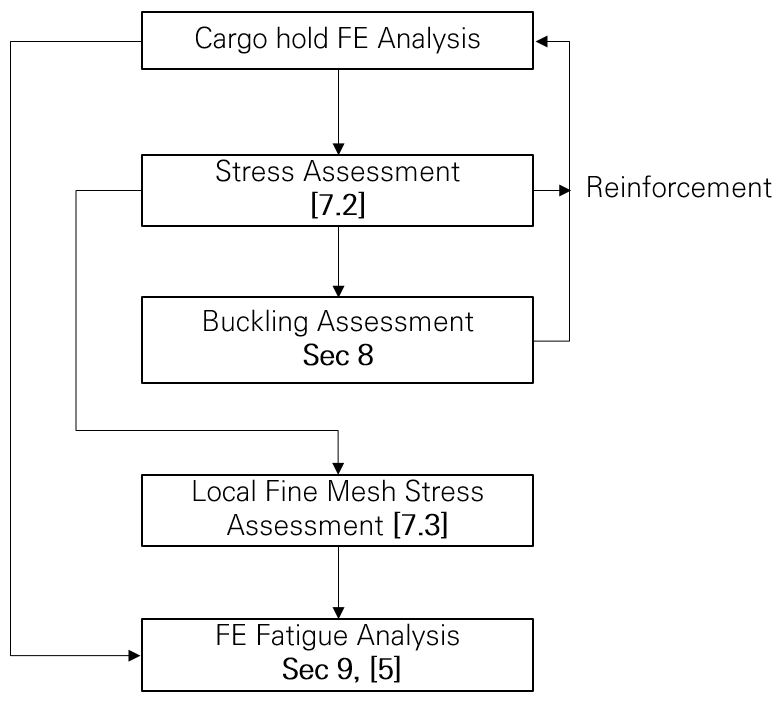
    **Figure : Flow diagram of finite element analysis**
    - **a)** Stress levels of structural analysis in accordance with **Ch 7, Sec 2** and **Ch 7, Sec 3** are within the acceptance criteria for yielding.
    - **b)** Buckling capability of plates and stiffened panels are within the acceptance criteria for bucking defined in **Ch 8**.
    - **c)** Fatigue capacity of structural details is within the acceptance criteria defined in **Ch 9**.
  - **1.1.4** **Scantling application**
    FE models for cargo hold FE analyses, local fine mesh FE analysis and very fine mesh FE analyses, are to be based on corrosion addition as given in **Ch 3, Sec 2, Table 1**.
  - **1.1.5** **Scantling assessment**
    The scantling assessment is carried out for each individual cargo hold using the FE load combinations defined in **Sec 2** applicable to the considered cargo hold. The FE analysis results are applicable to the evaluation area as defined in **Sec 2, [5.1]**, of the considered cargo hold.
    The individual bulkhead structural elements, inclusive plating, stiffeners and horizontal stringers, are to be assessed considering two cargo hold finite element analyses, i.e. the analysis for the hold forward and the one for the hold aft of the considered transverse bulkhead.

#### 2. Finite element types

- **2.1** **Used finite element types**
  - **2.1.1** The structural assessment is to be based on linear finite element analysis of three dimensional structural models. The general types of finite elements to be used in the finite element analysis are given in **Table 1**.

    | Type of finite element | Description |
    | --- | --- |
    | Rod (or truss) element | Line element with axial stiffness only and constant cross sectional area along the length of the element. |
    | Beam element | Line element with axial, torsional and bi-directional shear and bending stiffness and with constant properties along the length of the element. |
    | Shell (or plate) element | Shell element with in-plane stiffness and out-of-plane bending stiffness with constant thickness. |
  - **2.1.2** Two node line elements and four node shell elements are, in general, considered sufficient for the representation of the hull structure. The mesh requirements given in this chapter are based on the assumption that these elements are used in the finite element models. However, higher order elements may also be used.

#### 3. Submission of results

- **3.1** **Detailed report**
  - **3.1.1** A detailed report of the structural analysis is to be submitted by the designer/builder to demonstrate compliance with the specified structural design criteria including the following information:
    - **a)** List of structural drawings used including dates and versions.
    - **b)** Detailed description of structural modelling including all modelling assumptions and any deviations in geometry and arrangement of structure compared with plans.
    - **c)** Plots to demonstrate correct structural modelling and assigned properties.
    - **d)** Details of material properties, plate thickness, beam properties used in the model.
    - **e)** Details of applied boundary conditions.
    - **f)** Details of all loading conditions reviewed with calculated hull girder shear force, bending moment and torsional moment distributions.
    - **g)** Details of applied loads and confirmation that individual and total applied loads are correct.
    - **h)** Plots and results that demonstrate the correct behaviour of the structural model under the applied loads.
    - **i)** Summaries and plots of global and local deflections.
    - **j)** Summaries and sufficient plots of stresses to demonstrate that the design criteria are not exceeded in any member.
    - **k)** Plate and stiffened panel buckling analysis and results
    - **l)** Proposed amendments to structure where necessary, including revised assessment of stresses, buckling and fatigue properties showing compliance with design criteria.
    - **m)** Reference of the finite element computer program, including its version and date.

#### 4. Computer programs

- **4.1** **Use of computer programs**
  - **4.1.1** Any finite element computation program complying with **Ch 1, Sec 3** may be employed to determine the stress and deflection of the hull structure, provided that the combined effects of bending, shear, axial and torsional deformations are considered.

### Section 32 - Cargo Hold Structural Strength Analysis

**Symbols**
For symbols not defined in this section, refer to **Ch 1, Sec 4**.
$M _{sw}$ : Permissible vertical still water bending moment, in kNm, as defined in **Ch 4, Sec 4**.
$M _{wv}$ : Vertical wave bending moment, in kNm, in hogging or sagging condition, as defined in **Ch 4, Sec 4**.
$M _{wh}$ : Horizontal wave bending moment, in kNm, as defined in **Ch 4, Sec 4**.
$M _{wt}$ : Wave torsional moment in seagoing condition, in kNm, as defined in **Ch 4, Sec 4**.
$Q _{sw}$ : Permissible still water shear force, in kN, at the considered bulkhead position, as provided in **Ch 4, Sec 4**.
$Q _{wv}$ : Vertical wave shear force, in kN, as defined in **Ch 4, Sec 4**.
$x _{b-aft}$, $x _{b-fwd}$ : X-coordinate, in m, of respectively the aft and forward bulkhead of the mid-hold.
$x _{aft}$ : X-coordinate, in m, of the aft end support of the FE model.
$x _{fore}$ : X-coordinate, in m, of the fore end support of the FE model.
$x _{i}$ : X-coordinate, in m, of web frame station $i$.
$Q _{aft}$ : Vertical shear force, in kN, at aft bulkhead of mid-hold as defined in **[4.4.6]**.
$Q _{fwd}$ : Vertical shear force, in kN, at fore bulkhead of mid-hold as defined in **[4.4.6]**.
$Q _{targ-aft}$ : Target shear force, in kN, at the aft bulkhead of mid-hold as defined in **[4.3.3]**.
$Q _{targ-fwd}$ : Target shear force, in kN, at the forward bulkhead of mid-hold as defined in **[4.3.3]**.

#### 1. Objective and scope

- **1.1** **General**
  - **1.1.1** The cargo hold structural strength analysis is for the assessment of structural strength of longitudinal hull girder structural members, primary supporting members and bulkheads within the cargo hold region including transition areas to engine room and fore end. This section describes the analysis methodology and load application for cargo hold structural strength analysis.
  - **1.1.2** Cargo hold structural strength analysis is mandatory within the cargo hold region including cofferdam structure i.e. aft bulkhead of the aftmost cargo hold and fore bulkhead of the foremost cargo hold. The evaluation areas are defined in **[5.1]**.
  - **1.1.3** For the FE structural assessment and load application, at least three cargo holds are to be assessed:
    Holds in the midship cargo hold region are defined as holds with their longitudinal centre of gravity position at or forward of 0.3*L* from AE and at or aft of 0.7*L* from AE, as defined in **Figure 1**:
    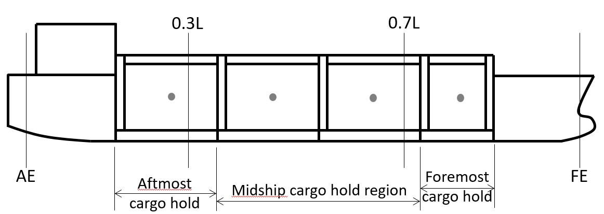
    **Figure : Definition of cargo hold regions for FE structural assessment**
    - **a)** Midship cargo hold region
    - **b)** Foremost cargo hold
    - **c)** Aftmost cargo hold
- **1.2** **Cargo hold structural strength analysis procedure**
  - **1.2.1** **Procedure description**
    The structural FE analysis is to be performed in accordance with the following:
    • Extent as given in **[2.2]**
    • Finite element types as given in **[2.3]**
    • Structural modelling as defined in **[2.4]**
    - **a)** Model: Three cargo hold model with:
    - **b)** Boundary conditions as defined in **[2.5]**
    - **c)** FE load combinations as defined in **[3]**
    - **d)** Load application as defined in **[4]**
    - **e)** Evaluation area as defined in **[5.1]**
    - **f)** Strength assessment as defined in **[5.2]** and **[5.3]**
  - **1.2.2** **Mid-hold definition**
    For the purpose of the FE analysis, the mid-hold is defined as the middle hold(s) of the three cargo hold length FE model. In case of foremost and aftmost cargo hold assessment, the mid-hold represents the foremost and aftmost cargo hold respectively.

#### 2. Structural model

- **2.1** **Members to be modelled**
  - **2.1.1** All main longitudinal and transverse structural elements are to be modelled. These include:
    • Inner and outer shell,
    • Upper deck including trunk deck,
    • Double bottom floors and girders,
    • Transverse and vertical web frames,
    • Liquid dome openings,
    • Stringers and lower decks,
    • Transverse and longitudinal bulkhead structures,
    • Other primary supporting members,
    • Other structural members which contribute to hull girder strength.
    All plates and stiffeners on the structure, including web stiffeners, are to be modelled. Brackets which contribute to primary supporting member strength and the size of which is not less than the typical mesh size (s-by-s) described in **[2.4.2]**, are to be modelled.
- **2.2** **Extent of model**
  - **2.2.1** **Longitudinal extent**
    Generally, the longitudinal extent of the cargo hold FE model is to cover three cargo hold lengths.
    The foremost cargo hold model is to be extended from the after bulkhead of No.2 cargo hold to the ship’s foremost cross section where the reinforced ring or web frame remains continuous from the base line to the strength deck.
    The aftermost cargo hold model is to include the extent of 2 cargo holds and engine room including its aft bulkhead. Where a cofferdam is fitted at the end of the model, the cofferdam space is to be modelled with its transverse bulkheads. Where the inner deck and trunk deck are welded to the deckhouse, 2 web frames aftward of engine room bulkhead are to be modelled to represent the transitional area. Typical finite element models representing the midship cargo hold region is shown in **Figure 2**.
  - **2.2.2** **Hull form modelling**
    In general, the finite element model is to represent the geometry of the hull form. In the midship cargo hold region, the finite element model may be prismatic provided the mid-hold has a prismatic shape.
    In the foremost cargo hold model, the hull form from one frame spacing forward of the transverse section at the middle of the fore part to the model end may be modelled with a simplified geometry. The transverse section at the middle of the fore part up to the model end may be extruded out to the fore model end. It is noted that the extruded area is to be outside the position of collision bulkhead.
    In the aftmost cargo hold model, the hull form aft of the machinery space may be modelled with a simplified geometry. The section at the middle of the machinery space may be extruded out to its aft bulkhead.
    When the hull form is modelled by extrusion, the geometrical properties of the transverse section located at the middle of the considered space are copied along the simplified model. The transverse web frames are to be considered along this extruded part with the same properties as ones in the fore part or in the machinery space.
  - **2.2.3** **Transverse extent**
    Both port and starboard sides of the ship are to be modelled.
  - **2.2.4** **Vertical extent**
    The full depth of the ship is to be modelled including primary supporting members above the upper deck, trunks and forecastle, if any.
    The superstructure or deck house in way of the machinery space and the bulwark are not required to be included in the model. However, if the deckhouse has a direct welding connection with trunk deck or inner deck, the FE model needs to include the structure of one floor above the trunk deck with at least 2 web frames aftward from the connection position.
    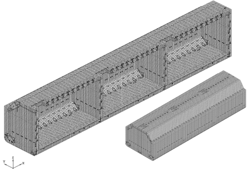
    **Figure : Example of 3 cargo hold model within midship region**
- **2.3** **Finite element types**
  - **2.3.1** Shell elements are to be used to represent plates.
    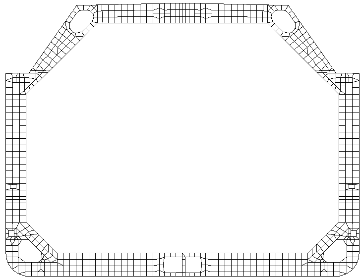
    **Figure : Typical finite element mesh on web frame**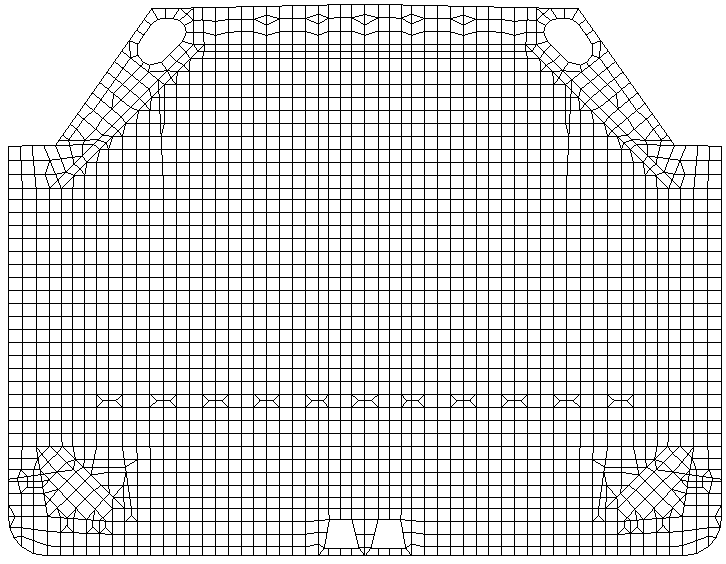
    **Figure : Typical finite element mesh on transverse bulkhead**
  - **2.3.2** All stiffeners are to be modelled with beam elements having axial, torsional, bi-directional shear and bending stiffness. The eccentricity of the neutral axis is to be modelled.
  - **2.3.3** Face plates of primary supporting members and brackets are to be modelled using rod or beam elements.
- **2.4** **Structural modelling**
  - **2.4.1** **Aspect ratio**
    The aspect ratio of the shell elements is in general not to exceed 3. The use of triangular shell elements is to be kept to a minimum. Where possible, the aspect ratio of shell elements in areas where there are likely to be high stresses or a high stress gradient is to be kept close to 1 and the use of triangular elements is to be avoided.
  - **2.4.2** **Mesh**
    The shell element mesh is to follow the stiffening system as far as practicable, hence representing the actual plate panels between stiffeners. In general, the shell element mesh is to satisfy the following requirements:
    - **a)** One element between every longitudinal stiffener, see **Figure 3**. Longitudinally, the element length is not to be greater than 2 longitudinal spaces with a minimum of three elements between primary supporting members.
    - **b)** One element between every stiffener on transverse bulkheads, see **Figure 4**.
    - **c)** One element between every web stiffener on transverse and vertical web frames and stringers, see **Figure 3** and **Figure 5**. The mesh on the hopper tank web frame is to be fine enough to represent the shape of the web ring opening, as shown **Figure 3**.
    - **d)** At least 3 elements over the depth of double bottom girders, floors, transverse web frames, vertical web frames and horizontal stringers on transverse bulkheads. For deck transverse and horizontal stringers on transverse wash bulkheads and longitudinal bulkheads with a smaller web depth, modelling using 2 elements over the depth is acceptable provided that there is at least 1 element between every web stiffener. The mesh size of adjacent structure is to be adjusted accordingly.
    - **e)** The curvature of the free edge on large brackets of primary supporting members is to be modelled to avoid unrealistic high stress due to geometry discontinuities. In general, a mesh size equal to the stiffener spacing is acceptable. The bracket toe may be terminated at the nearest nodal point provided that the modelled length of the bracket arm does not exceed the actual bracket arm length. The bracket flange is not to be connected to the plating. The modelling of the tapering part of the flange is to be in accordance with **[2.4.6]**. A finer mesh is to be used for the determination of detailed stress at the bracket toe, as given in **Ch 7, Sec 3**.
    - **f)** Example of mesh arrangements of the cargo hold structure are shown in **Figure 6**. 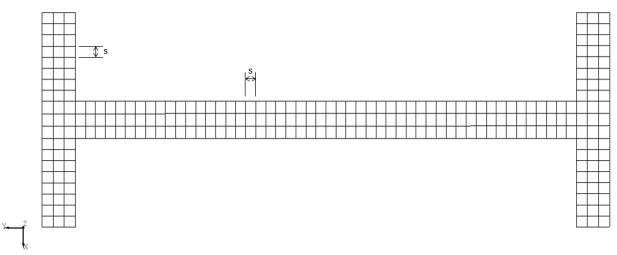
      **Figure : Typical finite element mesh on horizontal transverse stringer on transverse bulkhead**
  - **2.4.3** **Finer mesh**
    Where the geometry cannot be adequately represented in the cargo hold model and the stress exceeds the cargo hold mesh acceptance criteria, a finer mesh may be used for such geometry to demonstrate satisfactory structural strength. The mesh size required for such analysis can be governed by the geometry. In such cases, the average stress within an area equivalent to that specified in **[2.4]** is to comply with the requirements given in **[5.2]**.
  - **2.4.4** **Sniped stiffener**
    Non continuous stiffeners are to be modelled as continuous stiffeners, i.e. the height web reduction in way of the snip ends are not to be modelled.
  - **2.4.5** **Web stiffeners of primary supporting members**
    Web stiffeners of primary supporting members are to be modelled. Where these stiffeners are not in line with the primary FE mesh, it is sufficient to place the line element along the nearby nodal points provided that the adjusted distance does not exceed 0.2 times the stiffener spacing under consideration. The stresses and buckling utilisation factors obtained need not be corrected for the adjustment.
  - **2.4.6** **Face plate of primary supporting member**
    The effective cross sectional area at the curved part of the face plate of primary supporting members and brackets is to be calculated in accordance with **Ch 3, Sec 7**. The cross sectional area of a rod or beam element representing the tapering part of the face plate is to be based on the average cross sectional area of the face plate in way of the element length.
  - **2.4.7** **Openings**
    #imgID-243_s0Regardless of size, manholes are to be modelled by removing the appropriate elements.
- **2.5** **Boundary conditions**
  - **2.5.1** **General**
    All boundary conditions described in this section are in accordance with the global coordinate system defined in **Ch 4, Sec 1**. The boundary conditions given **[2.5.2]** are applicable to cargo hold finite element model analyses in cargo hold region.
  - **2.5.2** **Boundary Conditions**
    The rigid links connect the nodes on the longitudinal members at the model ends to an independent point at neutral axis in centreline. The boundary conditions to be applied at the ends of the mid-hold cargo hold FE model are given in **Table 1**. For the foremost and aftmost cargo hold analysis, the boundary conditions to be applied at the ends of the cargo hold model are given in **Table 2** and **Table 3** respectively. For the case of LM3-I, additional boundary condition as given in **Table 4** is to be applied at the aftward and forward cofferdam bulkheads of middle hold in the model.

    | Location | Translation |   |   | Rotation |   |   |
    | --- | --- | --- | --- | --- | --- | --- |
    | Location | $\delta _{x}$ | $\delta _{y}$ | $\delta _{z}$ | $\theta _{x}$ | $\theta _{y}$ | $\theta _{z}$ |
    | **Aft End** |   |   |   |   |   |   |
    | Independent point | - | Fix | Fix | $M _{T-end}$ | - | - |
    | Cross Section | - | Rigid link | Rigid link | Rigid link | - | - |
    | **Fore End** |   |   |   |   |   |   |
    | Independent point | - | Fix | Fix | Fix | - | - |
    | Intersection of centreline and inner bottom | Fix | - | - | - | - | - |
    | Cross Section | - | Rigid link | Rigid link | Rigid link | - | - |
    | Note 1: [-] means no constraint applied (free). Note 2: See **Figure 7**. |   |   |   |   |   |   |

    | Location | Translation |   |   | Rotation |   |   |
    | --- | --- | --- | --- | --- | --- | --- |
    | Location | $\delta _{x}$ | $\delta _{y}$ | $\delta _{z}$ | $\theta _{x}$ | $\theta _{y}$ | $\theta _{z}$ |
    | **Aft End** |   |   |   |   |   |   |
    | Independent point | Fix | - | - | Fix | Fix | Fix |
    | Cross Section | Rigd link | - | - | Rigid link | Rigid link | Rigid link |
    | Intersection of centerline and bottom, centerline and trunk deck | - | Fix | - | - | - | - |
    | Line S | - | - | Fix | - | - | - |
    | **Fore End** |   |   |   |   |   |   |
    | Independent point | - | - | - | $M _{T-end}$ | - | - |
    | Cross Section | - | Rigid link | Rigid link | Rigid link | - | - |
    | Note 3: [-] means no constraint applied (free). Note 4: See **Figure 8**. |   |   |   |   |   |   |

    | Location | Translation |   |   | Rotation |   |   |
    | --- | --- | --- | --- | --- | --- | --- |
    | Location | $\delta _{x}$ | $\delta _{y}$ | $\delta _{z}$ | $\theta _{x}$ | $\theta _{y}$ | $\theta _{z}$ |
    | **Fore End** |   |   |   |   |   |   |
    | Independent point | Fix | - | - | Fix | Fix | Fix |
    | Cross Section | Rigd link | - | - | Rigid link | Rigid link | Rigid link |
    | Intersection of centerline and bottom, centerline and trunk deck | - | Fix | - | - | - | - |
    | Line S | - | - | Fix | - | - | - |
    | **Aft End** |   |   |   |   |   |   |
    | Independent point | - | - | - | $M _{T-end}$ | - | - |
    | Cross Section | - | Rigid link | Rigid link | Rigid link | - | - |
    | Note 5: [-] means no constraint applied (free). Note 6: See **Figure 8**. |   |   |   |   |   |   |

    | Location | Translation |   |   | Rotation |   |   |
    | --- | --- | --- | --- | --- | --- | --- |
    | Location | $\delta _{x}$ | $\delta _{y}$ | $\delta _{z}$ | $\theta _{x}$ | $\theta _{y}$ | $\theta _{z}$ |
    | **Aftward cofferdam bulkhead of Aft bulkhead in the middle hold** |   |   |   |   |   |   |
    | Line D, Line B | - | Fix | - | - | - | - |
    | **Forward cofferdam bulkhead of fore bulkhead in the middle hold** |   |   |   |   |   |   |
    | Line D, Line B | - | Fix | - | - | - | - |
    | Note 7: [-] means no constraint applied (free). Note 8: See **Figure 9**. |   |   |   |   |   |   |

    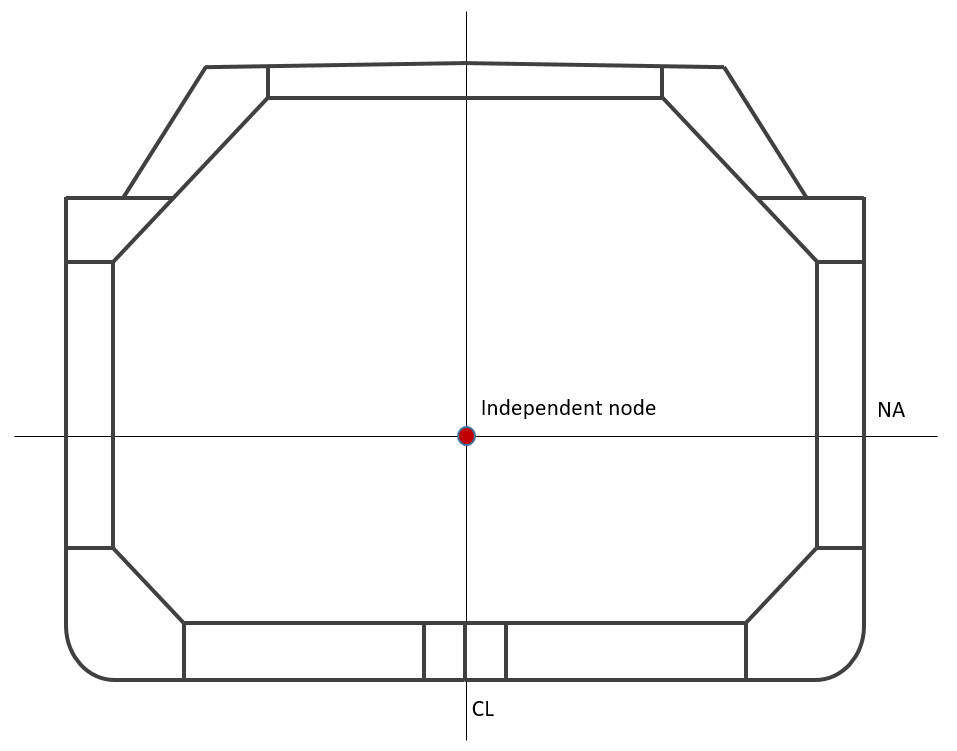
    **Figure : Boundary conditions applied at the model end sections of Mid model**
    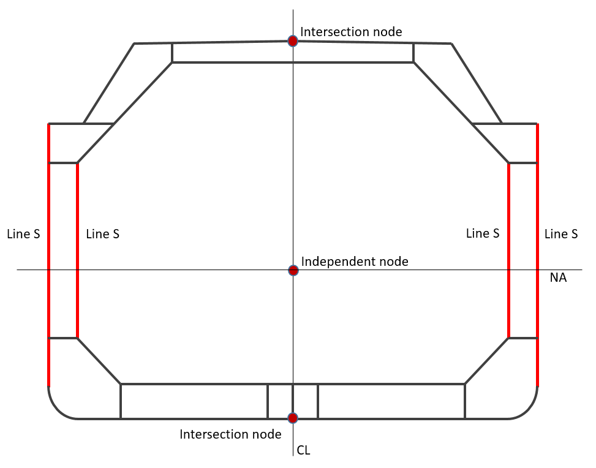
    **Figure : Boundary conditions applied at the model end of aft end section in foremost hold, fore end section in aftmost hold respectively**
    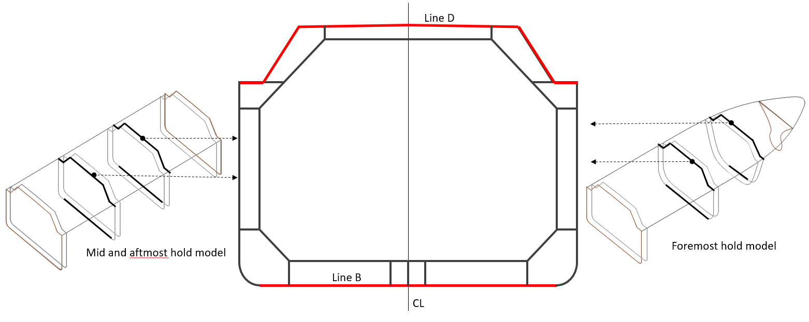
    **Figure : Additional LM3-I Boundary conditions applied at the model**

#### 3. FE load combinations

- **3.1** **Design load combinations**
  - **3.1.1** **FE load combination definition**
    A FE load combination is defined as a loading pattern, a draught, a value of still water bending and shear force, associated with a given dynamic load case.
  - **3.1.2** **Loading conditions**
    Loading conditions to be considered for a strength assessment generally are as follow:
    - **a)** Standard loading conditions for yielding and buckling strength assessment are given in **[3.1.3]**.
    - **b)** For fatigue assessment, standard designs are given in **Ch 9, Sec 1**.
  - **3.1.3** **Load combinations**
    For cargo hold structural strength analysis for midship holds, the design load combinations specified in **Table 5** are to be used as a minimum. For aftmost and foremost cargo hold structural strength analysis, the design load combinations specified respectively in **Table 6** and **7** are to be considered.
    Each design load combination given in **Table 5 ~ 7** consists of a loading pattern and dynamic load cases as given in **Ch 4, Sec 2**. Each load combination requires the application of the structural weight, internal and external loads and hull girder loads. For seagoing condition, both static and dynamic load components (S+D) are applied.
    The “maximum shear force load combinations“ are marked as “Max SFLC“ in the load combination tables of **Table 5 ~ 7**. The “other shear force load combinations“ are those which are not the maximum shear force load combinations. They are not marked in the load combination tables of **Table 5 ~ 7**.
  - **3.1.4** **Additional loading conditions**
    Where the loading conditions specified by the designer are not covered by the load combinations given in **[3.1.3]**, these additional loading conditions are to be examined according to the procedure in **[4]**.

    | No | Loading Pattern | Draught | % of perm. SWBM | % of perm. SWSF | Dynamic load cases | Pressure by IGC (**Pt 7, Ch 5**) |
    | --- | --- | --- | --- | --- | --- | --- |
    | Seagoing conditions |   |   |   |   |   |   |
    | LM1^2) |  | *0.7*$T _{SC}$^1) | 0% Sagging | ≤100% | HSM1 | N/A |
    | LM1^2) |   | *0.7*$T _{SC}$^1) | 100% Hogging | ≤100% | HSM2, FSM2, BSR-2P, OST-1P, OST-2P | N/A |
    | LM2^2) | 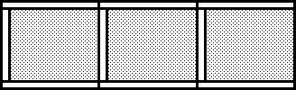 | $T _{SC}$ | 100% Sagging | ≤100% | HSM1, BSP-2P, BSR-1P, OST-1P | N/A |
    | LM2^2) |   | $T _{SC}$ | 30% Hogging | ≤100% | HSM2, BSP-1P, BSR-2P, OST-2P | N/A |
    | LM3^2) |  | *0.8*$T _{SC}$ | 100% Sagging | 100% Max SFLC (aft-, fwd+) | HSM1 | N/A |
    | LM3^2) |   | *0.8*$T _{SC}$ | 100% Sagging | ≤100% | BSP-1P, BSP-2P | N/A |
    | LM3^2) |   | *0.8*$T _{SC}$ | 75% Hogging | ≤100% | HSM2 | N/A |
    | LM3 -I |  | *0.8*$T _{SC}$^3) | ≤100% | ≤100% | N/A | Static 30° Heel angle^3) |
    | LM4^2) | 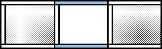 | 0.9$T _{SC}$ | 70% Sagging | ≤100% | HSM1 | N/A |
    | LM4^2) |   | 0.9$T _{SC}$ | 60% Hogging | 100% Max SFLC (aft+, fwd-) | HSM2, FSM2 | N/A |
    | LM4^2) |   | 0.9$T _{SC}$ | 60% Hogging | ≤100% | BSR-1P, BSR-2P | N/A |
    | Accidental condition |   |   |   |   |   |   |
    | LM5 |  | $T _{SC}$ | ≤100% | ≤100% | N/A | 0.5g forward Collision load + static pressure by gravity |
    | Harbour conditions |   |   |   |   |   |   |
    | LM6 |  | *0.8*$T _{SC}$ | 100% Sagging | 100% Max SFLC (aft-, fwd+) | N/A | N/A |
    | LM7 |  | 0.9$T _{SC}$ | 60% Hogging | 100% Max SFLC (aft+, fwd-) | N/A | N/A |
    | Note : 1) Draught needs not greater than the minimum ballast draught in the loading manual. 2) For the ship with an asymmetrical structures, BSR-1S, BSR-2S, BSP-1S, BSP-2S, OST-1S and OST-2S shall be investigated additionally. For ships with symmetrical about the centerline, results of one side should be considered as same as the other side 3) Hydrostatic external sea pressure with 30° heel angle $\phi _{\beta }$ ($\phi _{\beta }$ = 30°). |   |   |   |   |   |   |
    | 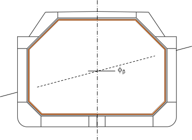 $\rho g \left( T \cos \phi _{\beta } - \frac{B}{2} \sin \phi _{\beta } \right)$ $\rho g \left( T \cos \phi _{\beta } + \frac{B}{2} \sin \phi _{\beta } \right)$ |   |   |   |   |   |   |

    | No | Loading Pattern | Draught | % of perm. SWBM | % of perm. SWSF | Dynamic load cases | Acceleration by IGC(**Pt 7, Ch 5**) |
    | --- | --- | --- | --- | --- | --- | --- |
    | Seagoing conditions |   |   |   |   |   |   |
    | LA1^2) |  | *0.7*$T _{SC}$^1) | 0% Sagging | ≤100% | HSM1 | N/A |
    | LA1^2) |   | *0.7*$T _{SC}$^1) | 100% Hogging | ≤100% | HSM2, FSM2, OST-1P, OST-2P | N/A |
    | LA2^2) | 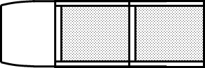 | $T _{SC}$ | 100% Sagging | ≤100% | HSM1, FSM1 BSP-1P, BSP-2P BSR-1P, BSR-2P OST-1P, OST-2P | N/A |
    | LA2^2) |   | $T _{SC}$ | 40% Hogging | ≤100% | HSM2 | N/A |
    | LA3 |  | *0.85*$T _{SC}$ | 0% Sagging | 100% Max SFLC(Aft-) | HSM1 | N/A |
    | LA3 |   | *0.85*$T _{SC}$ | 60% Hogging | 100% Max SFLC(fwd+) | HSM2 | N/A |
    | LA3 -I | 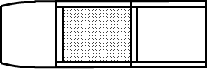 | *0.85*$T _{SC}$^3) | ≤100% | ≤100% | N/A | Static 30° Heel angle^3) |
    | LA4^5) |  | *0.85*$T _{SC}$ | 30% Sagging | 100% Max SFLC(Fwd-) | HSM1 | N/A |
    | LA4^5) |   | *0.85*$T _{SC}$ | 70% Hogging | 100% Max SFLC(Aft+) | HSM2 | N/A |
    | Accidental condition |   |   |   |   |   |   |
    | LA5 |  | $T _{SC}$ | ≤100% | ≤100% | N/A | Collision load with aftward 0.25g acceleration + static pressure by gravity |
    | Harbour condition |   |   |   |   |   |   |
    | LA6 | 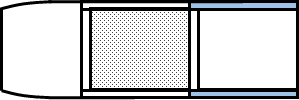 | *0.85*$T _{SC}$ | 30% Sagging | 100% Max SFLC(aft-) | N/A | N/A |
    | LA7 | 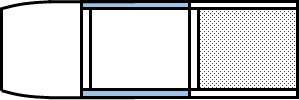 | *0.85*$T _{SC}$ | 70% Hogging | 100% Max SFLC(Aft+) | N/A | N/A |
    | Note : 1) Draught needs not greater than the minimum ballast draught in the loading manual. 2) For the ship with an asymmetrical structures, BSR-1S, BSR-2S, BSP-1S, BSP-2S, OST-1S and OST-2S shall be investigated additionally. For ships with symmetrical about the centerline, results of one side should be considered as same as the other side 3) Hydrostatic external sea pressure with 30° heel angle $\phi _{\beta }$($\phi _{\beta }$ = 30°). 4) 100% filling of tanks in E/R |   |   |   |   |   |   |
    |  $\rho g \left( T \cos \phi _{\beta } - \frac{B}{2} \sin \phi _{\beta } \right)$ $\rho g \left( T \cos \phi _{\beta } + \frac{B}{2} \sin \phi _{\beta } \right)$ |   |   |   |   |   |   |

    | No | Loading Pattern | Draught | % of perm. SWBM | % of perm. SWSF | Dynamic load cases | Acceleration by IGC(**Pt 7, Ch 5**) |
    | --- | --- | --- | --- | --- | --- | --- |
    | Seagoing conditions |   |   |   |   |   |   |
    | LF1^2) |  | *0.7*$T _{SC}$^1) | 0% Sagging | ≤100% | HSM1, BSR-2P, OSA-2P | N/A |
    | LF1^2) |   | *0.7*$T _{SC}$^1) | 100% Hogging | ≤100% | HSM2, FSM2, BSR-1P, OST-1P, OST-2P, OSA-1P | N/A |
    | LF2^2) | 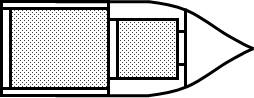 | $T _{SC}$ | 100% Sagging | ≤100% | HSM1, FSM1 BSP-1P, BSP-2P, BSR-1P, BSR-2P OST-1P, OST-2P | N/A |
    | LF2^2) |   | $T _{SC}$ | 30% Hogging | ≤100% | HSM2 | N/A |
    | LF3 | 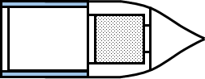 | *0.85*$T _{SC}$ | 60% Sagging | ≤100% | HSM1 | N/A |
    | LF3 |   | *0.85*$T _{SC}$ | 100% Hogging | 100% Max SFLC(Aft-) | HSM2 | N/A |
    | LF3 -I | 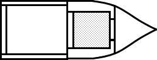 | *0.85*$T _{SC}$^3) | ≤100% | ≤100% | N/A | Static 30° Heel angle^3) |
    | LF4^4) | 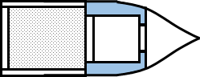 | 0.9$T _{SC}$ | 100% Sagging | 100% Max SFLC(Aft+) | HSM1 | N/A |
    | LF4^4) |   | 0.9$T _{SC}$ | 50% Hogging | 100% Max SFLC(Aft-) | HSM2 | N/A |
    | Accidental condition |   |   |   |   |   |   |
    | LF5 |  | $T _{SC}$ | ≤100% | ≤100% | N/A | Collision load with forward 0.5g acceleration + static pressure by gravity |
    | Harbour condition |   |   |   |   |   |   |
    | LF6 |  | *0.85*$T _{SC}$ | 60% Sagging | 100% Max SFLC (Fwd+) | N/A | N/A |
    | LF7 |  | 0.9$T _{SC}$ | 50% Hogging | 100% Max SFLC(Aft-) | N/A | N/A |
    | Note : 1) Draught needs not greater than the minimum ballast draught in the loading manual. 2) For the ship with an asymmetrical structures, BSR-1S, BSR-2S, BSP-1S, BSP-2S, OST-1S and OST-2S shall be investigated additionally. For ships with symmetrical about the centerline, results of one side should be considered as same as the other side 3) Hydrostatic external sea pressure with 30° heel angle $\phi _{\beta }$($\phi _{\beta }$ = 30°). 4) 100% filling of tanks in fore end structure outside of cargo hold region |   |   |   |   |   |   |
    |  $\rho g \left( T \cos \phi _{\beta } - \frac{B}{2} \sin \phi _{\beta } \right)$ $\rho g \left( T \cos \phi _{\beta } + \frac{B}{2} \sin \phi _{\beta } \right)$ |   |   |   |   |   |   |

#### 4. Load application

- **4.1** **General**
  - **4.1.1** **Structural weight**
    Effect of the weight of hull structure is to be included in static loads, but is not to be included in dynamic loads. Density of steel is to be taken as given in **Ch 4, Sec 6**.
  - **4.1.2** **Sign convention**
    Unless otherwise mentioned in this Section, the sign of moments and shear force is to be in accordance with the sign convention defined in **Ch 4, Sec 1**.
- **4.2** **External and internal loads**
  - **4.2.1** **External pressure**
    External pressure is to be calculated for each load case in accordance with **Ch 4, Sec 5**. External pressures include static sea pressure, wave pressure and green sea pressure.
    In case of internal pressure by IGC Code application, the hydrostatic pressure with corresponding roll angle, which is given such that the maximum pressure is obtained at a given location in **Table 5 ~ 7**, is to be combined. In that load case, any dynamic load case is to be excluded.
    The effect of the liquid dome cover and pump tower self weight is to be ignored in the loads applied to the ship structure.
  - **4.2.2** **Internal pressure**
    Internal loads are to be calculated for each load case in accordance with **Ch 4, Sec 6** for design load scenarios given in **Ch 4, Sec 7, Table 1**. They include static ballast and other liquid pressure, setting pressure on relief valve and dynamic load of ballast and other liquid pressure due to acceleration.
    The cargo design vapour pressure, which is to be not less than 0.025 MPa, shall be considered as a static load in all loaded cargo tanks of seagoing condition.
    When the internal cargo pressure by IGC Code is applied, it shall be calculated in accordance with **Pt7, Ch 5, Sec 4 428**. It is also acceptable to calculate the dynamic pressure using the accelerations derived from other method for alternative design. In that case, the reduction factor $f _{IGC}$ shall not be applicable.
  - **4.2.3** **Cargo density**
    Maximum cargo density is generally taken as not less than 0.5 t/m^3. To take into account of the volume difference between 1^st barrier and inner hull, the cargo density may be used as adjusted below,
    $\rho _{c _{ajusted}} = \rho _{c} \frac{V _{C}}{V _{Hull}} + \rho _{CCS} \frac{\left( V _{Hull} -V _{C} \right)}{V _{Hull}}$
    where:
    $V _{C}$ : Volume of cargo tank enclosed by primary barrier of cargo containment system in m^3
    $V _{Hull}$ : Volume of cargo hold enclosed by inner hull structure in m^3
    $\rho _{CCS}$ : Density of cargo containment system in t/m^3, generally 0.12 can be used.
    And, effective cargo density may be adjusted to consider the maximum filling height as below,
    $\rho _{c _{eff}} = \rho _{c _{adjusted}} \frac{M _{Max filling\% by \rho _{Max-LM}}}{M _{100\% by \rho _{c}}}$
    where:
    $M _{Max filling\% by \rho _{Max-LM}}$ : Cargo Mass of a hold when filled to maximum level(%) with design cargo density in Loading manual
    $M _{100\% by \rho _{c}}$ : Cargo Mass of a hold when filled to 100% with $\rho _{c}$ = 0.5 t/m^3
    $\rho _{c _{eff}}$ : Effective cargo density for internal loads in FE analysis (t/m^3)
  - **4.2.4** **Pressure application on FE element**
    Constant pressure, calculated at the element’s centroid, is applied to the shell element of the loaded surfaces, e.g. outer shell and deck for external pressure and tank/hold boundaries for internal pressure. Alternately, pressure can be calculated at element nodes applying linear pressure distribution within elements.
- **4.3** **Hull girder loads**
  - **4.3.1** **General**
    Each loading condition is to be associated with its corresponding hull girder loads which is to be applied to the model according to the procedure described in **[4.4]** for shear force and bending moment and in **[4.5]** for torsional moment. The hull girder loads are the combinations of still water hull girder loads and wave induced hull girder loads as specified in **Table 5** ~ **7**. For each required FE load combination, the wave induced hull girder loads are to be calculated with the Load Combination Factors (LCFs), specified in **Ch 4, Sec 2**.
  - **4.3.2** **Target hull girder vertical bending moment**
    The target hull girder vertical bending moment, $M _{v-targ}$, in kNm, at a longitudinal position for a given FE load combination is taken as:
    $M _{v-targ} =C _{BM-LC} M _{sw} +M _{wv-LC}$
    where:
    $C _{BM-LC}$ : Percentage of permissible still water bending moment applied for the load combination under consideration as given in **[3.1.2]**.
    $M _{sw}$ : Permissible still water bending moments in kNm, at the considered longitudinal position for seagoing as defined in **Ch 4, Sec 4, [2.2.1]** and **Ch 4, Sec 4, [2.2.2]** respectively.
    $M _{wv-LC}$ : Vertical wave bending moment in kNm, for the dynamic load case under consideration, calculated in accordance with **Ch 4, Sec 4, [3.5.2]**.
    When the dynamic load cases are not applied, the target hull girder vertical bending moment is taken with $M _{wv-LC} =0$.
    The values of $M _{v-targ}$ are taken as:
    • Midship cargo hold region: the maximum hull girder bending moment within the mid-hold(s) for each individual cargo hold for each given FE load combination as defined in **Table 5**.
    • Outside midship cargo hold region: the values at all web frame and transverse bulkhead positions of the FE model under consideration
  - **4.3.3** **Target hull girder shear force**
    The target hull girder vertical shear force at the aft and forward transverse bulkheads of the mid-hold, $Q _{targ-aft}$ and $Q _{targ-fwd}$, in kN, for a given FE load combination is taken as:
    • $Q _{fwd} \geq Q _{aft}$ :
    $Q _{targ-aft} =C _{SF-LC} \cdot Q _{sw-n eg} +f _{\beta } \left| C _{QW} \right| Q _{wv-n eg}$
    $Q _{targ-fwd} =C _{SF-LC} \cdot Q _{sw-pos} +f _{\beta } \left| C _{QW} \right| Q _{wv-pos}$
    • $Q _{fwd} \(Q _{targ-aft} =C _{SF-LC} \cdot Q _{sw-pos} +f _{\beta } \left| C _{QW} \right| Q _{wv-pos}$
    $Q _{targ-fwd} =C _{SF-LC} \cdot Q _{sw-n eg} +f _{\beta } \left| C _{QW} \right| Q _{wv-n eg}$
    where:
    $Q _{fwd} , Q _{aft}$ : Vertical shear forces, in kN, due to the local loads respectively at the forward and aft bulkhead position of the mid-hold, as defined in **[4.4.6]**.
    $C _{SF-LC}$ : Percentage of permissible still water shear force as given in **[3.1]**, for the FE load combination under consideration.
    $Q _{sw-pos} , Q _{sw-n eg}$ : Positive and negative permissible still water shear forces, in kN, at any longitudinal position for seagoing as defined in **Ch 4, Sec 4, [2.3.1]** and **Ch 4, Sec 4, [2.3.2]** respectively.
    $f _{\beta }$ : Wave heading factor, as given in **Ch 4, Sec 4**.
    $C _{QW}$ : Load combination factor for vertical wave shear force, as given in **Ch 4, Sec 2**.
    $Q _{wv-pos} , Q _{wv-n eg}$ : Positive and negative vertical wave shear force, in kN, as defined in **Ch 4, Sec 4, [3.2.1]**.
    The values of $Q _{targ-aft}$ and $Q _{targ-fwd}$ are to be taken at after and forward transverse bulkheads of the
    mid-hold under consideration. Where the dynamic load cases are not applied, which have additional boundary condition of **Table 4**, the target hull girder vertical shear force is taken with $C _{QW} =0$.
    And, the target hull girder vertical shear force for the analysis models with the boundary condition of **Table 2** or **Table 3**, is taken as:
    • $Q _{fwd} >Q _{aft} >0$ :
    $Q _{targ-fwd} =C _{SF-LC} \cdot Q _{sw-pos} +f _{\beta } \left| C _{QW} \right| Q _{wv-pos}$
    $Q _{targ-aft} =C _{SF-LC} \cdot Q _{sw-pos} +f _{\beta } \left| C _{QW} \right| Q _{wv-pos}$
    • $Q _{fwd} \leq Q _{aft} \leq 0$ :
    $Q _{targ-fwd} =C _{SF-LC} \cdot Q _{sw- n e g} +f _{\beta } \left| C _{QW} \right| Q _{wv- n e g}$
    $Q _{targ-aft} =C _{SF-LC} \cdot Q _{sw- n e g} +f _{\beta } \left| C _{QW} \right| Q _{wv- n e g}$
    Additional hull girder vertical shear force at the model end with the boundary condition of **Table 2** or **Table 3**, $F _{design}$ in kN, is taken as:
    • $R _{fix} < 0$
    $F _{design} =C _{SF-LC} \cdot Q _{sw- n e g} +f _{\beta } \left| C _{QW} \right| Q _{wv- n e g}$
    • $R _{fix} \geq 0$
    $F _{design} =C _{SF-LC} \cdot Q _{sw-pos} +f _{\beta } \left| C _{QW} \right| Q _{wv-pos}$
    When a target position is specified in **Table 5** ~ **7**, the target hull girder vertical shear force is taken as:
    • aft+ :
    $Q _{targ-aft} =C _{SF-LC} \cdot Q _{sw-pos} +f _{\beta } \left| C _{QW} \right| Q _{wv-pos}$
    • aft- :
    $Q _{targ-aft} =C _{SF-LC} \cdot Q _{sw-n e g } +f _{\beta } \left| C _{QW} \right| Q _{wv- n e g}$
    • fwd+ :
    $Q _{targ-fwd} =C _{SF-LC} \cdot Q _{sw-pos} +f _{\beta } \left| C _{QW} \right| Q _{wv-pos}$
    • fwd- :
    $Q _{targ-fwd} =C _{SF-LC} \cdot Q _{sw- n e g} +f _{\beta } \left| C _{QW} \right| Q _{wv- n e g}$
    where, $F _{design}$, and $R _{fix}$ are defined in **[4.4.8]**.
  - **4.3.4** **Target hull girder horizontal bending moment**
    The target hull girder horizontal bending moment, $M _{h-targ}$, in kNm, for a given FE load combination is taken as:
    $M _{h-targ} =M _{wh-LC}$
    where:
    $M _{wh-LC}$ : Horizontal wave bending moment, in kNm, for the dynamic load case under consideration, calculated in accordance with **Ch 4, Sec 4, [3.5.4]**.
    The values of $M _{wh-LC}$ are taken as:
    • Midship cargo hold region: the value calculated for the middle of the individual cargo hold under consideration.
    • Outside midship cargo hold region: the values at all web frame and transverse bulkhead positions of the FE model under consideration.
  - **4.3.5** **Target hull girder torsional moment**
    The target hull girder torsional moment, $M _{wt-targ}$ in kNm, for the dynamic load cases OST and OSA is the value at the target location tanken as:
    $M _{wt-targ} =M _{wt-LC} \left( x _{targ} \right)$
    where:
    $M _{wt-LC} (x)$: Wave torsional moment, in kNm, for the dynamic load case OST and OSA, calculated at x position in accordance with **Ch 4, Sec 4, [3.5.5]**.
    $x _{targ}$ : Target location for hull girder torsional moment taken as:
    • Midship cargo hold region:
    If x_mid ≤ 0.531*L*: after bulkhead of the mid-hold
    If x_mid ＞ 0.531*L*: forward bulkhead of the mid-hold
    • Outside midship cargo hold region:
    After transverse bulkhead of mid-hold
    For dynamic load cases other than OST and OSA, hull girder torsional moment $M _{wt-targ}$, at the middle of the mid-hold is to be adjusted to zero.
- **4.4** **Procedure to adjust hull girder shear forces and bending moments**
  - **4.4.1** **General**
    The procedure given in this sub-article **[4.4]** describes how to adjust the hull girder horizontal bending moment, vertical force and vertical bending moment distribution on the three cargo hold FE model to achieve the required target values at required locations. The hull girder load target values are specified in **[4.3]**.
    The target locations for hull girder shear force are at the transverse bulkheads of the mid-hold. The final adjusted hull girder shear force at the target location should not exceed the target hull girder shear force.
    The target location for hull girder bending moment is, in general, located at the centre of the mid-hold. If the maximum value of bending moment is not located at the centre of the mid-hold, the final adjusted maximum bending moment within the mid-hold is not to exceed the target hull girder bending moment.
  - **4.4.2** **Local load distribution**
    The following local loads are to be applied for the calculation of hull girder shear and bending moments:
    With the above local loads applied to the FE model, the FE nodal forces are obtained through FE loading procedure. The 3D nodal forces will then be lumped to each longitudinal station to generate the one dimension local load distribution. The longitudinal stations are located at transverse bulkheads/frames and typical longitudinal FE model nodal locations in between the frames according to the cargo hold model mesh size requirement. Any intermediate nodes created for modelling structural details are not treated as the longitudinal stations for the purpose of local load distribution.
    The nodal forces within half of forward and half of afterward of longitudinal station spacing are lumped to that station. The lumping process will be done for vertical and horizontal nodal forces separately to obtain the lumped vertical and horizontal local loads, $f _{vi}$ and $f _{hi}$, at the longitudinal station $i$.
    - **a)** Ship structural steel weight distribution over the length of the cargo hold model (static loads). The structural steel weight is to be calculated based on the FE model with an gross offered thickness, as used in the cargo hold FE model.
    - **b)** Weight of cargo, ballast and other liquid in relevant tanks (static loads).
    - **c)** Static sea pressure, dynamic wave pressure and, where applicable, green sea load. For the tank testing and flooding load cases, only static sea pressure needs to be applied.
    - **d)** Dynamic cargo, ballast and other liquid loads in relevant tanks for seagoing load cases.
  - **4.4.3** **Hull girder forces and bending moment due to local loads**
    With the local load distribution, the hull girder load longitudinal distributions are obtained by assuming that the model is simply supported at model ends for Midship, and fixed at aft model end for foremost cargo hold and at fore model end for aftmost cargo hold model.
    The reaction forces at both ends of the model and longitudinal distributions of hull girder shear forces and bending moments induced by local loads at any longitudinal station are determined by the formulae in **Table 8** depending on the assumption of boundary conditions.
    It should be noted that there is no need to calculate horizontal bending moment distribution by local loads when the boundary condition specified in **Table 4** is applied.
  - **4.4.4** **Longitudinal unbalanced force**
    In case total longitudinal force of Midship cargo region, $F _{l}$, is not equal to zero, the counter longitudinal force, $\left( F _{x} \right) _{j}$, is to be applied at one end of the model, where the translation on X-direction, $\delta _{x}$, is fixed, by distributing longitudinal axial nodal forces to all hull girder bending effective longitudinal elements, as follows:
    $(F _{x} ) _{j} = \frac{F _{l}}{A _{x}} \frac{A _{j}}{n _{j}}$
    where:
    $\left( F _{x} \right) _{j}$ : Axial force applied to a node of the j-th element, in kN.
    $F _{l}$ : Total longitudinal force of the model, as defined in **[4.4.3]**, in kN.
    $A _{j}$ : Cross sectional area of the j-th element, in m^2.
    $A _{x}$ : Cross sectional area of fore end section, in m^2,
    $A _{x} = \sum _{j} ^{} A _{j}$
    $n _{j}$ : Number of nodal points of j-th element on the cross section, $n _{j}$ = 1 for beam element, $n _{j}$ = 2 for 4-node shell element.

    | Component | Midship cargo hold model | Foremost / Aftmost cargo hold model |
    | --- | --- | --- |
    | Reaction | $R _{V _{-} f o re} =- \frac{\sum _{i} ^{} (x _{i} -x _{aft} )f _{vi}}{x _{fo re} -x _{aft}}$ | $R _{V _{-} f o re} =0$ for foremost, $R _{V _{-} f o re} =- \sum _{i} ^{} f _{vi}$ for aftmost |
    | Reaction | $R _{V _{-} aft} = \sum _{i} ^{} f _{vi} +R _{V _{-} f o re}$ | $R _{V _{-} aft} = \sum _{i} ^{} f _{vi}$ for foremost, $R _{V _{-} aft} =0$ for aftmost |
    | Reaction | $R _{H _{-} f o re} = \frac{\sum _{i} ^{} (x _{i} -x _{aft} )f _{hi}}{x _{fo re} -x _{aft}}$ | $R _{H _{-} f o re} =0$ for foremost, $R _{H _{-} f o re} = \sum _{i} ^{} f _{hi}$ for aftmost |
    | Reaction | $R _{H _{-} aft} =- \sum _{i} ^{} f _{hi} +R _{H _{-} f o re}$ | $R _{H _{-} aft} =- \sum _{i} ^{} f _{hi}$ for foremost, $R _{H _{-} aft} =0$ for aftmost |
    | Reaction | $F _{l} = \sum _{i} ^{} f _{li}$ | - |
    | Shear force | $Q _{V _{-} FEM} (x _{j} )=R _{V _{-} aft} - \sum _{i} ^{} f _{vi}$ when $x _{i} for foremost, \(Q _{V _{-} FEM} (x _{j} )= \sum _{i} ^{} f _{vi}$ when $x _{i} >x _{j}$ for aftmost, $Q _{V _{-} FEM} (x _{j} )=- \sum _{i} ^{} f _{vi}$ when $x _{i} |   |
    | Shear force | \(Q _{H _{-} FEM} (x _{j} )=R _{H _{-} aft} + \sum _{i} ^{} f _{hi}$ when $x _{i} for foremost, \(Q _{H _{-} FEM} (x _{j} )=- \sum _{i} ^{} f _{hi}$ when $x _{i} >x _{j}$ for aftmost, $Q _{H _{-} FEM} (x _{j} )= \sum _{i} ^{} f _{hi}$ when $x _{i} |   |
    | Bending moment | \(M V _{- FEM} (x j )=(x j -x aft )R V _{- aft}\# - \sum i  (x j -x i )f vi$ when $x _{i} for foremost, \(M _{V _{-} FEM} (x _{j} )= \sum _{i} ^{} (x _{i} -x _{j} )f _{vi}$ when $x _{i} >x _{j}$ for aftmost, $M _{V _{-} FEM} (x _{j} )=- \sum _{i} ^{} (x _{j} -x _{i} )f _{vi}$ when $x _{i} |   |
    | Bending moment | \(M H _{- FEM} (x j )=(x j -x aft )R H _{- aft}\# + \sum i  (x j -x i )f hi$ when $x _{i} for foremost, \(M _{H _{-} FEM} (x _{j} )=- \sum _{i} ^{} (x _{i} -x _{j} )f _{hi}$ when $x _{i} >x _{j}$ for aftmost, $M _{H _{-} FEM} (x _{j} )= \sum _{i} ^{} (x _{j} -x _{i} )f _{hi}$ when $x _{i} |   |
    | where: \(R _{V _{-} aft} , R _{V _{-} f o re} , R _{H _{-} aft} , R _{H _{-} f o re}$ : Vertical and horizontal reaction forces at the aft and fore ends, in kN. $x _{aft}$ : X-coordinate of the aft end support, in m. $x _{f o re}$ : X-coordinate of the fore end support, in m. $f _{vi}$ : Lumped vertical local load at longitudinal station $i$ as defined in **[4.4.2]**, in kN. $f _{hi}$ : Lumped horizontal local load at longitudinal station $i$ as defined in **[4.4.2]**, in kN. $F _{l}$ : Total longitudinal force of the model, in kN. $f _{li}$ : Lumped longitudinal local load at longitudinal station $i$ as defined in **[4.4.2]**, in kN. $x _{j}$ : *X*-coordinate, in m, of considered longitudinal station $j$. $x _{i}$ : X-coordinate, in m, of longitudinal station $i$. $Q _{V _{-} FEM} (x _{j} ), Q _{H _{-} FEM} (x _{j} ), M _{V _{-} FEM} (x _{j} ), M _{H _{-} FEM} (x _{j} )$ : Vertical and horizontal shear forces, in kN, and bending moments, in kNm, at longitudinal station $x _{j}$ created by the local loads applied on the FE model. The sign convention for reaction forces is that a positive creates a positive shear force. |   |   |
  - **4.4.5** **Hull girder shear force adjustment procedure**
    The hull girder shear force adjustment procedure defined in this requirement applies to all FE load combinations given in **Table 5 ~ 7**. The FE load combinations not directly covered by the load combination tables of **[3.1]** are to be considered on a case by case basis.
    The two following methods are to be used for the shear force adjustment:
    • Method 1 (M1): for shear force adjustment at one bulkhead of the mid-hold as given in **[4.4.6]** when the boundary condition of **Table 1** is applied,
    • Method 2 (M2): for shear force adjustment at both bulkheads of the mid-hold as given in **[4.4.7]** when the boundary condition of **Table 1** is applied,
    • Method 3 (M3): for shear force adjustment at bulkhead(s) of the model as given in **[4.4.8]** when the boundary condition of **Table 2** or **Table 3** is applied.
    For the considered FE load combination, the method to be applied only for midship cargo hold is to be selected as follows:
    • For maximum shear force load combination (Max SFLC), the method 1 applies at the bulkhead mentioned in **Table 9** if the shear force after the adjustment with method 1 at the other bulkhead does not exceed the target value. Otherwise, the method 2 applies.
    • The shear force adjustment is not requested when the shear forces at both bulkheads are lower or equal to the target values.
    • The method 1 applies when the shear force exceeds the target at one bulkhead and the shear force at the other bulkhead after the adjustment with method 1 does not exceed the target value. Otherwise the method 2 applies,
    • The method 2 applies when the shear forces at both bulkheads exceed the target values, or two target positions are specified in **Table 5**.
    The method to be applied for foremost and aftmost cargo hold with the boundary condition of **Table 2** or **Table 3** is to be selected as the method 3.
    • For maximum shear force load combination (Max SFLC), the method 3 applies at the bulkhead mentioned in **Table 9** according to **[4.4.8]**. And, when the hull girder vertical shear force induced by local loads exceeds the target value at one or two bulkheads, the method 3 applies too.
    • The shear force adjustment is not requested when the shear forces at both bulkheads are lower or equal to the target values generally.

    | Design Loading conditions | Bulkhead location | $M _{wv-LC}$ | Condition on $Q _{aft}$ | Mid-hold bulkhead for SF adjustment |
    | --- | --- | --- | --- | --- |
    | Seagoing conditions | $x _{b-aft}$ ＞ 0.5*L*, foremost cargo hold | ＜ 0 (sagging) | $Q _{fwd}$ ＞ $Q _{aft}$ | Fwd |
    | Seagoing conditions | $x _{b-aft}$ ＞ 0.5*L*, foremost cargo hold | ＜ 0 (sagging) | $Q _{fwd}$ ≤ $Q _{aft}$ | Aft |
    | Seagoing conditions | $x _{b-aft}$ ＞ 0.5*L*, foremost cargo hold | ＞ 0 (hogging) | $Q _{fwd}$ ＞ $Q _{aft}$ | Aft |
    | Seagoing conditions | $x _{b-aft}$ ＞ 0.5*L*, foremost cargo hold | ＞ 0 (hogging) | $Q _{fwd}$ ≤ $Q _{aft}$ | Fwd |
    | Seagoing conditions | $x _{b-fwd}$ ＜ 0.5*L*, aftmost cargo hold | ＜ 0 (sagging) | $Q _{fwd}$ ＞ $Q _{aft}$ | Aft |
    | Seagoing conditions | $x _{b-fwd}$ ＜ 0.5*L*, aftmost cargo hold | ＜ 0 (sagging) | $Q _{fwd}$ ≤ $Q _{aft}$ | Fwd |
    | Seagoing conditions | $x _{b-fwd}$ ＜ 0.5*L*, aftmost cargo hold | ＞ 0 (hogging) | $Q _{fwd}$ ＞ $Q _{aft}$ | Fwd |
    | Seagoing conditions | $x _{b-fwd}$ ＜ 0.5*L*, aftmost cargo hold | ＞ 0 (hogging) | $Q _{fwd}$ ≤ $Q _{aft}$ | Aft |
    | Seagoing conditions | $x _{b-aft}$ ≤ 0.5*L* and $x _{b-fwd}$ ≥ 0.5*L* | - | - | (1) |
    | (1) : For the FE load combinations covered by the load combination tables of **[3.1]**, the bulkhead where the shear force adjustment is to be done is indicated in those tables. |   |   |   |   |
  - **4.4.6** **Method 1 for shear force adjustment at one bulkhead**
    The required adjustments in shear force at following transverse bulkheads of the mid-hold are given by:
    • Aft bulkhead:
    $M _{Y _{-} aft} =M _{Y _{-} f o re} = \frac{(x _{f o re} -x _{aft} )}{2} (Q _{targ-aft} -Q _{aft} )$
    • Forward bulkhead:
    $M _{Y _{-} aft} =M _{Y _{-} f o re} = \frac{(x _{f o re} -x _{aft} )}{2} (Q _{targ-fwd} -Q _{aft} )$
    where:
    $M _{Y _{-} aft} , M _{Y _{-} fore}$: Vertical bending moment, in kNm, to be applied at the aft and fore ends in accordance with **[4.4.9]**, to enforce the hull girder vertical shear force adjustment as shown in Table 10. The sign convention is that of the FE model axis.
    $Q _{aft}$ : Vertical shear force, in kN, due to local loads at aft bulkhead location of mid-hold, $x _{b _{-} aft}$, resulting from the local loads calculated according to **[4.4.3]**. Since the vertical shear force is discontinued at the transverse bulkhead location, $Q _{aft}$ is the maximum absolute shear force between the stations located right after and right forward of the aft bulkhead of mid-hold.
    $Q _{fwd}$ : Vertical shear force, in kN, due to local loads at the forward bulkhead location of mid-hold, $x _{b _{-} fwd}$, resulting from the local loads calculated according to **[4.4.3]**. Since the vertical shear force is discontinued at the transverse bulkhead location, $Q _{fwd}$ is the maximum absolute shear force between the stations located right after and right forward of the forward bulkhead of mid-hold.

    | Vertical shear force diagram | Target position in mid-hold |
    | --- | --- |
    | 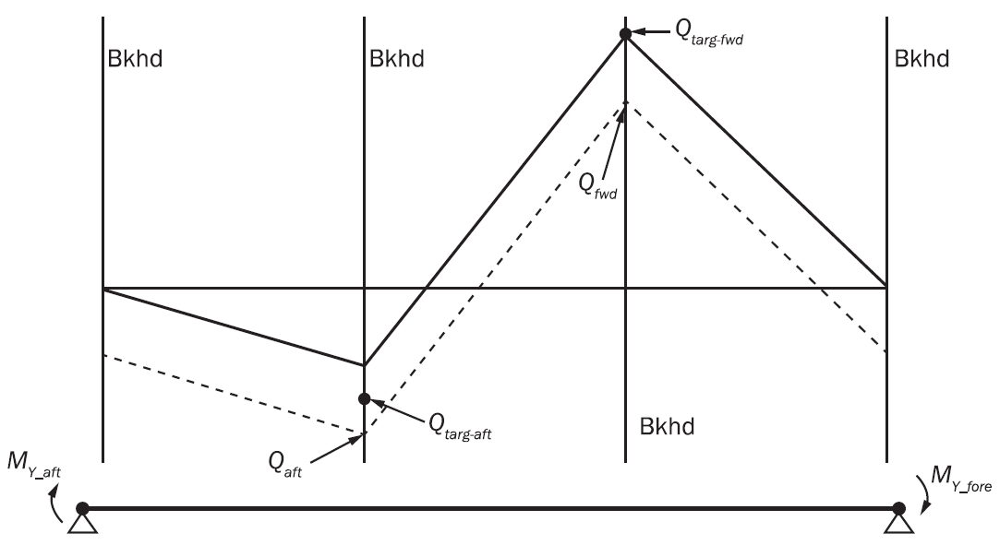 | Forward bulkhead |
    | 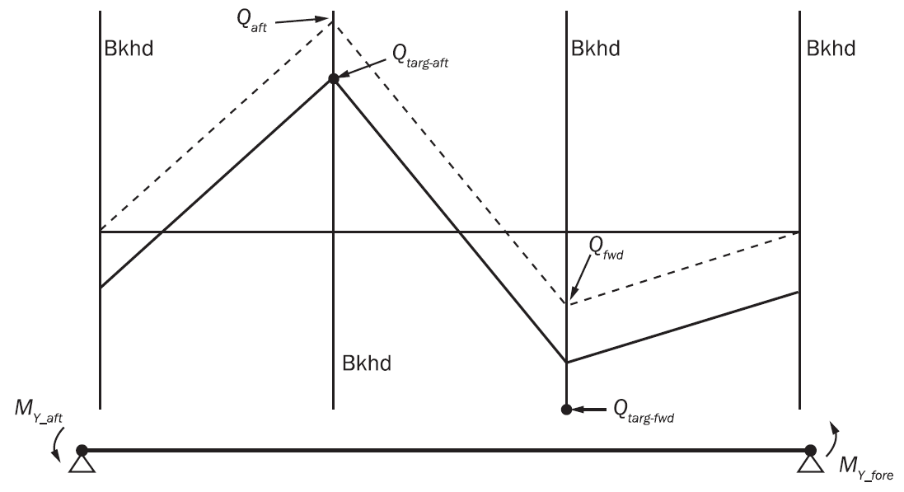 | Aft bulkhead |
    |  Vertical shear force after adjustment  Vertical shear due to local loads |   |
  - **4.4.7** **Method 2 for vertical shear force adjustment at both bulkheads**
    The required adjustments in shear force at both transverse bulkheads of the mid-hold are to be made by applying:
    • Vertical bending moments, $M _{Y _{-} aft}$, $M _{Y _{-} fore}$ at model ends and,
    • Vertical loads at the transverse frame positions as shown in **Table 12** in order to generate vertical shear forces, $\Delta Q _{aft}$ and $\Delta Q _{fwd}$, at the transverse bulkhead positions.
    **Table 10** shows examples of the shear adjustment application due to the vertical bending moments and to vertical loads.
    $M _{Y _{-} aft} = \frac{x _{f o re} -x _{aft}}{2} . \frac{Q _{targ-fwd} -Q _{fwd} +Q _{targ-aft} -Q _{aft}}{2}$
    $M _{Y _{-} f o re} =M _{Y _{-} aft}$
    $\Delta Q _{fwd} = \frac{Q _{targ-fwd} -Q _{fwd} -(Q _{targ-aft} -Q _{aft} )}{2}$
    $\Delta Q _{aft} = - \Delta Q _{fwd}$
    where:
    $M _{Y _{-} aft} , M _{Y _{-} fore}$: Vertical bending moment, in kNm, to be applied at the aft and fore ends in accordance with **[4.4.9]**, to enforce the hull girder vertical shear force adjustment. The sign convention is that of the FE model axis.
    $\Delta Q _{aft}$ : Adjustment of shear force, in kN, at aft bulkhead of mid-hold.
    $\Delta Q _{fwd}$ : Adjustment of shear force, in kN, at fore bulkhead of mid-hold.
    The above adjustments in shear forces, $\Delta Q _{aft}$ and $\Delta Q _{fwd}$, at the transverse bulkhead positions are to be generated by applying vertical loads at the transverse frame positions as shown in **Table 12**. Vertical correction loads are not to be applied to any transverse tight bulkheads, any frames forward of the forward cargo hold and any frames aft of the aft cargo hold of the FE model.
    The vertical loads to be applied to each transverse frame to generate the increase/decrease in shear force at the bulkheads may be calculated as shown in **Table 12**. In case of uniform frame spacing, the amount of vertical force to be distributed at each transverse frame may be calculated in accordance with **Table 13**.
    If non-uniform frame spacing is used within each cargo hold, the average frame spacing $\ell _{av-i}$ is used to calculate the average distributed frame loads $\delta w _{av-i}$, according to **Table 13**, where $i$ = 1, 2, 3 for each hold. Then $\delta w _{av-i}$ is redistributed to the non-uniform frame as follows:
    $\delta w _{i}^{k} = \delta w _{av-i} \frac{l _{ av-i}^{k}}{l _{av-i}}$ k = 1, 2, ..., $n _{i} -1$, for each frame in cargo hold $i$, $i$ = 1, 2, 3
    where:
    $\ell _{av-i}$ : Average frame spacing, in m, calculated as $\ell _{i} /n _{i}$, in cargo hold $i$ with $i$ = 1, 2, 3.
    $\ell _{i}$ : Length, in m, of the cargo hold $i$ with $i$ = 1, 2, 3 as defined in Table 13.
    $n _{i}$ : Number of frame spacing in cargo hold $i$ with $i$ = 1, 2, 3 as defined in Table 13.
    $\delta w _{av-i}$ : Average uniform frame spacing, in m, distributed force calculated according to Table 13 with the average frame spacing $\ell _{av-i}$ in cargo hold $i$ with $i$ = 1, 2, 3.
    $\delta w _{i} ^{k}$ : Distributed load, in kN, for non-uniform frame $k$ in cargo hold $i$.
    $\ell ^{k} _{av-i}$ : Equivalent frame spacing, in m, for each frame $k$ with $k$ = 1, 2, …, $n _{i}$ - 1, in cargo hold $i$, taken as:
    $\ell _{ av-i}^{k} =\ell _{ i}^{1} - \frac{\ell _{av-i} \ell _{ i}^{1}}{\ell _{ i}^{1} +\ell _{ i}^{n _{i}}} + \frac{\ell _{ i}^{2}}{2}$ for $k$ = 1 (first frame), in cargo hold $i$
    $\ell _{ av-i}^{k} = \frac{\ell _{ i}^{k}}{2} + \frac{\ell _{ i}^{k+1}}{2}$ for $k$ = 2, 3, …, $n _{i}$ - 2, in cargo hold $i$
    $\ell _{ av-i}^{k} =\ell _{ i}^{n _{i}} - \frac{\ell _{av-i} \ell _{ i}^{n _{i}}}{\ell _{ i}^{1} +\ell _{ i}^{n _{i}}} + \frac{\ell _{ i}^{n _{i} -1}}{2}$ for $k$ = $n _{i}$ - 1 (last frame), in cargo hold $i$
    $\ell _{i} ^{k}$ : Frame spacing, in m, between the frame $k$ - 1 and $k$ in the cargo hold $i$.

    | Vertical shear force diagram | Aft BHD | Fore BHD |
    | --- | --- | --- |
    | Vertical shear force diagram | SF Target | SF target |
    | 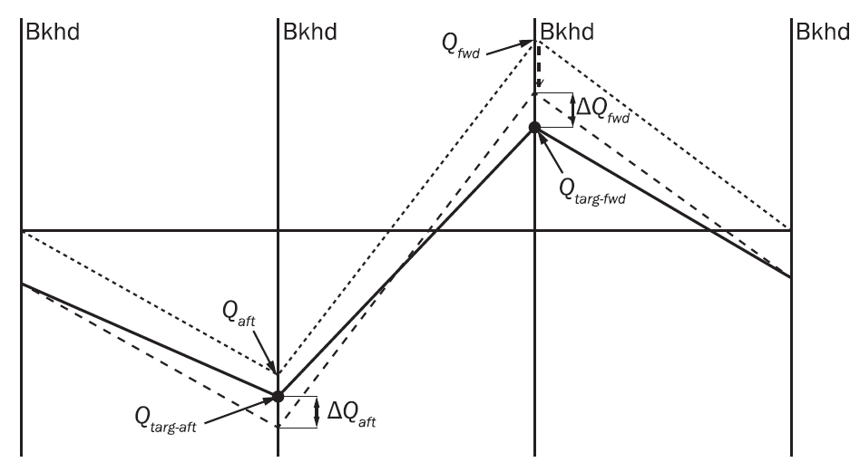 | $Q _{targ-aft} \left( -ve \right)$ | $Q _{targ-fwd} \left( +ve \right)$ |
    | 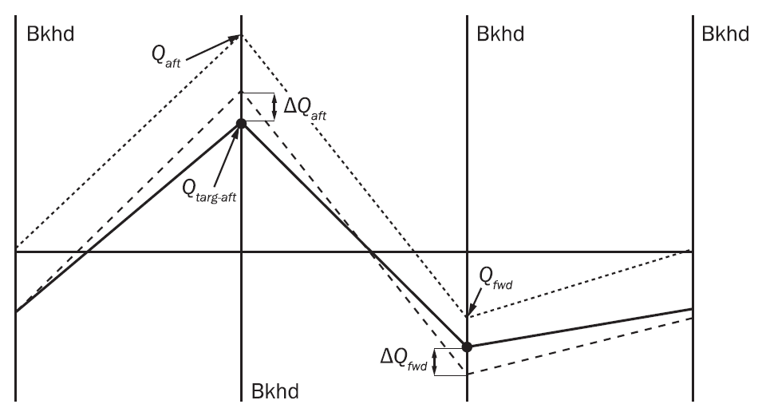 | $Q _{targ-aft} \left( +ve \right)$ | $Q _{targ-fwd} \left( -ve \right)$ |
    |  Vertical shear force after both adjustments  Vertical shear force after adjustment by use of $M _{Y _{-} aft}$ and $M _{Y _{-} fore}$  Vertical shear due to local loads |   |   |
    | Note 1: -ve means negative. Note 2: +ve means positive. |   |   |

    | 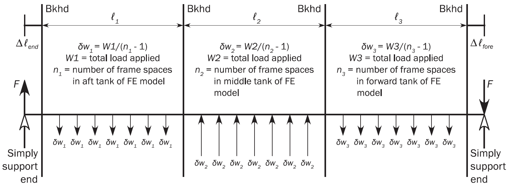 Note: Transverse bulkhead frames not loaded Frames beyond aft transverse bulkhead of aftmost tank and forward bulkhead of forward most tank not loaded **F** = Reaction load generated by supported ends |
    | --- |
    | 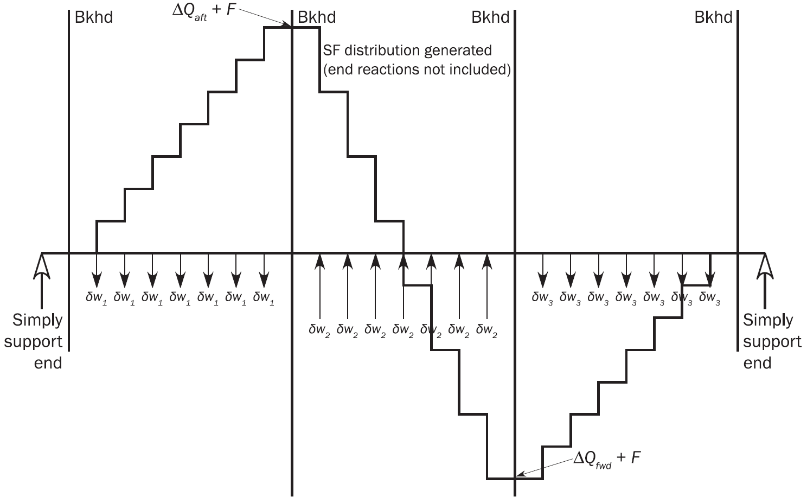 Shear Force distribution due to adjusting vertical force at frames |
    | 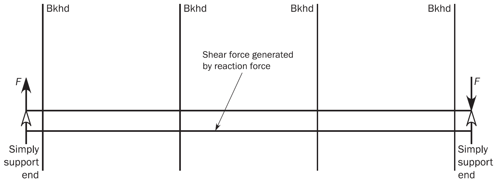 Note: **F** = 0 if $\ell _{1} = \ell _{3}$ and $\Delta \ell _{ fo re} = \Delta \ell _{end}$, and loads are symmetrical about mid-length of model |
    | Note 1: For definition of symbols, see **Table 13.** |

    | $\delta w _{1} = \frac{\Delta Q _{aft} (2\ell-\ell_{2} -\ell_{3} )+ \Delta Q _{fwd} (\ell_{2} +\ell_{3} )}{(n _{1} -1)(2\ell-\ell_{1} -2\ell_{2} -\ell_{3} )}$ | $F=0.5 \left( \frac{W1(\ell _{1} +\ell _{1} )-W3(\ell _{2} +\ell _{3} )}{\ell} \right)$ |
    | --- | --- |
    | $\delta w _{2} = \frac{(W1+W3)}{(n _{2} -1)} = \frac{( \Delta Q _{aft} - \Delta Q _{fwd} )}{(n _{2} -1)}$ |   |
    | $\delta w _{3} = \frac{- \Delta Q _{fwd} (2\ell-\ell _{1} -\ell _{2} )- \Delta Q _{aft} (\ell _{1} +\ell _{2} )}{(n _{3} -1)(2\ell-\ell _{1} -2\ell _{2} -\ell _{3} )}$ |   |
    | where: $\ell _{ 1}$ : Length of aft cargo hold of model, in m. $\ell _{2}$ : Length of mid-hold of model, in m. $\ell _{3}$ : Length of forward cargo hold of model, in m. $\Delta Q _{aft}$ : Required adjustment in shear force, in kN, at aft bulkhead of middle hold, see **[4.4.7]**. $\Delta Q _{fwd}$ : Required adjustment in shear force, in kN, at fore bulkhead of middle hold, see **[4.4.7]**. $F$ : End reactions, in kN, due to application of vertical loads to frames. $W1$ : Total evenly distributed vertical load, in kN, applied to aft hold of FE model, ($n _{1}$ - 1) $\delta w _{1}$. $W2$ : Total evenly distributed vertical load, in kN, applied to mid-hold of FE model, ($n _{2}$ - 1) $\delta w _{2}$. $W3$ : Total evenly distributed vertical load, in kN, applied to forward hold of FE model, ($n _{3}$ - 1) $\delta w _{3}$. $n _{1}$ : Number of frame spaces in aft cargo hold of FE model. $n _{2}$ : Number of frame spaces in mid-hold of FE model. $n _{3}$ : Number of frame spaces in forward cargo hold of FE model. $\delta w _{1}$ : Distributed load, in kN, at frame in aft cargo hold of FE model. $\delta w _{2}$ : Distributed load, in kN, at frame in mid-hold of FE model. $\delta w _{3}$ : Distributed load, in kN, at frame in forward cargo hold of FE model. $\ell _{end}$ : Distance, in m, between end bulkhead of aft cargo hold to aft end of FE model. $\ell _{fore}$ : Distance, in m, between fore bulkhead of forward cargo hold to forward end of FE model. $\ell$ : Total length, in m, of FE model including portions beyond end bulkheads: $=\ell _{1} +\ell _{2} +\ell _{3} + \Delta \ell _{end} + \Delta \ell _{fo re}$ |   |
    | Note 1: Positive direction of loads, shear forces and adjusting vertical forces in the formulae is in accordance with **Table 10** and **Table 11**. Note 2: $W1+W3=W2$ Note 3: The above formulae are only applicable if uniform frame spacing is used within each hold. The length and frame spacing of individual cargo holds may be different. |   |

    The required vertical load $\delta w _{i}$ for a uniform frame spacing or $\delta w _{i} ^{k}$ for non-uniform frame spacing, are to be applied by following the shear flow distribution at the considered cross section, as described in **Ch 5, App 1**. For a frame section under vertical load $\delta w _{i}$, the shear flow, $q _{f}$, at the middle point of the element is calculated as:
    $q _{f-k} = \frac{\delta w _{i}}{l _{y}} Q _{k}$
    where:
    $q _{f-k}$ : Shear flow calculated at the middle of the $k$-th element of the transverse frame, in N/mm.
    $\delta w _{t}$ : Distributed load at each transverse frame location for $i$-th cargo hold, $i$ = 1, 2, 3, as defined in **Table 12**, in N.
    $I _{y}$ : Moment of inertia of the hull girder cross section, in mm^4.
    $Q _{k}$ : First moment about neutral axis of the accumulative section area starting from the open end (shear stress free end) of the cross section to the point $s _{k}$ for shear flow $q _{f-k}$, in mm^3, taken as;
    $Q _{k} = \int _{0} ^{S _{k}} {z _{n eu} t _{gr-off} ds}$
    $z _{n eu}$ : Vertical distance from the integral point, $s$, to the vertical neutral axis.
    $t _{gr-off}$ : Gross thickness offered, in mm, of the plate at the integral point of the cross section.
    The distributed shear force at $j$-th FE grid of the transverse frame, $F_{ j-grid}$, is obtained from the shear flow of the connected elements as following:
    $F _{j-grid} = \sum _{k=1} ^{n} q _{f-k} \frac{l _{k}}{2}$
    where:
    $\ell _{k}$ : Length of the k-th element of the transverse frame connected to the grid $j$, in mm.
    $n$ : Total number of elements connect to the grid $j$.
    The shear flow has direction along the cross section and therefore the distributed force, $F_{ j-grid}$, is a vector force. For vertical hull girder shear correction, the vertical and horizontal force components calculated with above mentioned shear flow method need to be applied to the cross section.
  - **4.4.8** **Method 3 for vertical shear force adjustment with fixed end boundary condition**
    For the foremost/aftmost cargo hold model, the hull girder shear force shall be adjusted as below:
    $F _{1} = \Delta Q _{ fwd}$ only where the target position is the fore bulkhead of foremost cargo hold
    $F _{1} = \Delta Q _{ aft}$ only where the target position is the aft bulkhead of aftmost cargo hold,
    $F _{2} = \Delta Q _{ aft}$ only where the target position is the aft bulkhead of foremost cargo hold
    $F _{2} = \Delta Q _{ fwd}$ only where the target position is the fore bulkhead of aftmost cargo hold,
    If the modified shear force at the other target position is within design value, c)& (d) are to be skipped.
    $F _{1} = \Delta Q _{ fwd}$, $F _{2} = \Delta Q _{ aft} - \Delta Q _{fwd}$ for the foremost cargo hold
    $F _{1} = \Delta Q _{ aft}$, $F _{2} = \Delta Q _{fwd} - \Delta Q _{ aft}$ for the aftmost cargo hold
    $F _{1} = \Delta Q _{ fwd}$ for foremost cargo hold, $F _{1} = \Delta Q _{ aft}$ for aftmost cargo hold
    $F _{2} = \Delta Q _{ aft} - \Delta Q _{fwd}$ for foremost cargo hold, $F _{2} = \Delta Q _{ fwd} - \Delta Q _{aft}$ for aftmost cargo hold
    $F _{3} = \Delta Q _{ aft} -2 \Delta Q _{fwd}$ for foremost cargo hold, $F _{3} = \Delta Q _{ fwd} -2 \Delta Q _{aft}$ for aftmost cargo hold
    $F _{3-end} = \Delta Q _{fix} =R _{fix} -F _{design}$
    where,
    $F _{1}$ : Total evenly distributed vertical load, in kN, applied to fore end/engine room structure of FE model, ($n _{1}$ - 1) $\delta f _{1}$.
    $F _{2}$ : Total evenly distributed vertical load, in kN, applied to mid-hold of FE model, ($n _{2}$ - 1) $\delta f _{2}$.
    $F _{3}$ : Total evenly distributed vertical load, in kN, applied to end cargo hold of FE model, where the boundary condition of **Table 2** or **Table 3** is applied, ($n _{3}$ - 1) $\delta f _{3}$.
    $F _{3-end}$ : Total additionally even distributed vertical load, in kN, applied to end cargo hold of FE model, where the boundary condition of **Table 2** or **Table 3** is applied, ($n _{3}$ - 1) $\delta f _{3-end}$.
    $R _{fix}$ : Vertical resultant force by local loads including the vertical loads by Method 3 shear force adjustment if any at the boundary position of **Table 2** or **Table 3**, in kN.
    $F _{design}$ : Target shear force at fixed boundary position, in kN.
    $n _{1}$ : Number of web frame spaces in fore end/engine room structure of FE model.
    $n _{2}$ : Number of web frame spaces in middle hold of foremost or aftmost cargo hold FE model.
    $n _{3}$ : Number of web frame spaces in end cargo hold of FE model with the boundary condition of **Table 2** or **Table 3.**
    $\delta f _{1}$ : Distributed load, in kN, at web frame in fore end/engine room structure of FE model.
    $\delta f _{2}$ : Distributed load, in kN, at web frame in mid-hold of FE model.
    $\delta f _{3}$ : Distributed load, in kN, at web frame in end cargo hold of FE model, where the boundary condition of **Table 2** or **Table 3** is applied.
    $\delta f _{3-end}$ : Additionally distributed load, in kN, at web frame in end cargo hold of FE model, where the boundary condition of **Table 2** or **Table 3** is applied.
    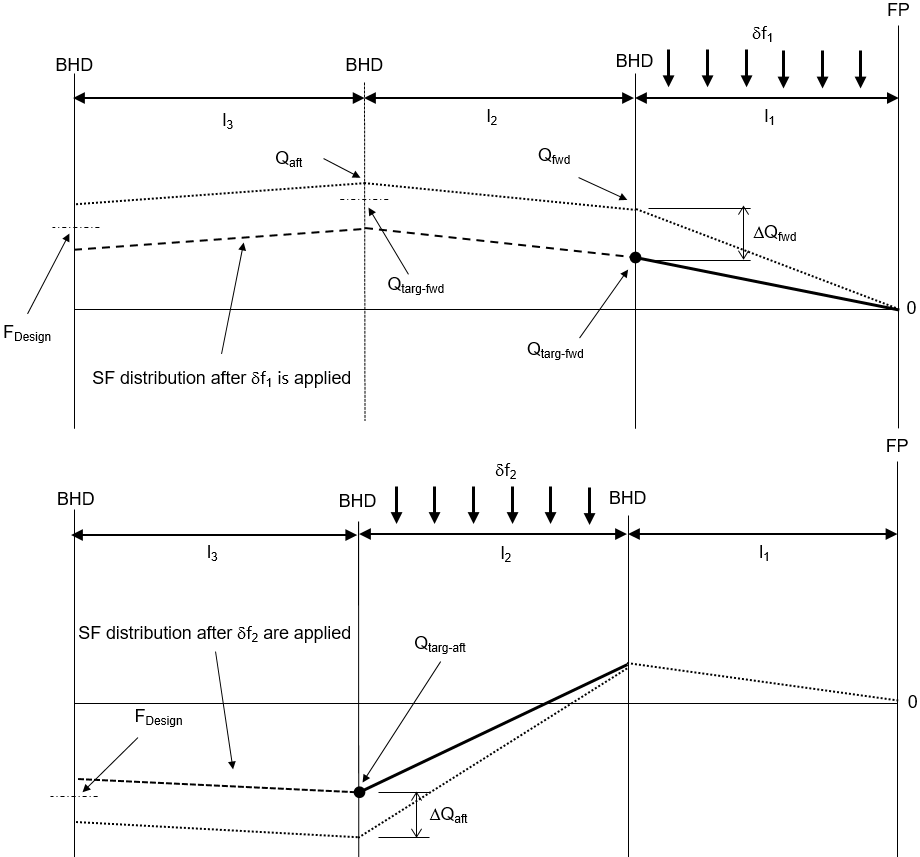
    **Figure : Shear force adjustment at one bulkhead when exceeds the design value**
    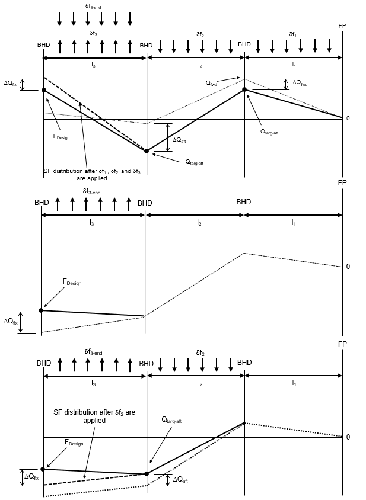
    **Figure : Shear force adjustment at aft end of the model when exceeds the target value at model ends**
    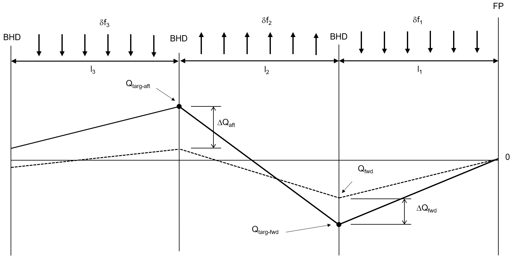
    **Figure : Shear force adjustment at two bulkheads (aft BHD** #eqnID-4045**, fore BHD** #eqnID-4046
    - **a)** For shear force adjustment at one position ($F _{1}$) when local shear force exceeds the target value, or for the load case with corresponding target position assigned:
    - **b)** For shear force adjustment at one position ($F _{2}$) when local shear force exceeds the target value and the shear force at the other bulkhead does not exceed the target value, or for the load case with corresponding target position assigned:
    - **c)** For shear force adjustment at two positions ($F _{1}$ and $F _{2}$) when local shear forces exceed the target values at two bulkhead positions or when the shear force at the other bulkhead after adjusted by a) still exceeds the target value:
    - **d)** For shear force adjustment at two bulkhead positions with positive and negative target values:
    - **e)** When the resultant force at the aft end of the model exceeds its target value, the difference between resultant and design value is to be adjusted lastly as follows:
  - **4.4.9** **Procedure to adjust vertical and horizontal bending moments for midship cargo hold region**
    In case the target vertical bending moment needs to be reached, an additional vertical bending moment is to be applied at both ends of the cargo hold FE model to generate this target value in the mid-hold of the model. However, it is not applicable to adjust the horizontal bending moment when additional boundary condition specified in **Table 4** is applied. This end vertical bending moment is given as follows:
    $M _{v-end} =M _{v-targ} -M _{v-peak}$
    where:
    $M _{v-end}$ : Additional vertical bending moment, in kNm, to be applied to both ends of FE model in accordance with **[4.4.11]**.
    $M _{v-targ}$ : Hogging(positive) or sagging(negative) vertical bending moment, in kNm, as specified in **[4.3.2]**.
    $M _{v-peak}$ : Maximum or minimum bending moment, in kNm, within the length of the mid-hold due to the local loads described in **[4.4.3]** and due to the shear force adjustment as defined in **[4.4.5]**.
    $M _{v-peak}$ is to be taken as the maximum bending moment if $M _{v-targ}$ is hogging (positive) and as the minimum bending moment if $M _{v-targ}$ is sagging (negative). $M _{v-peak}$ is to be calculated as follows based on a simply supported beam model:
    $M _{v-peak} =Extremum \left\{ M _{V-FEM} (x)+M _{l i n eload} +M _{Y _{-} aft} (2 \frac{x-x _{aft}}{x _{f o re} -x _{aft}} -1) \right\}$
    $M _{V-FEM} (x)$: Vertical bending moment, in kNm, at position $x$, due to the local loads as described in **[4.4.3]**.
    $M _{Y _{-} aft}$ : End bending moment, in kNm, to be taken as:
    • When method 1 is applied: the value as defined in **[4.4.6]**.
    • When method 2 is applied: the value as defined in **[4.4.7]**.
    • Otherwise: $M _{Y _{-} aft}$ = 0
    $M _{lin eload}$ : Vertical bending moment, in kNm, at position x, due to application of vertical line loads at frames according to method 2, to be taken as:
    $M _{lin eload} =- \left( x-x _{aft} \right) F- \sum _{i} ^{} \left( x-x _{i} \right) \delta w _{i}$ when $x _{i} \prec x$
    $F$ : Reaction force, in kN, at model ends due to application of vertical loads to frames as defined in **Table 12**.
    $x$ : X-coordinate, in m, of frame in way of the mid-hold.
    $\delta w _{i}$ : vertical load, in kN, at web frame station $i$ applied to generate required shear force.
    In case the target horizontal bending moment needs to be reached, an additional horizontal bending moment is to be applied at the ends of the cargo tank FE model to generate this target value within the mid-hold. The additional horizontal bending moment is to be taken as:
    $M _{h-end} =M _{h-targ} -M _{h-peak}$
    where:
    $M _{v-end}$ : Additional horizontal bending moment, in kNm, to be applied to both ends of the FE model according to **[4.4.11]**.
    $M _{h-targ}$ : Horizontal bending moment, as defined in **[4.3.4]**.
    $M _{h-peak}$ : Maximum or minimum horizontal bending moment, in kNm, within the length of the mid-hold due to the local loads described in **[4.4.3]**.
    $M _{h-peak}$ is to be taken as the maximum horizontal bending moment if $M _{h-targ}$ is positive (starboard side in tension) and as the minimum horizontal bending moment if $M _{h-targ}$ is negative (port side in tension).
    $M _{h-peak}$ is to be calculated as follows based on a simply supported beam model:
    $M _{h-peak} =Extremum \left\{ M _{H _{-} FEM} (x) \right\}$
    $M _{H-FEM} (x)$: Horizontal bending moment, in kNm, at position $x$, due to the local loads as described in **[4.4.3]**.
    The vertical and horizontal bending moments are to be calculated over the length of the mid-hold to identify the position and value of each maximum/minimum bending moment.

#### 4.4.10

**Procedure to adjust vertical and horizontal bending moments outside midship cargo hold region**
To reach the vertical hull girder target values at each frame and transverse bulkhead position, as defined in **[4.3.2]** and **[4.3.4]**, the vertical bending moment adjustments, $m _{vi}$, are to be applied at web frames and transverse bulkhead positions of the finite element model, as shown in **Figure 13**. However, it is not applicable to adjust the horizontal bending moment when the boundary condition specified in **Table 4** is applied. The vertical bending moment adjustment at each longitudinal location, $i$, is to be calculated as follows:
$f(i)=M _{v-targ} (i)-M _{V-FEM} (i)-M _{lin eload} (i)$
$m _{vi} = \frac{f(i)+f(i+1)}{2} - \sum _{j=0} ^{i-1} m _{vj}$
where:
$i$ : Index corresponding to the $i$-th station,
starting from $i$=2 at the aft end section up to $n _{t}$ when **Table 2** or **Table 3** is applied.
$n _{t}$ : Total number of longitudinal stations where the vertical bending moment adjustment, $m _{vi}$, is applied.
$m _{vi}$ : Vertical bending moment adjustment, in kNm, to be applied at transverse frame or bulkhead at station $i$.
$m _{vi}$ : Argument of summation to be taken as:
• $m _{vi} =0$ When $j=0$
• $m _{vj} =m _{vi}$ When $j=i$
$M _{v-targ} (i)$: Required target vertical bending moment, in kNm, at station $i$, calculated in accordance with **[4.3.2]**.
$M _{V-FEM} (i)$: Vertical bending moment distribution, in kNm, at station $i$ due to local loads as given in **[4.4.3]**.
$M _{lin eload} (i)$: Vertical bending moment, in kNm, at station $i$ due to line load for the vertical shear force correction according to method 3 as given in **[4.4.8]**.
$M _{lin eload} =- \sum _{i} ^{} \left( x-x _{i} \right) \delta f _{i}$ when $x _{i} \(M _{lin eload} = \sum _{i} ^{} \left( x-x _{i} \right) \delta f _{i}$ when $x _{i} >x$ for foremost cargo hold
To reach the horizontal hull girder target values at each frame and transverse bulkhead position as defined in **[4.3.4]**, the horizontal bending moment adjustments, $m _{hi}$, are to be applied at web frames and transverse bulkhead positions of the finite element model, as shown in **Figure 13**. The horizontal bending moment adjustment at each longitudinal location, $i$, is to be calculated as follows:
$f(i)=M _{h-targ} (i)-M _{H-FEM} (i)$
$m _{hi} = \frac{f(i)+f(i+1)}{2} - \sum _{j=0} ^{i-1} m _{hj}$
where:
$i$ : Longitudinal location for bending moment adjustments, $m _{hi}$
$n _{t}$ : Total number of longitudinal stations where the horizontal bending moment adjustment, $m _{hi}$, is applied.
$m _{hi}$ : Horizontal bending moment adjustment, in kNm, to be applied at transverse frame or bulkhead at station $i$.
$m _{hi}$ : Argument of summation to be taken as:
• $m _{hi} =0$ When $j=0$
• $m _{hj} =m _{hi}$ When $j=i$
$M _{h-targ} (i)$: Required target horizontal bending moment, in kNm, at station $i$, calculated in accordance with **[4.3.4]**.
$M _{H-FEM} (i)$: Horizontal bending moment distribution, in kNm, at station $i$ due to local loads as given in **[4.4.3]**.
The vertical and horizontal bending moment adjustments, $m _{hi}$ and $m _{hi}$, are to be applied at all web frames and bulkhead positions of the FE model. The adjustments are to be applied in FE model by distributing longitudinal axial nodal forces to all hull girder bending effective longitudinal elements in accordance with **[4.4.11]**.

#### 4.4.11

**Application of bending moment adjustments on the FE model**
The required vertical and horizontal bending moment adjustments are to be applied to the considered cross section of the cargo hold model by distributing longitudinal axial nodal forces to all hull girder bending effective longitudinal elements of the considered cross section according to **Ch 5, Sec 1, [1.2]** as follows:
• For vertical bending moment:
$(F _{x} ) _{i} = \frac{M _{v}}{I _{y}} \frac{A _{i}}{n _{i}} z _{i}$
• For horizontal bending moment:
$(F _{x} ) _{i} = \frac{M _{h}}{I _{z}} \frac{A _{i}}{n _{i}} y _{i}$
where:
$M _{v}$ : Vertical bending moment adjustment, in kNm, to be applied to the considered cross section of the model.
$M _{h}$ : Horizontal bending moment adjustment, in kNm, to be applied to the considered cross section the ends of the model.
$\left( F _{x} \right) _{i}$ : Axial force, in kN, applied to a node of the $i$-th element.
$I _{y}$ : Hull girder vertical moment of inertia, in m^4, of the considered cross section about its horizontal neutral axis.
$I _{z}$ : Hull girder horizontal moment of inertia, in m^4, of the considered cross section about its vertical neutral axis.
$Z _{i}$ : Vertical distance, in m, from the neutral axis to the centre of the cross sectional area of the i-th element.
$Y _{i}$ : Horizontal distance, in m, from the neutral axis to the centre of the cross sectional area of the $i$-th element.
$A _{i}$ : Cross sectional area, in m^2, of the i-th element.
$n _{i}$ : Number of nodal points of i-th element on the cross section, $n _{i}$ = 1 for beam element, $n _{i}$ = 2 for 4-node shell element.
For cross sections other than cross sections at the model end, the average area of the corresponding i-th elements forward and aft of the considered cross section is to be used.

- **4.5** **Procedure to adjust hull girder torsional moments**
  - **4.5.1** **General**
    The procedure in this sub-article describes how to adjust the hull girder torsional moment distribution on the cargo hold FE model to achieve the target torsional moment at the target location. The hull girder torsional moment target values are given in **[4.3.5]**.
  - **4.5.2** **Torsional moment due to local loads**
    Torsional moment, in kNm, at longitudinal station $i$ due to local loads, $M _{T-FEMi}$ in kNm, is determined by the following formula (see **Figure 14**):
    $M _{T-FEM i} = \sum _{k} ^{} [f _{hik} (z _{ik} -z _{r} )]- \sum _{k} ^{} (f _{vik} y _{ik} )$
    where:
    $M _{T-FEM i}$ : Lumped torsional moment, in kNm, due to local load at longitudinal station $i$.
    $z _{r}$ : Vertical coordinate of torsional reference point, in m:
    $z _{r} =z _{sc}$, shear centre at the middle of the mid-hold.
    $f _{hik}$ : Horizontal nodal force, in kN, of node $k$ at longitudinal station $i$.
    $f _{vik}$ : Vertical nodal force, in kN, of node $k$ at longitudinal station $i$.
    $y _{ik}$ : Y-coordinate, in m, of node $k$ at longitudinal station $i$.
    $z _{ik}$ : Z-coordinate, in m, of node $k$ at longitudinal station $i$.
    $M _{T-FEMO}$ : Lumped torsional moment, in kNm, due to local load at aft end of the FE model, taken as:
    $M _{T-FEMO} =- \sum _{k} ^{} [f _{h0k} (z _{0k} -z _{r} )]+ \sum _{k} ^{} (f _{v0k} y _{0k} )$ for foremost cargo hold model
    $M _{T-FEMO} = \sum _{k} ^{} [f _{h0k} (z _{0k} -z _{r} )]- \sum _{k} ^{} (f _{v0k} y _{0k} )+R _{H _{-} aft} (z _{i n d} -z _{r} )$ for the other cargo hold models
    $R _{H _{-} fwd}$ : Horizontal reaction forces, in kN, at the forward end, as defined in **[4.4.3]**.
    $R _{H _{-} aft}$ : Horizontal reaction forces, in kN, at the aft end, as defined in **[4.4.3]**.
    $z _{i nd}$ : Vertical coordinate, in m, of independent point as defined in **[2.5.2]**.
    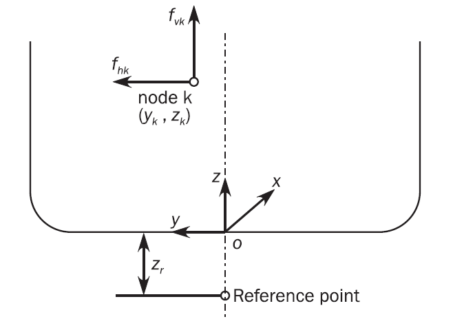
    **Figure : Station forces and acting location of torsional moment at section**
  - **4.5.3** **Hull girder torsional moment**
    The hull girder torsional moment, $M _{T-FEM} \left( x _{j} \right)$ in kNm, is obtained by accumulating the station torsional moment from the aft end section as follows:
    $M _{T-FEM} (x _{j} )= \sum _{i} ^{} M _{T-FEM i}$ when $x _{i} \geq x _{j}$ for foremost cargo hold model
    when $x _{i} where:
    \(M _{T-FEM} (x _{j} )$: Hull girder torsional moment, in kNm, at longitudinal station $x _{j}$.
    $x _{j}$ : X-coordinate, in m, of considered longitudinal station $j$.
    The torsional moment distribution given in **[4.5.2]**, has a step at each longitudinal station.
  - **4.5.4** **Procedure to adjust hull girder torsional moment to target value**
    The torsional moment is to be adjusted by applying a hull girder torsional moment $M _{T-end}$ in kNm, at the independent point of the aft end section of midship/aftmost hold, or forward end section of foremost hold model, given as follows:
    $M _{T-end} =M _{wt-targ} -M _{T-FEM} (x _{targ} )$
    where:
    $x _{targ}$ : X-coordinate, in m, of the target location for hull girder torsional moment, as defined in **[4.3.5]**.
    $M _{wt-targ}$: Target hull girder torsional moment, in kNm, specified in **[4.3.5]**, to be achieved at the target location.
    $M _{T-FEM} (x _{targ} )$: Hull girder torsional moment, in kNm, at target location due to local loads.
    Due to the step of hull girder torsional moment at each longitudinal station, the hull girder torsional moment is to be selected from the values aft and forward of the target location as follows: Maximum value for positive torsional moment and minimum value for negative torsional moment.
- **4.6** **Summary of hull girder load adjustments**
  - **4.6.1** The required methods of hull girder load adjustments for cargo hold regions are given in **Table 14**.

#### 5. Analysis criteria

- **5.1** **General**
  - **5.1.1** **Evaluation areas**
    Verification of results against the acceptance criteria is to be carried out within the longitudinal extent of the mid-hold, as shown in **Figure 15**. The longitudinal extent is from the aft bulkhead of aft cofferdam of mid-hold to the forward bulkhead of fore cofferdam of mid-hold.
    In aftmost hold, one web frame spacing in aft direction is to be added for the consideration of structural continuation. And, for the foremost hold, one web frame spacing in forward direction is to be included for transition area evaluation.
    In cases of using IGC pressure, which are LM3-IGC, LA3-IGC and LF3-IGC of **Table 5** ~ **7** with additional IGC boundary condition as defined in **Table 4**, the hull envelope including outer cofferdam bulkheads, is to be excluded.
    For accidental condition, the evaluation is carried out for the members within one web frame forward and one frame aftward in way of cofferdam structure, where the collision load direction is coincided. Refer to **Figure 16**.
    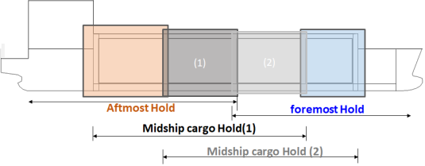
    **Figure : Longitudinal extent of evaluation area**
    
    **Figure : Longitudinal extent of evaluation area for accidental condition**
  - **5.1.2** **Structural members**
    The following structural elements within the evaluation area are to be verified with the criteria given in **[5.2]** and **[5.3]**:
    • All hull girder longitudinal structural members within Mid-hold including adjacent cofferdams and one web frame spacing more in forward and aftward direction from the cofferdams.
    • All primary supporting structural members and bulkheads within the mid-hold.
    • All structural members being part of the transverse bulkheads.
- **5.2** **Yield strength assessment**
  - **5.2.1** **Von Mises stress**
    For all plates of the structural members defined in **[5.1.2]**, the von Mises stress, $\sigma _{vm}$, in N/mm^2, is to be calculated based on the membrane normal and shear stresses of the shell element. The stresses are to be evaluated at the element centroid of the mid-plane (layer), as follows:
    $\sigma _{vm} = \sqrt {\sigma _{x}^{2} - \sigma _{x} \sigma _{y} + \sigma _{y}^{2} +3 \tau _{xy}^{2}}$
    where:
    $\sigma _{x} , \sigma _{y}$ : Element normal membrane stresses, in N/mm^2.
    $\tau _{xy}$ : Element shear stress, in N/mm^2.
  - **5.2.2** **Axial stress in beams and rod elements**
    For beams and rod elements, the axial stress, $\sigma _{axial}$, in N/mm^2, is to be calculated based on axial force alone. The axial stress is to be evaluated at the middle of element length.
  - **5.2.3** **Coarse mesh permissible yield utilisation factors**
    The coarse mesh permissible yield utilisation factors, $\lambda _{yperm}$, given in **Table 15**, are based on the mesh sizes and element types described in **[2.3]** to **[2.4]**.
    The yield utilisation factor resulting from element stresses of each structural component are not to exceed the permissible values as given in **Table 15**.

    | Structural component | Coarse mesh permissible yield utilisation factor, $\lambda _{ yperm}$ |
    | --- | --- |
    | Plating of all longitudinal hull girder structural members, primary supporting structural members and bulkheads. Face plate of primary supporting members modelled using shell or rod elements. | 1.0 (load combination S+D) |
    | Plating of all longitudinal hull girder structural members, primary supporting structural members and bulkheads. Face plate of primary supporting members modelled using shell or rod elements. | 0.8 (load combination S) |
    | Plating of all longitudinal hull girder structural members, primary supporting structural members and bulkheads. Face plate of primary supporting members modelled using shell or rod elements. | 1.0 (load combination A) |
  - **5.2.4** **Yield criteria**
    The structural elements given in **[5.1.2]** are to comply with the following criteria:
    $\lambda _{y} \leq \lambda _{yperm}$
    where:
    $\lambda _{y}$ : Yield utilisation factor.
    $\lambda _{y} = \frac{\sigma _{vm}}{R _{Y}}$ for shell elements in general.
    $\lambda _{y} = \frac{\sigma _{vm}}{R _{eH}}$ for accidental condition or the loading condition with AC-A.
    $\lambda _{y} = \frac{\left| \sigma _{axial} \right|}{R _{Y}}$ for rod or beam elements in general.
    $\lambda _{y} = \frac{\left| \sigma _{axial} \right|}{R _{eH}}$ for accidental condition or the loading condition with AC-A.
    $\sigma _{vm}$ : Von Mises stress, in N/mm^2.
    $\sigma _{axial}$ : Axial stress in rod or beam element, in N/mm^2.
    $\lambda _{yperm}$ : Coarse mesh permissible yield utilisation factors defined in **Table 15**.
    The yield check criteria is to be based on axial stress for the flange of primary supporting members.
    Where the von Mises stress of the elements in the cargo hold FE model in way of the area under investigation by fine mesh exceeds the yield criteria, average von Mises stress, obtained from the fine mesh analysis, calculated over an area equivalent to the mesh size of the cargo hold finite element model is to satisfy the yield criteria above.
    In way of cut-outs, yield utilisation factor is to be obtained with shear stress correction, as given in **[5.2.6]**.
  - **5.2.5** **Inner hull forming cargo hold**
    For the ships with foam type cargo containment system such as Mark III and KC-1, the bending stress of inner hull is to satisfy the stress limit under the condition specified by the designer of the cargo containment system as described in **Ch 5, Sec 1, [4]**.
  - **5.2.6** **Shear stress correction for cut-out**
    Except as indicated in **[5.2.7]**, the element shear stress in way of cut-outs in webs is to be corrected for loss in shear area in accordance with the following formula. The corrected element shear stress is to be used to calculate the von Mises stress of the element for verification against the yield criteria.
    $\tau _{cor} = \frac{h t _{mod}}{A _{shr}} \tau _{elem}$
    where:
    $\tau _{cor}$ : Corrected element shear stress, in N/mm^2.
    $h$ : Height of web of girder, in mm, in way of opening. Where the geometry of the opening is modelled, $h$ is to be taken as the height of web of the girder deducting the height of the modelled opening.
    $t _{mod}$ : Modelled web thickness, in mm, in way of opening.
    $A _{shr}$ : Effective shear area of web, in mm^2, taken as the web area deducting the area lost of all openings, including slots for stiffeners, calculated in accordance with **Ch 3, Sec 7, [1.4.8]**.
    $\tau _{elem}$ : Element shear stress, in N/mm^2, before correction.
  - **5.2.7** **Exceptions for shear stress correction for openings**
    Correction of element shear stress due to presence of cut-outs is not required for cases given in **Table 16** provided $\lambda _{y} /C _{r}$ complies with the criteria given in **[5.2.4]**.
- **5.3** **Buckling strength assessment**
  - **5.3.1** All structural elements in FE analysis carried out in accordance with this Section are to be assessed individually against the buckling requirements as defined in **Ch 8, Sec 4**.

    | Identification | Figure | Difference between modelled shear area and the effective shear area in % of the modelled shear area $\frac{A _{FEM} -A _{shr}}{A _{FEM}} \cdot 100\%$ | Reduction factor for yield criteria, $C _{r}$ |
    | --- | --- | --- | --- |
    | Upper and lower slots for local support stiffeners fitted with lugs or collar plates | 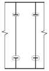 | < 15% | 0.85 |
    | Upper or lower slots for local support stiffeners fitted with lugs or collar plates | 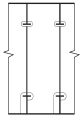 | < 20% | 0.80 |
    | In way of opening; upper and lower slots for local support stiffeners fitted with collar plates | 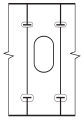 | < 40% | 0.60 |
    | $A _{shr}$ : Effective shear area of web, in mm^2, taken as the web area deducting the area lost of all openings, including slots for stiffeners, calculated in accordance with **Ch 3, Sec 7, [1.4.8]**. |   |   |   |

### Section 33 - Local Structural Strength Analysis

#### 1. Objective and scope

- **1.1** **General**
  - **1.1.1** The local strength analysis of structural details is to be in accordance with the requirements given in this section.
  - **1.1.2** The selection of critical locations on the structural members for fine mesh analysis is to be in accordance with this section.
  - **1.1.3** **Fine mesh analysis procedure**
    The details to be assessed by fine mesh analysis are to be modelled according to the requirements given in **[3]**, under the FE load combinations defined in **[4]** and to comply with the criteria given in **[5]**.
- **1.2** **Modelling of structural details**
  The fine mesh analysis may be carried out the area of high stress concentration identified during coarse mesh analysis. The structural details is to be geometrically accurate as possible.

#### 2. Local areas to be assessed by fine mesh analysis

- **2.1** **Areas to be checked**
  - **2.1.1** **Selection of critical locations**
    In cargo hold region, the following structural details are to be included and assessed according to the fine mesh analysis procedure defined in **[1.1.3]**:
    High stress concentrated areas where the stress level is more than 95% of the utilisation factor given in **Sec 2, [5.2.4]** need to be verified by fine mesh analysis.
    - **a)** Connection of deck house and the longitudinal members above the upper deck
    - **b)** Fore end structure of the trunk deck
    - **c)** Connections of double bottom in way of transverse bulkheads
    - **d)** Typical liquid dome opening if any
    - **e)** Hopper corner connection in way of a typical web frame
    - **f)** Transition area where inner hull longitudinal bulkhead is noncontinuous
    - **g)** Connection of side stringer plate in way of transverse bulkheads

#### 3. Structural modelling

- **3.1** **General**
  - **3.1.1** Evaluation of detailed stresses requires the use of refined finite element mesh in way of areas of high stress. This fine mesh analysis can be carried out by fine mesh zones incorporated into the cargo hold model. Alternatively, separate local FE model with fine mesh zones in conjunction with the boundary conditions obtained from the cargo hold model may be used.
- **3.2** **Extent of model**
  - **3.2.1** If a separate local fine mesh model is used, its extent is to be such that the calculated stresses at the areas of interest are not significantly affected by the imposed boundary conditions. The boundary of the fine mesh model is to coincide with primary supporting members in the cargo hold model, such as web frame, girders, stringers and floors.
- **3.3** **Mesh size**
  - **3.3.1** The mesh size in the fine mesh zones is not to be greater than 50 x 50 mm.
  - **3.3.2** The extent of the fine mesh zone is not to be less than 10 elements in all directions from the area under investigation. A smooth transition of mesh density from fine mesh zone to the boundary of the fine mesh model is to be maintained.
- **3.4** **Elements**
  - **3.4.1** All plating within the fine mesh zone is to be represented by shell elements. The aspect ratio of elements within the fine mesh zone is to be kept as close to 1 as possible. Variation of mesh density within the fine mesh zone and the use of triangular elements are to be avoided. In all cases, the elements within the fine mesh model are to have an aspect ratio not exceeding 3. Distorted elements, with element corner angles of less than 45° or greater than 135°, are to be avoided. Stiffeners inside the fine mesh zone are to be modelled using shell elements. Stiffeners outside the fine mesh zones may be modelled using beam elements.
  - **3.4.2** Where fine mesh analysis is required for main bracket end connections and liquid dome opening, the fine mesh zone is to be extended at least 10 elements in all directions from the area subject to assessment.
  - **3.4.3** Where fine mesh analysis is required for an opening, the first two layers of elements around the opening are to be modelled with mesh size not greater than 50 x 50 mm. A smooth transition from the fine mesh to the coarser mesh is to be maintained. Edge stiffeners which are welded directly to the edge of an opening are to be modelled with shell elements. Web stiffeners close to an opening may be modelled using rod or beam elements located at a distance of at least 50 mm from the edge of the opening.
  - **3.4.4** Face plates of openings, primary supporting members and associated brackets are to be modelled with at least two elements across their width on either side.

#### 4. FE load combinations

- **4.1** **General**
  - **4.1.1** The fine mesh detailed stress analysis is to be carried out for all FE load combinations applied to the corresponding cargo hold analysis.
- **4.2** **Application of loads and boundary conditions**
  - **4.2.1** **General**
    Where a separate local model is used for the fine mesh detailed stress analysis, the nodal displacements from the cargo tank model are to be applied to the corresponding boundary nodes on the local model as prescribed displacements. Alternatively, equivalent nodal forces from the cargo tank model may be applied to the boundary nodes.
    Where there are nodes on the local model boundaries which are not coincident with the nodal points on the cargo tank model, it is acceptable to impose prescribed displacements on these nodes using multi-point constraints. The use of linear multi-point constraint equations connecting two neighbouring coincident nodes is considered sufficient.
    All local loads, including any loads applied for hull girder bending moment and/or shear force adjustments, in way of the structure represented by the separate local finite element model are to be applied to the model.

#### 5. Analysis criteria

- **5.1** **Stress assessment**
  - **5.1.1** **General**
    Stress assessment of the fine mesh analysis is to be carried out for the FE load combinations specified in **Table 4 ~ 6**.
  - **5.1.2** **Reference stress**
    Reference stress is von Mises stress, $\sigma _{vm}$, which is to be calculated based on the membrane normal and shear stresses of the shell element evaluated at the element centroid. The stresses are to be evaluated at the mid plane of the element.
  - **5.1.3** **Permissible stress**
    The maximum permissible stresses are based on the mesh size of 50 x 50 mm as specified in **[3]**. Where a smaller mesh size is used, an area weighted von Mises stress calculated over an area equal to the specified mesh size may be used to compare with the permissible stresses. The averaging is to be based only on elements with their entire boundary located within the desired area. The average stress is to be calculated based on stresses at element centroid; stress values obtained by interpolation and/or extrapolation are not to be used. Stress averaging is not to be carried across structural discontinuities and abutting structure.
- **5.2** **Acceptance criteria**
  - **5.2.1** Verification of stress results against the acceptance criteria is to be carried out in accordance with **[5.1]**.
    The structural assessment is to demonstrate that the stress complies with the following criteria:
    $\lambda _{f} \leq \lambda _{fperm}$
    where:
    $\lambda _{f}$ : Fine mesh yield utilisation factor.
    $\lambda _{f} = \frac{\sigma _{vm}}{R _{Y}}$ for shell elements in general
    $\lambda _{y} = \frac{\sigma _{vm}}{R _{eH}}$ for accidental condition or the loading condition with AC-A.
    $\lambda _{f} = \frac{\left| \sigma _{axial} \right|}{R _{Y}}$ for rod or beam elements in general
    $\lambda _{f} = \frac{\left| \sigma _{axial} \right|}{R _{eH}}$ for accidental condition or the loading condition with AC-A.
    $\sigma _{vm}$ : Von Mises stress, in N/mm^2
    $\sigma _{axial}$ : Axial stress in rod element, in N/mm^2
    $\lambda _{fperm}$ : Permissible fine mesh utilisation factor, taken as:
    • Element not adjacent to weld:
    • $\lambda _{fperm} =1.70f _{f}$ for AC-SD, AC-A
    • $\lambda _{fperm} =1.36f _{f}$ for AC-S
    • Element adjacent to weld:
    • $\lambda _{fperm} =1.50f _{f}$ for AC-SD, AC-A
    • $\lambda _{fperm} =1.20f _{f}$ for AC-S
    $f _{f}$ : Fatigue factor, taken as:
    • $f _{f} =1.0$ in general,
    • $f _{f} =1.2$ for details assessed by very fine mesh analysis complying with the fatigue assessment criteria given in **Ch 9, Sec 2**.
    Note 1: The maximum permissible stresses are based on the mesh size of 50 x 50 mm. Where a smaller mesh size is used, an average von Mises stress calculated in accordance with **[5.1]** over an area equal to the specified mesh size may be used to compare with the permissible stresses.
    Note 2: Average von Mises stress is to be calculated based on weighted average against element areas:
    $\sigma _{vm-av} = \frac{\Sigma _{1}^{n} A _{i} \sigma _{vm-i}}{\Sigma _{1}^{n} A _{i}}$
    where:
    $\sigma _{vm-av}$ is the average von Mises stress.
    Note 3: Stress averaging is not to be carried across structural discontinuities and abutting structure.
