# PART 15 Structural Rules for Membrane Type Liquefied Natural Gas Carriers

> RULES FOR CLASSIFICATION OF STEEL SHIPS / RA-15-E / 2025 / EN / Rules

## Chapter 8 Buckling

### Section 34 - General

#### 1. Introduction

- **1.1** **Assumption**
  - **1.1.1** This chapter contains the strength criteria for buckling and ultimate strength of local supporting members, primary supporting members and other structures such as pillars and brackets. These criteria are to be applied as specified in **Ch 6** for hull local scantlings and in **Ch 7** for direct strength analysis.
  - **1.1.2** For each structural member, the characteristic buckling strength is to be taken as the most unfavourable / critical buckling failure mode.
  - **1.1.3** Unless otherwise specified, the scantling requirements of structural members in this chapter are based on net scantling obtained by deducting $t _{c}$ from the gross offered thickness, where $t _{c}$ is defined in **Ch 3, Sec 3**.
  - **1.1.4** In this chapter, compressive and shear stresses are to be taken as positive, tension stresses are to be taken as negative.

#### 2. Application

- **2.1** **Scope**
  - **2.1.1** The buckling checks are to be performed according to:
    - **a)** **Ch 8, Sec 2** for the slenderness requirements of plates, longitudinal and transverse stiffeners, primary supporting members and brackets.
    - **b)** **Ch 8, Sec 3** for the prescriptive buckling requirements of plates, longitudinal and transverse stiffeners, primary supporting members and other structures.
    - **c)** **Ch 8, Sec 4** for the buckling requirements of the FE analysis for the plates, stiffened panels and other structures.
    - **d)** **Ch 8, Sec 5** for the buckling capacity of prescriptive and FE buckling requirements.
  - **2.1.2** **Stiffener**
    The buckling check of the stiffeners referred to in this Chapter is applicable to the stiffener fitted along the long edge of the buckling panel.
  - **2.1.3** **Enlarged stiffener**
    Enlarged stiffeners, with or without web stiffening, used for means of access are to comply with the following requirements:
    • For enlarged stiffener web, see item (a) of **Ch 8, Sec 2, [4.1.1]**.
    • For enlarged stiffener flange, see item (b) of **Ch 8, Sec 2, [4.1.1]** and **Ch 8, Sec 2, [5.1]**.
    • For stiffeners fitted on enlarged stiffener web, see **Ch 8, Sec 2, [3.1.1]** and **Ch 8, Sec 2, [3.1.3]**.
    • For enlarged stiffener web, see **Ch 8, Sec 3, [3.2]**.
    • For stiffeners fitted on enlarged stiffener web, see **Ch 8, Sec 3, [3.1]** and **Ch 8, Sec 3, [3.3]**.
    - **a)** Slenderness requirements for primary supporting members as follows:
    - **b)** Buckling strength of prescriptive requirements as follows:
    - **c)** All structural elements are to be complied with for the buckling requirements of the FE analysis in **Ch 8, Sec 4** when applicable.

#### 3. Definitions

- **3.1** **General**
  - **3.1.1** **Buckling definition**
    ‘Buckling’ is used as a generic term to describe the strength of structures, generally under in-plane compressions and/or shear and lateral load. The buckling strength or capacity can take into account the internal redistribution of loads depending on the load situation, slenderness and type of structure.
  - **3.1.2** **Buckling capacity**
    Buckling capacity based on this principle gives a lower bound estimate of ultimate capacity, or the maximum load the panel can carry without suffering major permanent set.
    Buckling capacity assessment utilises the positive elastic post-buckling effect for plates and accounts for load redistribution between the structural components, such as between plating and stiffeners. For slender structures, the capacity calculated using this method is typically higher than the ideal elastic buckling stress (minimum Eigen value). Accepting elastic buckling of structural components in slender stiffened panels implies that large elastic deflections and reduced in-plane stiffness will occur at higher buckling utilisation levels.
  - **3.1.3** **Assessment methods**
    The buckling assessment is carried out according to one of the two methods taking into account different boundary condition types:
    - **a)** Method A: All the edges of the elementary plate panel are forced to remain straight (but free to move in the in-plane directions) due to the surrounding structure/neighbouring plates.
    - **b)** Method B: The edges of the elementary plate panel are not forced to remain straight due to low in-plane stiffness at the edges and/or no surrounding structure/neighbouring plates.
- **3.2** **Buckling utilisation factor**
  - **3.2.1** The utilisation factor, $\eta$, is defined as the ratio between the applied loads and the corresponding ultimate capacity or buckling strength.
  - **3.2.2** **(2023)**
    For combined loads, the utilisation factor, $\eta _{act}$, is to be defined as the ratio of the equivalent applied stress and the corresponding buckling capacity, as shown in **Figure 1**, and is to be taken as:
    $\eta _{act} = \frac{W _{act}}{W _{u}} = \frac{1}{\gamma _{c}}$
    where:
    $W_act$ : Equivalent applied stress, in N/mm^2, the actual applied stress are given in Sec 3 and Sec 4 respectively for buckling assessment by prescriptive and direct strength analysis
    $W_u$ : Equivalent buckling capacity, in N/mm^2, for plates and stiffeners, their respective buckling or ultimate capacities are given in Sec 5.
    $\gamma_c$ : Stress multiplier factor at failure.
    For each typical failure mode, the corresponding capacity of the panel is calculated by applying the actual stress combination and then increasing or decreasing the stresses proportionally until collapse.
    **Figure 1** illustrates the buckling capacity and the buckling utilisation factor of a structural member subject to $\sigma_x$ and $\sigma_y$ stresses.
    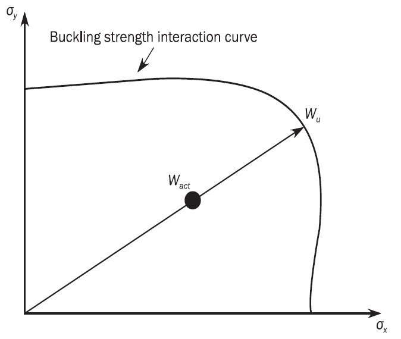
    **Figure : Example of buckling capacity and buckling utilisation factor**
- **3.3** **Allowable buckling utilisation factor**
  - **3.3.1** **General structural elements**
    The allowable buckling utilisation factor is defined in **Table 1**.

    | Structural component | $\eta_all$, Allowable buckling utilisation factor |
    | --- | --- |
    | Plates and stiffeners Stiffened and unstiffened panels Web plate in ways of openings | 1.00 for load combination: S+D 0.80 for load combination: S 1.00 for load combination: A, T |
    | Pillars | 0.75 for load combination: S+D 0.65 for load combination: S 0.75 for load combination: A, T |
- **3.4** **Buckling acceptance criteria**
  - **3.4.1** A structural member is considered to have an acceptable buckling strength if it satisfies the following criterion:
    $\eta _{act} \leq \eta _{all}$
    where:
    $\eta_act$ : Buckling utilisation factor based on the applied stress, defined in **[3.2.2]**.
    $\eta_all$ : Allowable buckling utilisation factor as defined in **[3.3]**.

### Section 35 - Slenderness requirements

**Symbols**
For symbols not defined in this section, refer to **Ch 1, Sec 4**.
$b_f-out$ : Maximum distance, in mm, from mid thickness of the web to the flange edge, as shown in **Figure 1**.
$h_w$ : Depth of stiffener web, in mm, as shown in **Figure 1**.
$\ell_b$ : Effective length of edge of bracket, in mm, as defined in **Table 3**.
$s_eff$ : Effective width of attached plate of stiffener, in mm, taken equal to :
$s _{eff} =0.8 s$
$t_f$ : Net flange thickness, in mm.
$t_p$ : Net thickness of plate, in mm.
$t_w$ : Net web thickness, in mm.

#### 1. Structural elements

- **1.1** **General**
  - **1.1.1** **(2023)**
    All structural elements are to comply with the applicable slenderness and proportion requirements given in **[2]** to **[4]**.except for the ones listed below;
    Bilge plates within the cylindrical part of the ship and radius gunwale;
    Structure members in superstructures and deck houses, if the structural members do not contribute to the longitudinal strength.

#### 2. Plates

- **2.1** **Net thickness of plate panels**
  - **2.1.1** The net thickness of plate panels is to satisfy the following criteria:
    $t _{p} \geq \frac{b}{C} \sqrt {\frac{R _{eH}}{235}}$
    where:
    $C$ : Slenderness coefficient taken as:
    $C=145$
    $R_eH$ : Specified minimum yield stress of the plate material, $\mathrm{N}/mm^2$
    A lower specified minimum yield stress may be used in this slenderness criterion provided the requirements specified in **Sec 3** and **Sec 4** are satisfied for the strake assumed in the same lower specified minimum yield stress value.
    This requirement does not apply to the bilge plates within the cylindrical part of the ship and radius gunwale.

#### 3. Stiffeners

- **3.1** **Proportions of stiffeners**
  - **3.1.1** **Net thickness of all stiffener types**
    The net thickness of stiffeners is to satisfy the following criteria:
    $t _{w} \geq \frac{h _{w}}{C _{w}} \sqrt {\frac{R _{eH}}{235}}$
    $t _{f} \geq \frac{b _{f-out}}{C _{f}} \sqrt {\frac{R _{eH}}{235}}$
    where:
    $C_w$, $C_f$ : Slenderness coefficients given in **Table 1**.
    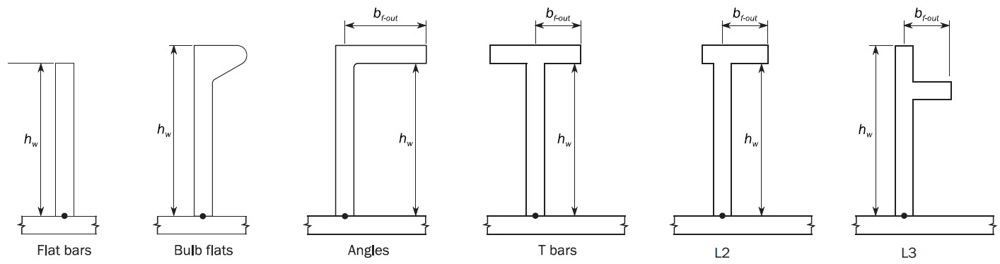
    **Figure : Stiffener scantling parameters**

    | Type of Stiffener | $C _{w}$ | $C _{f}$ |
    | --- | --- | --- |
    | Angle, L2 and L3 bars | 75 | 12(1) |
    | T-bars | 75 | 12 |
    | Bulb bars | 45 | - |
    | Flat bars | 22 | - |
    | Note (1) : For an angle, L2 or L3 bar, $C _{f}$ = 22 may be used if all other strength assessment without considering its flange is acceptable |   |   |
    - **a)** Stiffener web plate:
    - **b)** Flange:
  - **3.1.2** **Net dimensions of angle and T-bars (2023)**
    The total flange breadth $b_f$ in mm, for angle and T-bars is to satisfy the following criterion:
    $b _{f} \geq 0.2h _{w}$
  - **3.1.3** **Bending stiffness of stiffeners**
    The net moment of inertia, in cm^4, of the stiffener with the effective width of attached plate, about the neutral axis parallel to the attached plating, is not to be less than the minimum value given by:
    $I _{st} \geq C \ell ^{2} A _{eff} \frac{R _{eH}}{235}$
    where:
    $A_eff$ : Net sectional area of stiffener including effective attached plate, $s_eff$, in cm^2.
    $R_eH$ : Specified minimum yield stress of the material of the attached plate, in N/mm^2.
    $C$ : Slenderness coefficient taken as:
    $C=0.81$ for longitudinal stiffeners including sniped stiffeners.
    $C=0.72$ for other stiffeners.

#### 4. Primary supporting members

- **4.1** **Proportions and stiffness**
  - **4.1.1** **Proportion of web plate and flange**
    The net thicknesses of the web plates and flanges of primary supporting members are to satisfy the following criteria:
    $t _{w} \geq \frac{s _{w}}{C _{w}} \sqrt {\frac{R _{eH}}{235}}$
    $t _{f} \geq \frac{b _{f-out}}{C _{f}} \sqrt {\frac{R _{eH}}{235}}$
    where:
    $s_w$ : Plate breadth, in mm, taken as the spacing of the web stiffeners.
    $C_w$ : Slenderness coefficient for the web plate taken as:
    $C _{w} =$ 100
    $C_f$ : Slenderness coefficient for the flange taken as:
    $C _{f} =$ 12
    - **a)** Web plate:
    - **b)** Flange:
  - **4.1.2** **Deck transverse primary supporting members**
    The net moment of inertia for deck transverse primary supporting members, $I _{psm-n50}$, in cm^4, supporting deck longitudinals subject to axial compressive hull girder stress, is to comply, within its central half of the bending span, with the following criterion:
    $I _{psm-n50} \geq 300 \frac{\ell _{bdg}^{4}}{S ^{3} s} I _{st}$
    where:
    $I_psm-n50$ : Net moment of inertia, in cm^4, of deck transverse primary supporting member, with effective width of attached plate equal to $0.8S$.
    $\ell _{bdg}$ : Effective bending span of deck transverse primary supporting member, in m, as defined in **Ch 3, Sec 7**.
    $S$ : Spacing of deck transverse primary supporting members, in m, as defined in **Ch 3, Sec 7**.
    $I _{st}$ : Moment of inertia of deck stiffeners within the central half of the bending span, in cm^4, as given in **[3.1.3]**.
- **4.2** **Web stiffeners of primary supporting members**
  - **4.2.1** **Proportions of web stiffeners**
    The net thickness of web and flange of web stiffeners fitted on primary supporting members is to satisfy the requirements specified in **[3.1.1]** and **[3.1.2]**.
  - **4.2.2** **Bending stiffness of web stiffeners**
    The net moment of inertia, in cm^4, of web stiffener, $I _{st}$, fitted on primary supporting members, with effective attached plate, $s _{eff}$, is not to be less than the minimum moment of inertia defined in **Table 2**.

    | Stiffener arrangement |   | Minimum moment of inertia of web stiffeners, in cm^4 |
    | --- | --- | --- |
    | A | Web stiffeners fitted along the PSM span  | $I _{st} \geq C \ell ^{2} A _{eff} \frac{R _{eH}}{235}$ |
    | B | Web stiffeners fitted normal to the PSM span  | $I _{st} \geq 1.14 \ell s ^{2} t _{w} \left( 2.5 \frac{1000 \ell }{s} -2 \frac{s}{1000 \ell } \right) \frac{R _{eH}}{235} 10 ^{-5}$ |
    | where: $C$ : Slenderness coefficient to be taken as: $C=0.81$ for longitudinal stiffeners including sniped stiffeners. $C=0.72$ for other stiffeners. $\ell$ : Length of web stiffener, in m. For web stiffeners welded to local supporting members, the length is to be measured between the flanges of the local support members. For sniped web stiffeners, the length is to be measured between the lateral supports, e.g. the total distance between the flanges of the primary supporting member as shown for stiffener arrangement B. $A_eff$ : Net section area of web stiffener including effective attached plate, $s_eff$, in cm^2. $t_w$ : Net web thickness of the primary supporting member, in mm. $R_eH$ : Specified minimum yield stress of the material of the web plate of the primary supporting member, in N/mm^2. |   |   |

#### 5. Brackets

- **5.1** **Tripping brackets**
  - **5.1.1** **Unsupported flange length**
    The unsupported length of the flange of the primary supporting member, in m, i.e. the distance between tripping brackets, is not to be greater than:
    $S _{b} =b _{f} C \sqrt {\frac{A _{f-n50}}{\left( A _{f-n50} + \frac{A _{w-n50}}{3} \right)} \left( \frac{235}{R _{eH}} \right)}$ , but need not be less than $S_{b-itmin$.
    where:
    $b_f$ : Flange breadth of primary supporting members, in mm.
    $C$ : Slenderness coefficient taken as:
    $C=0.022$ for symmetrical flanges.
    $C=0.033$ for asymmetrical flanges.
    $A_f-n50$ : Net cross sectional area of flange, in cm^2.
    $A_w-n50$ : Net cross sectional area of the web plate, in cm^2.
    $R_eH$ : Specified minimum yield stress of the PSM material, in N/mm^2.
    $S_{b-itmin$ : Minimum unsupported flange length taken as:
    $S _{b- it \min} =$ 3.0 m for the cargo tank/hold region, on tank/hold boundaries or the hull envelope including external decks.
    $S _{b- it \min} =$ 4.0 m for other areas.
  - **5.1.2** **Edge stiffening**
    Tripping brackets on primary supporting members are to be stiffened by a flange or edge stiffener if the effective length of the edge, $\ell _{b}$ as defined in **Table 3**, in mm, is greater than:
    $\ell _{b} =75 t _{b}$
    where:
    $t _{b}$ : Bracket net web thickness, in mm.
- **5.2** **End brackets**
  - **5.2.1** **Proportions**
    The net web thickness of end brackets, in mm, subject to compressive stresses is not to be less than:
    $t _{b} = \frac{d _{b}}{C} \sqrt {\frac{R _{eH}}{235}}$
    where:
    $d _{b}$ : Depth of brackets, in $\mathrm{mm}$, as defined in **Table 3**.
    $C$ : Slenderness coefficient as defined in **Table 3**.
    $R _{eH}$ : Specified minimum yield stress of the end bracket material, in N/mm^2.
- **5.3** **Edge reinforcement**
  - **5.3.1** **Edge reinforcement of bracket edges**
    The depth of stiffener web, $h _{w}$ in mm, of edge stiffeners in way of bracket edges is not to be less than:
    $h _{w} = C \ell _{b} \sqrt {\frac{R _{eH}}{235}}$ or 50 mm, whichever is greater.
    where:
    $C$ : Slenderness coefficient taken as:
    $C=$ 75 for end brackets.
    $C=$ 50 for tripping brackets.
    $R _{eH}$ : Specified minimum yield stress of the end bracket material, in N/mm^2.
  - **5.3.2** **Proportions of edge stiffeners**
    The net thickness of the web plate and flange of the edge stiffener is to satisfy the requirements specified in **[3.1.1]** and **[3.1.2]**.

    | Mode | $C$ |
    | --- | --- |
    | Brackets without edge stiffener 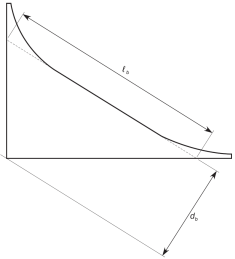 | $C =20 \left( \frac{d _{b}}{\ell _{b}} \right) + 16$ where: $0.25 \leq \frac{d _{b}}{\ell _{b}} \leq 1.0$ |
    | Brackets with edge stiffener 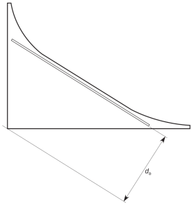 | $C =70$ |

#### 6. Other structures

- **6.1** **Pillars**
  - **6.1.1** **Proportions of I-section pillars**
    For I-sections, the thickness of the web plate and the flange thickness are to comply with requirements specified in **[3.1.1]** and **[3.1.2]**.
  - **6.1.2** **Proportions of box section pillars**
    The thickness of thin walled box sections is to comply with the requirements specified in item (a) of **[3.1.1]**.
  - **6.1.3** **Proportions of circular section pillars**
    The net thickness, $t$, of circular section pillars, in mm, is to comply with the following criterion:
    $t \geq \frac{r}{50}$
    where:
    $r$ : Mid thickness radius of the circular section, in mm.
- **6.2** **Edge reinforcement in way of openings**
  - **6.2.1** **Depth of edge stiffener**
    When fitted as shown in **Figure 2**, the depth of web, $h _{w}$ in mm, of edge stiffeners in way of openings is not to be less than:
    $h _{w} =C \ell \sqrt {\frac{R _{eH}}{235}}$ or 50 mm, whichever is greater.
    where:
    $C$ : Slenderness coefficient taken as:
    $C=50$
    $R _{eH}$ : Specified minimum yield stress of the edge stiffener material, in N/mm^2.
  - **6.2.2** **Proportions of edge stiffeners**
    The net thickness of the web plate and flange of the edge stiffener is to satisfy the requirements specified in **[3.1.1]** and **[3.1.2]**.
    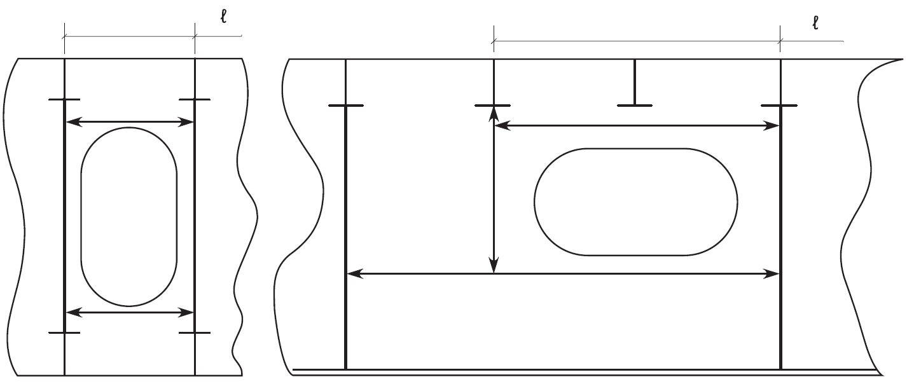
    **Figure 2 : Typical edge reinforcements**

### Section 36 - Prescriptive buckling requirements

**Symbols**
$\eta _{all}$ : Allowable buckling utilisation factor, as defined in **Ch 8, Sec 1, [3.3]**.
EPP : Elementary Plate Panel as defined in **Ch 3, Sec 7, [2.1]**.
LCP : Load calculation point as defined in **Ch 3, Sec 7, [2.2.2]** and **Ch 3, Sec 7, [3.2]**.

#### 1. General

- **1.1** **Scope**
  - **1.1.1** This section applies to plate panels including curved plate panels and stiffeners subject to hull girder compression and shear stresses. In addition the pillar subject to compressive stresses is to be checked.
  - **1.1.2** The hull girder buckling strength requirements apply along the full length of the ship.
  - **1.1.3** **Design load sets**
    The buckling checks are to be performed for all design load sets defined in **Ch 6, Sec 2, [2]**, both in intact and in flooded conditions with pressure combination defined in **Ch 6, Sec 2, [1.3]**.
    For each design load set, for all dynamic load cases, the lateral pressure is to be determined according to **Ch 4** at the load calculation point defined in **Ch 3, Sec 7**, and is to be applied together with the hull girder stress combinations given in **[2.2]**.
- **1.2** **Equivalent plate panel**
  - **1.2.1** In longitudinal stiffening arrangement, when the plate thickness varies over the width $b$, of a plate panel, the buckling check is to be performed for an equivalent plate panel width, combined with the smaller plate thickness, $t _{1}$. The width of this equivalent plate panel, $b _{eq}$, in mm, is defined by the following formula:
    $b _{eq} = \ell _{1} + \ell _{2} \left( \frac{t _{1}}{t _{2}} \right) ^{1.5}$
    where:
    $\ell _{1}$ : Width of the part of the plate panel with the smaller net plate thickness, $t _{1}$, in mm, as defined in **Figure 1**.
    $\ell _{2}$ : Width of the part of the plate panel with the smaller net plate thickness, $t _{2}$, in mm, as defined in **Figure 1**.
    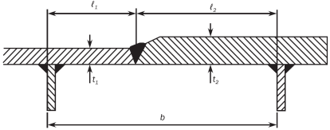
    **Figure : Plate thickness change over the width**
  - **1.2.2** In transverse stiffening arrangement, when an EPP is made with different thicknesses, the buckling check of the plate and stiffeners is to be made for each thickness considered constant on the EPP, the stresses and pressures being estimated for the EPP at the LCP.
  - **1.2.3** When the plate panel is made of different materials, the minimum yield strength is to be used for the buckling assessment.

#### 2. Hull girder stress

- **2.1** **General**
  - **2.1.1** The hull girder bending stresses, $\sigma _{hg}$ in N/mm^2, are determined according to **Ch 6, Sec 2**.
  - **2.1.2** The hull girder shear stresses, $\tau _{hg}$, in N/mm^2, in the plate $i$ are determined as follows:
    $\tau _{hg} = \frac{Q _{"Tot"} \left( x \right) q _{vi}}{t _{i-n50}} 10 ^{3}$
    where:
    $Q _{"Tot"} (x)$ : Total vertical shear force, in $\mathrm{kN}$, at the ship longitudinal location $x$, taken as follows:
    • For seagoing operations:
    $Q _{"Tot"} \left( x \right) = \left| Q _{sw} +Q _{wv-LC} \right|$
    • For harbour/sheltered water operations:
    $Q _{"Tot"} \left( x \right) = \left| Q _{sw-p} \right|$
    $q _{vi}$ : Contribution ratio in way of the plate *i,* as defined in **Ch 5, Sec 1, [3.2.1]**.
    $t _{i-n50}$ : Net thickness of the plate *i,* in mm as defined in **Ch 5, Sec 1, [3.2.1]**, used for shear stress calculation.
    $Q _{sw}$ : Permissible positive or negative still water shear force for seagoing operation, in kN, at the hull transverse section considered, as defined in **Ch 4, Sec 4, [2.3.1]**.
    $Q _{sw-p}$ : Permissible positive or negative still water shear force for harbour/sheltered operation, in kN, at the hull transverse section considered, as defined in **Ch 4, Sec 4, [2.3.2]**.
    $Q _{wv-LC}$ : Vertical wave shear force in seagoing condition, in kN, in intact or flooded conditions at the hull transverse section considered for the considered dynamic load case, defined in **Ch 4, Sec 4, [3.5.3]**.
    - **a)** For the design load combination S+D
    - **b)** For the design load combination S
- **2.2** **Stress combinations**
  - **2.2.1** Each elementary plate panel and stiffeners are to satisfy the criteria defined in **[3]** with the following stress combinations:
    • Stress combination 1 with:
    $\sigma _{x} = \sigma _{hg}$
    $\sigma _{y} =0$
    $\tau =0.7 \tau _{hg}$
    • Stress combination 2 with:
    $\sigma _{x} =0.7 \sigma _{hg}$
    $\sigma _{y} =0$
    $\tau = \tau _{hg}$
    • Stress combination 1 with:
    $\sigma _{x} =0$
    $\sigma _{y} = \sigma _{hg}$
    $\tau =0.7 \tau _{hg}$
    • Stress combination 2 with:
    $\sigma _{x} =0$
    $\sigma _{y} =0.7 \sigma _{hg}$
    $\tau = \tau _{hg}$
    where:
    $\sigma _{hg}$ : Hull girder bending stress in the elementary plate panel or stiffener, as defined in **[2.1.1]**, in N/mm^2.
    $\tau _{hg}$ : Hull girder shear stress, in N/mm^2, in the elementary plate panel or stiffener attached plate as defined in **[2.1.2]**.
    - **a)** Longitudinal stiffening arrangement:
    - **b)** Transverse stiffening arrangement:

#### 3. Buckling criteria

- **3.1** **Overall stiffened panel**
  - **3.1.1** The buckling strength of overall stiffened panels is to satisfy the following criterion:
    $\eta _{"Overall"} \leq \eta _{all}$
    where:
    $\eta _{"Overall"}$ : Maximum utilisation factor as defined in **Ch 8, Sec 5, [2.1]**.
- **3.2** **Plates**
  - **3.2.1** The buckling strength of elementary plate panels is to satisfy the following criterion:
    $\eta _{Plate} \leq \eta _{all}$
    where:
    $\eta _{Plate}$ : Maximum plate utilisation factor calculated according to SP-A, as defined in **Ch 8, Sec 5, [2.2]**.
- **3.3** **Stiffeners**
  - **3.3.1** The buckling strength of stiffeners is to satisfy the following criterion:
    $\eta _{Stiffener} \leq \eta _{all}$
    where:
    $\eta _{Stiffener}$ : Maximum stiffener utilisation factor, as defined in **Ch 8, Sec 5, [2.3]**.
    Note 1: This capacity check can only be fulfilled when the overall stiffened panel capacity, as defined in **[3.1.1]**, is satisfied.
- **3.4** **Pillars**
  - **3.4.1** The compressive buckling strength of pillars is to satisfy the following criterion:
    $\eta _{"Pillar"} \leq \eta _{all}$
    where:
    $\eta _{"Pillar"}$ : Maximum buckling utilisation factor of pillars defined in **Ch 8, Sec 5, [3.1]**.

### Section 37 - Buckling requirements for Direct Strength Analysis

**Symbols**
$\eta _{all}$ : Allowable buckling utilisation factor, as defined in **Ch 8, Sec 1, [3.3]**.
$\alpha$ : Aspect ratio of the plate panel, defined in **Ch 8, Sec 5**.

#### 1. General

- **1.1** **Scope**
  - **1.1.1** The requirements of this Section apply for the buckling assessment of direct strength analysis subjected to compressive stress, shear stress and lateral pressure.
  - **1.1.2** All structural elements in the FE analysis carried out according to **Ch 7** are to be assessed individually. The buckling checks have to be performed for the following structural elements:
    - **a)** Stiffened and unstiffened panels, inclusive curved panels.
    - **b)** Web plate in way of openings.
    - **c)** Pillars.

#### 2. Stiffened and unstiffened panels

- **2.1** **General**
  - **2.1.1** The plate panel of hull structure is to be modelled as stiffened or unstiffened panel. Method A and Method B as defined in **Ch 8, Sec 1, [3]** are to be used according to **Figure 1** to **Figure 3**. In the figures, SP stands for stiffened panel and UP stands for unstiffened panel.
    • For PSM web panels with one of the long edges along the face plate or along the attached plating without "in-line support", i.e. the edge is free to pull in, boundary condition B (SP-B or UP-B) shall be applied. In other cases boundary condition A (SP-A or UP-A) is applicable.
    • Typically the short plate edge is attached to the plate flanges and boundary condition A (SP-A or UP-A) is applicable. However in case of one of the long edges is without "in-line support" and is free to pull in, boundary condition B (SP-B or UP-B) shall be applied.
  - **2.1.2** **Average thickness of plate panel**
    Where the plate thickness along a plate panel is not constant, the panel used for the buckling assessment is to be modelled according to **Ch 7** with a weighted average thickness taken as:
    $t _{avr} = \frac{\sum _{1} ^{n} A _{i} t _{i}}{\sum _{1} ^{n} A _{i}}$
    where:
    $A _{i}$ : Area of the $i$-th plate element.
    $t _{i}$ : Net thickness of the $i$-th plate element.
    $n$ : Number of finite elements defining the buckling plate panel.

    | Structural elements |   | Assessment method | Normal panel definition |
    | --- | --- | --- | --- |
    | Longitudinal structure, see **Figure 1** |   |   |   |
    | Longitudinal stiffened panels Shell envelope Deck/trunk deck Inner hull Longitudinal bulkheads |   | SP-A | Length: between web frames Width: between primary supporting members |
    | Double hull longitudinal girders or stringers in line with inner hull knuckle point |   | SP-A | Length: between web frames Width: full web depth |
    | Double hull longitudinal girders or stringers not in line with inner hull knuckle point |   | SP-B | Length: between web frames Width: full web depth |
    | Transverse structure, see **Figure 2** |   |   |   |
    | Vertical web in double side | Regularly stiffened web between PSM | SP-B | Length: full web depth Width: between primary supporting members |
    | Vertical web in double side | Irregularly stiffened web between PSM | UP-B | Plate between local stiffeners/face plate/PSM |
    | Double bottom floors |   | SP-B | Length: full web depth Width: between primary supporting members |
    | Regularly stiffened web between inner deck and trunk deck |   | SP-B | Length: full web depth Width: between primary supporting members |
    | Irregularly stiffened panels, e.g. web panels in way of hopper tank and upper trunk structure |   | UP-B | Plate between local stiffeners/face plate/PSM |
    | Transverse watertight and cofferdam bulkhead, see **Figure 3** |   |   |   |
    | Regularly stiffened bulkhead panels inclusive the secondary buckling stiffeners perpendicular to the regular stiffeners (such as carlings) |   | SP-A | Length: between primary supporting members Width: between primary supporting members |
    | Irregularly stiffened bulkhead panels, e.g. web panels in way of hopper tank and bilge |   | UP-B | Plate between local stiffeners/face plate/PSM |
  - **2.1.3** **Yield stress of the plate panel**
    The panel yield stress $R _{eH"_P"}$ is taken as the minimum value of the specified yield stresses of the elements within the plate panel.
- **2.2** **Stiffened panels**
  - **2.2.1** If the stiffener properties or stiffener spacing varies within the stiffened panel, the calculations are to be performed separately for all configurations of the panels, i.e. for each stiffener and plate between the stiffeners. Plate thickness, stiffener properties and stiffener spacing at the considered location are to be assumed for the whole panel.
    
    **Figure : Longitudinal plates for liquid natural gas carrier**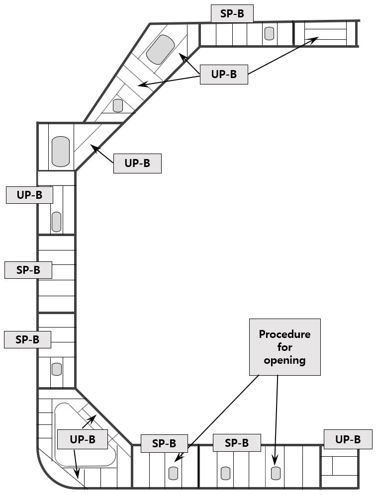
    **Figure : Transverse web frames for liquid natural gas carrier (Partly shown)** ***(2023)***
    
    **Figure : Transverse bulkheads for liquid natural gas carrier**
- **2.3** **Unstiffened panels**
  - **2.3.1** **Irregular plate panel**
    In way of web frames, stringers and brackets, the geometry of the panel (i.e. plate bounded by web stiffeners/face plate) may not have a rectangular shape. In this case, an equivalent rectangular panel is to be defined according to **[2.3.2]** for irregular geometry and **[2.3.3]** for triangular geometry and to comply with buckling assessment.
  - **2.3.2** **Modelling of an unstiffened panel with irregular geometry**
    Unstiffened panels with irregular geometry are to be idealised to equivalent panels for plate buckling assessment according to the following procedure:
    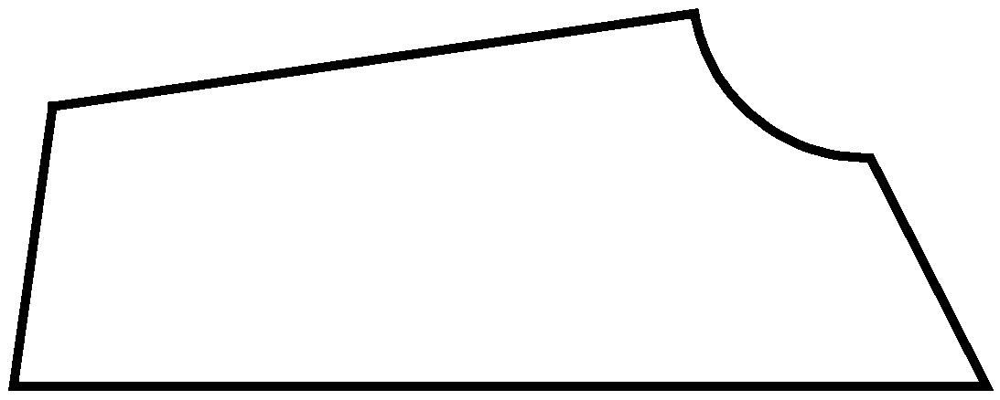
    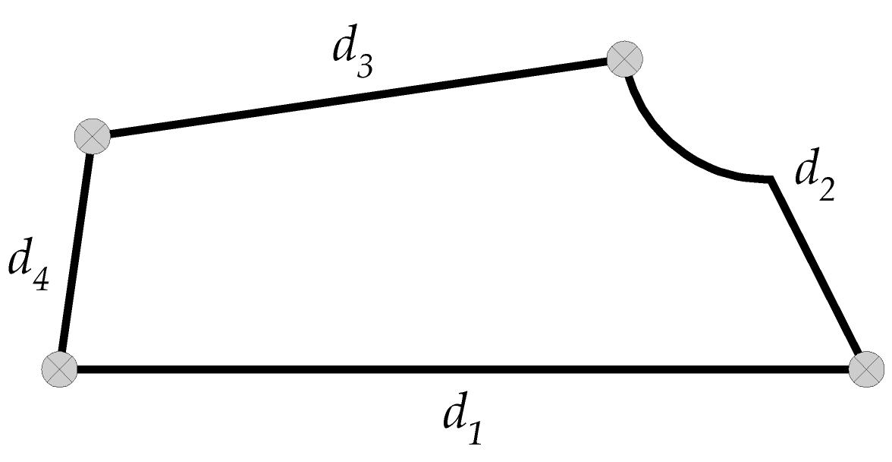
    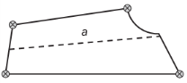
    $b=A/a$
    where:
    $A$ : Area of the plate, in mm^2.
    $a$ : length defined in (d), in mm.
    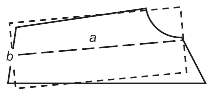
    - **a)** The four corners closest to a right angle, 90 deg, in the bounding polygon for the plate are identified.
    - **b)** The distances along the plate bounding polygon between the corners are calculated, i.e. the sum of all the straight line segments between the end points.
    - **c)** The pair of opposite edges with the smallest total length is identified, i.e. minimum of $d _{1} +d _{3}$ and $d _{2} +d _{4}$.
    - **d)** A line joins the middle points of the chosen opposite edges (i.e. a mid point is defined as the point at half the distance from one end). This line defines the longitudinal direction for the capacity model. The length of the line defines the length of the capacity model, $a$ measured from one end point.
    - **e)** The length of shorter side, $b$ in $\mathrm{mm}$, is to be taken as:
    - **f)** The stresses from the direct strength analysis are to be transformed into the local coordinate system of the equivalent rectangular panel. These stresses are to be used for the buckling assessment.
  - **2.3.3** **Modelling of an unstiffened plate panel with triangular geometry**
    Unstiffened panels with triangular geometry are to be idealised to equivalent panels for plate buckling assessment according to the following procedure:
    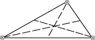
    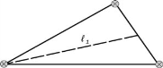
    $\ell _{2} =A/\ell _{1}$
    where:
    $A$ : Area of the plate, in mm^2.
    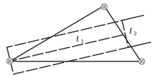
    $b= \frac{\ell _{2}}{C _{tri}}$
    $a=\ell _{1} C _{tri}$
    where:
    $C _{tri} =0.4 \frac{\ell _{2}}{\ell _{1}} +0.6$
    - **a)** Medians are constructed as shown below.
    - **b)** The longest median is identified. This median the length of which is $\ell _{1}$ in mm, defines the longitudinal direction for the capacity model.
    - **c)** The width of the model, $\ell _{2}$, in mm, is to be taken as:
    - **d)** The lengths of shorter side, $b$, and of the longer side, $a$, in $\mathrm{mm}$, of the equivalent rectangular plate panel are to be taken as:
    - **e)** The stresses from the direct strength analysis are to be transformed into the local coordinate system of the equivalent rectangular panel and are to be used for the buckling assessment of the equivalent rectangular panel.
- **2.4** **Reference stress**
  - **2.4.1** The stress distribution is to be taken from the direct strength analysis and applied to the buckling model.
  - **2.4.2** The reference stresses are to be calculated using the Stress based reference stresses as defined in **App 1**.
- **2.5** **Lateral pressure**
  - **2.5.1** The lateral pressure applied to the direct strength analysis is also to be applied to the buckling assessment.
  - **2.5.2** Where the lateral pressure is not constant over a buckling panel defined by a number of finite plate elements, an average lateral pressure, N/mm^2, is calculated using the following formula:
    $P _{avr} = \frac{\sum _{1} ^{n} A _{i} P _{i}}{\sum _{1} ^{n} A _{i}}$
    where:
    $A _{i}$ : Area of the $i$-th plate element, in mm^2.
    $P _{i}$ : Lateral pressure of the $i$-th plate element, in N/mm^2.
    $n$ : Number of finite elements in the buckling panel.
- **2.6** **Buckling criteria**
  - **2.6.1** **UP-A**
    The compressive buckling strength of UP-A is to satisfy the following criterion:
    $\eta _{UP-A} \leq \eta _{all}$
    where:
    $\eta _{UP-A}$ : Maximum plate utilisation factor, calculated according to Method A as defined in **Ch 8, Sec 5, [2.2]**.
  - **2.6.2** **UP-B**
    The compressive buckling strength of UP-B is to satisfy the following criterion:
    $\eta _{UP-B} \leq \eta _{all}$
    where:
    $\eta _{UP-B}$ : Maximum plate utilisation factor, calculated according to Method B as defined in **Ch 8, Sec 5, [2.2]**.
  - **2.6.3** **SP-A**
    The compressive buckling strength of SP-A is to satisfy the following criterion:
    $\eta _{SP-A} \leq \eta _{all}$
    where:
    $\eta _{SP-A}$ : Maximum stiffened panel utilisation factor taken as the maximum of:
    Note 1: The stiffener buckling capacity check can only be fulfilled when the overall stiffened panel capacity, as defined in **Ch 8, Sec 5, [2.1]**, is satisfied.
    - **a)** The overall stiffened panel capacity as defined in **Ch 8, Sec 5, [2.1]**.
    - **b)** The plate capacity calculated according to Method A as defined in **Ch 8, Sec 5, [2.2]**.
    - **c)** The stiffener buckling strength as defined in **Ch 8, Sec 5, [2.3]** considering separately the properties (thickness, dimensions), the pressures defined in **[2.5.2]** and the reference stresses of each EPP at both sides of the stiffener.
  - **2.6.4** **SP-B**
    The compressive buckling strength of SP-B is to satisfy the following criterion:
    $\eta _{SP-B} \leq \eta _{all}$
    where:
    $\eta _{SP-B}$ : Maximum stiffened panel utilisation factor taken as the maximum of:
    Note 1: The stiffener buckling capacity check can only be fulfilled when the overall stiffened panel capacity, as defined in **Ch 8, Sec 5, [2.1]**, is satisfied.
    - **a)** The overall stiffened panel capacity as defined in **Ch 8, Sec 5, [2.1]**.
    - **b)** The plate capacity calculated according to Method B as defined in **Ch 8, Sec 5, [2.2]**.
    - **c)** The stiffener buckling strength as defined in **Ch 8, Sec 5, [2.3]** considering separately the properties (thickness, dimensions), the pressures defined in **[2.5.2]** and the reference stresses of each EPP at both sides of the stiffener.
  - **2.6.5** **Web plate in way of openings**
    The web plate of primary supporting members with openings is to satisfy the following criterion:
    $\eta _{opening} \leq \eta _{all}$
    where:
    $\eta _{opening}$ : Maximum web plate utilisation factor in way of openings, as defined in **Ch 8, Sec 5, [2.4]**.

#### 3. Pillars

- **3.1** **Buckling criteria**
  - **3.1.1** The compressive buckling strength of pillars is to satisfy the following criterion:
    $\eta _{"Pillar"} \leq \eta _{all}$
    where:
    $\eta _{"Pillar"}$ : Maximum buckling utilisation factor of pillars defined in **Ch 8, Sec 5, [3.1]**.

### Section 38 - Buckling capacity

**Symbols**
For symbols not defined in this section, refer to **Ch 1, Sec 4**.
$A _{s}$ : Net sectional area of the stiffener without attached plating, in mm^2.
$A _{p}$ : Net sectional area of stiffener attached plating, in mm^2, taken as: (2023)
$A _{p} =s t _{p}$
$a$ : Length of the longer side of the plate panel, in mm.
$b$ : Length of the shorter side of the plate panel, in mm.
$b _{eff}$ : Effective width of the attached plating of a stiffener, in mm, as defined in **[2.3.5]**.
$b _{eff1}$ : Effective width of the attached plating of a stiffener, in mm, without the shear lag effect taken as:
• For $\sigma _{x} >0$
• For prescriptive assessment:
$b _{eff1} = \frac{C _{x1} b _{1} +C _{x2} b _{2}}{2}$
• For FE analysis:
$b _{eff1} =C _{x} b$
• For $\sigma _{x} \leq 0$
$b _{eff1} =b$
$b _{f}$ : Breadth of the stiffener flange, in mm.
$b _{1} , b _{2}$ : Width of plate panel on each side of the considered stiffener, in mm.
$C _{x1} , C _{x2}$ : Reduction factor defined in **Table 3** calculated for the EPP1 and EPP2 on each side of the considered stiffener according to case 1.
$d$ : Length of the side parallel to the axis of the cylinder corresponding to the curved plate panel as shown in **Table 4**, in mm.
$d _{e}$ : Distance from upper edge of web to the top of the flange, in mm, as defined in **Ch 3, Sec 2, Figure 3**.
$e _{f}$ : Distance from attached plating to centre of flange, in mm, to be taken as:
$e _{f} = h _{w}$, for flat bar profile.
$e _{f} = h _{w} - 0.5 t _{f}$, for bulb profile.
$e _{f} = h _{w} + 0.5 t _{f}$, for angle, L2 and Tee profiles.
$e _{f} = h _{w} -d _{e} - 0.5 t _{f}$, for L3 profile.
$F _{long}$ : Coefficient defined in **[2.2.4]**.
$F _{tran}$ : Coefficient defined in **[2.2.5]**.
$h _{w}$ : Depth of Stiffener web, in mm, as shown in **Figure 1**.
$\ell$ : Span, in mm, of stiffener equal to the spacing between primary supporting members.
$R$ : Radius of curved plate panel, in mm.
$R _{eH _{-} P}$ : Specified minimum yield stress of the plate, in N/mm^2.
$R _{eH _{-} S}$ : Specified minimum yield stress of the stiffener, in N/mm^2.
$S$ : Partial safety factor to be taken as:
• $S=1.1$ for structures which are exposed to local concentrated loads.
• $S=1.0$ for all other cases.
$t _{p}$ : Net thickness of plate panel, in mm.
$t _{w}$ : Net stiffener web thickness, in mm.
$t _{f}$ : Net flange thickness, in mm.
$x _\mathrm{axis it}$ : Local axis of a rectangular buckling panel parallel to its long edge.
$y _\mathrm{axis it}$ : Local axis of a rectangular buckling panel perpendicular to its long edge.
$\alpha$ : Aspect ratio of the plate panel, defined in **Table 3** to be taken as: $\alpha = a/b$.
$\beta$ : Coefficient taken as: $\beta = \frac{1- \psi}{\alpha}$.
$w$ : Coefficient taken as: $w=\min(3; \alpha)$.
$\sigma _{x}$ : Stress applied on the edge along x axis of the buckling panel, in N/mm^2.
$\sigma _{y}$ : Stress applied on the edge along y axis of the buckling panel, in N/mm^2.
$\sigma _{1}$ : Maximum stress, in N/mm^2.
$\sigma _{2}$ : Minimum stress, in N/mm^2.
$\sigma_E$ : Elastic buckling reference stress, in N/mm^2 to be taken as:
• For the application of plate limit state according to **[2.2.1]**:
$\sigma _{E} = \frac{\pi ^{2} E}{12(1-\nu ^{2} )} left( \frac{t _{p}}{b} right) ^{2}$
• For the application of curved plate panels according to **[2.2.6]**:
$\sigma _{E} = \frac{\pi ^{2} E}{12(1- \nu ^{2} )} \left( \frac{t _{p}}{d} \right) ^{2}$
$\tau$ : Applied shear stress, in N/mm^2.
$\tau _{c}$ : Buckling strength in shear, in N/mm^2, as defined in **[2.2.3]**.
$\Psi$ : Edge stress ratio to be taken as: $\Psi = \frac{\sigma _{2}}{\sigma _{1}}$
$\gamma$ : Stress multiplier factor acting on loads. When the factor is such that the loads reach the interaction formulae, $\gamma = \gamma _{c}$.
$\gamma_c$ : Stress multiplier factor at failure.
$\gamma _{"GEB"}$ : Stress multiplier factor of global elastic buckling capacity. (2023)
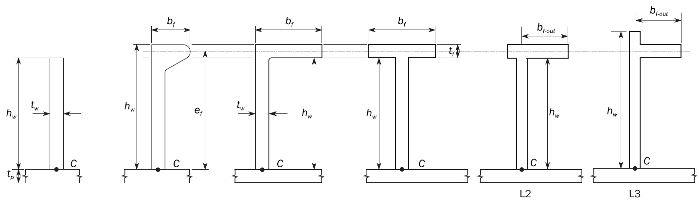
**Figure : Stiffener cross sections**

#### 1. General

- **1.1** **Scope**
  - **1.1.1** This section contains the methods for determination of the buckling capacity of plate panels, stiffeners, primary supporting members and pillars.
  - **1.1.2** For the application of this section, the stresses $\sigma _{x}$, $\sigma _{y}$ and $\tau$ applied on the structural members are defined in:
    • **Ch 8, Sec 3** for prescriptive requirements.
    • **Ch 8, Sec 4** for FE analysis requirements.
  - **1.1.3** **Ultimate buckling capacity**
    The ultimate buckling capacity is calculated by applying the actual stress combination and then increasing or decreasing the stresses proportionally until the interaction formulae defined in **[2.1.1]**, **[2.2.1]**, and **[2.3.4]** are equal to 1.0.
  - **1.1.4** **Buckling utilisation factor**
    The buckling utilisation factor of the structural member is equal to the highest utilisation factor obtained for the different buckling modes.
  - **1.1.5** **Lateral pressure**
    The lateral pressure is to be considered as constant in the buckling strength assessment.

#### 2. Buckling capacity of plates and stiffeners

- **2.1** **Overall stiffened panel capacity**
  - **2.1.1** **(2023)**
    The elastic stiffened panel limit state is based on the following interaction formula, which sets a precondition for the buckling check of stiffeners in accordance with [2.3.4]:
    $\frac{\gamma}{\gamma _{"GEB"}} =1$
    where the stress multiplier factor corresponding to global elastic buckling capacity, $\gamma _{"GEB"}$, is to be calculated based on the following formulae:
    $\gamma _{"GEB"} = \gamma _{"GEB",bi+ \tau }$ for $\tau != 0$ and ($\sigma _{x} >0$ or $\sigma _{y} >0$)
    $\gamma _{"GEB"} = \gamma _{"GEB",bi}$ for $\tau =0$ and ($\sigma _{x} >0$ or $\sigma _{y} >0$)
    $\gamma _{"GEB"} = \gamma _{"GEB", \tau }$ for $\tau != 0$ and ($\sigma _{x} \leq 0$ and $\sigma _{y} \leq 0$)
    where $\gamma _{"GEB",bi+ \tau }$, $\gamma _{"GEB",bi}$ and $\gamma _{"GEB", \tau }$ are stress multiplier factors of the global elastic buckling capacity for different load combinations as defined in [2.1.2], [2.1.3] and [2.1.4], respectively. For the calculation of $\gamma _{"GEB",bi+ \tau }$, $\gamma _{"GEB",bi}$ and $\gamma _{"GEB", \tau }$, neither $\sigma _{x}$ nor #eqnID-4505_s0shall be taken less than 0.
    $\sigma _{x}$, $\sigma _{y}$ : Applied normal stresses to the plate, in N/mm^2.to be taken as defined in [2.2.7].
    $\tau$ : Applied shear stress, in N/mm^2.to be taken as defined in [2.2.7].
  - **2.1.2** **(2023)**
    The stress multiplier factor $\gamma _{"GEB",bi}$ for the stiffened panel subjected to biaxial loads is taken as:
    $\gamma _{"GEB",bi} = \frac{\pi ^{2}}{L _{B1}^{2} L _{B2}^{2}} \frac{\left[ D _{11} L _{B2}^{4} +2 \left( D _{12} +D _{33} \right) n ^{2} L _{B1}^{2} L _{B2}^{2} +n ^{4} D _{22} L _{B1}^{4} \right]}{L _{B2}^{2} N _{x} +n ^{2} L _{B1}^{2} N _{y}}$
    where:
    $N _{x}$ : Load per unit length applied on the edge along x axis of the stiffened panel, in N/mm, taken as
    $N _{x} = \sigma _{x,av} \left( A _{p} +A _{s} \right) /s$
    $N _{y}$ : Load per unit length applied on the edge along y axis of the stiffened panel, in N/mm, taken as:
    $N _{y} =c \sigma _{y} t _{p}$
    $L _{B1}$ : Stiffener span, in mm, equal to spacing between primary supporting members, i.e. $L _{B1} = \ell$
    For vertically stiffened side shell of single side skin bulk carriers, $L _{B1} =0.8 \ell$
    $L _{B2}$ : Width of the stiffened panel, in mm, taken as 6 times of the stiffener spacing, i.e. 6s
    $n$ : Number of half waves along the direction perpendicular to the stiffener axis. The factor $\gamma _{"GEB",bi}$ is to be minimized with respect to the wave parameter $n$, i.e. to be taken as the smallest value larger than zero.
    $c$ : Factor taking into account the stresses in the attached plating acting perpendicular to the stiffener axis:
    $c=0.5 \left( 1+ \psi \right)$ for $0 \leq \psi <1$
    $c= \frac{1}{2 \left( 1- \psi \right)}$ for $\psi <0$
    $\psi$ : Edge stress ratio for **case 2** according to **Table 3**.
    $\sigma _{x,av}$ : Average stress, in N/mm^2, for both plate and stiffener with Poisson correction, taken as:
    $\sigma _{x,av} = \sigma _{x} - \nu c \sigma _{y} A _{s} / \left( A _{p} +A _{s} \right) \geq 0$ for $\sigma _{x} >0$ and $\sigma _{y} >0$
    $\sigma _{x,av} = \sigma _{x}$ for $\sigma _{x} \leq 0$ or $\sigma _{y} \leq 0$
    $D _{11}$, $D _{12}$, $D _{22}$, $D _{33}$ : Bending stiffness coefficients, in Nmm, of the stiffened panel, defined in general as:
    $D _{11} = \frac{E I _{eff} 10 ^{4}}{s}$
    $D _{12} = \frac{E t _{p}^{3} \nu}{12 \left( 1- \nu ^{2} \right)}$
    $D _{22} = \frac{E t _{p}^{3}}{12 \left( 1- \nu ^{2} \right)}$
    $D _{33} = \frac{E t _{p}^{3}}{12 \left( 1+ \nu \right)}$
    $I _{eff}$ : Moment of inertia, in cm^4, of the stiffener including effective width of attached plating, the same as $I$ defined in **[2.3.4]**.
  - **2.1.3** **(2023)**
    The stress multiplier factor $\gamma _{"GEB", \tau }$ for the stiffened panel subjected to pure shear load is taken as:
    $\gamma _{"GEB", \tau } = \frac{root {4} of {D _{11}^{3} D _{22}}}{\left( L _{B1} /2 \right) ^{2} N _{xy}} \left[ 8.125+5.64 \sqrt {\frac{\left( D _{12} +D _{33} \right) ^{2}}{D _{11} D _{22}}} -0.6 \frac{\left( D _{12} +D _{33} \right) ^{2}}{D _{11} D _{22}} \right]$
    for $D _{11} D _{22} \geq \left( D _{12} +D _{33} \right) ^{2}$
    $\gamma _{"GEB", \tau } = \frac{\sqrt {2D _{11} \left( D _{12} +D _{33} \right)}}{\left( L _{B1} /2 \right) ^{2} N _{xy}} \left[ 8.3+1.525 \frac{D _{11} D _{22}}{\left( D _{12} +D _{33} \right) ^{2}} -0.493 \frac{D _{11}^{2} D _{22}^{2}}{\left( D _{12} +D _{33} \right) ^{4}} \right]$
    for $D _{11} D _{22} < \left( D _{12} +D _{33} \right) ^{2}$
    where
    $N _{xy} = \tau t _{p}$
  - **2.1.4** **(2023)**
    The stress multiplier factor $\gamma _{"GEB",bi+ \tau }$ for the stiffened panel subjected to combined loads is taken as:
    $\gamma _{"GEB",bi+ \tau } = \frac{1}{2} \gamma _{"GEB", \tau }^{2} \left[ - \frac{1}{\gamma _{"GEB",bi}} + \sqrt {\frac{1}{\gamma _{"GEB",bi}^{2}} +4 \frac{1}{\gamma _{"GEB", \tau }^{2}}} \right]$
    where $\gamma _{"GEB",bi}$ and $\gamma _{"GEB", \tau }$ are as defined in **[2.1.2]** and **[2.1.3]**, respectively.
- **2.2** **Plate panel**
  - **2.2.1** **Plate limit state**
    The plate limit state is based on the following interaction formulae:
    $\left. \left( \frac{\gamma _{c1} \sigma _{x} S}{\sigma ^{' _{cx}^{ }}} \right) ^{e _{0}} -B \left( \frac{\gamma _{c1} \sigma _{x} S}{\sigma ^{' _{cx}^{ }}} \right) ^{e _{0} /2} \left( \frac{\gamma _{c1} \sigma _{y} S}{\sigma ^{' _{cy}^{ }}} \right) ^{e _{0} /2} + \left( \frac{\gamma _{c1} \sigma _{y} S}{\sigma ^{' _{cy}^{ }}} \right) ^{e _{0}} + \left( \frac{\gamma _{c1} \left| \tau \right| S}{\tau _{c}^{ }} \right) ^{e _{0}} =1 \right.$
    $\left( \frac{\gamma _{c2} \sigma _{x} S}{\sigma _{cx ^{ }}^{' }} \right) ^{2/ \beta _{p}^{ 0.25}} + \left( \frac{\gamma _{c2} \left| \tau \right| S}{\tau _{c ^{ }}^{' }} \right) ^{2/ \beta _{p}^{ 0.25}} =1$ for $\sigma _{x} \geq 0$
    $\left( \frac{\gamma _{c3} \sigma _{y} S}{\sigma _{cy ^{ }}^{' }} \right) ^{2/ \beta _{p}^{ 0.25}} + \left( \frac{\gamma _{c3} \left| \tau \right| S}{\tau _{c ^{ }}^{' }} \right) ^{2/ \beta _{p}^{ 0.25}} =1$ for $\sigma _{y} \geq 0$
    $\frac{\gamma _{c4} \left| \tau \right| S}{\tau _{c ^{ }}^{' }} =1$
    with
    $\gamma _{c} = it \min( \gamma _{c1} , \gamma _{c2} , \gamma _{c3} , \gamma _{c4} )$
    where:
    $\sigma _{x ,} \sigma _{y}$ : Applied normal stress to the plate panel, in N/mm^2, to be taken as defined in **[2.2.7]**.
    $\tau$ : Applied shear stress to the plate panel, in N/mm^2.
    $\sigma ^{'} _{cx} ^{ }$ : Ultimate buckling stress, in N/mm^2 in direction parallel to the longer edge of the buckling panel as defined in **[2.2.3]**.
    $\sigma ^{'} _{cy} ^{ }$ : Ultimate buckling stress, in N/mm^2 in direction parallel to the shorter edge of the buckling panel as defined in **[2.2.3]**.
    $\tau ^{'} _{c} ^{ }$ : Ultimate buckling shear stress, in N/mm^2, as defined in **[2.2.3]**.
    $\gamma _{c1} , \gamma _{c2} , \gamma _{c3} , \gamma _{c4}$ : Stress multiplier factors at failure for each of the above different limit states. $\gamma _{c2}$ and $\gamma _{c3}$ are only to be considered when $\sigma_x \geq 0$ and $\sigma _{y} \geq 0$ respectively.
    $B$ : Coefficient given in **Table 1**.
    $e _{0}$ : Coefficient given in **Table 1**.
    $\beta _{p}$ : Plate slenderness parameter taken as:
    $\beta _{p} = \frac{b}{t _{p}} \sqrt {\frac{R _{eH _{-} P}}{E}}$

    | Applied Stress | $B$ | $e _{0}$ |
    | --- | --- | --- |
    | $\sigma _{x} \geq 0$ and $\sigma _{y} \geq 0$ | $0.7-0.3 \beta _{p} / \alpha ^{2}$ | $2/ \beta _{p}^{ 0.25}$ |
    | $\sigma _{x} <0$ or $\sigma _{y} <0$ | $1.0$ | $2.0$ |
  - **2.2.2** **Reference degree of slenderness**
    The reference degree of slenderness is to be taken as:
    $\lambda = \sqrt {\frac{R _{eH _{-} P}}{K \sigma _{E}}}$
    where:
    $K$ : Buckling factor, as defined in **Table 3** and **Table 4**.
  - **2.2.3** **Ultimate buckling stresses**
    The ultimate buckling stress of plate panels, in N/mm^2, is to be taken as:
    $\sigma _{cx ^{ }}^{' } = C _{x} R _{eH _{-} P}$
    $\sigma _{cy ^{ }}^{' } = C _{y} R _{eH _{-} P}$
    The ultimate buckling stress of plate panels subject to shear, in N/mm^2, is to be taken as:
    $\tau _{c ^{ }}^{' } = C _{\tau } \frac{R _{eH₋P}}{\sqrt {3}}$
    where:
    $C _{x}$, $C _{y}$, $C _{\tau }$ : Reduction factors, as defined in **Table 3**.
    • For the 1st Equation of **[2.2.1]**, when $\sigma _{x} <0$ or $\sigma _{y} <0$, the reduction factors are to taken as:
    $C _{x} =C _{y} =C _{\tau} =1.$
    • For the other cases;
    • For SP-A and UP-A, $C _{y}$ is calculated according to **Table 3** by using
    $c _{1} =left(1-{1overalpha} right) \geq 0$
    • For SP-B and UP-B, $C _{y}$ is calculated according to **Table 3** by using
    $c _{1} =1$
    The boundary conditions for plates are to be considered as simply supported, see cases 1, 2 and 15 of **Table 3**. If the boundary conditions differ significantly from simple support, a more appropriate boundary condition can be applied according to the different cases of **Table 3** subject to the agreement of the Society.
  - **2.2.4** **Correction Factor** $bold F _{long}$
    The correction factor, $F _{long}$ depending on the edge stiffener types on the longer side of the buckling panel is defined in **Table 2**. An average value of $F _{long}$ is to be used for plate panels having different edge stiffeners. For stiffener types other than those mentioned in **Table 2**, the value of $c$ is to be agreed by the Society. In such a case, value of $c$ higher than those mentioned in **Table 2** can be used, provided it is verified by buckling strength check of panel using non-linear FE analysis and deemed appropriate by the Society.

    | Structural element types |   |   | $F _{long}$ | $c$ |
    | --- | --- | --- | --- | --- |
    | Unstiffened Panel |   |   | 1.0 | N/A |
    | Stiffened Panel | Stiffener not fixed at both ends |   | 1.0 | N/A |
    | Stiffened Panel | Stiffener fixed at both ends | Flat bar(1) | $F _{long} =c+1$ for $\frac{t _{\mathrm{w}}}{t _{p}} >1$ $F _{long} =c \left( \frac{t _{\mathrm{w}}}{t _{p}} \right) ^{3} +1$ for $\frac{t _{\mathrm{w}}}{t _{p}} \leq 1$ | 0.10 |
    | Stiffened Panel | Stiffener fixed at both ends | Bulb profile | $F _{long} =c+1$ for $\frac{t _{\mathrm{w}}}{t _{p}} >1$ $F _{long} =c \left( \frac{t _{\mathrm{w}}}{t _{p}} \right) ^{3} +1$ for $\frac{t _{\mathrm{w}}}{t _{p}} \leq 1$ | 0.30 |
    | Stiffened Panel | Stiffener fixed at both ends | Angle L2 and L3 profile | $F _{long} =c+1$ for $\frac{t _{\mathrm{w}}}{t _{p}} >1$ $F _{long} =c \left( \frac{t _{\mathrm{w}}}{t _{p}} \right) ^{3} +1$ for $\frac{t _{\mathrm{w}}}{t _{p}} \leq 1$ | 0.40 |
    | Stiffened Panel | Stiffener fixed at both ends | T profile | $F _{long} =c+1$ for $\frac{t _{\mathrm{w}}}{t _{p}} >1$ $F _{long} =c \left( \frac{t _{\mathrm{w}}}{t _{p}} \right) ^{3} +1$ for $\frac{t _{\mathrm{w}}}{t _{p}} \leq 1$ | 0.30 |
    | Stiffened Panel | Stiffener fixed at both ends | Girder of high rigidity (e.g. bottom transverse) | 1.4 | N/A |
    | (1) $t _{\mathrm{w}}$ is the net web thickness, in mm, without the correction defined in **[2.3.2].** |   |   |   |   |
  - **2.2.5** **Correction factor** $bold F _{tran}$
    The correction factor $F _{tran}$ is to be taken as:
    $F _{tran} =1$
  - **2.2.6** **Curved plate panels**
    This requirement for curved plate limit state is applicable when $R/t _{p} \leq 2500$. Otherwise, the requirement for plate limit state given in **[2.2.1]** is applicable.
    The curved plate limit state is based on the following interaction formula:
    $\left( \frac{\gamma _{c} \sigma _{ax} S}{C _{ax} R _{eH _{-} p}} \right) ^{1.25} -0.5 \left( \frac{\gamma _{c} \sigma _{ax} S}{C _{ax} R _{eH _{-} p}} \right) \left( \frac{\gamma _{c} \sigma _{tg} S}{C _{tg} R _{eH _{-} p}} \right) + \left( \frac{\gamma _{c} \sigma _{tg} S}{C _{tg} R _{eH _{-} p}} \right) ^{1.25} + \left( \frac{\gamma _{c} \tau \sqrt {3} S}{C _{\tau } R _{eH _{-} p}} \right) ^{2} =1.0$
    where:
    $\sigma _{ax}$ : Applied axial stress to the cylinder corresponding to the curved plate panel, in N/mm^2. In case of tensile axial stresses, $\sigma _{ax} =0$.
    $\sigma _{tg}$ : Applied tangential stress to the cylinder corresponding to the curved plate panel, in N/mm^2. In case of tensile tangential stresses, $\sigma _{tg} =0$.
    $C _{ax}$, $C _{tg}$, $C _{\tau }$ : Reduction factor of the curved plate panel, as defined in **Table 4**.
    The stress multiplier factor, $\gamma _{c}$ of the curved plate panel needs not be taken less than the stress multiplier factor, $\gamma _{c}$ for the expanded plane panel according to **[2.2.1]**.
  - **2.2.7** **Applied normal stress to plate panel (2023)**
    The normal stress, $\sigma _{x}$ and $\sigma _{y}$, in N/mm^2, to be applied for the overall stiffened panel capacity and the plate panel capacity calculation as given in **[2.1.1]** and **[2.2.1]** respectively, are to be taken as follows:
    • For FE analysis, the reference stresses as defined in **Ch 8, Sec 4, [2.4]**.
    • For prescriptive assessment of the overall stiffened panel capacity and the plate panel capacity, the axial or transverse compressive stresses calculated according to **Ch 8, Sec 3, [2.2.1]**, at load calculation points of the considered elementary plate panel, as defined in **Ch 3, Sec 7, [2]**.
    • For grillage analysis where the stresses are obtained based on beam theory, the stresses taken as:
    $\sigma _{x} = \frac{\sigma _{xb} + \nu \sigma _{yb}}{1- \nu ^{2}}$
    $\sigma _{y} = \frac{\sigma _{yb} + \nu \sigma _{xb}}{1- \nu ^{2}}$
    where:
    $\sigma _{xb} , \sigma _{yb}$ : Stress, in N/mm^2, from grillage beam analysis respectively along x or y axis of the plate attached the PSM web.
    The shear stress $\tau$, in N/mm^2, to be applied for of the overall stiffened panel capacity and the plate panel capacity calculation as given in **[2.1.1]** and **[2.2.1]** respectively, are to be taken as follows
    • For FE analysis, the reference shear stresses as defined in **Ch 8, Sec 4, [2.4]**.
    • For prescriptive assessment of the plate panel capacity,, the shear stresses calculated according to **Ch 8, Sec 3, [2.2.1]**, at load calculation points of the considered elementary plate panel, as defined in **Ch 3, Sec 7, [2]**.
    For prescriptive assessment of the overall stiffened panel capacity, the shear stresses calculated according to **Ch 8, Sec 3, [2.2.1],** at the following load calculation point:
    At the middle of the full span, $\ell$, of the considered stiffener.
    At the intersection point between the stiffener and its attached plating.
    For grillage beam analysis, #eqnID-46370_s0 in the plate attached the PSM web.

    | Case | Stress ratio $\psi$ | Aspect ratio $\alpha$ | Buckling factor $K$ | Reduction factor $C$ |
    | --- | --- | --- | --- | --- |
    | 1 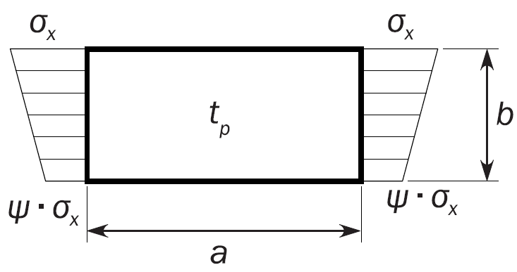 | $1 \geq \psi \geq 0$ | $K _{x} = F _{long} \frac{8.4}{\psi +1.1}$ |   | When $\sigma _{x} \leq 0$ : $C _{x} = 1$ When $\sigma _{x} >0$: $C _{x} = 1$ for $\lambda \leq \lambda _{c}$ $C _{x} = c \left( \frac{1}{\lambda} - \frac{0.22}{\lambda ^{2}} \right)$ for $\lambda >\lambda _{c}$ where : $c = \left( 1.25-0.12 \psi \right) \leq 1.25$ $\lambda _{c} = \frac{c}{2} \left( 1+ \sqrt {1- \frac{0.88}{c}} \right)$ |
    |   | $0> \psi >-1$ | $K _{x} = F _{long} [7.63- \psi \left( 6.26-10 \psi \right) ]$ |   | When $\sigma _{x} \leq 0$ : $C _{x} = 1$ When $\sigma _{x} >0$: $C _{x} = 1$ for $\lambda \leq \lambda _{c}$ $C _{x} = c \left( \frac{1}{\lambda} - \frac{0.22}{\lambda ^{2}} \right)$ for $\lambda >\lambda _{c}$ where : $c = \left( 1.25-0.12 \psi \right) \leq 1.25$ $\lambda _{c} = \frac{c}{2} \left( 1+ \sqrt {1- \frac{0.88}{c}} \right)$ |
    |   | $\psi \leq -1$ | $K _{x} = F _{long} [5.975 \left( 1- \psi \right) ^{2} ]$ |   | When $\sigma _{x} \leq 0$ : $C _{x} = 1$ When $\sigma _{x} >0$: $C _{x} = 1$ for $\lambda \leq \lambda _{c}$ $C _{x} = c \left( \frac{1}{\lambda} - \frac{0.22}{\lambda ^{2}} \right)$ for $\lambda >\lambda _{c}$ where : $c = \left( 1.25-0.12 \psi \right) \leq 1.25$ $\lambda _{c} = \frac{c}{2} \left( 1+ \sqrt {1- \frac{0.88}{c}} \right)$ |
    | 2 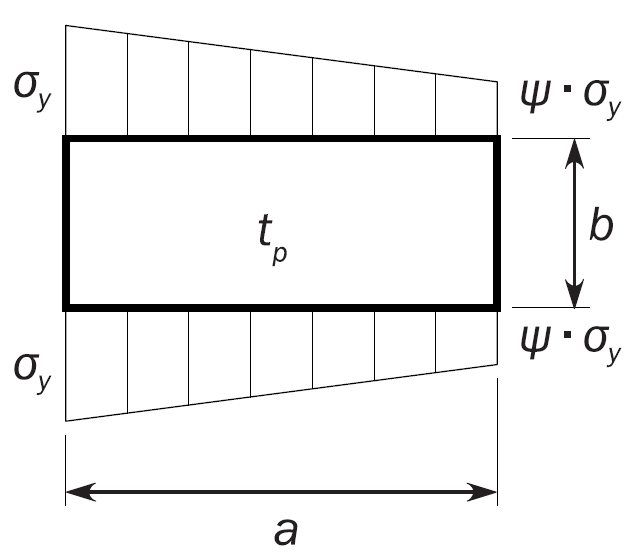 | $1 \geq \psi \geq 0$ | $K _{y} =F _{tran} \frac{2 \left( 1 + \frac{1}{\alpha ^{2}} \right) ^{2}}{1+ \psi + \frac{(1- \psi )}{100} \left( \frac{2.4}{\alpha ^{2}} + 6.9 f _{1} \right)}$ |   | When $\sigma _{y} \leq 0$: $C _{y} =1$ when $\sigma _{y} >0$ $C _{y} = c \left( \frac{1}{\lambda} - \frac{R+F ^{2} \left( H-R \right)}{\lambda ^{2}} \right)$ where: $c = \left( 1.25-0.12 \psi \right) \leq 1.25$ $R = \lambda (1- \lambda /c)$ for $\lambda <\lambda_c$ $R = 0.22$ for$\lambda \geq \lambda_c$ $\lambda _{c} = 0.5c \left( 1+ \sqrt {1-0.88/c} \right)$ $F = \left[ 1- \left( \frac{K}{0.91} -1 \right) / \lambda _{p} ^{2} \right] c _{1} \geq 0$ $\lambda _{p} ^{2} = \lambda ^{2} -0.5$ for $1 \leq \lambda _{p} ^{2} \leq 3$ $c _{1} = \left( 1 - \frac{1}{\alpha} \right) \geq 0$ $H = \lambda - \frac{2 \lambda}{c \left( T+ \sqrt {T ^{2} -4} \right)} \geq R$ $T = \lambda + \frac{14}{15 \lambda} + \frac{1}{3}$ |
    |   | $1 \geq \psi \geq 0$ | $\alpha$ ≤ 6 | $f _{1} = (1- \psi ) ( \alpha - 1)$ | When $\sigma _{y} \leq 0$: $C _{y} =1$ when $\sigma _{y} >0$ $C _{y} = c \left( \frac{1}{\lambda} - \frac{R+F ^{2} \left( H-R \right)}{\lambda ^{2}} \right)$ where: $c = \left( 1.25-0.12 \psi \right) \leq 1.25$ $R = \lambda (1- \lambda /c)$ for $\lambda <\lambda_c$ $R = 0.22$ for$\lambda \geq \lambda_c$ $\lambda _{c} = 0.5c \left( 1+ \sqrt {1-0.88/c} \right)$ $F = \left[ 1- \left( \frac{K}{0.91} -1 \right) / \lambda _{p} ^{2} \right] c _{1} \geq 0$ $\lambda _{p} ^{2} = \lambda ^{2} -0.5$ for $1 \leq \lambda _{p} ^{2} \leq 3$ $c _{1} = \left( 1 - \frac{1}{\alpha} \right) \geq 0$ $H = \lambda - \frac{2 \lambda}{c \left( T+ \sqrt {T ^{2} -4} \right)} \geq R$ $T = \lambda + \frac{14}{15 \lambda} + \frac{1}{3}$ |
    |   | $1 \geq \psi \geq 0$ | $\alpha$ > 6 | $f _{1} = 0.6 \left( 1- \frac{6 \psi}{\alpha} \right) \left( \alpha + \frac{14}{\alpha} \right)$, But not greater than $14.5 - \frac{0.35}{\alpha ^{2}}$ | When $\sigma _{y} \leq 0$: $C _{y} =1$ when $\sigma _{y} >0$ $C _{y} = c \left( \frac{1}{\lambda} - \frac{R+F ^{2} \left( H-R \right)}{\lambda ^{2}} \right)$ where: $c = \left( 1.25-0.12 \psi \right) \leq 1.25$ $R = \lambda (1- \lambda /c)$ for $\lambda <\lambda_c$ $R = 0.22$ for$\lambda \geq \lambda_c$ $\lambda _{c} = 0.5c \left( 1+ \sqrt {1-0.88/c} \right)$ $F = \left[ 1- \left( \frac{K}{0.91} -1 \right) / \lambda _{p} ^{2} \right] c _{1} \geq 0$ $\lambda _{p} ^{2} = \lambda ^{2} -0.5$ for $1 \leq \lambda _{p} ^{2} \leq 3$ $c _{1} = \left( 1 - \frac{1}{\alpha} \right) \geq 0$ $H = \lambda - \frac{2 \lambda}{c \left( T+ \sqrt {T ^{2} -4} \right)} \geq R$ $T = \lambda + \frac{14}{15 \lambda} + \frac{1}{3}$ |

    | Case | Stress ratio $\psi$ | Stress ratio $\psi$ and Buckling factor $K$ | Reduction factor $C$ |
    | --- | --- | --- | --- |
    | 2  | $0> \psi \geq 1- \frac{4 \alpha}{3}$ | $K _{y} = \frac{200 F _{tran} (1+ \beta ^{2} ) ^{2}}{(1-f _{3} ) (100+2.4 \beta ^{2} +6.9 f _{1} +23f _{2} )}$ |   |
    |   | $0> \psi \geq 1- \frac{4 \alpha}{3}$ | Stress ratio $\psi$ : $\alpha$ > $6(1- \psi )$ |   |
    |   | $0> \psi \geq 1- \frac{4 \alpha}{3}$ | $f _{1} = 0.6 \left( \frac{1}{\beta} + 14 \beta \right)$, But not greater than $14.5 - 0.35 \beta ^{2}$ $f _{2} = f _{3} =0$ |   |
    |   | $0> \psi \geq 1- \frac{4 \alpha}{3}$ | Stress ratio $\psi$ : $3(1- \psi ) \leq \alpha \leq 6(1- \psi )$ |   |
    |   | $0> \psi \geq 1- \frac{4 \alpha}{3}$ | $f _{1} = \frac{1}{\beta} - 1$ $f _{2} = f _{3} =0$ |   |
    |   | $0> \psi \geq 1- \frac{4 \alpha}{3}$ | Stress ratio $\psi$ : $1.5(1- \psi ) \leq \alpha < 3(1- \psi )$ |   |
    |   | $0> \psi \geq 1- \frac{4 \alpha}{3}$ | $f _{1} = \frac{1}{\beta} - \left( 2 - w \beta \right) ^{4} - 9 \left( w \beta -1 \right) \left( \frac{2}{3} - \beta \right)$ $f _{2} = f _{3} =0$ |   |
    |   | $0> \psi \geq 1- \frac{4 \alpha}{3}$ | Stress ratio $\psi$ : $1- \psi \leq \alpha < 1.5(1- \psi )$ |   |
    |   | $0> \psi \geq 1- \frac{4 \alpha}{3}$ | • For $\alpha > 1.5$: $f _{1} = 2 \left( \frac{1}{\beta} - 16 \left( 1 - \frac{\omega}{3} \right) ^{4} \right) \left( \frac{1}{\beta} - 1 \right)$ $f _{2} = 3 \beta - 2$ $f _{3} = 0$ • For $\alpha \leq 1.5$: $f _{1} = 2 \left( \frac{1.5}{1 - \psi} - 1 \right) \left( \frac{1}{\beta} - 1 \right)$ $f _{2} = \frac{\psi (1- 16f _{4} ^{2} )}{1 - \alpha}$ $f _{3} = 0$ $f _{4} = (1.5 - RMMin(1.5; \alpha )) ^{2}$ |   |
    |   | $0> \psi \geq 1- \frac{4 \alpha}{3}$ | Stress ratio $\psi$ : $0.75(1- \psi ) \leq \alpha <1- \psi$ |   |
    |   | $0> \psi \geq 1- \frac{4 \alpha}{3}$ | $f _{1} =0$ $f _{2} =1+2.31( \beta -1)-48(4/3- \beta )f _{4} ^{2}$ $f _{3} =3f _{4} ( \beta -1) \left( \frac{f _{4}}{1.81} - \frac{\alpha -1}{1.31} \right)$ $f _{4} = (1.5 - RMMin(1.5; \alpha )) ^{2}$ |   |
    |   | $\psi <1- \frac{4 \alpha}{3}$ | $K _{y} =5.972F _{tran} \frac{\beta ^{2}}{1-f _{3}}$ $f _{3} =f _{5} \left( \frac{f _{5}}{1.81} + \frac{1+3 \psi}{5.24} \right)$ $f _{5} = \frac{9}{16} (1+\mathrm{Max} (-1 ; \psi )) ^{2}$ |   |

    | Case | Stress ratio $\psi$ |   | Aspect ratio $\alpha$ |   | Buckling factor $K$ | Reduction factor $C$ |   |
    | --- | --- | --- | --- | --- | --- | --- | --- |
    | 3 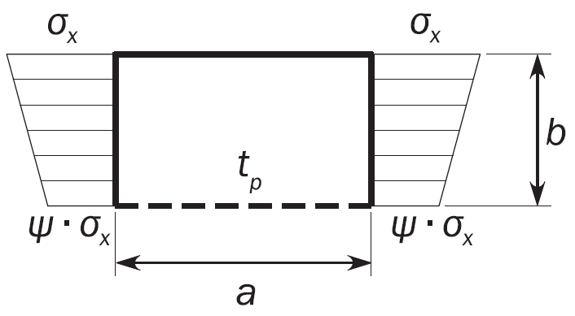 | $1\geq \psi \geq 0$ |   | $K _{x} = \frac{4 \left( 0.425+1/ \alpha ^{2} \right)}{3 \psi +1}$ |   |   | For UP-A $C _{x} = 1$ for #eqnID-47280.75 $C _{x} = \frac{0.75}{\lambda}$for #eqnID-47300.75 For UP-B $C _{x} = 1$ for #eqnID-47320.7 $C _{x} = \frac{1}{\lambda ^{2} +0.51}$ for $\lambda >0.7$ |   |
    |   | $0>\psi \geq -1$ |   | $K _{x} = 4 \left( 0.425+1/ \alpha ^{2} \right) \left( 1+ \psi \right) -5 \psi (1-3.42 \psi )$ |   |   | For UP-A $C _{x} = 1$ for #eqnID-47280.75 $C _{x} = \frac{0.75}{\lambda}$for #eqnID-47300.75 For UP-B $C _{x} = 1$ for #eqnID-47320.7 $C _{x} = \frac{1}{\lambda ^{2} +0.51}$ for $\lambda >0.7$ |   |
    | 4 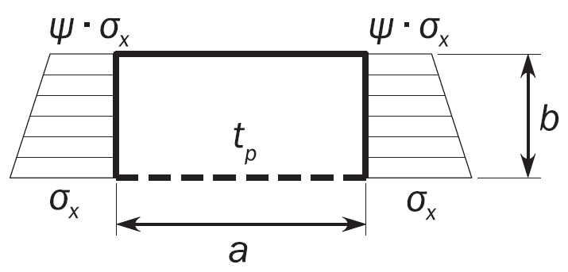 | $1 \geq \psi \geq -1$ |   | $K _{x} = \left( 0.425+ \frac{1}{\alpha ^{2}} \right) \frac{3- \psi}{2}$ |   |   | For UP-A $C _{x} = 1$ for #eqnID-47280.75 $C _{x} = \frac{0.75}{\lambda}$for #eqnID-47300.75 For UP-B $C _{x} = 1$ for #eqnID-47320.7 $C _{x} = \frac{1}{\lambda ^{2} +0.51}$ for $\lambda >0.7$ |   |
    | 5 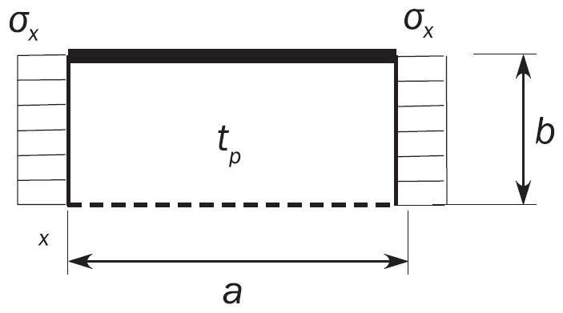 | - |   | $\alpha \geq 1.64$ |   | $K _{x} = 1.28$ | For UP-A $C _{x} = 1$ for #eqnID-47280.75 $C _{x} = \frac{0.75}{\lambda}$for #eqnID-47300.75 For UP-B $C _{x} = 1$ for #eqnID-47320.7 $C _{x} = \frac{1}{\lambda ^{2} +0.51}$ for $\lambda >0.7$ |   |
    |   | - |   | $0< \alpha <1.64$ |   | $K _{x} = \frac{1}{\alpha ^{2}} + 0.56 + 0.13 \alpha ^{2}$ | For UP-A $C _{x} = 1$ for #eqnID-47280.75 $C _{x} = \frac{0.75}{\lambda}$for #eqnID-47300.75 For UP-B $C _{x} = 1$ for #eqnID-47320.7 $C _{x} = \frac{1}{\lambda ^{2} +0.51}$ for $\lambda >0.7$ |   |
    | 6 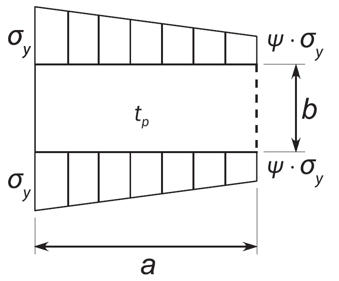 | $1 \geq \psi \geq 0$ |   | $K _{y} = \frac{4(0.425+ \alpha ^{2} )}{(3 \psi +1) \alpha ^{2}}$ |   |   | For UP-A $C _{x} = 1$ for #eqnID-47460.75 $C _{x} = \frac{0.75}{\lambda}$ for #eqnID-47480.75 For UP-B $C _{y} =1$ for $\lambda \leq 0.7$ $C _{y} = \frac{1}{\lambda ^{2} +0.51}$ for $\lambda >0.7$ |   |
    |   | $0> \psi \geq -1$ |   | $K _{y} =4(0.425+ \alpha ^{2} )(1+ \psi ) \frac{1}{\alpha ^{2}} -5 \psi (1-3.42 \psi ) \frac{1}{\alpha ^{2}}$ |   |   | For UP-A $C _{x} = 1$ for #eqnID-47460.75 $C _{x} = \frac{0.75}{\lambda}$ for #eqnID-47480.75 For UP-B $C _{y} =1$ for $\lambda \leq 0.7$ $C _{y} = \frac{1}{\lambda ^{2} +0.51}$ for $\lambda >0.7$ |   |
    | 7 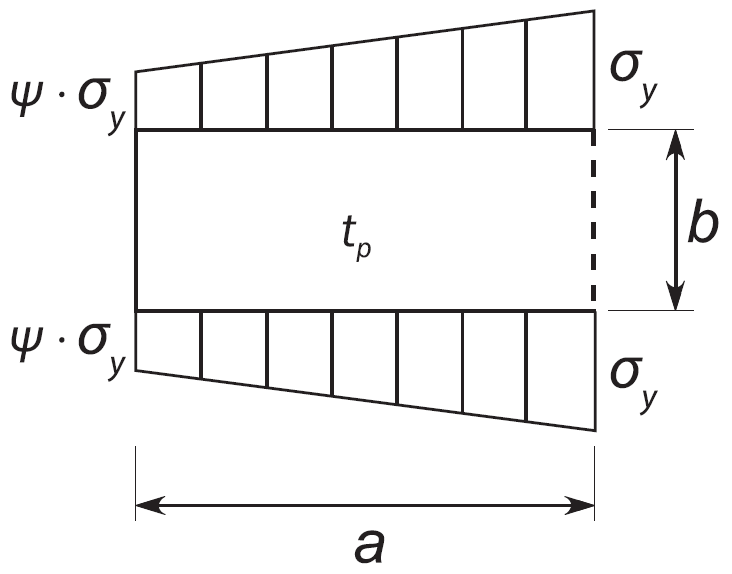 | $1 \geq \psi \geq -1$ |   | $K _{y} =(0.425+ \alpha ^{2} ) \frac{(3- \psi )}{2 \alpha ^{2}}$ |   |   | For UP-A $C _{x} = 1$ for #eqnID-47460.75 $C _{x} = \frac{0.75}{\lambda}$ for #eqnID-47480.75 For UP-B $C _{y} =1$ for $\lambda \leq 0.7$ $C _{y} = \frac{1}{\lambda ^{2} +0.51}$ for $\lambda >0.7$ |   |
    | 8 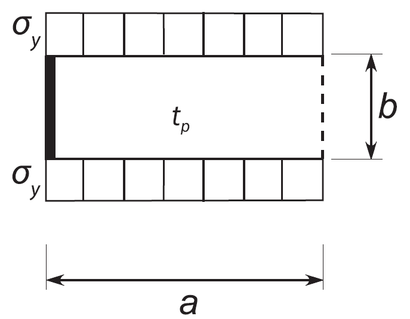 | - |   | $K _{y} =1+ \frac{0.56}{\alpha ^{2}} + \frac{0.13}{\alpha ^{4}}$ |   |   | For UP-A $C _{x} = 1$ for #eqnID-47460.75 $C _{x} = \frac{0.75}{\lambda}$ for #eqnID-47480.75 For UP-B $C _{y} =1$ for $\lambda \leq 0.7$ $C _{y} = \frac{1}{\lambda ^{2} +0.51}$ for $\lambda >0.7$ |   |

    | Case | Stress ratio $\psi$ | Aspect ratio $\alpha$ | Buckling factor $K$ | Reduction factor $C$ |
    | --- | --- | --- | --- | --- |
    | 9 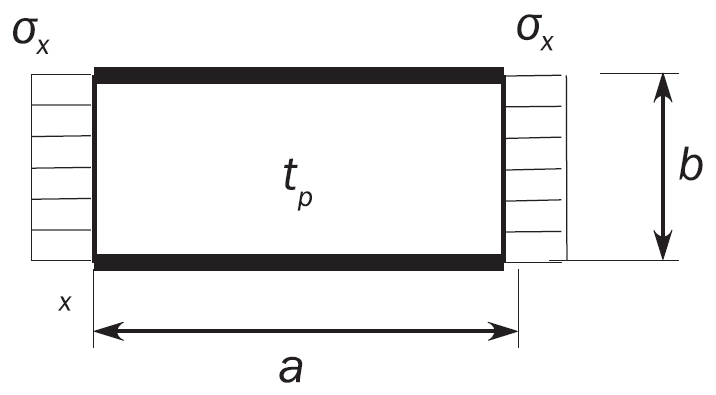 | - | $K _{x} = 6.97$ |   | $C _{x} = 1$ for $\lambda \leq 0.83$ $C _{x} =1. 13 \left( \frac{1}{\lambda} - \frac{0.22}{\lambda ^{2}} \right)$ for $\lambda >0.83$ |
    | 10 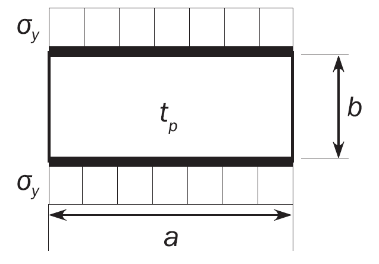 | - | $K _{y} = 4 + \frac{2.07}{\alpha ^{2}} + \frac{0.67}{\alpha ^{4}}$ |   | $C _{x} = 1$ for $\lambda \leq 0.83$ $C _{x} =1. 13 \left( \frac{1}{\lambda} - \frac{0.22}{\lambda ^{2}} \right)$ for $\lambda >0.83$ |
    | 11 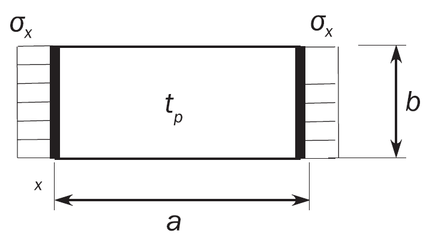 | - | $\alpha \geq 4$ | $K _{x} =4$ | $C _{x} = 1$ for $\lambda \leq 0.83$ $C _{x} =1. 13 \left( \frac{1}{\lambda} - \frac{0.22}{\lambda ^{2}} \right)$ for $\lambda >0.83$ |
    |   | - | $\alpha < 4$ | $K _{x} = 4 + 2.74 \left[ \frac{4 - \alpha}{3} \right] ^{4}$ | $C _{x} = 1$ for $\lambda \leq 0.83$ $C _{x} =1. 13 \left( \frac{1}{\lambda} - \frac{0.22}{\lambda ^{2}} \right)$ for $\lambda >0.83$ |
    | 12 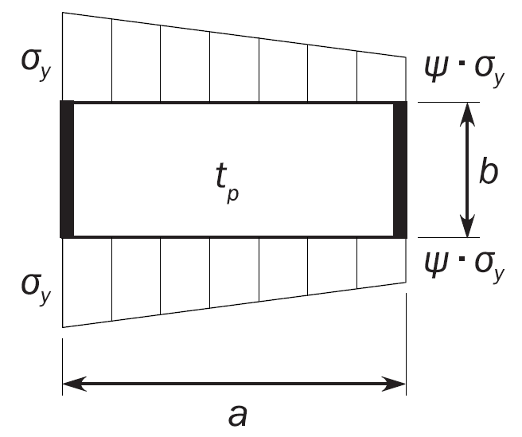 | - | $K _{y} = K _{y}$ determined as per case 2 |   | $C _{y} = C _{y2}$ for $\alpha < 2$ $C _{y} = \left( 1.06 + \frac{1}{10 \alpha} \right) C _{y2}$ for $\alpha \geq 2$ where: $C _{y2} =C _{y}$ determined as per case 2 |
    | 13 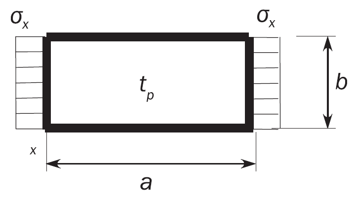 | - | $\alpha \geq 4$ | $K _{x} =6.97$ | $C _{x} = 1$ for $\lambda \leq 0.83$ $C _{x} =1. 13 \left( \frac{1}{\lambda} - \frac{0.22}{\lambda ^{2}} \right)$ for $\lambda >0.83$ |
    |   | - | $\alpha < 4$ | $K _{x} = 6.97 +3.1 \left[ \frac{4 - \alpha}{3} \right] ^{4}$ | $C _{x} = 1$ for $\lambda \leq 0.83$ $C _{x} =1. 13 \left( \frac{1}{\lambda} - \frac{0.22}{\lambda ^{2}} \right)$ for $\lambda >0.83$ |
    | 14 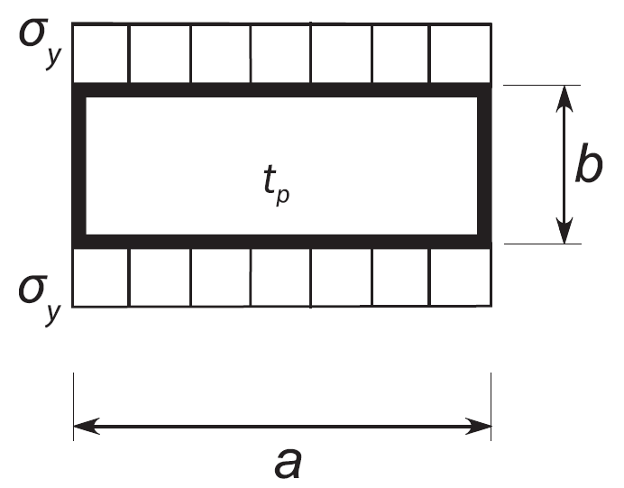 | - | $K _{y} = \frac{6.97}{\alpha ^{2}} + \frac{3.1}{\alpha ^{2}} \left( \frac{4-1/ \alpha}{3} \right) ^{4}$ |   | $C _{y} = 1$ for $\lambda \leq 0.83$ $C _{y} =1. 13 \left( \frac{1}{\lambda} - \frac{0.22}{\lambda ^{2}} \right)$ for $\lambda >0.83$ |

    | Case | Stress ratio $\psi$ | Aspect ratio $\alpha$ | Buckling factor $K$ | Reduction factor $C$ |
    | --- | --- | --- | --- | --- |
    | 15 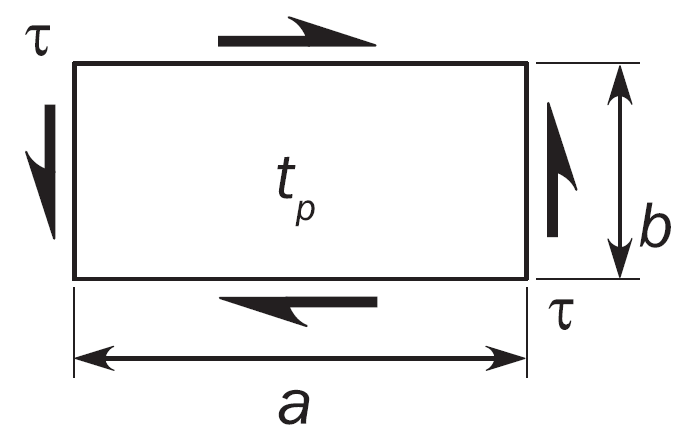 | - | $K _{\tau } = \sqrt {3} \left[ 5.34 + \frac{4}{\alpha ^{2}} \right]$ |   | $C _{\tau } =1$ for $\lambda \leq 0.84$ $C _{\tau } = \frac{0.84}{\lambda}$ for $\lambda >0.84$ |
    | 16 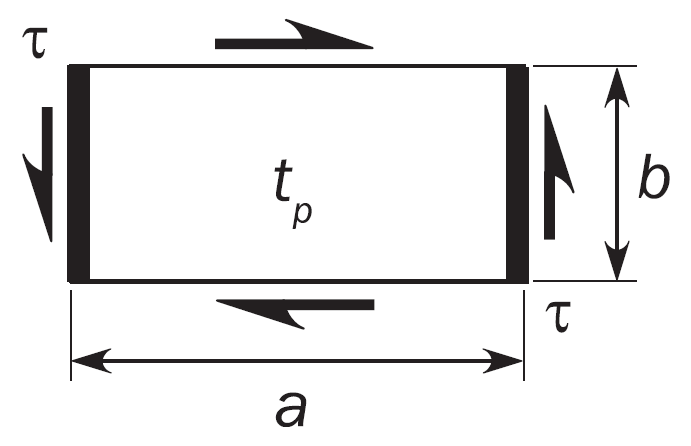 | - | $K _{\tau } = \sqrt {3} \left\{ 5.34 + Max \left[ \frac{4}{\alpha ^{2}} ; \frac{7.15}{\alpha ^{2.5}} \right] \right\}$ |   | $C _{\tau } =1$ for $\lambda \leq 0.84$ $C _{\tau } = \frac{0.84}{\lambda}$ for $\lambda >0.84$ |
    | 17 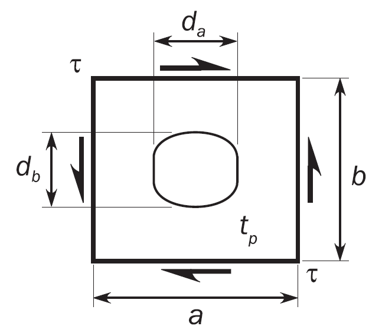 | - | $K _{\tau } = K _{\tau case15} r$ $K _{\tau case15} =K _{\tau}$ according to case 15 $r$: opening reduction factor taken as $r = \left( 1 - \frac{d _{a}}{a} \right) \left( 1 - \frac{d _{b}}{b} \right)$ with $\frac{d _{a}}{a} \leq 0.7$and $\frac{d _{b}}{b} \leq 0.7$ |   | $C _{\tau } =1$ for $\lambda \leq 0.84$ $C _{\tau } = \frac{0.84}{\lambda}$ for $\lambda >0.84$ |
    | 18 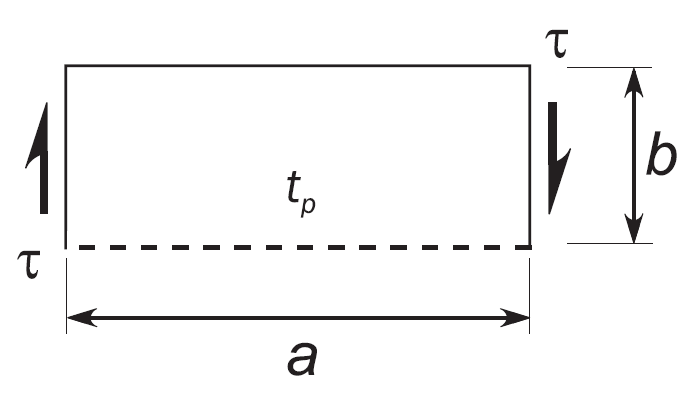 | - | $K _{\tau } =3 ^{0.5} \left( 0.6+4/ \alpha ^{2} \right)$ |   | $C _{\tau } =1$ for $\lambda \leq 0.84$ $C _{\tau } = \frac{0.84}{\lambda}$ for $\lambda >0.84$ |
    | 19 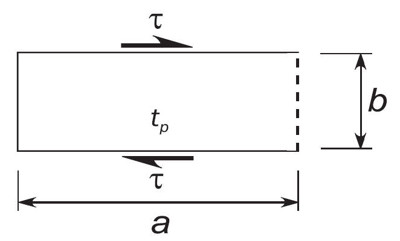 | - | $K _{\tau } =8$ |   | $C _{\tau } =1$ for $\lambda \leq 0.84$ $C _{\tau } = \frac{0.84}{\lambda}$ for $\lambda >0.84$ |
    | Edge boundary conditions : ------ Plate edge free. Plate edge simply supported. Plate edge clamped. |   |   |   |   |
    | Notes: 1) Cases listed are general cases. Each stress component($\sigma _{x }$,$\sigma _{y}$) is to be understood in local coordinates. |   |   |   |   |

    | Case | Aspect ratio | Buckling factor $K$ | Reduction factor $C$ |
    | --- | --- | --- | --- |
    | 1 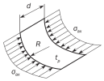 | $\frac{d}{R} \leq 0.5 \sqrt {\frac{R}{t _{p}}}$ | $K=1+ \frac{2}{3} \frac{d ^{2}}{R t _{p}}$ | For general application: $C _{ax} =1$ for $\lambda \leq 0.25$ $C _{ax} =1.233-0.933 \lambda$ for $0.25< \lambda \leq 1$ $C _{ax} =0.3/ \lambda ^{3}$ for $1< \lambda \leq 1.5$ $C _{ax} =0.2/ \lambda ^{2}$ for $\lambda >1.5$ For curved single fields, e.g. bilge strake, which are bounded by plane panels: $C _{ax} = \frac{0.65}{\lambda ^{2}} \leq 1.0$ |
    |   | $\frac{d}{R} >0.5 \sqrt {\frac{R}{t _{p}}}$ | $K=0.267 \frac{d ^{2}}{R t _{p}} [3- \frac{d}{R} \sqrt {\frac{t _{p}}{R}} ] \geq 0.4 \frac{d ^{2}}{R t _{p}}$ | For general application: $C _{ax} =1$ for $\lambda \leq 0.25$ $C _{ax} =1.233-0.933 \lambda$ for $0.25< \lambda \leq 1$ $C _{ax} =0.3/ \lambda ^{3}$ for $1< \lambda \leq 1.5$ $C _{ax} =0.2/ \lambda ^{2}$ for $\lambda >1.5$ For curved single fields, e.g. bilge strake, which are bounded by plane panels: $C _{ax} = \frac{0.65}{\lambda ^{2}} \leq 1.0$ |
    | 2a 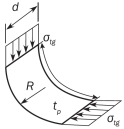 2b $\sigma _{tg} = \frac{p _{e } . R}{t _{p}}$ 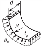 $p _{e } =$ external pressure in [N/mm^2] | $\frac{d}{R} \leq 1.63 \sqrt {\frac{R}{t _{p}}}$ | $K= \frac{d}{\sqrt {R t _{p}}} +3 \frac{(R t _{p} ) ^{0.175}}{d ^{0.35}}$ | For general application: $C _{tg} =1$ for $\lambda \leq 0.4$ $C _{tg} =1.274-0.686 \lambda$ for $0.4 \prec \lambda \leq 1.2$ $C _{tg} =0.65/ \lambda ^{2}$ for $\lambda \succ 1.2$ For curved single fields, e.g. bilge strake, which are bounded by plane panels: $C _{tg} = \frac{0.8}{\lambda ^{2}} \leq 1.0$ |
    |   | $\frac{d}{R} \succ 1.63 \sqrt {\frac{R}{t _{p}}}$ | $K=0.3 \frac{d ^{2}}{R ^{2}} +2.25( \frac{R ^{2}}{d t _{p}} ) ^{2}$ | For general application: $C _{tg} =1$ for $\lambda \leq 0.4$ $C _{tg} =1.274-0.686 \lambda$ for $0.4 \prec \lambda \leq 1.2$ $C _{tg} =0.65/ \lambda ^{2}$ for $\lambda \succ 1.2$ For curved single fields, e.g. bilge strake, which are bounded by plane panels: $C _{tg} = \frac{0.8}{\lambda ^{2}} \leq 1.0$ |
    | 3 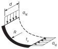 | $\frac{d}{R} \leq \sqrt {\frac{R}{t _{p}}}$ | $K = \frac{0.6 d}{\sqrt {R t _{p}}} + \frac{\sqrt {R t _{p}}}{d} -0.3 \frac{R t _{p}}{d ^{2}}$ | As in load case 2a. |
    |   | $\frac{d}{R} \succ \sqrt {\frac{R}{t _{p}}}$ | $K=0.3 \frac{d ^{2}}{R ^{2}} +0.291( \frac{R ^{2}}{d t _{p}} ) ^{2}$ | As in load case 2a. |
    | 4 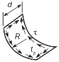 | $\frac{d}{R} \leq 8.7 \sqrt {\frac{R}{t _{p}}}$ | $K= \sqrt {3} \sqrt {28.3 + \frac{0.67 d ^{3}}{R ^{1.5} t _{p} ^{1.5}}}$ | $C _{\tau } =1$ for $\lambda \leq 0.4$ $C _{\tau } =1.274-0.686 \lambda$ for $0.4 \prec \lambda \leq 1.2$ $C _{\tau} = \frac{0.65}{\lambda ^{2}}$ for $\lambda \succ 1.2$ |
    |   | $\frac{d}{R} \succ 8.7 \sqrt {\frac{R}{t _{p}}}$ | $K _{} = \sqrt {3} \frac{0.28 d ^{2}}{R \sqrt {R t _{p}}}$ | $C _{\tau } =1$ for $\lambda \leq 0.4$ $C _{\tau } =1.274-0.686 \lambda$ for $0.4 \prec \lambda \leq 1.2$ $C _{\tau} = \frac{0.65}{\lambda ^{2}}$ for $\lambda \succ 1.2$ |
    | Explanations for boundary conditions: ------ Plate edge free. Plate edge simply supported. Plate edge clamped. |   |   |   |
- **2.3** **tiffeners**
  - **2.3.1** **Buckling modes**
    The following buckling modes are to be checked:
    - **a)** Stiffener induced failure (SI)
    - **b)** Associated plate induced failure (PI)
  - **2.3.2** **Web thickness of flat bar (2023)**
    For accounting the decrease of the stiffness due to local lateral deformation, the effective web thickness of flat bar stiffener, in mm, is to be used in #underline{[}2.1] and **[2.3.4]** for the calculation of the net sectional area, $A _{s}$, the net section modulus, $Z$, and the moment of inertia, $I$, of the stiffener and is taken as:
    $t _\mathrm{w-red it} =t _\mathrm{w it} \left( 1- \frac{2 \pi ^{2}}{3} \left( \frac{h _\mathrm{w it}}{s} \right) ^{2} \left( 1- \frac{b _{eff1}}{s} \right) \right)$
  - **2.3.3** **Idealisation of bulb profile**
    Bulb profiles may be considered as equivalent angle profiles, as defined in **Ch 3, Sec 7, [1.4.1]**.
  - **2.3.4** **Ultimate buckling capacity (2023)**
    When $\sigma _{a} + \sigma _{b} + \sigma _{w} >0$ while initially setting $\gamma=1$, the ultimate buckling capacity for stiffeners is to be checked according to the following interaction formula:
    $\frac{\gamma _{c} \sigma _{a} + \sigma _{b} + \sigma _{w}}{R _{eH}} = 1$
    where:
    $\sigma _{a}$ : Effective axial stress, in N/mm^2, at mid-span of the stiffener, acting on the stiffener with its attached plating.
    $\sigma _{a} = \sigma _{x} \frac{s t _{p} +A _{s}}{b _{eff 1} t _{p} +A _{s}}$
    $\sigma _{x}$ : Nominal axial stress, in N/mm^2, acting on the stiffener with its attached plating.
    • For FE analysis, $\sigma _{x}$ is the FE corrected stress as defined in **[2.3.6]** in the attached plating in the direction of the stiffener axis.
    • For prescriptive assessment, $\sigma _{x}$ is the axial stress calculated according to **Ch 8, Sec 3, [2.2.1]** at load calculation point of the stiffener, as defined in **Ch 3, Sec 7, [3]**.
    • For grillage beam analysis, $\sigma _{x}$ is the stress acting along the x-axis of the attached buckling panel.
    $R _{eH}$ : Specified minimum yield stress of the material, in N/mm^2:
    $\sigma _{b}$ : Bending stress in the stiffener, in N/mm^2:
    $\sigma _{b} = \frac{M _{0} +M _{1} +M _{2}}{Z \times 10 ^{3}}$
    $Z$ : Net section modulus of stiffener, in cm^3, including effective width of plating according to **[2.3.5]**, to be taken as:
    • The section modulus calculated at the top of stiffener flange for stiffener induced failure (SI).
    • The section modulus calculated at the attached plating for plate induced failure (PI).
    $M _{2}$ : Bending moment, in Nmm, due to eccentricity of sniped stiffeners, to be taken as:
    $M _{2}$ = 0 for continuous stiffeners.
    $M _{2} =C _{snip } w _{na} \gamma \sigma _{x} (A _{p} +A _{s} )$ for stiffeners sniped at one or both ends.
    $C _{snip}$ : Coefficient to account for the end effect of the stiffener sniped at one or both ends, to be taken as:
    $C _{snip}$ = -1.2 for stiffener induced failure (SI).
    $C _{snip}$ = 1.2 for plate induced failure (PI).
    $C _{"\Pi " }$ : Plate induced failure pressure coefficient:
    $C_{"\Pi "}=1$ if the lateral pressure is applied on the side opposite to the stiffener.
    $C _{"\Pi "}=-1$ if the lateral pressure is applied on the same side as the stiffener.
    $C _{SI}$ : Stiffener induced failure pressure coefficient:
    $C _{S"I"} =-1$ if the lateral pressure is applied on the side opposite to the stiffener.
    $C _{S"I"} =1$ if the lateral pressure is applied on the same side as the stiffener.
    $M _{1}$ : Bending moment, in Nmm, due to the lateral load $P$:
    $M _{1} =C _{i} \frac{P  s \ell ^{2}}{24 \times 10 ^{3}}$ for continuous stiffener
    $M _{1} =C _{i} \frac{P  s \ell ^{2}}{8 \times 10 ^{3}}$ for sniped stiffener
    $M _{1} =C _{i} \frac{P  s \ell ^{2}}{14.2 \times 10 ^{3}}$ for stiffeners sniped at one end and continuous at other end.
    $P$ : Lateral load, in kN/m^2.
    • For FE analysis, $P$ is the average pressure as defined in **Ch 8, Sec 4, [2.5.2]** in the attached plating.
    • For prescriptive assessment, $P$ is the pressure calculated at load calculation point of the stiffener, as defined in **Ch 3, Sec 7, [3]**.
    $C _{i}$ : Pressure coefficient:
    $C _{i} =C _{SI}$ for stiffener induced failure (SI).
    $C _{i} =C _{"\Pi "}$ for plate induced failure (PI).
    $M _{0}$ : Bending moment (Nmm) due to the lateral deformation, $w$ of stiffener:
    $M _{0} =F _{E} C _{sl} \frac{\gamma it}{\gamma _{"GEB"} - \gamma} w _{0}$ with precondition $\gamma _{"GEB"} - \gamma >0$
    $\gamma _{"GEB"}$ : Stress multiplier factor of global elastic buckling capacity as defined in [2.1].
    $C _{sl}$ : Deformation reduction factor to account for global slenderness, to be taken as:
    $C _{sl} =1- \frac{1}{12} \lambda _{G} ^{4}$ for #eqnID-49071_s0.56
    $C _{sl} =3/ \lambda _{G}^{4}$ for #eqnID-49091_s0.56
    $\lambda _{G}$ : The reference degree of global slenderness of the stiffened panel, to be taken as:
    $\lambda _{G} = \sqrt {\frac{\gamma _{ReH}}{\gamma _{"GEB"}}}$ and $\gamma _{ReH} = \frac{\min(R _{eH"_"P } ,R _{eH"_"S} )}{\sqrt {\sigma _{x,av}^{2} + \sigma _{y}^{2} - \sigma _{x,av} \sigma _{y} +3 \tau _{xy}^{2}}}$
    $\sigma _{x,av}$ : Average stress for both plate and stiffener as defiend in [2.1.2]
    $F_E$ : Ideal elastic buckling force of the stiffener, in N.
    $F _{E} =( \frac{\pi}{\ell } ) ^{2} E I 10 ^{4}$
    $I$ : Moment of inertia, in cm^4, of the stiffener including effective width of attached plating according to **[2.3.5]**. $I$ is to comply with the following requirement:
    $I \geq \frac{s t _{p} ^{3}}{12 \times 10 ^{4}}$
    $t _{p}$ : Net thickness of plate, in mm, to be taken as
    • For prescriptive requirements: the mean thickness of the two attached plating panels,
    • For FE analysis: the thickness of the considered EPP on one side of the stiffener.
    $\mathrm{w} _{0}$ : Assumed imperfection, in mm, taken equal to:
    $\mathrm{w} _{0} = \ell 10 ^{-3}$
    $\sigma _{\mathrm{w}}$ : The stress due to torsional deformation, in N/mm^2, is to be taken equal to:
    For stiffener induced failure (SI)
    $\sigma _{a} >$ 0
    $\sigma _\mathrm{w it} =E y _\mathrm{w it} e _{f} \Phi _{0} \left( \frac{m _{tor} \pi}{\ell _{tor}} \right) ^{2} \left( \frac{1}{1- \frac{\gamma \sigma _{a}}{\sigma _{ET}}} -1 \right)$ with precondition $\sigma _{ET} - \gamma \sigma _{a} >$ 0
    $\sigma _{a} >$ 0
    $\sigma _{RMw} =0$
    For plate induced failure (PI)
    $\sigma _{RMw} =0$
    $y _{\mathrm{w}}$ : Distance, in mm, from centroid of stiffener cross-section to the free edge of stiffener flange, to be taken as:
    $y _{\mathrm{w}} = \frac{t _{\mathrm{w}}}{2}$ for flat bar
    $y _{\mathrm{w}} _\mathrm{} =b _{f} - \frac{h _\mathrm{w it} t _\mathrm{w it} ^{2} +t _{f} b _{f} ^{2}}{2A _{s}}$ for angle and bulb profiles
    $y _{\mathrm{w}} =b _{f-out} +0.5t _{\mathrm{w}} - \frac{h _{\mathrm{w}} t _{\mathrm{w}} ^{2} +t _{f} ( b _{f} ^{2} -2b _{f} d _{f} )}{2A _{s}}$ for L2 profile
    $y _{\mathrm{w}} =b _{f-out} +0.5t _{\mathrm{w}} - \frac{(h _{\mathrm{w}} -t _{f} ) t _{\mathrm{w}} ^{2} +t _{f} ( b _{f} +t _{\mathrm{w}} ) ^{2}}{2A _{s}}$ for L3 profile
    $y _{\mathrm{w}} = \frac{b _{f}}{2}$ for Tee profile
    $\Phi _{0}$ : Coefficient taken as:
    $\Phi _{0} = \frac{\ell _{tor}}{m _{tor} h _\mathrm{w it}} 10 ^{-4}$
    $\ell _{"tor"}$ : Stiffener span, distance equal to spacing between primary supporting members, i.e. $\ell _{"tor"} = \ell$. When the stiffener is supported by tripping brackets, $\ell _{"tor"}$ should be taken as the maximum spacing between the adjacent primary supporting members and fitted tripping brackets.
    $m _{"tor"}$ : Number of half waves within $\ell _{"tor"}$, taken as a positive integer so as to give smallest reference stress for torsional buckling.
    $\sigma _{ET}$ : Reference stress for torsional buckling, in N/mm^2:
    $\sigma _{ET} = \frac{E}{I _{p}} \left[ \left( \frac{m _{"tor"} \pi}{\ell _{"tor"}} \right) ^{2} I _{w} \cdot 10 ^{2} + \frac{1}{2 \left( 1+ \nu \right)} I _{T} + \left( \frac{\ell _{"tor"}}{m _{"tor"} \pi} \right) ^{2} \epsilon \cdot 10 ^{-4} \right]$
    $I _{P}$ : Net polar moment of inertia of the stiffener, in cm^4, about point C as shown in **Figure 1**, as defined in **Table 5**.
    $I _{T}$ : Net St. Venant’s moment of inertia of the stiffener, in cm^4, as defined in **Table 5**.
    $I _{w}$ : Net sectional moment of inertia of the stiffener, in cm^6, about point C as shown in **Figure 1**, as defined in **Table 5**.
    $\epsilon$ : Degree of fixation.
    $\epsilon = \left( \frac{3b}{t _{p}^{3}} + \frac{2h _{w}}{t _{w}^{3}} \right) ^{-1}$ for bulb, angle, L2, L3 and T profiles
    $\epsilon = \frac{t _{p}^{3}}{3b}$ for flat bars
    $A _{\mathrm{w}}$ : Net web area, in mm^2.
    $A _{f}$ : Net flange area, in mm^2.
    - **a)** $R _{eH } =R _{eH-S}$ for stiffener induced failure (SI)
    - **b)** $R _{eH } =R _{eH-P}$ for plate induced failure (PI)
  - **2.3.5** **Effective width of the attached plating,** $\mathbf{{b _{eff}}}$
    The effective width of the attached plating of a stiffener, $b _{eff}$, in mm, is to be taken as:
    • For $\sigma _{x} >0$:
    • For FE analysis,
    $b _{eff} =itmin(C _{x} b, \chi _{s} s)$
    • For prescriptive assessment,
    $b _{eff} = itmin \left( \frac{C _{x1} b _{1} +C _{x2} b _{2}}{2} , \chi _{s} s \right)$
    • For $\sigma _{x} \leq 0$:
    • $b _{eff} = \chi _{s} s$
    where:
    $\chi _{s}$ : Effective width coefficient to be taken as:
    $\chi _{s} = it \min \left[ 50 \ell +0.6s ; 200 \ell \right]$ or
    $\chi _{s} = s$
    whichever is lesser.
    $\ell _{eff}$ : The effective length of the stiffener, in mm, taken as:
    $\ell _{eff} = \frac{\ell }{\sqrt {3}}$ for stiffener fixed at both ends.
    $\ell _{eff} =0.75 \ell$ for stiffener simply supported at one end and fixed at the other.
    $\ell _{eff} = \ell$ for stiffener simply supported at both ends.
  - **2.3.6** **FE corrected stresses for stiffener capacity (2023)**
    When the reference stresses $\sigma _{x}$ and $\sigma _{y}$ obtained by FE analysis according to **Ch 8, Sec 4, [2.4]** are both compressive, $\sigma _{x}$ is to be corrected according to the following formula :
    • If $\sigma _{x} <\nu \sigma _{y}$ :
    $\sigma _{xcor} =0$
    • If $\sigma _{x} \geq \nu \sigma _{y}$:
    $\sigma _{xcor} = \sigma _{x} - \nu \sigma _{y}$
- **2.4** **Primary supporting members**
  - **2.4.1** **Web plate in way of openings**
    The web plate of primary supporting members with openings is to be assessed for buckling based on the combined axial compressive and shear stresses.
    The web plate adjacent to the opening on both sides is to be considered as individual unstiffened plate panels as shown in **Table 6**.
    The interaction formulae of **[2.2.1]** are to be used with:
    $\sigma _{x} = \sigma _{av}$
    $\sigma _{y} =0$
    $\tau = \tau _{av}$
    where:
    $\sigma _{av}$ : Weighted average compressive stress, in N/mm^2, in the area of web plate being considered, i.e. *P1*, *P2* or *P3* as shown in **Table 6**.
    For the application of the **Table 6**, the weighted average shear stress is to be taken as:
    • Opening modelled in primary supporting members:
    $\tau _{av}$ : Weighted average shear stress, in N/mm^2, in the area of web plate being considered, i.e. *P1*, *P2* or *P3* as shown in **Table 6**.
    • Opening not modelled in primary supporting members:
    $\tau _{av}$ : Weighted average shear stress, in N/mm^2, given in **Table 6**.
  - **2.4.2** **Reduction factors of web plate in way of openings**
    The reduction factors, $C _{x}$ or $C _{y}$ in combination with, $C _{\tau}$ of the plate panel(s) of the web adjacent to the opening is to be taken as shown in **Table 6**.
  - **2.4.3** The equivalent plate panel of web plate of primary supporting members crossed by perpendicular stiffeners is to be idealised as shown in **Figure 2**.
    The correction of panel breadth is applicable also for other slot configurations provided that the web or collar plate is attached to at least one side of the passing stiffener.
    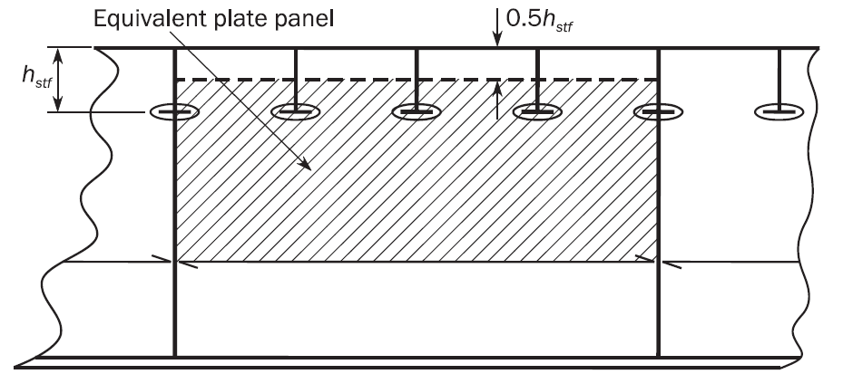
    **Figure : Web plate idealisation**

    | Configuration^1) | $C _{x}$, $C _{y}$ | $C _{\tau }$ |   |
    | --- | --- | --- | --- |
    | Configuration^1) | $C _{x}$, $C _{y}$ | Opening modelled in PSM | Opening not modelled in PSM |
    | (a) Without edge reinforcements: ^2) 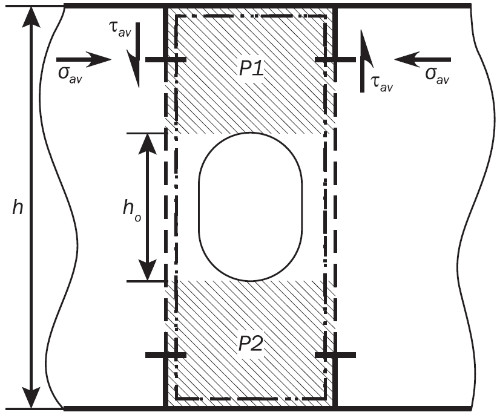 | Separate reduction factors are to be applied to areas *P1* and *P2* using case 3 or case 6 in Table 3, with edge stress ratio: $\psi = 1.0$ | Separate reduction factors are to be applied to areas *P1* and P2 using case 18 or case 19 in **Table 3**. | When case 17 of Table 3 is applicable: A common reduction factor is to be applied to areas *P1* and *P2* using case 17 in Table 3 with: $\tau _{av} = \tau _{av} (web)$ |
    |   | Separate reduction factors are to be applied to areas *P1* and *P2* using case 3 or case 6 in Table 3, with edge stress ratio: $\psi = 1.0$ | Separate reduction factors are to be applied to areas *P1* and P2 using case 18 or case 19 in **Table 3**. | When case 17 of Table 3 is not applicable: Separate reduction factors are to be applied to areas P1 and P2 using case 18 or case 19 in Table 3 with: $\tau _{ay} = \tau _{av} (web) \frac{h}{(h-h _{0} )}$ |
    | (b) With edge reinforcements: 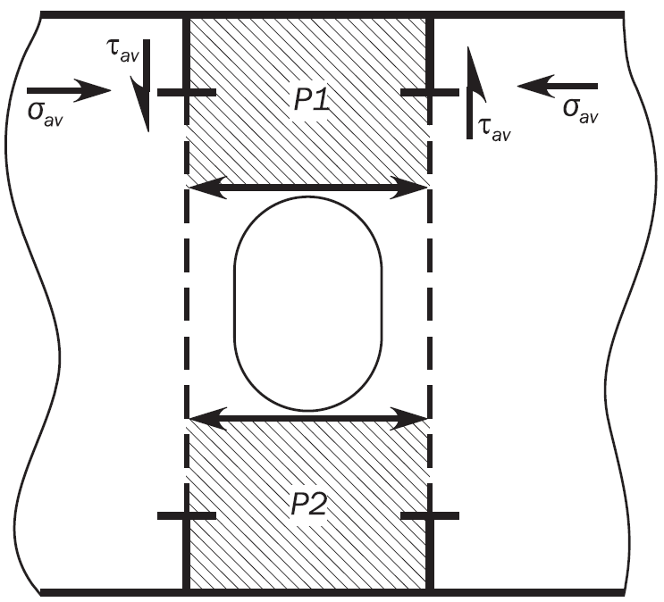 | Separate reduction factors are to be applied for areas *P1* and *P2* using $C _{x}$ for case 1 or $C _{y}$ for case 2 in Table 3 with stress ratio: $\psi = 1.0$ | Separate reduction factors are to be applied for areas *P1* and *P2* using case 15 in **Table 3**. | Separate reduction factors are to be applied to areas *P1* and *P2* using case 15 in Table 3 with: $\tau _{ay} = \tau _{av} (web) \frac{h}{(h-h _{0} )}$ |
    | (c) Example of hole in web: 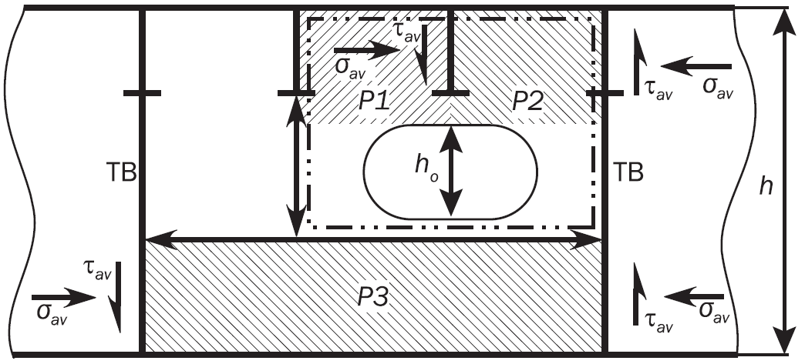 |   | Panels *P1* and *P2* are to be evaluated in accordance with (a). Panel *P3* is to be evaluated in accordance with (b). |   |
    | Where: $h$ : Height, in m, of the web of the primary supporting member in way of the opening. $h _{0}$ : Height, in m, of the opening measured in the depth of the web. $\tau _{av} (web)$ : Weighted average shear stress, in N/mm^2 over the web height $h$ of the primary supporting member. Note 1) : Web panels to be considered for buckling in way of openings are shown shaded and numbered *P1*, *P2*, etc. Note 2) : For a PSM web panel with opening and without edge reinforcements as shown in configuration (a), the applicable buckling assessment method depends on its specific boundary conditions. If one of the long edges along the face plate or along the attached plating is not subject to “inline support“, i.e. the edge is free to pull in, Method B should be applied. In other cases, typically such as when the short plate edge is attached to the plate flanges, Method A is applicable. |   |   |   |

#### 3. Buckling capacity of other structures

- **3.1** **Pillars**
  - **3.1.1** **Buckling utilisation factor**
    The buckling utilisation factor, $\eta$, for axially compressed pillars is to be taken as:
    $\eta _{} = \frac{\sigma _{av}}{\sigma _{cr}}$
    where:
    $\sigma_av$ : Average axial compressive stress in the member, in N/mm^2.
    $\sigma _{cr}$ : Minimum critical buckling stress, in N/mm^2, taken as:
    $\sigma _{cr} = \sigma _{E}$ for $\sigma _{E} \leq 0.5R _{eH"_s"}$
    $\left. \sigma _{cr} = \left( 1- \frac{R _{eH"_"s}}{4 \sigma _{E}} \right. \right) R _{eH"_"s}$ for $\sigma _{E} >0.5R _{eH"_s"}$
    $\sigma _{E}$ : Minimum elastic compressive buckling stress, in N/mm^2, according to **[3.1.2]** to **[3.1.4]**.
    $R _{eH"_s"}$ : Specified minimum yield stress of the considered member, in N/mm^2. For built up members, the lowest specified minimum yield stress is to be used.
  - **3.1.2** **Elastic column buckling stress**
    The elastic compressive column buckling stress, $\sigma _{EC}$, in N/mm^2 of members subject to axial compression is to be taken as:
    $\sigma _{EC} = \pi ^{2} Ef _{end} \frac{I}{A \ell _{"pill"}^{2}} 10 ^{-4}$
    where:
    $I$ : Net moment of inertia about the weakest axis of the cross section, in cm^4.
    $A$ : Net cross sectional area of the member, in cm^2.
    $\ell _{"pill"}$ : Length of the member, in m, taken as:
    $f _{end}$ : End constraint factor, taken as:
    • $f _{end} =1.0$ where both ends are simply supported.
    • $f _{end} =2.0$ where one end is simply supported and the other end is fixed.
    • $f _{end} =4.0$ where both ends are fixed.
    A pillar end may be considered fixed when brackets of adequate size are fitted. Such brackets are to be supported by structural members with greater bending stiffness than the pillar.
    - **a)** For pillar: unsupported length of the member
    - **a)** For pillar:
  - **3.1.3** **Elastic torsional buckling stress**
    The elastic torsional buckling stress, $\sigma _{ET}$, in N/mm^2, with respect to axial compression of members is to be taken as:
    $\sigma _{ET} = \frac{GI _{sv}}{I _{pol}} + \frac{\pi ^{2} f _{end} E c _{warp}}{I _{pol} \ell _{"pill"}^{2}} 10 ^{-4}$
    where:
    $I_sv$ : Net St. Venant’s moment of inertia, in cm^4, see **Table 7** for examples of cross sections.
    $I_pol$ : Net polar moment of inertia about the shear centre of cross section, in cm^4.
    $I _{pol} =I _{y} +I _{z} +A(y _{0}^{2} +z _{0}^{2} )$
    $c _{warp}$ : Warping constant, in cm^6, see **Table 7** for examples of cross sections.
    $\ell _{"pill"}$ : Length of the member, in m as defined in **[3.1.2]**.
    $y _{0}$ : Transverse position of shear centre relative to the cross sectional centroid, in cm, see **Table 7** for examples of cross sections.
    $z _{0}$ : Vertical position of shear centre relative to the cross sectional centroid, in cm, see **Table 7** for examples of cross sections.
    $A$ : Net cross sectional area, in cm^2, as defined in **[3.1.2]**.
    $I _{y}$ : Net moment of inertia about y axis, in cm^4.
    $I _{z}$ : Net moment of inertia about z axis, in cm^4.
  - **3.1.4** **Elastic torsional/column buckling stress**
    For cross sections where the centroid and the shear centre do not coincide, the interaction between the torsional and column buckling mode is to be examined. The elastic torsional/column buckling stress, $\sigma _{ETF}$, with respect to axial compression is to be taken as:
    $\sigma _{ETF} = \frac{1}{2 \zeta} [( \sigma _{EC} + \sigma _{ET} )- \sqrt {( \sigma _{EC} + \sigma _{ET} ) ^{2} -4 \zeta \sigma _{EC} \sigma _{ET}} ]$
    where:
    $\zeta$ : Coefficient taken as:
    $\zeta =1- \frac{(y _{0}^{2} +z _{0}^{2} )A}{I _{pol}}$
    $y _{0}$ : Transverse position of shear centre relative to the cross sectional centroid, in cm, as defined in **[3.1.3]**.
    $z _{0}$ : Vertical position of shear centre relative to the cross sectional centroid, in cm, as defined in **[3.1.3]**.
    $A$ : Net cross sectional area, in cm^2, as defined in **[3.1.2]**.
    $I_pol$ : Net polar moment of inertia about the shear centre of cross section, in cm^4 as defined in **[3.1.3]**.
    $\sigma _{EC}$ : Elastic column compressive buckling stress, as defined in **[3.1.2]**.
    $\sigma _{ET}$ : Elastic torsional buckling stress, as defined in **[3.1.3]**.

    | 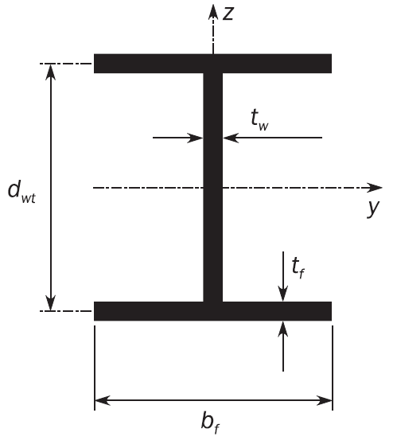 | $I _{sv} = \frac{1}{3} (2 b _{f} t _{f} ^{3} +d _{wt} t _{w} ^{3} )10 ^{-4}$ | $\mathrm{cm} ^{4}$ |
    | --- | --- | --- |
    |   | $c _{warp} = \frac{d _{wt} ^{2} b _{f} ^{3} t _{f}}{24} 10 ^{-6}$ | $\mathrm{cm} ^{6}$ |
    | 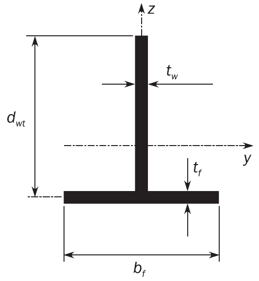 | $I _{sv} = \frac{1}{3} (b _{f} t _{f} ^{3} +d _{wt} t _{w} ^{3} )10 ^{-4}$ | $\mathrm{cm} ^{4}$ |
    |   | $y_{0}=0$ | $\mathrm{cm} ^{4}$ |
    |   | $y_{0}=0$ | $\mathrm{cm}$ |
    |   | $z _{0} = - \frac{0.5 d _{wt} ^{2} t _{w}}{d _{wt} t _{w} +b _{f} t _{f}} 10 ^{-1}$ | $\mathrm{cm}$ |
    |   | $c _{warp} = \frac{b _{f} ^{3} t _{f} ^{3} +4 d _{wt} ^{3} t _{w} ^{3}}{144} 10 ^{-6}$ | $\mathrm{cm} ^{6}$ |
    | 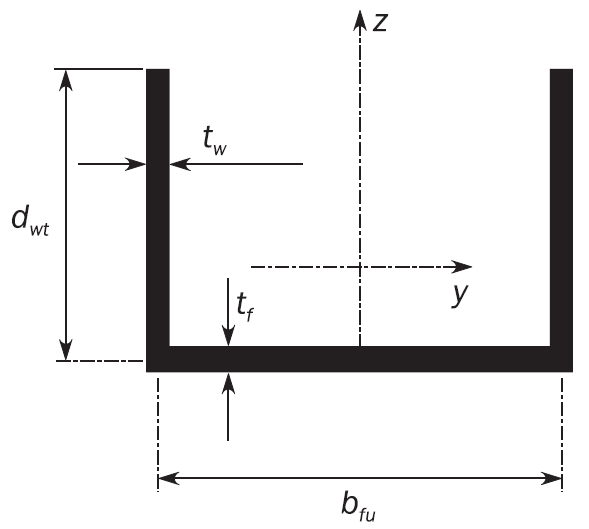 | $I _{sv-n50} = \frac{1}{3} (b _{fu} t _{f} ^{3} +2 d _{wt} t _{w} ^{3} )10 ^{-4}$ | $\mathrm{cm} ^{4}$ |
    |   | $y _{0} =0$ | $\mathrm{cm}$ |
    |   | $z _{0} = - \frac{d _{wt} ^{2} t _{w} 10 ^{-1}}{2d _{wt} t _{w} +b _{fu} t _{f}} - \frac{0.5 d _{wt} ^{2} t _{w} 10 ^{-1}}{d _{wt} t _{w} +b _{fu} t _{f} /6}$ | $\mathrm{cm}$ |
    |   | $c _{warp} = \frac{b _{fu} ^{2} d _{wt} ^{3} t _{w} (3 d _{wt} t _{w} +2 b _{fu} t _{f} )}{12(6 d _{wt} t _{w} +b _{fu} t _{f} )} 10 ^{-6}$ | $\mathrm{cm} ^{6}$ |
    | 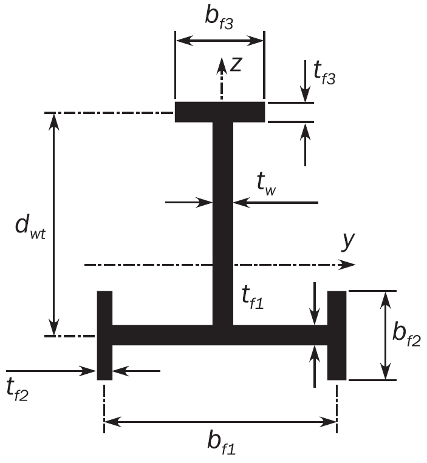 | $I _{sv} = \frac{1}{3} (b _{f1} t _{f1} ^{3} +2 b _{f2} t _{f2} ^{3} +b _{f3} t _{f3} ^{3} +d _{wt} t _{w} ^{3} )10 ^{-4}$ | $\mathrm{cm} ^{4}$ |
    |   | $y _{0} =0$ | $\mathrm{cm}$ |
    |   | $z _{0} =z _{s} - \frac{(b _{f3} d _{wt} t _{f3} +0.5 d _{wt} ^{2} t _{w} ) 10 ^{-1}}{d _{wt} t _{w} +b _{f1} t _{f1} +2 b _{f2} t _{f2} +b _{f3} t _{f3}}$ | $\mathrm{cm}$ |
    |   | $c _{warp} = \left( I _{f1} z _{s}^{2} + \frac{I _{f2} b _{f1}^{2}}{200} +I _{f3} \left( \frac{d _{wt}}{10} -z _{s} \right) ^{2} \right)$ | $\mathrm{cm} ^{6}$ |
    |   | $I _{f1} = \left( \frac{(b _{f1} -t _{f2} ) ^{3} t _{f1}}{12} + \frac{b _{f2} t _{f2} b _{f1} ^{2}}{2} \right) 10 ^{-4}$ | $\mathrm{cm} ^{4}$ |
    |   | $I _{f2} = \frac{b _{f2} ^{3} t _{f2}}{12} 10 ^{-4}$ | $\mathrm{cm} ^{4}$ |
    |   | $I _{f3} = \frac{b _{f3} ^{3} t _{f3}}{12} 10 ^{-4}$ | $\mathrm{cm} ^{4}$ |
    |   | $z _{s} = \frac{I _{f3} d _{wt}}{I _{f1} +I _{f3}} 10 ^{-1}$ | $\mathrm{cm}$ |
    | Note 1: All dimensions are in mm Note 2: Cross sectional properties are given for typical cross sections. Properties for other cross sections are to be determined by direct calculation. |   |   |

### Appendix 1 - Stress based reference stresses

**Symbols**
For symbols not defined in this section, refer to **Ch 1, Sec 4**.
$a$ : Length, in mm, of the longer side of the plate panel as defined in **Sec 5**.
$b$ : Length, in mm, of the shorter side of the plate panel as defined in **Sec 5**.
$A_i$ : Area, in mm^2, of the $i$-th plate element of the buckling panel.
$n$ : Number of plate elements in the buckling panel.
$\sigma _{"i"x}$ : Actual stress, in N/mm^2, at the centroid of the $i$-th plate element in x direction, applied along the shorter edge of the buckling panel.
$\sigma _{iy}$ : Actual stress, in N/mm^2, at the centroid of the $i$-th plate element in y direction, applied along the longer edge of the buckling panel.
$\psi$ : Edge stress ratio as defined in **Sec 5**.
$\tau_i$ : Actual membrane shear stress, in N/mm^2, at the centroid of the $i$-th plate element of the buckling panel.

#### 4. Stress based method

- **4.1** **Introduction**
  - **4.1.1** This section provides a method to determine stress distribution along edges of the considered buckling panel by 2^nd order polynomial curve, by linear distribution using least square method and by weighted average approach. This method is called Stress based Method.
    The reference stress is the stress components at centre of plate element transferred into the local system of the considered buckling panel.
  - **4.1.2** **Definition**
    A regular panel is a plate panel of rectangular shape. An irregular panel is plate panel which is not regular, as detailed in **Ch 8, Sec 4, [2.3.1]**.
- **4.2** **Stress application**
  - **4.2.1** **Regular panel**
    The reference stresses are to be taken as defined in **[2.1]** for a regular panel when the following conditions are satisfied:
    Otherwise, the reference stresses are to be taken as defined in **[2.2]** for an irregular panel.
    - **a)** At least, one plate element centre is located in each third part of the long edge $a$ of a regular panel and
    - **b)** This element centre is located at a distance in the panel local x direction not less than $a/4$ to at least one of the element centres in the adjacent third part of the panel.
  - **4.2.2** **Irregular panel and curved panel**
    The reference stresses of an irregular panel or of a curved panel are to be taken as defined in **[2.2]**.

#### 5. Reference stresses

- **5.1** **Regular panel**
  - **5.1.1** **Longitudinal stress**
    The longitudinal stress $\sigma_x$ applied on the shorter edge of the buckling panel is to be calculated as follows:
    $\sigma_x (x)=C x^2 +D x+E$
    The best fitting curve $\sigma_x (x)$ is to be obtained by minimising the square error $\Pi$ considering the area of each element as a weighting factor.
    $\Pi = \sum _{i=1} ^{n} A _{i} [ \sigma _{ix} -(C x _{i} ^{2} +D x _{i} +E)] ^{2}$
    The unknown coefficients $C$, $D$ and $E$ must yield zero first derivatives, $Partial \Pi$ with respect to $C$, $D$ and $E$ respectively.
    $\left( \frac{Partial \Pi }{Partial C} =2 \sum _{i=1} ^{n} A _{i} x _{i} ^{2} [ \sigma _{ix} -(C x _{i} ^{2} +D x _{i} +E)]=0\# \frac{Partial \Pi }{Partial D} =2 \sum _{i=1} ^{n} A _{i} x _{i} [ \sigma _{ix} -(C x _{i} ^{2} +D x _{i} +E)]=0\# \frac{Partial \Pi }{Partial C} =2 \sum _{i=1} ^{n} A _{i} [ \sigma _{ix} -(C x _{i} ^{2} +D x _{i} +E)]=0$
    The unknown coefficients $C$, $D$ and $E$ can be obtained by solving the 3 above equations.
    $\sigma _{x1} = \frac{1}{b} \int _{0} ^{b} {\sigma _{x} (x)dx= \frac{b ^{2}}{3} C + \frac{b}{2} D} +E\# \sigma _{x2} = \frac{1}{b} \int _{a-b} ^{a} {\sigma _{x} (x)dx} =(a ^{2} -ab+ \frac{b ^{2}}{3} )C+(a- \frac{b}{2} )D+E$
    If $-D/2C**a-b/2$, $\sigma _{x3}$ is to be ignored. Otherwise, $\sigma _{x3}$ is taken as:
    $\sigma _{x3} = \frac{1}{b} \int _{xmin} ^{xmax} {\sigma _{x} (x)dx} = \frac{b ^{2}}{12} C- \frac{D ^{2}}{4C} +E$
    where:
    $x _{itmin} =- \frac{b}{2} - \frac{D}{2C}$
    $x _\mathit{\max} = \frac{b}{2} - \frac{D}{2C}$
    The longitudinal stress is to be taken as:
    $\sigma _{x} = it \max( \sigma _{x1} ; \sigma _{x2} ; \sigma _{x3} )$
    The edge stress ratio is to be taken as:
    $\psi _{x} =1$
    $\sigma _{x} = \frac{\sum _{1} ^{n} A _{i} \sigma _{"i"x}}{\sum _{1} ^{n} A _{i}}$
    The edge stress ratio $\psi _{x}$ for the stress $\sigma _{x}$ is equal to 1.0.**
    - **a)** For plate buckling assessment, the distribution of $\sigma_x (x)$ is assumed as 2^nd order polynominal curve as:
    - **b)** For stiffener buckling assessment, $\sigma_x (x)$ applied on the shorter edge of the attached plate is to be taken as:
  - **5.1.2** **Transverse stress**
    The transverse stress $\sigma _{y}$ applied along the longer edges of the buckling panel is to be calculated by extrapolation of the transverse stresses of all elements up to the shorter edges of the considered buckling panel.
    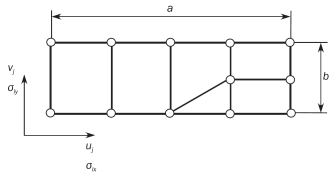
    **Figure : Buckling panel**
    The distribution of $\sigma _{y} (x)$ is assumed as straight line. Therefore:
    $\sigma _{y} (x)=A+Bx$
    The best fitting curve $\sigma _{y} (x)$ is to be obtained by the least square method minimising the square error $\Pi$ considering area of each element as a weighting factor.
    $\Pi = \sum _{i=1} ^{n} A _{i} [\sigma _{iy} -(A+Bx _{i} )] ^{2}$
    The unknown coefficients $A$ and $B$ must yield zero first partial derivatives, $\partial \Pi$ with respect to $A$ and $B$, respectively.
    $\left( eqalign{\frac{Partial \Pi }{Partial A} =2 \sum _{i=1} ^{n} A _{i} [ \sigma _{iy} -(A+Bx _{i} )]=0\# \frac{Partial \Pi }{Partial B} =2 \sum _{i=1} ^{n} A _{i} x _{i} [ \sigma _{iy} -(A+Bx _{i} )]=0} \right.$
    The unknown coefficients $A$ and $B$ are obtained by solving the 2 above equations and are given as follow:
    $left{A= \frac{\left. \left. \left( \sum _{i=1} ^{n} \right. A _{i} \sigma _{iy} \right) \left( \sum _{i=1} ^{n} A _{i} x _{i} ^{2} \right. \right) - \left. \left. \left( \sum _{i=1} ^{n} \right. A _{i} x _{i} \right) \left( \sum _{i=1} ^{n} A _{i} x _{i} \sigma _{iy} \right. \right)}{\left. \left. \left( \sum _{i=1} ^{n} \right. A _{i} \right) \left( \sum _{i=1} ^{n} A _{i} x _{i} ^{2} \right. \right) - \left. \left. \left( \sum _{i=1} ^{n} \right. A _{i} x _{i} \right) ^{2} \right.}\# \# B= \frac{\left. \left. \left( \sum _{i=1} ^{n} \right. A _{i} \right) \left( \sum _{i=1} ^{n} A _{i} x _{i} \sigma _{iy} \right. \right) - \left. \left. \left( \sum _{i=1} ^{n} \right. A _{i} x _{i} \right) \left( \sum _{i=1} ^{n} A _{i} \sigma _{iy} \right. \right)}{\left. \left. \left( \sum _{i=1} ^{n} \right. A _{i} \right) \left( \sum _{i=1} ^{n} A _{i} x _{i} ^{2} \right. \right) - \left. \left. \left( \sum _{i=1} ^{n} \right. A _{i} x _{i} \right) ^{2} \right.}$
    $\sigma _{y} = it \max(A, A+B a)$
    $\psi _{y} = \frac{itmin(A, A+B a)}{itmax(A, A+B a)}$ for $\sigma _{y} \geq 0$
    $\psi _{y} =1$ for $\sigma _{y} <0$
  - **5.1.3** **Shear stress**
    The shear stress $\tau$ is to be calculated using a weighted average approach, and is to be taken as:
    $\tau = \frac{\sum _{1} ^{n} A _{i} \tau _{i}}{\sum _{1} ^{n} A _{i}}$
- **5.2** **Irregular panel and curved panel**
  - **5.2.1** **Reference stresses**
    The longitudinal, transverse and shear stresses are to be calculated using a weighted average approach. They are to be taken as:
    $\sigma _{x} = \frac{\sum _{1} ^{n} A _{i} \sigma _{"i"x}}{\sum _{1} ^{n} A _{i}}$
    $\sigma _{y} = \frac{\sum _{1} ^{n} A _{i} \sigma _{iy}}{\sum _{1} ^{n} A _{i}}$
    $\tau = \frac{\sum _{1} ^{n} A _{i} \tau _{i}}{\sum _{1} ^{n} Ai}$
    The edge stress ratios are to be taken as:
    $\psi _{x} =1$
    $\psi _{y} =1$
