# PART 15 Structural Rules for Membrane Type Liquefied Natural Gas Carriers

> RULES FOR CLASSIFICATION OF STEEL SHIPS / RA-15-E / 2025 / EN / Rules

## Chapter 9 Fatigue

### Section 39 - General Considerations

**Symbols**
For symbols not defined in this section, refer to **Ch 1, Sec 4**.
$T _{DF}$ : Design fatigue life, in year, specified by the designer, but not to be taken less than 25 years.

#### 1. Rule Application for Fatigue Requirements

- **1.1** **Scope**
  - **1.1.1** **General**
    This chapter provides requirements applicable to ships having rule length *L* between 150 m and 400 m to evaluate fatigue strength of the ship’s structural details considering an operation time in worldwide environment for unrestricted navigation. A more severe trading route may be specified e.g. North Atlantic.
  - **1.1.2** **Assessed area**
    Fatigue assessment is performed for structural details located in the ship’s cargo hold region in order to prevent the following types of fatigue failure:
    • Fatigue cracks initiating from the toe of the weld and propagating into the plate.
    • Fatigue cracks initiating from free edge of non-welded details.
    Where a transition structure of trunk deck from cargo hold region to engine room or to fore end structure is fitted, fatigue assessment is also to be performed.
  - **1.1.3** **Structural details to be assessed**
    The structural details required for fatigue assessment are given in **Ch 9, Sec 2**:
    • Structural details to be checked are listed in:
    • **Ch 9, Sec 2, [1]** for simplified stress analysis according to **Ch 9, Sec 4**, or
    • **Ch 9, Sec 2, [2]** for finite element stress analysis according to **Ch 9, Sec 5**.
    Additional specific details may be requested to be checked on a case-by-case basis by the Society.
  - **1.1.4** **Detail design standard**
    Detail design standard given in **Ch 9, Sec 6** provides welding requirement at critical structural details in order to prevent the following types of fatigue failure:
    • Fatigue cracks initiating from the weld toe into the base material.
    • Fatigue cracks initiating from the weld root and propagating into the plate section under the weld.
    • Fatigue cracks initiating from the weld root and propagating through the weld throat.
    • Fatigue cracks initiating from surface irregularity or notch at the free edge into the base material.
  - **1.1.5** **Material**
    The fatigue assessment is applicable for steel material with specified minimum yield stress less than or equal to 390 N/mm^2. For steel with specified minimum yield stress value higher than 390 N/mm^2 and for steels with improved fatigue performance, the S-N curves to be used are considered by the Society on a case-by-case basis.
  - **1.1.6** **Wave loads**
    Fatigue assessment is based on quasi-static wave loads.
  - **1.1.7** **Loads other than wave loads**
    Fatigue induced by low cycle loads such as cargo variations or impact loads such as sloshing in partially filled tanks which may induce fatigue damage is disregarded in this chapter.

#### 2. Definition

- **2.1** **Hot spots**
  - **2.1.1** Hot spots are locations in the structure where fatigue cracks may initiate due to the combined effect of nominal structural stress fluctuation and stress raising effects due to the weld geometry or similar effects due to notch in the base material.
    Hot spots may be located at:
    • Weld toe.
    • Weld root of partial penetration or fillet weld.
    • Base material at free edge of plate.
- **2.2** **Nominal stress**
  - **2.2.1** Nominal stress is the stress in a structural component taking into account macro-geometric effect but disregarding the stress concentration due to structural discontinuities and the presence of welds. Nominal stress is to be obtained either using coarse or fine mesh FE analysis, as required in **Ch 9, Sec 5** or using analytical calculation based on beam theory, as required in **Ch 9, Sec 4**.
- **2.3** **Hot spot stress**
  - **2.3.1** Hot spot stress is the stress at the weld toe taking into account the stress concentration due to structural discontinuities and presence of welded attachments but disregarding the non-linear stress peak caused by the notch at the weld toe. The hot spot stresses to be considered correspond to the two principal stresses on the surface plating at the weld toe. The first principal stress acts within ±45°, perpendicular to the weld and the second principal stress acts outside ±45°.
    The hot spot stress is to be obtained by multiplying the nominal stress by a Stress Concentration Factor (SCF), according to **Ch 9, Sec 4, [5]** or directly by a very fine mesh FE analysis, according to **Ch 9, Sec 5, [3]** and **Ch 9, Sec 5, [4]**.
- **2.4** **Local stress at free edge**
  - **2.4.1** Local stress at free edge is the stress at the plate free edge derived using finite element analysis according to **Ch 9, Sec 5, [3.2]**.
- **2.5** **Fatigue stress**
  - **2.5.1** Fatigue stress is the stress relevant for fatigue assessment purpose, i.e.:
    • Maximum of the two principal hot spot stress for weld toe with the mean stress effect and thickness effect corrections.
    • Local stress at free edge with corrections due to the base material surface finishing, mean stress effect, thickness effect and material strength.

#### 3. Assumptions

- **3.1** **General**
  - **3.1.1** The following assumptions are made in the fatigue assessment:
    - **a)** A linear cumulative damage model, i.e. Palmgren-Miner’s Rule, given in **Ch 9, Sec 3, [5]**, has been used in connection with the design S-N curves, given in **Ch 9, Sec 3, [4]**.
    - **b)** Design fatigue life, $T _{DF}$, is taken not less than 25 years.
    - **c)** Rule quasi-static wave induced loads are based on worldwide environment for unrestricted navigation. They are determined at 10^-2 probability level of exceedance by the Equivalent Design Wave (EDW) concept.
    - **d)** In accordance with **[5]**, net thickness($t _{n50}$) is used for simplified stress analysis and gross thickness($t _{gr}$) is used for finite stress analysis respectively.
    - **e)** Type of stress used for crack initiating at the weld toe is the hot spot stress. Type of stress used for crack initiating at free edge of non-welded details is local stress at free edge.
    - **f)** Fatigue stress range $\Delta \sigma _{FS}$ may be calculated by simplified stress analysis or by finite element stress analysis for details with more complex geometry.
    - **g)** Long term distribution of stress range of a structural detail is assumed to follow a two-parameter Weibull distribution. Weibull shape parameter $\xi$ is equal to 1 and the fatigue stress range $\Delta \sigma _{FS}$ is given at the reference probability level of exceedance equal to 10^-2.
    - **h)** The acceptance criteria for fatigue checking are the total fatigue damage *D* to be less than 1 for the design fatigue life, as required in **Ch 9, Sec 3, [2]**.

#### 4. Methodology

- **4.1** **Principles**
  - **4.1.1** **General**
    Appropriate fatigue strength of structural details is ensured by use of:
    • Detail design standards given in **Ch 9, Sec 6**, providing specific design requirements.
    • Fatigue strength assessment by fatigue life calculation, based on two different methods for hot spot stress calculation: simplified stress analysis and very fine mesh finite element stress analysis.
- **4.2** **Simplified stress analysis**
  - **4.2.1** Procedure based on simplified stress analysis, required in **Ch 9, Sec 4**, is used to determine the hot spot stress at weld toe of longitudinal stiffener end connections, given in **Ch 9, Sec 2, [1.1]**.
    Nominal stresses are calculated by using analytical method based on beam theory according to **Ch 9, Sec 4, [3]** and **Ch 9, Sec 4, [4]**. Hot spot stresses are obtained by multiplying nominal stresses by stress concentration factors (SCF) of the considered detail according to **Ch 9, Sec 4, [5.2]**.
- **4.3** **Finite element stress analysis**
  - **4.3.1** Procedure based on finite element stress analysis, required in **Ch 9, Sec 5**, is used to determine hot spot stress at weld toe of specified structural details, from very fine mesh models.
    The hot spot stress is generally highly dependent on the finite element model used for representing the structure.
    General procedure for the calculation of hot spot stress at weld toe for any welded details except for web stiffened cruciform joints is given in **Ch 9, Sec 5, [3.1]**. Procedure for the calculation of hot spot stress at the flange connections for web stiffened cruciform joints is given in **Ch 9, Sec 5, [4]**. Calculation of local stress for non-welded area is provided in **Ch 9, Sec 5, [3.2]**.
    A list of details for which the fatigue assessment is to be made through a compulsory very fine mesh finite element analysis or through the compliance with the design standard given in **Ch 9, Sec 6**. if a very fine mesh finite element analysis is omitted, is given respectively in **Ch 9, Sec 2, Table 1** and **Table 2**.
- **4.4** **Fatigue design standards**
  - **4.4.1** Detail design standards given in **Ch 9, Sec 6** are provided to ensure improved fatigue performance of critical structural details. Alternative detail design configurations may be accepted subject to demonstration of satisfactory fatigue performance.

#### 5. Corrosion Model

- **5.1** **Net/gross thickness**
  - **5.1.1** **General**
    The fatigue assessment by simplified method should be performed based on net thicknesses according to **Ch 3, Sec 2**. When accessing the fatigue strength by finite stress analysis, it shall be performed based on gross thicknesses.
  - **5.1.2** **Stress correction**
    The hull girder stresses for simplified stress analysis are to be corrected by multiplying the calculated stress by $f _{c}$, correction factor taken as:
    $f _{c}$ = 0.95

#### 6. Loading Conditions

- **6.1** **Description**
  - **6.1.1** Fatigue analyses are to be carried out for representative loading conditions according to the intended ship’s operation as given in **[6.2]**.
- **6.2** **Loading conditions**
  - **6.2.1** The loading conditions to be considered and corresponding fraction of time for each loading condition, $\alpha _{(j)}$, are defined in **Table 1**. The standard loading conditions for fatigue assessment are provided in **[6.2.2]**.

    | Loading conditions | ${\alpha _{(j)}}$ |
    | --- | --- |
    | Full load condition (Homogeneous) | 0.5 |
    | Normal ballast condition | 0.5 |
  - **6.2.2** **Standard loading conditions**
    The standard loading conditions to be applied are defined in **Table 2** to **Table 4** according to the location of the assessed details.

    | No | Description | Loading Pattern | Still water loads |   |   | Dynamic load cases |
    | --- | --- | --- | --- | --- | --- | --- |
    | No | Description | Loading Pattern | Draught | % of perm. SWBM | % of perm. SWSF | Dynamic load cases |
    | LMM-F1 | Full load |  | $T _{SC}$ | 100% (sag.) | - | All |
    | LMM-F2 | Normal ballast |  | $0.7T _{SC}$ | 80% (hog.) | - | All |

    | No | Description | Loading Pattern | Still water loads |   |   | Dynamic load cases |
    | --- | --- | --- | --- | --- | --- | --- |
    | No | Description | Loading Pattern | Draught | % of perm. SWBM | % of perm. SWSF | Dynamic load cases |
    | LMA-F1 | Full load |  | $T _{SC}$ | 100% (sag.) | - | All |
    | LMA-F2 | Normal ballast |  | $0.7T _{SC}$ | 80% (hog.) | - | All |

    | No | Description | Loading Pattern | Still water loads |   |   | Dynamic load cases |
    | --- | --- | --- | --- | --- | --- | --- |
    | No | Description | Loading Pattern | Draught | % of perm. SWBM | % of perm. SWSF | Dynamic load cases |
    | LMF-F1 | Full load |  | $T _{SC}$ | 100% (sag.) | - | All |
    | LMF-F2 | Normal ballast |  | $0.7T _{SC}$ | 80% (hog.) | - | All |

#### 7. Load Case

- **7.1** **Assumptions**
  - **7.1.1** The load cases to be considered for fatigue assessment are given in **Ch 4, Sec 2, [3]**.
    The design load scenario for fatigue assessment is defined in **Ch 4, Sec 7, Table 3**.
    For each loading condition defined in **[6]**, all fatigue load cases are to be considered to generate the combination of dynamic loads for fatigue assessment.
  - **7.1.2** **Predominant load case**
    The predominant load case for each loading condition $(j)$ is defined as load case where the fatigue stress range for the critical location is the maximum among all fatigue load cases.

### Section 40 - Structural Details to be Assessed

#### 1. Simplified Stress Analysis

- **1.1** **Structural details to be assessed**
  - **1.1.1** Critical structural details to be checked over the full extent of the cargo region for fatigue assessment by simplified stress analysis according to **Ch 9, Sec 1** are:
    • End connections of longitudinal stiffeners to transverse bulkheads,
    • End connections of longitudinal stiffeners to floors and web frames.

#### 2. Finite Element Analysis

- **2.1** **Structural details to be assessed**
  - **2.1.1** **General**
    Critical structural details to be checked for fatigue by finite element analysis according to **Ch 9, Sec 5** are given in **[2.1.2]**. Additional fatigue assessment may be required for other locations where deemed necessary by the Society.
    **Table 3** to **Table 8** give the list of hot spots for structural details.
  - **2.1.2** **Details to be checked by very fine mesh analysis**
    Critical structural details to be assessed for fatigue by very fine mesh analysis according to **Ch 9, Sec 5, [1]** to **Ch 9, Sec 5, [4]** are provided in **Table 1**, irrespective of their compliance with the design standard given in **Ch 9, Sec 6**.
  - **2.1.3** **Details in accordance with detail design standard**
    **Table 3** gives critical structural details for which fatigue assessment by very fine mesh analysis can be omitted if their design is in accordance with detail design standard given in **Ch 9, Sec 6**.

    | No | Critical detail | Applicability |
    | --- | --- | --- |
    | 1 | Welded lower hopper knuckle connection (intersection of hopper sloping plate, inner bottom plate, longitudinal girder, floor and transverse web) at the most critical frame location.(1) | One cargo tank(2) |
    | 2 | Radiused lower hopper knuckle connection (intersection of knuckled inner bottom plate, longitudinal girder, floor and transverse web) at the most critical frame location.(1) | One cargo tank(2) |
    | 3 | Welded upper hopper knuckle connection (intersection of hopper sloping plate, inner hull longitudinal bulkhead, transverse web and side stringer) where the angle between hopper plate and inner hull longitudinal bulkhead is less than 130 deg, at the most critical frame location.(1) | One cargo tank(2) |
    | 4 | Intersection of side stringer plate and stringer plate of transverse bulkheads.(1) | One cargo tank(2) |
    | 5 | Intersection of inner bottom plate and transverse bulkhead plates.(1) | One cargo tank(2) |
    | 6 | Scarfing bracket toes of aft end of trunk deck in aftmost cargo hold. | Aftmost hold |
    | 7 | Liquid dome end bracket and inner deck plating.(1)(3) | One cargo tank(2) |
    | (1) The most critical frame position is generally, but not necessarily, located closest to the mid length of the hold. (2) Cargo hold located closest to the midship. (3) Only for the ship having liquid dome structure. |   |   |

    | No | Critical detail | Applicability |
    | --- | --- | --- |
    | 1 | Radiused upper hopper knuckle connection (intersection of knuckled inner side plate, side girder and transverse web) at the most critical frame location.(1) | One cargo tank(2) |
    | 2 | Scallops in way of block joints on trunk deck close to mid hold. | One cargo tank(2) |
    | (1) The most critical frame position is generally, but not necessarily, located closest to the mid length of the hold. (2) Cargo hold located closest to the midship. |   |   |

    | Hot spot location | Procedure for calculation of hot spot stress |
    | --- | --- |
    | Hot spot 1: Inner bottom plate, on cargo tank side Hot spot 2: Hopper sloping plate, on cargo tank side | **Ch 9, Sec 5, [4.2]** |
    | Hot spot 3: Hopper web, outboard of side girder Hot spot 4: Double bottom floor, inboard the side girder Hot spot 5: Side girder | **Ch 9, Sec 5, [4.3]** |
    | Hot spot 6: Scarfing bracket to the inner bottom plate | **Ch 9, Sec 5, [3.1]**, type ‘b’ |
    | 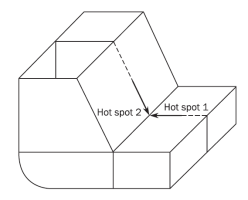 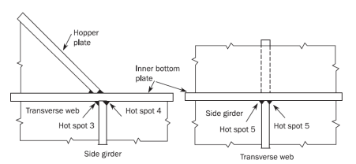 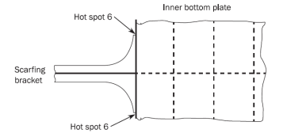 |   |

    | Hot spot location | Procedure for calculation of hot spot stress |
    | --- | --- |
    | Hot spot 1: Inner bottom plate on ballast tank side, inboard of the side girder Hot spot 2: Radiused hopper sloping plate on ballast tank side outboard of the side girder Hot spot 3: Radiused hopper sloping plate on ballast tank side, outboard of the side girder, towards transverse web Hot spot 4: Hopper web, outboard of side girder Hot spot 5: Double bottom floor, inboard of the side girder Hot spot 6: Side girder | **Ch 9, Sec 5, [3.3]** |
    | 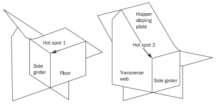 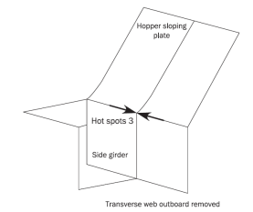 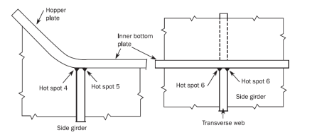 |   |

    | Hot spot location | Procedure for calculation of hot spot stress |
    | --- | --- |
    | Hot spot 1: Side stringer on ballast tank side Hot spot 2: Hopper sloping plate, on ballast tank side | **Ch 9, Sec 5, [4.2]** |
    | Hot spot 3: Transverse web, below stringer. Hot spot 4: Transverse side web, above stringer Hot spot 5: Inner hull longitudinal bulkhead on ballast tank side | **Ch 9, Sec 5, [4.3]** |
    | 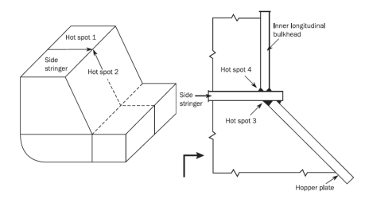 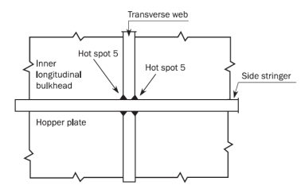 |   |

    | Hot spot location | Procedure for calculation of hot spot stress |
    | --- | --- |
    | Hot spot 1: Corners of the cut-out edge | **Ch 9, Sec 5, [3.2]** |
    | Hot spot 2: Connection of transverse web/lug-plate to longitudinal stiffener web in way of slot Hot spot 3: Overlapping connection between transverse web and lug plate | **Ch 9, Sec 5, [3.1]**, type ‘a’ |
    | 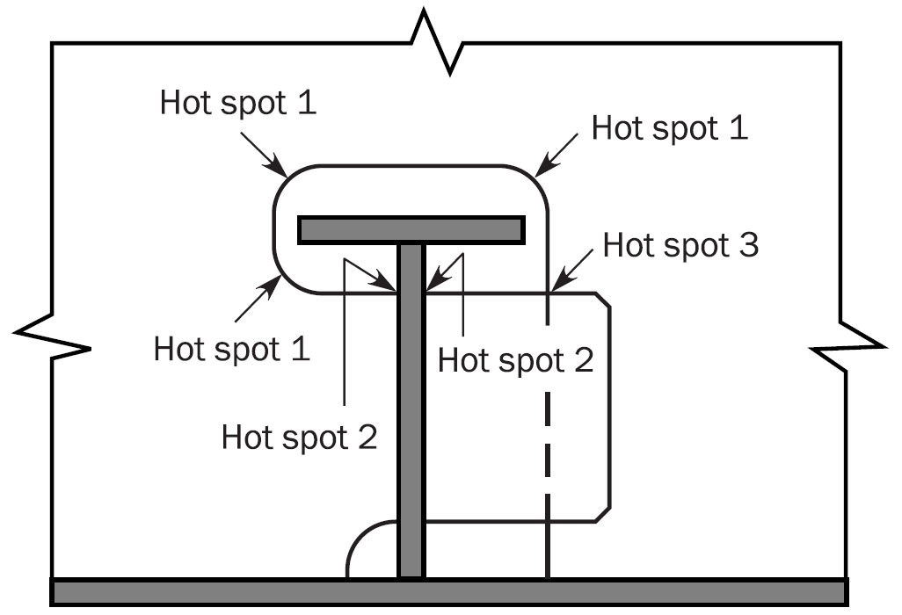 |   |

    | Hot spot location | Procedure for calculation of hot spot stress |
    | --- | --- |
    | Hot spot 1: Butt weld in longitudinal stiffener web in way of scallop Hot spot 2: Deck plate in way of scallop. | **Ch 9, Sec 5, [3.1]**, type ’b’ |
    | 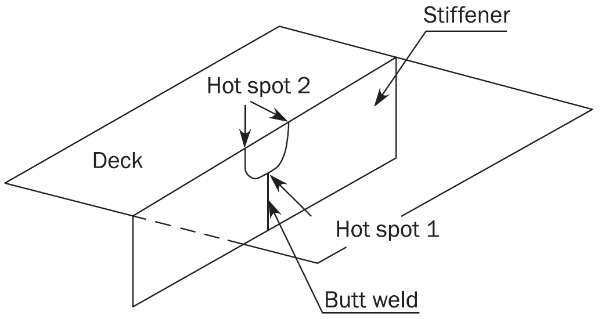 |   |

    | Hot spot location | Procedure for calculation of hot spot stress |
    | --- | --- |
    | Hot spot 1: Inner deck and liquid dome corner radiused edge Hot spot 3: Radius of liquid dome bracket toe | **Ch 9, Sec 5, [3.2]** |
    | Hot spot 2: Deck plating in way of liquid dome bracket toe | **Ch 9, Sec 5, [3.1]**, type ‘a’ |
    | Hot spot 4: Where a face plate is fitted to the bracket, the weld connection of face plate to bracket in way of the face plate termination | **Ch 9, Sec 5, [3.1]**, type ‘b’ |
    | 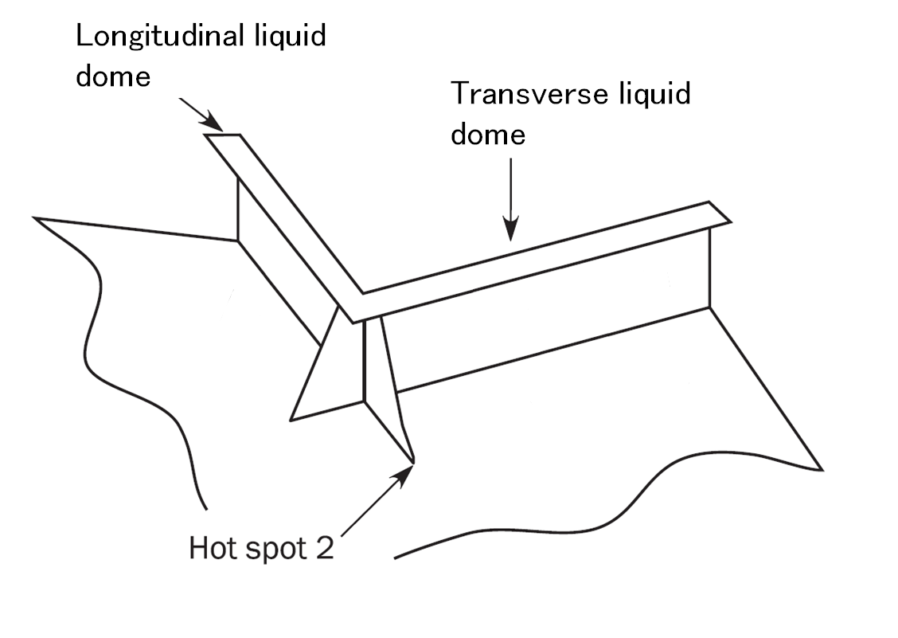 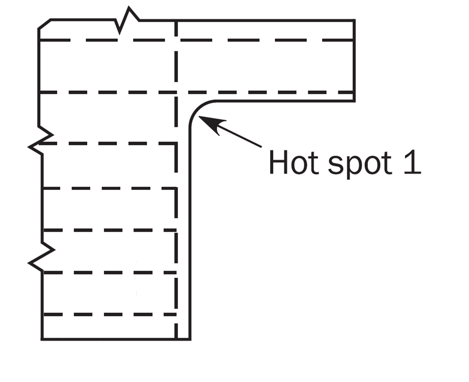 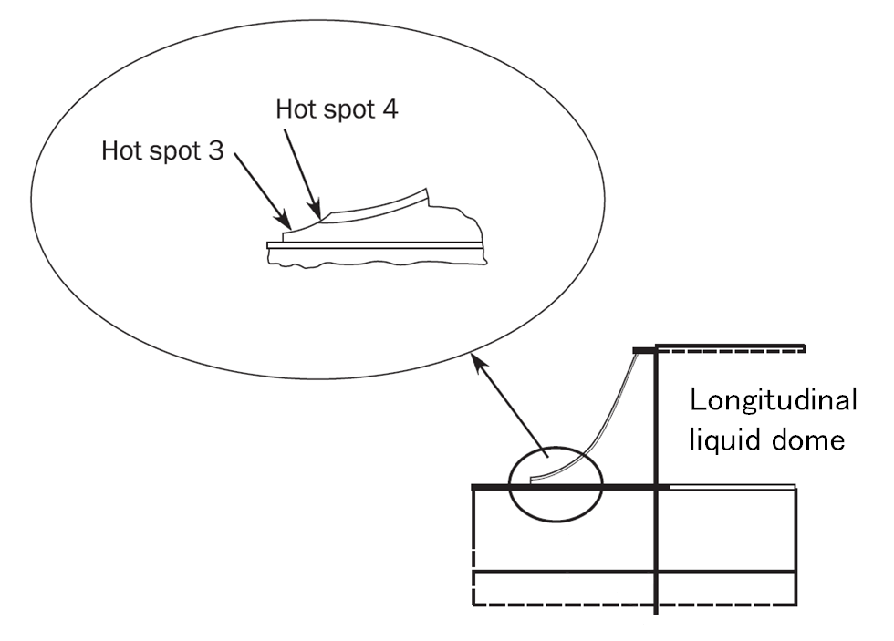 |   |

### Section 41 - Fatigue Evaluation

**Symbols**
For symbols not defined in this section, refer to **Ch 1, Sec 4**.
$(i)$ : Suffix which denotes load case HSM, FSM, BSR-P, BSR-S, BSP-P, BSP-S, OST-P or OST-S specified in **Ch 4, Sec 2, [3]**.
‘$i1$’ denotes load case: HSM-1, FSM-1, BSR-1P, BSR-1S, BSP-1P, BSP-1S, OST-1P or OST-1S.
‘$i2$’ denotes load case: HSM-2, FSM-2, BSR-2P, BSR-2S, BSP-2P, BSP-2S, OST-2P or OST-2S.
$(j)$ : Suffix which denotes loading condition: Full load, normal ballast as defined in **Ch 9, Sec 1, [6.2]**.
$T _{C,25}$ : Time in corrosive environment, in years, within the duration of the minimum design life ($T _{D,25}$) as defined in **[5.3.1]**.
$T _{D,25}$ : Minimum design life, in years, as defined in **[5.3.1]**.
$T _{C}$ : Time in corrosive environment, in years, within the duration of the design fatigue life ($T _{DF}$) as defined in **[5.3.1]**.
$T _{DF}$ : Design fatigue life, in year, as defined in **Ch 9, Sec 1**.
$T _{F}$ : Fatigue life, in year, calculated according to **[5]**.
$m$ : Inverse slope of the design S-N curve, as given in **Table 2** for in-air environment and in **Table 3** for corrosive environment. The inverse slope for S-N curves in-air environment changes from $m$ to $m$+2 at N = 10^7 cycles.
$n _{LC}$ : Number of applicable loading conditions, as defined in **Ch 9, Sec 1, [6.2]**.
$f _{c}$ : Correction factor as defined in **Ch 9, Sec 1, [5.1.2]**.
$f _{thick}$ : Correction factor for plate thickness effect given in **[3.3]**.
$f _{mean, i(j)}$ : Correction factor for mean stress effect given in **[3.2]**.

#### 1. Fatigue Analysis Methodology

- **1.1** **Cumulative damage**
  - **1.1.1** The fatigue assessment of the structure is based on the application of the Palmgren-Miner cumulative damage $D$ taken as:
    $D= \sum _{i=1} ^{n _{"tot"}} \frac{n _{i}}{N _{i}}$
    where:
    $n _{i}$ : Number of cycles at stress range $\Delta \sigma _{i}$
    $N _{i}$ : Number of cycles to failure at stress range $\Delta \sigma _{i}$
    $n _{"tot"}$ : Total number of stress range blocks
    $i$ : Stress range block index
  - **1.1.2** As the long term stress range distribution of a structural detail in a ship can be described by a two-parameter Weibull distribution, as given in **Ch 9, Sec 1, [3.1.1]**, fatigue damage can be obtained by means of a closed-form equation, as given in **[5]**.
- **1.2** **Fatigue strength assessment**
  - **1.2.1** Assessment of the fatigue strength of structural members according to **[2]** includes the following three steps:
    - **a)** Calculation of stress ranges, according to **[3]**.
    - **b)** Selection of the design S-N curve, according to **[4]**.
    - **c)** Calculation of the cumulative damage and the fatigue life calculation, according to **[5]**.

#### 2. Acceptance Criteria

- **2.1** **Fatigue life and acceptance criteria**
  - **2.1.1** The calculated fatigue life, $T _{F}$, is to comply with the following formula:
    $T _{F} \geq T _{DF}$

#### 3. Reference Stresses for Fatigue Assessment

- **3.1** **Fatigue stress range**
  - **3.1.1** The fatigue stress range for each load case of each loading condition is defined in **[3.1.2]** for welded joints and in **[3.1.3]** for base material free edge.
    The stress range of each loading condition $(j)$ to be considered is the stress range obtained from the predominant load case, according to **Ch 9, Sec 1, [7.1.2]**.
    $\Delta \sigma _{FS, (j)} = itmax _{i} ( \Delta \sigma _{FS, i(j)} )$
    where:
    $\Delta \sigma _{FS, i(j)}$ : Fatigue stress range, in N/mm², for load case $(i)$ of loading condition $(j)$, as defined in **[3.1.2]** for welded joints and in **[3.1.3]** for base material free edge.
  - **3.1.2** **Welded joints**
    For welded joints, the fatigue stress range $\Delta \sigma _{FS, i(j)}$, in N/mm², corrected for mean stress effect, thickness effect and warping effect, is taken as:
    • For simplified stress analysis:
    $\Delta \sigma _{FS, i(j)} =f _{mean, i(j)} \cdot f _{thick} \cdot f _{warp} \cdot \Delta \sigma _{HS, i(j)}$
    • For FE analysis:
    • For web-stiffened cruciform joints:
    $\Delta \sigma _{FS, i(j)} =f _{w} \cdot f _{s} \cdot it \max( \Delta \sigma _{FS1, i(j)} , \Delta \sigma _{FS2, i(j)} )$
    • For other joints:
    $\Delta \sigma _{FS, i(j)} = it \max _{(SideL, SideR)} [ it \max( \Delta \sigma _{FS1, i(j)} , \Delta \sigma _{FS2, i(j)} )]$
    where:
    $f _{w}$ : Correction factor for the effect of stress gradient along weld line given as 0.96
    $f _{s}$ : Correction factor for the effect of supporting member given as 0.95
    $\Delta \sigma _{HS, i(j)}$ : Hot spot stress range, in N/mm^2, due to dynamic loads in load case $(i)$ of loading condition $(j)$ given in **Ch 9, Sec 4, [2.1.1]**.
    $\Delta \sigma _{FS1, i(j)}$ : Fatigue stress range, in N/mm^2, due to the principal hot spot stress range $\Delta \sigma _{HS1, i(j)}$
    $\Delta \sigma _{FS1, i(j)} =f _{mean, i(j)} \cdot f _{thick} \cdot f _{c} \cdot \Delta \sigma _{HS1, i(j)}$
    $\Delta \sigma _{FS2, i(j)}$ : Fatigue stress range, in N/mm^2, due to the principal hot spot stress range $\Delta \sigma _{HS2, i(j)}$
    $\Delta \sigma _{FS2, i(j)} =0.9 \cdot f _{mean2, i(j)} \cdot f _{thick} \cdot f _{c} \cdot \Delta \sigma _{HS2, i(j)}$
    $SideL, SideR$ : Left and right side respectively of the line A-A as shown in **Ch 9, Sec 5, Figure 9** and **Ch 9, Sec 5, Figure 10**.
    $f _{mean1, i(j)}$ : Correction factor for mean stress effect given in **[3.2]**.
    $f _{mean2, i(j)}$ : Correction factor for mean stress effect given in **[3.2]**.
    $f _{warp}$ : Correction factor due to warping effect, taken as:
    • $f _{warp}$ = 1.0
    $\Delta \sigma _{HS1, i(j)}$ : Principal hot spot stress ranges, in N/mm^2, due to dynamic loads for load case $(i)$ of loading condition $(j)$ which acts within ±45° of the perpendicular to the weld toe, determined in **Ch 9, Sec 5, [3.1.2]**, **Ch 9, Sec 5, [3.3.2]** and **Ch 9, Sec 5, [4.2.3]** for the two types of shell elements (4-node or 8-node).
    $\Delta \sigma _{HS2, i(j)}$ : Principal hot spot stress ranges, in N/mm^2, due to dynamic loads for load case $(i)$ of loading condition $(j)$ which acts outside ±45° of the perpendicular to the weld toe, determined in **Ch 9, Sec 5, [3.1.2]** and **Ch 9, Sec 5, [4.2.3]** for the two types of shell elements (4-node or 8-node).
  - **3.1.3** **Base material free edge**
    For base material free edge, the fatigue stress range, $\Delta \sigma _{FS, i(j)}$ in N/mm², is taken as the local stress range at free edge, $\Delta \sigma _{BS, i(j)}$, as defined in **Ch 9, Sec 1, [2.4]** with correction factors:
    $\Delta \sigma _{FS, i(j)} =K _{sf} \cdot f _{material} \cdot f _{mean, i(j)} \cdot f _{thick} \cdot f _{c} \cdot \Delta \sigma _{BS, i(j)}$
    where:
    $K _{sf}$ : Surface finishing factor for base material given in **[4.2.3]**.
    $f _{material}$ : Correction factor for material strength, taken as:
    $f _{material} = \frac{1200}{965+R _{eH}}$
    $\Delta \sigma _{BS, i(j)}$ : Local stress range, in N/mm^2, due to dynamic loads in load case $(i)$ of loading condition $(j)$ taken as:
    $\Delta \sigma _{BS, i(j)} = \left| \sigma _{BS, i1(j)} - \sigma _{BS, i2(j)} \right|$
    $\Delta \sigma _{BS, i1(j)} , \Delta \sigma _{BS, i2(j)}$ : Local stress, in N/mm², in load case ‘$i1$’ and ‘$i2$’ of loading condition $(j)$, obtained by very fine mesh FE analysis specified in **Ch 9, Sec 5**.
- **3.2** **Mean stress effect**
  - **3.2.1** **Correction factor for mean stress effect**
    The mean stress correction factor to be considered for each principal hot spot stress range of welded joint, $\Delta \sigma _{HS, i(j)}$, or for local stress range at free edge, $\Delta \sigma _{BS, i(j)}$, is taken as:
    $f mean, i(j) = \left\{ eqalign{itmin \left[ 1.0, 0.9+0.2 \frac{\sigma mCor, i(j)}{2 \Delta \sigma HS, i(j)} \right] for \sigma mCor, i(j) \geq 0 \#
    \#
    itmax \left[ 0.3, 0.9+0.8 \frac{\sigma mCor, i(j)}{2 \Delta \sigma HS, i(j)} \right] for \sigma mCor, i(j) <0} \right.$
    $f mean, i(j) = \left\{ eqalign{itmin \left[ 1.0, 0.8+0.4 \frac{\sigma mCor, i(j)}{2 \Delta \sigma BS, i(j)} \right] for \sigma mCor, i(j) \geq 0 \#
    \#
    itmax \left[ 0.3, 0.8+ \frac{\sigma mCor, i(j)}{2 \Delta \sigma BS, i(j)} \right] for \sigma mCor, i(j) <0 } \right.$
    where:
    $\sigma mCor, i(j) = \left\{ eqalign{\sigma mean, i(j) for \sigma \max \leq R eEq\#
    \#
    R eEq - \sigma \max + \sigma mean, i(j) for \sigma \max >R eEq } \right.$
    $\sigma itmax = \left\{ eqalign{itmax i, (j) ( \Delta \sigma HS, i(j) + \sigma mean, i(j) ) for \mathrm{weled} joint\#
    \#
    itmax i, (j) ( \Delta \sigma BS, i(j) + \sigma mean, i(j) ) for \mathrm{b} ase material} \right.$
    $R _{eEq} = it \max(315; R _{eH} )$
    $\sigma _{mean, i(j)}$: Fatigue mean stress, in N/mm², for base material according to **[3.2.2]** or welded joint calculated according to **[3.2.3]** or **[3.2.4]** as applicable.
    - **a)** For welded joint:
    - **b)** For base material:
  - **3.2.2** **Mean stress for base material free edge**
    The fatigue mean stress for base material free edge, $\sigma _{mean, i(j)}$, in N/mm^2, due to static and dynamic loads case ‘$i1$’ and ‘$i2$’ of loading condition $(j)$ is calculated by the following formula based on local stress:
    $\sigma _{mean, i(j)} = \frac{\sigma _{BS, i1(j)} + \sigma _{BS, i2(j)}}{2}$
  - **3.2.3** **Mean stress for simplified method**
    The fatigue mean stress to be considered for welded joint assessed by the simplified stress analysis is to be obtained from **Ch 9, Sec 4, [2.2]**.
  - **3.2.4** **Mean stress for FE analysis**
    The fatigue mean stresses for welded joint due to static and dynamic loads, $\sigma _{mean, i(j), pX}$ and $\sigma _{mean, i(j), pY}$, in N/mm^2, for load cases ‘$i1$’ and ‘$i2$’ of loading condition $(j)$ ,belonging to the two principal hot spot stress range directions, $pX$ and $pY$, is calculated by the following formula based on hot spot stress components as defined in **Ch 9, Sec 5, [3.1.2]**, **Ch 9, Sec 5, [3.3.2]** and **Ch 9, Sec 5, [4.2.3]**:
    ${} _{\sigma _{mean, i(j)pX } = \frac{\left( \sigma _{HS, i1(j)} \right) _{xx} + \left( \sigma _{HS,i2(j)} \right) _{xx} + \left( \sigma _{HS, i1(j)} \right) _{yy} + \left( \sigma _{HS, i2(j)} \right) _{yy}}{4} +}$
    ${} _{\left( \frac{\left( \sigma _{HS, i1(j)} \right) _{xx} + \left( \sigma _{HS,i2(j)} \right) _{xx} - \left( \sigma _{HS, i1(j)} \right) _{yy} - \left( \sigma _{HS, i2(j)} \right) _{yy}}{4} \right) \cdot \cos2 \theta + \left( \frac{\left( \sigma _{HS, i1(j)} \right) _{xy} + \left( \sigma _{HS,i2(j)} \right) _{xy}}{2} \right) \cdot \sin2 \theta }$
    ${} _{\sigma _{mean, i(j)pY } = \frac{\left( \sigma _{HS, i1(j)} \right) _{xx} + \left( \sigma _{HS,i2(j)} \right) _{xx} + \left( \sigma _{HS, i1(j)} \right) _{yy} + \left( \sigma _{HS, i2(j)} \right) _{yy}}{4} -}$
    ${} _{\frac{\left( \sigma _{HS, i1(j)} \right) _{xx} + \left( \sigma _{HS,i2(j)} \right) _{xx} - \left( \sigma _{HS, i1(j)} \right) _{yy} - \left( \sigma _{HS, i2(j)} \right) _{yy}}{4} \cdot \cos2 \theta - \left( \frac{\left( \sigma _{HS, i1(j)} \right) _{xy} + \left( \sigma _{HS,i2(j)} \right) _{xy}}{2} \right) \cdot \sin2 \theta }$
    $\theta$ : Angle between the direction x of the element coordinate system and the principal direction $pX$ of the principal hot spot stress range coordinate system (**Ch 9, Sec 5, [3.1.2]**, **Ch 9, Sec 5, [4.2.3]**). The direction x of the element coordinate system is defined as the normal to the weld toe.
    The one of the two mean stresses $\sigma _{mean, i(j), pX}$ and $\sigma _{mean, i(j), pY}$ which has a principal stress direction with an absolute value less than 45° is defined as $\sigma _{mean1, i(j)}$, belonging to $\Delta \sigma _{HS1, i(j)}$. The other mean stress is defined as $\sigma _{mean2, i(j)}$ belonging to $\Delta \sigma _{HS2, i(j)}$.
- **3.3** **Thickness effect**
  - **3.3.1** Plate thickness primarily influences the fatigue strength of welded joints through the effect of geometry, and through-thickness stress distribution. The correction factor, $f _{thick}$, for plate thickness effect is taken as:
    • For simplified stress analysis
    $f _{thick}$= 1.0 for $t _{n50}$ ≤ 22 mm
    $f _{thick} = (t _{n50} /22) ^{n}$ for $t _{n50}$ ＞ 22 mm
    • For finite stress analysis
    $f _{thick}$= 1.0 for $t _{gr}$ ≤ 22 mm,
    $f _{thick} = (t _{gr} /22) ^{n}$ for $t _{gr}$ ＞ 22 mm
    where:
    $t _{n50}$ : Net thickness of the considered member in way of the hot spot for welded joints or base material free edge, in mm, for simplified stress analysis.
    • The net thickness to be considered for stiffeners is as follows:
    • Flat bar and Bulb profile: no correction,
    • Angle bar and T-bar: flange net thickness.
    $t _{gr}$ : Gross thickness of the considered member in way of the hot spot for welded joints or base material free edge where the crack is likely to initiate and propagate, in mm, for FE analysis.
    • For 90° attachments, i.e. cruciform welded joints, transverse T-joints and plates with transverse attachment, the gross thickness to be considered is to be taken as:
    $t _{gr} =\min \left( \frac{d}{2} , t _{1-gr} \right)$
    $n$ : Thickness exponent provided in **Table 1** and **Table 4** respectively for welded and non-welded joints. $n$ is to be selected according to the considered stress direction. For this selection, $\Delta \sigma _{HS1}$ and $\Delta \sigma _{HS2}$ are considered perpendicular and parallel to the weld respectively.
    $d$ : Toe distance, in mm, as shown in **Figure 1**, taken as:
    $d=t _{2-gr} +2 \ell _{\leq g}$
    $t _{1-gr}$ : Gross thickness, in mm, of the continuous plate as shown in **Figure 1**.
    $t _{2-gr}$ : Gross thickness, in mm, of the transverse attach plate where the hot spot is assessed, as shown in **Figure 1**.
    $\ell _{leg}$ : Fillet weld leg length, in mm.
    When post-weld treatment methods are applied to improve the fatigue life of considered welded joint, the thickness exponent is provided in **[6]**.
    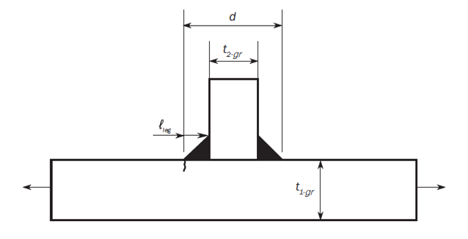
    **Figure : Toe distance for cruciform welded joints, transverse T-joints and plates with transverse attachment**

    | No | Joint category description | Geometry | Condition | $n$ |
    | --- | --- | --- | --- | --- |
    | 1 | Cruciform joints, transverse T-joints, plates with transverse attachments | 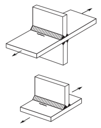 | As-welded | 0.25 |
    | 1 | Cruciform joints, transverse T-joints, plates with transverse attachments |   | Weld toe treated by post-weld improvement method | 0.2 |
    | 2 | Transverse butt welds | 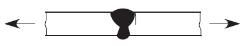 | As-welded | 0.2 |
    | 2 | Transverse butt welds |   | Ground flush or weld toe treated by post-weld improvement method | 0.1 |
    | 3 | Longitudinal welds or attachments to plate edges | 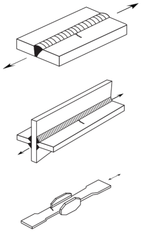 | Any | 0.1 |
    | 3 | Longitudinal welds or attachments to plate edges |   | Weld toe treated by post-weld improvement method | 0.1 |
    | 4 | Longitudinal attachments on the flat bar or bulb profile | 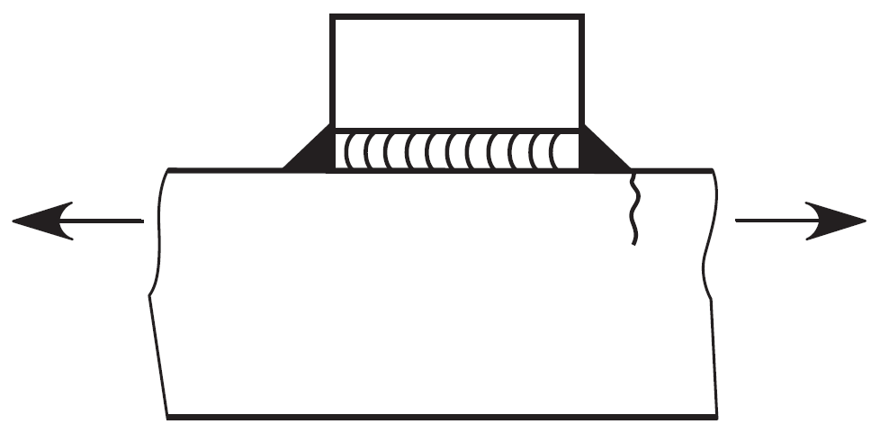 | Any | 0 |
    | 4 | Longitudinal attachments on the flat bar or bulb profile |   | Weld toe treated by post-weld improvement method (1) | 0 |
    | 5 | Longitudinal attachments and doubling plates | 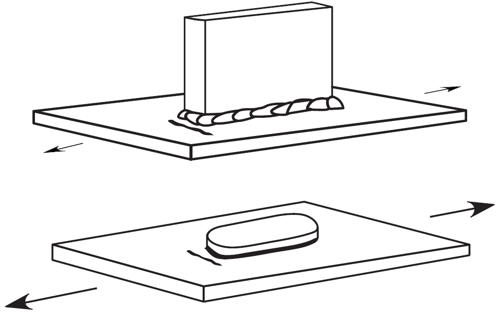 | As-welded | 0.2 |
    | 5 | Longitudinal attachments and doubling plates |   | Weld toe treated by post-weld improvement method | 0.1 |
    | 6 | Longitudinal attachments and doubling plates supported longitudinally | 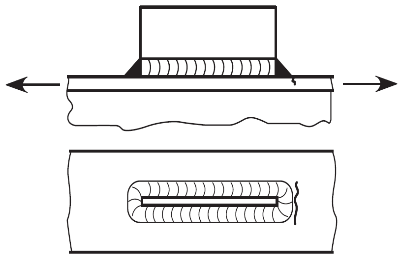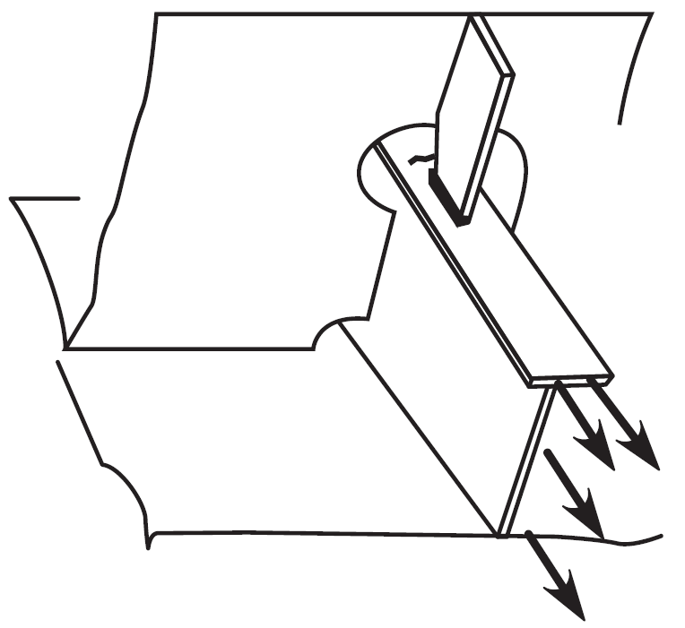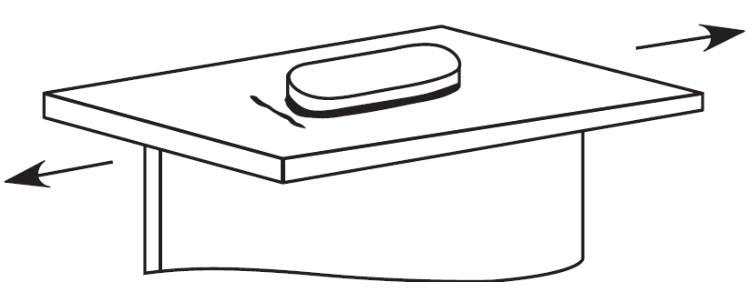 | As-welded | 0.1 |
    | 6 | Longitudinal attachments and doubling plates supported longitudinally |   | Weld toe treated by post-weld improvement method (1) | 0 |
    | (1) No benefit applicable for post-weld treatment of longitudinal end connections. |   |   |   |   |

#### 4. S-N Curves

- **4.1** **Basic S-N curves**
  - **4.1.1** **Capacity**
    The capacity of welded steel joints and steel base material with respect to fatigue strength is defined by S-N curves which provide the relationship between the stress range applied to the detail and the number of constant amplitude load cycles to failure.
  - **4.1.2** **Design S-N curves**
    The fatigue assessment is based on use of S-N curves which are obtained from fatigue tests. The design S-N curves are established at two standard deviations below the mean S-N curves corresponding to 50% of probability of survival for relevant experimental data. Design S-N curves given in **Table 2** and **Table 3** correspond to a probability of survival of 97.7%.
  - **4.1.3** **S-N curve scope of application**
    The S-N curves are applicable to normal and high strength steels up to a specified minimum yield stress equal to 390 N/mm^2.
  - **4.1.4** **In-air environment**
    The basic design curves in-air environment shown in **Figure 2** are represented by linear relationships between log ($\Delta \sigma$) and log (N) as follows:
    $\log (N) = \log (K _{2} ) - m \cdot \log( \Delta \sigma )$
    where:
    $\log (K _{2} ) = \log (K _{1} ) - 2\log ( \delta )$.
    $K _{1}$ : Constant related to mean S-N curve, as given in **Table 2**.
    $K _{2}$ : Constant related to design S-N curve, as given in **Table 2**.
    $\delta$ : Standard deviation of log (N), as given in **Table 2**.
    $\Delta \sigma _{q}$ : Stress range at N = 10^7 cycles related to design S-N curve, in N/mm^2, as given in **Table 2**.

    | Class | $K _{1}$ |   | $m$ | Standard deviation $\delta$ | $K _{2}$ | Design stress range at 10^7 cycles | Design stress range at 2×10^6 cycles |
    | --- | --- | --- | --- | --- | --- | --- | --- |
    | Class | $K _{1}$ | ${\log _{10} K _{1}}$ | $m$ | ${\log _{10} }} {\delta }$ | $K _{2}$ | $bold \Delta \sigma _{q}$ N/mm^2 | N/mm^2 |
    | B | 2.343E15 | 15.3697 | 4.0 | 0.1821 | 1.013E15 | 100.2 | 149.9 |
    | C | 1.082E14 | 14.0342 | 3.5 | 0.2041 | 4.227E13 | 78.2 | 123.9 |
    | D | 3.988E12 | 12.6007 | 3.0 | 0.2095 | 1.519E12 | 53.4 | 91.3 |

    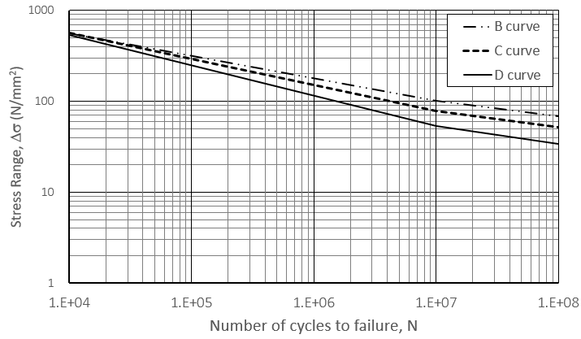
    **Figure : Basic design S-N curves, in-air environment**
  - **4.1.5** **Corrosive environment**
    The basic design curves for corrosive environment shown in **Figure 3** are represented by linear relationships between #eqnID-5319_s0and $\log (N)$ as follows:
    $\log (N) = \log (K _{2} ) - m \log( \Delta \sigma )$
    where:
    $N$ : Predicted number of cycles to failure under stress range $\Delta \sigma$.
    $K _{2}$ : Constant related to design S-N curve as given in **Table 3**.

    | Class | $K _{2}$ | $m$ | Design stress range at 2×10^6 cycles, N/mm^2 |
    | --- | --- | --- | --- |
    | $B _{corr}$ | 5.05×10^14 | 4.0 | 126.1 |
    | $C _{corr}$ | 2.12×10^13 | 3.5 | 101.6 |
    | $D _{corr}$ | 7.60×10^11 | 3.0 | 72.4 |

    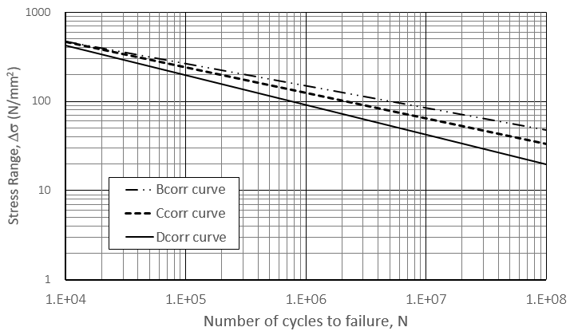
    **Figure : Basic design S-N curves, corrosive environment**
- **4.2** **Selection of S-N curves**
  - **4.2.1** **Welded joints**
    For fatigue assessment of welded joints exposed to in-air environment, S-N curve D as defined in **Table 2** is to be used. For corrosive environment, S-N curve $D _{corr}$ as defined in **Table 3** is to be used.
  - **4.2.2** **Base material free edge**
    For fatigue assessment of base material at free edge exposed to in-air environment, S-N curves B or C as defined in **Table 2** are to be used. For corrosive environment, S-N curves $B _{corr}$ or $C _{corr}$ as defined in **Table 3** are to be used.
  - **4.2.3** **Surface finishing factor**
    The S-N curve C is applicable to most of non-welded locations taking into account the likelihood of some notching from corrosion, wear and tear in service with surface finishing factor as given in **Table 4**.
    Higher surface finishing quality may be applied in using S-N curve B as given in **Table 4**, provided adequate protective measures are taken against wear, tear and corrosion and finite element analysis according to **Ch 9, Sec 5, [2]** is carried out.

    | Joint configuration, fatigue crack location and stress direction |   | Edge cutting process | Edge treatment | Surface finishing | n | $k _{sf}$ | S-N curve |
    | --- | --- | --- | --- | --- | --- | --- | --- |
    | 1 | Rolled or extruded plates and sections as well as seamless pipes, no surface or rolling defects 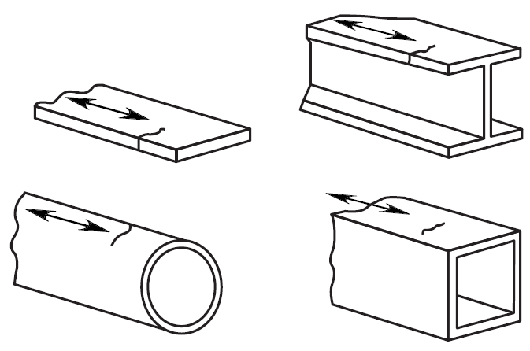 | N/A | N/A | No surface nor roll defect(1)(2) | 0 | 0.94 | B |
    | 2 | Cut edges 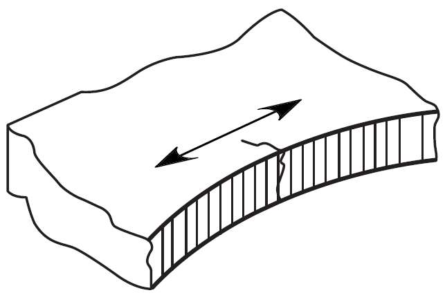 | Machine cutting e.g. by a thermal process or sheared edge cutting | Cutting edges chamfered or rounded by means of smooth grinding, groove direction parallel to the loading direction | Smooth surface free of cracks and notches(1)(2) | 0.1 | 1.00 | B |
    | 2 |   | Machine cutting e.g. by a thermal process or sheared edge cutting | Cutting edges broken or rounded | Smooth surface free of cracks and notches(1)(2) | 0.1 | 1.07 | B |
    | 2 |   | Machine cutting e.g. by a thermal process or sheared edge cutting | No edge treatment | Surface free of cracks and severe notches (inspection procedure)(1)(2) | 0.1 | 1.00 | C |
    | 2 |   | Manually thermally cut e.g. by flame cutting | No edge treatment | Surface free of cracks and severe notches (inspection procedure)(1)(2) | 0.1 | 1.24 | C |
    | (1) Stress increase due to geometry of cut-outs to be considered. (2) Fine mesh FE analysis according to **Ch 9, Sec 5, [2]**. |   |   |   |   |   |   |   |

#### 5. Fatigue Damage Calculation

- **5.1** **General**
  - **5.1.1** The design fatigue life is divided into a number of time periods due to different loading conditions and due to limitation of the corrosion protection.
    It is assumed that the corrosion protection (i.e. coating system) is only effective for a limited number of years during which the structural details are protected, i.e. in-air environment. During the remaining part of the design life as specified in **Table 5**, the structural details are unprotected i.e. exposed to corrosive environment.
  - **5.1.2** The elementary fatigue damage, given in **[5.2]**, is the damage accumulated during a specific loading condition $(j)$ associated with a specific environmental condition either protected condition, i.e. in-air environment, or unprotected condition, i.e. corrosive environment.
    The combined fatigue damage, given in **[5.3]**, is the combination of damage accumulated for a specific loading condition $(j)$ for the in-air and corrosive environment time.
    Total fatigue damage, given in **[5.4]**, is the sum of the combined fatigue damages obtained for all loading conditions.
- **5.2** **Elementary fatigue damage**
  - **5.2.1** The elementary fatigue damage for each fatigue loading condition $(j)$ is to be calculated independently for both protected in-air environment and unprotected corrosive environment, based on the fatigue stress range obtained for the predominant load case as follows:
    $D _{E (j)} = \frac{\alpha _{(j)} \cdot N _{D}}{K _{2}} \frac{\Delta \sigma _{FS, (j)}^{m}}{(\ln N _{R} ) ^{m/ \xi }} \cdot \mu _{(j)} \cdot \Gamma (1+ \frac{m}{\xi} )$
    where:
    $N_{ D}$ : Total number of wave cycles experienced by ship during the design fatigue life, taken as:
    $N _{D} =31.557 \times 10 ^{6} (f _{0} T _{DF} ) / (4 \log L)$
    $f_{ 0}$ : Factor taking into account time in seagoing operations excluding time in loading and unloading, repairs, etc.
    #eqnID-53410_s0.85
    $\alpha _{(j)}$ : Fraction of time in each loading condition given in **Ch 9, Sec 1, Table 1**.
    $\Delta \sigma _{FS, (j)}$: Fatigue stress range at the reference probability level of exceedance of 10^-2, in N/mm^2.
    $N _{R}$ : Number of cycles corresponding to the reference probability of exceedance of 10^-2.
    #eqnID-5345100_s0
    $\xi$ : Weibull shape parameter,
    $\xi = 1$
    $\Gamma (x)$ : Complete Gamma function.
    $K _{2}$ : Constant of the design S-N curve, as given in **Table 2** for in-air environment and in **Table 3** for corrosive environment.
    $\mu _{(j)}$ : Coefficient taking into account the change of inverse slope of the S-N curve, m,
    • For in-air environment:
    $\mu _{(j)} = 1- \frac{\left\{ \gamma (1+ \frac{m}{\xi} , \nu _{(j)} ) - \nu _{(j)}^{- \Delta m/ \xi } \cdot \gamma \left( 1 +( \frac{m+ \Delta m}{\xi} ) , V _{(j)} \right) \right\}}{\Gamma (1+ \frac{m}{\xi} )}$
    $\nu _{(j)} = \left( \frac{\Delta \sigma _{q}}{\Delta \sigma _{FS , (j)}} \right) ^{\xi } I n N _{R}$
    • For corrosive environment:
    $\mu _{(j)} = 1.0$
    $\gamma (a,x)$ : Incomplete Gamma function.
    $\Delta \sigma _{q}$ : Stress range, in N/mm^2, corresponding to the intersection of the two segments of design S-N curve at N = 10^7 cycles, as given in **Table 2**.
    $\Delta m$ : Change in inverse slope of S-N curve at N = 10^7 cycles.
    $\Delta m = 2$
- **5.3** **Combined fatigue damage**
  - **5.3.1** The combined fatigue damage in protected in-air environment and unprotected corrosive environment for each loading condition $(j)$ is to be calculated as follows:
    $D _{(j)} = D _{E , air (j)} \cdot \frac{T _{DF} -T _{C}}{T _{DF}} + D _{E , corr(j)} \cdot \frac{T _{C}}{T _{DF}}$
    where:
    $D _{E , air (j)}$: The elementary fatigue damage for in-air environment for loading condition $(j)$ given in **[5.2.1]**.
    $D _{E , corr(j)}$: The elementary fatigue damage for corrosive environment for loading condition $(j)$ as calculated in **[5.2.1]**.
    $T _{C,25}$ : Time in corrosive environment, in years, within the duration of the minimum design life ($T _{D,25}$) as defined in **Table 5**.
    $T _{D,25}$ : Minimum design life, in years, to be taken as 25 years.
    $T _{C}$ : Time in corrosive environment, in years, within the duration of the design fatigue life ($T _{DF}$) to be taken as:
    $T _{C} =T _{DF} -(T _{D,25} -T _{C,25} )$

    | Location of weld joint or structural detail | Time in corrosive environment $T _{C, 25}$ , in years |
    | --- | --- |
    | Water ballast tank | 5 |
    | Cargo hold | 0 |
    | Void space | 0 |
    | Other areas | 0 |
- **5.4** **Total fatigue damage**
  - **5.4.1** The total fatigue damage for all applicable loading conditions is calculated as follows:
    $D = \sum _{j=1} ^{ n _{LC}} D _{(j)}$
    where:
    $D_{ (j)}$ : Combined fatigue damage for each applicable loading condition, as given in **[5.3]**.
- **5.5** **Fatigue life calculation**
  - **5.5.1** The fatigue life, $T_{ F}$, is taken as:
    $T _{F} = \frac{T _{DF}}{D _{air}}$ if $\frac{T _{DF}}{D _{air}} \leq (T _{DF} -T _{C} )$
    $T _{F} = T _{DF} -T _{C} +( \frac{T _{DF}}{D _{air}} -T _{DF} +T _{C} ) \frac{D _{air}}{D _{corr}}$ otherwise
    where:
    $D _{air}$ : Total fatigue damage for all loading conditions in-air environment taken as:
    $D _{air} = \sum _{j=1} ^{n _{LC}} D _{E , air (j)}$
    $D _{corr}$ : Total fatigue damage for all loading conditions in corrosive environment taken as:
    $D _{corr} = \sum _{j=1} ^{n _{LC}} D _{E , corr (j)}$

#### 6. Weld Improvement Methods

- **6.1** **General**
  - **6.1.1** **(2023)**
    Post-weld fatigue strength improvement methods are to be considered as a supplementary means of achieving the required fatigue life, and subjected to quality control procedures and corrosion protection in accordance with Ch 3, Sec 4.
  - **6.1.2** **Limitation of the benefit of post-weld treatment**
    For structural details where the benefit of post-weld treatment is applicable, the calculated fatigue life at the design stage for the considered structural detail excluding the post-weld treatment effects, is not to be less than $T _{DF}$/1.47.
    Note 1: When $T _{DF}$ is taken equal to 25 years, the calculated fatigue life at the design stage for the considered structural detail excluding the post-weld treatment effects, is not to be less than 17 years.
  - **6.1.3** **Post-weld treatment at fabrication stage**
    There is one basic post-weld treatment method considered in these Rules to improve fatigue strength at the fabrication stage, i.e. weld geometry control and defect removal method by burr grinding.
  - **6.1.4** **Weld toe**
    The improvement method is applied to the weld toe. Thus, it is intended to increase the fatigue life of the weld from the viewpoint of a potential fatigue failure arising at the weld toe. The possibility of failure initiation at other locations is always to be considered. If the failure is shifted from the weld toe to the root by applying post-weld treatment, there may be no significant improvement in the overall fatigue performance of the joint. Improvements of the weld root cannot be expected from treatment applied to weld toe.
    A brief description of the method and the degree of improvement which can be achieved is given in **[6.2].**
  - **6.1.5** **Weld type for post-weld treatment**
    When weld improvements are planned, full or partial penetration welds with a minimum root face according to **Ch 12, Sec 3, [2.4]** are to be used to mitigate or to eliminate the possibility of cracking at the weld root.
- **6.2** **Weld toe burr grinding**
  - **6.2.1** The weld may be machined using a burr grinding tool to produce a favourable shape to reduce stress concentrations and remove defects at the weld toe, see **Figure 4**. In order to eliminate defects, such as intrusions, undercuts and cold laps, the material in way of the weld toe is to be removed. The depth of grinding shall be at least 0.5 mm below the bottom of any visible undercut. The total depth of the burr grinding is not to be greater than the lesser of 2 mm and of 7% the local gross thickness of the machined plate. Any undercut not complying with this requirement is to be repaired by an approved method.
  - **6.2.2** To avoid introducing a detrimental notch effect due to small radius grooves, the burr diameter is to be scaled to the plate thickness at the weld toe being ground. The diameter is to be in the 10 to 25 mm range for application to welded joints with plate thickness from 10 to 50 mm. The resulting root radius of the groove is to be no less than 0.25 $t _{as"_" built}$.The weld throat thickness and leg length after burr grinding must comply with the rule requirements or any increased weld sizes as indicated on the approved drawings.
    The inspection procedure is to include a check of the weld toe radius, the depth of burr grinding, and confirmation that the weld toe undercut has been removed completely.
    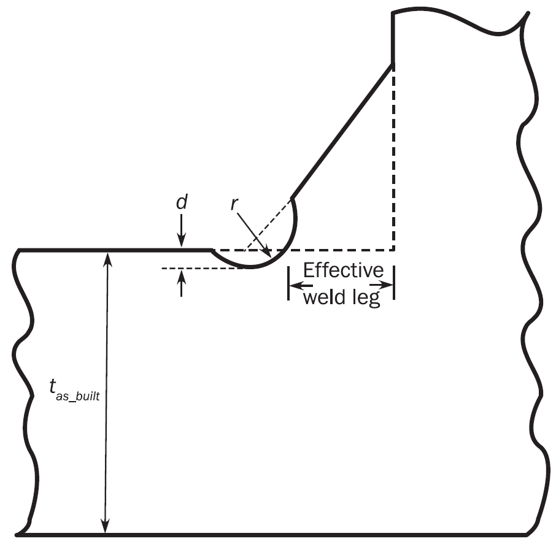
    **Figure : Details of ground weld toe geometry**
- **6.3** **Fatigue improvement factor**
  - **6.3.1** The benefit of burr grinding corresponds to an increase in fatigue strength by a factor of 1.3 (i.e. a reduction of the effective stress range by 1.3), reducing the damage in air to $D _{air}$/2.2,
    where:
    $D _{air}$ : Fatigue damage in air as given in **Ch 9, Sec 3, [5.3.1]**.
- **6.4** **Applicability**
  - **6.4.1** **(2023)**
    The application of post-weld improvement and fatigue improvement factor provided in this section is subject to following limitations:
    • The weld type complies with **[6.1.5]**.
    • The weld improvement is effective in improving the fatigue strength of structural details under high cycle fatigue conditions therefore the fatigue improvements factors do not apply to low-cycle fatigue conditions, i.e. when $N \leq 5 \times 10 ^{4}$, where $N$ is the number of life cycles to failure.
    • Unless otherwise specifically stated, the fatigue improvement factor is to be used for welds, joining steel plates which are between 6 and 50 mm thick.
    • Fatigue improvement factor is to be applied to as-welded transverse butt welds, as-welded T-joint and cruciform welds and as-welded longitudinal attachment welds excluding longitudinal end connections.
    • In way of areas prone to mechanical damage, fatigue improvement may only be granted if these are adequately protected.
    • Treatment of inter-bead toes is required for large multi-pass welds as shown in **Figure 5**.
    • The builder is to provide the list of details and their locations on the ship for which the post-weld treatment has been applied.
    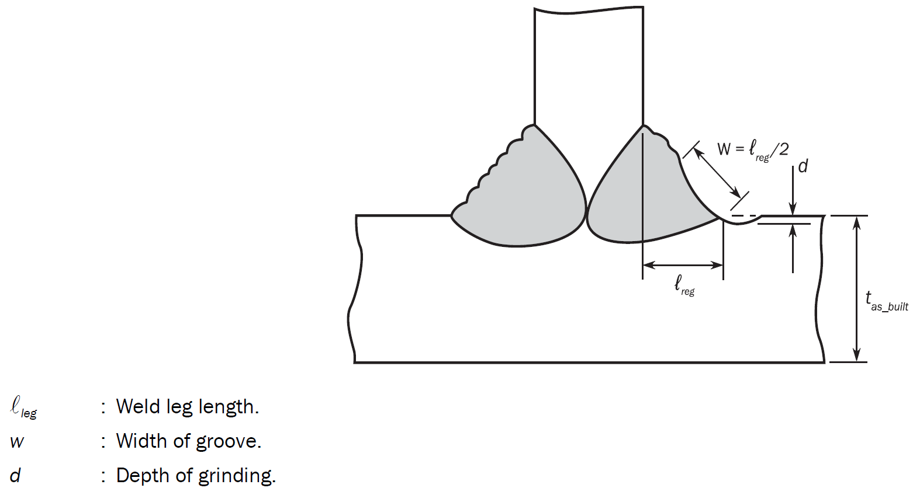
    **Figure : Extent of weld toe burr grinding to remove inter-bead toes on weld surface**

#### 7. Workmanship

- **7.1** **Application**
  - **7.1.1** In general, the fatigue performance of structural details can be improved by adopting enhanced workmanship standards, which include building alignment and weld control.
- **7.2** **Workmanship control for construction details**
  - **7.2.1** **Building alignment and tolerance control**
    Building alignment exceeding construction tolerance could introduce additional stress concentration for structural details, reducing the fatigue performance. The builder is responsible to comply with the construction requirements given in **Ch 12, Sec 1**.
  - **7.2.2** **Weld profile control**
    Poor weld geometry could introduce additional stress concentration; therefore special attention should be given to achieving a favourable geometry and smooth transition at the weld toe. Weld profile control, i.e. enhanced workmanship may be required by the Society in way of critical weld toe locations.
    The weld notch stress concentration is a direct function of the weld flank angle and the weld toe radius.
    The validity of the aforementioned S-N curves is based on a weld flank angle with a maximum mean value of 50 deg and on a weld toe radius with a minimum mean value of 0.5 mm. Welding details may be requested to be submitted for approval for some critical areas considering the calculated fatigue life.
  - **7.2.3** **Post-weld treatment methods**
    Post-weld treatment methods may be used to improve fatigue resistance of structural detail, as specified in **[6]**.
    At the design stage, the calculated fatigue life should not generally take into account any benefit that may be derived from such treatment. This benefit should only be considered in exceptional cases when the design fatigue life can not reasonably be achieved by adopting alternative design measures such as improvement of the shape of the cut-outs, soft brackets toes, local increase in thickness or other changes in geometry of the structural detail. This is to be considered on a case-by-case basis by the Society.
  - **7.2.4** **Detail design standard**
    Requirements for improved design of structural details are provided in **Ch 9, Sec 6**. The detail design standard also includes workmanship and welding requirements.

### Section 42 - Simplified Stress Analysis

**Symbols**
For symbols not defined in this section, refer to **Ch 1, Sec 4**.
$(i)$ : Suffix which denotes dynamic load case HSM, FSM, BSR-P, BSR-S, BSP-P, BSP-S, OST-P or OST-S specified in **Ch 4, Sec 2, [3.1]**.
‘$i1$’ denotes dynamic load case HSM-1, FSM-1, BSR-1P, BSR-1S, BSP-1P, BSP-1S, OST-1P or OST-1S.
‘$i2$’ denotes dynamic load case HSM-2, FSM-2, BSR-2P, BSR-2S, BSP-2P, BSP-2S, OST-2P or OST-2S.
$(j)$ : Suffix which denotes loading condition:
‘Full load’ or ‘Normal ballast’ as defined in **Ch 9, Sec 1, [6.2]**.
$\ell _{ bdg}$ : Effective bending span of stiffener, in m, as defined in **Ch 3, Sec 7**.
$I_{ y-n50}$ : Net vertical hull girder moment of inertia, at the longitudinal position being considered, in m^4.
$I _{z-n50}$ : Net horizontal hull girder moment of inertia, at the longitudinal position being considered, in m^4.
$y$ : Transverse coordinate of the load calculation point under consideration, in m.
$z$ : Vertical coordinate of the load calculation point under consideration, in m.
$z _{n}$ : Distance from the baseline to the horizontal neutral axis, in m.
$f _{c}$ : Correction factor as defined in **Ch 9, Sec 1, [5.1.2]**.
$K _{a}$ : Geometrical stress concentration factor for stress due to axial load given in **[5.2]**.
$K _{b}$ : Geometrical stress concentration factor for stress due to lateral pressure given in **[5.2]**.
$K _{n}$ : Stress concentration factor due to unsymmetrical stiffener geometry, as defined in **[5.1]**.

#### 1. General

- **1.1** **Application**
  - **1.1.1** This section defines the procedure for a simplified stress assessment which is to be used to evaluate the fatigue strength of the longitudinal stiffener end connections.
  - **1.1.2** The hot spot stress ranges and hot spot mean stresses in way of each end connection of longitudinal stiffener, as shown in **Figure 1** are to be evaluated at the flange of the longitudinal stiffener
    Stress concentration factors due to unsymmetrical stiffener geometry according **[5.1]** and due to the stiffener end connection geometry at point ‘A’ and ‘B’ according to **[5.2]** are to be applied.
- **1.2** **Assumptions**
  - **1.2.1** The following assumptions are made in the fatigue assessment for longitudinal stiffener end connections:
    • Nominal stresses.
    • Stress concentration factors given in **[5]**.
    • Loading conditions specified in **Ch 9, Sec 1, [6]**.
    - **a)** The hot spot stress is based on:
    - **b)** The longitudinal stiffener end connection types are described in **[5.2]**.
  - **1.2.2** The end connections given in **[5.2]** are based on typical joint geometry under axial and lateral loadings. When a structural detail is different from those shown in **Table 3**, a finite element analysis is to be used to demonstrate the adequacy of the detail in terms of fatigue strength, according to **[5.3]**.

#### 2. Hot Spot Stress

- **2.1** **Hot spot stress range**
  - **2.1.1** The hot spot stress range, in N/mm^2, due to dynamic loads for load case $(i)$ of loading condition $(j)$ is obtained from the following formula:
    $\Delta \sigma _{HS , i (j)} =  ( \sigma _{GD , i 1 (j)} + \sigma _{LD , i 1 (j)} ) - ( \sigma _{GD , i 2 (j)} + \sigma _{LD , i 2 (j) } ) $
    where:
    $\sigma _{GD , i1 (j)} , \sigma _{GD , i2 (j)}$ : Stresses due to global hull girder wave bending moments, in N/mm², as defined in **[3.1.1]**.
    $\sigma _{LD , i1 (j)} , \sigma _{LD , i2 (j)}$ : Stresses due to local dynamic pressure, in N/mm², as defined in **[4.1.1]**.
- **2.2** **Hot spot mean stress**
  - **2.2.1** The hot spot mean stress, in N/mm^2, due to static and dynamic loads for load case $(i)$ of loading condition $(j)$ is obtained from the following formula:
    $\sigma _{mean , i (j)} = \sigma _{GS, (j)} + \sigma _{LS , (j)} + \sigma _{mLD , i (j)} + \sigma _{mGD , i (j)}$
    where for the load case $(i)$ of loading condition $(j)$:
    $\sigma _{GS, (j)}$ : Stress due to still water hull girder bending moment, in N/mm², as defined in **[3.2.1]**.
    $\sigma _{LS, (j)}$ : Stress due to local static pressure, in N/mm², as defined in **[4.1.2]**.
    $\sigma _{mLS, (j)}$ : Mean stress due to local dynamic pressure, in N/mm², as defined as:
    $\sigma _{mLD , i (j)} = \frac{\sigma _{LD , i 1(j)} + \sigma _{LD , i 2(j)}}{2}$
    $\sigma _{LD , i 1(j)} , \sigma _{LD , i 2(j)}$: Stress due to local dynamic pressure, in N/mm², as defined in **[4.1.1]**.
    $\sigma _{mGD, (j)}$ : Mean stress due to global wave bending moment, in N/mm², as defined as:
    $\sigma _{mGD , i (j)} = \frac{\sigma _{GD , i 1(j)} + \sigma _{GD , i 2(j)}}{2}$
    $\sigma _{GD , i 1(j)} , \sigma _{GD , i 2(j)}$: Stress due to global wave bending moment, in N/mm², as defined in **[3.1.1]**.

#### 3. Hull Girder Stress

- **3.1** **Stress due to hull girder wave bending moments**
  - **3.1.1** The hull girder hot spot stress, in N/mm^2, for load cases $i1$ and $i2$ of loading condition $(j)$ is obtained from the following formula:
    $\sigma _{GD , i k(j)} =f _{c} \cdot K _{a} ( \frac{M _{wv-LC , ik}}{I _{y-n50}} (z -z _{n} )- \frac{M _{wh-LC , ik}}{I _{Z-n50}} y ) 10 ^{-3}$
    where:
    $M _{wv-LC , ik}$: Vertical wave bending moment, in kNm, of the considered dynamic load case, as defined in **Ch 4, Sec 4**, at the hull girder load calculation point of the considered longitudinal position for the loading condition $(j)$ for $ik$ being equal to $i1$ and $i2$.
    $M _{wh-LC , ik}$: Horizontal wave bending moment, in kNm, of the considered dynamic load case, as defined in **Ch 4, Sec 4**, at the hull girder load calculation point of the considered longitudinal position for the loading condition $(j)$ for $ik$ being equal to $i1$ and $i2$.
- **3.2** **Stress due to still water hull girder bending moment**
  - **3.2.1** The hull girder hot spot stress due to still water bending moment, in N/mm^2, in loading condition $(j)$ is obtained from the following formula:
    $\sigma _{GS , (j)} = \frac{f _{c} \cdot K _{a} \cdot \beta _{(j)} \cdot M _{sw} \cdot (z -z _{n} )}{I _{y-n50}} 10 ^{-3}$
    where:
    $M _{sw}$ : Permissible still water vertical bending moment, in kNm, as defined in **Ch 4, Sec 4** at the hull girder load calculation point of the considered longitudinal position.
    $\beta _{(j)}$ : Fraction of permissible still water vertical bending moment, as defined in **Table 1**.

    | Loading conditions | $boldbeta _{(j)}$ |
    | --- | --- |
    | Homogeneous | 1.0 in sagging condition |
    | Normal ballast | 0.8 in hogging condition |

#### 4. Local Stiffener Stress

- **4.1** **Stress due to stiffener bending**
  - **4.1.1** **Stress due to dynamic pressure**
    The hot spot stress, in N/mm^2, due to local dynamic pressure in load case $i1$ and $i2$ for loading condition $(j)$ is obtained from the following formula:
    $\sigma _{LD , ik (j) } = \frac{K _{b} K _{n} s \ell _{bdg}^{2} ( \eta _{w} f _{NL} P _{w , ik (j)} + \eta _{ld} P _{id ,ik (j)} ) (1- \frac{6x _{e}}{\ell _{bdg}} + \frac{6x _{e}^{2}}{\ell _{bdg}^{2}} )}{12 Z _{eff-n50}}$
    where:
    $P _{W, ik(j)}$ : Dynamic wave pressure, at the mid span, in kN/m^2, specified in **Ch 4, Sec 5, [1.4]**, in load case $i1$ and $i2$ for loading condition $(j)$.
    $P _{ld, ik(j)}$ : Dynamic liquid tank pressure, at the mid span, in kN/m^2, as specified in **Ch 4, Sec 6, [1.1.1]**, in load case $i1$ and $i2$ for loading condition $(j)$.
    Pressure acting on both sides of the stiffener, i.e. applied on the attached plate on stiffener side or on opposite side to the stiffener, could be simultaneously considered if relevant in the loading condition.
    $\eta _{W} , \eta _{ld}$ : Pressure normal coefficients, taken as:
    $\eta = 1$ when the considered pressure is applied on the stiffener side,
    $\eta = -1$ otherwise.
    $f _{NL}$ : Correction factor for the non-linearity of the wave pressure taken as:
    $f_{ NL}=1$ for $z>T _{ LC}+2h _{ w}$
    $f _{NL} =2.5 \frac{z-T _{LC}}{h _{w}} -4$ for $T _{LC} +1.8h _{w} \(f _{NL} =0.5 \frac{z-T _{LC}}{h _{w}} -0.4$ for $T _{LC} +1.6h _{w} \(f _{NL} =0.4$ for $T _{LC} +1.2h _{w} \(f _{NL} =0.7-0.25 \frac{z-T _{LC}}{h _{w}}$ for $T _{LC} +0.6h _{w} \(f _{NL} =1-0.75 \frac{z-T _{LC}}{h _{w}}$ for $T _{LC} -0.2h _{w} \(f _{NL} =0.1875 \frac{z-T _{LC}}{h _{w}} +1.1875$ for $T _{LC} -h _{w} \(f _{NL} =1$ for $z \leq T _{LC} -h _{w}$
    $h _{w}$ : Water head equivalent to the pressure at waterline, in m, as defined in **Ch 4, Sec 5**.
    $x _{e}$ : Distance, in m, to the hot spot from the closest end of the span $\ell _{ bdg}$, as defined in **Figure 1**.
    $Z _{eff-n50}$ : Net section modulus, in cm^3, of the considered stiffener calculated considering an effective breadth $b_{ eff}$ of attached plating.
    $b_{ eff}$ : Effective breadth, in mm, of attached plating specified at the ends of the span and in way of end brackets and supports, taken as:
    $b _{eff} =s \cdot \min \left( 100 \ell ; 0.42s+30\ell \right)$
  - **4.1.2** **Stress due to static pressure**
    The hot spot stress due to local static pressure, in N/mm^2, for loading condition $(j)$ is obtained from the following formula:
    $\sigma _{LS , (j)} = \frac{K _{b} K _{n} s \ell _{bdg}^{2} ( \eta _{s} P _{S , (j)} + \eta _{ls} P _{ls, (j)} ) (1- \frac{6x _{e}}{\ell _{bdg}} + \frac{6x _{e}^{2}}{\ell _{bdg}^{2}} )}{12 Z _{eff-n50}}$
    where:
    $P _{S, (j)}$ : Static external pressure, in kN/m^2, in loading condition $(j)$ specified in **Ch 4, Sec 5, [1.2]**.
    $P _{ls, (j)}$ : Static liquid tank pressure, in kN/m^2, in loading condition $(j)$ specified in **Ch 4, Sec 6, [1.2]**.
    Pressure acting on both sides could be simultaneously considered if relevant in the loading condition.
    $\eta _{S} , \eta _{ls}$ : Pressure normal coefficients, taken as:
    $\eta = 1$ when the considered pressure is applied on the stiffener side,
    $\eta = -1$ otherwise.

#### 5. Stress Concentration Factors

- **5.1** **Unsymmetrical stiffener**
  - **5.1.1** The stress concentration factor $K _{n}$ for unsymmetrical flange of built-up and rolled angle stiffeners under lateral load, calculated at the web’s mid-thickness position, as shown in **Figure 2**, is to be taken as:
    $K _{n} = \frac{1+ \lambda \beta ^{2}}{1+ \lambda \beta ^{2} \psi _{Z}}$
    where:
    $\lambda = \frac{3(1+ \frac{\eta}{280} )}{1+ \frac{\eta}{40}}$
    $\eta = \frac{\ell _{bdg}^{4} \cdot 10 ^{12}}{b _{f-n50}^{3} \times t _{f-n50} \times h _{stf-n50}^{2} ( \frac{4 \cdot h _{stf-n50}}{t _{w-n50}^{3}} + \frac{s}{t _{p-n50}^{3}} )}$
    $\beta = 1- \frac{2b _{g-n50}}{b _{f-n50}}$ for built-up profiles.
    $\beta = 1- \frac{2t _{w-n50}}{b _{f-n50}}$ for rolled angle profiles.
    $b _{g-n50}$ : Eccentricity of the stiffener equal to the distance from flange’s edge to web’s centreline, in mm, as shown in **Figure 3**.
    $b _{f-n50}$ : Net breadth of flange, in mm, as shown in **Figure 3**.
    $t _{f-n50}$ : Net flange thickness, in mm, as shown in **Figure 3**.
    $h _{stf-n50}$ : Net stiffener height, including face plate, in mm, as shown in **Figure 3**.
    $t _{w-n50}$ : Net web thickness, in mm, as shown in **Figure 3**.
    $h _{w-n50}$ : Net web’s height stiffener, in mm, as shown in **Figure 3**.
    $t _{p-n50}$ : Net thickness of attached plating, in mm, as shown in **Figure 3**.
    $\psi _{z}$ : Coefficient given as:
    $\psi _{z} = \frac{h _{w-n50}^{2} t _{w-n50}}{4 Z _{n50}} 10 ^{-3}$
    $Z _{n50}$ : Net section modulus, in cm^3, of stiffener with an attached plating breadth equal to the stiffener spacing.
    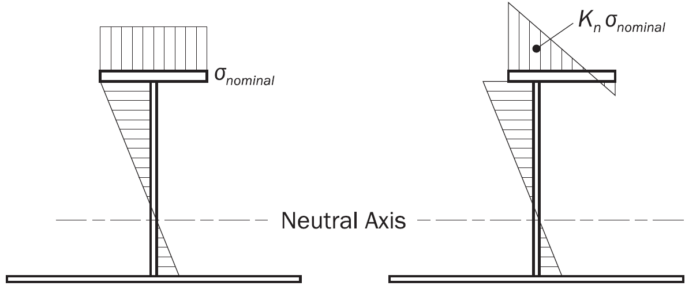
    **Figure : Bending stress in stiffener with symmetrical and unsymmetrical flange**
    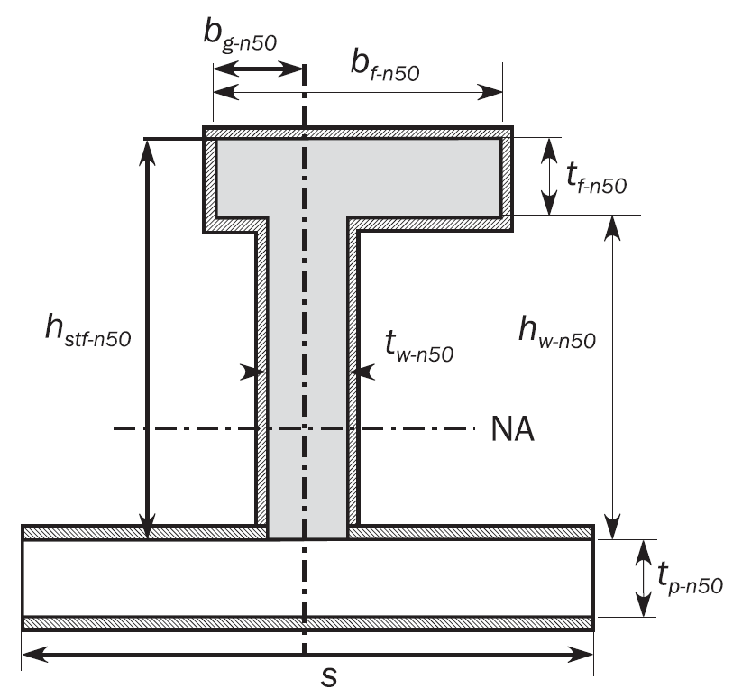
    **Figure : Stiffener - net scantling**
  - **5.1.2** **Bulb profiles**
    For bulb profiles $K _{n}$ factor is to be calculated using the equivalent built-up profile as shown in **Figure 4**. The flange of the equivalent built-up profile is to have the same properties as the bulb flange, i.e. same cross sectional area and moment of inertia about the vertical axis and neutral axis position.
    For HP bulb profiles, examples of the equivalent built up profile dimensions are listed in **Table 2**.
    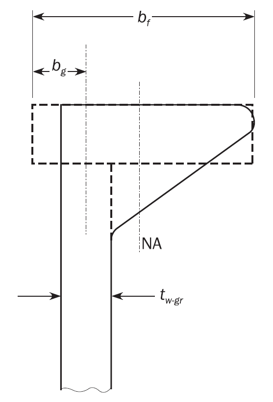
    **Figure : Bulb profile and equivalent built-up profile**

    | HP-bulb |   | Equivalent built-up flange in gross thickness |   |   |
    | --- | --- | --- | --- | --- |
    | Height (mm) | Gross web thickness, $t _{w-gr}$ (mm) | ${b _{f}}}$ (mm) | $t _{f-gr}$ (mm) | ${b _{g}}}$ (mm) |
    | 200 | 9 - 13 | $t _{w-gr}$ + 24.5 | 22.9 | ($t _{w-gr}$ + 0.9)/2 |
    | 220 | 9 - 13 | $t _{w-gr}$ + 27.6 | 25.4 | ($t _{w-gr}$ + 1.0)/2 |
    | 240 | 10 - 14 | $t _{w-gr}$ + 30.3 | 28.0 | ($t _{w-gr}$ + 1.1)/2 |
    | 260 | 10 - 14 | $t _{w-gr}$ + 33.0 | 30.6 | ($t _{w-gr}$ + 1.3)/2 |
    | 280 | 10 - 14 | $t _{w-gr}$ + 35.4 | 33.3 | ($t _{w-gr}$ + 1.4)/2 |
    | 300 | 11 - 16 | $t _{w-gr}$ + 38.4 | 35.9 | ($t _{w-gr}$ + 1.5)/2 |
    | 320 | 11 - 16 | $t _{w-gr}$ + 41.0 | 38.5 | ($t _{w-gr}$ + 1.6)/2 |
    | 340 | 12 - 17 | $t _{w-gr}$ + 43.3 | 41.3 | ($t _{w-gr}$ + 1.7)/2 |
    | 370 | 13 - 19 | $t _{w-gr}$ + 47.5 | 45.2 | ($t _{w-gr}$ + 1.9)/2 |
    | 400 | 14 - 19 | $t _{w-gr}$ + 51.7 | 49.1 | ($t _{w-gr}$ + 2.1)/2 |
    | 430 | 15 - 21 | $t _{w-gr}$ + 55.8 | 53.1 | ($t _{w-gr}$ + 2.3)/2 |
- **5.2** **Longitudinal stiffener end connections**
  - **5.2.1** The stress concentration factors $K_{ a}$ and $K _{b}$ are given in **Table 3** for end connection of stiffeners subjected to axial and lateral loads. The values given in **Table 3** for soft toe are valid provided the toe geometry complies with the requirements given in **[5.2.5]**.
  - **5.2.2** **Other connection types**
    When connection types other than those given in **Table 3** are proposed, the fatigue strength for the proposed connection type is to be assessed either by performing a very fine mesh FE analysis as described in **Ch 9, Sec 5** to obtain directly the hot spot stress, or by calculating the stress concentration factor using FE analysis according to **[5.3]**.
  - **5.2.3** **Overlapped connection**
    Overlapped connection types for longitudinal stiffeners, i.e. attachments welded to the web of the longitudinals, are not to be used in the cargo hold region.
  - **5.2.4** **Soft toe of web stiffener and backing bracket**
    The toe geometry end connection of web stiffener and backing bracket is to comply with the following:
    $\theta \leq 20$
    $h _{"toe"} \leq it \max (t _{bkt-gr} ;15)$
    where:
    $\theta$ : Angle of the toe, in deg, as shown in **Figure 5**.
    $h _{"toe"}$ : Height of the toe, in mm, as shown in **Figure 5**.
    $t _{bkt-gr}$ : Gross thickness of the bracket, in mm.
  - **5.2.5** **Recommended detail designs**
    Recommended detail designs for longitudinal end connections with soft toes and backing brackets are given in **Figure 6**.

    | ID | Connection type(2)(3) | Point 'A' |   | Point 'B' |   |
    | --- | --- | --- | --- | --- | --- |
    | ID | Connection type(2)(3) | $K _{a}$ | $K _{b }$ | $K _{a}$ | $K _{b }$ |
    | 1(1) | 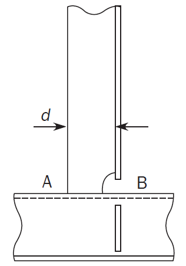 | 1.28 for $d \leq 150$ 1.36 for$1501.45 for \(d > 250$ | 1.40 for $d \leq 150$ 1.50 for $1501.60 for \(d > 250$ | 1.28 for $d \leq 150$ 1.36 for $1501.45 for \(d > 250$ | 1.60 |
    | 2(1) | 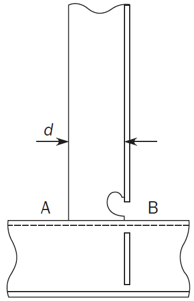 | 1.28 for $d \leq 150$ 1.36 for$1501.45 for \(d > 250$ | 1.40 for $d \leq 150$ 1.50 for $1501.60 for \(d > 250$ | 1.14 for $d \leq 150$ 1.24 for $1501.34 for \(d > 250$ | 1.27 |
    | 3 | 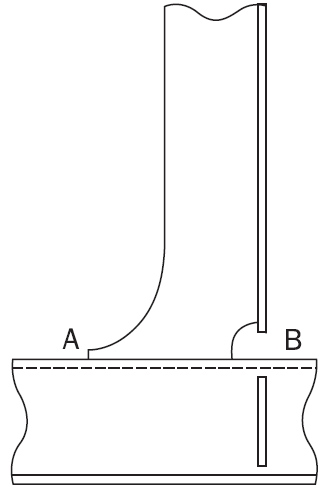 | 1.28 | 1.34 | 1.52 | 1.67 |
    | 4 | 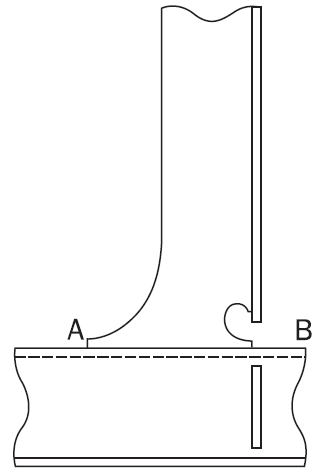 | 1.28 | 1.34 | 1.34 | 1.34 |
    | 5 | 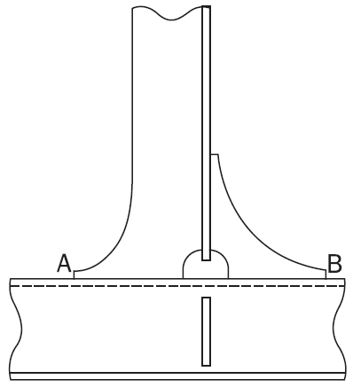 | 1.28 | 1.34 | 1.28 | 1.34 |
    | 6 | 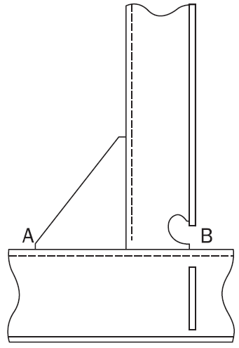 | 1.52 | 1.67 | 1.34 | 1.34 |
    | 7 | 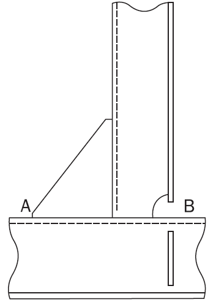 | 1.52 | 1.67 | 1.52 | 1.67 |
    | 8 | 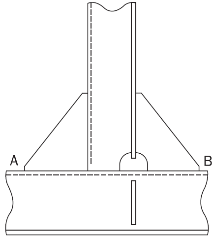 | 1.52 | 1.67 | 1.52 | 1.67 |
    | 9 | 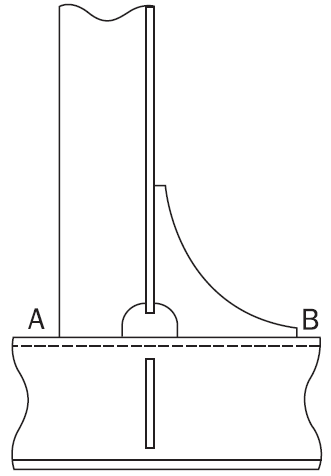 | 1.52 | 1.67 | 1.28 | 1.34 |
    | 10 | 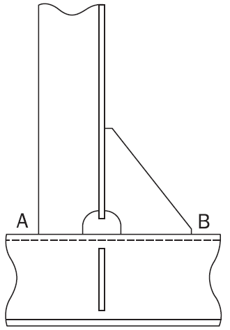 | 1.52 | 1.67 | 1.52 | 1.67 |
    | 11 | 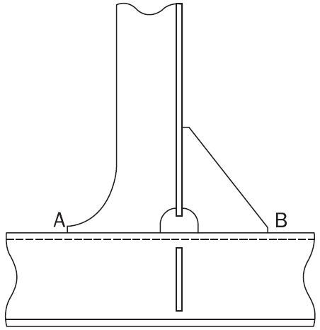 | 1.28 | 1.34 | 1.52 | 1.67 |
    | 12 | 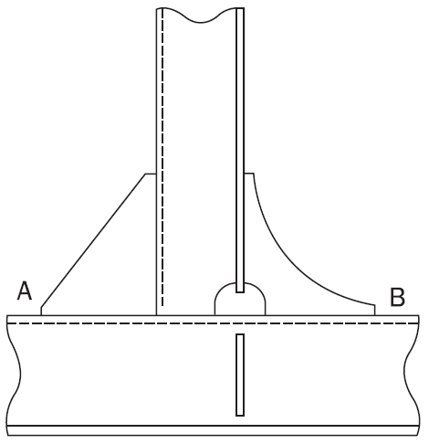 | 1.52 | 1.67 | 1.28 | 1.34 |
    | 13 | 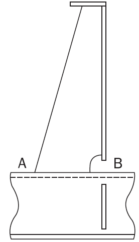 | 1.52 | 1.67 | 1.52 | 1.67 |
    | 14 | 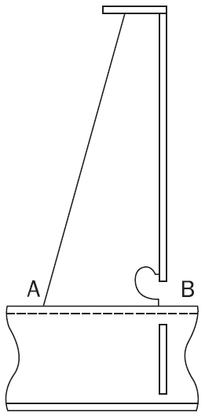 | 1.52 | 1.67 | 1.34 | 1.34 |
    | 15 | 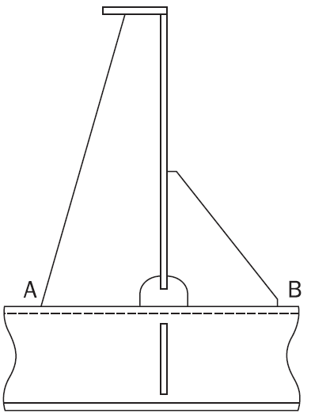 | 1.52 | 1.67 | 1.52 | 1.67 |
    | 16 | 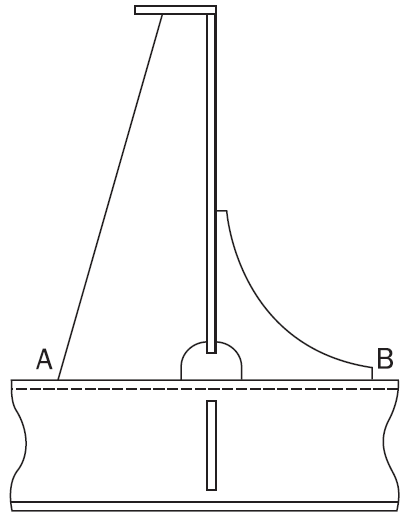 | 1.52 | 1.67 | 1.28 | 1.34 |
    | 17 | 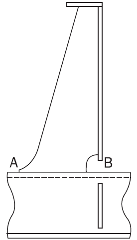 | 1.28 | 1.34 | 1.52 | 1.67 |
    | 18 | 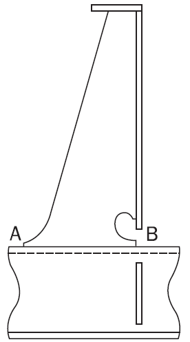 | 1.28 | 1.34 | 1.34 | 1.34 |
    | 19 | 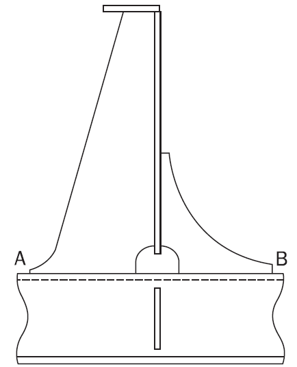 | 1.28 | 1.34 | 1.28 | 1.34 |
    | 20 | 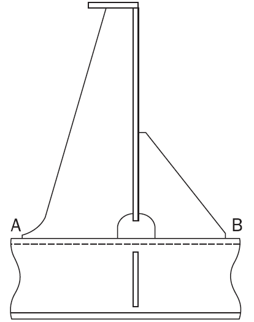 | 1.28 | 1.34 | 1.52 | 1.67 |
    | 21 | 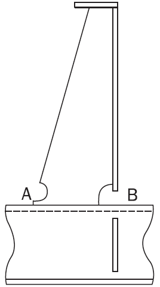 | 1.28 | 1.34 | 1.52 | 1.67 |
    | 22 | 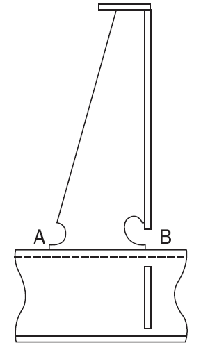 | 1.28 | 1.34 | 1.34 | 1.34 |
    | 23 | 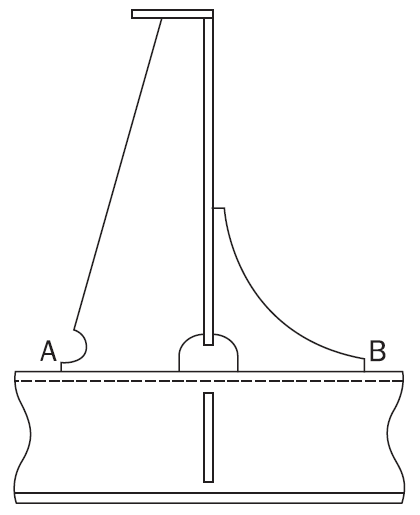 | 1.28 | 1.34 | 1.28 | 1.34 |
    | 24 | 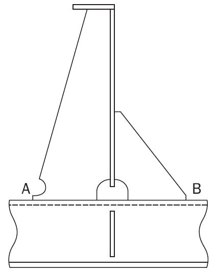 | 1.28 | 1.34 | 1.52 | 1.67 |
    | 25(1) | 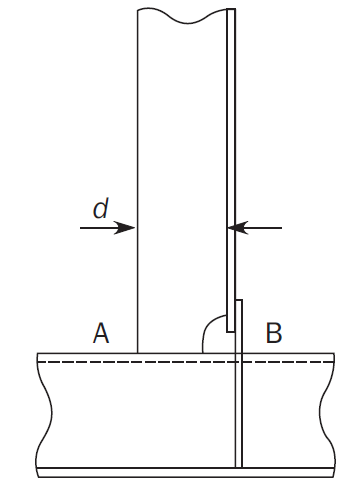 | 1.28 for $d \leq 150$ 1.36 for$1501.45 for \(d > 250$ | 1.40 for $d \leq 150$ 1.50 for $1501.60 for \(d > 250$ | 1.14 for $d \leq 150$ 1.24 for $1501.34 for \(d > 250$ | 1.25 for $d \leq 150$ 1.36 for $1501.47 for \(d > 250$ |
    | 26 | 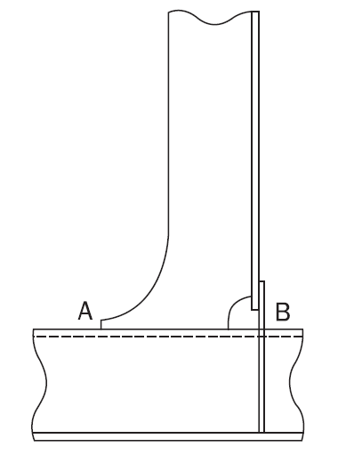 | 1.28 | 1.34 | 1.34 | 1.47 |
    | 27 | 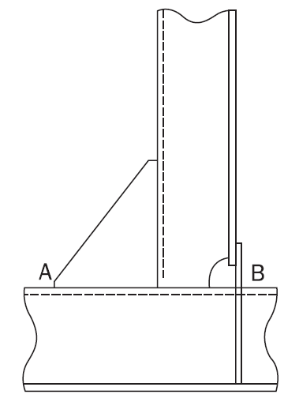 | 1.52 | 1.67 | 1.34 | 1.47 |
    | 28 | 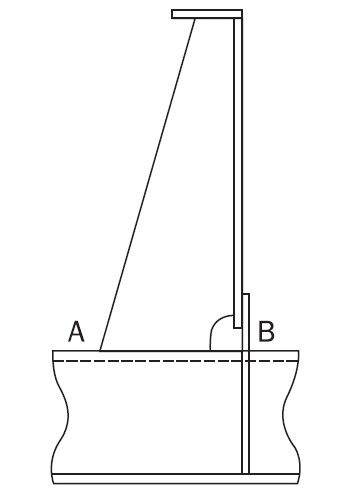 | 1.52 | 1.67 | 1.34 | 1.47 |
    | 29 | 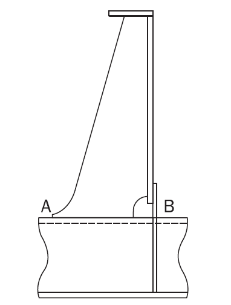 | 1.28 | 1.34 | 1.34 | 1.47 |
    | 30 | 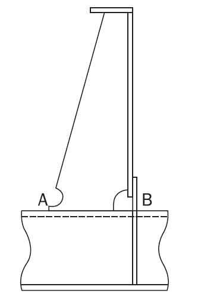 | 1.28 | 1.34 | 1.34 | 1.47 |
    | 31(4) | 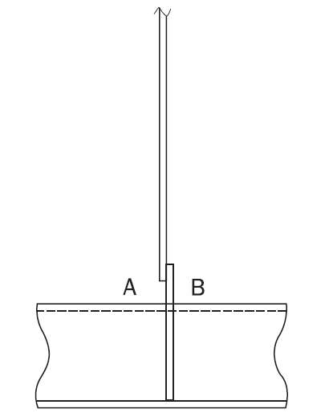 | 1.13 | 1.20 | 1.13 | 1.20 |
    | 32 (4)(5)(6) | 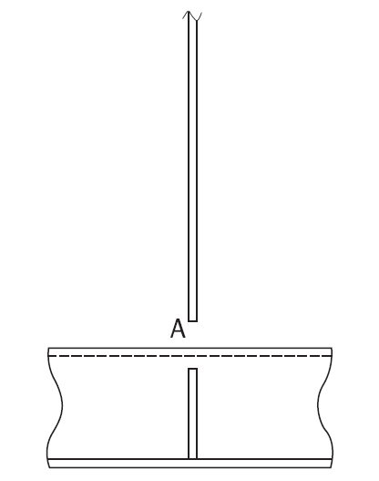 | 1.13 | 1.14 | N/A | N/A |
    | NOTE: (1) The attachment length d, in mm, is defined as the length of the welded attachment on the longitudinal stiffener flange without deduction of scallop. (2) Where the longitudinal stiffener is a flat bar and there is a web stiffener/bracket welded to the flat bar stiffener, the stress concentration factor listed in the table is to be multiplied by a factor of 1.12 when the thickness of attachment is thicker than the 0.7 times thickness of flat bar stiffener. This also applies to unsymmetrical profiles where there is less than 8mm clearance between the edge of the stiffener flange and the attachment, e.g. bulb or angle profiles where the clearance of 8 mm cannot be achieved. (3) Designs with overlapped connection / attachments, See [5.2.3]. (4) ID. 31 and 32 refer to details where web stiffeners are omitted or not connected to the longitudinal stiffener flange. See [5.2.4]. (5) For connection type ID. 32 with no collar and/or web plate welded to the flange, the stress concentration factors provided in this table are to be used irrespective of slot configuration. (6) The fatigue assessment point ‘A’ is located at the connection between the stiffener web and the transverse web frame or lug plate. |   |   |   |   |   |
- **5.3** **Alternative design**
  - **5.3.1** **Derivation of alternative stress concentration factors**
    Upon agreement by the Society, the geometrical stress concentration factors for alternative designs are to be calculated by a very fine mesh FE analysis according to the requirements given in **Ch 9, Sec 5**. Additional requirements for derivation of geometrical stress concentration factors for stiffener end connections using very fine mesh FE analysis are given below:
    • Axial loading by enforced displacement applied to the model ends and
    • Lateral loading by unit pressure load applied to the shell plating.
    • Symmetry conditions are applied along the longitudinal cut of the plate flange, along transverse and vertical cuts on web frames and on top of the web stiffener.
    • For lateral pressure loading: the model is to be fixed in all degrees of freedom at both forward and aft ends.
    • For axial loading: the model is to be fixed for displacement in the longitudinal direction at the aft end of the model while enforced axial displacement is applied at the forward end, or vice versa.
    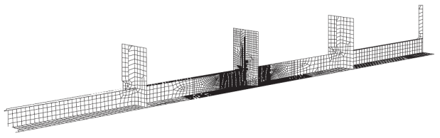
    **Figure : Fine mesh finite element model for derivation of geometrical stress concentration factor****(example of stiffener with flange)**
    For the 2 loading cases specified above, the stress concentration factors are determined as follows:
    • For the axial loading case:
    $K _{a} = \frac{\sigma _{HSAx}}{\sigma _{NomAx}}$
    • For the bending loading case:
    $K _{b} = \frac{\sigma _{HSBd}}{\sigma _{NomBd}}$
    $\sigma _{HSAx}$ : Hot spot stress, in N/mm^2, determined at the stiffener flange for the axial load.
    $\sigma _{NomAx}$ : Nominal axial stress, in N/mm^2, calculated at the stiffener flange according to **[3.1]** for the axial load applied for the FE calculation.
    $\sigma _{HSBd}$ : Hot spot stress, in N/mm^2, determined at the stiffener flange for the unit pressure load.
    $\sigma _{NomBd}$ : Nominal bending stress, in N/mm^2, calculated at the stiffener flange according to **[4.1]** in way of the hot spot for the unit pressure load applied for the FE calculation.
    The derivation of geometrical stress concentration factors for alternative designs is to be documented and provided to the Society.
    - **a)** FE model extent: the FE model, as shown in **Figure 6**, is to cover at least four web frame spacings in the longitudinal stiffener direction with the detail to be considered located at the middle frame. The same type of end connection is to be modelled at all the web frames. In the transverse direction, the model may be limited to one stiffener spacing.
    - **b)** Load application: in general, two loading cases are to be considered:
    - **c)** Boundary conditions:
    - **d)** FE mesh density: At the location of the hot spots under consideration, the element size is to be in the order of the thickness of the stiffener flange or 10 mm depending on the type of stiffener. In the remaining part of the model, the element size is to be in the order of *s*/10, where *s* is the stiffener spacing.

### Section 43 - Finite Element Stress Analysis

#### 1. General

- **1.1** **Application**
  - **1.1.1** This section applies to fatigue assessment by finite element stress analysis. The methods are based on the hot spot stress approach and requirements are given for both welded and non-welded hot spots. The hot spot stress takes into account structural discontinuities due to the structural detail of the welded joint, but not taking into account the notch effect at the weld toe.
  - **1.1.2** The hot spot stress is generally highly dependent on the finite element model used for representation of the structure and the procedure used to calculate the hot spot stress. No other methods than those described in this Section is to be adopted for calculation of FE based hot spot stress.
  - **1.1.3** Two types of hot spots, denoted ‘a’ and ‘b’ are described in **Table 1**. These are defined according to their location on the plate and their orientation to the weld toe as illustrated in **Figure 1**.

    | Type | Description |
    | --- | --- |
    | a | Hot spot at the weld toe on plate surface |
    | b | Hot spot at the weld toe around the plate edge |

    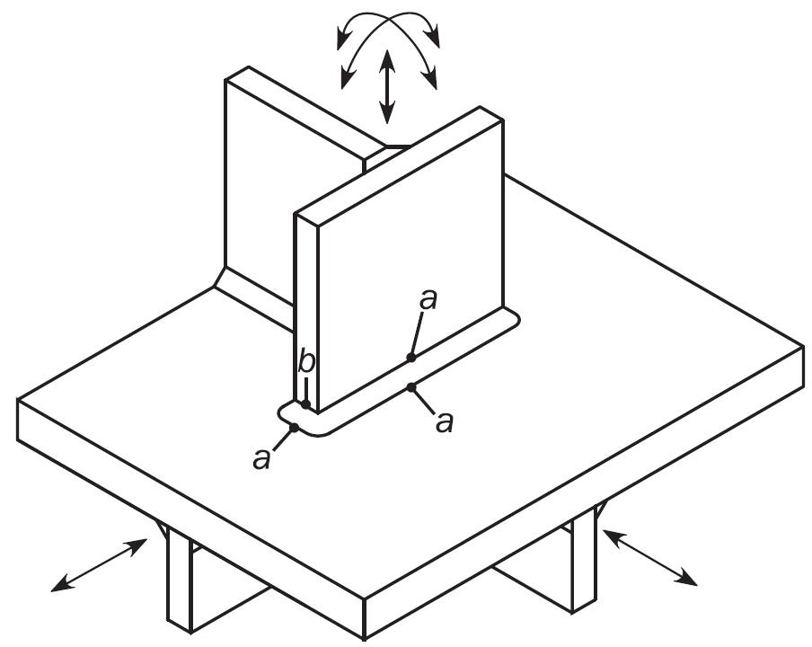
    **Figure : Types of hot spots**
  - **1.1.4** The method for calculation of hot spot stress at weld toe for any welded details is given in **[3.1]** except for web-stiffened cruciform joints. The method for calculation of local stress for non-welded area is given in **[3.2]**.
  - **1.1.5** The method for calculation of hot spot stress at web-stiffened cruciform joints such as transverse bulkhead to inner bottom connection and horizontal stringer heel is given in **[4]**.
  - **1.1.6** Attention is to be given to limitations of the hot spot stress methodology for simple connections given in **[5]**.

#### 2. FE Modelling

- **2.1** **General**
  - **2.1.1** Evaluation of hot spot stresses for fatigue assessment requires the use of very fine finite element meshes in way of areas of high stress concentration. These very fine mesh zones may be incorporated into the global model as shown in **Figure 2**. The coarse mesh model of the cargo holds is to be made according to **Ch 7, Sec 2, [2.4]**. Alternatively, this very fine mesh analysis can be carried out by means of separate local finite element models with very fine mesh zones in conjunction with the boundary conditions obtained from a global model of the cargo holds.
  - **2.1.2** **Corrosion model**
    The very fine mesh finite element models used for fatigue assessment are to be made using gross thickness, $t _{gr}$, in accordance with **Ch 9, Sec 1, [5.1]**.
  - **2.1.3** **Separate local FE model**
    Where a separate local finite element model is used, the extent of the local model is to be such that the calculated stresses are not significantly affected by the imposed boundary conditions and application of loads. The boundary of the fine mesh model is to be taken at adjacent primary supporting members such as girders, stringers and floors in the cargo hold model as far as practicable. Transverse web frames, stringer plates and girders at the boundaries of the local model need not be represented in the local model.
  - **2.1.4** The evaluation of hot spot stress for ‘a’ type hot spot is to be based on shell element of mesh size $t _{gr} \times t _{gr}$, where $t _{gr}$ is the gross thickness of the plate in way of the considered hot spot. The evaluation of hot spot stress for a ‘b’ type hot spot is to be based on shell element of mesh size 10 × 10 mm. The aforementioned mesh size is to be maintained within the very fine mesh zone, extending over at least 10 elements in all directions from the fatigue hot spot position. The transition of element size between the coarser mesh and the very fine mesh zone is to be done gradually and an acceptable mesh quality is to be maintained. This transition mesh is to be such that a uniform mesh with regular shape gradually transitions from smaller elements to larger ones.
    An example of the mesh transition in way of liquid dome and deck plating is shown in **Figure 6**.
  - **2.1.5** Four-node shell elements with adequate bending and membrane properties are to be used inside the very fine mesh zone. The four node element is to have a complete linear field of in-plane stresses and hence pure in-plane bending of the element can be exactly represented. In case of steep stress gradients, 8 node thin shell elements are to be used if deemed practical. The shell elements are to represent the mid plane of the plating. For practical purposes, adjoining plates of different thickness may be assumed to be median line aligned, i.e. no staggering in way of thickness change is required. The geometry of the weld and construction misalignment is not required to be modelled.
  - **2.1.6** All structure in close proximity to the very fine mesh zones is to be modelled explicitly with shell elements. Triangular elements are to be avoided where possible. Use of extreme aspect ratio (e.g. aspect ratio greater than 3) and distorted elements (e.g. element’s corner angle less than 60 deg or greater than 120 deg) are to be avoided.
  - **2.1.7** Where stresses are to be evaluated on a free edge, such as cut-outs for stiffener connections at web frames, edge of plating and liquid dome, beam elements having the same depth as the adjoining plate thickness and negligible width is to be used to obtain the required local edge stress values.
- **2.2** **Hopper knuckle welded connection**
  - **2.2.1** In addition to the general requirements in **[2.1]**, the modelling requirements in this sub-article are applicable to the modelling of bilge hopper lower-knuckle and upper-knuckle welded connections.
  - **2.2.2** Where a separate local finite element model is used, the minimum extent of the local model is to be according to the following:
    - **a)** Longitudinally, the model is to cover two web frame spaces (i.e. one web frame space extending either side of the transverse web frame of interest). Transverse web frames at the end of the local model need not be represented in the local model.
    - **b)** Vertically, the model is to extend from the baseline to the lower stringer in the double side water ballast tank. Where a fatigue assessment is also carried out for the upper knuckle connection, the model is to be extended to four longitudinal spaces above the lower stringer in the double side ballast tank.
    - **c)** Transversely, for the hopper lower knuckle, the model is to extend from the ship side to 4 longitudinal spaces inboard of the double bottom side girder. For the upper hopper knuckle, the model is to extend from the ship side to the double bottom side girder.
  - **2.2.3** Any scarfing brackets on the web frame adjoining the inner bottom plating, the first longitudinal stiffeners away from the knuckle hot spot as well as any carlings and brackets offset from the main frames are to be modelled explicitly using shell elements. Longitudinal stiffeners further away from the knuckle may be modelled by beam elements.
    The inner bottom plate ‘overhang’ outboard of the girder is to be modelled using shell elements up to the extent of the scarfing bracket. Away from the scarfing bracket in longitudinal direction, the inner bottom plate ‘overhang’ may be modelled using line elements of equivalent the area. Any perforations, such as cut-outs for cabling, pipes and access that are within one stiffener space from the knuckle point are to be modelled explicitly.
  - **2.2.4** **Figure 3**, **Figure 4** and **Figure 5** show typical local finite element models of the hopper knuckle connection and close-up views of the $t _{gr} \times t _{gr}$ mesh zone.
- **2.3** **Horizontal stringer heel connection**
  - **2.3.1** In addition to the general requirements in **[2.1]**, the modelling requirements in this sub-article are applicable to the modelling of horizontal stringer heel connections.
  - **2.3.2** Where a separate local finite element model is used, the minimum extent of the local model is to be according to the following:
    - **a)** Longitudinally, the model is to cover one web frame space away from the stringer heel to at least one web frame space ahead of the stringer toe. Transverse web frames at the end of the local model need not be represented in the local model.
    - **b)** Vertically, the model is to extend at least to the next stringer level above and below the concerned stringer heel location.
    - **c)** Transversely, the model is to extend from the ship side to a quarter of the cargo tank width.
- **2.4** **Inner deck and liquid dome corners and liquid dome end bracket**
  - **2.4.1** In addition to the general requirements in **[2.1]**, the modelling requirements in this sub-article are applicable to the modelling of inner deck and liquid dome corners/liquid dome end bracket. The selection of inner deck corners/liquid dome end bracket for fatigue analysis is to be determined based on the level of stresses obtained from the cargo hold FE analysis.
  - **2.4.2** The primary supporting members are to be represented by shell finite elements having both membrane and bending properties. **Figure 6** shows a typical FE model of the toe connection of a liquid dome end bracket to the deck plating with the very fine mesh zone having $t _{gr} \times t _{gr}$ mesh size.
  - **2.4.3** The level of FE mesh refinement is to be such as to enable stress concentrations arising from the inner deck and liquid dome corner geometry to be captured in the hot spot stress. The plate edge of inner deck and liquid dome corners at the level of inner deck and truck deck is to be assessed. The free edge of liquid dome end bracket and bracket toe welded connection to the deck plating are also to be assessed. Beam elements having the same depth as the adjoining plate thickness and negligible width are to be used at a plate edge of inner deck and liquid dome corners or free edge of the liquid dome end bracket to obtain the required local edge stress values as outlined in **[2.1.7]**.
  - **2.4.4** The local structural geometry, particularly in the areas of concern, is to be represented. The inner deck and liquid dome corner area is to be meshed using elements with a sufficiently small size to capture the local stress on the edge.
    In general, a minimum of 15 elements in a 90 degree arc are to be used to describe the curvature of the radius plating for a rounded corner (see **Figure 7**). For an elliptical or parabolic corner, a minimum of 15 elements are to be used from the inboard radius end to a point on the edge located at half the longitudinal distance of the semi- major axis. A total of 20 elements are to be used at the elliptical edge of the corner (see **Figure 8**).
    However, the element edge dimensions along the free edge of the radius need not be less than the thickness of the plating being represented and also should not be greater than 5 times the thickness of the plating being represented. Except where necessary from practical meshing considerations, this level of idealisation is to be maintained over the bracket plating and is to extend into the inner deck plating, truck deck plating and deck girder plating. Mesh transitions should not be arranged close to bracket toes.
- **2.5** **Boundary conditions**
  - **2.5.1** **Cargo hold model**
    The boundary conditions to be applied to the ends of the cargo hold model are to be in accordance with **Ch 7, Sec 2, [2.5]**.
  - **2.5.2** **Separate local finite element model**
    Where a separate local finite element model is used for evaluating the hot spot stress range, the boundary conditions and application of loads are to be in accordance with **Ch 7, Sec 3, [4.2]**.
    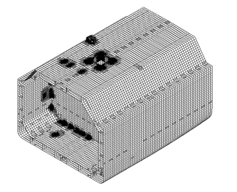
    **Figure : Very fine mesh areas incorporated directly into the cargo hold model**
    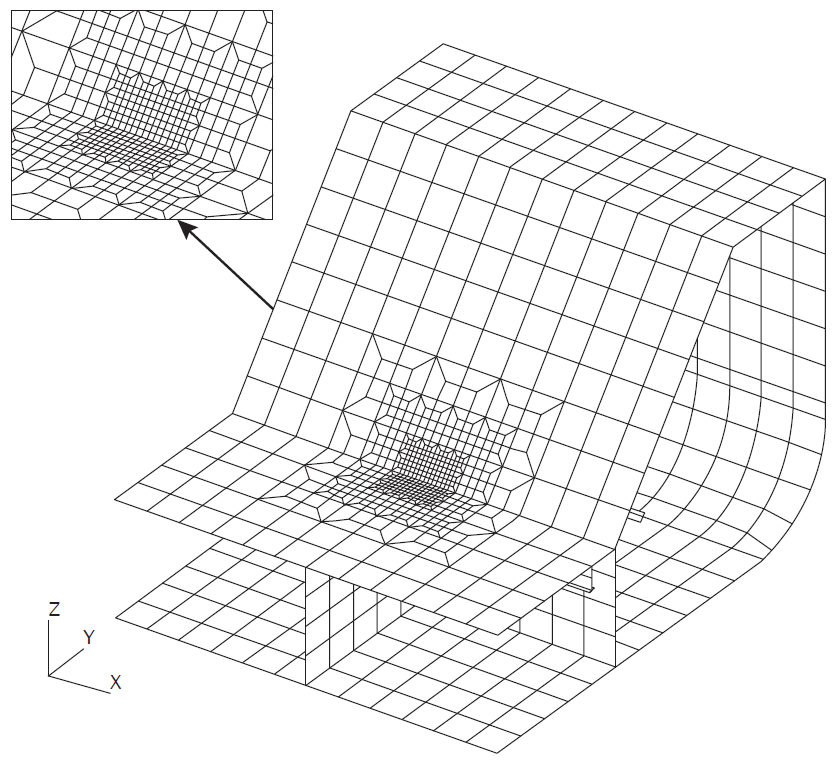
    **Figure : Local very fine mesh model (t _gr × t _gr ) of hopper knuckle connection between inner bottom and hopper plate**
    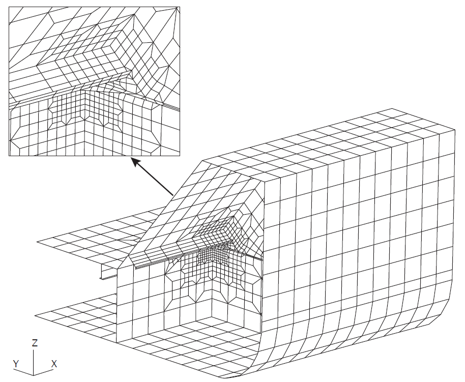
    **Figure : Local very fine mesh model (t _gr × t _gr ) of hopper knuckle connection between inner bottom, hopper plate, web frame, girder and bracket**
    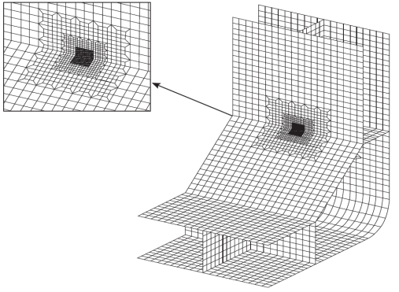
    **Figure : Local very fine mesh model (t _gr × t _gr ) of upper hopper knuckle connection between inner side shell and hopper plate**
    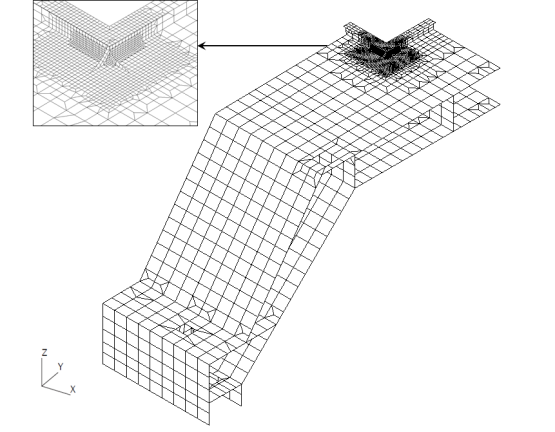
    **Figure : Local FE model of liquid dome end bracket to the deck plating with very fine mesh zone, t _gr × t _gr mesh**
    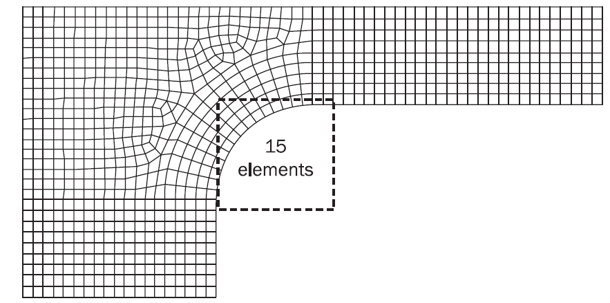
    **Figure : Mesh density for rounded inner deck and liquid dome corners**
    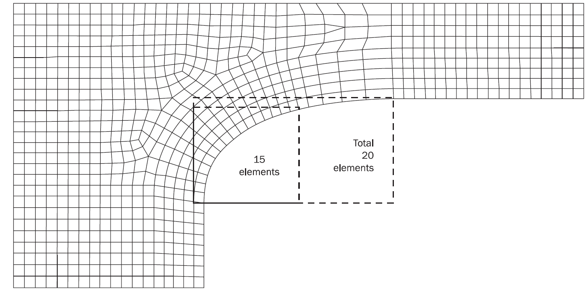
    **Figure : Mesh density for elliptical inner deck and liquid dome corners**

#### 3. Hot Spot Stress for Details Different from Web-Stiffened Cruciform Joints

- **3.1** **Welded details**
  - **3.1.1** For hot spot type ‘a’, the structural hot spot stress, $\sigma _{HS}$, is calculated from a finite element analysis with $t _{gr} \times t _{gr}$ mesh density and is obtained by the following formula:
    $\sigma _{HS} =1.12 \cdot \sigma$
    where:
    $\sigma$ : Surface principal stress, in N/mm^2, read out at a distance $t _{gr} /2$ away from the intersection line.
    $t _{gr}$ : Plate gross thickness, in mm, in way of the weld toe.
    At structural details where the hot spot type ‘a’ is classified as a web-stiffened cruciform joint, the stress read out procedure of **[4.2]** is to be applied.
    For hot spot type ‘b’, the stress distribution is not dependent on the plate thickness; the structural hot spot stress, $\sigma _{HS}$, is derived from a finite element analysis with mesh density 10 ×10 mm and is obtained by the following formula:
    $\sigma _{HS} =1.12 \cdot \sigma$
    where:
    $\sigma$ : Surface principal stress, in N/mm^2, read out at an absolute distance from the intersection line of 5 mm.
  - **3.1.2** **Stress read out methods**
    Depending on the element type, one of the following stress read out method is to be used:
    • With 4-node shell element:
    Element surface stress components at the centre points are linearly extrapolated to the line A-A as shown in **Figure 9** to determine the stress components for load case ‘$i1$’ and ‘$i2$’ at the stress read out point located at a distance $t _{gr} /2$ from the intersection line for type 'a' hot spot. Two principal hot spot stress ranges are determined at the stress read out point from the stress components tensor differences (between load case ‘$i1$’ and ‘$i2$’) calculated from each side (side L, side R) of line A-A. The angle $\theta$ between the direction x of the element co-ordinate system and the principal direction $pX$ of the principal hot spot stress range co-ordinate system has to be determined.
    • With 8-node shell element:
    With a $t _{gr} \times t _{gr}$ element mesh using 8-node element type, the element mid-side node is located on the line A-A at a distance $t _{gr} /2$ for type 'a' hot spots. This node coincides with the stress read out point. The element surface stress components for load case ‘$i1$’ and ‘$i2$’ can be used directly without extrapolation within each adjacent element located on each side (side L, side R) of the line A-A as illustrated in **Figure 10**. Two principal hot spot stress ranges are determined at the stress read out point from the stress components tensor difference (between load case ‘$i1$’ and ‘$i2$’) calculated from each side of line A-A. The angle $\theta$ between the direction x of the element coordinate system and the principal direction $pX$ of the principal hot spot stress range coordinate system has to be determined.
    For fatigue assessment of type ‘b’ hot spots, a beam element is to be used to obtain the fatigue stress range. The stress range is to be based on axial and bending stress in the beam element. The beam element is to have the same depth as the connecting plate thickness while the in-plane width is negligible.
    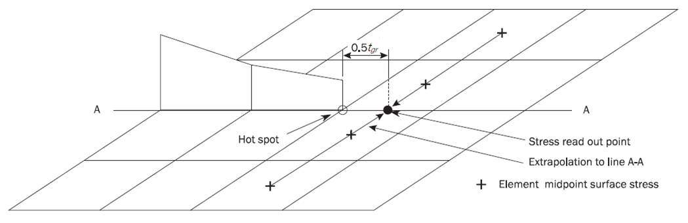
    **Figure : Determination of stress read out points and hot spot stress for 4-node element**
    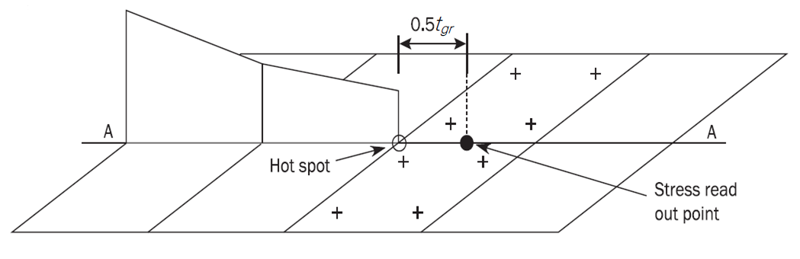
    **Figure : Determination of stress read out points and hot spot stress for 8-node element**
  - **3.1.3** The above read out procedure is based on element surface stresses. Generally, in FE software the element stresses are calculated at the Gaussian integration points located inside the element. Depending on the element type implemented in the FE software, it may be necessary to perform several interpolations in order to determine the actual stress at the considered stress read out point at the surface of the element mid-point or element edge.
- **3.2** **Base material**
  - **3.2.1** For fatigue assessment at a free plate edge, a beam element is to be used to obtain the fatigue stress range. The beam element is to have the same depth as the connecting plate thickness while the in-plane width should be negligible.
- **3.3** **Bent hopper knuckle**
  - **3.3.1** The hot spot stress at the inner bottom/hopper sloping plate in transverse and longitudinal directions (i.e. hot spots 1, 2 and 3 defined in **Ch 9, Sec 2, Table 4** of a bent hopper knuckle is to be taken as the surface principal stress read out from a point shifted away from the intersection line between the considered member and abutting member by the weld leg length.
    The hot spot stress, in N/mm^2, is obtained by the following formula:
    $\sigma _{HS} = \sigma _{shift}$
    where:
    $\sigma _{shift}$ : Surface principal stress, in N/mm^2, at the shifted read out position as defined in **[4.2.1]** and taken as:
    $\sigma _{shift} = \sigma _{membrane} ( \mathrm{x} _{itshift} )+ \sigma _{bending} ( x _{itshift} )$
    $\sigma _{bending} ( \mathrm{x} _{itshift} )$: Bending stress, in N/mm^2, at $\mathrm{x} _{itshift}$ position.
    $\sigma _{membrane} ( \mathrm{x} _{itshift} )$: Membrane stress at $\mathrm{x} _{itshift}$ position, in N/mm^2.
  - **3.3.2** The procedure for calculation of hot spot stress at flange such as inner bottom /hopper sloping plate is the same that for web-stiffened cruciform joints as described in **[4.2.1]**. The procedure that applies for hot spots on the ballast tank side of the inner bottom/hopper plate in way of a bent hopper knuckle is in principle the same as that applied on the cargo tank side of the inner bottom plate for welded knuckle in **Figure 12** and **Figure 13**. The intersection line is taken at the mid-thickness of the joint assuming median alignment. The plate angle correction factor and the reduction of bending stress as applied for a web-stiffened cruciform joint in **[4.2.2]** are not to be applied for the bent hopper knuckle type.
  - **3.3.3** The stress at hot spots located in way of the web such as transverse web and side girder (i.e. hot spots 4, 5 and 6 defined in **Ch 9, Sec 2, Table 4**) at a bent hopper knuckle type is to be derived as described for web-stiffened cruciform joints in **[4.3.1]**.

#### 4. Hot Spot Stress for Web-Stiffened Cruciform Joint

- **4.1** **Applicability**
  - **4.1.1** The following structural details are considered as a web-stiffened cruciform joint:
    Two kinds of hot spots relative to the web-stiffened cruciform joints are to be assessed:
    • Hot spots at the flange of web-stiffened cruciform joint,
    • Hot spots in way of the web of web-stiffened cruciform joint.
    - **a)** Heel of horizontal stringer, shown in **Figure 11**.
    - **b)** Longitudinal bulkhead – inner bottom connection.
    - **c)** Transverse bulkhead – inner bottom connection.
  - **4.1.2** The procedure for calculating hot spot stress at flange of web-stiffened cruciform joint is given in **[4.2]**.
  - **4.1.3** The procedure for calculating hot spot stress in way of the web of the web-stiffened cruciform joint is given in **[4.3]**.
    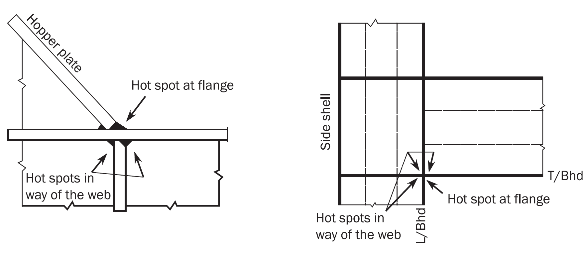
    **Figure : Web-stiffened cruciform joints**
- **4.2** **Calculation of hot spot stress at the flange**
  - **4.2.1** For hot spot at the flange of web-stiffened cruciform joints, the surface principal stress is to be read out from a point shifted away from the intersection line between the considered member and abutting member to the position of the actual weld toe and multiplied by 1.12. The intersection line is taken at the mid-thickness of the cruciform joint assuming a median alignment.
    The hot spot stress, in N/mm^2, is to be obtained as:
    $\sigma _{HS} = 1.12 \sigma _{shift}$
    where:
    $\sigma _{shift}$ : Surface principal stress, in N/mm^2, at shifted stress read out position.
    The stress read out point shifted away from the intersection line is obtained as:
    $x _{shift} = \frac{t _{1-gr}}{2} \times \mathrm{x} _\mathit{wt rm}$
    where:
    $t _{1-gr}$ : gross plate thickness of the plate number 1, in mm, as shown in **Figure 12**.
    $x _{wt}$ : Extended fillet weld leg length, in mm, as defined in Figure 12, not taken larger than $t _{1-gr}$.
  - **4.2.2** The stress at the shifted position is derived according to the following formula and illustrated in **Figure 13**:
    $\sigma _{shift} = \left[ \sigma _{membrane} ( \mathrm{x} _\mathit{shift rm} ) +0.60 \cdot \sigma _\mathit{bending rm} (x _\mathit{shift rm} ) \right] \cdot \beta$
    where:
    $\sigma _{bending} (\mathrm{x} _{itshift} )$ : Bending stress, in N/mm^2, at the shifted position taken as:
    $\sigma _{bending} (\mathrm{x} _{itshift} ) = itsigma _{surface} (\mathrm{x} _{itshift} )- itsigma _{membrane} (\mathrm{x} _{itshift} )$
    $\sigma _{surface} (\mathrm{x} _{itshift} )$ : Total surface stress at $\mathrm{x} _{itshift}$ position (including membrane stress and bending stress), in N/mm^2.
    $\sigma _{membrane} (\mathrm{x} _{itshift} )$ : Membrane stress at $\mathrm{x} _{itshift}$ position, in N/mm^2.
    $\beta$ : Plate angle hot spot stress correction factor, taken as:
    • For $\alpha = 135 {}^{\circ}$:
    $\beta = 0.96 -0.13 \frac{\mathrm{x} _\mathit{wt rm} it}{t _{1-gr}} +0.20 ( \frac{\mathrm{x} _\mathit{wt rm} it}{t _{1-gr}} ) ^{2}$
    • For $\alpha = 120 {}^{\circ}$:
    $\beta = 0.97 -0.14 \frac{\mathrm{x} _\mathit{wt rm} it}{t _{1-gr}} +0.32( \frac{\mathrm{x} _\mathit{wt rm} it}{t _{1-gr}} ) ^{2}$
    • For $\alpha = 90 {}^{\circ}$:
    $\beta = 0.96 +0.031 \frac{\mathrm{x} _\mathit{wt rm} it}{t _{1-gr}} +0.24( \frac{\mathrm{x} _\mathit{wt rm} it}{t _{1-gr}} ) ^{2}$
    $\alpha$ : Angle, in deg, between the plates forming a web-stiffened cruciform joint as shown in **Figure 13**.
    Correction factors for connections with plate angles intermediate to those given should be derived based on a linear interpolation of the above values. The calculated hot spot stress is to be used in conjunction with the hot spot S-N curve for weld toe connections according to **Ch 9, Sec 3, [4.2]**.
    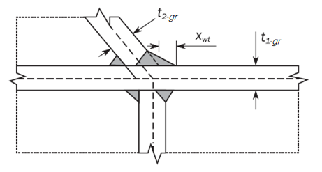
    **Figure : Geometrical parameters of web-stiffened cruciform connections**
    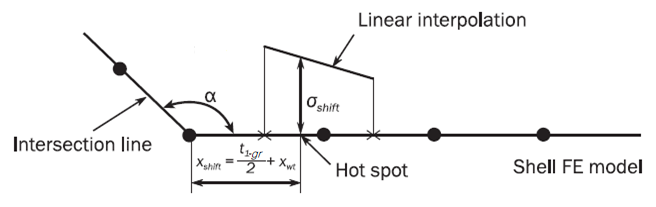
    **Figure : Procedure for calculation of hot spot stress at web-stiffened cruciform connections**
    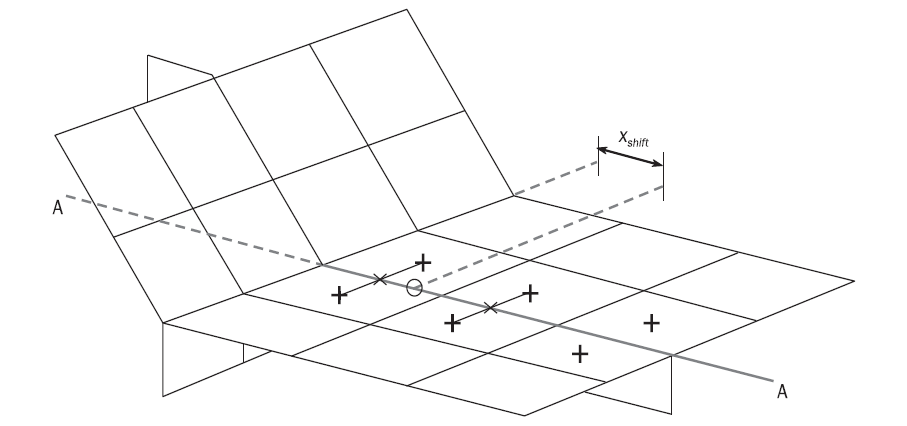
    **Figure : Determination of stress read out points for web-stiffened cruciform connections**
  - **4.2.3** Surface principal stresses at the centre point of the two first elements on left and right side of the line A-A are averaged and taken as the surface principal stresses in way of the web position (line A-A). The surface principal stresses for load case ‘$i1$’ and ‘$i2$’ are linearly interpolated along the line A-A in order to determine hot spot principal stresses at the stress read out point located at the $x _{shift}$ position as shown in **Figure 14**. The two principal hot spot stress ranges are determined at the stress read out point between load case ‘$i1$’ and ‘$i2$’.
- **4.3** **Calculation of hot spot stress in the web**
  - **4.3.1** Hot spots located in way of the web as indicated in **Figure 15** are to be checked with the hot spot stress defined from the maximum principal surface stress at the intersection offset by the distance $x _{shift}$ from the vertical and horizontal element intersection lines as illustrated in **Figure 15**. The intersection line is taken at the mid thickness of the cruciform joint assuming a median alignment. The hot spot stress, in N/mm^2, is to be obtained as:
    $\sigma _{HS} = \sigma _{shift}$
    where:
    $\sigma _{shift}$ : Maximum principal surface stress, in N/mm^2, at the intersection offset by the distance $\mathrm{x} _{itshift}$.
    The stress read out point at the intersection offset is obtained as:
    $\mathrm{x} _\mathit{shift rm} = it \frac{t _{3-gr}}{2} + \mathrm{x} _\mathit{wt rm}$
    where:
    $t _{3-gr}$ : gross plate thickness of the web, in mm, as shown in **Figure 15**.
    $\mathrm{x} _{itwt}$ : Extended fillet weld leg length, in mm, taken as:
    $\mathrm{x} _{itwt} = itmin(l _{\leq g1} , l _{\leq g2} )$
    $l _{leg1} , l _{leg2}$ : Leg length, in mm, of the vertical and horizontal weld lines as shown in **Figure 15**.
    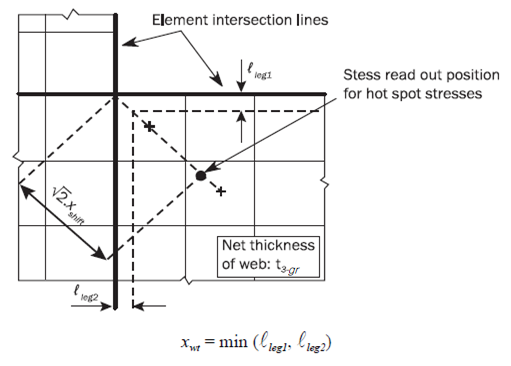
    **Figure : Hot spots in way of web**

#### 5. Limitations of Hot Spot Stress Approach

- **5.1** **Scope of application of hot spot stress approach**
  - **5.1.1** The hot spot stress approach given in **Ch 9, Sec 1, [2.3.1]** is not applicable for simple cruciform joints and simple T-joints when the stress flow in direction I as shown in **Figure 16** is considered. For stresses in the direction normal to the weld at hot spot location ‘c’ (direction I) there is no stress flow into the transverse plating as it is represented only by one plane in the shell model. However, it attracts stresses for in-plane direction (direction II) at hot spot location ‘a’.
    In situations where a bracket is fitted behind the transverse plate as shown in **Figure 1**, acting with stiffness in the direction normal to the transverse plate, stresses flow also into the transverse plate and the hot spot methodology is considered applicable.
  - **5.1.2** The hot spot stress at position ‘c’ for simple cruciform joints and simple T-joints is to be determined by the stress read out procedure given in **[3.1]** multiplied by a geometrical stress concentration factor of 1.3 and is taken as:
    $\sigma _{HS} = 1.3 \cdot 1.12 \sigma$
    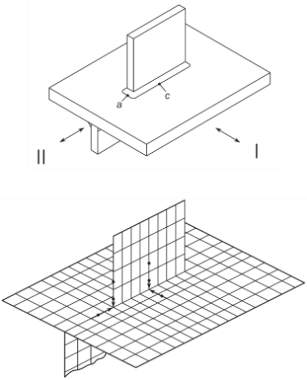
    **Figure : Illustration of check points in way of a welded attachment under orthogonal applied in plane loads**

### Section 44 - Detail Design Standard

**Symbols**
For symbols not defined in this section, refer to **Ch 1, Sec 4**.

#### 1. General

- **1.1** **Purpose**
  - **1.1.1** Design standard provides fatigue resistant detail design at an early stage in the structural design process by giving consideration to the following aspects:
    • Application of fatigue design principles.
    • Construction tolerances and other practical considerations.
    • In-service experience and fatigue performance.
  - **1.1.2** The design standard is to be applied to the design of ship structural details in following steps:
    • Highlighting potential critical areas within the ship structure.
    • Identification of the fatigue hot spot locations for each of the critical structural details.
    • Provision of a set of alternative improved configurations from which a suitable solution can be selected.
    • Requirements on geometrical configurations, scantlings, welding requirements and construction tolerances.
    • Post fabrication method of improving fatigue life, such as weld toe grinding.
- **1.2** **Application**
  - **1.2.1** The structural details described in this section are to be designed according to the given design standard but alternative detail design configurations may be accepted subject to demonstration of satisfactory fatigue performance.
    For the details given in **Ch 9, Sec 2, Table 3**, the fatigue assessment by very fine mesh finite element analysis may be omitted if the detail is designed in accordance with the design standard given in this section.

#### 2. Stiffener-Frame Connections

- **2.1** **Design standard A**
  - **2.1.1** Designs for cut outs in cases where web stiffeners are omitted or not connected to the longitudinals are required to adopt tight collar or the improved design standard “A” as shown in **Table 1** or equivalent, for the following members:
    • Inner hull longitudinal bulkhead below 1.1 times of $T _{SC}$.
    • Hopper.
    • Inner bottom.
  - **2.1.2** Designs that are different from those shown in **Table 1** are acceptable subject to demonstration of satisfactory fatigue performance, e.g. by using comparative finite element analysis. The comparative FE analysis is to be performed following the modelling guidance given in **Figure 1**.
    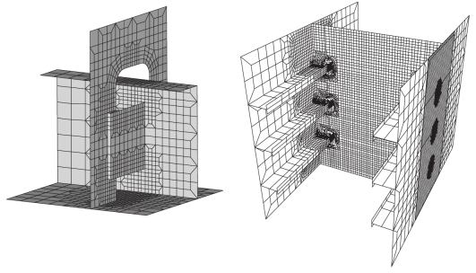
    **Figure : Finite element model for verification of equivalent design**
- **2.2** **Equivalent design of stiffener-frame connections**
  - **2.2.1** If the required designs for stiffener-frame connections in **[2.1]** are not followed, the alternative design is to be verified to have equivalent fatigue strength to the design standard “A” or to be verified to have satisfactory fatigue performance. The alternative design is to be verified according to the procedure given in **[2.2.2]** to **[2.2.5]** and documentation of results is to be submitted to the Society.
  - **2.2.2** The procedure of **[2.2.3]** and **[2.2.4]** is provided to verify the alternative design to have equivalent fatigue strength with respect to any position in the transverse ring, i.e. double bottom and double side. The hot spot stress of the alternative design and that of the required design is to be compared to the critical hot spots in way of the cut-out. The critical hot spots depend on the detail design and are to be selected in agreement with the Society. The hot spot stress is to be derived according to **Ch 9, Sec 5, [3.1]** and **Ch 9, Sec 5, [3.2]**. It is to be noted that welded hot spots at the free edge are classified as hot spot type ‘b’. Example of typical hot spots for checking is shown in **Ch 9, Sec 2, [2]**.

    **Cut outs for longitudinals in transverse webs where web stiffeners are omitted** **or not connected to the longitudinal flange**

    | **Design Standard A** |   |   |
    | --- | --- | --- |
    | **1** |   | **2** |
    | 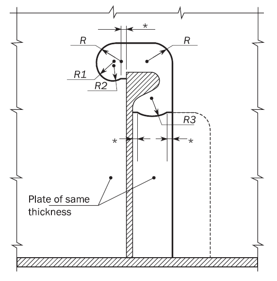 |   | 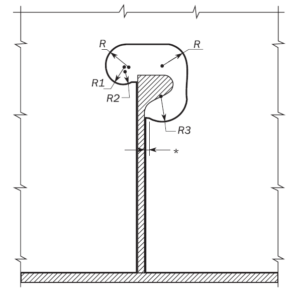 |
    | **3** |   | **4** |
    | 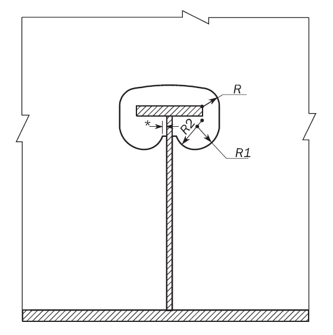 |   | 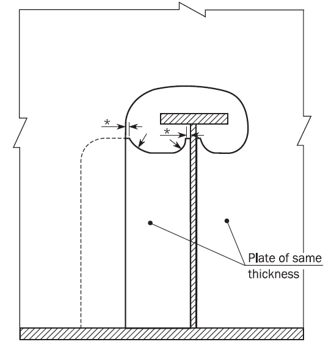 |
    | Note 1: Soft toes marked ‘*’ are to be dimensioned to suit the weld leg length such that smooth transition from the weld to the curved part can be achieved. Maximum 15 mm or thickness of transverse web/collar plates/lug plates whichever is the greater. Note 2: Configurations 1 and 4 indicate acceptable lapped lug plate connections. |   |   |
    | Critical location | Locations around cut-out with high stress concentration and locations in way of weld terminations. |   |
    | Detail design standard | Improved slot shape to avoid high stress concentrations in transverse webs due to shear loads and local pressure loads transmitted via welded joints. |   |
    | Building tolerances | Ensure alignment of all connecting members and accurate dimensional control of cut-outs according to IACS Recommendation No. 47. |   |
    | Welding requirements | A wraparound weld, free of undercut or notches, around the transverse web connection to longitudinal stiffener web. |   |
  - **2.2.3** The very fine mesh finite element models are made to analyse the behaviour in way of double side or double bottom. The models should have an extent of 3 stiffeners in cross section, i.e. 4 stiffener spacings, and the longitudinal extent is to be one half frame spacing in both forward and aft direction. A typical model is shown in **Figure 1**. No cut-outs for access openings are to be included in the models.
    Connection between the lug or the web-frame to the longitudinal stiffener web, connections of the lug to the web-frame and free edges on lugs and cut-outs in web-frame are to be modelled with elements of gross plate thickness size ($t _{gr} \times t _{gr}$). The mesh with gross plate thickness size should extend at least five elements in all directions. Outside this area, the mesh size may gradually be increased in accordance with the requirements in **Ch 9, Sec 5, [2]**. The eccentricity of the lapped lug plates is to be included in the model. Transverse web and lug plates are to be connected by eccentricity elements (transverse plate elements). The height of eccentricity element is to be the distance between mid-layers of transverse web and lug plates having a thickness equal to 2 times the gross thickness of web-frame plate $t _{w-gr}$. Eccentricity elements representing fillet welds are shown in **Figure 2**.
    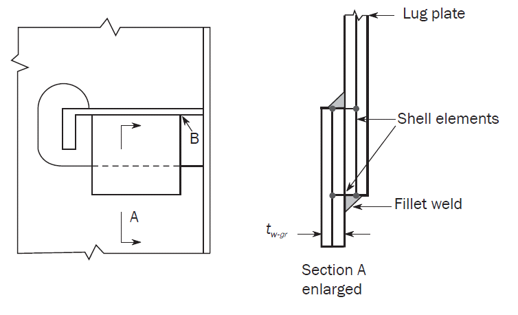
    **Figure : Modelling of eccentric lug plate by shell elements**
  - **2.2.4** Three load cases are to be applied to the models of the design standard and alternative designs:
    • External pressure of unit value, fixed boundary conditions at top and bottom of model.
    • Shear stress by prescribed unit displacement at the model top and fixed boundary conditions at the model bottom.
    • Axial load by prescribed unit displacement at the model top and fixed boundary conditions at the model bottom.
    The forward and aft part of the model should have symmetry condition describing the behaviour in a double hull structure. Load application and boundary conditions are provided in **Figure 3**.
  - **2.2.5** The alternative design may also be verified to have satisfactory fatigue performance using sub-modelling technique where a very fine mesh model of the alternative design located at the actual position of the stiffener-frame connection is analysed. The alternative design is considered acceptable if the fatigue acceptance criterion of **Ch 9, Sec 1** is achieved. The fatigue acceptance criterion is checked by applying the methodology described in **Ch 9, Sec 1**, **Ch 9, Sec 3** and **Ch 9, Sec 5**. The alternative design is considered acceptable only for the particular position where it is analysed.
    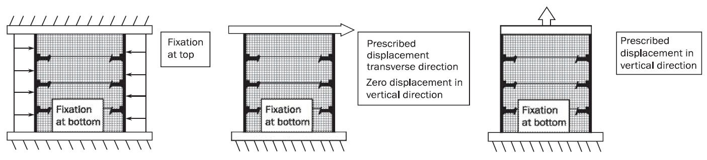
    **Figure : Load application and boundary conditions - FE model for verification of alternative design**

#### 3. Scallops in way of block joints

- **3.1** **Design standard B**
  - **3.1.1** Scallops in way of block joints in the cargo tank/hold region, located on the stiffeners fitted on strength deck, and side above 0.9 D from the baseline, are required to be designed according to the design standard B as shown in **Table 2**.

#### 4. Hopper knuckle connection

- **4.1** **Design standard C to E**
  - **4.1.1** The welded knuckle between hopper plating and inner bottom plating is to be designed according to the design standard C in **Table 3**.
  - **4.1.2** The radiused knuckle between hopper plating and inner bottom plating is to be designed according to the design standard D in **Table 4**. Alternative structural arrangements may be accepted based on verification in accordance with **Ch 9, Sec 5, [3.3]**.
  - **4.1.3** The radiused knuckle between hopper plating and inner side plating is to be designed according to the design standard E in **Table 5**.
  - **4.1.4** In general, the prescribed minimum requirements for welding, weld dressing and building tolerances as given in **Table 3** to **Table 5** are to be followed. Alternative positioning and/or dispensation of some support structure, such as transverse and longitudinal brackets may be accepted subject to demonstration of acceptable fatigue lives. Inserts and/or weld dressing additional to those prescribed may be required as a consequence of hot spot fatigue analysis.

    **Welding of deck stiffeners in way of block joints**

    | **Critical areas** |   | **Design standard B** |
    | --- | --- | --- |
    | 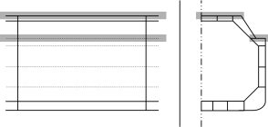 |   | (1) Offset butt on stiffener 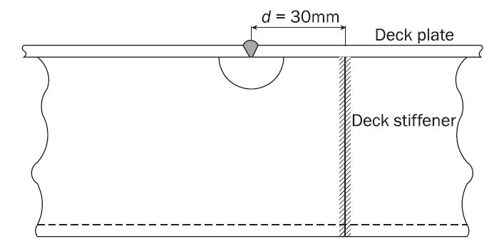 (2) Elongated scallop on stiffener 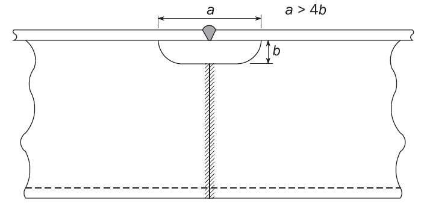 (3) Closing scallop with collar 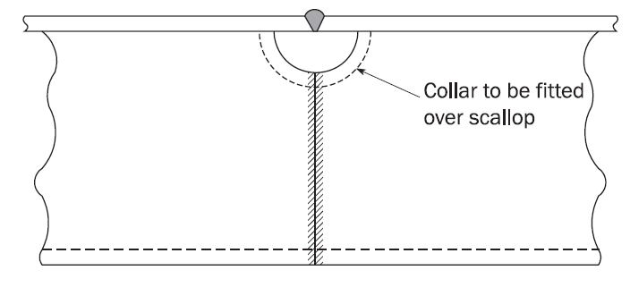 Note 1: Alternative scallop geometry to that shown in option 2 may be accepted subject to demonstration of satisfactory fatigue life based on hull girder loads taking into account additional stress concentration factor in way of weld. |
    | **Critical locations** |   |   |
    | 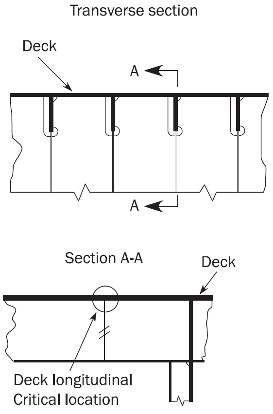 |   |   |
    | Critical location | Welding of deck stiffeners in way of block joints in cargo tank region, the strength deck and side above 0.9 D from the baseline. |   |
    | Detail design standard | All scallops are to be fitted according to detail design standard B. |   |
    | Building tolerances | Ensure alignment of all structural members according to IACS Recommendation No. 47. |   |
    | Welding requirements | Full penetration butt weld, free of undercut or notches, around the web and flange of the longitudinal stiffener at block joints, particularly in way of the weld termination at the scallop for option 2. |   |

    **Connections of floors in double bottom tanks to hopper tanks** **Hopper corner connections employing welded inner bottom and hopper sloping plating**

    | **Critical areas** |   | **Design standard C** |
    | --- | --- | --- |
    | 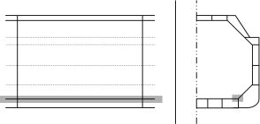 |   | 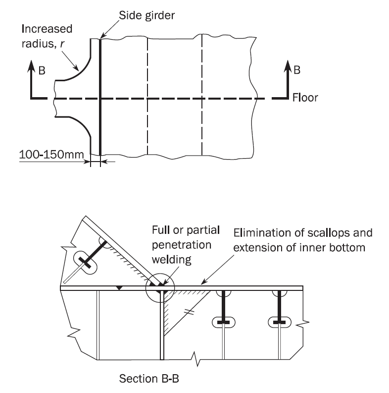 |
    | **Critical locations** |   |   |
    | 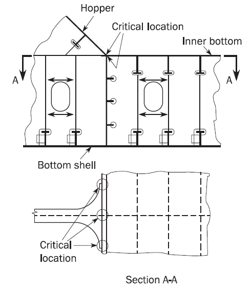 |   |   |
    | Minimum requirement | As a minimum, detail design standard C or D is to be fitted. The ground surface is to be protected by a stripe coat of suitable paint composition, where the lower hopper knuckle region of cargo tanks is not coated. |   |
    | Critical location | Hopper sloping plating connections to inner bottom plating in way of floors. Floor connections to inner bottom plating and side girder in way of hopper corners. |   |
    | Detail design standard | Elimination of scallops in way of hopper corners, extension of inner bottom plating to reduce level of resultant stresses arising from cyclic external hydrodynamic pressure, cargo inertia pressure and hull girder loads. Scarfing bracket thickness is to be close to that of the inner bottom in way of the knuckle. |   |
    | Building tolerances | Median line of hopper sloping plate is to be in line with the median line of the girder with an allowable tolerance of t_as-built/3 or 5 mm, whichever is less, where t_as-built is the as-built side girder thickness. The allowable tolerance is to be measured parallel to the inner bottom. |   |
    | Welding requirements | Full or partial penetration welding is to be applied to hopper sloping plating and inner bottom plating connection. Partial penetration welding is to be applied to connections of side girder to inner bottom plating, to connections of floors to inner bottom plating and to side girder, to connections of hopper transverse webs to sloping plating, to inner bottom and to side girder in way of the hopper knuckle. Definition of full and partial penetration welding and their required extent are given in Ch 12, Sec 3. Weld between hopper plating and inner bottom plating to be enlarged and ground smooth. Visible undercuts are to be removed, see Ch 9, Sec 3, [6]. Weld enlargement and grinding are applicable to minimum 200 mm on each side of the floor. |   |

    **Connections of floors in double bottom tanks to hopper tanks** **Hopper corner connections employing radiused knuckle between inner bottom and hopper sloping plating**

    | **Critical areas** |   | **Design standard D** |
    | --- | --- | --- |
    |  |   | 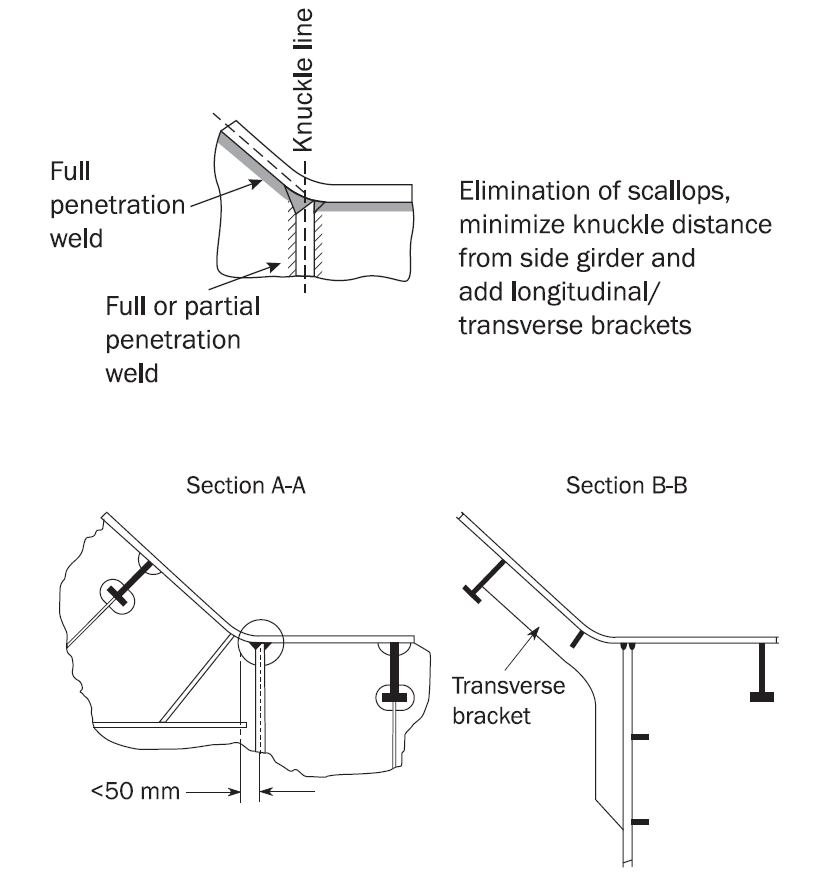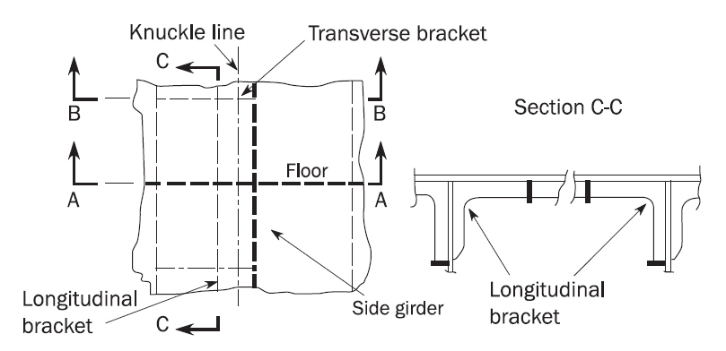 Note 1: Distance from side girder to centre of knuckle is to be as small as practicable, but is not to exceed 50 mm. Note 2: The knuckle radius is not to be less than 4.5 t_as-built or 100 mm, whichever is the greater, where t_as-built is the as-built thickness of the knuckle part. Note 3: Additional transverse brackets offset at a suitable distance on either side of transverse floor/hopper connection. Note 4: Additional longitudinal bracket on the side of sloping plate. Note 5: Longitudinal and/or transverse brackets may be omitted if it can be demonstrated that the girder provides sufficient support at the knuckle line, i.e. that fatigue requirements according to Ch 9, Sec 5 and local strength analysis requirements according to Ch 7, Sec 3 are fulfilled. |
    | **Critical locations** |   |   |
    | 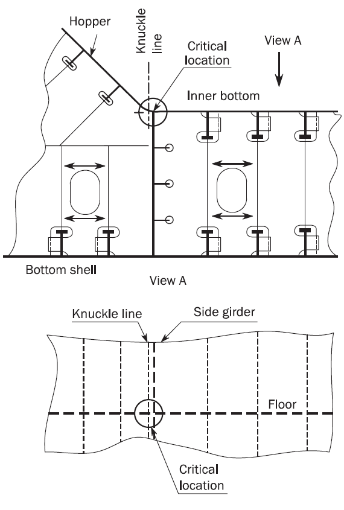 |   |   |
    | Critical location | Floor and hopper transverse web connections to inner bottom plating and hopper sloping plate, respectively and to side girder in way of hopper knuckle. Side girder connections to inner bottom plating in way of floors. |   |
    | Detail design standard | Elimination of scallops in way of hopper/girder connection and additional transverse and longitudinal brackets to reduce peak and range of resultant stresses arising from cyclic external hydrodynamic pressure, cargo inertia pressure, and hull girder global loading, and provide additional support to sloping plate. |   |

    **Connections of floors in double bottom tanks to hopper tanks** **Hopper corner connections employing radiused knuckle between inner bottom and hopper sloping plating**

    | Building tolerances | The nominal distance between the centres of thickness of the two abutting members (e.g. floor and hopper web plate) is not to exceed 1/3 of the as-built thickness of the side girder. |
    | --- | --- |
    | Welding requirements | Full penetration welding is to be applied to connections of floors to hopper/inner bottom plating in way of radiused hopper knuckle. Partial penetration welding is to be applied to connections of floors/hopper transverse webs to the side girder in way of hopper corner, and to connections of side girder to hopper/inner bottom plating. Definition of full and partial penetration welding and their required extent are given in Ch 12, Sec 3. In order to improve the fatigue strength, weld enlargement and grinding are applicable to full and partial penetration welds with a minimum distance of 300 mm from the intersection point between the radiused knuckle, the floor and the side girder. |

    **Connections of transverse webs in double side tanks to hopper tanks** **Hopper corner connections employing radiused knuckle between side longitudinal bulkhead and hopper sloping plating**

    | **Critical areas** |   | **Design standard D** |
    | --- | --- | --- |
    | 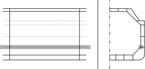 |   | 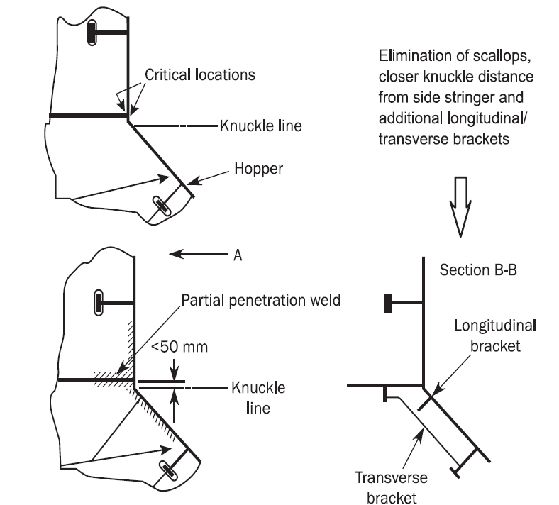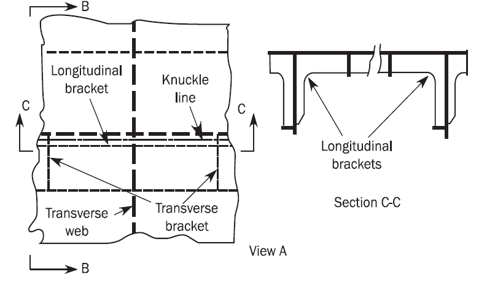 Note 1: Distance from side stringer to centre of knuckle is to be as small as practicable, but is not to exceed 50 mm. Note 2: The knuckle radius is not to be less than 4.5 t_as-built or 100 mm, whichever is the greater, where t_as-built is the as-built thickness of the knuckle part, according to Ch 12, Sec 1, [3] and Ch 12, Sec 1, [4]. Note 3: Additional transverse brackets offset at a suitable distance on either side of transverse floor/hopper connection. Note 4: Additional longitudinal bracket on the side of sloping plate. Note 5: Longitudinal and/or transverse brackets may be omitted if it can be demonstrated that the girder provides sufficient support at the knuckle line, i.e. that fatigue requirements according to Ch 9, Sec 5 and local strength analysis equirements according to Ch 7, Sec 3 are fulfilled. |
    | **Critical locations** |   |   |
    | 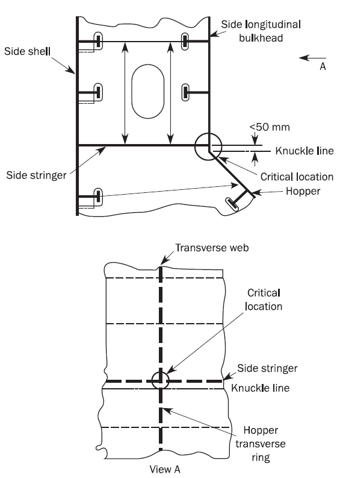 |   |   |
    | Critical location | Side stringer connections to side longitudinal bulkhead in way of transverse webs. Double side tank transverse web and hopper transverse web connections to side longitudinal bulkhead and to side stringers in way of hopper corners. |   |
    | Detail design standard | Elimination of scallops in way of hopper corners, closer knuckle distance from side stringers. Additional longitudinal/transverse brackets to reduce peak and range of resultant stresses arising from cyclic external hydrodynamic pressure and cargo inertia pressure. |   |

    **Connections of transverse webs in double side tanks to hopper tanks** **Hopper corner connections employing radiused knuckle between side longitudinal bulkhead and hopper sloping plating**

    | Building tolerances | The nominal distance between the centres of thickness of the two abutting members should not exceed 1/3 of the as-built thickness of the side stringer. |
    | --- | --- |
    | Welding requirements | Partial penetration welding is applied to connection of side stringers to side longitudinal bulkhead, connection of double side tank transverse webs to side longitudinal bulkhead and to side stringers, connection of hopper transverse webs to sloped side longitudinal bulkhead and to side stringers in way of hopper corners. Small scallops of suitable shape, which are to be closed by welding after completion of the continuous welding of side stringers to longitudinal bulkhead, are to be provided where scallops are eliminated. Definition of full and partial penetration welding and their required extent are given in Ch 12, Sec 3. |
