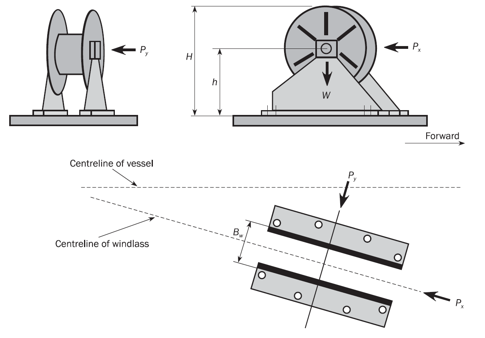
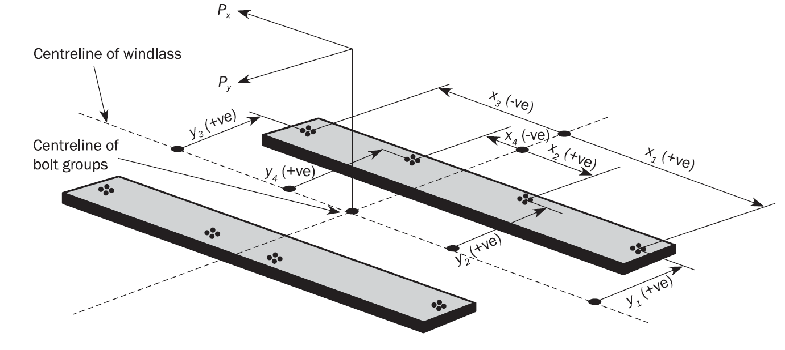
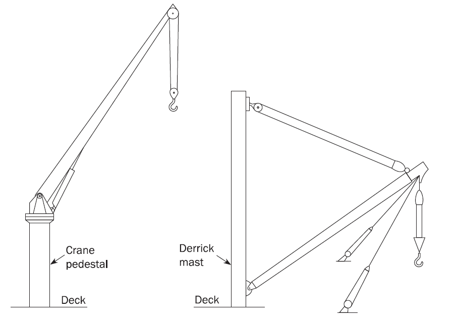

# PART 15 Structural Rules for Membrane Type Liquefied Natural Gas Carriers

> RULES FOR CLASSIFICATION OF STEEL SHIPS / RA-15-E / 2025 / EN / Rules

## Chapter 11 Superstructure, Deckhouses and Hull Outfitting

### Section 48 - Superstructures, Deckhouses and Companionways

**Symbols**
For symbols not defined in this Section, refer to **Ch 1, Sec 4**.
$P$ : Pressure applied on the considered superstructure side or deck, in kN/m^2
$P =P _{D}$ for external decks,
$P =P _{dl}$ for unexposed deck,
$P =P _{SI}$ for superstructure side.
$P _{D}$ : Lateral pressure for exposed decks, in kN/m^2, as defined in **Ch 4, Sec 5, [2]** and in **Ch 4, Sec 5, [4.2]**.
$P _{dl}$ : Lateral pressure for unexposed decks, in kN/m^2, as defined in **Ch 4, Sec 6, [3]**.
$P _{SI}$ : Lateral pressure for superstructure side, in kN/m^2, as defined in **Ch 4, Sec 5, [4.3]**.
$P _{FB}$ : Lateral pressure for side shell plating, in kN/m^2, affected by bow impact requirements according to **Ch 4, Sec 5, [3.3.1]**.
$P _{A}$ : External pressure for end bulkheads of superstructure and deckhouse walls, in kN/m^2 according to **Ch 4, Sec 5, [4.4.1]**.
$\ell _{bdg}$ : Effective bending span, in m, as defined in **Ch 3, Sec 7**.
$\ell _{shr}$ : Effective shear span, in m, as defined in **Ch 3, Sec 7**.
$c$ : Coefficient taken as:
$c$ = 0.75 for beams, girders and transverses which are simply supported in one or both ends.
$c$ = 0.55 in other cases.
$m _{a}$ : Coefficient taken as:
$m _{a} = 0.204 \frac{s}{1000 l _{bdg}} \left[ 4 - \left( \frac{s}{1000 l _{bdg}} \right) ^{2} \right]$ with $\frac{s}{1000 l _{bdg}} \leq 1$

#### 1. General

- **1.1** **Application**
  - **1.1.1** The requirements of this section are applicable to superstructures, deckhouses and companionways, made of steel. The requirements of **Ch 6** apply in addition to those of this section for exposed decks of superstructure and the side of superstructure or deckhouse when this side is part of the side shell.
  - **1.1.2** For the application of this section, a superstructure is considered being located aft or forward 0.4 *L* amidships or having a length of less than 0.15 *L*.
  - **1.1.3** For the application of this section, the length of a deckhouse located within 0.4 *L* amidships is considered not exceeding 0.2 *L*.
- **1.2** **Gross scantlings**
  - **1.2.1** With reference to **Ch 3, Sec 2, [1.1.3]**, all scantlings and dimensions referred to in **[3]** are gross.

#### 2. Structural arrangement

- **2.1** **Structural continuity**
  - **2.1.1** **Bulkheads and sides of deckhouses**
    The aft, front and side bulkheads are to be effectively supported by under deck structures such as bulkheads, girders and pillars.
    Sides and main longitudinal and transverse bulkheads are to be in line in the various tiers of deckhouses. Where such arrangement in line is not possible, other effective support is to be provided.
    Arrangements are to be made to minimise the effect of discontinuities in erections. All openings cut in the sides are to be framed and have well-rounded corners. Continuous coamings or girders are to be fitted below and above doors and similar openings.
  - **2.1.2** **Deckhouse corners**
    At the corners where the deckhouse is attached to the strength deck, attention is to be given to the arrangements to transmit load into the under deck supporting structure.
- **2.2** **End connections**
  - **2.2.1** **Deck stiffeners**
    Transverse beams are to be connected to side frames by brackets according to **Ch 3, Sec 6, [3.2]**. Beams crossing longitudinal walls and girders may be attached to the stiffeners of longitudinal walls and the webs of girders respectively by welding without brackets.
  - **2.2.2** **Longitudinal and transverse deck girders**
    Face plates are to be stiffened by tripping brackets according to **Ch 3, Sec 6, [4.3]**.
  - **2.2.3** **End connections of superstructure frames**
    Vertical frames are to be welded to the main frames below, or to the deck under provision of a sufficient supporting structure.
- **2.3** **Local reinforcement on bulkheads**
  - **2.3.1** Local reinforcement is to be provided in way of large openings and areas supporting life saving appliances or high loads from other equipment, fittings, etc.

#### 3. Scantlings

- **3.1** **Superstructures sides and decks**
  - **3.1.1** **Exposed sides and exposed deck plating**
    Exposed sides and exposed deck plating inclusive their supporting structure are to comply with the requirements given in **[3.2.1]** to **[3.2.5]** and bow impact requirements in **Ch 10, Sec 1, [3.3]**, if applicable.
  - **3.1.2** **Deck plating of unexposed decks**
    The deck plating and supporting structures of unexposed decks of superstructures are to comply with requirements given in **[3.2.2]** to **[3.2.5]**.
- **3.2** **Deckhouses**
  - **3.2.1** **Plating**
    The gross thickness of the plating, $t _{gr-\exp}$, in mm, is not to be less than
    $t _{gr-\exp} = 7.5 \sqrt {\frac{ks}{s _{std}}}$ , on first tier.
    $t _{gr-\exp} = 7.0 \sqrt {\frac{ks}{s _{std}}}$ , on second tier.
    $t _{gr-\exp} = 6.5 \sqrt {\frac{ks}{s _{std}}}$ , on third tier and above.
    where:
    $s _{std}$ : Standard reference spacing of stiffeners or beams, in mm, taken as:
    $s _{std} = 470 + 1.67 L _{1}$
    Where deck is protected by sheathing, the gross thickness of the deck plating may be reduced by 1.5 mm, without being less than 5 mm.
    Where sheathing other than wood is used, attention is to be paid that the sheathing does not affect the steel. The sheathing is to be effectively fitted to the deck.
  - **3.2.2** **Deck plating of unexposed decks**
    The gross thickness of the unexposed deck plating, $t _{gr-unexp}$, in mm, is not to be less than the greater value of:
    $t _{gr-unexp} =0.9 t _{gr-\exp}$ at the tier considered, and
    $t _{gr-unexp} = \left( 5.8 \frac{s}{1000} + 1 \right) \sqrt {k}$ but not less than 5.5 mm.
  - **3.2.3** **Beams and stiffeners**
    The gross section modulus $Z _{gr}$, in cm^3, and the gross shear area $A _{gr-sh}$, in cm^2, of transverse beams and of stiffeners are not to be less than:
    $Z _{gr} = c k P \frac{s}{1000} l _{bdg}^{ 2}$
    $A _{gr-sh} = 0.05 (1 - 0.817 m _{a} ) k P \frac{s}{1000} l _{shr}^{ }$
  - **3.2.4** **Girders and transverses**
    The gross section modulus $Z _{gr}$, in cm^3, and the gross shear area $A _{gr-sh}$, in cm^2, of girders and transverses are not to be less than:
    $Z _{gr} = c k P S l _{bdg}^{ 2}$
    $A _{gr-sh} = 0.05 k P S l _{shr}^{ }$
    The girder depth is not to be less than $l$/25. The web depth of girders scalloped for continuous deck beams is to be at least 1.5 times the depth of the deck beams.
  - **3.2.5** **Alternative grillage analysis for girders and transverses**
    Where arrangements of deck girders and transverses are such that these members act as a grillage structure, additional analysis may be carried out with a structural model based on the gross scantling.
    The resulting stresses are not to exceed the following permissible bending, shear and equivalent stresses, in N/mm^2, taken as:
    #eqnID-5890150_s0 /*k*
    #eqnID-5891100_s0 /*k*
    #eqnID-5892180_s0 /*k*
- **3.3** **Deckhouse walls and end bulkheads of superstructure**
  - **3.3.1** **Application**
    The requirements in **[3.3]** apply to end bulkhead of superstructure and deckhouse walls forming the only protection for openings and for accommodations.
    Special consideration may be given to the bulkhead scantlings of deckhouses which do not protect openings in the freeboard deck, superstructure deck or in the top of a lowest tier deckhouse. Special consideration may also be given to the bulkhead scantlings of deckhouses which do not protect machinery casings, provided they do not contain accommodation or do not protect equipment essential to the operation of the ship.
  - **3.3.2** **Plate thickness**
    The gross thickness of the plating $t _{gr}$, in mm, is not to be less than the greater of:
    $t _{gr} = 0.9 \frac{s}{1000} \sqrt {kP _{A}} + 1.5$
    $t _{gr} = \left( 5.0 + \frac{L _{2}}{100} \right) \sqrt {k}$ , for the lowest tier.
    $t _{gr} = \left( 4.0 + \frac{L _{2}}{100} \right) \sqrt {k}$ , for the upper tiers, without being less than 5.0 mm.
  - **3.3.3** **Stiffeners**
    The gross section modulus $Z _{gr}$, in cm^3, of the stiffeners is not to be less than:
    $Z _{gr} = 0.35 k P _{A} \frac{s}{1000} l _{}^{ 2}$
    This requirement assumes the webs of lowest tier stiffeners to be efficiently welded to the decks. Scantlings for other types of end connections are to be specially considered.
    The section modulus of deckhouse side stiffeners needs not to be greater than that of side frames on the deck situated directly below, taking account of spacing $s$ and span $l$.
- **3.4** **Companionways**
  - **3.4.1** The scantlings of companionways are to be determined in accordance with **[3.2]** and **[3.3]**.

### Section 49 - Bulwark and Guard Rails

#### 1. General requirements

- **1.1** **Application**
  - **1.1.1** Bulwarks or guard rails are to be provided at the boundaries of exposed freeboard and superstructure decks, at the boundary of first tier of deckhouses and at the ends of superstructures.
- **1.2** **Minimum height**
  - **1.2.1** Bulwarks, or guard rails, are to be a minimum of 1.0 m in height, measured above sheathing, and are to be constructed as required in **[2.2]** and **[3.2]**. Where this height would interfere with the normal operation of the ship, a lesser height may be accepted, on the basis of justifying information to be submitted.

#### 2. Bulwarks

- **2.1** **General**
  - **2.1.1** Plate bulwarks are to be stiffened at the upper edge by a suitable rail and supported either by stays or plate brackets spaced not more than 2.0 m apart.
    The free edge of the stay or the plate bracket is to be stiffened.
  - **2.1.2** Within 0.6 *L* amidships, bulwarks are to be arranged to ensure that they are free from hull girder stresses.
  - **2.1.3** Bulwarks are to be adequately strengthened and increased in thickness in way of mooring pipes.
    Cut-outs in bulwarks for gangways or other openings are to be kept clear of breaks of superstructures.
  - **2.1.4** Bulwark plating and stays are to be adequately strengthened in way of eye plates used for shrouds or other tackles in use for cargo gear operation, as well as in way of hawser holes or fairleads provided for mooring or towing.
  - **2.1.5** Openings in bulwarks are to be arranged so that the protection of the crew is to be at least equivalent to that provided by the horizontal courses in **[3.2.2]**.
    For this purpose, vertical rails or bars spaced approximately 230 mm apart may be accepted in lieu of rails or bars arranged horizontally.
  - **2.1.6** Where mooring fittings subject the bulwark to large forces, the stays are to be adequately strengthened.
- **2.2** **Construction of bulwarks**
  - **2.2.1** **Plating**
    The gross thickness of bulwark plating, at the boundaries of exposed freeboard and superstructure decks, is not to be less than that given in **Table 1**.

    | Height of bulwark | Gross thickness |
    | --- | --- |
    | 1.8 m or more | Thickness required for a superstructure side in the same position, obtained from **Ch 11, Sec 1, [3.2.1],** but not to be less than 6.5 mm |
    | 1.0 m | 6.5 mm |
    | Intermediate height | To be determined by linear interpolation |
  - **2.2.2** **Stays**
    The gross section modulus of stays, $Z _{stay-gr}$, in cm^3, is not to be less than:
    $Z _{stay-gr} = 77 h _{blwk}^{ 2} s _{stay}$
    Where:
    $h _{blwk} ^{ }$ : Height of bulwark from the top of the deck plating to the top of the rail, in m.
    $s _{stay}$ : Spacing of the stays, in m.
    In the calculation of the section modulus, only the material connected to the deck is to be included. The bulb or flange of the stay may be taken into account where connected to the deck. Where the bulwark plating is connected to the sheer strake, a width of attached plating, not exceeding 600 mm, may also be included.
  - **2.2.3** Where bulwarks are cut completely, stays or plate brackets of increased strength are to be fitted at the ends of openings.
    Bulwark stays are to be supported by, or are to be in line with, suitable under deck stiffening. The stiffening is to be connected by double continuous fillet welds in way of bulwark stay connections.
  - **2.2.4** At the ends of superstructures and for the distance over which their side plating is tapered into the bulwark, the latter is to have the same thickness as the side plating. Where openings are cut in the bulwark at these positions, adequate compensation is to be provided either by increasing the thickness of the plating or by other suitable means.

#### 3. Guard rails

- **3.1** **General**
  - **3.1.1** Where superstructures are connected by trunks, open rails are to be fitted for the whole length of the exposed parts of the freeboard deck.
- **3.2** **Construction of guard rails**
  - **3.2.1** Stanchions of guard rails are to comply with the following requirements:
    - **a)** Fixed, removable or hinged stanchions are to be fitted approximately 1.5 m apart.
    - **b)** At least every third stanchion is to be supported by a bracket or stay.
    - **c)** Removable or hinged stanchions are to be capable of being locked in the upright position.
    - **d)** In the case of ships with rounded sheer strake, the stanchions are to be placed on the flat of the deck.
    - **e)** In the case of ships with welded sheer strake, the stanchions are not to be attached to the sheer strake, upstand or a continuous gutter bar.
  - **3.2.2** The size of openings, below the lowest course of rails and the deck or upstand, is to be a maximum of 230 mm. The distance between other courses is not to be greater than 380 mm.
  - **3.2.3** Wire ropes may be accepted, in lieu of guard rails, only in special circumstances and then only in limited lengths. In such cases, they are to be made taut by means of turnbuckles.
  - **3.2.4** Chains may be accepted, in lieu of guard rails, only where they are fitted between two fixed stanchions and/or bulwarks. if the opening is wide, the chains are to be fitted with vertical courses to prevent the horizontal courses from spreading apart.

### Section 50 - Equipment

**Symbols [Deleted] (2022)**

#### 1. General

- **1.1** **Application**
  - **1.1.1** The anchoring equipment is to be in accordance with relevant chapters of Pt 4 of the Rules and Guidance for the Classification of Steel Rules. (2022)
  - **1.1.2** **[Deleted] (2022)**
  - **1.1.3** **[Deleted] (2022)**

#### 2. Equipment number calculation [Deleted] (2022)

#### 3. Anchoring equipment [Deleted] (2022)

### Section 51 - Supporting Structure for Deck Equipment and Fittings

**Symbols**
For symbols not defined in this section, refer to **Ch 1, Sec 4**.
$SWL$ : Safe working load as defined in **[4.1.4]**.
Normal stress : The sum of bending stress and axial stress with the corresponding shearing stress acting perpendicular to the normal stress.

#### 1. General

- **1.1** **Application**
  - **1.1.1** The supporting structure and foundations for deck equipment and fittings are to be in accordance with relevant chapters of Pt 4 of the Rules and Guidance for the Classification of Steel Rules. (2022)
  - **1.1.2** Where deck equipment is subject to multiple load cases, such as operational loads and green sea load, the loads are be applied independently for the evaluation of strength of foundations and support structure.
- **1.2** **Documents to be submitted**
  - **1.2.1** The documents to be submitted are indicated in **Ch 1, Sec 3**.

#### 2. Anchoring windlass and chain stopper

- **2.1** **General**
  - **2.1.1** The windlass is to be efficiently bedded and secured to the deck.
  - **2.1.2** The builder and the windlass manufacturer are to ensured that the foundation is suitable for the safe operation and maintenance of the windlass equipment.
  - **2.1.3** The supporting structure is to be dimensioned to ensure that for each of the load scenarios specified in **[2.1.5]** and **[2.1.6]**, the stresses do not exceed the permissible values given in **[2.1.12]** to **[2.1.15]**.
  - **2.1.4** These requirements are to be assessed based on net scantlings.
  - **2.1.5** The following load cases are to be examined for the anchoring operation, as appropriate:
    where:
    $BS$ : Minimum breaking strength of the chain cable.
    - **a)** Windlass where chain stoppers are fitted but not attached to the windlass: 45% of $BS$.
    - **b)** Windlass where no chain stoppers is fitted or the chain stopper is attached to the windlass: 80% of $BS$.
    - **c)** Chain stopper: 80 % of $BS$.
  - **2.1.6** The following forces are to be applied in the independent load cases that are to be examined for the design loads due to green sea over the forward 0.25 L, see **Figure 1**:
    $P _{x} = 200 A _{x}$, in kN, acting normal to the shaft axis.
    $P _{y} = 150 A _{y} f$, in kN, acting parallel to the shaft axis (inboard and outboard directions to be examined separately).
    where:
    $A _{x}$ : Projected frontal area, in m^2.
    $A _{y}$ : Projected side area, in m^2.
    $f$ : Coefficient taken as:
    $f = 1 + B _{w} /H$ , but not to be taken greater than 2.5.
    $B _{w}$ : Breadth of windlass measured parallel to the shaft axis, in m, see **Figure 1**.
    $H$ : Overall height of windlass, in m, see **Figure 1**.
    
    **Figure : Directions of forces and weight**
  - **2.1.7** Forces resulting from green sea design loads in the bolts, chocks and stoppers securing the windlass to the deck are to be calculated. The windlass is supported by a number of bolt groups, N, each containing one or more bolts. See **Figure 2**.
    
    **Figure : Bolting arrangements and sign conventions**
  - **2.1.8** The axial forces, $R _{x i}$ and $R _{y i}$, in bolt group (or bolt) $i$, positive in tension, are given by:
    $R _{x i} = P _{x} h x _{i} A _{i} / I _{x}$
    $R _{y i} = P _{y} h y _{i} A _{i} / I _{y}$
    $R _{i} = R _{x i} +R _{y i } -R _{s i}$
    where:
    $P _{x}$ : Force acting normal to the shaft axis, in kN.
    $P _{y}$ : Force acting parallel to the shaft axis, either inboard or outboard, whichever gives the greater force in bolt group $i$, in kN.
    $h$ : Shaft centre height above the windlass mounting, in cm, see **Figure 1**.
    $x _{i} , y$ : $x$ and $y$ coordinates of bolt group $i$ from the centroid of all N bolt groups, in cm. Positive in the direction opposite to that of the applied force.
    $A _{i}$ : Cross sectional area of all bolts in group $i$, in cm^2.
    $I _{x}$ : Inertia in x direction for N bolt groups, in cm^4, taken as:
    $I _{x} = \sum _{} ^{} A _{i} x _{i} ^{ 2}$
    $I _{y}$ : Inertia in y direction for N bolt groups, in cm^4, taken as:
    $I _{y} = \sum _{} ^{} A _{i} y _{i} ^{ 2}$
    $R _{s i}$ : Static reaction at bolt group $i$, due to the weight of windlass, in kN.
  - **2.1.9** The shear forces, $F _{x i}$ and $F _{y i}$, applied to the bolt group $i$, and the resultant combined force $F _{ i}$, are given by:
    $F _{x i} = \left( P _{x} - C _{1} m g \right) / N$
    $F _{y i} = \left( P _{y} - C _{1} m g \right) / N$
    $F _{ i} = \sqrt {F _{x i}^{ 2} + F _{y i}^{ 2}}$
    where:
    $C _{1}$ : Coefficient of friction, taken equal to 0.5.
    $m$ : Mass of windlass, in t.
    $g$ : Acceleration due to gravity, taken equal to 9.81 m/s^2.
    $N$ : Number of bolt groups.

#### 2.1.10

The resultant forces from the application of the loads specified in **[2.1.5]** and **[2.1.6]** are to be considered in the design of the supporting structure.

#### 2.1.11

Where a separate foundation is provided for the windlass brake, the distribution of resultant forces is to be calculated on the assumption that the brake is applied for load cases (a) and (b) defined in **[2.1.5]**.

#### 2.1.12

The stresses resulting from anchoring design loads induced in the supporting structure are not to be greater than the following permissible values:
• Normal stress, 1.00$R _{ e H}$
• Shear stress, 0.6$R _{ e H}$

#### 2.1.13

The tensile axial stresses resulting from green sea design loads in the individual bolts in each bolt group $i$ are not to exceed 50 % of the bolt proof strength. The load is to be applied in the direction of the chain cable. Where fitted bolts are designed to support shear forces in one or both directions, the von Mises equivalent stresses are not to exceed 50 % of the bolt proof strength.

#### 2.1.14

The horizontal forces resulting from the green sea design loads, $F _{x i}$ and $F _{y i}$ may be supported by shear chocks. Where pourable resins are incorporated in the holding down arrangements, due account is to be taken in the calculation.

#### 2.1.15

The stresses resulting from green sea design loads induced in the supporting structure are not to be greater than the following permissible values:
• Normal stress, 1.00$R _{ e H}$
• Shear stress, 0.6$R _{ e H}$

#### 3. Mooring winches [Deleted] (2022)

#### 4. Cranes, derricks, lifting masts and life saving appliances

- **4.1** **General**
  - **4.1.1** Supporting structure of life saving appliances and supporting structures of cranes, derricks and lifting masts with a Safe Working Load greater than 30 kN, or a maximum overturning moment to the supporting structure greater than 100 kNm, are to comply with these requirements.
  - **4.1.2** These requirements apply to the connection to the deck and the supporting structure of cranes, derricks and lifting masts. Where the crane, derrick or lifting mast is to be certified by the Society, additional requirements may be applied by the Society.
  - **4.1.3** These requirements do not cover the following items:
    The term ‘lifting appliance’ is defined as a crane, derrick or lifting mast.
    - **a)** Supports of lifting appliances for personnel or passengers, except foundation for life saving appliances.
    - **b)** The structure of the lifting appliance pedestals or post above the area of the deck connection.
    - **c)** Holding down bolts and their arrangement, which are considered part of the lifting appliance.
  - **4.1.4** **SWL definition**
    The Safe Working Load (SWL) is defined as the maximum load which the lifting appliance is certified to lift at any specified outreach.
  - **4.1.5** **Self weight**
    The self weight is the calculated gross self weight of the lifting appliance, including the weight of any lifting gear.
  - **4.1.6** **Overturning moment**
    The overturning moment is the maximum bending moment, calculated at the connection of the lifting appliance to the ship structure, due to the lifting appliance operating at Safe Working Load, taking into account outreach and self weight.
  - **4.1.7** The crane pedestal and derrick mast are as defined in **Figure 3**.
    
    **Figure : Crane pedestal and derrick mast**
  - **4.1.8** Deck plating and under deck structure is to provide adequate support for derrick masts and crane pedestals against the loads and maximum overturning moment. Where the deck is penetrated, the deck plating is to be suitably strengthened.
  - **4.1.9** Structural continuity of the deck structure is to be maintained.
    Under deck members are to be provided to support the crane pedestal and to comply with:
    - **a)** Where the pedestal is directly connected to the deck, without above deck brackets, adequate under deck structure directly in line with the crane pedestal is to be provided. Where the crane pedestal is attached to the deck without bracketing or where the crane pedestal is not continuous through the deck, welding to the deck of the crane pedestal and its under deck support structure is to be made by suitable full penetration welding. The design of the weld connection is to be adequate for the calculated stress in the welded connection, in accordance with **[4.1.15]**.
    - **b)** Where the pedestal is directly connected to the deck with brackets, under deck support structure is to be fitted to ensure a satisfactory transmission of the load, and to avoid structural hard spots. Above deck brackets may be fitted inside or outside of the pedestal and are to be aligned with deck girders and webs. The design is to avoid stress concentrations caused by an abrupt change of section. Brackets and other direct load carrying structure and under deck support structure are to be welded to the deck by suitable full penetration welding. The design of the connection is to be adequate for the calculated stress, in accordance with **[4.1.15]**.

#### 4.1.10

Deck plating are to be of a material strength compatible with the crane pedestal. Where necessary, a thicker insert plate is to be fitted. In no case are doublers to be used where structures are subject to tension.

#### 4.1.11

The supporting structure is to be dimensioned to ensure that for the load cases specified in **[4.1.13]** and **[4.1.14]**, the stresses do not exceed those given in **[4.1.15]**.
The capability of the supporting structure to resist buckling failure is to be assured.

#### 4.1.12

These requirements are to be assessed based on gross scantlings.

#### 4.1.13

For lifting appliances which are limited to use in harbour, design load is to be taken equal to 1.3 times SWL added to the lifting appliances self weight.

#### 4.1.14

For life saving appliances, design load is to be taken as 2.2 times SWL.

#### 4.1.15

The stresses induced in the supporting structure are not to exceed the following permissible values:
• Normal stress, 0.67$R _{ e H}$
• Shear stress, 0.39$R _{ e H}$

#### 5. Bollards and bitts, fairleads, stand rollers, chocks and capstans [Deleted] (2022)

#### 6. Miscellaneous deck fittings

- **6.1** **Support and attachment**
  - **6.1.1** The following requirements are to be considered in the design of the support and attachment of miscellaneous fittings which impose relatively small loads on the ship's structure. The arrangement of such details and their approval is considered on a case-by-case basis by the Society.
  - **6.1.2** Support positions are to be arranged so that the attachment to the ship structure is clear of deck openings and stress concentrations, such as the toes of end brackets. Design of supports is to be such that the attachment to the deck minimises the creation of hard points.
