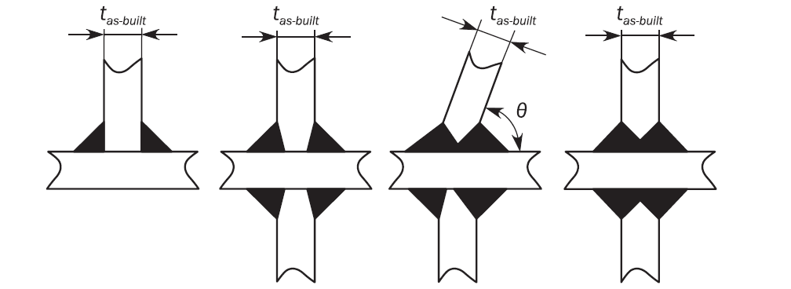
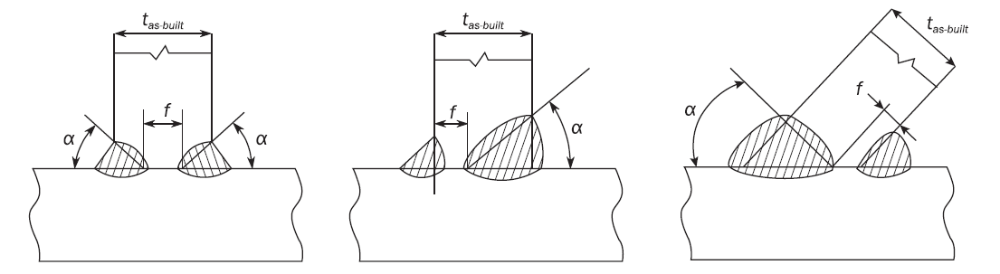
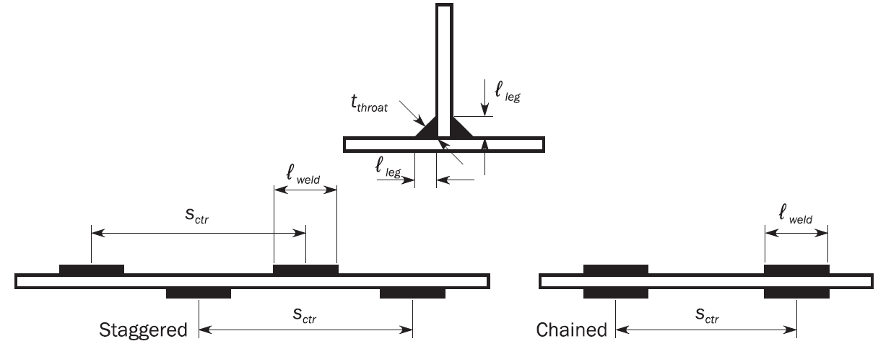
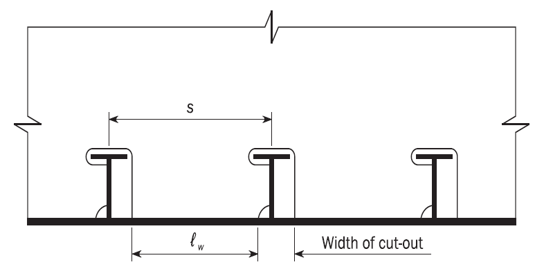
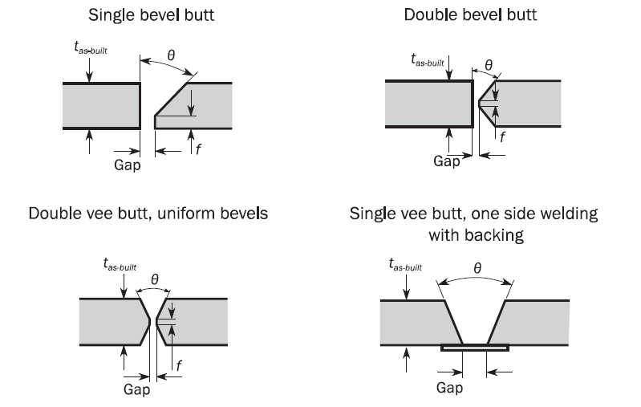
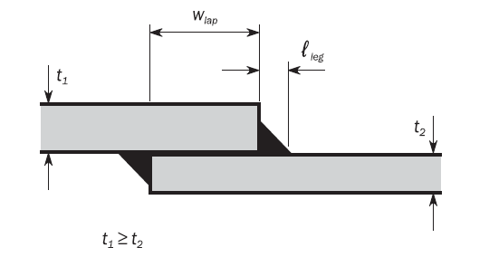
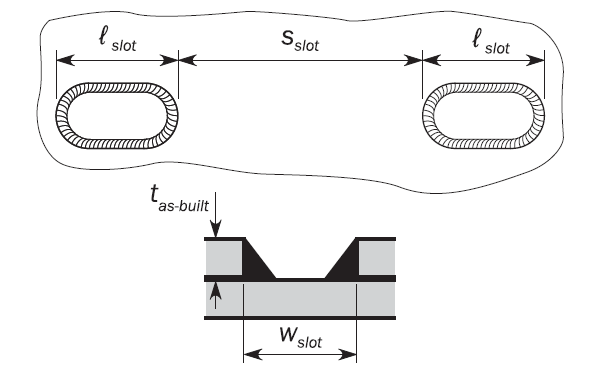
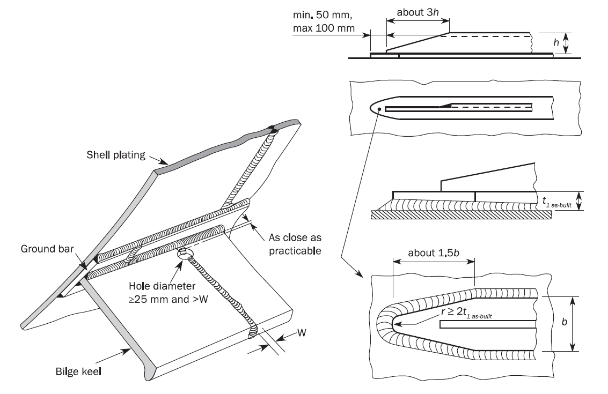
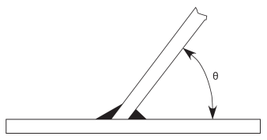

# PART 15 Structural Rules for Membrane Type Liquefied Natural Gas Carriers

> RULES FOR CLASSIFICATION OF STEEL SHIPS / RA-15-E / 2025 / EN / Rules

## Chapter 12 Construction

### Section 52 - Construction and Fabrication

#### 1. General

- **1.1** **Workmanship**
  - **1.1.1** All workmanship is to be of commercial marine quality and acceptable to the surveyor. Welding is to be in accordance with the requirements of **Ch 12, Sec 2**. Any defect is to be rectified to the satisfaction of the surveyor before the material is covered with paint, cement or any other composition.
- **1.2** **Fabrication standard**
  - **1.2.1** Structural fabrication is to be carried out in accordance with IACS Recommendation No. 47 or with a recognised fabrication standard which has been accepted by the Society prior to the commencement of fabrication/construction.
  - **1.2.2** The fabrication standard to be used during fabrication/construction is to be made available to the attending representative of the Society prior to the commencement of the fabrication/construction.
  - **1.2.3** The fabrication standard is to include information, to establish the range and the tolerance limits, for the items specified as follows:
    - **a)** Cut edges: the slope of the cut edge and the roughness of the cut edges.
    - **b)** Flanged stiffeners and brackets and built-up sections: the breadth of flange and depth of web, angle between flange and web, and straightness in plane of flange or at the top of face plate.
    - **c)** Pillars: the straightness between decks and cylindrical structure diameter.
    - **d)** Brackets and flat bar stiffeners: the distortion at the free edge line of tripping brackets and flat bar stiffeners.
    - **e)** Sub-assembly stiffeners: details of sniped end of face plates and webs.
    - **f)** Plate assembly: for flat and curved blocks, the dimensions (length and breadth), distortion and squareness, and the deviation of interior members from the plate.
    - **g)** Cubic assembly: in addition to the criteria for plate assembly, twisting deviation between upper and lower plates, for flat and curved cubic blocks.
    - **h)** Special assembly: the distance between upper and lower gudgeons, distance between aft edge of propeller boss and aft peak bulkhead, twist of stern frame assembly, breadth and length of top plate of main engine bed. Where boring out of the propeller boss and stern frame, skeg or solepiece are to be carried out after completing the major part of the welding of the aft part of the ship. Where block boring is used, the shaft alignment is to be carried out using a method and sequence submitted to and recognised by the Society. The fit-up and alignment of the rudder, pintles and axles are to be carried out after completing the major parts of the welding of the aft part of the ship. The contacts between the conical surfaces of pintles, rudder stocks and rudder axles are to be checked before the final mounting.
    - **i)** Butt joints in plating: alignment of butt joint in plating.
    - **j)** Cruciform joints: alignment measured on the median line and measured on the heel line of cruciform joints.
    - **k)** Alignment of interior members: alignments of flange of T profiles, alignment of panel stiffeners, gaps in T joints and lap joints, and distance between scallop and cut-outs for continuous stiffeners in assembly and in erection joints.
    - **l)** Keel and bottom sighting: deflections for whole length of the ship, and for the distance between two adjacent bulkheads, cocking-up of fore body and of aft body, and rise of floor amidships.
    - **m)** Dimensions: length between perpendiculars, moulded breadth and depth at midship, and length between aft edge of propeller boss and main engine.
    - **n)** Fairness of plating between frames: deflections between frames of shell, tank top, bulkhead, upper deck, superstructure deck, deckhouse deck and wall plating.
    - **o)** Fairness of plating in way of frames: deflections of shell, tank top, bulkhead, strength deck plating and other structures measured in way of frames.

#### 2. Cut-Outs, Plate Edges

- **2.1** **General**
  - **2.1.1** The free edges (cut surfaces) of cut-outs, liquid domes, etc are to be properly prepared and are to be free from notches. As a general rule, cutting drag lines, etc are to be smoothly ground. All edges are to be broken or in cases of highly stressed parts, be rounded off.
    Free edges on flame or machine cut plates or flanges are not to be sharp cornered and are to be finished off as specified above. This also applies to cutting drag lines, etc, in particular to the upper edge of sheer strake and analogously to weld joints, changes in sectional areas or similar discontinuities.
  - **2.1.2** Corners in liquid dome are to be machine cut.

#### 3. Cold Forming

- **3.1** **Special structural members**
  - **3.1.1** For highly stressed components of the hull girder where notch toughness is of particular concern (e.g. items required to be Class III in **Ch 3, Sec 1, Table 3**, such as radius gunwales (bent sheer plates) and bilge strakes), the inside bending radius, in cold formed plating, is not to be less than 10 times the as-built plate thickness for carbon-manganese steels (see **Ch 3, Sec 1**). The allowable inside bending radius may be reduced provided the requirements stated in **[3.2]** are complied with.
- **3.2** **Low bending radius**
  - **3.2.1** The inside bending radius, in cold formed plating, is not to be less than 4.5 times the as-built plate thickness for carbon-manganese steels (see **Ch 3, Sec 1**). The allowable inside bending radius may be reduced provided the requirements stated in **[3.2.2]** are complied with.
  - **3.2.2** When the inside bending radius is reduced below 10 times or 4.5 times the as-built plate thickness according to **[3.1]** and **[3.2.1]**, supporting data is to be provided. The bending radius is in no case to be less than 2 times the as-built plate thickness. As a minimum, the following additional requirements are to be complied with:
    • 100% visual inspection of the bent area is to be carried out.
    • Random checks by magnetic particle testing are to be carried out.
    • The steel is to be of Grade D/DH or higher.
    • The material is impact tested in the strain-aged condition and satisfies the requirements stated herein. The deformation is to be equal to the maximum deformation to be applied during production, calculated by the formula $t _{as-built} /(2r _{bdg} +t _{as-built} )$, where $t _{as-built}$ is the as-built thickness of the plate material and $r _{bdg}$ is the bending radius. One sample is to be plastically strained at the calculated deformation or 5%, whichever is greater and then artificially aged at 250°C for one hour then subject to Charpy V-notch testing. The average impact energy after strain ageing is to meet the impact requirements specified for the grade of steel used.
    - **a)** For all bent plates:
    - **b)** In addition to a), for bent plates at boundaries to tanks:

#### 4. Hot Forming

- **4.1** **Temperature requirements**
  - **4.1.1** Steel is not to be formed between the upper and lower critical temperatures. If the forming temperature exceeds 650°C for as-rolled, controlled rolled, thermo-mechanical controlled rolled or normalised steels, or is not at least 28°C lower than the tempering temperature for quenched and tempered steels, mechanical tests are to be made to assure that these temperatures have not adversely affected both the tensile and impact properties of the steel. Where curve forming or fairing, by line or spot heating, is carried out in accordance with **[4.2.1]** these mechanical tests are not required.
  - **4.1.2** After further heating, other than specified in **[4.1.1]**, of Thermo-Mechanically Controlled Steels (TMCP plates) for forming and stress relieving, it is to be demonstrated that the mechanical properties meet the requirements specified by a procedure test using representative material.
- **4.2** **Line or spot heating**
  - **4.2.1** Curve forming or fairing, by linear or spot heating, is to be carried out using approved procedures in order to ensure that the properties of the material are not adversely affected. Heating temperature on the surface is to be controlled so as not to exceed the maximum allowable limit applicable to the plate grade.

#### 5. Assembly and Alignment

- **5.1** **General**
  - **5.1.1** The use of excessive force is to be avoided during the assembly of individual structural components or during the erection of sections. Major distortions of individual structural components are to be corrected before further assembly.
    After completion of welding, straightening and aligning are to be carried out in such a manner that the material properties are not influenced significantly. In case of doubt, the Society may require a procedure test or a working test to be carried out.
  - **5.1.2** Structural members are to be aligned following the provisions of IACS Recommendation No. 47, **Table 7** or according to the requirements of a recognised fabrication standard that has been accepted by the Society. In the case of critical components, control drillings are to be made where necessary, which are then to be welded up again on completion.

### Section 53 - Fabrication by Welding

#### 1. General

- **1.1** **Application**
  - **1.1.1** The requirements of this section apply to the preparation, execution and inspection of welded connections in hull structures.
- **1.2** **Limits of application to welding procedures**
  - **1.2.1** **weld type, size and materials**
    The requirements of this section for weld type, size and materials are based on the following considerations:
    • Joint type.
    • Criticality of the joint.
    • Magnitude, type and direction of the stresses in the joint.
    • Material properties of the parent and weld material.
    • Weld gap size.
  - **1.2.2** **Preparation, execution and inspection**
    The requirements of this section are to be complemented by the general requirements relevant to fabrication by welding and qualification of welding procedures given by the Society when deemed appropriate by the Society.

#### 2. Welding Procedures, Welding Consumables and Welders

- **2.1** **General**
  - **2.1.1** All welding is to be carried out by approved welders, in accordance with approved welding procedures, using approved welding consumables, in compliance with Pt 2.
    Personnel manning automatic welding machines and equipment are to be competent, sufficiently trained and certified by the Society as specified in Pt 2.

#### 3. Weld Joints

- **3.1** **General**
  - **3.1.1** Welding of connections is to be executed according to the approved plans.
  - **3.1.2** The quality standard adopted by the shipyard is to be submitted to the Society and it applies to all welded connections unless otherwise specified on a case-by-case basis.
  - **3.1.3** Consideration is to be given to the assembly sequence and the effect of the overall shrinkage of plate panels, assemblies, etc, resulting from the welding processes employed. Welding is to proceed systematically, with each welded joint being completed in correct sequence, without undue interruption. When practicable, welding is to commence at the centre of a joint and proceed outwards, or at the centre of assembly and progress outwards towards the perimeter so that each part has freedom to move in one or more directions.
  - **3.1.4** Completed welded joints are to be to the satisfaction of the attending surveyor. Edge preparations and root gaps are to be in accordance with the approved welding procedure. The gap between the members being joined should not exceed the maximum values given in IACS Recommendation No. 47 or as specified in recognised fabrication standard approved by the Society. Where the gap between members being joined exceeds the specified values, corrective measures are to be taken in accordance with an approved welding procedure specification.
  - **3.1.5** Where small fillets are used to attach heavy plates or sections, welding is to be based on approved welding procedure specifications. Special precautions, such as the use of preheating, low-hydrogen electrodes or low hydrogen welding processes, are accepted.
  - **3.1.6** When heavy structural members are attached to relatively light plating, the weld size and sequence may require modification.
  - **3.1.7** Where quality control systems are in place which ensure that the grade of welding consumable used is higher than the minimum required for the particular strength steel being welded, the welding consumables that are used may have a weld deposit material yield strength that is greater than the minimum specified in **Ch 12, Sec 3, [2.5.2]** and the size of the weld may be determined based on the yield strength of the higher grade welding consumable.
  - **3.1.8** In general, butt joints are to be welded from both sides. Before welding is carried out on the second side, unsound metal is to be removed at the root by a suitable method. Butt welding from one side will only be permitted for specific applications with an approved welding procedure specification.
  - **3.1.9** **Arrangements at junctions of welds**
    Welds are to be made flush in way of the faying surface where stiffening members, attached by continuous fillet welds, cross the completely finished butt or seam welds. Similarly, butt welds in webs of stiffening members are to be completed and made flush with the stiffening member before the fillet weld is made. The ends of the flush portion are to run out smoothly without notches or sudden changes of section. Where these conditions can not be complied with, a scallop is to be arranged in the web of the stiffening member. Scallops are to be of the size, and in a position, that a satisfactory return weld can be made.

#### 3.1.10

**Leak stoppers**
Where structural members pass through the boundary of a tank, leakage into adjacent space could be hazardous or undesirable, and full penetration welding is to be adopted for the members for at least 150 mm on each side of the boundary. Alternatively, a small scallop of suitable shape may be cut in a member close to the boundary outside of the compartment, and carefully welded all around.

#### 4. Non-Destructive Examination(NDE)

- **4.1** **General**
  - **4.1.1** The NDE plan to be submitted for approval has to contain the necessary data relevant to the locations and number of examinations, welding procedures applied, method of NDE applied, etc. Visual inspection of finished welds is to be carried out by the shipyard to ensure that all welding has been satisfactory completed. In addition to visual inspection, welded joints are to be examined using any one or a combination of ultrasonic, radiographic, magnetic particle, eddy current, dye penetrant or other acceptable methods appropriate to the configuration of the weld. Above inspections are to be carried out as per the requirements of the Society.
  - **4.1.2** NDE of welding is to be carried out at the positions indicated by the NDE plan in order to ensure that the welds are free from cracks and unacceptable internal defects with regards to the requirements of the Society. NDE is to be carried out by qualified personnel certified by recognised bodies in compliance with recognised standards.

### Section 54 - Design of Weld Joints

**Symbols**
$A _{weld}$ : Effective fillet weld area, in cm^2.
$f$ : Root face, in mm.
$f _{weld}$ : Weld factor.
$f _{yd}$ : Correction factor taking into account the yield strength of the weld deposit as defined in **[2.5.2]**.
$\ell _{dep}$ : Total length of deposit of weld metal, in mm.
$\ell _{l eg}$ : Leg length of continuous, lapped or intermittent fillet weld, in mm.
$\ell _{weld}$ : Length of the welded connection in mm.
$R _{eH-weld}$: Minimum yield stress of weld deposit, in N/mm^2.
$t _{as-built}$ : As-built thickness of the member being joined, in mm.
$t _{gap}$ : Allowance for fillet weld gap, is to be taken equal to 2.0 mm.
$t _{throat}$ : Throat thickness of fillet weld in mm, as defined in **[2.5.3]**.

#### 1. General

- **1.1** **Application**
  - **1.1.1** The requirements of this section apply to the design of welded connections in hull structures and are based on the considerations mentioned in **Ch 12, Sec 2, [1.2.1]**.
  - **1.1.2** Plans and/or specifications showing weld sizes and weld details are to be submitted for approval.
  - **1.1.3** The leg length of welds is to comply with the minimum leg length given in **Table 1**.
- **1.2** **Alternatives**
  - **1.2.1** The requirements given in this section are considered minimum for electric-arc welding in hull construction, but alternative methods, arrangements and details will be specially considered for approval.

#### 2. Tee or Cross Joint

- **2.1** **Application**
  - **2.1.1** The connection of primary supporting members, stiffener webs to plating as well as the plating abutting on another plating, are to be made by fillet or penetration welding, as shown on **Figure 1**.
    $t _{as-built}$ : As-built thickness of the member being attached, mm.
    $\theta$ : Connecting angle, in deg.
    
    **Figure : Tee or cross joints**
  - **2.1.2** Where the connection is highly stressed or otherwise considered critical, a partial or full penetration weld is to be achieved by bevelling the edge of the abutting plate.
- **2.2** **Continuous fillet welds**
  - **2.2.1** Continuous welding is to be adopted in the following locations:
    - **a)** Connection of the web to the face plate for all members.
    - **b)** All fillet welds where higher strength steel is used.
    - **c)** Boundaries of weathertight decks and erections, including liquid dome, companionways and other openings.
    - **d)** Boundaries of tanks and watertight compartments.
    - **e)** All structures inside tanks and cargo holds.
    - **f)** Stiffeners and primary supporting members at tank boundaries.
    - **g)** All structures in the aft peak and stiffeners and primary supporting members of the aft peak bulkhead.
    - **h)** All structures in the fore peak.
    - **i)** Welding in way of all end connections of stiffeners and primary supporting members, including end brackets, lugs, scallops, and at orthogonal connections with other members.
    - **j)** All lap welds in the main hull.
    - **k)** Primary supporting members and stiffener members to bottom shell in the 0.3 *L* forward region.
    - **l)** Flat bar longitudinals to plating.
    - **m)** The attachment of minor fittings to higher strength steel plating and other connections or attachments.
    - **n)** Pillars to heads and heels.
    - **o)** Liquid dome stay webs to deck plating.
- **2.3** **Intermittent fillet welds**
  - **2.3.1** Where continuous welding is not required, intermittent welding may be applied.
  - **2.3.2** Where beams, stiffeners, frames, etc, are intermittently welded and pass through slotted girders, shelves or stringers, there is to be a pair of matched intermittent welds on each side of every intersection. In addition, the beams, stiffeners and frames are to be efficiently attached to the girders, shelves and stringers.
    Where intermittent welding or one side continuous welding is permitted, unbracketed stiffeners of shell, watertight and oil-tight bulkheads, and deckhouse front endsare to have double continuous welds for one-tenth of their shear span at each end, in accordance with **[2.5.2]** and **[2.5.3].** Unbracketed stiffeners of non-tight structural bulkheads, deckhouse sides and aft endsare to have a pair of matched intermittent welds at each end.
  - **2.3.3** **Deckhouses**
    One side continuous fillet welding is acceptable in the dry spaces of deckhouses.
  - **2.3.4** **Size for one side continuous weld**
    The size for one side continuous weld is to be of fillet required by **[2.5.2]** for intermittent welding, where $f _{3}$ factor is to be taken as 2.0.
- **2.4** **Partial or full penetration welds**
  - **2.4.1** **High stress area definition**
    For the application of this section, high stress area means an area where fine mesh finite element analysis is to be carried out and the fine mesh yield utilisation factor in elements adjacent to the weld is more than 90% of the fine mesh permissible utilisation factor, as defined in **Ch 7, Sec 3, [5.2]**.
  - **2.4.2** **Partial or full penetration welding**
    In areas with high tensile stresses or areas considered critical, full or partial penetration welds are to be used. In case of full penetration welding, the root face is to be removed, e.g. by gouging before welding of the back side. For partial penetration welds the root face, $f$, is, to be taken between 3 mm and $t _{as-built} /3$.
    The groove angle $\alpha$ made to ensure welding bead penetrating up to the root of the groove is usually from 40° to 60°. The welding bead of the full/partial penetration welds is to cover root of the groove.
    Examples of partial penetration welds are given on **Figure 2**.
    
    **Figure : Partial penetration welds**
  - **2.4.3** **One side partial penetration weld**
    For partial penetration welds with one side bevelling the fillet weld at the opposite side of the bevel is to satisfy the requirements given in **[2.5.2]**.
  - **2.4.4** **Extent of full or partial penetration welding**
    The extent of full or partial penetration welding in each particular location listed in **[2.4.5]** and **[2.4.6]** is to be approved by the Society. However, the minimum extent of full/partial penetration welding from the reference point (i.e. intersection point of structural members, end of bracket toe, etc.) is not to be taken less than 300 mm, unless otherwise specifically stated.
  - **2.4.5** **Locations recommended for full penetration welding**
    Full penetration welds are recommended in the following locations and elsewhere as required by the Rules :
    - **a)** Floors to hopper/inner bottom plating in way of radiused hopper knuckle.
    - **b)** Edge reinforcement or pipe penetration both to strength deck, sheer strake and bottom plating within 0.6*L* amidships, when the dimensions of the opening exceeds 300 mm.
    - **c)** Abutting plate panels with as-built thickness less than or equal to 12 mm, forming outer shell boundaries below the scantling draught, including but not limited to: sea chests, rudder trunks, and portions of transom. For as-built thickness greater than 12 mm, partial penetration in accordance with **[2.4.2]**.
    - **d)** Crane pedestals and associated bracketing and support structure.
    - **e)** Rudder horns and shaft brackets to shell structure.
    - **f)** Rudder side plating to rudder stock connection area.
  - **2.4.6** **Locations recommended for partial penetration welding**
    Partial penetration welding as defined in **[2.4.2]**, is recommended in the following locations.
    - **a)** Connection of hopper sloping plate to longitudinal bulkhead (inner hull).
    - **b)** Connection of longitudinal bulkhead to inner deck plating.
    - **c)** Longitudinal/transverse bulkhead primary supporting member end connections to the double bottom.
    - **d)** Structural elements in double bottom below bulkhead primary supporting members.
    - **e)** Lower hopper plate to inner bottom.
    - **f)** Side stringers on intersection of longitudinal and transverse bulkheads.
    - **g)** Deck girders on inner deck in way of transverse bulkheads.
  - **2.4.7** **Fine mesh finite element analysis**
    In high stress area, at least partial penetration welds as defined in **[2.4.2]** are to be used. The minimum extent of full or partial penetration welding in that case is to be the greater of the following:
    - **a)** 150 mm in either direction from the element with the highest yield utilisation factor.
    - **b)** The extent covering all elements that exceed the above mentioned yield utilisation factor criteria.
- **2.5** **Weld size criteria**
  - **2.5.1** The required weld sizes are to be rounded to the nearest half millimetre.
  - **2.5.2** The leg length, $\ell _{leg}$ in mm, of continuous, lapped or intermittent fillet welds is not to be taken less than the greater of the following values:
    $\ell _{\leq g} =f _{1} f _{2} t _{w}$
    $\ell _{\leq g} =f _{yd} f _{weld} f _{2} f _{3} t _{w} +t _{gap}$
    $\ell _{\leq g}$ as given in **Table 1**.
    where:
    $t _{w}$ = effective thickness of abutting plate in mm
    $t _{w}$ = $t _{as-built}$ for $t _{as-built} \leq$ 25 mm
    $t _{w}$ = $0.5(25+t _{as-built} )$ for $t _{as-built} >$ 25 mm
    $t _{w}$ = $25+0.25(t _{as-built} -25)$ for longitudinals of flat-bar type with $t _{as-built} >$ 25 mm
    $f _{1}$ : Coefficient depending on welding type:
    • $f _{1}$ = 0.30 for double continuous welding.
    • $f _{1}$ = 0.38 for intermittent welding.
    $f _{2}$ : Coefficient depending on the edge preparation:
    • $f _{2}$ = 1.0 for welds without bevelling.
    • $f _{2}$ = 0.7 for welds with one/both side bevelling and $f=t _{as-built} /3$.
    $f _{yd}$ : Coefficient not to be taken less than the following:
    • $f _{yd} =( \frac{235}{R _{eH-weld}} ) ^{0.75}$*k*^-0.5
    • $f _{yd} =$ 0.71
    $R _{eH-weld}$ : Specified minimum yield stress for the weld deposit in N/mm^2, not to be less than:
    • $R _{eH-weld}$ = 305 N/mm^2 for welding of normal strength steel with $R _{eH}$ = 235 N/mm^2.
    • $R _{eH-weld}$ = 375 N/mm^2 for welding of higher strength steels with $R _{eH}$ from 265 to 355 N/mm^2.
    • $R _{eH-weld}$ = 400 N/mm^2 for welding of higher strength steel with $R _{eH}$ = 390 N/mm^2.
    $f _{weld}$ : Weld factor dependent on the type of the structural member, see **Table 2** and **Table 3**.
    *k* : Material factor of the abutting member.
    $f _{3}$ : Correction factor for the type of weld:
    • $f _{3}$ = 1.0 for double continuous weld.
    • $f _{3}$ = $s _{ctr} / \ell _{weld}$ for intermittent or chain welding.
    $s _{ctr}$ : Distance between successive fillet welds, in mm.
  - **2.5.3** The throat size $t _{throat}$, in mm, as shown in **Figure 3**, is not to be less than:
    $t _{throat} = \frac{\ell _{\leq g}}{\sqrt {2}}$
    
    **Figure : Weld scantlings definitions**

    | Area | Minimum length, in mm |
    | --- | --- |
    | Cargo hold region | 4.5 |
    | Other areas | 4.0 |

    | Hull area | Connection |   |   | $f _{weld}$ |
    | --- | --- | --- | --- | --- |
    | Hull area | of | to |   | $f _{weld}$ |
    | General | Watertight plate | Boundary plating |   | 0.48 |
    | General | Stiffeners |   |   |   |
    | General | Ordinary stiffener and collar plates | Deep tank bulkheads |   | 0.24 |
    | General | Ordinary stiffener and collar plates | Web of primary supporting members and collar plates |   | 0.38 |
    | General | Web of stiffener | Plating (except deep tank bulkhead) |   | 0.20 |
    | General | Web of stiffener | Face plates of built-up stiffeners | At ends (15% of span) | 0.38 |
    | General | Web of stiffener | Face plates of built-up stiffeners | Elsewhere | 0.20 |
    | General | Primary Supporting members |   |   |   |
    | General | Web plate | Shell plating, deck plating, inner bottom plating, bulkhead | Within end 15% of shear span and extending to end of member | 0.48 |
    | General | Web plate | Shell plating, deck plating, inner bottom plating, bulkhead | Elsewhere | 0.38 |
    | General | Web plate | Face plate | In tanks/holds Members located within 0.125L from fore peak | 0.38 |
    | General | Web plate | Face plate | Elsewhere if cross section area of face plate exceeds 65 cm^2 | 0.38 |
    | General | Web plate | Face plate | Elsewhere | 0.24 |
    | General | End connection |   | In way of boundaries of ballast and cargo tanks including brackets | 0.48 |
    | General | End connection |   | Elsewhere | 0.38 |
    | Aft peak | Internal members | Boundaries and each other: below waterline |   | 0.38 |
    | Aft peak | Internal members | Above waterline |   | 0.20 |
    | Fore peak | Internal members | Boundaries and each other |   | 0.20 |
    | Machinery space | Engine foundation girders | Top plate and primary hull structure |   | PPW(2) |
    | Superstructure, Deckhouse | External bulkhead (1^st and 2^nd tier erections) | Deck, external bulkhead |   | 0.48 |
    | Superstructure, Deckhouse | External bulkheads and internal bulkheads | Elsewhere |   | 0.2 |
    | (1) $f _{weld}$ =0.43 for hatch coaming other than in cargo holds. (2) PPW: Partial penetration welding in accordance with **[2.4.2]**. |   |   |   |   |
  - **2.5.4** Where the effective thickness of the abutting longitudinal stiffener web, $t _{w}$ is greater than 15 mm and exceeds the thickness of the attached plating, the welding is to be double continuous and the leg length of the weld is not to be less than the largest of the following:

    | Item | Connection to | $f _{weld}$ |
    | --- | --- | --- |
    | Mast, derrick post, crane pedestal, etc. | Deck / Underdeck reinforced structure | 0.43 |
    | Deck machinery seat | Deck | 0.24 |
    | Mooring equipment seat | Deck | 0.43 |
    | Ring for access hole type cover | Anywhere | 0.43 |
    | Stiffening of side shell doors and weathertight doors | Anywhere | 0.24 |
    | Frames of shell and weathertight doors | Anywhere | 0.43 |
    | Coaming of ventilator and air pipe | Deck | 0.43 |
    | Ventilators, etc., fittings | Anywhere | 0.24 |
    | Ventilators, air pipes, etc., coaming to deck | Deck | 0.43 |
    | Scupper and discharge | Deck | 0.55 |
    | Bulwark stay | Deck | 0.24 |
    | Bulwark plating | Deck | 0.43 |
    | Guard rail, stanchion | Deck | 0.43 |
    - **a)** 0.30 $t _{as-built}$, where $t _{as-built}$ is the as-built thickness of the attached plating without being taken greater than 30 mm.
    - **b)** 0.27$t _{as-built}$ + 1.0, where $t _{as-built}$ is the as-built thickness of the abutting member. The leg size resulting of this formula needs not to be taken greater than 8.0 mm.
    - **c)** Leg length given in the **Table 1**.
  - **2.5.5** Where the minimum weld size is determined by the requirements of second formula shown in **[2.5.2]**, the weld connections to shell, decks or bulkheads are to take account of the material lost in the cut out, where stiffeners pass through the member. In cases where the width of the cut-out exceeds 15 % of the stiffener spacing, the size of weld leg length is to be multiplied by:
    $\frac{0.85s}{\ell _{w}}$
    where:
    $s$ : Stiffener spacing in mm, as shown in **Figure 4**.
    $\ell _{w}$ : Length of web plating between notches, in mm, as shown in **Figure 4**.
    
    **Figure : Effective material in web cut-outs for stiffeners**
  - **2.5.6** **Shear area of primary supporting member end connections**
    Welding of the end connections, inclusive 10% of shear span, of primary supporting members is to be such that the weld area is to be equivalent to the gross cross sectional area of the member. The weld leg length in mm, $\ell _{ l eg}$, is to be taken as:
    $\ell _{ l eg} =1.41f _{yd} \frac{h _{w} t _{gr-req}}{\ell _{dep}}$
    where:
    $h _{w}$ : Web height of primary supporting members, in mm.
    $t _{gr-req}$ : Required gross thickness of the web in way of the end connection, including 10% of shear span, based on the highest average usage factor for yield from cargo hold FE analysis or the shear area requirement for PSM outside cargo hold region, in mm.
    $\ell _{weld}$ : Length of the welded connection in mm, as shown in **Figure 5**.
    $\ell _{dep}$ : Total length of deposit of weld metal, in mm, see **Figure 5** taken as:
    $\ell _{dep} =2 \ell _{weld}$
    The size of weld is not to be less than the value calculated in accordance with **[2.5.2]**.
    
    Note 1: The length #eqnID-6037_weld is the length of the welded connection. The total length of the weld deposit #eqnID-6038_dep if welded with double continuous fillet welds is twice the length of the welded connection #eqnID-6039_weld.**Figure : Shear area of primary supporting member**
  - **2.5.7** **Longitudinals**
    Welding of longitudinals to plating is to be doubled continuous at the ends of the longitudinals at the extent of 15% of shear span as defined in **Ch 3, Sec 7, [1.1.3]**.
    In way of primary supporting members, the length of the double continuous weld is to be equal to the depth of the longitudinal or the end bracket, whichever is greater.
  - **2.5.8** **Deck longitudinals**
    For deck longitudinals, a matched pair of welds is required at the intersection of longitudinals with primary supporting members.
  - **2.5.9** **Longitudinal continuity provided by brackets**
    Where a longitudinal strength member is to cut at a primary supporting structure and the continuity of strength is provided by brackets, the weld area $A _{weld}$ is not to be less than the gross cross sectional area of the member. The weld area, $A _{weld}$ in cm^2, is to be determined by the following formula:
    $A _{weld} = \frac{f _{yd} t _{throat} \ell _{dep}}{100}$

#### 2.5.10

**Unbracketed stiffeners**
Where intermittent welding is permitted, unbracketed stiffeners of shell, watertight and deckhouse fronts are to have double continuous welds for one-tenth of their length at each end. Unbracketed stiffeners of non-tight structural bulkheads, deckhouse sides and aft ends are to have a pair of matched intermittent welds at each end.

#### 2.5.11

**Reduced weld size**
Where an approved automatic deep penetration procedure is used and quality control facilitates are working to a gap between members of 1 mm and less, the weld factors given in **Table 2** may be reduced by 15% but not more than fillet weld leg size of 1.5 mm. Reductions of up to 20%, but not more than the fillet weld leg size of 1.5 mm, will be accepted provided that the shipyard is able to consistently meet the following requirements:

- **a)** The welding is performed to a suitable process selection confirmed by welding procedure tests covering both minimum and maximum root gaps.
- **b)** The penetration at the root is at least the same amount as the reduction into the members being attached.
- **c)** Demonstrate that an established quality control system is in place.

#### 2.5.12

**Reduced weld size justification**
Where any of the methods for reduction of the weld size are adopted, the specific requirements giving justification for the reduction are to be indicated on the drawings. The drawings are to document the weld design and dimensioning requirements for the reduced weld length and the required weld leg length given by **[2.5.2]** without the leg length reduction. Also, notes are to be added to the drawings to describe the difference in the two leg lengths and the requirements for their application.

#### 3. Butt Joint

- **3.1** **General**
  - **3.1.1** Joints in the plate components of stiffened panel structures are generally to be joined by butt welds, see **Figure 6.**
    
    **Figure : Typical butt welds**
- **3.2** **Thickness difference**
  - **3.2.1** **Taper**
    In the case of welding of plates with difference in as-built thickness greater than 4 mm, the thicker plate is normally to be tapered. The taper has to have a length of not less than 3 times the difference in as-built thickness.

#### 4. Other Types of Joints

- **4.1** **Lapped joints**
  - **4.1.1** **Areas**
    Lap joint welds may be adopted in very specific cases subject to the approval of the Society. Lap joint welds may be adopted for the following:
    - **a)** Peripheral connections of doublers.
    - **b)** Internal structural elements subject to very low stresses.
  - **4.1.2** **Overlap width**
    Where overlaps are adopted, the width of the overlap is not to be less than three times, but not greater than four times the as-built thickness of the plates being joined, see **Figure 7**. Where the as-built thickness of the thinner plate being joined has a thickness of 25 mm or more, the overlap will be subject to special consideration.
    
    **Figure : Fillet weld in lapped joint**
  - **4.1.3** **Overlaps for lugs**
    The overlaps for lugs and collars in way of cut-outs for the passage of stiffeners through webs and bulkhead plating are not to be less than three times the thickness of the lug but not be greater than 50 mm.
  - **4.1.4** **Lapped end connections**
    Lapped end connections are to have continuous welds on each edge with leg length, $\ell _{leg}$ in mm, as shown on **Figure 7** such that the sum of the two leg lengths is not less than 1.5 times the as-built thickness of the thinner plate.
  - **4.1.5** **Overlapped seams**
    Overlapped seams are to have continuous welds on both edges, of the sizes required by **[2.5.2]** for the boundaries of tank/hold or watertight bulkheads. Seams for plates with as-built thickness of 12.5 mm or less, which are clear of tanks/holds, may have one edge with intermittent welds in accordance with **[2.5.2]** for watertight bulkhead boundaries.
- **4.2** **Slot welds**
  - **4.2.1** Slot welds may be adopted in very specific cases subject to the approval of the Society. However, slot welds of doublers on the outer shell and strength deck are not permitted within 0.6 L amidships.
  - **4.2.2** Slots are to be well-rounded and have a minimum slot length, $\ell _{slot}$ of 75 mm and width, $w _{slot}$ of twice the as-built plate thickness. Where used in the body of doublers and similar locations, such welds are in general to be spaced a distance, $s _{slot}$ of 2$\ell _{slot}$ to 3$\ell _{slot}$ but not greater than 250 mm, see **Figure 8**. The size of the fillet welds is to be determined from second formula shown in **[2.5.2]** using $t _{as-built}$ of the thinner plate and a weld factor of 0.48.
    
    **Figure : Slot welds**
  - **4.2.3** **Closing plates**
    For the connection of plating to internal webs, where access for welding is not practicable, the closing plating may be attached by slot welds to face plates fitted to the webs.
  - **4.2.4** Slots are to be well-rounded and have a minimum slot length, $\ell _{slot}$ of 90 mm and a minimum width, $w _{slot}$ of twice the as-built plate thickness. Slots cut in plating are to have smooth, clean and square edges and are in general to be spaced a distance, $s _{slot}$ not greater than 140 mm. Slots are not to be filled with welding.
- **4.3** **Stud and lifting lug welds**
  - **4.3.1** Where permanent or temporary studs or lifting lugs are to be attached by welding to main structural parts in areas subject to high stress, the proposed locations are to be submitted for approval.

#### 5. Connection Details

- **5.1** **Bilge keels**
  - **5.1.1** The ground bar is to be connected to the shell with a continuous fillet weld, and the bilge keel to the ground bar with a continuous fillet weld in accordance with **Table 4**.
    **Table 4 : Connections of bilge keels**

    | Structural items being joined | Leg length of weld, in mm |   |
    | --- | --- | --- |
    | Structural items being joined | At ends(1) | Elsewhere |
    | Ground bar to the shell | 0.62$t _{1as-built}$ | 0.48$t _{1as-built}$ |
    | Bilge keel web to ground bar | 0.48$t _{2as-built}$ | 0.30$t _{2as-built}$ |
    | $t _{1as-built}$ : As-built thickness of ground bar, in mm. $t _{2as-built}$ : As-built thickness of web of bilge keel, in mm. (1) : Zone “B” in **Figure 17** and **Figure 18** in **Ch 3 Sec 6** for definition of “ends” |   |   |
  - **5.1.2** Butt welds, in the bilge keel and ground bar, are to be well clear of each other and of butts in the shell plating as shown in **Figure 9**. In general, shell butts are to be flush in way of the ground bar and ground bar butts are to be flush in way of the bilge keel. Direct connection between ground bar butt welds and shell plating is not permitted. This may be obtained by use of removable backing.
  - **5.1.3** The ground bar is to be continuously fillet welded with a leg length as given in **Table 4**. At the ends of the ground bar, the leg length is to be increased as given in **Table 4**, without exceeding the as-built thickness of the ground bar as shown in **Figure 9**. The welded transition at the ends of the ground bar to the plating connection should be formed with the weld flank angle of 45° or less.
  - **5.1.4** In general, scallops and cut-outs are not to be used. Crack arresting holes are to be drilled in the bilge keel butt welds as close as practicable to the ground bar. The diameter of the hole is to be greater than the width of the butt weld and is to be a minimum of 25 mm. Where the butt weld has been subject to non-destructive examination, the crack arresting hole may be omitted.
    
    **Figure : Bilge keel**
- **5.2** **End connections of pillars**
  - **5.2.1** The end connections of pillars are to have an effective fillet weld area, in cm^2, (weld throat multiplied by weld length) not less than:
    $A _{weld} =f _{3} ( \frac{235}{R _{eH-weld}} ) ^{0.75} F$
    where:
    $F$ : Design load, for the structure under consideration, in kN.
    $f _{3}$ : Coefficient equal to:
    • $f _{3}$ = 0.05 when pillar is in compression only.
    • $f _{3}$ = 0.14 when pillar is in tension.
- **5.3** **Abutting plates with small angles**
  - **5.3.1** Where the angle $\theta$ between the abutting plate and the connected plate is less than 75° as shown in **Figure 10**, the size of fillet welds $\ell _{\theta }$, in mm, for the side of larger angle is to be increased in accordance with:
    $\ell _{\theta } = \frac{\ell _{ l eg}}{\sqrt {2} \sin \frac{\theta}{2}}$
    where:
    $\ell _{ l eg}$ : Leg length of fillet weld, in mm, as defined in **[2.5.2]**.
    $\theta$ : Connecting angle, in deg, as shown in **Figure 10**.
    
    **Figure : Connecting angle**
  - **5.3.2** Connections of main strength members where $\theta$ is less than 45°, see **Figure 10**, may be applied only in dry spaces and voids.
